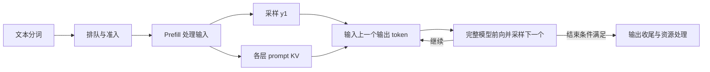
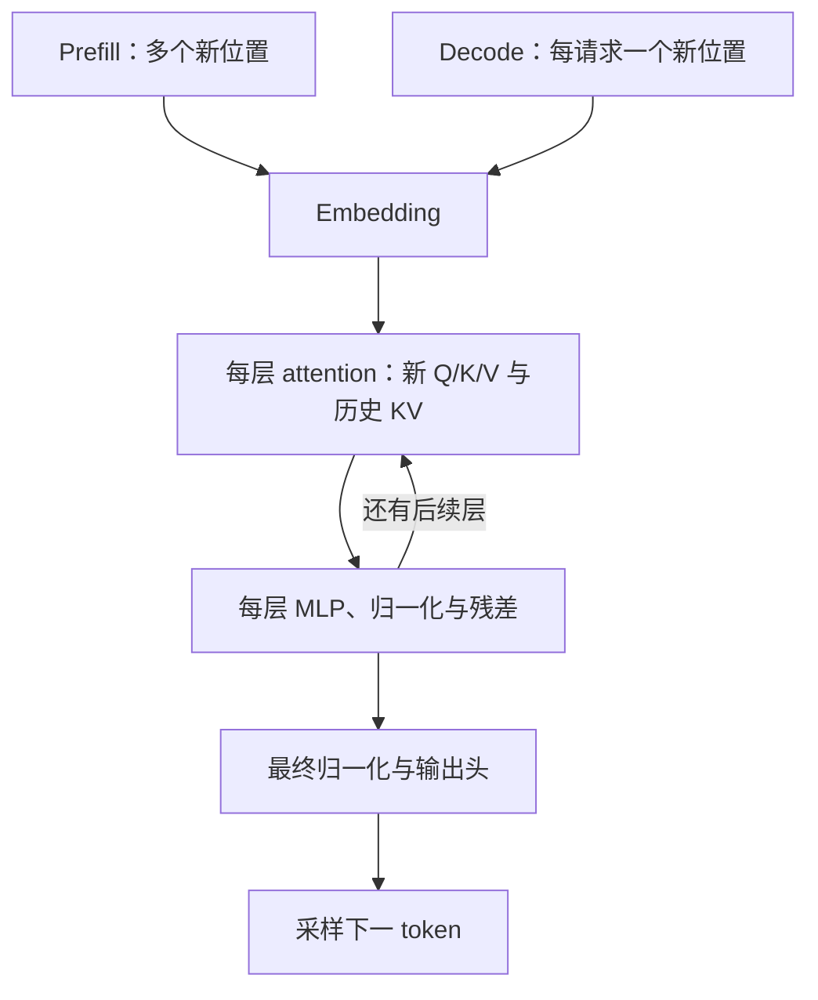
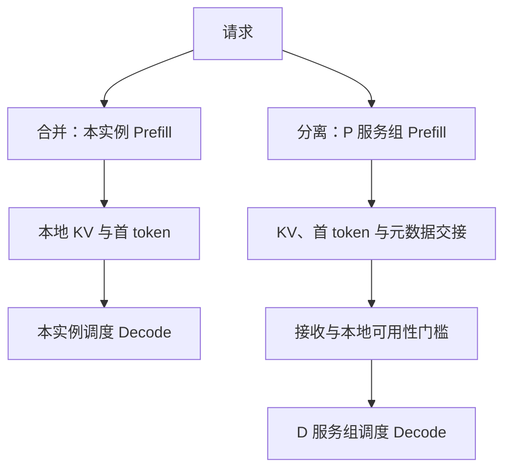

# SGLang 推理全景学习指南

本文是面向初学者的**源码分析型学习资料**，配合 [Pages 推理全景专题](../../pages/sglang/inference-overview/journey.html) 阅读。先看一条请求，再理解模型、缓存、部署和调度；不要求提前认识 rank、kernel 或源码目录。

交互实验的操作区固定在画布上方。拖动画布查看不同位置，使用加减按钮、双指手势或 Ctrl/⌘ + 滚轮缩放；“适应全图”显示整幅图，“重置”回到原尺寸起点。手机默认按原尺寸显示以保留文字可读性。画布获得焦点后，也可用方向键平移、加减键缩放、0 适应全图、1 重置。缩放和拖动仅改变视角，不改变推理状态；按钮和参数仍操作同一份演示状态。

## 0. 阅读基线与范围

| 项目 | 内容 |
| --- | --- |
| 源码仓库 | [sgl-project/sglang](https://github.com/sgl-project/sglang) |
| 分支 | 公开上游 `main` 的固定快照，不声称是最新版本 |
| commit | [`279339f113b79af84f27fd3ac92d0a13bd3f4cbd`](https://github.com/sgl-project/sglang/tree/279339f113b79af84f27fd3ac92d0a13bd3f4cbd) |
| 读取时间 | 2026-09-17 |
| 工作区状态 | 从本地 Git 对象只读提取该提交的文件，不读取当前分支文件作为证据。宿主源码检出含未跟踪的文档、脚本、工作笔记及备份，未清理、切换或修改；Wiki 开始修改前工作区干净 |
| 操作边界 | 固定源码复核与浏览器教学交互验证；没有运行 SGLang 推理、GPU 实验或 benchmark |
| 主线 | 普通自回归文本生成，以 Llama 风格 decoder-only Transformer 为模型例子 |
| 不展开 | 投机解码、多模态 encoder、MLA、滑窗和混合状态模型、故障恢复与完整分布式协议 |

交互图中的 token、层数、轮次和时间由整理者设计，用于解释机制。它们不代表实际分词、模型预测、真实 GPU trace 或 SGLang 的完整调度决策。P/D 分离与 PP 的细节在各自固定版本专题中继续阅读，不将不同基线混写成同一种实现。

| 术语 | 人话解释 |
| --- | --- |
| Token | 模型处理的编号单位，不固定等于一个字或词 |
| Prefill / P | 处理待计算的输入位置，积累 KV，并在最终输入处理后预测首个输出 |
| Decode / D | 通常每条请求每轮处理一个新位置，继续预测下一输出 |
| Transformer 层 | 包含 attention、MLP、归一化、残差等计算的重复单元 |
| KV Cache | attention 为已经处理过的位置保存的 Key / Value，供后续复用 |
| Logits / 采样 | 候选 token 的分数 / 从这些分数选出一个 token 的过程 |
| Batch / Chunk | 一次执行的一组工作 / 一条长输入分批处理的片段 |
| TTFT / ITL | 从发请求到首 token 可见的等待 / 相邻输出 token 的间隔 |

## 1. 一条请求怎样变成回答

**人话版：** 先把文本变成 token，再由调度器接纳，Prefill 读入上下文，Decode 一步步续写。模型不会一次把整个未知回答并行算完。

**图意解读：** P 已产生首个输出；D 反复消费上一输出并生成下一输出。图中的 KV 是跨轮次保留的历史状态，不是最终答案。输出还需反分词和响应发送，采样完成不等于客户端立即可见。

**例子：** 输入有 4 个 token。Prefill 完成时，KV 覆盖这 4 个位置，采样得到 y1；第一次 Decode 输入 y1，KV 增至 5 个位置，采样得到 y2。y2 尚未经历下一次前向，不能把它算进已写入的 KV。

**交互：** [单步请求旅程](../../pages/sglang/inference-overview/journey.html) 可改变输入长度、前进、后退和重置，分别观察输入、输出和 KV。示例固定生成 5 个输出，不包含 chunk 或前缀命中。

## 2. P/D 在 Transformer 中做什么

**人话版：** P 和 D 都执行完整模型，变化的是新位置数量和历史 KV 的使用方式。它们不分别对应 Encoder / Decoder，也不分别对应模型前半层 / 后半层。

**图意解读：** 两个入口汇入同一条模型链。图省略层内部的精确算子顺序；Llama 源码包含 attention 前归一化、attention 后归一化及残差融合。每层使用自己的 KV，采样属于生成流程，并不是另一半 Transformer。

Prefill 将多个位置组成一次前向，但因果遮罩仍限制每个位置只能看到自身与之前的位置。普通 Decode 新增一个位置，它会读历史 KV，同时仍执行 attention 和 MLP。使用 PP 时，只是把这一整条模型链分布到多个 stage；P、D 各自的服务组仍需覆盖所有层。

**交互：** [模型部件与注意力可见性](../../pages/sglang/inference-overview/transformer.html) 切换 P/D，观察位置维度与 attention 遮罩，再选择 Embedding、Attention、MLP 或输出头查看解释。

## 3. KV 留下了什么，省去了什么

**人话版：** 历史位置的 K/V 不必在每轮从头重算，但当前新位置的模型计算仍然要做。相同前缀还可以在不同请求之间复用兼容、可用的缓存。

| 对象 | 内容 | 主要用途与边界 |
| --- | --- | --- |
| 权重 | 模型参数 | 服务加载后用于大量请求，不随每条 PD 请求重传 |
| Hidden states | 当前前向逐层变换的中间结果 | PP 时跨相邻 stage 传递；不是完整历史 KV |
| KV | 已处理位置在每层的 K/V | 后续 attention 使用；PD 时需要向 D 交接对应状态 |
| 请求元数据 | token、状态、映射等控制信息 | 使接收的状态能被正确解释和调度 |

**例子：** 8 个输入位置中前 3 个已命中可用前缀，Prefill 新算剩余 5 个位置；之后两轮 Decode 写入 y1、y2 的 KV，累计输出 y1、y2、y3。每层 KV 覆盖 10 个位置。位置计数不等于实际显存字节数，不同模型与缓存布局可能有很大差别。

**交互：** [前缀复用与 KV 增长](../../pages/sglang/inference-overview/kv-cache.html) 将命中前缀限制为 0–7，保证至少一个待前向位置；假定缓存已在设备上可用。完全命中、页对齐和回载不在模型内。

**排障提示：** 缓存命中不等于零等待。Host 回载、资源准入和批次调度仍可能限制执行。请求结束后，由缓存管理器保留部分可复用状态，也不表示请求还在运行。

## 4. 合并部署与 PD 分离的行为差异

**人话版：** 合并部署由同一个服务组完成 P 和 D，KV 留在本实例继续使用；分离部署由不同服务组接力，需要传输和确认状态。服务组可以是多张卡，并非“一组 = 一张 GPU”。

**图意解读：** 这是一张职责图，不是屏障时序图。真实握手、预分配和分块发送可以与其他步骤交错。控制请求和 KV 数据不必走同一通路，P 的安全释放也不能仅凭“发送已提交”判断。

| 观察点 | 合并部署 | PD 分离 |
| --- | --- | --- |
| 排队 | P/D 工作共享实例资源 | 两侧分别调度，增加交接协调 |
| KV | 本地复用 | D 需要获得可用的对应状态 |
| 首 token | Prefill 后采样 | 本基线普通路径由 P 采样，D 提交 handoff token 后续写 |
| 就绪条件 | 本地缓存、容量与调度约束 | 另有接收、元数据、回载等检查 |
| 收尾 | 本地请求与缓存管理 | 两侧各有请求、传输与资源生命周期 |
| 取舍 | 省跨角色交接 | 隔离负载、独立配比；付出传输与双侧容量成本 |

**交互：** [部署路径对照](../../pages/sglang/inference-overview/deployment.html) 用粗线框表示服务实例：合并部署只有一个框，P、D 共用框内的模型和 KV；分离部署有 P、D 两个框，各自加载模型、持有本地状态，框间箭头展示 KV、首 token 和元数据的交接。可以切换每实例 1/2 张 GPU，直观看到 GPU 数量和实例数量是两回事；实例边界也不等于物理服务器边界。

单步推进可以看到 P 写入 KV、D 接收状态、D 读取并追加 KV。取消 KV、元数据和本地资源三个教学条件中的任一个，D 保持等待而不会显示已经执行。这三类是整理者归纳，不是一组与源码一一对应的布尔变量。图中 GPU 数量不用于等成本性能比较，P 侧保留的状态也不是对实际传输收尾与释放时机的模拟。

**排障提示：** KV 到达并不等于马上可执行。固定基线的 Decode 接收路径包含 metadata gate，传输成功后还可能等待 HiCache restore，之后也要进入调度。PD 分离是否更快，需结合排队、传输、模型和资源配比测量。

## 5. 调度、分块与用户看到的延迟

**人话版：** Batch 把多个请求的工作合起来算；Chunk 把一个长输入拆成多轮。Continuous Batching 允许成员随执行进展变化，并不意味着每轮都选同一组请求。

**交互一：** [分块与交错轮次](../../pages/sglang/inference-overview/scheduling.html) 固定 A 正在 Decode、B 有 8 个新位置，演示允许 mixed chunk 的场景：每轮给 A 一个 Decode 位置，再给 B 一个 chunk。真实策略还受预算、缓存、优先级、并行模式与配置约束，不把这份脚本当作 SGLang 调度器复刻。

B 的中间 chunk 只积累状态；本例最后一个 chunk 才采样首个输出。小 chunk 增加交错机会，也增加轮数和开销，因此不能仅从轮次数推出更好的 TTFT 或 ITL。

**交互二：** 同页的延迟实验固定 4 个输出，参数全部人为设定：

- 首 token 在排队、Prefill 和额外等待之后可见：`TTFT = 排队 + Prefill + 额外等待`。
- 再进行 3 轮等时长 Decode：`总时长 = TTFT + 3 × Decode 单步时间`。
- 在这个简化模型里：`平均 TPOT = (总时长 − TTFT) / (4 − 1)`。

这些公式是模型假设下的串行加法；额外等待可以用于理解交接或响应延后，不宣称真实 PD 总把整段交接时间计入 TTFT。模型忽略重叠、网络波动、客户端缓冲和一次流式事件含多个 token 等情况。不能用它预测真实速度。

## 6. 源码阅读地图

下列行为已对固定提交的文件逐项核对。未运行推理，浏览器交互验证只证明教学页面能按设定响应。

| 行为 | 固定源码入口 |
| --- | --- |
| 按未复用的输入部分准备 EXTEND | [`schedule_batch.py::prepare_for_extend`](https://github.com/sgl-project/sglang/blob/279339f113b79af84f27fd3ac92d0a13bd3f4cbd/python/sglang/srt/managers/schedule_batch.py#L2678) |
| 准备普通 Decode 批次 | [`schedule_batch.py::prepare_for_decode`](https://github.com/sgl-project/sglang/blob/279339f113b79af84f27fd3ac92d0a13bd3f4cbd/python/sglang/srt/managers/schedule_batch.py#L3470) |
| 当前层 attention 的新 Q/K/V | [`llama.py::LlamaAttention.forward`](https://github.com/sgl-project/sglang/blob/279339f113b79af84f27fd3ac92d0a13bd3f4cbd/python/sglang/srt/models/llama.py#L239) |
| 同一层内的 attention 与 MLP | [`llama.py::LlamaDecoderLayer.forward`](https://github.com/sgl-project/sglang/blob/279339f113b79af84f27fd3ac92d0a13bd3f4cbd/python/sglang/srt/models/llama.py#L340) |
| Embedding、所有本级层、跨 PP 激活和最终 norm | [`llama.py::LlamaModel.forward`](https://github.com/sgl-project/sglang/blob/279339f113b79af84f27fd3ac92d0a13bd3f4cbd/python/sglang/srt/models/llama.py#L418) |
| 最后一级 logits 处理 | [`llama.py::LlamaForCausalLM.forward`](https://github.com/sgl-project/sglang/blob/279339f113b79af84f27fd3ac92d0a13bd3f4cbd/python/sglang/srt/models/llama.py#L562) |
| P 记录首 token | [`prefill.py` 输出处理](https://github.com/sgl-project/sglang/blob/279339f113b79af84f27fd3ac92d0a13bd3f4cbd/python/sglang/srt/disaggregation/prefill.py#L840) |
| D 提交 P 生成的 token | [`decode.py::_commit_transfer_to_req`](https://github.com/sgl-project/sglang/blob/279339f113b79af84f27fd3ac92d0a13bd3f4cbd/python/sglang/srt/disaggregation/decode.py#L2256) |
| metadata gate 与回载检查 | [`decode.py::_poll_with_metadata_gate`](https://github.com/sgl-project/sglang/blob/279339f113b79af84f27fd3ac92d0a13bd3f4cbd/python/sglang/srt/disaggregation/decode.py#L2332)、[Success 分支](https://github.com/sgl-project/sglang/blob/279339f113b79af84f27fd3ac92d0a13bd3f4cbd/python/sglang/srt/disaggregation/decode.py#L2445) |
| 选择下一批与更新运行批次 | [`scheduler.py::get_next_batch_to_run`](https://github.com/sgl-project/sglang/blob/279339f113b79af84f27fd3ac92d0a13bd3f4cbd/python/sglang/srt/managers/scheduler.py#L3602)、[`update_running_batch`](https://github.com/sgl-project/sglang/blob/279339f113b79af84f27fd3ac92d0a13bd3f4cbd/python/sglang/srt/managers/scheduler.py#L4141) |

## 7. 自测与下一步

完成五节后，试着不看源码回答：

1. 为什么 Prefill 完成时已有 y1，但没有 y1 的 KV？
2. 为什么 Decode 仍然要执行所有 Transformer 层？
3. P→D 的 KV 与 PP 层间的 hidden states 有什么不同？
4. 为什么 KV 接收成功仍可能无法开始 Decode？
5. 为什么更小的 chunk 不能保证所有延迟指标都下降？

接着按目标选择，不必把所有资料当成必修：

- **主线：** [请求、调度与执行主链](README.md)，继续阅读调度总览与请求生命周期。
- **部署深入：** [分离部署与状态交接](../disaggregation/README.md)；Pages 的 [PD Prefill 请求生命周期](../../pages/sglang/pd-prefill-lifecycle/index.html) 进一步展示握手、PP 和释放。
- **缓存深入：** [前缀缓存与分层存储](../kv-cache/README.md)。
- **源码课程：** [架构导读](../source-study/architecture/README.md)，分别核对其固定版本。

核心认识：完整模型负责算下一个 token，KV 帮助复用历史，调度决定何时执行，PD 分离改变工作与状态所在的位置。
