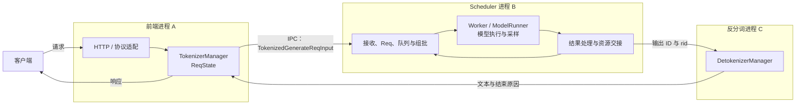
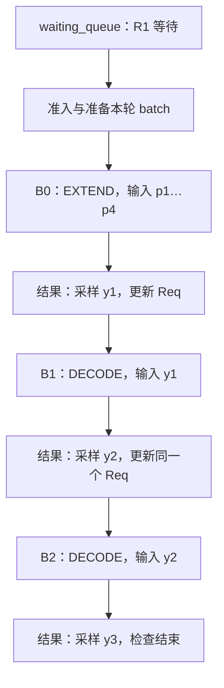
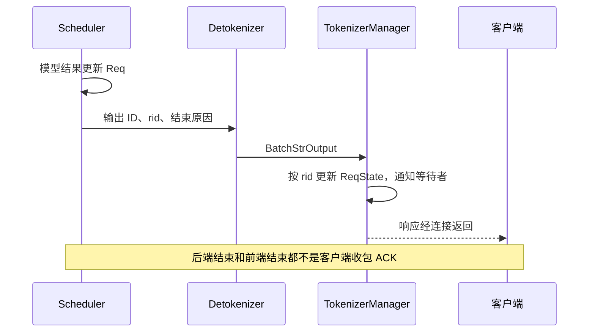
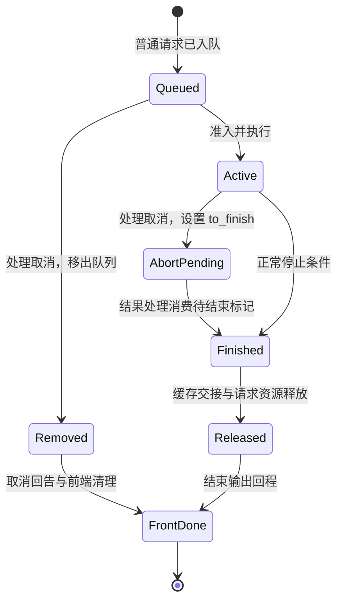

# SGLang 普通请求运行时与资源生命周期学习文档

本文是**源码分析型学习资料**，面向已理解 Prefill / Decode、但还不清楚运行时进程与对象分工的初学者。沿一条普通文本请求 R1，解释入站、排队、执行、输出、取消和资源交接。

[打开交互课程](../../pages/sglang/request-runtime/index.html) · [运行时学习导航](README.md)

## 0. 阅读基线与范围

| 项目 | 内容 |
| --- | --- |
| 源码仓库 | [sgl-project/sglang](https://github.com/sgl-project/sglang) |
| 分支 | 公开上游 `main` 的固定快照，不声称为阅读日最新版本 |
| commit | [`279339f113b79af84f27fd3ac92d0a13bd3f4cbd`](https://github.com/sgl-project/sglang/tree/279339f113b79af84f27fd3ac92d0a13bd3f4cbd) |
| 读取时间 | 2026-09-23 |
| 工作区状态 | 源码检出目录存在原有未跟踪文件；使用 `git show <commit>:<path>` 读取固定 Git 对象，未读取这些未跟踪文件作为依据，未切换或修改源码工作区 |
| 操作边界 | 静态源码分析、教学状态模型与浏览器交互验证；未启动 SGLang、GPU 推理、IPC 或性能实验 |
| 主线 | Python HTTP、一个 tokenizer worker、一个 detokenizer worker、TP=1、PP=1、非 PD、普通自回归文本生成、非重叠调度 |
| 图中资源假设 | 4 个输入位置、无已有前缀命中；普通 Radix Cache、`page_size=1`、允许完成插入、无其他请求持有者；不含投机和特殊状态缓存 |
| 不展开 | Rust 前端、多 worker 路由、多卡、Chunked Prefill、Overlap、PD、grammar 队列、LoRA 与多模态资源退役 |

**证据约定：** 下文 `[S编号]` 指向本次复核的固定提交。图中步骤名、R1、B0/B1、p1/y1 是教学标签，不是源码枚举、真实 token ID 或真实 trace。仓内旧资料提供阅读组织和交叉入口，保留各自版本，不把旧锚点改称本次实现。

| 术语 | 人话解释 |
| --- | --- |
| rid | 把不同位置的消息与状态关联到同一请求的标识 |
| IPC | 进程间的消息通路；不等于公开 HTTP 接口 |
| ReqState | 前端的请求关联、输出累计与等待状态 |
| Req | 调度侧贯穿多轮的请求进度与资源状态 |
| batch | 本轮要共同执行的输入与元数据视图 |
| 请求行 / 槽位 | 请求到 token/KV 位置映射所需的行，不是所有 KV 本体 |
| KV | 已经过模型的输入位置留下的 Attention 状态 |
| 前缀缓存 | 保存可复用的有效前缀及其资源引用；生命周期可能长于请求 |

## 1. 先分清进程，再看一条请求

**人话版：** 前端像接单与回访台，Scheduler 像车间调度员，执行组件负责实际计算，Detokenizer 负责把数字结果翻译成文本。它们按职责合作，但不一定每个名字都对应独立进程。

本篇配置下，`Engine._launch_subprocesses` 在主进程初始化 TokenizerManager，启动 Scheduler 和 Detokenizer 子进程；多 worker 与 Rust 服务另有分支。[S01]

**图意解读：** Worker / ModelRunner 画在 Scheduler 进程内；GPU 是该进程提交执行的设备，不是另一个 HTTP 服务。R → S 表示未结束请求继续参与调度，输出回程可以与后续计算交错。箭头长度不代表延迟。[S01][S04][S05][S06]

## 2. 输入：同一个 rid 为什么有三种请求对象

前端 `generate_request` 先归一化参数、建立请求状态，经过暂停条件和模型更新读锁，再分词、验证、创建 tokenized 对象并派发，随后等待响应。[S02]

| 阶段 | 对象 | 所有者与含义 |
| --- | --- | --- |
| 外部意图 | `GenerateReqInput` | 前端协议层；文本/ID 与生成参数 |
| 结果关联 | `ReqState` | TokenizerManager；持续等待并累计响应，不整体交给 Scheduler |
| 进程交接 | `TokenizedGenerateReqInput` | 前端构造消息；包含 rid、输入 ID、采样参数等 |
| 调度状态 | `Req` | Scheduler 接收后创建；贯穿排队、Prefill、Decode 与结束 |

`_send_one_request` 调用派发后执行 `_mark_state_dispatched`。它是前端记录的发送边界，没有在这里等待 Scheduler 的“已执行”ACK。不能用 `dispatched=true` 替代后端接收、准入或 GPU 开始计算的证据。[S03]

**例子：** R1 文本被编码成 p1…p4。消息被派发时，前端已经有 ReqState，但调度侧未必已经构造 Req。两个进程最终都使用 rid=R1，并不意味着它们共享同一个 Python 对象。

输入验证失败也是完整路径的一部分：`generate_request` 异常处理区分未派发与已派发状态。前者可清理本地登记，后者需要触发下游取消，不能把所有异常都当作“删除本地字典就够了”。[S02]

## 3. 排队与执行：请求是工单，batch 是工作单

普通非 PD 路径通过相关检查后，`_add_request_to_queue` 将 Req 放入 `waiting_queue`。这里仍可能被队列上限拒绝，不能把构造 Req 与成功排队画成必然同一动作。[S04]

`event_loop_normal` 的主线是：接收入站 → 选取下一批 → 执行 → 处理结果。选批需要考虑缓存与资源等条件；进入等待队列不表示本轮一定执行。[S05]

**图意解读：** 假设三个输出后结束，无分块、前缀命中、投机或提前 stop。Req 身份持续存在，batch 是不断变化的执行视图。B0/B1/B2 是教学轮次，并不承诺源码每轮必须分配三个全新的独立 Python 对象。[S05][S06]

`ScheduleBatch` 表达调度视图；Worker 通过 `ForwardBatch.init_new` 准备执行视图，随后进入 ModelRunner。两个视图也不表示复制两份全部模型或 KV 数据。[S06]

### 3.1 为什么最后一个输出还没有 KV

| forward | 输入位置 | 采样输出 | 计算过的 KV 位置总数 |
| --- | --- | --- | --- |
| Prefill | p1…p4 | y1 | 4 |
| Decode 1 | y1 | y2 | 5 |
| Decode 2 | y2 | y3 | 6 |

y3 被预测出来后就结束，没有作为下一轮输入。因此“4 个输入 + 3 个输出”并不等于本例拥有 7 个 KV 位置。交互页允许改变输出上限，再核对这个不变量。

## 4. 输出：算出来、前端结束、客户端收到是不同边界

`DetokenizerManager.handle_batch_token_id_out` 解码 ID，构造携带 rid、结束原因和输出文本等字段的 `BatchStrOutput`。TokenizerManager 再按 rid 找到 ReqState，更新输出与结束状态、移除完成的关联项并通知等待者。[S07][S08]

**图意解读：** 输出是独立回程，不是模型函数直接向客户端写字符串。真实流式消息可能合并多个 token，反分词还要维护上下文；不要把动画每步理解成一个网络包。

互动页为方便观察，把“首段输出已回传”放在下一轮 Decode 之前。真实系统中的网络回程和后续计算可以交错，这里没有建立全系统时钟，更没有计算 TTFT。

## 5. 取消：从请求所在位置决定收尾路径

### 5.1 前端发送取消，不等于后端已经取消

TokenizerManager `abort_request` 构造并派发 `AbortReq`，用 `abort_sent` 避免同一状态重复派发。发送失败会撤销该标记。这个标记没有证明远端已经清理资源。[S09]

### 5.2 等待队列：普通尚未执行请求

Scheduler 从等待队列移除符合条件的请求，执行相应退役处理，并发送取消回告，让前端清理状态。普通尚未执行的本例没有请求槽位和 KV；PD Decode 的等待请求则可能已经分配 KV，源码中有额外释放分支。[S10]

取消回告走 TokenizerManager 的 `_handle_abort_req`；它和正常生成输出的 `_handle_batch_output` 是不同入口。不能为了把图画成一条直线，就删掉这条控制回程。[S14]

### 5.3 运行中：待结束标记与结束原因分开

Scheduler 对在途 Req 设置 `to_finish = FINISH_ABORT(...)`。`Req.finished()` 只检查 `finished_reason`；`update_finish_state` 消费 `to_finish` 后才推进正式结束状态。[S10][S11]

**图意解读：** 这是普通主线的教学状态图，不是源码枚举。等待队列直接取消不必先把同一 Req 走完整的 `finished_reason` 路径。运行取消也不能通过远端消息立即抢占正在执行的 GPU kernel。[S10][S11][S12]

交互场景固定在首段输出之后发送运行取消，并画出一次后续 Decode 和结果收尾。额外结果究竟向客户端返回多少文字，不在此状态模型中模拟；Overlap、投机、PP、PD 的在途数量和退役条件必须另外分析。

## 6. 资源：请求结束不等于缓存清空

若输出上限为 1，Prefill 结果处理就可能结束并释放资源；本例三输出路径中，普通 Decode 结果处理更新输出 ID、调用 `update_finish_state`；结束分支进入资源释放。`release_kv_cache` 先交给 `cache_finished_req` 处理有效 KV，再处理额外分配，并释放请求映射行。[S12][S13]

| 资源 | 本例结束时 | 不能误解为 |
| --- | --- | --- |
| 请求映射行 | 释放，R1 不再持有 | 所有 KV 数据都必须同时归还 |
| 有效 KV，允许前缀缓存插入 | 可由缓存保留，之后参与复用或驱逐 | 免费、不占内存，或永久保留 |
| 有效 KV，缓存禁用 | 按本例条件归还分配器 | 对物理显存逐字节清零 |
| 输出文本与前端状态 | 回程按请求完成与清理 | 客户端已经成功收到最终网络事件 |

**图意解读：** 交互页将“请求使用的 KV”和“缓存接管的 KV”放在资源面板的两行中。为避免重复计算，只用一个 R1、无既有共享前缀、`page_size=1`，每个有效位置在演示中只归属于一行。真实 Radix Cache 有共享引用、重复插入与页对齐边界，不等于本图的完整资源账本。[S13]

在默认 3 输出示例，缓存开启时，最终请求槽位为“未持有”，缓存接管 6 个位置；关闭缓存时，两个数量都归零。两种结果都符合“请求已经完成”，但可用内存和后续复用行为不同。

## 7. 初学者排障地图

| 现象 | 先找哪段证据 | 继续查什么 |
| --- | --- | --- |
| HTTP 已接收，一直无输出 | 前端预处理与派发，随后 Scheduler 接收入队 | 输入验证、前端异常、暂停条件、IPC 与队列 |
| 已排队，但没有执行 | batch 准入与资源预算 | 等待顺序、请求槽位、KV 预算和模式约束 |
| GPU 有计算，客户端没字 | 结果消费 → 反分词 → 按 rid 关联 → 响应连接 | 停止条件、输出批量与流式配置、回程错误、断连 |
| 已取消，资源仍占用 | 取消是否被后端处理，是否经过结果收尾 | 在途工作、待结束标记、资源持有者 |
| 请求已结束，显存没显著下降 | 区分请求行与缓存保留 | 缓存占用、分配器行为、其他请求，而非立即断言泄漏 |

这些是调查顺序，不是单条日志的根因判定。本文没有运行服务，因此没有把任何现象证明为生产故障原因。

## 8. 源码阅读路线与自测

建议顺序：启动装配 → 前端 `generate_request` → 派发与后端 `handle_generate_request` → 队列与主循环 → Worker → 结果处理 → 输出回程 → 两条取消路径 → 缓存交接。

| 编号 | 本次核对的位置 | 观察点 |
| --- | --- | --- |
| S01 | [engine.py::_launch_subprocesses](https://github.com/sgl-project/sglang/blob/279339f113b79af84f27fd3ac92d0a13bd3f4cbd/python/sglang/srt/entrypoints/engine.py#L1051) | Python / Rust 与进程启动分支 |
| S02 | [tokenizer_manager.py::generate_request](https://github.com/sgl-project/sglang/blob/279339f113b79af84f27fd3ac92d0a13bd3f4cbd/python/sglang/srt/managers/tokenizer_manager.py#L797) | 建立状态、准备输入、等待输出、失败清理 |
| S03 | [tokenizer_manager.py::_send_one_request](https://github.com/sgl-project/sglang/blob/279339f113b79af84f27fd3ac92d0a13bd3f4cbd/python/sglang/srt/managers/tokenizer_manager.py#L1592) | 派发后登记 dispatched |
| S04 | [scheduler.py::handle_generate_request](https://github.com/sgl-project/sglang/blob/279339f113b79af84f27fd3ac92d0a13bd3f4cbd/python/sglang/srt/managers/scheduler.py#L2740)；[_add_request_to_queue](https://github.com/sgl-project/sglang/blob/279339f113b79af84f27fd3ac92d0a13bd3f4cbd/python/sglang/srt/managers/scheduler.py#L3233) | 构造 Req、普通与 PD 的分路 |
| S05 | [scheduler.py::event_loop_normal](https://github.com/sgl-project/sglang/blob/279339f113b79af84f27fd3ac92d0a13bd3f4cbd/python/sglang/srt/managers/scheduler.py#L1907) | 接收、选批、执行、处理结果 |
| S06 | [tp_worker.py::forward_batch_generation](https://github.com/sgl-project/sglang/blob/279339f113b79af84f27fd3ac92d0a13bd3f4cbd/python/sglang/srt/managers/tp_worker.py#L593) | 准备 ForwardBatch 并调用 ModelRunner |
| S07 | [detokenizer_manager.py::handle_batch_token_id_out](https://github.com/sgl-project/sglang/blob/279339f113b79af84f27fd3ac92d0a13bd3f4cbd/python/sglang/srt/managers/detokenizer_manager.py#L443) | ID 转文本，保留请求关联与结束原因 |
| S08 | [tokenizer_manager.py::_handle_batch_output](https://github.com/sgl-project/sglang/blob/279339f113b79af84f27fd3ac92d0a13bd3f4cbd/python/sglang/srt/managers/tokenizer_manager.py#L2255) | 结果关联、前端 finished 与状态清理 |
| S09 | [tokenizer_manager.py::abort_request](https://github.com/sgl-project/sglang/blob/279339f113b79af84f27fd3ac92d0a13bd3f4cbd/python/sglang/srt/managers/tokenizer_manager.py#L2024) | 发送取消与 abort_sent |
| S10 | [scheduler.py::abort_request](https://github.com/sgl-project/sglang/blob/279339f113b79af84f27fd3ac92d0a13bd3f4cbd/python/sglang/srt/managers/scheduler.py#L5257) | 队列移除与在途 to_finish |
| S11 | [schedule_batch.py::update_finish_state](https://github.com/sgl-project/sglang/blob/279339f113b79af84f27fd3ac92d0a13bd3f4cbd/python/sglang/srt/managers/schedule_batch.py#L1889)；[finished](https://github.com/sgl-project/sglang/blob/279339f113b79af84f27fd3ac92d0a13bd3f4cbd/python/sglang/srt/managers/schedule_batch.py#L1526) | 待结束标记与正式结束条件 |
| S12 | [process_batch_result_prefill](https://github.com/sgl-project/sglang/blob/279339f113b79af84f27fd3ac92d0a13bd3f4cbd/python/sglang/srt/managers/scheduler_components/batch_result_processor.py#L257)；[batch_result_processor.py::process_batch_result_decode](https://github.com/sgl-project/sglang/blob/279339f113b79af84f27fd3ac92d0a13bd3f4cbd/python/sglang/srt/managers/scheduler_components/batch_result_processor.py#L920)；[_handle_finish_state_updated_req](https://github.com/sgl-project/sglang/blob/279339f113b79af84f27fd3ac92d0a13bd3f4cbd/python/sglang/srt/managers/scheduler_components/batch_result_processor.py#L1256) | 结果消费、结束后资源释放 |
| S13 | [common.py::release_kv_cache](https://github.com/sgl-project/sglang/blob/279339f113b79af84f27fd3ac92d0a13bd3f4cbd/python/sglang/srt/mem_cache/common.py#L254)；[radix_cache.py::cache_finished_req](https://github.com/sgl-project/sglang/blob/279339f113b79af84f27fd3ac92d0a13bd3f4cbd/python/sglang/srt/mem_cache/radix_cache.py#L479) | 有效 KV 交接、页对齐、重复资源与请求行释放 |
| S14 | [tokenizer_manager.py::_handle_abort_req](https://github.com/sgl-project/sglang/blob/279339f113b79af84f27fd3ac92d0a13bd3f4cbd/python/sglang/srt/managers/tokenizer_manager.py#L3281) | 等待队列取消的前端回告处理 |

**自测：** 前端 dispatched 为什么不证明 GPU 在运行？R1 进入三个 batch 后是不是三条请求？最后一个输出为何没有 KV？取消发出后为什么不能立即复用所有资源？请求结束后缓存为何还能保留有效 KV？先在纸上预测，再用交互页单步核对。

## 9. 与仓内既有资料衔接

- 起步：[SGLang 推理全景学习指南](SGLang%20推理全景学习指南.md)，先理解模型计算与输出位置。
- 主线：[请求对象与生命周期全景](../source-study/architecture/03-请求对象与生命周期全景.md)，沿请求、执行和资源三个视角深入。
- 深入：[Tokenizer 与进程间消息通路](../source-study/02-request-lifecycle/02-Tokenizer与进程间消息通路.md)，拆开 API batch、分词 batch、IPC batch 与 GPU batch。
- 深入：[完成取消与资源释放](../source-study/02-request-lifecycle/06-完成取消与资源释放.md)，扩展到更多分支和异常边界。
- 后续：[调度器请求生命周期与重叠调度](SGLang%20调度器请求生命周期与重叠调度学习文档.md)，在本篇非重叠主线之上理解结果与执行交错。

这些资料分别保留其来源、固定提交和验证边界。本篇是新的入门桥接与固定快照复核，不替换原有深入章节。
