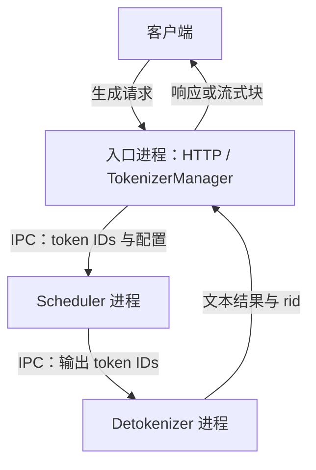
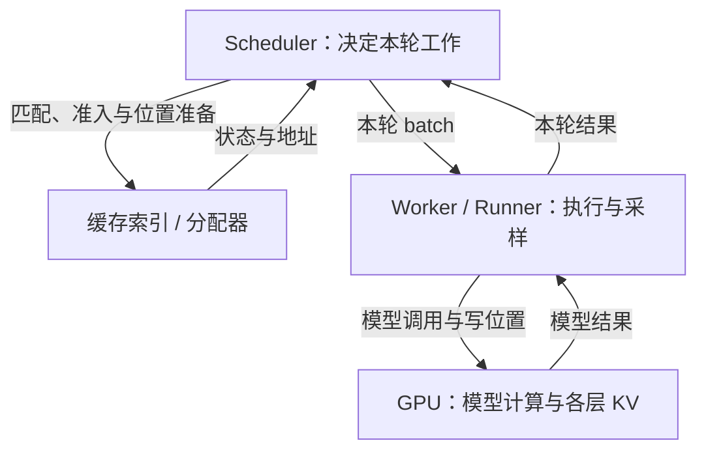

# SGLang 系统边界与学习地图学习文档

先沿一条请求找到组件，再区分图中的框究竟是职责、进程、设备资源，还是模型副本。本篇连接 Pages 的十二模块；各深入资料保留自己的固定源码基线。

[交互课程：推理系统里，哪些边界不能混在一起？](https://asher-xunzhang.github.io/ai-infra-wiki/sglang/system-overview/) · [本领域路线](README.md)

## 0. 源码基线与范围

本文是源码分析型学习资料。主线采用普通 Python HTTP、单 tokenizer、单卡合并部署、无 overlap 的文本生成；拓扑图另设 TP=2、DP=2 或 P/D 两侧各单卡的独立配置。

| 项目 | 内容 |
| --- | --- |
| 公开仓库 | [sgl-project/sglang](https://github.com/sgl-project/sglang) |
| 分支与 commit | 公开上游 `main` 快照：[279339f113b79af84f27fd3ac92d0a13bd3f4cbd](https://github.com/sgl-project/sglang/tree/279339f113b79af84f27fd3ac92d0a13bd3f4cbd) |
| 读取时间 | 2026-09-23 |
| 工作区状态 | 只读本地 Git 固定对象；当前检出分支与本文快照分开，原有未跟踪文件保留。 |
| 操作边界 | 静态源码分析、教学模型和页面验证；未运行模型、GPU、网络或性能实验。 |
| 教学设定 | 两个输入位置 p0/p1、一个首输出 y1；拓扑图用三层代表权重。不是实际 tokenization、模型预测或部署配置。 |
| 不展开 | 多 tokenizer、Ray、Rust runtime、全部并行组合、特殊模型、错误恢复及完整协议。 |

先修：[一条请求怎样产生 token](https://asher-xunzhang.github.io/ai-infra-wiki/sglang/inference-overview/journey.html)。

## 1. 服务路径：先数进程，再追踪载荷

普通启动路径把 TokenizerManager 放在主进程，另起 Scheduler 与 Detokenizer。HTTP handler 使用前端 manager 提供的结果生成响应。这里画的是所选路径的主要进程，不是所有启动配置的完整进程树。

服务实例可以含多个进程，也可以含多张 GPU。反过来，一个职责名也不一定对应独立进程：单卡示例中的 Worker 和 ModelRunner 由 Scheduler 进程内调用，不是另外两个必须经过的网络服务。

请求经历的载荷也在变化：原始输入、内部请求、模型执行输入、输出 ID、文本结果和网络块不能互换。一个流式块可能携带多个 token 的结果；不能从网络块数倒推出模型 forward 次数。

交互中先改变“已采样”，最后才改变“客户端可见”。这是因果边界示意，假设连接正常；不要求后续计算必须等前一段文字完全返回后才继续。

## 2. 实例内部：职责协作与设备资源

这张图画职责与资源，不能再把四个框数成四个进程。GPU 内存不是另一个服务器；主机对象管理设备 buffer，并组织实际设备计算。

Scheduler 先选出本轮工作，准备输入与地址。缓存索引回答能复用什么，分配器提供可写位置，模型层实际写入 K/V。能够写一个位置与决定何时释放它，是不同职责。

本例 Prefill 处理 p0、p1，写下这两个位置在各层的 KV；模型给出分数，再采样 y1。y1 尚未再次作为输入，所以它还没有自己的 KV。之后 Scheduler 消费结果，决定继续、结束或进入其他分支。

Worker、Runner、模型层、Attention backend 和 kernel 之间还有更细的调用关系，见[执行分层与硬件机制](SGLang 执行分层与硬件机制学习文档.md)。本图不把它们都铺在主画面上。

## 3. 两张卡，不一定是两个完整副本

页面分别展示三种独立拓扑：

- **TP=2：** 同一副本的可切分矩阵分给两个 rank 协作；各 rank 仍参与模型各层的计算。图中半块只代表一个可切分矩阵，不能推导所有参数、Norm 或激活都刚好减半。
- **DP=2、每副本 TP=1：** controller 为每个请求选择一个执行副本。本例用 round-robin 将 R1、R2 分给不同副本；两者共享服务入口，但分别调度并持有本地请求状态。显式分派和失效副本的规则不在图中。
- **P/D 各单卡：** 两个服务角色接力处理同一请求，两侧都覆盖完整模型。P 侧做 Prefill，D 侧续写，需要交接 KV、首输出与配对等状态；不是把模型前半层与后半层分给 P、D。

这三个维度不能只用“卡数”概括。并行还包括 PP、EP、CP，它们切分的对象不同；详细数学与通信关系见[并行课程](https://asher-xunzhang.github.io/ai-infra-wiki/sglang/parallelism/)。多 rank 情况下也要重新核对 Scheduler 参与者和进程外框，不能照搬单卡进程图。

## 4. 用边界选择学习模块

| 当前问题 | 对应模块 | 要追踪的证据 |
| --- | --- | --- |
| 请求进入后为什么没回答 | [02 请求运行时](https://asher-xunzhang.github.io/ai-infra-wiki/sglang/request-runtime/) → [10 服务治理](https://asher-xunzhang.github.io/ai-infra-wiki/sglang/serving-operations/) → [11 性能分析](https://asher-xunzhang.github.io/ai-infra-wiki/sglang/performance-engineering/) | 最后完成的交接、就绪/准入状态、指标计时边界。 |
| 谁决定本轮算哪些位置 | [05 调度](https://asher-xunzhang.github.io/ai-infra-wiki/sglang/scheduling/) → [03 执行](https://asher-xunzhang.github.io/ai-infra-wiki/sglang/model-execution/) | 候选列表、预算、执行输入与返回结果。 |
| 历史状态存在哪里 | [04 KV 与内存](https://asher-xunzhang.github.io/ai-infra-wiki/sglang/kv-memory/) → [09 模型与生成](https://asher-xunzhang.github.io/ai-infra-wiki/sglang/advanced-generation/) | 地址映射、共享保护、检查点与提交语义。 |
| 跨卡或跨实例传什么 | [06 并行](https://asher-xunzhang.github.io/ai-infra-wiki/sglang/parallelism/) → [07 通信](https://asher-xunzhang.github.io/ai-infra-wiki/sglang/communication/) → [08 分离部署](https://asher-xunzhang.github.io/ai-infra-wiki/sglang/inference-overview/deployment.html) | 切分对象、通信组、数据就绪与资源退役。 |
| 怎样验证机制判断 | [12 综合实践](https://asher-xunzhang.github.io/ai-infra-wiki/sglang/pd-prefill-pp-loop/quick.html) | 预测、单变量变化、固定源码与真实运行验证的边界。 |

这些链接组织阅读关系，不合并所有页面的源码版本，也不保证所有特性可以任意同时启用。

## 5. 固定源码入口

以下路径相对于公开 SGLang 仓库，均固定到本文 commit。

| 行为 | 入口 |
| --- | --- |
| 普通进程启动关系 | [`Engine._launch_subprocesses`](https://github.com/sgl-project/sglang/blob/279339f113b79af84f27fd3ac92d0a13bd3f4cbd/python/sglang/srt/entrypoints/engine.py#L1051) |
| HTTP 请求与流式响应 | [`generate_request`](https://github.com/sgl-project/sglang/blob/279339f113b79af84f27fd3ac92d0a13bd3f4cbd/python/sglang/srt/entrypoints/http_server.py#L911) |
| 前端派发内部请求 | [`TokenizerManager._send_one_request`](https://github.com/sgl-project/sglang/blob/279339f113b79af84f27fd3ac92d0a13bd3f4cbd/python/sglang/srt/managers/tokenizer_manager.py#L1592) |
| 选批、执行、结果消费 | [`Scheduler.event_loop_normal`](https://github.com/sgl-project/sglang/blob/279339f113b79af84f27fd3ac92d0a13bd3f4cbd/python/sglang/srt/managers/scheduler.py#L1907) |
| 输入与地址准备 | [`ScheduleBatch.prepare_for_extend`](https://github.com/sgl-project/sglang/blob/279339f113b79af84f27fd3ac92d0a13bd3f4cbd/python/sglang/srt/managers/schedule_batch.py#L2678) |
| 执行与采样调用 | [`TpModelWorker.forward_batch_generation`](https://github.com/sgl-project/sglang/blob/279339f113b79af84f27fd3ac92d0a13bd3f4cbd/python/sglang/srt/managers/tp_worker.py#L593) |
| 每层 KV 写入 | [`MHATokenToKVPool.set_kv_buffer`](https://github.com/sgl-project/sglang/blob/279339f113b79af84f27fd3ac92d0a13bd3f4cbd/python/sglang/srt/mem_cache/memory_pool.py#L2526) |
| Prefill 结果处理 | [`process_batch_result_prefill`](https://github.com/sgl-project/sglang/blob/279339f113b79af84f27fd3ac92d0a13bd3f4cbd/python/sglang/srt/managers/scheduler_components/batch_result_processor.py#L257) |
| 输出 ID 转成文本结果 | [`DetokenizerManager.handle_batch_token_id_out`](https://github.com/sgl-project/sglang/blob/279339f113b79af84f27fd3ac92d0a13bd3f4cbd/python/sglang/srt/managers/detokenizer_manager.py#L443) |
| 前端处理返回结果 | [`TokenizerManager._handle_batch_output`](https://github.com/sgl-project/sglang/blob/279339f113b79af84f27fd3ac92d0a13bd3f4cbd/python/sglang/srt/managers/tokenizer_manager.py#L2255) |
| TP 矩阵分片计算 | [`ColumnParallelLinear.forward`](https://github.com/sgl-project/sglang/blob/279339f113b79af84f27fd3ac92d0a13bd3f4cbd/python/sglang/srt/layers/linear.py#L492)、[`RowParallelLinear.forward`](https://github.com/sgl-project/sglang/blob/279339f113b79af84f27fd3ac92d0a13bd3f4cbd/python/sglang/srt/layers/linear.py#L1612) |
| DP 启动与轮询分派 | [`launch_dp_schedulers`](https://github.com/sgl-project/sglang/blob/279339f113b79af84f27fd3ac92d0a13bd3f4cbd/python/sglang/srt/managers/data_parallel_controller.py#L371)、[`round_robin_scheduler`](https://github.com/sgl-project/sglang/blob/279339f113b79af84f27fd3ac92d0a13bd3f4cbd/python/sglang/srt/managers/data_parallel_controller.py#L767) |
| D 侧提交交接状态 | [`_commit_transfer_to_req`](https://github.com/sgl-project/sglang/blob/279339f113b79af84f27fd3ac92d0a13bd3f4cbd/python/sglang/srt/disaggregation/decode.py#L2158) |

## 6. 自测与下一步

面对一个框，先回答它是职责、进程、资源还是副本；面对一根箭头，先回答它是调用、消息、张量还是状态交接。若请求没继续推进，再找最后一个已经满足的条件，而不是只看一个利用率数字。

继续阅读：[普通请求运行时与资源生命周期](SGLang 普通请求运行时与资源生命周期学习文档.md)、[系统架构课程](../source-study/architecture/README.md)。后者使用独立基线，阅读时分别核对版本。
