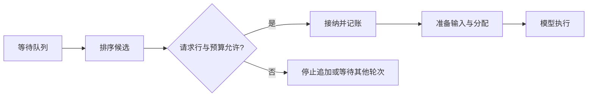
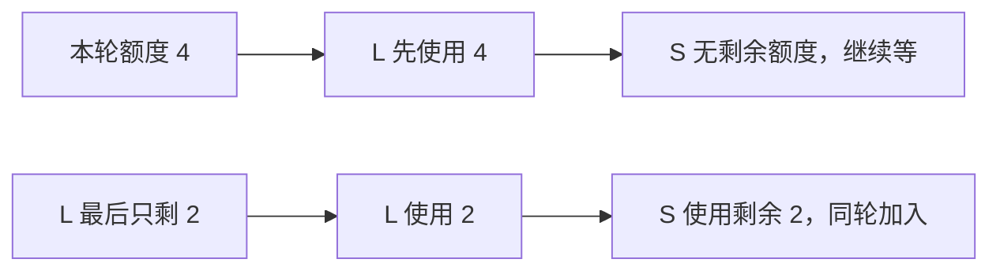
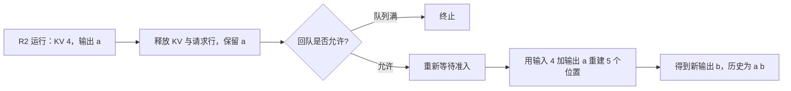

# SGLang 调度准入与容量回撤学习文档

排序靠前，不等于本轮能计算。本篇沿候选列表形成、预算检查、分块续算与容量回撤，解释普通请求怎样进入或离开运行集合。

[交互课程：排到前面，就能开始计算吗？](https://asher-xunzhang.github.io/ai-infra-wiki/sglang/scheduling/) · [本领域路线](README.md)

## 0. 源码基线与范围

本文是源码分析型学习资料。教学模型只选择普通文本、单实例、`page_size=1`、传统 RadixCache 与固定 token 池预算；不代表所有模型和启动配置的统一实现。

| 项目 | 内容 |
| --- | --- |
| 公开仓库 | [sgl-project/sglang](https://github.com/sgl-project/sglang) |
| 分支与 commit | 公开上游 `main` 快照：[279339f113b79af84f27fd3ac92d0a13bd3f4cbd](https://github.com/sgl-project/sglang/tree/279339f113b79af84f27fd3ac92d0a13bd3f4cbd) |
| 读取时间 | 2026-09-23 |
| 读取与工作区状态 | 只读本地 Git 固定对象；当前检出分支与本文快照分开，原有未跟踪文件保留。 |
| 操作边界 | 源码静态分析、教学模型和网页验证；未运行 SGLang、GPU 或吞吐实验。 |
| 教学假设 | 自设请求长度、池容量与输入额度；每个演示单独说明变化条件。 |
| 不展开 | PD、Overlap、Beam、投机、SWA/Mamba、HiCache、LoRA、多模态、输入 embedding、tile 额度、优先级抢占及分布式一致性。 |

先修：[批处理与分块](https://asher-xunzhang.github.io/ai-infra-wiki/sglang/inference-overview/scheduling.html)、[KV 映射与共享回收](../kv-cache/SGLang KV 映射与共享回收学习文档.md)。

| 术语 | 本文中的职责 |
| --- | --- |
| waiting_queue | 还需被尝试接纳的请求；也可能包含回撤后重新入队的请求。 |
| SchedulePolicy | 决定候选尝试顺序，部分策略同时刷新前缀匹配信息。 |
| PrefillAdder | 检查候选、记录接纳、保护前缀与扣减本轮预算。 |
| PrefillBudget | 查询实时可用 / 可驱逐容量，记录待分配工作及后续 Decode 的预留；不负责选请求。 |
| can_run_list | 本轮已接纳的请求列表，不等于已执行完成。 |
| chunked_req | 之前已经开始、仍需继续 Prefill 的分块请求。 |
| 回撤 | 在调度边界解除部分运行请求的资源持有，并尝试让它之后恢复；不是随时打断 GPU kernel。 |

## 1. 排序、准入、分配、执行分开看



图中的箭头是职责与依赖，不是独立服务之间的网络消息。准入期间可以保护前缀；后续仍需要为 batch 准备输入、安排实际写位置，再运行模型。

本页的三个候选按 R1、R2、R3 到达：R1 输入 6、无命中；R2 输入 6、命中 4，因此还需算 2；R3 输入 2、无命中。三个请求的输出上限均为 2，初始尚无输出。

FCFS 在本例无优先级时保留等待顺序；LPM 先尝试命中较长的 R2，再尝试 R1、R3。队列很短，排除了大队列策略回退及临时前缀降权等支线。这里没有把 LPM 等同于最短作业优先，也没有据此声称延迟必然降低。

## 2. 本轮输入额度：首条与后续候选不同

未启用 chunk 的普通分支允许首条超过输入额度。后续候选则会检查：若其页对齐后的新输入数量 `>= rem_input_tokens`，返回 `OTHER`，停止继续追加。

以输入额度 6 为例：

- FCFS 先接纳 R1 的 6 个位置，额度用完，后续停止。
- LPM 先接纳 R2 的 2 个位置，剩余 4；下一候选 R1 需 6，因此被挡住。这个分支停止循环，后面的 R3 不会因更短而自动越过 R1。

将输入额度改为 3，FCFS 的首条 R1 仍可以接纳 6 个位置，之后停止。页面用越过额度标线的色带显示这个例外；不能把输入额度直接当成所有场景下的硬上限。

另一个边界是返回值发生的时点：`add_one_req` 在提交接纳之后还会调用 `budget_state()`。所以 `OTHER` 既可能是接纳前的阻断，也可能是已接纳、但不应再追加的信号。应同时看 `can_run_list` 与请求状态，不能仅从返回值推断本候选失败。

## 3. KV 预算：命中前缀也会改变可驱逐容量

普通 `PrefillBudget` 查询“分配器可用 + 缓存可驱逐”，再减去当前准入过程中记录的预留。暂时锁住命中前缀后，它不再是可驱逐容量，检查必须看到这个变化。

本例 `page_size=1`，无运行中请求的输出预留，无 host 命中或混合状态。每个新候选的检查需求为：

```text
未命中输入 + 剩余输出上限 + page_size
```

普通 `check_prefill` 使用严格 `< remaining_total`；相等也不能通过。本例全是新请求，输出上限均为 2，因此 R1 需求为 6+2+1=9，R2 / R3 为 2+2+1=5。真实运行中的输出比例、裁剪上限和页取整需回到完整实现，不能把这几个数字当成通用配置建议。

R2 的 4-token 前缀初始可驱逐。若初始总余额为 12：

- FCFS 接纳 R1 后记录 9 的预留，余额为 3。随后尝试 R2，临时保护这 4 个位置，检查时余额变为 -1，不能再接纳。失败后临时保护退回，R2 前缀仍可驱逐。
- LPM 先保护 R2，余额从 12 降为 8，需求 5 可以通过；接纳后余额为 3。R1 的需求 9 无法通过。

负的检查余额是本轮预留与可驱逐容量之间的账面不足，不表示分配器已经发出了负数或越界槽位。页面的 KV 色带画的是准入账本：实色是预留，斜线是受保护前缀，不是设备里实际写好的 KV 数量。

把初始余额改为 9，可观察等号边界：R1 需求 9 不小于 9；LPM 下 R2 保护前缀后需求 5 也不小于 5，两者都不能通过。

请求行是另一种资源。即使输入与 KV 预算充足，只剩一个可用请求行时，第二个候选仍不能进入。这三个限制在页面中通过不同场景分别观察，避免把不同单位塞进一个总计数。

## 4. 已开始的长请求先续算，短请求使用剩余额度

固定 Scheduler 先处理已有 `chunked_req`，之后才遍历 waiting。这个顺序不同于“每轮把长短请求放回队列重新竞选”。

设 L 的 Prefill 已开始，还剩 10 个位置；S 在等待，需 2 个位置。KV 和请求行预算充足，输入与 chunk 额度相同，不启用 mixed、动态 chunk 或其他门槛：



额度为 4 时，各轮是 `[L×4]`、`[L×4]`、`[L×2, S×2]`。额度为 6 时是 `[L×6]`、`[L×4, S×2]`。这只展示工作份额与接纳顺序，方格不是毫秒；既没有模拟 Decode 交错，也不能据此给出 TTFT、吞吐或公平性的定量结论。

缩小 chunk 可以改变单轮新输入数量，但不会自动取消已有分块的续算优先顺序。是否混合 Decode、实际 Attention 历史长度和 CPU/GPU overlap，要沿独立课程继续核对。

## 5. 下一步容量不足：先驱逐，再决定是否回撤

`check_decode_mem` 把下一步需求交给分配器。普通分配器先尝试驱逐可回收缓存，再比较可用容量。它不是仅仅读一个计数，也不是已经遇到设备分配异常才执行的补救。

本页使用 `page_size=1`，两条请求各需要一个新 KV 位置，总需求为 2。若有 2 个可驱逐缓存位置，归还之后就可以继续，两条请求都不必回撤。页大小大于 1 时，需求与是否跨页相关；不能照抄“请求数就是需要的槽数”。

若没有可驱逐空间，则进入 `retract_decode`。普通 length 策略优先保留输出较多的请求，输出长度相同再结合输入长度；回撤循环从保留顺序的末尾取出请求。本例 R1 已有输出 2 个，R2 只有 1 个，所以先回撤 R2。这不是测量出来的重算成本最优解。

## 6. KV 可以重建，文本历史继续保留

本例 R1 原输入 7、已有输出 2，因此已提交 KV 为 8；R2 原输入 4、已有输出 1，因此 KV 为 4。普通生成中最后采样出的 token 还未再次前向，不应把输出个数直接加成 KV 数。

池容量为 12，两条请求已占满。R2 回撤后释放 4 个 KV 与请求行；R1 得到继续 Decode 的空间。`reset_for_retract` 清理旧匹配、KV 持有与执行进度，但在本例普通文本路径保留输入和输出历史。



恢复分支另设：R1 在下一步达到原有停止条件，9 个 KV 留在可驱逐缓存；后续 R2 的准入条件满足。R1 缓存是单叶、与 R2 不共享，重新分配时可被驱逐。R2 使用 4 个原始输入加已有输出 a 共 5 个 token 重建 KV，然后产生新的 b。a 不因重算再次计为新生成 token；这不描述所有流式协议的原始包格式。

回队不是保证：普通 `_add_request_to_queue` 仍检查队列上限。无优先级的默认拒绝路径可能终止这个刚回撤的请求。代码也处理“只剩最后一条仍放不下”的终止分支，因此不能把回撤画成必然恢复的闭环。PD 备份、Beam 与输入 embedding 的例外另有语义，不从本例推导。

## 7. 从现象定位边界

| 现象 | 对应检查 |
| --- | --- |
| 排第一但没运行 | 请求行、KV 预算、输入 / chunk 额度与其他启用门槛。 |
| 返回 OTHER 但请求已经在 batch | 判断返回发生在接纳前还是提交后的 budget_state。 |
| 前缀命中却仍被挡住 | 保护前缀是否减少了可驱逐容量；命中后仍有新输入与输出预留。 |
| 短请求一直等长请求的下一块 | 已有 chunk 续算顺序、每轮剩余额度和具体 mixed 配置。 |
| 回撤后客户端仍保留部分文本 | 文本输出历史与设备 KV 的生命周期不同；不能仅据此判断重复生成。 |
| 回撤之后没有恢复 | 回队是否被拒绝、后续准入是否满足、是否进入特殊终止分支。 |

## 8. 固定源码入口与后续路线

以下路径均相对于公开仓库，链接固定到本文 commit。

| 行为 | 入口 |
| --- | --- |
| 排序与 LPM | [`SchedulePolicy.calc_priority`](https://github.com/sgl-project/sglang/blob/279339f113b79af84f27fd3ac92d0a13bd3f4cbd/python/sglang/srt/managers/schedule_policy.py#L256)、[`_sort_by_longest_prefix`](https://github.com/sgl-project/sglang/blob/279339f113b79af84f27fd3ac92d0a13bd3f4cbd/python/sglang/srt/managers/schedule_policy.py#L414) |
| 严格 KV 预算检查与预留 | [`PrefillBudget.check_prefill`](https://github.com/sgl-project/sglang/blob/279339f113b79af84f27fd3ac92d0a13bd3f4cbd/python/sglang/srt/mem_cache/prefill_budget.py#L98)、[`reserve`](https://github.com/sgl-project/sglang/blob/279339f113b79af84f27fd3ac92d0a13bd3f4cbd/python/sglang/srt/mem_cache/prefill_budget.py#L139) |
| 临时保护前缀 | [`add_one_req` 的 `_lock_node`](https://github.com/sgl-project/sglang/blob/279339f113b79af84f27fd3ac92d0a13bd3f4cbd/python/sglang/srt/managers/schedule_policy.py#L1185) |
| 首条与后续输入门槛 | [`_select_prefill_admission`](https://github.com/sgl-project/sglang/blob/279339f113b79af84f27fd3ac92d0a13bd3f4cbd/python/sglang/srt/managers/schedule_policy.py#L1267) |
| 提交与停止追加 | [`_commit_prefill_admission`](https://github.com/sgl-project/sglang/blob/279339f113b79af84f27fd3ac92d0a13bd3f4cbd/python/sglang/srt/managers/schedule_policy.py#L1347)、[`budget_state`](https://github.com/sgl-project/sglang/blob/279339f113b79af84f27fd3ac92d0a13bd3f4cbd/python/sglang/srt/managers/schedule_policy.py#L763) |
| 已有 chunk 先续算 | [`Scheduler` 调用顺序](https://github.com/sgl-project/sglang/blob/279339f113b79af84f27fd3ac92d0a13bd3f4cbd/python/sglang/srt/managers/scheduler.py#L3894)、[`add_chunked_req`](https://github.com/sgl-project/sglang/blob/279339f113b79af84f27fd3ac92d0a13bd3f4cbd/python/sglang/srt/managers/schedule_policy.py#L950) |
| 请求行门限 | [`Scheduler` 候选循环](https://github.com/sgl-project/sglang/blob/279339f113b79af84f27fd3ac92d0a13bd3f4cbd/python/sglang/srt/managers/scheduler.py#L3922) |
| Decode 需求与先行驱逐 | [`new_tokens_required_next_decode`](https://github.com/sgl-project/sglang/blob/279339f113b79af84f27fd3ac92d0a13bd3f4cbd/python/sglang/srt/managers/schedule_batch.py#L3166)、[`check_decode_capacity`](https://github.com/sgl-project/sglang/blob/279339f113b79af84f27fd3ac92d0a13bd3f4cbd/python/sglang/srt/mem_cache/allocator/base.py#L114) |
| 回撤选择与剩余容量 | [`retract_decode`](https://github.com/sgl-project/sglang/blob/279339f113b79af84f27fd3ac92d0a13bd3f4cbd/python/sglang/srt/managers/schedule_batch.py#L3214)、[`_get_decode_retraction_order`](https://github.com/sgl-project/sglang/blob/279339f113b79af84f27fd3ac92d0a13bd3f4cbd/python/sglang/srt/managers/schedule_batch.py#L3301) |
| 解除资源、重置状态 | [`release_req`](https://github.com/sgl-project/sglang/blob/279339f113b79af84f27fd3ac92d0a13bd3f4cbd/python/sglang/srt/managers/schedule_batch.py#L2209)、[`reset_for_retract`](https://github.com/sgl-project/sglang/blob/279339f113b79af84f27fd3ac92d0a13bd3f4cbd/python/sglang/srt/managers/schedule_batch.py#L1931) |
| 回队与上限拒绝 | [`_add_request_to_queue`](https://github.com/sgl-project/sglang/blob/279339f113b79af84f27fd3ac92d0a13bd3f4cbd/python/sglang/srt/managers/scheduler.py#L3233)、[`_abort_on_queued_limit`](https://github.com/sgl-project/sglang/blob/279339f113b79af84f27fd3ac92d0a13bd3f4cbd/python/sglang/srt/managers/scheduler.py#L3298) |

自测：输入额度 3 时谁能入选？需求等于 KV 余额时是否通过？为什么 S 没越过 L 的下一块？R2 重新 Prefill 为什么使用 5 个位置，却只新增一个输出？

深入资料各自保留固定基线：

- [排序策略与准入预算](../source-study/03-scheduling/03-排序策略与准入预算.md)：其他策略、请求优先级与完整预算账本。
- [Chunked Prefill 与长请求调度](../source-study/03-scheduling/04-ChunkedPrefill与长请求调度.md)：分块、mixed 与更多路径。
- [Overlap 中的 CPU 与 GPU 依赖](../source-study/03-scheduling/05-Overlap中的CPU与GPU依赖.md)：跨批执行与结果可用边界。
- [回撤、背压、饥饿与调度排障](../source-study/03-scheduling/06-回撤背压饥饿与调度排障.md)：队列、反馈与终止边界。
- [指标口径与性能定位](../performance-engineering/SGLang 指标口径与性能定位学习文档.md)：用实际实验检验收益与代价。
