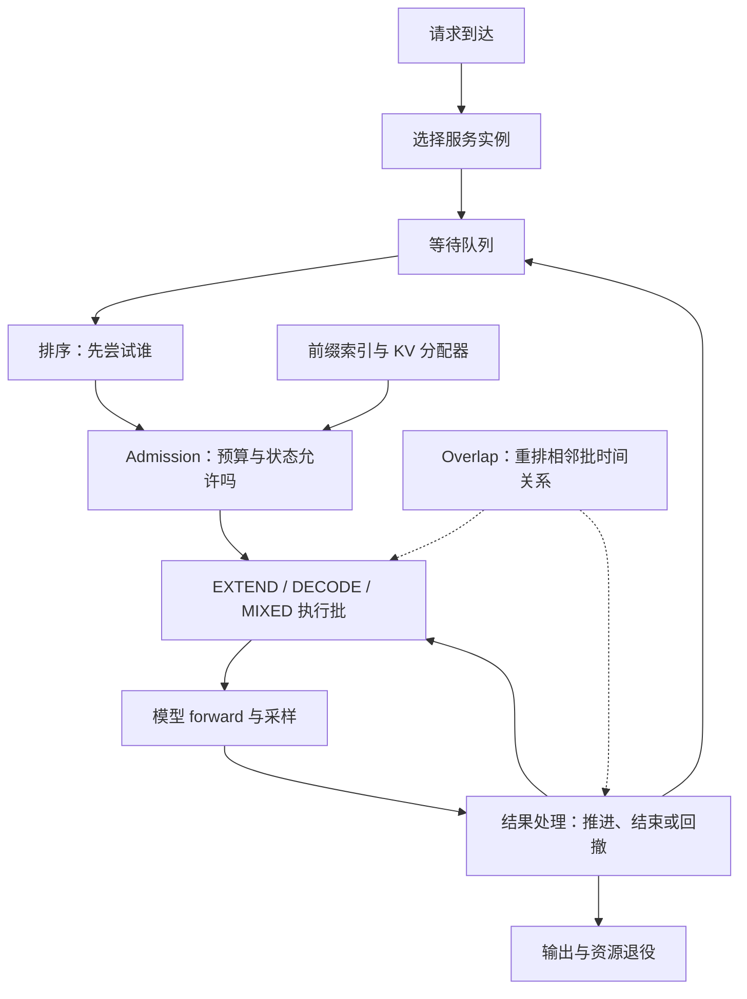
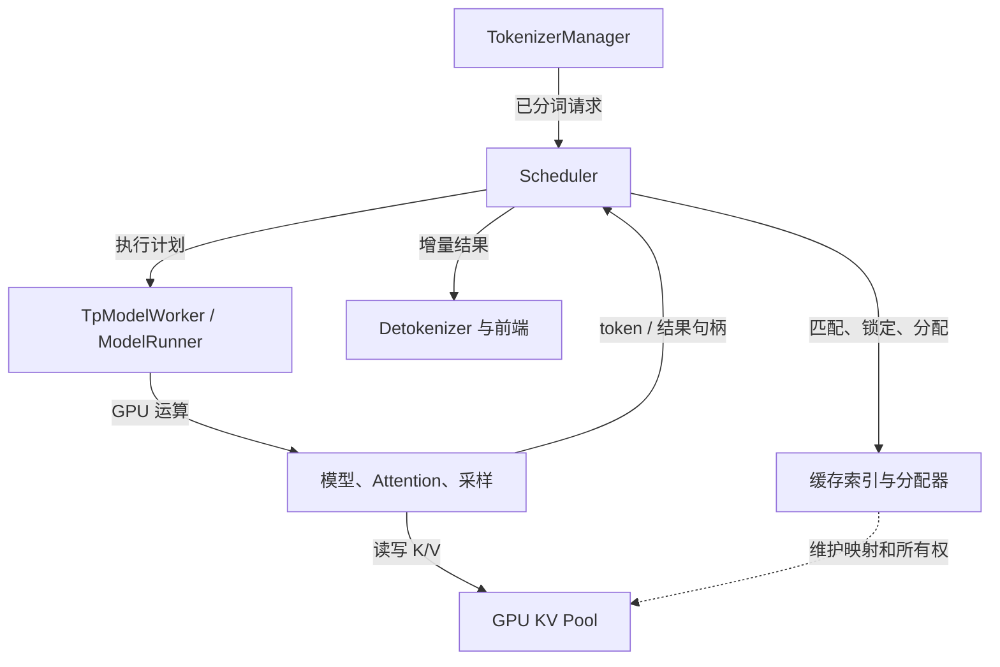

# SGLang 调度机制总览与学习路线

本文面向第一次学习 SGLang 调度的同学，从“请求什么时候能算、这一轮算多少、结果何时可用”建立整体地图，再串起请求生命周期、前缀缓存、重叠调度与 Chunked Prefill。

这是**第三方资料整理型学习资料，附官方源码静态抽查**。本次提供的八条来源中，五篇纳入技术整理；一篇按约定排除，两篇因关键机制错误排除。正文不沿用已确认错误的解释。没有运行推理服务、GPU benchmark 或精度对照。

## 0. 阅读基线与资料去向

### 0.1 八条来源逐项登记

编号沿用输入顺序，便于回查。所有来源均于 **2026-09-09** 重新读取；发布时间根据页面 `ct` 转为北京时间，作者与账号分别记录。

| 编号 | 原文完整标题与链接 | 作者 / 账号 | 发布时间 | 本次处理 |
| --- | --- | --- | --- | --- |
| S01 | [SGLang 双 Stream 重叠调度：如何把 CPU 后处理藏到 GPU 计算背后](https://mp.weixin.qq.com/s/fnVVmI8HUwpTqokcN3D-5A) | HelloKitty / 我只是个大语言模型 | 2026-09-06 | 按约定排除，不纳入正文或源码证据 |
| S02 | [从 KV Cache 到 Zero Overhead Scheduling，一文读懂 SGLang 的调度巧思](https://mp.weixin.qq.com/s/-O5W_4CGD0XJMAtHckn3nw) | 原作者 Chayenne Zhao；页面署名“关注AI Infra” / 智猩猩AI | 2026-01-12 | 纳入请求生命周期、batch 视图、缓存寻址和 Overlap；对用词和版本边界作限定 |
| S03 | [小进探索sglang：sglang中的scheduler调度原理和代码解析](https://mp.weixin.qq.com/s/baB0ozQrVuaqZrTphSCUvg) | lil2j / 小进在学大模型 | 2025-12-08 | 纳入主循环、跨轮合并和 admission；剔除有误或不可辨读的配图与局部解释 |
| S04 | [Prefill chunk size 从 64K 调到 16K：省显存，也能提吞吐吗？](https://mp.weixin.qq.com/s/8fPRQaX8ik03r4yAtmRMjA) | 魏新宇 / 大魏分享 | 2026-09-07 | 纳入 Chunk 专题第 14～16 节；保留四张技术图并核对论文与固定源码 |
| S05 | [SGLang推理优化-调度器核心ScheduleBatch](https://mp.weixin.qq.com/s/e--Z3OKzilcZuJFoi7Hizg) | kason_zhang / LLM高性能计算 | 2026-06-05 | 纳入 EXTEND/DECODE 组批、对象生命周期和请求示例 |
| S06 | [从请求调度到 RadixAttention：SGLang 整体架构与原理](https://mp.weixin.qq.com/s/N7bsnWP4WoYypAPgWDU-eg) | Tiny点 / 原生引擎 | 2026-09-01 | 纳入本文职责地图与缓存协同；对 chunk 插入 Decode 和缓存复用前提作限定 |
| S07 | [SGLang Overview：设计哲学与关键机制](https://mp.weixin.qq.com/s/uy71V2JZn3Cnc0mYYwxsaw) | 方弦 / 吃果冻不吐果冻皮 | 2026-04-10 | 关键机制存在多处错误，排除技术内容；核对依据见下表 |
| S08 | [SGLang：大模型高效推理框架的技术内幕](https://mp.weixin.qq.com/s/sSfwIAwsWRVAJdHU2OVQdw) | 小零花 / 技术零花 | 2026-07-31 | 零开销调度的核心解释错误，排除技术内容和性能数字 |

S02 页面标注了[知乎原始文章](https://zhuanlan.zhihu.com/p/1992587332189197731)，S07 页面标注了[知乎原始文章](https://zhuanlan.zhihu.com/p/2020514624856957623)。这两个原始地址用于追溯，不算本次新增的独立证据。各文章属于技术博客/图文解读，不是运行验证报告。

### 0.2 来源筛选依据

| 对象 | 核对后的结论 | 依据与处理 |
| --- | --- | --- |
| S08 对零开销调度的解释 | CPU 仍负责调度、内存分配、前缀匹配；Overlap 隐藏部分开销 | [官方 v0.4 说明](https://www.lmsys.org/blog/2024-12-04-sglang-v0-4/#zero-overhead-batch-scheduler)及固定版 `Scheduler.event_loop_overlap`。排除整篇作为技术依据，不保留其 GPU 接管调度的模型 |
| S07 的默认配置与延迟保证 | 固定版 `schedule_policy` 声明默认 `fcfs`，`enable_mixed_chunk` 声明默认 `False`；限制单轮 token 数不能保证请求 TTFT 上界 | [配置声明](https://github.com/sgl-project/sglang/blob/6e312af8c25ccedd1dcd2583358be038ab4875b0/python/sglang/srt/server_args.py#L744)、[混合开关](https://github.com/sgl-project/sglang/blob/6e312af8c25ccedd1dcd2583358be038ab4875b0/python/sglang/srt/server_args.py#L920)。这里是固定版声明值，模型钩子和显式配置仍需看最终生效值 |
| S07 对其他引擎能力的判断 | vLLM 官方提供 JSON、regex、grammar 等结构化输出功能 | [vLLM 官方结构化输出文档](https://docs.vllm.ai/en/latest/features/structured_outputs/)。该来源不能用于建立“仅 SGLang 支持”的选型判断 |
| S07 对 TP 调度和进程边界的描述 | 接收入口由部分 rank 承担，接收的请求再广播；多个 rank 启动 Scheduler。普通路径中 Scheduler 可直接调用本进程的 worker/runner | [启动循环](https://github.com/sgl-project/sglang/blob/6e312af8c25ccedd1dcd2583358be038ab4875b0/python/sglang/srt/entrypoints/engine.py#L873)、[请求广播](https://github.com/sgl-project/sglang/blob/6e312af8c25ccedd1dcd2583358be038ab4875b0/python/sglang/srt/managers/scheduler_components/request_receiver.py#L88)。不采用“只有 rank 0 调度”或“每层 batch 都是独立进程”的解释 |
| S03 的局部内容 | Prefill-first 与 FCFS 属于不同决策层；普通生成首 token 通常在最终 Prefill 产生 | 正文分别解释阶段选择与队列排序；三张错误或难以可靠辨读的图排除，见[配图处理记录](../../images/sglang-scheduler/SOURCES.md) |

S07 存在多个互相影响的错误，S08 的错误落在本次主线核心，因此不采用“保留大段内容、仅附免责声明”的方式。对 S02/S03/S06 的局部不严谨表述，只纳入可核对的机制，并直接使用准确说法。

### 0.3 官方抽查基线

| 项目 | 内容 |
| --- | --- |
| 官方仓库 | [sgl-project/sglang](https://github.com/sgl-project/sglang) |
| 版本选择 | 使用 S04 明确引用的 commit `6e312af8c25ccedd1dcd2583358be038ab4875b0`；不跟随浮动 `main` |
| 读取时间 | 2026-09-09 |
| 读取方式 | 按固定 commit 下载官方源文件和文档到临时目录，仅静态阅读 |
| 固定源码入口 | [固定源码快照](https://github.com/sgl-project/sglang/tree/6e312af8c25ccedd1dcd2583358be038ab4875b0) |
| 分支与工作区状态 | 未检出分支；临时目录不是 Git 工作区。未修改本地 SGLang 源码仓库；Wiki 原有未提交内容保留 |
| 抽查范围 | Scheduler 主循环、选批、排序/预算、结果处理、请求广播、worker 边界、显存默认值、AITER 特定分支 |
| 不展开内容 | PD 传输协议安全审计、PP 多 stage 调度、Speculative Decoding 全部状态、模型内核实现、生产调参 |
| 验证边界 | 静态事实不等于 GPU 运行正确；未复现任何来源 benchmark，没有测得性能或精度结论 |

证据用法：**原文信息**用于提出问题和理解设计；**官方静态抽查**用于确认具体代码关系；**整理者归纳**用于机制图、教学例子和排障路线。它们不应互换。

## 1. 先分清四种“调度”

### 人话版

同一请求至少会遇到四个不同问题：送到哪个服务实例、等待队列先看谁、本轮给谁多少计算量，以及 CPU 怎样提前准备工作。它们都可能被叫作“调度”，却不能用一个开关控制。

| 决策层 | 负责回答 | 常见机制 | 不能直接推出 |
| --- | --- | --- | --- |
| 服务路由 | 请求送到哪个实例 | 负载、缓存亲和性 | 请求进入实例后立即能算 |
| 等待排序 | admission 先尝试谁 | FCFS、LPM、优先级 | 排第一就一定被接纳 |
| 阶段和份额 | 本轮 EXTEND、DECODE 或混合；算多少 token | PrefillAdder、chunk、KV 与请求槽位预算 | chunk 切小就一定插入 Decode |
| 执行时序 | CPU 与 GPU 的工作怎样交叠 | result queue、FutureMap、stream/event | CPU 不再参与调度 |



**图意解读：** 这是整理者按职责绘制的控制图，不是新增源码模块。排序不能绕过 admission；Overlap 改变可重叠工作的提交与收尾时机，仍需保持资源和结果依赖。

例子：R1 比 R2 先到，R2 却命中了更长前缀。FCFS 可能先尝试 R1，LPM 可能先尝试 R2；但 R2 的缓存还在等待回载时，两者都不能凭排序结果跳过“数据是否已就绪”的判断。

## 2. 从一条请求走到一次 forward

### 术语速查

| 术语 | 人话解释 | 重点 |
| --- | --- | --- |
| `Req` | 请求的进度账本 | 输入、输出、KV 所有权与停止状态 |
| `waiting_queue` | 等待被接纳的请求 | 可能含回撤后重入的请求 |
| `chunked_req` | 输入尚未算完的长请求 | 已有 KV 要保留，但不能提前当普通 Decode |
| `running_batch` | 可继续生成的请求集合 | 集合存在不代表此刻正在执行 |
| `last_batch` | 上轮提交的执行批 | 与结果完成状态分开理解 |
| `ScheduleBatch` | Scheduler 的本轮执行计划 | 请求集合、模式、长度与 slots |
| EXTEND | 给已有前缀补算后缀 | 首次 Prefill、续 chunk、回撤恢复都可能走它 |
| Retract | 内存不足时把请求暂时撤回 | 保留逻辑进度，后续可能需要补算 KV |

S06 的架构主线可以落成三条具体路径：



**图意解读：** 上方是控制与输出路径，下方是存储关系。Scheduler 保留控制权，ModelRunner 发起模型计算；缓存索引决定哪些状态可复用。图中方框表示职责，不表示每个方框必须对应一个操作系统进程。

### 一次普通生成的六步

1. 前端完成分词，Scheduler 构造请求并等待 admission。
2. 检查已命中的合法前缀、剩余计算量、请求槽位与 KV 预算。
3. 构造 EXTEND，写入新 token 的 KV；长请求可能需要多轮。
4. 最终 Prefill 通常产生第一个输出 token；请求若未结束，随后可并入 Decode 集合。
5. DECODE 继续计算并消费采样结果；KV 不够时可能 retract。
6. 完成请求退出活跃集合。请求映射释放与可复用前缀保留属于不同生命周期。

这六步是普通生成主线，不能直接移作 PD、PP、embedding 或投机解码的完整流程。细节进入[请求生命周期与重叠调度](<./SGLang 调度器请求生命周期与重叠调度学习文档.md>)。

## 3. 前缀命中为何会改变调度

### 人话版

缓存不仅省计算，还可能改变一条请求本轮能否装得下。但必须命中**计算条件兼容、状态有效且可使用的前缀**，不能只比较自然语言文本是否相似。

S02/S06 给出前缀索引、请求寻址和物理 KV 的联系。整理时还需加上模型与权重、tokenization、LoRA、cache salt、位置及其他相关输入的兼容前提；多模态与混合状态还受额外约束。详细命中定义见[前缀缓存命中文档](<../kv-cache/SGLang RadixAttention 前缀缓存命中定义学习文档.md>)。

教学例子：同一实例中有兼容且可读的 6000-token 公共前缀。R1、R2 各有 1000-token 私有后缀。

| 量 | 可以怎样理解 | 边界 |
| --- | --- | --- |
| 逻辑输入 | 每个请求都仍有 7000 tokens | 没有截断模型上下文 |
| 本轮新增计算 | 各约 1000 tokens | 忽略末 token 重算、page 对齐等实现细节 |
| 共享部分物理占用 | 公共前缀可复用一份 | 只在该实例相同缓存域内计算 |
| admission | 还要检查私有后缀和未来输出空间 | 命中不代表无需新 KV |
| 缓存不在 GPU | 可能要先回载 | 逻辑命中不等于 GPU 已可计算 |

可迁移的理解是：Router 改变命中机会，缓存索引报告可复用状态，Scheduler 决定是否等待或接纳，分配器兑现资源安排。任何一层都不能替另一层承诺完成。

## 4. 三项优化分别移走了什么等待

| 优化 | 改变的工作 | 仍要支付的成本 | 最该观察 |
| --- | --- | --- | --- |
| Continuous Batching | 在调度边界补入或移出请求 | 组批、KV 分配、长度不均衡 | 活跃 batch、队列、完成率 |
| Chunked Prefill | 把长输入拆成多个可调度计算片段 | 累积 KV、更多轮次、历史 KV 读取 | 峰值显存、TTFT、ITL、Prefill 吞吐 |
| Overlap Scheduling | 让部分 CPU 工作落入 GPU 计算窗口 | CPU 工作本身、真实同步、状态退役 | CPU 时间线、GPU 批间空洞 |

CUDA Graph 主要影响执行提交成本，与这些机制相关，但不能替代它们的请求状态管理。

### 为什么不能从一个参数推导 SLA

整理者将首 token 延迟拆成：

```text
TTFT ≈ 入口处理 + 排队/缓存等待 + 所有必要 Prefill chunk
       + 阶段衔接与输出传递
```

chunk 限制一轮新算的 token，排队时间仍可能增长，一条长输入也仍要把全部必需片段算完。要建立延迟保证，必须同时约束到达负载、排队、拒绝策略和运行时间分布。`max_prefill_tokens` 不能独自给出请求级 TTFT 保证。

## 5. 把三篇文档连成学习路线

| 顺序 | 产物 | 读完要能回答 |
| --- | --- | --- |
| 1 | 本文 | 路由、排序、admission、执行时序分别在决定什么 |
| 2 | [请求生命周期与重叠调度](<./SGLang 调度器请求生命周期与重叠调度学习文档.md>) | `last_batch` 怎样交接；为何要有 FutureMap、结果快照和同步边界 |
| 3 | [Chunked Prefill 与调度器显存预算](<./SGLang Chunked Prefill 与调度器显存预算学习文档.md>) | chunk 额度怎样消耗；64K→16K 如何影响显存、PD 容量和性能归因 |

之后按问题延伸：

- 缓存寻址：[KV Pool、请求视图与 HiCache 工程](<../kv-cache/SGLang KV Pool、请求视图与 HiCache 工程学习文档.md>)。
- 分布式边界：[数据并行、负载均衡与专家并行](<../parallelism/SGLang 数据并行、负载均衡与专家并行边界学习文档.md>)。
- 多 stage 与 PD：[PD 分离下的 PP](<../disaggregation/PD 分离下的 PP 源码学习文档.md>)，注意这篇有自己的源码基线。
- 性能现场：[Torch Profiler 与 Trace](<../performance-engineering/SGLang Torch Profiler 与 Trace 性能分析学习文档.md>)。

### 自测与答案要点

| 问题 | 答案要点 |
| --- | --- |
| `running_batch` 非空，为什么这轮仍跑 Prefill？ | 请求集合与当前执行批不同；阶段选择仍受 Prefill-first、延迟策略和 mixed 条件影响 |
| 长前缀命中，为什么仍没有首 token？ | 可能在等 admission、回载或计算剩余后缀；命中不是完成状态 |
| GPU 忙，CPU 是否可以马上回收所有已结束请求的内存？ | 不能；必须确认在途使用、引用及同步边界，逻辑结束不等于消费者退役 |
| 64K 调成 16K 后并发更多，能否宣布吞吐提升？ | 还要看完成量、失败率、队列增长及 TTFT/ITL；并发增加可能只是等待变长 |
| 同样调了 chunk，为什么两次对照不一致？ | 检查实际 KV 池、自动配置、图捕获、缓存冷暖、负载协议和数值路径 |

## 6. 证据与配图说明

S02/S03/S05 的已保留原图集中在顶层 `images/sglang-scheduler/`，S04 的四张图集中在 `images/sglang-chunk-size-tradeoffs/`。各图在专题正文中有图意解读；原始 URL、SHA256、复用旧文件和排除决定见[调度原图记录](../../images/sglang-scheduler/SOURCES.md)与[Chunk 原图记录](../../images/sglang-chunk-size-tradeoffs/SOURCES.md)。S06 没有独立技术图片，本文以 Mermaid 重构其职责关系。

官方与研究依据：

- [固定版 Scheduler](https://github.com/sgl-project/sglang/blob/6e312af8c25ccedd1dcd2583358be038ab4875b0/python/sglang/srt/managers/scheduler.py)：事件循环、选批、FutureMap 和同步边界。
- [固定版 SchedulePolicy / PrefillAdder](https://github.com/sgl-project/sglang/blob/6e312af8c25ccedd1dcd2583358be038ab4875b0/python/sglang/srt/managers/schedule_policy.py)：排序与预算是两个职责。
- [固定版显存默认值派生](https://github.com/sgl-project/sglang/blob/6e312af8c25ccedd1dcd2583358be038ab4875b0/python/sglang/srt/arg_groups/memory_hook.py)：chunk、图与 KV 定容的联动条件。
- [Sarathi-Serve v3](https://arxiv.org/html/2403.02310v3)：S04 性能图与调度图的一手出处；论文实验不能外推为当前 SGLang 的测试结果。

## 7. 一句话总结

SGLang 调度器把有限资源中的请求组织成连续的执行计划；理解它，要同时追踪请求状态、KV 所有权、每轮预算和异步完成边界。
