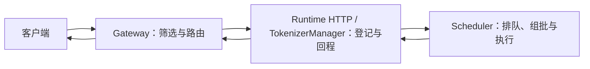
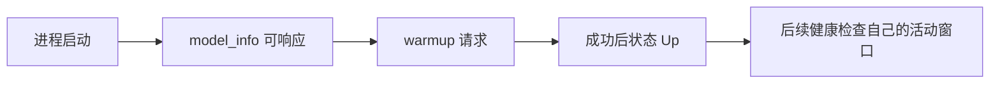
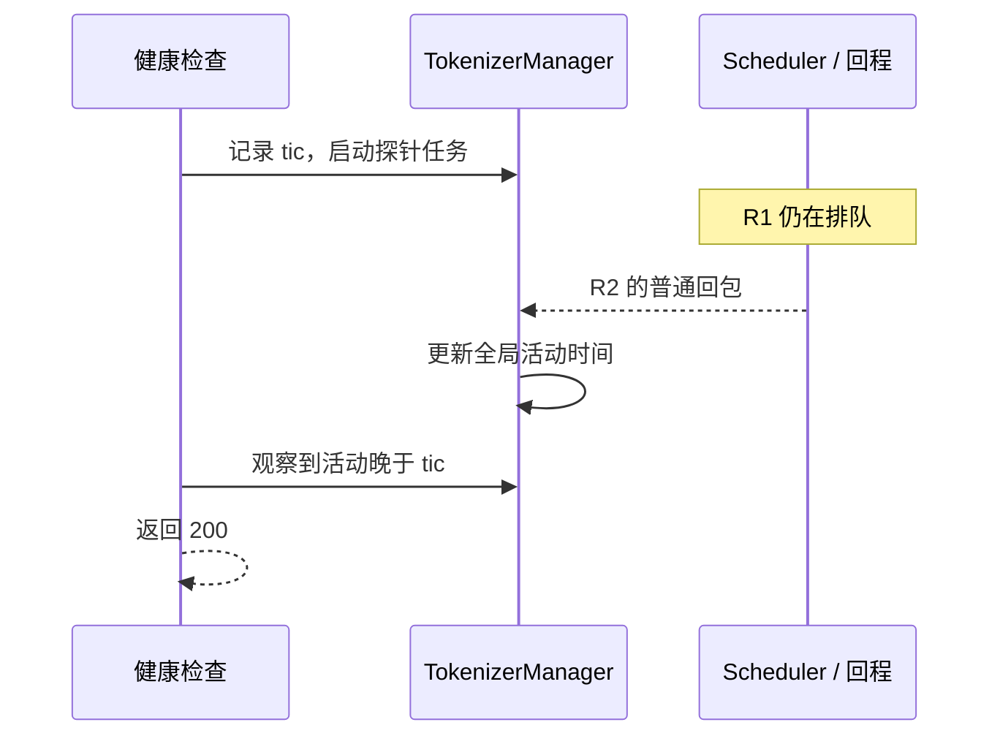
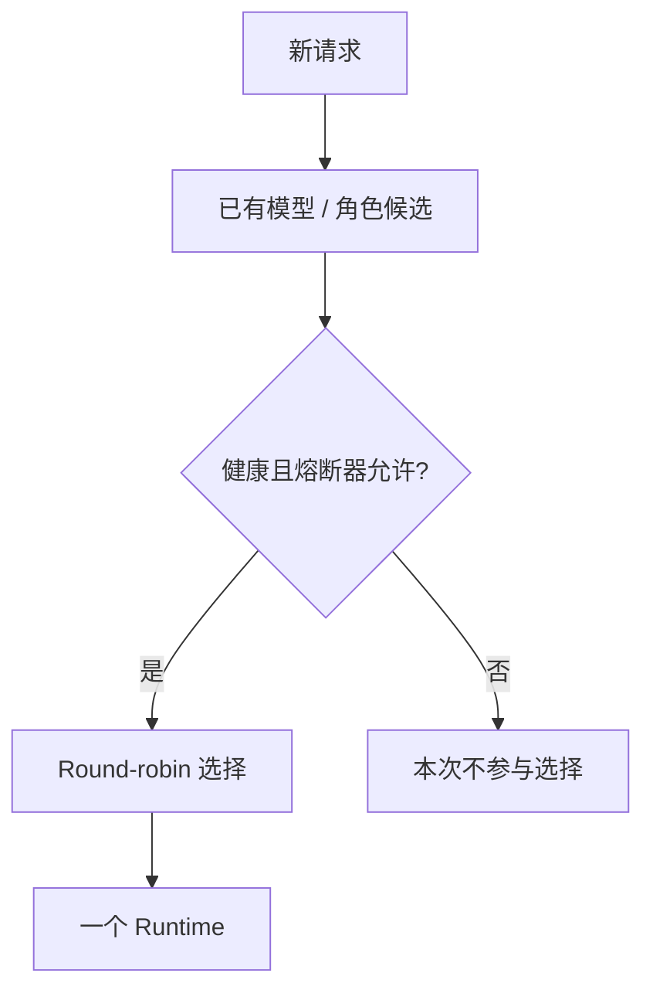
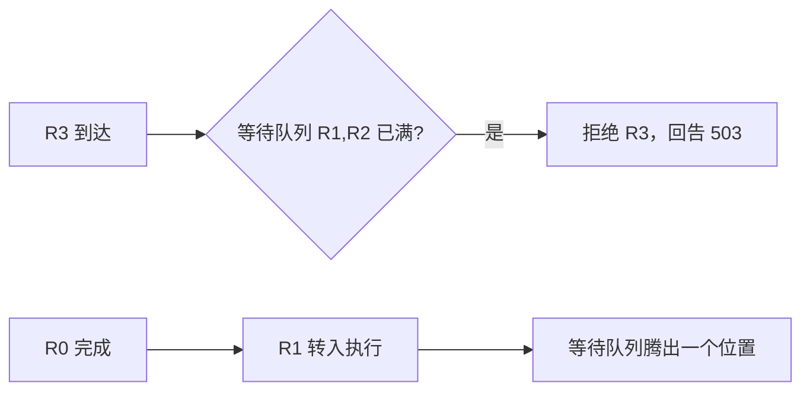
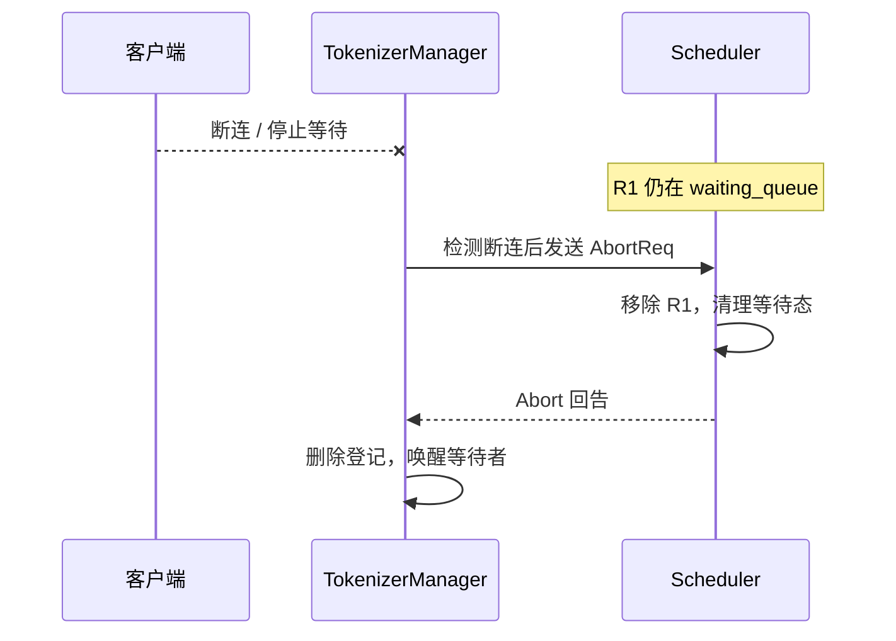
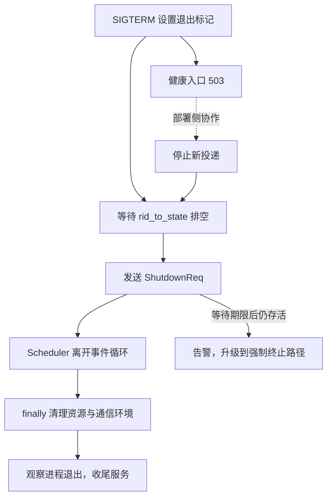

# SGLang 服务生命周期与请求治理学习文档

本文沿启动、探活、路由准入、超时取消和退出，区分“哪个组件已经做了什么”与“下一步还依赖什么”。配套 [Pages 交互课程](https://asher-xunzhang.github.io/ai-infra-wiki/sglang/serving-operations/) 每次只展开一组机制。先修为[请求运行时](../runtime/README.md)、[调度](../source-study/03-scheduling/01-NormalEventLoop与调度主循环.md)和[通信边界](../parallelism/SGLang%20通信与传输机制学习文档.md)。

## 0. 阅读基线与范围

| 项目 | 内容 |
| --- | --- |
| 类型 | 源码分析型学习资料 |
| 源码仓库 | https://github.com/sgl-project/sglang |
| 分支 | 公开上游 main 固定快照，不声明为最新 main |
| commit | `279339f113b79af84f27fd3ac92d0a13bd3f4cbd` |
| 读取时间 | 2026-09-23 |
| 工作区 | 只读本地已有 Git 对象；检出分支不同，原有未跟踪文件保留 |
| 主线 | 普通 Python HTTP Runtime，非 P/D；Gateway Round-robin；未执行请求的取消；普通 SIGTERM 收尾 |
| 操作边界 | 未启动模型、服务或集群；未发送请求、管理调用或退出信号 |
| 教学假设 | A/B 两个固定候选、少量请求、单执行位置、明确事件顺序；不是并发或性能模拟器 |

架构职责图、事件顺序和数值是整理者的教学模型；实现判断对应下文固定链接。已有[服务治理源码专题](../source-study/10-serving-operations/03-健康检查超时限流与优雅退出.md)使用独立基线，尤其不能把其退出实现直接套到本版本。

## 1. 先认清服务链上的三层

图意：一次路由选择只负责把请求交给一个实例；实例内是否能组批还取决于自己的预算和队列。图只画职责，不表示 Gateway 与 Runtime 必须在不同机器，也不展开所有回程进程。

| 对象 | 它回答的问题 |
| --- | --- |
| Gateway worker 名单 | 存在哪些地址、模型、角色和连接方式？ |
| 可用候选集合 | 在本次选择中，哪些 worker 满足健康与熔断条件？ |
| TM 的 rid_to_state | 前端还在跟踪哪些请求？ |
| Scheduler waiting_queue | 哪些请求尚在等待调度？ |
| 执行引用与资源 | 哪些 batch / 请求仍在用计算与缓存？ |

发现地址、注册对象、可选、已转发、已执行和已完成不是同一个事件。注册主线见[Model Gateway 注册与路由](../source-study/10-serving-operations/01-ModelGateway注册路由与缓存亲和.md)，完整进程启动见[从 CLI 到服务进程](../source-study/01-getting-started/03-从CLI到服务进程启动.md)。

## 2. 启动：接口可响应不等于 warmup 完成

普通启用 warmup 的 Python 路径会先等待 `/model_info` 应答，再发起 warmup 请求；成功后把 `server_status` 置为 Up。[warmup][warmup]。

图意：这不是把所有内部初始化压成四个真实函数，而是把对外可观察的依赖拆开。Up、warmup 成功和某次 `/health_generate` 返回 200 应分别记录；没有把“曾经 warmup 成功”当作后续所有请求的保证。

此处不覆盖 skip_server_warmup、Rust server、弹性 joiner 与 P/D 等独立分支。图中的步骤没有时长比例，也不验证模型的全部功能。

## 3. 探活：什么活动让检查通过？

`/health` 与 `/health_generate` 共享入口，首先检查 gracefully_exit 与 Starting，满足时返回 503。之后才考虑诊断旁路，以及 `/health` 关闭生成检查的分支。[health_generate][health]。

普通生成检查创建一个探针，但通过条件是 `last_receive_tstamp > tic`：在本次窗口内，TokenizerManager 观察到了新的回程活动。它不是只等待探针 rid 的完整答案。

图意：R2 的活动与 R1 的等待可以同时存在。探活通过不能单独证明 R1 已得到计算机会。窗口内无新活动则返回 503 并设置 UnHealthy；根因还可能在计算、通信、反分词或前端处理。

关闭 `/health` 生成检查后，在前置状态门通过的情况下可以直接 200；`/health_generate` 不因此自动变成同一静态路径。交互页把两种分支分开。这里不把源码注释中的成本描述当作实测性能结果。

## 4. 路由与准入：选中了实例，还要过它自己的队列

### Round-robin 只在可用候选中循环

策略先取得健康且 circuit breaker 允许的 worker 索引，再以递增计数对候选数量取模。[策略选择][route]、[候选过滤][eligible]。

图意：固定候选顺序 A/B、计数初始为 0 时，三个请求交给 A、B、A。若 B 不健康，或健康但熔断器不允许，则交给 A、A、A。若没有候选，策略返回 None；本图只声明未选择 worker，不替所有路由器假定同一 HTTP 状态码。

图不复刻完整熔断状态机、并发名单变化或 cache-aware 策略。网关记得文本历史也不等于已验证某个 worker 的 GPU KV 命中。

### Runtime 等待队列的上限是另一个边界

关闭优先级调度时，若 `len(waiting_queue)+1 > max_queued_requests`，默认拒绝新请求并回告 503。[队列上限][queue]。本课假设 R0 已在执行，等待容量为 2：R1、R2 排队，R3 到达时被拒绝；R0 完成、R1 推进之后，等待队列又有空位，可以重新判断 R4 的准入。

图意：执行位置与等待槽位分别占用。一个执行位置、预算足够及队首推进均为教学假设；队列上限不等于 Gateway 在途请求数，也不等于 GPU 利用率或 max_running_requests 的完整作用。开启优先级时可能淘汰已有低优先级请求，不能沿用这里的无条件拒绝新请求模型。

## 5. 超时取消：结束等待，还需要消息完成收尾

### 客户端断连不立即抹掉后端对象

选择普通非后台、非流式、尚未开始执行的请求。前端等待事件的超时分支会检查 `request.is_disconnected()`，发现断连才调用 abort_request。该短等待超时是再次检查的时机，不是请求自动失败的总时限。[前端等待][disconnect]、[派发取消][abort]。

图意：客户端断开、取消消息发出、后端移除、前端清理是四个事件。断开的客户端不保证收到最后结果。Scheduler 的等待分支需要回告 TM，后者才能处理仍存在的请求登记。[后端移除][dequeue]、[前端回告处理][echo]。

### 后端等待超时也要经过轮询和一致处理

`_poll_timeout_aborts` 按配置的等待时限检查正的入队时间；满足 `entry_time < now-timeout` 才产生 AbortReq，携带 503 原因。[超时轮询][timeout]。超过期限不等于在任意那一瞬间就删除队列对象；轮询产生取消，再由请求处理路径移除与回告。

本图不展开运行中 kernel 的完成条件、P/D 传输退役、Grammar 等待和混合状态资源。相关差异见[普通请求运行时](../runtime/SGLang%20普通请求运行时与资源生命周期学习文档.md)与[通信回收边界](../parallelism/SGLang%20通信与传输机制学习文档.md)。非流式可用 HTTP 状态表达失败；流式已发响应头后，错误还涉及响应体与连接边界，不能只看一个最初的 200。

## 6. 退出：入口摘流、登记排空和进程消失分别证明

SIGTERM handler 设置 TM 的 gracefully_exit。健康入口因此返回 503，但这个标记不证明所有代理、直连调用方或已建立连接都已停止新投递。[信号处理][signal]。

图意：正常场景假设部署侧停止新投递；若 R1/R2 陆续完成时 R3 又进来，登记仍不空，正常排空就无法继续。图中的虚线是协作假设，不是宣称运行时自动实现了整个入口摘流。

`sigterm_watchdog` 等待前端登记排空后，停止子进程 watchdog，发送 ShutdownReq，再观察 Scheduler 进程。Scheduler 收到请求后设置自己的退出标记，离开循环，在 finally 的正常退出分支释放资源并拆通信环境。[退出 watchdog][drain]、[ShutdownReq handler][shutdown]、[进程收尾][process]、[资源释放函数][release]。

如果 Scheduler 在等待期限后仍存活，代码会告警并进入进程树强制终止路径；“已经尝试终止”不是“用户态清理已经完整执行”的证据。UnHealthy 或 SGL_FORCE_SHUTDOWN 可以跳过正常请求排空；本文没有实际发送信号或验证 GPU 资源释放。

## 7. 从现象回到相应证据

- 端口可访问但业务不能完成：分别查 warmup、健康生成窗口、候选名单与具体请求进度。
- 健康 worker 未被选中：检查模型 / 角色候选、熔断条件与策略，而非只看一个 healthy 标记。
- 收到 503：核对是启动 / 退出探活、队列已满、等待超时，还是其他边界；保留原始原因。
- 客户端结束但后端仍占用：追踪取消发出、后端消费和回告，不凭客户端超时推断资源已释放。
- SIGTERM 后长期不退出：区分新流量持续到达、在途请求不结束，以及 Scheduler 自身没有退出。

继续阅读[服务治理领域导航](README.md)、[Metrics、日志与 Trace](../source-study/10-serving-operations/04-Metrics日志与Trace关联.md)与[性能分析](../performance-engineering/README.md)。

## 8. 固定源码锚点

- [_execute_server_warmup · `python/sglang/srt/entrypoints/http_server.py` L2203][warmup]
- [health_generate · `python/sglang/srt/entrypoints/http_server.py` L664][health]
- [select_worker · `sgl-model-gateway/src/policies/round_robin.rs` L31][route]
- [get_healthy_worker_indices · `sgl-model-gateway/src/policies/mod.rs` L136][eligible]
- [_abort_on_queued_limit · `python/sglang/srt/managers/scheduler.py` L3298][queue]
- [_poll_timeout_aborts · `python/sglang/srt/managers/scheduler.py` L3344][timeout]
- [_stream_one_response · `python/sglang/srt/managers/tokenizer_manager.py` L1755][disconnect]
- [abort_request · `python/sglang/srt/managers/tokenizer_manager.py` L2024][abort]
- [abort_request · `python/sglang/srt/managers/scheduler.py` L5257][dequeue]
- [_handle_abort_req · `python/sglang/srt/managers/tokenizer_manager.py` L3281][echo]
- [sigterm_handler · `python/sglang/srt/managers/tokenizer_manager.py` L3749][signal]
- [sigterm_watchdog · `python/sglang/srt/managers/tokenizer_manager.py` L3212][drain]
- [handle_shutdown · `python/sglang/srt/managers/scheduler.py` L5693][shutdown]
- [release_host_resources · `python/sglang/srt/managers/scheduler.py` L1842][release]
- [run_scheduler_process · `python/sglang/srt/managers/scheduler.py` L5830][process]

[warmup]: https://github.com/sgl-project/sglang/blob/279339f113b79af84f27fd3ac92d0a13bd3f4cbd/python/sglang/srt/entrypoints/http_server.py#L2203
[health]: https://github.com/sgl-project/sglang/blob/279339f113b79af84f27fd3ac92d0a13bd3f4cbd/python/sglang/srt/entrypoints/http_server.py#L664
[route]: https://github.com/sgl-project/sglang/blob/279339f113b79af84f27fd3ac92d0a13bd3f4cbd/sgl-model-gateway/src/policies/round_robin.rs#L31
[eligible]: https://github.com/sgl-project/sglang/blob/279339f113b79af84f27fd3ac92d0a13bd3f4cbd/sgl-model-gateway/src/policies/mod.rs#L136
[queue]: https://github.com/sgl-project/sglang/blob/279339f113b79af84f27fd3ac92d0a13bd3f4cbd/python/sglang/srt/managers/scheduler.py#L3298
[timeout]: https://github.com/sgl-project/sglang/blob/279339f113b79af84f27fd3ac92d0a13bd3f4cbd/python/sglang/srt/managers/scheduler.py#L3344
[disconnect]: https://github.com/sgl-project/sglang/blob/279339f113b79af84f27fd3ac92d0a13bd3f4cbd/python/sglang/srt/managers/tokenizer_manager.py#L1755
[abort]: https://github.com/sgl-project/sglang/blob/279339f113b79af84f27fd3ac92d0a13bd3f4cbd/python/sglang/srt/managers/tokenizer_manager.py#L2024
[dequeue]: https://github.com/sgl-project/sglang/blob/279339f113b79af84f27fd3ac92d0a13bd3f4cbd/python/sglang/srt/managers/scheduler.py#L5257
[echo]: https://github.com/sgl-project/sglang/blob/279339f113b79af84f27fd3ac92d0a13bd3f4cbd/python/sglang/srt/managers/tokenizer_manager.py#L3281
[signal]: https://github.com/sgl-project/sglang/blob/279339f113b79af84f27fd3ac92d0a13bd3f4cbd/python/sglang/srt/managers/tokenizer_manager.py#L3749
[drain]: https://github.com/sgl-project/sglang/blob/279339f113b79af84f27fd3ac92d0a13bd3f4cbd/python/sglang/srt/managers/tokenizer_manager.py#L3212
[shutdown]: https://github.com/sgl-project/sglang/blob/279339f113b79af84f27fd3ac92d0a13bd3f4cbd/python/sglang/srt/managers/scheduler.py#L5693
[release]: https://github.com/sgl-project/sglang/blob/279339f113b79af84f27fd3ac92d0a13bd3f4cbd/python/sglang/srt/managers/scheduler.py#L1842
[process]: https://github.com/sgl-project/sglang/blob/279339f113b79af84f27fd3ac92d0a13bd3f4cbd/python/sglang/srt/managers/scheduler.py#L5830
