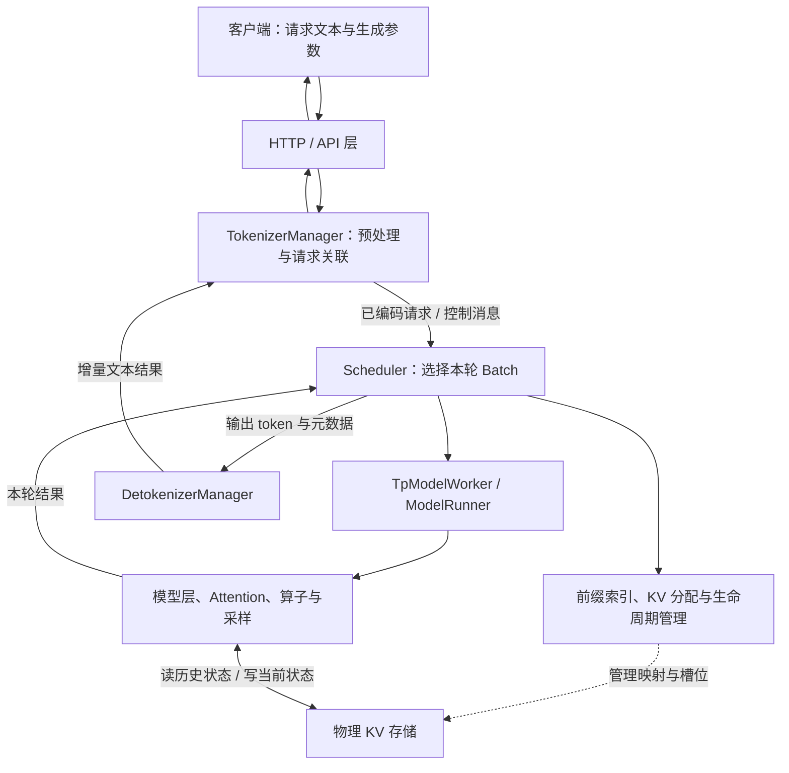
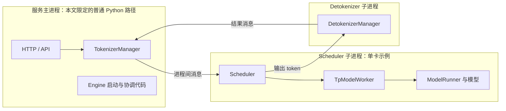

# 推理系统与 SGLang 职责地图

一条“请回答这个问题”的请求，需要经过协议处理、分词、排队、模型计算和结果输出。SGLang 把这些工作连接起来，但它的每个模块只负责其中一部分。学源码的第一步，是知道自己正在看哪一段，以及谁有权决定下一步。

本文属于**源码分析型学习资料**，是系列第 **00-01** 篇。读完应能画出普通文本生成的组件关系，并沿源码找到这条请求链路；暂不要求理解 Attention 数学或 GPU 编程。

## 0. 阅读基线与范围

| 项目 | 内容 |
| --- | --- |
| 源码路径基准 | SGLang 仓库根目录 `.`；本文源码路径均相对此目录 |
| 分支 | `codex/sglang-source-study-20260909`，来自官方 `sgl-project/sglang` 的 `main` |
| commit | `72d5c5bb73cadd7ffbf5114e5f81e29d36b6c61a` |
| 读取时间 | `2026-09-09` |
| 工作区状态 | 读取时源码 worktree 干净；原 `sglang` 工作区保持 `muxi-main` 及原有未跟踪资料 |
| 操作边界 | 静态源码阅读与 Markdown 整理；未安装依赖、导入 SGLang、启动服务或运行模型 |
| 前置 | 会读简单函数调用；不需要先读系列其他正文 |
| 本篇主线 | Python HTTP 服务、单 tokenizer/单 detokenizer、单实例普通自回归文本生成；用单卡简化 rank 关系 |
| 不展开 | Rust server、Ray、多 HTTP worker、PD、PP、投机解码、具体模型算子、多模态媒体处理细节 |

下文的源码引用均固定到上述 commit。**源码事实**指已读取到的调用或对象关系；**整理者归纳**指教学图、比喻和例子。本文没有运行观察。普通路径的关系不能自动推广到所有启动模式。

## 1. 先用人话认识各个角色

可以把系统理解成接单、安排工作、加工和交付的协作过程。不过在阅读源码时，要把“职责角色”和“操作系统进程”分开：几个角色可以在同一进程中，一种角色也可能在多个 rank 中各有一份。

| 术语 | 人话解释 | 它主要决定什么 |
| --- | --- | --- |
| 客户端 | 发来文本和生成要求的程序 | 问什么、允许生成多长、是否流式返回 |
| API 层 | 接住 HTTP 请求，解释协议字段 | 请求是否符合接口要求、怎样转换与返回 |
| SRT | SGLang Runtime，推理运行时 | 连接请求管理、调度、执行与输出 |
| Tokenizer | 将文本转换为模型认识的 token ID 的工具 | 按指定词表与规则编码/解码文本 |
| TokenizerManager | API 附近的请求管理者 | 请求预处理、发送、等待结果和关联请求状态 |
| Scheduler | 决定本轮执行什么工作的调度器 | 等待请求如何进入 batch、进度如何推进 |
| Batch | 本轮一起处理的工作集合及描述 | 自身是数据对象，选择它的是调度逻辑 |
| Worker / ModelRunner | 把调度计划落实为模型执行的对象 | 准备 forward 输入，选择执行路径并调用模型 |
| KV Cache | 保存历史 token 在模型层中的 K/V 状态 | 保存数据；复用策略、槽位分配由其他对象参与管理 |
| DetokenizerManager | 把生成 token 变成可返回文本的组件 | 维护增量解码状态与输出对应关系 |
| Model Gateway | 位于服务实例之前的可选网关 | 选择哪个 worker/实例接请求，管理路由与相关服务状态 |

这里尤其容易混淆 `Tokenizer` 和 `TokenizerManager`。前者是文本编码工具；后者还维护请求状态、异步等待和通信。类名中有 “Tokenizer”，并不表示整个类只做字符串转换。[S04]

## 2. 一张图连起普通文本生成



**图意解读：** 实线上半部表示普通路径的请求与结果流；下半部把缓存策略/分配和实际 KV 数据分开。它是整理者按职责归纳的图，不是进程数量图。Scheduler 组织执行，ModelRunner 调用模型；模型读写 KV 不等于模型拥有请求淘汰或缓存保留的全部策略。

### 2.1 请求怎样走过这张图

1. **接收与解释。** HTTP 层将具体 API 请求交给运行时的请求管理路径。不同协议适配可能有额外步骤，不能把所有 API handler 当成同一个函数。
2. **预处理与登记。** `TokenizerManager.generate_request()` 归一化请求、初始化状态、进行必要校验。单请求路径调用 `_tokenize_one_request()`，再调用 `_send_one_request()`。[S04]
3. **发送不代表执行完成。** `_send_one_request()` 将请求交给 Scheduler 通路，并标记已经 dispatch；随后需要等待响应。当前请求可能仍在调度队列中。[S05]
4. **按轮选择工作。** 普通 `event_loop_normal()` 接收请求、获取下一轮计划、执行 batch、处理结果。没有 batch 时走空闲路径。[S06]
5. **落实为一次 forward。** `TpModelWorker.forward_batch_generation()` 根据调度输入建立 `ForwardBatch`，在对应分支调用 `ModelRunner.forward()`。模型产生 logits 等结果，采样还受模式和延迟执行条件约束。[S07]
6. **返回并推进。** Scheduler 处理本轮结果，继续请求或完成请求；输出 token 经 Detokenizer 回到请求管理侧，再由 API 返回给客户端。[S03][S08]

这不是“一次 HTTP 请求调用一次模型函数就结束”。一个普通生成请求可以跨很多轮调度；一轮调度又可能包含多个不同请求。

### 2.2 主循环的最小阅读片段

下面只摘普通循环里“计划→执行→处理”的连续代码，周围还有暂停、空闲和检查逻辑，不能把这个片段当成全部循环：

```python
plan = self.get_next_batch_to_run(
    running_batch=self.running_batch, last_batch=self.last_batch
)
self.running_batch = plan.running_batch
batch = plan.batch_to_run
self.cur_batch_for_debug = batch

# Launch the current batch
if batch:
    result = self.run_batch(batch)
    self.process_batch_result(batch, result)
```

**源码事实：** 这里先得到计划，再拿计划中的 `batch_to_run` 执行。`running_batch` 与“这次实际执行的 batch”是需要分开观察的概念。[S06]

**整理者归纳：** 阅读复杂调度时，可以先问“这是在更新请求集合、形成执行计划，还是消费结果？”这样比看到 `batch` 就认为它正在 GPU 上运行更准确。

## 3. 组件边界和进程边界分别画

普通 Python HTTP 路径的 `launch_server()` 调用 `Engine._launch_subprocesses()`，然后启动 HTTP 服务相关逻辑。启动代码中既有普通路径，也有 Rust server、多 tokenizer、多个 detokenizer 等分支。[S03][S09]

只取本文限定的简单路径，可以建立以下教学进程图：



**图意解读：** 外框表示这里讨论的进程，内框表示对象或职责。HTTP 启动路径复用了 `Engine` 的启动方法，不能因此推导它还额外创建了一个名为 Engine 的独立服务进程。Scheduler 内的 worker/runner 调用也不是必然经过另一个远程服务。

以下变化会改变图的形状，后续单独展开：

| 条件变化 | 需要重新检查的边界 |
| --- | --- |
| 多卡并行 | 有多少 Scheduler/rank，各 rank 怎样接收或同步请求 |
| 多 tokenizer / detokenizer | 路由器和多个处理进程如何关联同一请求 |
| `SGLANG_RUST_SERVER` 路径 | 启动代码会跳过普通 Python tokenizer/detokenizer 的创建逻辑 |
| Ray | Scheduler 的启动与管理可转为相应 actor 路径 |
| Prefill/Decode 分离 | 请求控制流和 KV 数据流跨实例，出现额外状态机 |

这些是源码中存在的分支边界，不是本篇已经验证过的运行组合。[S09]

## 4. 为什么仓库还有 Gateway、DSL 和 Diffusion

### 4.1 Gateway：在请求进入实例之前选择去处

Model Gateway 的官方仓内说明将 worker 注册、健康检查、路由与可靠性处理分成控制面和数据面。对初学者，本篇只需要掌握：网关选择目标实例；请求到达实例后，实例里的 Scheduler 仍要决定本轮是否接纳和执行。[S10]

例子：网关把 R1 分给实例 A，并不意味着 A 的 GPU 此刻已经执行 R1；它仍可能因为队列、预算或数据就绪条件等待。此处是职责区分，不涉及某个具体路由策略的完整实现。

### 4.2 DSL：组织生成程序的前端语言接口

`python/sglang/__init__.py` 同时暴露 `function`、`gen` 等前端接口和延迟导入的 `Engine`。`lang/api.py::function()` 返回 `SglFunction`；`gen()` 构建前端生成表达式。[S01][S11]

因此，DSL 组织“程序需要生成什么、怎样组织步骤”，SRT 管“进入本运行时的请求怎样调度和执行”。直接使用 HTTP API 或 `Engine`，不要求先写一段 DSL 程序。某个 DSL backend 是否走本地 SRT，还要看所选 backend，不能从 `gen` 这个名字推断。

### 4.3 Diffusion：共享入口，但有自己的执行主线

`python/sglang/cli/serve.py` 注册了内置 `llm` 与 `diffusion` backend。`serve()` 还包含显式选择、自动检测和插件处理；选定 backend 后调用相应 `run`。[S02]

**源码事实：** 一个 CLI 入口能分发到不同服务后端。**整理者归纳：** 不应把扩散生成的去噪步骤直接解释成普通自回归 Decode。两条主线可以共享部分工程概念，但要分别追踪请求对象和执行循环。

## 5. 用 R1 建立三本账

沿用系列教学输入：R1 已编码为 8 个输入 token，允许生成最多 3 个新 token。本篇暂不讨论具体分词结果、前缀命中、分块或停止词。

| 账本 | 要记录什么 | 主要观察对象 |
| --- | --- | --- |
| 请求账 | 输入是什么，已返回多少输出，是否完成 | API 请求状态、Scheduler 中的请求对象 |
| 执行账 | 本轮算哪些请求，执行什么模式，结果是否已处理 | 调度计划、batch、forward 输入/结果 |
| 资源账 | 哪些 KV 已经写入，可否共享，何时可以释放槽位 | 缓存索引、请求映射、分配器和 KV pool |

一次正常生成中，这三本账同步推进，但不会在所有时刻都相同。例如，采样得到一个 token 后，请求的输出数量已经变化；该 token 自己的 KV 是否已计算，要看它是否进入后续 forward。这个时序在 `00-04` 专门展开。

再加入 R2：两条请求可以在同一轮 batch 中执行，也可能分开。这个决定属于调度链路。不能从 HTTP 请求并发数量直接推导执行 batch 的形状，也不能从 batch 数量直接推导 GPU 进程数。

## 6. 源码锚点与建议阅读顺序

以下路径均相对于本篇固定源码目录。先找函数在主线中的位置，再进入函数内部；首次阅读可以跳过分支细节，但要记住已经跳过哪些条件。

| 顺序 | 要确认的行为 | 文件 / 符号 | 固定源码 |
| --- | --- | --- | --- |
| 1 | 公共 API 同时包含前端和运行时入口 | `python/sglang/__init__.py` | [S01] |
| 2 | CLI 选择服务 backend | `python/sglang/cli/serve.py::serve`、`_create_backend_registry` | [S02] |
| 3 | HTTP 服务启动并取得运行时组件 | `python/sglang/srt/entrypoints/http_server.py::launch_server` | [S03] |
| 4 | 单请求预处理、发送、等待输出 | `python/sglang/srt/managers/tokenizer_manager.py::TokenizerManager.generate_request` | [S04] |
| 5 | dispatch 与请求已发送状态 | `python/sglang/srt/managers/tokenizer_manager.py::TokenizerManager._send_one_request` | [S05] |
| 6 | 普通主循环形成计划并推进执行 | `python/sglang/srt/managers/scheduler.py::Scheduler.event_loop_normal` | [S06] |
| 7 | 从 batch 进入模型执行 | `python/sglang/srt/managers/tp_worker.py::TpModelWorker.forward_batch_generation` | [S07] |
| 8 | 输出 token 的文本恢复组件 | `python/sglang/srt/managers/detokenizer_manager.py::DetokenizerManager` | [S08] |
| 9 | 进程创建与不同服务模式的分支 | `python/sglang/srt/entrypoints/engine.py::Engine._launch_subprocesses` | [S09] |
| 10 | 网关职责概览 | `sgl-model-gateway/README.md`，本篇仅使用官方说明，不声称完整路由代码审计 | [S10] |
| 11 | 前端语言接口 | `python/sglang/lang/api.py::function`、`gen` | [S11] |

## 7. 遇到现象，先找对应层

| 现象 | 先提出的问题 | 优先入口 |
| --- | --- | --- |
| 请求一到就报参数错误 | 协议解析、归一化、模型长度或采样约束在哪层失败？ | API handler、`TokenizerManager.generate_request` |
| 请求发出但一直没有首 token | 是否已 dispatch？是否进入等待队列？是否有可执行 batch？ | Tokenizer 请求状态、Scheduler 主循环 |
| 模型已经执行但客户端没有新文本 | 结果是否处理、发送、增量解码并映射回请求？ | Batch 结果处理、Detokenizer、Tokenizer 等待响应路径 |
| 前缀缓存命中但仍然等待 | 索引命中是否伴随数据就绪与可用预算？ | 缓存与 Scheduler 的接口，后续阶段 04 |
| 网关显示有可用 worker，但某请求失败 | worker 可达、运行时可服务、该请求成功分别由什么证据支持？ | Gateway 与运行时分别检查 |

这是一张定位地图，不是给定现象的根因结论。单一状态、日志或健康检查结果不能替代端到端证据。

## 8. 自测、答案要点与下一步

1. **`ModelRunner` 会不会自己决定从 HTTP 等待队列取哪条请求？** 这篇普通主线中，选批由 Scheduler 完成，runner 接收相应 forward 输入。能执行某个 batch，不等于拥有接纳请求的策略。
2. **一个 `Scheduler`、一个 `TpModelWorker`、一个 `ModelRunner` 是否必然是三个进程？** 不是。查看进程创建点和对象构造/调用关系；本文普通单卡示例中它们位于同一 Scheduler 进程的执行链。
3. **客户端并发提交 10 条请求，就一定有一个大小为 10 的 batch 吗？** 不能推出。调度轮次、准入预算、完成/等待状态等会影响分组。
4. **Gateway 选择了一个实例，是否意味着请求已开始模型计算？** 不意味着；选择实例与实例内准入、执行是不同决策。
5. **不写 `sglang.function` 就不能用 SGLang 服务吗？** 可以通过 API 或 `Engine` 使用运行时；DSL 是另一组前端接口。

**验收练习：** 不看本文，画出 R1 从请求进入到文本返回的闭环，用一种线表示请求/结果消息，另一种线表示模型读写 KV；再用外框圈出本文限定路径的进程。能指出每个框的源码入口，即完成本篇的阅读目标。

**本篇结论：** 先按请求主线区分入口、管理、调度、执行、数据存储和输出，再叠加实际进程拓扑，能避免把源码里的类名当成系统架构本身。

返回[系列目录](../README.md)，或继续阅读 [00-02《读源码必备的 Python 与并发基础》](02-读源码必备的Python与并发基础.md)。

[S01]: https://github.com/sgl-project/sglang/blob/72d5c5bb73cadd7ffbf5114e5f81e29d36b6c61a/python/sglang/__init__.py
[S02]: https://github.com/sgl-project/sglang/blob/72d5c5bb73cadd7ffbf5114e5f81e29d36b6c61a/python/sglang/cli/serve.py#L129
[S03]: https://github.com/sgl-project/sglang/blob/72d5c5bb73cadd7ffbf5114e5f81e29d36b6c61a/python/sglang/srt/entrypoints/http_server.py#L2794
[S04]: https://github.com/sgl-project/sglang/blob/72d5c5bb73cadd7ffbf5114e5f81e29d36b6c61a/python/sglang/srt/managers/tokenizer_manager.py#L776
[S05]: https://github.com/sgl-project/sglang/blob/72d5c5bb73cadd7ffbf5114e5f81e29d36b6c61a/python/sglang/srt/managers/tokenizer_manager.py#L1577
[S06]: https://github.com/sgl-project/sglang/blob/72d5c5bb73cadd7ffbf5114e5f81e29d36b6c61a/python/sglang/srt/managers/scheduler.py#L1893
[S07]: https://github.com/sgl-project/sglang/blob/72d5c5bb73cadd7ffbf5114e5f81e29d36b6c61a/python/sglang/srt/managers/tp_worker.py#L593
[S08]: https://github.com/sgl-project/sglang/blob/72d5c5bb73cadd7ffbf5114e5f81e29d36b6c61a/python/sglang/srt/managers/detokenizer_manager.py#L102
[S09]: https://github.com/sgl-project/sglang/blob/72d5c5bb73cadd7ffbf5114e5f81e29d36b6c61a/python/sglang/srt/entrypoints/engine.py#L1050
[S10]: https://github.com/sgl-project/sglang/blob/72d5c5bb73cadd7ffbf5114e5f81e29d36b6c61a/sgl-model-gateway/README.md
[S11]: https://github.com/sgl-project/sglang/blob/72d5c5bb73cadd7ffbf5114e5f81e29d36b6c61a/python/sglang/lang/api.py#L28
