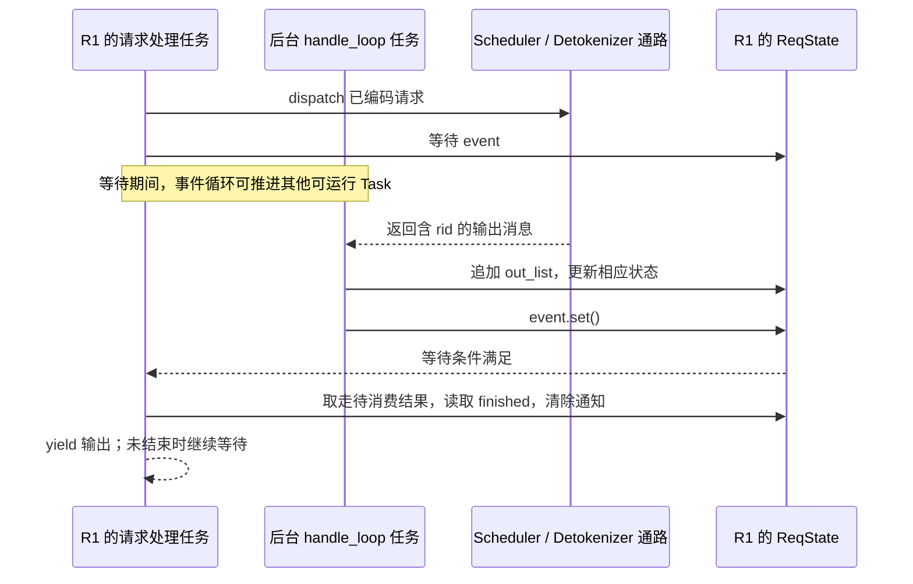

# 读源码必备的 Python 与并发基础

> **先建立架构心智模型：** [M02 · 启动装配与运行时边界](<../architecture/02-启动装配与运行时边界.md>) · [M03 · 请求对象与生命周期全景](<../architecture/03-请求对象与生命周期全景.md>)。先看职责、数据和生命周期，再回到本篇源码细节。

读 SGLang 时，常见的障碍不是某个 Python 语法有多难，而是误判了“这行代码什么时候执行、状态属于谁、谁会回来唤醒它”。例如，`async def` 不表示新建线程，`event.set()` 不表示请求已经完成，删除字典里的状态也不意味着所有地方都不能再访问这个对象。

本篇用当前 SGLang 的真实请求状态和进程启动代码解释这些问题，不展开一套通用 Python 教程。

## 0. 阅读基线与范围

| 项目 | 内容 |
| --- | --- |
| 文档类型与编号 | 源码分析型；`00-02` |
| 源码路径基准 | SGLang 仓库根目录 `.`；本文源码路径均相对此目录 |
| 分支 | `codex/sglang-source-study-20260909`，来自官方 `main` |
| commit | `72d5c5bb73cadd7ffbf5114e5f81e29d36b6c61a` |
| 读取时间 | `2026-09-09` |
| 工作区状态 | 源码 worktree 干净；Wiki 保留原有未提交资料 |
| 操作边界 | 静态阅读、文档与链接检查；未导入或运行 SGLang，也未执行本篇教学伪代码 |
| 前置 | [00-01 职责地图](01-推理系统与SGLang职责地图.md)；能读函数和简单循环 |
| 主线 | Python 请求状态、异步等待/输出、启动进程、IPC、回调和 mixin |
| 不展开 | Python 全部语法、底层解释器实现、GPU stream/event 的完整内存依赖、所有取消路径审计 |

源码事实使用固定 commit 引用；教学时序、简化伪代码和排障方法属于整理者归纳。Python 官方文档与 PyZMQ 官方说明用于补充语言/库语义，网页读取日期同上；这不表示源码要求使用页面展示的最新 Python 版本。

## 1. 先把六个名词分开

| 名词 | 人话解释 | 在本篇中的例子 |
| --- | --- | --- |
| 对象 | 保存字段和提供方法的一份实例 | `ReqState` 保存某请求的待返回结果 |
| 函数/方法调用 | 在当前执行上下文中做一件事 | `_dispatch_to_scheduler()` 调用消息发送函数 |
| 协程 | 可以在等待点暂停、以后继续的执行过程 | 等待请求输出的协程 |
| Task | 由事件循环安排执行的协程任务 | `handle_loop` 对应的后台接收任务 |
| 线程 | 进程内部的执行线程 | 部分后台或 watchdog 工作；不是每个 `async def` 都创建它 |
| 进程 | 有独立进程身份和地址空间的运行单元 | `mp.Process(...).start()` 启动 Scheduler |

还要分开两个“循环”：Python 的 asyncio 事件循环调度协程；SGLang Scheduler 的 `event_loop_normal()` 则按轮组织推理工作。名称都有 `loop`，并不意味着它们由同一种调度器管理。

## 2. Dataclass 和类型标注：看懂一份状态账本

### 2.1 `ReqState` 保存的是什么

`tokenizer_manager.py` 中的 `ReqState` 是一个 dataclass，包含 `out_list`、`finished`、`event`、原始请求 `obj`、时间统计，以及 `dispatched` 等字段。[S01]

| 字段 | 用途 | 容易误读的地方 |
| --- | --- | --- |
| `out_list` | 已收集、待等待者消费的输出 | 事件通知本身不携带这些结果 |
| `finished` | 请求在这里是否已经结束 | 收到一个中间输出不等于 finished |
| `event` | 唤醒等待输出的异步任务 | 是通知状态，不是 GPU 完成事件 |
| `obj` | 关联最初的请求参数 | 不等于 Scheduler 进程中的全部请求状态 |
| `dispatched` | 请求是否已送入 Scheduler 通路 | 不代表已经进入 forward |
| `output_ids` / `text_chunks` | 已累计的输出状态 | 每个请求应拥有自己的可变容器 |

源码为一些列表使用 `dataclasses.field(default_factory=list)`。它在每次构造对象时创建新的列表；如果让不同请求意外共享同一个可变容器，R1 的结果就可能混入 R2 的状态。dataclass 能按字段生成构造等方法，但不会替你自动证明业务状态正确。[S01][P01]

### 2.2 `Optional`、`Union` 和结构对象怎么读

- `Optional[T]` 表示可能是 `T`，也可能是 `None`。看到它之后，要继续找什么情况下为空，以及调用前是否处理了这个分支。
- `Union[A, B]` 表示接口可能接收多类输入。例如生成请求和 embedding 请求进入部分共用管理路径，再按类型分支。
- 类型标注提供阅读线索，不应把一处标注当成所有运行时值已经验证的证据。

当前 `NextBatchPlan` 是 `msgspec.Struct`，有 `batch_to_run: Optional[ScheduleBatch]` 和 `running_batch: ScheduleBatch` 两个字段。[S02]

**整理者归纳：** 与其把它看成“又一种难记的 batch 类”，不如先读成一个返回计划：“这是更新后的运行集合；这可能是本轮要执行的 batch，也可能没有可执行 batch。”它与 `ReqState` 用了不同的数据结构工具，但都应先从字段的业务角色理解。

## 3. `async`、`await`、`yield`：代码何时真正向前走

### 3.1 普通协程与异步生成器不同

普通 `async def` 函数在调用时产生协程对象，通常通过 `await` 或 Task 等方式驱动执行。若函数体里包含 `yield`，它则构成异步生成器，调用方通常通过 `async for` 逐次获取输出。[P02][P03]

SGLang 的 `TokenizerManager.generate_request()` 在单请求路径中使用：

```python
async for response in self._wait_one_response(obj, request):
    yield response
```

**源码事实：** 一个请求处理接口可以多次交出响应，调用栈不必等到请求全部结束才返回第一次数据。[S03]

**整理者归纳：** 流式输出更像“有一段就交一段”，而不是反复建立一条全新的 HTTP 请求。这里返回几次仍受 stream、输出聚合、完成状态等逻辑影响，不能从看到 `yield` 就推导每个 token 必有一个网络数据包。

### 3.2 `await` 不是新建线程，也不是总会切换任务

`await` 等待的是一个可等待操作。如果它确实需要等待，当前 Task 可以暂停，让同一个事件循环中的其他 Task 前进；如果结果已经就绪，则可能继续执行，并不保证每一处 `await` 都发生一次任务切换。[P02]

因此，下面几种概念不能混在一起：

| 代码/行为 | 能说明什么 | 不能直接说明什么 |
| --- | --- | --- |
| `async def` | 定义异步函数或异步生成器 | 自动创建线程或进程 |
| `await event.wait()` | 等待这个事件条件 | GPU 已经完成所有操作 |
| `loop.create_task(...)` | 把协程安排为 Task | 独立占用一个操作系统进程 |
| `yield out` | 向调用方交出一项输出 | 请求及所有设备资源都已释放 |

### 3.3 同步包装器为什么有意义

当前源码的 `_wait_one_response()` 是普通 `def`，立即取出状态引用，再返回异步生成器：[S04]

```python
state = self.rid_to_state[obj.rid]
return self._stream_one_response(obj=obj, state=state, request=request)
```

要分清两个时刻：**取得 `state` 引用**发生在调用普通包装器时；**推进异步生成器**发生在后续迭代时。这样即使字典键之后被正常输出处理路径删除，已经保存的对象引用仍可以被等待者使用。

这里不是让“已完成请求永远留在字典里”。字典中的可检索性与对象是否仍有合法引用，是不同的生命周期问题。也不能从这两行推导其他异步状态都没有竞争；需要逐个检查读取时刻和引用持有者。

## 4. 一个输出如何唤醒对应请求

### 4.1 发送路径与接收路径不是一条阻塞调用链

`generate_request()` 会确保后台 `handle_loop` 已创建。`auto_create_handle_loop()` 使用事件循环创建 Task，并将其保存在 `asyncio_tasks` 集合；`handle_loop()` 等待 Detokenizer 消息，再将输出交给 `_handle_batch_output()`。[S03][S05]

`_handle_batch_output()` 根据每个 `rid` 找状态，写入结果，并在相应时机调用 `event.set()`。等待侧 `_stream_one_response()` 等待 event，然后取出 `out_list`、保存 `finished`、清空待消费列表并清除事件通知。[S04][S06]



**图意解读：** R1 的请求任务和后台接收任务可以运行在同一个进程/事件循环中。跨进程返回的消息先由接收任务处理，再通过本地状态和事件唤醒等待者；图中的 `ReqState` 是共享给这些本地协程的状态对象，不是另一个进程。

### 4.2 Event 是通知，不是结果队列

若 R1 的两个输出在等待者再次运行前就已到达，不能靠调用了几次 `set()` 推导输出数量。`asyncio.Event` 保存一个标志，不是累积 token 数的计数器；实际结果放在 `out_list` 等字段中。[P04]

当前源码显式处理了多个待消费流式 chunk：在增量流式模式下，可能合并多个 chunk，避免丢失 token ID；其他模式按其输出格式选择待返回结果。[S04]

教学例子：R1 的 O1、O2 先后到达，R2 的结果也到达。接收侧按 `rid` 写入不同状态；R1 的等待者被唤醒后要消费自己的已积累数据。**“唤醒了”只表示应检查状态，具体有多少输出、是否完成，仍由数据字段决定。**

### 4.3 取消本地等待不等于远端工作停止

`generate_request()` 的异常清理区分已 dispatch 与尚未 dispatch 的请求；注释和调用说明，发送前失败与发送后失败需要不同清理动作。[S03]

异步任务取消时，Python 会通过取消异常影响协程执行；清理代码需要考虑异常路径。但取消 Python Task 本身不构成“Scheduler 已停止、GPU 不再写入、KV 槽位可复用”的完成证明。[P02]

本篇只建立这个边界；完整正常完成/abort 路径留到阶段 02，跨实例传输退役留到阶段 07。

## 5. 多进程和 ZMQ：沿发送端追到接收端

### 5.1 找进程，要找创建点

`Engine._launch_scheduler_processes()` 在普通非 DP controller 分支中遍历 rank 范围，创建 `mp.Process(target=run_scheduler_process_func, args=...)` 并调用 `start()`。启动就绪信息通过另建的 `mp.Pipe` 通路收集。[S07]

`_launch_detokenizer_subprocesses()` 同样有 `mp.Process` 创建点，并根据 worker 数选择单进程或路由到多个 worker 的结构。[S08]

**整理者归纳：** 查看 `class Scheduler` 能知道对象能力，查看 `mp.Process` 和 target 才能知道它在哪里运行。进程数量还受 rank、节点、DP、服务模式影响，不能把这两处代码压成一个固定通用数量。

### 5.2 找通信，要把三层一起追

当前 TokenizerManager 的 `_dispatch_to_scheduler()` 调用 `sock_send()`；`io_struct.py` 的发送/接收包装按 `_USE_PICKLE_IPC` 分支使用 Python 对象序列化路径或 MsgPack 编码路径。[S09][S10]

| 层次 | 阅读问题 | 不应混淆 |
| --- | --- | --- |
| 业务消息 | 请求、输出、控制命令分别有哪些字段？ | 消息类型与业务完成状态 |
| 编解码 | `sock_send` / `sock_recv` 怎样把对象变成可传输内容？ | 序列化格式与消息通道 |
| 传输与处理 | 使用什么 socket，谁接收并分发？ | 发送返回、接收完成、业务处理完成 |

两个进程传递经序列化的对象，不是把一个普通 Python 对象引用直接交给另一进程。对于显式共享内存或其他传输对象还要读专门机制，不能从 IPC 这个名字推导所有数据都做了相同拷贝。PyZMQ 官方序列化说明也将 socket 传输与对象编码分开讨论。[P05]

本版存在显式 pickle 包装和兼容分支，不能只因为外层使用 MsgPack 就宣称消息完全没有 pickle。这里学习的是实际链路，运行时不应把这类内部反序列化接口当成可接收不受信任数据的通用公网 API。[S10][P05]

## 6. Mixin、回调与“函数在哪里”

### 6.1 Mixin 增加方法，不增加进程

`Scheduler` 的类声明继承多个 mixin，例如 PP、Prefill/Decode 分离、Multiplex 等。看到 `self.some_method()` 时，定义可能在父类/mixin 中，而不是当前文件。[S11]

查找顺序可以是：先搜索方法名 → 看类继承列表 → 打开实现 → 回到调用点核对启用条件。同名方法涉及覆写时，继续按方法解析顺序确认实际归属。不能因为类继承了某 mixin，就说所有请求都运行对应模式。

### 6.2 回调是“之后要做的事”

`SchedulerInitResult` 保存了 `wait_for_ready`、`block_until_scheduler_exits` 等可调用字段；`_launch_scheduler_processes()` 内定义实际函数，再放进返回对象。[S07][S12]

两种写法的差别是关键：

```python
# 教学示意，未执行；不是完整源码片段。
on_ready = wait_for_ready    # 保存函数，之后可以调用
on_ready()                  # 此时执行这个函数
```

读到 `Callable` 不要止于“这是一种类型”。继续找谁传入函数、函数捕获了哪些状态、什么时候被调用，以及调用失败由谁处理。

### 6.3 上下文管理器标记一个资源或状态作用域

`generate_request()` 中存在 `async with self.model_update_lock.reader_lock` 等结构。[S03] 人话解释是：进入某段处理前先取得约定的访问条件，离开时执行对应退出逻辑。锁保护什么、持有多久、异常或异步 `yield` 是否仍处于其作用域，都要读实际实现与缩进，不能从 `with` 关键字推出整条系统链路线程安全。

## 7. 源码锚点与阅读练习

| 行为 | 文件 / 符号 | 固定源码 |
| --- | --- | --- |
| 请求状态字段与独立可变容器 | `python/sglang/srt/managers/tokenizer_manager.py::ReqState` | [S01] |
| 本轮计划的数据结构 | `python/sglang/srt/managers/schedule_batch.py::NextBatchPlan` | [S02] |
| 异步生成、锁作用域和失败清理 | `python/sglang/srt/managers/tokenizer_manager.py::TokenizerManager.generate_request` | [S03] |
| 立即取状态、异步等输出 | `python/sglang/srt/managers/tokenizer_manager.py::TokenizerManager._wait_one_response`、`_stream_one_response` | [S04] |
| 创建后台接收 Task | `python/sglang/srt/managers/tokenizer_manager.py::TokenizerManager.auto_create_handle_loop`、`handle_loop` | [S05] |
| 按 rid 填充输出并通知 | `python/sglang/srt/managers/tokenizer_manager.py::TokenizerManager._handle_batch_output` | [S06] |
| 创建 Scheduler 进程与就绪回调 | `python/sglang/srt/entrypoints/engine.py::Engine._launch_scheduler_processes` | [S07] |
| 创建 Detokenizer 进程 | `python/sglang/srt/entrypoints/engine.py::Engine._launch_detokenizer_subprocesses` | [S08] |
| 发送给 Scheduler | `python/sglang/srt/managers/tokenizer_manager.py::TokenizerManager._dispatch_to_scheduler` | [S09] |
| 编码与 ZMQ 包装 | `python/sglang/srt/managers/io_struct.py::sock_send`、`sock_recv` | [S10] |
| mixin 组合 | `python/sglang/srt/managers/scheduler.py::Scheduler` | [S11] |
| 存放函数的返回对象 | `python/sglang/srt/entrypoints/engine.py::SchedulerInitResult` | [S12] |

**练习：** 对 R1 的 `generate_request` 路径做标记：普通调用标 C，异步等待标 W，交出输出标 Y，跨进程消息标 M，状态清理标 R。每个 W 都向外追一个“谁使等待条件成立”的入口。这个方法适合之后读缓存回载、权重更新和控制命令响应。

## 8. 排障地图与自测答案

| 现象 | 先检查什么 | 不能直接下的结论 |
| --- | --- | --- |
| 一处等待一直不返回 | 事件由谁设置，接收循环是否前进，rid 是否仍正确关联 | 不能只凭 `await` 认定 GPU 挂死 |
| 收到通知但输出不全 | 待消费列表、增量 chunk 聚合、完成标记和输出顺序 | 通知次数不等于 token 数 |
| 字典里找不到请求 | 是正常删除、提前异常、重复消息，还是只剩合法局部引用？ | 字典删除不等于对象立即失效 |
| 某方法在本文件找不到 | mixin、父类、回调注入、组件委托 | 不等于该方法不存在 |
| 发送成功但没有响应 | 对端接收、解码、业务处理和回程消息分别到哪一步？ | 发送返回不证明请求完成 |

1. **R1 在等待 `asyncio.Event` 时，R2 是否可能前进？** 可以；如果事件循环有其他可运行任务，它可以调度它们。若当前代码执行了长时间同步阻塞，则不能仅凭异步接口保证并发进度。
2. **调用异步生成器函数是否会立即执行其中所有代码？** 不会。需要由异步迭代等操作推进；因此源码中的同步包装器提前保存引用具有时序意义。
3. **给 R1 调用两次 `event.set()`，能否代表产生了两个 token？** 不能。应检查输出数据，Event 不是计数器。
4. **取消客户端等待任务之后，可以立刻复用 GPU KV 槽位吗？** 本地取消不能证明设备或远端工作结束，必须追踪运行时清理和数据依赖。
5. **`default_factory=list` 为什么适合请求字段？** 每个实例得到自己的列表，避免把不同请求的可变状态混在一起。

**验收标准：** 能指出 R1 的状态归属、产生通知的一方、等待的一方、跨进程边界，以及异常发生后哪些对象仍可能在工作。本文已完成静态说明；没有用服务运行或并发测试证明完整链路的正确性。

返回[系列目录](../README.md)，或继续阅读 [00-03《从文本到 Token 再到模型输出》](03-从文本到Token再到模型输出.md)。

[S01]: https://github.com/sgl-project/sglang/blob/72d5c5bb73cadd7ffbf5114e5f81e29d36b6c61a/python/sglang/srt/managers/tokenizer_manager.py#L224
[S02]: https://github.com/sgl-project/sglang/blob/72d5c5bb73cadd7ffbf5114e5f81e29d36b6c61a/python/sglang/srt/managers/schedule_batch.py#L3725
[S03]: https://github.com/sgl-project/sglang/blob/72d5c5bb73cadd7ffbf5114e5f81e29d36b6c61a/python/sglang/srt/managers/tokenizer_manager.py#L776
[S04]: https://github.com/sgl-project/sglang/blob/72d5c5bb73cadd7ffbf5114e5f81e29d36b6c61a/python/sglang/srt/managers/tokenizer_manager.py#L1730
[S05]: https://github.com/sgl-project/sglang/blob/72d5c5bb73cadd7ffbf5114e5f81e29d36b6c61a/python/sglang/srt/managers/tokenizer_manager.py#L2200
[S06]: https://github.com/sgl-project/sglang/blob/72d5c5bb73cadd7ffbf5114e5f81e29d36b6c61a/python/sglang/srt/managers/tokenizer_manager.py#L2240
[S07]: https://github.com/sgl-project/sglang/blob/72d5c5bb73cadd7ffbf5114e5f81e29d36b6c61a/python/sglang/srt/entrypoints/engine.py#L846
[S08]: https://github.com/sgl-project/sglang/blob/72d5c5bb73cadd7ffbf5114e5f81e29d36b6c61a/python/sglang/srt/entrypoints/engine.py#L964
[S09]: https://github.com/sgl-project/sglang/blob/72d5c5bb73cadd7ffbf5114e5f81e29d36b6c61a/python/sglang/srt/managers/tokenizer_manager.py#L580
[S10]: https://github.com/sgl-project/sglang/blob/72d5c5bb73cadd7ffbf5114e5f81e29d36b6c61a/python/sglang/srt/managers/io_struct.py#L2475
[S11]: https://github.com/sgl-project/sglang/blob/72d5c5bb73cadd7ffbf5114e5f81e29d36b6c61a/python/sglang/srt/managers/scheduler.py#L425
[S12]: https://github.com/sgl-project/sglang/blob/72d5c5bb73cadd7ffbf5114e5f81e29d36b6c61a/python/sglang/srt/entrypoints/engine.py#L159
[P01]: https://docs.python.org/3/library/dataclasses.html
[P02]: https://docs.python.org/3/library/asyncio-task.html
[P03]: https://docs.python.org/3/reference/expressions.html#asynchronous-generator-functions
[P04]: https://docs.python.org/3/library/asyncio-sync.html#asyncio.Event
[P05]: https://pyzmq.readthedocs.io/en/latest/howto/serialization.html
