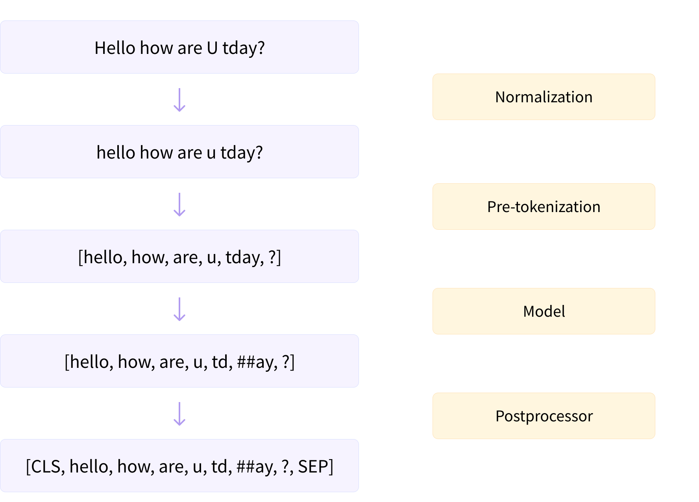
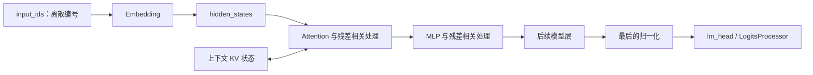
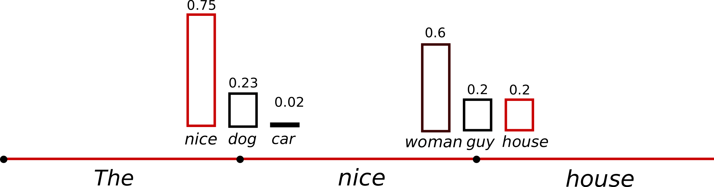

# 从文本到 Token 再到模型输出

模型并不直接计算一段中文或英文字符串。普通文本生成会把文本变成 token ID，再变成向量，经过模型层得到候选 token 的分数，选出新的 token ID，最后转换为可读文本。

读完本篇，应能区分文本、token、hidden states、logits、概率与输出字符串，并解释“模型做完一次 forward”为什么不等于“整段回答已经生成”。

## 0. 阅读基线与范围

| 项目 | 内容 |
| --- | --- |
| 文档类型与编号 | 源码分析型；`00-03` |
| 源码路径基准 | SGLang 仓库根目录 `.`；本文源码路径均相对此目录 |
| 分支 | `codex/sglang-source-study-20260909`，来自官方 `main` |
| commit | `72d5c5bb73cadd7ffbf5114e5f81e29d36b6c61a` |
| 读取时间 | `2026-09-09` |
| 工作区状态 | 源码 worktree 干净；原源码仓与 Wiki 的既有资料保留 |
| 操作边界 | 只读源码与文档检查；未加载 tokenizer/权重，未启动模型或执行示例 |
| 前置 | [00-01 职责地图](01-推理系统与SGLang职责地图.md)；遇到异步接口可查 [00-02](02-读源码必备的Python与并发基础.md) |
| 主线 | 普通纯文本自回归生成，以仓内 Llama 实现理解数据变化；用单请求、单卡、未启用特殊捕获/并行的教学形状 |
| 不展开 | 具体 tokenizer 算法、完整 Transformer 数学、chat template 协议、多模态、投机、多卡词表分片和精度验证 |

源码事实由固定链接支持；符号 token、形状表和候选概率例子都是整理者归纳。没有实际分词或模型输出被测得，不能把本篇示意 token 当成某模型的真实词表结果。

## 1. 六种数据，分别在回答什么问题

| 数据 | 人话解释 | 典型表示 | 不能当成什么 |
| --- | --- | --- | --- |
| 原始文本 | 人类输入的字符序列 | 字符串 | 已经确定的 token 序列 |
| token ID | 某 tokenizer 词表里的离散编号 | 整数列表/整数张量 | 一个词的通用编号或一个向量 |
| embedding | token 对应的初始向量表示 | 浮点/后端支持的数值张量 | 最终下一 token 的概率 |
| hidden states | token 经过模型层更新后的内部表示 | 每个位置的一组数值 | 原文本或完整 KV cache |
| logits | 对候选词表项的分数 | 沿词表维度的一行分数 | 已归一化概率 |
| 输出 token / 文本 | 选定编号及其解码结果 | ID 列表、增量字符串 | 必然一一对应的字/词/网络 chunk |

模型权重规定这些变换如何计算；请求输入决定本次计算出的状态。两条请求使用同一份模型权重，不意味着它们的 hidden states 或 KV 可以互换。

## 2. 文本怎样变成 token ID

### 2.1 先问输入已经是哪一种格式

`TokenizerManager._tokenize_one_request()` 区分了传入 `input_embeds`、传入 `input_ids` 和需要对文本编码等路径。普通纯文本进入 `_tokenize_texts()`；已有 `input_ids` 则无需重复按文本分词。[S01][S02]

当前代码还会检查特殊输入条件。例如，跳过 tokenizer 初始化时不能直接接受文本；`input_embeds` 输入与 radix cache 的组合有显式限制。这些约束说明“都是请求输入”不代表它们可以任意互换。[S01]

本篇只走普通文本路径。chat API 可能先应用对话模板，加入角色、边界或生成提示相关 token；因此客户端看到的消息文本长度也不能直接当作最终模型输入长度。具体协议与模板处理在阶段 02 展开。

### 2.2 分词工作在源码里有多条实现路径

`_tokenize_texts()` 会判断输入形式和 tokenizer 能力，选择异步动态批量分词、逐文本 `encode()` 或批量 tokenizer 调用，最终提取 `input_ids` 等结果。[S02]

**源码事实：** 方法返回的是输入编码结果，后续还需要验证、构造内部请求并发送给 Scheduler。**整理者归纳：** “分词完成”可以看成请求的数据格式已就绪，而不是模型已计算过这些 token。

一个 token 可能对应一个词、一部分词、标点、特殊标记或更细的文本片段；具体由 tokenizer 与词表决定。对教学例子，我们直接设定：

```text
R1 的模型输入：x0, x1, x2, x3, x4, x5, x6, x7
输入 token 数：8
允许最多生成：3 个新 token
```

`x0` 等只是 token 的符号名称。没有声称某句具体中文恰好被分成 8 个 token，也没有给出未经 tokenizer 验证的词表 ID。

### 图解补充：文字经过分词流水线



[查看原尺寸](../../../images/sglang-source-study/01-tokenizer-pipeline.svg)。

**图意解读：** 沿左侧从上到下读：文字规范化、预切分、子词切分，最后加入特殊标记。右侧的 Model 指分词算法，不是负责生成回答的语言模型。

**对应本篇源码：** 对照 `_tokenize_texts`：SGLang 调用模型对应的 tokenizer，取得 `input_ids`；图右侧的分词 Model 不负责生成回答。 [源码：python/sglang/srt/managers/tokenizer_manager.py][S02]

**来源与边界：** [Building a tokenizer, block by block](https://huggingface.co/learn/llm-course/chapter6/8?fw=pt)，Hugging Face LLM Course，未标独立发布日期。这是 Hugging Face 的分词示例；转小写、WordPiece 的 ##、CLS/SEP 都取决于 tokenizer，不是所有 SGLang 模型的固定步骤。图中还未画出词表 ID 到 embedding 的计算。 [来源档案 F01](../../../images/sglang-source-study/SOURCES.md#f01)。

## 3. 从 ID 到模型内部表示

### 3.1 Embedding：用编号取得向量

`LlamaModel.forward()` 在第一 PP rank、没有直接传入 embedding 的分支中调用：

```python
hidden_states = self.embed_tokens(input_ids)
```

`LlamaModel` 构造时根据 `config.vocab_size` 和 `config.hidden_size` 创建词表 embedding 模块。[S03]

可以把它理解成：token ID 是查找入口，结果是可参与矩阵运算的数值向量。编号相差 1 并不代表语义一定更相近；语义相关性不能从离散 ID 大小直接推导。

### 3.2 模型层：每经过一层，就更新内部表示

当前 Llama 路径遍历本 stage 的层，调用 `LlamaDecoderLayer`。层内主要经过归一化、Attention、残差相关处理和 MLP，再把新的 `hidden_states` 与 `residual` 交回。[S03][S04]

`LlamaAttention` 由输入内部表示产生 Q/K/V，并调用 `RadixAttention`，之后再做输出投影。它把“本次位置的表示”与“可访问的上下文状态”连接起来；KV 存储接口与具体 Attention backend 在后续章节展开。[S05]



**图意解读：** 方框表示计算职责，不是独立进程。它简化了 Llama 的单 stage 主线，没有画出所有 norm、融合算子或特殊捕获分支；KV 与 Attention 双向关联表示读历史和写当前状态，不表示 KV 是每层之间传递的 hidden states。

### 3.3 用形状检查自己有没有读错

设 `H` 为 hidden size，`V` 为词表大小。先取单请求、未命中缓存、输入 8 tokens 的普通 Prefill 教学场景：

| 位置 | 教学形状 | 解释 |
| --- | --- | --- |
| 输入 ID | `[8]` | 8 个输入位置的离散编号 |
| Embedding 后 | `[8, H]` | 每个输入位置得到 H 维表示 |
| 各模型层输出 | `[8, H]` | 外部 hidden size 保持，层内可有其他投影形状 |
| 用于下一 token 预测的表示 | 逻辑上 `[1, H]` | 取该请求需要预测下一 token 的位置 |
| 下一 token 的 logits | 逻辑上 `[1, V]` | 一行，对整个词表候选打分 |
| 采样得到的 ID | `[1]` | 这次选择一个新 token |

这是忽略并行分片、padding、特殊任务和后端布局的形状说明，不是实际运行打印。SGLang 可以将不同请求本轮需要计算的 token 打包，不能总按 `[batch, sequence, hidden]` 的稠密三维输入想象。到了 Decode，单请求本轮常只新增一个输入位置，但仍要访问历史 KV。

## 4. 从内部表示到下一个 token

### 4.1 `lm_head` 与 logits：先产生候选分数

`LlamaForCausalLM.forward()` 先调用底层模型。在最后 PP rank 的生成分支中，再把 hidden states、`lm_head` 和 `ForwardBatch` 交给 `LogitsProcessor`；embedding 任务则走另一输出路径。[S06]

`LogitsProcessor.forward()` 按执行模式和所需输出选择相关位置的 hidden states，计算并返回 `next_token_logits`；如果还要求输入 logprob 或其他输出，就有额外路径。[S07]

这解释了一个常见疑问：Prefill 处理了多个输入 token，并不代表必须为客户端返回每个输入位置的整份词表分数。普通“生成下一 token”只需要对应预测位置的候选分数；服务可以另按请求要求返回 logprob 信息。

### 4.2 采样：将候选分数变成离散选择

`Sampler.forward()` 读取 `logits_output.next_token_logits`，预处理 logits，再根据采样状态走 greedy 或其他采样分支。greedy 的普通实现使用 `argmax`；非 greedy 的一条标准路径按 temperature 缩放、softmax，再调用采样函数。[S08]

为了理解区别，设某个玩具词表只有 A、B、C 三个候选，变换后的概率为 0.6、0.3、0.1：

| 方式 | 教学理解 |
| --- | --- |
| greedy | 选择当前最高分候选 A |
| 随机采样 | 按允许的分布抽样，不保证每次选 A |
| top-k / top-p 等约束 | 调整可选候选集合或采样分布；具体次序和实现由路径决定 |
| grammar / 自定义处理 | 还可能改变候选是否合法或分数如何处理 |

这些概率是假设值，不是某个实际模型的输出。正文阶段 05、08 会核查完整处理顺序；本篇只建立“模型算分”和“按请求规则选 token”的边界。

当前 `SamplingParams` 会把接近零的合法 temperature 转成 greedy 对应的内部设置，包括将 `top_k` 设为 1。不要把一个 API 输入值直接当作采样 kernel 最终收到的原样参数。[S09]

### 4.3 概率与正确答案是两回事

较高 logits 或较高生成概率表示模型在当前输入与计算条件下更倾向那个候选，不等于它陈述的事实已经验证。返回的 logprob 还可能受“原始分布还是变换后分布”等设置影响；比较两次输出时需要先统一口径。[S08]

### 图解补充：概率最高不等于每次都被选中



[查看原尺寸](../../../images/sglang-source-study/02-temperature.png)（手机查看宽图时可横屏或放大）。

**图意解读：** 蓝柱是同一上下文后的候选概率，红柱标出一次抽到的 house。先看整张分布，再区分“取最大值”和“按分布抽样”。

**对应本篇源码：** 对照 `Sampler` 的选择步骤，把分布、采样结果和返回 logprob 分开；后两者不应画成同一个数。 [源码：python/sglang/srt/layers/sampler.py][S08]

**来源与边界：** [How to generate text: using different decoding methods for language generation with Transformers](https://huggingface.co/blog/how-to-generate)，Patrick von Platen / Hugging Face，2020-03-01；页面注明 2023-07 更新。这是教学分布，不是本系列的模型输出，也不是两种温度的对照实验。具体过滤、温度和 logprob 的计算顺序见正文。 [来源档案 F02](../../../images/sglang-source-study/SOURCES.md#f02)。

## 5. R1 怎样逐步生成三个输出 token

继续使用 8 个输入 token、输出最多 3 个 token 的例子。假设普通自回归生成、没有提前停止、没有投机或分块：

| 轮次 | 本轮新增输入 | 本轮要预测 | 累计已生成输出 |
| --- | --- | --- | --- |
| 首轮 Prefill | `x0 … x7` | `y0` | 1 个 |
| 第一次 Decode | `y0`，结合已有上下文状态 | `y1` | 2 个 |
| 第二次 Decode | `y1`，结合已有上下文状态 | `y2` | 3 个，达到教学例子长度上限 |

这是“用已知前缀预测下一个 token”的时间关系。`y0` 被选出来之后，通常在下一轮作为输入进入模型；不能说第一轮已算好了 `y0` 自身在所有层的 KV。下一篇会专门画这个缓存时序。

这张表也说明 `max_new_tokens=3` 表达的是输出 token 上限，不能机械读成“先做一次 Prefill，再固定执行三次 Decode”。提前停止、特殊算法和运行模式还会改变实际轮次。

## 6. 停止条件与输出文本：别混用三个长度

### 6.1 输入长度、生成长度与显示长度

| 长度 | 怎么数 | 例子或边界 |
| --- | --- | --- |
| 输入 token 数 | 实际模型输入 ID 数 | 对话模板等可能使它不同于用户原文字数 |
| 生成 token 数 | 生成路径提交的输出 ID 数，按相应输出/停止规则统计 | `max_new_tokens` 约束这一类生成预算 |
| 显示文本长度 | 返回字符串的字符、字节等长度 | 解码、特殊 token、停止内容裁剪与 chunk 聚合都会影响它 |

Detokenizer 负责按相应规则把 token ID 变成文本。一个新 token 不一定独立产生一个完整可显示字符；流式输出也可能按多个 token 聚合，因此“网络上收到两段文本”不能直接换算成生成两个 token。[S10]

### 6.2 停止由请求状态判断

`Req.update_finish_state()` 检查已有完成状态、预定结束原因、词表边界、字符串停止、token/EOS、输出长度以及 grammar 等条件。其检查次序和长度截断逻辑是行为的一部分，不能把所有停止条件只合并成“遇到 EOS”。[S11]

本版 `_check_token_based_finish()` 在 `ignore_eos` 分支下直接返回，并在另一分支检查 token 停止集合和 EOS 相关条件。实际配置含义要看对应代码；不能只根据参数名称猜测它与其他停止条件的组合。[S11]

教学例子：若 R1 生成 `y1` 后就满足停止条件，就不应继续用“最多 3 个”强行补满第三个。是否向用户展示停止符文本、如何截断输出，还要继续追踪 Detokenizer/API 的输出规则。

## 7. 源码锚点与排障路线

| 行为 | 文件 / 符号 | 固定源码 |
| --- | --- | --- |
| 区分文本、ID、embedding 输入 | `python/sglang/srt/managers/tokenizer_manager.py::TokenizerManager._tokenize_one_request` | [S01] |
| 选择分词策略并提取 ID | `python/sglang/srt/managers/tokenizer_manager.py::TokenizerManager._tokenize_texts` | [S02] |
| ID 进入 embedding，逐层更新 | `python/sglang/srt/models/llama.py::LlamaModel.forward` | [S03] |
| 一层内的 Attention、MLP 与残差关系 | `python/sglang/srt/models/llama.py::LlamaDecoderLayer.forward` | [S04] |
| Q/K/V 与 Attention 调用 | `python/sglang/srt/models/llama.py::LlamaAttention.forward` | [S05] |
| 模型输出接入生成/embedding 路径 | `python/sglang/srt/models/llama.py::LlamaForCausalLM.forward` | [S06] |
| 选择位置并计算下一 token 分数 | `python/sglang/srt/layers/logits_processor.py::LogitsProcessor.forward` | [S07] |
| 从 logits 选择 token | `python/sglang/srt/layers/sampler.py::Sampler.forward` | [S08] |
| 归一化采样参数 | `python/sglang/srt/sampling/sampling_params.py::SamplingParams` | [S09] |
| token 到增量文本 | `python/sglang/srt/managers/detokenizer_manager.py::DetokenizerManager` | [S10] |
| 更新完成原因与长度 | `python/sglang/srt/managers/schedule_batch.py::Req.update_finish_state` | [S11] |

| 现象 | 优先检查的问题 |
| --- | --- |
| 相同文字的 token 数不同 | tokenizer/模型版本、模板、特殊标记、输入是否已给 ID |
| 模型结果看起来合理但输出长度不一致 | 输入 token、生成 token、显示字符与统计口径是否混用 |
| 请求比长度上限更早结束 | EOS、停止字符串/token、grammar、异常或取消路径 |
| logprob 比较不一致 | 是否同一 tokenization、同一预测位置、同一采样变换和统计定义 |
| 看见 logits 却不知道输出 ID 从哪来 | 沿 worker/runner 的采样调用继续追踪，别在模型 forward 处停止 |

## 8. 自测与下一步

1. **token ID 为 100 和 101，语义是否一定相近？** 不能从编号差判断；编号是词表索引，语义来自 tokenizer/模型及数值表示。
2. **Prefill 输入 8 个 token，是否必须返回 8 个生成 token？** 不需要。普通主线处理输入后预测下一个 token；返回输入 logprob 等属于额外请求功能。
3. **hidden states 的最后一维 H 与 logits 的最后一维 V 分别表示什么？** H 是内部表示维度，V 是候选词表维度；二者不是同一个量。
4. **允许生成 3 个 token，是否一定执行 3 轮 Decode？** 不是。普通例子由 Prefill 产生首个输出，再经两次 Decode 达到 3 个；提前停止或特殊模式会改变轮次。
5. **客户端收到一段文本，能否确认只生成了一个 token？** 不能。增量解码与传输 chunk 可能聚合多个 token。

**验收练习：** 为 R1 画一条带数据类型的链：字符串→ID→向量→hidden states→logits→新 ID→文本。给每一步标一个源码入口，并标出“下一 token 的选择”和“该 token 再次进入 forward”之间的轮次边界。

本篇建立数据类型与预测时序；下一篇 [00-04《Prefill 与 Decode 及 KV Cache 入门》](04-Prefill与Decode及KVCache入门.md)将解释已有上下文如何被复用。返回[系列目录](../README.md)。

[S01]: https://github.com/sgl-project/sglang/blob/72d5c5bb73cadd7ffbf5114e5f81e29d36b6c61a/python/sglang/srt/managers/tokenizer_manager.py#L970
[S02]: https://github.com/sgl-project/sglang/blob/72d5c5bb73cadd7ffbf5114e5f81e29d36b6c61a/python/sglang/srt/managers/tokenizer_manager.py#L898
[S03]: https://github.com/sgl-project/sglang/blob/72d5c5bb73cadd7ffbf5114e5f81e29d36b6c61a/python/sglang/srt/models/llama.py#L418
[S04]: https://github.com/sgl-project/sglang/blob/72d5c5bb73cadd7ffbf5114e5f81e29d36b6c61a/python/sglang/srt/models/llama.py#L340
[S05]: https://github.com/sgl-project/sglang/blob/72d5c5bb73cadd7ffbf5114e5f81e29d36b6c61a/python/sglang/srt/models/llama.py#L239
[S06]: https://github.com/sgl-project/sglang/blob/72d5c5bb73cadd7ffbf5114e5f81e29d36b6c61a/python/sglang/srt/models/llama.py#L562
[S07]: https://github.com/sgl-project/sglang/blob/72d5c5bb73cadd7ffbf5114e5f81e29d36b6c61a/python/sglang/srt/layers/logits_processor.py#L428
[S08]: https://github.com/sgl-project/sglang/blob/72d5c5bb73cadd7ffbf5114e5f81e29d36b6c61a/python/sglang/srt/layers/sampler.py#L123
[S09]: https://github.com/sgl-project/sglang/blob/72d5c5bb73cadd7ffbf5114e5f81e29d36b6c61a/python/sglang/srt/sampling/sampling_params.py#L216
[S10]: https://github.com/sgl-project/sglang/blob/72d5c5bb73cadd7ffbf5114e5f81e29d36b6c61a/python/sglang/srt/managers/detokenizer_manager.py#L102
[S11]: https://github.com/sgl-project/sglang/blob/72d5c5bb73cadd7ffbf5114e5f81e29d36b6c61a/python/sglang/srt/managers/schedule_batch.py#L1761
