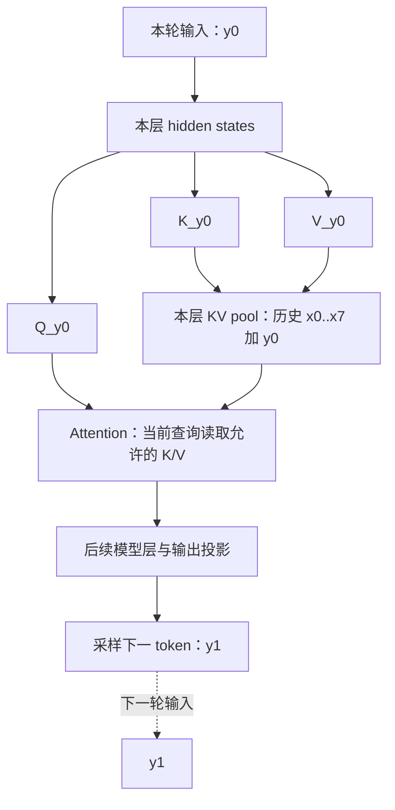
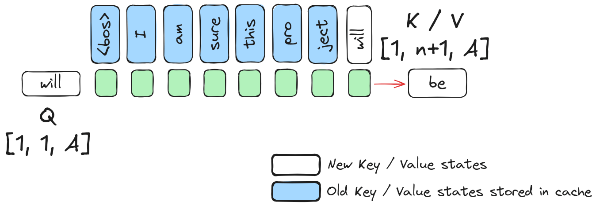

# Prefill 与 Decode 及 KV Cache 入门

> **先建立架构心智模型：** [M03 · 请求对象与生命周期全景](<../architecture/03-请求对象与生命周期全景.md>) · [M05 · 缓存架构与资源所有权](<../architecture/05-缓存架构与资源所有权.md>)。先看职责、数据和生命周期，再回到本篇源码细节。

Prefill 和 Decode 是普通自回归生成的两个计算阶段：前者处理已经给出的输入，后者把刚生成的 token 继续送入模型。它们通常使用同一套模型层与权重；主要变化是本轮有多少新位置需要计算，以及哪些历史状态已经保存。

KV Cache 让后续步骤可以复用历史位置的 K/V。它省去了重建相应历史状态的工作，但不会使模型完全不再访问历史，也不会自动完成请求调度、前缀共享或资源回收。

## 0. 阅读基线与范围

| 项目 | 内容 |
| --- | --- |
| 文档类型与编号 | 源码分析型；`00-04` |
| 源码路径基准 | SGLang 仓库根目录 `.`；本文源码路径均相对此目录 |
| 分支 | `codex/sglang-source-study-20260909`，基于官方 `main` |
| commit | `72d5c5bb73cadd7ffbf5114e5f81e29d36b6c61a` |
| 读取时间 | `2026-09-09` |
| 工作区状态 | 读取时源码 worktree 干净；既有工作区资料保留 |
| 操作边界 | 静态阅读、教学推导与文档检查；未运行模型、缓存实验或性能测试 |
| 前置 | [00-03 从文本到 Token](03-从文本到Token再到模型输出.md) |
| 主线 | 单请求、单卡、普通 decoder-only 自回归文本生成；以 Llama 和易读的 TorchNative Attention 路径说明 KV 读写 |
| 不展开 | 投机/Beam、Overlap 超前执行、量化 KV、MLA/SSM、滑窗、PD 传输及全部后端实现 |

选取 TorchNative 后端是为了阅读明确的接口，不意味着它是本次环境的默认后端、性能推荐或已经运行的配置。源码事实、整理者归纳和教学假设在下面分别标注。

## 1. Prefill 和 Decode 是同一个模型的不同工作量

### 1.1 人话版

用户已经一次给出 `x0 … x7`。模型不必等待生成过程去决定这些输入 ID，因此可以在因果依赖允许的方式下处理这一段输入，形成相应内部状态，并预测第一个输出 `y0`。

得到 `y0` 之前，它的具体 ID 尚未确定。选出它以后，再把它作为下一轮的新输入，结合保存的上下文预测 `y1`。这就是普通 Decode 逐步推进的原因。

这里“可以一次处理多个输入 token”不表示每个 token 都可看见未来输入。在普通因果 Attention 中，位置 i 只使用允许的前缀范围；并行化计算和访问未来 token 是不同问题。

### 1.2 SGLang 的名称是 `EXTEND` 与 `DECODE`

`ForwardMode` 把 `EXTEND` 描述为给序列补算一段，前面的 KV 可能已经存在；它也对应通常所说的 Prefill。`DECODE` 是逐 token Decode，此外还有 `MIXED`、`TARGET_VERIFY`、`PREBUILT` 等模式。[S01]

| 概念 | 本篇如何理解 | 边界 |
| --- | --- | --- |
| 首次 Prefill | 没有可复用 KV，从输入开头建立状态 | 后续可被分成多个 chunk |
| 命中前缀后的 Extend | 复用前段 KV，补算剩余位置 | 输入逻辑长度没有因此变短 |
| Decode | 把先前生成的新 token 作为本轮输入，再预测下一 token | 普通非投机路径；其他算法另讲 |
| `is_extend()` | 源码对一组模式的分类判断 | 当前实现包括多种模式，不能把所有 true 分支只解释成首次 Prefill |

`ScheduleBatch.prepare_for_extend()` 构造待补算输入；`prepare_for_decode()` 设置 Decode 模式并处理本轮准备。由此可见模式不仅是标签，还影响输入、预算和状态更新。[S02][S03]

## 2. K、V 到底保存了什么

### 2.1 从一层 Attention 看

在本文代表的 Llama 路径中，一层 Attention 从当前 `hidden_states` 投影出 Q、K、V，处理位置相关变换，再调用 `RadixAttention`。[S04]

可以把三个量初步理解为：

| 量 | 教学解释 | 为什么后续需要它 |
| --- | --- | --- |
| Q，Query | 当前新位置要寻找什么信息 | 用它对允许访问的历史/当前 key 计算注意力关系 |
| K，Key | 一个位置用于被查询匹配的表示 | 新位置还会查询这些历史 key |
| V，Value | 匹配后被加权汇集的信息表示 | 新位置需要读取相应历史 value |

这些只是降低阅读门槛的比喻，K/V 都是数值张量，不是保存的自然语言问答或数据库键值。不同模型层产生各自的状态；某层 K/V 不能直接当作下一层的 hidden states。

### 2.2 缓存改变了哪些计算

以普通 Full causal Attention 为前提：历史 token 的表示在相同模型、位置和前缀条件下已经算出；后来的 token 不会反过来改变它们对未来不可见的历史计算。于是后续可以保存并复用这些历史位置的 K/V。

后续 Decode 仍需要：

1. 为本轮新输入做 embedding、模型层、Q/K/V 等计算。
2. 为新位置读取允许的历史 K/V，并完成 Attention。
3. 保存本轮新位置的 K/V，继续经过后续层、logits 和采样。

**整理者归纳：** KV Cache 省去历史状态的重复构造；新 token 自身的模型计算和对历史状态的访问仍然存在。上下文变长时，这些访问的规模仍可能变化，不能把 Decode 的工作量简单说成与历史长度无关。

## 3. 在源码中找“写当前”和“读历史”

### 3.1 Attention 层持有接口，物理数据在 KV pool

`RadixAttention.forward()` 接收 q/k/v、`ForwardBatch` 和保存 KV 的条件，并转入实际 Attention 执行路径。[S05] 本篇进一步读取 `TorchNativeAttnBackend`：

- backend 在构造时取得请求映射池和 KV pool 的引用。
- `forward_extend()`、`forward_decode()` 根据 layer 和 batch 选择写入位置。
- 当保存条件满足且 k/v 存在时，调用 `set_kv_buffer(...)` 写入当前状态。
- 后续 Attention 调用使用 `get_key_buffer(layer_id)`、`get_value_buffer(layer_id)`，并结合请求映射和长度找到可读数据。[S06][S07]

下面是这个后端写 KV 的关键连续片段，两种阶段都有相应代码：

```python
if save_kv_cache and k is not None and v is not None:
    self.token_to_kv_pool.set_kv_buffer(
        layer, KVWriteLoc(cache_loc, self.swa_out_cache_loc), k, v
    )
```

**源码事实：** KV 写入由实际计算路径调用 pool 接口完成，并携带 layer 与写入位置。**整理者归纳：** 调度器负责安排“本轮应占用哪些位置”，模型执行侧把实际计算结果写进去；安排位置与内容已就绪是两个事件。

### 3.2 当前 token 的查询与下一 token 的预测



**图意解读：** 这是一个普通 Decode 步骤的教学图，省略具体 kernel 和逐层的多个 pool。当前输入是 `y0`，当前新增的 KV 也属于 `y0`；模型最后预测出的 `y1` 通常要等下一轮才计算自己的 KV。这两个时间点最容易被混为一谈。

## 4. R1 的完整时间账本：输出通常领先自己的 KV 一步

假设 R1 的输入为 8 tokens，最终正常生成 3 tokens；没有缓存命中、分块、投机、Overlap 超前执行或提前停止。下表记录**每轮计算完成并采样后的逻辑状态**，不描述异步提交过程中的中间时刻。

| 时点 | 本轮输入 | 新产生的输出 | 已计算的 KV 所覆盖位置 | 已知 token 总数 / 已输出数 |
| --- | --- | --- | --- | --- |
| 开始前 | 尚未执行 | 无 | 无 | 8 / 0 |
| Prefill 后 | `x0 … x7` | `y0` | `x0 … x7`，共 8 个位置 | 9 / 1 |
| Decode 1 后 | `y0` | `y1` | `x0 … x7, y0`，共 9 个位置 | 10 / 2 |
| Decode 2 后 | `y1` | `y2` | `x0 … x7, y0, y1`，共 10 个位置 | 11 / 3 |

达到输出上限后，这个例子不再为 `y2` 追加下一轮 forward。因此已经知道/返回的 token 数，不一定等于已计算 KV 的位置数。

**这一张表不等于显存分配记录。** 运行时可能预分配、按页分配或在其他模式中超前执行；物理容量、已分配位置、已写入内容、受缓存保护的位置必须分别计数。当前 `ReqKvInfo` 显式分开 `cache_protected_len`、`kv_committed_len` 与 `kv_allocated_len`，正提醒读者不能用一个“KV 长度”涵盖所有状态。[S08]

进一步沿当前实现核查，普通 allocation 会在 forward 前推进 `kv_committed_len` 的账面值，因此它不能单独证明 GPU 已完成。具体更新位置、输入映射和释放后的标志见[02-04《一次 Prefill 到多轮 Decode》](../02-request-lifecycle/04-一次Prefill到多轮Decode.md)。

### 4.1 首 token 不是先经过一个独立普通 Decode 才出现

普通 Prefill 结果处理在最终输入计算完成的对应分支中，将 `next_token_id` 追加到 `req.output_ids`，再更新停止状态；这与上表的 `y0` 对应。[S09]

Decode 结果处理则把本轮 token 结果加入请求输出，更新时间和完成状态。[S10] 本篇假设每轮接受一个 token；投机路径可接受多个，不能直接套用这张逐 token 表。

### 图解补充：当前 token 写 KV，再预测下一个 token



[查看原尺寸](../../../images/sglang-source-study/03-kv-growth.png)（手机查看宽图时可横屏或放大）。

**图意解读：** 蓝色列表示历史 K/V，白色 will 列是本轮新增输入；当前 Q 读取这两部分后，箭头才指向预测结果 be。右端的 be 此时还没有经过下一次 forward。

**对应本篇源码：** 把图中的 will/be 对应到本节账本的 y0/y1，核对本轮已写 KV 的位置与刚得到的输出 token。 [源码：python/sglang/srt/layers/attention/torch_native_backend.py][S07]

**来源与边界：** [Continuous batching from first principles](https://huggingface.co/blog/continuous_batching)，Rémi Ouazan Reboul、Arthur Zucker、Luc Georges / Hugging Face，2025-11-25。这是单请求、单步的逻辑注意力图；横向排列不代表 SGLang 物理 KV 连续存储，也不展示预分配、页表或异步完成事件。 [来源档案 F03](../../../images/sglang-source-study/SOURCES.md#f03)。

## 5. 三种内存对象，三种生命周期

| 对象 | 存什么 | 通常由什么决定寿命 | 不应混同 |
| --- | --- | --- | --- |
| 模型权重 | 模型的参数 | 模型加载、驻留、更新和卸载策略 | 每条请求的私有 KV |
| 临时激活 / hidden states | 本轮、某层计算中的内部表示 | forward、算子、图执行和缓冲区复用 | 可跨后续步骤复用的全部历史状态 |
| KV Cache | 某些历史位置在相应层的 K/V | 请求状态、缓存策略、引用/锁与分配管理 | 原始 token ID 列表或最终回答文本 |

上述是普通路径的角色划分，不是“请求一结束，所有 KV 必须立即归零”。有价值的前缀可以被缓存策略保留；请求使用的映射与未被保留的资源需要按相应生命周期退役。

**源码入口：** `ReqKvInfo` 记录请求持有的 KV 状态；`KVCache` 定义 buffer 读写接口；`ReqToTokenPool` 与各 allocator 将逻辑请求位置连接到物理资源。完整所有权和回收在阶段 04 追踪。[S08][S11]

## 6. 再加入 R2：前缀复用与单请求 KV 复用不同

R2 与 R1 共享前 6 个输入 token，后 2 个不同。为了教学，假设这 6 个位置在兼容、合法且已就绪的前缀缓存中可用，忽略页对齐和边界重算：

| 量 | R2 的情况 |
| --- | --- |
| 逻辑输入长度 | 仍是 8 tokens |
| 可复用前缀 | 6 个位置的 KV |
| 本轮需新增处理的输入 | 后 2 个位置 |
| Attention 可访问上下文 | 相应前缀与本轮允许的位置，而非只剩 2 tokens |

`prepare_for_extend()` 的输入构造从 `get_fill_ids()` 中切掉已有 `prefix_indices` 对应的部分，是寻找这条关系的入口。[S02]

由此区分两件事：

- **同一请求后续 Decode 复用历史 KV**：让 R1 不必反复重建自己的全部历史状态。
- **不同请求命中兼容前缀**：让 R2 有机会复用此前已经算过的共同前缀，额外需要前缀索引、隔离与生命周期策略。

本例只是假设命中已经合法。实际还要核查模型/权重、tokenization、位置、LoRA、salt、多模态或混合状态等条件，且缓存可能不在 GPU。不能只比较两段人类文本是否相似，就宣布可以共享。

## 7. 长请求、分块和两阶段性能直觉

### 7.1 分块改变每轮份额，不会消除历史状态

若更长的 R3 被拆成多个 chunk，每轮只是补算输入的一部分。中间 chunk 还要保留继续计算所需的状态；只有达到相应最终输入阶段，才按普通生成语义交出首个有效输出。

当前 Prefill 结果处理明确区分仍有中间 chunk 在途的情况，不能将每个中间执行结果都当作用户可见生成 token。[S09] 详细 chunk 状态和 Overlap 组合留到阶段 03。

### 7.2 从“做什么”理解瓶颈，而不是背绝对结论

Prefill 一轮可有较多新输入位置，很多矩阵计算有机会形成较大的工作块；普通 Decode 每个活跃请求每轮新增位置少，还要读权重与历史状态。这为分析算力利用、内存访问和批大小提供了起点。

但“Prefill 永远算力瓶颈、Decode 永远带宽瓶颈”不是本篇能证明的结论。模型、batch、上下文长度、量化、并行通信和后端都会改变实际瓶颈；只有在固定条件下测量才能判定。下一篇先建立指标与容量的计算口径，阶段 11 再做实验设计。

## 8. 源码锚点与排障地图

| 行为 | 文件 / 符号 | 固定源码 |
| --- | --- | --- |
| 区分 Extend/Decode 等模式 | `python/sglang/srt/model_executor/forward_batch_info.py::ForwardMode` | [S01] |
| 构造待补算输入与分配入口 | `python/sglang/srt/managers/schedule_batch.py::ScheduleBatch.prepare_for_extend` | [S02] |
| 准备普通 Decode | `python/sglang/srt/managers/schedule_batch.py::ScheduleBatch.prepare_for_decode` | [S03] |
| 模型层投影 Q/K/V | `python/sglang/srt/models/llama.py::LlamaAttention.forward_prepare_native` | [S04] |
| Attention 统一调用入口 | `python/sglang/srt/layers/radix_attention.py::RadixAttention.forward` | [S05] |
| Extend 的 KV 写入与读取 | `python/sglang/srt/layers/attention/torch_native_backend.py::TorchNativeAttnBackend.forward_extend` | [S06] |
| Decode 的 KV 写入与读取 | `python/sglang/srt/layers/attention/torch_native_backend.py::TorchNativeAttnBackend.forward_decode` | [S07] |
| 区分保护、提交与分配长度 | `python/sglang/srt/managers/schedule_batch.py::ReqKvInfo` | [S08] |
| Prefill 后提交首 token 与检查完成 | `python/sglang/srt/managers/scheduler_components/batch_result_processor.py::SchedulerBatchResultProcessor.process_batch_result_prefill` | [S09] |
| Decode 后推进输出 | `python/sglang/srt/managers/scheduler_components/batch_result_processor.py::SchedulerBatchResultProcessor.process_batch_result_decode` | [S10] |
| KV 存储与请求映射接口 | `python/sglang/srt/mem_cache/memory_pool.py::KVCache`、`ReqToTokenPool` | [S11] |

| 现象 | 先核对什么 |
| --- | --- |
| 觉得“首 token 已出，所以该 token 的 KV 已有” | 区分本轮输入和本轮预测输出，查看哪轮 forward 写了它 |
| 输入长度不变，但 Prefill 算得更少 | 前缀命中、已处理 chunk 或其他可复用状态 |
| 已分配槽位看起来比内容长度多 | 分页/预分配/在途执行，分别核对 allocated 与 committed |
| 请求结束后显存占用没有明显下降 | pool 是否预留、缓存是否保留，不能只看进程显存推断泄漏 |
| 长上下文 Decode 更慢 | 读取规模、batch、后端、并行与测量条件，先提出假设再验证 |

## 9. 自测与阶段连接

1. **Prefill 和 Decode 必须加载两套不同模型吗？** 普通单实例路径不需要，它们使用同一套模型，执行模式与输入份额不同；PD 分离部署另有实例与传输关系。
2. **KV Cache 是否让 Decode 不再访问历史 token 的信息？** 不是。它复用历史 K/V，当前查询仍需要访问允许的上下文状态。
3. **R1 已生成第三个输出 `y2` 时，普通例子里是否必然有 `y2` 的 KV？** 没有这项保证。达到上限后无需再以 `y2` 为输入运行下一轮；本文表中只算到 `y1` 的 KV。
4. **R2 命中 6 个 token 后，原本 8-token 输入会变成 2-token 上下文吗？** 不会。逻辑上下文仍是 8，新增计算部分约为 2；真实边界还受实现条件约束。
5. **请求完成之后，能否立即释放所有曾访问的 KV？** 不能笼统处理。需要区分共享缓存、请求私有状态、引用与在途操作，按生命周期规则回收。

**验收练习：** 不看表格，重画 R1 的三轮计算；每轮同时写出“本轮输入”“新输出”“已计算 KV”“可能已分配但尚未提交的位置”。前三项可按教学假设确定，最后一项必须回源码和运行模式核查，不能凭前三项猜测。

下一篇 [00-05《吞吐、延迟与显存的基本账本》](05-吞吐延迟与显存的基本账本.md)把这些对象变成可以比较和计算的量。返回[系列目录](../README.md)。

[S01]: https://github.com/sgl-project/sglang/blob/72d5c5bb73cadd7ffbf5114e5f81e29d36b6c61a/python/sglang/srt/model_executor/forward_batch_info.py#L106
[S02]: https://github.com/sgl-project/sglang/blob/72d5c5bb73cadd7ffbf5114e5f81e29d36b6c61a/python/sglang/srt/managers/schedule_batch.py#L2561
[S03]: https://github.com/sgl-project/sglang/blob/72d5c5bb73cadd7ffbf5114e5f81e29d36b6c61a/python/sglang/srt/managers/schedule_batch.py#L3345
[S04]: https://github.com/sgl-project/sglang/blob/72d5c5bb73cadd7ffbf5114e5f81e29d36b6c61a/python/sglang/srt/models/llama.py#L218
[S05]: https://github.com/sgl-project/sglang/blob/72d5c5bb73cadd7ffbf5114e5f81e29d36b6c61a/python/sglang/srt/layers/radix_attention.py#L157
[S06]: https://github.com/sgl-project/sglang/blob/72d5c5bb73cadd7ffbf5114e5f81e29d36b6c61a/python/sglang/srt/layers/attention/torch_native_backend.py#L279
[S07]: https://github.com/sgl-project/sglang/blob/72d5c5bb73cadd7ffbf5114e5f81e29d36b6c61a/python/sglang/srt/layers/attention/torch_native_backend.py#L338
[S08]: https://github.com/sgl-project/sglang/blob/72d5c5bb73cadd7ffbf5114e5f81e29d36b6c61a/python/sglang/srt/managers/schedule_batch.py#L869
[S09]: https://github.com/sgl-project/sglang/blob/72d5c5bb73cadd7ffbf5114e5f81e29d36b6c61a/python/sglang/srt/managers/scheduler_components/batch_result_processor.py#L253
[S10]: https://github.com/sgl-project/sglang/blob/72d5c5bb73cadd7ffbf5114e5f81e29d36b6c61a/python/sglang/srt/managers/scheduler_components/batch_result_processor.py#L889
[S11]: https://github.com/sgl-project/sglang/blob/72d5c5bb73cadd7ffbf5114e5f81e29d36b6c61a/python/sglang/srt/mem_cache/memory_pool.py#L1802
