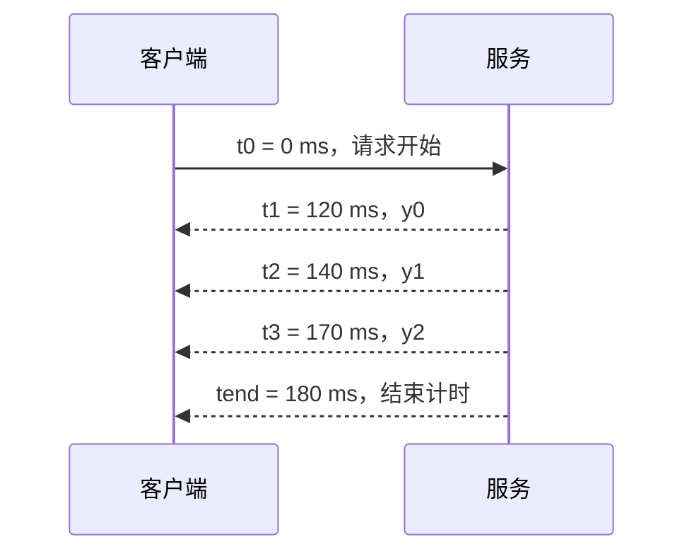

# 吞吐、延迟与显存的基本账本

“每秒很多 token”“首 token 很快”“显存还能放更多请求”分别回答不同问题。学推理优化之前，先明确每个数字的分子、分母、计时位置和统计范围，才能判断两份结果是否可以比较。

本篇建立三本账：一条请求的时间账、一个测量窗口的吞吐账、模型与 KV 的容量账。所有算例都是教学数据，没有实际 benchmark 结果。

## 0. 阅读基线与范围

| 项目 | 内容 |
| --- | --- |
| 文档类型与编号 | 源码分析型；`00-05` |
| 源码路径基准 | SGLang 仓库根目录 `.`；本文源码路径均相对此目录 |
| 分支 | `codex/sglang-source-study-20260909`，基于官方 `main` |
| commit | `72d5c5bb73cadd7ffbf5114e5f81e29d36b6c61a` |
| 读取时间 | `2026-09-09` |
| 工作区状态 | 源码 worktree 干净；保留 Wiki 既有资料 |
| 操作边界 | 静态读取 benchmark 与内存布局代码、核算教学算术、检查文档；未运行服务或性能/显存实验 |
| 前置 | [00-03 Token 与输出](03-从文本到Token再到模型输出.md)、[00-04 两阶段与 KV](04-Prefill与Decode及KVCache入门.md) |
| 主线 | 在线生成的基本计时与吞吐，普通 Full Attention K/V 的容量估算 |
| 不展开 | SLA 制定、完整 benchmark 执行、真实模型选型、MLA/SSM/量化状态精算、成本报价与生产参数推荐 |

**本版路径变化：** `python/sglang/bench_serving.py` 已是兼容包装器，真实实现位于 `python/sglang/benchmark/serving.py`。本篇按后者的指标代码核对，不止停在旧入口文件。[S01][S02]

## 1. 时间账：先标时间点，再写指标名

### 1.1 统一观测位置

假设在同一客户端、同一时钟上记录：

| 记号 | 含义 |
| --- | --- |
| `t0` | 这条请求在所选客户端计时路径中的开始时间 |
| `t1` | 第一个有效生成输出被该路径观察到的时间 |
| `ti` | 后续第 i 个输出 token 的观察时间；实际网络 chunk 未必能提供逐 token 时间 |
| `tN` | 最后一个输出 token 的观察时间 |
| `tend` | 客户端结束该请求计时的时间，可能包含尾部协议/流关闭处理 |
| `N` | 本次实际用于统计的输出 token 数 |

为什么要说“所选路径”？不同 API backend 对有效输出、usage-only chunk、非流式响应的处理并不完全相同。计时点的实现决定了指标到底测量什么。

### 1.2 四个延迟指标

| 指标 | 基本定义 | 主要回答的问题 |
| --- | --- | --- |
| TTFT，Time To First Token | `t1 - t0` | 从请求开始到第一次看到生成内容等多久？ |
| E2E，端到端延迟 | `tend - t0` | 整条请求耗时多久？ |
| ITL，Inter-Token Latency | 理想逐 token 观测下为 `ti - t(i-1)`，`i ≥ 2` | 输出过程中相邻 token 是否均匀到达？ |
| TPOT，Time Per Output Token | 本版通用 serving 汇总：`(E2E - TTFT) / (N - 1)`，只对 `N > 1` 纳入样本 | 首个输出之后，平均每个后续输出分摊多少时间？ |

TPOT 的分母是 `N - 1`，因为第一个输出已经由 TTFT 单独计时。当前 `calculate_metrics()` 确实只在 `output_len > 1` 时追加 TPOT 样本；不能用除以零或伪造零延迟处理单 token 请求。[S02]

### 1.3 R1 的一个可手算例子

这是人为设定的时间线，与前文“输出 3 tokens”的 R1 相接：



**图意解读：** 这里假设可以观测每个 token；箭头时间是客户端观察时间，不是 GPU kernel 起止时间。最后 10 ms 是教学设定的计时尾部，不等于多生成了一个 token。

计算结果：

- TTFT = 120 ms。
- E2E = 180 ms。
- 两个 ITL 分别是 20 ms、30 ms，算术平均为 25 ms。
- 按本版汇总口径，TPOT = `(180 - 120) / (3 - 1)` = 30 ms。

为什么平均 ITL 与 TPOT 不同？本例的 E2E 包含最后 token 后的 10 ms；TPOT 把它也分摊进分子。只有观测与计时边界满足相应条件，二者才会一致。

## 2. 客户端、服务端、GPU 看到的是不同时间段

`APIServerReqTimeStats` 分别保存请求创建、分词完成、dispatch、首 token、完成以及发送给客户端等时间；其中 `get_first_token_latency()` 使用 `first_token_time - created_time`，`get_e2e_latency()` 使用 `finished_time - created_time`。[S03]

| 观测位置 | 会包含什么 | 不能替代什么 |
| --- | --- | --- |
| 客户端 benchmark | 该请求函数覆盖的网络、排队、服务与响应处理时间 | GPU 算子耗时 |
| API 服务端 | 从服务端登记开始的请求阶段 | 客户端发出之前或网络到达之前的等待 |
| Scheduler 阶段统计 | 接收、等待队列、forward、Prefill/Decode 等相应标记之间的间隔 | 完整用户端到端体验 |
| GPU profiler | 设备运算、通信、拷贝与同步时间线 | 所有上层排队和协议开销 |

不要拿不同机器上未经处理的 `perf_counter` 数值直接相减。当前代码有单调时钟与墙钟的转换辅助；跨进程、跨节点分析还要核查实际传播与对齐方式，而不是看到相同字段名就当成同一时钟。[S03][S04]

### 2.1 非流式“TTFT”可能只是一个兼容统计值

本版 OpenAI chat benchmark 的非流式分支，在收到完整 JSON 后，将 `output.ttft` 设为总 `latency`。它没有因此观测到模型何时产生了第一个 token。[S05]

因此报告中必须注明是否流式，以及所用 backend。若没有中间输出事件，就不能把填入 TTFT 字段的值直接当作真实首 token 时刻。

### 2.2 网络 chunk 也可能不是一个 token

相应流式路径会在检测到有效内容时记录时间与 chunk。若服务一次发送多个 token、分词片段解码为不同长度文本，客户端的 chunk 间隔就不再是精确的逐 token ITL。[S05]

`calculate_metrics()` 在部分条件下使用重新分词后的 chunk 长度调整 ITL；代码也同时保留服务报告输出长度和重新分词长度两种统计。[S02] 这类调整是一种统计口径，不能恢复已经没有被观测的每个 token 的真实生成时刻。

## 3. 吞吐账：分子与时间窗口必须成对出现

### 3.1 同一个 tokens/s 可以有不同含义

本版通用 serving 汇总中，先按请求 `success` 统计完成数与输出长度，再用整个传入测量窗口 `dur_s` 计算吞吐。[S02]

| 指标 | 这里的计算方式 | 注意点 |
| --- | --- | --- |
| 请求吞吐 | 成功完成请求数 / 窗口秒数 | 输入和输出长度分布不同，请求吞吐不能直接横比 |
| 输入 token 吞吐 | 成功请求的输入 token 总数 / 窗口秒数 | 逻辑输入量不一定等于实际新增 Prefill 计算量 |
| 输出 token 吞吐 | 成功请求的实际统计输出 token 总数 / 窗口秒数 | 这是总服务吞吐，不是单用户持续生成速度 |
| 总 token 吞吐 | 输入与输出 token 总和 / 窗口秒数 | 混合了不同计算阶段的 token，必须写明口径 |

教学例子：在 2 秒窗口里成功完成 4 条请求，总输入 512 tokens，总输出 120 tokens：

```text
请求吞吐 = 4 / 2 = 2 请求/秒
输入吞吐 = 512 / 2 = 256 tokens/秒
输出吞吐 = 120 / 2 = 60 tokens/秒
总吞吐   = (512 + 120) / 2 = 316 tokens/秒
```

这四个数字同时成立，却表达不同含义。不能只摘出最大的 316，称它为“每位用户的生成速度”。

### 3.2 失败请求不能在报告里消失

通用汇总对失败请求追加零输出长度，并不把它们计入成功完成数量。[S02] 一个系统若大量失败，成功请求上的低延迟并不能单独证明服务质量好。

因此至少同时保留提交数、成功数、失败/超时数、完成 token 数和测量时长；比较延迟时说明样本是否只含成功请求。这里不是修改工具默认口径，而是让读者知道口径排除了什么。

### 3.3 全程吞吐与稳定并发窗口不同

当前 `benchmark/stream_metrics.py` 为一类 one-batch 流式测量定义稳定窗口：最后一条请求出现首 token 后，到第一条请求结束之前。它用累计 `completion_tokens` 记录进度，并对边界做插值，避免直接按 chunk 数计 token。[S06]

这是某个具体测量器的定义，不能代替所有 benchmark 的总窗口。其边界插值也不能当成硬件级逐 token 时间记录。

例如“所有请求都活跃时的 Decode 吞吐”和“包含启动、Prefill、请求逐渐结束的全程输出吞吐”本来就可能不同。报告应该把窗口写在数值旁边。

## 4. 显存账：先分模型权重、KV 和其他开销

### 4.1 最小容量模型

一个教学分解为：

```text
设备占用 ≈ 模型权重 + KV/其他模型状态池
         + 临时激活与算子工作区 + 图执行相关缓冲
         + 通信/运行时开销 + 分配器保留与对齐等余量
```

这些项实际可能共享、复用或在不同时刻达到峰值，不能把来自不同时间点的独立最大值当成精确同时占用。分解的用途是提醒读者：只算权重大小，无法得到可服务并发。

### 4.2 普通 Full Attention 的 KV 字节公式

假设所有层的 KV 形状相同，K 与 V 的 head 维度相同、不量化、无额外 scale、无跨层共享、没有 TP/PP 分片：

```text
每 token 的 KV 字节 = 2 × L × Hkv × D × b
总 KV 字节          = 每 token 的 KV 字节 × T
```

| 符号 | 含义 | 单位 |
| --- | --- | --- |
| `2` | K 和 V 两份状态 | 无量纲 |
| `L` | 需要存 KV 的层数 | 层 |
| `Hkv` | 每层 KV head 数 | head；不要误用 Q head 数 |
| `D` | 一个 K/V head 的维度 | 元素/head |
| `b` | 每个元素所占字节 | bytes/元素 |
| `T` | 需要实际存储的 token 位置总数 | tokens；共享部分不能重复计物理份数 |

若 K 与 V 的维度不同，单层每位置改为 `Hkv × (Dk + Dv) × b`；不同层也不同，则逐层求和。当前 `MHATokenToKVPool` 分别持有 `head_dim`、`v_head_dim`，其 buffer 形状与每层 buffer 构造能对应这些因子。[S07]

### 4.3 一个带单位的算例

设一个**教学模型**有 32 层、8 个 KV heads、每 head 128 个元素，K/V 都使用 2-byte 元素。此处不宣称它是某个真实模型的完整配置。

```text
每 token KV = 2 × 32 × 8 × 128 × 2 bytes
             = 131072 bytes
             = 128 KiB

8192 个已存储位置 = 8192 × 128 KiB = 1 GiB
16 份互不共享的同长度状态 = 16 GiB
```

`KiB = 1024 bytes`，`GiB = 1024³ bytes`；`GB` 通常按 `10⁹ bytes`。写容量时保留单位，避免把十进制和二进制混算。

如果某个教学预算只允许 8 GiB 用于上述 KV，那么 8 份 8192-position 状态已用尽这项理想容量。它只是 KV 项的算术上界，不是安全并发推荐；还没有预留未来输出、页对齐、其他状态或系统开销。

### 4.4 页与预分配使“已分配”大于“已有内容”

在标准 NHD 布局分支，当前 `_kv_buffer_shapes()` 的行数使用 `size + page_size`；普通分配还包含用于 padding/dummy 写入的保留页。它不是只给当前真实请求的 token 刚好分配等长张量。[S07]

`allocation_sizing.py` 又分别计算每轮 Decode 分配需求、预留量和分页后的长度；例如 `page_aligned_decode_alloc_lens()` 从请求的 `kv_committed_len` 和 reserve 推导需要的 allocated 长度。[S08]

**整理者归纳：** 请求输出长度、已写入 KV 数、分配器已占槽位数、整个 pool 容量、进程显示显存是五种不同量。看到请求结束后进程显存不降，不能只凭这一现象断定 KV 泄漏。

## 5. 哪些情况下不能直接套这条公式

| 条件 | 需要额外核查的内容 |
| --- | --- |
| GQA/MQA | KV head 数与 Q head 数可能不同，应读取真实 KV 配置 |
| TP/PP/DCP | 每 rank 实际 head、层或 token 分片与复制规则，不能一概除以卡数 |
| MLA、SSM 或混合模型 | 存储状态的形式与检查点不同，应按各状态池分别计算 |
| KV 量化 | 存储 dtype、打包、scale、对齐和辅助缓冲 |
| SWA/稀疏状态 | 可回收范围、窗口、额外索引和真实物理保留状态 |
| 前缀共享 | 逻辑引用数与物理状态份数分开；还要计请求私有后缀 |
| HiCache | GPU、主存、外部存储的位置与传输缓冲分别计数 |
| 投机/Beam/Overlap | 暂存候选、分支共享、超前执行和额外预留 |

当前 `KVCacheConfigurator` 在构造不同池时结合模型、分布式参数和相应状态类型；这也是后续精算时应从实际配置与构造路径出发的原因。[S09]

用 R1/R2 的前缀例子做一个简单检查：若两条 8-position 输入合法共享前 6 个位置，且只看这些已算输入状态，逻辑位置数是 16，理想物理份数是 `6 + 2 + 2 = 10`。但输出增长、页尾、请求映射与其他资源要另记，不能从 10 直接推导总显存。

## 6. 比较性能之前，先把实验条件写齐

| 必填条件 | 为什么会改变解释 |
| --- | --- |
| 源码 commit、依赖、模型与权重版本 | 不同实现和模型可能有不同执行路径 |
| 硬件、卡数、并行与通信拓扑 | 计算、内存与通信能力不同 |
| 权重/KV dtype、后端、graph、投机等开关 | 改变算子、状态大小和执行时序 |
| 输入/输出长度分布 | 影响 Prefill 份额、Decode 时长和 KV 容量 |
| 到达率、并发、队列与超时 | 影响系统处于空闲、稳定负载还是饱和排队 |
| 缓存冷/热、共享前缀、命中口径 | 逻辑输入量可能不等于本轮新增计算量 |
| 是否流式、统计 backend、计时窗口 | 影响 TTFT/ITL 是否可观测及吞吐分母 |
| 成功/失败数、样本量、分位数算法 | 决定统计是否有代表性，尾延迟是否可比较 |

平均值适合概览，P50/P95/P99 用于观察分布不同位置，但它们需要足够样本和一致统计方式。当前通用汇总调用 NumPy percentile；对极少样本算出一个 P99 数值，不意味着已经准确掌握尾部风险。[S02]

完整记录模板见[附录 A05](../appendices/05-实验记录与证据模板.md)，本篇提供入门所需的最小检查表。不要用本文教学数字填成实际实验结果。

## 7. 源码入口与排障问题

| 行为 | 文件 / 符号 | 固定源码 |
| --- | --- | --- |
| 旧 benchmark 路径转发 | `python/sglang/bench_serving.py` | [S01] |
| 成功样本、TPOT 与吞吐汇总 | `python/sglang/benchmark/serving.py::calculate_metrics` | [S02] |
| API 层时间字段与派生延迟 | `python/sglang/srt/observability/req_time_stats.py::APIServerReqTimeStats` | [S03] |
| Scheduler 分阶段时间 | `python/sglang/srt/observability/req_time_stats.py::SchedulerReqTimeStats` | [S04] |
| OpenAI chat 流式/非流式观测 | `python/sglang/benchmark/serving.py::async_request_openai_chat_completions` | [S05] |
| one-batch 稳定窗口与累计 token | `python/sglang/benchmark/stream_metrics.py::BatchStreamRecorder` | [S06] |
| 每层 K/V 的实际 buffer 形状 | `python/sglang/srt/mem_cache/memory_pool.py::MHATokenToKVPool._kv_buffer_shapes` | [S07] |
| 分配需求、预留与页对齐 | `python/sglang/srt/mem_cache/allocation_sizing.py::page_aligned_decode_alloc_lens` | [S08] |
| 按模型/拓扑构造缓存池 | `python/sglang/srt/mem_cache/kv_cache_configurator.py::KVCacheConfigurator` | [S09] |

| 现象 | 先问什么 |
| --- | --- |
| 吞吐提高，但用户感觉更慢 | 并发和排队是否增大？TTFT/ITL/E2E 分布怎样变化？ |
| 非流式 TTFT 与 E2E 完全一致 | 工具是否只收到完整响应后才填写 TTFT？ |
| 命中缓存后输入 tokens/s 很高 | 分子是逻辑输入，还是实际新增计算的 token？ |
| 两个工具都叫 output throughput，却差很多 | 它们使用全程窗口、稳定窗口还是 Prefill 后窗口？ |
| 理论 KV 装得下，但实际 OOM | 是否漏算其他内存、页对齐、未来输出、分支或峰值临时开销？ |

## 8. 自测与基础阶段验收

1. **R1 的 E2E 为 180 ms、TTFT 为 120 ms、输出 3 个 token，本版 TPOT 是多少？** 30 ms，计算为 `(180 - 120) / 2`。
2. **输出只有 1 个 token，可以照同式计算 TPOT 吗？** 不能。本版汇总不将它加入 TPOT 样本集合；没有有效后续 token 间隔。
3. **4 条请求在 2 秒产生 120 个 token，每位用户都达到 60 tokens/s 吗？** 不能推出。60 是总窗口输出吞吐，各请求的生成时序和延迟不同。
4. **算普通 KV 应使用 Q head 数还是 KV head 数？** 使用实际 KV head 数；GQA/MQA 下二者可能不同。
5. **32 层、8 KV heads、128 维、2-byte K/V，每 token 多少？8192 个位置多少？** 128 KiB/token，8192 个位置为 1 GiB；这是带明确简化假设的计算。

**阶段 00 综合练习：** 为 R1 和共享前缀的 R2 画出职责图、三轮生成与 KV 时间线，再给每个“长度”和“耗时”标单位、归属及观测位置。能把源码中的对象和这三本账对应起来，就具备进入源码启动阶段的基础。

下一篇为 [01-01《源码目录与最短阅读路线》](../01-getting-started/01-源码目录与最短阅读路线.md)。返回[系列目录](../README.md)。

[S01]: https://github.com/sgl-project/sglang/blob/72d5c5bb73cadd7ffbf5114e5f81e29d36b6c61a/python/sglang/bench_serving.py
[S02]: https://github.com/sgl-project/sglang/blob/72d5c5bb73cadd7ffbf5114e5f81e29d36b6c61a/python/sglang/benchmark/serving.py#L1096
[S03]: https://github.com/sgl-project/sglang/blob/72d5c5bb73cadd7ffbf5114e5f81e29d36b6c61a/python/sglang/srt/observability/req_time_stats.py#L382
[S04]: https://github.com/sgl-project/sglang/blob/72d5c5bb73cadd7ffbf5114e5f81e29d36b6c61a/python/sglang/srt/observability/req_time_stats.py#L597
[S05]: https://github.com/sgl-project/sglang/blob/72d5c5bb73cadd7ffbf5114e5f81e29d36b6c61a/python/sglang/benchmark/serving.py#L376
[S06]: https://github.com/sgl-project/sglang/blob/72d5c5bb73cadd7ffbf5114e5f81e29d36b6c61a/python/sglang/benchmark/stream_metrics.py#L82
[S07]: https://github.com/sgl-project/sglang/blob/72d5c5bb73cadd7ffbf5114e5f81e29d36b6c61a/python/sglang/srt/mem_cache/memory_pool.py#L2234
[S08]: https://github.com/sgl-project/sglang/blob/72d5c5bb73cadd7ffbf5114e5f81e29d36b6c61a/python/sglang/srt/mem_cache/allocation_sizing.py
[S09]: https://github.com/sgl-project/sglang/blob/72d5c5bb73cadd7ffbf5114e5f81e29d36b6c61a/python/sglang/srt/mem_cache/kv_cache_configurator.py#L247
