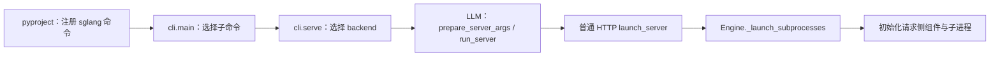
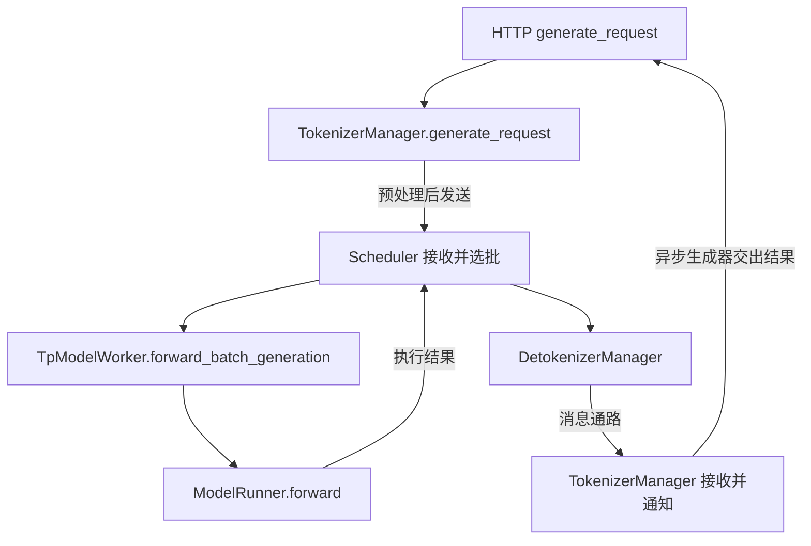

# 源码目录与最短阅读路线

打开仓库后，不必从最大的文件第一页开始读。先选一条请求路径，再沿着“谁调用、传什么、谁继续推进”走一圈，目录才会成为地图。

本文属于**源码分析型学习资料**，是系列第 **01-01** 篇。目标是让第一次读 SGLang 的同学，能在固定版本里找到启动、请求、调度、执行和返回的关键入口，并在遇到重构或分支时知道怎样继续查。

## 0. 阅读基线与范围

| 项目 | 内容 |
| --- | --- |
| 源码路径基准 | SGLang 仓库根目录 `.`；本文源码路径均相对此目录 |
| 分支 | `codex/sglang-source-study-20260909`，基于官方 `main` |
| commit | `72d5c5bb73cadd7ffbf5114e5f81e29d36b6c61a` |
| 读取时间 | `2026-09-09` |
| 工作区状态 | 源码 worktree 干净；原 `sglang` 仓保持 `muxi-main` 和已有未跟踪资料 |
| 操作边界 | 静态阅读与文档整理；未安装、导入 SGLang、启动服务或执行模型 |
| 前置 | 阶段 00，尤其[职责地图](../00-foundations/01-推理系统与SGLang职责地图.md)与[Python 并发基础](../00-foundations/02-读源码必备的Python与并发基础.md) |
| 主线 | Python HTTP、单实例、普通文本生成；用普通调度循环建立阅读路线 |
| 不展开 | 启动资源的完整创建/清理时序、所有 API 协议、Overlap/PD/PP 状态机及具体算子实现 |

**源码事实**有固定版本入口；**整理者归纳**包括目录分组、阅读步骤和教学图。本篇没有运行观察。以下“最短路线”是为理解挑选的静态阅读顺序，不是测得的最短执行路径。

## 1. 先理解三种“入口”

一个系统可以同时有命令入口、服务入口和计算入口。看到一个 `main()`，只说明找到了某个启动点，不说明找到了生成答案的全部过程。

| 术语 | 人话解释 | 本文中的例子 |
| --- | --- | --- |
| CLI | 在终端解释命令行的入口 | `sglang serve` 的分发 |
| entrypoint | 某种使用方式的进入位置 | HTTP 启动、离线 `Engine` |
| handler | 收到某类事件/请求后执行的处理函数 | HTTP `/generate` 处理函数 |
| event loop | 反复接收并推进工作的循环 | Scheduler 普通循环、输出接收循环 |
| dispatcher | 根据模式把工作交给某个分支 | 服务 backend 选择、调度循环选择 |
| adapter | 把一层数据/协议转换成另一层的组件 | API 请求到内部请求 |
| wrapper | 保留旧调用方式或统一入口的薄包装 | 旧 `bench_serving.py` |
| caller / callee | 调用者 / 被调用者 | Scheduler 调 worker，worker 调 runner |

第一轮先分开两张图：**启动图回答对象如何存在，请求图回答对象如何协作。** 不要把“创建 Scheduler 进程”与“给 Scheduler 发来 R1”当成同一个事件。

## 2. 当前版本的目录地图

以下路径均相对于源码 worktree，目录存在性已核对。[S01]

| 目录或文件 | 主要用途 | 第一次什么时候进入 |
| --- | --- | --- |
| `python/pyproject.toml` | 包依赖、构建配置和命令注册 | 确认终端命令实际指向哪个模块 |
| `python/sglang/cli/` | 命令解析与 backend 分发 | 找 `serve` 怎样进入 LLM 服务 |
| `python/sglang/launch_server.py` | LLM 服务的启动模式选择 | 确认走 HTTP、gRPC、Ray 还是 encoder 路径 |
| `python/sglang/srt/entrypoints/` | HTTP、Engine 及各 API 接入 | 找启动连接点与请求 handler |
| `python/sglang/srt/managers/` | 请求管理、调度、batch、worker、输出 | 串起一条请求的长期状态 |
| `python/sglang/srt/managers/scheduler_components/` | 从 Scheduler 拆出的职责组件 | 主循环委托出去的方法读到这里 |
| `python/sglang/srt/model_executor/` | forward 输入、runner 和执行相关设施 | 从调度 batch 进入模型执行 |
| `python/sglang/srt/models/` | 各模型的结构与 forward | 第一轮只选代表模型，例如 Llama |
| `python/sglang/srt/layers/` | Attention、采样、并行层等组件 | 从模型一层向具体功能下钻 |
| `python/sglang/srt/mem_cache/` | KV 存储、映射、缓存和容量相关实现 | 解释“数据放哪、谁能回收” |
| `python/sglang/srt/arg_groups/` | 配置声明、规则、解析与投影相关实现 | 追最终配置与组合约束 |
| `python/sglang/kernels/` | 当前统一算子命名空间 | 已理解模型/层后再追真实算子后端 |
| `python/sglang/benchmark/` | benchmark 实现与指标计算 | 定义实验口径时进入 |
| `python/sglang/lang/` | 前端 DSL | 阶段 12 独立阅读 |
| `python/sglang/multimodal_gen/` | 扩散等多模态生成子系统 | 与普通文本 SRT 分开建立主线 |
| `sgl-model-gateway/` | 网关项目 | 研究实例选择与服务路由时进入 |
| `docs/docs/` | 当前仓库的文档内容 | 查使用说明，同时核对它对应的版本 |
| `test/registered/`、`test/manual/` | 注册测试与手动测试 | 为具体结论寻找测试入口；存在不代表本次通过 |

这张表按学习问题归纳职责，不意味着每个目录只有一种职责，也不表示每个目录独立部署。

### 2.1 旧路径要先确认是不是迁移

本基线有三处适合初学者主动记住：

- `sglang.jit_kernel` 已被当前 kernel 说明标记为移除；JIT 公共设施和分组算子分别迁到 `sglang.kernels.jit` 与 `sglang.kernels.ops`。[S02]
- `python/sglang/bench_serving.py` 仍存在，但实际实现已经在 `python/sglang/benchmark/serving.py`。应读转发目标，而不是把几十行兼容入口当成完整 benchmark。[S03]
- 本次源码树有 `docs/docs/`，没有旧根目录 `sgl-kernel/`。`sglang-kernel` 仍出现在依赖声明，不能由“主仓没有那个目录”推出“不再依赖外部 kernel”。[S01][S04]

遇到旧资料路径不存在时，先在**同一固定 commit** 搜索符号与新路径，再决定是否比较历史版本。不要切回内部旧分支凑齐文件，否则会混用机制。

## 3. 最短路线：先走通一圈，再逐层展开

### 3.1 启动路线



**图意解读：** 方框表示源码入口与阶段，箭头表示本篇选择的阅读路径。这里只保留 LLM 普通 HTTP 分支；backend 插件、Ray 和 Rust 路径会改变后续创建关系。[S04][S05][S06][S07]

读到 `Engine._launch_subprocesses()` 后，先找到三件事即可：配置如何准备、哪里创建/初始化组件、哪里等待启动结果。完整时序留到 01-03，不在这里展开每项初始化。[S08]

### 3.2 请求与结果路线



**图意解读：** 函数调用和进程间通信不是同一种箭头：HTTP 到 TokenizerManager 是本进程调用；请求送往 Scheduler、输出经过 Detokenizer 涉及通信。图未展开所有 socket 和 rank，只让读者知道应到哪里寻找下一段证据。

| 顺序 | 到源码里找什么 | 本轮只回答的问题 | 暂时停在哪里 |
| --- | --- | --- | --- |
| 1 | HTTP `generate_request` | 流式与非流式分别怎样消费内部结果？ | 不展开所有 OpenAI 协议适配 |
| 2 | TokenizerManager `generate_request` | 何时创建状态、分词、发送并等待？ | 不展开媒体预处理 |
| 3 | Scheduler `dispatch_event_loop`、`event_loop_normal` | 当前是哪条循环？一轮有哪些步骤？ | 不马上读 Overlap/PP/PD |
| 4 | `get_next_batch_to_run` 周边 | 待执行计划怎样被消费？ | 先记 `NextBatchPlan` 字段，再到阶段 03 读全部准入逻辑 |
| 5 | worker 的 `forward_batch_generation` | 调度输入如何变成 `ForwardBatch` 并送入 runner？ | 暂不深入 kernel |
| 6 | runner 的 `forward` | 本轮进入何种执行分支？ | 暂不展开所有 graph/投机分支 |
| 7 | Scheduler 结果处理组件 | 结果怎样更新请求，再交给输出通路？ | 记录下一站；完整生命周期到阶段 02 |
| 8 | Detokenizer 和 TokenizerManager 的接收循环 | 怎样找回对应请求并唤醒返回者？ | 把结果接回第 1 步 |

这八步的产物应该是一圈有返回路径的调用/消息地图，而不是八个互不相连的函数摘要。

## 4. 用 R1 做一次阅读练习

沿用教学请求 R1：8 个输入 token，最多生成 3 个输出 token。这里不执行请求，也不假设普通字符串真实分词后恰好是 8 个 token。

在旁边记一张表，每打开一个入口只补一行：

| 观察位置 | 已知什么 | 还不能推出什么 |
| --- | --- | --- |
| HTTP handler | 有外部请求、生成参数和响应方式 | GPU 是否开始计算 |
| TokenizerManager 发送请求后 | 输入已转换并交给通信通路 | Scheduler 是否已将 R1 放入执行 batch |
| 普通循环拿到 `batch_to_run` | 这一轮有明确执行输入 | 整条请求会在这一轮结束 |
| worker/runner 执行 | 本轮输入进入模型执行路径 | 新输出已到客户端、全部 KV 可释放 |
| Scheduler 结果处理 | 输出和请求进度开始更新 | API 等待者已经消费结果 |
| TokenizerManager 输出状态被通知 | 等待者可以检查新的响应状态 | 一次通知必然对应一个 token 或一个网络 chunk |

**整理者归纳：** 阅读应持续区分“工作被交出”“本轮算完”“请求结束”和“资源可复用”。它们往往由不同代码判断；具体条件以后逐章补全，不能用一条粗箭头抹平。

### 4.1 一组可复用的静态搜索动作

以下命令只读取文件；本篇实际做了同类路径/符号查找，没有执行其中的 SGLang 函数。

```bash
# 在 SGLang 学习分支的仓库根目录执行
git branch --show-current
git rev-parse HEAD
git status --short

# 先限制范围找入口，再扩大到调用者。
rg -n 'async def generate_request|def launch_server' \
  python/sglang/srt/entrypoints/http_server.py
rg -n 'def generate_request|def _send_one_request|def _wait_one_response' \
  python/sglang/srt/managers/tokenizer_manager.py
rg -n 'def dispatch_event_loop|def event_loop_normal|NextBatchPlan' \
  python/sglang/srt/managers/scheduler.py
rg -n 'forward_batch_generation\(' python/sglang/srt/managers
```

搜索返回的是**候选位置**，不是调用关系证明。打开命中处，查看所在函数、分支条件、接收者类型和返回值；发现函数来自继承时继续找定义，而不是仅凭方法名推断其职责。

## 5. 学会在三种边界前停一下

### 5.1 模式边界

`run_server()` 会先解析配置再选择 encoder、gRPC、Ray 或普通 HTTP；普通 HTTP 中仍有 Rust server 等分支。`dispatch_event_loop()` 也不会永远选择普通循环。[S06][S07][S12]

所以本篇读普通循环，是教学选择。实际服务走哪条分支，要用它的生效配置回查；不能把“这篇先读了 normal”写成“默认服务必然执行 normal”。

### 5.2 对象边界

`ReqState` 与 `Req` 分别处于请求侧和调度侧；`ScheduleBatch` 与 `ForwardBatch` 分别服务调度和执行。字段同名、携带同一个 `rid`，也不意味着共享同一个 Python 对象。

第一轮先记“谁持有”，第二轮再追“何时创建/更新/清理”。[00-02](../00-foundations/02-读源码必备的Python与并发基础.md)已解释引用和进程间消息的区别。

### 5.3 实现边界

模型层调用 kernel wrapper，不表示实际计算全部写在这个 Python 函数里。当前 kernel 命名空间还涉及 registry、固定 backend 包装、JIT 或外部 wheel；具体算子必须继续追它的绑定与选择规则。[S02]

同理，看到测试文件或某条官方使用说明，只能说存在相应入口。要证明测试通过，需要真实执行记录；要证明外部依赖行为，需要该依赖自己的版本。

## 6. 源码锚点与问题索引

| 问题 | 固定源码入口 | 引用 |
| --- | --- | --- |
| 终端 `sglang` 注册在哪？ | `python/pyproject.toml` 的 `[project.scripts]` | [S04] |
| 谁选择 serve backend？ | `python/sglang/cli/serve.py::serve` | [S05] |
| LLM 服务选择哪种启动路径？ | `python/sglang/launch_server.py::run_server` | [S06] |
| 普通 HTTP 怎样连接引擎启动？ | `python/sglang/srt/entrypoints/http_server.py::launch_server` | [S07] |
| 组件怎样初始化？ | `python/sglang/srt/entrypoints/engine.py::Engine._launch_subprocesses` | [S08] |
| 原生请求在哪里进入？ | `python/sglang/srt/entrypoints/http_server.py::generate_request` | [S09] |
| 怎样发送并等待结果？ | `python/sglang/srt/managers/tokenizer_manager.py::TokenizerManager.generate_request` | [S10] |
| 普通循环一轮做什么？ | `python/sglang/srt/managers/scheduler.py::Scheduler.event_loop_normal` | [S11] |
| 谁选择实际循环？ | `python/sglang/srt/managers/scheduler.py::dispatch_event_loop`（模块级函数） | [S12] |
| batch 如何进入执行层？ | `python/sglang/srt/managers/tp_worker.py::TpModelWorker.forward_batch_generation` | [S13] |
| 执行层从哪里分发 forward？ | `python/sglang/srt/model_executor/model_runner.py::ModelRunner.forward` | [S14] |
| Detokenizer 怎样持续收消息？ | `python/sglang/srt/managers/detokenizer_manager.py::DetokenizerManager.event_loop` | [S15] |
| 文本输出怎样回到等待者？ | `python/sglang/srt/managers/tokenizer_manager.py::TokenizerManager.handle_loop` | [S16] |

## 7. 小白排障地图

| 阅读时卡住的现象 | 下一步 |
| --- | --- |
| 旧资料的文件找不到 | 确认当前 commit，查同名符号、兼容包装与迁移说明 |
| Scheduler 方法不在当前文件 | 查 mixin、组件字段与对应类，再回到调用点看模式条件 |
| 不知道箭头是调用还是网络 | 查普通方法调用，还是 `sock_send` / 接收循环；标明进程边界 |
| API 等待代码看不到实际计算 | 沿发送消息追 Scheduler；结果回来后再接回异步生成器 |
| 同一配置在两个地方值不同 | 留下原始值、解析阶段与读取视图，进入 01-04 继续追 |
| 模型层里只有很薄的函数 | 沿 wrapper 和 backend 绑定查实现，不从函数长度判断工作量 |

## 8. 自测、验收与下一篇

1. **找到了 HTTP `generate_request`，是否就找到了完整调度策略？** 不是。它消费请求管理侧的输出；策略需要沿发送通路进入 Scheduler。
2. **`sgl-kernel/` 不在当前树里，是否可以删除 `sglang-kernel` 依赖理解？** 不可以。源码目录和外部安装依赖是两种边界，需查 `pyproject.toml` 和实际调用绑定。
3. **为什么第一次先读 normal loop，还必须看 dispatcher？** 前者降低理解复杂度；后者确认实际配置会不会走这条路径。
4. **R1 的请求发出、首 token 产生、最后响应返回能否合成一个“完成”节点？** 不能；它们处在不同组件和时间点，还不包含完整资源回收证明。

验收时，不看本文尝试从 CLI 找到 HTTP，再从 `/generate` 走到 worker，最后沿结果接回请求侧。能解释每个入口为何出现，并说清至少一处模式边界、一处消息边界，便完成本篇第一轮目标。

本篇已核对路径、符号和静态路线；未运行服务或测试。下一篇为 [01-02《环境依赖与最小运行准备》](02-环境依赖与最小运行准备.md)。返回[系列目录](../README.md)。

[S01]: https://github.com/sgl-project/sglang/tree/72d5c5bb73cadd7ffbf5114e5f81e29d36b6c61a
[S02]: https://github.com/sgl-project/sglang/blob/72d5c5bb73cadd7ffbf5114e5f81e29d36b6c61a/python/sglang/kernels/README.md
[S03]: https://github.com/sgl-project/sglang/blob/72d5c5bb73cadd7ffbf5114e5f81e29d36b6c61a/python/sglang/bench_serving.py
[S04]: https://github.com/sgl-project/sglang/blob/72d5c5bb73cadd7ffbf5114e5f81e29d36b6c61a/python/pyproject.toml#L209
[S05]: https://github.com/sgl-project/sglang/blob/72d5c5bb73cadd7ffbf5114e5f81e29d36b6c61a/python/sglang/cli/serve.py#L166
[S06]: https://github.com/sgl-project/sglang/blob/72d5c5bb73cadd7ffbf5114e5f81e29d36b6c61a/python/sglang/launch_server.py#L18
[S07]: https://github.com/sgl-project/sglang/blob/72d5c5bb73cadd7ffbf5114e5f81e29d36b6c61a/python/sglang/srt/entrypoints/http_server.py#L2794
[S08]: https://github.com/sgl-project/sglang/blob/72d5c5bb73cadd7ffbf5114e5f81e29d36b6c61a/python/sglang/srt/entrypoints/engine.py#L1050
[S09]: https://github.com/sgl-project/sglang/blob/72d5c5bb73cadd7ffbf5114e5f81e29d36b6c61a/python/sglang/srt/entrypoints/http_server.py#L911
[S10]: https://github.com/sgl-project/sglang/blob/72d5c5bb73cadd7ffbf5114e5f81e29d36b6c61a/python/sglang/srt/managers/tokenizer_manager.py#L776
[S11]: https://github.com/sgl-project/sglang/blob/72d5c5bb73cadd7ffbf5114e5f81e29d36b6c61a/python/sglang/srt/managers/scheduler.py#L1893
[S12]: https://github.com/sgl-project/sglang/blob/72d5c5bb73cadd7ffbf5114e5f81e29d36b6c61a/python/sglang/srt/managers/scheduler.py#L5646
[S13]: https://github.com/sgl-project/sglang/blob/72d5c5bb73cadd7ffbf5114e5f81e29d36b6c61a/python/sglang/srt/managers/tp_worker.py#L593
[S14]: https://github.com/sgl-project/sglang/blob/72d5c5bb73cadd7ffbf5114e5f81e29d36b6c61a/python/sglang/srt/model_executor/model_runner.py#L1612
[S15]: https://github.com/sgl-project/sglang/blob/72d5c5bb73cadd7ffbf5114e5f81e29d36b6c61a/python/sglang/srt/managers/detokenizer_manager.py#L179
[S16]: https://github.com/sgl-project/sglang/blob/72d5c5bb73cadd7ffbf5114e5f81e29d36b6c61a/python/sglang/srt/managers/tokenizer_manager.py#L2225
