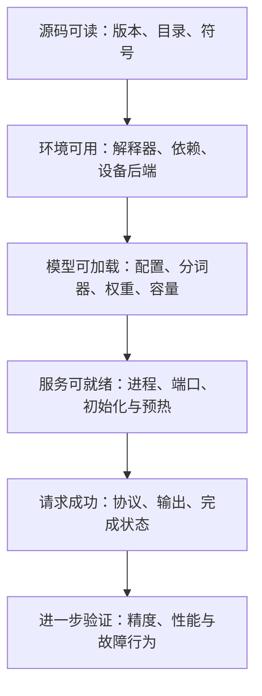

# 环境依赖与最小运行准备

“代码已经下载”“包可以导入”“模型可以加载”“第一条请求成功”是四个不同的检查点。把它们分开，就能知道失败发生在哪一层，也不会为了读源码先安装一整套并不适合本机的 GPU 依赖。

本文属于**源码分析型学习资料**，是系列第 **01-02** 篇。先给出无需 GPU 的阅读路线，再给出在独立实验环境中准备运行的步骤与验收方法。所有安装、设备探测和模型运行命令均为**待执行示例**，本篇没有安装或运行结果。

## 0. 阅读基线与范围

| 项目 | 内容 |
| --- | --- |
| 源码路径基准 | SGLang 仓库根目录 `.`；本文源码路径均相对此目录 |
| 分支 | `codex/sglang-source-study-20260909`，基于官方 `main` |
| commit | `72d5c5bb73cadd7ffbf5114e5f81e29d36b6c61a` |
| 读取时间 | `2026-09-09` |
| 工作区状态 | 源码 worktree 干净，按只读基线保留；原工作仓状态未改动 |
| 操作边界 | 读取依赖声明、构建说明、环境检查器、安装文档与初始化入口；未安装、导入 SGLang、查询设备或运行模型 |
| 前置 | [源码目录与最短路线](01-源码目录与最短阅读路线.md)、[指标与显存账本](../00-foundations/05-吞吐延迟与显存的基本账本.md) |
| 整理范围 | 区分阅读/安装/加载/运行条件，建立可追溯的最小实验准备单 |
| 不展开 | 为所有硬件提供安装配方，核实当前公共软件源 wheel 可用性，测量本机/服务器资源或部署生产服务 |

本篇的依赖版本是**该 commit 的声明事实**，不是未来执行时的软件安装推荐，也不证明这些依赖组合已在你的设备上通过测试。硬件专用文档的信息在本篇仅作为该源码快照的使用说明引用，未独立复现。

## 1. 人话版：先检查自己缺的是哪一层



**图意解读：** 方框是教学验收层次，不是固定函数顺序。运行时有些检查会交错，例如模型元数据可能在配置解析阶段就被读取。箭头的含义是“前一层通过仍不足以证明后一层”。源码阅读可以停在第一层，同时把后续条件整理清楚。

| 层次 | 最小证据 | 本轮实际状态 |
| --- | --- | --- |
| 源码可读 | 目录存在、commit 固定、符号能定位 | 已确认 |
| 包/后端环境 | 实际解释器、安装包、导入路径与设备信息 | 未执行验证 |
| 模型可加载 | 完整权重/配置、日志和加载结果 | 未执行验证 |
| 服务可就绪 | 启动时序、就绪与预热结果 | 未执行验证 |
| 请求成功 | 保存请求、响应、输出与完成原因 | 未执行验证 |
| 系统表现 | 带条件的精度、性能或故障测试 | 未执行验证 |

### 1.1 术语速查

| 术语 | 人话解释 | 容易误判的地方 |
| --- | --- | --- |
| Python 环境 | 指定解释器和它能找到的包 | 终端、Notebook、IDE 可能使用不同解释器 |
| wheel | 预构建安装包 | 包版本相同，不一定适配相同平台或二进制后端 |
| editable install | 安装信息指向本地源码的开发安装方式 | 不意味着外部依赖也指向该源码 commit |
| build dependency | 构建安装包时需要的依赖 | 与运行时依赖有交集，但作用不同 |
| runtime dependency | 服务执行时需要的依赖 | 安装了名称，不等于可在当前设备上调用 |
| driver / toolkit | 设备驱动 / 编译开发工具集合 | 一个显示的版本不能代表所有层都兼容 |
| backend | 执行某功能的实现路径 | 设备可见不等于所有算子可运行 |
| model revision | 模型文件所用版本 | 模型仓库名或本地目录名不是不可变版本证明 |
| warmup | 用初始化工作或请求提前走过执行路径 | 预热成功不等于全部输入、功能和故障已验证 |

## 2. 只读源码路线：不需要先安装 SGLang

本系列固定 worktree 已具备阅读条件。使用编辑器、Git 和文本搜索，可以检查目录、控制流、状态变化与调用关系；这些操作不需要导入 `torch` 或加载权重。

```bash
# 在 SGLang 学习分支的仓库根目录执行
git rev-parse HEAD
git status --short
rg -n 'requires-python|torch==|transformers==|sglang-kernel==' python/pyproject.toml
rg -n 'def prepare_server_args|def resolve_once' python/sglang/srt/server_args.py
```

**本篇实际使用的是这种读取方式。** 如果编辑器因未安装依赖而标红 import，并不表示无法读代码。可以通过文件路径和符号继续跟踪，但要将无法验证的外部实现与动态路径明确留作后续工作。

也不要为了“确认默认值”直接 import 整个运行时。配置解析/初始化可能读取模型信息、发现平台或触发后续准备；查看声明和调用者才符合当前静态边界。[S05][S08]

## 3. 从依赖声明看运行条件

### 3.1 主 pyproject 不是通用硬件安装清单

固定版本的 `python/pyproject.toml` 声明了 `requires-python = ">=3.10"`，同时包含 CUDA 相关依赖和框架版本约束。[S01]

| 声明示例 | 说明什么 | 不能说明什么 |
| --- | --- | --- |
| Python `>=3.10` | 主包的解释器版本范围声明 | 该范围内所有解释器都一定有全部依赖 wheel |
| `torch==2.13.0` | 主配置固定的 PyTorch 版本 | 任意 CUDA/CPU/厂商构建都能互换 |
| `transformers==5.12.1` | 主配置固定的模型生态依赖 | 任意模型架构和远程模型代码都已支持 |
| `sglang-kernel==0.4.6.post1` | 外部 kernel 包有独立版本边界 | 其全部源码行为由当前 SGLang commit 单独固定 |
| `flashinfer_python[cu13]==0.6.18`、`cuda-python>=13.0` | 主依赖清单有明确 CUDA 环境取向 | 可直接套用于 Apple、CPU、ROCm 或 NPU 环境 |

这些是源码中的示例约束，不是已解析的完整 lockfile。还有未固定到单版本的直接依赖、传递依赖以及平台标记；可复现实验应额外保存实际安装清单、来源和必要的二进制标识。

### 3.2 平台路线需要单独核对

仓库另有 `python/pyproject_other.toml`，包含 `runtime_base`、`runtime_common`、`srt_empty` 以及若干平台相关 extras。它体现了非默认硬件的依赖拆分；不能假设执行普通 `pip install -e python` 会自动替你完成所有平台选择。[S02]

固定版本的 Apple 文档将 **SRT 的 MLX 路线**与 **Diffusion 的 PyTorch MPS 路线**分开；CPU 文档则明确讨论 Intel AMX CPU 服务。这些差异说明，“本机有 CPU”或“本机是 Mac”都不足以给出统一的运行承诺。[S09][S10]

本次只读环境不执行文档中的安装文件替换命令。将来需要平台专用安装时，在独立实验副本中执行相应步骤并记录差异，保持这套学习基线可复查。

### 3.3 从源码安装还可能有构建步骤

主 pyproject 的构建依赖包括 setuptools、setuptools-rust、setuptools-scm、torch 和 wheel。`python/setup.py` 根据 `rust/` Cargo workspace 及声明的扩展清单发现 Rust 扩展；活动 pyproject 和 `SGLANG_BUILD_RUST_EXTS` 可筛选构建集合。[S01][S03]

因此“Python 项目”不等于“安装只复制 `.py` 文件”。构建工具缺失、扩展编译失败与模型运行失败属于不同阶段。即使源码提供跳过部分扩展的开关，也要先核对所需功能是否依赖它，不能把跳过构建当成所有功能已具备。

## 4. 可运行路线：在独立实验环境中逐层准备

以下是整理者给出的执行顺序，**本轮未执行**。具体驱动、镜像和模型选择应按目标硬件以及固定源码文档核查，不能把这里的占位符当成已存在资源。

### 4.1 固定实验材料

开始前填完这张表，缺项就保留“待确认”：

| 项目 | 应记录内容 |
| --- | --- |
| 源码 | commit、实验副本标识、相对于仓库根目录的路径、是否有修改 |
| 主机或容器 | OS、架构、容器镜像不可变 digest（若使用） |
| 设备 | 类型、数量、每设备容量、可见设备、并行计划 |
| 软件 | Python、框架、设备后端、kernel 包、构建工具版本 |
| 模型 | 来源、revision、配置、分词器、权重格式和本地完整性 |
| 容量 | 权重、KV、执行临时空间、保留余量；CPU 内存与磁盘也记录 |
| 服务 | 主机地址、端口、关键环境变量、启动参数和生效配置 |
| 负载 | 第一条请求、输入/输出限制、是否流式、是否允许前缀复用 |

源码 clone 不包含模型权重；模型标识也可能在启动准备期间触发解析或下载。当前 `handle_model_source_paths()` 还会处理特定远端模型来源，不能仅凭命令里写了 `model-path` 就认为全部文件都已在本地。[S08]

### 4.2 为源码运行建立环境

先按硬件选择已核查的依赖/安装路线，再建立独立环境。下面只展示**选择主 CUDA pyproject 且平台匹配时**的源码安装骨架；其他平台不要直接套用，命令未执行：

```bash
# 在单独准备的实验副本中执行；该目录应事先固定到本文 commit。
# 当前目录为独立实验副本的 SGLang 仓库根目录
git rev-parse HEAD
python3 -m venv ../sglang-experiment-venv
source ../sglang-experiment-venv/bin/activate
python -m pip install -e ./python
```

`./python` 相对于实验副本的仓库根目录；示例将新虚拟环境放在相邻目录 `../sglang-experiment-venv`，执行前需确认该目录未被其他工作使用。此命令会解析/安装依赖并可能构建扩展；它不是本轮静态阅读的必要步骤，也不是保证成功的跨平台配方。

固定源码里的通用安装文档仍给出某个 release 分支的源码安装示例。这个系列学习的是上述官方 `main` commit，不能照抄示例中的 release checkout 后仍把运行结果归到本文基线。[S04]

### 4.3 确认运行的究竟是哪份代码

准备好的实验环境中，可按下列命令记录解释器、包位置和依赖状态；**本轮未执行，命令会导入包或运行检查**：

```bash
python -c 'import sys, sglang; print(sys.executable); print(sglang.__file__)'
python -m pip show sglang
python -m pip check
python -m pip freeze
python -m sglang.check_env
```

同时保存实验副本的 `git rev-parse HEAD` 和 `git status --short`。这样可以区分“编辑器读 A checkout，进程却导入 B 环境”的问题。

`version.py` 会尝试构建生成的版本、包 metadata、setuptools-scm，最后还能回退到 `0.0.0.dev0`。所以只看一个版本字符串不足以定位实际源码；必须与路径、commit 和安装来源一起解释。[S07]

### 4.4 准备模型与第一条请求

对普通文本主线，准备相互匹配的模型配置、分词器和完整权重，先按阶段 00 的公式估算容量，再由真实加载与请求检查验证。模型权重能放下，还不代表给 KV、图捕获和临时工作空间留够了容量。

第一条请求优先减少变量：单实例、普通文本、小输入/输出限制、明确采样参数。先记录加载/初始化，再记录完整响应和完成原因；随后再增加流式、较长输入或并发。最小请求与启动故障定位会在 01-05 详细展开。

R1 的“8 输入、3 输出”仍是教学模型。若要做长度精确的运行实验，必须保存实际 token IDs 或实际 tokenizer 计数；不能把文本里写了 8 个词当成 8 个 token。

## 5. 怎样正确使用 check_env 的结果

**源码事实：** `check_env.py` 顶层导入 `torch`；`BaseEnv.check_env()` 收集解释器、框架、包版本、设备拓扑和部分系统信息，设备子类还可能运行系统命令。它是运行检查器，不是只查看配置文件的静态工具。[S06]

本基线的脚本入口依次选择 CUDA、HIP、NPU、MUSA、MPS 相关环境对象，没有通用 CPU `else` 分支。若这些分支均未命中，入口仍调用 `env.check_env()`；这是静态可见的适用边界，**本篇没有在 CPU 环境复现异常**。不能因为该脚本不适用于某环境，就直接断言 SGLang 没有 CPU 服务路线。[S06][S10]

| 检查结果 | 能支持的结论 | 下一步仍需验证 |
| --- | --- | --- |
| Python/包版本已输出 | 该解释器能取得这些 metadata | 实际导入与二进制调用是否匹配 |
| 设备可见 | 该检查路径能查询设备 | 目标算子、模型和拓扑能否运行 |
| 拓扑输出成功 | 查询工具返回该环境的拓扑信息 | 通信是否建立、负载下是否正常 |
| `pip check` 通过 | 安装元数据的依赖关系未被该检查报告为冲突 | 模型精度、内核兼容性、GPU/RDMA 行为 |
| 检查器本身报错 | 环境检查没有完整完成 | 查导入、命令缺失或检查器分支，再独立判断运行条件 |

不存在“一个环境检查全绿，就等于所有推理功能都通过”的捷径。

## 6. 从失败现象反查准备层次

| 现象 | 先核对什么 | 对应源码或材料 |
| --- | --- | --- |
| 源码能打开，import 失败 | 解释器、包路径、依赖和平台变体 | pyproject、实际 import traceback |
| 安装阶段缺少编译器或构建失败 | build dependency、Rust 扩展筛选和工具链 | `python/setup.py`、构建日志 |
| import 成功但加载模型失败 | 配置/架构、文件完整性、dtype、模型版本与资源 | `ModelRunner.initialize`、模型加载日志 |
| 能看到设备，但 kernel 调用失败 | 包构建、后端选择、设备能力和输入条件 | 固定 kernel wrapper 与实际依赖版本 |
| 权重加载后 OOM | KV 容量、并发/长度、临时空间和捕获配置 | [显存账本](../00-foundations/05-吞吐延迟与显存的基本账本.md)，后续阶段 04 |
| 一个版本号看起来正确，但行为对不上 | 是否导入另一个安装路径；源码是否被修改 | `sglang.__file__`、Git commit、安装 metadata |
| 服务有日志但第一条请求无结果 | 就绪、预热、调度启动与请求输出链 | 后续 01-03、01-05 |

## 7. 源码锚点

| 行为或材料 | 固定入口 | 引用 |
| --- | --- | --- |
| 主包的运行与构建依赖 | `python/pyproject.toml` | [S01] |
| 非主 CUDA 路线的依赖拆分 | `python/pyproject_other.toml` | [S02] |
| Rust 扩展发现与构建筛选 | `python/setup.py` | [S03] |
| 该版本通用安装说明 | `docs/docs/get-started/install.mdx` | [S04] |
| 平台发现与延迟初始化 | `python/sglang/srt/platforms/__init__.py` | [S05] |
| 环境信息收集 | `python/sglang/check_env.py::BaseEnv.check_env`，以及脚本入口 | [S06] |
| 包版本的多层回退 | `python/sglang/version.py` | [S07] |
| 模型来源准备 | `python/sglang/srt/arg_groups/model_path_hook.py::handle_model_source_paths` | [S08] |
| Apple SRT 与 Diffusion 环境区别 | `docs/docs/hardware-platforms/apple_metal.mdx` | [S09] |
| CPU 专用说明 | `docs/docs/hardware-platforms/cpu_server.mdx` | [S10] |
| 执行侧加载与初始化 | `python/sglang/srt/model_executor/model_runner.py::ModelRunner.initialize` | [S11] |

## 8. 自测与下一篇

1. **没有 GPU，是否需要暂停源码学习？** 不需要。可完成静态调用/状态阅读，并把运行条件和未验证项记清楚。
2. **主包 commit 已固定，实验依赖是否完全固定？** 没有。外部包、传递依赖、wheel 和模型文件还各有版本边界。
3. **为什么检查版本还要检查 `sglang.__file__`？** 同一台机器可能有多份安装和 checkout，版本字符串不能独自证明实际导入位置。
4. **check_env 失败是否等于模型必然不能运行？** 不等于。先区分检查器的适用分支、外部命令和真正运行所需条件。
5. **R1 的三个输出 token 是否能靠写 `max_new_tokens=3` 保证实际恰好输出三个？** 不一定。上限不是保证，停止条件可更早结束，应记录真实输出与 finish reason。

完成本篇的静态验收：能填出一份标明已知/待确认的实验准备单，解释每一步证明什么，并指出自己当前只通过了哪一层。下一篇为 [01-03《从 CLI 到服务进程启动》](03-从CLI到服务进程启动.md)。返回[系列目录](../README.md)。

[S01]: https://github.com/sgl-project/sglang/blob/72d5c5bb73cadd7ffbf5114e5f81e29d36b6c61a/python/pyproject.toml
[S02]: https://github.com/sgl-project/sglang/blob/72d5c5bb73cadd7ffbf5114e5f81e29d36b6c61a/python/pyproject_other.toml
[S03]: https://github.com/sgl-project/sglang/blob/72d5c5bb73cadd7ffbf5114e5f81e29d36b6c61a/python/setup.py
[S04]: https://github.com/sgl-project/sglang/blob/72d5c5bb73cadd7ffbf5114e5f81e29d36b6c61a/docs/docs/get-started/install.mdx
[S05]: https://github.com/sgl-project/sglang/blob/72d5c5bb73cadd7ffbf5114e5f81e29d36b6c61a/python/sglang/srt/platforms/__init__.py
[S06]: https://github.com/sgl-project/sglang/blob/72d5c5bb73cadd7ffbf5114e5f81e29d36b6c61a/python/sglang/check_env.py#L126
[S07]: https://github.com/sgl-project/sglang/blob/72d5c5bb73cadd7ffbf5114e5f81e29d36b6c61a/python/sglang/version.py
[S08]: https://github.com/sgl-project/sglang/blob/72d5c5bb73cadd7ffbf5114e5f81e29d36b6c61a/python/sglang/srt/arg_groups/model_path_hook.py#L27
[S09]: https://github.com/sgl-project/sglang/blob/72d5c5bb73cadd7ffbf5114e5f81e29d36b6c61a/docs/docs/hardware-platforms/apple_metal.mdx
[S10]: https://github.com/sgl-project/sglang/blob/72d5c5bb73cadd7ffbf5114e5f81e29d36b6c61a/docs/docs/hardware-platforms/cpu_server.mdx
[S11]: https://github.com/sgl-project/sglang/blob/72d5c5bb73cadd7ffbf5114e5f81e29d36b6c61a/python/sglang/srt/model_executor/model_runner.py#L650
