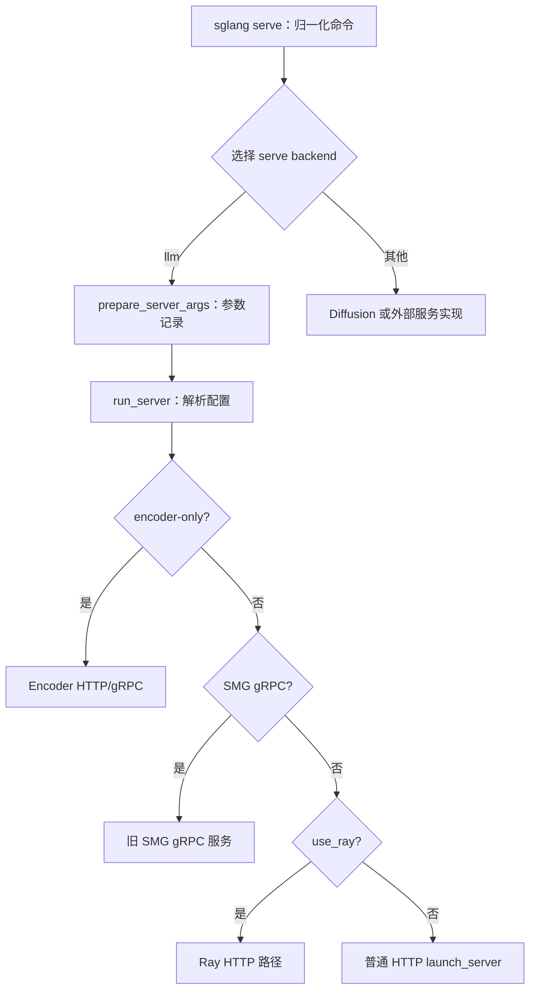
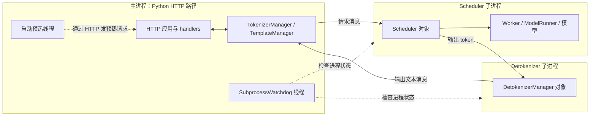

# 从 CLI 到服务进程启动

> **先建立架构心智模型：** [M02 · 启动装配与运行时边界](<../architecture/02-启动装配与运行时边界.md>)。先看职责、数据和生命周期，再回到本篇源码细节。

启动服务不是“打开一个 HTTP 端口”这么简单。程序要选择服务类型，准备配置与通信地址，创建模型工作进程，建立请求与输出组件，最后才能用一次真实请求检查整条通路。

本文属于**源码分析型学习资料**，是系列第 **01-03** 篇。读完应能画出普通 Python HTTP 服务的进程关系和启动顺序，并分清“进程已创建”“Scheduler 已初始化”“HTTP 可访问”和“预热请求成功”。

## 0. 阅读基线与范围

| 项目 | 内容 |
| --- | --- |
| 源码路径基准 | SGLang 仓库根目录 `.`；源码路径均相对此目录 |
| 分支 | `codex/sglang-source-study-20260909`，基于官方 `main` |
| commit | `72d5c5bb73cadd7ffbf5114e5f81e29d36b6c61a` |
| 读取时间 | `2026-09-09` |
| 工作区状态 | 源码 worktree 干净；保留原工作区与 Wiki 既有资料 |
| 操作边界 | 静态阅读与文档检查；未安装依赖、启动服务、运行模型或故障注入 |
| 前置 | [源码目录与最短路线](01-源码目录与最短阅读路线.md)、[环境与运行准备](02-环境依赖与最小运行准备.md) |
| 本篇主线 | LLM、普通 Python HTTP、单节点、TP=PP=DP=1、单 tokenizer、单 detokenizer；不启用额外服务或守护进程 |
| 不展开 | Rust/Ray/多节点内部启动、完整配置投影、模型加载算子细节、在线重启及分布式故障退役 |

**源码事实**用固定版本入口支撑；图和分层解释属于**整理者归纳**。下面列出的启动步骤没有实际执行，不能作为部署成功证据。单卡用于减少进程数量，不代表所有单卡配置都执行 normal 调度循环。

## 1. 人话版：先开工，再接单

可以把启动理解为四件事：决定开什么服务、让参与者出现、让参与者互相找到、检查一单能否走通。

| 术语 | 人话解释 | 本篇的边界 |
| --- | --- | --- |
| serve backend | `sglang serve` 最外层选择的服务实现 | 例如 LLM 或 Diffusion；不是 Attention backend |
| launcher | 创建并连接服务组件的启动逻辑 | 创建进程不代表请求已经成功 |
| rank | 并行拓扑里某个参与者的编号 | 本篇只有一个模型 rank，后续再扩展 |
| `PortArgs` | 通信端点与端口等启动信息 | 不要把所有 IPC 地址都当成 HTTP 端口 |
| `SchedulerInitResult` | 启动侧保存子进程信息和等待回调的对象 | 它本身不是模型执行结果 |
| readiness | 针对某一层的就绪条件 | 必须说明是谁、完成了哪一步 |
| lifespan | HTTP 应用启动/结束时执行的生命周期逻辑 | 在这里组织 handler 和预热线程等工作 |
| watchdog | 检查受监控进程是否异常退出的组件 | 活着不等于内部仍有进展 |

## 2. CLI 的两次分发

### 2.1 先选服务 backend

终端 `sglang` 由 `python/pyproject.toml` 注册到 `sglang.cli.main:main`。`main()` 解析子命令，把 `serve` 后的参数交给 `python/sglang/cli/serve.py` 中的 `serve()`。[S01][S02]

`serve()` 的关键顺序是：

1. 从参数中提取 `--model-type`，默认是 `auto`，并从交给 backend 的参数里移除该选择器。
2. 如果首个参数是位置形式模型路径，将它归一化成 `--model-path ...`。
3. 创建 `ServeRequest`，包含后续参数、模型路径和是否来自位置参数等信息。
4. 建立 backend registry，处理帮助信息；正常启动时加载插件。
5. 自动检测或按名称选择 backend，再调用其 `run(request)`。[S03]

内置 registry 有 `llm` 与 `diffusion`，安装的扩展还能注册其他名字。自动模式寻找唯一匹配：没有匹配回退到 LLM；多个匹配报错，要求明确选择。自动检测中的某个扩展报错可被记录并跳过，显式选择扩展时则执行严格加载/接口检查。[S04]

这里回答的是“运行哪类服务”。后面配置中的 Attention、sampling、量化等 backend 回答的是“某个功能用哪个实现”，两层不要混在一张选择表里。

### 2.2 LLM 再选启动方式

LLM runner 调用 `prepare_server_args()` 得到参数记录，再交给 `launch_server.py::run_server()`。后者先 `resolve_once()`，通过解析视图读取配置，按顺序选择：encoder-only、旧 SMG gRPC、Ray，最后是普通 HTTP。[S03][S05]



**图意解读：** 方框是代码分发阶段，不是独立进程。原生 Rust gRPC 的 `grpc_port` 与旧 `smg_grpc_mode` 不是同一条路径；前者可在普通 HTTP 生命周期内启动。全 Rust server 又会替代 Python API/tokenizer/detokenizer，不能只凭“gRPC”三个字判断进程结构。[S05][S06]

旧 `python -m sglang.launch_server` 仍受支持，它直接走 LLM 参数准备和 `run_server()`，不会经过上述统一 serve backend 检测。[S05]

## 3. 普通路径有哪些进程和对象



**图意解读：** 外框明确区分进程，框内是对象或线程。本篇最小分支可从启动代码数出主进程、一个 Scheduler 子进程和一个 Detokenizer 子进程；库内部线程不在图中。加入 DP、多个 tokenizer/detokenizer、原生 gRPC、sidecar 或 weight daemon 后，需要重新按配置数，不能沿用“三个进程”。[S07][S08][S09]

HTTP 路径调用的是类方法 `Engine._launch_subprocesses()`，不能据此多画一个叫“Engine”的操作系统进程，也不必假定它一定先构造离线 API 的 `Engine` 实例。

| 对象 | 主要持有内容 | 谁使用、何时结束本阶段用途 |
| --- | --- | --- |
| `ServeRequest` | backend 参数与模型路径 | CLI 到选中 backend 的交接 |
| `ServerArgs` | 原始参数与解析声明 | 启动侧解析，子进程按角色发布配置；详见下一篇 |
| `PortArgs` | 参与者使用的通信端点 | 启动时传给进程和 manager；端点继续用于服务通信 |
| Scheduler `mp.Process` | 子进程句柄、PID、退出状态 | 父进程等待初始化并监控存活 |
| 单向 `mp.Pipe` | 初始化消息通道 | Scheduler 向父进程报告 ready 和容量信息；不是 token 输出通路 |
| `SchedulerInitResult` | infos、子 PID、等待/阻塞回调 | 主进程等待和后续启动组织 |
| `TokenizerManager` | 请求侧状态、预处理和通信 | 主进程长期请求管理，不在初始化成功后销毁 |

## 4. 从创建进程到收到初始化信息

### 4.1 父进程先准备共同环境

`Engine._launch_subprocesses()` 先配置日志、调用解析门、设置环境，再加载插件和检查参数，必要时解析自动选择的 parser。随后以 tokenizer 角色发布配置，再创建通信端点并记录生效配置。[S07]

`_set_envs_and_config()` 还涉及依赖版本检查、环境变量、信号处理和 multiprocessing 的 `spawn` 启动方式。这里只是说明这不是一个无副作用的构造函数；配置规则与实验条件分别在 01-04、01-02 解释。[S10]

### 4.2 Scheduler 怎样被创建

在没有 DP controller 的分支中，`_launch_scheduler_processes()` 计算本节点 TP/PP rank 范围，为每个 rank 建立单向 Pipe，计算设备编号，用 `mp.Process(target=run_scheduler_process_func, ...)` 创建并启动进程。[S08]

父进程把 `reader` 和进程句柄留下，把 `writer` 传给子进程。单卡例子只有一个这样的 rank；进程数随实际拓扑变化，不由 `Scheduler` 这个类名决定。

### 4.3 子进程怎样报告 ready

`run_scheduler_process()` 在子进程加载插件、以 scheduler 角色发布配置、设置该进程的日志/设备等环境，然后构造 `Scheduler`。成功后，源码的关键次序是：[S11]

```python
pipe_writer.send(scheduler.get_init_info())
scheduler.run_event_loop()
```

`get_init_info()` 返回 `status="ready"`、`max_total_num_tokens`、`max_req_input_len` 和启动时间信息。**这条消息发生在进入调度 event loop 之前**；它证明构造走到了初始化回报位置，不能替代之后的真实推理请求。[S12]

### 4.4 父进程同时还要初始化请求与输出组件

在本篇选定的 node-rank-0、Python 单 tokenizer 路径中，父进程接着：

1. 启动 Detokenizer 子进程；子进程创建 manager 并进入接收循环。
2. 调用 `init_tokenizer_manager_func()` 创建 TokenizerManager 和 TemplateManager。
3. 调用 `scheduler_init_result.wait_for_ready()`，取得 Scheduler 初始化信息。
4. 汇总启动时间，把 `max_req_input_len` 等信息回填到请求侧，启动监控线程。
5. 返回上述组件给 HTTP 启动代码。[S07][S09][S13]

父进程初始化和子进程模型初始化可以并行发生；ready 消息可能先到 Pipe 中，父进程之后才读取。这里描述的是各进程内部的调用顺序，不声称记录过一条真实的跨进程时间线。

### 4.5 5 秒 poll 到底意味着什么

`_wait_for_scheduler_ready()` 逐个检查初始化 Pipe。每次最多等 5 秒，有消息则读取并要求 `status == "ready"`；EOF 或发现子进程已退出会报错。一次 poll 到时没有消息，则检查所有相关子进程是否仍然存活，再继续等待。[S14]

**这里没有统一的 5 秒总初始化期限。** 如果进程仍然活着但初始化没有完成，这个局部循环可以继续等待。另一个 watchdog、部署探针或外部超时可能终止服务，必须分别查其作用位置。

## 5. HTTP 与预热是后续检查点

普通 HTTP `launch_server()` 拿到组件后，进入 `_setup_and_run_http_server()`。它保存全局组件状态、连接 app 生命周期参数和 middleware，随后按配置启动 HTTP 服务实现。[S06][S15]

`lifespan()` 创建服务 handler 等对象，并启动目标为 `_wait_and_warmup` 的线程；随后 `yield`，让 HTTP 应用进入服务阶段。预热线程会等待 HTTP 接口可访问，再通过 HTTP 发送请求，而不是阻塞同一个启动协程等待它自己尚未开始接收的请求。[S16]

普通默认预热的可读主线是：[S17][S18]

| 步骤 | 具体行为 | 检查边界 |
| --- | --- | --- |
| 等接口 | `_execute_server_warmup` 重试访问 `/model_info` | 只证明该接口可访问和响应可解释 |
| 构造负载 | 按生成/embedding、多模态、分词器等条件构造请求 | 不是所有模型都固定发同一个 `/generate` |
| 运行预热 | 本篇普通生成分支向 `/generate` 发小请求并检查 HTTP 状态 | 覆盖该次预热条件，不覆盖所有用户负载 |
| 更新状态 | 普通 Python 成功分支写 `ServerStatus.Up` | 与 Scheduler Pipe 中的 ready 是不同状态 |
| 收尾与回调 | `_wait_and_warmup` 继续执行预热后工作并调用 launch callback（若有） | callback 的确切含义由调用者定义 |

`skip_server_warmup` 或特定弹性加入分支可跳过默认预热并设置 Up。读到 Up 或 ready 日志时，需要同时检查启动配置，不能必然推断真实预热请求已经执行。

例如 R1 稍后才由用户发来：它不是 Scheduler 初始化消息，也不必等于默认预热负载。确认预热通过之后，仍应保存 R1 自己的请求与响应。

## 6. 错误从哪一层回来

| 发生位置 | 源码中的反应 | 本篇不据此作出的推断 |
| --- | --- | --- |
| serve backend 无效或匹配不唯一 | registry 报错；显式 backend 加载也会校验接口版本 | 不解释成模型加载失败 |
| Scheduler 构造/循环抛出异常 | 子进程记录异常并向父进程发送 SIGQUIT | 不证明所有跨 rank/GPU 资源已安全退役 |
| Pipe EOF 或启动时进程死亡 | 父进程等待函数报初始化相关错误 | 不把最后一行错误当作最初根因 |
| Detokenizer 异常 | 记录异常、处理相应 socket 映射，再通知父进程 | 不保证 HTTP 侧已返回正确业务错误 |
| 受监控进程非零退出 | `SubprocessWatchdog` 线程触发 SIGQUIT | 不表示它能发现活着但卡住的进程 |
| 普通预热失败 | 记录预热错误并进入进程树清理路径 | 不代表所有启动失败都由预热超时引起 |

`SubprocessWatchdog` 跳过仍存活或退出码为 0 的进程。它是异常退出检查，不是逐请求进度检查。启动信号处理还受主线程与自定义 handler 等条件影响。[S10][S19]

CLI 的正常启动分支有 `finally` 清理子进程；各组件也有自己的错误处理。本文只追踪可见入口，不把这些局部清理代码等同于完整故障安全验证。[S03][S11]

## 7. 源码锚点

| 行为 | 文件与符号 | 引用 |
| --- | --- | --- |
| CLI 入口 | `python/sglang/cli/main.py::main` | [S02] |
| backend 分发 | `python/sglang/cli/serve.py::serve` | [S03] |
| 自动检测规则 | `python/sglang/cli/serve_backends.py::ServeBackendRegistry.auto_detect` | [S04] |
| LLM 启动模式选择 | `python/sglang/launch_server.py::run_server` | [S05] |
| HTTP 对接组件启动 | `python/sglang/srt/entrypoints/http_server.py::launch_server` | [S06] |
| 总体子进程组织 | `python/sglang/srt/entrypoints/engine.py::Engine._launch_subprocesses` | [S07] |
| Scheduler 子进程创建 | `python/sglang/srt/entrypoints/engine.py::Engine._launch_scheduler_processes` | [S08] |
| Detokenizer 创建 | `python/sglang/srt/entrypoints/engine.py::Engine._launch_detokenizer_subprocesses` | [S09] |
| 环境与信号准备 | `python/sglang/srt/entrypoints/engine.py::_set_envs_and_config` | [S10] |
| Scheduler 子进程入口 | `python/sglang/srt/managers/scheduler.py::run_scheduler_process` | [S11] |
| 初始化消息 | `python/sglang/srt/managers/scheduler.py::Scheduler.get_init_info` | [S12] |
| Tokenizer 初始化 | `python/sglang/srt/entrypoints/engine.py::init_tokenizer_manager` | [S13] |
| 等待 ready | `python/sglang/srt/entrypoints/engine.py::_wait_for_scheduler_ready` | [S14] |
| HTTP 运行设置 | `python/sglang/srt/entrypoints/http_server.py::_setup_and_run_http_server` | [S15] |
| 生命周期与预热线程 | `python/sglang/srt/entrypoints/http_server.py::lifespan` | [S16] |
| 预热前后组织 | `python/sglang/srt/entrypoints/http_server.py::_wait_and_warmup` | [S17] |
| 默认预热请求 | `python/sglang/srt/entrypoints/http_server.py::_execute_server_warmup` | [S18] |
| 子进程监控 | `python/sglang/srt/utils/watchdog.py::SubprocessWatchdog` | [S19] |

## 8. 自测与下一篇

1. **HTTP 路径调用 Engine 方法，是否意味着有单独的 Engine 进程？** 不是。看 `mp.Process` 等实际创建位置，不能按类名数进程。
2. **Scheduler ready 后能否直接宣称 R1 推理成功？** 不能。ready 是构造后的初始化回报；R1 还要走真实请求链路。
3. **一次 5 秒 poll 没消息说明启动失败吗？** 不说明。该分支检查进程存活后继续等；总期限需要查别的条件。
4. **监控线程没报错是否说明服务正在推进？** 不说明。存活/退出状态和计算进度不同。
5. **为什么预热放在线程里，并且还要重试 HTTP 接口？** HTTP 生命周期继续启动服务的同时，另一条执行路径等待可访问并发送预热，避免把尚未可用的接口当成已经就绪。

静态验收：画出本篇三类进程，补上初始化 Pipe 与业务消息两种通路，并给四种“就绪”各写一个证据。下一篇为 [01-04《从参数声明到最终生效配置》](04-从参数声明到最终生效配置.md)。返回[系列目录](../README.md)。

[S01]: https://github.com/sgl-project/sglang/blob/72d5c5bb73cadd7ffbf5114e5f81e29d36b6c61a/python/pyproject.toml#L209
[S02]: https://github.com/sgl-project/sglang/blob/72d5c5bb73cadd7ffbf5114e5f81e29d36b6c61a/python/sglang/cli/main.py#L12
[S03]: https://github.com/sgl-project/sglang/blob/72d5c5bb73cadd7ffbf5114e5f81e29d36b6c61a/python/sglang/cli/serve.py#L166
[S04]: https://github.com/sgl-project/sglang/blob/72d5c5bb73cadd7ffbf5114e5f81e29d36b6c61a/python/sglang/cli/serve_backends.py#L173
[S05]: https://github.com/sgl-project/sglang/blob/72d5c5bb73cadd7ffbf5114e5f81e29d36b6c61a/python/sglang/launch_server.py#L17
[S06]: https://github.com/sgl-project/sglang/blob/72d5c5bb73cadd7ffbf5114e5f81e29d36b6c61a/python/sglang/srt/entrypoints/http_server.py#L2794
[S07]: https://github.com/sgl-project/sglang/blob/72d5c5bb73cadd7ffbf5114e5f81e29d36b6c61a/python/sglang/srt/entrypoints/engine.py#L1050
[S08]: https://github.com/sgl-project/sglang/blob/72d5c5bb73cadd7ffbf5114e5f81e29d36b6c61a/python/sglang/srt/entrypoints/engine.py#L846
[S09]: https://github.com/sgl-project/sglang/blob/72d5c5bb73cadd7ffbf5114e5f81e29d36b6c61a/python/sglang/srt/entrypoints/engine.py#L964
[S10]: https://github.com/sgl-project/sglang/blob/72d5c5bb73cadd7ffbf5114e5f81e29d36b6c61a/python/sglang/srt/entrypoints/engine.py#L1661
[S11]: https://github.com/sgl-project/sglang/blob/72d5c5bb73cadd7ffbf5114e5f81e29d36b6c61a/python/sglang/srt/managers/scheduler.py#L5744
[S12]: https://github.com/sgl-project/sglang/blob/72d5c5bb73cadd7ffbf5114e5f81e29d36b6c61a/python/sglang/srt/managers/scheduler.py#L1811
[S13]: https://github.com/sgl-project/sglang/blob/72d5c5bb73cadd7ffbf5114e5f81e29d36b6c61a/python/sglang/srt/entrypoints/engine.py#L169
[S14]: https://github.com/sgl-project/sglang/blob/72d5c5bb73cadd7ffbf5114e5f81e29d36b6c61a/python/sglang/srt/entrypoints/engine.py#L1806
[S15]: https://github.com/sgl-project/sglang/blob/72d5c5bb73cadd7ffbf5114e5f81e29d36b6c61a/python/sglang/srt/entrypoints/http_server.py#L2530
[S16]: https://github.com/sgl-project/sglang/blob/72d5c5bb73cadd7ffbf5114e5f81e29d36b6c61a/python/sglang/srt/entrypoints/http_server.py#L273
[S17]: https://github.com/sgl-project/sglang/blob/72d5c5bb73cadd7ffbf5114e5f81e29d36b6c61a/python/sglang/srt/entrypoints/http_server.py#L2392
[S18]: https://github.com/sgl-project/sglang/blob/72d5c5bb73cadd7ffbf5114e5f81e29d36b6c61a/python/sglang/srt/entrypoints/http_server.py#L2203
[S19]: https://github.com/sgl-project/sglang/blob/72d5c5bb73cadd7ffbf5114e5f81e29d36b6c61a/python/sglang/srt/utils/watchdog.py#L166
