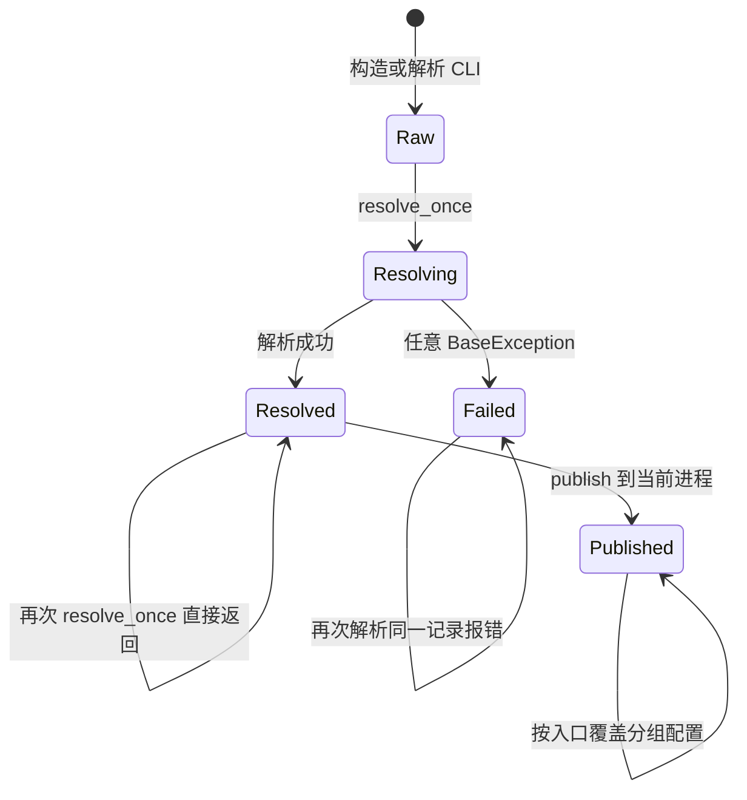
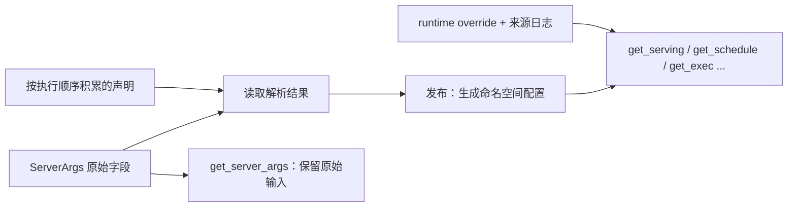

# 从参数声明到最终生效配置

> **先建立架构心智模型：** [M02 · 启动装配与运行时边界](<../architecture/02-启动装配与运行时边界.md>)。先看职责、数据和生命周期，再回到本篇源码细节。

看到 `page_size=None`，不能直接判断“系统没有页大小”；看到命令行没写关闭 overlap，也不能直接判断“运行时一定启用 overlap”。声明值表达用户提供了什么，规则还要结合模型、设备和功能组合决定如何运行。

本文属于**源码分析型学习资料**，是系列第 **01-04** 篇。主线是：输入怎样进入 `ServerArgs`，解析决定怎样保存，进程怎样读取生效配置，以及为什么运行时修改不能直接写回原始字段。

## 0. 阅读基线与范围

| 项目 | 内容 |
| --- | --- |
| 源码路径基准 | SGLang 仓库根目录 `.`；源码路径均相对此目录 |
| 分支 | `codex/sglang-source-study-20260909`，基于官方 `main` |
| commit | `72d5c5bb73cadd7ffbf5114e5f81e29d36b6c61a` |
| 读取时间 | `2026-09-09` |
| 工作区状态 | 源码 worktree 干净；保留原工作区已有资料 |
| 操作边界 | 静态阅读；未导入配置模块、探测设备、下载模型、启动服务或执行测试 |
| 前置 | [CLI 到服务进程启动](03-从CLI到服务进程启动.md) |
| 本篇主线 | 普通 LLM 启动中的字段声明、CLI/YAML 合并、解析、校验和按进程发布 |
| 不展开 | 全部参数手册、每种模型/设备规则、所有在线管理接口及配置热更新安全性 |

示例数值用于推演已读取的分支，均不是实际启动输出。下面的“源码允许/拒绝”只描述相应局部条件，不能作为整个功能组合已验证的证明。

## 1. 人话版：把原始申请单和执行决定分开

当前实现可以理解成三层：

1. **原始申请单：** 用户通过 CLI、配置文件或 Python 调用提供的参数。
2. **解析决定：** 规则给出“这个模型要用什么、这个组合必须改成什么”，并记下来源。
3. **进程正在使用的配置：** 启动时把决定投影成分组对象，之后必要的运行时覆盖作用于这一层。

| 术语/对象 | 人话解释 | 主要用途 |
| --- | --- | --- |
| 字段声明 | 类型、默认值、CLI 元数据与所属分组 | 定义哪些输入存在，如何解析 |
| `ServerArgs` | 保留原始输入的记录 | 调试、复现和携带解析记录 |
| declaration / stash | 按顺序保存的“来源 + 字段决定” | 解析过程记录为什么改成某个值 |
| resolving view | 每次读取最新累计决定的视图 | 后一条规则看见前一条规则的结果 |
| resolved view | 创建时保存一份 overlay 的只读视图 | 一个后处理 pass 看它执行位置的状态 |
| projection | 将记录和决定转换为可使用的结果 | 生成配置字典或按职责分组的对象 |
| config bag | 进程内按命名空间分组的生效配置 | 如 `get_schedule()`、`get_exec()` |
| runtime override | 发布之后的明确覆盖入口 | 改生效配置，并记录来源 |

**最重要的区别：** `get_server_args()` 回答原始输入；`get_schedule().xxx` 等回答本进程发布后的配置。它们并非两种随意互换的写法。[S08][S09]

## 2. 字段、CLI 与配置文件怎样连接

### 2.1 字段不再都写在一个巨大 dataclass 里

`python/sglang/srt/arg_groups/fields/` 按 Model、Serving、Schedule、Parallel、Exec 等命名空间声明字段。`server_args.py` 收集这些输入字段、建立字段到命名空间的映射，再将 `ServerArgs` 转成 dataclass。[S01]

`ServerArgs.add_cli_args()` 大部分使用字段元数据生成参数，还显式增加动态 choices、配置文件入口和若干兼容参数。`from_cli_args()` 只收集解析结果里实际存在的 dataclass 字段；不是每个字段都有 CLI 入口。[S01][S02]

以服务配置为例，`python/sglang/srt/arg_groups/fields/serving.py` 声明 HTTP `port=30000`、`smg_grpc_mode=False`、`grpc_mode=False`、`grpc_port=None`。这些首先是输入默认值，不自动代表最终的 gRPC 端口。[S03]

### 2.2 YAML 与 CLI 的合并只解决输入层优先级

`prepare_server_args(argv)` 建立 parser；检测到独立的 `--config` 参数时，使用 `ConfigArgumentMerger` 读取 YAML 并转换成参数列表，再执行 argparse。[S02][S04]

合并器把配置文件参数放在前面、CLI 参数放在后面。对其支持的普通覆盖型参数，这形成 **CLI > YAML > 字段默认值** 的输入优先级。

教学例子：配置文件给 `port: 31000`，CLI 同时提供 `--port 32000`，合并后后面的 CLI 值获选，形成原始输入 `port=32000`。本篇只推演该参数，不创建文件或执行服务。

有两处边界需要保留：

- 合并器只支持相应的 `store` / `store_true` action，遇到已识别的不支持 action 会拒绝配置项。
- `store_true` 的 YAML `false` 被处理为“不添加该 flag”；它不是任意场景下显式撤销此前值的统一操作。[S04]

**输入层 CLI 优先，不等于 CLI 永远高于模型/兼容性规则。** 规则之后可能给出强制决定、派生值或直接报错。

## 3. 解析不是构造对象时偷偷全部完成

当前 `ServerArgs.__post_init__()` 保持记录为原始输入；真正解析通过 `resolve_once()` 进入 `run_resolution_pipeline()`。有些旧注释仍沿用“在 `__post_init__` 中处理”的说法，阅读时应以实际方法和调用者为准。[S01][S05]

**图意解读：** 图表达记录与发布阶段，不表示所有状态存在同名枚举。解析失败后应从修正后的输入创建新记录；不能把部分决定再次当成新输入运行同一条 pipeline。

### 3.1 为什么需要只解析一次

一些规则会按已有值进行转换。若把已经转换的输出再送入相同规则，可能重复缩放或产生与第一次不同的结果。`resolve_once()` 用成功/失败标志分别处理：

- `_resolution_finished=True`：直接返回。
- `_resolution_failed=True`：拒绝再次解析，提示重新构造记录。
- 正在解析：封住普通字段赋值；发生异常记失败；完成后记成功。[S01]

父进程把携带解析记录的 `ServerArgs` 传入子进程，子进程 `publish()` 再次请求解析门时会跳过已完成的过程，再为自己建立配置分组。这样避免每个子进程重复以输出为输入执行规则。[S09]

### 3.2 pipeline 的顺序有含义

pipeline 开始时保存 `_raw_input`，保留已有声明，再依次处理多个职责域。下面是便于阅读的阶段归纳，**不是可以随意重排的全部函数清单**：[S05]

| 阅读位置 | 主要问题 | 顺序为什么重要 |
| --- | --- | --- |
| 早期 bootstrap/校验 | 某些基础组合、硬件运行时选择是否合法？ | 部分错误要在模型解析或下载前发现 |
| dummy 边界 | 模型路径是否为 `none` / `dummy`？ | 满足条件时提前返回，不能当作走过真实模型全部规则 |
| 模型来源/API 兼容处理 | 文件来源、协议与旧参数怎样解释？ | 后续需要有效模型信息和正确的服务选择 |
| graph、平台与内存准备 | 哪些配置依赖设备和容量？ | 不是一张与硬件无关的静态默认值表 |
| 模型与 Attention/kernel 规则 | 模型特例、确定性、后端怎样组合？ | 后续缓存和执行参数要看到先前的选择 |
| 缓存、并行、投机等规则 | 参数如何调整，哪些组合拒绝？ | 例如某些校验必须在最终 token/batch 参数出现后执行 |
| 环境传播与最终校验 | 哪些值写到环境，最终声明是否满足约束？ | 解析可能有环境副作用，不只是纯字典转换 |

真正核对某字段时，应找到它在 pipeline 中被处理的具体位置，再搜索同字段后续是否又有声明。只读某个 helper 不能自动推断最终值。

## 4. 解析决定如何保存和读取

`declare_resolution(server_args, source, **fields)` 把一项 `(source, fields)` 加入 `_resolved_overrides`。一般不覆盖 `ServerArgs` 原始字段。`ResolvingConfig` 读取时从后向前查这个列表，找到最近声明，否则回到记录字段。[S06][S07]

**图意解读：** 原始字段和声明是不同的数据；发布后配置分组又是一层有明确生命周期的对象。运行时覆盖箭头进入配置分组，不回写原始申请单。

`resolution_result()` 的最终读取还会考虑字段声明的 fallback；`resolving_view()` 和一个 pass 的视图不能一概当成带全部最终 fallback 的结果，否则可能提前抹掉后续规则需要判断的 `None`。[S06][S14]

少数外部平台插件还直接写字段，`declare_direct_writes()` 捕获其改动并记入声明。它是为已有外部接口保留的特殊通路，不能据此概括“所有解析规则都直接改原始字段”。[S05][S06]

## 5. 三个例子看清优先级与约束

### 5.1 HTTP 端口：先看输入从哪里来

沿用 `port` 的例子：默认 30000，YAML 31000，CLI 32000。在合并器支持的普通覆盖语义下，原始 `port` 是 32000。再往后，应检查这个值被哪种服务读取，以及是否参与派生其他端口。

这里不能只说“CLI 高，所以所有其他来源都失效”；环境变量和模型规则可能针对的是其他字段或另一阶段。

### 5.2 gRPC：旧别名、环境回退与派生端口

`handle_deprecated_args()` 的相关次序是：[S10]

1. `grpc_mode=True` 且尚未启用 SMG 时，声明 `smg_grpc_mode=True`。
2. `grpc_worker_threads` 从对应环境变量读取。
3. `grpc_port` 仍是 None 时，才从 `SGLANG_GRPC_PORT` 回退。
4. 旧 SMG 模式且端口仍未指定时，派生 `grpc_port = port + 10000`。
5. 校验端口范围及原生 gRPC 与其他启动模式的组合。

| 假设输入与条件 | 本段解析结果 | 结果含义 |
| --- | --- | --- |
| 普通 HTTP，未给 gRPC 端口，相关环境未设置 | `grpc_port` 保持 None | 不会仅因 HTTP `port` 存在就派生 gRPC |
| 显式 `grpc_port=50051`，环境给 45000 | 保留 50051 | 此字段环境变量只填缺省值 |
| 原生模式端口未给，环境给 45000 | 声明 45000 | 后续仍要通过兼容校验 |
| `grpc_mode=True`、`port=30000`，端口和环境均未给 | SMG 模式，派生 40000 | 这是旧服务路径，不是原生 gRPC 与 HTTP 并行路径 |

这些是局部推演。比如原生 gRPC 与 `use_ray`、encoder-only 或多个 tokenizer 等组合在这里会被拒绝，不能把“成功算出端口”当成“整个启动已受支持”。

### 5.3 PP：声明默认值为何不等于生效值

`_pipeline_parallel_overlap_disable()` 看到 `pp_size > 1` 时，返回 `{"disable_overlap_schedule": True}`。pipeline 把这个结果记成声明。[S11]

教学例子：输入没有要求关闭通用 overlap，但指定 PP=2。走到该规则后，读取原始记录与读取累计解析结果，可能分别得到 False 与 True。随后 `check_server_args()` 还会检查 PP、投机、平台和其他限制；一条调整通过不表示全部组合通过。[S12]

这里关闭的是对应的通用 overlap schedule 选项。PP 自己的流水线调度如何工作，要读 PP 章节；不能由这条 warning 推导“PP 内部没有任何并发或重叠”。

## 6. 发布与运行时配置的边界

### 6.1 resolve、check、publish 是三件事

启动路径在 publish 前调用 `check_server_args()`，还可能解析自动 parser。某些检查会进行迟到的归一化，因此必须在发布前完成。`publish(server_args, role=...)` 调用解析门，再在**当前进程**内建立命名空间分组。[S09][S13]

| 操作 | 负责什么 | 不等价于什么 |
| --- | --- | --- |
| `resolve_once()` | 运行规则，产生或保留解析决定 | 不等价于模型已成功执行 |
| `check_server_args()` | 检查跨功能约束，包含特定后续归一化 | 不只是 argparse 类型检查 |
| `publish()` | 把决定投影为本进程的生效配置 | 不是向所有 rank 广播一项运行时修改 |
| `get_context().override(...)` | 更新本进程已发布配置并记录来源 | 不会自动重跑所有启动校验或重建已有资源 |

源码中 `RuntimeContext.override()` 会先确认字段/命名空间存在，再写入对应配置分组。这个局部校验不能代替全系统兼容性和资源重建验证。[S09]

### 6.2 为什么不能直接赋值或随意重新 publish

解析完成后直接给 `ServerArgs` 普通字段赋值会被 `__setattr__` 拒绝；配置分组也不鼓励绕过覆盖入口直接赋值。[S01][S09]

重新 `publish()` 则会重建分组并清掉此前的运行时覆盖日志。它有明确的重建生命周期用途，不能为了“取最新配置”在任意模型构造函数里重复调用。

在多进程服务中，每个进程有自己的配置上下文。Scheduler 的运行时覆盖不会仅凭 Python 对象引用自动传播到 TokenizerManager。需要查具体控制消息及管理流程；本篇不假定跨进程更新已经同步。

### 6.3 排障时要看哪一层

| 想回答的问题 | 对应读取位置 |
| --- | --- |
| 原始输入是什么？ | `get_server_args()` 的字段；启动命令记录还需结合来源解释 |
| 启动解析决定是什么？ | `ServerArgs.resolved_dict()` / `resolution_result()` |
| 本进程现在使用什么配置？ | `get_schedule()`、`get_serving()` 等命名空间，或相应当前值读取接口 |
| 发布后覆盖过什么？ | `RuntimeContext.overrides_log()` |
| 启动决定叠加本进程覆盖后的字典是什么？ | `RuntimeContext.resolved_server_args_dict()` |

`resolved_server_args_dict()` 会把本进程覆盖记录叠加到启动解析字典；`ServerArgs.resolved_dict()` 本身并不做这件事。源码注释也明确区分 `/server_info` 的顶层启动信息和 `internal_states` 中的内部状态；不能看到一个字段出现在响应里，就忽略它来自哪层、哪个进程。[S09]

另一个细节：`prepare_server_args()` 记录的 `launch_command` 来自合并之后的 argv。配置文件模式下它不等于原始 shell 输入的逐字副本；实验仍应单独保存原始命令、配置文件和相关环境变量。[S02][S04]

## 7. 环境变量并没有统一的“永远优先”规则

`EnvField.get()` 从环境读取字符串，未设置时取默认值，解析值失败时发出 warning 并回退；默认值还可能是延迟计算的函数。[S15]

但环境变量参与配置的方式由调用者决定：

- `SGLANG_GRPC_PORT` 在 CLI 对应值缺省时才回退。
- 某些调优项只从环境读取。
- `handle_environment_variables()` 又会把已解析配置写入环境，例如 Torch Compile/确定性相关开关。[S10][S16]

因此必须搜索 **声明 → `.get()` 读取者 → 条件 → 后续声明或 `.set()`**，而不是从环境变量名字猜优先级。只打印启动前环境，也不一定覆盖启动过程写入的后续值。

## 8. 排障地图与源码锚点

| 现象 | 应回查的边界 |
| --- | --- |
| dataclass 默认值与日志不同 | 规则声明、fallback 和日志使用的读取视图 |
| CLI 似乎被覆盖 | 区分 YAML 输入合并、派生规则与强制兼容决定 |
| 原始记录没变，但运行值变了 | 检查声明 stash 和发布后的配置分组 |
| 第二次解析异常 | 记录是否已失败；不要重复使用部分解析后的对象 |
| 重新 publish 后设置丢失 | 运行时覆盖是否被重投影替换 |
| 一个进程读到新值，另一个仍是旧值 | 进程上下文与实际同步通路 |
| dummy 模型下测试通过，真实模型启动失败 | dummy 提前返回跳过了哪些规则与外部条件 |

| 文件/符号 | 用途 | 引用 |
| --- | --- | --- |
| `python/sglang/srt/server_args.py::ServerArgs.resolve_once` | 解析门、输入封存、失败处理 | [S01] |
| `python/sglang/srt/server_args.py::prepare_server_args` | CLI/YAML 到输入记录 | [S02] |
| `python/sglang/srt/arg_groups/fields/serving.py` | 服务字段声明 | [S03] |
| `python/sglang/srt/utils/server_args_config_parser.py::ConfigArgumentMerger.merge_config_with_args` | 输入合并 | [S04] |
| `python/sglang/srt/arg_groups/pipeline.py::run_resolution_pipeline` | 规则执行顺序 | [S05] |
| `python/sglang/srt/arg_groups/overrides.py::declare_resolution` | 保存有来源的决定 | [S06] |
| `python/sglang/srt/arg_groups/model_override_base.py::ResolvingConfig` | 最新决定的读取 | [S07] |
| `python/sglang/srt/runtime_context.py::get_server_args` | 原始输入读取 | [S08] |
| `python/sglang/srt/runtime_context.py::publish` | 分组配置发布；同文件含 RuntimeContext 覆盖/读回 | [S09] |
| `python/sglang/srt/arg_groups/serving_hook.py::handle_deprecated_args` | gRPC 例子 | [S10] |
| `python/sglang/srt/arg_groups/overrides.py::_pipeline_parallel_overlap_disable` | PP 例子 | [S11] |
| `python/sglang/srt/arg_groups/validation_hook.py::check_server_args` | 跨功能校验 | [S12] |
| `python/sglang/srt/entrypoints/engine.py::Engine._launch_subprocesses` | 解析、检查、publish 的调用顺序 | [S13] |
| `python/sglang/srt/arg_groups/arg_utils.py::with_fallback` | 最终默认回退 | [S14] |
| `python/sglang/srt/environ.py::EnvField.get` | 环境解析 | [S15] |
| `python/sglang/srt/arg_groups/serving_hook.py::handle_environment_variables` | 将解析配置传播到环境 | [S16] |

## 9. 自测与下一篇

1. **“CLI > YAML > 默认值”是否意味着用户参数不会被兼容性规则调整？** 不是。这句话只解释输入合并，后面还有规则与校验。
2. **为什么读取 `server_args.smg_grpc_mode` 可能看不到旧 `grpc_mode` 的归一化？** 决定记在声明中，原始字段保留输入；应读解析视图或发布后的配置。
3. **为什么不能把 `resolved_dict()` 当作所有进程的最新状态？** 它描述启动解析决定，不自动汇总运行时覆盖，更不跨进程收集状态。
4. **把字段改到 config bag 是否意味着已有 KV pool 会自动调整？** 不意味着。资源重建和同步要由具体业务生命周期实现。
5. **PP=2 导致关闭通用 overlap，是否证明 PP 请求时序没有重叠？** 不证明；应继续读 PP 自己的调度路径。

静态验收：选一个参数，写出它的输入来源、规则位置、解析结果读取者和运行时使用者，再列一个被拒绝或调整的组合。下一篇为 [01-05《最小请求与启动故障定位》](05-最小请求与启动故障定位.md)。返回[系列目录](../README.md)。

[S01]: https://github.com/sgl-project/sglang/blob/72d5c5bb73cadd7ffbf5114e5f81e29d36b6c61a/python/sglang/srt/server_args.py#L231
[S02]: https://github.com/sgl-project/sglang/blob/72d5c5bb73cadd7ffbf5114e5f81e29d36b6c61a/python/sglang/srt/server_args.py#L687
[S03]: https://github.com/sgl-project/sglang/blob/72d5c5bb73cadd7ffbf5114e5f81e29d36b6c61a/python/sglang/srt/arg_groups/fields/serving.py#L65
[S04]: https://github.com/sgl-project/sglang/blob/72d5c5bb73cadd7ffbf5114e5f81e29d36b6c61a/python/sglang/srt/utils/server_args_config_parser.py#L52
[S05]: https://github.com/sgl-project/sglang/blob/72d5c5bb73cadd7ffbf5114e5f81e29d36b6c61a/python/sglang/srt/arg_groups/pipeline.py#L26
[S06]: https://github.com/sgl-project/sglang/blob/72d5c5bb73cadd7ffbf5114e5f81e29d36b6c61a/python/sglang/srt/arg_groups/overrides.py#L161
[S07]: https://github.com/sgl-project/sglang/blob/72d5c5bb73cadd7ffbf5114e5f81e29d36b6c61a/python/sglang/srt/arg_groups/model_override_base.py#L106
[S08]: https://github.com/sgl-project/sglang/blob/72d5c5bb73cadd7ffbf5114e5f81e29d36b6c61a/python/sglang/srt/runtime_context.py#L1351
[S09]: https://github.com/sgl-project/sglang/blob/72d5c5bb73cadd7ffbf5114e5f81e29d36b6c61a/python/sglang/srt/runtime_context.py#L1563
[S10]: https://github.com/sgl-project/sglang/blob/72d5c5bb73cadd7ffbf5114e5f81e29d36b6c61a/python/sglang/srt/arg_groups/serving_hook.py#L235
[S11]: https://github.com/sgl-project/sglang/blob/72d5c5bb73cadd7ffbf5114e5f81e29d36b6c61a/python/sglang/srt/arg_groups/overrides.py#L1697
[S12]: https://github.com/sgl-project/sglang/blob/72d5c5bb73cadd7ffbf5114e5f81e29d36b6c61a/python/sglang/srt/arg_groups/validation_hook.py#L27
[S13]: https://github.com/sgl-project/sglang/blob/72d5c5bb73cadd7ffbf5114e5f81e29d36b6c61a/python/sglang/srt/entrypoints/engine.py#L1050
[S14]: https://github.com/sgl-project/sglang/blob/72d5c5bb73cadd7ffbf5114e5f81e29d36b6c61a/python/sglang/srt/arg_groups/arg_utils.py#L240
[S15]: https://github.com/sgl-project/sglang/blob/72d5c5bb73cadd7ffbf5114e5f81e29d36b6c61a/python/sglang/srt/environ.py#L67
[S16]: https://github.com/sgl-project/sglang/blob/72d5c5bb73cadd7ffbf5114e5f81e29d36b6c61a/python/sglang/srt/arg_groups/serving_hook.py#L392
