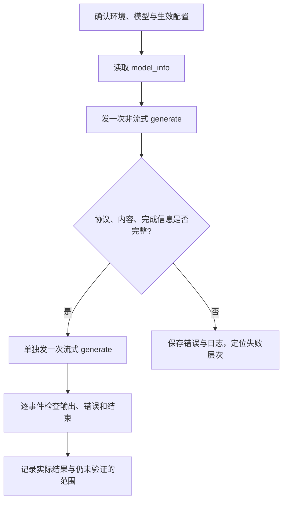

# 最小请求与启动故障定位

第一条请求的目标，是证明一条明确的输入经过指定服务得到了完整响应。它不是 benchmark，也不需要同时打开多卡、投机、分离部署和所有高级接口。

本文属于**源码分析型学习资料**，是系列第 **01-05** 篇。前半部分给出可在独立实验环境执行的检查步骤，后半部分把失败现象对应到源码边界。**本篇所有服务命令和请求均未执行，没有虚构的成功响应、耗时或性能数据。**

## 0. 阅读基线与范围

| 项目 | 内容 |
| --- | --- |
| 源码路径基准 | SGLang 仓库根目录 `.`；源码路径均相对此目录 |
| 分支 | `codex/sglang-source-study-20260909`，基于官方 `main` |
| commit | `72d5c5bb73cadd7ffbf5114e5f81e29d36b6c61a` |
| 读取时间 | `2026-09-09` |
| 工作区状态 | 源码 worktree 干净；保留 Wiki 与原工作区已有内容 |
| 操作边界 | 静态阅读 HTTP 接口、请求输出、预热、健康与参数校验代码；未部署或发请求 |
| 前置 | [环境准备](02-环境依赖与最小运行准备.md)、[服务启动](03-从CLI到服务进程启动.md)、[生效配置](04-从参数声明到最终生效配置.md) |
| 主线 | 已准备好兼容环境和普通文本生成模型的单实例 Python HTTP 服务 |
| 不展开 | 生产操作、所有认证/网关配置、完整 OpenAI 协议适配、故障注入与性能调优 |

下文将**源码事实**与**待执行实验步骤**分开。执行示例时要先确认目标地址确实是自己的实验服务；本轮不会根据示例访问任何服务。

## 1. 先定义“最小成功”

| 术语 | 人话解释 | 本篇的验收重点 |
| --- | --- | --- |
| smoke check | 用很小的负载检查关键通路 | 证明这一单能走通，不证明完整正确性 |
| HTTP 状态 | HTTP 请求层的处理结果 | 与生成内容和流中业务错误分别看 |
| SSE | 按事件逐步发送文本数据的响应格式 | 保留事件边界、错误内容和结束标记 |
| request ID / `rid` | 关联一次内部请求的标识 | 把输入、服务日志和输出对起来 |
| finish reason | 请求为何结束 | 区分达到长度上限、停止条件、错误/取消等 |
| deadline | 某一层愿意等待的期限 | 客户端期限、预热期限和健康期限不同 |

本篇最小成功应同时留下：模型/源码/配置证据、发送的请求、完整 HTTP 响应或 SSE、实际 token 计数与完成原因、同一时间范围的服务日志。

只保留一张“HTTP 200”的截图不够；只说“文本看起来合理”也不够。这两种证据都没有说明完整路径和请求结束状态。

## 2. 检查路线图



**图意解读：** 图是实验检查顺序，不是引擎的模块图。非流式先降低客户端解析复杂度；随后增加流式这一项变化。两次请求是两次独立执行，不应预设输出文本、缓存条件或耗时必然相同。

## 3. 启动一份便于对照源码的实验服务

### 3.1 执行前的条件

先完成 01-02 的环境准备，确认 Python 实际导入本文固定源码、模型配置/分词器/权重完整、设备与模型兼容，并留有权重之外的 KV 和执行空间。

下面的模型目录 `../model-weights/study-model` 是相对于实验源码仓根目录的**示例位置**，本仓没有为它下载权重。应替换为已准备的普通文本生成模型目录。

在实验源码仓根目录，用终端 A 执行下列示例；**本轮未执行**：

```bash
sglang serve --model-type llm \
  --model-path ../model-weights/study-model \
  --served-model-name study-model \
  --host 127.0.0.1 --port 30000 \
  --tp-size 1 --pp-size 1 --dp-size 1 \
  --disable-overlap-schedule \
  --cuda-graph-backend-decode disabled \
  --cuda-graph-backend-prefill disabled
```

这是普通单实例教学配置：把通用 overlap 和两阶段 graph 暂时关闭，便于与已经读过的链路对应。它不是性能推荐，也不保证适用于所有特殊模型或平台；具体生效值仍须经过模型/硬件规则与校验。[S01][S02]

保存完整启动输出。重点区分参数解析、子进程创建、模型/缓存初始化、Scheduler ready、HTTP 可访问与预热完成，不把最后一条汇总日志当成所有阶段证据。

### 3.2 为本次请求建立独立输出目录

在终端 B 中准备下面变量；后续请求命令都在**同一终端 B** 执行，变量不会自动跨终端传播：

```bash
study_run_dir="$(mktemp -d)"
study_base_url='http://127.0.0.1:30000'
```

`study_run_dir` 是新建临时目录，原始响应不会写进源码或覆盖既有报告。实验结束时记录它的位置，并按实验记录模板保留所需文件。

## 4. 第一关：模型信息与配置

先执行一个有明确客户端期限的模型信息请求，保存响应头和正文：

```bash
curl --silent --show-error --max-time 30 \
  --dump-header "$study_run_dir/model-info.headers" \
  --output "$study_run_dir/model-info.json" \
  "$study_base_url/model_info"
```

这里故意保留 HTTP 错误正文；curl 没有报告传输错误，也仍需检查保存的 HTTP 状态和内容。`30` 是此示例的客户端期限，不是 SGLang 的模型加载期限。

当前 `model_info()` 返回 manager 持有的模型路径、服务名、生成模式、模型架构等信息，以及若干当前配置字段。用它核对服务身份和输入类型，但接口成功不等于一次生成成功。[S03]

需要启动参数及内部状态时，可另读 `/server_info`。该接口会请求内部状态，顶层包含启动解析结果，`internal_states` 包含内部状态；它不是必然立即返回的纯静态页面，也不能把所有字段混成一个最新全局配置。[S04]

旧 `/get_model_info`、`/get_server_info` 是兼容入口，当前学习示例使用 `/model_info`、`/server_info`。

## 5. 第二关：一条非流式原生请求

### 5.1 保存请求，再发送

原生 `/generate` 直接针对当前加载模型生成，不需要在请求里再指定 OpenAI 协议的 `model` 字段。本篇先用普通文本输入：[S05][S06]

```bash
cat > "$study_run_dir/request.json" <<'JSON'
{
  "text": "The capital of France is",
  "sampling_params": {
    "temperature": 0,
    "max_new_tokens": 3
  },
  "stream": false
}
JSON

curl --silent --show-error --max-time 120 \
  --dump-header "$study_run_dir/generate.headers" \
  --output "$study_run_dir/generate.json" \
  --header 'Content-Type: application/json' \
  --data-binary @"$study_run_dir/request.json" \
  "$study_base_url/generate"
```

`temperature=0` 表达该请求的采样要求，代码会进行内部归一化；它不单独构成跨设备、跨后端逐位一致保证。`max_new_tokens=3` 是上限，停止条件可使实际输出更短。[S07]

### 5.2 读响应，而不是预设答案

本篇没有执行结果，因此不展示一份假定成功的 JSON。真正执行后，至少检查：

| 检查项 | 为什么需要 |
| --- | --- |
| HTTP 状态与错误对象 | 区分协议/输入失败与正常响应 |
| `text` 或对应输出字段 | 确认是否得到与该输入关联的输出；特殊模式的字段可能不同 |
| `meta_info.id` | 与该请求的日志和内部状态关联 |
| `meta_info.prompt_tokens`、`completion_tokens` | 记录实际计数，不能靠单词数猜 token 数 |
| `meta_info.finish_reason` | 确认请求如何结束，而不是只看到部分文本 |
| 服务端错误日志 | 协议返回和后台状态分别检查 |

`TokenizerManager._handle_batch_output()` 按 rid 找到请求状态，构造 `meta_info`，包括完成原因、prompt token 计数等；生成输出路径继续补充 completion 相关信息。[S08]

R1 的“8 输入、3 输出”在基础阶段是教学序列。这里的英文文本**不保证分词后有 8 个 token，也不保证恰好生成 3 个**；实验记录只能填实际结果。

### 5.3 源码里非流式怎样返回

HTTP `generate_request()` 的非流式分支等待 TokenizerManager 异步生成器的下一项，把内部结果编码为响应；遇到相应 ValueError 时组织错误响应。[S05]

这一处 `.__anext__()` 不意味着模型只 forward 一次。内部请求管理与调度已经负责跨轮推进，接口只是按非流式语义等待可以交付的结果。

## 6. 第三关：单独检查 SSE 流

流式请求用另一份文件和另一份结果，避免与非流式混在同一记录里：

```bash
cat > "$study_run_dir/request-stream.json" <<'JSON'
{
  "text": "The capital of France is",
  "sampling_params": {
    "temperature": 0,
    "max_new_tokens": 3
  },
  "stream": true
}
JSON

curl --silent --show-error --no-buffer --max-time 120 \
  --dump-header "$study_run_dir/stream.headers" \
  --output "$study_run_dir/stream.sse" \
  --header 'Content-Type: application/json' \
  --data-binary @"$study_run_dir/request-stream.json" \
  "$study_base_url/generate"
```

源码把内部输出逐项包成 `data: ...`，成功走完发送结束标记 `data: [DONE]`。但相关 ValueError 也可能变成流中的 `error` 对象，随后仍发送结束标记；客户端断开还存在提前返回分支。[S05]

因此应逐事件检查：

1. 响应是否是预期的 SSE 类型。
2. 每个 `data:` 事件是否可解析，是否包含业务错误。
3. 输出字段是累计文本还是增量文本，是否启用了对应增量配置。
4. 是否拿到生成完成信息，是否出现正常结束标记，还是传输提前断开。

**HTTP 200、看到文本、看到 `[DONE]` 三者都不能单独排除流中错误。** 此外，一次事件不必对应一个 token。相关流式输出配置和请求侧聚合行为已在 [Python 并发基础](../00-foundations/02-读源码必备的Python与并发基础.md)解释，后续 02-05 再完整展开。

本次若稍后测量延迟，也不能把 curl 的“首个响应字节”直接叫 TTFT：它可能首先观测到响应头或非内容事件。应按[指标账本](../00-foundations/05-吞吐延迟与显存的基本账本.md)定义观测点。

## 7. 健康检查为什么不能替代上面的请求

当前 Python HTTP `/health` 与 `/health_generate` 进入同一处理函数，但存在不同分支：[S09]

| 条件 | 行为 | 能说明的范围 |
| --- | --- | --- |
| 正在退出或 `ServerStatus.Starting` | 返回 503 | 当前状态未对该检查放行 |
| 诊断 bypass 开关开启 | 可直接返回 200 | 不能推断生成已执行 |
| `/health` 且禁用健康生成 | 可直接返回 200 | 检查状态，不执行该生成探测 |
| 进入生成探测 | 创建特殊小请求，并等待接收时间戳推进 | 只说明观察到相应通路有响应活动 |

生成探测在计时起点之后，只要 `last_receive_tstamp` 更新就可视为健康；它并不要求必须收到**这条探测请求自身**的完成响应。其他工作请求的响应也可能使它成功。

所以 `/health` 是服务监控接口，不是 R1 的完成证明。它还可能生成额外工作，不能把访问健康接口一概叫“完全被动的状态读取”。本篇仅分析代码，没有调用它。

健康的超时、默认预热的 HTTP 等待/生成超时、父进程等待 Scheduler ready 的 poll、客户端 curl 的 `--max-time` 各自独立。看到 “timeout”，先定位是哪一层。[S09][S10][S11]

## 8. 启动与首请求的故障地图

| 现象 | 先检查的证据 | 源码边界与下一步 |
| --- | --- | --- |
| 参数立即报错 | 完整 argv/YAML、首个错误、固定版本 | `prepare_server_args`、解析 pipeline、`check_server_args` |
| 子进程创建后长时间没 ready | 该 rank 日志、进程退出状态、初始化阶段 | `_wait_for_scheduler_ready`；5 秒 poll 不是总期限 |
| 子进程已死，父进程报初始化失败 | 最早的子进程 traceback/退出码 | `run_scheduler_process`、父进程等待与 SIGQUIT 处理 |
| 地址无法连接 | 目标 host/port、实际监听位置、启动日志 | HTTP 尚未绑定、地址不同或进程退出需分别判断 |
| 端口冲突 | 具体报错端口、实际占用者、本次端点配置 | 区分 HTTP、gRPC、bootstrap 和内部通信端点；不默认杀占用进程 |
| `/model_info` 成功但生成失败 | 两次请求完整结果、加载模型类型 | `/generate` 到 TokenizerManager 的真实链路 |
| 400/422 等输入错误 | 请求 JSON、Content-Type、错误正文 | 协议校验、内部请求归一化、sampling 参数；状态码需按具体路径解释 |
| OOM 出现在加载或首请求 | OOM 前后日志、长度、并发和显存配置 | 区分权重、KV、graph 和执行临时空间，不直接归因于缓存算法 |
| HTTP 200 的流中断/出错 | 完整 SSE、错误事件、客户端期限 | 检查流中业务错误、取消和完成事件，不能只读响应头 |
| 健康成功但 R1 卡住 | R1 的 ID、状态与结果，而不只看健康日志 | 活动性与单请求完成是不同证据 |
| 请求看似成功但文本不同 | 实际模型/权重、参数、token 计数、后端条件 | 单次 smoke 不证明完整精度或可复现性 |

排障时先保存证据，再提出针对实际失败层次的动作。延长客户端等待、降低并发或关闭某功能会改变条件，必须另记一轮；不能覆盖原失败记录后宣布同一实验成功。

## 9. 本篇完成与运行验收分别记录

| 项目 | 本轮结果 |
| --- | --- |
| HTTP/生成/健康/预热源码入口阅读 | 已完成静态阅读 |
| 示例路径、字段和源码引用检查 | 已按固定源码核对 |
| 实验环境准备与依赖安装 | 未执行 |
| 服务启动、非流式请求、流式请求 | 未执行 |
| GPU、多卡、精度、性能、取消安全性 | 未验证 |

将来真实实验完成后，补充每步的命令、原始输出位置、时间和实际结论。只通过非流式时就记录“非流式通过、流式未执行”，不要概括成整个服务验证完成。

## 10. 源码锚点与自测

| 行为 | 文件/符号 | 引用 |
| --- | --- | --- |
| 通用 overlap 参数 | `python/sglang/srt/arg_groups/fields/schedule.py` | [S01] |
| 两阶段 graph backend 参数 | `python/sglang/srt/arg_groups/fields/exec_.py` | [S02] |
| 模型信息接口 | `python/sglang/srt/entrypoints/http_server.py::model_info` | [S03] |
| 启动配置与内部状态接口 | `python/sglang/srt/entrypoints/http_server.py::server_info` | [S04] |
| 非流式与 SSE 返回 | `python/sglang/srt/entrypoints/http_server.py::generate_request` | [S05] |
| 固定版本请求示例 | `docs/docs/basic_usage/send_request.mdx` | [S06] |
| 采样参数校验 | `python/sglang/srt/sampling/sampling_params.py::SamplingParams.verify` | [S07] |
| 输出与 meta_info 组织 | `python/sglang/srt/managers/tokenizer_manager.py::TokenizerManager._handle_batch_output` | [S08] |
| 健康检查的实际条件 | `python/sglang/srt/entrypoints/http_server.py::health_generate` | [S09] |
| 默认预热 | `python/sglang/srt/entrypoints/http_server.py::_execute_server_warmup` | [S10] |
| 等待模型进程初始化 | `python/sglang/srt/entrypoints/engine.py::_wait_for_scheduler_ready` | [S11] |

1. **为什么先非流式、后流式？** 一次增加一个变量，先确认基本输出，再排查 SSE 解析与结束语义。
2. **curl 没报错是否等于模型成功？** 不等于；仍要检查 HTTP 状态、正文、流中错误与生成完成信息。
3. **`max_new_tokens=3` 是否保证三个输出？** 不保证，它是上限；真实计数和完成原因要一起记录。
4. **健康检查 200 为什么不能替代 R1 响应？** 可能有 bypass，也可能由其他响应活动满足检查条件，并未证明 R1 已结束。
5. **观察到首字节很快能否直接写 TTFT 很低？** 不能，首字节与首个有效生成内容的观测事件可能不同。

至此，阶段 01 的静态学习主线完成：能定位代码、解释启动、追生效配置，并设计带证据边界的首请求检查。下一篇为[02-01《API 协议到内部请求对象》](../02-request-lifecycle/01-API协议到内部请求对象.md)。返回[系列目录](../README.md)。

[S01]: https://github.com/sgl-project/sglang/blob/72d5c5bb73cadd7ffbf5114e5f81e29d36b6c61a/python/sglang/srt/arg_groups/fields/schedule.py#L173
[S02]: https://github.com/sgl-project/sglang/blob/72d5c5bb73cadd7ffbf5114e5f81e29d36b6c61a/python/sglang/srt/arg_groups/fields/exec_.py#L449
[S03]: https://github.com/sgl-project/sglang/blob/72d5c5bb73cadd7ffbf5114e5f81e29d36b6c61a/python/sglang/srt/entrypoints/http_server.py#L754
[S04]: https://github.com/sgl-project/sglang/blob/72d5c5bb73cadd7ffbf5114e5f81e29d36b6c61a/python/sglang/srt/entrypoints/http_server.py#L812
[S05]: https://github.com/sgl-project/sglang/blob/72d5c5bb73cadd7ffbf5114e5f81e29d36b6c61a/python/sglang/srt/entrypoints/http_server.py#L911
[S06]: https://github.com/sgl-project/sglang/blob/72d5c5bb73cadd7ffbf5114e5f81e29d36b6c61a/docs/docs/basic_usage/send_request.mdx
[S07]: https://github.com/sgl-project/sglang/blob/72d5c5bb73cadd7ffbf5114e5f81e29d36b6c61a/python/sglang/srt/sampling/sampling_params.py#L223
[S08]: https://github.com/sgl-project/sglang/blob/72d5c5bb73cadd7ffbf5114e5f81e29d36b6c61a/python/sglang/srt/managers/tokenizer_manager.py#L2240
[S09]: https://github.com/sgl-project/sglang/blob/72d5c5bb73cadd7ffbf5114e5f81e29d36b6c61a/python/sglang/srt/entrypoints/http_server.py#L664
[S10]: https://github.com/sgl-project/sglang/blob/72d5c5bb73cadd7ffbf5114e5f81e29d36b6c61a/python/sglang/srt/entrypoints/http_server.py#L2203
[S11]: https://github.com/sgl-project/sglang/blob/72d5c5bb73cadd7ffbf5114e5f81e29d36b6c61a/python/sglang/srt/entrypoints/engine.py#L1806
