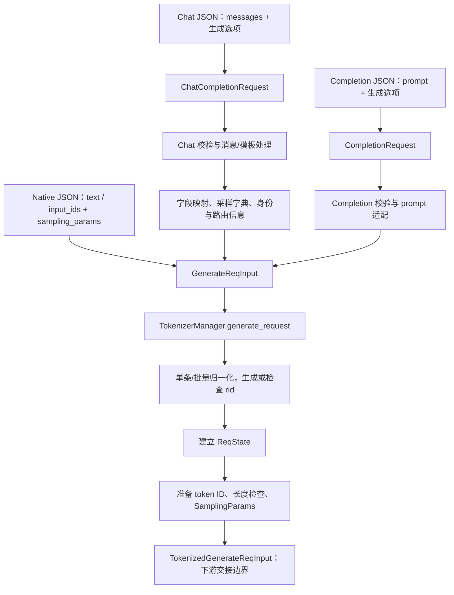

# API 协议到内部请求对象

同一句“请解释 KV Cache”，可以作为聊天消息发送，也可以作为原生文本发送。对服务端来说，这两份输入的结构不同：聊天请求还带着角色、对话轮次和模板规则。进入调度前，SGLang 要把这些面向客户端的表达整理成内部能继续处理的请求。

本文属于**源码分析型学习资料**，是系列第 **02-01** 篇。主线是普通文本、单请求、`n=1` 的 Python HTTP 服务，从 JSON 入口走到 `GenerateReqInput`、请求状态登记和 tokenized 请求的交接边界。重点回答“谁解释协议，谁准备输入，谁维护请求身份”；本篇没有启动服务或执行请求。

## 0. 阅读基线与范围

| 项目 | 内容 |
| --- | --- |
| 源码路径基准 | SGLang 仓库根目录 `.`；下文源码位置均为仓内相对路径 |
| 分支 | `codex/sglang-source-study-20260909`，基于官方 `main` |
| commit | `72d5c5bb73cadd7ffbf5114e5f81e29d36b6c61a` |
| 读取日期 | `2026-09-09` |
| 工作区状态 | 源码 worktree 干净；保留 Wiki 与原源码工作区已有内容 |
| 操作边界 | 静态阅读路由、协议模型、Chat/Completion 适配、输入归一化、请求登记和采样构造；无运行验证 |
| 前置 | [从文本到 Token](../00-foundations/03-从文本到Token再到模型输出.md)、[最小请求](../01-getting-started/05-最小请求与启动故障定位.md) |
| 不展开 | Responses/Anthropic 完整协议、工具与推理模型的所有编码器、多模态数据处理、批量并行采样、GPU 调度和取消退役 |

下文“源码事实”对应本页末尾的固定源码锚点；R1、教学图和字段对照是**整理者归纳**。示例未经过真实 tokenizer，不提供虚构的 token ID、生成结果或性能数据。

## 1. 人话版：先把“客户填的表”整理成“内部工单”

Chat API 的 `messages` 可以理解为一份带角色的对话记录；原生 `/generate` 的 `text` 更接近准备交给模型的提示文本。它们最终都要表达三件事：输入是什么、怎样生成、如何把输出认回这次请求。

这里的“工单”只是比喻。源码中有几种不同对象，不能把它们都简称为 request 后就当成同一份状态：

| 名称 | 人话解释 | 谁处理、保存什么 |
| --- | --- | --- |
| FastAPI `Request` | 本次 HTTP 连接的上下文 | 路由与处理器读取 headers、连接状态等；它不是模型输入 |
| `ChatCompletionRequest` / `CompletionRequest` | 按接口字段解释后的客户端请求 | OpenAI 适配器读取消息、prompt、生成选项，并保留响应组装需要的信息 |
| `MessageProcessingResult` | 消息处理的中间结果 | Chat 适配器保存模板产出的文本或 ID，以及停止条件、媒体和约束信息 |
| `GenerateReqInput` | 引擎前端统一接受的生成输入 | TokenizerManager 归一化输入形状、登记状态，再准备下游请求 |
| `ReqState` | 前端等待结果的状态记录 | TokenizerManager 按 `rid` 保存输出列表、完成标志、Event 与发送状态 |
| `TokenizedGenerateReqInput` | 即将交给调度侧的输入消息 | 含 token ID、采样对象、`rid` 等；跨进程传输在下一篇展开 |

这些是对象/组件的职责，不是六个独立进程。尤其是 Chat 适配器会使用 TokenizerManager 持有的 tokenizer；“使用同一个 tokenizer”不等于“分词一定在 `generate_request` 内发生”。[S02][S03][S05][S07][S12][S16]

## 2. 三个入口，在哪一层汇合



**图意解读：** 图展示函数与数据转换关系，没有画 GPU 或进程边界。Chat 路径中的模板处理可能已经产出 ID，因此 `TK` 节点表示统一预处理和检查，不代表必然再次调用 tokenizer。图省略了暂停等待、LoRA 解析、异常分支和结果返回；这些动作仍存在于源码。[S01][S03][S05][S11][S12]

| HTTP 入口 | 框架解释后的输入 | 主要转换位置 | 关键区别 |
| --- | --- | --- | --- |
| `/v1/chat/completions` | `ChatCompletionRequest` | `OpenAIServingChat._convert_to_internal_request` | 先处理角色/模板，再构造内部输入 |
| `/v1/completions` | `CompletionRequest` | `OpenAIServingCompletion._convert_to_internal_request` | 根据 prompt 类型选择文本或 ID；配置了 completion template 时还会加工 prompt |
| `/generate` | `GenerateReqInput` dataclass | 原生路由直接交给 TokenizerManager | 不经过 OpenAI Chat 适配器，也不会因此自动套用 Chat 的 messages 模板 |

源码中的 OpenAI 路由很薄：取得 `app.state` 中的 handler，调用 `handle_request`。基类依次做接口校验、协议转换、接收时间赋值，再按 `stream` 分发。原生路由则直接使用内部输入类型。[S01][S02][S06][S11]

## 3. 校验不是一道门，而是逐层补齐信息

在 JSON 刚到达时，服务还没有实际输入 token 数，因而不可能已经完成所有模型长度检查。阅读错误路径时，应先找“哪一层当时已经知道什么”。

| 层次 | 已知的信息 | 本基线实际检查举例 | 未证明什么 |
| --- | --- | --- | --- |
| HTTP / 字段解释 | content type、JSON 字段及声明类型 | OpenAI 路由依赖 `validate_json_request`；框架按协议模型解释字段 | 没有证明模板能处理这份对话 |
| Chat 语义校验 | 消息、工具、输出选项、模型配置 | 空 messages；纯文本模型收到媒体；工具选择与定义；部分输出长度检查 | 没有完整的分词后长度账本 |
| 协议转换 | 模板、用户选项、模型默认项 | 模板错误；流式与部分返回选项冲突；字段映射 | 内部输入还没有经过全部归一化 |
| 内部归一化与登记 | 输入形状、批大小、`n`、`rid` | 缺少输入、空 ID 输入、批内重复 ID、已有前端状态中的 ID 冲突 | 没有证明请求进入 GPU batch |
| tokenized 输入准备 | 实际输入 ID、上下文配置、采样项 | 输入长度、受配置控制的总长度、采样范围等 | 没有证明后续调度、执行或输出成功 |

**源码事实：** 本 HTTP 服务为 `RequestValidationError` 注册了处理器，通常的字段校验失败在这里映射为 HTTP **400**，不能照搬 FastAPI 默认 422 的印象。OpenAI content-type 检查也通过该异常进入处理器。`OpenAIServingBase.handle_request` 对自己的 `ValueError` 返回 400，对其他未分类异常返回 500；不同异常入口的响应包装需分别查看。[S18][S02]

### 3.1 长度错误为什么可能出现得较晚

Chat `_validate_request` 先检查请求声明的最大输出是否超过模型上下文上限，并考虑 `allow_auto_truncate`。它此时没有把整段消息实际编码后的长度加进来。[S04]

`TokenizerManager._validate_one_request` 才使用输入 token 数，并加上 `num_reserved_tokens`。本基线输入检查使用 `input_token_num >= context_len`；输入加输出的检查还受 `validate_total_tokens` 控制，且需要请求中有明确的 `max_new_tokens`。允许截断时会修改输入或输出上限，否则抛错。[S13]

因此不能写成“所有接口都在 HTTP 入口无条件检查输入加输出总长度”。也不能仅凭关闭这一层检查，推断调度侧没有其他限制。详细资源准入留到调度章节。

## 4. Chat template 如何改变模型真正收到的输入

### 4.1 从角色记录到模型认识的序列

`messages` 中的 `system`、`user`、`assistant` 是协议角色。模型最终要读取的是符合其训练格式的序列，可能包含角色标记、回合分隔符和待生成回答的前缀。不能直接把所有 `content` 拼起来就当成等价输入。

`_process_messages` 先整理模板参数、推理/工具相关条件，然后选择输入路径：[S05]

| 条件 | 处理方式 | 阅读时要保留的边界 |
| --- | --- | --- |
| 请求显式给出 `input_ids` | 把这些 ID 放入中间结果，跳过模板分词 | 仍先通过 Chat 请求校验，并处理前面的工具/推理条件；不等于整个 Chat handler 被跳过 |
| 未指定命名 conversation template | 进入 `_apply_jinja_template` | 内部还会优先尝试模型专用编码器；不能把函数名理解成所有模型都走相同 Jinja 分支 |
| 指定了命名 conversation template | 进入 `_apply_conversation_template` | 构造 conversation、取得 prompt，普通文本再 encode，并合并相应停止字符串 |

本篇选择**没有自定义编码器、普通文本的常规 Jinja 分支**。其关键顺序是先调用 `apply_chat_template(..., tokenize=False, add_generation_prompt=True)` 得到文本，再 `tokenizer.encode` 得到 ID。对会自动添加特殊 token 的 tokenizer，代码设置 `add_special_tokens=False`，避免模板已经带有标记后重复添加。[S05]

```text
messages
  → 按模型模板渲染的 prompt（包含模型需要的角色/边界）
  → encode 后的 prompt_ids
  → GenerateReqInput(input_ids=prompt_ids, sampling_params=...)
```

这段是教学数据流，不是真实分词结果。指定模板、`continue_final_message`、自定义编码器或多模态模型都会改变细节，不应把某个模型的角色 token 字符串推广成 SGLang 通用格式。

### 4.2 模板失败如何回退

常规 Jinja 分支第一次渲染/编码失败后，会尝试把工具结构改成较扁平的 function 形式再做一次。第二次遇到指定的模板客户端错误，会转成 `ValueError`，由上层按客户端错误处理。[S05]

这不是“任何错误都自动修好”，也不是把无效对话无限重试。排障应保存实际模板、输入角色/内容与完整错误，并定位究竟失败在消息加工、模板渲染还是 encode。

## 5. 参数名称相似，不代表内部原样保存

### 5.1 Chat 字段怎样映射

`ChatCompletionRequest.to_sampling_params` 产出的是一个字典；真正的 `SamplingParams` 对象在 TokenizerManager 的 `_create_tokenized_object` 中构造、normalize 和 verify。[S08][S14]

| Chat 输入 | 中间采样字典 | 行为说明 |
| --- | --- | --- |
| `max_completion_tokens` / `max_tokens` | `max_new_tokens` | 本基线使用 `self.max_completion_tokens or self.max_tokens` |
| `min_tokens` | `min_new_tokens` | 变成内部输出下限字段，随后有范围检查 |
| `seed` | `sampling_seed` | 名称改变；只给 seed 不构成跨硬件/版本一致性证明 |
| `temperature`、`top_p`、`top_k`、`min_p`、`repetition_penalty` | 对应同名项 | 使用专门的缺省选择函数 |
| 消息处理结果中的 `stop` | `stop` | 来源可能包含模板/工具处理，不一定只是原请求字段 |
| `n` | `n` | 普通并行采样影响内部单条/批量形状；本篇固定为 1 |
| `stream` | 不放入此字典，保存在 `GenerateReqInput.stream` | 控制响应输出路径，不能当成 GPU 调度 batch 参数 |
| `logprobs`、`top_logprobs` | 内部请求的 `return_logprob`、`top_logprobs_num` | 与采样参数分开传递 |

这里有一个适合练习读代码的细节：Python 的 `or` 按真值选择，而不是按“是否为 None”选择。如果 `max_completion_tokens=0`、`max_tokens=8`，上述表达式会选择 8。不要把源码改写成“只要新字段存在，它就永远优先”。本篇只记录该版本行为，未做运行复现或 patch。[S08]

### 5.2 缺省值来自哪一层

Chat 对前表五个同名采样项采用：**非 None 的请求值 → 可用的模型 generation config 项 → 协议类的默认值**。模型项不是无条件加载：`ModelConfig.get_default_sampling_params` 只有在 `sampling_defaults == "model"` 且有 generation config 时才返回这些允许的字段。[S08][S09]

到 `_create_tokenized_object` 时，还会把 TokenizerManager 的 `preferred_sampling_params` 与输入字典合并，输入字典中的键优先，然后构造具体采样类。常规 `SamplingParams` 会处理 None、特殊值、停止条件并校验范围。[S14][S15]

这是一条有作用域的默认值链，不能扩写成“所有接口、所有字段都自动继承模型默认”。例如 Completion 有自己的 `_build_sampling_params`，原生请求也没有经过 Chat 的 `to_sampling_params`。[S06]

### 5.3 为什么 `temperature=0` 在内部可能变成 1

常规 `SamplingParams.__post_init__` 对接近零且非负的 temperature，设置 `temperature=1.0`、`top_k=1`。内部用 `top_k=1` 表示贪心选择。看到内部 temperature 是 1，不能脱离 top-k 就判断用户的贪心请求被忽略。[S15]

停止条件也有内部整理过程。API 的 `stop` 与内部用于匹配的字段不是必须一直同名同值；真正怎样判定结束，参见基础篇并在本阶段后续正文继续追踪。

## 6. 请求身份：rid、session 和缓存命名空间分开看

### 6.1 rid 从哪里来

Chat/Completion 适配器把请求的 `rid` 传给 `GenerateReqInput`。调用 TokenizerManager 的生成器并开始执行后，`normalize_batch_and_arguments` 才进行单条/批量归一化。[S03][S06][S07][S12]

| 输入场景 | 本基线的身份处理 | 限定条件 |
| --- | --- | --- |
| 单条，`rid=None` | `_normalize_single_inputs` 生成 `uuid.uuid4().hex` | 不保证带有 `chatcmpl-` 前缀 |
| 单条，提供字符串 `rid="R1"` | 保留 R1 | 仍需在登记状态时检查冲突 |
| 批量，`n=1`，没有 rid | 为每项生成 ID | 本表不展开并行采样追加的身份变化 |
| 批量，`n=1`，提供字符串前缀 `rid="B"` | 生成 `B_0`、`B_1` 等 | 输入条数决定个数 |
| 批量，`n=1`，提供 ID 列表 | 要求长度与 batch_size 对应，并检查批内重复 | 列表不是一个整体请求的单独 ID |

源码基类虽然定义了 `_generate_request_id_base`，但本版本开头直接 `return None`，后面的带前缀生成逻辑不可达。不能仅凭函数名或 `_request_id_prefix` 就给图里加一个实际没有执行的 ID 生成步骤。[S02]

### 6.2 谁持有身份对应的活动状态

`_init_req_state` 检查 `rid_to_state`，发现已有相同 key 则抛出重复 ID 错误；否则创建 `ReqState`。普通单条请求初始输出列表为空、`finished=False`，带有一个 asyncio Event；`dispatched`、`abort_sent` 初始为 False。[S16]

这是**该 TokenizerManager 持有的活动状态表**，不是全局永久去重数据库。这里的冲突检查不能证明任意多 HTTP worker、网关或外部服务之间都已经完成全局唯一性协调。

| 字段 | 作用 | 不应混成什么 |
| --- | --- | --- |
| `rid` | 关联单次内部请求、结果与前端状态 | 不是缓存 key 的完整定义，也不是重试幂等保证 |
| `session_id` | 同一 session 的稳定身份 | 注释明确它本身不重建 prompt；不代表服务自动补齐聊天历史 |
| `session_params` | 另一组 session 控制输入 | `GenerateReqInput` 归一化拒绝同时设置它和 `session_id` |
| `cache_salt` | 区分原本相同前缀的缓存命名空间 | 不承担 HTTP 请求结果的归属登记 |

这一表依据内部输入契约。某个外部协议即使声明了字段，也必须继续核对适配器是否透传；不能直接推断所有接口具有相同 session 行为。[S03][S07]

普通非流式 Chat 响应在 `_build_chat_response` 中取 `ret[0]["meta_info"]["id"]` 作为响应 ID。因而沿 `rid → 前端状态 → 输出 meta_info → 响应 ID` 查找，比只搜索某种字符串前缀更可靠。[S17]

## 7. 用 R1 走到下游交接边界

以下 JSON 是**未发送的教学输入**。假设目标是已配置常规 Jinja 模板的普通文本模型，服务公开名称为 `study-model`，没有 LoRA、工具或媒体输入：

```json
{
  "model": "study-model",
  "messages": [
    {"role": "system", "content": "用简短中文回答。"},
    {"role": "user", "content": "KV Cache 是什么？"}
  ],
  "rid": "R1",
  "temperature": 0,
  "max_completion_tokens": 8,
  "n": 1,
  "stream": false
}
```

| 步骤 | R1 的表示或字段变化 | 谁推进、此时还没有什么 |
| --- | --- | --- |
| 1. 路由接收 | JSON 被解释为 `ChatCompletionRequest` | HTTP/协议层；尚未登记内部请求状态 |
| 2. Chat 校验 | 非空 messages 等检查通过后继续 | OpenAI handler；“通过”是此教学路径的前提，不是实测结果 |
| 3. 模板处理 | 两条消息变成模型格式的 prompt，再得到 `prompt_ids` | Chat 适配器调用 tokenizer；不知道具体模型就不能列真实 ID |
| 4. 适配 | `input_ids=prompt_ids`；采样字典 `max_new_tokens=8`、`temperature=0`；`rid=R1` | `GenerateReqInput`；此时它不是 Scheduler 的 `Req` |
| 5. 归一化 | 单条、batch_size=1；保留 R1，补齐缺省输出选项 | TokenizerManager 入口；尚未说明调度接纳 |
| 6. 登记 | `rid_to_state["R1"]` 中出现 `ReqState`，输出空、未完成、未发送 | 前端等待状态建立；没有 KV 分配证明 |
| 7. tokenized 准备 | 复用已给出的 ID；验证实际长度；构造采样对象，贪心对应 top_k=1 | `_tokenize_one_request` 与 `_create_tokenized_object` |
| 8. 下游交接 | `TokenizedGenerateReqInput` 携带 R1、ID 和采样配置 | 下一篇解释发送与接收；本篇不预判何时获得 GPU 执行机会 |

**八个新 token 是上限，不是要求生成八个汉字，也不是一定生成八个 token。** 具体结束仍可能由 EOS、stop、错误或取消等条件触发。

如果把用户这句话直接放进原生 `/generate` 的 `text`，它不会自动经历上面两条 messages 的同一模板处理。因此两种接口“文字意思类似”，不代表模型实际输入 ID 相同；应比较渲染和编码后的输入，再讨论输出差异。[S05][S11]

## 8. 容易误读的边界与排障地图

### 8.1 注释说“三选一”，实现是否真的严格排他

`GenerateReqInput._validate_inputs` 的这一版条件拒绝“三种输入全无”和“三种输入全有”，并不是一个严格的“恰好一项非空”计数判断。后面的 `_determine_batch_size` 和 `_tokenize_one_request` 还有输入优先级与特定组合用途。[S07][S12]

普通入门请求应明确只提供 `text` 或 `input_ids` 中的一种。不要把注释改写成“任意两个同时给都会在此报错”，也不要据此反向承诺所有混合输入都受支持。`input_embeds` 的缓存约束等分支要另读对应实现。

### 8.2 流式校验的时机与原生接口有差别

本版本 Chat `_handle_streaming_request` 会先取得生成器的首个 chunk，再构造 `StreamingResponse`。这样某些早期 `ValueError` 能在发送 HTTP 200 前返回 400。原生 `/generate` 的流式分支直接在流生成器中捕获并包装错误，时序不同。[S10][S11]

不能由 Chat 的这一步推出“所有流式错误都在响应头前出现”；后续生成仍可能失败。完整 SSE 内容和结束信息仍需检查，增量返回留到 02-05。

| 现象 | 优先检查 | 源码边界 |
| --- | --- | --- |
| JSON 解析/字段错误显示 400 | content type、字段类型、错误正文 | HTTP validation handler 与协议模型 |
| messages 非空但模板报错 | 实际模板、角色顺序、content 结构、工具形式 | `_process_messages`、具体模板分支 |
| 相同文字在 Chat 和 Native 表现不同 | 模板后的输入、special tokens、采样默认链 | Chat 适配与原生输入的差异 |
| max 输出设置似乎没有按预想优先 | 是否同时给两个 max 字段，值是否为 0 | `to_sampling_params` 的 `or` 表达式 |
| 内部 temperature 变为 1 | 同时查看 top_k 与 normalize 过程 | `SamplingParams.__post_init__` |
| Duplicate request ID | 单条/批量形式、批内 ID、该 manager 的活动状态 | 归一化与 `_init_req_state`，不是 GPU OOM |
| 给了 session_id 却没有历史对话 | 实际提交的输入和接口透传字段 | session 身份与 prompt 重建是不同契约 |
| 输入超长错误发生在 Chat 适配之后 | 实际 token 数、预留项、截断和总长度配置 | `_validate_one_request` |

状态登记后的失败清理由 `generate_request` 中的异常路径继续处理：未发送与已发送请求的动作不同。本文只定位该入口；是否有跨组件未完成操作、何时能释放资源，必须等 02-06 的生命周期阅读，不能用一个前端字典的变化证明全部清理完成。[S12][S16]

## 9. 源码锚点与最短复读路线

以下路径均相对于 **SGLang 仓库根目录**。按表从上向下读，可以复原本篇主线。

| 要核对的行为 | 仓内路径与符号 | 固定源码 |
| --- | --- | --- |
| OpenAI HTTP 路由与 JSON 校验 | `python/sglang/srt/entrypoints/http_server.py::openai_v1_chat_completions`；同文件 `validate_json_request` | [路由][S01]、[校验与异常处理][S18] |
| 通用 handler 的顺序和错误处理 | `python/sglang/srt/entrypoints/openai/serving_base.py::OpenAIServingBase.handle_request` | [基类][S02] |
| Chat 内部请求构造 | `python/sglang/srt/entrypoints/openai/serving_chat.py::OpenAIServingChat._convert_to_internal_request` | [适配][S03] |
| Chat 语义校验 | `python/sglang/srt/entrypoints/openai/serving_chat.py::OpenAIServingChat._validate_request` | [校验][S04] |
| 消息与模板路径 | `python/sglang/srt/entrypoints/openai/serving_chat.py::OpenAIServingChat._process_messages`；同类 `_apply_jinja_template`、`_apply_conversation_template` | [消息处理][S05] |
| Completion 转换和采样字典 | `python/sglang/srt/entrypoints/openai/serving_completions.py::OpenAIServingCompletion._convert_to_internal_request` | [Completion][S06] |
| 形状、ID 和输入归一化 | `python/sglang/srt/managers/io_struct.py::GenerateReqInput.normalize_batch_and_arguments`；同类 `_normalize_rid` | [内部输入][S07] |
| Chat 采样字段映射 | `python/sglang/srt/entrypoints/openai/protocol.py::ChatCompletionRequest.to_sampling_params` | [采样字典][S08] |
| 模型默认项的条件与字段范围 | `python/sglang/srt/configs/model_config.py::ModelConfig.get_default_sampling_params` | [模型默认][S09] |
| Chat 首个 chunk 预取 | `python/sglang/srt/entrypoints/openai/serving_chat.py::OpenAIServingChat._handle_streaming_request` | [流式入口][S10] |
| 原生生成入口 | `python/sglang/srt/entrypoints/http_server.py::generate_request` | [原生路由][S11] |
| 统一前端入口与 ID 输入分支 | `python/sglang/srt/managers/tokenizer_manager.py::TokenizerManager.generate_request`；同类 `_tokenize_one_request` | [统一入口][S12] |
| 分词后的长度检查 | `python/sglang/srt/managers/tokenizer_manager.py::TokenizerManager._validate_one_request` | [输入检查][S13] |
| 构造采样对象与下游消息 | `python/sglang/srt/managers/tokenizer_manager.py::TokenizerManager._create_tokenized_object` | [tokenized 对象][S14] |
| 采样特殊值与范围 | `python/sglang/srt/sampling/sampling_params.py::SamplingParams.__post_init__`；同类 `normalize`、`verify` | [SamplingParams][S15] |
| 前端状态登记 | `python/sglang/srt/managers/tokenizer_manager.py::TokenizerManager._init_req_state`；同文件 `ReqState` | [ReqState 登记][S16] |
| 非流式 Chat 响应 ID | `python/sglang/srt/entrypoints/openai/serving_chat.py::OpenAIServingChat._build_chat_response` | [响应组装][S17] |

## 10. 自测与验收

1. **Chat 请求已经有 `prompt_ids`，为什么仍调用 `_tokenize_one_request`？** 它还承担 ID 输入分支、附加输入预处理与检查、tokenized 对象构造；函数名不意味着必然再次分词。
2. **`max_completion_tokens=0` 且 `max_tokens=8`，本基线映射成多少？** 8，因为此处是 `or` 真值选择。实际使用应避免同时给出含义相叠的字段；本文没有修改这一行为。
3. **发现 `rid_to_state["R1"]` 是否说明 R1 已经获得 KV 槽位？** 不能。它是前端等待状态，登记时 `dispatched` 还为 False，GPU 资源归属要继续追调度侧。
4. **两个相同 prompt 使用不同 rid，能否由 rid 推断缓存隔离？** 不能。请求结果关联和缓存命名空间不同；需看实际 cache key 与 `cache_salt` 路径。
5. **空 messages、模板错误、输入超长分别去哪找？** Chat 校验、具体模板转换、分词后的 `_validate_one_request`。它们掌握的信息与发生时机不同。

验收时应能不用函数名先解释“协议 → 模板/输入 → 采样 → 身份登记 → 下游消息”，再在上表为每一步找到源码。本文已做静态路径、符号、链接和教学 JSON 检查；没有运行请求、验证模板输出或渲染 Mermaid。

下一篇是[02-02《Tokenizer 与进程间消息通路》](02-Tokenizer与进程间消息通路.md)，继续追踪消息如何到达 Scheduler，以及 API 批量、分词批量和 rank 广播各自的边界。返回[系列目录](../README.md)。

[S01]: https://github.com/sgl-project/sglang/blob/72d5c5bb73cadd7ffbf5114e5f81e29d36b6c61a/python/sglang/srt/entrypoints/http_server.py#L1741
[S02]: https://github.com/sgl-project/sglang/blob/72d5c5bb73cadd7ffbf5114e5f81e29d36b6c61a/python/sglang/srt/entrypoints/openai/serving_base.py#L72
[S03]: https://github.com/sgl-project/sglang/blob/72d5c5bb73cadd7ffbf5114e5f81e29d36b6c61a/python/sglang/srt/entrypoints/openai/serving_chat.py#L1046
[S04]: https://github.com/sgl-project/sglang/blob/72d5c5bb73cadd7ffbf5114e5f81e29d36b6c61a/python/sglang/srt/entrypoints/openai/serving_chat.py#L945
[S05]: https://github.com/sgl-project/sglang/blob/72d5c5bb73cadd7ffbf5114e5f81e29d36b6c61a/python/sglang/srt/entrypoints/openai/serving_chat.py#L1201
[S06]: https://github.com/sgl-project/sglang/blob/72d5c5bb73cadd7ffbf5114e5f81e29d36b6c61a/python/sglang/srt/entrypoints/openai/serving_completions.py#L70
[S07]: https://github.com/sgl-project/sglang/blob/72d5c5bb73cadd7ffbf5114e5f81e29d36b6c61a/python/sglang/srt/managers/io_struct.py#L378
[S08]: https://github.com/sgl-project/sglang/blob/72d5c5bb73cadd7ffbf5114e5f81e29d36b6c61a/python/sglang/srt/entrypoints/openai/protocol.py#L1095
[S09]: https://github.com/sgl-project/sglang/blob/72d5c5bb73cadd7ffbf5114e5f81e29d36b6c61a/python/sglang/srt/configs/model_config.py#L1857
[S10]: https://github.com/sgl-project/sglang/blob/72d5c5bb73cadd7ffbf5114e5f81e29d36b6c61a/python/sglang/srt/entrypoints/openai/serving_chat.py#L1647
[S11]: https://github.com/sgl-project/sglang/blob/72d5c5bb73cadd7ffbf5114e5f81e29d36b6c61a/python/sglang/srt/entrypoints/http_server.py#L911
[S12]: https://github.com/sgl-project/sglang/blob/72d5c5bb73cadd7ffbf5114e5f81e29d36b6c61a/python/sglang/srt/managers/tokenizer_manager.py#L776
[S13]: https://github.com/sgl-project/sglang/blob/72d5c5bb73cadd7ffbf5114e5f81e29d36b6c61a/python/sglang/srt/managers/tokenizer_manager.py#L1171
[S14]: https://github.com/sgl-project/sglang/blob/72d5c5bb73cadd7ffbf5114e5f81e29d36b6c61a/python/sglang/srt/managers/tokenizer_manager.py#L1356
[S15]: https://github.com/sgl-project/sglang/blob/72d5c5bb73cadd7ffbf5114e5f81e29d36b6c61a/python/sglang/srt/sampling/sampling_params.py#L163
[S16]: https://github.com/sgl-project/sglang/blob/72d5c5bb73cadd7ffbf5114e5f81e29d36b6c61a/python/sglang/srt/managers/tokenizer_manager.py#L3463
[S17]: https://github.com/sgl-project/sglang/blob/72d5c5bb73cadd7ffbf5114e5f81e29d36b6c61a/python/sglang/srt/entrypoints/openai/serving_chat.py#L2031
[S18]: https://github.com/sgl-project/sglang/blob/72d5c5bb73cadd7ffbf5114e5f81e29d36b6c61a/python/sglang/srt/entrypoints/http_server.py#L597
