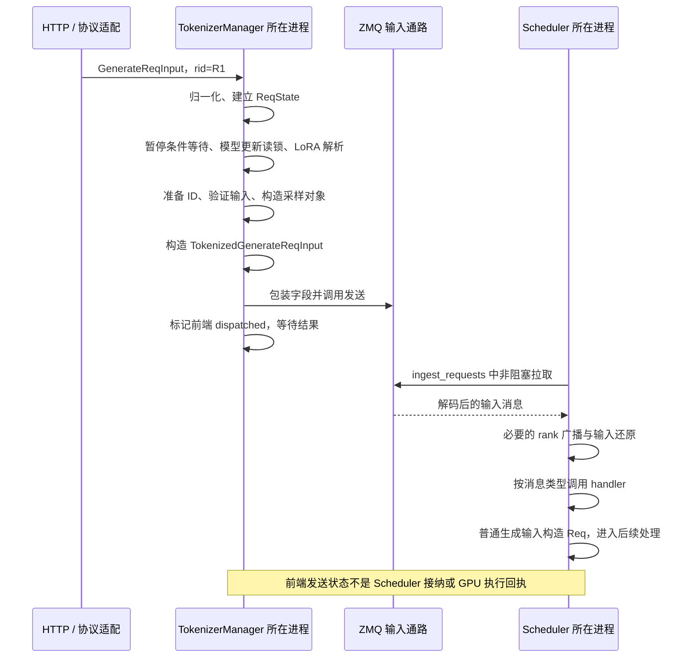
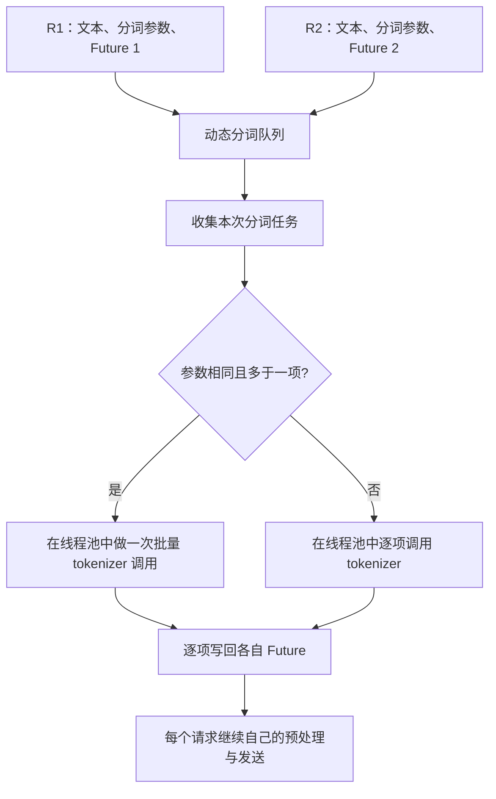

# Tokenizer 与进程间消息通路

请求已经变成 `GenerateReqInput`，并不意味着模型马上开始计算。前端需要准备 token 和采样配置，把消息送到调度侧；调度侧还要接收、同步必要输入、按类型处理，才能进入后续排队与组批。

本文属于**源码分析型学习资料**，是系列第 **02-02** 篇。沿 R1 从 TokenizerManager 走到 Scheduler 的请求处理入口，再用 R1/R2 解释各种“batch”与“共享”的区别。全文只做静态阅读，没有运行 tokenizer、IPC、分布式通信或模型。

## 0. 阅读基线与范围

| 项目 | 内容 |
| --- | --- |
| 源码路径基准 | SGLang 仓库根目录 `.`；源码位置均为仓内相对路径 |
| 分支 | `codex/sglang-source-study-20260909`，基于官方 `main` |
| commit | `72d5c5bb73cadd7ffbf5114e5f81e29d36b6c61a` |
| 读取日期 | `2026-09-09` |
| 工作区状态 | 源码 worktree 干净；原工作区与 Wiki 已有资料保留 |
| 操作边界 | 静态追踪分词、tokenized 对象、发送包装、接收广播与类型分发；无运行验证 |
| 前置 | [API 到内部请求](01-API协议到内部请求对象.md)、[Python 与并发基础](../00-foundations/02-读源码必备的Python与并发基础.md) |
| 主线 | Python HTTP、一个 tokenizer worker、普通文本、`n=1`、PP=1、无 DP attention；先 TP=1，再单独说明 TP 广播 |
| 扩展边界 | 动态分词批量、API 批量和 SHM 多模态输入只解释当前交接机制；不完整展开 DP/PP 拓扑、EPD、CUDA VMM、Rust 服务与资源退役 |

源码事实对应页末固定锚点；图和 R1/R2 是教学归纳。图中的“收到”“发送”均指相应代码边界，不替代真实环境中的进度证据。

## 1. 人话版：翻译输入、发送消息、安排计算是三项工作

Tokenizer 把文本转成模型使用的 ID；TokenizerManager 还负责输入检查、前端状态与结果等待。Scheduler 则决定请求如何进入调度状态、何时组合成执行 batch。一个名字里有 manager，不等于它管理了所有资源。

| 术语 | 人话解释 | 谁拥有这层状态 |
| --- | --- | --- |
| tokenizer | 按模型词表与编码规则转换文本的组件 | TokenizerManager 持有实例；Chat 适配器也可能调用它 |
| tokenized request | 已准备好 ID 等信息的消息 | 前端构造，调度侧接收后解释 |
| IPC | 进程间传递消息的通路 | 两端各持 socket；本篇主线使用 ZMQ |
| PUSH / PULL | 消息发送端 / 拉取端的 socket 类型 | 与 HTTP 请求/响应不是同一协议 |
| serialization | 把对象表示成可以传输的字节 | `io_struct.py` 的编码包装和类型契约 |
| rank | 并行进程在相关组中的编号 | Scheduler 的 ParallelState 描述不同并行维度 |
| SHM | 本机共享内存中的数据与引用 | 这里主要指条件启用的多模态 feature 传输，不是 KV 缓存总称 |
| dispatch | 把输入交给下一层处理的动作 | 发送、接收、类型分发、GPU 执行要按观察位置分别命名 |

## 2. R1 的完整入站地图



**图意解读：** T 与 S 是两个参与进程；H 在本篇部署模式下属于前端组件，图中单列仅为区分协议职责。Z 是通信通路，不是额外的业务进程。此处没有把等待结果画成 S 同步返回一个函数值：结果有独立的回程接收任务。[S01][S05][S07][S09][S10]

暂停等待与模型更新读锁来自 `generate_request`。读到 `_tokenize_one_request` 时，应知道它位于这条更大的生成器主线中，而不是一个收到字符串就立即发往 GPU 的独立接口。[S01]

## 3. 分词实际在哪发生

### 3.1 同一个函数有三种输入路径

`_tokenize_one_request` 先检查输入形式：[S02]

| 输入 | 当前处理 | 关键限制 |
| --- | --- | --- |
| `input_embeds` | 保留 embedding 输入，并带上已有 input_ids | 此路径要求关闭 Radix cache；不能套用普通文本所有结论 |
| 已有 `input_ids` | 复用这些 ID | 仍继续验证并创建下游对象；Chat 适配器已编码的输入常走这里 |
| 普通 `text` | 经 `_tokenize_texts` 调用 tokenizer | tokenizer 未初始化时拒绝文本；空媒体占位等例外不属于本篇普通文本主线 |

普通文本最后执行 `_validate_one_request`，再进入 `_create_tokenized_object`。后者把 ID 转成 `array("q", input_ids)`，合并采样配置并构造 `SamplingParams`，随后 normalize、verify，形成 `TokenizedGenerateReqInput`。[S03]

这时 ID 仍是请求消息里的整数序列，不是已放进 GPU 执行 batch 的 tensor，也不是 KV。`input_text` 可以同时保留原始文本，不能因为出现文本字段就认为模型会直接读取字符串。

### 3.2 普通分词与动态分词批量

`_tokenize_texts` 先判断单字符串、字符串批量或 cross-encoder 输入形式。对本篇普通文本：[S02]

- 已启用动态分词器且输入是单字符串时，等待 `async_dynamic_batch_tokenizer.encode`。
- 否则使用常规 tokenizer 路径；非 fast tokenizer 的普通文本通过逐个 `encode` 处理，其他相应路径调用 tokenizer 的批量接口。

仅仅看到 `async def`，不能推断里面所有 CPU 工作都被放到后台线程。常规路径直接调用 tokenizer；动态分词组件才显式使用单线程 `ThreadPoolExecutor` 执行阻塞分词。[S02][S04]

### 3.3 动态分词器怎样把 R1/R2 临时放在一起

`AsyncDynamicbatchTokenizer.encode` 创建一个 Future，把 `(prompt, kwargs, future)` 放入异步队列并等待结果。后台循环取出第一项，检查还有没有待处理项，再决定是否继续收集到上限或等待窗口。[S04]



**图意解读：** 聚合的是 CPU 分词任务。R1/R2 保留各自 Future 与后续请求身份，不会因此被合并成一个回答或一个 Scheduler `Req`。参数不同会选择逐项分词，执行异常会设置相应未完成 Future 的异常。

一个容易漏看的分支是：取出第一项后，如果队列已经为空，代码直接处理这项，不固定等待整个批量窗口。不能把配置窗口写成“每个请求必然增加的延迟”，也不能由这一设计推导未经测量的性能收益。[S04]

Chat 适配阶段已经完成编码的请求，进入这里后走 ID 分支，因此不能假定开启动态分词器就会批处理所有 Chat 模板渲染和编码。

### 图解补充：文字经过分词流水线


[查看原尺寸](../../../images/sglang-source-study/01-tokenizer-pipeline.svg)。

**图意解读：** 沿左侧从上到下读：文字规范化、预切分、子词切分，最后加入特殊标记。右侧的 Model 指分词算法，不是负责生成回答的语言模型。

**对应本篇源码：** 把图限定在 `_tokenize_texts` 的内部工作：它之后还有验证、构造消息与发送；动态分词队列不等于 GPU batch。 [源码：python/sglang/srt/managers/tokenizer_manager.py][S02]

**来源与边界：** [Building a tokenizer, block by block](https://huggingface.co/learn/llm-course/chapter6/8?fw=pt)，Hugging Face LLM Course，未标独立发布日期。这是 Hugging Face 的分词示例；转小写、WordPiece 的 ##、CLS/SEP 都取决于 tokenizer，不是所有 SGLang 模型的固定步骤。图中还未画出词表 ID 到 embedding 的计算。 [来源档案 F01](../../../images/sglang-source-study/SOURCES.md#f01)。

## 4. API batch、tokenizer batch、IPC batch、GPU batch

这四种 batch 的边界不同，是本篇最需要掌握的关系。

| 名称 | 聚合了什么 | 谁决定 | 是否承诺一起执行模型 |
| --- | --- | --- | --- |
| API 批量输入 | 一个外部输入里有多个 prompt/ID 序列 | 客户端输入形状，随后由 `GenerateReqInput` 归一化 | 否 |
| tokenizer batch | 一次或一组 CPU 分词工作 | TokenizerManager 的批量策略，或动态分词器 | 否 |
| `BatchTokenizedGenerateReqInput` | 一个消息封装多个已准备好的输入 | `_send_batch_request` | 否 |
| `ScheduleBatch` | 本轮调度/执行相关的请求集合 | Scheduler 后续组批流程 | 需要结合实际调度模式和约束解释 |

### 4.1 n=1 的 API 批量走哪条路径

`_handle_batch_request` 在普通 `parallel_sample_num == 1` 分支检查 `_should_use_batch_tokenization`。选择批量路径后，先准备 tokenized 对象列表，再以一个 `BatchTokenizedGenerateReqInput` 发送；否则逐项预处理并发送，分别建立结果等待者。[S05]

本基线的策略表达式需要按括号读：

```text
batch_size > 0，并且满足以下之一：
  A. enable_tokenizer_batch_encode 已启用
  B. 未启用 DP attention，并且整批没有需要分词/媒体处理的文本输入
```

B 表示可以把预先给出的 ID 等输入直接包装成批量消息，并不需要进行一次真正的分词调用。`_batch_tokenize_and_process` 检查整批没有文本时，会逐项调用 `_tokenize_one_request`，因此其后续分词专用校验不适用于这个提前返回分支。[S05]

如果确实进入文本批量编码，则逐项检查多模态、已有 ID、embedding 等限制。不能从某个校验函数单独摘一句“禁止预分词输入”，就认定整个批量消息路径不支持 ID。

源码注释提示 DP attention 的批量分词支持边界，但表达式中 `enable_tokenizer_batch_encode` 的显式开启位于 OR 的另一侧。因此本篇**不把“未启用 DP attention”写成对全部批量路径的统一硬拒绝条件**；组合兼容性需要连同配置解析、控制器路由和实际测试继续核查。

### 4.2 两条请求为什么可能一起传输、分别排队

假设 API 提供两个已分词输入，`n=1`、不启用 DP attention。它们可被封装为：

```text
BatchTokenizedGenerateReqInput
  batch[0] = TokenizedGenerateReqInput(rid=R1, input_ids=...)
  batch[1] = TokenizedGenerateReqInput(rid=R2, input_ids=...)
```

Scheduler 类型分发选中 `handle_batch_generate_request` 后，遍历消息里的条目，对每项调用 `handle_generate_request`。后者才构造对应 `Req`、执行后续验证与排队/grammar 处理。[S10]

因此一条 IPC 消息不等于一次 GPU forward。R1/R2 是否进入同一执行 batch，还要看队列、长度、缓存、预算和模式。本文不提前承诺。

`n>1` 另有公共前缀预处理、复制输入和重新生成 ID 的流程，不是把此表机械乘以 n；高级生成章节再详细解释。[S05]

## 5. 下游消息里携带什么，没携带什么

`TokenizedGenerateReqInput` 继承 `BaseReq` 的 `rid`、`http_worker_ipc`。其主要字段可分为四组：[S03][S06]

| 字段组 | 代表内容 | 生命周期/所有权 |
| --- | --- | --- |
| 输入数据 | `input_text`、`input_ids`、可选 embedding/多模态输入 | 前端准备，调度侧转换成自己的请求视图 |
| 生成约束 | `sampling_params`、logprob/stream 选项 | 为后续采样、输出和结束判定提供请求配置 |
| 关联与路由 | `rid`、`http_worker_ipc`、可选 rank/session/cache 信息 | 保留结果归属与路由上下文；不等于传递前端整个状态表 |
| 观测信息 | `time_stats` | 随消息传递观测状态；没有携带前端 asyncio Event |

前端 `ReqState` 的 `out_list`、Event 和 `dispatched` 不作为同一个共享 Python 对象交给 Scheduler。接收消息后，普通路径会构造 Scheduler 自己的 `Req`。相同 `rid` 是关联标识，不证明它们拥有同一份内存或同一套生命周期。[S01][S06][S10]

多 tokenizer worker 模式中，`stamp_http_worker_ipc` 会给单条消息或 batch 内各条目写入回程位置。它解决“输出回哪个前端”的问题。完整多 worker router 不属于本篇主线，不能把单 worker 的 socket 拓扑照搬过去。[S07]

## 6. IPC：对象怎样变成字节，又怎样变回对象

### 6.1 两端 socket 的实际连接关系

在本篇单 tokenizer worker 模式，TokenizerManager 建立 PUSH socket，绑定 `scheduler_input_ipc_name`。Scheduler 的指定接收 rank 创建 PULL socket，连接同一端点。`get_zmq_socket` 的 `bind` 参数决定绑定还是连接；发送方不一定是 connect 方。[S07][S08]

这里的端点是由 `PortArgs` 传入的内部通道名称，不等于公开 HTTP 端口。排障时应核对两端实际使用的同一端点和进程，而不是仅确认客户端能连接 HTTP。

### 6.2 msgpack 外壳与显式 pickle 字段

`sock_send` / `sock_recv` 根据 `_USE_PICKLE_IPC` 选择 pickle 整体对象路径或 msgpack 路径；该值来自环境配置。msgpack 路径仍允许显式的 `PickleWrapper` 字段，因此不能写成“msgpack 模式绝不使用 pickle”。[S06]

普通 tokenized 生成请求的 `wrap_pickle_fields` 会处理 `time_stats`；接收侧有相应的 unwrap。`_send_one_request` 保存本地 `time_stats` 引用，包装后发送，再恢复本地引用并记录发送阶段时间。IPC 的字节表示与本地后续使用的 Python 对象要分开理解。[S03][S06][S07]

`_dispatch_to_scheduler` 调用的是 `sock_send` 包装器；代码另有 `_async_dispatch_to_scheduler`。本篇单请求发送链不能因为外围函数是 async，就画成实际调用了另一个异步包装器。

### 6.3 dispatched 标志能证明哪一步

`_send_one_request` 调用发送包装器后执行 `_mark_state_dispatched`，把该 rid 的前端状态改为 True。失败清理利用这个标志，决定在本地丢弃未发送状态还是发起下游 abort。[S07]

这条路径没有在标记前等待 Scheduler 接纳回执。标志名和函数注释不能代替实际握手证据：

```text
前端完成发送调用/登记
  ≠ Scheduler 已拉取并解码
  ≠ 已建立可调度 Req
  ≠ 已分配 KV
  ≠ 已执行模型
```

这些阶段必须分别定位。本文没有检验实际 socket 排队、背压或故障时序，也不把 dispatch 时间戳当成 GPU 开始时间。

## 7. Scheduler 怎样接收入站消息

### 7.1 先接收，再按类型交给 handler

普通 `event_loop_normal` 先调用 `ingest_requests`，然后才选择下一执行计划。`ingest_requests` 合并当前 rank 产生的超时 abort 输入，调用 `SchedulerRequestReceiver.recv_requests`，再 `process_input_requests`。[S09][S10]

接收器主线如下：

1. 如果有接收跳过器，先检查本轮是否接收。
2. `_pull_raw_reqs` 在相关 rank 从 tokenizer 输入与 RPC 通道拉取。
3. 条件启用的 input blocker 处理消息集合。
4. 在相关 rank 间广播输入，并附上相应本地 abort。
5. 执行需要的 pickle 字段还原、MM 接收与 SHM 处理。
6. 返回列表，供 Scheduler 按类型分发。

PP=1 的 Python/ZMQ 主线使用 `zmq.NOBLOCK` 拉取，遇到接收上限或 `zmq.ZMQError` 时退出相应拉取循环。源码捕获的是这一异常基类，因此不能把“这轮没有更多输入”当成所有该异常的唯一解释。[S09]

接收上限在这里按已拉取列表的长度计数，一个批量输入封装也占其中一项。因此不能把 `max_recv_per_poll` 直接解释为本轮最多执行多少条生成请求，更不能解释成 token 数上限。

### 7.2 TP 广播的是输入视图，不是把每个请求独立服务一遍

在无 DP attention 的普通 TP 路径，指定源 rank 拉取输入；当 TP size 不为 1 时，接收器使用 TP CPU group 上的 `broadcast_pyobj` 把输入列表传给参与 rank。[S09]

各 rank 要对同一批输入形成协调的处理视图，才能继续参与模型的并行执行。它们不是收到同一条 HTTP 请求后各自生成互不相关的答案。TP=1 则没有这一多 rank 广播动作。

启用 DP attention 时，代码拆分 work/control 请求并采用相应组内广播；PP 后续 stage 还有点对点接收。`pp_rank`、`attn_tp_rank`、`attn_cp_rank` 和 TP group 的编号不能全部简称为“全局 rank 0”。本篇只标明分支，完整拓扑见阶段 06。

### 7.3 共享输入不等于共享 KV

普通文本的 ID 通过消息表达。条件启用的 SHM 路径针对多模态 feature/预计算 embedding：`wrap_shm_features` 把相关数据包装成共享内存引用，接收侧再 materialize。它与普通 ID 列表广播、GPU KV 物理槽位分别属于不同对象。[S11]

`_finalize_shm_features` 仅在模型与输入满足条件时进入。它在 materialize 前参与相应的 rank barrier；各 rank 尝试还原后，再用失败标志归约，使参与组对哪些请求失败形成一致判断；失败条目被标记为 `MMInputsProcessError`。[S12]

这只是当前输入接收边界的静态流程，不证明所有 SHM、CUDA VMM、RDMA 或异常退役路径都已验证。对于数据传输，应分别问“拿到引用了吗”“能还原数据吗”“参与 rank 是否一致”“谁负责释放”，不能用“共享”二字跳过对象生命周期。

## 8. R1/R2 的交接账本与排障

假设两条普通文本请求分别进入前端，动态分词器把它们一起编码，之后各自发送。下表是**教学场景**，不表示某次实测必然发生这样的合批：

| 观察位置 | R1 | R2 | 能得出的结论 |
| --- | --- | --- | --- |
| 前端登记后 | 有自己的 ReqState，未发送 | 有自己的 ReqState，未发送 | 两条活动前端请求 |
| 动态分词队列 | Future 1 | Future 2 | 可能一起分词，身份仍独立 |
| 分词结果写回 | 获得自己的 input_ids | 获得自己的 input_ids | CPU 输入准备推进，不是 KV 写入 |
| 各自发送后 | dispatched=True | dispatched=True | 前端已推进发送路径，没有接纳回执证明 |
| 接收 rank 拉取 | 可能本轮收到 | 可能本轮或后续才收到 | socket 到达/轮询边界不等于 API 到达时间 |
| 类型分发后 | 对应生成 handler | 对应生成 handler | 普通路径继续建立各自 Req |
| 后续组批 | 等待调度选择 | 等待调度选择 | 是否同批取决于后续调度条件 |

发送后，TokenizerManager 的独立 `handle_loop` 从结果通道异步接收，按消息类型更新前端状态或分发控制结果。单请求等待者通过自己捕获的 `ReqState` 等待通知。详细流式合并与结束清理留到 02-05、02-06。[S13]

| 症状 | 应保存/核对的证据 | 首要源码边界 |
| --- | --- | --- |
| HTTP 已收到请求，但分词没推进 | 输入是 text 还是 ID、动态队列/Future、分词错误 | `_tokenize_texts` 与动态分词器 |
| 打开动态分词后 Chat 性能没变化 | 是否已在 Chat 模板阶段 encode | 02-01 的模板路径与本篇 ID 分支 |
| API 批量输入被拒绝 | 真正进入的批量分支、是否含媒体/ID/embedding | `_batch_tokenize_and_process` 及其提前返回 |
| dispatched=True，但无 Scheduler 记录 | 两端进程、端点、发送调用、拉取和类型分发日志 | IPC 发送状态与接收处理分别检查 |
| 一个 rank 有输入，另一个没推进 | 实际并行组、源 rank、广播分支 | `_broadcast_reqs_across_ranks` |
| 一次收到 batch，却没有同时执行 | 每条请求的 handler/队列状态、后续预算 | IPC batch 与 ScheduleBatch 分开追踪 |
| 多模态引用到达但读取失败 | 对应 rid 的 materialize 异常与 rank 失败标志 | `_finalize_shm_features`；不能归结成 KV OOM |

本表是定位路线，不是确认过的线上根因；没有执行故障注入或自动重试。

## 9. 源码锚点

| 关注点 | SGLang 仓内路径与符号 | 固定源码 |
| --- | --- | --- |
| 统一前端生成器 | `python/sglang/srt/managers/tokenizer_manager.py::TokenizerManager.generate_request` | [请求主线][S01] |
| 输入分支与分词策略 | `python/sglang/srt/managers/tokenizer_manager.py::TokenizerManager._tokenize_one_request`；同类 `_tokenize_texts` | [分词][S02] |
| 下游输入构造 | `python/sglang/srt/managers/tokenizer_manager.py::TokenizerManager._create_tokenized_object` | [对象构造][S03] |
| 动态分词队列与线程池 | `python/sglang/srt/managers/async_dynamic_batch_tokenizer.py::AsyncDynamicbatchTokenizer.encode`；同类 `_dynamic_batch_loop`、`_process_dynamic_batch` | [动态分词][S04] |
| API 批量路径 | `python/sglang/srt/managers/tokenizer_manager.py::TokenizerManager._handle_batch_request`；同类 `_should_use_batch_tokenization`、`_batch_tokenize_and_process` | [批量请求][S05] |
| 消息类型与序列化 | `python/sglang/srt/managers/io_struct.py::TokenizedGenerateReqInput`；同文件 `BatchTokenizedGenerateReqInput`、`sock_send`、`sock_recv` | [消息契约][S06] |
| 通道、发送与前端标志 | `python/sglang/srt/managers/tokenizer_manager.py::TokenizerManager.init_ipc_channels`；同类 `_send_one_request`、`_send_batch_request`、`_mark_state_dispatched`；同文件 `stamp_http_worker_ipc` | [前端 IPC][S07] |
| Scheduler socket 建立 | `python/sglang/srt/managers/scheduler_components/ipc_channels.py::SchedulerIpcChannels.create`；`python/sglang/srt/utils/network.py::get_zmq_socket` | [调度侧通道][S08] |
| 接收与广播 | `python/sglang/srt/managers/scheduler_components/request_receiver.py::SchedulerRequestReceiver.recv_requests`；同类 `_pull_raw_reqs`、`_broadcast_reqs_across_ranks` | [接收器][S09] |
| 入站与类型分发 | `python/sglang/srt/managers/scheduler.py::Scheduler.ingest_requests`；同类 `process_input_requests`、`handle_generate_request`、`handle_batch_generate_request` | [调度入站][S10] |
| SHM 数据包装与还原 | `python/sglang/srt/managers/mm_utils.py::wrap_shm_features`；同文件 `unwrap_shm_features` | [SHM 工具][S11] |
| SHM 的 rank 一致失败处理 | `python/sglang/srt/managers/scheduler_components/request_receiver.py::SchedulerRequestReceiver._finalize_shm_features` | [输入还原][S12] |
| 回程接收任务 | `python/sglang/srt/managers/tokenizer_manager.py::TokenizerManager.handle_loop`；同类 `auto_create_handle_loop`、`_wait_one_response` | [结果接收][S13] |

## 10. 自测与验收

1. **R1/R2 一起分词，是否必须一起执行 Prefill？** 否。分词批量、消息批量和 GPU 调度批量由不同层决定。
2. **整批都提供 input_ids，还能出现 BatchTokenizedGenerateReqInput 吗？** 可以；在相应策略分支中不做文本分词，逐项完成准备后包装发送。
3. **为什么不能把 dispatched=True 解释为 Scheduler ACK？** 标志在前端发送调用后设置，该路径没有等待接收方接纳回执。
4. **TP rank 间广播输入是否证明 KV 共享？** 不能。输入消息、各 rank 的请求视图、模型张量与 KV 物理布局分别追踪。
5. **动态分词窗口是否是每个请求必付的等待时间？** 不是。取出首项后队列为空会立即处理；其他场景也需实际测量。
6. **msgpack 模式是否完全没有 pickle？** 不是。外层使用 msgpack，部分显式字段仍使用 PickleWrapper；还存在整体 pickle 模式。

验收时应能画出 R1 的入站通路，给每条箭头标注“调用、字节消息或 rank 广播”，并指出前端 ReqState 与 Scheduler Req 之间通过什么关联。本文完成静态源码/引用检查；未运行分词、IPC、SHM、TP 或 GPU 测试，Mermaid 未做渲染验证。

下一篇是[02-03《Req 与多种 Batch 对象的分工》](03-Req与多种Batch对象的分工.md)，进入 Scheduler 对象和本轮执行计划。返回[系列目录](../README.md)。

[S01]: https://github.com/sgl-project/sglang/blob/72d5c5bb73cadd7ffbf5114e5f81e29d36b6c61a/python/sglang/srt/managers/tokenizer_manager.py#L776
[S02]: https://github.com/sgl-project/sglang/blob/72d5c5bb73cadd7ffbf5114e5f81e29d36b6c61a/python/sglang/srt/managers/tokenizer_manager.py#L898
[S03]: https://github.com/sgl-project/sglang/blob/72d5c5bb73cadd7ffbf5114e5f81e29d36b6c61a/python/sglang/srt/managers/tokenizer_manager.py#L1356
[S04]: https://github.com/sgl-project/sglang/blob/72d5c5bb73cadd7ffbf5114e5f81e29d36b6c61a/python/sglang/srt/managers/async_dynamic_batch_tokenizer.py#L17
[S05]: https://github.com/sgl-project/sglang/blob/72d5c5bb73cadd7ffbf5114e5f81e29d36b6c61a/python/sglang/srt/managers/tokenizer_manager.py#L1854
[S06]: https://github.com/sgl-project/sglang/blob/72d5c5bb73cadd7ffbf5114e5f81e29d36b6c61a/python/sglang/srt/managers/io_struct.py#L972
[S07]: https://github.com/sgl-project/sglang/blob/72d5c5bb73cadd7ffbf5114e5f81e29d36b6c61a/python/sglang/srt/managers/tokenizer_manager.py#L558
[S08]: https://github.com/sgl-project/sglang/blob/72d5c5bb73cadd7ffbf5114e5f81e29d36b6c61a/python/sglang/srt/managers/scheduler_components/ipc_channels.py#L25
[S09]: https://github.com/sgl-project/sglang/blob/72d5c5bb73cadd7ffbf5114e5f81e29d36b6c61a/python/sglang/srt/managers/scheduler_components/request_receiver.py#L89
[S10]: https://github.com/sgl-project/sglang/blob/72d5c5bb73cadd7ffbf5114e5f81e29d36b6c61a/python/sglang/srt/managers/scheduler.py#L2050
[S11]: https://github.com/sgl-project/sglang/blob/72d5c5bb73cadd7ffbf5114e5f81e29d36b6c61a/python/sglang/srt/managers/mm_utils.py#L1448
[S12]: https://github.com/sgl-project/sglang/blob/72d5c5bb73cadd7ffbf5114e5f81e29d36b6c61a/python/sglang/srt/managers/scheduler_components/request_receiver.py#L252
[S13]: https://github.com/sgl-project/sglang/blob/72d5c5bb73cadd7ffbf5114e5f81e29d36b6c61a/python/sglang/srt/managers/tokenizer_manager.py#L2200
