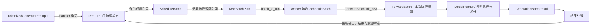
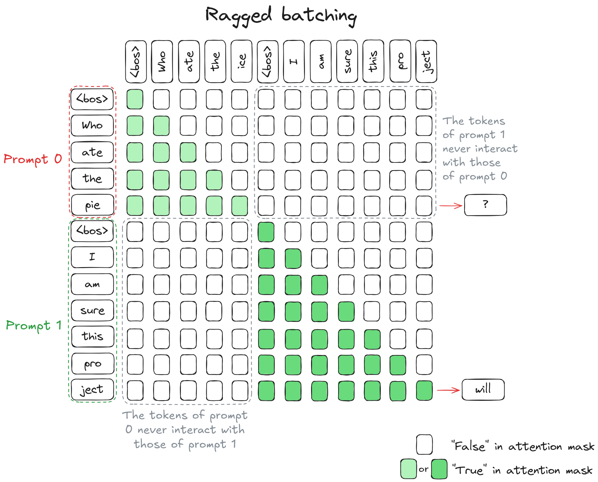

# Req 与多种 Batch 对象的分工

> **先建立架构心智模型：** [M03 · 请求对象与生命周期全景](<../architecture/03-请求对象与生命周期全景.md>)。先看职责、数据和生命周期，再回到本篇源码细节。

请求进入 Scheduler 后，同一个 R1 会同时出现在请求对象、调度 batch、一次 forward 的输入和结果处理记录里。这不是重复设计：这些对象回答的问题不同，更新的时间也不同。

本文属于**源码分析型学习资料**，是系列第 **02-03** 篇。先区分“请求走到哪里”“本轮准备算什么”“模型实际读取什么”“结果按哪一轮解释”，再用两个请求的字段账本把它们连接起来。

## 0. 阅读基线与范围

| 项目 | 内容 |
| --- | --- |
| 源码路径基准 | SGLang 仓库根目录 `.`；所有源码位置均为仓内相对路径 |
| 分支 | `codex/sglang-source-study-20260909`，基于官方 `main` |
| commit | `72d5c5bb73cadd7ffbf5114e5f81e29d36b6c61a` |
| 读取日期 | `2026-09-09` |
| 工作区状态 | 学习源码 worktree 干净；原源码工作区与 Wiki 既有内容保留 |
| 操作边界 | 静态阅读对象定义、计划返回、输入准备、Worker 转换、过滤/合并和结果快照；未运行 SGLang |
| 前置 | [API 到内部请求](01-API协议到内部请求对象.md)、[Tokenizer 与消息通路](02-Tokenizer与进程间消息通路.md) |
| 主线 | 普通文本、自回归生成、单实例、无投机/Beam/PD/PP；先按非 overlap 路径理解 |
| 扩展范围 | 为解释引用与快照，局部阅读 overlap 的隔离/保活机制；不据此证明并发安全或覆盖所有模式 |

本文的字段与分支为**源码事实**；R1/R2、图和数值表是**教学归纳**。没有真实张量输出、GPU 运行或性能测试。

## 1. 人话版：请求档案、工作集合、执行输入、结果记录

可以把 `Req` 理解为 R1 的长期档案：原始输入、已经生成的 token、缓存关系和结束原因都挂在这里。`ScheduleBatch` 是调度侧组织本轮工作需要的集合；`ForwardBatch` 是一次模型 forward 读取的输入视图。`NextBatchPlan` 则告诉调用者“这轮执行哪个集合，以及下轮继续保留哪个运行集合”。

“档案”“集合”“视图”是比喻，源码没有保证它们都互不共享内存。

| 对象 | 主要回答的问题 | 主要持有者/使用者 | 与相邻对象的边界 |
| --- | --- | --- | --- |
| `TokenizedGenerateReqInput` | 前端交来了什么输入？ | IPC 发送/接收端 | 是输入消息，不是后续请求状态全集 |
| `Req` | R1 已生成什么、缓存与结束状态如何？ | Scheduler 及其结果、缓存等协作组件 | 可跨多个 batch 和多轮计算持续存在 |
| `ReqKvInfo` | R1 登记了哪行、KV 长度与保护边界如何？ | `Req.kv`，由相关分配/缓存流程更新 | 保存资源账本，不保存所有 KV 张量本体 |
| `ScheduleBatch` | 这些请求怎样准备本轮输入和调度状态？ | Scheduler、输入准备与结果处理 | 包含 Req 引用、张量、元数据及引擎资源引用 |
| `NextBatchPlan` | 这轮返回哪个执行 batch，保留哪个 running batch？ | 调度选择函数返回给 event loop | 包装两个引用，不自动复制 batch |
| `ForwardBatch` | 这次 forward 使用什么输入、位置与配置？ | Worker、ModelRunner、模型/后端 | 大量字段借用引用，部分字段重新派生 |
| `GenerationBatchResult` | 本次执行/采样返回了什么？ | Worker 产生，Scheduler 收尾 | 不是请求的永久输出历史，也不等于 HTTP 响应 |

源码锚点：[Req 与 KV][S01]、[ScheduleBatch][S03]、[NextBatchPlan][S04]、[ForwardBatch][S08]、[执行结果][S12]。

## 2. 先修正旧版阅读地图

在这个固定版本中，普通 `TpModelWorker.forward_batch_generation` 接收 `ScheduleBatch`，直接调用 `ForwardBatch.init_new(batch, model_runner, ...)`。在本主线中没有必须经过的 `ModelWorkerBatch` 实例，也没有先调用 `ScheduleBatch.get_model_worker_batch` 的固定步骤。[S07]



**图意解读：** 方框是对象或函数职责，不是各自独立的进程。`NextBatchPlan` 位于调度调用的返回边界；它不需要作为消息发送给 Worker。图中的箭头有“构造”“借用引用”“调用”三种含义，不能统称为复制。

旧类名可能仍出现在注释或历史文档中。读者应以本 commit 的调用签名和实际调用点为准，而不是为了符合旧图添加不存在的中间层。[S07][S08]

## 3. Req：先读持久状态，再读本轮切片

### 3.1 R1 的 token 历史在哪里

普通请求的 `Req.__init__` 保存 `origin_input_ids`，创建空的 `output_ids` 和 `full_untruncated_fill_ids`。后续 `_refresh_fill_ids` 把完整输入视图与新增输出同步起来。[S01][S02]

| 字段 | 本篇的人话解释 | 更新/使用边界 |
| --- | --- | --- |
| `rid` | 关联这条请求的标识 | 从前端输入带入，连接日志与结果 |
| `origin_input_ids` | 原始提示的 token 序列 | 普通生成时不是每轮 Decode 都重写的数组 |
| `output_ids` | 已接受并加入请求历史的输出 token | 普通主线追加；特殊恢复/输入模式另有处理 |
| `full_untruncated_fill_ids` | 最近一次刷新后的完整 token 序列 | 由 `_refresh_fill_ids` 同步，不是永远自动跟随 output_ids 的动态视图 |
| `extend_range` | 本次 extend 选定的范围 | 准入/分块选择设置；没有设置就不能随意调用依赖它的切片逻辑 |
| `prefix_indices` | 本次可复用前缀对应的 KV 索引 | 来自缓存匹配等流程；不是原始 token ID |
| `finished_reason` | 请求已确认的结束原因 | `finished()` 判断它是否非 None |
| `to_finish` | 待在合适边界落实的结束意图 | 不应与已经设置的 finished_reason 混淆 |

`get_fill_ids` 返回完整数组到 `extend_range.end` 的切片，`prepare_for_extend` 再从中去掉 `len(prefix_indices)` 对应的前缀。因此“全部已知 token”“本轮覆盖到哪里”“本轮真正新增计算什么”是三份不同信息。[S02][S06]

源码对 `output_ids` 标注了追加契约：增量刷新通过长度判断新增输出。若在普通路径中原地改写既有输出、长度却不变，刷新逻辑不能仅凭长度发现这件事。它还专门处理完整数组与 origin 别名、长度不一致等需要重建的情况。不能把这一优化理解为任意修改都会自动同步。[S02]

### 3.2 ReqKvInfo 是资源账本，不是 KV 本体

| `Req.kv` 字段/属性 | 表达什么 | 不能直接推出什么 |
| --- | --- | --- |
| `req_pool_idx` | 请求在 ReqToTokenPool 中登记的行 | 不是某一个 token 的物理 KV 槽号 |
| `cache_protected_len` | 前缀缓存拥有/保护到的边界 | 不是整条请求已经生成多少输出 |
| `kv_allocated_len` | 已分配覆盖到的长度 | 分配完成不表示所有对应内容都已计算 |
| `kv_committed_len` | 实现中记录的已提交内容边界 | 单看字段值不能证明当前 GPU 操作已经完成同步 |
| `holds_kv` | 是否登记了请求行，即 req_pool_idx 非 None | 不等同于通过检查任意一段 GPU 内存推断出来的状态 |
| `is_kv_released` | 指定分配/窗口游标是否归零 | 与 holds_kv 检查不同；不能省略请求行和其他资源的清理 |

完整 `ReqKvInfo` 还包含 SWA、Mamba 和回撤备份状态；本篇只建立普通 KV 坐标。资源本体由 pool/allocator/cache 等组件持有，`Req` 记录它与资源之间的关系。谁能够访问张量，和谁决定保留、复用、淘汰，是两个问题。[S01]

## 4. ScheduleBatch：把请求组织成可准备的工作集合

`ScheduleBatch.init_new` 接收 `reqs`，汇总 logprob、grammar、hidden-state 等需求，并保存全局 pool、allocator、cache、模型配置引用。创建对象本身不等于已经完成 token 拼接、KV 分配或 forward。[S03]

| 字段组 | 代表字段 | 如何理解 |
| --- | --- | --- |
| 请求成员 | `reqs` | 一组 Req 引用；成员对象可以在别的集合或结果记录中继续被引用 |
| 引擎资源 | `req_to_token_pool`、allocator、`tree_cache` | 跨 batch 共享的引擎对象，不是每建一个 batch 就新建一个模型缓存 |
| 调度状态 | `batch_is_full`、chunked/mixed 相关字段 | 控制后续选择或过渡，不是全部都会进入 ForwardBatch |
| 请求行与长度 | `req_pool_indices`、`seq_lens`、CPU 镜像 | 将 batch 行映射回请求资源，并描述本轮长度 |
| 本轮 token 输入 | `input_ids`、`prefill_input_ids_cpu` | 可能先在 CPU 暂存，forward 入口再取得实际设备输入 |
| 新 KV 写入位置 | `out_cache_loc` | 本轮新增输入要写到哪里；不是完整历史 KV 内容 |
| Extend 元数据 | `prefix_lens`、`extend_lens`、`extend_num_tokens` | 区分已有前缀和新增工作量 |
| 采样集合信息 | `sampling_info` | 按当前成员组织采样/惩罚等状态，需要随成员变化同步调整 |

### 4.1 batch size 与输入 token 数不是一个数

选择一个普通 Dense、无 Beam/投机的教学例子：R1 提示长 6，复用前缀长 2；R2 提示长 3，复用前缀长 1。本轮两条都完成剩余 Prefill，无媒体展开、无分块。

| 对象/字段 | 教学值 | 维度解释 |
| --- | --- | --- |
| `reqs` | `[R1, R2]` | 2 个请求 |
| `prefix_lens` | `[2, 1]` | 每请求一个长度 |
| `extend_lens` | `[4, 2]` | 每请求本轮新增计算量 |
| `seq_lens` | `[6, 3]` | 各请求本轮覆盖到的序列长度 |
| `seq_lens_sum` | `9` | 两条序列长度之和，包含已复用前缀 |
| `extend_num_tokens` | `6` | 本轮实际拼接的新增 token 总数 |
| 已准备的扁平输入 | `[x2,x3,x4,x5,z1,z2]` | 6 个输入 token，不是形状为 2 的“每请求一个输入” |
| `req_pool_indices` | `[qR1,qR2]` | 两个请求行标识；符号不是实测索引 |
| `out_cache_loc` | 本轮 6 个对应写入位置 | 普通布局下与新增输入对齐；不包含历史前缀全部位置 |

以上数值从 `prepare_for_extend` 的切片、求和和长度构造推导；没有真实缓存命中实验。[S06]

因此不能把某个字段旁的简略 `[b]` 注释推广到所有模式。普通 Decode 常常每请求输入一个 token，而普通 Extend 是把多条请求的新增部分展平成 token 流；Beam、投机、多模态又会引入其他行与 token 关系。

### 4.2 input_ids=None 可能是合法暂存状态

本版本 `prepare_for_extend` 将扁平 token 暂存在 `prefill_input_ids_cpu`，同时把 `input_ids` 设为 None。`Scheduler.run_batch` 调用 `resolve_forward_inputs` 时才把它搬到设备，并消耗这份 staging。[S06][S09]

普通 Decode 的下一输入也可从 `FutureMap.output_tokens_buf` 按请求行取得。因此在调度准备阶段看到 `batch.input_ids is None`，不能立刻判定输入丢失。应检查当前阶段和输入来源，再到 forward 边界判断是否已正确还原。

`FutureMap` 的名字与文件位置包含 overlap 语境，但本版普通非 overlap 生成路径也使用下一 token 的 relay。不能简单地把整个机制排除在非 overlap 阅读之外。[S09][S10]

## 5. NextBatchPlan：为什么返回两个 batch 引用

普通 event loop 接收计划后，分别更新运行集合与本轮工作：[S05]

```python
self.running_batch = plan.running_batch
batch = plan.batch_to_run
```

`get_next_batch_to_run` 会处理上一轮 Prefill 到 Decode 集合的过渡，尝试新 Prefill，或更新已有 Decode 集合。它在过程中既可能修改现有 batch，也可能把局部 `running_batch` 重新绑定为另一个对象，因此调用者必须接收返回的运行集合引用。[S05]

| 名称 | 普通主线中的角色 | 误读后容易发生什么 |
| --- | --- | --- |
| `waiting_queue` | 等待后续准入的请求集合 | 把“收到请求”误认为“进入执行 batch” |
| `running_batch` | 继续维护的运行请求集合，普通路径主要承接 Decode | 只看本轮 batch，遗漏仍需保留的其他请求 |
| `batch_to_run` | 本轮真正交给 run_batch 的候选 | 以为它一定与 running_batch 相同 |
| `last_batch` | 上一轮选出的 batch 引用，用于下一轮过渡等工作 | 把它误认为一份完整不可变的历史记录 |

例如已有 R1 Decode 时，新 R2 被选中 Prefill，计划可以用 R2 的 batch 作为本轮工作，同时保留 R1 的 running batch。后续 R2 完成 Prefill，过滤掉已结束/不应合入的成员后，才可能与运行集合合并。混合模式另有路径，这里不作通用调度策略承诺。

`NextBatchPlan` 定义只有 `batch_to_run: Optional[ScheduleBatch]` 与 `running_batch: ScheduleBatch`。它不是隔离事务，不复制成员，也不保证两个字段指向不同对象。`batch_to_run=None` 表示该计划没有本轮执行 batch，不能仅凭它断言服务没有等待中的请求。[S04][S05]

## 6. ForwardBatch：执行视图如何建立，哪些仍然共享

### 6.1 Worker 接口接收的是什么

普通 Worker 取得 `ScheduleBatch` 后创建 `ForwardBatch`，再调用 ModelRunner。接口也支持调用者直接提供 ForwardBatch 的分支；不能把这个分支和普通入口混成两次固定转换。[S07]

`ForwardBatch.init_new` 从输入中借用 token、请求行、长度、写入位置等引用，并派生本次执行需要的内容：[S08]

| 内容 | 本版本处理 | 对引用与生命周期的含义 |
| --- | --- | --- |
| `input_ids`、`seq_lens`、`req_pool_indices` | 初始构造直接引用 batch 字段 | 创建新 Python 对象不等于复制张量存储 |
| `lora_ids`、`rids` | 从 reqs 构造列表 | 这些列表是当次整理的值，不代表所有 Req 被深拷贝 |
| Extend 长度与前缀 | 常规路径由 CPU 列表构造设备张量，并保留对应镜像 | 需要结合具体字段判断新建还是借用 |
| `positions`、`extend_start_loc` | 根据模式与长度计算，特殊模型/投机可以覆盖 | 不是所有模式都使用同一种位置公式 |
| `out_cache_loc` | 初始化后经 KV index translator 重新绑定模型/后端所需表示 | 不应无条件认为执行侧位置与调度侧位置逐值相同 |
| `sampling_info`、`spec_info` | 按当前路径取得对象引用 | 隔离策略还取决于调用它之前的处理 |

ForwardBatch 中保留“borrowed”注释，明确有些设备张量目前仍按引用别名传递。学习文档应记录实际实现，不能把未来想做的 clone/relay 工作描述成已经完成的机制。

### 6.2 init_new 是否纯粹只读 ScheduleBatch

函数开头的设计注释要求不修改输入 batch，但实际代码仍会在缺少 `seq_lens_sum` 时回填，并更新 `sampling_info.grammars`；一些可选观测分支也写相关状态。[S08]

所以本篇称它为“执行视图构造”，不称为“纯函数”或“完全不可变快照”。评估副作用要看代码中写了哪个对象、该对象是否共享，而不是只读函数开头的意图注释。

### 图解补充：拼在一个 batch 里，仍是两个请求



[查看原尺寸](../../../images/sglang-source-study/04-ragged-batch.png)。

**图意解读：** 沿横轴看拼接后的 token，沿纵轴看本轮 query。两个绿色三角块分别属于两个请求；块外空白说明不允许互读。批内共享一次执行，不等于共享上下文。

**对应本篇源码：** 回看 `ForwardBatch.init_new` 的长度、起点和请求行字段：它们让拼接 token 仍保留各自的执行范围；新对象也不代表复制了所有底层存储。 [源码：python/sglang/srt/model_executor/forward_batch_info.py][S08]

**来源与边界：** [Continuous batching from first principles](https://huggingface.co/blog/continuous_batching)，Rémi Ouazan Reboul、Arthur Zucker、Luc Georges / Hugging Face，2025-11-25。这是逻辑 Attention 掩码示意，不表示后端实际创建一张完整的大矩阵；请求隔离还要靠长度、起点和 KV 索引共同实现。 [来源档案 F04](../../../images/sglang-source-study/SOURCES.md#f04)。

## 7. 过滤、合并、copy：三个动作都不是资源释放的同义词

### 7.1 filter 与 merge 需要同时更新行对齐

`filter_batch` 选择未完成且未被排除的成员，并对请求行、长度、输入与 sampling info 等做对应筛选。`merge_batch` 合并两边的这些数据，还要求先合并惩罚器相关状态，再合并 reqs，因为前者会依赖合并前的成员信息。[S11]

只修改 `reqs` 而保留旧的张量行顺序，会让“第 i 行属于哪个请求”失去对应关系。这里的核心约束是**成员顺序和所有按成员排列的元数据保持一致**。

当 filter 得到空集合时，本版可以只把 `reqs` 置空并保留旧张量，调用者依赖 `is_empty()` 避免把这个对象继续用于 forward。不能从对象里还存在旧张量就直接判断它仍是一个有效可执行 batch。[S11]

`filter_batch` 自身也不等于回收全部 KV。完成结果、回撤和缓存释放有各自入口，后续 02-06 和缓存阶段会继续区分。普通成员过滤、请求结束、缓存可复用与资源退役要分别检查。

### 7.2 copy 主要为哪一份结果服务

overlap 循环会把 `(batch.copy(), batch_result)` 放入结果队列，稍后再按那次执行对应的 batch 信息解释结果。`ScheduleBatch.copy` 只保留结果处理需要的字段，并对 `reqs` 做列表浅复制：[S11][S13]

```text
原 batch.reqs         → 列表 A → R1、R2
copy 后 snapshot.reqs → 列表 B → 同一个 R1、同一个 R2
```

列表 A/B 不同，但成员仍是同一批 Req；多个 tensor 和元数据字段也继续共享引用。它不是能任意拿来再次执行的完整克隆，更不是把整台引擎的缓存复制了一份。

`GenerationBatchResult` 另保留采样 token、可能的 D2H 完成事件、延迟采样回调、输出长度快照等。解释某项结果时应把它与对应 batch 记录配对，不能拿已经过滤/合并后的当前集合按下标套回旧结果。[S12][S13]

### 7.3 overlap 的隔离与保活只说明哪些边界

`Scheduler._forward_isolation` 在适用路径中替换 sampling info，必要时保存并恢复 batch 字段；overlap 下还通过 `record_batch_in_overlap` 保留 batch 和字段引用，延长张量引用的存活期。[S14]

`SamplingBatchInfo.copy_for_forward` 先更新惩罚信息，再用 `dataclasses.replace(..., penalizer_orchestrator=None)` 产生前向使用的对象，不是逐项深拷贝所有底层 buffer。[S15]

这几项解决不同问题：字段恢复、避免重复累计、保留对象引用、流间等待各有代码。任何一项都不能单独证明所有跨流竞态已排除。本篇只记录这些机制存在及实际引用方式；完整 overlap 时序留到调度阶段。

## 8. R1/R2 对象账本与排障地图

| 时刻 | R1/Req | ScheduleBatch | ForwardBatch / 结果 |
| --- | --- | --- | --- |
| 刚到 Scheduler | 构造输入与空输出状态 | 未必已经有包含 R1 的可执行 batch | 无本轮执行视图 |
| 被选中 Prefill | 记录匹配前缀与 extend 范围 | 准备长度、请求行、写入位置与 CPU staging | 尚需 resolve 输入 |
| forward 入口 | 同一 Req 仍由调度/结果链路持有 | 输入 staging 已被消耗，设备输入就绪供后续使用 | 借用必要引用，派生位置/执行元数据 |
| 本轮产生结果 | 等待结果处理把接受 token 加入历史 | 可能要保存本轮结果对应的成员/元数据 | GenerationBatchResult 与本轮 batch 配对 |
| R2 加入或 R1 完成 | 各自状态独立推进 | filter/merge 同步维护行对齐 | 旧结果不能按新的成员顺序解释 |

| 症状/困惑 | 优先核对 | 避免的误判 |
| --- | --- | --- |
| 找不到 ModelWorkerBatch | 当前 commit 的 Worker 签名和调用点 | 不按旧图虚构中间对象 |
| 两个请求却有六个 input IDs | 当前模式、prefix/extend 长度、扁平 token 数 | 不把 request 维和 token 维混为一谈 |
| input_ids 暂时为 None | CPU staging、relay、resolve 所在边界 | 不把尚未 materialize 当成必然丢输入 |
| copied batch 的 Req 继续变化 | copy 是列表浅复制还是深复制 | 不假设结果记录冻结了全部请求状态 |
| 当前 batch 数量与上一轮结果不符 | 配对 batch 快照、filter/merge 的时机 | 不用新成员顺序套旧结果 |
| 过滤后仍看到缓存/张量 | 过滤、资源释放与引用存活分别追踪 | 不把从列表删除当成所有资源已经释放 |
| 新构造 ForwardBatch 后 batch 某值改变 | seq_lens_sum 回填、sampling_info 及可选观测写入 | 不用“init”函数名推断完全无副作用 |

## 9. 源码锚点与复读顺序

| 核对的问题 | SGLang 仓内路径与符号 | 固定源码 |
| --- | --- | --- |
| 请求与 KV 账本 | `python/sglang/srt/managers/schedule_batch.py::Req`；同文件 `ReqKvInfo` | [请求对象][S01] |
| 完整 token 序列与范围 | `python/sglang/srt/managers/schedule_batch.py::Req._refresh_fill_ids`；同类 `init_next_round_input`、`get_fill_ids` | [输入视图][S02] |
| 调度 batch 定义与初建 | `python/sglang/srt/managers/schedule_batch.py::ScheduleBatch.init_new` | [调度集合][S03] |
| 两个 batch 引用的返回类型 | `python/sglang/srt/managers/schedule_batch.py::NextBatchPlan` | [计划类型][S04] |
| 计划选择与 event loop 接收 | `python/sglang/srt/managers/scheduler.py::Scheduler.get_next_batch_to_run`；同类 `event_loop_normal` | [调度计划][S05] |
| Extend/Decode 输入准备 | `python/sglang/srt/managers/schedule_batch.py::ScheduleBatch.prepare_for_extend`；同类 `prepare_for_decode` | [输入准备][S06] |
| Worker 实际接收类型 | `python/sglang/srt/managers/tp_worker.py::TpModelWorker.forward_batch_generation` | [Worker][S07] |
| 执行视图构造与别名 | `python/sglang/srt/model_executor/forward_batch_info.py::ForwardBatch.init_new` | [ForwardBatch][S08] |
| forward 前输入物化 | `python/sglang/srt/managers/overlap_utils.py::resolve_forward_inputs` | [输入还原][S09] |
| 执行入口及 relay | `python/sglang/srt/managers/scheduler.py::Scheduler.run_batch`；同类 `_relay_forward_payload` | [执行交接][S10] |
| filter、merge 与浅 copy | `python/sglang/srt/managers/schedule_batch.py::ScheduleBatch.filter_batch`；同类 `merge_batch`、`copy` | [成员与快照][S11] |
| 执行返回值 | `python/sglang/srt/managers/utils.py::GenerationBatchResult` | [结果对象][S12] |
| overlap 结果配对 | `python/sglang/srt/managers/scheduler.py::Scheduler.event_loop_overlap` | [结果队列][S13] |
| 字段隔离与引用保活 | `python/sglang/srt/managers/scheduler.py::Scheduler._forward_isolation`；同类 `record_batch_in_overlap` | [隔离边界][S14] |
| sampling info 的前向副本 | `python/sglang/srt/sampling/sampling_batch_info.py::SamplingBatchInfo.copy_for_forward` | [采样副本][S15] |

## 10. 自测与验收

1. **为什么 NextBatchPlan 要同时返回 batch_to_run 和 running_batch？** 本轮执行集合与需要保留的运行集合可能不同，而且选择函数可能重新绑定后者。
2. **R1 长 6、前缀 2，R2 长 3、前缀 1，本轮完整 Prefill 输入多少 token？** 6；请求数是 2，序列长度和是 9，三者不同。
3. **新建 ForwardBatch 会复制全部输入 tensor 吗？** 不会，多个字段借用引用，另有派生字段；要逐项核对具体实现。
4. **ScheduleBatch.copy 后能任意改原 R1 而不影响快照中的 R1 吗？** 不能。成员 Req 仍共享，copy 主要保存结果解释所需的集合与字段。
5. **filter_batch 删除 R1 是否证明 KV 已全部释放？** 不能。成员过滤、缓存处理、请求行释放与其他资源退役是不同动作。
6. **full_untruncated_fill_ids 是否永远即时等于 origin 加 output？** 它在刷新边界同步；不能把已保存数组当作自动计算属性。

读完后，应能为任意字段标明“请求级、集合级、执行级或结果级”，再指出它是值、新对象还是共享引用。本文完成静态符号、路径、导航与引用检查；教学账本未通过运行模型生成，Mermaid 未做渲染验证。

下一篇是[02-04《一次 Prefill 到多轮 Decode》](04-一次Prefill到多轮Decode.md)，用 R1 按轮次追踪 token、长度、KV 写入与结果推进。返回[系列目录](../README.md)。

[S01]: https://github.com/sgl-project/sglang/blob/72d5c5bb73cadd7ffbf5114e5f81e29d36b6c61a/python/sglang/srt/managers/schedule_batch.py#L870
[S02]: https://github.com/sgl-project/sglang/blob/72d5c5bb73cadd7ffbf5114e5f81e29d36b6c61a/python/sglang/srt/managers/schedule_batch.py#L1420
[S03]: https://github.com/sgl-project/sglang/blob/72d5c5bb73cadd7ffbf5114e5f81e29d36b6c61a/python/sglang/srt/managers/schedule_batch.py#L2187
[S04]: https://github.com/sgl-project/sglang/blob/72d5c5bb73cadd7ffbf5114e5f81e29d36b6c61a/python/sglang/srt/managers/schedule_batch.py#L3725
[S05]: https://github.com/sgl-project/sglang/blob/72d5c5bb73cadd7ffbf5114e5f81e29d36b6c61a/python/sglang/srt/managers/scheduler.py#L3499
[S06]: https://github.com/sgl-project/sglang/blob/72d5c5bb73cadd7ffbf5114e5f81e29d36b6c61a/python/sglang/srt/managers/schedule_batch.py#L2561
[S07]: https://github.com/sgl-project/sglang/blob/72d5c5bb73cadd7ffbf5114e5f81e29d36b6c61a/python/sglang/srt/managers/tp_worker.py#L593
[S08]: https://github.com/sgl-project/sglang/blob/72d5c5bb73cadd7ffbf5114e5f81e29d36b6c61a/python/sglang/srt/model_executor/forward_batch_info.py#L752
[S09]: https://github.com/sgl-project/sglang/blob/72d5c5bb73cadd7ffbf5114e5f81e29d36b6c61a/python/sglang/srt/managers/overlap_utils.py#L87
[S10]: https://github.com/sgl-project/sglang/blob/72d5c5bb73cadd7ffbf5114e5f81e29d36b6c61a/python/sglang/srt/managers/scheduler.py#L4199
[S11]: https://github.com/sgl-project/sglang/blob/72d5c5bb73cadd7ffbf5114e5f81e29d36b6c61a/python/sglang/srt/managers/schedule_batch.py#L3439
[S12]: https://github.com/sgl-project/sglang/blob/72d5c5bb73cadd7ffbf5114e5f81e29d36b6c61a/python/sglang/srt/managers/utils.py#L45
[S13]: https://github.com/sgl-project/sglang/blob/72d5c5bb73cadd7ffbf5114e5f81e29d36b6c61a/python/sglang/srt/managers/scheduler.py#L1928
[S14]: https://github.com/sgl-project/sglang/blob/72d5c5bb73cadd7ffbf5114e5f81e29d36b6c61a/python/sglang/srt/managers/scheduler.py#L4155
[S15]: https://github.com/sgl-project/sglang/blob/72d5c5bb73cadd7ffbf5114e5f81e29d36b6c61a/python/sglang/srt/sampling/sampling_batch_info.py#L466
