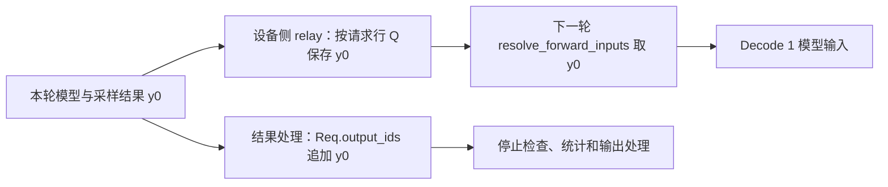
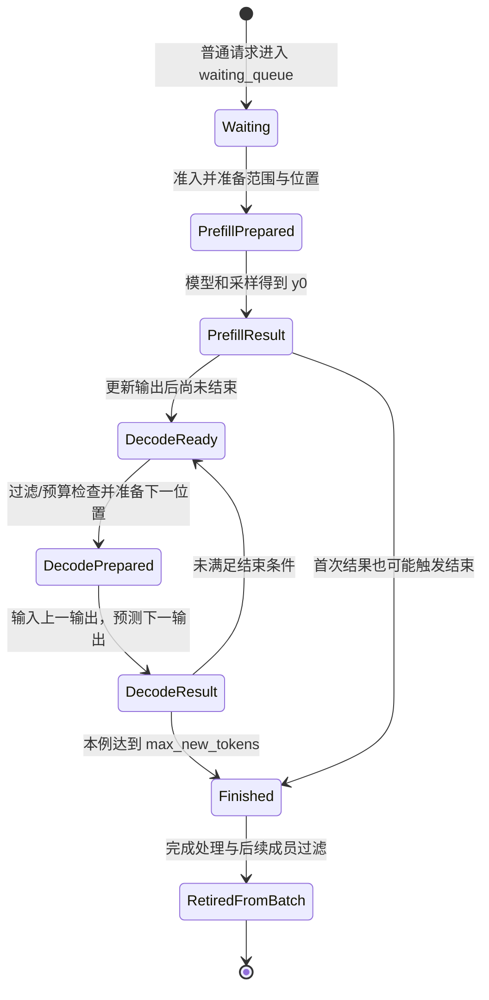

# 一次 Prefill 到多轮 Decode

> **先建立架构心智模型：** [M03 · 请求对象与生命周期全景](<../architecture/03-请求对象与生命周期全景.md>)。先看职责、数据和生命周期，再回到本篇源码细节。

R1 的提示有 8 个 token，最终生成 3 个 token。在普通自回归路径中，首个输出来自 Prefill 的结果，后两个输出各需要一轮 Decode。每轮要分清：本轮输入哪个 token、为谁写 KV、采样出了谁、哪些请求字段已经更新。

本文属于**源码分析型学习资料**，是系列第 **02-04** 篇。沿当前源码把 R1 从等候、准入、输入准备、模型调用走到结果推进与长度结束，建立一份能对应函数调用的逐轮账本。

## 0. 阅读基线与教学条件

| 项目 | 内容 |
| --- | --- |
| 源码路径基准 | SGLang 仓库根目录 `.`；下文源码路径均相对此目录 |
| 分支 | `codex/sglang-source-study-20260909`，基于官方 `main` |
| commit | `72d5c5bb73cadd7ffbf5114e5f81e29d36b6c61a` |
| 读取日期 | `2026-09-09` |
| 工作区状态 | 学习源码 worktree 干净；原源码工作区与 Wiki 既有内容保留 |
| 操作边界 | 静态追踪准入、分配、forward/relay、Prefill/Decode 结果与结束入口；没有运行模型或请求 |
| 前置 | [Prefill、Decode 与 KV 入门](../00-foundations/04-Prefill与Decode及KVCache入门.md)、[Req 与 Batch 对象](03-Req与多种Batch对象的分工.md) |
| 普通主线 | 单实例、普通文本自回归、TP/PP/DP 均为 1、关闭 overlap、无投机/Beam/grammar/LoRA/PD/HiSparse |
| R1 条件 | 输入 `x0…x7`；`max_new_tokens=3`；没有初始缓存命中，预算足够，一次完整 Prefill；三个教学输出均未匹配提前停止条件 |
| KV 账本例子 | 选择普通 `RadixCache`、page_size=1、插入开启、无其他并发请求/淘汰，便于说明请求结束与缓存保留；不声称这是所有模型的默认配置 |

`x0…x7`、`y0…y2` 都是 token 的**教学符号**，不是实际词表 ID。下文“输出数”首先指 `Req.output_ids` 的长度，不代表客户端已经收到这么多 token。没有实际 tokenizer、HTTP 响应、GPU trace 或性能观察。

**缓存实现选择：** 本篇用传统 `RadixCache` 讲解基本机制。固定基线的[默认缓存工厂](https://github.com/sgl-project/sglang/blob/72d5c5bb73cadd7ffbf5114e5f81e29d36b6c61a/python/sglang/srt/mem_cache/registry.py#L80)在未命中特殊分支时创建 `UnifiedRadixCache`；实际组件与生命周期见 [04-04](../04-kv-cache/04-UnifiedRadix与混合状态组件.md)和 [04-07](../04-kv-cache/07-KV缓存全生命周期与排障.md)。阅读本篇账本时保留上表的实现条件。

## 1. 先看这一条请求的计算主线

| 阶段 | 模型本轮接收 | 本轮应形成的新增 KV | 本轮预测输出 |
| --- | --- | --- | --- |
| Prefill | `x0…x7` | 输入 8 个位置的 K/V | `y0` |
| Decode 1 | `y0` | `y0` 对应位置的 K/V | `y1` |
| Decode 2 | `y1` | `y1` 对应位置的 K/V | `y2` |

**人话版：** 模型必须先“读过”一个 token，才能产生这个 token 在各层的 K/V。采样刚选出的下一个 token，只是新得到的 ID；通常还要等下一次把它作为输入，才有它自己的 KV。

因此本例最后有 11 个已知 token，但只为前 10 个位置做过对应模型计算。达到长度上限后，不会为了补齐 `y2` 的 KV 而再运行一轮普通 Decode。

这份表描述理想普通路径中相应计算完成后的逻辑关系，不描述异步提交中的瞬时状态。源码中用于管理内存的计数器，更新时机并不都等于 GPU 完成时机，后面会专门拆开。[S05][S06][S08][S10]

## 2. 从等候到本轮执行计划

### 2.1 R1 先成为等候请求

`Scheduler.handle_generate_request` 在普通路径构造 `Req`，带入输入、采样配置、身份与输出选项。请求经过相关验证后，如果没有进入 grammar 等特殊等待路径，会调用 `_add_request_to_queue`。[S01]

在 `DisaggregationMode.NULL` 分支，优先级/队列上限检查通过后，R1 加入 `waiting_queue`，记录入队时间。此时它是已登记的调度请求，但没有因此直接取得执行机会。

普通 event loop 先 `ingest_requests`，再 `get_next_batch_to_run`，分别取得 `running_batch` 和 `batch_to_run`，之后才运行本轮 batch。[S02]

### 2.2 准入如何给 R1 选定本轮范围

`_get_new_batch_prefill_raw` 检查等候/运行状态与请求槽位，计算优先级，建立 `PrefillAdder`。对候选请求调用 `init_next_round_input` 刷新完整输入并匹配前缀，再用 `adder.add_one_req` 检查相应预算和条件。[S03][S04]

在本例无命中、预算足够、无需分块的分支：

```text
origin_input_ids         = [x0,…,x7]
output_ids               = []
full_untruncated_fill_ids= [x0,…,x7]
prefix_indices           = []
extend_range             = [0,8)
```

`[0,8)` 是位置区间，包含 0 到 7，不包含 8。`PrefillAdder` 把 R1 加入 `can_run_list`；Scheduler 从等待队列移除已选中的成员，建立 `ScheduleBatch` 并 `prepare_for_extend`。[S03][S04]

完整预算还包含未来输出预留、页开销及特定缓存/平台条件。本篇只固定“该候选被接纳”的条件，不用这个例子给所有请求推导通用容量公式；排序与预算留到阶段 03。

## 3. Prefill：先准备位置，再计算内容

### 3.1 Scheduler 准备的字段

`prepare_for_extend` 根据 Req 的范围与前缀构造本轮输入、长度和新增工作量，调用 `alloc_for_extend` 分配请求行及 KV 位置、写入请求到槽位的映射。[S05][S06]

本例准备完成后可用下面这份符号账本表示：

| 字段 | R1 教学值 | 含义 |
| --- | --- | --- |
| `req_pool_indices` | `[Q]` | R1 登记的请求行；Q 是符号，不是实测编号 |
| `seq_lens` / CPU 镜像 | `[8]` | 本轮覆盖到长度 8 |
| `prefix_lens` | `[0]` | 本轮没有可复用前缀 |
| `extend_lens` | `[8]` | 本轮补算 8 个位置 |
| `extend_num_tokens` | `8` | 扁平输入 token 数 |
| `prefill_input_ids_cpu` | `[x0,…,x7]` | 先放在 CPU staging，forward 入口再搬入设备 |
| `input_ids` | 此时可以是 None | 不表示输入丢失，而是尚未在对应边界物化 |
| 请求行映射 | `Q[0:8] → s0…s7` | 各逻辑位置对应 KV 槽；s0…s7 不要求物理连续 |
| `out_cache_loc` | `[s0,…,s7]` | 本轮 K/V 写入目标 |

### 3.2 committed 计数不是 GPU 完成信号

本版 `alloc_for_extend` 在分配与映射后就设置：

```python
req.kv.kv_allocated_len = seq_len
req.kv.kv_committed_len = seq_len
```

这个调用发生在 `prepare_for_extend`，早于后续模型 forward。普通 `alloc_for_decode` 也在准备阶段同时推进这两个长度。[S06]

所以这里必须区分三件事：

- **字段账面值**：调度/分配代码已把本轮覆盖边界记为 8。
- **位置映射**：请求行已经指向供本轮使用的槽位。
- **实际 K/V 内容**：还需要模型各层执行相应写入，并满足读取端所需的流/同步条件。

不能只看到 `kv_committed_len=8`，就断言在任意观察时刻 GPU 已经完成 8 个位置的计算。这个字段要结合所处调用阶段解释；它不是独立的硬件完成事件。

### 3.3 模型如何使用这些输入

`run_batch` 调用 `resolve_forward_inputs`，把 Prefill staging 搬到设备并清掉暂存字段。普通 Worker 从 ScheduleBatch 构造 ForwardBatch，再执行 ModelRunner 和采样，返回 `GenerationBatchResult`。[S07][S08]

对于普通 self-attention 的可读代表实现，`TorchNativeAttnBackend.forward_extend` 用 `out_cache_loc` 写入当前层的 K/V，再结合请求行映射、序列长度、prefix/extend 长度读取相应上下文。这里用它解释读写坐标，**没有声称本例实际运行过该后端，或所有设备默认选择它**。[S09]

Prefill 的结果可以包含下一 token 的 logits；普通生成路径采样得到 `y0`。不需要先独立运行一次普通 Decode，才能产生首 token。[S08]

## 4. Prefill 结果：让 R1 进入“已知 y0”的状态

Scheduler 根据 batch 的 `forward_mode` 把结果交给 `process_batch_result_prefill`。处理器在存在相应 copy event 时先等待，再取得 CPU 可用的 token 值，按 batch 成员逐条处理。[S10]

R1 不属于中间 chunk，也没有结束/回撤时，普通分支依次：

1. 记录 Prefill 结束时间。
2. 把 `y0` 追加到 `req.output_ids`。
3. 更新推理计数等适用状态，并调用 `req.update_finish_state`。
4. 若尚未结束，普通 Prefill 请求进入 `maybe_cache_unfinished_req`；若已结束则走释放入口。
5. 处理输出附加信息，并进入相应输出处理路径。

本例长度上限为 3，`y0` 没有触发其他停止条件，所以结果是 `output_ids=[y0]`、`finished_reason=None`。[S10][S13]

### 4.1 未结束时缓存的是什么

在本页指定的普通 RadixCache 分支，`cache_unfinished_req` 使用 `req.get_fill_ids()` 取得已完成这次 Prefill 的输入范围，建立缓存索引并更新前缀保护关系。本次缓存对应 `x0…x7`，不包含刚预测但尚未作为模型输入的 `y0`。[S11]

page_size=1、无其他并发的教学条件下，R1 的缓存保护边界可推进到 8。请求继续生成时，后续新增位置与缓存已保护前缀仍需分开记账。

`full_untruncated_fill_ids` 在当前普通 Decode 主线中不会因 `output_ids.append` 自动刷新成 9、10、11 个 token。下一轮 Decode 使用的是 relay 中的最新 token；下次重新进行 Prefill/回撤重建时，才需要相应刷新。这不是丢失输出，而是不同字段在不同路径被消费。[S04][S07]

## 5. 从 y0 到下一轮模型输入：relay 与 CPU 输出历史分开

普通非 overlap 的 `run_batch` 在取得真实 sampled token tensor 后，会调用 `_relay_forward_payload`，把 token 保存到 `FutureMap` 中对应请求行，然后把 `batch.input_ids` 设为 None，供下一轮重新取得。[S07]



**图意解读：** 两条分支来自同一次生成结果，服务于不同消费者。下一轮设备输入经 relay 取得；前端结果与停止条件依赖 Req 的输出历史。图没有承诺二者在任意时刻同步可见，也没有把它们画成同一份 Python 列表。

这条 relay 在当前普通非 overlap 路径也存在，因此不能按 `overlap_utils.py` 的文件名推断“关闭 overlap 就不用它”。

## 6. Decode 1：输入 y0，产生 y1

### 6.1 Prefill batch 怎样进入运行集合

下一轮 `get_next_batch_to_run` 处理上轮 Extend batch：排除尚未完成的 chunk 等不应合入项、过滤已结束请求，把仍需生成的成员并入 running batch。本例没有其他请求，也没有新 Prefill，因此转入 `update_running_batch`。[S02][S12]

`update_running_batch` 先过滤，再检查 Decode 资源；预算足够时调用 `prepare_for_decode`。本例不触发回撤。

### 6.2 为什么分配写在旧长度位置

准备 Decode 1 时，batch 的旧 `seq_lens=[8]`。`alloc_for_decode(token_per_req=1)` 分配一个位置，写入请求行的逻辑位置 8；随后 `prepare_for_decode` 把序列长度更新为 9。[S05][S06]

```text
执行前已有计算：x0…x7
本轮新增输入：  y0
本轮写入位置：  Q[8] → s8
本轮序列长度：  9
```

下标从 0 开始，所以“第 9 个 token”对应位置 8。新增 KV 槽数为 1，不表示 Attention 只读 1 个历史位置。

`resolve_forward_inputs` 按 Q 从 relay 取回 `y0`。Worker/ForwardBatch 建立本次 Decode 视图；普通位置推导对应最后一个已纳入输入的位置。模型对 `y0` 计算 K/V，并读取允许的历史上下文，然后预测 `y1`。[S07][S08][S09]

### 6.3 Decode 结果怎样推进

普通结果归一化把每请求的输出整理成单元素列表。`process_batch_result_decode` 将 `[y1]` 加入 R1 的输出，调用 `update_finish_state(1)`，再进入后续完成状态处理与输出流程。[S10]

于是 `output_ids=[y0,y1]`，尚未达到上限。R1 本轮已经为 `y0` 形成 KV，而不是为刚选出的 `y1` 形成 KV。

### 图解补充：当前 token 写 KV，再预测下一个 token


[查看原尺寸](../../../images/sglang-source-study/03-kv-growth.png)（手机查看宽图时可横屏或放大）。

**图意解读：** 蓝色列表示历史 K/V，白色 will 列是本轮新增输入；当前 Q 读取这两部分后，箭头才指向预测结果 be。右端的 be 此时还没有经过下一次 forward。

**对应本篇源码：** 把新增白色列对应到本节的 Q[8] → s8；地址分配、KV 计算和得到 y1 是三个不同事件。 [源码：python/sglang/srt/layers/attention/torch_native_backend.py][S09]

**来源与边界：** [Continuous batching from first principles](https://huggingface.co/blog/continuous_batching)，Rémi Ouazan Reboul、Arthur Zucker、Luc Georges / Hugging Face，2025-11-25。这是单请求、单步的逻辑注意力图；横向排列不代表 SGLang 物理 KV 连续存储，也不展示预分配、页表或异步完成事件。 [来源档案 F03](../../../images/sglang-source-study/SOURCES.md#f03)。

## 7. Decode 2 与长度结束

下一轮重复普通 Decode：旧序列长度为 9，在逻辑位置 9 分配本轮写入位置，长度推进到 10；从 relay 读取 `y1`，模型生成 `y2`。[S05][S06][S07]

结果处理把 `y2` 加入历史后，`len(output_ids)=3`。在本例没有更早停止条件的前提下，`update_finish_state` 设置 `FINISH_LENGTH(length=3)` 和 `finished_len=3`。[S13]

### 7.1 停止条件有顺序

当前 `update_finish_state` 的主要顺序为：已经结束则返回；处理 `to_finish`；检查输出词表边界；检查 stop string/regex；检查 stop token/EOS；检查输出长度；最后检查相应 grammar 结束。[S13]

因此如果第三个 token 同时就是 EOS，结束原因未必记为 length。本文得到长度结束，是因为明确假设 `y0…y2` 均未命中其他提前停止条件；不能把这个教学结果变成所有请求的预期响应。

### 7.2 请求结束后为何还可能保留 KV

在本例无特殊 offload 的完成路径，结果处理调用 `release_kv_cache`。该函数先把应处理的已提交边界交给 cache 的 `cache_finished_req`，随后处理超额部分、释放请求行并标记请求 KV 分配已释放。[S14]

本页选择的 RadixCache 分支会以 `kv_len_to_handle` 截取 `origin_input_ids + output_ids`。此时边界为 10，所以可处理的内容是 `x0…x7,y0,y1`；不会把未计算 KV 的 `y2` 当成已有缓存内容。[S11]

在允许插入且没有其他干扰的教学条件下，这些 KV 可以转为可复用的缓存内容，而 R1 的请求行被释放。**请求不再持有资源关系，与 allocator 中全部物理内容立即消失，是两件事。** 缓存淘汰、页对齐、重复前缀处理与完整退役在后续章节展开。

## 8. R1 的逐轮字段与数据账本

### 8.1 准备与计算分开记

下表中的“已计算 KV”是本例相应计算完成后的逻辑描述；“准备完成”行明确不把新字段值当作实际计算完成。

| 观察边界 | Req 输出数 | batch seq_len | allocated / committed 账面值 | 本轮新增位置与实际计算边界 |
| --- | ---: | ---: | --- | --- |
| 等待准入 | 0 | 尚无本轮值 | 0 / 0 | 没有 R1 的模型计算 |
| Prefill 准备完成、forward 前 | 0 | 8 | 8 / 8 | 已有 8 个目标映射；不能据此声称 K/V 已写完 |
| Prefill 计算与结果处理后 | 1 | 8 | 8 / 8 | 已计算输入 x0…x7 的 KV；y0 已知，未计算其 KV |
| Decode 1 准备完成、forward 前 | 1 | 9 | 9 / 9 | 新增 Q[8] 映射；这次 y0 的模型计算还待完成 |
| Decode 1 计算与结果处理后 | 2 | 9 | 9 / 9 | 已计算到 y0；y1 仅为新输出 |
| Decode 2 准备完成、forward 前 | 2 | 10 | 10 / 10 | 新增 Q[9] 映射；本轮输入为 y1 |
| Decode 2 停止判定后、释放调用前 | 3 | 10 | 10 / 10 | 已计算到 y1；y2 已知，length=3 |
| 本例普通释放返回后 | 3 | 旧 batch 值不再证明可执行 | allocated=0；committed 可保留旧账面值 | 请求行已撤销；不能凭旧 committed 值判断仍持有 KV |

最后一行对应 `ReqToTokenPool.free` 将 `req_pool_idx=None`，`ReqKvInfo.mark_kv_released` 清零分配与相关窗口游标；这两个动作本身不把 `kv_committed_len` 归零。应看 `holds_kv` 与相应释放约束，不以某一个残留长度字段猜测是否泄漏。[S14][S15]

### 8.2 请求状态图是教学抽象



**图意解读：** 这些英文状态是本篇教学阶段名，不是源码中一套同名 enum。图刻意没有把 Finished 画成“所有缓存字节归零”；异常、回撤、中间 chunk 和 PD 路径也不能硬塞进这条理想主线。客户端流何时结束、前端 ReqState 何时移除，还要继续读 02-05、02-06。

## 9. 改一个条件，哪些结论需要重算

| 条件变化 | 仍可保留的理解 | 必须重新核对的内容 |
| --- | --- | --- |
| 命中 6 个输入前缀 | 总输入仍长 8，补算尾部后预测首 token | prefix/extend 长度、真实缓存就绪与保护关系；不能机械分配 8 个新槽 |
| 输入被分块 | 输入与输出、账面与实际 KV 仍要分开 | 中间 chunk 的 inflight 计数、缓存暂存与首个有效输出时机 |
| max_new_tokens=1 | Prefill 可直接产生唯一输出 | 不再进入普通 Decode 运行集合 |
| max_new_tokens=0 | 仍可能需要 Prefill/打分等工作 | prefill-only 与占位 token 路径，不能使用本文“三轮生成”表 |
| 提前 EOS/stop | 仍需更新结束原因与资源关系 | 实际输出长度与结束原因，可能少于请求上限 |
| Decode 预算不足 | 等待、输入准备、执行仍是不同阶段 | `retract_decode` 与重新入队/恢复流程 |
| overlap 或投机开启 | 结果要与正确 batch 配对 | 超前步骤、接受数量、长度/位置与跨流同步，不能逐字段套本表 |
| page_size>1 或混合状态模型 | 逻辑位置与物理资源仍不同 | 页尾、SWA/Mamba、allocator 的真实占用及释放规则 |

中间 chunk 的结果处理分支会减少 `inflight_middle_chunks` 并跳过该请求的相应流式输出，不像最终输入分支那样直接把本轮伪 next token 加入普通输出历史。这是长输入多次 forward 不等于已经生成多次首 token 的原因之一。[S10]

## 10. 小白排障地图

| 现象 | 先回查的对象/字段 | 关键源码边界 |
| --- | --- | --- |
| 请求已收到但还没 Prefill | waiting_queue、can_run_list、预算/grammar | `_get_new_batch_prefill_raw`、`PrefillAdder.add_one_req` |
| committed 已增加但没有结果 | 当前处于准备、forward 还是结果处理 | allocation 的计数写入与真实执行分别检查 |
| 首 token 为何不是 Decode 统计 | 当前 forward_mode、Prefill 结果 append | `process_batch_result_prefill` |
| Decode 输入像是上一 token | relay 中的 token 与 output_ids 历史 | `_relay_forward_payload`、`resolve_forward_inputs` |
| 已生成 token 数比 KV 位置多 1 | 是否普通单 token 生成且在每轮完成边界观察 | 本轮输入与本轮预测输出不同 |
| 结束后显存没全部下降 | 请求行是否撤销、缓存是否保留、allocator 与 pool 指标 | `release_kv_cache`、具体 cache 策略 |
| full_untruncated_fill_ids 没随 Decode 长大 | 是否重新进入需要刷新完整输入的路径 | `_refresh_fill_ids` 与 Decode relay 的职责差异 |

仅凭一张字段截图或一条日志，不能跳过阶段条件来判断模型卡住、泄漏或完成。未做运行复现时，以上都只是排查入口。

## 11. 源码锚点与最短复读路线

| 行为 | SGLang 仓内路径与符号 | 固定源码 |
| --- | --- | --- |
| 构造请求并入队 | `python/sglang/srt/managers/scheduler.py::Scheduler.handle_generate_request`；同类 `_add_request_to_queue` | [入队][S01] |
| 每轮入口与 Prefill 转 Decode | `python/sglang/srt/managers/scheduler.py::Scheduler.event_loop_normal`；同类 `get_next_batch_to_run` | [普通循环][S02] |
| 新 Prefill 候选与 batch | `python/sglang/srt/managers/scheduler.py::Scheduler._get_new_batch_prefill_raw` | [Prefill 选择][S03] |
| 刷新输入与选择范围 | `python/sglang/srt/managers/schedule_batch.py::Req.init_next_round_input`；`python/sglang/srt/managers/schedule_policy.py::PrefillAdder.add_one_req` | [输入刷新][S04]、[准入范围][S16] |
| Extend / Decode 字段准备 | `python/sglang/srt/managers/schedule_batch.py::ScheduleBatch.prepare_for_extend`；同类 `prepare_for_decode` | [准备][S05] |
| 请求行映射与计数 | `python/sglang/srt/mem_cache/allocation.py::alloc_for_extend`；同文件 `alloc_for_decode` | [分配][S06] |
| 输入物化与下一 token relay | `python/sglang/srt/managers/overlap_utils.py::resolve_forward_inputs`；同文件 `FutureMap.stash`；`python/sglang/srt/managers/scheduler.py::Scheduler._relay_forward_payload` | [输入物化][S07]、[relay][S17] |
| Worker forward 与采样 | `python/sglang/srt/managers/tp_worker.py::TpModelWorker.forward_batch_generation` | [模型交接][S08] |
| KV 读写代表实现 | `python/sglang/srt/layers/attention/torch_native_backend.py::TorchNativeAttnBackend.forward_extend`；同类 `forward_decode` | [代表后端][S09] |
| Prefill / Decode 结果推进 | `python/sglang/srt/managers/scheduler_components/batch_result_processor.py::SchedulerBatchResultProcessor.process_batch_result_prefill`；同类 `process_batch_result_decode` | [结果处理][S10] |
| 未结束/已结束的普通前缀缓存 | `python/sglang/srt/mem_cache/radix_cache.py::RadixCache.cache_unfinished_req`；同类 `cache_finished_req` | [缓存交接][S11] |
| Decode 集合更新 | `python/sglang/srt/managers/scheduler.py::Scheduler.update_running_batch` | [准备下一轮][S12] |
| 停止条件的顺序 | `python/sglang/srt/managers/schedule_batch.py::Req.update_finish_state` | [结束判定][S13] |
| KV 与请求行释放入口 | `python/sglang/srt/mem_cache/common.py::release_kv_cache`；`python/sglang/srt/mem_cache/memory_pool.py::ReqToTokenPool.free` | [释放入口][S14]、[请求行释放][S18] |
| 释放后的账本标志 | `python/sglang/srt/managers/schedule_batch.py::ReqKvInfo.mark_kv_released` | [KV 账本][S15] |

## 12. 自测与验收

1. **8 个输入、3 个输出，为什么只有 2 轮普通 Decode？** Prefill 结果已经产生 y0，Decode 1/2 分别产生 y1/y2；该结论受本文无分块/投机等条件限制。
2. **Decode 1 为哪个 token 计算 KV？** 为输入 y0；采样出的 y1 通常在下一轮才作为模型输入。
3. **准备阶段 committed=9，是否证明 y0 的 GPU 计算已完成？** 不证明。本版普通 allocation 在 forward 前推进该字段，需要结合执行/同步阶段判断。
4. **最后 y2 是否会被当作已有 KV 插入本文的完成缓存？** 不会。完成处理按已提交边界 10 截取 token 序列，覆盖到 y1。
5. **请求行已释放，但 committed 仍是旧值，是否必然泄漏？** 不是。需要看 holds_kv、分配标志与 cache/allocator；释放函数并不要求所有历史计数一起归零。
6. **Req.output_ids 已有三个 token，客户端是否必然已收到三个？** 不一定。输出间隔、流式/非流式包装、回程消息与前端等待是后续独立链路。

验收时应能从空表写出 R1 的输入、输出、位置、长度和结束原因，再逐行找到写入它们的源码。本文已做静态符号、路径、链接和教学算术检查；未运行 SGLang、GPU 或取消测试，Mermaid 未做渲染验证。

下一篇是[Detokenizer 与流式输出](05-Detokenizer与流式输出.md)，继续把内部 token 变成客户端能读取的响应。返回[系列目录](../README.md)。

[S01]: https://github.com/sgl-project/sglang/blob/72d5c5bb73cadd7ffbf5114e5f81e29d36b6c61a/python/sglang/srt/managers/scheduler.py#L2710
[S02]: https://github.com/sgl-project/sglang/blob/72d5c5bb73cadd7ffbf5114e5f81e29d36b6c61a/python/sglang/srt/managers/scheduler.py#L1893
[S03]: https://github.com/sgl-project/sglang/blob/72d5c5bb73cadd7ffbf5114e5f81e29d36b6c61a/python/sglang/srt/managers/scheduler.py#L3693
[S04]: https://github.com/sgl-project/sglang/blob/72d5c5bb73cadd7ffbf5114e5f81e29d36b6c61a/python/sglang/srt/managers/schedule_batch.py#L1440
[S05]: https://github.com/sgl-project/sglang/blob/72d5c5bb73cadd7ffbf5114e5f81e29d36b6c61a/python/sglang/srt/managers/schedule_batch.py#L2561
[S06]: https://github.com/sgl-project/sglang/blob/72d5c5bb73cadd7ffbf5114e5f81e29d36b6c61a/python/sglang/srt/mem_cache/allocation.py#L282
[S07]: https://github.com/sgl-project/sglang/blob/72d5c5bb73cadd7ffbf5114e5f81e29d36b6c61a/python/sglang/srt/managers/overlap_utils.py#L87
[S08]: https://github.com/sgl-project/sglang/blob/72d5c5bb73cadd7ffbf5114e5f81e29d36b6c61a/python/sglang/srt/managers/tp_worker.py#L593
[S09]: https://github.com/sgl-project/sglang/blob/72d5c5bb73cadd7ffbf5114e5f81e29d36b6c61a/python/sglang/srt/layers/attention/torch_native_backend.py#L279
[S10]: https://github.com/sgl-project/sglang/blob/72d5c5bb73cadd7ffbf5114e5f81e29d36b6c61a/python/sglang/srt/managers/scheduler_components/batch_result_processor.py#L253
[S11]: https://github.com/sgl-project/sglang/blob/72d5c5bb73cadd7ffbf5114e5f81e29d36b6c61a/python/sglang/srt/mem_cache/radix_cache.py#L482
[S12]: https://github.com/sgl-project/sglang/blob/72d5c5bb73cadd7ffbf5114e5f81e29d36b6c61a/python/sglang/srt/managers/scheduler.py#L4055
[S13]: https://github.com/sgl-project/sglang/blob/72d5c5bb73cadd7ffbf5114e5f81e29d36b6c61a/python/sglang/srt/managers/schedule_batch.py#L1773
[S14]: https://github.com/sgl-project/sglang/blob/72d5c5bb73cadd7ffbf5114e5f81e29d36b6c61a/python/sglang/srt/mem_cache/common.py#L238
[S15]: https://github.com/sgl-project/sglang/blob/72d5c5bb73cadd7ffbf5114e5f81e29d36b6c61a/python/sglang/srt/managers/schedule_batch.py#L920
[S16]: https://github.com/sgl-project/sglang/blob/72d5c5bb73cadd7ffbf5114e5f81e29d36b6c61a/python/sglang/srt/managers/schedule_policy.py#L1271
[S17]: https://github.com/sgl-project/sglang/blob/72d5c5bb73cadd7ffbf5114e5f81e29d36b6c61a/python/sglang/srt/managers/scheduler.py#L4457
[S18]: https://github.com/sgl-project/sglang/blob/72d5c5bb73cadd7ffbf5114e5f81e29d36b6c61a/python/sglang/srt/mem_cache/memory_pool.py#L340
