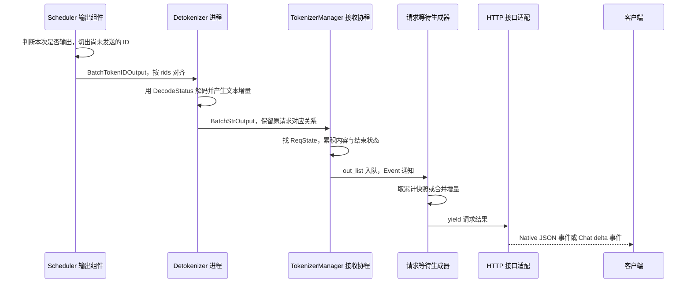

# Detokenizer 与流式输出

> **先建立架构心智模型：** [M03 · 请求对象与生命周期全景](<../architecture/03-请求对象与生命周期全景.md>)。先看职责、数据和生命周期，再回到本篇源码细节。

上一篇让 R1 生成了 `y0、y1、y2`。客户端看到的却未必是三次文字更新：发送间隔可以把多个 token 合并，解码可能需要等待完整字符，前端也可能把排队的结果合并后再交给 HTTP 层。

本文属于**源码分析型学习资料**，是系列第 **02-05** 篇。从 Scheduler 已得到的输出 ID 出发，追到增量解码、请求对应关系、日志概率与 SSE 响应。重点是分清“生成了多少”“文本确认到哪里”“这次发了什么”。

## 0. 阅读基线与范围

| 项目 | 内容 |
| --- | --- |
| 源码路径基准 | SGLang 仓库根目录 `.`；所有源码路径均相对此目录 |
| 分支 | `codex/sglang-source-study-20260909`，基于官方 `main` |
| commit | `72d5c5bb73cadd7ffbf5114e5f81e29d36b6c61a` |
| 读取日期 | `2026-09-09` |
| 工作区状态 | 学习源码 worktree 干净；原源码工作区与 Wiki 既有内容保留 |
| 操作边界 | 静态阅读输出准入、消息组装、增量解码、前端等待和 Python HTTP/SSE 包装；未运行服务或 tokenizer |
| 前置 | [Tokenizer 与消息通路](02-Tokenizer与进程间消息通路.md)、[一次 Prefill 到多轮 Decode](04-一次Prefill到多轮Decode.md) |
| 普通主线 | 单实例 Python HTTP 服务、一个 Tokenizer worker、普通文本生成；不跳过 tokenizer 初始化 |
| 教学条件 | R1 输入 8 个 token、输出 3 个 token、`stream=True`、有效 `stream_interval=2`；无提前 stop，最终按长度结束 |
| 不展开 | Rust 服务、多 HTTP worker 路由、Beam、投机、PD、会话、模型专用 reasoning/tool parser；只标明相关分支边界 |

示例中的 token、文本、事件顺序都是**整理者构造的教学数据**。源码事实以固定版本锚点支持；本文没有真实 token 解码结果、抓包、客户端收包时间或网络性能结论。

## 1. 输出回程有三种不同的工作

**人话版：** Scheduler 决定哪些请求现在值得汇报，Detokenizer 把数字变成可继续拼接的文字，TokenizerManager 把结果交给正确的等待者。HTTP handler 最后把这些内容包装成接口需要的格式。

| 对象或术语 | 人话解释 | 控制什么，不控制什么 |
| --- | --- | --- |
| `SchedulerOutputStreamer` | Scheduler 内的输出组件 | 按请求状态选输出、组织消息；不是 HTTP 服务器 |
| `BatchTokenIDOutput` | 多条请求的 ID、计数、结束原因等并列数组 | 每一行由 `rids[i]` 对应；不是 GPU 的 ForwardBatch |
| `DecodeStatus` | Detokenizer 为一个 rid 保存的解码进度 | 保存 token 上下文、确认文本和发送字符位置；不拥有 KV |
| `BatchStrOutput` | 加入文本增量后的回程消息 | 保留 rid、token 增量、计数和 logprobs；不直接等于 SSE |
| `ReqState` | TokenizerManager 的请求输出与等待状态 | 累积内容、设置 Event；与 Scheduler 的 Req 分处不同组件 |
| delta / 累计快照 | “这次新增的片段”/“到现在为止的全部内容” | 客户端拼接方法必须与接口输出语义一致 |
| SSE | 当前 HTTP handler 输出 `data: …` 等事件的格式 | 一条事件不要求只含一个 token，也不保证只有文字 |



**图意解读：** 只有标为进程的方框明确代表独立进程；T、W、H 是服务侧不同执行职责，可以位于同一进程。箭头表达代码交接关系，不代表这条请求独占流水线，也不代表发送动作收到了客户端确认。[S01][S04][S07][S08][S10][S11]

## 2. Scheduler 什么时候发送，发送哪些 ID

### 2.1 流式间隔是 token 数条件

`_GenerationStreamAccumulator.accept` 对普通请求先检查是否结束，再检查流式条件。设当前 `len(req.output_ids)=n`，有效间隔为 I：[S02]

| 状态 | 主要选择条件 | 应怎样理解 |
| --- | --- | --- |
| 请求已结束且尚未做最终输出 | 本次输出；必要时补 `finished_len` | 最终结果不必等到下一个间隔 |
| 未结束、stream=True、I=1 | `n % I == 0` | 在该组件被调用的结果时点检查，不是独立定时器 |
| 未结束、stream=True、I>1 | `n % I == 1` | 普通逐 token 路径常见触发点是 1、1+I、1+2I |
| 上一行允许输出，但后缀可能属于 stop 字符串 | `check_match_stop_str_prefix()` 可使本次暂缓 | 避免把尚待判断的 stop 前缀过早暴露 |
| 未结束、stream=False | 另用 force interval 检查 | 内部仍可阶段性回传，前端通常只在结束时 yield |

有效 I 取 `req.sampling_params.stream_interval or default_stream_interval`。这里的 `or` 是实际选择表达式，不能仅凭一个配置字段的声明值判断最终间隔。服务字段声明 `stream_interval=1`，force interval 的环境声明为 50；这些是本版声明与分支信息，本文没有运行实例的生效配置。[S02][S14][S17]

R1 选择 I=2：输出数为 1 时可发，为 2 时暂缓，为 3 时已经结束，必须走最终输出。本例每轮只增加一个 token；投机一次接受多个 token 时，不应直接套用“每隔两次 forward 发一次”。

`check_match_stop_str_prefix` 检查的是配置中的 stop 字符串及其前缀，并不能把名字扩展解释成所有 regex、所有 tokenizer 都有同一套缓冲保证。[S03]

### 2.2 最终输出标志不是送达确认

`SchedulerOutputStreamer._stream_output_generation` 跳过 `req.finished() and req.finished_output` 的请求，以防再次打包最终结果；`accept` 在构造最终输出的过程中就设置 `finished_output=True`，真正调用 sender 在后面。[S01][S02]

所以这里表示“本地已走过最终输出选择”，没有等待 Detokenizer、HTTP 或客户端 ACK。该字段也不是 KV 释放条件；资源路径在上一篇及下一篇分别解释。

### 2.3 两条 token 增量不能混用

| 消息字段与游标 | 内容 | 位置单位 |
| --- | --- | --- |
| `output_ids` / `Req.send_token_offset` | 截止结束位置的生成 ID 中，尚未发送的部分 | 生成 token 个数 |
| `decode_ids` / `Req.send_decode_id_offset` | 供解码的上下文与生成 ID 中，尚未发送的部分 | 解码缓冲中的 token 个数 |
| `read_offsets` | 首次初始化 Detokenizer 时，解码缓冲内提示上下文结束的位置 | token 位置 |
| `completion_tokens` | 当前 `output_ids_through_stop` 的长度，普通路径为累计值 | token 个数，不是本事件字符数 |
| `finished_reasons` | 每个 rid 当前的结束原因；未结束为 None | 状态，不是长度 |

`output_ids_through_stop` 在设置 `finished_len` 后截到该长度，**包含 stop 所在的 token 位置**。Detokenizer 的文本裁剪是后续独立步骤；不能用最终可见字符串长度反推这个 ID 数组长度。[S02][S21]

`Req.init_incremental_detokenize` 首次取未填充提示的最后至多 5 个 token，再接上输出，给解码器一点上下文。后续只补新的输出 ID。对本例输入 8 个 token，首包的解码缓冲从 `x3` 开始，返回的局部 read offset 是 5。[S03]

这 5 个提示 token 用于稳定解码边界，并不是重新向用户输出提示，也不是再次运行模型。它们与 KV 的前缀命中长度没有同一含义。

## 3. Detokenizer 怎样从上下文中拿到新增文本

### 3.1 同名 offset 在不同对象中坐标不同

`DetokenizerManager` 用 `decode_status[rid]` 保存 `DecodeStatus`。首包创建状态，后续包把新增 `decode_ids` 接到已有列表；后续消息里的 read offset 不会每次覆盖状态自己推进的 read offset。[S04][S22]

| DecodeStatus 字段 | 含义与更新边界 |
| --- | --- |
| `decode_ids` | 已收到的解码 token 缓冲，起点是首包携带的提示尾部 |
| `surr_offset` | 本次解码所需的旧上下文开始位置，单位是 token |
| `read_offset` | 已确认解码进度的 token 边界，与 Req 的原始提示坐标不同 |
| `decoded_text_len` | 已确认文本的字符长度；不等于 token 数 |
| `decoded_text` / `decoded_text_chunks` | 已确认文本的主体与尚未合并的片段，按需拼成完整字符串 |
| `sent_offset` | 已向 TokenizerManager 发出的文本字符位置；仍不是客户端 ACK |

把“过去的上下文”和“上下文加上新内容”各解码一次，再去掉前者对应的字符串长度，可以理解为用同一段背景测量新增加的文字。[S04][S05]

```text
surr_ids = decode_ids[surr_offset : read_offset]
read_ids = decode_ids[surr_offset : ]
surr_text = decode(surr_ids)
read_text = decode(read_ids)
new_text = read_text[len(surr_text) : ]
```

这是省略批处理与 stop 裁剪的**教学摘写**。实际代码先对需要的 read ID 做 stop token 裁剪，再调用分组或逐条 decode。它使用字符切片取得差额，并不是计算两个字符串的任意差异；不要把这一实现概括成对所有 tokenizer 输出变化的形式证明。

### 3.2 确认文本与提前发出的可打印文本

对尚未结束的请求，若 `new_text` 非空且不以替换字符 `�` 结尾，代码把它加入已确认文本，然后推进 token offset。否则调用 `find_printable_text`，只发可打印的前段，并保留 token offset，等更多 ID 后重试。[S04][S06]

关键关系是：

```text
pending = sent_offset - decoded_text_len
```

pending 记录此前已经发出去、但还没把对应完整解码结果确认到文本状态中的字符数。后续发结果时跳过这些字符，避免重复发送。

下面只演示字符账本；并没有声称某个模型的两个具体 token 会解码成这些字符串：

| 步骤 | 本次 new_text | 确认字符数 | 已发字符位置 | 本次增量 | token offset |
| --- | --- | ---: | ---: | --- | --- |
| 初始 | 无 | 0 | 0 | 无 | 初始位置 |
| 收到一段不完整结果 | `Hi �` | 0 | 3 | `Hi ` | 保持，等待更多 token |
| 后续解码结果完整 | `Hi there` | 8 | 8 | `there` | 推进到本次已确认边界 |

第二步的 pending 为 3，因此不会再次发 `Hi `。源码中的 `find_printable_text` 是换行、CJK 末尾与空格边界等启发式规则；“可打印”不是所有 Unicode 组合边界都已验证的承诺。[S06]

空文本增量也有意义：ID 或完成计数可以推进，而这一次没有新增可见文字。客户端不能把空字符串直接当作推理卡住。

### 3.3 结束时做什么

收到非空结束原因后，Detokenizer 取出已有状态，删除该 rid 的 `decode_status` 登记，拼出已确认文本加本次新文本，按结束信息裁剪，再从 `sent_offset` 切出最后的文本尾部。[S04]

`trim_matched_stop` 分别处理可用的 `matched` 字符串和 token ID：文本 stop 可以在字符串中定位；token stop 则在相应 ID 列表路径裁剪末尾。`no_stop_trim` 会改变保留规则，模型专用工具调用还有特例。本篇 R1 按长度结束，没有 matched stop，因此不进入这些裁剪分支。[S05]

删除解码状态早于下一步回程消息发送。它表示这份解码进度不再留在字典中，不表示客户端已经读完，也不会直接回收 Scheduler 的 KV。

### 3.4 批量 decode 如何维持行对应

`_grouped_batch_decode` 可先剔除空 ID 行，再解码非空行，并按原索引放回结果。fast tokenizer 路径会按 `(skip_special_tokens, spaces_between_special_tokens)` 分组，随后回填原行；slow tokenizer 和禁用 batch decode 有各自分支。[S04][S23]

最终 `handle_batch_token_id_out` 创建 `BatchStrOutput`，沿用 `rids`、`finished_reasons`、`output_ids`、计数与 logprobs 等字段，只把本次文本增量加入 `output_strs`。[S07]

所以不能把同一包里不同请求的 decode 结果直接顺序拼在一起。正确关联是 `rids[i] → 本行状态 → 本行输出`，并延续到前端对应的 ReqState。

## 4. 用 R1 走完两次输出

设 `y0、y1、y2` 在本例中形成稳定的文本片段 `t0、t1、t2`，没有不完整字符、特殊 token 或 stop 裁剪；等待者及时消费每一包。这里刻意固定这些条件，让我们只观察间隔与游标。

### 4.1 Scheduler 的账本

| 计算结果 | Req 中累计输出 | 是否打包 | 本包 output_ids | 本包 decode_ids | send_token_offset / send_decode_id_offset |
| --- | --- | --- | --- | --- | --- |
| Prefill 得到 y0 | `[y0]` | 是，1 % 2 = 1 | `[y0]` | `[x3,x4,x5,x6,x7,y0]` | `1 / 6` |
| Decode 1 得到 y1 | `[y0,y1]` | 否，2 % 2 = 0 | 无消息 | 无消息 | 保持 `1 / 6` |
| Decode 2 得到 y2 | `[y0,y1,y2]` | 是，已按长度结束 | `[y1,y2]` | `[y1,y2]` | `3 / 8` |

两包的 `completion_tokens` 分别是 1 和 3，第二包不是 2。第一包 `finished_reason=None`，第二包包含长度结束原因。[S02][S03]

### 4.2 Detokenizer 的账本

| 时点 | 已有解码 token 缓冲 | 关键边界与结果 |
| --- | --- | --- |
| 首包初始化 | `[x3,x4,x5,x6,x7,y0]` | 局部 surr=0、read=5，比较提示尾部与提示尾部加 y0 |
| 首包处理后 | 同上 | 发 t0；文本干净时 surr 变 5，read 变 6 |
| 终包到达 | 再接 `[y1,y2]`，共 8 个 token | 使用状态里的上下文边界计算新增文本；不是再次把 read 重置为 5 |
| 终包处理后 | 该 rid 登记删除 | 合成到停止位置的最终文本，减去已发字符位置，发 t1+t2 |

这两包文本从 Detokenizer 出来始终是**新增片段**。TokenizerManager 之后可以选择向等待者返回新增片段，也可以返回累计内容。[S04][S08]

## 5. TokenizerManager 怎样交给正确的等待者

### 5.1 先按 rid 累积，再通知

`_handle_batch_output` 对每个 `rids[i]` 查找 `rid_to_state`，用同一行构造 `meta_info`，将文本片段加入 `ReqState.text_chunks`，把 token 增量接到 `state.output_ids`。普通生成的 `state.finished` 来自本行 `finished_reasons[i] is not None`。[S08]

它随后按流式选项构造输出，放入 `state.out_list`，再设置 Event。通知可按 `batch_notify_size` 成组让出事件循环，末尾也会通知剩余状态；这与 Scheduler 的 token 间隔是两个不同控制点。[S08][S14]

当完成状态到来时，代码可先从 `rid_to_state` 删除登记，再把最终输出排入仍被局部变量和等待生成器引用的 ReqState。同步 `_wait_one_response` 已事先捕获对象，字典删除不会自动让现存引用失效。[S08][S09]

### 5.2 累计输出与增量输出

| 前端模式 | R1 第一次 yield 的 text / output_ids | R1 第二次 yield | 客户端处理 |
| --- | --- | --- | --- |
| `stream=True`，incremental 开启 | `t0` / `[y0]` | `t1+t2` / `[y1,y2]` | 按顺序追加 |
| `stream=True`，incremental 关闭 | `t0` / `[y0]` | `t0+t1+t2` / `[y0,y1,y2]` | 用新快照更新，或自己按长度取差额 |
| `stream=False` | 中间结果不向普通调用者 yield | 最终累计文本与 ID | 使用一次完整结果 |

这里描述 TokenizerManager 和原生接口的普通语义；Chat 接口还会做一层 delta 转换。`incremental_streaming_output` 的字段声明为 False，不代表我们已观察某台服务的最终配置。[S08][S10][S14]

为避免每次到包都重建完整字符串，非增量流式中间结果的 `text` 可以先是 None，交到等待生成器时再由 `state.get_text()` 物化。最终输出会取稳定的 ID 副本；中间累计 ID 可以仍引用活动列表，不要把所有阶段结果都当作不可变快照。[S08][S09]

### 5.3 如果两包在等待者醒来前都到了

`_stream_one_response` 一次取走 pending 的 `out_list`，清空该队列并清 Event。对累计模式，它可使用最后一个结果；对增量模式，多包需要 `_coalesce_streaming_chunks` 拼接文本与 ID，不能只留最后一包。[S09][S20]

对上述 R1，若两包一起被消费：

```text
增量输入队列： [t0, t1+t2]；[[y0], [y1,y2]]
合并后的 yield：t0+t1+t2；[y0,y1,y2]
普通计数和结束元信息：采用最后一包，例如 completion_tokens=3
按 token 增量记录的指定 metadata 列表：逐包拼接
```

源码在积压达到指定条数时记录 streaming backlog 日志。日志存在和合并路径存在，并不代表本次测过慢客户端，也不证明全链路具有无限缓冲或严格的端到端背压。[S09]

## 6. Logprobs 跟随 token 位置，不跟随字符长度

logprob 是所记录 token 的对数概率信息。这里关注它如何与请求和输出位置对应；概率在哪一层计算、采样怎样改变候选集合，由阶段 05 深入。

| 层次 | 对齐方式 | 需要区分的边界 |
| --- | --- | --- |
| Scheduler | 同一个 accumulator 对同一个 Req 同步加入 rid、ID、计数和 logprob 数组 | 不是拿 batch 中所有概率拼成一个列表 |
| 输入 logprobs | 普通路径在已算好、请求要求且尚未发送时携带，`input_logprob_sent` 记录状态 | PD Decode 等分支不同；不能假设每包重复完整 prompt 概率 |
| 输出 logprobs | 用独立 `send_output_token_logprobs_offset` 切出未发部分，再推进该游标 | 不与含提示尾部的 `send_decode_id_offset` 混用 |
| Detokenizer | 保留本行 logprob 数组，将文本增量加入回程包 | 不因一个字符跨多个 token 就合并概率位置 |
| TokenizerManager | 按 rid 累积 value/index，转成接口需要的记录；按增量模式切 metadata | `output_token_logprobs_length` 是累计记录长度，不能用字符 offset 代替 |
| Chat 适配 | 按 choice index 保存此前概率位置，累计模式再切增量，增量模式直接使用本次记录 | 文本事件可能为空，仍需查实际输出分支 |

依据分别见 [Scheduler 输出组装][S02]、[TokenizerManager 概率转换][S12]、[Chat 概率适配][S13]。

概率记录中的 token 文本可按单个 ID 单独 decode；它与整串增量解码的可见片段不是同一计算。因此 stop token 计入生成长度但在文字里被裁掉，或几个 token 合成一个字符，都不能直接判断为概率与请求串线。

**一个需要保留的源码边界：** 当前 Chat 普通内容分支只有 `delta` 非空才发内容事件；没有 parser 时，不会仅为剩余 logprobs 自动补一个空内容事件。因此本篇只确认所读位置的对应与切片机制，不声称每个空文本步骤的 logprob 都必然以单独 SSE 事件送达。需要这项接口保证时，须按实际 tokenizer、空增量和 parser 条件补充验证。[S11][S13]

## 7. 从内部结果到 Native / Chat SSE

### 7.1 原生 /generate

`http_server.generate_request` 在 `stream=True` 时，对 TokenizerManager 的每个结果输出：

```text
data: <本次结果 JSON>

```

正常迭代结束后输出 `data: [DONE]`。结果中的 `text` 按上一节选择累计或增量，不因为使用 SSE 就自动变成增量。错误还可经流内 error 事件表达；客户端断开对应的处理路径也可能直接返回，不能把 `[DONE]` 当作所有异常路径的保证。[S10]

### 7.2 OpenAI 兼容 Chat

`_generate_chat_stream` 按 choice index 管理流式状态。普通路径先发 assistant 角色事件，再由 `_generate_stream_content` 处理内容：[S11][S18]

- 如果内部已是增量文本，直接作为本次 delta。
- 如果内部是累计文本，根据该 index 的字符 `stream_offsets` 取新增部分。
- 请求结束后发送结束原因事件；根据选项还可有 usage、扩展信息等事件，最后输出 `[DONE]`。

所以 R1 即使只有两包内部结果，也不能推出客户端一定只收到两条 SSE。角色、内容、finish reason、usage 是不同事件职责。`choices[].index` 也不能简单理解成 Scheduler GPU batch 中的第几行。[S18]

`_handle_streaming_request` 先推进生成器取得首块，再建立 StreamingResponse，让部分前置校验仍能返回普通错误响应。流已经开始后的 ValueError 则由对应路径生成流内错误；具体异常与客户端断开仍应保留原始响应和日志，不能只检查 HTTP 200。[S18][S19]

本篇的函数追踪终点是服务代码产出事件。代理缓冲、TCP 传输、客户端解析和 UI 刷新可以继续改变用户看到的节奏；本文未观察这些层，也没有拿服务侧时间字段作为用户实际阅读时间。

## 8. 小白排障地图

| 现象 | 先检查什么 | 回到哪里 |
| --- | --- | --- |
| 模型每步生成，文字却隔几步才来 | 有效 stream interval、stop 前缀暂缓、文本是否完整、等待队列是否合并 | accept → 解码 → `_stream_one_response` [S02][S04][S09] |
| Native 客户端越拼越重复 | 返回的是累计 text 还是 delta，是否把两者都直接追加 | `_handle_batch_output`、原生 handler [S08][S10] |
| 一包有两个 ID，却没有两个字符 | tokenizer 边界、特殊 token、stop 裁剪与空文本 | `_decode_batch_token_id_output` [S04][S05] |
| 概率数量与本次文本字符数不同 | token 位置、累计/增量、是否裁掉 stop、空 delta 条件 | convert_logprob_style、Chat 切片 [S12][S13] |
| finished_output=True，但客户端没有最终结果 | 本地组装标志、sender、Detokenizer、前端等待和 HTTP 各层证据 | `_stream_output_generation` [S01] |
| 输出对应不到请求 | rids 与各并列数组、前端状态是否已删除、choice index 的映射 | `handle_batch_token_id_out`、`_handle_batch_output` [S07][S08] |
| 报 Decode status not found | 同一批活跃状态数、容量与淘汰时点；先保存原始日志 | `_decode_batch_token_id_output`、LimitedCapacityDict [S04][S15] |
| 收到 [DONE] 就认为计算成功 | 前面的 error、业务 finish reason、输出是否完整 | Native/Chat 包装 [S10][S11] |

Detokenizer 状态表的容量由 `SGLANG_DETOKENIZER_MAX_STATES` 控制，本版声明默认 65536；插入超过容量会移除最早插入的项。源码给出了状态不存在时的报错提示，但不能仅凭这个提示认定现场唯一根因，更不能把容量调大当作已验证修复。[S15]

## 9. 源码阅读路线

以下每个路径都相对于 SGLang 仓库根目录；先按问题读相关段落，再追调用者。

| 要回答的问题 | 源码锚点 | 固定链接 |
| --- | --- | --- |
| 哪些请求参与这次输出？ | `python/sglang/srt/managers/scheduler_components/output_streamer.py::SchedulerOutputStreamer._stream_output_generation` | [S01] |
| 间隔、最终标志、ID 和概率游标怎么推进？ | `python/sglang/srt/managers/scheduler_components/output_streamer.py::_GenerationStreamAccumulator.accept` | [S02] |
| 首次为什么带提示尾部？ | `python/sglang/srt/managers/schedule_batch.py::Req.init_incremental_detokenize` | [S03] |
| token 与字符状态怎么变化？ | `python/sglang/srt/managers/detokenizer_manager.py::DetokenizerManager._decode_batch_token_id_output` | [S04] |
| 解码选项如何按请求分组？ | `python/sglang/srt/managers/detokenizer_manager.py::DetokenizerManager._grouped_batch_decode` | [S23] |
| 不完整文本怎样先取可打印部分？ | `python/sglang/utils.py::find_printable_text` | [S06] |
| 哪些原字段继续传回？ | `python/sglang/srt/managers/detokenizer_manager.py::DetokenizerManager.handle_batch_token_id_out` | [S07] |
| 如何从 rid 找到输出等待状态？ | `python/sglang/srt/managers/tokenizer_manager.py::TokenizerManager._handle_batch_output` | [S08] |
| 积压增量怎样合并？ | `python/sglang/srt/managers/tokenizer_manager.py::TokenizerManager._coalesce_streaming_chunks` | [S09] |
| 等待者怎样取结果并停止 yield？ | `python/sglang/srt/managers/tokenizer_manager.py::TokenizerManager._stream_one_response` | [S20] |
| Native SSE 在哪里组装？ | `python/sglang/srt/entrypoints/http_server.py::generate_request` | [S10] |
| Chat 的累计文本在哪里转 delta？ | `python/sglang/srt/entrypoints/openai/serving_chat.py::OpenAIServingChat._generate_stream_content` | [S11] |
| 角色、结束和 usage 事件在哪里组装？ | `python/sglang/srt/entrypoints/openai/serving_chat.py::OpenAIServingChat._generate_chat_stream` | [S18] |
| 概率记录怎样累积与转换？ | `python/sglang/srt/managers/tokenizer_manager.py::TokenizerManager.convert_logprob_style` | [S12] |
| Chat 怎么确定本次概率区间？ | `python/sglang/srt/entrypoints/openai/serving_chat.py::OpenAIServingChat._process_streaming_logprobs` | [S13] |

旁路也要明确：`SchedulerIpcChannels.create` 在 `skip_tokenizer_init` 时把生成输出直接送 Tokenizer 侧，不能仍按“必经 Python Detokenizer”画图；Rust 服务在 output streamer 处另走 `push_generation`。多 worker 回程也有单独路由，本篇没有证明这些组合。[S01][S16]

## 10. 练习、验收与下一篇

1. R1 的 I=2，生成数依次为 1、2、3，最后按长度结束。应打几包 Scheduler 输出？第二包 completion_tokens 和 ID 增量分别是什么？
2. 首包带入 5 个提示 token 与 1 个输出 token，为什么 send_decode_id_offset=6、send_token_offset=1 可以同时正确？
3. 已发 `Hi ` 但未确认完整新文本，随后 new_text 为 `Hi there`。为什么只追加 `there`？
4. 两个增量包排队时，为什么不能只取最后一包？累计模式为什么可以取最后快照？
5. Req.finished_output、DecodeStatus 删除、ReqState.finished 和客户端收到最终事件，为什么要分别观察？

**参考答案：** 1）两包，第二包累计计数为 3、ID 增量为 `[y1,y2]`；2）前者包括解码用提示尾部，后者只数生成 ID；3）pending=3，跳过此前已发的字符；4）增量各自携带不同内容，累计快照已经包含旧内容；5）它们属于不同组件与时点，没有一个字段天然代表全链路送达。

本篇已核对路径、符号、固定行号、图文和教学账本；没有执行 tokenizer、模型、HTTP 请求、Unicode 边界测试、慢客户端测试或 Mermaid 渲染。需要运行验证时，按[实验记录模板](../appendices/05-实验记录与证据模板.md)同时保存 token ID、原始 SSE、累计/增量配置和客户端时间，不用屏幕上看见的字数替代 token 证据。

下一篇为[完成、取消与资源释放](06-完成取消与资源释放.md)，继续把结束原因、取消消息、队列收尾、KV 交接与槽位复用分开。返回[系列目录](../README.md)。

[S01]: https://github.com/sgl-project/sglang/blob/72d5c5bb73cadd7ffbf5114e5f81e29d36b6c61a/python/sglang/srt/managers/scheduler_components/output_streamer.py#L144
[S02]: https://github.com/sgl-project/sglang/blob/72d5c5bb73cadd7ffbf5114e5f81e29d36b6c61a/python/sglang/srt/managers/scheduler_components/output_streamer.py#L418
[S03]: https://github.com/sgl-project/sglang/blob/72d5c5bb73cadd7ffbf5114e5f81e29d36b6c61a/python/sglang/srt/managers/schedule_batch.py#L1569
[S04]: https://github.com/sgl-project/sglang/blob/72d5c5bb73cadd7ffbf5114e5f81e29d36b6c61a/python/sglang/srt/managers/detokenizer_manager.py#L303
[S05]: https://github.com/sgl-project/sglang/blob/72d5c5bb73cadd7ffbf5114e5f81e29d36b6c61a/python/sglang/srt/managers/detokenizer_manager.py#L189
[S06]: https://github.com/sgl-project/sglang/blob/72d5c5bb73cadd7ffbf5114e5f81e29d36b6c61a/python/sglang/utils.py#L354
[S07]: https://github.com/sgl-project/sglang/blob/72d5c5bb73cadd7ffbf5114e5f81e29d36b6c61a/python/sglang/srt/managers/detokenizer_manager.py#L443
[S08]: https://github.com/sgl-project/sglang/blob/72d5c5bb73cadd7ffbf5114e5f81e29d36b6c61a/python/sglang/srt/managers/tokenizer_manager.py#L2240
[S09]: https://github.com/sgl-project/sglang/blob/72d5c5bb73cadd7ffbf5114e5f81e29d36b6c61a/python/sglang/srt/managers/tokenizer_manager.py#L1652
[S10]: https://github.com/sgl-project/sglang/blob/72d5c5bb73cadd7ffbf5114e5f81e29d36b6c61a/python/sglang/srt/entrypoints/http_server.py#L911
[S11]: https://github.com/sgl-project/sglang/blob/72d5c5bb73cadd7ffbf5114e5f81e29d36b6c61a/python/sglang/srt/entrypoints/openai/serving_chat.py#L800
[S12]: https://github.com/sgl-project/sglang/blob/72d5c5bb73cadd7ffbf5114e5f81e29d36b6c61a/python/sglang/srt/managers/tokenizer_manager.py#L2719
[S13]: https://github.com/sgl-project/sglang/blob/72d5c5bb73cadd7ffbf5114e5f81e29d36b6c61a/python/sglang/srt/entrypoints/openai/serving_chat.py#L2422
[S14]: https://github.com/sgl-project/sglang/blob/72d5c5bb73cadd7ffbf5114e5f81e29d36b6c61a/python/sglang/srt/arg_groups/fields/serving.py#L247
[S15]: https://github.com/sgl-project/sglang/blob/72d5c5bb73cadd7ffbf5114e5f81e29d36b6c61a/python/sglang/srt/managers/detokenizer_manager.py#L67
[S16]: https://github.com/sgl-project/sglang/blob/72d5c5bb73cadd7ffbf5114e5f81e29d36b6c61a/python/sglang/srt/managers/scheduler_components/ipc_channels.py#L25
[S17]: https://github.com/sgl-project/sglang/blob/72d5c5bb73cadd7ffbf5114e5f81e29d36b6c61a/python/sglang/srt/environ.py#L614
[S18]: https://github.com/sgl-project/sglang/blob/72d5c5bb73cadd7ffbf5114e5f81e29d36b6c61a/python/sglang/srt/entrypoints/openai/serving_chat.py#L1675
[S19]: https://github.com/sgl-project/sglang/blob/72d5c5bb73cadd7ffbf5114e5f81e29d36b6c61a/python/sglang/srt/entrypoints/openai/serving_chat.py#L1647
[S20]: https://github.com/sgl-project/sglang/blob/72d5c5bb73cadd7ffbf5114e5f81e29d36b6c61a/python/sglang/srt/managers/tokenizer_manager.py#L1740
[S21]: https://github.com/sgl-project/sglang/blob/72d5c5bb73cadd7ffbf5114e5f81e29d36b6c61a/python/sglang/srt/managers/schedule_batch.py#L1346
[S22]: https://github.com/sgl-project/sglang/blob/72d5c5bb73cadd7ffbf5114e5f81e29d36b6c61a/python/sglang/srt/managers/detokenizer_manager.py#L75
[S23]: https://github.com/sgl-project/sglang/blob/72d5c5bb73cadd7ffbf5114e5f81e29d36b6c61a/python/sglang/srt/managers/detokenizer_manager.py#L239
