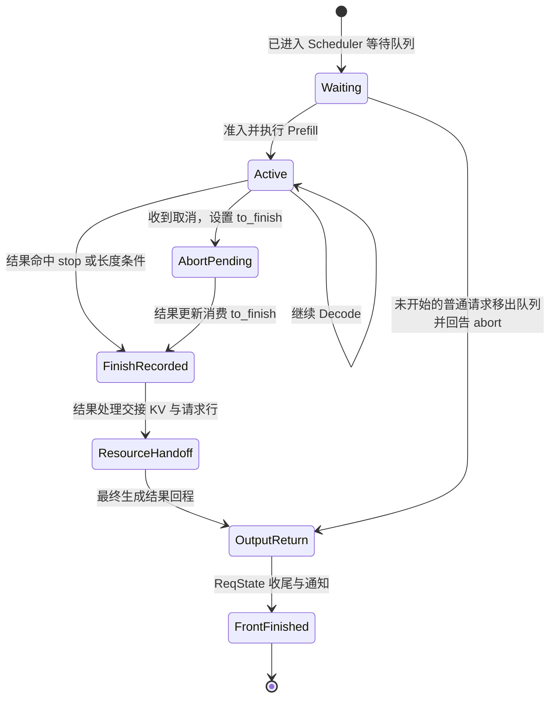
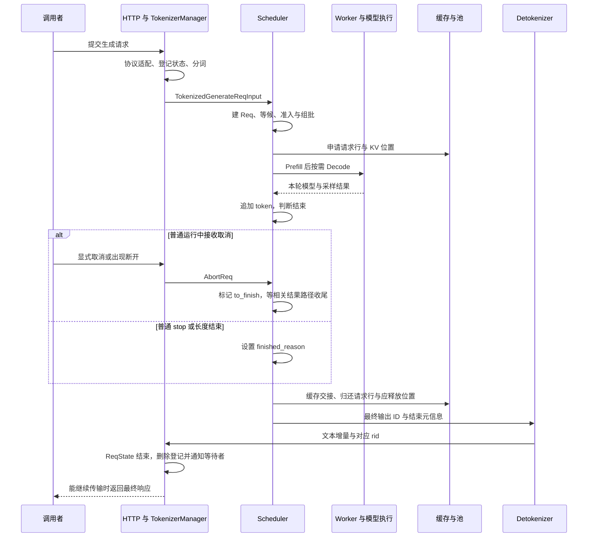

# 完成、取消与资源释放

一条请求“结束”至少涉及三份账：模型还要不要继续算，输出还要不要继续交给调用者，资源由谁接手。它们由不同对象记录，也在不同时间更新。

本文属于**源码分析型学习资料**，是系列第 **02-06** 篇。先追普通请求的正常结束，再让 R1 在等待和运行中被取消，最后比较回撤、分块取消与超时。读完应能解释：为什么 abort 接口返回了，显存却不一定下降；为什么请求已经 finished，batch 中还可能暂时保留它。

## 0. 阅读基线与范围

| 项目 | 内容 |
| --- | --- |
| 源码路径基准 | SGLang 仓库根目录 `.`；下文源码位置均用仓内相对路径 |
| 分支 | `codex/sglang-source-study-20260909`，基于官方 `main` |
| commit | `72d5c5bb73cadd7ffbf5114e5f81e29d36b6c61a` |
| 读取日期 | `2026-09-09` |
| 工作区状态 | 学习源码 worktree 干净；原源码工作区与 Wiki 既有内容保留 |
| 操作边界 | 只读源码与部分单元测试内容；未导入或运行 SGLang、未调用 abort 接口、未做故障注入 |
| 前置 | [Req 与 Batch 对象](03-Req与多种Batch对象的分工.md)、[逐轮生成](04-一次Prefill到多轮Decode.md)、[流式输出](05-Detokenizer与流式输出.md) |
| 主线条件 | 普通 Python HTTP、单 Tokenizer worker、普通文本、单卡、关闭 overlap；无投机、Beam、PD、会话或异步 KV offload |
| 资源教学条件 | 普通 RadixCache、page_size=1、允许插入；不展开 Mamba/SWA/HiSparse；无其他请求、淘汰或内存不足 |
| R1 | 输入 8 个 token、最多生成 3 个；正常例子无提前 stop；取消例子在 Prefill 已产出 y0 后、下一轮输入处理时收到 abort |

数字、图和字段表是**整理者归纳与教学推演**，不是运行观察。分块、grammar 和 timeout 只复核本篇列出的控制分支；Overlap、跨 rank 与 PD 传输退役仍需后续专题，不把本篇静态阅读写成取消安全性验证。

**缓存实现选择：** 本篇用传统 `RadixCache` 讲解基本机制。固定基线的[默认缓存工厂](https://github.com/sgl-project/sglang/blob/72d5c5bb73cadd7ffbf5114e5f81e29d36b6c61a/python/sglang/srt/mem_cache/registry.py#L80)在未命中特殊分支时创建 `UnifiedRadixCache`；实际组件与生命周期见 [04-04](../04-kv-cache/04-UnifiedRadix与混合状态组件.md)和 [04-07](../04-kv-cache/07-KV缓存全生命周期与排障.md)。阅读本篇账本时保留上表的实现条件。

## 1. 先分开这些“结束”标志

**人话版：** 客户端说“我不要了”，类似给后台发一张撤单通知。通知发出、后台决定停止、当前工作收尾、物品归还和回执送达，不能用一个布尔值代替。

| 字段或对象 | 表示什么 | 不表示什么 |
| --- | --- | --- |
| `Req.to_finish` | 下一次适当的结束状态更新应采用这个原因 | 此刻 `Req.finished()` 必然为 True |
| `Req.finished_reason` | Scheduler 已登记结束原因 | KV 已释放、请求已从所有容器消失 |
| `Req.finished_len` | 对外输出截断位置；部分路径会稍后补齐 | GPU 已计算的 KV 长度 |
| `Req.finished_output` | 本地已走过最终输出选择 | Detokenizer 或客户端已经确认送达 |
| `ReqKvInfo.holds_kv` | 是否仍登记 `req_pool_idx` 请求行 | 所有旧 KV 字节都还归该请求独占 |
| `ReqState.dispatched` | 前端推进发送路径后记下的状态 | Scheduler 已接纳、GPU 已开始运行的 ACK |
| `ReqState.abort_sent` | 前端已尝试派发本次取消，用于抑制重复派发 | 后端已经完成取消 |
| `ReqState.finished` | 前端收到结束输出或 abort 回告后登记完成 | 客户端实际收到最终事件 |

`Req.finished()` 的实现只判断 `finished_reason is not None`。`to_finish` 和 `finished_reason` 明确分开，是为了避免在调度迭代中途直接把仍需收尾的请求当成可过滤成员。[S01][S02][S35]

下面是**普通主线的教学状态图**，状态名不是源码枚举；特别是等待队列的直接 abort 回告，并不要求先给该 Req 写入 finished_reason。

**图意解读：** 这张图覆盖普通运行取消与尚未执行的队列取消。GPU batch 的成员过滤不是图中一个独立“请求完成”事件；它可在后续选批时发生。最后一站是前端状态收尾，客户端送达仍需单独证据。[S02][S04][S06][S11][S15]

## 2. 正常生成怎样决定结束原因

`Req.update_finish_state` 不只比较输出长度。当前顺序如下：[S02]

| 顺序 | 检查 | 对理解结果的影响 |
| --- | --- | --- |
| 1 | 已经 finished 则返回 | 不重新覆盖已有结束原因 |
| 2 | 存在 to_finish，则转为 finished_reason 并清掉 to_finish | 待处理 abort 会优先于后面的普通停止检查 |
| 3 | 新 token 的词表边界检查 | 异常 ID 先处理，避免直接交给解码 |
| 4 | stop 字符串/regex | 在相同步骤中优先于 token stop |
| 5 | EOS / 配置 stop token | 命中后记录停止；再按输出预算限制截断位置 |
| 6 | 输出数达到 max_new_tokens | 设置 FINISH_LENGTH 与 finished_len |
| 7 | grammar 已终止 | 进入对应 grammar 结束分支 |

字符串、token 或词表边界分支还会调用 `_cap_finished_len_at_max_new_tokens`，处理停止位置越过长度预算的情况。这个顺序对一次接受多个 token 的投机路径尤其重要，但本篇不展开其验证/提交算法。

本版内部结束对象通过 `to_json()` 转为回程信息：matched token、字符串和 regex 使用 `type="stop"`，长度使用 `type="length"`，取消或错误使用 `type="abort"`，还可携带 message/status_code。[S03]

R1 正常生成 y0、y1、y2，且前两步没有命中 stop。结果处理先把新 token 加到 `output_ids`，再更新结束状态；第三个输出使它按长度结束。相反，若这一步已有 `to_finish`，不能只凭输出恰好为 3 就推断最终原因是 length。[S02][S04]

## 3. 正常结束：先交接资源，再继续各层收尾

### 3.1 Prefill 与 Decode 都能结束请求

普通 Prefill 结果路径追加首 token、调用 `update_finish_state`，若请求已结束，就调用 `release_kv_cache`；否则可以把已算好的输入前缀交给缓存。普通 Decode 路径追加本轮输出、更新状态，再由 `_handle_finish_state_updated_req` 进入完成处理。[S04][S25]

在本文条件下，Decode 完成路径最后调用 `release_kv_cache` 并记录 completion time。真实代码还包含模型准备 hook、Mamba、HiSparse、多模态与异步 offload 等分支，不能从普通分支推出所有完成路径同步释放。[S05]

### 3.2 release_kv_cache 是交接入口

主线的调用顺序如下：[S06]

1. 核对请求行登记与已释放标记的一致性。
2. 取得有效 committed 长度，交给具体 `tree_cache.cache_finished_req`。
3. 如果缓存实现已经接管请求行收尾，则按对应条件返回；否则继续处理额外分配区域。
4. 按 pool/缓存类型处理其他状态，再调用请求池的 `free(req)`。
5. `mark_kv_released()` 把 allocated 长度和 SWA 已淘汰计数归零。

`ReqToTokenPool.free` 归还请求行，并把 `req_pool_idx=None`。它不负责把所有被前缀树保留的 KV 同时清空。[S07]

这里也不是一个可无条件重复调用的“清理开关”。没有请求行时的特殊入口要求 cache 支持 Mamba；普通 RadixCache 已释放请求再次进入此入口会遇到相应断言。调用者必须遵守实际生命周期，不能依赖重复释放自动无害。[S06]

### 3.3 RadixCache 保留什么，释放什么

普通 `RadixCache.cache_finished_req` 从 `(origin_input_ids + output_ids)` 中取实际应处理的 KV 长度，建立页对齐的 key 与位置映射。它按插入结果处理重复或未插入区域、非对齐尾部，并释放该请求此前持有的缓存锁引用。[S08]

| 区域或动作 | 普通路径的含义 |
| --- | --- |
| 已受缓存保护的前缀 | 不能按请求私有区域重复释放 |
| 新增且被成功插入的 KV | 交由缓存持有，供后续匹配/淘汰策略处理 |
| 重复或没有插入的私有位置 | 交给 allocator 的 free 路径 |
| 请求行 | 由外层 common 函数继续归还 |
| 缓存锁引用减少 | 该请求不再保护相应路径；不保证没有其他请求仍持锁 |

R1 输入 8 个、输出 3 个，普通计算只为提示和 y0、y1 形成了 10 个位置的 KV。y2 刚被采样出来，没有为它再做一轮 forward，所以不能缓存出第 11 个 KV 位置。[S04][S08]

在本例无其他请求、允许插入的条件下，请求行可以归还，而这 10 个位置可以留在缓存中。能否被新请求复用还取决于匹配 key、缓存状态等条件，不能把“可缓存”当作已观察到命中。

### 3.4 free 还可能先进入分组列表

Prefill/Decode 结果处理在一组工作前后调用 `free_group_begin/end`。page_size=1 的 `TokenToKVPoolAllocator.free` 在分组期间复制并收集索引，等 `free_group_end` 合并后再进入正常 free 路径；是否先放入 release_pages 还受 need_sort 控制。[S04][S09][S31]

因此 `release_kv_cache` 返回、请求行归还、释放索引进入可分配账本，也不是必须同一个瞬时动作。当前普通 Decode 代码先调用 output streamer，再执行 `free_group_end`，不能拿输出选择标志替代 allocator 状态检查。

这些 free 操作管理池内索引，没有在该入口释放整个 KV 张量池。因此请求结束后设备进程的总显存不立即下降，可以与池内槽位已经归还同时成立；这只是源码层面的解释，现场还须排除其他占用原因。[S09]

### 3.5 结束后的字段与 batch 成员

| 观察时点 | finished_reason | 请求行 | allocated / committed | batch 成员 |
| --- | --- | --- | --- | --- |
| R1 最后结果处理前 | None | Q | 10 / 10 | 本轮包含 R1 |
| 新输出追加并判定 length | length | Q | 10 / 10 | 仍包含 R1 |
| 普通资源交接完成 | length | None | 0 / 可保留旧值 10 | 本轮容器仍可引用它 |
| 后续过滤 | length | None | 不由 filter 负责清零 | 不再作为该 batch 的后续执行成员 |

`mark_kv_released` 没有把 committed 清零。普通 allocation 还会在 forward 前推进 committed，因此这个名字既不是 GPU 完成事件，也不是请求仍持有资源的独立判断条件。[S01] 详细时点见[逐轮生成](04-一次Prefill到多轮Decode.md)。

`ScheduleBatch.filter_batch` 根据 finished 状态和排除集合筛选成员，更新相关行字段；空 batch 可留下不再使用的旧 tensor。它不调用 KV 释放，是成员管理而非资源清理。[S10]

## 4. 客户端断开怎样变成取消请求

### 4.1 三个前端入口

| 入口 | 本版所读行为 | 要保留的边界 |
| --- | --- | --- |
| 显式 `/abort_request` | 调用 TokenizerManager.abort_request 后返回 HTTP 200 | 没有等待 Scheduler 清理完成，也未保证匹配到请求 |
| 等待结果时发现断开 | `_stream_one_response` 检查 request、background 与连接状态，发 abort 并抛 ValueError | 等待超时本身并不等于断开；非流式运行中的检查还有另一分支 |
| StreamingResponse 附带的后台任务 | `create_abort_task` 创建任务；任务执行后先等 2 秒，再对仍有 ReqState 的 rid 发 abort | 该函数内没有直接调用 is_disconnected；外围响应生命周期决定何时执行，本文未验证框架全部取消行为 |

来源见 [HTTP 入口][S11]、[等待生成器][S12]、[后台任务创建][S13]。2 秒是这段后台任务代码里的等待，不是对所有取消给出的响应时间承诺。

### 4.2 发取消前，先看请求有没有派发

`generate_request` 在创建前端状态后，以 `except BaseException` 捕获后续失败并调用 `_release_req_states_on_failure`。这覆盖普通异常之外的生成器/任务异常路径，但不代表所有进程级故障都有机会执行这段 Python 收尾。[S14][S32]

| ReqState 状态 | 失败清理动作 | 为什么 |
| --- | --- | --- |
| 尚未 dispatched | 从前端字典删除 | 还没推进发送的请求，不应永远等待不存在的后端结果 |
| 已 dispatched | 派发 abort，暂时保留状态等待后端回告 | 后端可能已经持有请求与资源，仅删前端字典不够 |
| 已被正常输出或其他路径删除 | 没有该状态则跳过 | 不把已经移除的对象重新创建回来 |

dispatched 的写入跟随 `_dispatch_to_scheduler`，没有读取 Scheduler 的接纳 ACK。它是前端失败清理的分界账本，不是执行完成证据。[S14][S33]

### 4.3 abort_sent 与匹配范围

`TokenizerManager.abort_request` 对空 rid 且 abort_all=False 的调用直接忽略。单 worker 模式下，若本地找不到该 rid 的活动状态，也直接返回；已有 state 的 abort_sent 为 True 时抑制重复派发。派发抛异常时会把该标志恢复。[S15]

但 Scheduler 的多个匹配条件使用 `req.rid.startswith(recv_req.rid)`，另有 abort_all 分支。因此各层语义不能混为“始终精确匹配一个 ID”：前端活动状态查找与后端前缀匹配是不同步骤。比如已派发的 rid `R1` 作为前缀，也会匹配 `R10`。本文不执行这些接口；实际调用或分析时必须核对目标集合。[S15][S16]

## 5. Scheduler 按请求当前位置决定怎样收尾

### 5.1 还在等待队列

对本文“从未执行、无 Mamba/PD/分层预取”的普通请求，`Scheduler.abort_request` 收集匹配的等待队列下标，倒序弹出，并给 TokenizerManager 发送一条对应实际 rid 的 AbortReq 回告。[S16]

这条分支不需要为了生成最终文本而运行模型，也没有普通请求行可释放。`_release_aborted_request` 这个辅助函数只在相关分层缓存/存储/外链配置下调用 cache 侧清理；不能看名字就认为它是所有 KV 的统一 free。[S17]

代码还明确处理了 PD 等待队列已有 KV、Prefill metadata 与 Mamba 提前分配等例外，所以“waiting 一定没有资源”只适用于本篇限定的普通首次排队例子。

### 5.2 已进入运行或上一批结果路径

`collect_inflight_reqs` 在 pp_size=1 时从 `running_batch` 与 `last_batch` 收集 Req，并用集合去重；它不只扫描名字叫 running 的一个容器。[S16]

对匹配且尚未 finished 的请求，abort handler 设置 `to_finish=FINISH_ABORT(...)`，不直接把它从 batch 删除，也不在这段运行分支立刻 free KV。后续结果处理中，`update_finish_state` 消费 to_finish，然后复用正常完成资源处理。[S02][S05][S16]

本篇普通循环在一轮开始接收消息，之后选批、运行、处理结果。运行取消不是强制中断当前 GPU kernel 的指令；在取得下一个相关结果前，调度和计算仍可能继续推进。下面只固定一个最短普通例子，不把源码注释中的“一轮 Decode”扩展成所有模式和负载的严格上界。

### 5.3 R1 在 Prefill 后被取消

假设此时客户端仍能接收回告，Scheduler 在下一轮 ingest 收到针对 R1 的取消，没有其他待调度请求、内存不足、暂停或分块。

| 步骤 | Req 输出 | 结束字段 | KV 与前端状态 |
| --- | --- | --- | --- |
| Prefill 结果已处理 | `[y0]` | reason=None，to_finish=None | 请求行 Q；allocated=committed=8；提示前缀可已缓存 |
| 前端派发 abort | 同上 | Scheduler 尚未必收到 | abort_sent=True；不会因此归还 Q |
| Scheduler 接收 | 同上 | to_finish=abort，reason 仍 None | Q 与 KV 暂时保留，finished() 仍 False |
| 本例下一轮 Decode | 把 y0 作为输入，随后得到 y1 | 结果处理中先追加 y1，再消费 to_finish | 本轮准备覆盖长度 9；该数字本身不是 GPU fence |
| 本轮完成处理 | `[y0,y1]` | reason=abort，to_finish=None | 普通资源交接后 Q=None、allocated=0；committed 可残留 9 |
| 最终结果回程 | 截到最终输出位置 | output streamer 必要时补 finished_len | ReqState 处理完成信息并删除登记、通知等待者 |

这说明取消不承诺“发出通知后绝不会多产生一个 token”。也不能由后端生成了 y1 推出客户端已经看到它；连接断开、输出间隔和回程状态分别决定后续行为。[S02][S04][S15][S16]

普通运行 abort 的结果完成路径仍可能以 is_insert=True 交给缓存，当前代码没有把所有 FINISH_ABORT 自动转换成“清空一切缓存”。本例只应处理形成过 KV 的 9 个位置，不包括刚生成的 y1 所对应的下一轮 KV。[S05][S08]

## 6. 分块与 grammar 的取消不能套用同一做法

### 6.1 分块请求先登记待处理目标

如果匹配的是当前 `chunked_req`，`abort_request` 先把对象记到 `_pending_chunked_abort_req`。`get_next_batch_to_run` 开头调用 `process_pending_chunked_abort`，在选下一个 chunk 前集中处理。[S18]

| 处理时的状态 | 已读源码动作 |
| --- | --- |
| 待取消对象仍是当前 chunked_req | 设置 abort 结束状态、清 to_finish、处理相关 cache 侧状态、`release_kv_cache(..., is_insert=False)`，清 chunked/pending 引用，回告前端 |
| 对象已离开 chunked 槽，且 finished 或不再持有 KV | 清 pending 标记并返回 |
| 对象已移动，但仍活跃并持有 KV | 清旧标记，重新按该 rid 的当前位置走 abort_request |

中间 chunk 的结果处理还保留 `inflight_middle_chunks` 递减和相关 logprob 位置核算，并跳过这条中间请求的流式输出。不能在看到 finished 后直接略过所有旧结果的账本处理。[S18][S25]

这里需要区分**代码中的延期处理设计**与**真实设备完成证明**。上述函数有直接释放调用，函数名和注释本身不能证明所有 Overlap、PP、异步传输下的写入都已停止。本篇主线关闭这些功能；后续必须连同结果队列、stream/event、allocator 复用和传输退役继续审查，不能把这个分支作为通用 GPU drain fence。

### 6.2 grammar 等待走短输入收尾

`GrammarManager.abort_requests` 对匹配项尝试取消编译 Future，再调用 `Req.set_finish_with_abort`。这个方法清理相关输入/grammar 状态，将普通输入改为一个 token，关闭本请求 logprob，并设置 to_finish。[S19]

随后 ready-grammar 路径把 grammar 已清空等项交回 Scheduler，沿短 Prefill 的结果路径收尾。调用 Future.cancel 不等于已在运行的编译工作被强行终止；此处没有根据返回值作出这种保证。

这条路径与“等待队列直接 pop 并回告”不同。理解取消时先确定对象究竟在哪个队列，比只搜索一个 abort 函数名更有效。

## 7. 前端怎样结束等待，为什么有两种回告

| 回程消息 | 典型来源 | TokenizerManager 怎样收尾 |
| --- | --- | --- |
| 最终 BatchStrOutput / BatchTokenIDOutput | 普通结果处理后的最终输出，包括运行中 abort | 按 rid 累积已有输出，设置 state.finished，删除登记，把结果入队并通知等待者 |
| AbortReq | 等待队列或分块等路径的直接回告 | `_handle_abort_req` 用已有 ReqState 构造 abort 结果，删除登记，入队并设置 Event |

两个入口都允许等待者继续使用之前捕获的 ReqState 引用。删除 `rid_to_state[rid]` 是解除登记，不是立刻销毁所有 Python 引用，更不是回收 GPU 资源。[S20][S34]

直接 AbortReq 回告若发现 rid 已不存在，会记录信息并返回，源码注释说明正常完成输出和 abort 回告可能先后到达。但这只确认该入口的缺失状态处理；不能扩大成所有取消操作都可任意重放、所有层都提供完全相同的幂等语义。[S20]

**输出形状也有例外。** `_handle_abort_req` 使用 `state.get_text()` 构造已有累计文本；增量流式配置下，output_ids 可能只重带最后一个已有 token。它不是普通 Detokenizer 路径的“新文本、新 ID”增量包。复核取消后的客户端拼接或 Chat 适配时，必须单独检查这一分支，不能机械套用上一篇的普通增量表。[S20]

`_handle_abort_finish_reason` 还会根据 status_code 和是否流式决定 yield 结果，或抛 ValueError/HTTPException。例如等待/运行超时携带的 503，与未携带错误状态码的主动 abort，不应都解释成同一个 HTTP 错误。完整流内事件的转换见[流式输出](05-Detokenizer与流式输出.md)。[S21]

客户端已经离线时，这些后端与前端清理仍有价值，即使没人接收最后文字。反过来，即使回告已经创建，也必须另查未完成计算和资源账本，而不能从“回告存在”反推它们已安全收尾。

## 8. 三种 timeout 的时钟与作用

| 设置/检查 | 在哪里检查 | 超过阈值之后 |
| --- | --- | --- |
| `SGLANG_REQUEST_STATE_WAIT_TIMEOUT` | 前端等待 state.event 的 wait_for | 若连接仍正常就继续等；若符合断开条件则发 abort。它不是总生成时限 |
| `SGLANG_REQ_WAITING_TIMEOUT` | Scheduler 比较 waiting_queue 的 wait_queue_entry_time | 产生带等待超时原因的 AbortReq，之后再通过输入分发处理 |
| `SGLANG_REQ_RUNNING_TIMEOUT` | Scheduler 比较 in-flight 请求的 forward_entry_time | 产生运行超时 AbortReq；同一 rid 去重，跳过 finished 或未有效打点者 |

环境字段声明分别为 4、-1、-1；后两者只在读取值大于 0 时启用。这些是固定源码的声明，不是某个部署的实际参数。[S12][S22][S29][S30]

`_poll_timeout_aborts` 只生成消息，不在轮询处自行 pop 队列或更新 to_finish。`ingest_requests` 在指定入口 rank 轮询，再交给 request receiver 与统一输入处理，让相关 rank 接收一致的取消输入。本篇没有运行多卡验证。[S22][S36]

名字为 forward_entry_time 的时间也要查写入点：普通 Prefill 准入后、创建本轮 ScheduleBatch 前，调用 `set_forward_entry_time`；该方法初次赋值。它不是每个 token 的最后输出时间，也不是设备内核计时器。[S26][S37]

轮询发生在主循环取得执行机会时。若某一步长期阻塞、进程退出或模型工作卡住，不能只凭设置了 running timeout，就声称系统会在精确秒数内中断 GPU 并释放资源；该配置的检查位置没有提供这种独立抢占机制。[S22][S27]

## 9. 回撤、过滤与完成是三个动作

本目录最初把 `schedule_batch.py::release_req` 列为释放阅读入口。深入后必须纠正名字造成的误解：这个**模块级函数主要服务于回撤**，并不是所有请求最终结束都必经的总入口。[S23]

| 动作 | 是否以结束当前请求为目的 | 主要状态与资源动作 |
| --- | --- | --- |
| 正常完成 | 是 | 记录 stop/length，处理结果和缓存交接，最终输出 |
| abort | 是 | 根据当前位置直接回告，或设置待结束原因再收尾 |
| retract | 通常希望稍后继续 | 释放/备份相应 KV、重置执行状态，保留普通 token 历史，重新等待 |
| filter_batch | 只维护当前 batch 成员 | 根据 finished/排除列表过滤，不自行释放 KV |

模块级 `release_req` 在相关条件下做回撤备份，调用 `release_kv_cache(..., is_insert=False)`，尝试腾出缓存空间，再调用 `reset_for_retract`。返回值还表示回撤备份是否成功；不能仅因为它名字里有 release，就判定请求永不再运行。[S23]

普通文本的 `reset_for_retract` 保留 output_ids，清理前缀/执行范围等状态并增加回撤计数；input_embeds 则有清空输出、重启生成的特殊分支。`Scheduler.update_running_batch` 可把成功回撤请求重新加入等待队列；备份失败等进入 reqs_to_abort 的路径另发结束回告。[S23][S38]

因此“等待队列里的请求”也可能是已经执行过的回撤请求。前面“没有普通 KV 行”的队列取消例子已限定为首次尚未执行的请求，不能把前端文字状态、历史输出或外部备份都假定为空。

## 10. 把阶段 02 的端到端主线连起来

**图意解读：** 图中 A 合并了前面几篇已经拆开的服务侧职责。取消分支的“等相关结果路径收尾”包含可能继续进行的模型工作，不能读成收到 AbortReq 后立刻跳过它。等待队列直接 abort 回告走另一条短路径，不经过图中的模型和 Detokenizer；分组 free 的具体时点也应以第 3 节为准。

到这里，阶段 02 的对象关系可以串起来：API 输入 → 前端 ReqState → tokenized 消息 → Scheduler Req → ScheduleBatch/ForwardBatch → 结果 → 缓存/输出 → 原 ReqState 的等待者。跨进程关联靠消息身份与字段，不是共享同一个 Req 对象。

## 11. 排障入口与已有测试的证据边界

### 11.1 先找在哪一层停止推进

| 现象 | 首先检查 | 对应入口 |
| --- | --- | --- |
| abort 接口 200，但请求仍占资源 | 是否找到前端状态、消息是否匹配、是否已消费 to_finish | abort API → TokenizerManager → Scheduler [S11][S15][S16] |
| 取消后又看到一个 token | 取消在哪轮 ingest、相关结果何时处理、回程是否积压 | 主循环、update_finish_state、结果处理 [S02][S04][S27] |
| 前端请求任务退出，状态仍保留 | dispatched 与 abort_sent，后端回告是否到达 | 失败清理与回程 [S14][S20] |
| finished=True，batch 里还有该 Req | 是结果容器、last batch 还是下一次执行成员；是否已过滤 | filter_batch、get_next_batch_to_run [S10] |
| 结束后显存没有下降 | 请求行、缓存保护区、free_group、allocator 与池总量分别看 | common、RadixCache、allocator [S06][S08][S09] |
| committed 仍有值，怀疑漏释放 | req_pool_idx、allocated、holds_kv 及具体缓存状态 | ReqKvInfo [S01] |
| 分块取消标记没有生效 | 请求是否已经离开 chunked 槽，是否按当前位置重试 | process_pending_chunked_abort [S18] |
| running timeout 没有按预想时间触发 | 生效值、时间戳、主循环是否还能轮询 | _poll_timeout_aborts、ingest_requests [S22] |

表中是排查入口，不是已经在现场确认的根因。检查“可复用”时，至少分开请求行可以分配、KV 索引进入 allocator、缓存是否仍持有/被锁，以及旧计算或传输是否可能再访问它。

### 11.2 本篇实际读过的测试

| 测试文件 | 静态读到的覆盖 | 不支持的更大结论 |
| --- | --- | --- |
| `test/registered/unit/managers/test_scheduler_chunked_abort_race.py` | FakeReq 与构造出的 Scheduler：请求离开 chunked 槽后重新标记 to_finish；已结束者仅清 pending 标记 | 未启动模型；不证明正在写入的 GPU/RDMA buffer 已退役 |
| `test/registered/unit/managers/test_scheduler_timeouts.py` | FakeReq、mock 和时间戳：过期筛选、零时间跳过、禁用阈值、running/last 去重；轮询不原地改队列/结束标志 | 不证明 HTTP 503 实际到客户端，也不证明真实 GPU 超时或回收 |

固定来源见 [chunked 标记测试][S24]、[timeout 边界测试][S28]。这些测试**只读过，没有执行**。其他测试文件即使被搜索到，也不计入本表的已读/已验证范围。

## 12. 源码阅读路线

| 要回答的问题 | SGLang 仓内源码锚点 | 固定入口 |
| --- | --- | --- |
| finished 和 holds_kv 各检查什么？ | `python/sglang/srt/managers/schedule_batch.py::ReqKvInfo`、`python/sglang/srt/managers/schedule_batch.py::Req.finished` | [S01] |
| 哪个结束原因先被采用？ | `python/sglang/srt/managers/schedule_batch.py::Req.update_finish_state` | [S02] |
| Decode 结果怎样推进请求？ | `python/sglang/srt/managers/scheduler_components/batch_result_processor.py::SchedulerBatchResultProcessor.process_batch_result_decode` | [S04] |
| 哪些完成分支会调用 KV 释放？ | `python/sglang/srt/managers/scheduler_components/batch_result_processor.py::SchedulerBatchResultProcessor._handle_finish_state_updated_req` | [S05] |
| 缓存和请求行如何依次交接？ | `python/sglang/srt/mem_cache/common.py::release_kv_cache` | [S06] |
| 请求行归还改变什么？ | `python/sglang/srt/mem_cache/memory_pool.py::ReqToTokenPool.free` | [S07] |
| 哪些 KV 留在前缀树？ | `python/sglang/srt/mem_cache/radix_cache.py::RadixCache.cache_finished_req` | [S08] |
| filter 是否 free？ | `python/sglang/srt/managers/schedule_batch.py::ScheduleBatch.filter_batch` | [S10] |
| 前端异常如何区分尚未派发与已派发？ | `python/sglang/srt/managers/tokenizer_manager.py::TokenizerManager._release_req_states_on_failure` | [S14] |
| abort_sent 如何避免重复发送？ | `python/sglang/srt/managers/tokenizer_manager.py::TokenizerManager.abort_request` | [S15] |
| 等待、运行、chunked 请求在哪里分流？ | `python/sglang/srt/managers/scheduler.py::Scheduler.abort_request` | [S16] |
| 分块对象已经移动时怎样重试？ | `python/sglang/srt/managers/scheduler.py::Scheduler.process_pending_chunked_abort` | [S18] |
| grammar 取消怎样转成短输入？ | `python/sglang/srt/constrained/grammar_manager.py::GrammarManager.abort_requests`、`python/sglang/srt/managers/schedule_batch.py::Req.set_finish_with_abort` | [S19] |
| 直接 abort 回告怎样结束前端状态？ | `python/sglang/srt/managers/tokenizer_manager.py::TokenizerManager._handle_abort_req` | [S20] |
| timeout 是否直接改队列？ | `python/sglang/srt/managers/scheduler.py::Scheduler._poll_timeout_aborts` | [S22] |
| 模块级 release_req 为什么还可能恢复请求？ | `python/sglang/srt/managers/schedule_batch.py::release_req` | [S23] |

## 13. 练习与阶段验收

1. 一条请求在输入校验失败前已登记 ReqState，但尚未 dispatched。前端应删除状态还是等待 Scheduler 回告？
2. R1 在 Prefill 后收到 abort，只有 to_finish 非空。为什么 finished() 仍可为 False，为什么不应只靠 filter_batch 完成清理？
3. R1 正常生成 3 个输出结束后，请求行归还、缓存保留 10 个 KV 位置、committed 残留 10，能否同时成立？
4. 同一个请求同时出现在 running_batch 和 last_batch，为什么取消/超时枚举要考虑去重？
5. 分别在“首次 waiting”“grammar 等待”“chunked 对象已移动”“普通 Decode 运行中”取消，列出后续必须检查的对象。
6. HTTP 200、FINISH_ABORT、ReqState 删除、allocator free 列表变长，哪个单独足以证明真实异步 GPU/PD 取消安全？

**参考答案：** 1）未派发状态可本地删除；2）finished() 只读 finished_reason，运行路径需相关结果消费待结束原因并交接资源，filter 只删成员；3）可以，它们记录不同层次；4）避免把引用重复误当成多个请求并重复处理；5）依次看 waiting 与 AbortReq 回告、Future/短输入/ready 队列、pending marker 与当前容器、to_finish/结果/缓存/请求行；6）没有一个足够，必须补齐真实在途工作与复用证据。

**阶段 02 验收：** 结合 02-01 至 02-05，沿第 10 节时序图解释 R1；能把 ID、ReqState、Req、各 Batch、DecodeStatus、缓存与 allocator 放回各自边界，并对不同取消时点写出检查表。尚未执行的故障注入、GPU/网络实验保持“未执行”。

本篇已做静态符号/路径、固定行号、图文、表格与教学数值核对；未执行所列单元测试、HTTP 操作、模型或 Mermaid 渲染。下一篇为 [03-01《Normal Event Loop 与调度主循环》](../03-scheduling/01-NormalEventLoop与调度主循环.md)，继续从请求生命周期进入整轮调度。返回[系列目录](../README.md)。

[S01]: https://github.com/sgl-project/sglang/blob/72d5c5bb73cadd7ffbf5114e5f81e29d36b6c61a/python/sglang/srt/managers/schedule_batch.py#L870
[S02]: https://github.com/sgl-project/sglang/blob/72d5c5bb73cadd7ffbf5114e5f81e29d36b6c61a/python/sglang/srt/managers/schedule_batch.py#L1773
[S03]: https://github.com/sgl-project/sglang/blob/72d5c5bb73cadd7ffbf5114e5f81e29d36b6c61a/python/sglang/srt/managers/schedule_batch.py#L257
[S04]: https://github.com/sgl-project/sglang/blob/72d5c5bb73cadd7ffbf5114e5f81e29d36b6c61a/python/sglang/srt/managers/scheduler_components/batch_result_processor.py#L889
[S05]: https://github.com/sgl-project/sglang/blob/72d5c5bb73cadd7ffbf5114e5f81e29d36b6c61a/python/sglang/srt/managers/scheduler_components/batch_result_processor.py#L1126
[S06]: https://github.com/sgl-project/sglang/blob/72d5c5bb73cadd7ffbf5114e5f81e29d36b6c61a/python/sglang/srt/mem_cache/common.py#L238
[S07]: https://github.com/sgl-project/sglang/blob/72d5c5bb73cadd7ffbf5114e5f81e29d36b6c61a/python/sglang/srt/mem_cache/memory_pool.py#L340
[S08]: https://github.com/sgl-project/sglang/blob/72d5c5bb73cadd7ffbf5114e5f81e29d36b6c61a/python/sglang/srt/mem_cache/radix_cache.py#L482
[S09]: https://github.com/sgl-project/sglang/blob/72d5c5bb73cadd7ffbf5114e5f81e29d36b6c61a/python/sglang/srt/mem_cache/allocator/token.py#L65
[S10]: https://github.com/sgl-project/sglang/blob/72d5c5bb73cadd7ffbf5114e5f81e29d36b6c61a/python/sglang/srt/managers/schedule_batch.py#L3439
[S11]: https://github.com/sgl-project/sglang/blob/72d5c5bb73cadd7ffbf5114e5f81e29d36b6c61a/python/sglang/srt/entrypoints/http_server.py#L1627
[S12]: https://github.com/sgl-project/sglang/blob/72d5c5bb73cadd7ffbf5114e5f81e29d36b6c61a/python/sglang/srt/managers/tokenizer_manager.py#L1740
[S13]: https://github.com/sgl-project/sglang/blob/72d5c5bb73cadd7ffbf5114e5f81e29d36b6c61a/python/sglang/srt/managers/tokenizer_manager.py#L2187
[S14]: https://github.com/sgl-project/sglang/blob/72d5c5bb73cadd7ffbf5114e5f81e29d36b6c61a/python/sglang/srt/managers/tokenizer_manager.py#L3508
[S15]: https://github.com/sgl-project/sglang/blob/72d5c5bb73cadd7ffbf5114e5f81e29d36b6c61a/python/sglang/srt/managers/tokenizer_manager.py#L2009
[S16]: https://github.com/sgl-project/sglang/blob/72d5c5bb73cadd7ffbf5114e5f81e29d36b6c61a/python/sglang/srt/managers/scheduler.py#L5162
[S17]: https://github.com/sgl-project/sglang/blob/72d5c5bb73cadd7ffbf5114e5f81e29d36b6c61a/python/sglang/srt/managers/scheduler.py#L3198
[S18]: https://github.com/sgl-project/sglang/blob/72d5c5bb73cadd7ffbf5114e5f81e29d36b6c61a/python/sglang/srt/managers/scheduler.py#L3408
[S19]: https://github.com/sgl-project/sglang/blob/72d5c5bb73cadd7ffbf5114e5f81e29d36b6c61a/python/sglang/srt/constrained/grammar_manager.py#L113
[S20]: https://github.com/sgl-project/sglang/blob/72d5c5bb73cadd7ffbf5114e5f81e29d36b6c61a/python/sglang/srt/managers/tokenizer_manager.py#L3247
[S21]: https://github.com/sgl-project/sglang/blob/72d5c5bb73cadd7ffbf5114e5f81e29d36b6c61a/python/sglang/srt/managers/tokenizer_manager.py#L1689
[S22]: https://github.com/sgl-project/sglang/blob/72d5c5bb73cadd7ffbf5114e5f81e29d36b6c61a/python/sglang/srt/managers/scheduler.py#L3253
[S23]: https://github.com/sgl-project/sglang/blob/72d5c5bb73cadd7ffbf5114e5f81e29d36b6c61a/python/sglang/srt/managers/schedule_batch.py#L2092
[S24]: https://github.com/sgl-project/sglang/blob/72d5c5bb73cadd7ffbf5114e5f81e29d36b6c61a/test/registered/unit/managers/test_scheduler_chunked_abort_race.py#L47
[S25]: https://github.com/sgl-project/sglang/blob/72d5c5bb73cadd7ffbf5114e5f81e29d36b6c61a/python/sglang/srt/managers/scheduler_components/batch_result_processor.py#L253
[S26]: https://github.com/sgl-project/sglang/blob/72d5c5bb73cadd7ffbf5114e5f81e29d36b6c61a/python/sglang/srt/observability/req_time_stats.py#L765
[S27]: https://github.com/sgl-project/sglang/blob/72d5c5bb73cadd7ffbf5114e5f81e29d36b6c61a/python/sglang/srt/managers/scheduler.py#L1893
[S28]: https://github.com/sgl-project/sglang/blob/72d5c5bb73cadd7ffbf5114e5f81e29d36b6c61a/test/registered/unit/managers/test_scheduler_timeouts.py#L94
[S29]: https://github.com/sgl-project/sglang/blob/72d5c5bb73cadd7ffbf5114e5f81e29d36b6c61a/python/sglang/srt/environ.py#L607
[S30]: https://github.com/sgl-project/sglang/blob/72d5c5bb73cadd7ffbf5114e5f81e29d36b6c61a/python/sglang/srt/environ.py#L1358
[S31]: https://github.com/sgl-project/sglang/blob/72d5c5bb73cadd7ffbf5114e5f81e29d36b6c61a/python/sglang/srt/mem_cache/allocator/base.py#L94
[S32]: https://github.com/sgl-project/sglang/blob/72d5c5bb73cadd7ffbf5114e5f81e29d36b6c61a/python/sglang/srt/managers/tokenizer_manager.py#L776
[S33]: https://github.com/sgl-project/sglang/blob/72d5c5bb73cadd7ffbf5114e5f81e29d36b6c61a/python/sglang/srt/managers/tokenizer_manager.py#L1577
[S34]: https://github.com/sgl-project/sglang/blob/72d5c5bb73cadd7ffbf5114e5f81e29d36b6c61a/python/sglang/srt/managers/tokenizer_manager.py#L2240
[S35]: https://github.com/sgl-project/sglang/blob/72d5c5bb73cadd7ffbf5114e5f81e29d36b6c61a/python/sglang/srt/managers/schedule_batch.py#L1410
[S36]: https://github.com/sgl-project/sglang/blob/72d5c5bb73cadd7ffbf5114e5f81e29d36b6c61a/python/sglang/srt/managers/scheduler.py#L2050
[S37]: https://github.com/sgl-project/sglang/blob/72d5c5bb73cadd7ffbf5114e5f81e29d36b6c61a/python/sglang/srt/managers/scheduler.py#L3948
[S38]: https://github.com/sgl-project/sglang/blob/72d5c5bb73cadd7ffbf5114e5f81e29d36b6c61a/python/sglang/srt/managers/scheduler.py#L4055
