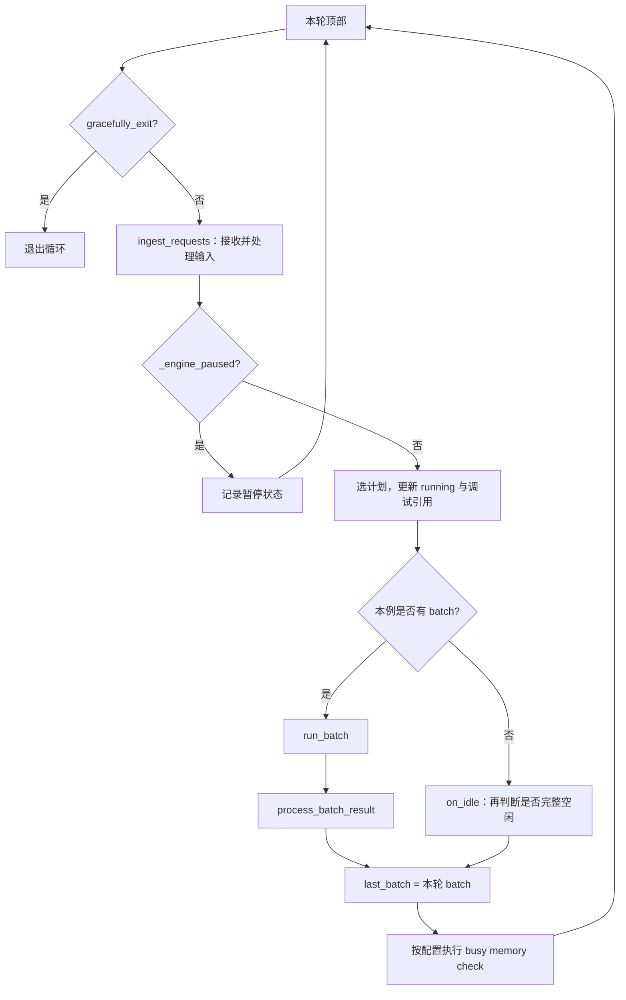

# Normal Event Loop 与调度主循环

阶段 02 从一条请求往前追。现在换一个视角：Scheduler 像一位不断查看待办、安排本轮工作、接收工作结果的值班人员。它不是从接到 R1 起就只围着 R1 转；每轮都要重新处理输入、运行集合和控制状态。

本文属于**源码分析型学习资料**，是系列第 **03-01** 篇。先固定普通事件循环，读懂一次迭代的入口、状态写入和分支，再为连续批处理、预算与 Overlap 建立共同坐标。

## 0. 阅读基线与范围

| 项目 | 内容 |
| --- | --- |
| 源码路径基准 | SGLang 仓库根目录 `.`；所有源码位置均用仓内相对路径 |
| 分支 | `codex/sglang-source-study-20260909`，基于官方 `main` |
| commit | `72d5c5bb73cadd7ffbf5114e5f81e29d36b6c61a` |
| 读取日期 | `2026-09-09` |
| 工作区状态 | 学习源码 worktree 干净；原源码工作区与 Wiki 既有内容保留 |
| 操作边界 | 静态阅读循环选择、输入处理、普通执行与结果分发、暂停/退出和空闲路径；一份空闲负载单测仅阅读 |
| 前置 | [CLI 到服务启动](../01-getting-started/03-从CLI到服务进程启动.md)、[Req 与 Batch](../02-request-lifecycle/03-Req与多种Batch对象的分工.md)、[完成与取消](../02-request-lifecycle/06-完成取消与资源释放.md) |
| 主线条件 | Python HTTP 服务、普通文本生成、单实例、TP/PP/DP 均为 1；无 PD/PDMux、Overlap/MLX overlap、投机或 Beam |
| R1 条件 | 输入 8 个 token、生成 3 个；预算足够、一次完整 Prefill；普通 KV 路径，无 HiSparse/HiCache 异步工作、其他请求、暂停、延迟准入、分块、提前 stop 或模型特例 |
| 不展开 | 连续五轮多请求组批在 03-02；排序与预算在 03-03；Chunked Prefill 与 Overlap 在 03-04、03-05 |

本文图表是**整理者的教学抽象**。固定源码支持的事实、教学推演和运行观察分别看待；本次没有启动服务、执行模型、采集 trace 或运行所列测试。

## 1. Event Loop 负责什么

**人话版：** 一轮调度先看新消息，再决定“这一轮做哪批工作”，之后接着处理这批工作的结果。如果这一轮没有可执行工作，还要确认系统是不是确实没事可做，而不是有任务暂时卡在某个条件上。

| 名称 | 在这条主线里的职责 |
| --- | --- |
| `run_event_loop` | 准备调度 stream 等运行环境，再分发到实际循环 |
| `dispatch_event_loop` | 根据分离模式、PP、PDMux、Overlap 等选择循环，不替某条请求选择 batch |
| `event_loop_normal` | 普通同步 Python 调用顺序：收输入、选批、运行、处理结果、更新上一批 |
| `ingest_requests` | 汇合本轮外部消息与相关本地控制消息，交给输入处理 |
| `get_next_batch_to_run` | 更新调度状态，返回执行对象与后续保留的 running 集合 |
| `run_batch` | 把已选 batch 交给执行路径，取得本轮结果 |
| `process_batch_result` | 根据 forward mode 更新请求/资源/输出及相关观测 |
| `on_idle` | 处理没有执行 batch 的情况，内部再区分停滞与完整空闲 |

这里的 event loop 是 Scheduler 的 `while True` 控制循环，函数不是 `async def`；它与 HTTP/TokenizerManager 中的 asyncio 等待循环是不同层次。进程启动代码调用 `scheduler.run_event_loop()` 后留在该循环中，直到退出或异常路径。[S01][S02]

## 2. 先确定真正进入哪个循环

`dispatch_event_loop` 是模块级函数，不是 `Scheduler.dispatch_event_loop` 方法。先看 disaggregation mode，再看各分支条件。[S03]

| 分离模式 | 该模式下的优先选择顺序 | 最后的普通分支 |
| --- | --- | --- |
| NULL，未分离 | PDMux → PP>1 → MLX overlap → 通用 overlap | `event_loop_normal` |
| PREFILL | PP>1 → 通用 overlap | `event_loop_normal_disagg_prefill` |
| DECODE | PP>1 → 通用 overlap | `event_loop_normal_disagg_decode` |

“优先顺序”来自 if/elif 的先后，不表示这些配置任意组合都受支持。参数解析和校验可能早已调整或拒绝某些组合，参见[配置解析篇](../01-getting-started/04-从参数声明到最终生效配置.md)。

因此不能看到 `disable_overlap_schedule=True` 就断言必然进入本篇：PP 或 PD 仍可能选中其他循环。反过来，选择普通循环的这段代码没有要求 TP=1；本篇单卡只是教学条件，普通循环也不能简单翻译成“单卡模式”。[S03]

Scheduler 初始化时从生效配置计算 `enable_overlap` 与 `enable_overlap_mlx`。本文固定它们关闭，而不声称普通循环就是所有部署的默认路径。[S04]

## 3. 一轮代码骨架与状态写入

### 3.1 保留关键顺序的教学摘写

下面省略指标和装饰器，保留普通循环的控制顺序；完整代码见固定入口。[S02]

```python
while True:
    if self.gracefully_exit:
        break

    self.ingest_requests()
    if self._engine_paused:
        self._record_scheduler_state_for_paused_engine()
        continue

    plan = self.get_next_batch_to_run(self.running_batch, self.last_batch)
    self.running_batch = plan.running_batch
    batch = plan.batch_to_run
    self.cur_batch_for_debug = batch

    if batch:
        result = self.run_batch(batch)
        self.process_batch_result(batch, result)
    else:
        self._sched_idled = True
        self.on_idle()

    self.last_batch = batch
```

**先看两个赋值：** running_batch 从计划中更新，last_batch 在本轮结果/空闲处理之后才更新。这两个字段承担不同时间位置的工作，不能用“当前 batch”统一代称。

### 3.2 几份状态的所有者与含义

| 状态 | 初始值或含义 | 主要变化位置 |
| --- | --- | --- |
| `waiting_queue` | Scheduler 的等候 Req 列表，初始为空 | 输入 handler、准入、回撤与取消等路径 |
| `running_batch` | 应保留以继续 Decode 的集合，初始为空 ScheduleBatch | 本轮计划返回值；内部也可过滤/合并或重绑 |
| `last_batch` | 上一轮实际选中的 batch，初始 None | 每轮末尾赋为本轮 batch，包括 None |
| `plan.batch_to_run` | 这轮交给 run_batch 的对象 | 选批返回；不必与 running_batch 相同 |
| `cur_batch_for_debug` | 本轮选中对象的调试引用 | 选批后赋值，不是额外调度队列 |
| `forward_ct` | run_batch 被调用时增加的执行计数 | 不在每次 while 迭代都增加，也不是 token 个数 |
| `_engine_paused` | 暂停调度执行的状态 | 控制 handler 可改变；循环按它决定是否继续选批 |
| `gracefully_exit` | 循环顶部检查的退出标志 | shutdown handler 设置；完整服务退出在后续专题展开 |

初始状态见 `init_running_status`。[S05] `NextBatchPlan` 只携带两个 batch 引用，不会自动深拷贝。一个 Req 也可能同时被多个历史/运行容器引用，相关区别已在[02-03](../02-request-lifecycle/03-Req与多种Batch对象的分工.md)说明。

### 3.3 从图上看暂停与空闲的位置



**图意解读：** 方框是同一个 Scheduler 循环里的调用位置，不是进程或独立线程。暂停时仍先 ingest，所以控制消息仍有处理机会；暂停 continue 分支本身不会执行本轮选批、普通 on_idle 或末尾 last_batch 赋值。控制 handler 自己是否改变状态，仍要看其具体模式。[S02]

退出检查在循环顶部。若 shutdown 消息在 ingest 中才设置标志，代码没有立即在该位置重新检查并 break；不能把“处理了 shutdown”解释成当场中断当前执行路径。[S02][S19]

## 4. 接收输入不等于接纳进 GPU batch

### 4.1 ingest 汇合本轮输入

`ingest_requests` 在指定入口 rank 产生 timeout AbortReq，再调用 `request_receiver.recv_requests(local_reqs=...)`，最后统一交给 `process_input_requests`。前面章节中的取消输入由这条路径进入主循环，不是另一个线程随时修改所有 batch。[S06]

`SchedulerRequestReceiver` 的普通接收流程包括：按条件跳过接收、拉取原始消息、输入 blocker、相关 rank 广播、解包、多模态处理与共享输入收尾。本篇只选普通文本、无特殊 blocker 的路径；详细消息边界见[02-02](../02-request-lifecycle/02-Tokenizer与进程间消息通路.md)。[S07]

单入口的 ZMQ 拉取使用 NOBLOCK，先取 Tokenizer 消息，再取 RPC；达到接收数量限制或捕获 ZMQError 时停止当前拉取。`max_recv_per_poll` 检查的是已经收到的消息列表长度，不能直接当成 GPU batch size，批消息内部还可能有多个请求。[S07]

这里的非阻塞只描述 socket 拉取。输入 handler、广播、grammar 等其他调用仍各有成本；不能把整个 ingest 概括成无等待、无开销。

### 4.2 不同消息交给不同 handler

`process_input_requests` 先处理会话回收等工作，再逐条调用类型分发器。分发表包括普通生成、embedding、批量输入，以及取消、缓存控制、暂停/继续和 shutdown 等控制类型。[S08][S25]

| 消息/动作 | 可能直接改变什么 | 不应直接推断什么 |
| --- | --- | --- |
| 普通生成输入 | 建立 Req，进入对应等待/准备路径 | 本轮一定被选中执行 |
| AbortReq | 移出某些队列或登记 to_finish 等 | 当前所有 GPU 工作立即终止 |
| 暂停/继续控制 | 调整引擎控制状态 | 每条控制消息都产生一个模型 batch |
| 带返回对象的控制 handler | 通过对应通道发送控制回复 | 控制回复等于模型生成结果 |

循环还在输入处理尾部检查 pending flush、相关外部 corpus 加载等工作。空的本轮接收列表，也不意味着这段函数没有任何维护职责。[S08]

## 5. 选批是一段状态变换

`get_next_batch_to_run` 不是读取几个列表后返回最大值的纯函数。它会处理待取消 chunk、整理上一轮 Extend 结果、过滤成员、合并运行请求，再决定本轮是否可以执行新 Prefill。[S09]

在本篇普通条件下，可先抓住下面三步：

1. 上一批是 Extend 时，过滤已结束/需要排除的成员，把可继续生成的请求并入 running_batch。
2. 尝试准备 Prefill；若得到 new_batch，本轮优先选它。
3. 若没有新的 Prefill，且有可继续的普通 running 请求，则更新 Decode batch；没有工作时返回 None。

“若得到 Prefill 就先运行”不等于所有等待请求无条件抢在 Decode 前面。`_should_defer_prefill`、准入预算、空闲请求槽位、prefill delayer 等可以影响能否取得新 batch；完整排序、准入与节奏由后续篇分别展开。[S09][S10]

函数末尾还会经过 DP attention 的同步/模式转换等适配，再返回 `NextBatchPlan(batch_to_run=ret, running_batch=running_batch)`。这些特殊分支可以重绑对象，不能把本例“本轮 Decode 就是 running 对象”写成整个函数的永恒约束。[S09]

**None 与空 ScheduleBatch 也要分开。** 本例用 None 表示没有执行批，成员数量则通过 `batch.is_empty()` 检查。循环里的 `if batch` 不是显式的 `batch_size()>0` 校验；其他模式还有 ForwardMode.IDLE 的结果分发路径，不能把它与根本没有 batch 的 on_idle 分支混为一谈。[S02][S11]

## 6. 执行与结果处理怎样接上

### 6.1 run_batch 接手已经选好的工作

可以把选批理解为“把本轮工作单整理好”，run_batch 则负责交给计算执行路径。它一进入就增加 `forward_ct`，给 batch 记录 `forward_iter`、启动时间和是否经过无批次间隔，再进入具体 forward 分支。因此 forward_ct 是该入口的调用计数，不能直接当作 while 迭代数、GPU kernel 数或全局输出 token 数。[S12]

在本文无 Overlap、无投机、无 PDMux 的普通生成分支中，顺序如下：

1. `resolve_forward_inputs(batch, self.future_map)` 准备执行输入。
2. `model_worker.forward_batch_generation(batch, ...)` 调用模型执行路径。
3. 结果包含采样 token 时，通过 `_relay_forward_payload` 放入后续输入接力通路，并把 `batch.input_ids` 置为 None，供下一轮重新准备。
4. 处理相应缓存扩展钩子、辅助输出和结果元信息，返回 GenerationBatchResult。[S12]

**这个版本的普通分支同样使用 future_map。** 不能仅看到 future 一词就断言走了 Overlap；应先确认循环分发、enable_overlap 条件和具体调用位置。下一轮输入接力与 CPU 上 Req.output_ids 的推进，也属于两个不同边界，参见[逐轮生成篇](../02-request-lifecycle/04-一次Prefill到多轮Decode.md)。

“普通同步循环”在本篇指 Python 中 run_batch 返回后，同轮继续调用结果处理。它不能证明每个底层 GPU API 都阻塞 CPU，也不能用来估算 CPU/GPU 时间重叠比例；这些判断需要继续读 stream/event 依赖或采集实际 trace。本文不把普通循环画成所有设备操作都逐条阻塞的时间线。

### 6.2 process_batch_result 按执行模式交接

`process_batch_result` 开头先 flush trace 操作，调用负载快照与负载发布入口，再根据 forward mode 分派结果处理。[S13]

| batch 的模式/条件 | 结果处理位置 | 本篇如何使用 |
| --- | --- | --- |
| Decode | `batch_result_processor.process_batch_result_decode` | 推进普通后续 token、结束判断与资源/输出收尾 |
| Extend，普通生成 | `batch_result_processor.process_batch_result_prefill` | 完整 Prefill 结果在这里推进首个输出 |
| Extend，DLLM 或 PD Prefill | 各自的专用处理分支 | 不代入本篇逐轮例子 |
| Prebuilt | `process_batch_result_prebuilt` | 不是本篇一次普通模型生成 |
| IDLE | `process_batch_result_idle` | 存在 batch 的模式分派；不同于 batch=None 时的 on_idle |

随后还有 step 计数、batch 指标、可选 forward 指标、多模态输入清理、健康信号和设备计时等工作。Req 的输出、完成状态与 KV 交接细节已在[02-04](../02-request-lifecycle/04-一次Prefill到多轮Decode.md)和[02-06](../02-request-lifecycle/06-完成取消与资源释放.md)展开，本篇把它们放回同一轮的位置。

负载发布调用发生在本轮逐 Req 结果更新之前，这一点会影响读取快照时的解释；且 publish_load_snapshot 自己还受 writer 是否存在、调用间隔及异常分支约束。不能把“进入 process_batch_result”当成“全部输出已经送达客户端”或“每次一定写出一份快照”。[S13][S23]

## 7. 用 R1 填写四轮调度账本

### 7.1 先固定观察位置

沿用 R1 的 8 个输入 token 和 3 个输出 token。输出记作 y0、y1、y2，只是教学标签；没有实际分词或执行模型。本节保留第 0 节全部条件，并假设最初系统没有其他工作、`forward_ct=0`。

为便于观察，把第一次 Prefill 的 ScheduleBatch 暂记为 BP，把继续 Decode 的运行对象记为 R。BP/R 是说明对象用途的教学名字，**不保证代表两个独立实例**：空 running 接收上轮 Extend 时，可以直接指向上一批对象，随后原地准备 Decode。[S09]

下表的“轮末”是本轮结果处理和 `last_batch=batch` 都完成之后；第 4 轮的 Req 已在选批过程中从运行集合滤掉。

| 循环轮次 | 本轮 ingest 与选批 | 本轮计算输入/结果 | 轮末 running 与 last | forward_ct |
| --- | --- | --- | --- | ---: |
| 1 | 接收 R1，完成普通准入并选中 BP；此时保留的 running 仍为空 | Prefill 消费 8 个输入，得到 y0；结果处理把 y0 记入请求 | running 空；last 指向含 R1 的 BP | 1 |
| 2 | 无新输入；上一轮 Extend 中的 R1 未结束，转入 running；准备 Decode | 消费 y0，得到 y1 | running=R，含 R1；last=R | 2 |
| 3 | 无新输入；更新 R 的 Decode 输入 | 消费 y1，得到 y2；达到本例 3 token 上限，登记结束并走资源/输出收尾 | running 与 last 仍可指向含已结束 R1 的 R；尚未到下一轮 filter | 3 |
| 4 | 无新输入；更新 running 时滤掉已结束 R1；无新 Prefill、无剩余 Decode，得到 None | 不调用 run_batch；进入 on_idle，按本例条件得到完整空闲 | running 空；轮末 last=None | 3 |

**图表的关键读法：** 输出 3 个 token 用了 1 次 Prefill 加 2 次 Decode。这里展示 4 次 while 迭代，是为了把下一轮过滤与空闲检查也纳入观察；第 4 轮没有模型执行。不能把“3 个输出”机械改写成“3 次 Decode”。[S02][S09][S12]

### 7.2 为什么第 4 轮能完整空闲

on_idle 执行时，末尾的 `last_batch=None` 还没有发生。但第 3 轮 last 指向同一个运行对象 R；第 4 轮选批已经原地过滤它的已结束成员，所以 last 引用所见的 R 也可以为空。is_fully_idle 检查的是当下对象内容，不是一份冻结在上轮末尾的历史快照。[S09][S15]

这也解释了为什么排查时应记录“哪个时点看到了哪些成员”，而不是仅打印一个 Python 对象地址：同一个对象地址可以在下一轮拥有不同 reqs、forward mode 和输入字段。若要保留历史，应记录当时需要的字段值；引用本身不能代替快照。

### 7.3 如果新请求在计算中到达

在本普通循环里，处理外部输入的下一次机会位于后续 ingest。R2 即使已经到达 socket，也不会凭空加入已经交给 run_batch 的本轮工作单。下一次 ingest、选批是否接纳它，还受接收、预处理、排序与预算等条件影响。[S02][S07][S09]

这是控制顺序的源码事实，不是“最多等一轮就一定执行”的延迟承诺。一次循环耗时也不固定：输入处理、选批、模型执行、结果处理和维护均可能影响它。下一篇会把 R2 与 R3 加入状态表，观察连续批处理。

## 8. 没有 batch，为什么还可能忙

### 8.1 on_idle 先分清两种情况

**人话版：** “这一轮没安排工作”有两种原因：所有事情都完成了，或者仍有人等着但暂时安排不了。on_idle 必须分清两者，后续维护行为才有意义。[S14]

| 条件 | 源码行为 | 不能由此得出的结论 |
| --- | --- | --- |
| `is_fully_idle()` 为 False | 记录 active；按墙钟时间门限发布停滞负载；随后返回 | 没有 batch 就表示无请求，或者必然应进入 sleep |
| `is_fully_idle()` 为 True | 记录 idle，执行适用的池/缓存检查、指标、事件发布、比例重置与可选等待 | active KV 必然全部清空，或者所有 GPU/网络生命周期都已证明安全 |

普通循环在调用 on_idle 之前就把 `_sched_idled=True`。这个标志因此记录“经过无 batch 分支”，其含义比完整空闲宽；下一次 run_batch 把它带入 `batch.after_idle_gap`，随后清回 False。[S02][S12]

### 8.2 完整空闲检查的是一组状态

本篇普通条件下，要关注 running 是否为空、chunked_req 是否为 None、DLLM staging 是否为空、last 是否 None/空、waiting_queue 和 grammar_queue 是否为空。is_fully_idle 还为开启的功能检查其他状态。[S15]

| 功能范围 | 额外检查的代表状态 | 本篇边界 |
| --- | --- | --- |
| Overlap | result_queue 是否为空 | 后续结果还没处理，不能只看 waiting |
| PP | running_mbs 与 mbs 是否排空 | 多 microbatch 的引用不由单个 running 概括 |
| PD | 对应 bootstrap、inflight、prealloc、retracted、transfer 或 offload 队列 | 这里仅定位空闲门槛，协议生命周期留到阶段 07 |
| HiSparse / HiCache | staging、回写、回载及相关存储流水线 | 队列暂时没有可执行 batch，不代表异步工作已退役 |

`for_health_check=True` 还会改变部分判断范围，所以健康信号的空闲判断与维护使用的默认完整空闲判断不能直接互换。完整函数应在对应功能章节继续复核，不能由本篇普通条件推出所有组合的正确性。[S15]

### 8.3 停滞时的负载更新有时间门限

在非完整空闲的分支，on_idle 比较当前 monotonic 时间与 `_last_stall_publish_ts`。相隔至少 `LOAD_STALL_REFRESH_S` 才调用两路负载发布；当前常量为 0.05 秒。该值控制这条停滞路径的发布频率下限，不是请求 SLA，也不保证路由侧严格每 50 ms 收到一次新数据。[S14]

这里可能反复进入 on_idle，却不走本函数末尾的 sleeper。排查“没有 forward、CPU 仍活跃”时，先看 is_fully_idle 的具体失败项；不能单凭函数名判断它已经进入真正的休眠状态。

### 8.4 真正空闲后的检查与重置

完整空闲路径会在条件满足时尝试 Unified Memory 的 opportunistic flush，并核对池、请求行和字节账目；HiSparse 与 PD deferred release 等条件影响部分检查是否执行。树结构检查也有自己的开关与实现条件。[S14][S16]

检查失败的处理由相应 strict 配置及 `raise_error_or_warn` 决定，可能抛异常或按规则记录告警。这里的账目检查能帮助定位特定不变量，不能替代正确性测试或跨设备资源复用验证。[S16][S24]

`new_token_ratio_tracker.reset()` 把调度估算比例恢复到初始化值。它不是“清空 KV Cache”的接口；reset 到底改变哪个字段，要回到被调用对象的方法确认。[S20]

### 8.5 可选等待也有入口条件

普通 Python 接收路径的 IdleSleeper 只在指定入口 rank、开启 `sleep_on_idle` 等条件下创建；maybe_sleep_on_idle 还要确认 sleeper 存在才调用它。[S17]

IdleSleeper 对输入 socket 注册 ZMQ POLLIN，执行 `poller.poll(1000)`。1000 是毫秒超时参数，socket 可读会让等待提前返回；不能描述成每条新请求固定额外等待 1 秒。它还可能按 `SGLANG_EMPTY_CACHE_INTERVAL` 调用平台的 empty_cache，具体平台内存行为不在本篇展开。[S18]

## 9. 暂停、退出与观测的三个边界

**暂停仍会先处理输入。** `_engine_paused` 在 ingest 之后才检查，这让继续、取消或其他控制消息仍有处理机会。暂停分支记录当前 active/idle 状态后直接 continue；它没有执行普通 no-batch 分支的整套维护，也不能凭“paused”推断所有运行资源都已释放。[S02]

**shutdown 设置标志与离开循环是两个位置。** handler 设置 gracefully_exit，普通循环下一次顶部检查才 break。若它在本轮 ingest 中设置，随后是否还选批、执行结果处理或走空闲，要按本轮剩余分支分析。完整 HTTP 服务及子进程的退出不由这一处标志单独证明。[S02][S19]

**阶段耗时与设备耗时分开。** SchedulerStageMetricsRecorder 通过 monotonic_ns 记录当前互斥阶段经过的墙钟时间，进入子阶段会切换记账，退出时恢复。这个统计描述调度调用位置上的经过时间；它不是 CPU 利用率，也不是单个 GPU kernel 的执行时间。要解释性能，应把阶段统计、请求时间点和设备 trace 的口径对齐。[S22]

## 10. 小白排障地图与现有测试边界

### 10.1 从现象回到本轮位置

| 看到的现象 | 先查什么 | 本篇能给出的判断 |
| --- | --- | --- |
| 关闭 overlap 后仍没进入普通循环 | 生效 PD、PP、PDMux 与 dispatch 顺序 | 关闭一个开关不足以固定最终路径 |
| 收到了消息，却没进入 GPU batch | 输入处理是否完成；本轮计划是否包含目标 rid | ingress、waiting 与 admission 是不同位置 |
| 新 Prefill 经常先于已有 Decode | 是否实际形成 new_batch；是否受延迟或预算门限影响 | 分支优先级存在，但不能推成所有等待都无条件优先 |
| batch=None，但负载或 CPU 仍活跃 | is_fully_idle 的失败项与停滞发布分支 | 无可执行批不同于完整空闲 |
| paused 时仍看到消息处理 | ingest 在 paused 检查之前 | 不能把暂停执行等同于停止所有控制输入 |
| 最后一次生成完成后，last 还含该 Req | 观察时点是否在下一次 filter 之前 | finished、资源交接和容器移出分步发生 |
| 同一个 last 引用内容变了 | running/last 是否别名；选批是否原地改成员 | 引用不是历史快照 |
| 出现 future_map，以为配置失效 | 检查普通 run_batch 分支也有的 relay/resolve | future_map 存在不能单独证明 Overlap |
| 调度计数与 token 数或客户端块数不同 | 分开 loop、run_batch、每 Req 输出与 SSE | 它们没有通用一一对应关系 |

上述是静态排查路线，没有据此修改服务、重启实例或验证故障。

### 10.2 本次只阅读的一份单元测试

`test/registered/unit/managers/test_scheduler_on_idle_load.py` 为非完整空闲路径构造 Scheduler 空对象，以 Mock 替代协作者，并控制 monotonic 时间。[S21]

| 测试情形 | 断言的局部行为 | 未证明的内容 |
| --- | --- | --- |
| 时间固定在 100.0，连续调用 on_idle 100 次 | 快照发布与 load publisher 各调用一次 | 实际循环速度、CPU 功耗或路由收包间隔 |
| 时间从 100.0 推进到 100.10 | 快照发布累计两次 | 实际 GPU、网络负载、完整空闲池检查 |

这些测试说明仓库为停滞发布门限设置了断言入口；**本次未执行测试**。测试中的 100 次调用是 Mock 场景，不能把它写成实际服务测得的 100 次循环或性能结果。

## 11. 回源码的最短路线

先按“选循环 → 普通轮次 → 输入 → 计划 → 执行 → 结果 → 空闲”阅读。下表路径全部以 **SGLang 仓库根目录**为起点；固定 commit 链接用于跨机器复查。

| 要回答的问题 | 仓内路径与符号 | 固定入口 |
| --- | --- | --- |
| 子进程在哪里进入调度？ | `python/sglang/srt/managers/scheduler.py::run_scheduler_process` | [进程入口][S01] |
| stream 与实际循环怎样交接？ | `python/sglang/srt/managers/scheduler.py::Scheduler.run_event_loop` | [运行环境][S26] |
| 选哪个事件循环？ | `python/sglang/srt/managers/scheduler.py::dispatch_event_loop` | [分发][S03] |
| 一轮的顺序与赋值？ | `python/sglang/srt/managers/scheduler.py::Scheduler.event_loop_normal` | [普通循环][S02] |
| 新消息怎样进入？ | `python/sglang/srt/managers/scheduler.py::Scheduler.ingest_requests` | [接收汇合][S06] |
| 收消息与分派的边界？ | `python/sglang/srt/managers/scheduler_components/request_receiver.py::SchedulerRequestReceiver.recv_requests`；`python/sglang/srt/managers/scheduler.py::Scheduler.process_input_requests` | [接收][S07]、[处理][S08] |
| 怎么取得下一轮计划？ | `python/sglang/srt/managers/scheduler.py::Scheduler.get_next_batch_to_run` | [计划][S09] |
| 计划包含哪些对象？ | `python/sglang/srt/managers/schedule_batch.py::NextBatchPlan` | [数据结构][S27] |
| 从 batch 到结果？ | `python/sglang/srt/managers/scheduler.py::Scheduler.run_batch` | [执行][S12] |
| 结果按什么分类？ | `python/sglang/srt/managers/scheduler.py::Scheduler.process_batch_result` | [结果分发][S13] |
| 无批次之后做什么？ | `python/sglang/srt/managers/scheduler.py::Scheduler.on_idle`；`python/sglang/srt/managers/scheduler.py::Scheduler.is_fully_idle` | [维护][S14]、[判断][S15] |
| 等待如何被输入唤醒？ | `python/sglang/srt/managers/scheduler_components/idle_sleeper.py::IdleSleeper.maybe_sleep` | [可选等待][S18] |
| 比例 reset 改了什么？ | `python/sglang/srt/managers/scheduler_components/new_token_ratio_tracker.py::NewTokenRatioTracker.reset` | [单字段重置][S20] |
| 池检查异常如何处理？ | `python/sglang/srt/managers/scheduler_components/invariant_checker.py::SchedulerInvariantChecker._report_leak` | [检查与处理][S16] |
| 阶段时间如何记账？ | `python/sglang/srt/observability/scheduler_stage_metrics.py::SchedulerStageMetricsRecorder` | [墙钟阶段统计][S22] |

## 12. 自测、验收与下一篇

合上源码后，尝试回答以下问题：

1. 本轮收到了 R2，但 plan.batch_to_run 没有 R2，是否一定是错误？
2. R1 输出 3 个 token，为什么表中有 4 次循环，forward_ct 却只增加 3？
3. batch=None 时，哪些状态会阻止完整空闲？这时是否必然 sleep？
4. paused 分支会不会继续接收控制输入？last_batch 在该分支是否总被清空？
5. 为什么普通循环中的 future_map，以及阶段耗时中的较长时间，都不能单独证明 Overlap 已开启？

<details>
<summary>参考答案与验收要点</summary>

1. 不一定。接收/预处理与准入不同；需要看等待路径、本轮预算、延迟条件和实际选择。
2. 第 1 轮 Prefill 产生 y0，第 2、3 轮 Decode 产生 y1、y2，第 4 轮过滤完成请求并检查空闲，没有 run_batch。
3. 代表条件包括 waiting/grammar、chunk、尚未处理的 batch/result 或启用功能的异步队列。非完整空闲分支发布受门限约束的负载后返回，不执行 on_idle 末尾 sleeper。
4. 会先 ingest。continue 分支自身跳过选批、普通 on_idle 和末尾 last 赋值；handler 对状态的修改需按其实现另看。
5. 该版本普通执行也用 future_map 做输入接力；阶段时间是相应调用阶段的墙钟记账。真正的循环选择与 CPU/GPU 依赖要回到配置、dispatch 和 stream/event 路径。

能按第 7 节的观察位置独立重画 R1 状态表，并把每一步定位到第 11 节入口，即达到本篇的静态学习验收标准。

</details>

本篇已核对控制顺序、代表状态变换、源码符号和文档导航；没有运行 SGLang、模型、性能实验或所列单元测试。Mermaid 按代码和文字静态核对，未做渲染验证。

下一篇为 [03-02《连续批处理与队列状态》](02-连续批处理与队列状态.md)，将加入 R2/R3，把 waiting、running、last 与 chunk 的变化展开为多请求账本。返回[系列目录](../README.md)或查看[学习进度](../appendices/06-学习进度与版本变更记录.md)。

[S01]: https://github.com/sgl-project/sglang/blob/72d5c5bb73cadd7ffbf5114e5f81e29d36b6c61a/python/sglang/srt/managers/scheduler.py#L5744
[S02]: https://github.com/sgl-project/sglang/blob/72d5c5bb73cadd7ffbf5114e5f81e29d36b6c61a/python/sglang/srt/managers/scheduler.py#L1893
[S03]: https://github.com/sgl-project/sglang/blob/72d5c5bb73cadd7ffbf5114e5f81e29d36b6c61a/python/sglang/srt/managers/scheduler.py#L5646
[S04]: https://github.com/sgl-project/sglang/blob/72d5c5bb73cadd7ffbf5114e5f81e29d36b6c61a/python/sglang/srt/managers/scheduler.py#L481
[S05]: https://github.com/sgl-project/sglang/blob/72d5c5bb73cadd7ffbf5114e5f81e29d36b6c61a/python/sglang/srt/managers/scheduler.py#L1256
[S06]: https://github.com/sgl-project/sglang/blob/72d5c5bb73cadd7ffbf5114e5f81e29d36b6c61a/python/sglang/srt/managers/scheduler.py#L2050
[S07]: https://github.com/sgl-project/sglang/blob/72d5c5bb73cadd7ffbf5114e5f81e29d36b6c61a/python/sglang/srt/managers/scheduler_components/request_receiver.py#L89
[S08]: https://github.com/sgl-project/sglang/blob/72d5c5bb73cadd7ffbf5114e5f81e29d36b6c61a/python/sglang/srt/managers/scheduler.py#L2070
[S09]: https://github.com/sgl-project/sglang/blob/72d5c5bb73cadd7ffbf5114e5f81e29d36b6c61a/python/sglang/srt/managers/scheduler.py#L3499
[S10]: https://github.com/sgl-project/sglang/blob/72d5c5bb73cadd7ffbf5114e5f81e29d36b6c61a/python/sglang/srt/managers/scheduler.py#L3693
[S11]: https://github.com/sgl-project/sglang/blob/72d5c5bb73cadd7ffbf5114e5f81e29d36b6c61a/python/sglang/srt/managers/schedule_batch.py#L2424
[S12]: https://github.com/sgl-project/sglang/blob/72d5c5bb73cadd7ffbf5114e5f81e29d36b6c61a/python/sglang/srt/managers/scheduler.py#L4199
[S13]: https://github.com/sgl-project/sglang/blob/72d5c5bb73cadd7ffbf5114e5f81e29d36b6c61a/python/sglang/srt/managers/scheduler.py#L4548
[S14]: https://github.com/sgl-project/sglang/blob/72d5c5bb73cadd7ffbf5114e5f81e29d36b6c61a/python/sglang/srt/managers/scheduler.py#L4675
[S15]: https://github.com/sgl-project/sglang/blob/72d5c5bb73cadd7ffbf5114e5f81e29d36b6c61a/python/sglang/srt/managers/scheduler.py#L4762
[S16]: https://github.com/sgl-project/sglang/blob/72d5c5bb73cadd7ffbf5114e5f81e29d36b6c61a/python/sglang/srt/managers/scheduler_components/invariant_checker.py#L439
[S17]: https://github.com/sgl-project/sglang/blob/72d5c5bb73cadd7ffbf5114e5f81e29d36b6c61a/python/sglang/srt/managers/scheduler.py#L844
[S18]: https://github.com/sgl-project/sglang/blob/72d5c5bb73cadd7ffbf5114e5f81e29d36b6c61a/python/sglang/srt/managers/scheduler_components/idle_sleeper.py#L35
[S19]: https://github.com/sgl-project/sglang/blob/72d5c5bb73cadd7ffbf5114e5f81e29d36b6c61a/python/sglang/srt/managers/scheduler.py#L5607
[S20]: https://github.com/sgl-project/sglang/blob/72d5c5bb73cadd7ffbf5114e5f81e29d36b6c61a/python/sglang/srt/managers/scheduler_components/new_token_ratio_tracker.py#L37
[S21]: https://github.com/sgl-project/sglang/blob/72d5c5bb73cadd7ffbf5114e5f81e29d36b6c61a/test/registered/unit/managers/test_scheduler_on_idle_load.py#L22
[S22]: https://github.com/sgl-project/sglang/blob/72d5c5bb73cadd7ffbf5114e5f81e29d36b6c61a/python/sglang/srt/observability/scheduler_stage_metrics.py#L56
[S23]: https://github.com/sgl-project/sglang/blob/72d5c5bb73cadd7ffbf5114e5f81e29d36b6c61a/python/sglang/srt/managers/scheduler.py#L860
[S24]: https://github.com/sgl-project/sglang/blob/72d5c5bb73cadd7ffbf5114e5f81e29d36b6c61a/python/sglang/srt/utils/common.py#L4802
[S25]: https://github.com/sgl-project/sglang/blob/72d5c5bb73cadd7ffbf5114e5f81e29d36b6c61a/python/sglang/srt/managers/scheduler.py#L1711
[S26]: https://github.com/sgl-project/sglang/blob/72d5c5bb73cadd7ffbf5114e5f81e29d36b6c61a/python/sglang/srt/managers/scheduler.py#L1839
[S27]: https://github.com/sgl-project/sglang/blob/72d5c5bb73cadd7ffbf5114e5f81e29d36b6c61a/python/sglang/srt/managers/schedule_batch.py#L3725
