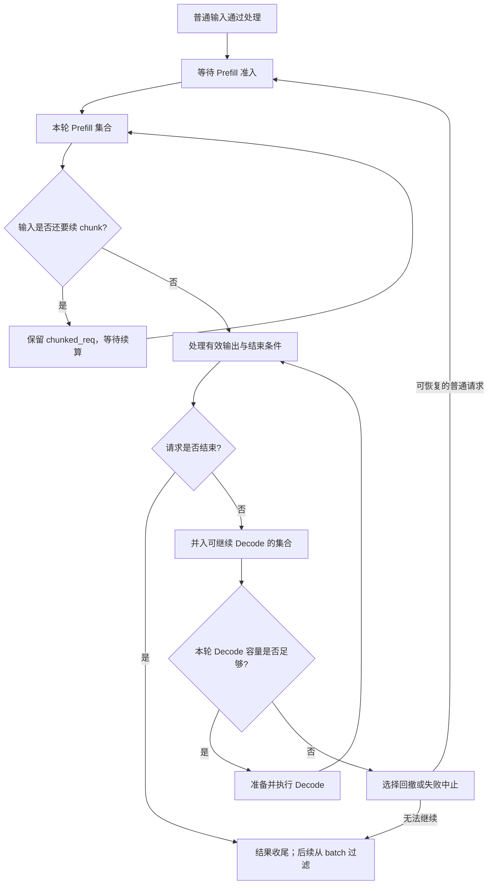

# 连续批处理与队列状态

上一篇从一轮调度循环看执行顺序。这一篇把时间拉长：R1 还没生成完，R2 到了；R1、R2 都在继续生成时，长输入 R3 又来了。Scheduler 怎样接纳新请求，又怎样保留旧请求的进度？

本文属于**源码分析型学习资料**，是系列第 **03-02** 篇。重点是请求集合与对象状态怎样跨轮变化。排序、预算和 Overlap 各有后续专篇，这里先用普通循环建立可以逐格复查的账本。

## 0. 阅读基线与范围

| 项目 | 内容 |
| --- | --- |
| 源码路径基准 | SGLang 仓库根目录 `.`；下文源码路径均为仓内相对路径 |
| 分支 | `codex/sglang-source-study-20260909`，基于官方 `main` |
| commit | `72d5c5bb73cadd7ffbf5114e5f81e29d36b6c61a` |
| 读取日期 | `2026-09-09` |
| 工作区状态 | 学习源码 worktree 干净；原源码与 Wiki 既有内容保留 |
| 操作边界 | 静态阅读选批、入队、成员过滤/合并、分块交接与回撤；两份相关单测仅阅读 |
| 前置 | [Req 与 Batch 对象](../02-request-lifecycle/03-Req与多种Batch对象的分工.md)、[逐轮生成](../02-request-lifecycle/04-一次Prefill到多轮Decode.md)、[普通调度循环](01-NormalEventLoop与调度主循环.md) |
| 主线条件 | 普通文本生成、单实例、TP/PP/DP=1；无 PD、PDMux、Overlap、投机、Beam、LoRA、grammar、多模态、会话或混合状态特例 |
| 五轮账本条件 | 无分块和 mixed batch；预算与请求槽位足够，等待上限不拒绝请求；无优先级抢占、prefill delayer、prefill/decode 间隔限制、回撤或提前停止 |
| 单独增加的变化 | 第 7 节只增加 R3 分块；第 8 节只增加普通 Decode 回撤；不把所有变化同时代入主表 |
| 不展开 | 03-03 排序与准入公式；03-04 动态 chunk 与 mixed 输入细节；03-05 Overlap；03-06 回撤策略、背压与饥饿诊断；阶段 04 缓存完整生命周期 |

本文的轮次、请求名和数值是**整理者的教学推演**。没有启动 SGLang、执行模型、运行所列测试或测得吞吐/延迟；源码事实以固定入口为依据。

## 1. 连续批处理到底“连续”在哪里

**人话版：** 一批顾客没有全部离开之前，窗口仍可以接待新顾客。已经接待的人保留进度；新来的先完成自己的准备工作，之后可以和旧顾客一起完成下一步。

这里的“连续”是**在后续调度轮次重新组织可执行请求集合**。它不表示请求可以在一次已经发出的 forward 中途插入，也不表示每个新请求一到达就必然获准运行。在普通循环里，接收、选批、执行和结果处理的位置已经由[03-01](01-NormalEventLoop与调度主循环.md)固定。[S01]

| 术语 | 人话解释 | 本篇需要拆开的边界 |
| --- | --- | --- |
| waiting_queue | 还在等待相应 Prefill 准入的 Req 列表 | 可能包括重新排队的旧请求；不是 GPU 工作队列 |
| running_batch | 保留以继续执行普通 Decode 的调度集合 | 本轮可能选新 Prefill，running 暂时不执行 |
| last_batch | 上一轮实际选中的 batch 引用 | 不是不可变的历史记录，也不是所有未完成请求的合集 |
| chunked_req | Scheduler 当前保留的分块续算请求引用 | 请求可能已离开 waiting，还没进入普通 Decode |
| can_run_list | 本次 PrefillAdder 已接纳的候选集合 | 中间 chunk 也能进入，不能解释成“输入已经全部算完” |
| filter | 按保留成员更新 batch 的行视图与相关状态 | 不等于释放 Req 的所有资源 |
| merge | 把两份集合及相应字段接到一起 | 不会自动去重或复制所有底层 KV |
| retract | 让请求让出执行资源，随后尝试恢复/重算 | 和永久取消不同；部分失败分支会转成 abort |

前三种集合由普通 Scheduler 与 ScheduleBatch 维护。waiting_queue 初始化为列表，running_batch 初始化为空 ScheduleBatch，last_batch 初始为 None。[S02]

## 2. 先画逻辑流，再画真实引用

### 2.1 请求的教学状态图



**图意解读：** 这些方框是教学阶段，不是源码中同名状态枚举，也不是互斥的 Python 容器。一条 Req 可以同时被 last 和 running 引用；中间 chunk 也可能仍被上一轮 batch 引用。箭头表示调度与结果处理的交接，不表示一次赋值就完成所有资源退役。[S03][S04][S08][S12]

从 R 返回 Decode 的箭头也不是每轮必走：如果选出了新 Prefill，普通非 mixed 路径可以先执行新 batch，保留 R 等以后继续。[S03]

### 2.2 真实对象关系不能只画成三条队列

假设 R1 已完成 Prefill，上一轮 batch 为 B1，而 running 还空着。下一轮可直接执行 `running_batch = last_batch`，让 running 指向 B1。之后 B1 准备为 Decode，其 forward_mode 和长度继续变化。[S03]

| 情况 | 对象关系 | 阅读时的影响 |
| --- | --- | --- |
| running 空，上一批有未结束 Extend 请求 | 直接把局部 running 变量绑定到 last 指向的对象 | 没有必然新建一个“Decode 请求副本” |
| running 非空，上一批有可继续的 Extend 请求 | 调用 running.merge_batch(last) | 保留目标 batch 对象，重绑/拼接它的成员与字段 |
| 本轮运行新 Prefill，未混入 Decode | 本轮 batch 与保留的 running 分别承担执行和续跑职责 | 不能用一个 batch size 代表两者 |
| 本轮执行普通 Decode | batch_to_run 通常就是本轮 running 对象 | 轮末 last 也会指向它；后续过滤可改变 last 所见内容 |

`NextBatchPlan` 返回 `batch_to_run` 和 `running_batch`，是为了把这两种职责以及可能发生的重绑都交还给循环。显式传参不使整个决策函数成为纯函数：waiting、chunk、对象字段和辅助组件仍会改变。[S03][S05]

## 3. waiting 怎样减少，又为什么不一定进入 running

### 3.1 普通入队的实际入口

在未分离模式下，`_add_request_to_queue` 先检查优先级和队列上限，进行适用的预取动作，然后 append 到 waiting_queue，并记录等候入口时间与相关调度计数。不同 PD 模式进入专用队列，不能把普通 waiting 的规则直接搬过去。[S06]

“消息已收到”与“进入 waiting”也不等价：输入校验、预处理、grammar 等可能先走其他路径。本篇从普通请求已通过处理开始；完整输入链见[02-02](../02-request-lifecycle/02-Tokenizer与进程间消息通路.md)。

### 3.2 PrefillAdder 先接纳，Scheduler 再更新等待集合

`_get_new_batch_prefill_raw` 先处理相关就绪事件与门限，计算等待顺序，建立 PrefillAdder。已有 chunk 会先尝试续算，再遍历 waiting 中的候选。每个候选要完成下一轮输入准备，再经过 add_one_req 的准入。[S04]

关键更新可缩写为下面几行；这是教学摘写，完整分支见源码：

```python
can_run_list = adder.can_run_list
if len(can_run_list) == 0:
    return None, running_batch

can_run_set = set(can_run_list)
self.waiting_queue = [x for x in self.waiting_queue if x not in can_run_set]
```

**减少的是已被这次接纳的成员。** 没被接纳的请求仍留在 waiting；can_run_list 为空时，这个位置直接返回 None。它不是“只要进入 for 循环就出队”，也不是始终从队头 pop 一个请求。[S04]

源码随后会处理 preempt_list 的重新入队，登记新 chunk，构造 `ScheduleBatch.init_new(can_run_list, ...)` 并 prepare_for_extend。因此，离开 waiting 后先进入的是**本轮 Prefill 执行对象**，未必立即并入 running。[S04][S07]

## 4. 上一轮 Extend 怎样并入 Decode 集合

`get_next_batch_to_run` 在尝试新 Prefill 之前，先处理 pending chunk abort 等维护，并整理上一轮 Extend。普通主线可按下面顺序读。[S03]

| 顺序 | 动作 | 为什么要在这里做 |
| --- | --- | --- |
| 1 | 建立需要排除的 chunk 请求集合；适用时暂存上一段已新增 KV | 输入还没完成的请求不能当作普通 Decode 成员接走 |
| 2 | last 是 Extend 时调用 filter_batch，排除已结束和指定 chunk | 首次 Prefill 也可能直接结束；中间 chunk 则要继续补输入 |
| 3 | 过滤后 last 非空，则直接接管或 merge 到 running | 让完整 Prefill 后仍有输出任务的请求继续生成 |
| 4 | 尝试新的 Prefill | 新请求可在旧请求全部完成前被接纳 |
| 5 | 若未得到新 Prefill，再 update_running_batch 准备 Decode | 对当下 running 过滤、检查容量并准备本轮输入 |

上一轮如果是普通 Decode，不再按“新完成 Prefill”重复合并，否则会把同一批请求重复加入。源码通过 `last_batch.forward_mode.is_extend()` 限定这段合并路径。[S03]

prefill-only、HiSparse、DLLM、PP、DP attention 转换等另有分支。特别是 DP 转换可以把 Decode 变回 Extend，并把保留的 running 换成空对象，以避免下一轮与自己合并；本文单实例表不依赖这些特殊路径，但“running 永远是原对象”的说法仍不成立。[S03]

## 5. R1、R2、R3 的连续五轮账本

### 5.1 负载与观察位置

R1、R2 都有 8 个输入 token，R2 与 R1 共享前 6 个；R3 输入长 24 个。每条请求目标输出均为 3 个 token，且没有提前 EOS/stop。共享前缀是否实际命中影响补算与预算，本节不假定命中数或显存节省，只固定三次 Prefill 都成功准入并在一轮完成。

到达顺序：R1 在第 1 轮 ingest 被处理，R2 在第 2 轮，R3 在第 4 轮。其他轮次没有新输入。没有 mixed batch，也没有要求 Prefill 后必须先 Decode 若干轮的间隔配置。

本节不靠“此时差不多已经生成完”来读状态，而是固定三个位置：

1. **选批前**：本轮 ingest 完成，尚未调用 get_next_batch_to_run。
2. **选批后**：循环已经接收 plan；running 与 batch_to_run 都以这个时点为准。
3. **轮末**：已处理本轮结果并把 last_batch 设为本轮 batch；结束成员可能仍未从容器过滤。

### 5.2 先记录集合选择

用 P1/P2/P3 表示各次新 Prefill 的对象，用 D 表示持续使用的 Decode 集合；这些是教学名字，D 可以直接沿用 P1 的实例。花括号列 Req 成员，`∅` 表示空集合，None 表示没有执行对象。

| 轮次 | waiting（选批前 → 选批后） | 选批后的 running | 本轮 batch_to_run | 轮末 last |
| --- | --- | --- | --- | --- |
| 1 | {R1} → ∅ | ∅ | P1={R1}，Extend | P1 |
| 2 | {R2} → ∅ | D={R1}，接管上一轮 P1 | P2={R2}，Extend | P2 |
| 3 | ∅ → ∅ | D={R1,R2}，合并 P2 | D，Decode | D |
| 4 | {R3} → ∅ | D={R1,R2}，本轮保留 | P3={R3}，Extend | P3 |
| 5 | ∅ → ∅ | D={R1,R2,R3}，合并 P3 | D，Decode | D；结果处理后 R1、R2 已结束 |
| 6，收尾 | ∅ → ∅ | D={R3}，先滤掉 R1、R2 | D，Decode | D；结果处理后 R3 已结束 |
| 7，空闲检查 | ∅ → ∅ | ∅，滤掉 R3 | None | None |

前 5 轮展示连续批处理的主体；增加第 6、7 轮是为了把请求结束与容器过滤走完。第 2、4 轮没有把 running 的旧请求重新塞回 waiting，也没有让它们丢失已经生成的输出，只是这轮选择了新的 Prefill。[S01][S03][S04]

### 5.3 再记录输出进度

下表均取**结果处理之后**。未到达记 `—`；“结束”仅指本例已满足输出长度条件，资源与容器边界继续按前文区分。

| 轮次 | 本轮新增有效输出数 | R1 累计 | R2 累计 | R3 累计 | run_batch 累计调用数 |
| --- | ---: | --- | --- | --- | ---: |
| 1 | 1 | 1 | — | — | 1 |
| 2 | 1 | 1 | 1 | — | 2 |
| 3 | 2 | 2 | 2 | — | 3 |
| 4 | 1 | 2 | 2 | 1 | 4 |
| 5 | 3 | 3，结束 | 3，结束 | 2 | 5 |
| 6 | 1 | 3，结束 | 3，结束 | 3，结束 | 6 |
| 7 | 0 | 3，结束 | 3，结束 | 3，结束 | 6 |

**读表要点：** 第 3 轮一次 Decode batch 同时推进 R1、R2；第 5 轮同时推进三条请求。第 2、4 轮旧请求的输出数不变，因为本例新 Prefill 没有混入它们。一次 batch 与一个 token 之间没有全局一一对应关系。[S01][S03][S10][S26]

总共得到 9 个输出 token，调用 run_batch 6 次，其中 3 次 Prefill、3 次 Decode。这个计数只是教学账本，不代表本负载的最佳调度，也不能推出吞吐收益：各次 Prefill/Decode 耗时、缓存命中和请求到达间隔尚未测量。

### 5.4 为什么这是连续批处理

第 2 轮 R1 尚未结束，R2 就完成自己的 Prefill；第 3 轮二者一起 Decode。第 4 轮 R1、R2 尚未结束，R3 又完成 Prefill；第 5 轮三者一起 Decode。成员集合跨轮变化，旧请求的输入/输出和资源关系保存在各自 Req 与对应映射中。

如果把第 2 轮的等待时间、缓存命中或预算换掉，后面的表就要重算。“连续”描述重新组织集合的能力，不承诺所有请求平均等待、每轮都轮到每条请求，或新请求一定在到达后的下一轮完成准入。

## 6. filter 与 merge 如何保持行对齐

### 6.1 filter 不只是修改 reqs

普通默认 filter 生成 keep_indices：保留未 finished 且不在指定 chunk 排除集合中的 Req。然后使用同一索引同步处理请求列表、请求行索引、长度、相关多模态与采样状态等。[S08]

用第 6 轮作为教学例子。假设第 5 轮结果后，D 的成员为 `[R1,R2,R3]`，记录的请求行索引是 `[7,12,20]`，旧 seq_lens 是 `[10,10,25]`。这些数是说明对应关系的假设，不是实测分配结果。

| 观察位置 | reqs | req_pool_indices | seq_lens | 含义 |
| --- | --- | --- | --- | --- |
| 第 6 轮过滤前 | [R1,R2,R3] | [7,12,20] | [10,10,25] | R1、R2 已结束，旧行索引不再证明它们仍持有资源 |
| filter 保留 keep_indices=[2] 后 | [R3] | [20] | [25] | 第 0 行现在属于 R3；所有相关行视图必须一致 |
| 普通 prepare_for_decode 后 | [R3] | [20] | [26] | 准备消费 R3 的上一输出；这时字段推进不等于 GPU 已完成 |

如果只把 reqs 改成 `[R3]`，却留下与 R1/R2 对应的长度或采样行，后续就可能把同一位置解释成不同请求。filter 中还把 out_cache_loc、seq_lens_sum 等字段置为 None，交给后续准备/转换重建；不能把这些 None 单独判断为丢数据。[S08][S09]

### 6.2 filter 的几个早返回要看清楚

| 分支 | 真实行为 | 阅读限制 |
| --- | --- | --- |
| 没传 keep_indices | 按 finished 与 chunk 排除条件计算 | 排除 chunk 不意味着 chunk 已经结束 |
| 调用方显式传 keep_indices | 使用调用方给定的索引 | 不再自动按 finished 重新计算；调用方负责集合正确性 |
| 没有保留成员 | reqs 变为空，并调整相关 hidden-state 标志；旧张量可继续留在对象中 | 以 is_empty 判断无成员，不能因旧张量非空就再次 forward |
| 保留索引数量等于当前请求数 | 直接返回，不做筛选 | 不能把它当成任意全排列重排行的通用函数 |
| 只保留部分成员 | 按同一索引更新相关行与采样状态 | 行顺序以本次保留索引为准 |

filter_batch 不负责把每个删除对象的 KV 全部 free；正常完成资源交接发生在结果处理等位置。空对象仍有旧字段也不等于泄漏。资源所有权需结合 holds_kv、缓存与 allocator 状态检查。[S08] 详见[02-06](../02-request-lifecycle/06-完成取消与资源释放.md)。

### 6.3 merge 拼接的是调度行视图

merge_batch 先合并 sampling_info，再合并请求行、长度、条件字段，最后更新 reqs 等状态。先处理 sampling_info，是因为其中的惩罚逻辑需要看到合并前的成员关系。[S11]

| 字段组 | 代表处理 | 不应误解成什么 |
| --- | --- | --- |
| reqs、请求行索引、seq_lens/orig_seq_lens | 按当前集合、other 集合的顺序拼接 | 不会自动消除重复 Req |
| input_ids | 两边都有实际 tensor 才拼接，否则变为 None | 下一轮可按合并后的请求行 resolve 输入，不是必然丢失输出 token |
| seq_lens_cpu | 任意一侧缺失则保留 None，其他情况拼接 | GPU/CPU 镜像的存在条件仍需后续流程确认 |
| out_cache_loc、seq_lens_sum、部分 tracking 元数据 | 失效或清空以便重新准备 | 不代表把底层模型权重或所有 KV 复制了一份 |
| logprobs、grammar、hidden-state 与采样状态 | 按字段规则拼接或合并需求标志 | 不只改一行 reqs 就完成组批 |

源码没有在 merge 内检查“这些请求是否已经出现在目标集合”。调用方必须保证合并边界正确；不能用重复 merge 修复看不懂的集合状态。[S11]

## 7. 只增加分块：R3 离开 waiting 后在哪里

### 7.1 中间 chunk 的三种身份

另起一个 R3 独立例子：输入 24 个 token，每段本轮可接纳 8 个，page_size=1；无共享前缀命中、其他请求、mixed、延迟与资源不足。使用普通 ChunkCache 代表续算时的 prefix_indices 更新，并允许 unfinished-cache 调用；不是说所有部署都选这个缓存实现。[S13][S14][S15]

第一次被接纳时，R3 已从 waiting 删除，也进入本轮 can_run_list。同时，若输入被截断，Adder 的 new_chunked_req 会交给 Scheduler.chunked_req，留作下次续算。**“不在 waiting”与“已经可以 Decode”之间，还有输入未完成的中间状态。**[S04][S13]

同一时刻三种引用各有任务：can_run_list 说明本轮要计算它；chunked_req 说明之后还要续输入；last_batch 在轮末保留本次实际选中对象。它们不是三条独立请求，也不能把它们的长度直接相加计算请求总数。

### 7.2 R3 的三段输入和第一次 Decode

| 轮次 | waiting | 本轮输入范围 | chunked_req 在选批后 | 结果处理与下一轮衔接 |
| --- | --- | --- | --- | --- |
| C1 | {R3} → ∅ | [0,8) | R3 | 中间 chunk；不向普通 output_ids 提交有效生成 token；下一轮暂存新增 KV |
| C2 | ∅ | [8,16) | R3 | 上一段 R3 从 last 的普通合并候选中排除；继续补输入 |
| C3 | ∅ | [16,24) | None | add_chunked_req 返回 None 表示本次不再截断；本轮处理首个有效输出 z0 |
| C4 | ∅ | Decode 消费 z0 | None | 上轮完整 Extend 的 R3 可并入 running，再产生 z1 |

之后 R3 仍按自身剩余生成长度继续，表中 C4 不是请求已经全部完成。

C1/C2 中，Scheduler 在相应选批阶段增加 inflight_middle_chunks，结果处理在中间 chunk 分支减少它并跳过相应流式输出。C3 续算已不再留下 chunked_req，因此转入完整输入的有效输出路径。本篇按普通同步条件推演；Overlap 的计数跨轮配对另在后文处理。[S04][S10][S13]

### 7.3 stash 与排除是两件事

下一轮选批时，当前 chunked_req 要加入排除集合，防止它作为普通 Decode 合并；若 `extend_range.end > len(prefix_indices)`，还会调用 stash_chunked_request 暂存真正新增的一段。[S03][S16]

对本例 ChunkCache，cache_unfinished_req 从请求行截取到 extend_range.end，并更新 prefix_indices。下一次 add_chunked_req 以现有 prefix 长度为起点设置新范围，接纳请求后返回“仍需续算的 Req”或 None。[S14][S13]

但**保留 chunk 引用不保证本轮新增了 KV**。有些资源条件下 chunk 会暂时停留；若边界没有超出 prefix，源码不执行这次 stash。不能因为完整输入长 24，就把 prefix_indices 扩到 24，冒充后半段已经计算。[S03]

这里的 stash 还经过 maybe_cache_unfinished_req 的 skip_radix_cache_insert 门限。本文已明确允许该调用；其他缓存实现、会话与硬件特例必须另读，不能从这个代表例子推出统一的请求行释放规则。[S15]

## 8. 只增加回撤：已经 Decode 的请求为什么又等 Prefill

### 8.1 从容量检查到两类返回列表

普通 update_running_batch 先 filter，空则返回；还有请求时检查下一次 Decode 容量。check_decode_mem 计算所需 token 数，并把容量门槛交给 allocator.check_decode_capacity，不能简化成“只看一个队列长度”。[S12][S17]

检查不通过或触发指定测试路径时，会进入 retract_decode。它尝试释放选中请求的执行资源，再过滤保留的成员；返回可回撤请求、更新后的估算比例，以及应 abort 的请求。这三项承担不同职责。[S18]

| 返回/状态 | Scheduler 后续动作 | 请求含义 |
| --- | --- | --- |
| retracted_reqs | 通过 _add_request_to_queue(..., is_retracted=True) 重新入队 | 普通未分离请求回到 waiting，等待恢复/补算 |
| reqs_to_abort | 发送对应 abort 回告等处理 | 不应当作可以无条件恢复的 waiting 请求 |
| 保留的 batch 成员 | 若非空则 prepare_for_decode | 本轮继续推进尚能运行的请求 |

源码虽然先尝试保留至少一条，但如果最后一条仍放不下，还会把它转入 abort；Beam 和 PD host backup 失败等也有专门失败分支。因此“retract 永远保留一个正在执行的请求”“所有回撤都会重新运行”都不是通用结论。[S18]

### 8.2 回撤清理资源，不必清空普通文本输出历史

模块级 release_req 在适用分支备份之后，调用 release_kv_cache(..., is_insert=False)、相应淘汰，再 reset_for_retract。这里的 release_req 与正常完成语义不同，前一阶段已作区分。[S19]

普通纯文本请求的 reset_for_retract 增加 retraction_count，重置 prefix/缓存保护、extend 范围、相关 tracking 字段与 committed 账本，并要求请求行已经释放；同时设置 is_retracted 和 retracted_stain。它没有把普通文本 output_ids 清空。源码对 input_embeds 则有重新开始的特殊处理，不能泛化本篇的输出保留规则。[S20]

教学例子：某个 8 token 输入的请求已经得到 `[y0,y1]`，目标输出仍为 3。回撤后 output_ids 保留两个输出；再次经过普通 Prefill 准备时，init_next_round_input 刷新完整上下文为“8 个原始输入 + 2 个已生成输出”。实际补算多少取决于重新匹配到的可用前缀，不能保证重用旧槽位或保证完全不重算。[S21]

新的 Prefill 如果顺利补算并产生 y2，结果处理会在现有历史后追加它；这仍是原请求的第三个输出，而不是新建一个相同输入、重新发送 y0/y1 的请求。此处只描述普通输入与输出历史；客户端增量游标和异常返回继续参见[02-05](../02-request-lifecycle/05-Detokenizer与流式输出.md)、[02-06](../02-request-lifecycle/06-完成取消与资源释放.md)。[S10]

### 8.3 Prefill 优先级抢占与 Decode 容量回撤分开看

还有一条会把运行请求重新入队的路径：PrefillAdder.preempt_to_schedule 为新候选检查优先级和预算，选出可让位的运行请求，释放它们的资源并 filter running，再把它们记入 preempt_list；Scheduler 随后重新入队。[S22][S04]

这发生在新 Prefill 准入期间，触发条件和 Decode 容量不足不同。源码明确跳过已 finished 的运行成员，原因是这些成员可能已完成 KV 交接、尚未等到下一次 filter；不能再按普通运行请求重复释放。[S22]

本篇只定位两条回队路径；如何排序、选择多少请求让位、怎样限制饥饿，留到 03-03 与 03-06。

## 9. mixed batch 改变哪些账本边界

本篇五轮表明确没有 mixed。若开启且满足当前分支的其他条件，新 Prefill 可以先过滤/准备 running，然后把其中的 Decode 工作混入 new_batch，再将保留的 running 换成空 ScheduleBatch；后续通过结果与下一轮 Extend 合并继续接回。[S04][S23]

这解释了两个常见现象：一是 running 变空不必代表旧请求结束，可能是它们已经被本轮 mixed 对象接走；二是新 Prefill 执行时，旧请求也可能推进输出，不能照抄第 5 节“第 2、4 轮旧输出不变”的表。

源码还有 logprob、input_embeds、Beam 等局部限制。详细字段和输入拼接留到 03-04；本篇仅识别状态归属改变的位置，不给出任意优化开关组合的支持保证。[S04]

### 图解补充：每轮重新安排 token 工作量


[查看原尺寸](../../../images/sglang-source-study/05-continuous-batching.png)。

**图意解读：** 从上到下看三轮，红虚线隔开 forward。中间一轮把旧请求的一个 Decode token 与新请求的四个 Prefill token 放在一起；下一轮继续剩余输入。蓝色是已有 KV，绿色表示允许注意的位置。

**对应本篇源码：** 仅用原图解释本节新增的 mixed 分支；前面五轮账本明确未开启 mixed，不能用原图替换那份账本。 [源码：python/sglang/srt/managers/scheduler.py][S04]

**来源与边界：** [Continuous batching from first principles](https://huggingface.co/blog/continuous_batching)，Rémi Ouazan Reboul、Arthur Zucker、Luc Georges / Hugging Face，2025-11-25。原图同时引入分块和 mixed batch，示例每轮最多处理 5 个新 token。它不是 SGLang 的默认配置，也不能用来证明只开启 chunk 就一定混入 Decode。 [来源档案 F05](../../../images/sglang-source-study/SOURCES.md#f05)。

## 10. 小白排障地图

| 现象 | 先保留哪个时点的什么信息 | 回查位置与判断 |
| --- | --- | --- |
| 等待队列变短，却没在 running 找到请求 | 选批后的 can_run_list/batch_to_run、chunked_req、running | 可能正在新 Prefill 或中间 chunk；不能只查一个集合 |
| 有 running 请求，本轮却只执行新请求 | 本轮计划与 mixed 开关、forward mode | 普通非 mixed 新 Prefill 可以优先执行，旧请求仍被保留 |
| 请求重复出现在统计里 | rid 与真实 Req 身份、running/last/chunk 引用 | 它们可能是同一 Req 的多处引用，不能简单相加 |
| 已结束请求还在 running/last | 结果处理之后与下一轮 filter 之后分别记录 | 完成、KV 交接、容器过滤分步发生 |
| filter 后 reqs 空，但旧 tensor 非空 | is_empty 与调用方是否会跳过执行 | 空集合分支允许保留旧 tensor，不能据此直接认定泄漏 |
| merge 后 input_ids=None | 合并前两侧状态、req_pool_indices 与 resolve 位置 | 输入可能按合并后的行重新建立 |
| chunk 不在 waiting，也没有有效输出 | chunked_req、extend_range、prefix 长度和中间 chunk 计数 | 中间 Prefill 仍在吃输入，不是每次 forward 都产生可汇报输出 |
| 已输出过的请求重新进入 waiting | retraction_count、is_retracted、资源清理与入队日志 | 普通回撤可以保留历史并补算；别把它直接当成重复提交 |
| running 突然为空，旧请求仍继续输出 | mixed 当前执行对象与返回的 plan | 运行集合可能已被混合批次接走，需追具体重绑 |

本表提供的是源码排查入口。没有运行证据时，不把“可能在 chunk”写成已确认根因，也不按这些猜测清理请求或重启服务。

## 11. 已读测试能说明什么

| 文件与已读范围 | 测试中的断言入口 | 本次证据边界 |
| --- | --- | --- |
| `test/registered/unit/managers/test_scheduler_decision_batch_params.py` 中的显式 batch 参数检查 | 读取指定决策方法的源码文本，禁止直接出现若干 self.batch 字段访问形式 | 只说明这项局部约束被写成测试；不证明函数无副作用或间接 helper 不改状态；未执行 |
| `test/registered/unit/managers/test_scheduler_chunked_req_gate.py` | 用部分真实 Req/ChunkCache 与模拟 Scheduler 协作者，检查停留 chunk 不扩 prefix、新增段会更新 prefix、无 chunk 时保持 None | 检查的是这些模拟条件下的 prefix 行为，不是真实模型/异步 KV 退役验证；未执行 |

第一份文件还有 MTP/Overlap 测试，本篇不把那部分当作普通连续批处理的运行证明。第二份的 `[槽位编号×1000 + 偏移]` 是便于辨认映射的测试数据，不能写成设备 KV 的真实值。[S24][S25]

## 12. 源码入口与阅读顺序

| 要回答的问题 | SGLang 仓内路径与符号 | 固定源码 |
| --- | --- | --- |
| 普通循环如何接收计划？ | `python/sglang/srt/managers/scheduler.py::Scheduler.event_loop_normal` | [循环][S01] |
| waiting 与 running 初始是什么？ | `python/sglang/srt/managers/scheduler.py::Scheduler.init_running_status` | [初始状态][S02] |
| last 怎样过滤和合并？ | `python/sglang/srt/managers/scheduler.py::Scheduler.get_next_batch_to_run` | [选批][S03] |
| 已接纳请求何时离开 waiting？ | `python/sglang/srt/managers/scheduler.py::Scheduler._get_new_batch_prefill_raw` | [准入交接][S04] |
| 为什么返回两个 batch？ | `python/sglang/srt/managers/schedule_batch.py::NextBatchPlan` | [计划对象][S05] |
| 普通请求与回撤请求怎样入队？ | `python/sglang/srt/managers/scheduler.py::Scheduler._add_request_to_queue` | [入队][S06] |
| 新 Prefill 对象怎样创建？ | `python/sglang/srt/managers/schedule_batch.py::ScheduleBatch.init_new` | [构造][S07] |
| 过滤怎样同步行？ | `python/sglang/srt/managers/schedule_batch.py::ScheduleBatch.filter_batch` | [过滤][S08] |
| 保留行怎样准备下一次 Decode？ | `python/sglang/srt/managers/schedule_batch.py::ScheduleBatch.prepare_for_decode` | [准备][S09] |
| 输出与 chunk 计数怎样推进？ | `python/sglang/srt/managers/scheduler_components/batch_result_processor.py::SchedulerBatchResultProcessor.process_batch_result_prefill` | [Prefill 结果][S10] |
| 普通 Decode 怎样逐请求提交结果？ | `python/sglang/srt/managers/scheduler_components/batch_result_processor.py::SchedulerBatchResultProcessor.process_batch_result_decode` | [Decode 结果][S26] |
| 合并怎样同步字段？ | `python/sglang/srt/managers/schedule_batch.py::ScheduleBatch.merge_batch` | [合并][S11] |
| Decode 何时回撤和入队？ | `python/sglang/srt/managers/scheduler.py::Scheduler.update_running_batch` | [运行集合更新][S12] |
| chunk 返回 Req 或 None 表示什么？ | `python/sglang/srt/managers/schedule_policy.py::PrefillAdder.add_chunked_req` | [续算][S13] |
| 代表 ChunkCache 如何更新 prefix？ | `python/sglang/srt/mem_cache/chunk_cache.py::ChunkCache.cache_unfinished_req` | [请求映射][S14] |
| unfinished-cache 调用有何门限？ | `python/sglang/srt/mem_cache/common.py::maybe_cache_unfinished_req` | [调用门限][S15] |
| stash 的调用位置？ | `python/sglang/srt/managers/scheduler.py::Scheduler.stash_chunked_request` | [暂存入口][S16] |
| 谁决定 Decode 容量？ | `python/sglang/srt/managers/schedule_batch.py::ScheduleBatch.check_decode_mem` | [容量交接][S17] |
| 回撤与 abort 怎么分流？ | `python/sglang/srt/managers/schedule_batch.py::ScheduleBatch.retract_decode` | [回撤列表][S18] |
| 清理与重置分别在哪？ | `python/sglang/srt/managers/schedule_batch.py::release_req`；同文件 `Req.reset_for_retract` | [清理][S19]、[状态重置][S20] |
| 重新 Prefill 如何恢复上下文？ | `python/sglang/srt/managers/schedule_batch.py::Req.init_next_round_input` | [输入刷新][S21] |
| 优先级抢占如何修改 running？ | `python/sglang/srt/managers/schedule_policy.py::PrefillAdder.preempt_to_schedule` | [抢占][S22] |
| mixed 的另一条集合交接？ | `python/sglang/srt/managers/schedule_batch.py::ScheduleBatch.mix_with_running` | [混合输入][S23] |

## 13. 自测、验收与下一篇

请先独立填空，再打开参考答案：

1. 第 2 轮 R2 已离开 waiting，为什么 running 仍只有 R1？
2. 第 5 轮一次 Decode 后 R1、R2 已结束，能否立刻假设 D.reqs 只剩 R3？
3. filter 只保留第 2 行时，为什么 req_pool_indices 和 sampling_info 也要一起变？
4. chunked_req 非 None、waiting 为空，是否说明请求丢失？何时才能把它并入普通 Decode？
5. 一个已有 2 个输出的普通文本请求回撤后，重新 Prefill 是否必须从空 output_ids 开始？
6. 本篇 7 轮账本为什么只有 6 次 run_batch，却共有 9 个有效输出？

<details>
<summary>参考答案与验收要点</summary>

1. R2 正在本轮 P2 中执行 Prefill；R1 是保留的 Decode 集合。下一轮再把完整 Prefill 后未结束的 R2 接入。
2. 不能。结果收尾与成员过滤分开；第 6 轮 update_running_batch 才按本例去掉结束成员。
3. 每个行位置都必须代表同一个请求；只改 reqs 会让请求身份、长度和采样状态错位。
4. 不说明丢失。中间 chunk 已被接纳但输入未完成；续算不再截断、有效结果已处理且请求未结束时，之后才按完整 Extend 合并。
5. 不必。普通纯文本路径保留输出历史，刷新完整输入后按实际缓存匹配补算；input_embeds 等特例不能套这个结论。
6. 第 7 轮没有执行批；其余批次可同时推进多个 Req。三次 Prefill 各产 1 个输出，三次 Decode 分别产 2、3、1 个，共 9 个。

验收时应能把第 5 节前五轮独立画出来，再用第 6、7 轮解释结束成员如何离开集合；还应能说明 chunk 和回撤为什么不能按同一条“新请求入队”箭头草草概括。

</details>

本文完成静态源码、引用与教学账本核对；没有运行模型、相关单测或性能实验。Mermaid 与文字按源码静态对照，未做渲染验证。

下一篇为[03-03《排序策略与准入预算》](03-排序策略与准入预算.md)：把本篇假设的“预算足够、顺利接纳”拆开，解释为什么排在前面的请求也可能暂时不能运行。返回[系列目录](../README.md)或[学习进度](../appendices/06-学习进度与版本变更记录.md)。

[S01]: https://github.com/sgl-project/sglang/blob/72d5c5bb73cadd7ffbf5114e5f81e29d36b6c61a/python/sglang/srt/managers/scheduler.py#L1893
[S02]: https://github.com/sgl-project/sglang/blob/72d5c5bb73cadd7ffbf5114e5f81e29d36b6c61a/python/sglang/srt/managers/scheduler.py#L1256
[S03]: https://github.com/sgl-project/sglang/blob/72d5c5bb73cadd7ffbf5114e5f81e29d36b6c61a/python/sglang/srt/managers/scheduler.py#L3499
[S04]: https://github.com/sgl-project/sglang/blob/72d5c5bb73cadd7ffbf5114e5f81e29d36b6c61a/python/sglang/srt/managers/scheduler.py#L3693
[S05]: https://github.com/sgl-project/sglang/blob/72d5c5bb73cadd7ffbf5114e5f81e29d36b6c61a/python/sglang/srt/managers/schedule_batch.py#L3725
[S06]: https://github.com/sgl-project/sglang/blob/72d5c5bb73cadd7ffbf5114e5f81e29d36b6c61a/python/sglang/srt/managers/scheduler.py#L3148
[S07]: https://github.com/sgl-project/sglang/blob/72d5c5bb73cadd7ffbf5114e5f81e29d36b6c61a/python/sglang/srt/managers/schedule_batch.py#L2382
[S08]: https://github.com/sgl-project/sglang/blob/72d5c5bb73cadd7ffbf5114e5f81e29d36b6c61a/python/sglang/srt/managers/schedule_batch.py#L3439
[S09]: https://github.com/sgl-project/sglang/blob/72d5c5bb73cadd7ffbf5114e5f81e29d36b6c61a/python/sglang/srt/managers/schedule_batch.py#L3345
[S10]: https://github.com/sgl-project/sglang/blob/72d5c5bb73cadd7ffbf5114e5f81e29d36b6c61a/python/sglang/srt/managers/scheduler_components/batch_result_processor.py#L253
[S11]: https://github.com/sgl-project/sglang/blob/72d5c5bb73cadd7ffbf5114e5f81e29d36b6c61a/python/sglang/srt/managers/schedule_batch.py#L3526
[S12]: https://github.com/sgl-project/sglang/blob/72d5c5bb73cadd7ffbf5114e5f81e29d36b6c61a/python/sglang/srt/managers/scheduler.py#L4055
[S13]: https://github.com/sgl-project/sglang/blob/72d5c5bb73cadd7ffbf5114e5f81e29d36b6c61a/python/sglang/srt/managers/schedule_policy.py#L1065
[S14]: https://github.com/sgl-project/sglang/blob/72d5c5bb73cadd7ffbf5114e5f81e29d36b6c61a/python/sglang/srt/mem_cache/chunk_cache.py#L86
[S15]: https://github.com/sgl-project/sglang/blob/72d5c5bb73cadd7ffbf5114e5f81e29d36b6c61a/python/sglang/srt/mem_cache/common.py#L145
[S16]: https://github.com/sgl-project/sglang/blob/72d5c5bb73cadd7ffbf5114e5f81e29d36b6c61a/python/sglang/srt/managers/scheduler.py#L3405
[S17]: https://github.com/sgl-project/sglang/blob/72d5c5bb73cadd7ffbf5114e5f81e29d36b6c61a/python/sglang/srt/managers/schedule_batch.py#L3078
[S18]: https://github.com/sgl-project/sglang/blob/72d5c5bb73cadd7ffbf5114e5f81e29d36b6c61a/python/sglang/srt/managers/schedule_batch.py#L3089
[S19]: https://github.com/sgl-project/sglang/blob/72d5c5bb73cadd7ffbf5114e5f81e29d36b6c61a/python/sglang/srt/managers/schedule_batch.py#L2092
[S20]: https://github.com/sgl-project/sglang/blob/72d5c5bb73cadd7ffbf5114e5f81e29d36b6c61a/python/sglang/srt/managers/schedule_batch.py#L1815
[S21]: https://github.com/sgl-project/sglang/blob/72d5c5bb73cadd7ffbf5114e5f81e29d36b6c61a/python/sglang/srt/managers/schedule_batch.py#L1440
[S22]: https://github.com/sgl-project/sglang/blob/72d5c5bb73cadd7ffbf5114e5f81e29d36b6c61a/python/sglang/srt/managers/schedule_policy.py#L1506
[S23]: https://github.com/sgl-project/sglang/blob/72d5c5bb73cadd7ffbf5114e5f81e29d36b6c61a/python/sglang/srt/managers/schedule_batch.py#L2945
[S24]: https://github.com/sgl-project/sglang/blob/72d5c5bb73cadd7ffbf5114e5f81e29d36b6c61a/test/registered/unit/managers/test_scheduler_decision_batch_params.py#L31
[S25]: https://github.com/sgl-project/sglang/blob/72d5c5bb73cadd7ffbf5114e5f81e29d36b6c61a/test/registered/unit/managers/test_scheduler_chunked_req_gate.py#L112
[S26]: https://github.com/sgl-project/sglang/blob/72d5c5bb73cadd7ffbf5114e5f81e29d36b6c61a/python/sglang/srt/managers/scheduler_components/batch_result_processor.py#L889
