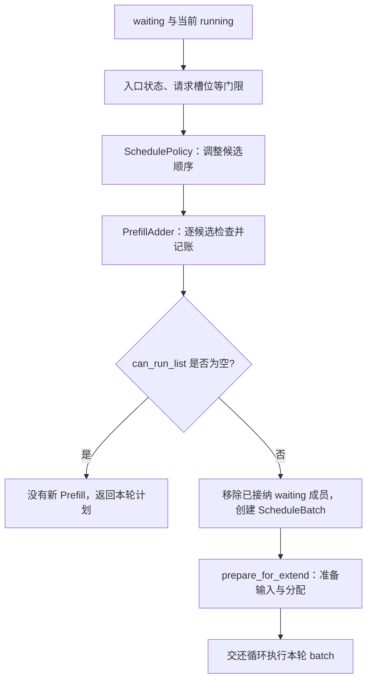

# 排序策略与准入预算

> **先建立架构心智模型：** [M04 · 调度器架构与时间模型](<../architecture/04-调度器架构与时间模型.md>)。先看职责、数据和生命周期，再回到本篇源码细节。

前一篇假设请求顺利获准运行。这一篇拿掉这个假设：R1、R2、R3 都在等待，为什么排序第一的请求仍可能没进入本轮 batch？为什么有缓存命中还要检查容量？为什么返回 OTHER 也可能已经接纳了一个请求？

本文属于**源码分析型学习资料**，是系列第 **03-03** 篇。先拆开排序、准入、分配和执行，再用一套带单位的账本追踪 PrefillAdder。

## 0. 阅读基线与范围

| 项目 | 内容 |
| --- | --- |
| 源码路径基准 | SGLang 仓库根目录 `.`；本文源码位置均为仓内相对路径 |
| 分支 | `codex/sglang-source-study-20260909`，基于官方 `main` |
| commit | `72d5c5bb73cadd7ffbf5114e5f81e29d36b6c61a` |
| 读取日期 | `2026-09-09` |
| 工作区状态 | 学习源码 worktree 干净；原源码与 Wiki 既有资料保留 |
| 操作边界 | 静态阅读排序策略、PrefillAdder、Scheduler 调用点、配置校验、代表 Radix 锁与三份测试文件中的相关断言 |
| 前置 | [性能与显存账本](../00-foundations/05-吞吐延迟与显存的基本账本.md)、[参数到生效配置](../01-getting-started/04-从参数声明到最终生效配置.md)、[连续批处理](02-连续批处理与队列状态.md) |
| 主线 | 单实例普通文本生成；TP/PP/DP=1；代表 Dense/full-attention 路径；无 Overlap、PD、Beam、DLLM、SWA/Mamba、LoRA、多模态或会话特例 |
| 预算例子 | 普通 RadixCache、page_size=1、无 host/L3 命中；新请求 output_ids 为空、ignore_eos=False；不分块、不 mixed、无 delayer 或抢占；只做候选选择期间的教学计算 |
| 其他路径 | 本文按消费位置列出额外门槛，不以普通公式证明所有混合池、硬件或分布式组合；chunk 细节在 03-04，回撤与饥饿排障在 03-06 |

本篇图表、数值与排序例子都是**整理者推演**。没有执行 SGLang、解析器、模型或所列测试，没有测量性能。字段声明值、静态规则与进程中实际生效值分别看待。

**缓存实现选择：** 本篇用传统 `RadixCache` 讲解基本机制。固定基线的[默认缓存工厂](https://github.com/sgl-project/sglang/blob/72d5c5bb73cadd7ffbf5114e5f81e29d36b6c61a/python/sglang/srt/mem_cache/registry.py#L80)在未命中特殊分支时创建 `UnifiedRadixCache`；实际组件与生命周期见 [04-04](../04-kv-cache/04-UnifiedRadix与混合状态组件.md)和 [04-07](../04-kv-cache/07-KV缓存全生命周期与排障.md)。阅读本篇账本时保留上表的实现条件。

## 1. 排序、准入、分配、执行分别是谁决定

**人话版：** 排队顺序回答“先问谁要办什么”；准入回答“这次能不能把他的工作放进计划”；分配才给工作安排资源位置；执行才真正计算。排在第一位不等于已经拿到了计算资源。

| 层次 | 代表对象/入口 | 输出或状态变化 |
| --- | --- | --- |
| 排序 | SchedulePolicy.calc_priority | 调整 waiting_queue 顺序，并可能刷新匹配元信息 |
| 准入 | Scheduler 的请求槽位门限、PrefillAdder.add_one_req | 接纳列表、chunk/抢占记录、预算偏移与停止追加信号 |
| 分配与输入准备 | ScheduleBatch.prepare_for_extend 等 | 请求行、KV 写入位置、长度与执行输入 |
| 执行与结果 | Scheduler.run_batch 与结果处理 | 本轮模型结果、请求输出/结束状态和相关收尾 |

普通调用主线见 Scheduler._get_new_batch_prefill_raw：先做适用门限，调用 policy.calc_priority，再构造 Adder、逐候选接纳，最后用 can_run_list 创建并准备新 batch。[S01]



**图意解读：** 方框是同一条调度调用链的职责位置，不是独立服务。高级路径可能在准入期间发起 cache load-back、锁引用或预留其他状态，所以准入并非无副作用的数学计算；普通例子也要把前缀锁算入账本。[S01][S09]

## 2. 当前运行时有哪些排序策略

### 2.1 先读运行时枚举与实际排序键

当前 SchedulePolicy 将运行时策略分为 cache-aware 与 cache-agnostic 两组。下面按代码中的排序键解释，不把策略名字当成性能承诺。[S02]

| 值 | 主要排序依据 | 需要避免的误解 |
| --- | --- | --- |
| fcfs | 无请求优先级时保留等待顺序；启用优先级时先按 priority，再按等待入口时间 | 不保证排首的请求一定能接纳 |
| lpm | num_matched_prefix_tokens 较多者先；临时降低优先级的请求排后 | 匹配长度可含 host 信息，不等于所有 KV 已在 GPU 就绪 |
| dfs-weight | 缓存树子树聚合的等待请求权重，按树序安排 | 权重不是子树字节数或实际 GPU 耗时 |
| hrrn | 基于计数差与未缓存长度的比值，另有 rid 同分时的比较规则 | 不是直接使用等待秒数；不能直接推出无饥饿保证 |
| lof | max_new_tokens 较大者先；启用优先级时 priority 是第一排序键 | 使用请求上限，不是已经知道实际会输出多长 |
| random | 打乱等待列表 | 不保证每次结果相同或长期公平 |
| routing-key | 优先匹配当前 running 中更频繁的非空 routing_key，再按 key 等排序 | 这是 Scheduler 内排序，不等于 Gateway 已完成请求路由 |

cache-agnostic 表示主要排序策略不依赖缓存树，不表示整个 calc_priority 永不做 prefix match。支持 fast match 的缓存上，即使本轮策略不是 cache-aware，代码也可能刷新匹配元信息供负载等用途；Decode 分离模式另有跳过条件。[S02]

### 2.2 配置的策略与本轮活动策略可能不同

构造 SchedulePolicy 时，若配置为 cache-aware 而缓存被视为 disabled，_validate_and_adjust_policy 会调整为 FCFS；未知运行时枚举值会抛出错误。[S03]

每次 calc_priority 还会调用 _determine_active_policy：当前 LPM 或 HRRN 的等待队列长度**大于 128**时，本轮活动策略退到 FCFS。这里 128 是这份源码的分支常量，不是本文建议的调优值；恰好 128 与 129 走法不同。[S04]

本轮退回 FCFS 的分支保留当前等待顺序，不能描述成把列表重新恢复为最初的到达顺序。此前列表可能已经被其他轮次重排；而 fast-match 元信息更新也可能仍执行。[S02][S04]

配置声明、校验和枚举还应交叉核对：例如字段 choices 中出现 `priority`，但这里的两个运行时枚举没有对应独立项。学习时不能仅凭 choices 或 CLI 帮助就认为已经存在同名排序实现；本文的优先级路径按下节实际布尔开关、校验和排序方法解释。[S03][S05]

## 3. 请求优先级怎样进入排序和抢占

### 3.1 priority 数字方向不是固定常识

源码把方向转成 priority_sign。较小数字优先时 sign=1，较大数字优先时 sign=-1；排序键按 priority×sign 升序排列。[S02]

| 配置/策略 | 实际排序键的主要部分 | 结果 |
| --- | --- | --- |
| FCFS＋优先级 | (priority×sign, wait_queue_entry_time) | 同优先级再看进入等待队列的时间 |
| LOF＋优先级 | (priority×sign, -max_new_tokens) | 同优先级再偏向输出上限较长者 |
| 普通 FCFS，无优先级 | 不做这项排序 | 使用当时列表顺序 |

不能只看到 priority=1 就判断一定比 priority=10 更优先。以实际生效方向为准。普通入队时 _set_or_validate_priority 还会处理缺失 priority 或优先级未启用时的相应拒绝策略。[S06]

### 3.2 排序优先与抢占执行资源是两个动作

check_server_args 要求启用 priority scheduling 时 schedule_policy 为 fcfs 或 lof；不能把 LPM 与请求优先级随意叠加。priority 类型的回撤策略也要求开启相应优先级能力。[S07]

Scheduler 另以 `enable_priority_scheduling and not disable_priority_preemption` 计算抢占开关。关闭抢占，不等于关闭等待队列中的优先级排序。[S08]

PrefillAdder.preempt_to_schedule 在适用调用点比较新旧优先级差、预算与可让位成员，之后才释放所选资源、过滤 running 并记录 preempt_list。优先级差使用严格 `>` 门槛，恰好等于 threshold 不满足该比较。已 finished 的成员会被跳过，避免重复处理已交接的资源。[S24]

本篇不把“优先级高”解释为任意时刻抢占正在执行的 GPU kernel。这里是 Scheduler 在相应调度边界重新安排请求与资源，交接主线见[03-02](02-连续批处理与队列状态.md)。

## 4. 缓存感知排序到底看见了什么

### 4.1 LPM 的命中信息不等于分配成功

match_prefix_for_req 会调用缓存匹配，更新 device prefix、host 命中等字段，并设置 num_matched_prefix_tokens。它还用请求的最大可匹配长度限制统计值。[S10]

LPM 按这份匹配元信息排序。随后 Scheduler 仍会为候选调用 init_next_round_input，Adder 仍会检查容量、加锁和适用的 load-back。因此“排首的命中最长请求”仍可能在后续门槛停下。[S01][S09]

### 4.2 等待列表中的共同前缀是一条排序线索

_compute_prefix_matches 每次重置一棵模拟树，用等待候选的前缀发现“这些请求彼此很像”。当真实 device prefix 不超过检查门限，且与模拟树中已有候选的匹配达到降优先级门限时，会把该 rid 加入 temporary_deprioritized。[S11]

LPM 与 HRRN 的排序方法把这些候选排后，意图是让较早运行的请求先建立可复用缓存。但模拟树插入的是占位数据，不会凭此计算真实 K/V，也不保证后面的候选在同轮必然不被接纳。[S11]

两个门限在模块中通过环境变量读取，源码 fallback 均为 32；实际比较分别是 `<=` 与 `>=`。本篇的短 6-token 共享前缀不能在这些 fallback 值下直接当作触发了该降低优先级机制。改变门限、extra_key 或 cache_salt 都要重新核对实际匹配条件。[S11]

### 4.3 DFS-weight 把相近树分支排在一起

SchedulePolicy 把候选的 last_node 交给 tree_cache.dfs_weight_order。代表基类实现先按节点统计候选数，再向上聚合子树权重；遍历时优先更重的子树，并在孩子处理后输出本节点对应候选。相同节点上的请求索引按原收集顺序保留。[S12]

这是一种围绕缓存树组织候选的方式，不是在测量“这个子树一定更快”。节点句柄、缓存实现与后续准入依然各有边界。

### 图解补充：不同应用为什么会共享一段输入


[查看原尺寸](../../../images/sglang-source-study/06-radix-sharing.jpg)（手机查看宽图时可横屏或放大）。

**图意解读：** 四列分别展示少样本提示、多次候选、多轮对话和树状推理。先找重复的蓝色前缀，再找各分支自己的绿色输入与黄色输出。

**对应本篇源码：** 把相似前缀视为排序线索，再回到真实匹配与 PrefillAdder 预算；共享机会不等于已经分配或已经计算。 [源码：python/sglang/srt/managers/schedule_policy.py][S11]

**来源与边界：** [Fast and Expressive LLM Inference with RadixAttention and SGLang](https://www.lmsys.org/blog/2024-01-17-sglang/)，Lianmin Zheng、Liangsheng Yin 等 / LMSYS，2024-01-17。图说明前缀复用的应用动机；可见文字重复不保证实际 token、模型状态和缓存命名空间兼容，也不保证仍有可复用 KV。 [来源档案 F06](../../../images/sglang-source-study/SOURCES.md#f06)。

## 5. HRRN：把等待程度放进排序键

### 5.1 按当前实现写出公式

对于没有被临时降低优先级、未缓存长度大于零的候选，代码使用下列量：[S13]

```text
U = max(0, len(origin_input_ids) - num_matched_prefix_tokens)
W = max(0, processed_tokens - arrival_processed_tokens)
排序键 = (-W/U, rid)
```

U 是这里用于排序的 token 长度，W 是两个调度计数的差。它们都不是秒；比值相同还按 rid 排序，不能把同分一概说成按到达时间稳定保留。U<=0 有专门优先分支，被临时降低优先级的 rid 则仍按相应规则排后。[S13]

设当前传入 processed_tokens=100，三条新请求的匹配与到达计数如下：

| 请求 | 输入长度 | 排序用匹配数 | U | arrival_processed_tokens | W | W/U |
| --- | ---: | ---: | ---: | ---: | ---: | ---: |
| R1 | 8 | 6 | 2 | 100 | 0 | 0 |
| R2 | 8 | 6 | 2 | 94 | 6 | 3 |
| R3 | 24 | 0 | 24 | 4 | 96 | 4 |

在这个独立教学例子中，顺序为 R3、R2、R1：长请求积累的计数差足够大，就可以先于刚到的短请求。它不是“永远先短请求”，也不是本篇第 8 节 FCFS 预算例子的实际到达时序。

### 5.2 计数来源要比注释多追一步

Scheduler 普通入队把当前 processed_tokens_counter 保存到请求的 arrival_processed_tokens；选批时把当前计数传给 calc_priority。[S06][S01]

该计数在 run_batch 入口按非零 `batch.extend_num_tokens` 增加。它不是 GPU 完成通知，也不是墙钟时间。[S14] 这一版本的普通 prepare_for_decode 未在该方法中清零 extend_num_tokens，因此不能仅照注释把每次增量都当成经过验证的“仅 Prefill 已完成 token 数”；使用该指标作解释时应同时记录 forward mode 与实际字段值。[S15]

本篇只证明排序如何消费这些字段，不证明计数完全等同于真实计算量，也不据此宣称公平性、等待上限或吞吐改进。HRRN 对回撤请求使用的 U 也仍是上述源码公式，不能把它自动等同于重新补算的全部上下文长度。

## 6. PrefillAdder 同时维护哪些预算

### 6.1 先把单位写在字段旁边

| 量 | 普通主线中的单位与用途 | 容易混淆的量 |
| --- | --- | --- |
| allocator.available_size() | 当前 allocator 报告的可用 token 槽位容量 | 整张卡剩余显存字节 |
| tree_cache.evictable_size() | 可淘汰缓存占用的 token 槽位量 | 这些槽位已经空闲或已被本候选分配 |
| rem_total_tokens | 可用＋可淘汰容量，减去未来输出和本轮已接纳等偏移 | 模型的最大上下文长度 |
| cur_rem_tokens | 同一容量来源，减去本轮当前资源需求偏移 | 完全不受前缀锁变化影响的固定常数 |
| rem_input_tokens | 本轮 Prefill 输入量预算，接纳后按页对齐输入量扣减 | 请求数或某个请求的 max_new_tokens |
| rem_chunk_tokens | 本轮分块量预算；未启用对应分块时可为 None | 所有请求剩余输入之和 |
| 请求槽位门限 | 当前可容纳的请求行/候选数量 | token 槽位容量 |
| max_new_tokens | 每条请求的输出上限，也参与调度估算 | 已经确定会实际生成的输出数 |

本节公式只使用普通非 SWA/Mamba 的分支。混合池会选择 full/swa 等不同容量来源，还可能引入状态槽位预算，不能把这些量直接相加成一个“剩余 token”。[S16]

### 6.2 两份容量余额为什么不同

在本文无 mixed、无模型特例的条件下，可把构造时状态写为：[S16]

```text
C = allocator 可用容量 + cache 可淘汰容量
T = Σ min(运行请求的 max_new_tokens - 已输出数, 估算截断值) × new_token_ratio
K = 0

rem_total_tokens = C - T
cur_rem_tokens   = C - K
```

T 先给已有 running 请求预留后续输出估算；K 不包含这项未来输出预留。之后每接纳新候选，两份偏移都会更新。这里的 C 每次读取都可能随锁引用、淘汰或其他适用动作改变，不是构造 Adder 时冻结的常量。

new_token_ratio 来自 NewTokenRatioTracker，其初始化与 schedule_conservativeness、环境字段相关，之后还会在普通 Decode、回撤与空闲路径更新。它影响估算保守程度，不能当成输出停止概率的实测值或额外可用显存。[S17]

### 6.3 估算截断不改请求停止条件

CLIP_MAX_NEW_TOKENS 从 `SGLANG_CLIP_MAX_NEW_TOKENS_ESTIMATION` 读取，源码 fallback 为 4096。它限制的是调度估算；请求仍保留原 max_new_tokens 的停止语义。[S18]

例如请求允许输出 10000 token、截断值取 4096，不表示服务会强制在第 4096 个输出停止。代价是估算与真实未来需求可能不同，后续容量不足还需要回撤等机制。本文没有通过实验验证某个估算参数能避免所有 OOM。

## 7. 一个普通候选怎样通过 add_one_req

### 7.1 门槛有顺序，且部分检查会重做

下面只列第 0 节普通主线，保留重要先后关系。[S09]

| 顺序 | 检查或动作 | 未通过时的代表返回 |
| --- | --- | --- |
| 1 | prefill_max_requests 对已接纳数量的限制 | OTHER |
| 2 | 计算候选输入与剩余输出估算，检查 rem_total_tokens | NO_TOKEN |
| 3 | 未分块且已有接纳者时，检查本轮输入预算 | OTHER |
| 4 | 临时锁住候选命中的前缀，再检查 rem_total_tokens | NO_TOKEN |
| 5 | 适用时征询 PrefillDelayer，再处理需要的 host load-back | 延迟判定可返回 OTHER |
| 6 | 按实际回载后的输入重新检查相应门槛，选择完整输入或 chunk 范围 | 分支可能返回 OTHER |
| 7 | append 到 can_run_list，建立持续锁、扣预算并记账 | 当前候选已经被接纳 |
| 8 | budget_state 检查是否还能继续追加 | CONTINUE、NO_TOKEN 或 OTHER |

这个顺序解释了为什么“返回码不是 CONTINUE”不足以证明候选没有加入。第 7 步可能已经发生，第 8 步只是在通知外层停止继续追加。

### 7.2 预检查与扣账公式要分别看

对**新请求、无 host 命中、未分块**，设 I 为未缓存输入长度，M 为截断后的 max_new_tokens，P 为 page_size。add_one_req 的总量预检查使用：

```text
demand = I + M + P
若 demand >= rem_total_tokens，返回 NO_TOKEN
```

接纳后的 _update_prefill_budget 则先对输入按页向上对齐，记为 Ip，然后扣账：[S09][S19]

```text
T += Ip + M + P
K += Ip + P
rem_input_tokens -= Ip
```

P 是这里的调度预算余量，不能机械解释成每条请求的真实 allocator 一定多持有恰好一页。页对齐、物理分配与后端行为要回到分配器核对。本文数值例取 P=1，因此 I=Ip；P>1 时预检查的原始长度和扣账的对齐长度不能混用。

对已有输出的回撤请求还要更细：预检查用剩余输出估算，而当前完整 Prefill 扣账调用传入的是截断后的 max_new_tokens 上限。不能把新请求公式中的 M 不加说明地推广成所有路径统一的“剩余输出数”。[S09]

### 7.3 前缀加锁为什么可能使第二次检查失败

代表 RadixCache 在节点锁计数从 0 增到 1 时，把相应长度从 evictable 移到 protected；已有锁上的再次引用不会重复作同样的容量转移。最后一个引用释放时才把相应长度转回可淘汰。[S20]

因此候选可能在锁前看到较大的 C，锁后 C 变小，第二次检查失败。这不是输入长度突然变长，而是“原先允许被淘汰的容量”现在必须为这个候选保留。临时锁的释放由上下文管理器负责；成功接纳后还会建立请求所需的持续锁。[S21]

## 8. R1、R2、R3 的准入账本

### 8.1 明确这份教学输入

本节使用 FCFS，等待顺序为 R1、R2、R3。R1/R2 都长 8，共享前 6 个 token，且这 6 个 token 已由更早的历史请求存入代表 RadixCache；当前仍可淘汰。R3 长 24，无命中。三者都还没有输出，max_new_tokens=3。

另有运行中的 R0，剩余输出上限为 8；人为取 new_token_ratio=0.5。allocator 可用容量 A=36，缓存可淘汰容量 E=20，其中包含上述共享的 6。输入预算为 16；page_size=1；请求槽位至少够三条新候选。所有数值仅为讲解，不是默认配置或实测。

开始时：C=36+20=56，T=8×0.5=4，K=0。因此 rem_total=52、cur_rem=56、rem_input=16。

### 8.2 两条命中请求先被接纳

| 观察位置 | A | E | T | K | rem_total=C−T | cur_rem=C−K | rem_input |
| --- | ---: | ---: | ---: | ---: | ---: | ---: | ---: |
| 开始 | 36 | 20 | 4 | 0 | 52 | 56 | 16 |
| R1 命中前缀首次加锁后 | 36 | 14 | 4 | 0 | 46 | 50 | 16 |
| R1 接纳并扣账后 | 36 | 14 | 10 | 3 | 40 | 47 | 14 |
| R2 接纳并扣账后 | 36 | 14 | 16 | 6 | 34 | 44 | 12 |

R1 的 I=8−6=2，demand=2+3+1=6。它先通过 6<52，再在锁后通过 6<46。接纳后 T 增 6、K 增 3、输入预算减 2。

R2 命中同一段已经被 R1 保护的 6 token，不再把 E 额外减 6。它仍需要为新尾部和未来输出扣对应预算，所以接纳后 rem_total=34、cur_rem=44、输入预算剩 12。

**本表是候选选择期间的估算账。** A 仍写 36，是因为新 batch 的统一 prepare/分配还在后面；本轮计划的需求先记在偏移中。不能把这张表当成 GPU 分配器在 forward 之后的实际剩余量。[S01][S16][S19][S20]

### 8.3 R3 排到了，但被哪条门槛挡住

R3 的 I=24，M=3，P=1，demand=28。它通过 28<34 的总量预检查；但此时 can_run_list 已有 R1、R2，且未分块，于是 `24 >= 12` 触发输入预算限制，返回 OTHER，R3 没有被加入。[S09]

外层据返回码停止这次候选扫描，用 `{R1,R2}` 创建新 Prefill；R3 留在 waiting。它没有被永久拒绝，也没有发生实际 CUDA OOM。下一轮需按新的队列、预算与锁状态重新判断。[S01]

只改一个条件，可以看见另一种失败：如果 R3 的 max_new_tokens 改成 9，则 demand=24+9+1=34，恰好等于 rem_total=34。由于比较是 `>=`，它在更早的总量门槛就返回 NO_TOKEN；不是等到输入预算检查才失败。

### 8.4 第一个长请求为什么可能超过输入预算

另起一个独立例子：can_run_list 为空、未分块，R3 仍需输入 24、输出上限 3，rem_input=16，但锁前后 rem_total 都为 100，其他门槛均满足。

总量需求 28<100；非分块输入限制中的“can_run_list 非空”条件不成立，所以第一条长请求可继续接纳。扣账后 rem_input=−8，budget_state 返回 OTHER，提醒外层停止追加；**R3 此时已经在 can_run_list 中**。[S09][S19]

这个局部分支用于理解为何不能把 max_prefill_tokens 当成任何情况下都不许超过的单请求硬上限。模型上下文、输入长度校验、KV 总量和其他准入条件仍然存在。它不是允许任意长请求绕过资源限制。

## 9. token 够用，为什么还可能没有请求槽位

### 9.1 槽位门槛与 token 门槛独立

get_num_allocatable_reqs 从当前 PP microbatch 容量减 running_bs，再与请求池可用行数取较小值；Beam 还有成员行预留/宽度调整。本篇无 Beam 时，可用这个简化式理解：[S22]

```text
可追加请求数 = min(pp_max_micro_batch_size - running_bs, 请求池可用行数)
```

例如配置结果允许当前 microbatch 最多 4 条，而 running 已有 3 条，请求池另有 10 行可用，则这里最多再接纳 1 条。即使 token 预算很宽，也不能据此接纳 10 条新请求。

候选扫描用已接纳列表长度与该数量比较。无新 chunk、无相应抢占条件时，槽位不足还可能更早就返回没有新 Prefill，连排序与 Adder 也未进入。[S01][S22]

### 9.2 几个相似名字各指什么

| 名称 | 在已读链路中的位置 | 不能替代什么 |
| --- | --- | --- |
| max_running_requests | Worker 报告的运行容量信息，影响后续本地限制等 | 服务所有副本的总并发数 |
| pp_max_micro_batch_size | get_num_allocatable_reqs 的 microbatch 预算来源；未配置时有 Scheduler 派生规则 | token 池容量 |
| prefill_max_requests | add_one_req 对本轮已接纳候选数的限制 | 后续能同时存活的所有请求总数 |
| max_prefill_tokens | Adder 本轮输入预算的来源 | 请求行数或全局显存字节 |
| max_prefill_bs | 当前代码中传给 delayer 等使用的观测/估算信息 | prefill_max_requests 这个明确候选数量门限 |

Scheduler 从 Worker 接收相关运行信息，并在适用时派生 pp_max_micro_batch_size；不能只复制字段声明默认值就当成运行时容量。[S23]

## 10. 返回码、break 与“后面的小请求能不能绕过去”

AddReqResult 只有 CONTINUE、NO_TOKEN、OTHER。它表示继续扫描还是停止的原因类别，没有名为 SUCCESS 的独立“本候选已加入”状态。[S25]

| 返回位置 | 返回值 | 当前候选是否已经在 can_run_list |
| --- | --- | --- |
| 总量预算预检查失败 | NO_TOKEN | 没有 |
| 输入预算/数量/延迟等前置门槛失败 | OTHER | 没有 |
| 完成接纳后 budget_state 发现输入或 chunk 预算耗尽 | OTHER | 已有 |
| 完成接纳后 budget_state 发现相应容量余额耗尽 | NO_TOKEN | 已有；还需按本分支确认 |
| 完成接纳且可继续追加 | CONTINUE | 普通主线中已有 |

Scheduler 看到非 CONTINUE 会执行相关状态处理并 break。第 8 节 R3 因预算停下时，即使其后有更小的 R4，普通这次扫描也不会自动跳过去继续装箱。不能把 FCFS＋Adder 描述成会搜索所有候选、凑出最优组合。[S01]

部分 LoRA、预取未完成等分支使用 continue，和预算返回后的 break 不同。分析队头阻塞时必须指出实际退出位置；“有小请求在后面”本身不是调度器错误的证据。

## 11. 普通公式之外还有哪些门槛

| 变化 | 已确认的额外边界 | 后续阅读位置 |
| --- | --- | --- |
| Chunked Prefill | 完整输入需求预检查、分段范围和本轮扣账不是同一长度；续 chunk 有独立方法 | 03-04，不直接复用本篇未分块表 |
| Mixed Decode | 已有 Decode token 会预先扣本轮输入/chunk/容量偏移 | 03-04，区分两类工作量 |
| ignore_eos 且缓存 disabled | 转入 add_one_req_ignore_eos，使用另外的存活/释放估算路径 | 03-06；本篇主线明确不进入 |
| SWA、Mamba、统一混合池 | 额外 full/swa 预算、ring 槽位或状态槽位容量 | 阶段 04 与模型专题，单位分别核对 |
| HiCache/host/L3 | 排序匹配、GPU 驻留、回载与实际补算量分开；锁和 load-back 可改变余额 | 阶段 04 |
| PrefillDelayer | 容量可接纳仍可能选择延迟；协商位置在相应 KV 复查之后 | 03-06 |
| HIP tile budget | 当前 helper 仅在 HIP、预算为正且已有接纳者时检查；第一候选跳过该项 | 性能专题；不代表第一请求绕过全部门槛 |
| 优先级抢占 | 新候选可触发运行集合让位，但有差值和预算条件 | 03-06；资源交接见 03-02 |

这些是已读条件的位置图，不是完整兼容矩阵。特别是查询 tile 的个数与 token 数、请求数、KV 字节各有单位，不能混作同一预算。[S09][S16][S24][S26]

## 12. 排障与已读测试边界

### 12.1 先定位哪一层没有前进

| 现象 | 先核对 | 本篇提供的判断边界 |
| --- | --- | --- |
| LPM/HRRN 看起来没重新排序 | 当前策略、等待长度、cache disable 与原列表顺序 | 本轮可能退回 FCFS；退回不代表完全跳过匹配更新 |
| 高 priority 请求没有先运行 | 数字方向、策略校验、实际排序与后续准入 | 优先考虑不等于容量一定足够 |
| cache hit 高仍返回 NO_TOKEN | 锁前/锁后 available、evictable、offset、候选 demand | 被保护前缀会改变可淘汰容量 |
| rem_total 看起来足够仍未接纳 | 请求行门限、输入/chunk/其他池预算及 delayer | token 余额不能覆盖所有门槛 |
| OTHER 却看到该请求被执行 | 返回前是否已经 append，返回来自哪个位置 | 停止追加不等于撤销当前接纳 |
| 第一条 Prefill 超过输入预算 | 是否未分块、列表原本为空、其他限制是否满足 | 当前局部分支允许第一条突破该输入预算 |
| 计数型 aging 与等待秒数不一致 | 计数来源、forward mode、extend_num_tokens 与入队快照 | 不能把 HRRN 比值直接当墙钟等待比率 |
| 小请求一直排在受阻大请求后 | continue/break 的真实位置和排序策略 | 普通预算失败后不自动搜索余下所有候选 |

### 12.2 三份测试中本次实际读了哪些断言

| 文件与已读片段 | 主要断言 | 本次限制 |
| --- | --- | --- |
| `test/registered/unit/managers/test_schedule_policy.py` 的 HRRN 三例 | 给定计数与未缓存长度排序、较长等待反超、匹配量与 rid 同分比较 | 使用构造请求/模拟缓存；仅阅读，未执行 |
| `test/registered/unit/managers/test_schedule_policy_dfs_weight.py` | 模拟树中按子树候选权重与节点顺序得到指定排列 | 不验证真实缓存性能；仅阅读，未执行 |
| `test/registered/unit/managers/test_prefill_adder.py` 中锁前/锁后 KV 拒绝、delayer 允许/拒绝和 tile gate 等片段 | 容量失败不先报告可 Prefill；延迟可挡住本来能接纳的候选；非 HIP/首候选跳过该 tile 项 | Mock 容量、锁或平台条件；未执行，也不声称读完全部混合池测试 |

测试文件存在只说明有这些断言入口，不能写成当前硬件已经通过准入、OOM 或公平性验证。[S27][S28][S29]

## 13. 源码入口与复读顺序

| 要回答的问题 | SGLang 仓内路径与符号 | 固定入口 |
| --- | --- | --- |
| 排序和 Adder 怎样接起来？ | `python/sglang/srt/managers/scheduler.py::Scheduler._get_new_batch_prefill_raw` | [调用主线][S01] |
| 哪些策略真正有运行时实现？ | `python/sglang/srt/managers/schedule_policy.py::SchedulePolicy.calc_priority` | [策略分发][S02] |
| 策略怎样调整与本轮回退？ | `python/sglang/srt/managers/schedule_policy.py::SchedulePolicy._validate_and_adjust_policy`；同类 `_determine_active_policy` | [构造调整][S03]、[本轮活动策略][S04] |
| 配置声明与优先级校验？ | `python/sglang/srt/arg_groups/fields/schedule.py::Schedule`；`python/sglang/srt/arg_groups/validation_hook.py::check_server_args` | [字段][S05]、[校验][S07] |
| 入队优先级与计数快照？ | `python/sglang/srt/managers/scheduler.py::Scheduler._add_request_to_queue` | [入队][S06] |
| 单候选的门槛与提交？ | `python/sglang/srt/managers/schedule_policy.py::PrefillAdder.add_one_req` | [核心准入][S09] |
| 匹配统计与等待列表模拟树？ | `python/sglang/srt/managers/schedule_policy.py::match_prefix_for_req`；同文件 `SchedulePolicy._compute_prefix_matches` | [真实匹配][S10]、[候选关系][S11] |
| DFS-weight 权重来自哪里？ | `python/sglang/srt/mem_cache/base_prefix_cache.py::_dfs_weight_order` | [树遍历][S12] |
| HRRN 怎样比较？ | `python/sglang/srt/managers/schedule_policy.py::SchedulePolicy._sort_by_hrrn` | [比值与同分比较][S13] |
| aging 计数在哪里增加？ | `python/sglang/srt/managers/scheduler.py::Scheduler.run_batch` | [字段来源][S14] |
| Adder 初始化与余额？ | `python/sglang/srt/managers/schedule_policy.py::PrefillAdder.__init__`；同类 `rem_total_tokens`、`cur_rem_tokens` | [预算结构][S16] |
| 输出估算比例从哪里来？ | `python/sglang/srt/managers/scheduler_components/new_token_ratio_tracker.py::NewTokenRatioTracker` | [比例状态][S17] |
| 接纳后怎样扣账？ | `python/sglang/srt/managers/schedule_policy.py::PrefillAdder._update_prefill_budget` | [扣账][S19] |
| 前缀锁怎样改变容量？ | `python/sglang/srt/mem_cache/radix_cache.py::RadixCache.inc_lock_ref`；`python/sglang/srt/managers/schedule_policy.py::PrefillAdder._lock_node` | [代表锁计数][S20]、[临时锁作用域][S21] |
| 请求数上限在哪里比较？ | `python/sglang/srt/managers/scheduler.py::Scheduler.get_num_allocatable_reqs` | [槽位门槛][S22] |
| 抢占与停止扫描信号？ | `python/sglang/srt/managers/schedule_policy.py::PrefillAdder.preempt_to_schedule`；同文件 `AddReqResult`、`PrefillAdder.budget_state` | [抢占][S24]、[信号类型][S25]、[余额判定][S30] |
| HIP tile 项如何门控？ | `python/sglang/srt/managers/schedule_policy.py::PrefillAdder._check_prefill_tile_budget` | [局部开关][S26] |

## 14. 自测、验收与下一篇

1. LPM 把 R2 排第一，是否就意味着本轮 batch 一定包含 R2？
2. 第 8 节中，为什么 R1 锁前 rem_total=52、锁后变成 46？为什么 R2 不再减同样的 6？
3. R3 demand=34、rem_total=34 时，哪个比较使它停下？
4. 第一个长请求接纳后返回 OTHER，外层是否应该把它从 can_run_list 删除？
5. token 预算能容纳很多输入，但 PP microbatch 只剩 1 条位置，能不能再加 3 条普通请求？
6. HRRN 的计数差为零时，两个 U 不同的请求是否一定短者先？

<details>
<summary>参考答案与验收要点</summary>

1. 不意味着。排序后仍有请求槽位、token/input/chunk、锁后复查和适用功能门槛。
2. 6 个此前可淘汰 token 首次被保护，C 减 6；R2 再引用同一已保护前缀，不重复发生 0→1 的容量转移。
3. 总量预检查使用 demand>=rem_total，等于时也返回 NO_TOKEN。
4. 不应该据返回码自动删除；要看 append 是否已经发生。这里是接纳后预算耗尽、停止继续追加。
5. 不能按这个理由突破请求槽位门槛；两种容量单位不同。
6. 对本例正常正 U 分支，W/U 都是零，当前实现再按 rid 比较，不因 U 较短自动优先。特殊零 U 与临时降低优先级分支另看。

验收时应能独立复算 R1/R2 的锁与两份余额，再用 R3 的两个失败条件区分 NO_TOKEN 与 OTHER；还应能指出“已接纳”和“可继续追加”不是同一个布尔结论。

</details>

本篇已做静态源码/符号、文档导航和教学算术核对，没有执行所列测试、SGLang 或实际分配。Mermaid 按文字与源码静态对照，未做渲染验证。

下一篇为[03-04《Chunked Prefill 与长请求调度》](04-ChunkedPrefill与长请求调度.md)，继续区分完整输入需求、本轮 chunk 预算、续算状态与 Decode 时机。返回[系列目录](../README.md)或[学习进度](../appendices/06-学习进度与版本变更记录.md)。

[S01]: https://github.com/sgl-project/sglang/blob/72d5c5bb73cadd7ffbf5114e5f81e29d36b6c61a/python/sglang/srt/managers/scheduler.py#L3693
[S02]: https://github.com/sgl-project/sglang/blob/72d5c5bb73cadd7ffbf5114e5f81e29d36b6c61a/python/sglang/srt/managers/schedule_policy.py#L243
[S03]: https://github.com/sgl-project/sglang/blob/72d5c5bb73cadd7ffbf5114e5f81e29d36b6c61a/python/sglang/srt/managers/schedule_policy.py#L323
[S04]: https://github.com/sgl-project/sglang/blob/72d5c5bb73cadd7ffbf5114e5f81e29d36b6c61a/python/sglang/srt/managers/schedule_policy.py#L303
[S05]: https://github.com/sgl-project/sglang/blob/72d5c5bb73cadd7ffbf5114e5f81e29d36b6c61a/python/sglang/srt/arg_groups/fields/schedule.py#L26
[S06]: https://github.com/sgl-project/sglang/blob/72d5c5bb73cadd7ffbf5114e5f81e29d36b6c61a/python/sglang/srt/managers/scheduler.py#L3148
[S07]: https://github.com/sgl-project/sglang/blob/72d5c5bb73cadd7ffbf5114e5f81e29d36b6c61a/python/sglang/srt/arg_groups/validation_hook.py#L161
[S08]: https://github.com/sgl-project/sglang/blob/72d5c5bb73cadd7ffbf5114e5f81e29d36b6c61a/python/sglang/srt/managers/scheduler.py#L1399
[S09]: https://github.com/sgl-project/sglang/blob/72d5c5bb73cadd7ffbf5114e5f81e29d36b6c61a/python/sglang/srt/managers/schedule_policy.py#L1271
[S10]: https://github.com/sgl-project/sglang/blob/72d5c5bb73cadd7ffbf5114e5f81e29d36b6c61a/python/sglang/srt/managers/schedule_policy.py#L142
[S11]: https://github.com/sgl-project/sglang/blob/72d5c5bb73cadd7ffbf5114e5f81e29d36b6c61a/python/sglang/srt/managers/schedule_policy.py#L341
[S12]: https://github.com/sgl-project/sglang/blob/72d5c5bb73cadd7ffbf5114e5f81e29d36b6c61a/python/sglang/srt/mem_cache/base_prefix_cache.py#L255
[S13]: https://github.com/sgl-project/sglang/blob/72d5c5bb73cadd7ffbf5114e5f81e29d36b6c61a/python/sglang/srt/managers/schedule_policy.py#L420
[S14]: https://github.com/sgl-project/sglang/blob/72d5c5bb73cadd7ffbf5114e5f81e29d36b6c61a/python/sglang/srt/managers/scheduler.py#L4199
[S15]: https://github.com/sgl-project/sglang/blob/72d5c5bb73cadd7ffbf5114e5f81e29d36b6c61a/python/sglang/srt/managers/schedule_batch.py#L3345
[S16]: https://github.com/sgl-project/sglang/blob/72d5c5bb73cadd7ffbf5114e5f81e29d36b6c61a/python/sglang/srt/managers/schedule_policy.py#L538
[S17]: https://github.com/sgl-project/sglang/blob/72d5c5bb73cadd7ffbf5114e5f81e29d36b6c61a/python/sglang/srt/managers/scheduler_components/new_token_ratio_tracker.py#L14
[S18]: https://github.com/sgl-project/sglang/blob/72d5c5bb73cadd7ffbf5114e5f81e29d36b6c61a/python/sglang/srt/managers/schedule_policy.py#L75
[S19]: https://github.com/sgl-project/sglang/blob/72d5c5bb73cadd7ffbf5114e5f81e29d36b6c61a/python/sglang/srt/managers/schedule_policy.py#L899
[S20]: https://github.com/sgl-project/sglang/blob/72d5c5bb73cadd7ffbf5114e5f81e29d36b6c61a/python/sglang/srt/mem_cache/radix_cache.py#L646
[S21]: https://github.com/sgl-project/sglang/blob/72d5c5bb73cadd7ffbf5114e5f81e29d36b6c61a/python/sglang/srt/managers/schedule_policy.py#L1119
[S22]: https://github.com/sgl-project/sglang/blob/72d5c5bb73cadd7ffbf5114e5f81e29d36b6c61a/python/sglang/srt/managers/scheduler.py#L3646
[S23]: https://github.com/sgl-project/sglang/blob/72d5c5bb73cadd7ffbf5114e5f81e29d36b6c61a/python/sglang/srt/managers/scheduler.py#L1147
[S24]: https://github.com/sgl-project/sglang/blob/72d5c5bb73cadd7ffbf5114e5f81e29d36b6c61a/python/sglang/srt/managers/schedule_policy.py#L1506
[S25]: https://github.com/sgl-project/sglang/blob/72d5c5bb73cadd7ffbf5114e5f81e29d36b6c61a/python/sglang/srt/managers/schedule_policy.py#L531
[S26]: https://github.com/sgl-project/sglang/blob/72d5c5bb73cadd7ffbf5114e5f81e29d36b6c61a/python/sglang/srt/managers/schedule_policy.py#L663
[S27]: https://github.com/sgl-project/sglang/blob/72d5c5bb73cadd7ffbf5114e5f81e29d36b6c61a/test/registered/unit/managers/test_schedule_policy.py#L26
[S28]: https://github.com/sgl-project/sglang/blob/72d5c5bb73cadd7ffbf5114e5f81e29d36b6c61a/test/registered/unit/managers/test_schedule_policy_dfs_weight.py#L14
[S29]: https://github.com/sgl-project/sglang/blob/72d5c5bb73cadd7ffbf5114e5f81e29d36b6c61a/test/registered/unit/managers/test_prefill_adder.py#L677
[S30]: https://github.com/sgl-project/sglang/blob/72d5c5bb73cadd7ffbf5114e5f81e29d36b6c61a/python/sglang/srt/managers/schedule_policy.py#L876
