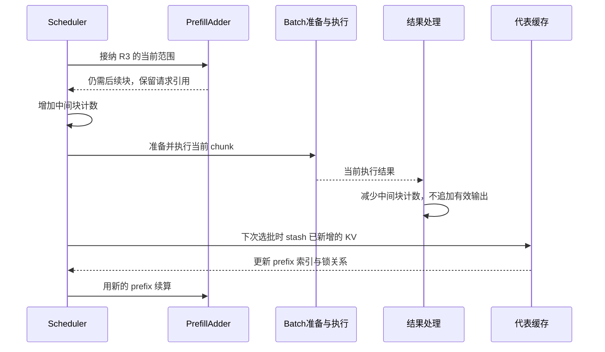
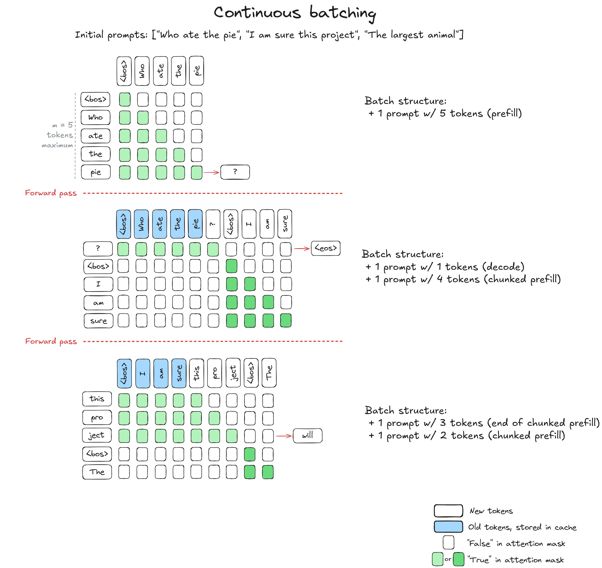

# Chunked Prefill 与长请求调度

一条长请求还没读完输入，其他请求已经在等下一个输出。能不能把长输入分几次处理？分块之后，是不是每块之间一定会执行 Decode？这一篇沿源码回答这两个问题，并把固定分块、混合批次、轮次间隔和 PP 动态预测分别讲清楚。

本文是**源码分析型学习资料**，为系列第 **03-04** 篇。前一篇解释“能不能接纳”，本篇继续追踪“接纳后，本轮究竟计算哪一段，下一轮怎样接着算”。

## 0. 阅读基线与范围

| 项目 | 内容 |
| --- | --- |
| 源码路径基准 | SGLang 仓库根目录 `.`；所有源码位置均为仓内相对路径 |
| 分支 | `codex/sglang-source-study-20260909`，基于官方 `main` |
| commit | `72d5c5bb73cadd7ffbf5114e5f81e29d36b6c61a` |
| 读取日期 | `2026-09-09` |
| 工作区状态 | 学习源码 worktree 干净；原源码与 Wiki 既有资料保留 |
| 操作边界 | 静态阅读配置消费、首块/续块准入、输入准备、结果处理、代表 Radix 缓存交接、间隔控制和动态预测器；测试仅阅读 |
| 前置 | [03-02 连续批处理](02-连续批处理与队列状态.md)、[03-03 排序与准入](03-排序策略与准入预算.md)、[02-04 逐轮生成](../02-request-lifecycle/04-一次Prefill到多轮Decode.md) |
| 普通主线 | 单实例、TP/PP/DP=1、普通文本 Dense/full-attention、代表 RadixCache、page_size=1；无 Overlap、PD、投机、Beam、SWA/Mamba、DLLM、LoRA、会话或多模态特例 |
| 数值例子 | 分块预算人为设为 8；总量、请求行和输入预算足够；无 host/L3 命中、delayer、抢占、对齐特例或早停；一次只改变明确列出的条件 |
| 独立分支 | mixed 与 prefill_decode_interval 分别引入；动态预测小节单独读取 PP>1 路径，不把它代入普通单卡例子 |

本篇所有轮次、长度、公式数值与图均为**整理者推演**。没有安装、导入或运行 SGLang，没有执行 GPU profile、模型、测试或网络请求；没有获得吞吐、TTFT、精度或公平性的实测结论。

**缓存实现选择：** 本篇用传统 `RadixCache` 讲解基本机制。固定基线的[默认缓存工厂](https://github.com/sgl-project/sglang/blob/72d5c5bb73cadd7ffbf5114e5f81e29d36b6c61a/python/sglang/srt/mem_cache/registry.py#L80)在未命中特殊分支时创建 `UnifiedRadixCache`；实际组件与生命周期见 [04-04](../04-kv-cache/04-UnifiedRadix与混合状态组件.md)和 [04-07](../04-kv-cache/07-KV缓存全生命周期与排障.md)。阅读本篇账本时保留上表的实现条件。

## 1. 分块切的是什么

**人话版：** 把 24 个输入 token 分成三次各读 8 个。第二次要接着第一次建立的上下文计算；它不是把后 8 个 token 当成一条全新请求。

| 容易混在一起的概念 | 本篇中的含义 |
| --- | --- |
| 输入 chunk | 本次为同一请求新增计算的 token 位置范围 |
| 已有 prefix | 本次可以接着使用的 KV 索引；仍属于该请求上下文 |
| PP stage | 模型层在不同 stage 上的分工，不是把输入切成几段的同义词 |
| 流式输出 chunk | 客户端收到的文本片段，不由每个 Prefill chunk 一一产生 |
| Mixed batch | 同一执行 batch 中同时放入 Prefill 工作和已有请求的单 token Decode 工作 |

普通输入准备从 `get_fill_ids()` 截到本轮 extend_range.end，再取已有 prefix 之后的部分；seq_lens 则使用累积到的位置。因而第二块可能只新增 8 个输入，执行时对应的上下文终点却是 16。[S01][S02]

分块没有让此前 KV 自动消失，也没有把后续输出所需的总上下文缩短。显存准入与缓存保留仍按[03-03](03-排序策略与准入预算.md)和后续阶段 04 的规则处理。


**图意解读：** 这是 token 位置与续算依赖图，不是三个进程或三个 GPU。图中“保存”表示缓存/prefix 交接，不表示把 GPU KV 写到磁盘。是否在两块间执行别的工作，要另读选批条件。

## 2. 四组配置分别控制什么

### 2.1 先追生效值，再讨论块大小

| 配置或状态 | 当前已读消费位置 | 作用与边界 |
| --- | --- | --- |
| chunked_prefill_size | Scheduler.init_chunked_prefill → Adder | 提供静态块预算；非正值在该初始化中转换为 None |
| enable_mixed_chunk | init_chunked_prefill 与组批后的 mixed 条件 | 允许尝试混入 Decode；需要 chunking 有效，也有每批次条件 |
| prefill_decode_interval | 选批中的 defer/arm 方法 | 在符合条件的 extend 之后，跳过若干次 Prefill 选择检查 |
| enable_dynamic_chunking | maybe_init_dynamic_chunk_sizer | 当前仅在 PP>1 时尝试建立预测器；普通单卡不进入该初始化 |
| max_prefill_tokens | Adder 输入预算、动态预测器上界 | 和 chunk 余量是两份账，不能自动理解为每条请求长度 |

字段声明的 chunked_prefill_size 为 None，不代表运行时必然禁用。memory hook 会在适用条件下填入值；例如 gpu_mem 未给出且该值仍为 None 时有 4096 的回退。DP attention 的解析规则还会按 dp_size 调整它。这里分别是声明与静态规则，没有探测真实进程的生效值。[S03][S04][S05]

普通 Scheduler 初始化还会对“多模态模型＋Transformers backend”关闭 chunking，避免该路径的部分输入不匹配。具体模型特例应回到对应初始化和配置规则核对，不能仅看到 CLI 上给了正数就假设一定分块。[S06]

### 2.2 先保留几个明确的硬约束

当前校验对正 chunk size、非 Decode 分离模式要求它能被 page_size 整除；prefill_decode_interval 不允许负数。PDMux 的校验要求 chunked_prefill_size=-1。[S07][S08]

确定性推理可设置额外 truncation_align_size，部分 DSA 路径还会合并自己的对齐要求。它们可能让候选有剩余 token 预算却无法形成合法块。本篇 page_size=1、无额外对齐的教学数字不用于证明这些组合。[S09]

## 3. 同一请求的五种状态不要混用

| 状态 | 谁设置或消费 | 应怎样读 |
| --- | --- | --- |
| full_untruncated_fill_ids | Req 刷新完整输入与已有输出 | 完整材料仍保留，首块没有永久截断原请求 |
| prefix_indices | 匹配、缓存交接及续块消费 | 已有 KV 位置索引；不是本轮新增 token 列表 |
| extend_range | Adder 设置，Batch 准备消费 | 半开区间 `[start,end)`；length 是本轮新增长度 |
| Scheduler.chunked_req | 选批保存仍需续块的请求引用 | 清成 None 表示本次选择已不再留下该续块引用，不能直接当 GPU 完成通知 |
| inflight_middle_chunks | 中间块选入时增加，结果处理时减少 | 用来识别尚需按中间块收尾的结果，不是剩余输入块数 |

Req.init_next_round_input 会刷新完整材料；传入 tree_cache 时还会重新匹配前缀。续块调用这里**不传 tree_cache**，沿用前面 stash 更新的 prefix，不能把它画成每轮都重新从外部请求开始匹配。[S01][S10]

例如 R3 的完整输入长 24，prefix 长 8，本轮范围 `[8,16)`：本轮新增 8，累积终点 16，仍未处理的输入还有 8。三个数字分别回答不同问题。

## 4. 第一块：先获准进入，再决定截到哪里

### 4.1 分块不能绕过首次接纳的完整需求预检查

新候选进入 add_one_req 后，普通主线仍先计算完整未缓存输入与输出估算，并执行锁前、锁后的总量门槛；之后才选择完整输入还是截成 chunk。不是先把输入改成 8，再只拿这 8 个 token 去过所有准入检查。[S11]

以新 R3 输入 24、无命中、max_new_tokens=3、page_size=1 为例，首次普通总量预检查 demand=24+3+1=28。即使 chunk 预算是 8，rem_total_tokens=20 时仍会在预检查返回 NO_TOKEN。chunking 不是允许任意长请求只凭“一小块放得下”就开始运行。

### 4.2 余量属于本轮 Adder，可以由多个候选共享

当本轮选择了 chunk budget，Adder 接纳每个候选后都会按页对齐的本轮新增量扣 rem_chunk_tokens。中间块在这次扣账传入的输出估算为 0；完整接纳最后一块时会传入相应截断后的输出上限。输出估算的 0 只属于这次预算调用，不会把请求的 max_new_tokens 改为 0。[S11][S12]

若同轮前面的短请求已经消耗 3，原块预算 8 只剩 5，后面的长请求最多再考虑这份余量。因此 chunked_prefill_size 不是“本 batch 的每个请求都能各取这么多”。

新候选需要截断时，代码先把 chunk 余量按 page_size 向下取整，再应用额外 truncation_align_size，并对最终位置做相应对齐。形成的长度不大于零时返回 OTHER，不会接纳一个零长度块。[S11]

例如本轮剩余 chunk tokens=10、page_size=4，第一步得到 8；若另有 truncation_align_size=16，这条截断分支就不能继续。这里说的是**本轮余量**，没有把 10 冒充已经通过配置校验的初始 chunk size。

## 5. 中间块怎样交接给下一块

### 5.1 执行前留下续算身份，结果后不追加有效输出

截断接纳会把请求加入 can_run_list，并记录为 adder.new_chunked_req。Scheduler 更新自己的 chunked_req，再给仍需续块的对象增加 inflight_middle_chunks，最后创建并准备执行 batch。[S10][S11]

普通生成结果处理根据这个计数区分两条分支：[S13]

| 条件 | 对本请求的代表行为 |
| --- | --- |
| inflight_middle_chunks>0 | 减少中间块计数；不走正常 output_ids.append；把本请求设为本轮跳过流式返回的对象 |
| inflight_middle_chunks<=0 | 走有效输出追加与停止条件更新；适用时缓存未结束请求或释放结束请求 |

因此不能拿“模型为中间块返回了候选结果”当作新增输出已经对用户生效。某些 PP 路径还有输出通信优化，本篇不假设每个中间块一定经过相同的跨 stage 输出过程。

### 5.2 下一次选批先 stash，再排除中间请求

get_next_batch_to_run 看到仍有 chunked_req 时，把它加入不应合并进普通 Decode 的集合。只有当 extend_range.end 大于 prefix 长度，才调用 stash_chunked_request；代表 Radix 路径会插入/匹配已计算范围、更新请求映射、交接锁并刷新 prefix_indices。[S14][S15]

“stash 后还能读 KV”不表示请求结束或资源全被释放。它是同一请求继续使用上下文所需的交接。页尾部分和可共享树前缀也可能不同；完整缓存生命周期留到阶段 04。

门槛中的严格 `>` 还有另一层意义：如果请求这轮只是停留、没有新增 KV，就不能凭完整输入长度变长把未计算位置误当成已缓存。混合 SWA 续块容量不足时有保留请求、暂不接纳的分支；应同时检查 add_chunked_req 是否真的 append。[S14][S16]

### 5.3 续块走独立入口

已有 chunked_req 在扫描 waiting 新候选之前进入 add_chunked_req。普通非 SWA、非 DLLM 路径先比较 rem_chunk_tokens 与 int(rem_total_tokens)，取较小者作为本次可考虑量；之后设置范围、加入 can_run_list、扣账。[S10][S16]

```python
# python/sglang/srt/managers/schedule_policy.py：保留关键返回语义
truncated = cand_extend_input_len > _rem_tokens
new_len = min(cand_extend_input_len, _rem_tokens)
# 中间省略范围设置、加入列表与扣账；详见源码锚点。
return req if truncated else None
```

返回 None 表示剩余输入已在本轮全部选入，Scheduler 不再把它保留为下一块；此时 forward 还在后面。返回 req 则可能表示仍有后续块，也可能来自 SWA 暂停路径，不能只凭返回身份判断本轮已经计算。[S16]

这个入口并不照搬 add_one_req 的全部门槛。普通路径在内部可考虑量非正时还有退回 rem_chunk_tokens 的续算分支；适用 delayer 时会上报本 rank 可 Prefill，并忽略协商返回的延迟判定。它体现已有请求的续算义务，不能据此承诺任何容量下都不会分配失败。后续实际分配与其他模型池约束仍要独立核对。[S16]

## 6. R3 三块输入到首个输出的完整账本

### 6.1 固定条件下逐块看字段

R3 输入 24，无前缀命中，输出上限 3。初始等待队列只有 R3，chunk budget=8；关闭 mixed，interval=0，容量足够。表中“prefix”在本轮设置范围时观察，“输出数”在本轮结果处理后观察。

| 轮次 | 设置范围时 prefix 长度 | 本轮 extend_range | 新增输入 | 选批后 chunked_req | 中间块计数：选入后→结果后 | R3 有效输出数 |
| --- | ---: | --- | ---: | --- | --- | ---: |
| 1 | 0 | [0,8) | 8 | R3 | 1→0 | 0 |
| 2 | 8 | [8,16) | 8 | R3 | 1→0 | 0 |
| 3 | 16 | [16,24) | 8 | None | 0→0 | 1 |

第 2、3 轮开头先交接前一块，所以 prefix 分别推进到 8、16。第 3 轮选批时 add_chunked_req 返回 None；这早于本轮结果处理。随后这次结果走正常输出分支，产生第一个有效输出。[S10][S13][S14][S16]

如果没有提前停止，接下来两次普通 Decode 分别把有效输出数推进到 2、3：三个 Prefill 执行批加两个 Decode 执行批，总共五次模型执行。最后输出已经选出，不要求再为它执行一次 Decode；停止与资源交接见[02-04](../02-request-lifecycle/04-一次Prefill到多轮Decode.md)。

### 6.2 单个中间块有三个不同的完成点



**图意解读：** “范围选入”“结果已处理”“缓存与 prefix 已交接”是不同观察点。图限于普通非 Overlap 路径；不能拿这个先后顺序替代异步路径的 stream/event 证明。

## 7. 固定切块之后，Decode 一定会插进来吗

不会由“切块”这个动作单独保证。在普通 get_next_batch_to_run 中，若拿到新 Prefill batch，代码先运行它；没有新 Prefill 时，才尝试已有 running 的 Decode。只要每轮续块仍能产生 Prefill，关闭 mixed、interval=0 的旧请求就可能连续等几轮。[S14]

例如 R1、R2 都已经输出 1 个 token，R3 此时开始上述三块 Prefill：前面三轮都可能只推进 R3 的输入，R1/R2 的有效输出数仍为 1。R3 最后一块处理后，它也带着自己的首 token，随后才一起进入普通 Decode。

较小 chunk 给调度器提供更细的选择机会，不能据此推导所有请求有严格等待上限。具体是否让出下一轮，要继续看 interval、mixed、优先级、delayer、容量及对应循环；本篇没有证明通用无饥饿性质。

## 8. prefill_decode_interval：跳过的是 Prefill 选择

### 8.1 按真实条件解释轮次

_arm_prefill_decode_interval 在选到符合条件的 extend batch 后设置剩余计数。_should_defer_prefill 在计数非零时减一并返回 True，本轮便不调用普通新 Prefill 选择。[S17]

普通非 DP 主线使用本地 forward_mode.is_extend；MIXED 也属于这个判断。需要 MLP 同步时，arm 使用 batch.is_extend_in_batch，以便消费已经同步的 extend 状态。本篇只读消费点，不据此证明完整 DP 组合。[S17][S18]

“间隔为 2”准确地说是后续两次相应选择检查跳过 Prefill。若没有可执行 Decode 请求，这些检查仍可消耗计数，实际 batch 可以是 None；不能把帮助文字里的 decode rounds 直接当成必然成功执行的两批 Decode。Decode batch 本身不会重新 arm。[S14][S17]

### 8.2 只把 interval 改为 1

另起对照：R1/R2 初始各输出 1，上限 3；R3 输入 24、chunk=8，其他条件与普通例子相同，关闭 mixed。

| 轮次 | 本轮选择 | 选择前的间隔余额 | 选择后的间隔余额 | 结果处理后的 R1/R2 输出数 | R3 输出数 |
| --- | --- | ---: | ---: | --- | ---: |
| 1 | R3 Prefill [0,8) | 0 | 1 | 1 / 1 | 0 |
| 2 | 暂缓 Prefill，Decode R1/R2 | 1 | 0 | 2 / 2 | 0 |
| 3 | R3 Prefill [8,16) | 0 | 1 | 2 / 2 | 0 |
| 4 | 暂缓 Prefill，Decode R1/R2 | 1 | 0 | 3 / 3，结束 | 0 |

R3 在这四轮还没有读完输入；下一次允许 Prefill 时才选择最后 `[16,24)`。这份表说明轮次行为，不说明 interval=1 一定改善整体吞吐或所有请求延迟。

## 9. Mixed：同一批里的新增工作分成两部分

### 9.1 先预留 Decode，再接纳 Prefill

构造 Adder 时，Scheduler 在 is_mixed_chunk 为真时传入当前 running 请求数 D。Adder 初始就从 rem_input_tokens 和 rem_chunk_tokens 扣 D，并把 D 放进两份容量偏移。普通路径中，每个 Decode 请求本轮准备 1 个输入 token。[S10][S19]

以初始 chunk budget=8、running 有两条请求为例，Prefill 的初始 chunk 余量是 6。这个预扣发生在后面的逐 batch mixed 条件之前，因此它是估算预留，不能仅凭它认定最终真的发生混合。

### 9.2 开关为真还要满足当前 batch 条件

当前混入分支还检查 running 非空、两侧都不要求 return_logprob、new_batch.input_embeds 为 None、running 没有 Beam 成员。分支中先过滤 running，仍非空时再 prepare_for_decode、mix_with_running，记录 decoding_reqs，并返回新的空 running 容器。[S20]

不能看到 running 变空就判断旧请求丢了。原成员现在由混合 batch 持有；结果处理及下轮 filter/merge 仍依据各请求的状态，见[03-02](02-连续批处理与队列状态.md)。投机与其他模型组合还有独立校验，本篇只走普通生成。

### 9.3 一条长输入加两条 Decode，真实行是怎样拼的

假设 R1/R2 输入各长 8，已经完成首次 Prefill、各有 1 个输出待作为下一步输入；R3 无命中。混合时前半部是 R3 的当前 chunk，后面两行各取一条 Decode 工作。

| 字段 | 本例混合准备后的值 | 含义 |
| --- | --- | --- |
| reqs | [R3, R1, R2] | 三行请求 |
| prefix_lens | [0, 8, 8] | R3 无前缀；Decode 行接在已计算上下文之后 |
| extend_lens | [6, 1, 1] | 本轮总共新增 8 个输入 token |
| seq_lens | [6, 9, 9] | 各行本轮累积到的位置 |
| forward_mode | MIXED | 在 extend 类执行路径中表达两类工作 |
| decoding_reqs | [R1, R2] | 结果处理能辨认原 Decode 成员 |

mix_with_running 使用已经 prepare_for_decode 的行长度减一，构造 Decode 行的 prefix；它不是简单取旧 prefix_indices 长度。随后合并请求/长度、KV 写入位置等，并追加 `[1,1]` 到 extend_lens。[S21]

token ID 的拼接也分来源：Prefill 材料暂存在 CPU staging，Decode 输入通过请求行索引从 FutureMap 取出；resolve_forward_inputs 在执行入口组成最终输入。这个 helper 也用于普通路径，文件名含 overlap 不意味着启用了重叠执行。[S02][S22]

### 9.4 只启用 mixed、interval 仍为 0

沿用 R1/R2 初始各输出 1、上限 3，以及 R3 输入 24、输出上限 3。以下只列到 R3 首 token；总量、行容量和其他门槛持续满足。

| 轮次 | 本轮 R3 输入范围 | 同批 Decode 成员 | R3 新增输入 | 总新增输入 token | R1/R2 输出数 | R3 输出数 |
| --- | --- | --- | ---: | ---: | --- | ---: |
| 1 | [0,6) | R1、R2 | 6 | 8 | 2 / 2 | 0 |
| 2 | [6,12) | R1、R2 | 6 | 8 | 3 / 3，结束 | 0 |
| 3 | [12,20) | 无 | 8 | 8 | 已结束 | 0 |
| 4 | [20,24) | 无 | 4 | 4 | 已结束 | 1 |

第三轮重新选批时，已结束成员经过过滤，Decode 预留不再占这份 chunk 余量，R3 因而可以新增 8。这个例子同时说明：mixed 给旧请求推进机会，也可能使长请求需要更多块才能读完。它不是两类工作各自都免费获得完整预算。

### 图解补充：每轮重新安排 token 工作量



[查看原尺寸](../../../images/sglang-source-study/05-continuous-batching.png)。

**图意解读：** 从上到下看三轮，红虚线隔开 forward。中间一轮把旧请求的一个 Decode token 与新请求的四个 Prefill token 放在一起；下一轮继续剩余输入。蓝色是已有 KV，绿色表示允许注意的位置。

**对应本篇源码：** 对照本节输入拼接与长度账本：同一轮既可包含旧请求的一步，也可包含新请求的一段；实际准入与功能限制仍由分支决定。 [源码：python/sglang/srt/managers/schedule_batch.py][S02]

**来源与边界：** [Continuous batching from first principles](https://huggingface.co/blog/continuous_batching)，Rémi Ouazan Reboul、Arthur Zucker、Luc Georges / Hugging Face，2025-11-25。原图同时引入分块和 mixed batch，示例每轮最多处理 5 个新 token。它不是 SGLang 的默认配置，也不能用来证明只开启 chunk 就一定混入 Decode。 [来源档案 F05](../../../images/sglang-source-study/SOURCES.md#f05)。

## 10. PP 动态 chunk：用历史长度预测本轮大小

### 10.1 这条路径与前面例子分开

当前 Scheduler 只有在 enable_dynamic_chunking 且 pp_size>1 时才尝试创建 DynamicChunkSizer；profile_and_fit 返回 True 后才保存预测器。本轮已有 chunked_req 时，Scheduler 用 len(prefix_indices) 作为 history_len 调用 predict；返回有效大小才覆盖静态 chunk budget。[S23][S10]

所以新的第一块默认仍从静态大小起步。预测失败返回 None 时保留静态大小，None 不代表请求结束、拒绝或“没有剩余输入”。预测上限也不等于实际接纳长度，Adder 之后仍会按候选余量及适用约束决定范围。

### 10.2 先看延迟样本究竟包含什么

DynamicChunkSizer 的 profile 分支构造合成 token 输入，长度从约静态基值的 1.25 倍向下取样，最多迭代 128 项；建立请求、匹配和锁后准备批次。计时区间包含 prepare_for_extend、相应输入搬运、ForwardBatch 构造和该 ModelRunner 的 forward，并在两端进行设备同步。[S24]

相关 PP 首 stage 的 rank 进入采样分支，随后从 global rank 0 经 world CPU group 广播样本；各 rank 用同一份样本拟合。这里不是各 PP stage 分别收集完整线上请求再独立调参。[S25]

这些是启动时局部合成采样的源码步骤，不是端到端请求 TTFT、全流水线吞吐或真实负载的延迟保证。采样还构造了 PP proxy tensors，不能把这个计时直接解释成完整在线 PP 通信开销。

profile 与 fit 各有捕获异常并返回 False 的路径，Scheduler 因而不保存预测器。target latency 设置是后续单独调用；不能把“部分错误有回退”扩大为所有初始化异常都会静默退回静态配置。[S25]

### 10.3 用公式解释历史变长后的预测

ChunkSizePredictor.fit 丢掉首个样本后用二次最小二乘拟合，剩余样本少于 8 时拒绝；拟合 a 非正时拒绝，b 为负时警告并置零。它拟合的是：[S26]

```text
f(l) = a·l² + b·l + c
T = f(B) - f(0) = a·B² + b·B
```

B 为静态基准 chunk size，T 是模型中的目标增量延迟。已有历史 L 时，预测新增量 x，使 `f(L+x)-f(L)=T`，即：[S27]

```text
a·x² + (2·a·L+b)·x - T = 0
x = (-(2·a·L+b) + sqrt((2·a·L+b)²+4·a·T)) / (2·a)
```

在该拟合模型中，历史变长会改变同样目标下的新增量。它表达的是实现采用的近似关系，不证明每个模型、硬件与负载真实耗时都满足这条二次式。

### 10.4 求出的根还不是最终块大小

predict_next_chunk_size 继续执行这些步骤：[S27]

1. 预测器未 ready、无目标、a 非正、判别式无效或根非正时返回 None。
2. 用 `B + smooth_factor·(x-B)` 平滑，取整数后与 `B//4` 取较大值。
3. 按 `max(page_size,64)` 向下对齐，并在此阶段保证至少一个对齐单位。
4. 用 `context_len-L-100` 限制上界，再与传入的 max_prefill_tokens 上界取较小者。
5. 再次向下对齐；不足一个对齐单位则返回 None。

环境字段 SGLANG_DYNAMIC_CHUNKING_SMOOTH_FACTOR 的声明默认值为 0.75，不是本次实测生效值。[S28] 四分之一的下限出现在最终上界处理之前，不能忽略第 4、5 步把它写成任何情况下都成立的最终下限。

独立算例取 a=1、b=0、B=256、smooth_factor=0.75、page_size=1，context_len=4096、max_prefill_tokens=512。系数只用于代数演示，没有真实毫秒意义：

| 独立 history_len | 未平滑的根 x，约 | 平滑后取整 | 64 对齐后的预测大小 |
| --- | ---: | ---: | ---: |
| 0 | 256.00 | 256 | 256 |
| 256 | 106.04 | 143 | 128 |
| 512 | 60.43 | 109 | 64 |

三行是独立输入，不是连续执行轨迹。若某次 context_len-L-100 只剩 50，最终对齐不足 64，会返回 None，让调用者保留静态值；仍需由请求范围和后续门槛处理实际输入，不能把预测器的 100-token 余量解释成请求输出上限。

## 11. 长请求调度的边界与排障地图

| 现象 | 先保留的字段/位置 | 可以排除的误读 |
| --- | --- | --- |
| 配了 chunk size 却不分块 | 解析后的配置、Scheduler.chunked_prefill_size、模型/backend | 声明、解析和运行对象不同；有明确禁用分支 |
| 小块放得下但请求未启动 | add_one_req 的完整需求、锁前/后容量与返回位置 | 首次接纳不是只检查本轮截断长度 |
| 中间块一直没有文本 | extend_range、inflight_middle_chunks、output_ids、结果分支 | 正常中间块本就不追加有效输出 |
| chunked_req 变 None 但请求未结束 | 选批与结果的观察时点、finished_reason | 最后一块已选入，不等于执行完成或请求结束 |
| prefix 长度没有前进 | 是否真的 append、是否完成上一块、stash 的严格比较 | 停留不等于新 KV 已存在 |
| 分块后 Decode 仍等待 | 本轮是否持续选到 Prefill、mixed 条件、interval 余额 | 固定分块没有单独承诺轮流服务 |
| interval 消耗却没有 Decode 执行 | defer 返回值、running 可运行成员、ret 是否为 None | 跳过 Prefill 选择不保证有工作可执行 |
| mixed 开了，实际只 Prefill | return_logprob、input_embeds、Beam、running 过滤结果 | 配置开关不等于本 batch 满足混入条件 |
| mixed 后块变小或 running 变空 | Decode 预扣量、当前 mixed 成员、decoding_reqs | 预算预留和对象交接可能都是预期行为 |
| 单卡上没有动态预测日志 | pp_size 与初始化分支 | 当前预测器仅在 PP>1 条件下尝试初始化 |
| 预测值与最终新增长度不同 | history_len、预测返回、页对齐、请求剩余量和 Adder | 预测是预算输入，不是绕过准入的执行指令 |

小白排查时先把“本轮计划”“执行结果”“下一轮缓存交接”的证据分开。不要只保存可变 Req 对象地址；至少记录当时的数值、rid、forward mode 与时间点。取消、回撤和背压见[02-06](../02-request-lifecycle/06-完成取消与资源释放.md)及后续 03-06。

## 12. 本次阅读了哪些测试，哪些没有验证

| 已读测试入口 | 实际阅读的条件或断言 | 本次证据边界 |
| --- | --- | --- |
| `test/registered/unit/managers/test_scheduler_prefill_decode_interval.py` | 禁用不 arm、本地/同步 extend 标志选择、两次 defer、Decode 不重设间隔 | 只阅读四项单元断言；没有运行 Scheduler 或 DP |
| `test/registered/unit/managers/test_scheduler_chunked_req_gate.py` | 停留请求不更新真实 prefix、新增范围触发 stash、无 chunked_req 不变更 | 使用构造对象、模拟池与 ChunkCache；只读，未执行 |
| `test/registered/unit/managers/test_prefill_adder.py` 中续块片段 | delayer 判定 False 时仍报告可 Prefill 并接纳；非 hybrid 不扣 SWA token 余量 | 只读指定片段，不声称覆盖全部 SWA/混合池条件 |
| `test/registered/scheduler/test_mixed_chunked_prefill.py` | 测试类配置 mixed、chunk=32，另有 disable-radix-cache 变体并继承准确率测试 | 读取配置/类入口，没有启动服务、执行评测或核实测试结果 |

这些文件是复查入口，不是本次运行报告。[S29][S30][S31][S32] 本次也没有执行动态采样或数值拟合，只对教学公式与表格做独立算术核对。

## 13. 源码锚点与复读路线

| 要回答的问题 | SGLang 仓内路径与符号 | 固定入口 |
| --- | --- | --- |
| 完整材料与本轮范围怎样分开？ | `python/sglang/srt/managers/schedule_batch.py::Req.get_fill_ids`；同类 `init_next_round_input` | [范围][S01] |
| 本轮到底输入哪些 token？ | `python/sglang/srt/managers/schedule_batch.py::ScheduleBatch.prepare_for_extend` | [输入准备][S02] |
| chunk 与 mixed 在哪里初始化？ | `python/sglang/srt/managers/scheduler.py::Scheduler.init_chunked_prefill` | [运行时状态][S06] |
| 首块与续块分别怎样接纳？ | `python/sglang/srt/managers/schedule_policy.py::PrefillAdder.add_one_req`；同类 `add_chunked_req` | [首块][S11]、[续块][S16] |
| 本轮块余量怎样扣账？ | `python/sglang/srt/managers/schedule_policy.py::PrefillAdder._update_prefill_budget` | [预算][S12] |
| 何时增加中间块计数、何时创建 batch？ | `python/sglang/srt/managers/scheduler.py::Scheduler._get_new_batch_prefill_raw` | [选批交接][S10] |
| 为什么中间块不产生有效输出？ | `python/sglang/srt/managers/scheduler_components/batch_result_processor.py::SchedulerBatchResultProcessor.process_batch_result_prefill` | [结果分支][S13] |
| 续块为什么不能并入普通 Decode？ | `python/sglang/srt/managers/scheduler.py::Scheduler.get_next_batch_to_run` | [stash 与 filter][S14] |
| 代表缓存怎样交接 prefix？ | `python/sglang/srt/mem_cache/radix_cache.py::RadixCache.cache_unfinished_req` | [缓存与锁][S15] |
| Decode 间隔在哪里设置与消费？ | `python/sglang/srt/managers/scheduler.py::Scheduler._should_defer_prefill`；同类 `_arm_prefill_decode_interval` | [间隔][S17] |
| 两类工作怎样合并？ | `python/sglang/srt/managers/schedule_batch.py::ScheduleBatch.mix_with_running`；`python/sglang/srt/managers/overlap_utils.py::resolve_forward_inputs` | [行合并][S21]、[输入物化][S22] |
| PP 动态预测何时启用？ | `python/sglang/srt/managers/scheduler.py::Scheduler.maybe_init_dynamic_chunk_sizer` | [初始化门槛][S23] |
| 延迟样本如何生成与传播？ | `python/sglang/srt/managers/scheduler_components/dynamic_chunk_sizer.py::DynamicChunkSizer._profile_prefill_latency`；同类 `profile_and_fit` | [采样][S24]、[广播与拟合][S25] |
| 模型和最终长度如何计算？ | `python/sglang/srt/managers/scheduler_components/dynamic_chunk_sizer.py::ChunkSizePredictor.fit`；同类 `predict_next_chunk_size` | [拟合][S26]、[预测与约束][S27] |

## 14. 自测、验收与下一篇

1. R3 完整输入长 24，prefix 长 8，范围 `[8,16)`：本轮新增多少？执行到哪个位置？还有多少输入未算？
2. chunk budget=8，首次普通 demand=28，rem_total=20，是否能先塞入 8 个？
3. 三块输入的例子中，为什么输出数是 0、0、1，而不是每块都追加一个有效输出？
4. 最后一块选入后 chunked_req=None，能否立刻宣布请求已结束？
5. mixed 初始预算 8、两条普通 Decode 请求，为什么 Prefill 初始余量是 6？
6. interval=2 但没有可执行 Decode，能否宣称随后一定运行两批 Decode？
7. 单卡配置 enable_dynamic_chunking=True，当前初始化会建立预测器吗？预测返回 None 又表示什么？

<details>
<summary>参考答案与验收要点</summary>

1. 新增 8，终点 16，剩余 8。完整输入、prefix 与本轮范围是三个口径。
2. 不能。首次接纳先过完整未缓存需求等门槛，未到截断步骤就会 NO_TOKEN。
3. 前两次按中间块减少计数并跳过有效输出追加；最后一次才走正常输出分支。
4. 不能。这里只说明本轮已经选入剩余输入；还要执行、处理结果和检查停止条件。
5. Adder 先为两条 Decode 各预留一个 token；这是预算初值，还需满足实际 mixed 条件。
6. 不能。消费的是 Prefill 选择间隔，没有可运行请求时 ret 可以为 None。
7. 当前需要 PP>1，单卡主线不进入。预测 None 时调用者保留静态块预算，不表示结束或准入成功。

读完应能独立填写三块输入的状态表，并分别解释 interval 与 mixed 对旧请求推进和长请求分块的影响。动态小节应能指出样本范围、近似公式和最终约束，不能只背一个“随历史变长而变小”的结论。

</details>

本篇已核对静态路径/符号、文档导航、教学范围与算术；没有执行所列测试或任何 SGLang 运行验证。Mermaid 已与文字和源码静态对照，未做渲染验证。

下一篇为 [03-05《Overlap 中的 CPU 与 GPU 依赖》](05-Overlap中的CPU与GPU依赖.md)，继续把调度选择与真正的异步数据就绪条件拆开。返回[系列目录](../README.md)或[学习进度](../appendices/06-学习进度与版本变更记录.md)。

[S01]: https://github.com/sgl-project/sglang/blob/72d5c5bb73cadd7ffbf5114e5f81e29d36b6c61a/python/sglang/srt/managers/schedule_batch.py#L1414
[S02]: https://github.com/sgl-project/sglang/blob/72d5c5bb73cadd7ffbf5114e5f81e29d36b6c61a/python/sglang/srt/managers/schedule_batch.py#L2561
[S03]: https://github.com/sgl-project/sglang/blob/72d5c5bb73cadd7ffbf5114e5f81e29d36b6c61a/python/sglang/srt/arg_groups/fields/schedule.py#L59
[S04]: https://github.com/sgl-project/sglang/blob/72d5c5bb73cadd7ffbf5114e5f81e29d36b6c61a/python/sglang/srt/arg_groups/memory_hook.py#L40
[S05]: https://github.com/sgl-project/sglang/blob/72d5c5bb73cadd7ffbf5114e5f81e29d36b6c61a/python/sglang/srt/arg_groups/parallel_hook.py#L180
[S06]: https://github.com/sgl-project/sglang/blob/72d5c5bb73cadd7ffbf5114e5f81e29d36b6c61a/python/sglang/srt/managers/scheduler.py#L1278
[S07]: https://github.com/sgl-project/sglang/blob/72d5c5bb73cadd7ffbf5114e5f81e29d36b6c61a/python/sglang/srt/arg_groups/validation_hook.py#L120
[S08]: https://github.com/sgl-project/sglang/blob/72d5c5bb73cadd7ffbf5114e5f81e29d36b6c61a/python/sglang/srt/arg_groups/validation_hook.py#L435
[S09]: https://github.com/sgl-project/sglang/blob/72d5c5bb73cadd7ffbf5114e5f81e29d36b6c61a/python/sglang/srt/managers/scheduler.py#L1671
[S10]: https://github.com/sgl-project/sglang/blob/72d5c5bb73cadd7ffbf5114e5f81e29d36b6c61a/python/sglang/srt/managers/scheduler.py#L3693
[S11]: https://github.com/sgl-project/sglang/blob/72d5c5bb73cadd7ffbf5114e5f81e29d36b6c61a/python/sglang/srt/managers/schedule_policy.py#L1271
[S12]: https://github.com/sgl-project/sglang/blob/72d5c5bb73cadd7ffbf5114e5f81e29d36b6c61a/python/sglang/srt/managers/schedule_policy.py#L899
[S13]: https://github.com/sgl-project/sglang/blob/72d5c5bb73cadd7ffbf5114e5f81e29d36b6c61a/python/sglang/srt/managers/scheduler_components/batch_result_processor.py#L253
[S14]: https://github.com/sgl-project/sglang/blob/72d5c5bb73cadd7ffbf5114e5f81e29d36b6c61a/python/sglang/srt/managers/scheduler.py#L3499
[S15]: https://github.com/sgl-project/sglang/blob/72d5c5bb73cadd7ffbf5114e5f81e29d36b6c61a/python/sglang/srt/mem_cache/radix_cache.py#L539
[S16]: https://github.com/sgl-project/sglang/blob/72d5c5bb73cadd7ffbf5114e5f81e29d36b6c61a/python/sglang/srt/managers/schedule_policy.py#L1065
[S17]: https://github.com/sgl-project/sglang/blob/72d5c5bb73cadd7ffbf5114e5f81e29d36b6c61a/python/sglang/srt/managers/scheduler.py#L1327
[S18]: https://github.com/sgl-project/sglang/blob/72d5c5bb73cadd7ffbf5114e5f81e29d36b6c61a/python/sglang/srt/model_executor/forward_batch_info.py#L135
[S19]: https://github.com/sgl-project/sglang/blob/72d5c5bb73cadd7ffbf5114e5f81e29d36b6c61a/python/sglang/srt/managers/schedule_policy.py#L538
[S20]: https://github.com/sgl-project/sglang/blob/72d5c5bb73cadd7ffbf5114e5f81e29d36b6c61a/python/sglang/srt/managers/scheduler.py#L3993
[S21]: https://github.com/sgl-project/sglang/blob/72d5c5bb73cadd7ffbf5114e5f81e29d36b6c61a/python/sglang/srt/managers/schedule_batch.py#L2945
[S22]: https://github.com/sgl-project/sglang/blob/72d5c5bb73cadd7ffbf5114e5f81e29d36b6c61a/python/sglang/srt/managers/overlap_utils.py#L87
[S23]: https://github.com/sgl-project/sglang/blob/72d5c5bb73cadd7ffbf5114e5f81e29d36b6c61a/python/sglang/srt/managers/scheduler.py#L1304
[S24]: https://github.com/sgl-project/sglang/blob/72d5c5bb73cadd7ffbf5114e5f81e29d36b6c61a/python/sglang/srt/managers/scheduler_components/dynamic_chunk_sizer.py#L138
[S25]: https://github.com/sgl-project/sglang/blob/72d5c5bb73cadd7ffbf5114e5f81e29d36b6c61a/python/sglang/srt/managers/scheduler_components/dynamic_chunk_sizer.py#L74
[S26]: https://github.com/sgl-project/sglang/blob/72d5c5bb73cadd7ffbf5114e5f81e29d36b6c61a/python/sglang/srt/managers/scheduler_components/dynamic_chunk_sizer.py#L287
[S27]: https://github.com/sgl-project/sglang/blob/72d5c5bb73cadd7ffbf5114e5f81e29d36b6c61a/python/sglang/srt/managers/scheduler_components/dynamic_chunk_sizer.py#L336
[S28]: https://github.com/sgl-project/sglang/blob/72d5c5bb73cadd7ffbf5114e5f81e29d36b6c61a/python/sglang/srt/environ.py#L578
[S29]: https://github.com/sgl-project/sglang/blob/72d5c5bb73cadd7ffbf5114e5f81e29d36b6c61a/test/registered/unit/managers/test_scheduler_prefill_decode_interval.py#L31
[S30]: https://github.com/sgl-project/sglang/blob/72d5c5bb73cadd7ffbf5114e5f81e29d36b6c61a/test/registered/unit/managers/test_scheduler_chunked_req_gate.py#L111
[S31]: https://github.com/sgl-project/sglang/blob/72d5c5bb73cadd7ffbf5114e5f81e29d36b6c61a/test/registered/unit/managers/test_prefill_adder.py#L762
[S32]: https://github.com/sgl-project/sglang/blob/72d5c5bb73cadd7ffbf5114e5f81e29d36b6c61a/test/registered/scheduler/test_mixed_chunked_prefill.py#L19
