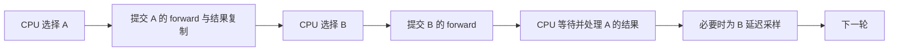
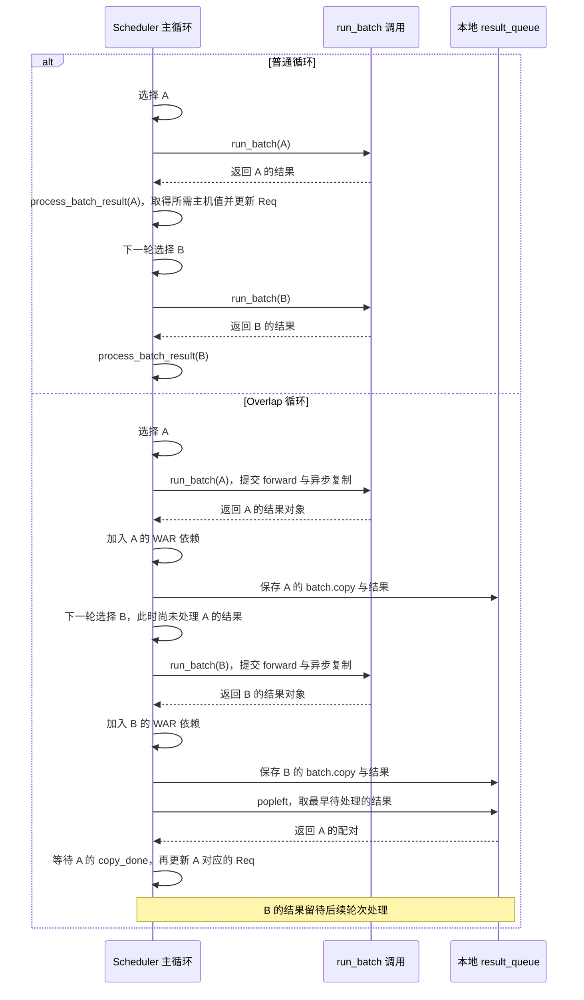
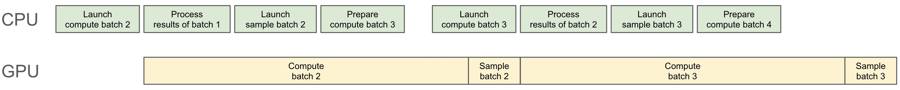
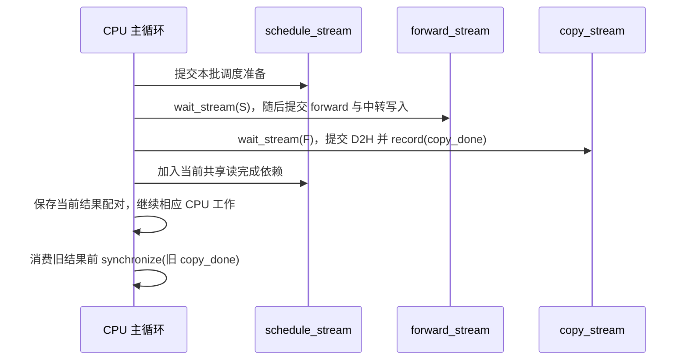

# Overlap 中的 CPU 与 GPU 依赖

> **先建立架构心智模型：** [M04 · 调度器架构与时间模型](<../architecture/04-调度器架构与时间模型.md>)。先看职责、数据和生命周期，再回到本篇源码细节。

普通循环把当前 batch 的结果处理完，再选择下一批。Overlap 把部分工作提前：下一批已经提交执行时，CPU 才处理上一批结果。于是一个新问题出现了：CPU 还没把上一 token 写进 Req.output_ids，下一批的 GPU 输入从哪里来？

本文为**源码分析型学习资料**，是系列第 **03-05** 篇。沿普通 Overlap 主线，把结果队列、FutureMap、三条 stream、事件、对象引用和请求收尾连起来。

## 0. 阅读基线与范围

| 项目 | 内容 |
| --- | --- |
| 源码路径基准 | SGLang 仓库根目录 `.`；本文源码位置均为仓内相对路径 |
| 分支 | `codex/sglang-source-study-20260909`，基于官方 `main` |
| commit | `72d5c5bb73cadd7ffbf5114e5f81e29d36b6c61a` |
| 读取日期 | `2026-09-09` |
| 工作区状态 | 学习源码 worktree 干净；原源码与 Wiki 既有资料保留 |
| 操作边界 | 静态阅读普通 Overlap 循环、forward/结果/采样交接、FutureMap、复制与引用保留、共享读事件的声明和代表发布路径；测试仅阅读 |
| 前置 | [03-01 普通循环](01-NormalEventLoop与调度主循环.md)、[02-03 Batch 对象](../02-request-lifecycle/03-Req与多种Batch对象的分工.md)、[03-04 分块调度](04-ChunkedPrefill与长请求调度.md) |
| 主线 | CUDA、普通文本 Dense/full-attention、单实例 TP/PP/DP=1、非投机生成；代表普通缓存路径；不进入 PD、PDMux、MLX、统一池压缩、Beam、SWA/Mamba、LoRA、多模态、会话或 KV offload |
| 教学例子 | R1 输入 8、输出上限 3，无早停、取消、回撤、分块、mixed、grammar 或延迟采样；容量足够，始终可接着 Decode |
| 单列的边界 | 连续 Prefill、grammar 延迟采样、投机长度回传、HIP 与图内共享读事件；不据此证明全部平台/模型组合 |

图表与逐轮数字是**整理者推演**，不是 CUDA trace。本次未安装、导入或执行 SGLang，没有运行模型、测试、故障注入或性能测量，也没有用静态阅读证明真实并发与资源复用安全。

为解释 CUDA API 的一般含义，另核对了 PyTorch 官方的 [Stream](https://docs.pytorch.org/docs/main/generated/torch.cuda.Stream_class.html)、[Event](https://docs.pytorch.org/docs/main/generated/torch.cuda.Event.html) 与 [CUDA semantics](https://docs.pytorch.org/docs/main/notes/cuda.html) 文档，读取日期同上，页面为 PyTorch main 文档。它们不由本篇 SGLang commit 固定，也不代表本机实际安装版本；SGLang 的具体调用位置仍以以下源码为准。

## 1. Overlap 提前了哪一部分工作

**人话版：** 厨师做下一道菜时，前台可以登记上一道菜的结果。前台仍决定接哪桌、排哪批；厨师也不能在食材没准备好时开工。Overlap 给工作安排提供重叠机会，依赖关系继续约束真正的执行顺序。

| 普通循环 | Overlap 的代表顺序 |
| --- | --- |
| 选 A → 执行 A → 处理 A → 选 B | 选 A → 提交 A → 选 B → 提交 B → 处理 A |
| CPU 结果处理在本轮推进 | 结果对象可留到后续轮次处理 |
| 下一轮通常已能看到 Req 的上轮输出状态 | 下一轮选批可能发生在 Req 上轮状态更新之前 |

这里“提交”表示执行命令进入相应路径，不保证 GPU 在 Python 函数返回时已经完成。普通主线的模型批次仍使用同一 forward_stream；Overlap 不等于两批模型计算一定在两条 stream 上同时运行。[S01][S02]



**图意解读：** 箭头是主循环中的提交/处理顺序，不是按比例绘制的耗时轴。GPU 何时真正执行，取决于后面的 stream 依赖和设备调度；不能从这张图读出加速倍数。

### 普通与 Overlap 的两批对照时序

下面让 A、B 表示相邻两次执行，固定无延迟采样、无本批次关闭重叠的普通生成条件。只比较 Scheduler 的调用与结果消费顺序；两种路径都使用各自已有的设备依赖。[S01][S02]



**图意解读：** Run 是函数调用位置，Q 是本地容器，都不代表新增进程或线程。普通循环先处理 A，再选择 B；Overlap 可以先选择并提交 B，再等待和处理 A，从而给 B 的设备工作与 A 的 CPU 结果处理留下重叠机会。GPU 仍按 stream/event 依赖执行，是否实际重叠、隐藏了多少开销必须另取 trace；调度决策始终由 CPU 上的 Scheduler 推进。事件方向见第 6 节，有限快照见第 8 节。

### 图解补充：CPU 与 GPU 怎样错开批次



[查看原尺寸](../../../images/sglang-source-study/07-overlap-scheduling.jpg)（手机查看宽图时可横屏或放大）。

**图意解读：** 分别沿 CPU、GPU 两条时间轴阅读：CPU 可以在 GPU 计算当前批次时处理前一批结果、准备下一批。跨行对应关系比单个色块长度更重要。

**对应本篇源码：** 由设计图回到 `event_loop_overlap`，继续追踪正文的 relay、结果队列及 stream 等待；不能只凭两行重叠就省去依赖。 [源码：python/sglang/srt/managers/scheduler.py][S01]

**来源与边界：** [SGLang v0.4: Zero-Overhead Batch Scheduler, Cache-Aware Load Balancer, Faster Structured Outputs](https://www.lmsys.org/blog/2024-12-04-sglang-v0-4/)，SGLang Team，2024-12-04。这是 SGLang v0.4 的设计图，只用于建立重叠直觉；本次源码的 relay、stream、event 和延迟采样依赖以正文为准，图中长度不是本次测量。 [来源档案 F07](../../../images/sglang-source-study/SOURCES.md#f07)。

## 2. 先认清对象和它们保存的东西

| 名称 | 人话解释 | 不能混同的对象 |
| --- | --- | --- |
| result_queue | 按顺序保存待 CPU 处理的 batch 快照与结果对象 | waiting_queue 中的待接纳请求 |
| last_batch | 上轮执行 batch 的调度引用 | 结果队列中独立构造的结果处理快照 |
| GenerationBatchResult | token、概率/辅助结果与复制/采样状态的容器 | 已经完整送到客户端的响应 |
| FutureMap | 按请求池行号保存跨轮设备值的中转区 | Python asyncio.Future、KV Cache 或任务调度器 |
| schedule_stream | 调度准备及相关设备操作使用的 stream | 一个独立 CPU 调度线程 |
| forward_stream | 模型执行、采样与相关中转写入的 stream | 已完成模型结果的标记 |
| copy_stream | 普通 CUDA 结果 D2H 复制使用的 stream | 等待所有 GPU 工作完成的全局屏障 |
| copy_done | 结果复制末尾记录的事件 | 下一批输入中转事件或 KV 退役证明 |
| batch_record_buf | 轮转保留 batch 字段等强引用的两格结构 | 页锁定 CPU 内存、深复制或完成事件 |

init_overlap 在普通模式也创建 FutureMap。它的输入中转不是 Overlap 独有能力；只有相应 Overlap 初始化才创建两格 batch_record_buf。[S03]

## 3. event_loop_overlap 一轮做什么

### 3.1 先按代码顺序追一遍

| 顺序 | 关键动作 | 此刻要留意的状态 |
| --- | --- | --- |
| 1 | ingest_requests；检查暂停状态 | 外部输入与控制消息仍在 CPU 处理 |
| 2 | get_next_batch_to_run，接收 NextBatchPlan | 下一批选择可能先于上一批结果提交到 Req |
| 3 | 判断是否本批次关闭重叠 | 适用时先 pop 并处理上一批 |
| 4 | 当前有 batch 就 run_batch | 返回结果对象，不等于主机数据已可读 |
| 5 | 加入 WAR 依赖，再 append(batch.copy(), result) | 保存该次结果应对应的成员和字段 |
| 6 | 若 last_batch 存在且未提前处理，pop 队首结果 | 通常处理上一批，不是刚 append 的当前批 |
| 7 | 必要时运行当前批延迟采样；更新 last_batch | 采样可依赖上一批结果推动的 grammar 状态 |

event_loop_overlap 用 deque 保存这组配对。正常稳态可在 append 当前结果后短暂有两项，随后 pop 旧的一项；它不是“队列永远只有一项”，也不是承诺可无限提前提交。[S01]

### 3.2 没有新 batch 时仍要处理尾部结果

若本轮 batch=None，但 last_batch 仍存在，循环仍会处理遗留结果。只有对应分支满足时才 on_idle；完整空闲检查还要求 Overlap 的 result_queue 为空。不能用“本轮没有 forward”替代“所有结果已处理”。[S01][S04]

本篇按正常推进解释队尾排空，不声称所有暂停、退出、进程异常或跨实例取消路径都由这个分支完整处理。那些路径必须另追控制消息及退役条件。

## 4. R1：为什么可能计算四批，却只保留三个输出

### 4.1 先给执行批与有效输出分别命名

R1 输入 8、输出上限 3，无其他请求。P 是首次 Prefill；D1、D2、D3 是随后三批 Decode。假设每次采样分别得到 y1、y2、y3、y4，且都不会提前触发 EOS/stop。

表中队列和有效输出在**本轮旧结果处理之后**观察；“提交”包含相应 forward/采样路径，不表示 CPU 已经使用该结果。

| 循环轮次 | 本轮提交 | 本轮处理的旧结果 | 轮末 result_queue | 轮末 R1 有效输出数 | 是否已登记结束 |
| --- | --- | --- | --- | ---: | --- |
| 1 | P，候选 y1 | 无 | [P] | 0 | 否 |
| 2 | D1，候选 y2 | P，追加 y1 | [D1] | 1 | 否 |
| 3 | D2，候选 y3 | D1，追加 y2 | [D2] | 2 | 否 |
| 4 | D3，候选 y4 | D2，追加 y3 并达到上限 | [D3] | 3 | 是 |
| 5 | 无新 batch | D3；R1 已结束，跳过其有效输出提交 | [] | 3 | 是 |
| 6 | 无新 batch | 无；进入相应 idle 检查 | [] | 3 | 是 |

第 4 轮选择 D3 时，CPU 还没处理 D2，R1.output_ids 仍只有两个输出；因此可以已有一批额外工作在途。第 5 轮的 Decode 结果处理先等待 copy_done，再对已 finished 或 retracted 的 Overlap 请求跳过追加。[S01][S05]

本例是四个执行批、三个有效输出、六个包含最终空闲检查的循环轮次；不能把它们当成同一计数。普通无 Overlap 的相同长度例子只需一次 Prefill 和两次 Decode，见[02-04](../02-request-lifecycle/04-一次Prefill到多轮Decode.md)。

### 4.2 结束和多算结果的处理仍有资源边界

正常停止由已处理结果更新 finish state，再进入相应释放路径；后续多算结果的跳过分支避免把 y4 再当有效输出。释放入口需要考虑已经多预留的槽位，不能只按客户端最后看见的 token 数推算分配数量。[S05][S06]

这个控制流证明“有跳过与释放路径”，不单独证明所有异步写入已经退役。请求池行、KV 分配器、backend 的共享读声明、stream 依赖及其他传输活动各有边界。本篇后续重点解释已有依赖，不把静态路径存在升级为 GPU 复用安全验收。

## 5. CPU 还没提交 y1，GPU 怎么得到它

### 5.1 输入不必绕回 Req.output_ids

普通生成走 _relay_forward_payload：从 batch_result.next_token_ids 构造 RelayPayload，再由 FutureMap.stash 把 token 写到 output_tokens_buf 的请求池行。下一批 resolve_forward_inputs 按 req_pool_indices 取出它，成为模型输入。[S07][S08][S09]

例如人为假设 R1 的请求池行号为 7，跨轮数据关系可写成：

```text
P 在设备上采样 y1
  → stash 到 output_tokens_buf[7]
  → D1 执行入口按行 7 读取 y1
  → D1 采样 y2，再写回同一行
```

这是教学行号，不是固定分配策略。普通主线的写入与下一轮设备读取由 forward_stream 中的顺序和跨 stream 准备依赖约束；无需先等 CPU 把 y1 追加到 Req.output_ids。

### 5.2 publish 与 stash 各管一部分值

| 方法/字段 | 当前源码职责 | 普通主线限制 |
| --- | --- | --- |
| FutureMap.publish | 写 new_seq_lens_buf；适用投机路径记录 publish_ready 等 | 普通生成也调用 publish，但不会因此创建投机专用事件 |
| FutureMap.stash | 写输出 token 及适用算法的其他中转字段 | 普通 RelayPayload 主要提供 bonus_tokens，即本轮采样 ID |
| resolve_forward_inputs | 从 CPU Prefill staging 或 FutureMap 生成 input_ids | 普通 Prefill/Decode/mixed 都可使用 |
| resolve_seq_lens_cpu | 为相应 spec_info.future_indices 解析最新长度 | 普通无 spec_info 路径直接返回 |

FutureMap 的索引是请求池行，不能与网络 request ID 字符串互换。它保存跨轮值，不决定谁该接纳、何时结束或哪段 KV 应淘汰。[S08][S10]

当前 CI 调试条件还可把未写/已消费的 token 槽位设为 -1，读取时检查非负并再次失效化，帮助暴露缺失中转写入。不能据此宣称所有生产配置都开启这些检查。[S09]

## 6. 三条 stream 之间，谁等谁

### 6.1 wait 不都意味着 CPU 停住

PyTorch 对同一 CUDA stream 保证提交顺序；跨 stream 需要显式依赖才能约束先后。`wait_stream`/`wait_event` 约束调用之后提交的设备操作，调用本身不以同样方式阻塞 CPU；Event.synchronize 则阻止 CPU 继续，直到事件覆盖的工作完成。参见 [CUDA stream 语义](https://docs.pytorch.org/docs/main/notes/cuda.html#cuda-streams)、[Stream 方法](https://docs.pytorch.org/docs/main/generated/torch.cuda.Stream_class.html) 与 [Event 方法](https://docs.pytorch.org/docs/main/generated/torch.cuda.Event.html)。

所以“CPU 已走过 wait_event 这一行”和“GPU 已到达对应事件”是两件事。事件记录点也只覆盖它之前的相关工作，不是所有未来计算的完成证明。

### 6.2 普通 CUDA 路径的三条依赖

| 依赖 | SGLang 调用位置 | 要防止什么 |
| --- | --- | --- |
| 调度准备 → forward | run_batch 中 forward_stream.wait_stream(schedule_stream) | 模型在输入/映射等准备操作之前读取 |
| 当前 forward 的共享读 → 后续调度写 | _apply_war_barrier 中 schedule_stream 等事件或 forward stream | 共享数据尚被读取时被后续调度改写 |
| 结果生产 → D2H → CPU 消费 | copy_stream.wait_stream(forward_stream)，copy_done.record，结果处理 synchronize | CPU 读到尚未复制完成的 token/概率/辅助输出 |

前两行分别是“先写后读”和“先读后写”的约束，方向不能交换。第三行是一条结果回程依赖，不替代下一步设备输入的 FutureMap 中转。[S02][S11][S12][S05]



**图意解读：** 箭头标示提交关系；CPU 不通过绘图箭头获得隐含的设备完成保证。当前批复制与下一批 forward 有重叠机会，真实重叠程度需要 trace；图没有省略掉 CPU 消费旧结果前的等待。

### 6.3 D2H 异步还需要源 tensor 活得足够久

普通 CUDA 的 _async_d2h 创建页锁定 CPU 目标，发起 non_blocking copy，并为源 tensor 调用 record_stream。GenerationBatchResult.copy_to_cpu 对所需字段做复制，最后记录 copy_done。[S12][S13]

这解决两个不同问题：copy_done 约束主机何时读目标；record_stream 配合 PyTorch 分配器避免复制流仍在使用源内存时过早回收。record_stream 本身不是“数据已就绪”的等待。PyTorch 官方也将 stream 同步与 tensor 存活分别说明：[CUDA semantics](https://docs.pytorch.org/docs/main/notes/cuda.html#cuda-streams)。

HIP 的普通非延迟结果分支在 forward stream 上调用复制，和这里的 CUDA copy_stream 路径不同；延迟采样又有单独复制路径。本篇不把三条 stream 的示意图直接泛化到所有设备。[S02][S14]

## 7. WAR 屏障：事件名不能替代共享读范围证明

### 7.1 Scheduler 怎样选择等待点

WAR 是 write-after-read，意思是防止后一次写覆盖仍被前一次读取的数据。run_event_loop 在 CUDA 上开启该屏障，其他平台可由相应环境字段开启；“环境字段声明默认 False”不能被解释为 CUDA 上默认没有屏障。[S15]

_apply_war_barrier 获取 model_worker.last_shared_read_runner 的 shared_read_done_event，并清掉该槽位。存在事件且未强制 coarse 时，schedule_stream 等该事件；否则等待当前 forward_stream。清空旧事件避免把上一轮的记录反复当成当前轮依赖。[S11][S16]

这里等待的是 backend/runner 声明的 scheduler-shared 读取边界，不能自动等同于“本 batch 的所有模型计算、全部 KV 使用、D2H 和外部 DMA 都结束”。

### 7.2 事件可能在 replay 前、中、后发布

SharedReadEnds 区分 PRE_REPLAY、IN_REPLAY、POST_REPLAY 和 UNKNOWN。DecodeCudaGraphRunner.execute 根据解析后的类别在相应位置发布或交出事件；未知而无事件的情况由调用侧走更粗的等待。[S17][S18][S33]

Prefill 的早期事件有单独开关，并要求对应 forward mode、算法门槛和 backend 声明符合条件。backend 如果仍在模型 forward 中读取调度共享数据，就不能仅凭准备元信息的函数已经返回而宣称 PRE_REPLAY 安全。[S19]

**本基线需要保留的限制：** `_resolve_shared_read_ends` 在 backend 声明 IN_REPLAY、却没有图内 marker 时，当前实际返回 PRE_REPLAY。源码 TODO 明确指出该点早于声明，POST_REPLAY 才是相应保守位置；所读单元断言也期待当前 PRE_REPLAY 行为。[S18][S20] 因此不能把这条回退写成“任何条件下都自动退到更晚的安全点”。这是静态边界发现，本次没有复现运行故障，也没有修改实现。

本篇只追了共享读声明、事件发布和消费链，未逐个核查所有 Attention backend 的真实最后一次读取。事件 API 正确使用与 backend 声明正确，是两项不同证据。

## 8. 为什么既要 batch.copy，又要保留两轮引用

### 8.1 结果配对用的是有限快照

ScheduleBatch.copy 为结果处理构造一个新 batch，reqs 使用列表切片；其余所需字段多为引用或当时的值。它不会深复制每个 Req，也不复制全部 tensor 数据。[S21]

例如原 batch 后续从 `[R1,R2]` 改为 `[R2]`，旧结果快照仍有两条成员；但旧快照中的 R1/R2 对象仍可能已被下一轮更新。需要历史数值的功能必须保存相应字段，不能只持有 Req 引用就认为状态被冻结。

普通 prepare_for_decode 使用 `self.seq_lens = self.seq_lens + 1` 产生新 tensor，避免就地覆盖被先前执行持有的引用；某些 Mamba 路径还保存额外的本批计数快照。这里只用它说明为什么“复制成员列表”不足以冻结成员内部状态。[S22]

### 8.2 forward 隔离与存活引用解决另一类问题

_forward_isolation 暂时替换 sampling_info 为 copy_for_forward 的结果。普通非投机路径退出时恢复调度侧 sampling_info；投机路径还会恢复更完整的 batch 字段快照。copy_for_forward 先整理 penalty，再移除复制对象中的 orchestrator，避免后续重复驱动同一累积逻辑。[S23][S24]

Overlap 期间 record_batch_in_overlap 将 batch 与字段引用快照放入两格轮转结构，worker 的 extra_keep_alive_refs 也可追加进去。其目的在于让跨 stream 使用的对象/张量继续存活，不是复制 KV，也不是用“过了两轮”代替 CUDA 完成事件。[S25][S02]

这三件事要分别记：

| 机制 | 保护的关系 |
| --- | --- |
| 结果 batch.copy | 这份结果对应哪些成员、模式和必要字段 |
| _forward_isolation | forward 中临时重绑不污染后续调度状态 |
| batch_record_buf / record_stream | 已提交设备工作仍用到的引用和内存不会被过早回收 |

其中一个机制存在，不能据此省略另外两个，也不能推断任意嵌套可变对象均被隔离。

## 9. 延迟采样：forward 可以先走，决定 token 还要等状态

### 9.1 普通 grammar 为什么有额外顺序

TpModelWorker 的普通生成路径在 Overlap、非投机且有 grammar，或命中相应延迟采样环境条件时，可以只返回捕获了 logits/forward_batch 的 delay_sample_func。[S26]

主循环先处理上一批结果，再 launch_batch_sample_if_needed。该函数在 forward stream 等待调度 stream 后调用闭包，随后中转采样 token、安排 D2H。这样当前采样可以使用上一批结果已经推进的 grammar 状态，而非提前按旧状态选择 token。[S01][S14]

这不等于“下一批无需上一批 token 就能 forward”。下一批模型输入与当前 token 选择是不同依赖；FutureMap 的输入中转仍然存在。

### 9.2 采样闭包也有生命周期

延迟采样完成并安排结果复制后，代码清除 delay_sample_func，并释放已不再需要的 next_token_logits 引用，避免结果队列继续持有闭包捕获的大对象。[S14]

因此结果对象刚入队时不一定已经包含最终采样与主机副本。排查时要记录 delay_sample_func 是否还存在、采样有没有调用、copy_done 在哪里记录，不能只检查 result_queue 长度。

## 10. 哪些情况会改变本篇顺序

| 变化 | 当前已读分支 | 不能直接沿用的结论 |
| --- | --- | --- |
| 连续两批 extend | 环境字段允许时先处理上一批，再提交当前批 | 普通稳态“先提交后处理”的先后不适用于该轮 |
| 投机 grammar 同步 | is_disable_overlap_for_batch 与 worker grammar barrier 有分工 | 不能把非投机延迟采样闭包当所有算法的统一方案 |
| 投机接受长度尚未知 | FutureMap 的 publish_ready、GPU 长度与可选 CPU 镜像 | 普通每轮固定加一的长度准备不能直接照搬 |
| 不需要 CPU seq_lens 的后端 | 相应 spec resolve 可走 GPU-only 路径 | 不能把所有长度解析都画成强制 D2H |
| CUDA spec 长度回传 | 私有 D2H stream 等 publish event，再同步该 stream | 有 Overlap 不等于整个 CPU 路径从不阻塞 |
| 统一池 | run_batch 还记录 forward_done 并交给 allocator 跟踪在途写集合 | 它与 copy_done、shared_read_done 不同；本篇不证明压缩/复用算法 |
| PP、PD、PDMux、MLX | dispatch_event_loop 有各自更早的分发条件或专用循环 | 不能只凭 enable_overlap 就套用本篇 event_loop_overlap |

连续 Prefill 开关在这份源码的声明默认值为 False；它的注释描述的是预期取舍，不是本次实测 TTFT 改善。DP 条件使用同步后的 extend 标志，完整多 rank 行为留到后续阶段。[S27][S28]

投机小节这里只确认 FutureMap 的事件与 CPU 镜像分支。它的 callback 发布时点、接受长度、draft 数据及算法正确性还需要阶段 08 的完整追踪。[S10]

## 11. 把常见症状反查到具体依赖

| 现象 | 先核对的证据 | 应区分什么 |
| --- | --- | --- |
| Req.output_ids 落后于设备输入 | 本批/上批编号、FutureMap 行、结果处理时点 | 设备中转与 CPU 有效输出提交不同 |
| 刚启动就从中转区读到无效 token | 请求池行、前一次 stash、当前 resolve 和 CI 失效化条件 | 行号配对、写入缺失与真实 token 值分别检查 |
| batch.copy 后字段继续变化 | 列表身份、Req 身份、tensor 重绑/就地修改 | 有限快照不是深冻结 |
| CPU 卡在 copy_done.synchronize | 复制是否提交、事件是否记录、对应 stream 的进度 | 等待点不自动是根因；需查生产与复制链 |
| wait_event 已返回却仍看到 GPU 未完成 | 后续操作所在 stream、事件记录位置 | 设备依赖提交与 CPU 阻塞等待不同 |
| 显存持续增长 | 结果队列、引用轮转、闭包、logits、辅助输出 | 存活引用与 KV 缓存占用分开；有引用不自动等于泄漏 |
| 停止后还有一批结果 | 选批早于旧结果处理的时点、finished/retracted 跳过分支 | 多算候选不应再变成有效输出 |
| 开了 Overlap 却没有明显并行 | 实际分发、stream 身份、coarse 等待、后端/复制时间 | 开关不能证明 trace 中实际重叠或性能提升 |
| 怀疑共享池被提前改写 | WAR 是否生效、真实最后读点、事件类别和后续写所在 stream | 事件名、backend 声明与实际数据读写范围不同 |

性能记录应同时保留 CPU 选批/结果处理区间、设备 forward、复制区间以及相关事件顺序。Python run_batch 返回耗时不能直接当 GPU 执行耗时；本篇没有提供看似实测的耗时数字。

## 12. 本次已读测试的证据范围

| 测试入口 | 本次实际阅读的内容 | 未证明的部分 |
| --- | --- | --- |
| `test/registered/unit/managers/test_scheduler_decision_batch_params.py` | 显式 batch 参数约束；构造条件下 extend/decode 交界不额外关闭重叠 | 没有真实 GPU/DP 时序验证 |
| `test/registered/unit/sampling/test_sampling_batch_info.py` 的 TestCopyForForward | 复制对象移除 orchestrator、原对象仍持有它 | 没有证明所有内部 tensor/状态被深复制 |
| `test/registered/unit/managers/test_batch_result_processor_mamba_boundary.py` 的首项轮次测试 | 模拟下一轮是否推进时，结果观察到 0 或 1 批 lookahead | 使用 mock forward、分配与 WAR；不证明 CUDA/Mamba 并发安全 |
| `test/registered/unit/model_executor/runner/test_decode_cuda_graph_shared_read_fence.py` | 声明映射、图内 marker 交接和事件记录；包含当前较早回退的断言 | 测试期望不是所有共享读已经结束的设备证据 |
| `test/registered/unit/model_executor/runner/test_prefill_shared_read_done.py` | 开关、mode、算法与 backend 声明的事件发布门控 | 假事件不会实际等待 CUDA 工作 |

全部仅阅读，没有运行这些测试。[S20][S29][S30][S31][S32] 本次验证限于文档、源码定位与教学队列/计数，不能写成“Overlap 已通过功能或性能验收”。

## 13. 源码锚点与复读顺序

| 问题 | SGLang 仓内路径与符号 | 固定入口 |
| --- | --- | --- |
| 结果排队与消费顺序？ | `python/sglang/srt/managers/scheduler.py::Scheduler.event_loop_overlap` | [主循环][S01] |
| 三条 stream 的提交在哪里？ | `python/sglang/srt/managers/scheduler.py::Scheduler.run_batch` | [执行入口][S02] |
| 哪些结构在普通模式也创建？ | `python/sglang/srt/managers/scheduler.py::Scheduler.init_overlap` | [初始化][S03] |
| 停止后的多算结果怎样处理？ | `python/sglang/srt/managers/scheduler_components/batch_result_processor.py::SchedulerBatchResultProcessor.process_batch_result_decode` | [结果消费][S05] |
| token 如何跨轮交接？ | `python/sglang/srt/managers/scheduler.py::Scheduler._relay_forward_payload`；`python/sglang/srt/managers/overlap_utils.py::FutureMap.stash` | [载荷选择][S07]、[中转写入][S08] |
| 真正的 input_ids 在哪里读？ | `python/sglang/srt/managers/overlap_utils.py::resolve_forward_inputs` | [输入物化][S09] |
| spec 长度何时需要 CPU 镜像？ | `python/sglang/srt/managers/overlap_utils.py::FutureMap.resolve_seq_lens_cpu` | [条件与等待][S10] |
| WAR 等待哪一个事件？ | `python/sglang/srt/managers/scheduler.py::Scheduler._apply_war_barrier` | [事件消费][S11] |
| 结果复制如何保护源 tensor？ | `python/sglang/srt/managers/utils.py::_async_d2h`；同文件 `GenerationBatchResult.copy_to_cpu` | [复制末尾事件][S12]、[存活保护][S13] |
| backend 声明与图事件怎样对应？ | `python/sglang/srt/layers/attention/base_attn_backend.py::SharedReadEnds`；`python/sglang/srt/model_executor/runner/decode_cuda_graph_runner.py::DecodeCudaGraphRunner._resolve_shared_read_ends` | [声明][S17]、[当前映射][S18] |
| Prefill 早期事件有哪些前提？ | `python/sglang/srt/model_executor/runner_utils/shared_read_event.py::maybe_publish_prefill_shared_read_done` | [局部发布][S19] |
| 结果快照保留哪些字段？ | `python/sglang/srt/managers/schedule_batch.py::ScheduleBatch.copy` | [有限快照][S21] |
| forward 怎样与调度状态隔离？ | `python/sglang/srt/managers/scheduler.py::Scheduler._forward_isolation`；同类 `record_batch_in_overlap` | [字段恢复][S23]、[引用存活][S25] |
| 为什么有延迟采样闭包？ | `python/sglang/srt/managers/tp_worker.py::TpModelWorker.forward_batch_generation`；`python/sglang/srt/managers/scheduler.py::Scheduler.launch_batch_sample_if_needed` | [创建条件][S26]、[调用与清理][S14] |
| 什么时候先处理旧结果？ | `python/sglang/srt/managers/scheduler.py::Scheduler.is_disable_overlap_for_batch` | [每批次判定][S27] |

## 14. 自测、验收与下一篇

1. FutureMap 存在，是否证明 enable_overlap=True？为什么下一批输入可以早于 Req.output_ids 更新？
2. R1 上限 3 的例子中，为什么第 4 轮还能提交 D3？y4 最后是否进入有效输出？
3. result_queue 从一项变两项再变一项，是否意味着顺序错了？
4. wait_stream、copy_done.synchronize、record_stream 各解决什么问题？
5. ScheduleBatch.copy 后，列表成员引用的 Req 是否被冻结？
6. shared_read_done_event 存在，能否推断所有 KV、复制与远端写都已结束？
7. 为什么普通 grammar 的采样闭包放在上一批结果处理之后？

<details>
<summary>参考答案与验收要点</summary>

1. 不能，普通模式也用中转。GPU 通过按请求池行保存的 token 取输入，不必先绕回 CPU 的有效输出列表。
2. 选批发生在 D2 结果处理之前，CPU 当时仍只登记两个输出。后续处理 D3 时 R1 已结束，y4 不再提交。
3. 不意味着错误。正常稳态先 append 当前配对，再 pop 旧配对，可以短暂有两项。
4. wait_stream 建设备执行依赖；copy_done.synchronize 等主机可消费事件；record_stream 配合分配器保护跨流使用的内存存活。
5. 没有。reqs 列表被复制，Req 仍共享；历史数值需要另存。
6. 不能。必须核对事件记录范围、backend 声明、实际读写及其他活动；本基线还有应保留的回退限制。
7. 上一批结果要先推进 grammar 状态，当前采样再使用对应约束；forward、采样与 CPU 输出提交并非同一个时点。

验收时应能画出“准备→forward”“共享读→后续写”“复制→CPU 消费”三条方向不同的依赖，并复算 R1 的队列与有效输出表。不以背诵 stream 名称作为掌握机制。

</details>

本篇已核对源码路径/符号、固定行号、文档导航及教学队列计数；没有执行 SGLang 或所列测试。Mermaid 只做静态对应检查，未运行渲染器。

下一篇为 [03-06《回撤、背压、饥饿与调度排障》](06-回撤背压饥饿与调度排障.md)，把运行不前进的不同原因按队列、预算、延迟接纳与状态退役拆开。返回[系列目录](../README.md)或[学习进度](../appendices/06-学习进度与版本变更记录.md)。

[S01]: https://github.com/sgl-project/sglang/blob/72d5c5bb73cadd7ffbf5114e5f81e29d36b6c61a/python/sglang/srt/managers/scheduler.py#L1928
[S02]: https://github.com/sgl-project/sglang/blob/72d5c5bb73cadd7ffbf5114e5f81e29d36b6c61a/python/sglang/srt/managers/scheduler.py#L4199
[S03]: https://github.com/sgl-project/sglang/blob/72d5c5bb73cadd7ffbf5114e5f81e29d36b6c61a/python/sglang/srt/managers/scheduler.py#L1603
[S04]: https://github.com/sgl-project/sglang/blob/72d5c5bb73cadd7ffbf5114e5f81e29d36b6c61a/python/sglang/srt/managers/scheduler.py#L4762
[S05]: https://github.com/sgl-project/sglang/blob/72d5c5bb73cadd7ffbf5114e5f81e29d36b6c61a/python/sglang/srt/managers/scheduler_components/batch_result_processor.py#L889
[S06]: https://github.com/sgl-project/sglang/blob/72d5c5bb73cadd7ffbf5114e5f81e29d36b6c61a/python/sglang/srt/managers/scheduler_components/batch_result_processor.py#L1126
[S07]: https://github.com/sgl-project/sglang/blob/72d5c5bb73cadd7ffbf5114e5f81e29d36b6c61a/python/sglang/srt/managers/scheduler.py#L4457
[S08]: https://github.com/sgl-project/sglang/blob/72d5c5bb73cadd7ffbf5114e5f81e29d36b6c61a/python/sglang/srt/managers/overlap_utils.py#L248
[S09]: https://github.com/sgl-project/sglang/blob/72d5c5bb73cadd7ffbf5114e5f81e29d36b6c61a/python/sglang/srt/managers/overlap_utils.py#L70
[S10]: https://github.com/sgl-project/sglang/blob/72d5c5bb73cadd7ffbf5114e5f81e29d36b6c61a/python/sglang/srt/managers/overlap_utils.py#L513
[S11]: https://github.com/sgl-project/sglang/blob/72d5c5bb73cadd7ffbf5114e5f81e29d36b6c61a/python/sglang/srt/managers/scheduler.py#L1879
[S12]: https://github.com/sgl-project/sglang/blob/72d5c5bb73cadd7ffbf5114e5f81e29d36b6c61a/python/sglang/srt/managers/utils.py#L130
[S13]: https://github.com/sgl-project/sglang/blob/72d5c5bb73cadd7ffbf5114e5f81e29d36b6c61a/python/sglang/srt/managers/utils.py#L31
[S14]: https://github.com/sgl-project/sglang/blob/72d5c5bb73cadd7ffbf5114e5f81e29d36b6c61a/python/sglang/srt/managers/scheduler.py#L4510
[S15]: https://github.com/sgl-project/sglang/blob/72d5c5bb73cadd7ffbf5114e5f81e29d36b6c61a/python/sglang/srt/managers/scheduler.py#L1839
[S16]: https://github.com/sgl-project/sglang/blob/72d5c5bb73cadd7ffbf5114e5f81e29d36b6c61a/python/sglang/srt/managers/tp_worker.py#L93
[S17]: https://github.com/sgl-project/sglang/blob/72d5c5bb73cadd7ffbf5114e5f81e29d36b6c61a/python/sglang/srt/layers/attention/base_attn_backend.py#L22
[S18]: https://github.com/sgl-project/sglang/blob/72d5c5bb73cadd7ffbf5114e5f81e29d36b6c61a/python/sglang/srt/model_executor/runner/decode_cuda_graph_runner.py#L515
[S19]: https://github.com/sgl-project/sglang/blob/72d5c5bb73cadd7ffbf5114e5f81e29d36b6c61a/python/sglang/srt/model_executor/runner_utils/shared_read_event.py#L26
[S20]: https://github.com/sgl-project/sglang/blob/72d5c5bb73cadd7ffbf5114e5f81e29d36b6c61a/test/registered/unit/model_executor/runner/test_decode_cuda_graph_shared_read_fence.py#L35
[S21]: https://github.com/sgl-project/sglang/blob/72d5c5bb73cadd7ffbf5114e5f81e29d36b6c61a/python/sglang/srt/managers/schedule_batch.py#L3594
[S22]: https://github.com/sgl-project/sglang/blob/72d5c5bb73cadd7ffbf5114e5f81e29d36b6c61a/python/sglang/srt/managers/schedule_batch.py#L3345
[S23]: https://github.com/sgl-project/sglang/blob/72d5c5bb73cadd7ffbf5114e5f81e29d36b6c61a/python/sglang/srt/managers/scheduler.py#L4155
[S24]: https://github.com/sgl-project/sglang/blob/72d5c5bb73cadd7ffbf5114e5f81e29d36b6c61a/python/sglang/srt/sampling/sampling_batch_info.py#L466
[S25]: https://github.com/sgl-project/sglang/blob/72d5c5bb73cadd7ffbf5114e5f81e29d36b6c61a/python/sglang/srt/managers/scheduler.py#L4139
[S26]: https://github.com/sgl-project/sglang/blob/72d5c5bb73cadd7ffbf5114e5f81e29d36b6c61a/python/sglang/srt/managers/tp_worker.py#L593
[S27]: https://github.com/sgl-project/sglang/blob/72d5c5bb73cadd7ffbf5114e5f81e29d36b6c61a/python/sglang/srt/managers/scheduler.py#L2002
[S28]: https://github.com/sgl-project/sglang/blob/72d5c5bb73cadd7ffbf5114e5f81e29d36b6c61a/python/sglang/srt/environ.py#L619
[S29]: https://github.com/sgl-project/sglang/blob/72d5c5bb73cadd7ffbf5114e5f81e29d36b6c61a/test/registered/unit/managers/test_scheduler_decision_batch_params.py#L30
[S30]: https://github.com/sgl-project/sglang/blob/72d5c5bb73cadd7ffbf5114e5f81e29d36b6c61a/test/registered/unit/sampling/test_sampling_batch_info.py#L507
[S31]: https://github.com/sgl-project/sglang/blob/72d5c5bb73cadd7ffbf5114e5f81e29d36b6c61a/test/registered/unit/managers/test_batch_result_processor_mamba_boundary.py#L90
[S32]: https://github.com/sgl-project/sglang/blob/72d5c5bb73cadd7ffbf5114e5f81e29d36b6c61a/test/registered/unit/model_executor/runner/test_prefill_shared_read_done.py#L48

[S33]: https://github.com/sgl-project/sglang/blob/72d5c5bb73cadd7ffbf5114e5f81e29d36b6c61a/python/sglang/srt/model_executor/runner/decode_cuda_graph_runner.py#L1448
