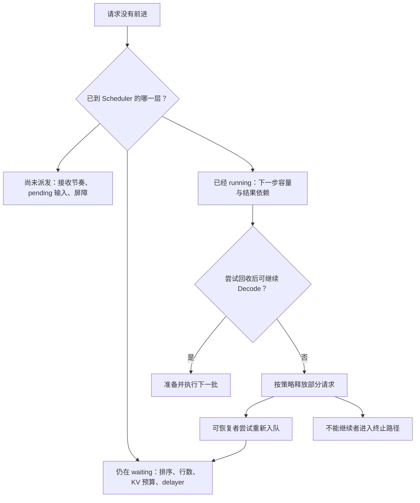
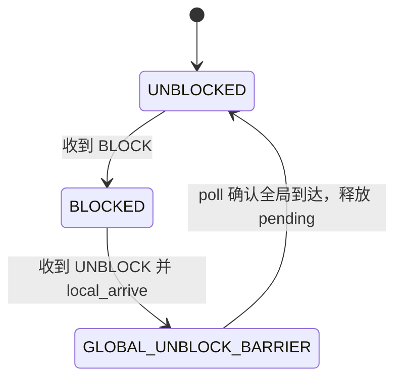

# 回撤、背压、饥饿与调度排障

请求没有新输出，可能是还没进入 Scheduler，也可能已经进入等待队列却没通过准入，还可能已经运行过、刚释放 KV 回队重试。看见一个不断增长的队列，不能直接把这些情况都叫作“GPU 卡死”。

本文是**源码分析型学习资料**，是系列第 **03-06** 篇，也是阶段 03 的收尾。沿“请求停在哪里 → 哪个条件阻止前进 → 什么状态会解除它”的顺序，连接回撤、延迟接纳、输入阻塞与诊断证据。

## 0. 阅读基线与范围

| 项目 | 内容 |
| --- | --- |
| 源码路径基准 | SGLang 仓库根目录 `.`；本文源码位置均为仓内相对路径 |
| 分支 | `codex/sglang-source-study-20260909`，基于官方 `main` |
| commit | `72d5c5bb73cadd7ffbf5114e5f81e29d36b6c61a` |
| 读取日期 | `2026-09-09` |
| 工作区状态 | 学习源码 worktree 干净；原源码与 Wiki 既有资料保留 |
| 操作边界 | 静态阅读普通 Decode 回撤、回队、延迟准入、输入门控、池账本与 Scheduler watchdog；相关测试仅阅读 |
| 前置 | [03-02 集合交接](02-连续批处理与队列状态.md)、[03-03 排序与预算](03-排序策略与准入预算.md)、[03-05 Overlap 依赖](05-Overlap中的CPU与GPU依赖.md) |
| 主线 | 普通文本 Dense/full-attention、非投机、单实例 TP/PP/DP=1、代表普通 RadixCache/静态 KV 池；回撤例子采用普通非 Overlap 轮次 |
| 独立增加的变化 | 优先级抢占；Overlap 下的 PrefillDelayer；输入阻塞协议；多 rank 协商只解释字段与门槛 |
| 不展开 | PD 重引导/备份、全部混合池、统一池字节压缩、Beam、Mamba/SWA、LoRA、输入 embedding、真实网络/GPU 故障及全部诊断工具 |

教学数值、因果图和排查顺序是**整理者推演**。本次没有安装、导入或运行 SGLang，没有启动服务、发送控制请求、运行测试、制造 OOM 或采集 GPU trace；源码检查不等于真实系统已通过并发与性能验证。

**缓存实现选择：** 本篇用传统 `RadixCache` 讲解基本机制。固定基线的[默认缓存工厂](https://github.com/sgl-project/sglang/blob/72d5c5bb73cadd7ffbf5114e5f81e29d36b6c61a/python/sglang/srt/mem_cache/registry.py#L80)在未命中特殊分支时创建 `UnifiedRadixCache`；实际组件与生命周期见 [04-04](../04-kv-cache/04-UnifiedRadix与混合状态组件.md)和 [04-07](../04-kv-cache/07-KV缓存全生命周期与排障.md)。阅读本篇账本时保留上表的实现条件。

## 1. 先给“不前进”分层

**人话版：** 餐厅有门口、候位区、备菜台和灶台。门口暂缓收单、候位区满员、正在做的菜退回备菜台、灶台故障，是四种不同问题。先确定订单的位置，再寻找相应的放行条件。

| 层次 | 源码中要找的对象 | 当前受阻意味着什么 | 哪个证据不能单独替代它 |
| --- | --- | --- | --- |
| 输入接收前后 | recv_skipper、InputBlocker、接收与广播链 | 这一轮可能没拉取，或消息已被暂存 | waiting_queue 为空不证明客户端没提交 |
| 等待进入执行 | waiting_queue、batch_is_full、Adder、delayer | 请求存在，但顺序、容量或延迟条件尚未允许接纳 | 排第一不等于本轮会执行 |
| 下一步 Decode | allocator.check_decode_capacity | 下一步所需容量在尝试回收后仍不足 | GPU 总显存使用率不等于 KV 池的可分配量 |
| 结果消费 | result_queue、copy_done、finished/retracted | 设备工作和 CPU 请求状态处在不同推进点 | forward 计数增加不等于客户端拿到新输出 |
| 终止与诊断 | AbortReq、超时轮询、watchdog、invariant checker | 请求退出或诊断条件成立 | 超时日志不自动定位到 CUDA、通信或 Python 的具体根因 |

这里把“背压”作为限制继续流入或接纳工作的教学统称；表中有暂缓、排队和拒绝三种动作，不宣称它们构成统一的网络流控协议。



**图意解读：** 方框是诊断层次和动作，不是独立进程。I 写“尝试”，因为回队仍可能被队列上限拒绝；图也没有把回撤直接画成重新执行完成。[S01][S11][S12]

## 2. 下一步 Decode 的容量不足，具体在哪里判断

### 2.1 先尝试可回收缓存，再决定是否回撤请求

update_running_batch 先 filter 掉不再参与的成员；若非空，调用 batch.check_decode_mem。后者计算下一步需求，并把容量判断交给 allocator.check_decode_capacity。[S01][S02]

代表普通分配器的关键逻辑是：

```python
# python/sglang/srt/mem_cache/allocator/base.py
self.evict_to_free_tokens(tree_cache, num_tokens)
return self.available_size() >= num_tokens
```

**行为：** 先尝试把可淘汰缓存转成可分配空间，再比较需求。因此一次 check 不只是读取一个计数，还可能触发回收。更复杂分配器可以覆盖该接口；不能把这一行 token 比较推广成所有池的完整容量模型。[S03]

### 2.2 “一条请求生成一个 token”不一定只需一个物理槽位

本篇普通无 Beam/投机路径，new_tokens_required_next_decode 按 committed 长度是否位于页边界统计新增页：

```text
所需新增 token 容量
  = 到达页边界的请求数 × page_size
```

例如教学 page_size=4，三个请求的 kv_committed_len 分别为 8、9、12，下一步按该门槛需要 2×4=8 个 token 容量；不是请求数 3，也不是输入长度之和。真实分配、缓存锁和余量仍要交给对应分配器处理。[S48]

一旦这个门槛失败，update_running_batch 进入 retract_decode。调试开关 TEST_RETRACT 也能让这条路径在指定 forward 计数间隔被调用，因此日志中的 Testing retraction 不能当作真实容量不足证据。[S01][S46]

## 3. 回撤不是 abort：先缩小运行集合，再看能否继续

### 3.1 排序返回的是“优先保留顺序”

_get_decode_retraction_order 返回最想保留到最不想保留的索引，retract_decode 从列表尾部 pop。默认 length 策略优先保留输出较长的请求；输出一样时，更长输入的请求先回撤。[S04][S05]

| 教学请求 | 输入数 | 当前有效输出数 | length_key=(输出数, -输入数) | 保留顺序 |
| --- | ---: | ---: | --- | --- |
| R1 | 8 | 2 | (2,-8) | 第一 |
| R2 | 8 | 1 | (1,-8) | 第二 |
| R3 | 20 | 1 | (1,-20) | 第三；先被 pop 回撤 |

这是当下字段的排序，不是已经测量过的重算代价最优解。改为 priority 策略时先比较优先级，再以长度打破同分；数值方向由 schedule_low_priority_values_first 决定。源码校验要求 priority 回撤策略同时开启优先级调度。[S05][S31]

### 3.2 retract_decode 的三类输出

| 返回/状态 | 当前代码如何形成 | 外层下一步 |
| --- | --- | --- |
| 留在 batch 的成员 | 移除部分索引后，再检查下一步容量，并按 keep_indices 过滤 | 非空才 prepare_for_decode |
| retracted_reqs | release_req 成功，具备该路径的恢复条件 | 尝试重新入队 |
| reqs_to_abort | 最后一条仍无法容纳，或命中不支持恢复的局部分支 | 发送对应终止原因 |

循环有 first_iter，调用后在多成员情况下至少先移除一个；这也支持强制回撤的调试入口。它通常保留至少一条以争取继续 Decode，但后面还有一次容量检查：若最后一条仍放不下，就设置 FINISH_ABORT、释放并过滤掉它。因此“永远保留一个请求”不是这份实现的最终保证。[S04]

Beam 组在已读分支会终止而不回队；Decode 分离的 host 备份失败也会终止。本篇只记录这些分支存在，完整恢复/退役机制留到相应专题。

### 3.3 release_req 释放什么，Req 又保留什么

普通路径调用 release_kv_cache(req, tree_cache, is_insert=False)，避免为本次回撤新增保留的前缀；随后尝试淘汰新变为可回收的容量，再 reset_for_retract。已有共享前缀的锁、其他请求引用和页边界仍由缓存实现决定，不能简单说“该请求全部 KV 都无条件消失”。[S06][S07]

| 字段/关系 | 回撤后的代表状态 | 生命周期含义 |
| --- | --- | --- |
| retraction_count | 加一 | 同一请求的累计回撤次数 |
| is_retracted / retracted_stain | 均设为 True | 前者标记当前回撤状态，后者保留曾回撤的历史 |
| prefix_indices、last_node、extend_range | 清空/置 None | 旧一轮匹配和计算范围失效，重新准备 |
| kv.cache_protected_len、kv_committed_len | 重置 | 旧持有关系已由释放路径解除；reset 还断言不再 holds_kv |
| origin_input_ids、普通 output_ids | 保留 | 用户输入和已经生成的文本 token 历史不会因普通回撤归零 |
| 部分 logprob 临时量、chunk 与阶段计数 | 重置 | 重新 Prefill 时重建相关执行材料 |

重新接纳时 init_next_round_input 刷新输入历史并重新匹配缓存；prepare_for_extend 将 is_retracted 改回 False，retracted_stain 继续阻止把重算重复记成首次缓存命中。输入 embedding 特例会丢弃 output_ids，本篇普通文本结论不适用于它。[S08][S09][S10]

## 4. 用 R1 走一遍回撤、回队与恢复

R1 的输入仍为 8、输出上限仍为 3。在本例中，CPU 已提交 y1、y2，后来 R1 成为被选择回撤的对象。仅展示 R1 的生命周期，不把它与上一张三请求排序表视为同一次选择；假设回队未被拒绝，后续容量足够且没有 EOS/取消。

| 观察点 | R1 在哪里 | 有效输出数 | 本轮要重新构造什么 | 是否已结束 |
| --- | --- | ---: | --- | --- |
| 回撤前 | running | 2 | 已有可继续 Decode 的状态 | 否 |
| release/reset 后 | 从运行集合移出，准备回队 | 2 | 原 KV 持有关系解除，旧 prefix/范围失效 | 否 |
| 成功入队后 | waiting | 2 | 重新经过排序、延迟和资源门槛 | 否 |
| 再次准入 | Prefill 候选/新 batch | 2 | 按 8+2=10 个历史 token 匹配 prefix，补算未命中部分 | 否 |
| 本次 Prefill 结果提交 | 结果处理 | 3 | 在现有两 token 后追加 y3，达到原上限 | 是 |

_refresh_fill_ids 维护的是 origin_input_ids + output_ids；所以重算历史长度为 10，不能再把它记作客户端输入从 8 变成 10。也不需要把 y1、y2 当新输出再发一次。[S45]

普通回队调用 _add_request_to_queue，会重新写 wait_queue_entry_time 和 arrival_processed_tokens。因而一次请求可能有多次候位区进入时间；本轮 waiting 时长不是天然等于客户端从最初提交到现在的总等待。[S11]

**重要分支：** _add_request_to_queue 在普通模式先调用 _abort_on_queued_limit。即使它来自 retracted_reqs，队列已满时也可能被拒绝；成功 release 与 reset 不保证稍后一定恢复。[S11][S12]

## 5. 回撤后的预算反馈、抢占与拒绝要分开

### 5.1 new_token_ratio 不等于实际输出长度

回撤后，NewTokenRatioTracker 根据**保留成员**估计新的输出预留比例：

```text
ratio = min(1,
  (保留成员已有输出总数 + RETRACT_DECODE_STEPS × 保留成员数)
  / (保留成员 max_new_tokens 总数 + 1))
```

它用于后续容量估算；没有修改请求自身的停止上限。这里没有与旧 ratio 取 max，所以不能说“每次回撤必然提高比例”。没有回撤的相应 update 路径做 decay_step，完整空闲时 reset 到初值。[S01][S13][S26]

### 5.2 三种“让出位置”的区别

| 路径 | 触发依据 | 被影响者去向 | 不能混同的结论 |
| --- | --- | --- | --- |
| Decode 容量回撤 | 下一步容量不足，或调试入口 | 可恢复者回队，无法继续者终止 | 不等于新请求优先级更高 |
| 优先级抢占 | 新候选与运行成员差值严格超过门槛，并满足移出预算判断 | release/filter 后由 preempt_list 交回队列路径 | 抢占成功不替代后续全部准入检查 |
| waiting 队列满 | 新入队将超过 max_queued_requests | 默认拒绝新来者；优先级开启时可终止更低优先级候位者 | 这是终止/替换候位者，不是把它再次回队 |

preempt_to_schedule 排除已经 finished 的运行成员，避免在“KV 已释放、batch 尚未过滤”的窗口再次释放。其布尔返回说明本次抢占动作是否提交；外层仍继续尝试新候选。[S14][S15]

队列满的优先级替换要求新来者严格更优；同优先级不会只因更晚到来而替换。终止输出使用 SERVICE_UNAVAILABLE 的状态码。这里描述源码协议对象，不声称本次实际收到了 HTTP 响应。[S12]

## 6. PrefillDelayer：有资源也可以暂缓这次接纳

### 6.1 它在准入链中的位置

**人话版：** 灶台可以做一道新菜，但店里可能稍等几单一起备菜，或等其他协作工位也能开始。PrefillDelayer 做这种局部延迟判定，调度器和 Adder 仍掌握真正接纳。

get_new_batch_prefill 创建一次性的 SinglePassExecutor，传入各池最大使用率。代表 add_one_req 路径先经过相应 KV 预算门槛，再协商是否允许 Prefill；拒绝时返回 OTHER，不启动该处的 host load-back。完整 finalize 还会为未进入协商的路径报告 local_prefillable=False。[S15][S16][S18]

当前 enable_prefill_delayer 声明默认 False，构造器要求未关闭 Overlap；Decode 分离引擎的初始化会忽略该开关。旧环境兼容入口还可能解析覆盖这些字段，所以应读取最终配置。[S30][S33][S43]

SinglePassExecutor 缓存本次协商结果，使同一轮追加多个候选不会反复执行不同 verdict。其 result.output_allow 与最终 actual_prefill_bs 分开记录；允许不等于最后一定形成非空 batch。[S18]

### 6.2 协商读哪些字段

| 字段 | 来源与作用 | 不能这样解释 |
| --- | --- | --- |
| local_prefillable | 当前候选通过相应门槛后报告 | 不是客户端请求数大于零 |
| token_usage | Scheduler 取得的各池最大使用率 | 不是通用 GPU utilization |
| running_batch、max_running_requests | 当前运行数与可运行上限；非 DP attention 有本地换算 | 与 token 容量不是同一单位 |
| max_prefill_bs | 最近非空 Prefill 尝试的窗口最大值 | 不是进程启动至今永不下降的最大成功 batch |
| waiting_queue_len | 当前候位数 | 不是已经可以执行的请求数 |
| _curr_state.delayed_count / start_time | 当前一段延迟的次数与起点 | 不是每个请求各自的完整 SLA 时钟 |

RecentPrefillBatchSizeTracker 的默认窗口为 16 次非空尝试。成功接纳记录实际 batch size；拒绝的非空尝试可用局部估计推动窗口。Decode-only/idle 轮次不会单独让旧峰值过期。[S19][S32]

_gather_info 收集五项字段，再取各组 TP0 的信息；决策区分 all、none、mixed。这里的 all 是参与视图均报告 prefillable，不是所有等待请求都已接纳。完整多 rank 一致性和通信失败恢复留到阶段 06。[S17]

### 6.3 all 分支的两个延迟条件

满足低 token 使用率放行条件时先放行；否则 all 分支主要计算：

```text
slot_condition：本地化的运行上限 - 各组最大 running 数 < 各组最大 max_prefill_bs

可选 queue_condition：
  queue_min = min(int(最大 running 数 × queue_min_ratio), queue_capacity)
  waiting 最大值 < queue_min，且 queue_min > 0
```

queue_capacity 优先取 prefill_max_requests，缺省时取观察到的 max_prefill_bs；queue 触发还要求 running 非零。两个条件以 OR 结合。首次遇到这个延迟条件会消费 skip_first_delayer 并放行；后续才累计等待。[S17]

| 协商状态 | 优先判断与结果 |
| --- | --- |
| all / mixed 且存在低水位放行 | 相应可 Prefill 组的使用率严格小于已配置水位，清空延迟状态并允许；水位为 None 时不触发 |
| all，无延迟条件 | 允许；按之前是否等待返回 no_wait 或 wait_success |
| all，有延迟条件 | 首次跳过只在此分支消费；之后按轮次上限累计或释放 |
| mixed，无低水位放行 | 按轮次上限累计或释放；不套用 all 的首次跳过和 queue 时间条件 |
| none | 清空状态并返回允许；它没有让原本不具备条件的组凭空变成可执行 |

### 6.4 三次上限，不等于三毫秒或三个请求

教学设 max_delay_passes=3，all、slot_condition 一直为真，无低水位放行，其他条件固定：

| 协商次序 | 进入时 delayed_count | 本次结果 | 离开时状态 | 原因 |
| --- | ---: | --- | --- | --- |
| 1 | 无状态 | 允许 | 无状态，首次跳过已消费 | no_wait |
| 2 | 0 | 延迟 | delayed_count=1 | delay |
| 3 | 1 | 延迟 | delayed_count=2 | delay |
| 4 | 2 | 允许 | 清空当前延迟状态 | wait_timeout |

这是四次协商调用，其中两次真正记录延迟。不能由该表推算经过多少秒、某请求得到几次 Decode 或端到端 TTFT。[S17][S38]

queue 的时间上限只会清掉 queue_condition；如果 slot_condition 仍为真，仍可能延迟直到轮次条件放行。mixed 分支另有轮次上限，也不是直接使用这个 queue 时间判断。代码返回原因中，queue 条件超时后放行可能是 wait_success，不能只按 wait_timeout 日志搜索全部时间释放路径。

**因此局部上限不构成完整公平性保证：** 协商必须持续被调用、其他资源门槛必须能通过、请求还要被选入。任意一个前提不成立，都不能由“有 timeout”推出某请求必定在固定时限内出队。

## 7. MinFreeSlotsDelayer 是另一道独立门槛

当前源码还存在 MinFreeSlotsDelayer。它按本地 running 数和可分配请求数判断：running 非零且可分配数小于阈值，就暂缓新 Prefill；已有 chunk 续算在调用侧绕过这一检查。[S20][S15]

例如教学阈值为 3，running=5、可分配数=2，会延迟；空位达到 3 时不延迟；running=0 时也不延迟。它没有 PrefillDelayer 的那套 _curr_state、all/mixed 协商与轮次超时，不能因为名字相近就把后者的上限套到这里。

显式阈值会按运行上限裁剪，结果<=1 时不创建；非 DFlash 默认不启用，DFlash 家族有独立自动公式。构造与 PrefillDelayer 分开。PP 对显式 min_free_slots_delay 有校验限制，不能仅凭字段存在推断所有拓扑支持。[S20][S34][S42]

## 8. InputBlocker 与接收跳轮：输入未到 waiting 的两种原因

### 8.1 暂存消息不等于暂停模型执行

SchedulerInputBlocker 在相应 colocated 环境开关下创建，位于原始接收之后、请求广播之前。它识别 BLOCK/UNBLOCK 控制对象；其余消息在非 UNBLOCKED 状态进入 _pending_reqs，恢复时保持列表次序释放。[S21][S23][S35]



**图意解读：** 图直接对应 blocker 的三个枚举状态。BLOCKED 和 GLOBAL_UNBLOCK_BARRIER 期间，普通输入进入 pending；收到 UNBLOCK 不会立即把所有消息交给调度器。PollBasedBarrier 用 CPU group 的 MIN 归约检查到达；它协调的是输入解锁，不是 GPU KV 读写退役屏障。[S21][S22]

比如依次收到 BLOCK、R2、R3、UNBLOCK：R2/R3 先留在 pending，屏障满足后才放行。仅查看 waiting_queue 会暂时看不到它们。实现将所有非 BlockReqInput 原始对象走这个分支，并未只筛选“新生成请求”；具体控制消息是否走这一路要查其来源。后续另合并的 local_reqs 也不能与原始输入混为一谈。[S23]

input_blocker_guard_region 用 finally 发送 UNBLOCK 是局部配对措施，不证明所有参与者已收到或屏障已完成。blocker 自身也不替代 _engine_paused，已经接纳的模型工作可继续受主循环控制。

### 8.2 recv_skipper 可以在拉取之前返回

SchedulerRecvSkipper 在 scheduler_recv_interval>1 时创建。它按上一批模式给计数加权，到阈值才接收并清零；当前默认权重中 Decode、TargetVerify、无上一批均为 1，其他模式的默认权重为 1000。DP attention 读取同步后的模式，不能用本 rank 的本地模式替代。[S24][S44]

教学 interval=3 且连续 Decode 时，接收判定为“不收、不收、收、不收……”。所以该字段不是固定毫秒定时器，idle 也不由“无上一批”直接强制接收。

request_receiver 在 skipper 拒绝时直接返回空列表，后面的 raw pull、blocker poll 和 local abort 合并都不执行。本地超时轮询虽可先生成 AbortReq，这轮仍可能未派发，后续再轮询。因此超时与控制消息的可见延迟还受接收路径影响，不能只读配置秒数。[S23][S24][S29][S50]

## 9. 怎样判断是等待、饥饿风险，还是真正停滞

### 9.1 先追一条请求的连续观察，再看总队列

| 观察到的持续现象 | 下一步核对 | 可以先形成的判断 |
| --- | --- | --- |
| waiting 增长，running 输出仍增长 | 到达/接纳/完成速率、各请求等待分布、拒绝和回撤量 | 系统整体仍在工作；可能接纳速度低于到达速度 |
| 同一 rid 多次排在后面 | 活动策略、priority、排序键与每轮候选扫描 | 存在被持续推后的风险；一次快照不能证明长期饥饿 |
| 排第一却从不入 batch | Adder 返回点、锁前后预算、行数、delayer verdict | 排序与资源门槛分开；超时放行也不替代资源 |
| 大候选受阻，小候选也不前进 | 循环实际 break/continue 与后续候选是否被检查 | 代表预算失败可停止扫描；不能假定自动跳过大请求 |
| retraction_count 增长，输出不增长 | 重算范围、回队接纳、new_token_ratio 与负载 | 可能反复做重建工作；不能单凭总 forward 数判断有效进展 |
| forward 计数和结果都不增长 | 实际 batch、暂停/阻塞/等待点、CPU 栈与设备/通信证据 | 需要定位卡在选批、调用、同步还是结果链 |

缓存感知或优先级策略不自动提供每个请求的等待上界。HRRN 的 aging 来源是调度计数，且大队列可能切换活动策略；回队还会重写入队计数快照。不能只凭策略名宣称“不会饥饿”，具体排序见[03-03](03-排序策略与准入预算.md)。

Chunked Prefill 缩短某次输入计算，不单独保证新旧请求交替；MinFreeSlotsDelayer、PrefillDelayer 和接收跳轮又有不同门槛。调查时每次只对照一个变化，并保留负载、配置、缓存与时间口径；本篇未实施这些实验。

### 9.2 一份最小诊断账本

每次观察至少保存以下四组数据，并注明观察发生在 ingest、选批、提交还是结果处理之后：

1. **身份与位置：** rid、请求池行、waiting/running/last/result_queue/pending 成员，以及 finished/retracted/paused 状态。
2. **资源与决策：** 下一步页需求、allocator available/evictable、锁、请求行预算、实际 AddReqResult 返回位置与 can_run_list。
3. **延迟门槛：** delayer 实际类型、输入五元组、原因和次数、skipper 模式/计数、blocker 状态与屏障到达。
4. **进展与完成：** forward_ct、每 Req 有效输出数、retraction_count、复制/同步点、客户端实际收到的输出及单独的时间戳。

不要只保留可变对象引用，后面再打印时它可能已经变了。用[实验记录模板](../appendices/05-实验记录与证据模板.md)保留当时的值、原始日志和未排除条件。

## 10. Invariant checker：检查账是否平，不直接证明没有竞态

### 10.1 代表普通池的守恒式

_check_pool_invariant 比较：

```text
available + evictable + protected + session_held + uncached == total
```

它区分空闲、可淘汰、受保护、会话持有和未入缓存的活动占用。教学 total=100 时，20+30+10+0+40=100 是一份自洽账；若同一范围重复算进 protected 与 uncached，账会不平，但不能仅凭差值直接断定是哪条释放指令丢了。[S25]

busy 检查会从 last/running/chunk 收集仍持有 KV 的请求，按对象身份去重，并考虑页对齐与 cache_protected_len；idle 检查必须先经过完整空闲门槛。拿 busy 状态套用“没有活动占用”的 idle 公式会产生错误判断。[S47][S26]

复杂混合池、DCP 页余量和统一池有不同口径/例外；本篇未完整审核。即使计数相等，也不能排除错误槽位映射、重复拥有同一物理页、GPU 仍在访问或外部写未退役。页检查和设备时序需要另外的证据。

### 10.2 看到检查器文件，不代表该检查已执行

busy 严格检查由环境等级控制：当前声明默认 0；等级 1 保留近期记录，在发现问题时输出，较高等级更详细。idle 和树 sanity 各有自己的开关/条件；树 sanity 的单测只检查这些门控，不证明所有缓存实现正确。[S47][S26][S40][S49]

on_idle 在不完全空闲时仍会发布相应负载并返回，不执行完整 idle 清理。因此“没有新的 batch”与“资源应该全部回到 free list”仍是两回事。

## 11. Watchdog 和请求 timeout 各看哪只钟

| 机制 | 观察对象 | 当前动作与限制 |
| --- | --- | --- |
| waiting timeout | wait_queue_entry_time；正阈值才启用 | 生成 AbortReq，经接收/广播/派发链推进；回队重写此时间 |
| running timeout | 相应 inflight batch 的 forward_entry_time，按 rid 去重并跳过 finished | 是配置定义的请求时间条件，不是每次 kernel 的耗时阈值 |
| Scheduler watchdog | forward_ct；初始化中或 cur_batch_for_debug 非 None 时视为 active | 计数长时间未变可输出诊断；不保证所有“无 batch 但 waiting 非空”的停滞都会触发 |
| soft / hard watchdog | 同类计数超时，动作不同 | soft 记录诊断；hard 还走向父进程 SIGQUIT 的处理路径 |

Scheduler watchdog 读取的是 forward 计数，不是逐请求有效输出。计数前进可能包含重算；计数停止又可能是在 CPU、设备同步或通信处。需要结合最后一次 active 判定与调用栈，不能由日志单独宣判“GPU 死锁”。[S27][S28]

WatchdogRaw 定期检查，实际触发时间还受轮询间隔和执行调度影响；硬 watchdog 的终止行为不是本篇建议执行的排障动作。本次只读实现，没有修改阈值或触发任何信号。

## 12. 已读测试与证据边界

| 测试入口 | 本次实际阅读内容 | 没有证明的部分 |
| --- | --- | --- |
| `test/registered/unit/managers/test_retraction_order.py` | length/priority 的保留顺序与同分规则 | 没有验证实际回收、恢复与 GPU 访问 |
| `test/registered/unit/managers/test_prefill_delayer_high_watermark.py` 前三项测试 | 窗口峰值过期、重复小峰值、拒绝尝试推动窗口 | 使用 mock verdict，不证明真实协商与吞吐 |
| `test/registered/scheduler/test_prefill_delayer.py` 的协商 harness 和 slot 上限案例 | 四 rank Gloo 调用结构、首次跳过后两次延迟再放行的预期 | 没有执行 Gloo；未复核该文件全部端到端测试 |
| `test/registered/unit/managers/test_scheduler_recv_skipper.py` | 阈值、模式权重及 DP 同步模式选择 | 没有真实接收/广播时序或延迟测量 |
| `test/registered/unit/managers/scheduler_components/test_invariant_checker.py` | 树 sanity 的显式配置和 CI 默认门控 | 不证明守恒式覆盖全部真实池状态 |
| `test/registered/scheduler/test_retract_decode.py` 的基础与长输出入口 | 强制回撤/严格检查启动、评分和存活断言；长输出测试在 CI 跳过条件 | 仅阅读，模型、评分阈值和请求均未执行 |

这些测试均未运行。[S36][S37][S38][S39][S40][S41] 本次只核对教学排序、页需求、计数和文档结构，不将“有入口/有断言”写成“已验证公平性、无泄漏或不会 hang”。

## 13. 源码锚点与复读顺序

| 要回答的问题 | SGLang 仓内路径与符号 | 固定入口 |
| --- | --- | --- |
| 哪里决定普通 Decode 回撤？ | `python/sglang/srt/managers/scheduler.py::Scheduler.update_running_batch` | [触发、回队与执行][S01] |
| 容量和页需求归谁判断？ | `python/sglang/srt/managers/schedule_batch.py::ScheduleBatch.check_decode_mem`；`python/sglang/srt/mem_cache/allocator/base.py::BaseTokenToKVPoolAllocator.check_decode_capacity` | [调度调用][S02]、[分配器门槛][S03] |
| 谁留下、谁回队、谁终止？ | `python/sglang/srt/managers/schedule_batch.py::ScheduleBatch.retract_decode` | [三类输出][S04] |
| 回撤保留哪些请求状态？ | `python/sglang/srt/managers/schedule_batch.py::release_req`；同文件 `Req.reset_for_retract` | [释放链][S06]、[重置][S08] |
| 为什么回队也可能被拒绝？ | `python/sglang/srt/managers/scheduler.py::Scheduler._add_request_to_queue`；同类 `_abort_on_queued_limit` | [回队入口][S11]、[上限与替换][S12] |
| 抢占和容量回撤有何区别？ | `python/sglang/srt/managers/schedule_policy.py::PrefillAdder.preempt_to_schedule` | [差值、预算与释放][S14] |
| 比例是怎样反馈的？ | `python/sglang/srt/managers/scheduler_components/new_token_ratio_tracker.py::NewTokenRatioTracker` | [估算/衰减/重置][S13] |
| 哪些 Prefill 延迟可以放行？ | `python/sglang/srt/managers/prefill_delayer.py::PrefillDelayer._negotiate_should_allow_prefill_pure` | [条件顺序][S17] |
| 一次候选扫描为什么只协商一次？ | `python/sglang/srt/managers/prefill_delayer.py::PrefillDelayerSinglePassExecutor` | [缓存 verdict 与 finalize][S18] |
| 等空位是否共用上面的 timeout？ | `python/sglang/srt/managers/min_free_slots_delayer.py::MinFreeSlotsDelayer.should_delay` | [独立本地门槛][S20] |
| 输入何时真正解除阻塞？ | `python/sglang/srt/managers/scheduler_input_blocker.py::SchedulerInputBlocker`；`python/sglang/srt/utils/poll_based_barrier.py::PollBasedBarrier` | [状态][S21]、[到达检查][S22] |
| 为什么这轮没有拉取消息？ | `python/sglang/srt/managers/scheduler_components/recv_skipper.py::SchedulerRecvSkipper.handle` | [加权计数][S24] |
| 无 batch 时什么检查会执行？ | `python/sglang/srt/managers/scheduler.py::Scheduler.on_idle`；`python/sglang/srt/managers/scheduler_components/invariant_checker.py::SchedulerInvariantChecker` | [空闲门控][S26]、[池账本][S25] |
| 超时诊断究竟观察了什么？ | `python/sglang/srt/managers/scheduler_components/invariant_checker.py::create_scheduler_watchdog`；`python/sglang/srt/utils/watchdog.py::WatchdogRaw` | [接线][S27]、[轮询与动作][S28] |

## 14. 自测与阶段 03 验收

1. 下一步 Decode 容量检查失败，是否意味着分配器完全没有尝试淘汰缓存？
2. 排序表中 R3 为什么先回撤？改成 priority 后能否仍只看输出数？
3. R1 回撤时已有两个输出，重算历史为何是 10，而请求输出上限仍是 3？
4. release/reset 成功后，有哪一道门仍可能让它无法回到 waiting？
5. queue 时间条件消失，为什么 PrefillDelayer 还可能返回 delay？
6. 收到 UNBLOCK 与 pending 已派发，之间还有什么条件？
7. 没有 watchdog 报警，能否排除某个等待请求长期不前进？
8. 池守恒式相等，能否证明所有 GPU/远端访问已经结束？

<details>
<summary>参考答案</summary>

1. 不能这样解释；代表 allocator 先尝试回收可淘汰缓存，再比较可分配量。
2. length 策略先回撤输出更少者，同分再选更长输入；priority 策略先比较配置方向下的优先级。
3. 普通文本保留输入 8 和输出历史 2，合起来补建上下文；并未改变客户端原始输入或停止上限。
4. 普通回队仍经过 _abort_on_queued_limit，队列满可以拒绝。
5. slot_condition 与 queue_condition 是 OR；时间上限只消除相应 queue 条件，轮次上限另判。
6. blocker 要从 BLOCKED 进入 GLOBAL_UNBLOCK_BARRIER，poll 确认到达后才释放 pending。
7. 不能。watchdog 看全局 forward 计数和 active 条件；其他请求可以一直运行，或无 batch 的停滞不满足其 active 判定。
8. 不能。计数守恒、槽位身份、读写时序和跨实例退役是不同证据。

</details>

阶段 03 的验收是把前五篇串起来：用[03-02 的三请求账本](02-连续批处理与队列状态.md)解释集合交接，用[03-03](03-排序策略与准入预算.md)解释排序与准入，用[03-04](04-ChunkedPrefill与长请求调度.md)解释输入范围，用[03-05](05-Overlap中的CPU与GPU依赖.md)解释异步依赖，最后用本篇定位某个请求为什么没有前进。无需把所有功能同时打开才算完成学习。

本篇只完成静态阅读与文档/教学数值检查；Mermaid 未运行渲染器，所列测试均未执行。下一篇进入 [04-01《请求视图、物理槽位与分配器》](../04-kv-cache/01-请求视图物理槽位与分配器.md)，继续拆解请求位置、物理 KV 槽位与页。返回[系列目录](../README.md)或[学习进度](../appendices/06-学习进度与版本变更记录.md)。

[S01]: https://github.com/sgl-project/sglang/blob/72d5c5bb73cadd7ffbf5114e5f81e29d36b6c61a/python/sglang/srt/managers/scheduler.py#L4055
[S02]: https://github.com/sgl-project/sglang/blob/72d5c5bb73cadd7ffbf5114e5f81e29d36b6c61a/python/sglang/srt/managers/schedule_batch.py#L3078
[S03]: https://github.com/sgl-project/sglang/blob/72d5c5bb73cadd7ffbf5114e5f81e29d36b6c61a/python/sglang/srt/mem_cache/allocator/base.py#L65
[S04]: https://github.com/sgl-project/sglang/blob/72d5c5bb73cadd7ffbf5114e5f81e29d36b6c61a/python/sglang/srt/managers/schedule_batch.py#L3089
[S05]: https://github.com/sgl-project/sglang/blob/72d5c5bb73cadd7ffbf5114e5f81e29d36b6c61a/python/sglang/srt/managers/schedule_batch.py#L3176
[S06]: https://github.com/sgl-project/sglang/blob/72d5c5bb73cadd7ffbf5114e5f81e29d36b6c61a/python/sglang/srt/managers/schedule_batch.py#L2092
[S07]: https://github.com/sgl-project/sglang/blob/72d5c5bb73cadd7ffbf5114e5f81e29d36b6c61a/python/sglang/srt/mem_cache/common.py#L238
[S08]: https://github.com/sgl-project/sglang/blob/72d5c5bb73cadd7ffbf5114e5f81e29d36b6c61a/python/sglang/srt/managers/schedule_batch.py#L1815
[S09]: https://github.com/sgl-project/sglang/blob/72d5c5bb73cadd7ffbf5114e5f81e29d36b6c61a/python/sglang/srt/managers/schedule_batch.py#L1440
[S10]: https://github.com/sgl-project/sglang/blob/72d5c5bb73cadd7ffbf5114e5f81e29d36b6c61a/python/sglang/srt/managers/schedule_batch.py#L2659
[S11]: https://github.com/sgl-project/sglang/blob/72d5c5bb73cadd7ffbf5114e5f81e29d36b6c61a/python/sglang/srt/managers/scheduler.py#L3148
[S12]: https://github.com/sgl-project/sglang/blob/72d5c5bb73cadd7ffbf5114e5f81e29d36b6c61a/python/sglang/srt/managers/scheduler.py#L3207
[S13]: https://github.com/sgl-project/sglang/blob/72d5c5bb73cadd7ffbf5114e5f81e29d36b6c61a/python/sglang/srt/managers/scheduler_components/new_token_ratio_tracker.py#L13
[S14]: https://github.com/sgl-project/sglang/blob/72d5c5bb73cadd7ffbf5114e5f81e29d36b6c61a/python/sglang/srt/managers/schedule_policy.py#L1506
[S15]: https://github.com/sgl-project/sglang/blob/72d5c5bb73cadd7ffbf5114e5f81e29d36b6c61a/python/sglang/srt/managers/scheduler.py#L3693
[S16]: https://github.com/sgl-project/sglang/blob/72d5c5bb73cadd7ffbf5114e5f81e29d36b6c61a/python/sglang/srt/managers/scheduler.py#L3666
[S17]: https://github.com/sgl-project/sglang/blob/72d5c5bb73cadd7ffbf5114e5f81e29d36b6c61a/python/sglang/srt/managers/prefill_delayer.py#L170
[S18]: https://github.com/sgl-project/sglang/blob/72d5c5bb73cadd7ffbf5114e5f81e29d36b6c61a/python/sglang/srt/managers/prefill_delayer.py#L382
[S19]: https://github.com/sgl-project/sglang/blob/72d5c5bb73cadd7ffbf5114e5f81e29d36b6c61a/python/sglang/srt/managers/prefill_delayer.py#L25
[S20]: https://github.com/sgl-project/sglang/blob/72d5c5bb73cadd7ffbf5114e5f81e29d36b6c61a/python/sglang/srt/managers/min_free_slots_delayer.py#L4
[S21]: https://github.com/sgl-project/sglang/blob/72d5c5bb73cadd7ffbf5114e5f81e29d36b6c61a/python/sglang/srt/managers/scheduler_input_blocker.py#L25
[S22]: https://github.com/sgl-project/sglang/blob/72d5c5bb73cadd7ffbf5114e5f81e29d36b6c61a/python/sglang/srt/utils/poll_based_barrier.py#L6
[S23]: https://github.com/sgl-project/sglang/blob/72d5c5bb73cadd7ffbf5114e5f81e29d36b6c61a/python/sglang/srt/managers/scheduler_components/request_receiver.py#L89
[S24]: https://github.com/sgl-project/sglang/blob/72d5c5bb73cadd7ffbf5114e5f81e29d36b6c61a/python/sglang/srt/managers/scheduler_components/recv_skipper.py#L13
[S25]: https://github.com/sgl-project/sglang/blob/72d5c5bb73cadd7ffbf5114e5f81e29d36b6c61a/python/sglang/srt/managers/scheduler_components/invariant_checker.py#L78
[S26]: https://github.com/sgl-project/sglang/blob/72d5c5bb73cadd7ffbf5114e5f81e29d36b6c61a/python/sglang/srt/managers/scheduler.py#L4675
[S27]: https://github.com/sgl-project/sglang/blob/72d5c5bb73cadd7ffbf5114e5f81e29d36b6c61a/python/sglang/srt/managers/scheduler_components/invariant_checker.py#L505
[S28]: https://github.com/sgl-project/sglang/blob/72d5c5bb73cadd7ffbf5114e5f81e29d36b6c61a/python/sglang/srt/utils/watchdog.py#L103
[S29]: https://github.com/sgl-project/sglang/blob/72d5c5bb73cadd7ffbf5114e5f81e29d36b6c61a/python/sglang/srt/managers/scheduler.py#L3253
[S30]: https://github.com/sgl-project/sglang/blob/72d5c5bb73cadd7ffbf5114e5f81e29d36b6c61a/python/sglang/srt/arg_groups/fields/schedule.py#L212
[S31]: https://github.com/sgl-project/sglang/blob/72d5c5bb73cadd7ffbf5114e5f81e29d36b6c61a/python/sglang/srt/arg_groups/validation_hook.py#L183
[S32]: https://github.com/sgl-project/sglang/blob/72d5c5bb73cadd7ffbf5114e5f81e29d36b6c61a/python/sglang/srt/environ.py#L575
[S33]: https://github.com/sgl-project/sglang/blob/72d5c5bb73cadd7ffbf5114e5f81e29d36b6c61a/python/sglang/srt/managers/scheduler.py#L1371
[S34]: https://github.com/sgl-project/sglang/blob/72d5c5bb73cadd7ffbf5114e5f81e29d36b6c61a/python/sglang/srt/managers/scheduler.py#L1164
[S35]: https://github.com/sgl-project/sglang/blob/72d5c5bb73cadd7ffbf5114e5f81e29d36b6c61a/python/sglang/srt/managers/scheduler.py#L1425
[S36]: https://github.com/sgl-project/sglang/blob/72d5c5bb73cadd7ffbf5114e5f81e29d36b6c61a/test/registered/unit/managers/test_retraction_order.py#L39
[S37]: https://github.com/sgl-project/sglang/blob/72d5c5bb73cadd7ffbf5114e5f81e29d36b6c61a/test/registered/unit/managers/test_prefill_delayer_high_watermark.py#L15
[S38]: https://github.com/sgl-project/sglang/blob/72d5c5bb73cadd7ffbf5114e5f81e29d36b6c61a/test/registered/scheduler/test_prefill_delayer.py#L405
[S39]: https://github.com/sgl-project/sglang/blob/72d5c5bb73cadd7ffbf5114e5f81e29d36b6c61a/test/registered/unit/managers/test_scheduler_recv_skipper.py#L36
[S40]: https://github.com/sgl-project/sglang/blob/72d5c5bb73cadd7ffbf5114e5f81e29d36b6c61a/test/registered/unit/managers/scheduler_components/test_invariant_checker.py#L20
[S41]: https://github.com/sgl-project/sglang/blob/72d5c5bb73cadd7ffbf5114e5f81e29d36b6c61a/test/registered/scheduler/test_retract_decode.py#L24
[S42]: https://github.com/sgl-project/sglang/blob/72d5c5bb73cadd7ffbf5114e5f81e29d36b6c61a/python/sglang/srt/arg_groups/validation_hook.py#L74
[S43]: https://github.com/sgl-project/sglang/blob/72d5c5bb73cadd7ffbf5114e5f81e29d36b6c61a/python/sglang/srt/arg_groups/serving_hook.py#L676
[S44]: https://github.com/sgl-project/sglang/blob/72d5c5bb73cadd7ffbf5114e5f81e29d36b6c61a/python/sglang/srt/environ.py#L597
[S45]: https://github.com/sgl-project/sglang/blob/72d5c5bb73cadd7ffbf5114e5f81e29d36b6c61a/python/sglang/srt/managers/schedule_batch.py#L1420
[S47]: https://github.com/sgl-project/sglang/blob/72d5c5bb73cadd7ffbf5114e5f81e29d36b6c61a/python/sglang/srt/managers/scheduler_components/invariant_checker.py#L313
[S48]: https://github.com/sgl-project/sglang/blob/72d5c5bb73cadd7ffbf5114e5f81e29d36b6c61a/python/sglang/srt/managers/schedule_batch.py#L3049
[S46]: https://github.com/sgl-project/sglang/blob/72d5c5bb73cadd7ffbf5114e5f81e29d36b6c61a/python/sglang/srt/environ.py#L409
[S49]: https://github.com/sgl-project/sglang/blob/72d5c5bb73cadd7ffbf5114e5f81e29d36b6c61a/python/sglang/srt/environ.py#L488
[S50]: https://github.com/sgl-project/sglang/blob/72d5c5bb73cadd7ffbf5114e5f81e29d36b6c61a/python/sglang/srt/managers/scheduler.py#L2050
