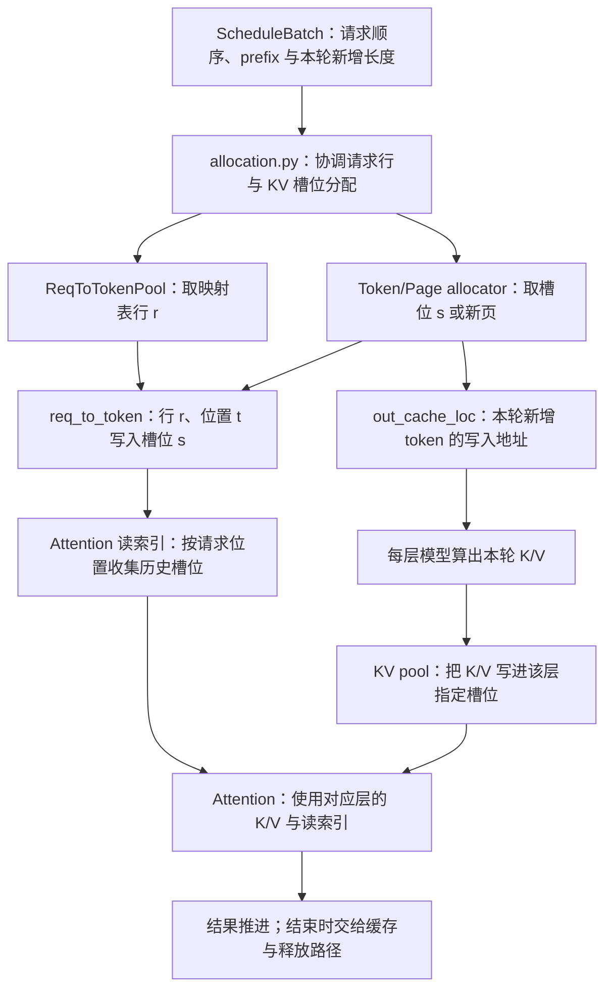
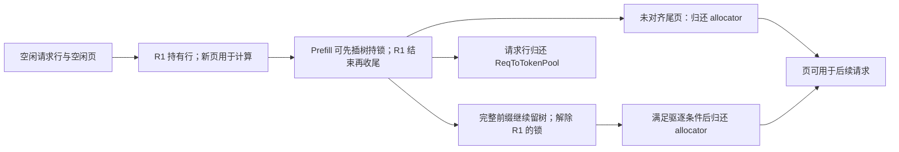

# 请求视图、物理槽位与分配器

同一条请求里的第 100 个 token，未必住在显存的第 100 个位置。另一个请求还可能复用它的一段历史 KV。推理引擎需要一张“请求位置 → 存储位置”的地址表，让逻辑上连续的文本能够使用分散的物理空间。

本文是**源码分析型学习资料**，是系列第 **04-01** 篇。主线是：为请求取得映射表行，为新增 token 取得槽位，把位置写入映射表，交给 Attention 读写，最后分别交还请求行与 KV 所有权。

## 0. 阅读基线与范围

| 项目 | 内容 |
| --- | --- |
| 源码路径基准 | SGLang 仓库根目录 `.`；本文源码位置均为仓内相对路径 |
| 分支 | `codex/sglang-source-study-20260909`，基于官方 `main` |
| commit | `72d5c5bb73cadd7ffbf5114e5f81e29d36b6c61a` |
| 读取日期 | `2026-09-09` |
| 工作区状态 | 学习源码 worktree 干净；原源码与 Wiki 既有资料保留 |
| 操作边界 | 只读请求池、普通 token/page 分配器、batch 分配、代表 Triton Attention 的地址传递与普通 RadixCache 收尾；相关单测仅阅读 |
| 前置 | [00-04 KV 入门](../00-foundations/04-Prefill与Decode及KVCache入门.md)、[02-04 逐轮生成](../02-request-lifecycle/04-一次Prefill到多轮Decode.md)、[03-03 准入预算](../03-scheduling/03-排序策略与准入预算.md)、[03-06 回撤与回收](../03-scheduling/06-回撤背压饥饿与调度排障.md) |
| 主线 | 普通文本 Dense/full-attention、单实例 TP/PP/DP=1、非投机、普通非 Overlap 轮次；静态未量化 MHA KV 池，使用 NHD 布局解释物理地址 |
| 独立对照 | page_size=1 与分页分配；释放暂存与分组 free；普通前缀缓存保留 KV 的收尾边界 |
| 不展开 | MLA、SWA/Mamba、统一池地址翻译、DCP、PD、HiCache、Beam、DLLM、会话、encoder-decoder、量化与特殊 KV 布局、完整 Attention 数学及 GPU 并发退役 |

**缓存实现边界补充：** 本篇选择传统 RadixCache 说明请求与缓存的所有权。该固定版本默认缓存工厂在未命中特殊分支时最终进入 UnifiedRadixCache；传统代表实现不能替代实际服务类型的核对，详见 [04-02 的选择链说明](02-RadixAttention与前缀匹配.md)。

下文表格里的编号和容量是**整理者教学假设**，不是服务日志。没有安装、导入或运行 SGLang，没有执行张量/kernel、GPU 推理、内存泄漏或资源复用实验。前缀匹配算法将在 04-02 展开，本篇只说明匹配结果怎样成为地址，以及完成时为什么仍可能留有缓存。

## 1. 先把六种“编号”分开

**人话版：** 请求像一本借阅中的书。`rid` 是借阅单号，token ID 是书中文字的编码，逻辑位置是第几页；请求行是目录卡的位置，KV 槽位是仓库里的储物格。目录卡写着储物格编号，格子里才放真正的数据。

| 名称 | 记号或字段 | 代表什么 | 不能拿来替代什么 |
| --- | --- | --- | --- |
| 请求标识 | `rid` | 跨前端与 Scheduler 关联请求 | 不是映射表下标 |
| 词表 token ID | 例如教学 ID 1234 | 输入/输出中的一个词表项 | 不是 KV 地址，同一个词表项会出现在许多位置 |
| 请求内逻辑位置 | `t`，从 0 起 | 当前序列中的第几个 token | 不是全池连续地址 |
| Batch 行 | `b` | 当前批次中第几个请求 | filter/merge 后会变，不能当持久请求行 |
| 请求池行 | `r = req.kv.req_pool_idx` | `req_to_token` 的行索引 | 不是第 r 个 KV token |
| 物理 token 槽位 | `s = req_to_token[r, t]` | 普通池中各层 K/V 的对应存储位置 | 不等于一整页，也不是跨进程全局地址 |
| 页与页内偏移 | `p = s // P`、`o = s % P` | 页大小 P 下，同一个 token 槽位的另一种表示 | 不能把 p 直接当 s 交给期待 token 槽位的接口 |

本篇普通池中的核心关系可以写成：

```text
r = req_pool_indices[b]
s = req_to_token[r, t]
K = k_buffer[layer_id - start_layer][s, kv_head, head_dim_index]
V = v_buffer[layer_id - start_layer][s, kv_head, value_dim_index]
```

这是 **NHD 静态普通 MHA 池的概念寻址式**，不是需要运行的代码。K/V 属于各自的层；同一个槽位 s 在每层缓冲区中都有位置，不是把所有层共用成同一个 K/V 向量。MHA 池类名也不意味着 KV head 数一定等于 query head 数，构建时会取模型的 KV head 配置。[请求映射表][S1]、[池形状][S11]与[普通 MHA 池构建][S25]是对应源码。

## 2. 谁管地址，谁管真正的数据



**图意解读：** 方框是同一执行链上的职责，不代表新进程。分配器给出地址，模型计算 K/V，池执行实际存储；`req_to_token` 只保存整数映射。箭头表达数据和调用关系，不表示任意两个 CUDA stream 天然同步；跨 stream 依赖已在 [03-05](../03-scheduling/05-Overlap中的CPU与GPU依赖.md) 单独讨论。

| 对象 | 直接掌握的资源或状态 | 谁决定如何使用它 | 生命周期要点 |
| --- | --- | --- | --- |
| `ReqToTokenPool` | 可分配请求行、整张整数表、行 generation | allocation 协调，Req 持有自己的行号 | 请求续算可以复用行；free 后行可以分配给别的请求 |
| token/page allocator | 空闲槽位或空闲页、延迟合并的释放集合 | Scheduler 准入、allocation 和 cache 释放路径调用 | 分配/归还编号不等于创建/销毁整个 K/V tensor |
| `MHATokenToKVPool` | 各层真实 K/V buffers、dtype、layout | 模型/Attention 写入，后端按索引读取 | 普通静态池先建立 buffers，token 分配只是使用其中的位置 |
| `ScheduleBatch` | 本轮请求顺序、行号镜像、长度、`out_cache_loc` | 调度与准备函数 | batch 可换，映射仍通过请求行号定位 |
| 普通 `RadixCache` | 可复用前缀与 KV 地址、锁引用和回收策略 | cache 插入/匹配/驱逐流程 | 请求结束后仍可能持有 KV；allocator 不决定前缀是否值得保留 |

源码入口分别是[请求池][S1]、[基础分配器][S2]、[普通 KV 池][S10]、[批次准备][S6]和[结束时缓存交接][S23]。注意“能写一个 buffer”和“负责决定它什么时候可复用”属于不同职责。

## 3. 请求池：先取得一行地址表

### 3.1 行 0 保留，普通请求行从 1 开始

`python/sglang/srt/mem_cache/memory_pool.py::ReqToTokenPool.__init__` 为容量 `size` 建立 `size + 1` 行，行 0 留作 padding。表为设备上的 `int32` tensor，形状是 `[size + 1, max_context_len]`；`free_slots` 是主机侧的 Python 列表。这个表占用的是**地址元数据空间**，不是每层 K/V 内容。[源码][S1]

当前 `alloc_rows` 从空闲列表尾部取行。假设一个全新请求池 `size=4`，先单独分配 R1，再单独分配 R2，得到的行是 4、3。如果一次分配两个，则从尾部取出的切片是 `[3, 4]`，并按调用者顺序绑定；不能把“总从尾部取”误读成“所有批次都倒序”。[源码][S26]

```python
# 摘自 ReqToTokenPool.alloc_rows；省略可选的分配回调。
if need_size > len(self.free_slots):
    return None
if need_size == 0:
    return []
select_index = self.free_slots[-need_size:]
del self.free_slots[-need_size:]
self.req_generation[select_index] += 1
```

**行为与作用：** 先检查行数，再取出指定数量并递增该行 generation。独立处理 0，是因为 Python 的 `[-0:]` 会取整个列表。generation 让调用者有办法区分某行的不同分配代次；仅有这个计数并不保证所有异步消费者都做了代次校验。

### 3.2 续算不必重新要行，释放也不擦除整行

`alloc(reqs)` 会区分已经 `holds_kv` 的请求和需要新行的请求。已有行的请求要求其已分配 KV 长度大于 0，继续沿用原行；新请求才消耗空闲行。`holds_kv` 在这里首先表示 `req_pool_idx is not None`，不能单靠它证明设备计算已经完成。[请求池分配][S1]、[Req KV 字段][S27]

| 动作 | 行号与行状态 | 表中旧整数 | K/V 内容 |
| --- | --- | --- | --- |
| 新分配 | 从 `free_slots` 取行，增加 generation | 后续准备函数写本次有效范围 | 尚不能由“拿到行”判断 KV 就绪 |
| chunk 续算 | 复用 Req 已持有行 | 重建/补写本轮需要的映射 | 已有前缀按有效长度与所有权使用 |
| `free(req)` | 把行放回列表，将 Req 行号设为 None | 该函数不把整行清零 | 该函数本身不释放每层 K/V 槽位 |
| 下次复用同一行 | 新代次、可能新请求 | 必须只消费新请求有效范围 | 不能凭旧行内容辨认原请求 |

源码中 `free_rows` 还会释放可选 aux 条目；这不把请求行 free 变成所有 KV 类型的通用生命周期实现。`clear()` 重置请求行管理状态，也没有在此把 `req_to_token` 全表重建为零。[源码][S1]

## 4. 槽位分配：P=1 与 P>1 要用不同账本

### 4.1 page_size=1：给几个 token，就取几个编号

`python/sglang/srt/mem_cache/allocator/token.py::TokenToKVPoolAllocator` 把编号 `1..size` 放入空闲集合，编号 0 保留。`alloc(n)` 取出 n 个槽位；容量不足返回 None。释放只是归还编号，普通路径不会因此清零 K/V buffer。[源码][S3]

下面假设池已经发生过分配与回收，故编号不连续；同时假设 R2 已经从合法前缀匹配中取得 6 个可复用地址。只演示 **P=1** 的地址关系：

| 请求 | 请求行 | 逻辑位置 0..5 的映射 | 本请求新增位置 6..7 的映射 |
| --- | ---: | --- | --- |
| R1 | 4 | `[11,12,31,32,41,42]` | `[51,52]` |
| R2 | 3 | `[11,12,31,32,41,42]` | `[61,62]` |

R2 的目录卡复用了前六个地址，没有要求把相同 K/V 再复制一份；后两格单独分配。是否真能匹配这六个 token，还取决于前缀与隔离条件，不能仅凭 token ID 相同下结论。分配器也不会自行发现共享前缀。

### 4.2 分页：一个页号代表 P 个槽位

`python/sglang/srt/mem_cache/allocator/paged.py::PagedTokenToKVPoolAllocator` 用 `num_pages = size // P` 管理页号 `1..num_pages`。页 0 保留，对应槽位 `0..P-1`；页 p 对应槽位 `p*P..p*P+P-1`。[源码][S4]

例如 P=4：页 1 是 `[4,5,6,7]`，页 2 是 `[8,9,10,11]`。因此“第一个可分配 token 槽位是 1”只适用于 P=1；不能把它带到分页池。

| 数值 | 单位 | 含义 |
| --- | --- | --- |
| `len(free_pages)` | 页 | 立即列在空闲数组中的页数 |
| 释放暂存页数 | 页 | 已归还但尚未合并到主空闲数组的数量 |
| `available_size()` | token 槽位容量 | 普通分页池把上述可分配页数之和乘 P |
| `len(out_cache_loc)` | 本轮新增 token 数 | 实际要为新 token 写 K/V 的地址个数 |
| 已占用页数 × P | token 槽位容量 | 可能大于当前逻辑 KV 长度，多出的通常是尾页余量 |

直接 `alloc(n)` 按整页分配，要求 n 与 P 对齐；它不是把任意 n 自动向上取整的通用接口。对齐 assert 受 debug 条件控制，调用方仍应遵守契约。`alloc_extend` 与 `alloc_decode` 则理解请求长度与已有尾页，因此返回值可以只覆盖本轮需要写入的部分。[直接 alloc 与 Extend/Decode][S4]

### 4.3 补满已有尾页，比“新增 token / 页大小”更重要

假设某个请求正在续算，已经**拥有**长度 6 的 KV。P=4，最后一个地址为 29，即页 7 的偏移 1。现在扩展到长度 11：

```text
已有尾页：28、29 已用；30、31 还可供同一个请求使用。
新增 token 数：11 - 6 = 5。
需要新页数：ceil(11/4) - ceil(6/4) = 3 - 2 = 1。
假设当前空闲列表提供页 3：新地址依次为 [30,31,12,13,14]。
最终尾页：页 3 的 12、13、14 已用，15 仍是余量。
```

这里的长度 6 是**同一请求已有的部分尾页**，不是宣称 P=4 的普通 RadixCache 能把任意 6-token 前缀作为新请求共享边界。这个区别关系到尾页能否继续写：不能把别人的共享页余量自动当作自己的独占空间。

地址数是 5，新拿到的物理页只有 1 页、4 个槽位；另外 2 个新增 token 使用旧尾页。请求此前占 2 页、此后占 3 页。逻辑连续不要求页号连续。源码的[分页 Extend kernel][S5]和[新页计数][S28]分别计算地址和 CPU 侧页数；不是按整个 batch 的 token 总数做一次简单取整。

## 5. Prefill：一批请求怎样写成一张映射表

### 5.1 先准备长度，再协调两种分配

`python/sglang/srt/managers/schedule_batch.py::ScheduleBatch.prepare_for_extend` 整理每条请求的已有 prefix、本轮输入和目标长度，再进入 `alloc_for_extend`。普通主线可按以下顺序阅读：[Batch 准备][S6]、[分配协调][S7]

1. 取得每条请求的前缀地址 tensor，以及 prefix 长度、extend 长度、总长度。
2. `alloc_req_slots` 分配或复用请求行；生成主机与设备上的行号表示。
3. P=1 时按总新增 token 数取槽位；P>1 时传入各请求的前缀长度、目标长度和最后一个旧地址，填尾页并取新页。
4. `write_cache_indices` 把 prefix 地址写入行的前半部分，把本轮新地址写入接续部分。
5. 处理可选 aux 状态；更新 Req 的 allocated/committed 长度，返回 `out_cache_loc` 和行号。

行号的主机/设备镜像不是两份请求池，而是供不同计算位置使用的同一组索引。请求行必须和 batch 行顺序对应；筛选、合并后仍用旧顺序，会导致长度看似合理、实际写入别人的映射行。

### 5.2 packed 新地址怎样拆回各请求

继续上一节的 R1，再加入没有前缀的 R2。假设 P=4，分配器依次提供新页 3、9：

| batch 行 | 请求行（教学设定） | prefix 长度 | 目标长度 | 本轮新增 | 本轮写地址 | 新页数 |
| --- | ---: | ---: | ---: | ---: | --- | ---: |
| 0：R1 | 4 | 6 | 11 | 5 | `[30,31,12,13,14]` | 1 |
| 1：R2 | 3 | 0 | 3 | 3 | `[36,37,38]` | 1 |

本轮 `out_cache_loc` 拼成 `[30,31,12,13,14,36,37,38]`，按新增长度分界 `[0,5,8]` 拆分。R1 的新地址写入 `req_to_token[4,6:11]`，R2 的地址写入 `req_to_token[3,0:3]`。R1 的 `0:6` 则由既有 prefix 地址填入。

`python/sglang/srt/mem_cache/allocation.py::write_cache_indices` 有 Triton 路径和其他后端路径；核心关系均是“按请求行定位，先前缀、后新增，新增地址按各请求 extend 长度累计偏移”。当前 Triton 实现在 `python/sglang/kernels/ops/memory/common.py::write_req_to_token_pool_triton`。[分发与非 Triton 逻辑][S8]、[实际写表 kernel][S9]

这个表存的是 30、31 等**槽位 ID**，不是模型输入的词表 token ID。`input_ids` 与 `out_cache_loc` 都可能是一维整数 tensor，但分别回答“算哪个 token”和“结果存在哪里”。

### 5.3 长度字段更新早于模型真正写完 K/V

普通 `alloc_for_extend` 在返回前就把 `kv_allocated_len` 和 `kv_committed_len` 设为本轮目标长度。这里是请求管理账本的推进时机；这段函数并不执行各层 Attention，也不等待每层 K/V 写完。[源码][S7]

因此要区分三个时刻：**地址已分配 → 表与长度已准备 → 设备按执行依赖完成写入**。故障记录只打印一个 committed 字段，无法证明设备数据可以被另一条并发路径安全读取。

## 6. Decode：已有序列末尾再接一个位置

普通非投机 `prepare_for_decode` 调用 `alloc_for_decode(..., token_per_req=1)`，然后把本轮 batch 的序列长度加 1。[准备入口][S18]、[分配与写表][S19]

对旧长度 L，分配函数在逻辑位置 L 写入新地址；分页时先从位置 `L-1` 取得最后一个旧地址，再以**新长度 L+1**计算是否需要新页。单步 Decode 的新页条件是 `(L+1) % P == 1`，等价于旧长度 L 恰好填满一页。[分页 Decode kernel][S20]、[CPU 新页计数][S28]

| P=4 的旧长度 L | 新长度 | 最后旧地址（假设） | 本轮新地址 | 新页数 |
| --- | ---: | ---: | ---: | ---: |
| 8 | 9 | 11，即页 2 偏移 3 | 12，假设取得页 3 | 1 |
| 9 | 10 | 12，即页 3 偏移 0 | 13，沿用尾页 | 0 |
| 10 | 11 | 13 | 14 | 0 |
| 11 | 12 | 14 | 15 | 0 |
| 12 | 13 | 15 | 新分配页的首槽位 | 1 |

本节只解释普通单 token Decode。不要因为函数参数名叫 `token_per_req`，就认为分页的单步 kernel 能不加区分地处理任意多步投机分配；那些路径有自己的入口和约束。

## 7. 到达每层 Attention：写地址与读索引怎样汇合

### 7.1 KV 池持有每层数据，地址列表只选位置

在本文的静态、未量化、NHD 普通池条件下，`MHATokenToKVPool` 为每层建立 K/V tensors。K 的概念形状是 `[size + P, kv_head_num, head_dim]`，V 的最后一维取 `v_head_dim`；额外 P 个槽位包含保留页。这里没有把量化、HND、PageMajor、MLA 或捕获后动态分配的形状混进来。[形状][S11]、[建立 buffers][S12]

代表 Triton 后端在需要保存 K/V 时，用本轮 `out_cache_loc` 组成 `KVWriteLoc`，经 `_set_kv_buffer` 交给 pool。普通池取 `loc`，选择 `layer_id - start_layer` 的 buffer，再进行对应槽位写入。[后端 Extend][S13]、[后端写入转接][S14]、[池写入][S15]

`_set_kv_buffer_impl` 根据设备、布局和执行条件选择优化存储或索引赋值等实现。它们在本节的共同含义是：把第 i 个新 K/V 写到 `loc[i]` 指定的那一行。不能把这里的教学下标表达式说成所有平台都实际执行同一条 PyTorch 高级索引语句。[底层写入入口][S16]

### 7.2 读取历史：先找请求行，再收集有效位置

代表普通 Triton Decode 元数据准备会建立每条请求的历史长度边界 `kv_indptr`，并收集 packed 的 `kv_indices`。例如长度 `[3,2]` 对应边界 `[0,3,5]`：前 3 个索引属于第一条请求，后 2 个属于第二条。[读索引组织][S17]

当前入口经过 `KVIndexTranslator`。普通池不进行虚拟到物理翻译，`fill_packed_read_stream` 会调用 `create_flashinfer_kv_indices_triton`，以真实请求行号从 `req_to_token` 的有效逻辑位置读取槽位 ID，再填入 packed 索引。[普通分支][S29]、[按行收集索引的 kernel][S30]

虽然该 kernel 名字含 `flashinfer`，这里确实被代表 Triton 路径复用；不能仅凭名字判断它只服务某个 Attention 后端。后端随后把对应层的 K/V buffers、这些读索引及长度边界传给 Decode Attention。[后端 Decode][S21]

**整理者归纳：** 写地址回答“本轮新 K/V 放哪”，读索引回答“本请求目前该看哪些位置”。二者最终指向同一个普通物理池，但数组长度、排序与生成时机不一样。前缀共享会影响读索引，新增写入只应覆盖这条请求本轮获准写的位置。

统一池等高级实现可能增加虚拟页、物理页和 kernel-facing 位置的转换。本文的 `req_to_token[r,t]` 直接作为物理 token 槽位的结论，仅适用于已经限定的普通池；不要跨模型套用。

## 8. 贯穿例子：R1 输入 8 个 token，输出 3 个 token

### 8.1 从分配到最后一个输出

假设请求池 size=4，KV 池可分配容量为 32 个 token 槽位，P=4，开始均空闲；单独接纳 R1，普通 RadixCache 开启且初始为空，未跳过未完成请求插入、正常结束允许插入，非投机、无其他请求和额外预留。

| 时点 | R1 的请求行 | 已生成输出 | 有 KV 的逻辑内容 | 映射的有效长度 | 本请求涉及的页 | allocator 可分配槽位 |
| --- | ---: | --- | --- | ---: | --- | ---: |
| 接纳前 | None | 无 | 无 | 0 | 无 | 32 |
| Prefill 准备后 | 4 | 无 | 地址已准备，尚不能说设备写完 | 8 | 页 1、2，地址 4..11 | 24 |
| Prefill 结果消费后 | 4 | y1 | 输入 x0..x7 | 8 | 页 1、2 | 24 |
| 第一次 Decode 完成 | 4 | y1、y2 | 输入与 y1 | 9 | 页 1、2、3；y1 在 12 | 20 |
| 第二次 Decode 完成、结束待收尾 | 4 | y1、y2、y3 | 输入与 y1、y2 | 10 | 页 1、2、3；y2 在 13 | 20 |

第二次 Decode 输入 y2，算出 y3 后停止，**并没有因为 y3 已返回就自动为 y3 再写一次 KV**。因此逻辑 KV 长度是 10，输出后的完整 token 历史长度是 11；按页占用容量是 12。三个数字各有用途。[逐轮生成的前置解释](../02-request-lifecycle/04-一次Prefill到多轮Decode.md)

### 8.2 请求行释放了，前缀 KV 仍可能留下

普通结束释放先把有效 KV 交给 cache。`RadixCache.cache_finished_req` 用有效 KV 长度限制 token 历史，按 P 对齐前缀 key，插入/处理重复部分，并释放未对齐尾段。之后外层释放请求行、更新 Req KV 持有状态。[总释放入口][S22]、[普通 Radix 收尾][S23]

本例还有一个容易漏掉的中间交接：普通 Prefill 得到 y1、请求尚未结束时，结果处理会调用 `maybe_cache_unfinished_req`。在本例未跳过插入的条件下，`cache_unfinished_req` 已把 8-token 输入前缀插入树、更新保护长度并持有前缀锁；因此不是等到结束才第一次出现缓存。[结果处理分支][S35]、[插入门控][S37]、[未完成请求交接][S36]

结束时，完整前缀长度仍是 `floor(10/4)*4 = 8`。这 8 个地址已是受保护前缀，不应再次当作本请求的独占重复空间释放；收尾保留页 1、2，归还逻辑位置 8、9 所在的尾页 3，并解除该请求的前缀锁。外层再归还请求行。上表的 allocator 空闲量不因树开始持有这 8 个地址而额外下降，因为对应页此前已经分配。

| 收尾后的账本 | 数值或状态 | 为什么 |
| --- | --- | --- |
| 请求池空闲行 | 4 | R1 已归还其行 |
| allocator 可分配槽位 | 24 | 6 个空闲页；页 1、2 留作前缀缓存 |
| 树中保留 KV | 8 个 token 槽位 | 无其他请求持锁时可以成为可驱逐缓存 |
| R1 的行号 | None | 请求已不持有映射行 |
| K/V tensors 的预分配形状 | 保持池建立时的形状 | 归还页号不等于把整块 tensor 还给设备分配器 |



**图意解读：** 请求行与 KV 页在收尾处分成两条生命周期。页成为缓存后，控制其保留与驱逐的是 cache；不能在请求行 free 后再把整行旧地址全部 free 一遍，那可能重复归还已经移交缓存的空间。真实并发的安全复用还依赖执行与退役次序，本图不是 GPU drain 证明。

## 9. 释放机制：归还单位、延迟合并与重复释放

### 9.1 从 token 地址归还整页，必须知道边界

分页 `free(indices)` 用 `indices // P` 得到页号，并对**本次调用**的页号取 unique。P=4 时，传入 `[12,13]` 会归还页 3，而不是只释放其中两个独立格子。调用者必须保证同页其余位置已经不被别的有效所有者使用。[源码][S4]

`free_segment(indices, start_pos=...)` 要求逻辑起点按页对齐；分页实现可每隔 P 个位置取页代表，避免扫描段内每个 token。`free_segments` 还检查各段不能覆盖相同逻辑页。这依赖请求映射在每页内部遵守连续槽位关系，不能随意把一组散乱地址塞给优化接口。[基础分段契约][S2]、[分页实现][S4]

本例释放 `[12,13]` 时逻辑起点为 8，按 P=4 对齐，页 3 的余量 14、15 也没有其他所有者，所以可以整页归还。若从逻辑位置 9 截一段，不能因为地址数量少就跳过起点约束。

`unique` 也不能为所有重复释放兜底：同一页分两次 free，会成为跨调用重复；`free_page_ids` 直接接收页号，不能假设它会自动去重。debug 检查只在相应条件启用时发挥作用，不能代替所有权正确性。

### 9.2 延迟合并和分组 free 不是同一个等待

| 机制 | 暂存什么 | 何时进入可重新使用的空闲管理 | 不能推导什么 |
| --- | --- | --- | --- |
| `need_sort=True` 的释放暂存 | token 分配器的释放数组，或分页分配器的分段页数组 | `available_size` 包含这部分容量；后续需要时 merge 并排序 | 数组尚未合并不代表这部分仍被请求持有 |
| `free_group_begin/end` | 一个批次阶段内的待 free 地址副本；分页还可收集页号组 | `end` 合并并调用实际释放逻辑后 | begin/end 本身不是 CUDA event 或设备完成屏障 |
| 缓存保留 | RadixCache 中仍有用的 KV | cache 决定驱逐并归还 allocator 后 | “请求结束”不代表马上可供任意分配 |

基础 free group 会 clone 待释放 tensor，避免调用者随后重用/修改传入视图，改变了待释放地址。clone 保护的是地址列表的内容，不能证明被这些地址指向的 GPU 数据已无人读取。[基础实现][S2]

普通一体服务的代表 allocator 构建将 `need_sort` 设为 False；P/D 模式会影响该值。这里解释 True 分支是理解分配器的独立对照，不代表本篇普通服务一定采用释放排序。[构建分支][S24]

## 10. 约束与排障地图

### 10.1 不要把底层分配当作完整事务

正常流程靠上层准入与回收准备容量。`alloc_token_slots` 或分页 wrapper 会尝试驱逐可回收缓存，再调用 allocator；返回 None 时抛出明确错误。行不足也会被 `alloc_req_slots` 转为异常。[普通 Extend 协调及相邻包装器][S7]

但这不表示“任意失败都发生在设备工作之前，而且所有已取得资源都会自动回滚”。本基线分页 `alloc_extend/alloc_decode` 的地址 kernel 调用位于末尾新页数量不足检查之前；`alloc_for_extend` 也先取得请求行，再进行 KV 分配。aux 分配异常中的局部处理会 free `out_cache_loc`，不能据此宣称它恢复了本次准备的所有状态。[分页调用顺序][S4]、[协调中的异常分支][S7]

这些是**源码顺序与验证边界**，不是本次复现出的故障结论。越界、OOM 和失败退役是否安全，需要在具体调用路径、配置及运行证据中继续验证；不能故意绕过上层预算来证明底层具有未声明的事务保证。

### 10.2 把症状放回对应账本

| 现象 | 先核对的字段或条件 | 回到源码 | 本次静态阅读能限定什么 |
| --- | --- | --- | --- |
| KV 还有空闲却报请求槽不足 | 请求行剩余数、持行请求、续算复用 | `ReqToTokenPool.alloc`、`alloc_req_slots` | 行容量与 KV 容量是两种资源 |
| 新增 5 token，却只少了 4 槽可分配量 | P、旧 prefix、最后地址、尾页余量 | `alloc_extend`、`get_num_new_pages` | 可能复用了旧尾页，不宜直接认定少分配 |
| Decode 偶尔才减少一整页 | 旧长度与 P 的取模 | `alloc_for_decode`、分页 Decode kernel | 单步只在跨页边界新增页 |
| 不同请求读出相似/混乱历史 | batch 行与请求行对应、有效长度、每段地址、代次 | `write_cache_indices`、`KVIndexTranslator` | 计数正确不证明地址归属正确 |
| 请求结束后空闲量没有回到总容量 | tree 保留/锁、尾页、allocator 空闲与暂存 | `cache_finished_req`、`release_kv_cache` | 先区分正常缓存保留与未归还资源 |
| free 后显存监控不降 | 静态 KV tensor 形状与 allocator 空闲计数 | MHA pool 建立、allocator free | 池内可用量和设备总分配量不是一回事 |
| 行复用后仍看到旧整数 | 请求代次、当前有效范围、新表写入时机 | `free_rows`、`alloc_rows` | free 不清零整行，旧内容不是有效请求证据 |
| 重复 free 或同页两段冲突 | start_pos 对齐、逻辑页区间、跨调用所有权 | `free_segment`、`free_segments`、free group | 单次 unique 与 debug 不能替代全生命周期约束 |
| 分配失败之后状态难以解释 | 失败发生在哪一步、已取行/页、已提交设备工作 | allocation wrapper 与实际 allocator | 不能把 None/异常处理概括为全事务回滚 |

本表提到的符号均可从下节的固定入口继续定位；它是排查顺序，不是已诊断某个线上实例。

## 11. 源码阅读路线与测试证据

### 11.1 按一条地址链阅读

| 顺序 | 问题 | 仓内路径与符号 | 固定源码 |
| --- | --- | --- | --- |
| 1 | 请求怎样取得并复用行？ | `python/sglang/srt/mem_cache/memory_pool.py::ReqToTokenPool` | [请求池][S1] |
| 2 | Batch 怎样提供长度？ | `python/sglang/srt/managers/schedule_batch.py::ScheduleBatch.prepare_for_extend` | [准备][S6] |
| 3 | 行与 KV 分配怎样协调？ | `python/sglang/srt/mem_cache/allocation.py::alloc_for_extend` | [Extend][S7] |
| 4 | token 和 page 管理差在哪？ | `python/sglang/srt/mem_cache/allocator/token.py::TokenToKVPoolAllocator`；`python/sglang/srt/mem_cache/allocator/paged.py::PagedTokenToKVPoolAllocator` | [token][S3]、[page][S4] |
| 5 | 页号怎样变成本轮槽位？ | `python/sglang/kernels/ops/memory/allocator.py::alloc_extend_kernel` | [地址计算][S5] |
| 6 | 新地址怎样写回请求位置？ | `python/sglang/srt/mem_cache/allocation.py::write_cache_indices` | [写表][S8] |
| 7 | 每层真实 K/V 存在哪？ | `python/sglang/srt/mem_cache/memory_pool.py::MHATokenToKVPool.set_kv_buffer` | [写入][S15] |
| 8 | 历史读地址如何形成？ | `python/sglang/srt/mem_cache/kv_index_translator.py::KVIndexTranslator.fill_packed_read_stream` | [普通池收集路径][S29] |
| 9 | 下一步如何接新槽位？ | `python/sglang/srt/mem_cache/allocation.py::alloc_for_decode` | [Decode][S19] |
| 10 | 请求结束后谁保留与谁归还？ | `python/sglang/srt/mem_cache/common.py::release_kv_cache`；`python/sglang/srt/mem_cache/radix_cache.py::RadixCache.cache_finished_req` | [总交接][S22]、[普通树][S23] |

构建路径可辅助确认实际类型：`python/sglang/srt/mem_cache/kv_cache_configurator.py::KVCacheConfigurator._build_default_req_pool`、`python/sglang/srt/mem_cache/kv_cache_configurator.py::KVCacheConfigurator._build_mha_kv_pool`、`python/sglang/srt/mem_cache/kv_cache_configurator.py::KVCacheConfigurator._build_token_to_kv_pool_allocator`。[请求池构建][S31]、[MHA 构建][S25]、[allocator 构建][S24]

这里列的是代表普通分支。构建器还会因模型、平台和模式选择其他池，完整兼容性不能由本表三个符号推定。

### 11.2 有测试入口，与本次运行通过分开记录

| 测试文件 | 本篇实际阅读的意图/断言 | 本次执行状态与限制 |
| --- | --- | --- |
| `test/registered/unit/mem_cache/test_paged_allocator_lazy_release.py` | CPU 小池检查 need_sort 下释放暂存计数、普通分配不必立即 merge、短缺时 merge、clear 重置 | 仅阅读；未运行，不能证明 GPU 地址 kernel 或并发复用安全 |
| `test/registered/unit/mem_cache/test_paged_free_segment.py` | 分段对齐、整页归还、组内延迟、clone 防调用者改视图、debug 重复检测、多个区间跨页约束 | 仅阅读；CPU/mocked 边界不代表真实设备退役或 DCP 正确性 |
| `test/registered/unit/mem_cache/test_dsv4_c4_state_lifecycle.py` | 只取其中普通 ReqToTokenPool 分配 hook 的测试片段：新行触发、已有行复用不重复触发、混合请求仅处理新行 | 仅阅读相关片段；不据此声称已研究或验证整套 DSV4 C4 状态生命周期 |

固定测试入口：[延迟合并][S32]、[分段释放][S33]、[请求行 hook 片段][S34]。本次仅对教学例子的取模、向上取整、packed 分界与容量守恒做独立算术核对，没有调用这些测试。

## 12. 练习、验收与下一篇

### 12.1 三道练习

1. P=4，请求已有长度 7，最后槽位是 18；要扩展到长度 10，新拿到页 8。写出本轮地址、需要的新页数与最后尾页余量。
2. 同一请求行 r=4 释放后被 R2 复用，表中位置 200 仍有旧整数。R2 当前有效长度只有 20，能否把这个整数当作 R2 的 KV？仅看 generation 增加能否证明所有读者安全？
3. R1 按第 8 节完成后，allocator 显示空闲 24、树中保留 8、请求池空闲 4，显存监控仍显示整个池。分别说明这四个数字有没有直接矛盾。

### 12.2 参考答案

1. 旧尾页为页 4，偏移 2 已用到 18，先用 19，再用页 8 的 32、33。本轮地址 `[19,32,33]`；新页数 `ceil(10/4)-ceil(7/4)=1`；最后一页还有 34、35 两个余量。这是假设该尾页由此请求合法持有的续算。
2. 不能。位置 200 在 R2 的有效范围外，free 也没有清零整行。generation 是代次信息，要看具体消费路径是否使用它、是否遵守长度与执行依赖，不能只凭计数存在推出安全性。
3. 没有直接矛盾。24+8 对应 32 个可管理槽位；行已全部归还；KV tensors 仍按原形状保留。若要判断泄漏，还需检查所有权、锁、可驱逐状态与长期变化。

读完应能从 `req_pool_indices[b]` 找到请求行，从逻辑位置找到普通池槽位，再解释每层写入与历史读取怎样使用这个位置；还应能说明为什么“请求行已释放”“页已归还”“K/V buffer 已清空”“GPU 已不再读它”不是同一个事件。

本篇完成的是静态源码与文档检查。下一篇为 [04-02《RadixAttention 与前缀匹配》](02-RadixAttention与前缀匹配.md)，展开共享前缀怎样找到、切分与持有，并先核对默认缓存实现与传统代表实现的区别。

返回[系列目录](../README.md)、[源码入口索引](../appendices/02-源码入口与调用链索引.md)或[进度记录](../appendices/06-学习进度与版本变更记录.md)。

[S1]: https://github.com/sgl-project/sglang/blob/72d5c5bb73cadd7ffbf5114e5f81e29d36b6c61a/python/sglang/srt/mem_cache/memory_pool.py#L258
[S2]: https://github.com/sgl-project/sglang/blob/72d5c5bb73cadd7ffbf5114e5f81e29d36b6c61a/python/sglang/srt/mem_cache/allocator/base.py#L27
[S3]: https://github.com/sgl-project/sglang/blob/72d5c5bb73cadd7ffbf5114e5f81e29d36b6c61a/python/sglang/srt/mem_cache/allocator/token.py#L28
[S4]: https://github.com/sgl-project/sglang/blob/72d5c5bb73cadd7ffbf5114e5f81e29d36b6c61a/python/sglang/srt/mem_cache/allocator/paged.py#L116
[S5]: https://github.com/sgl-project/sglang/blob/72d5c5bb73cadd7ffbf5114e5f81e29d36b6c61a/python/sglang/kernels/ops/memory/allocator.py#L16
[S6]: https://github.com/sgl-project/sglang/blob/72d5c5bb73cadd7ffbf5114e5f81e29d36b6c61a/python/sglang/srt/managers/schedule_batch.py#L2561
[S7]: https://github.com/sgl-project/sglang/blob/72d5c5bb73cadd7ffbf5114e5f81e29d36b6c61a/python/sglang/srt/mem_cache/allocation.py#L282
[S8]: https://github.com/sgl-project/sglang/blob/72d5c5bb73cadd7ffbf5114e5f81e29d36b6c61a/python/sglang/srt/mem_cache/allocation.py#L54
[S9]: https://github.com/sgl-project/sglang/blob/72d5c5bb73cadd7ffbf5114e5f81e29d36b6c61a/python/sglang/kernels/ops/memory/common.py#L9
[S10]: https://github.com/sgl-project/sglang/blob/72d5c5bb73cadd7ffbf5114e5f81e29d36b6c61a/python/sglang/srt/mem_cache/memory_pool.py#L1942
[S11]: https://github.com/sgl-project/sglang/blob/72d5c5bb73cadd7ffbf5114e5f81e29d36b6c61a/python/sglang/srt/mem_cache/memory_pool.py#L2234
[S12]: https://github.com/sgl-project/sglang/blob/72d5c5bb73cadd7ffbf5114e5f81e29d36b6c61a/python/sglang/srt/mem_cache/memory_pool.py#L2247
[S13]: https://github.com/sgl-project/sglang/blob/72d5c5bb73cadd7ffbf5114e5f81e29d36b6c61a/python/sglang/srt/layers/attention/triton_backend.py#L1519
[S14]: https://github.com/sgl-project/sglang/blob/72d5c5bb73cadd7ffbf5114e5f81e29d36b6c61a/python/sglang/srt/layers/attention/triton_backend.py#L1486
[S15]: https://github.com/sgl-project/sglang/blob/72d5c5bb73cadd7ffbf5114e5f81e29d36b6c61a/python/sglang/srt/mem_cache/memory_pool.py#L2518
[S16]: https://github.com/sgl-project/sglang/blob/72d5c5bb73cadd7ffbf5114e5f81e29d36b6c61a/python/sglang/srt/mem_cache/memory_pool.py#L143
[S17]: https://github.com/sgl-project/sglang/blob/72d5c5bb73cadd7ffbf5114e5f81e29d36b6c61a/python/sglang/srt/layers/attention/triton_backend.py#L475
[S18]: https://github.com/sgl-project/sglang/blob/72d5c5bb73cadd7ffbf5114e5f81e29d36b6c61a/python/sglang/srt/managers/schedule_batch.py#L3345
[S19]: https://github.com/sgl-project/sglang/blob/72d5c5bb73cadd7ffbf5114e5f81e29d36b6c61a/python/sglang/srt/mem_cache/allocation.py#L521
[S20]: https://github.com/sgl-project/sglang/blob/72d5c5bb73cadd7ffbf5114e5f81e29d36b6c61a/python/sglang/kernels/ops/memory/allocator.py#L103
[S21]: https://github.com/sgl-project/sglang/blob/72d5c5bb73cadd7ffbf5114e5f81e29d36b6c61a/python/sglang/srt/layers/attention/triton_backend.py#L2119
[S22]: https://github.com/sgl-project/sglang/blob/72d5c5bb73cadd7ffbf5114e5f81e29d36b6c61a/python/sglang/srt/mem_cache/common.py#L238
[S23]: https://github.com/sgl-project/sglang/blob/72d5c5bb73cadd7ffbf5114e5f81e29d36b6c61a/python/sglang/srt/mem_cache/radix_cache.py#L482
[S24]: https://github.com/sgl-project/sglang/blob/72d5c5bb73cadd7ffbf5114e5f81e29d36b6c61a/python/sglang/srt/mem_cache/kv_cache_configurator.py#L1965
[S25]: https://github.com/sgl-project/sglang/blob/72d5c5bb73cadd7ffbf5114e5f81e29d36b6c61a/python/sglang/srt/mem_cache/kv_cache_configurator.py#L1929
[S26]: https://github.com/sgl-project/sglang/blob/72d5c5bb73cadd7ffbf5114e5f81e29d36b6c61a/python/sglang/srt/mem_cache/memory_pool.py#L315
[S27]: https://github.com/sgl-project/sglang/blob/72d5c5bb73cadd7ffbf5114e5f81e29d36b6c61a/python/sglang/srt/managers/schedule_batch.py#L870
[S28]: https://github.com/sgl-project/sglang/blob/72d5c5bb73cadd7ffbf5114e5f81e29d36b6c61a/python/sglang/srt/utils/common.py#L4578
[S29]: https://github.com/sgl-project/sglang/blob/72d5c5bb73cadd7ffbf5114e5f81e29d36b6c61a/python/sglang/srt/mem_cache/kv_index_translator.py#L183
[S30]: https://github.com/sgl-project/sglang/blob/72d5c5bb73cadd7ffbf5114e5f81e29d36b6c61a/python/sglang/kernels/ops/kvcache/kv_indices.py#L9
[S31]: https://github.com/sgl-project/sglang/blob/72d5c5bb73cadd7ffbf5114e5f81e29d36b6c61a/python/sglang/srt/mem_cache/kv_cache_configurator.py#L1163
[S32]: https://github.com/sgl-project/sglang/blob/72d5c5bb73cadd7ffbf5114e5f81e29d36b6c61a/test/registered/unit/mem_cache/test_paged_allocator_lazy_release.py#L33
[S33]: https://github.com/sgl-project/sglang/blob/72d5c5bb73cadd7ffbf5114e5f81e29d36b6c61a/test/registered/unit/mem_cache/test_paged_free_segment.py#L45
[S34]: https://github.com/sgl-project/sglang/blob/72d5c5bb73cadd7ffbf5114e5f81e29d36b6c61a/test/registered/unit/mem_cache/test_dsv4_c4_state_lifecycle.py#L107
[S35]: https://github.com/sgl-project/sglang/blob/72d5c5bb73cadd7ffbf5114e5f81e29d36b6c61a/python/sglang/srt/managers/scheduler_components/batch_result_processor.py#L359
[S36]: https://github.com/sgl-project/sglang/blob/72d5c5bb73cadd7ffbf5114e5f81e29d36b6c61a/python/sglang/srt/mem_cache/radix_cache.py#L539
[S37]: https://github.com/sgl-project/sglang/blob/72d5c5bb73cadd7ffbf5114e5f81e29d36b6c61a/python/sglang/srt/mem_cache/common.py#L145
