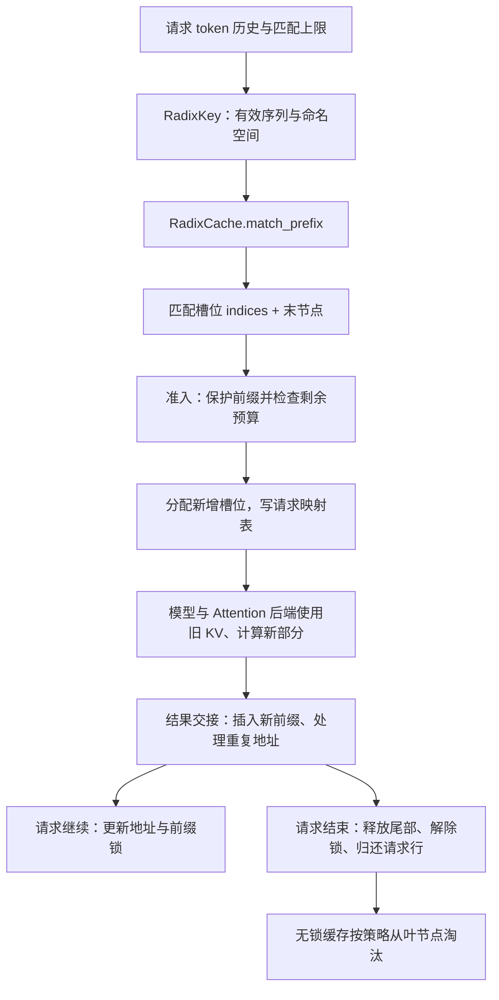
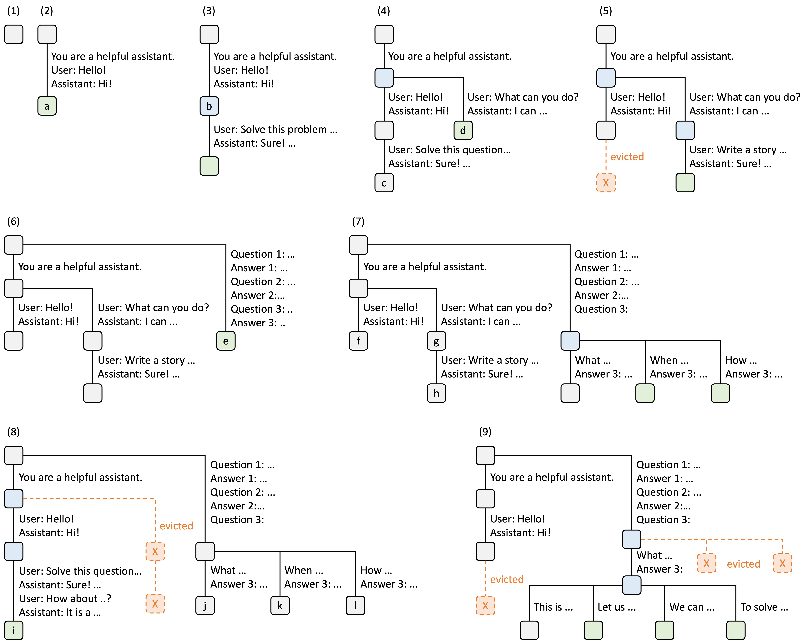
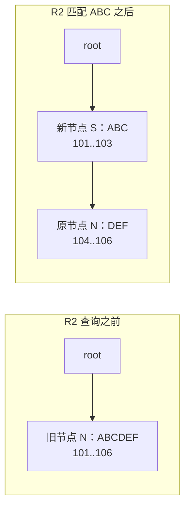
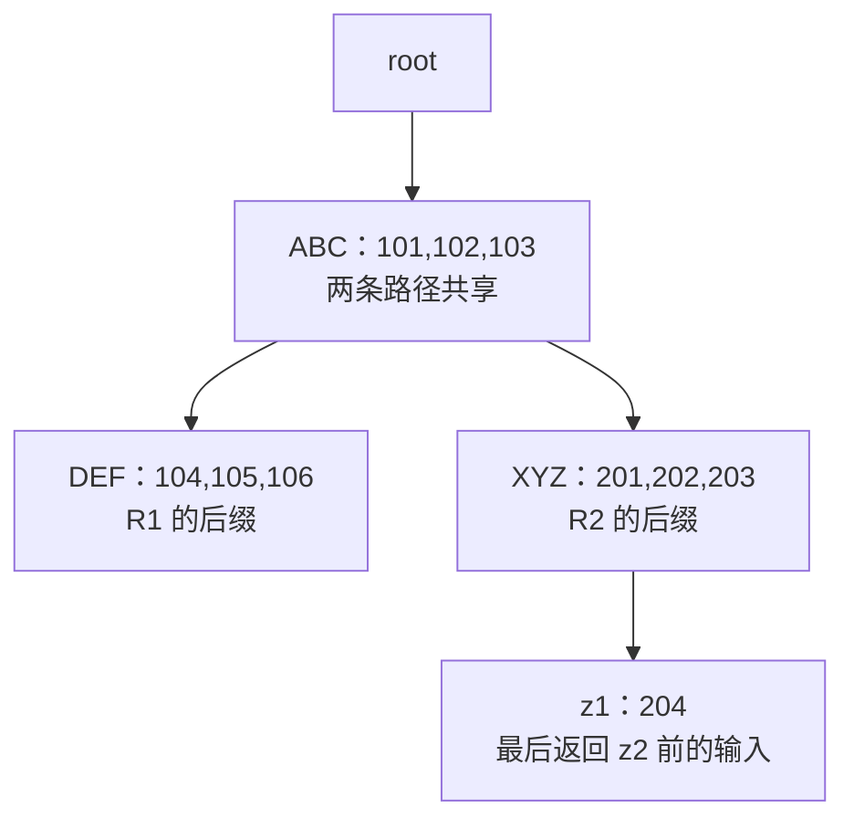

# RadixAttention 与前缀匹配

> **先建立架构心智模型：** [M05 · 缓存架构与资源所有权](<../architecture/05-缓存架构与资源所有权.md>)。先看职责、数据和生命周期，再回到本篇源码细节。

R1 已经计算过“共同开头 + 第一种问题”，R2 又带着同一个开头进来。系统需要找出能复用到哪里，把已有 KV 的地址交给 R2，并保护这段地址，直到 R2 不再使用它。前缀树负责这份查找与所有权账本；真正的 Attention 计算仍由模型层和后端执行。

本文是**源码分析型学习资料**，是系列第 **04-02** 篇。沿 R1/R2 的共享前缀，解释 key、压缩节点、匹配、拆分、插入、锁引用与淘汰。所有字母、槽位和时间先后均为教学设定，不是实际分词或运行日志。

## 0. 阅读基线与范围

| 项目 | 内容 |
| --- | --- |
| 源码路径基准 | SGLang 仓库根目录 `.`；本文源码位置均为仓内相对路径 |
| 分支 | `codex/sglang-source-study-20260909`，基于官方 `main` |
| commit | `72d5c5bb73cadd7ffbf5114e5f81e29d36b6c61a` |
| 读取日期 | `2026-09-09` |
| 工作区状态 | 学习源码 worktree 干净；原源码与 Wiki 既有资料保留 |
| 操作边界 | 静态阅读传统 Python RadixCache、调用者的匹配/锁/交接、默认工厂与 Attention 层的职责边界；相关测试仅阅读 |
| 前置 | [04-01 请求地址与分配器](01-请求视图物理槽位与分配器.md)、[03-03 排序与准入](../03-scheduling/03-排序策略与准入预算.md)、[02-04 逐轮生成](../02-request-lifecycle/04-一次Prefill到多轮Decode.md) |
| 主线 | 传统 `RadixCache` 的普通文本、非 bigram、设备驻留前缀索引；Dense/full-attention、TP/PP/DP=1、非投机、普通非 Overlap 交接；先 P=1，再独立对照分页 |
| 不展开 | Unified 的组件验证与动作执行、Rust/C++ 树、HiCache/L3、模型/LoRA/salt 全链路隔离、Mamba/SWA、PD、会话、投机与 GPU 并发退役 |

**先确认本篇实现的位置。** 该 commit 的 `default_radix_cache_factory` 在未命中特殊分支时，最终调用 `_create_unified_radix_cache`。`create_tree_cache` 还支持显式注册的 backend，以及其他模式分支。因此本文按目录选择传统 `python/sglang/srt/mem_cache/radix_cache.py::RadixCache` 作为基本机制的阅读对象，**不把它写成当前普通服务必选的默认类**。[默认选择链][S1]、[显式 backend 分发][S2]

这一点也适用于前文选用传统 RadixCache 的教学账本。04-04 将进入 Unified 的真实组件与验证路径；本篇不能替代对实际 `type(tree_cache)` 的确认。

本次没有导入或执行 SGLang，没有启动服务、运行单测、比较输出精度或测量缓存收益。流程图和算术是**整理者推演**，源码锚点支撑具体分支，运行观察仍为空。

## 1. 三个名字，分别负责什么

**人话版：** 树是目录，KV 池是仓库，Attention 是使用仓库内容的计算工序。目录找到一本旧资料，不代表已经完成新问题的计算。

为什么找“前缀”而不找任意相同子串？在本文限定的普通因果 Attention 中，一个位置的表示包含此前上下文的影响。两段文字中间出现同样的 token，并不代表它们有同样的上文；从开头连续相同，才是这棵树使用的共享单位。模型和其他状态条件还必须一致，不能只凭这个直观解释跳过缓存隔离检查。

| 名称 | 本篇对应的职责 | 输入与输出 | 容易误读的地方 |
| --- | --- | --- | --- |
| RadixAttention 这一学习主题 | 用可共享前缀组织、复用 KV，并与推理计算连接 | 旧前缀减少重复计算，新部分继续执行 | 不能把整套机制缩成一个矩阵乘 kernel |
| `RadixCache` | 管理 token 前缀到 KV 地址的树、锁与淘汰 | token key → 匹配到的槽位索引及末节点 | 树节点的 value 不是 K/V 浮点内容 |
| `RadixAttention` 类 | 模型中的 Attention 层接口，保存 head/layer 等配置并转交后端 | q/k/v、ForwardBatch → Attention 输出 | forward 本身不遍历这棵 Python 前缀树 |
| KV pool / Attention backend | 按地址写入新 K/V，按读索引访问历史 K/V 并计算 | 地址、各层 buffers、q/k/v | 不自行决定前缀是否应长期保留 |

`python/sglang/srt/layers/radix_attention.py::RadixAttention.forward` 在普通路径调用 `get_attn_backend().forward(...)`，另有图捕获等路径。本文只用它确定职责边界，不逐支讲解 Attention 算子。[层接口][S3]；物理读写链见 [04-01](01-请求视图物理槽位与分配器.md)。



**图意解读：** 这些方框是职责与调用阶段，不是额外进程。匹配输出分成两种信息：indices 让模型找到数据，末节点让调度/缓存维护祖先链的保护关系。图中的“保护”是防缓存淘汰的引用计数，不是 GPU 完成事件，也不是互斥锁。

## 2. 一棵压缩前缀树，究竟存了什么

### 2.1 key 是比较对象，value 是地址

`python/sglang/srt/mem_cache/radix_cache.py::RadixKey` 包装 token 序列及匹配条件。普通非 bigram 路径中的关键字段如下。[源码][S4]

| 字段/方法 | 人话解释 | 本篇的使用边界 |
| --- | --- | --- |
| `token_ids` | 原始 token 编号序列 | 字母 A/B/C 只是教学 token 的别名，不是真实文本分词结果 |
| `limit` | 只允许看前多少个原始 token | 匹配入口可限制视图长度，避免先复制整段历史；不等于已经命中这么长 |
| `extra_key` | 调用者指定的分类命名空间 | 本篇统一 None；具体来源在 04-03 追踪 |
| `cache_salt` | 与 extra_key 分开的隔离字段 | 本篇统一 None；不能把本地树键契约外推到全部外部存储键 |
| `is_bigram` | 用相邻 token 对作为逻辑单位 | 本篇为 False；True 时长度语义不同，不套用本篇 token 数公式 |
| `page_aligned(P)` | 将可比较逻辑长度向下取到 P 的倍数 | 普通分页只把完整页作为树的边界 |
| `child_key(P)` | 从当前段最前面的一个 token 或一页构造字典键 | 用于定位下一条分支，不等于完整前缀已经相同 |
| `match` / `match_at` | 比较两段从开头起连续相同的长度 | 遇到第一个不同位置就停止，P>1 时向下页对齐 |

普通服务插入时，`value` 来自请求映射行，是 `torch.int64` 的 KV 槽位索引。源码 `insert` 在没有传 value 时会用 token ID 构造调试/测试用值；不要从这个 fallback 得出“词表 ID 就是显存地址”。[插入入口][S15]

### 2.2 节点存一段，不必一个 token 建一个节点

假设 R1 已把 `ABCDEF` 对应的 KV 地址 `[101,102,103,104,105,106]` 留入空树。可以只有根加一个子节点：

```text
root：空 key；不代表一个真实 token
└─ N：key=ABCDEF；value=[101,102,103,104,105,106]
```

一个节点保存的是**相对父节点新增的片段**。从根走到某节点，把沿路各段 key 拼接，才是完整前缀；把沿路 value 拼接，才是该前缀的完整槽位列表。[TreeNode][S5]

| 节点信息 | 作用 | 生命周期要点 |
| --- | --- | --- |
| `key` / `value` | 本段 token 与本段地址，长度对应 | 拆分时分成前后两段；K/V 实体仍在 pool |
| `parent` / `children` | 祖先链和分叉 | 请求持末节点后，可沿 parent 维护整条路径 |
| `lock_ref` | 多少条有效保护链经过该节点 | 从 0 到 1 才把该段容量转入 protected；继续增加不重复计容量 |
| `last_access_time` | 匹配/插入访问时间 | 是淘汰排序的元数据，不是 GPU 最后读它的时间 |
| `creation_time` / `priority` / `hit_count` | 供不同淘汰策略排序 | 与调度队列顺序、请求成功次数并非一回事 |
| host/hash/event 等字段 | 为其他缓存能力与事件提供状态 | 字段存在不代表本篇启用了 CPU 缓存或远端传输 |

`reset` 建立空根、空匹配结果及零容量账本，根的 `lock_ref=1`；正常 inc/dec 不向根累加。普通匹配返回的 `last_device_node`、`last_host_node`、`best_match_node` 指向同一末节点，host 命中长度保持默认 0。这些字段相等不构成“已经有一份 CPU KV”的证据。[匹配返回][S12]、[结果协议][S7]

### 图解补充：前缀树怎样生长、分裂与淘汰



[查看原尺寸](../../../images/sglang-source-study/08-radix-tree.jpg)。

**图意解读：** 按编号观察九个树快照：新输入延伸已有路径，也可能在共同前缀处分叉；图中虚线和叉号标出淘汰部分。每条边保存一段 token，而非整条请求。

**对应本篇源码：** 把每段边对应到 `TreeNode.key/value`，先沿根到叶拼出前缀，再结合后文拆分、锁与叶节点淘汰读代码。 [源码：python/sglang/srt/mem_cache/radix_cache.py][S5]

**来源与边界：** [Fast and Expressive LLM Inference with RadixAttention and SGLang](https://www.lmsys.org/blog/2024-01-17-sglang/)，Lianmin Zheng、Liangsheng Yin 等 / LMSYS，2024-01-17。这是 2024 年 RadixAttention 原图。它没有画出当前 Unified 的组件、保护链和分层回载；普通树的具体锁与淘汰规则仍需读正文。 [来源档案 F08](../../../images/sglang-source-study/SOURCES.md#f08)。

## 3. 请求先决定：这次最多允许匹配多长

### 3.1 树能匹配整段，请求准备通常还要留一段计算

`Req.init_next_round_input` 更新完整输入历史，建立带 limit 的 RadixKey，调用 tree_cache，再把匹配索引和末节点写回 Req。普通主线的 `_compute_max_prefix_len` 先取 `input_len - 1`；若需要指定范围的 logprob，还受 `logprob_start_len` 限制，最终不小于 0。[请求入口][S9]、[长度上限][S10]

```python
# 摘自 Req._compute_max_prefix_len。
max_prefix_len = input_len - 1
if self.return_logprob and self.logprob_start_len >= 0:
    max_prefix_len = min(max_prefix_len, self.logprob_start_len)
return max(max_prefix_len, 0)
```

**行为与作用：** 这使普通准备路径保留至少一个 token 进入本轮计算，源码注释将它与 logprob 计算关联。不能因为树已存整个输入，就直接把本轮 extend 长度写成 0；后续 logits/生成仍需要相应执行路径。

| 情况：树已经有相同的 8-token 前缀 | key 上限与页对齐 | 最多复用 | 剩余输入 |
| --- | --- | ---: | ---: |
| 直接调用树，P=1，不设 limit | 8 | 8 | 这是树 API 查找，不是实际请求准备 |
| 普通请求准备，P=1，无指定 logprob 区间 | 8-1=7 | 7 | 1 |
| 普通请求准备，P=4，无指定 logprob 区间 | 7 再向下对齐到 4 | 4 | 4 |
| 普通请求准备，P=1，要求从位置 3 起的 logprob | min(7,3)=3 | 3 | 5 |

“最多”仍依赖树中确实有同 key 的完整匹配；不存在、被淘汰或命名空间不同时还会更短。上表是整数推演，没有调用 tokenizer 或模型。

### 3.2 排序阶段的匹配结果，不要代替执行准备的结果

`python/sglang/srt/managers/schedule_policy.py::match_prefix_for_req` 也做匹配，为排序/计数准备信息。它的普通 key 不直接使用上述 `input_len-1` 上限，而是把 `num_matched_prefix_tokens` 限制到该上限；真正准备候选时，Scheduler 还会调用 `req.init_next_round_input(self.tree_cache)`。[排序辅助函数][S11]、[准备前重新匹配][S38]

所以日志里的“某次树查询匹配长度”“排序统计中的匹配长度”“本轮实际 prefix_indices 长度”可能属于不同观测点。尤其不能拿一次早先匹配到的地址，就认为稍后的容量与保护关系已经确定。

`SGLANG_RADIX_FORCE_MISS` 在这些请求边界把匹配结果改成空索引和根节点；它不等于把整棵树清空。位置 embedding override、SWA 等还会改变匹配范围，本篇只指出入口，04-03/04-04 再按各自条件展开。[请求入口][S9]、[清空匹配结果的辅助函数][S39]

## 4. 匹配：沿树走，必要时把节点拆开

### 4.1 R2 怎样找到 ABC

接第 2 节，R1 留下 `ABCDEF`。R2 输入 `ABCXYZ`，P=1，无 logprob 特殊范围。请求准备的 key limit 为 5，因此本次搜索视图是 `ABCXY`；它与已有节点共享 `ABC`。

`match_prefix` 处理禁用、空 key、bigram 与页对齐后，进入 `_match_prefix_helper`。[公开入口][S12]、[树遍历][S13]

1. 用当前 key 的第一个 token A，查根的 children。
2. 找到 `ABCDEF` 节点，比较它与 `ABCXY`，得到公共长度 3。
3. 3 小于节点段长 6，说明匹配停在节点内部，调用 `_split_node`。
4. 返回新公共节点 ABC 的 value `[101,102,103]`，并把它作为末节点。

当整段节点都匹配时，收集该段 value，消耗这段 key，再查下一条 child；如果下一条 child 不存在，返回此前累计的前缀。这里找的是**从开头连续相同的前缀**，不会跳过中间不同的 token，再复用后面偶然出现的相同片段。

### 4.2 拆分时，旧节点留在后半段



**图意解读：** `_split_node` 新建前半段 S，修改原节点 N 为后半段，并重接 parent/children。原 N 的对象身份仍在，因此原先持有 N 的请求不会只因分裂就丢失末节点引用；它沿 parent 能走到新增的 S。[源码][S14]

关键状态关系是：

| 拆分项目 | 处理 | 对空间与所有权的影响 |
| --- | --- | --- |
| key/value | 前半段给新节点，后半段留旧节点；value 各自 clone | 复制索引 tensor，不是把每层真实 K/V 复制一遍 |
| `lock_ref` | 新节点继承旧节点当前计数，旧节点保留原计数 | 已有使用者仍保护完整路径 |
| priority/hit_count | 新节点继承旧节点相应元数据 | 不把拆分当作一条全新的用户请求 |
| hash/event hash | 已存在时按边界拆分 | 本篇不据此推断外部存储完成情况 |
| 容量账本 | 总 key 长度不变，方法不新增 token 容量 | 原来的 6 个 KV 仍是 6 个，节点数量增加不等于 KV 数量增加 |

匹配还会更新时间信息。因此从 API 调用者角度，`match_prefix` 可能修改树形和淘汰元数据；“我们只读了源码”与“这个运行时方法没有副作用”是两件事。

### 4.3 一段很长的 key 怎样比较

当前 `RadixKey.match_at` 先按逐渐加倍的窗口比较序列切片，找到首次不同所在窗口后，再在该窗口缩小边界。结果仍是第一个不同位置之前的连续长度；P>1 则向下对齐。[源码][S4]

这避免在 Python 层对长公共段逐 token 循环，但不能把“窗口次数减少”宣传成所有成本都只有对数级，更不能凭代码推导某个固定延迟收益。切片、比较和数据长度本身仍有成本，本次没有 benchmark。

## 5. 插入：已有前缀保留，只登记新后缀

`RadixCache.insert` 对 key/value 做对应截断，再调用 `_insert_helper`。沿已有路径匹配时，已有节点的地址继续保留；出现新后缀时才创建新节点、clone 后缀地址并增加 `evictable_size_`。[入口][S15]、[插入实现][S16]

假设 R2 复用 ABC 后，给 XYZ 新分配 `[201,202,203]` 并完成计算，插入的完整信息是：

```text
key   = ABCXYZ
value = [101,102,103,201,202,203]

插入前：root → ABC → DEF
插入后：root → ABC → DEF
                    └→ XYZ
```

`InsertResult.prefix_len` 此时是 3：表示插入时树中**已存在的公共前缀长度**，不是“本次新插了 3 个”的通用字段，更不是完整插入长度 6。若整段早已存在，返回长度可以等于整段；如果空树第一次插入非空 key，返回 0，却已经新存下整段。[结果协议][S8]

| 插入情况 | `prefix_len` | 新增树内容 |
| --- | ---: | --- |
| 空树插 ABCDEF | 0 | ABCDEF，6 个地址 |
| 已有 ABCDEF，再插 ABCXYZ | 3 | XYZ，3 个地址；公共部分可先拆分 |
| 已有 ABCDEF，再插同一 ABCDEF | 6 | 没有新地址被树采用 |
| 已有 ABCDEF，只插 ABC | 3 | 可能细分节点，但不新增 KV |

这里假设输入 value 与 key 合法对应。裸 `insert` 返回重复长度，并不替调用者把全部重复地址 free；请求交接函数还要知道哪些地址由请求独占、哪些早已归树保护。

## 6. 前缀锁：保护的是整条祖先链

### 6.1 lock_ref 是防淘汰引用，不是互斥锁

`inc_lock_ref(last_node)` 从末节点沿 parent 走到根之前。节点第一次从 0 变 1 时，该段长度从 evictable 转到 protected；后续 1→2 只加引用，不重复计算受保护容量。`dec_lock_ref` 只有在 1→0 时把容量转回可淘汰。[增加引用][S17]、[减少引用][S18]

| 调用前后 | 长度为 3 的节点计数 | protected 变化 | evictable 变化 |
| --- | --- | ---: | ---: |
| 第一个使用者持有 | 0→1 | +3 | -3 |
| 第二个使用者持有 | 1→2 | 0 | 0 |
| 一个使用者退出 | 2→1 | 0 | 0 |
| 最后一个使用者退出 | 1→0 | -3 | +3 |

普通实现返回的 `delta` 表示相应可淘汰容量的变化：inc 首次保护时为负，dec 最后解除时为正。它不是“加了几个引用”，更不是“已经从 allocator 释放了几个槽位”。

### 6.2 匹配不自动获得请求的长期保护

`match_prefix` 返回末节点时没有调用 inc_lock_ref。准入的 `_lock_node` 先临时保护前缀，退出上下文时在 finally 中撤销；真正接纳请求时，`_req_inc_lock_ref` 另加请求持有的引用。锁定会减少可淘汰预算，因此临时锁内还会重新检查容量。[临时保护][S19]、[请求保护][S20]、[准入分支][S21]

对 R2 的 ABC 节点，原计数为 0，正常通过准入的简化变化为 `0→1（临时）→2（请求）→1（临时退出）`。如果准入被拒绝，临时保护退出后应回到原状态，不得把一次候选匹配当作永久占用。

**限制：** 这些函数维护缓存回收策略的引用计数，没有把它变成 CUDA event 或通用线程锁。调用者必须配对持有和释放，并遵守实际执行顺序；仅有 lock_ref 数字不能证明 GPU 工作已经结束。

### 6.3 已锁节点被拆分，计数为什么要继承

独立考虑另一种时序：R1 仍在使用完整 ABCDEF，原节点 N 的 lock_ref=1。此时 R2 查询 ABC，拆分后公共 S=ABC 和原 N=DEF 都继承/保留计数 1，总 protected 仍为 6。

| 状态 | S：ABC | N：DEF | protected | 解释 |
| --- | ---: | ---: | ---: | --- |
| 拆分后 | 1 | 1 | 6 | R1 的原末节点 N 仍沿 parent 保护 S |
| R2 再持有 ABC | 2 | 1 | 6 | 共享前缀不重复算物理容量 |
| R1 释放 N 到根的链 | 1 | 0 | 3 | DEF 可以淘汰，ABC 仍由 R2 使用 |
| R2 最后释放 S | 0 | 0 | 0 | 两段都进入无锁状态 |

这是 `_split_node` 与 inc/dec 祖先遍历组合起来的教学推演，不是本次并发实验。

## 7. R1/R2 完整走一轮：树、请求表和锁一起看

### 7.1 固定例子与阶段状态

本节 P=1，同一命名空间、允许插入、没有其他请求与淘汰。R1 输入 ABCDEF，只生成一个输出后结束；所以它留入树的有效 KV 是六个输入 token。R2 输入 ABCXYZ，生成两个输出 z1、z2。假定其新增槽位依次为 201、202、203、204；这些数字只标识不同地址，不模拟空闲列表的真实初始顺序。

| 阶段 | 树中片段与槽位 | R2 的状态 | protected / evictable |
| --- | --- | --- | --- |
| R1 已结束 | ABCDEF→101..106 | 尚未到达 | 0 / 6 |
| R2 匹配后 | ABC→101..103，子 DEF→104..106 | prefix=3；last_node=ABC；尚未长期持锁 | 0 / 6 |
| R2 准入后 | 树形不变 | ABC 的请求锁为 1 | 3 / 3 |
| R2 Prefill 已计算并进行未完成交接 | ABC 下多出 XYZ→201..203 | prefix 与保护长度变为 6；last_node=XYZ | 6 / 3 |
| R2 Decode 算出 z2，尚未结束交接 | 树仍有 ABC、DEF、XYZ | z1 的 KV 在 204；有效 KV 长度 7 | 6 / 3；204 此时尚不在树中 |
| R2 结束交接后 | XYZ 下新增 z1→204 | 请求行归还，旧请求前缀锁解除 | 0 / 10 |

最后的 z2 没有再次作为模型输入，因此这个例子不为 z2 留 KV。总树容量是共享 ABC 的 3 + R1 独有 DEF 的 3 + R2 独有 XYZ 的 3 + z1 的 1，合计 10，而不是两条完整路径长度之和 6+7=13。



**图意解读：** 这是两条请求结束后的教学树，不是一张每个 token 对应一个节点的图。ABC 只存一次；节点上的数字是地址。此时所有非根节点的请求锁为 0，但仍需满足叶节点条件，才能成为当前可直接淘汰的候选。

### 7.2 未完成请求交接，为什么要再匹配一次

`cache_unfinished_req` 取已经参与本轮计算的 fill IDs 与对应请求行，构造页对齐 key，然后：[源码][S22]

1. 插入完整有效前缀，取得插入时已有的 `prefix_len`。
2. 释放 `[旧 cache_protected_len, prefix_len)` 中本请求重复计算的地址。
3. 再匹配这条完整 key，获得树最终采用的地址列表。
4. 改写请求映射行，使后续计算使用树中那份地址。
5. 更新保护长度；解除旧末节点的锁，再持有新末节点；更新 prefix_indices 和 last_node。

在本节没有竞争的 R2 中，旧保护长度和插入返回的既有长度都是 3，所以没有重复地址需要释放。新 XYZ 登记后，末节点从 ABC 转到 XYZ，最终保护整条 ABC→XYZ 路径，共 6 个 KV。

源码中“先 dec 旧、再 inc 新”的中间计数是顺序交接过程，表格展示调用前后的稳定状态；不要把这段流程描述成带有跨线程/跨设备原子保证的交换。

分页续算时，`prefix_indices` 还可能带上未进入树的部分尾页，而 `cache_protected_len` 只覆盖树真正持有的对齐部分。因此这两个长度不总相等。[04-01 尾页说明](01-请求视图物理槽位与分配器.md)

### 7.3 完成请求交接，不是把整行地址全部释放

`cache_finished_req` 用有效 KV 长度截住输入与输出历史，再做页对齐。允许插入时，保留树采用的新部分、释放独占重复范围与未对齐尾段，最后解除旧 last_node 的锁；外层 `release_kv_cache` 继续处理请求行等资源。[缓存收尾][S23]、[总释放入口][S24]

本例最终插入 ABCXYZz1 时，已有前缀为 6，旧保护长度也是 6，因此不重复释放这六个树地址。新 z1 登记到树，旧 ABC→XYZ 锁解除，树中 10 个 token 全部无请求锁；这不表示它们已经全部归还 allocator。

## 8. 重复计算已经发生时，插入怎样收敛成一份 KV

“做过匹配”不能保证等这次计算完成时树中仍没有更长前缀。另一条请求可能先把重叠内容登记进树。下面是独立于主例的交接案例，所有计算都假设已到允许交接的阶段，不讨论在飞 GPU 读写。

R2 原先只保护 ABC，计算 XYZ 得到 `[201,202,203]`。在 R2 登记前，树中已有 ABCXY，其中 X/Y 使用 `[301,302]`。这可以来自另一个结果先完成登记。

| 项目 | 插入前 | R2 插入/重匹配后 |
| --- | --- | --- |
| R2 请求行 | `[101,102,103,201,202,203]` | `[101,102,103,301,302,203]` |
| 树已有前缀 | ABCXY，长度 5 | 继续使用原先 X/Y 的 301/302 |
| 本次树采用的新地址 | 尚未登记 | Z 的 203 |
| 本请求独占重复段 | 旧保护长度 3 到新既有长度 5 | 释放原 201/202 |
| 后续需要保护的路径 | 原 ABC | 新 ABCXYZ |

单靠 `insert` 不足以完成这次交接；**释放重复范围 + 重匹配 + 写回请求行 + 锁迁移**合起来，才使后续使用者与树指向同一份 KV。[未完成交接][S22]

这也解释了为什么 free group 要复制待释放地址：待 free 的对象可能是请求映射行的一个 view，而这张表紧接着会被改写。如果延迟释放仍引用可变 view，最终可能拿到树的地址，释放了错误的那一份。[分组释放的地址副本][S40]；相关单测确实检查“归还旧请求地址，映射行改为树地址”，但本次只阅读。[测试片段][S34]

这里收敛的是槽位所有权，不是把两份 K/V 做平均或再次计算。某个具体模型是否允许这些 token 共享，还取决于完整 key 与模型状态条件，留待 04-03。

## 9. 分页匹配：文本相同到第 6 个，也可能只复用 4 个

P=4，R1 的缓存 key 是 `[A,B,C,D,E,F,G,H]`，R2 的查询是 `[A,B,C,D,E,F,X,Y]`。虽然原始共同长度是 6，普通 `RadixKey.match(..., page_size=4)` 返回 4。

| 位置 | 0..3 | 4..7 |
| --- | --- | --- |
| R1 | ABCD | EFGH |
| R2 | ABCD | EFXY |
| 普通树能共享的完整页 | 第 1 页相同 | 第 2 页不完整相同，不能作为共享页 |

child 字典键在 P>1 时使用首 P 个逻辑单位；继续比较时也向下页对齐。因此拆分边界落在完整页上。若第一页面内就有分歧，甚至不会进入同一个 child 分支。[key 与页比较][S4]、[匹配路径][S13]

**整理者归纳：** 这让树的共享/淘汰边界与 allocator 的整页所有权对齐。请求自己已拥有的部分尾页仍可续算，但不能由“原始 token 有 6 个相同”推出可把别人页中的后两个槽位借来续写。

`limit`、页对齐和真实公共前缀要一起算；第 3 节的“全输入命中仍重算一页”也是这三个条件叠加的结果。不要把页对齐造成的少命中直接记为缓存失效。

## 10. 淘汰：先找无锁叶节点，再按策略排队

### 10.1 可淘汰总量，不等于当前叶子集合的长度

传统树维护 `evictable_size_` 与 `protected_size_` 两种 token 容量，以及 `evictable_leaves` 候选集合。`_update_leaf_status` 要求节点本身有 device value、lock_ref 为 0，并且没有仍驻留的子节点，才把它加入候选。[候选维护][S26]

无锁内部节点也计入 evictable_size，但不能先删掉还支撑子路径的公共前缀。只有子节点逐步移除后，它才可能成为叶子。所以“可淘汰 10 个 token”不意味着当前有一个能直接 free 的连续 10-token 段。

`evict(num_tokens)` 把候选叶子按策略放入最小堆，逐个归还该节点的 value，删掉 parent 的 child 边，再检查父节点是否也成为可淘汰叶子。达到目标或候选耗尽时返回实际归还量。[淘汰循环][S25]、[删叶与计数][S27]

### 10.2 用主例推演叶子优先与超额归还

第 7 节最终树共有 10 个 token，无请求锁。假定使用 LRU，DEF 比 z1 更早被访问，且没有新的匹配/插入改动时间。

| 调用与步骤 | 当前选中的叶子 | 本轮累计归还 | 剩余树容量 | 接下来发生什么 |
| --- | --- | ---: | ---: | --- |
| `evict(4)` 第一步 | DEF，3 个 token | 3 | 7 | ABC 仍有 XYZ 子路径，不能删 |
| 同一次调用第二步 | z1，1 个 token | 4 | 6 | XYZ 成为叶子；本轮已达到目标，停止 |
| 随后 `evict(1)` | XYZ，3 个 token | 3 | 3 | 一次归还整个节点，实际量大于目标 1 |
| 再要求远超剩余量 | ABC，3 个 token | 3 | 0 | 根保留；候选耗尽，不保证满足过大的目标 |

如果 R2 仍持有 ABC→XYZ，只有无锁的 DEF 分支可先回收。锁引用决定候选资格，策略决定候选之间的先后，两者不能互相替代。

### 10.3 LRU/LFU/SLRU 读的是源码字段，不是通用性能保证

| 策略 | 本实现交给最小堆的优先级 | 使用时必须理解的口径 |
| --- | --- | --- |
| LRU | `last_access_time` | 越早访问的可淘汰叶子越先出堆 |
| MRU | `-last_access_time` | 越晚访问的候选越先出堆 |
| FIFO / FILO | creation_time / 其相反数 | 读的是节点建立时间；树拆分会建立新节点 |
| LFU | `(hit_count, last_access_time)` | 先看实现中的 hit_count，再按时间 |
| priority | `(priority, last_access_time)` | 较小的节点 priority 优先淘汰；不要直接套用调度优先级的方向 |
| SLRU | `(是否达到 hit_count 阈值, last_access_time)` | 未达到阈值的候选先出堆；达到阈值仍可能被淘汰 |

对应 `python/sglang/srt/mem_cache/evict_policy.py`；工厂根据字符串选择策略，未知名称会抛异常。[策略实现][S28]、[策略工厂][S29]

这里的 `hit_count` 由 `_insert_helper` 经 `_inc_hit_count` 更新，chunked=True 时跳过该更新；普通 `match_prefix` 只刷新访问时间，不直接调用这个计数函数。因此它不是所有请求查询命中的原始次数。SLRU 的“protected”分段也不是 `lock_ref>0` 的不可淘汰保护，两个同名概念必须分开。[计数更新][S30]

默认参数声明采用 LRU，但实际服务仍需确认最终 cache 类型和生效配置。[参数声明][S41] 本节没有比较哪一种策略更快，也没有公平性、命中率或长期显存实测。

## 11. 现象怎样反查到树、请求与地址

| 现象 | 优先看什么 | 可能解释 | 固定入口 |
| --- | --- | --- | --- |
| 原文看着相同却不命中 | 最终 token IDs、key limit、命名空间、P、实际 cache 类 | 文本相同不能替代真实 key 相同；详细隔离下一篇展开 | [key][S4]、[请求准备][S9] |
| 完整输入已缓存，仍有 Prefill | 请求最大匹配长度与页对齐 | 留一个 token 的上限可能放大为一页重算 | [上限][S10] |
| 做一次查询后节点变多 | 查询是否停在压缩段内部 | match 会分裂节点，总 KV 数可以不变 | [匹配][S13]、[拆分][S14] |
| 两条路径的长度相加大于树总量 | 公共节点是否重复计数 | 同一段 KV 只在树里算一次 | [TreeNode][S5]、[插入][S16] |
| 插入返回 0，但缓存变大 | 返回的是既有前缀长度还是新增长度 | 空树第一次插入返回 prefix_len=0 是正常语义 | [插入结果][S8] |
| prefix_indices 长度和保护长度不同 | 分页尾部与 cache 交接阶段 | 请求可保留未进入树的尾页地址 | [未完成交接][S22] |
| 同一请求登记后地址变了 | 是否发现更长的已存在前缀 | 树采用先存地址，释放重复并改写请求表 | [未完成交接][S22] |
| protected 没随第二条共享请求翻倍 | 节点从 1→2 还是 0→1 | 保护容量去重，不是引用次数之和 | [inc/dec][S17] |
| evictable 有量，某个内部节点却没被直接删 | 子节点驻留与叶子集合 | 需先清理后缀，不能破坏仍存在的路径 | [候选条件][S26] |
| 实际淘汰量大于或小于要求 | 节点长度、无锁候选是否耗尽 | 整节点归还会超额；候选不足会少于目标 | [evict][S25] |
| SLRU 的 protected 节点仍被淘汰 | 策略分段还是 lock_ref 保护 | 前者只是候选排序，后者影响候选资格 | [策略][S28] |
| 服务行为与传统 Python 树不同 | registry、选定 backend、模型组件和模式 | 当前默认终点是 Unified，不应套用全部传统实现细节 | [选择链][S1] |

这是源码排查地图，不是对任何线上问题的根因结论。索引命中、可恢复状态、设备可读和可安全回收仍需分别记录；本篇没有以树锁代替 GPU 退役证据。

## 12. 源码复读顺序与测试边界

### 12.1 从调用者进入，再走完整条生命周期

| 顺序 | 仓内路径与符号 | 本次应盯住的状态 |
| --- | --- | --- |
| 1 | `python/sglang/srt/mem_cache/registry.py::default_radix_cache_factory` | 先确认实际选择；本篇传统代表实现与默认 Unified 的区别 |
| 2 | `python/sglang/srt/managers/schedule_batch.py::Req.init_next_round_input` | full IDs、key limit、prefix_indices、last_node、保护长度 |
| 3 | `python/sglang/srt/mem_cache/radix_cache.py::RadixKey.match_at` | 首个分歧位置、页对齐、命名空间和逻辑单位 |
| 4 | `python/sglang/srt/mem_cache/radix_cache.py::RadixCache._match_prefix_helper` | child 字典、沿路 value、分裂条件 |
| 5 | `python/sglang/srt/mem_cache/radix_cache.py::RadixCache._split_node` | 原节点身份、parent/children、索引 clone、继承的锁 |
| 6 | `python/sglang/srt/managers/schedule_policy.py::PrefillAdder._lock_node` | 临时保护与 finally 撤销；再找请求长期引用 |
| 7 | `python/sglang/srt/mem_cache/radix_cache.py::RadixCache._insert_helper` | 既有前缀长度、新后缀、priority/hit_count 与空间计数 |
| 8 | `python/sglang/srt/mem_cache/radix_cache.py::RadixCache.cache_unfinished_req` | 去重释放、再匹配、写回请求表、迁移前缀锁 |
| 9 | `python/sglang/srt/mem_cache/radix_cache.py::RadixCache.cache_finished_req` | 有效 KV 长度、保护段、尾页、解除请求引用 |
| 10 | `python/sglang/srt/mem_cache/radix_cache.py::RadixCache.evict` | 可淘汰叶子、整节点归还、父节点成为候选 |

这些入口的固定 commit 链接已在对应小节给出。`BasePrefixCache` 的参数/结果类型是不同实现共同的调用界面，不表示每个实现都使用同一树形、同一组件状态或完全相同的释放过程。[匹配参数][S6]、[匹配结果][S7]、[插入结果][S8]

### 12.2 本次读了哪些测试，它们能证明到哪里

| 测试来源 | 本篇实际读取范围 | 本次状态与限制 |
| --- | --- | --- |
| `test/registered/unit/mem_cache/test_radix_cache_unit.py` | key 基础匹配/长前缀/页对齐；基础插入；匹配时拆分；锁计数；淘汰；未完成交接中的延迟释放地址所有权 | 仅阅读这些段落；CPU/simulated/mocked 检查不等于真实 K/V 数值或 GPU 生命周期验证 |
| `test/registered/unit/mem_cache/test_radix_force_miss.py` | 空匹配结果替换、chunk 透传与请求辅助匹配的 force-miss 行为 | 仅阅读；不能由文件中的“end-to-end”措辞推断启动过真实服务 |
| `test/registered/radix_cache/test_radix_attention.py` | FCFS、LPM、非 Overlap LPM 的服务测试入口与启动参数 | 仅阅读；部分入口在 CI 条件下跳过；实际 cache 类型仍由工厂选择 |
| `python/sglang/test/kits/radix_cache_server_kit.py` | 构造共享前缀的随机输入，发送 `/generate` 并检查 HTTP 200 | 仅阅读；这个 helper 的断言本身没有证明输出逐 token 正确或达到某个命中率 |

固定阅读点：[key 测试][S31]、[分裂测试][S32]、[锁与邻近淘汰测试][S33]、[延迟释放测试][S34]、[force-miss 测试][S35]、[服务入口][S36]、[请求 helper][S37]。

本次只核对教学例子的前缀长度、索引切片、共享容量、锁计数与淘汰账本，没有执行这些测试，没有构建 simulated RadixCache，也没有调用其 tensor 操作。Mermaid 做静态对应检查，未运行图像渲染器。

## 13. 练习、验收与下一篇

### 13.1 自测

1. 已有 ABCDEF，查询 ABCX 后得到一个新 ABC 节点。KV 是否从 6 个变成 9 个？原来持有末节点的请求为什么还能解除正确的祖先锁？
2. 已有完整 12-token 缓存，P=4，普通请求输入也是这 12 个 token，没有 logprob 特殊范围。请求准备最多复用几个、还算几个？直接树查询是否必然得到相同数字？
3. 节点 ABC 长度 3，被两条请求共用，lock_ref=2。释放其中一条后，protected 应减少多少？它能立刻进入可淘汰叶子集合吗？
4. R2 独占的新后缀是地址 `[201,202,203]`，插入时前两个位置已有树地址 `[301,302]`。只把重复长度写进日志，不改写请求表，是否完成了去重交接？

### 13.2 参考答案

1. 仍为 6。分裂复制的是索引片段，原节点变成后半段，新前半段成为它的父节点并继承锁计数；旧末节点引用仍沿新 parent 链连接完整前缀。
2. 普通请求先取上限 11，再向下页对齐为 8，最多复用 8、继续算 4。直接树查询若不带这个上限，可以匹配 12；两个观测点不同。
3. protected 不变，因为 2→1 仍有使用者。lock_ref 还大于 0，不能成为可淘汰候选；即使以后变 0，也要检查驻留子节点。
4. 没有。要释放确属 R2 的重复地址、让请求表指向树采用的 301/302，并更新保护关系；延迟 free 的地址记录还必须不被写表覆盖。

验收时应能独立画出 R1/R2 的树变化、区分 key/value 与真实 K/V、说明匹配为什么可能分裂、解释 protected 的去重计数，并从叶子向上推演回收。还要先确认实际服务采用哪种 cache，再决定哪些细节能迁移。

下一篇为 [04-03《命中条件与缓存隔离》](03-命中条件与缓存隔离.md)，从最终输入、命名空间与会话路径解释“相同文本为什么不一定共享”。

返回[系列目录](../README.md)、[源码入口索引](../appendices/02-源码入口与调用链索引.md)或[学习进度](../appendices/06-学习进度与版本变更记录.md)。

[S1]: https://github.com/sgl-project/sglang/blob/72d5c5bb73cadd7ffbf5114e5f81e29d36b6c61a/python/sglang/srt/mem_cache/registry.py#L80
[S2]: https://github.com/sgl-project/sglang/blob/72d5c5bb73cadd7ffbf5114e5f81e29d36b6c61a/python/sglang/srt/mem_cache/registry.py#L228
[S3]: https://github.com/sgl-project/sglang/blob/72d5c5bb73cadd7ffbf5114e5f81e29d36b6c61a/python/sglang/srt/layers/radix_attention.py#L157
[S4]: https://github.com/sgl-project/sglang/blob/72d5c5bb73cadd7ffbf5114e5f81e29d36b6c61a/python/sglang/srt/mem_cache/radix_cache.py#L59
[S5]: https://github.com/sgl-project/sglang/blob/72d5c5bb73cadd7ffbf5114e5f81e29d36b6c61a/python/sglang/srt/mem_cache/radix_cache.py#L259
[S6]: https://github.com/sgl-project/sglang/blob/72d5c5bb73cadd7ffbf5114e5f81e29d36b6c61a/python/sglang/srt/mem_cache/base_prefix_cache.py#L50
[S7]: https://github.com/sgl-project/sglang/blob/72d5c5bb73cadd7ffbf5114e5f81e29d36b6c61a/python/sglang/srt/mem_cache/base_prefix_cache.py#L186
[S8]: https://github.com/sgl-project/sglang/blob/72d5c5bb73cadd7ffbf5114e5f81e29d36b6c61a/python/sglang/srt/mem_cache/base_prefix_cache.py#L85
[S9]: https://github.com/sgl-project/sglang/blob/72d5c5bb73cadd7ffbf5114e5f81e29d36b6c61a/python/sglang/srt/managers/schedule_batch.py#L1440
[S10]: https://github.com/sgl-project/sglang/blob/72d5c5bb73cadd7ffbf5114e5f81e29d36b6c61a/python/sglang/srt/managers/schedule_batch.py#L1561
[S11]: https://github.com/sgl-project/sglang/blob/72d5c5bb73cadd7ffbf5114e5f81e29d36b6c61a/python/sglang/srt/managers/schedule_policy.py#L142
[S12]: https://github.com/sgl-project/sglang/blob/72d5c5bb73cadd7ffbf5114e5f81e29d36b6c61a/python/sglang/srt/mem_cache/radix_cache.py#L400
[S13]: https://github.com/sgl-project/sglang/blob/72d5c5bb73cadd7ffbf5114e5f81e29d36b6c61a/python/sglang/srt/mem_cache/radix_cache.py#L702
[S14]: https://github.com/sgl-project/sglang/blob/72d5c5bb73cadd7ffbf5114e5f81e29d36b6c61a/python/sglang/srt/mem_cache/radix_cache.py#L728
[S15]: https://github.com/sgl-project/sglang/blob/72d5c5bb73cadd7ffbf5114e5f81e29d36b6c61a/python/sglang/srt/mem_cache/radix_cache.py#L460
[S16]: https://github.com/sgl-project/sglang/blob/72d5c5bb73cadd7ffbf5114e5f81e29d36b6c61a/python/sglang/srt/mem_cache/radix_cache.py#L761
[S17]: https://github.com/sgl-project/sglang/blob/72d5c5bb73cadd7ffbf5114e5f81e29d36b6c61a/python/sglang/srt/mem_cache/radix_cache.py#L646
[S18]: https://github.com/sgl-project/sglang/blob/72d5c5bb73cadd7ffbf5114e5f81e29d36b6c61a/python/sglang/srt/mem_cache/radix_cache.py#L661
[S19]: https://github.com/sgl-project/sglang/blob/72d5c5bb73cadd7ffbf5114e5f81e29d36b6c61a/python/sglang/srt/managers/schedule_policy.py#L1119
[S20]: https://github.com/sgl-project/sglang/blob/72d5c5bb73cadd7ffbf5114e5f81e29d36b6c61a/python/sglang/srt/managers/schedule_policy.py#L1018
[S21]: https://github.com/sgl-project/sglang/blob/72d5c5bb73cadd7ffbf5114e5f81e29d36b6c61a/python/sglang/srt/managers/schedule_policy.py#L1271
[S22]: https://github.com/sgl-project/sglang/blob/72d5c5bb73cadd7ffbf5114e5f81e29d36b6c61a/python/sglang/srt/mem_cache/radix_cache.py#L539
[S23]: https://github.com/sgl-project/sglang/blob/72d5c5bb73cadd7ffbf5114e5f81e29d36b6c61a/python/sglang/srt/mem_cache/radix_cache.py#L482
[S24]: https://github.com/sgl-project/sglang/blob/72d5c5bb73cadd7ffbf5114e5f81e29d36b6c61a/python/sglang/srt/mem_cache/common.py#L238
[S25]: https://github.com/sgl-project/sglang/blob/72d5c5bb73cadd7ffbf5114e5f81e29d36b6c61a/python/sglang/srt/mem_cache/radix_cache.py#L616
[S26]: https://github.com/sgl-project/sglang/blob/72d5c5bb73cadd7ffbf5114e5f81e29d36b6c61a/python/sglang/srt/mem_cache/radix_cache.py#L844
[S27]: https://github.com/sgl-project/sglang/blob/72d5c5bb73cadd7ffbf5114e5f81e29d36b6c61a/python/sglang/srt/mem_cache/radix_cache.py#L834
[S28]: https://github.com/sgl-project/sglang/blob/72d5c5bb73cadd7ffbf5114e5f81e29d36b6c61a/python/sglang/srt/mem_cache/evict_policy.py#L16
[S29]: https://github.com/sgl-project/sglang/blob/72d5c5bb73cadd7ffbf5114e5f81e29d36b6c61a/python/sglang/srt/mem_cache/utils.py#L70
[S30]: https://github.com/sgl-project/sglang/blob/72d5c5bb73cadd7ffbf5114e5f81e29d36b6c61a/python/sglang/srt/mem_cache/radix_cache.py#L753
[S31]: https://github.com/sgl-project/sglang/blob/72d5c5bb73cadd7ffbf5114e5f81e29d36b6c61a/test/registered/unit/mem_cache/test_radix_cache_unit.py#L136
[S32]: https://github.com/sgl-project/sglang/blob/72d5c5bb73cadd7ffbf5114e5f81e29d36b6c61a/test/registered/unit/mem_cache/test_radix_cache_unit.py#L879
[S33]: https://github.com/sgl-project/sglang/blob/72d5c5bb73cadd7ffbf5114e5f81e29d36b6c61a/test/registered/unit/mem_cache/test_radix_cache_unit.py#L782
[S34]: https://github.com/sgl-project/sglang/blob/72d5c5bb73cadd7ffbf5114e5f81e29d36b6c61a/test/registered/unit/mem_cache/test_radix_cache_unit.py#L492
[S35]: https://github.com/sgl-project/sglang/blob/72d5c5bb73cadd7ffbf5114e5f81e29d36b6c61a/test/registered/unit/mem_cache/test_radix_force_miss.py#L82
[S36]: https://github.com/sgl-project/sglang/blob/72d5c5bb73cadd7ffbf5114e5f81e29d36b6c61a/test/registered/radix_cache/test_radix_attention.py#L26
[S37]: https://github.com/sgl-project/sglang/blob/72d5c5bb73cadd7ffbf5114e5f81e29d36b6c61a/python/sglang/test/kits/radix_cache_server_kit.py#L44
[S38]: https://github.com/sgl-project/sglang/blob/72d5c5bb73cadd7ffbf5114e5f81e29d36b6c61a/python/sglang/srt/managers/scheduler.py#L3861
[S39]: https://github.com/sgl-project/sglang/blob/72d5c5bb73cadd7ffbf5114e5f81e29d36b6c61a/python/sglang/srt/mem_cache/base_prefix_cache.py#L233
[S40]: https://github.com/sgl-project/sglang/blob/72d5c5bb73cadd7ffbf5114e5f81e29d36b6c61a/python/sglang/srt/mem_cache/allocator/base.py#L104
[S41]: https://github.com/sgl-project/sglang/blob/72d5c5bb73cadd7ffbf5114e5f81e29d36b6c61a/python/sglang/srt/arg_groups/fields/memory.py#L32
