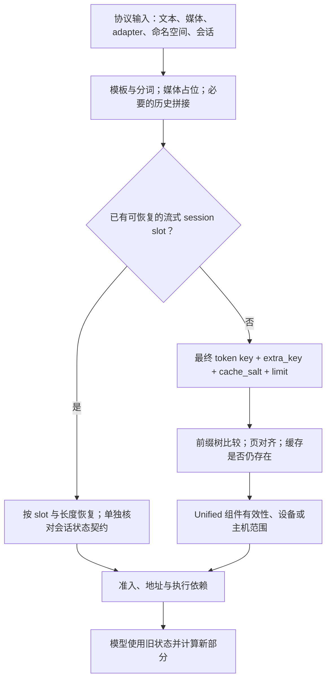
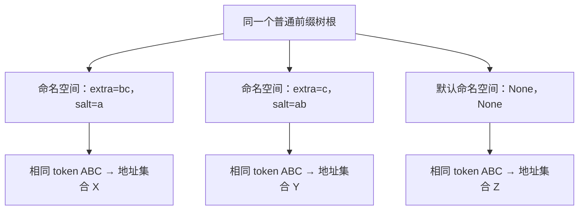
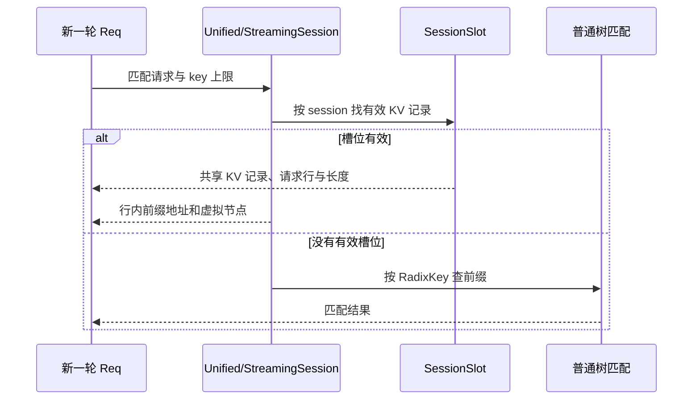
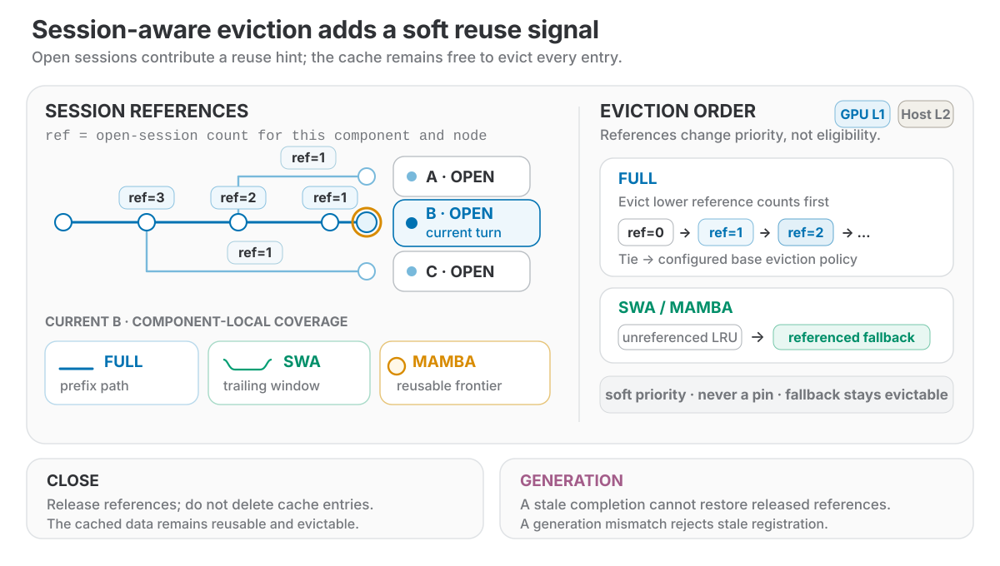

# 命中条件与缓存隔离

> **先建立架构心智模型：** [M05 · 缓存架构与资源所有权](<../architecture/05-缓存架构与资源所有权.md>)。先看职责、数据和生命周期，再回到本篇源码细节。

两次请求显示同一句话，不代表它们交给模型的是同一串 token；同一串 token，也不代表使用了相同的 LoRA、图片特征或会话状态。缓存复用要先回答“是否在比较同一份计算的历史”，再回答“这份历史现在是否存在、可用、受保护”。

本文是**源码分析型学习资料**，是系列第 **04-03** 篇。从请求字段到缓存键，串起文本、模型、LoRA、salt、多模态和会话的代表路径，解释哪些条件改变 key，哪些条件限制匹配长度，哪些机制直接保存了另一份可续用状态。

## 0. 阅读基线与范围

| 项目 | 内容 |
| --- | --- |
| 源码路径基准 | SGLang 仓库根目录 `.`；本文源码位置均为仓内相对路径 |
| 分支 | `codex/sglang-source-study-20260909`，基于官方 `main` |
| commit | `72d5c5bb73cadd7ffbf5114e5f81e29d36b6c61a` |
| 读取日期 | `2026-09-09` |
| 工作区状态 | 学习源码 worktree 干净；原源码与 Wiki 既有资料保留 |
| 操作边界 | 静态阅读请求字段传递、传统/Unified 的 key 边界、代表 LoRA 注册与权重更新、MM 身份/占位、三类会话路径；相关测试片段仅阅读 |
| 前置 | [02-01 API 到请求对象](../02-request-lifecycle/01-API协议到内部请求对象.md)、[04-01 请求地址](01-请求视图物理槽位与分配器.md)、[04-02 前缀树](02-RadixAttention与前缀匹配.md) |
| 普通主线 | 普通文本 Dense/full-attention、固定模型与执行条件、TP/PP/DP=1、非投机；先解释进程内设备前缀匹配，再逐项加入变化 |
| 独立变化 | LoRA、图片占位与代表预处理身份、输入向量覆盖、历史拼接会话、流式槽位会话、Unified session references |
| 不展开 | 全部模型/媒体处理器、完整 Unified 组件状态机、HiCache/L3 各后端键设计、服务鉴权、线上权重更新事务及 GPU 并发安全证明 |

该版本的默认缓存工厂在未命中特殊分支时最终创建 UnifiedRadixCache。[选择链][S47] 本篇读到 Unified 的共享 key、会话优先入口和组件有效性边界；其完整机制在 04-04 展开。[实现选择说明](02-RadixAttention与前缀匹配.md)

下面的字符串、token、图片 hash 和会话名都是**教学假设**。本次没有安装/导入/运行 SGLang，没有发送请求、加载 LoRA、更新权重、清缓存、打开会话或执行图片处理。源码事实与教学推导分开，未提供运行验收结论。

## 1. 先分开身份、存在与可用

**人话版：** 想借用一份旧计算结果，先确认它属于正确版本、正确输入和正确上下文，再确认资料还在，最后确认当前工序能用。名字相同、找到了目录、数据已经可读，是三个不同判断。

| 层次 | 主要问题 | 代表源码状态 | 单独满足它还不够证明什么 |
| --- | --- | --- | --- |
| 计算与 key 的身份 | token、模型/adapter、输入向量和命名空间是否对应？ | 最终 input IDs、extra_key、cache_salt、实际模型与 session 条件 | 不能证明该 key 现在已有缓存 |
| 前缀存在范围 | 树里存了多长？本次最多允许匹配多长？ | limit、P、前缀分裂、被淘汰范围 | 不等于所有状态组件都有效 |
| 状态可恢复/可读 | 所需 KV 或混合状态位于何处、是否通过验证？ | device_indices、best_match_node、各组件 validator、host 命中 | 不等于跨设备传输或 GPU 写入已经完成 |
| 使用与回收期限 | 当前请求是否已保护这些地址？何时能归还？ | 请求行、前缀锁、session slot、执行依赖 | 不能只看一个命中数就允许任意复用/释放 |

本篇重点是第一层，以及它与后面几层的交界。准入、索引与释放的基本账本已经在前文建立，不把“命中”再简化成一个万能布尔值。



**图意解读：** 这是代表路径的决策图，不是进程拓扑。流式槽位可以在普通树比较之前命中；其恢复契约不能用普通 child key 的隔离规则替代。各方框的“可用”都只指各自检查点，不能跨步骤省略验证。

## 2. 从 API 字段追到真正的 RadixKey

### 2.1 请求字段经过了哪些交接

以已读 Python Chat/Native 请求路径为例：[Chat 适配][S9]、[单请求规范化][S4]、[tokenized 对象][S7]、[Scheduler 创建 Req][S8]

| 阶段 | 关键变化 | 下一层拿到什么 |
| --- | --- | --- |
| OpenAI Chat 适配 | 消息转为 prompt 输入，传递 extra_key/cache_salt 等字段 | GenerateReqInput |
| 单请求规范化 | 两个字段要求字符串或 None；空字符串转 None | 规范化后的请求 |
| 批量规范化 | 单个字符串广播；列表检查原始 batch 长度与元素类型，再按 parallel_sample_num 扩展 | 每个样本对应的命名空间 |
| TokenizerManager | 选择已有 input_ids、分词或多模态处理；传递 lora_id、session 信息和命名空间 | TokenizedGenerateReqInput |
| Req 构造 | lora_id 非空时追加到 extra_key；cache_salt 单独保存 | 请求内部的最终分类字段 |
| Scheduler 后续准备 | 可能拼接会话历史、替换多模态占位、加入特定模式命名空间 | 最终参与匹配的输入与 Req 字段 |
| Req 输入准备 | 构造带 limit 的 RadixKey，并接收匹配结果 | prefix_indices、末节点和保护范围 |

批量处理细节在 `GenerateReqInput._normalize_extra_key` 与 `_normalize_cache_salt`。例如原始两条请求的 salt 是 `['a','b']`，parallel_sample_num=2，对应扩展为 `['a','b','a','b']`；不是凭直觉写成 `['a','a','b','b']`。[两个规范化函数][S5][S6]

这条链说明应检查**最终 Req 上的值**。只保存客户端 JSON，可能漏掉 LoRA ID 追加、媒体展开和会话拼接这些后续变化。

### 2.2 key 直接保存哪些东西，哪些没有直接写进去

`python/sglang/srt/mem_cache/radix_cache.py::RadixKey` 的字段是 token_ids、extra_key、cache_salt、is_bigram、limit。[定义与字段契约][S1]

| 信息 | 是否是本类直接字段 | 怎么影响普通主线 |
| --- | --- | --- |
| token 序列 | 是 | 从开头比较连续相同的逻辑单位 |
| extra_key / cache_salt | 是，两者分开 | 区分本地树中的命名空间 |
| bigram 模式 | 是 | 改变逻辑单位；本篇数值例子均为非 bigram |
| 匹配 limit | 是 | 限制这次看多长；不是一份已经存在的缓存 |
| 基础模型权重字节、model 字符串 | 否 | 普通实例的模型与池上下文在 key 外；权重变更有独立失效流程 |
| LoRA ID | 不是单独字段 | Req 构造时参与 extra_key |
| session_id / generation | 否 | 用于历史/槽位/引用管理，不自动成为普通树命名空间 |
| temperature、top_p、max_new_tokens、stream | 否 | 不因字段值本身直接新增一个 RadixKey namespace；输出历史或其他执行条件仍可能改变 |

“不是直接字段”不代表这个条件无关。特别是模型权重和输入向量影响 KV 的含义，不能只凭 key 的字段列表得出任意跨模型共享结论。

## 3. 同样的可见文本，为什么会有不同 token 前缀

### 3.1 比较最终 IDs，别只比较用户那一句话

普通 TokenizerManager 的分支顺序是：有 input_embeds 时走相应检查；否则优先使用已给的 input_ids；再否则才从文本分词。Chat 请求在此前还可能完成消息模板处理。[分词入口][S10]；模板与协议的细节见 [02-01](../02-request-lifecycle/01-API协议到内部请求对象.md)。

| 用户看到的相似之处 | 实际应比较的差异 | 对前缀的可能影响 |
| --- | --- | --- |
| 最后一条 user 消息相同 | system 消息、前面轮次、角色与模板 | 开头不同，后面那句话相同也不是同一前缀 |
| 显示出来没有明显差别 | 空白、换行、特殊 token、模板生成提示 | token 边界或序列长度可能不同 |
| 同样叫一个模型 | 实际 tokenizer/模型版本、实例与 adapter | 不应据 API 名称猜 token 和 KV 兼容性 |
| 两次都附带一张图 | 图片内容、展开数量、占位值及预处理 | 第一个图片占位附近可能已经分歧 |
| 本轮请求文本很短 | 服务端会话是否补上历史 | 真正参与匹配的序列可能远长于本轮输入 |

这是排查顺序；本次没有实际调用 tokenizer，因此不提供某句自然语言对应的真实 token ID。

### 3.2 输入完全相同，也可能不能跳过所有计算

普通 `Req._compute_max_prefix_len` 先取 `input_len-1`，指定 logprob 起点时还会进一步限制；树再做页对齐。P=4、输入长度 8，即使树中存有完整 8 个 token，也可能在请求准备时最多复用 4 个。[上限][S12]、[完整准备入口][S11]

`SGLANG_RADIX_FORCE_MISS` 还可在请求边界把本次匹配结果改为空。它改的是本次结果，不是自动清空整棵树。这个开关、树中是否有内容和实际 prefix 长度需要分别记录。[源码][S11]

temperature 不进入 key，表示同样输入不因温度这个字段本身被分成两棵树；但不同采样可能产生不同 output_ids。下一轮把输出拼回历史后，token key 就可能分叉。不要把“本轮输入前缀可以相同”写成“后续整段生成必然相同”。

## 4. 模型与 LoRA：兼容性不只来自一个显示名称

### 4.1 基础模型变化，要看失效动作

RadixKey 不携带模型权重内容摘要。普通解释应建立在固定模型、固定池与执行条件上；不能把两个服务实例的相同 token ID 直接视为相同物理 KV。

本次阅读了磁盘权重更新的代表路径：worker 更新后，`SchedulerWeightUpdaterManager` 按 `recv_req.flush_cache` 调用缓存清理；失败会触发相应断言。`UpdateWeightFromDiskReqInput` 的 flush_cache 默认 True，但它是可传入字段。[更新后的清理][S17]、[请求声明][S19]

`Scheduler.flush_cache` 只有在 `is_fully_idle()` 时才重置树、请求池和 KV allocator 等状态；忙碌时返回 False。记录 weight_version 与执行 flush 是不同动作，不能从版本标签改变推断所有旧 KV 已失效。[清理入口][S18]

这里只核对了代表更新/清理分支，没有执行更新，也没有证明所有更新协议的事务或异常恢复。排查更新后的缓存行为，应保存实际更新结果、flush 参数及返回状态，而不只看模型路径字符串。

### 4.2 LoRA 名称先变成内部 ID，再参与 extra_key

`LoRARegistry.acquire` 把已加载的 adapter 名称解析到 lora_id，同时开始跟踪使用；不存在的名称报错。Tokenized 请求携带该 ID，Req 再执行下列逻辑：[名称到 ID][S13]、[Req 构造][S3]

```python
# Req 构造中的核心关系；省略周围字段初始化。
if lora_id is not None:
    extra_key = (extra_key or "") + lora_id
self.extra_key = extra_key
self.cache_salt = cache_salt or None
```

这是字符串追加，**不是**一个独立的 `RadixKey.lora_id` 字段，也不能自行把它改画成包含模型 digest 的结构化元组。实际排查应保存追加后的 extra_key。

| LoRA 来源 | 本次读到的 ID 形成方式 | 需要保留的边界 |
| --- | --- | --- |
| 动态加载代表路径 | 新建 LoRARef，默认生成 uuid4 hex；加载成功后再注册 | 名称/路径复用与内部 ID 不应混为一谈；本次未加载或卸载 |
| 启动 lora-paths 代表解析 | 根据名称和路径生成确定性 uuid5 hex | 目的是使各节点独立解析得到一致 ID，不是权重文件字节摘要 |
| 请求使用已加载 adapter | registry 查找名称，返回已注册 ID | 后端 adapter 身份和缓存分类需要沿同一 ID 核对 |

固定依据：[LoRARef][S14]、[动态加载][S15]、[启动解析片段][S16]。本篇不把一个 ID 的存在当作热更新或跨节点一致性已经验收。

另有特定模型执行模式会补充命名空间：Scheduler 在满足条件的 Elastic EP 路径把有效 EP size 拼到 extra_key。这里仅作为“最终 key 可能晚于 Req 构造再次变化”的已读例子；不展开弹性并行协议。[命名空间补充][S48]

## 5. extra_key 与 cache_salt：相互独立的树命名空间

### 5.1 字典键是怎样组成的

在非 bigram、P=1 条件下，设当前 token 为 T，`RadixKey.child_key_at` 的结果可以概括为：[源码][S2]

| 最终 extra_key | 最终 cache_salt | child 字典键的形状 |
| --- | --- | --- |
| None | None | `T` |
| E | None | `(E, T)` |
| E 或 None | S 非空 | `((E, S), T)` |

P>1 时，T 的位置换成一页 token 的元组。比较前还会检查命名空间和逻辑单位兼容；不能把 extra_key/salt 随意拼成一个无边界字符串来模拟它。

例如 `extra_key='bc', salt='a'` 与 `extra_key='c', salt='ab'` 是不同命名空间，即使错误地拼字符串都能得到“abc”。传统树与 Unified 的相关测试都专门覆盖了两字段独立的情况。[传统测试][S42]、[Unified 测试][S43]



**图意解读：** 方框中的“命名空间”是对 child key 分类的教学表示，不是额外创建三个真实进程或必然存在三个 namespace 节点。不同 key 的前缀路径分开，彼此不会仅因 token 相同就共享这些节点。

### 5.2 空字符串、调用者责任与外部存储边界

标准 GenerateReqInput 规范化会把空 extra_key/salt 转成 None；直接构造内部对象的测试或其他入口，仍要按各自代码核对，不能只凭前端规则推断。

cache_salt 是调用者传入的分类值，不是从身份认证结果自动产生的证明。本篇确认的是本地树键如何分开，未审计网关如何选 salt、哪些用户可传入什么值，也不将它等同于访问控制。

还要区分本地树和外部键：RadixKey 的字段说明明确将该 salt 契约限定到进程内树与外部 KV events，并把外部 L3/remote storage 的 token-only 键排除在这份契约之外。[字段说明][S1] 因此不能把“salt 分开了本地前缀”扩写为“任意远端存储后端都按同一方式隔离”；后端的额外命名空间、模型身份与键生成要在对应专题单独阅读。

## 6. 多模态：相同文字之外，还有媒体与处理条件

### 6.1 图片身份怎样进入参与匹配的 token 序列

在已读通用多模态数据路径中，每个 MultimodalDataItem 有 hash 和 pad_value。`set_pad_value` 在尚无 pad_value 时解析 item hash，再计算占位值；`MultimodalProcessorOutput.build_padded_input_ids` 按 item offsets，把对应闭区间替换为占位值。[item 身份][S20]、[填充输入][S22]

当前占位关系是：

```text
pad_value = 1_000_000 + (item_hash % 2^30)
```

这是 `python/sglang/srt/managers/schedule_batch.py::_compute_pad_value` 的公式；不是实际调用 tokenizer 生成的词表 token。源码另有词表大小与占位区间的检查。[公式][S21]

Scheduler 优先尝试使用处理器已提供、长度合适的 padded_input_ids；否则调用该模型的 pad_input_ids_func，之后把结果作为 Req 的 origin_input_ids 并继续处理媒体状态。[已有 padded 输入复用][S23]、[生成请求中的多模态处理][S8]

教学例子中，同样八个位置的请求序列是：

| 输入 | 最终参与比较的序列（教学） |
| --- | --- |
| R1，图片 item hash=17 | `[101,102,1000017,1000017,1000017,1000017,103,104]` |
| R2，图片 item hash=18 | `[101,102,1000018,1000018,1000018,1000018,103,104]` |

即使前端都显示“请看这张图”，这两串 IDs 在位置 2 就不同。P=1 的普通前缀比较最多共享前两个；P=4 时第一页已不同，不能共享这一页。这是对给定序列的算术推演，不是实际模型对两张图的测量。

### 6.2 hash 的来源与预处理身份，是两层问题

`resolve_multimodal_item_hash` 的代表规则如下：[实现][S24]

| 条件 | 处理 | 不应推导什么 |
| --- | --- | --- |
| SGLANG_MM_SKIP_COMPUTE_HASH 开启 | 生成随机 UUID 整数 | 不是稳定内容 hash；同媒体不保证保持相同占位 |
| 已有 existing_hash | 复用已有值 | 这一步没有重新验证它与媒体字节是否一致 |
| 没有已有 hash | 从 feature 或 precomputed_embeddings 计算 | 来源是该分支的特征表示，不必等于原始文件 digest |
| 额外提供 namespace | 用 namespace 与 item hash 构造带作用域的结果 | 只有真正传入该参数的调用才获得这层作用域 |

另一层是**预处理缓存身份**。`build_processor_fingerprint` 将处理器类别、相关配置、版本信息等组成指纹；本次还读到 KimiK3ImageProcessor 的 `_make_artifact` 把 artifact_key 作为 namespace 传入 item hash 解析，使这一代表路径的身份包含预处理产物作用域。[指纹工具][S25]、[Kimi K3 代表调用][S26]

这不是说所有媒体处理器都以同样方式携带全部配置。通用 `MultimodalDataItem.set_pad_value` 没有在此自行构造一个完整预处理 namespace，已有 hash 的来源仍要回到具体 processor。

pad_value 还只是有限范围的整数映射，不能把它说成完整 SHA-256 或数学上绝无碰撞的内容身份证。本篇没有进行碰撞、媒体一致性或错误复用实验。

## 7. 直接输入向量与按位置覆盖向量，要拆成读写两侧

### 7.1 input_embeds 的代表入口有显式门槛

普通 TokenizerManager 在收到 input_embeds 而 `disable_radix_cache=False` 时抛 ValueError，要求关闭 radix cache。Scheduler 的对应普通请求分支会按向量序列长度生成占位 input_ids。[Tokenizer 检查][S10]、[Scheduler 占位分支][S8]

原因很直观：两组不同向量可以有相同长度；如果只用统一占位 IDs 做前缀判断，就无法表达向量内容差异。这里确认的是所读 Python 入口，不把它外推成所有自定义输入通道都已完成相同检查。

### 7.2 positional_embed_overrides 是“指定位置替换输入向量”

这个字段不应与 RoPE 坐标变化混为一谈。Batch 准备使用其 positions 与 embeds，把完整序列中的位置转换为本次 extend 的位置，再收集需要替换的向量。[Batch 处理][S27]

Req 的匹配准备看到该字段非空，会把用于匹配的 token 序列设为空，从而在这个入口避开旧前缀复用。[匹配侧][S11]

但这条分支**只直接证明匹配侧的动作**。总释放入口通过 is_insert 与 skip_radix_cache_insert 决定是否允许插入；未完成交接也有单独的 skip 门，Unified 的结束插入再使用 token IDs、extra_key、cache_salt 等信息。[未完成门控][S28]、[总释放门控][S49]、[结束插入][S29]

因此不能把“这个请求查询时强制 miss”改写成“它从不向共享缓存写入”。本次没有做这个输入组合的运行正确性验收，也没有把局部读侧条件当作完整的向量隔离证明。排查该类问题时，需要同时保留输入覆盖、实际 key、插入条件和后续请求的命中证据。

## 8. 会话：三种机制，不是一个 session_id 就能概括

### 8.1 先区分历史拼接、槽位续用和树引用

| 会话机制 | 保存或改变什么 | 怎样取得历史 KV | session ID 的主要作用 |
| --- | --- | --- | --- |
| 非流式 Session 历史管理 | 服务端保存请求关系，按 append/replace/offset 等拼输入 | 拼好输入后仍走对应 cache 匹配 | 找历史节点与组织对话，不自动进入 RadixKey |
| streaming Session / SessionSlot | 保存请求的 KV 记录及行、长度、初始前缀保护关系 | 先尝试恢复同一 session slot；不存在时回普通匹配 | 直接定位一份可续用状态 |
| Unified session references | 在树组件上登记 session 引用与 generation | 仍按内容 key 匹配；引用影响保留/回收管理 | 跟踪哪个会话引用哪些树范围，处理 close/reopen 代次 |

这里的 streaming session 与 HTTP `stream=True` 不是同一个概念：前者保存跨轮 KV 状态，后者控制响应输出方式。两者必须分别记录。

### 8.2 非流式 Session 会改最终历史，但不自动追加 namespace

`Session.create_req` 查找上一请求，必要时移除追加轮次的首个 BOS，再组装历史；默认追加已有输入、可保留输出和新输入，drop_previous_output/offset 等改变这条组合规则。新 Req 使用本轮传入的 lora_id、extra_key 和 cache_salt。[创建请求][S30]、[历史拼接][S31]

例如，上一轮输入为 ABC、输出为 D，本轮只提交 EF，组装后可能是 ABCDEF；选择丢弃上一输出则为 ABCEF。这个例子省略了 BOS 和其他模式，实际边界由源码参数决定。

session_id 本身没有被这段代码自动拼进 RadixKey。两个非流式会话若最终 token 和有效 namespace 相同，可以落在同样的普通前缀路径；不能只因它们属于不同会话就假设缓存已互相隔离。

### 8.3 StreamingSession 可以先于树比较恢复槽位

流式会话的 create_req 只允许简单追加：已有活跃请求、replace、drop_previous_output 或非零 offset 会被拒绝。它维护最后成功轮次，用于后续追加。[会话约束][S30]

`StreamingSession.try_match_prefix` 先按会话找到有效 slot，再把保存的 ReqKvInfo 恢复到新 Req，按 committed 长度与本次 key 的长度上限选择可复用范围，处理失效尾部，最后返回该请求行里的地址与一个虚拟末节点。[匹配捷径][S32]、[共享 KV 记录恢复][S33]



**图意解读：** 有效 slot 分支使用 key 长度，但没有在这段恢复代码中重新逐 token 比较 RadixKey 的 extra_key/cache_salt。其正确续用依赖会话的追加与状态一致性契约；不能仅从“本轮传了一个新 salt/adapter”推导出旧 slot 已被排除。这是已读分支的边界，不是本次已复现的数据污染结论。

正常完成时，slot 接管/继续持有 KV 记录，SessionController 才把该轮记为最后成功轮次；预先中止的请求可从 session 脱离而保留旧 slot，执行中中止则有清理 slot 的路径。关闭流式 session 会解除其原树前缀引用、释放独占尾部与请求行等资源。[完成与中止交接][S34]、[释放 slot][S35]

所以“请求结束”不等于“这份 KV 已离开会话”，而“HTTP 响应结束”更不能单独证明下一轮是否可以复用。

### 8.4 Unified 的 session references 是内容树上的引用管理

`UnifiedSessionRefTracker.register_session_ref` 跳过流式 Session，检查功能开关、session ID、关闭状态和 generation；通过后，向各组件登记相应可复用叶节点。重新打开相同 ID 会产生新的 generation，旧请求的迟到登记会被拒绝。[引用登记][S36]、[打开/代次][S37]

`release_radix_session` 解除各组件的会话引用；组件的 release_session 减少覆盖引用并移除会话叶子记录。它不是在这个接口中无条件销毁所有相同内容的 KV，更不是改变 key 的命名空间。[关闭引用][S38]、[组件解除引用][S39]

相关单测在 FULL 组件小池中检查引用减少、旧 generation 被拒绝，以及先淘汰无会话引用的内容；本次仅阅读，不能把这几个断言扩大为所有组件的完整会话并发证明。[测试][S45]

### 图解补充：会话引用是保留倾向，不是硬锁



[查看原尺寸](../../../images/sglang-source-study/09-session-eviction.svg)（手机查看宽图时可横屏或放大）。

**图意解读：** 左边看哪些会话覆盖同一段树，右边看引用怎样影响淘汰次序；底部 Close 表示解除会话引用，Generation 用来拒绝过时代次的登记。

**对应本篇源码：** 把原图放回本节第三种会话机制：会话引用不自动成为 `RadixKey` 命名空间，也不替代本节单独说明的 SessionSlot 续用契约。 [源码：python/sglang/srt/mem_cache/radix_cache.py][S1]

**来源与边界：** [Unified Radix Cache: One Tree for Hybrid Model Prefix Caching](https://www.lmsys.org/blog/2026-08-11-unified-radix-cache/)，Zhangheng Huang、Ke Bao、Yi Zhang、Jialin Ouyang、Sicheng Pan，2026-08-11。只对应 Unified 的 session references。图里的“仍可淘汰”针对会话引用这一软信号，不允许绕过活跃请求锁或在途传输保护，也不等同于 StreamingSession 的槽位接管。 [来源档案 F09](../../../images/sglang-source-study/SOURCES.md#f09)。

## 9. key 相同之后，Unified 还要确认组件与驻留状态

当前 UnifiedRadixCache 的 match_prefix 先尝试 session slot；没有 slot 结果时，再检查缓存禁用状态并调用 tree_core，应用返回的动作，然后运行各组件的 finalizer，必要时还交给 linker。[顶层入口][S40]

树内部仍使用 RadixKey 的 child_key_at/match_at 比较；但是 `_match_prefix_helper` 还为组件建立 validator。在遍历过程中，只有满足相应组件检查的节点才能成为 best match；HiCache 条件下还区分通用匹配与仅设备驻留的匹配范围。[遍历与校验][S41]

| 观察值 | 应如何理解 | 不能直接推出什么 |
| --- | --- | --- |
| Full key 路径有一段匹配 | 该 token 路径存在对应的 Full 前缀信息 | 其他状态组件一定在同样深度可恢复 |
| best_match_node | 当前遍历接受的、通过组件条件的锚点 | 一定不需要主机回载 |
| last_device_node / device_indices | 返回给调度的设备匹配范围与索引 | 所有跨 stream 使用依赖已自动完成 |
| slot 返回虚拟节点 | 会话持有状态走了另一条恢复路径 | 这是一个真实前缀树节点，能直接套用树遍历逻辑 |

教学上可以设想：Full 路径长 12，而某状态组件只认可到 8，则“键相同到 12”与“当前可恢复到 8”并不矛盾。这只是说明两个观测量的区别，不是对某个实际模型 checkpoint 的测量；具体组件条件将在 04-04 逐项阅读。

## 10. R1/R2/R3 对照：每次只改变一个条件

下面统一假设缓存尚未被淘汰、P=1、普通非流式树路径，基础模型与其他执行条件固定；表中 L1/L2 是内部 LoRA ID 的教学缩写。

| 请求或变化 | 最终 token / namespace | 与已有 R1 的关系 | 结论边界 |
| --- | --- | --- | --- |
| R1 | ABCDEF；extra=`app-L1`，salt=`a` | 首次计算并留下前缀 | 是否插入及保留由实际交接决定 |
| R2：只换末尾 | ABCXYZ；同 extra/salt | key 可共享 ABC | 还受匹配上限、存在范围与状态条件限制 |
| R3：token 相同，salt 改 b | ABCDEF；extra 相同，salt 不同 | 普通树 namespace 不同 | 不从 R1 的本地树路径取前缀 |
| 只把 adapter 改成 L2 | token 相同，Req 最终 extra 不同 | 普通 key 分类改变 | 前提是按真实 registry ID 形成并核对最终 extra |
| 只改 temperature | 输入与 namespace 未变 | 不因 temperature 字段本身分开 | 输出历史之后可能分叉 |
| 只改图片内容 | 文本可见部分相同，MM 占位可能改变 | 从首个不同占位起分叉 | 必须看真实 hash/processor/最终 IDs |
| 换基础权重但保留旧池 | RadixKey 字段可能没有自动变化 | 不能靠 key 自行证明 KV 仍兼容 | 查更新失效流程与清理结果 |
| 改成已有 streaming slot | 可能在普通树比较前恢复状态 | 不适用上面仅由 child key 判断的路径 | 单独检查会话状态与输入条件的一致性 |

这张表回答“哪个判断发生变化”，不是命中率预测。无需先跑模型，就能用它避免把不同层次的问题混在一张 cached_tokens 曲线上。

## 11. 排障与源码复读地图

| 现象 | 先保存的证据 | 回到哪里 | 不能草率下的结论 |
| --- | --- | --- | --- |
| 同一句话不命中 | 最终 IDs、模板/历史、limit、P、extra/salt | TokenizerManager、Req 输入准备、RadixKey | 不直接归因于树实现错误 |
| 换了 LoRA 仍看到同样的分类值 | registry 结果、lora_id、追加后的 extra | LoRARegistry.acquire、Req 构造 | 不只比较 adapter 显示名称 |
| 模型更新后出现旧行为 | 更新返回、weight_version、flush 参数与返回、当时是否空闲 | WeightUpdater、Scheduler.flush_cache | 版本日志不等于缓存已清理 |
| 图片请求的命中不稳定 | item hash、pad_value、预处理配置、最终展开 IDs | identity helper、具体 processor、Scheduler MM 处理 | 同 URL 或同一可见占位符不等于同一输入 |
| override 请求强制 miss 后仍担心后续复用 | 匹配侧与插入侧条件、请求向量和后续命中 | Req.init_next_round_input、cache 交接 | miss 不等于没有写入缓存 |
| 不同会话互相共享前缀 | 会话类型、内容 key、salt/extra、实际 cache 类 | Session、SessionSlot、session_ref_tracker | session_id 不是自动的普通树隔离字段 |
| 更换 salt 后流式会话仍恢复历史 | 是否命中已有 slot、保存的 KV 记录与新请求条件 | StreamingSession.try_match_prefix | 不把 slot 恢复等同于重新查普通树 |
| 内容命中长度大于可用长度 | Full 路径、组件 validator、device/host 锚点 | UnifiedTreeCore、finalizers | 字符串匹配不等于全部状态可恢复 |
| salt 本地有效，远端行为不同 | 后端类型、L3 键与额外 namespace | 具体存储/连接器专题 | 本地 RadixKey 契约不是任意远端隔离保证 |

推荐按以下源码锚点顺序复读，而不是先全仓搜索“cache hit”：

| 顺序 | 仓内路径与符号 | 本次重点 |
| --- | --- | --- |
| 1 | `python/sglang/srt/managers/io_struct.py::GenerateReqInput._normalize_cache_salt` | 参数类型、空值与批量展开 |
| 2 | `python/sglang/srt/managers/tokenizer_manager.py::TokenizerManager._create_tokenized_object` | 字段跨前端/后端交接 |
| 3 | `python/sglang/srt/managers/schedule_batch.py::Req.__init__` | adapter 追加、salt、session 字段分工 |
| 4 | `python/sglang/srt/managers/schedule_batch.py::Req.init_next_round_input` | 最终 key 与长度、override/force-miss |
| 5 | `python/sglang/srt/mem_cache/radix_cache.py::RadixKey.child_key_at` | 本地命名空间的真实结构 |
| 6 | `python/sglang/srt/multimodal/cache/identity.py::resolve_multimodal_item_hash` | 特征 hash 与可选产物 namespace |
| 7 | `python/sglang/srt/session/session_controller.py::Session.create_req` | 历史组合与会话约束 |
| 8 | `python/sglang/srt/session/streaming_session.py::StreamingSession.try_match_prefix` | 内容树之前的 slot 恢复 |
| 9 | `python/sglang/srt/mem_cache/unified_cache/session_ref_tracker.py::UnifiedSessionRefTracker.register_session_ref` | 引用与 generation，不是内容 key |
| 10 | `python/sglang/srt/mem_cache/unified_cache/unified_tree_core.py::UnifiedTreeCore._match_prefix_helper` | key 相同之后的组件有效性 |

## 12. 测试证据与本次验证范围

| 测试文件 | 本篇实际阅读的片段 | 能限定到哪里 |
| --- | --- | --- |
| `test/registered/unit/mem_cache/test_radix_cache_unit.py` | extra_key 隔离，以及 salt 与 extra_key 独立的两组查询 | 传统 simulated 树的索引/namespace 断言；未运行 |
| `test/registered/unit/mem_cache/test_unified_radix_cache_unittest.py` | `test_cache_salt_and_extra_key_form_independent_namespaces` | Unified fixture 中两组字段分开匹配；没有读取/验证该大文件全部主题 |
| `test/registered/unit/multimodal/test_preprocess_cache.py` | 处理器指纹随配置改变、artifact namespace 影响 item hash、通用 item 使用 hash helper | 辅助身份函数的断言；不代表所有媒体/模型的端到端隔离 |
| `test/registered/unit/mem_cache/test_session_unified_radix_cache.py` | FULL 引用登记/解除、重开拒绝旧 generation、优先淘汰无会话引用内容 | CPU 小池代表测试；未运行，未验证所有组件与并发条件 |
| `test/registered/unit/mem_cache/test_streaming_session_unit.py` | slot 保存/恢复 KV 记录中的 Mamba 字段；预中止请求脱离而保留旧 slot | fake 对象/记录边界；不据此宣称真实设备和跨轮模型一致性通过 |

对应固定入口：[传统 namespace][S42]、[Unified namespace][S43]、[预处理身份][S44]、[会话引用][S45]、[streaming slot 测试][S46]。

本次只对命名空间元组、批量顺序、页对齐、媒体占位和历史组合做教学算术/字符串检查；源码符号与链接做静态核对。没有执行上述测试、生成真实媒体 hash、调用模型或开展租户/会话隔离验收。Mermaid 与文字做静态对应检查，未运行图像渲染器。

## 13. 练习、验收与下一篇

### 13.1 自测

1. 两次请求 token 完全相同，分别是 `(extra='bc', salt='a')` 和 `(extra='c', salt='ab')`。能否把两者都压成字符串“abc”后判断可共享？
2. 两张图的教学 hash 分别为 17、18，占位覆盖位置 2..5，前两个普通 token 相同。P=1 与 P=4 的普通树最多能共享到哪里？
3. 上一轮输入 ABC、输出 D，本轮追加 EF；为什么客户端只看到 EF，却可能命中 ABCD？不同 session ID 是否自动禁止这种内容共享？
4. 已有 streaming slot，本轮换 salt。能否只查看 RadixKey.child_key_at 就证明 slot 不会恢复？
5. 权重更新日志记录了新 weight_version，是否足以证明此前所有 KV 都已失效？

### 13.2 参考答案

1. 不能。源码将 extra 与 salt 保持为两个独立元素，两者的结构化 child key 不同；字符串拼接会丢失边界。
2. 对给定教学序列，原始共同前缀为 2；P=1 最多复用 2，P=4 首个完整页不同则为 0。仍假设缓存存在且其他条件允许。
3. 服务端历史管理可能把输入组合成 ABCDEF。session ID 用于定位历史，不自动加入普通树 key；要看最终 token 与实际 namespace。
4. 不能。有效 slot 分支可能先于普通树比较返回；还要核对保存状态、追加约束与新请求条件。本篇没有运行该组合验证。
5. 不足。记录版本、更新成功、是否请求 flush、flush 是否成功是不同事实；还要确认当时能否满足实际清理条件。

读完应能从一条实际请求列出最终 IDs、有效 extra/salt、adapter 身份、会话类型、匹配上限、实际 cache 类以及设备可用范围，并说明每个值来自哪一步。遇到“看起来相同”的请求，先把这些观察点对齐，再讨论命中率或正确性。

下一篇为 [04-04《UnifiedRadix 与混合状态组件》](04-UnifiedRadix与混合状态组件.md)，展开共同匹配、检查点恢复、组件交接与释放条件。

返回[系列目录](../README.md)、[源码入口索引](../appendices/02-源码入口与调用链索引.md)或[学习进度](../appendices/06-学习进度与版本变更记录.md)。

[S1]: https://github.com/sgl-project/sglang/blob/72d5c5bb73cadd7ffbf5114e5f81e29d36b6c61a/python/sglang/srt/mem_cache/radix_cache.py#L59
[S2]: https://github.com/sgl-project/sglang/blob/72d5c5bb73cadd7ffbf5114e5f81e29d36b6c61a/python/sglang/srt/mem_cache/radix_cache.py#L229
[S3]: https://github.com/sgl-project/sglang/blob/72d5c5bb73cadd7ffbf5114e5f81e29d36b6c61a/python/sglang/srt/managers/schedule_batch.py#L928
[S4]: https://github.com/sgl-project/sglang/blob/72d5c5bb73cadd7ffbf5114e5f81e29d36b6c61a/python/sglang/srt/managers/io_struct.py#L515
[S5]: https://github.com/sgl-project/sglang/blob/72d5c5bb73cadd7ffbf5114e5f81e29d36b6c61a/python/sglang/srt/managers/io_struct.py#L786
[S6]: https://github.com/sgl-project/sglang/blob/72d5c5bb73cadd7ffbf5114e5f81e29d36b6c61a/python/sglang/srt/managers/io_struct.py#L805
[S7]: https://github.com/sgl-project/sglang/blob/72d5c5bb73cadd7ffbf5114e5f81e29d36b6c61a/python/sglang/srt/managers/tokenizer_manager.py#L1356
[S8]: https://github.com/sgl-project/sglang/blob/72d5c5bb73cadd7ffbf5114e5f81e29d36b6c61a/python/sglang/srt/managers/scheduler.py#L2708
[S9]: https://github.com/sgl-project/sglang/blob/72d5c5bb73cadd7ffbf5114e5f81e29d36b6c61a/python/sglang/srt/entrypoints/openai/serving_chat.py#L1150
[S10]: https://github.com/sgl-project/sglang/blob/72d5c5bb73cadd7ffbf5114e5f81e29d36b6c61a/python/sglang/srt/managers/tokenizer_manager.py#L970
[S11]: https://github.com/sgl-project/sglang/blob/72d5c5bb73cadd7ffbf5114e5f81e29d36b6c61a/python/sglang/srt/managers/schedule_batch.py#L1440
[S12]: https://github.com/sgl-project/sglang/blob/72d5c5bb73cadd7ffbf5114e5f81e29d36b6c61a/python/sglang/srt/managers/schedule_batch.py#L1561
[S13]: https://github.com/sgl-project/sglang/blob/72d5c5bb73cadd7ffbf5114e5f81e29d36b6c61a/python/sglang/srt/lora/lora_registry.py#L126
[S14]: https://github.com/sgl-project/sglang/blob/72d5c5bb73cadd7ffbf5114e5f81e29d36b6c61a/python/sglang/srt/lora/lora_registry.py#L28
[S15]: https://github.com/sgl-project/sglang/blob/72d5c5bb73cadd7ffbf5114e5f81e29d36b6c61a/python/sglang/srt/managers/tokenizer_control_mixin.py#L601
[S16]: https://github.com/sgl-project/sglang/blob/72d5c5bb73cadd7ffbf5114e5f81e29d36b6c61a/python/sglang/srt/arg_groups/lora_hook.py#L63
[S17]: https://github.com/sgl-project/sglang/blob/72d5c5bb73cadd7ffbf5114e5f81e29d36b6c61a/python/sglang/srt/managers/scheduler_components/weight_updater.py#L104
[S18]: https://github.com/sgl-project/sglang/blob/72d5c5bb73cadd7ffbf5114e5f81e29d36b6c61a/python/sglang/srt/managers/scheduler.py#L4935
[S19]: https://github.com/sgl-project/sglang/blob/72d5c5bb73cadd7ffbf5114e5f81e29d36b6c61a/python/sglang/srt/managers/io_struct.py#L1776
[S20]: https://github.com/sgl-project/sglang/blob/72d5c5bb73cadd7ffbf5114e5f81e29d36b6c61a/python/sglang/srt/managers/schedule_batch.py#L424
[S21]: https://github.com/sgl-project/sglang/blob/72d5c5bb73cadd7ffbf5114e5f81e29d36b6c61a/python/sglang/srt/managers/schedule_batch.py#L252
[S22]: https://github.com/sgl-project/sglang/blob/72d5c5bb73cadd7ffbf5114e5f81e29d36b6c61a/python/sglang/srt/managers/schedule_batch.py#L625
[S23]: https://github.com/sgl-project/sglang/blob/72d5c5bb73cadd7ffbf5114e5f81e29d36b6c61a/python/sglang/srt/managers/scheduler.py#L2631
[S24]: https://github.com/sgl-project/sglang/blob/72d5c5bb73cadd7ffbf5114e5f81e29d36b6c61a/python/sglang/srt/multimodal/cache/identity.py#L329
[S25]: https://github.com/sgl-project/sglang/blob/72d5c5bb73cadd7ffbf5114e5f81e29d36b6c61a/python/sglang/srt/multimodal/cache/identity.py#L380
[S26]: https://github.com/sgl-project/sglang/blob/72d5c5bb73cadd7ffbf5114e5f81e29d36b6c61a/python/sglang/srt/multimodal/processors/kimi_k3.py#L497
[S27]: https://github.com/sgl-project/sglang/blob/72d5c5bb73cadd7ffbf5114e5f81e29d36b6c61a/python/sglang/srt/managers/schedule_batch.py#L2561
[S28]: https://github.com/sgl-project/sglang/blob/72d5c5bb73cadd7ffbf5114e5f81e29d36b6c61a/python/sglang/srt/mem_cache/common.py#L145
[S29]: https://github.com/sgl-project/sglang/blob/72d5c5bb73cadd7ffbf5114e5f81e29d36b6c61a/python/sglang/srt/mem_cache/unified_radix_cache.py#L852
[S30]: https://github.com/sgl-project/sglang/blob/72d5c5bb73cadd7ffbf5114e5f81e29d36b6c61a/python/sglang/srt/session/session_controller.py#L203
[S31]: https://github.com/sgl-project/sglang/blob/72d5c5bb73cadd7ffbf5114e5f81e29d36b6c61a/python/sglang/srt/session/session_controller.py#L178
[S32]: https://github.com/sgl-project/sglang/blob/72d5c5bb73cadd7ffbf5114e5f81e29d36b6c61a/python/sglang/srt/session/streaming_session.py#L197
[S33]: https://github.com/sgl-project/sglang/blob/72d5c5bb73cadd7ffbf5114e5f81e29d36b6c61a/python/sglang/srt/session/streaming_session.py#L71
[S34]: https://github.com/sgl-project/sglang/blob/72d5c5bb73cadd7ffbf5114e5f81e29d36b6c61a/python/sglang/srt/session/streaming_session.py#L263
[S35]: https://github.com/sgl-project/sglang/blob/72d5c5bb73cadd7ffbf5114e5f81e29d36b6c61a/python/sglang/srt/session/streaming_session.py#L385
[S36]: https://github.com/sgl-project/sglang/blob/72d5c5bb73cadd7ffbf5114e5f81e29d36b6c61a/python/sglang/srt/mem_cache/unified_cache/session_ref_tracker.py#L54
[S37]: https://github.com/sgl-project/sglang/blob/72d5c5bb73cadd7ffbf5114e5f81e29d36b6c61a/python/sglang/srt/mem_cache/unified_cache/session_ref_tracker.py#L87
[S38]: https://github.com/sgl-project/sglang/blob/72d5c5bb73cadd7ffbf5114e5f81e29d36b6c61a/python/sglang/srt/mem_cache/unified_cache/session_ref_tracker.py#L99
[S39]: https://github.com/sgl-project/sglang/blob/72d5c5bb73cadd7ffbf5114e5f81e29d36b6c61a/python/sglang/srt/mem_cache/unified_cache/components/tree_component.py#L256
[S40]: https://github.com/sgl-project/sglang/blob/72d5c5bb73cadd7ffbf5114e5f81e29d36b6c61a/python/sglang/srt/mem_cache/unified_radix_cache.py#L521
[S41]: https://github.com/sgl-project/sglang/blob/72d5c5bb73cadd7ffbf5114e5f81e29d36b6c61a/python/sglang/srt/mem_cache/unified_cache/unified_tree_core.py#L731
[S42]: https://github.com/sgl-project/sglang/blob/72d5c5bb73cadd7ffbf5114e5f81e29d36b6c61a/test/registered/unit/mem_cache/test_radix_cache_unit.py#L686
[S43]: https://github.com/sgl-project/sglang/blob/72d5c5bb73cadd7ffbf5114e5f81e29d36b6c61a/test/registered/unit/mem_cache/test_unified_radix_cache_unittest.py#L1364
[S44]: https://github.com/sgl-project/sglang/blob/72d5c5bb73cadd7ffbf5114e5f81e29d36b6c61a/test/registered/unit/multimodal/test_preprocess_cache.py#L207
[S45]: https://github.com/sgl-project/sglang/blob/72d5c5bb73cadd7ffbf5114e5f81e29d36b6c61a/test/registered/unit/mem_cache/test_session_unified_radix_cache.py#L110
[S46]: https://github.com/sgl-project/sglang/blob/72d5c5bb73cadd7ffbf5114e5f81e29d36b6c61a/test/registered/unit/mem_cache/test_streaming_session_unit.py#L131
[S47]: https://github.com/sgl-project/sglang/blob/72d5c5bb73cadd7ffbf5114e5f81e29d36b6c61a/python/sglang/srt/mem_cache/registry.py#L80
[S48]: https://github.com/sgl-project/sglang/blob/72d5c5bb73cadd7ffbf5114e5f81e29d36b6c61a/python/sglang/srt/managers/scheduler.py#L2670
[S49]: https://github.com/sgl-project/sglang/blob/72d5c5bb73cadd7ffbf5114e5f81e29d36b6c61a/python/sglang/srt/mem_cache/common.py#L238
