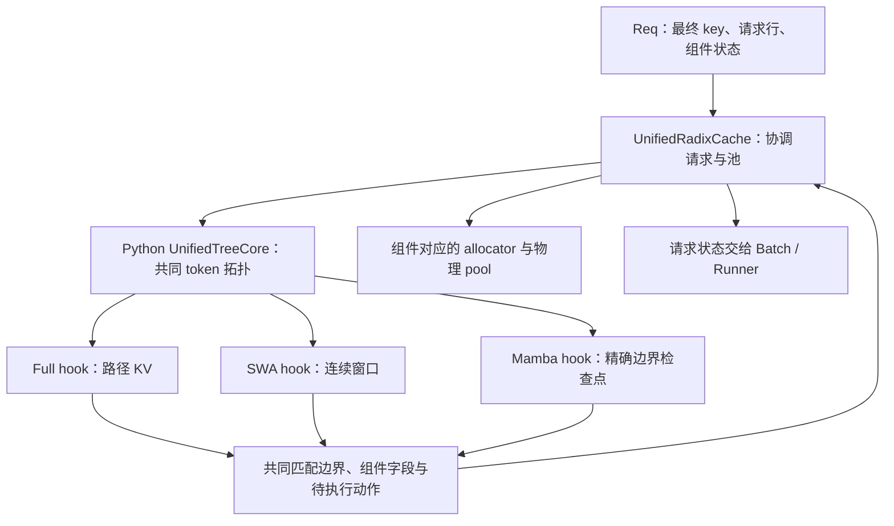
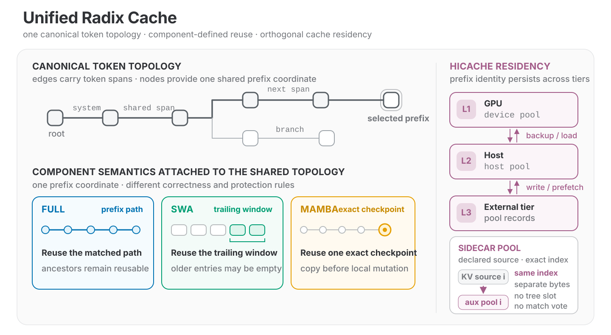
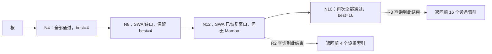
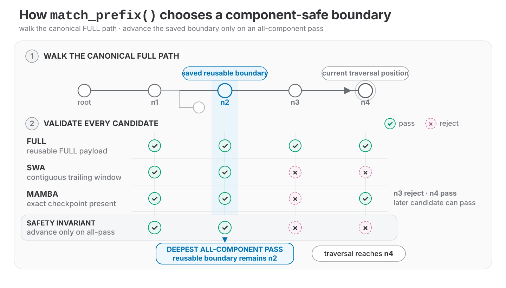
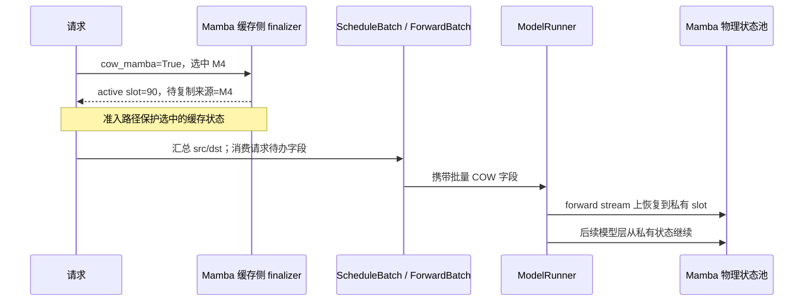
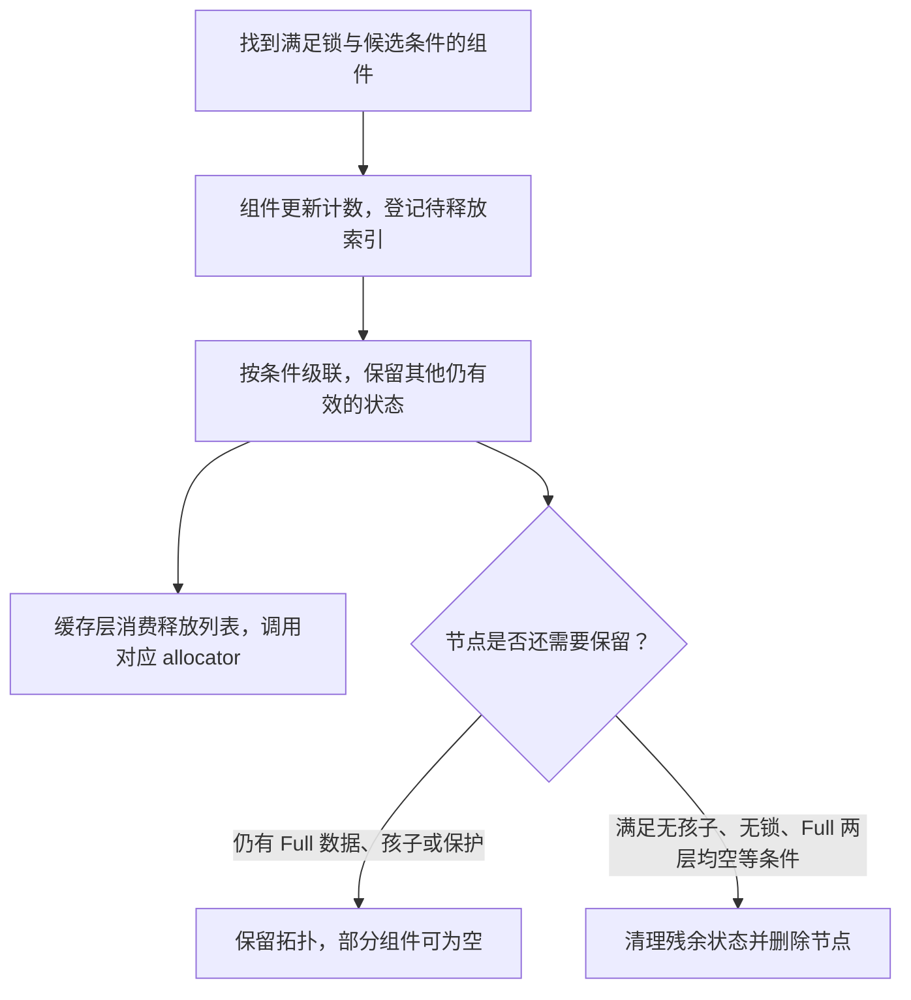

# UnifiedRadix 与混合状态组件

本文是**源码分析型学习资料**，面向已经读完 [04-01](01-请求视图物理槽位与分配器.md)、[04-02](02-RadixAttention与前缀匹配.md) 和 [04-03](03-命中条件与缓存隔离.md) 的读者。

核心问题是：同一段 token 的 Full Attention KV、滑动窗口 KV 和循环状态，保存方式与可恢复边界都不同，怎样给调度器返回一份可以继续计算的前缀？本篇沿“选组件 → 匹配 → 准备私有状态 → 执行 → 插入交接 → 解除保护与淘汰”走一遍。

## 0. 阅读基线与范围

| 项目 | 内容 |
| --- | --- |
| 源码路径基准 | SGLang 仓库根目录 `.`；所有源码位置均为仓内相对路径 |
| 分支 | `codex/sglang-source-study-20260909`，基于官方 `main` |
| commit | `72d5c5bb73cadd7ffbf5114e5f81e29d36b6c61a` |
| 读取日期 | `2026-09-09` |
| 工作区状态 | 学习源码 worktree 干净；原源码工作区及 Wiki 既有资料保留 |
| 操作边界 | 静态阅读 Python TreeCore、Full/SWA/Mamba 代表组件、请求交接、延迟 COW 的调用链及列明测试片段；只编写学习文档 |
| 主线 | 单实例、非投机、普通设备缓存；先 Full，再独立加入 SWA 与 Mamba，最后用组合表解释共同匹配 |
| 独立变化 | Mamba extra buffer、组件缺失、节点分裂、受锁 Full 上的 SWA 恢复；HiCache 仅解释接口与驻留边界 |
| 不展开 | 所有混合模型和硬件 override、Rust 内部实现、循环状态计算 kernel 的数学正确性、投机分支、完整 L2/L3 传输协议、统一内存池容量算法 |

本次没有安装或导入 SGLang，没有构建 Rust、执行测试、启动模型或运行 GPU 状态复制。下文地址、长度和图是**教学推演**；代码中的状态条件是**固定基线源码事实**。设备结果、数值精度和并发安全没有本次运行观察。

写作节奏参考既有[Unified Radix Cache 学习资料](<../../SGLang Unified Radix Cache 学习文档.md>)，但下文以当前固定源码为依据。旧材料中的“finalizer 做 COW”“叶子一起淘汰”等概括，需要继续展开到这一版的实际动作与保护条件。

## 1. 一棵树，三种“继续计算需要什么”

**人话版：** token 前缀像一本书的页码。Full 层需要前面各页留下的 KV；SWA 层只需要当前位置之前的一段连续窗口；循环状态层需要“恰好读到这里时”的检查点。共享页码，不代表三种资料都能任意切开或从相邻位置借用。

| 名称 | 保存的东西 | 可以复用的条件 | 主要保护范围 |
| --- | --- | --- | --- |
| FULL / FullComponent | 该段 token 的 Full pool 索引 | 所需路径在相应层有数据 | 设备前缀的祖先路径 |
| SWA / SWAComponent | 该段 token 对应的 SWA pool 索引 | 从序列起点完整覆盖，或缺口之后已经重新形成连续窗口 | 从选中边界向前覆盖窗口的节点 |
| MAMBA / MambaComponent | 某个前缀边界的循环状态槽位索引 | 当前候选边界本身有可用检查点 | 选中的检查点节点 |
| TreeCore | token 拓扑、节点、组件字段、计数与候选集合 | 组织遍历与组件 hooks | 不自行充当模型状态计算器 |
| UnifiedRadixCache | 请求/池交接与树返回动作的执行 | 把逻辑决定落实为索引、分配、释放等操作 | 不把一个匹配数当作设备完成事件 |
| tombstone | 节点仍在，某组件的 value 已为空 | 看其他组件与后续窗口是否还能使用 | 不能等同于整节点已经删除 |

这里的 MAMBA 是组件分类；它管理这条通用循环状态缓存路径，不意味着本篇已经读完所有使用它的模型算法。[组件数据][S6]、[Full 校验][S10]、[SWA 校验][S11]、[Mamba 校验][S12]



**图意解读：** 方框是同一运行系统里的职责，不是额外的服务进程。组件既有树侧 hooks，也有缓存侧 hooks；树负责组织调用，真实池操作通过缓存/组件执行端完成。后文的延迟 COW 还会继续交给 Runner。

### 图解补充：一棵 token 树挂接不同状态



[查看原尺寸](../../../images/sglang-source-study/10-unified-topology.svg)（手机查看宽图时可横屏或放大）。

**图意解读：** 左侧共用一条前缀路径，下面的蓝、绿、黄框分别表示 Full 路径、SWA 尾窗与 Mamba 检查点；右侧再独立描述数据驻留层级。

**对应本篇源码：** 对照 `TreeComponent` 的职责，再看组件各自保存的索引、保护范围和恢复条件；“同树”不意味着“同一种生命周期”。 [源码：python/sglang/srt/mem_cache/unified_cache/components/tree_component.py][S6]

**来源与边界：** [Unified Radix Cache: One Tree for Hybrid Model Prefix Caching](https://www.lmsys.org/blog/2026-08-11-unified-radix-cache/)，Zhangheng Huang、Ke Bao、Yi Zhang、Jialin Ouyang、Sicheng Pan，2026-08-11。组件语义与驻留位置是两个维度；图中并列展示能力，不代表任意模型都启用全部组件，也不代表任意布局与后端组合均已验证。 [来源档案 F10](../../../images/sglang-source-study/SOURCES.md#f10)。

## 2. 先确认实际选中了哪些组件和树实现

### 2.1 默认工厂与组件组装

`python/sglang/srt/mem_cache/registry.py::_create_unified_radix_cache` 从 `[FULL]` 开始，根据 is_hybrid_swa 加 SWA，根据 is_hybrid_ssm 加 MAMBA，再构造 UnifiedRadixCache。[组装][S1]

| 条件 | 已读选择 | 边界 |
| --- | --- | --- |
| 默认工厂未命中特殊路径 | 最终创建 UnifiedRadixCache | 完整上游选择链见 [04-02](02-RadixAttention与前缀匹配.md) |
| Full + hybrid SWA | 通常组装 FULL、SWA | 纯 SWA 的默认工厂另有 PureSWARadixCache 路径 |
| Full + hybrid SSM | 通常组装 FULL、MAMBA | 本篇读内建 MambaComponent |
| 同时满足两种 hybrid 标志 | 组装 FULL、SWA、MAMBA | 列表可构造不等于任意模型、池和参数组合都可运行 |
| 特定 NPU 请求池带 C128 sidecar 映射 | 另加 C128，并提供组件 override | 本篇不展开其实现；不能把枚举数写成永远只有三种 |
| MLX hybrid SSM | 工厂可以替换 MAMBA 的组件类 | 不把 Python 内建 MambaComponent 的细节外推到该 override |

UnifiedRadixCache 保存 component 实例和组件顺序，把同一组对象交给 TreeCore，并连接会话管理等入口。初始化日志包含组件列表与实际 Tree Core 类。[构造][S2]

### 2.2 Radix backend、TreeCore backend 和内存池是三件事

`SGLANG_UNIFIED_RADIX_TREE_CORE_BACKEND` 的声明默认值为 `python`；tree core registry 注册了 `python` 和 `rust`，未知名字抛 ValueError，Rust 工厂按需导入适配器。[声明][S4]、[工厂][S3]

这与外层 `--radix-cache-backend` 的缓存工厂选择不同，也不等于启用统一内存池。本文展开 **Python UnifiedTreeCore**。统一树可以连接不同分配器；“UnifiedRadix”这个名字不能证明内存已采用共享字节池，相关容量机制放在 04-06。

MambaComponent 要求 HybridReqToTokenPool；关闭 extra buffer 时还要求 page_size=1。SWAComponent 对 allocator 类型也有显式断言。[Mamba 构造][S13]、[SWA 构造][S14] 这些是源码约束，不是本次运行兼容性认证。

## 3. 节点里存索引，组件里定义生命周期

### 3.1 一个节点不是三份独立 token 树

UnifiedTreeNode 有共同的 key、parent、children、id，以及按 ComponentType 索引的 component_data。每个 ComponentData 含 value、lock_ref、host_value、host_lock_ref、metadata 和会话引用字段。[节点][S5]、[组件记录][S6]

| 字段 | 谁使用 | 读者应该怎样理解 |
| --- | --- | --- |
| node.key / parent / children | TreeCore | 一段压缩 token 与拓扑关系 |
| component_data[FULL].value | Full 路径与请求映射 | token 槽位索引数组，不是整层 K/V 张量 |
| component_data[SWA].value | SWA 组件 | SWA 索引；与 Full 索引的关系由 allocator 维护 |
| component_data[MAMBA].value | Mamba 组件 | 检查点槽位索引，不是“每个 token 一个循环状态” |
| value / host_value | 匹配、回载、淘汰 | 设备与主机驻留分别记录 |
| lock_ref / host_lock_ref | 组件保护 | 该组件的使用引用，不是 GPU event |
| metadata 中的 SWA uuid | SWA 锁获取/解除 | 记住本次窗口保护的停止边界 |
| NodeId | TreeCore 对外接口 | 节点句柄，不是 KV 槽位、请求行或 Python 对象地址 |

`node.evicted` 和 `node.backuped` 是以 **Full** 为基准的树级快捷判断。若 SWA.value=None、Full.value 仍在，不能说 node.evicted 已为 True；应点明“哪个组件在哪一层缺失”。

### 3.2 hooks 覆盖了什么

| 时机 | 代表 hook | 主要责任 |
| --- | --- | --- |
| 遍历匹配 | create_match_validator | 判断候选边界，必要时维护本次遍历状态 |
| 匹配收尾 | finalize_match_result_in_tree_core / in_cache | 补充恢复范围、branching 信息或请求私有状态准备 |
| 分裂节点 | redistribute_on_node_split | 重新分配索引段、锁边界与检查点归属 |
| 插入重叠 | update_component_on_insert_overlap | 说明新计算的哪些地址被采纳，哪些仍是重复数据 |
| 插入提交 | commit_insert_component_data | 挂上边界状态、创建 SWA 分段或产生动作 |
| 请求交接 | prepare_for_caching_req / cleanup_after_caching_req | 限制可缓存深度，转移/释放状态槽位 |
| 使用与回收 | acquire/release_component_lock、evict_component | 保护正确范围，登记待释放索引 |

接口默认实现不是每个组件的完整行为。例如通用 prepare 注释的 SWA 概括不能代替 SWA override；本篇按实际覆盖函数解释。[共同接口][S15]

## 4. 匹配：最远走到哪里，与最终选哪里分开

### 4.1 TreeCore 怎样组织一次匹配

UnifiedRadixCache.match_prefix 先处理会话捷径和 disable，再调用 TreeCore；树返回的动作先执行，随后运行缓存侧 finalizers。会话差异见 [04-03](03-命中条件与缓存隔离.md)。[缓存入口][S16]

Python TreeCore 的普通流程是：[匹配入口][S7]、[遍历][S8]、[收尾][S9]

1. 对 key 做所需逻辑转换及页对齐；空 key 返回根对应的空结果。
2. 每次匹配创建各组件的 validator；不是全局共用一个 SWA 累计器。
3. 沿 child key 比较 token。遇到 Full 在设备/主机都无数据的死节点就停止；局部相同可先分裂节点。
4. 在每个候选边界调用所有 validator；全部通过才更新 best match。
5. 当前候选不通过时仍可继续沿相同 token 路径向下走。
6. 用最后保存的设备边界截取 Full 索引，组件 finalizers 再补充相应字段，最终把节点对象换成 NodeId。

源码使用 `all([v(node) for v in validators])`，这里列表会先求出每个 validator 的结果。**整理者归纳：** 这样后面的状态型 validator 也会推进，不能随意改写成遇到第一个 False 就不再调用后续校验器的教学流程。

### 4.2 三个 validator 的真实差别

Full 与 Mamba 在设备主线都检查当前节点的相应 value 是否存在。二者相同的是判断形式，不同的是 value 的含义：Full 是路径的一段，Mamba 是该边界的检查点。[Full][S10]、[Mamba][S12]

SWA validator 带有连续长度状态：[源码][S11]

```text
开始：continuous_len = infinity
当前节点缺少本次要求的 SWA 数据：continuous_len = 0，拒绝
当前节点有数据：continuous_len += 当前节点 token 段长
当 continuous_len >= window 时，接受该边界
```

初始 infinity 表达“从序列起点尚无缺口”：长度不足一个完整窗口的短前缀，不应因此必然 miss。一旦经过缺口，就必须在之后重新累计足够长的连续数据。上面省略了 HiCache 的特殊布局分支；第 11 节单独标明。

### 4.3 R1 留下的状态，R2/R3 可以复用到哪里

下面是**预先存在的教学树快照**，不假设一次裸 insert 就创建这些节点。P=4、W=4，Mamba extra buffer 开启，Full 全部驻留；SWA 在深度 8 的段有缺口；Mamba 检查点位于深度 4 和 16。数字为机制示意，不是某模型默认 checkpoint 间隔或可直接启动的配置。

| 节点边界 | 本节点 token 区间 | Full | SWA | Mamba | SWA 连续量 | 三者都通过？ | 当前 best |
| --- | --- | --- | --- | --- | --- | --- | --- |
| N4 | [0,4) | 有 | 有 | M4 | infinity | 是 | 4 |
| N8 | [4,8) | 有 | 无 | 无 | 0 | 否 | 4 |
| N12 | [8,12) | 有 | 有 | 无 | 4 | 否，缺检查点 | 4 |
| N16 | [12,16) | 有 | 有 | M16 | 8 | 是 | 16 |

R2 共 14 个输入 token，前 12 个沿这条路径、后两个不同：普通请求上限 13，再按 P=4 对齐，查询到 12；最终可恢复到 **4**。R3 共 18 个输入 token，前 16 个沿这条路径：上限 17 对齐到 16，最终可恢复到 **16**。前文的 input_len-1 上限仍成立。[请求准备][S17]



**图意解读：** 虚线是两个独立请求的查询结束点。N8 失败没有截断整条 token 遍历；SWA 在 N12 恢复也没有替 Mamba 作决定。R3 从 M16 继续时只需当前位置之前的窗口，N8 的旧 SWA 缺口不再位于该窗口内。

`full_kv_hit_length` 记录遍历得到的 Full-key 相同长度；`len(device_indices)` 才是此次返回的设备前缀长度。R2 可以分别为 12 和 4，不能把 12 直接写成“跳过了 12 个输入 token 的所有计算”。[结果收尾][S9]

### 图解补充：走到最深节点，不一定能复用到那里



[查看原尺寸](../../../images/sglang-source-study/11-unified-boundary.svg)（手机查看宽图时可横屏或放大）。

**图意解读：** 沿上方路径走到 n4，再按列检查下面三种组件。图中最后全通过的位置是 n2；Mamba 在 n4 恢复通过，仍不能弥补同列 SWA 不通过。

**对应本篇源码：** 对照 TreeCore 的遍历与各 validator：保留最深的全通过边界，而不是遇到一次失败就把遍历与匹配一起终止。 [源码：python/sglang/srt/mem_cache/unified_cache/unified_tree_core.py][S8]

**来源与边界：** [Unified Radix Cache: One Tree for Hybrid Model Prefix Caching](https://www.lmsys.org/blog/2026-08-11-unified-radix-cache/)，Zhangheng Huang、Ke Bao、Yi Zhang、Jialin Ouyang、Sicheng Pan，2026-08-11。这是预设树快照。正文的 N4/N8/N12/N16 是另一组教学数据，二者只共享“全部组件通过才更新边界”的规则，不能混用节点编号。 [来源档案 F11](../../../images/sglang-source-study/SOURCES.md#f11)。

## 5. 节点分裂不能制造不存在的检查点

假设原节点表示 [0,8)，存 Full/SWA 的 8 个索引，并在末端 8 有 M8。查询只相同到 4，需要把它拆为父节点 [0,4) 与原节点后缀 [4,8)。[树分裂][S18]

| 状态 | 新父节点 [0,4) | 原节点后缀 [4,8) | 为什么 |
| --- | --- | --- | --- |
| Full 索引 | 原数组前 4 个索引的副本 | 后 4 个索引的副本 | 物理 KV 已按 token 存在，可重新分段 |
| SWA 索引 | 若原来有数据，同样按位置切分 | 保留后段 | 还需继承锁引用并迁移窗口 uuid |
| Mamba 检查点 | **None**，锁与会话引用清零 | 原 M8 留在这里 | M8 是读完 8 个 token 的状态，不能切一半变成 M4 |

依据：[Full 分裂][S19]、[SWA 分裂][S20]、[Mamba 分裂][S21]。Full/SWA 的 `.clone()` 在这里复制的是**索引张量**，不能据此计算为复制了同样数量的每层 KV。

因此，Full+Mamba 查询可以在新父节点处匹配 token，却无法在该节点恢复循环状态，需退回此前共同有效边界。Mamba 的 checkpoint 可以位于有孩子的节点；“保留在原边界”不等于“只允许最终叶节点有状态”。

## 6. Mamba 的 COW：准备来源与真正复制分两步

### 6.1 匹配函数准备请求私有槽位

普通 Req 输入准备会按缓存能力设置 cow_mamba。Mamba 的缓存侧 finalizer 在该选项为 True 且选中设备检查点存在时：[请求入口][S17]、[finalizer][S22]

1. 读取选中节点的 checkpoint 槽位索引。
2. 若请求尚无自己的 active slot，尝试分配一个。
3. 分配不足时暂时锁住选中边界，淘汰以满足一份 Mamba 分配，再尝试分配，并用对应锁参数解除临时保护；仍失败则断言。
4. 把来源记入 `req.kv.mamba_cow_src_index`，目标记在 `mamba_pool_idx`，清除 needs_clear。

**此时没有在 finalizer 中执行状态复制。** 源码中的“copy-on-write”是整个恢复流程的目的，不能把注释当作具体执行时刻。

### 6.2 从 Req 到 Runner，复制实际在哪一层

| 交接点 | 发生的事情 | 此时不能声称什么 |
| --- | --- | --- |
| Req 匹配 | 留下 source index 与请求私有 destination | 私有槽位已经包含正确状态 |
| 普通准入 | 为使用的树前缀获取组件锁 | 一个整数锁等于设备事件完成 |
| ScheduleBatch extend 准备 | 汇总 source/destination 数组，并消费 Req 上的待办字段 | 清空 Req 字段表示复制已经执行 |
| ForwardBatch | 接过批量 COW/clear 字段 | 转换对象本身做了复制 |
| ModelRunner 的普通 extend 前 | 在 forward stream 上执行 clear 或 COW，再进入使用状态的路径 | 主机函数返回就代表所有 GPU 工作同步完成 |

固定入口：[准入锁][S23]、[Batch 汇总][S24]、[ForwardBatch 字段交接][S25]、[Runner 执行][S26]、[forward 中的调用位置][S27]。

普通非 int8 checkpoint 分支会先把槽位索引转换为物理索引，再调用 HybridReqToTokenPool.copy_mamba_state；后者在有层传输计数器时先等待相应 Mamba 层，再调用物理 pool 的 copy_from。int8 checkpoint 分支改走 load_to_active，不能直接套用普通复制的布局解释。[池复制入口][S28]



**图意解读：** 假设 R2 从共享 M4 恢复到私有槽位 90；另一条同前缀请求需要自己的 active slot，不能与 R2 共同原地更新 90。图没有把真实 CUDA event 画成已测得结果，本次只核对主机调用位置与明确的复制分支。

若匹配准备后请求未被准入，Scheduler 会清掉待执行 COW/clear 字段，并按已读条件释放非 session 请求的 Mamba 槽位。否则，没入 batch 的请求也可能留下分配或迟到待办。[未准入处理片段][S29]

## 7. 检查点从哪里来，为什么插入长度会缩短

### 7.1 真实状态边界必须能被树表示

extra buffer 路径中的 tracked state 是在计算过程中保存的检查点。`mamba_checkpoint_grid(tree_page)` 使用缓存 chunk 粒度与实际树 page 的最小公倍数；Batch 准备记录 track_index、track_mask、传给后端的 track_seqlen，以及表示实际保存深度的 mamba_last_track_seqlen。[网格][S30]、[extend 跟踪准备][S31]

二者不能混用：某些中间 h 状态的索引选择需要把传入 track_seqlen 调成目标深度+1，而 mamba_last_track_seqlen 仍记录真正的前缀深度。本文只追踪元数据与缓存交接，没有验证模型 kernel 怎样计算 h。

Full 路径比当前可恢复边界更深时，Mamba finalizer 还可把 Full 命中长度向 checkpoint grid 对齐，产生 mamba_branching_seqlen；SWA 有按 page 对齐的对应 branching 字段。它们是**后续补状态的候选边界**，不是已经存在的可复用状态。[Mamba 收尾][S32]、[SWA 收尾][S33]

教学算术：缓存 chunk=64、实际树 page=128，则 grid=128；Full 命中 300，当前有效边界 128，对齐得到 256，可提出 256 的 branching 位置。是否在某次 forward 跟踪它，还受 extend 范围和对齐条件约束。

### 7.2 插入前，各组件提出有效长度

UnifiedRadixCache 的请求交接先给各组件 prepare_for_caching_req 填 InsertParams；组件可返回一个长度，缓存控制层取各意见与 token 长度的最小值，再做 key/page 对齐。[未完成交接][S34]、[完成交接][S35]

| 情况 | Mamba 代表处理 | 后续所有权 |
| --- | --- | --- |
| extra buffer，未完成请求，有 tracked state | 分配替补槽位，将选中的 ping-pong slot 捐给树 | 请求的跟踪映射改为新 slot，旧状态可供缓存持有 |
| 没有 extra buffer，未完成请求 | 为缓存另分配槽位并复制当前状态 | 请求继续拥有自己的 active state |
| 普通非 int8，完成请求 | 使用可保留的 ping-pong 槽位或 active slot 作为插入值 | 被树采用的槽位保留，其余按 cleanup 释放 |
| 尚无可插入 tracked depth | 可返回 0，使本次不建立有效前缀 | 不能用输入长度冒充状态深度 |
| int8 checkpoint / ReplaySSM 分支 | 有单独的存储/长度处理 | 本篇只标出路径，不泛化普通交接步骤 |

依据：[Mamba prepare][S36]、[捐赠槽位][S37]、[cleanup][S38]。捐赠方法返回旧索引，并把新索引同步到请求的 ping-pong 映射；并非复制一个索引就把同一物理槽位交给两方继续修改。

SWA prepare 记录已经被淘汰的前缀界限，并可根据 branching 条件限制本次插入到适合补窗口的边界。请求已经计算的尾部，和此次交给共享树的有效部分要分开。[SWA prepare][S39]

## 8. 插入有阶段屏障，请求交接还要重匹配

### 8.1 tree decides、cache executes 在代码里是什么

这一版不是一个递归 insert 完成所有工作。UnifiedRadixCache.insert 驱动 `begin_insert → 应用 actions → resume_insert`，直到拿到 result；finally 调用 end_insert 清掉续行状态并处理仍待执行的动作。[缓存 insert][S40]

TreeCore 把一次插入分为 WALK、COMMIT、TAIL：[阶段推进][S41]、[重叠处理][S42]、[提交][S43]

| 阶段 | 树侧工作 | 为什么可能暂停 |
| --- | --- | --- |
| WALK | 比较/分裂已有路径，恢复缺失 Full，询问组件哪些地址被采纳，登记重复地址释放 | 某些动作会操作 allocator、恢复映射或触发备份，下一步依赖其结果 |
| COMMIT | 创建 Full 后缀，调用所有组件的边界提交 hook | SWARebuild、Mamba 路径上限等动作可能需要在继续前处理 |
| TAIL | 完成插入收尾，返回累计结果与剩余动作 | 本篇不展开 HiCache 备份的完整条件 |

普通重复 FreeDeviceKV / FullOnly 等列明类型可以延后批量执行；出现非延后动作时返回屏障。这里的屏障是**树与动作执行的调用边界**，不应直接画成 CUDA event 或分布式 barrier。

`_apply_cache_actions` 逐个消费列表，已经消费的元素不再重复应用；ComponentAction 路由到相应组件，其他动作由缓存层处理。[动作执行][S44] 这不是完整事务回滚承诺；异常路径虽清除 insert 续行状态，不能据此推定所有已发生树变化都会复原。

### 8.2 未完成请求：插树后还要把地址和锁接回来

普通 cache_unfinished_req 在插入后重新 match：[源码][S34]

1. 得到树最终采用的 device_indices 和节点。
2. 校验此前保护范围与新范围关系。
3. 把请求行中需要更新的区间改为树采用的地址。
4. 解除旧节点的请求锁，获取新边界的组件锁。
5. 更新 cache_protected_len、last_node、SWA uuid 与 skip_lock_node_ids。
6. 对未被树覆盖的请求尾部保留原索引，调用各组件 cleanup。

这里的重匹配没有自动请求 COW，MatchPrefixParams 的 cow_mamba 默认 False。请求已经有本轮继续计算的 active state，不应把这次索引交接再解释成重新恢复一次共享检查点。[参数默认][S45]

可选 Mamba decode 跳锁路径会把未锁的组件记在 skip 集合中；一般阅读先按开关关闭走完整锁，再看这条局部优化。解除时需要对应获取时的事实，不能释放一份从未获取的引用。

### 8.3 完成请求：采用、重复与未插入三种结果

完成交接会对有效长度外/未对齐尾部做释放，解除请求持有的前缀锁，再由各组件 cleanup 处理状态。[完成交接][S35]

Mamba 的 `InsertResult.mamba_exist=True` 表示目标边界已经有 checkpoint，本次准备的额外 checkpoint 没被采用；不是说插入失败，也不代表 Full/SWA 没有变化。cleanup 根据完成状态、buffer 模式和是否被采用，释放不用的槽位，或留下已捐给树的槽位。[组件提交][S46]、[cleanup][S38]

| 教学状态 | 树 | 请求/额外槽位 | 收尾要点 |
| --- | --- | --- | --- |
| 新边界采用 checkpoint 70 | 持有 70 | 请求结束后不再原地修改 70 | 不能把 70 又归还 allocator |
| 边界已有 checkpoint 40，新准备 70 | 仍持有 40 | 70 是未被采用的额外状态 | 释放 70；不能释放 40 |
| 本次禁止插入 | 保留原树前缀 | 释放请求独占部分与不用的状态 | 不把整个共享前缀一起 free |

## 9. SWA 的特殊交接：窗口分段与受锁 Full 恢复

### 9.1 长节点为什么要再切一次

SWA 提交新叶时按 swa_evicted_seqlen 区分窗口外段和窗口内段；完全在窗口外的节点可只保留 Full，SWA 留空。跨界时拆成 SWA tombstone 父段与有数据的子段。[提交][S47]

窗口内新叶过长时，还可按 `ceil(W/P) × P` 留出末尾段，使锁定该末段时不会把一整块长 Prefill 的 SWA 都保护住。教学上 W=6、P=4，末段大小为 8；它是页粒度覆盖窗口，不保证恰好 6 个槽位。[叶子窗口限制][S48]

### 9.2 已有 Full、缺少 SWA，怎样采纳新计算

重叠插入发现 SWA tombstone 时，需要检查新地址是否还位于请求有效 SWA 范围内。[重叠恢复][S49]

| 旧 Full 状态 | 代表恢复行为 | 要避免的问题 |
| --- | --- | --- |
| 旧 Full 未锁 | 可采用新 Full，释放旧 Full-only，按新 Full 重建 SWA 索引 | 不能把已经不存在的 SWA 再释放一次 |
| 旧 Full 被锁 | 保留旧 Full，产生 RecoverSWAWithLockedFull | 不能替换其他请求仍使用的 Full 地址 |
| 只有部分处于有效 SWA 范围 | 先在界限处分裂，再恢复有效后缀 | 不能把窗口外无效地址登记成可复用 SWA |
| 全部在窗口外 | 不采纳该段 SWA | 有 Full 不代表该处有有效窗口 |

非共享内存 allocator 的受锁恢复动作会把新计算的 SWA 映射交给保留的 Full，清除新 Full 的映射，再只释放新 Full 段；统一池路径则转移 SWA 页的所有权映射。两条路径都要使最后的 SWA value 指向仍有效的页。[动作处理][S50]

教学地址：树保留 Full `[10,11,12,13]`，新请求重复算出的 Full 是 `[30,31,32,33]`，对应新 SWA 为 `[80,81,82,83]`。恢复后的目标是旧 Full 仍可用，并关联新的 SWA；不能把 30..33 的 Full 释放理解成同时销毁刚转交的 SWA。

## 10. 锁和淘汰：每个组件保护不同范围

### 10.1 获取与解除必须成对保留参数

TreeCore.inc_lock_ref 依次调用组件获取 hook；dec 则按获取时的参数释放。[获取/解除分发][S51]

| 组件 | 普通设备获取范围 | 解除时要保留什么 | 容量计数单位 |
| --- | --- | --- | --- |
| Full | 从设备驻留边界向根的有效路径 | 曾跳过哪些缺失节点 | token 槽位数，0→1 才转入 protected |
| SWA | 向前遍历，覆盖至少一个窗口的数据段 | swa_uuid_for_lock、skip 集合；分裂后 uuid 会迁移 | 被整段保护的 SWA 槽位数，可有页/节点覆盖余量 |
| Mamba | 选中节点的 checkpoint | 若获取时该处是 tombstone，解除时仍要跳过 | checkpoint 槽位数，不是 token 数 |

依据：[Full 锁][S52]、[Full 解除][S53]、[SWA 锁][S54]、[SWA 解除][S55]、[Mamba 锁][S56]、[Mamba 解除][S57]。

在前面的 N4..N16 快照，若 R3 使用 N16：Full 保护 16 个 token 的路径；SWA 可只保护末段 [12,16) 的 4 个索引；Mamba 保护一个 M16。把 16、4、1 直接相加称作“21 个 KV token”会混淆单位。

SWA 的早释放只应按其调用契约执行一次。TreeCore.dec_swa_lock_only 还会处理同节点更低优先级组件的锁；因此不能只读 SWA helper 的局部注释，就断言 Mamba 锁在完整调用中永远保持不动。[完整早释放入口][S58]

### 10.2 候选怎样选，再决定是否级联

Full 以设备叶子集合构建淘汰堆；SWA 与 Mamba 则各有自己的 LRU 游标，跳过不符合条件的状态。辅助组件在内部节点完成一次 tombstone 变化后，允许控制层先归还索引并重查分配容量，再继续下一步。[Full 候选][S81]、[SWA 驱动][S82]、[Mamba 驱动][S83]

“最近用过”也有组件差异：SWA 在匹配/插入结束时只刷新窗口加一页覆盖范围内的祖先；Mamba 匹配主要刷新真正使用的那个检查点。不能假设一次深匹配会让所有祖先的所有组件一起变成最热数据。[SWA 刷新][S84]、[Mamba 刷新][S85]

普通内部节点的淘汰优先级为 Full=2、SWA=1、Mamba=0；触发组件会带走同节点符合条件的更低/相同优先级组件。[优先级契约][S59]、[级联][S60]

| 内部节点上触发的组件 | 典型影响 | 仍须满足 |
| --- | --- | --- |
| Mamba | 移除该边界 checkpoint，保留 Full/SWA 路径 | 自身符合淘汰资格 |
| SWA | SWA 变空，并可级联该点的 Mamba | 不能留下违反保护关系的更低层锁 |
| Full | 下游依赖的 SWA/Mamba 也需处理 | 按实际层、候选及引用条件判断 |

“叶子”也不能只看 children 是否为空：设备叶子的判断以 Full 设备驻留、子节点是否仍有 Full 设备数据以及各组件是否有锁为准。节点可有 host-only 子节点，仍成为设备层候选。[设备叶子][S61]

叶子级联会调整优先级，但 `_should_cascade_evict_component` 还检查实际内部优先级、设备/主机锁与会话引用。**不是任意一个无锁 auxiliary 都能删掉仍受保护的 Full。** 更低优先级组件若存在不合法的残留锁，源码用断言暴露该状态。[级联资格][S62]

### 10.3 tombstone、释放列表与真正归还内存

组件 evict hook 先把索引加入 device_frees/host_frees，并调整组件计数；缓存层再将这些列表交给对应 allocator。Full 的 value 清空有意延后，因为 SWA 的释放仍要读取对应 Full 索引。[组件释放][S63][S64][S65]、[动作归还入口][S66]



**图意解读：** “value=None”是逻辑状态，“free 列表已交给 allocator”是另一项动作。图中的删除分支概括的是已读 tombstone 祖先清理条件；不同淘汰入口还会选择降到主机或删除，不能绕过各自条件。[祖先清理][S67]

Mamba 还有每条路径的 checkpoint 数量限制：从浅处尝试淘汰符合条件的设备状态，保留尾节点、分叉、锁和设备叶子等特殊位置，所以是软上限。它不会为了凑数随意删除仍受保护的状态。[路径限制][S68]

## 11. 与 HiCache、sidecar 和特殊布局的边界

开启 HiCache 后，TreeCore 分别维护“允许主机数据”的匹配和 device-only 匹配。best_match_node 可比 last_device_node 深；Full、SWA、Mamba 的 host hit 字段分别为后续回载提供信息，不表示传输已经结束。[双组 validator][S8]、[组件收尾][S9][S32][S33]

`python/sglang/srt/mem_cache/hybrid_cache/hybrid_pool_assembler.py::attach_hybrid_pool_to_unified_cache` 根据实际 KV pool 和组件组选择 strategy，安装 HostPoolGroup、HybridCacheController、组件 host pool、sidecar 及层传输计数器。[组装入口][S69] 完整写回、回载和传输完成条件在下一篇展开。

SidecarPoolSpec 描述“某池的传输索引来自另一个 source pool”。这类转移描述与 TreeComponent 的匹配/生命周期 hook 不同。[描述][S70] 不要只凭类名中的 sidecar 就判断它一定不参与树；前文 C128 是实际加入组件列表的硬件特例。

SWA validator 还存在 HiCache 且没有 SWA host pool 的特殊分支；源码注释联系到不把每请求 SWA ring 当作稳定内容缓存的 unified_kv 布局。Req 输入准备相应使用 swa_reprefill_tail_tokens 限制前缀，让尾部窗口重新 Prefill。[校验例外][S11]、[请求上限][S17] 该 accessor 对所识别的 unified_kv 布局、启用 SWA 且无 SWA host pool 时返回窗口大小；尾部重算也适用于普通 radix 复用，并非只在 HiCache 开启时发生。[尾部范围](https://github.com/sgl-project/sglang/blob/72d5c5bb73cadd7ffbf5114e5f81e29d36b6c61a/python/sglang/srt/mem_cache/unified_radix_cache.py#L3053) 本篇普通“连续窗口驻留”例子不直接覆盖这条布局，也不把 bypass 校验解释成窗口数据天然正确。

## 12. 排障地图与复读顺序

| 现象 | 先保存什么 | 回到哪里 | 易误判之处 |
| --- | --- | --- | --- |
| token 命中很深，返回前缀很短 | full_kv_hit_length、各候选组件 value、best/device 节点 | _match_prefix_helper 与三个 validators | 不一定是 key 比较失败 |
| 某节点失败，后面却能命中 | SWA 缺口后的连续段长、后面 checkpoint | SWA validator 与全组件判断 | 失败不是所有组件共同的永久停止条件 |
| 分裂后新前缀没有 Mamba 状态 | 分裂边界、旧 checkpoint 对应深度 | Mamba redistribute_on_node_split | 索引能切分，不代表 recurrent state 能切分 |
| 请求有 mamba_pool_idx，结果却异常 | COW 来源、Batch 字段、Runner 模式与复制调用 | finalizer → Batch → Runner | 分配好槽位不等于状态已经恢复 |
| 未准入请求持有额外状态 | adder 结果、是否 session、COW/clear 与 active slot | Scheduler 未准入处理 | 不能只检查正常 forward 收尾 |
| 长 Prefill 锁住过多 SWA | W、P、新叶长度、窗口切分和 uuid | SWA 提交与锁 | 整段粒度可能大于数学窗口 |
| 旧 Full 仍使用中，却需要补 SWA | Full lock_ref、旧/新 Full、SWA 映射 | overlap hook 与 RecoverSWAWithLockedFull | 不能把旧 Full 随意换成新地址 |
| finished 后状态池容量不回升 | mamba_exist、被采用槽位、buffer 模式 | prepare / commit / cleanup | 捐给树的状态不应按请求私有状态再次释放 |
| 解除锁影响另一条请求 | 获取时 uuid、skip IDs、期间节点分裂/恢复 | 组件 acquire/release | 只记 last_node 不够解释窗口范围 |
| 节点仍在但某组件为空 | 分组件驻留、候选集合、待释放列表 | cascade、tombstone 清理、allocator | 拓扑存在不等于所有物理数据存在 |
| checkpoint 数超过配置上限 | 尾节点、分叉、锁、设备叶子 | Mamba 路径限制 | 源码实现的是有保护条件的软上限 |

建议复读顺序：

1. `python/sglang/srt/mem_cache/registry.py::_create_unified_radix_cache`：组件来自哪里。
2. `python/sglang/srt/mem_cache/unified_cache/unified_tree_core.py::UnifiedTreeCore._match_prefix_helper`：共同遍历与不同判断。
3. `python/sglang/srt/mem_cache/unified_cache/components/swa_component.py::SWAComponent.create_match_validator`：缺口与恢复窗口。
4. `python/sglang/srt/mem_cache/unified_cache/components/mamba_component.py::MambaComponent.finalize_match_result_in_cache`：COW 来源与私有槽位。
5. `python/sglang/srt/model_executor/model_runner.py::ModelRunner._maybe_execute_deferred_mamba_cow_and_clear`：真正执行复制的代表入口。
6. `python/sglang/srt/mem_cache/unified_radix_cache.py::UnifiedRadixCache.cache_unfinished_req`：地址、锁与组件状态交接。
7. `python/sglang/srt/mem_cache/unified_cache/unified_tree_core.py::UnifiedTreeCore._insert_walk_step`：采纳与重复释放。
8. `python/sglang/srt/mem_cache/unified_cache/components/swa_component.py::SWAComponent.apply_component_action`：受锁恢复的真实映射动作。
9. `python/sglang/srt/mem_cache/unified_cache/unified_tree_core.py::UnifiedTreeCore._should_cascade_evict_component`：淘汰资格与保护。
10. `python/sglang/srt/mem_cache/unified_cache/components/mamba_component.py::MambaComponent.cleanup_after_caching_req`：采用与未采用状态的最后归属。

## 13. 本次读了哪些测试，证据止于哪里

| 文件 | 本次实际阅读片段 | 证据边界 |
| --- | --- | --- |
| `test/registered/unit/mem_cache/test_unified_radix_cache_unittest.py` | 共享前缀分裂、Mamba 淘汰与 COW、SWA 叶子窗口限制、Full hit 计数、受锁 Full 的辅助组件淘汰、insert 动作异常与 split relocation | 只读这些 fixture/断言；含 GPU 条件与配置 skip，未读取整个大文件的全部主题 |
| `test/registered/unit/mem_cache/test_mamba_path_state_cap.py` | 浅层淘汰、分叉/锁软上限、保留 host 与关闭上限的代表单测 | fake tree 的局部状态断言；文件另有 GPU 测试，本篇未展开 |
| `test/registered/unit/mem_cache/test_swa_locked_full_recover_unified.py` | TestRecoverActionHandler 的 live value、SWA 容量不变、仅回收新 Full 的检查 | 动作/allocator 代表验证，不是实际模型输出或并发验收 |
| `test/registered/unit/mem_cache/test_unified_radix_lock_ref.py` | 没有 last_node 且不插入时跳过请求锁释放 | mock 调用边界，不验证真实状态池 |

固定入口：[分裂][S71]、[Mamba COW 测试][S72]、[窗口锁粒度][S73]、[Full hit][S74]、[受锁 Full][S75]、[insert 异常][S76]、[split 动作顺序][S77]、[路径上限][S78]、[SWA 恢复动作][S79]、[无节点结束][S80]。

特别是名为 test_mamba_cow_on_match 的片段，没有调用本文追到的 Runner 延迟复制入口；不能凭测试名或一项内容相等断言，就宣称真实 forward stream 的 COW 顺序已经验证。本次所有测试均未执行。

本篇只核对教学长度、连续窗口、检查点选择、索引分段和槽位归属等算术/集合关系，并检查源码符号与文档链接。Mermaid 做文字与流程的静态核对，未运行图像渲染器。

## 14. 自测、参考答案与下一篇

### 14.1 自测

1. 第 4 节的 R2 为什么 Full 命中 12，却只返回 4？R3 为什么能跨过 N8 的缺口返回 16？
2. 一个末端为 8 的 Mamba checkpoint，随节点分裂能否变成末端 4 的 checkpoint？
3. Req 上的 mamba_cow_src_index 被清空，能否据此判断复制完成？下一步应查什么？
4. W=6、P=4，新建长 SWA 叶的末尾限制段是多少？为什么不是严格 6？
5. 新算出的 Full 与旧 Full 重复，旧 Full 被锁而旧 SWA 缺失，恢复时应保留什么？
6. 路径 checkpoint 上限为 1，却仍有 3 份状态，什么证据能区分合理保留与泄漏？

### 14.2 参考答案

1. R2 结束在 N12，那里缺 Mamba；此前最后共同通过的是 N4。R3 到 N16 时已经重新覆盖连续 SWA 窗口，并有 M16，所以再次共同通过。
2. 不能。新父段的 Mamba.value 设为 None；原检查点仍对应原来的完整前缀末端。
3. 不能。Batch 汇总时就会消费该字段；要继续查 ForwardBatch 的 src/dst、Runner 模式、执行入口与真实设备证据。
4. 8，按页向上覆盖窗口。窗口需求与地址/节点粒度不同。
5. 保留受锁旧 Full，交接新 SWA 映射或页所有权；只释放不再需要的新 Full，避免连带释放已经转交的 SWA。
6. 先看是否为尾节点、分叉、被锁或设备叶子，以及实际驱动是否执行；这条限制会保留符合条件的例外。还需分别核对树引用与 allocator 容量，单看数量不足以判断泄漏。

读完应能画出一条请求的共同 token 路径、每个组件实际需要的状态、COW 的交接点，以及各部分何时转交给树、何时允许释放。接下来是 [04-05《HiCache 分层存储与回载》](05-HiCache分层存储与回载.md)，继续追踪备份、主机与外部存储回载、逐层读取依赖和取消收尾。

返回[系列目录](../README.md)、[源码入口索引](../appendices/02-源码入口与调用链索引.md)或[学习进度](../appendices/06-学习进度与版本变更记录.md)。

[S1]: https://github.com/sgl-project/sglang/blob/72d5c5bb73cadd7ffbf5114e5f81e29d36b6c61a/python/sglang/srt/mem_cache/registry.py#L149
[S2]: https://github.com/sgl-project/sglang/blob/72d5c5bb73cadd7ffbf5114e5f81e29d36b6c61a/python/sglang/srt/mem_cache/unified_radix_cache.py#L149
[S3]: https://github.com/sgl-project/sglang/blob/72d5c5bb73cadd7ffbf5114e5f81e29d36b6c61a/python/sglang/srt/mem_cache/unified_cache/tree_core_registry.py#L70
[S4]: https://github.com/sgl-project/sglang/blob/72d5c5bb73cadd7ffbf5114e5f81e29d36b6c61a/python/sglang/srt/environ.py#L656
[S5]: https://github.com/sgl-project/sglang/blob/72d5c5bb73cadd7ffbf5114e5f81e29d36b6c61a/python/sglang/srt/mem_cache/unified_cache/unified_tree_core.py#L109
[S6]: https://github.com/sgl-project/sglang/blob/72d5c5bb73cadd7ffbf5114e5f81e29d36b6c61a/python/sglang/srt/mem_cache/unified_cache/components/tree_component.py#L48
[S7]: https://github.com/sgl-project/sglang/blob/72d5c5bb73cadd7ffbf5114e5f81e29d36b6c61a/python/sglang/srt/mem_cache/unified_cache/unified_tree_core.py#L704
[S8]: https://github.com/sgl-project/sglang/blob/72d5c5bb73cadd7ffbf5114e5f81e29d36b6c61a/python/sglang/srt/mem_cache/unified_cache/unified_tree_core.py#L731
[S9]: https://github.com/sgl-project/sglang/blob/72d5c5bb73cadd7ffbf5114e5f81e29d36b6c61a/python/sglang/srt/mem_cache/unified_cache/unified_tree_core.py#L821
[S10]: https://github.com/sgl-project/sglang/blob/72d5c5bb73cadd7ffbf5114e5f81e29d36b6c61a/python/sglang/srt/mem_cache/unified_cache/components/full_component.py#L105
[S11]: https://github.com/sgl-project/sglang/blob/72d5c5bb73cadd7ffbf5114e5f81e29d36b6c61a/python/sglang/srt/mem_cache/unified_cache/components/swa_component.py#L301
[S12]: https://github.com/sgl-project/sglang/blob/72d5c5bb73cadd7ffbf5114e5f81e29d36b6c61a/python/sglang/srt/mem_cache/unified_cache/components/mamba_component.py#L142
[S13]: https://github.com/sgl-project/sglang/blob/72d5c5bb73cadd7ffbf5114e5f81e29d36b6c61a/python/sglang/srt/mem_cache/unified_cache/components/mamba_component.py#L62
[S14]: https://github.com/sgl-project/sglang/blob/72d5c5bb73cadd7ffbf5114e5f81e29d36b6c61a/python/sglang/srt/mem_cache/unified_cache/components/swa_component.py#L69
[S15]: https://github.com/sgl-project/sglang/blob/72d5c5bb73cadd7ffbf5114e5f81e29d36b6c61a/python/sglang/srt/mem_cache/unified_cache/components/tree_component.py#L122
[S16]: https://github.com/sgl-project/sglang/blob/72d5c5bb73cadd7ffbf5114e5f81e29d36b6c61a/python/sglang/srt/mem_cache/unified_radix_cache.py#L521
[S17]: https://github.com/sgl-project/sglang/blob/72d5c5bb73cadd7ffbf5114e5f81e29d36b6c61a/python/sglang/srt/managers/schedule_batch.py#L1440
[S18]: https://github.com/sgl-project/sglang/blob/72d5c5bb73cadd7ffbf5114e5f81e29d36b6c61a/python/sglang/srt/mem_cache/unified_cache/unified_tree_core.py#L1178
[S19]: https://github.com/sgl-project/sglang/blob/72d5c5bb73cadd7ffbf5114e5f81e29d36b6c61a/python/sglang/srt/mem_cache/unified_cache/components/full_component.py#L142
[S20]: https://github.com/sgl-project/sglang/blob/72d5c5bb73cadd7ffbf5114e5f81e29d36b6c61a/python/sglang/srt/mem_cache/unified_cache/components/swa_component.py#L573
[S21]: https://github.com/sgl-project/sglang/blob/72d5c5bb73cadd7ffbf5114e5f81e29d36b6c61a/python/sglang/srt/mem_cache/unified_cache/components/mamba_component.py#L310
[S22]: https://github.com/sgl-project/sglang/blob/72d5c5bb73cadd7ffbf5114e5f81e29d36b6c61a/python/sglang/srt/mem_cache/unified_cache/components/mamba_component.py#L187
[S23]: https://github.com/sgl-project/sglang/blob/72d5c5bb73cadd7ffbf5114e5f81e29d36b6c61a/python/sglang/srt/managers/schedule_policy.py#L1018
[S24]: https://github.com/sgl-project/sglang/blob/72d5c5bb73cadd7ffbf5114e5f81e29d36b6c61a/python/sglang/srt/managers/schedule_batch.py#L2918
[S25]: https://github.com/sgl-project/sglang/blob/72d5c5bb73cadd7ffbf5114e5f81e29d36b6c61a/python/sglang/srt/model_executor/forward_batch_info.py#L823
[S26]: https://github.com/sgl-project/sglang/blob/72d5c5bb73cadd7ffbf5114e5f81e29d36b6c61a/python/sglang/srt/model_executor/model_runner.py#L1708
[S27]: https://github.com/sgl-project/sglang/blob/72d5c5bb73cadd7ffbf5114e5f81e29d36b6c61a/python/sglang/srt/model_executor/model_runner.py#L1805
[S28]: https://github.com/sgl-project/sglang/blob/72d5c5bb73cadd7ffbf5114e5f81e29d36b6c61a/python/sglang/srt/mem_cache/memory_pool.py#L1539
[S29]: https://github.com/sgl-project/sglang/blob/72d5c5bb73cadd7ffbf5114e5f81e29d36b6c61a/python/sglang/srt/managers/scheduler.py#L3913
[S30]: https://github.com/sgl-project/sglang/blob/72d5c5bb73cadd7ffbf5114e5f81e29d36b6c61a/python/sglang/srt/runtime_context.py#L1995
[S31]: https://github.com/sgl-project/sglang/blob/72d5c5bb73cadd7ffbf5114e5f81e29d36b6c61a/python/sglang/srt/managers/schedule_batch.py#L2822
[S32]: https://github.com/sgl-project/sglang/blob/72d5c5bb73cadd7ffbf5114e5f81e29d36b6c61a/python/sglang/srt/mem_cache/unified_cache/components/mamba_component.py#L155
[S33]: https://github.com/sgl-project/sglang/blob/72d5c5bb73cadd7ffbf5114e5f81e29d36b6c61a/python/sglang/srt/mem_cache/unified_cache/components/swa_component.py#L328
[S34]: https://github.com/sgl-project/sglang/blob/72d5c5bb73cadd7ffbf5114e5f81e29d36b6c61a/python/sglang/srt/mem_cache/unified_radix_cache.py#L941
[S35]: https://github.com/sgl-project/sglang/blob/72d5c5bb73cadd7ffbf5114e5f81e29d36b6c61a/python/sglang/srt/mem_cache/unified_radix_cache.py#L852
[S36]: https://github.com/sgl-project/sglang/blob/72d5c5bb73cadd7ffbf5114e5f81e29d36b6c61a/python/sglang/srt/mem_cache/unified_cache/components/mamba_component.py#L529
[S37]: https://github.com/sgl-project/sglang/blob/72d5c5bb73cadd7ffbf5114e5f81e29d36b6c61a/python/sglang/srt/mem_cache/memory_pool.py#L1620
[S38]: https://github.com/sgl-project/sglang/blob/72d5c5bb73cadd7ffbf5114e5f81e29d36b6c61a/python/sglang/srt/mem_cache/unified_cache/components/mamba_component.py#L608
[S39]: https://github.com/sgl-project/sglang/blob/72d5c5bb73cadd7ffbf5114e5f81e29d36b6c61a/python/sglang/srt/mem_cache/unified_cache/components/swa_component.py#L902
[S40]: https://github.com/sgl-project/sglang/blob/72d5c5bb73cadd7ffbf5114e5f81e29d36b6c61a/python/sglang/srt/mem_cache/unified_radix_cache.py#L545
[S41]: https://github.com/sgl-project/sglang/blob/72d5c5bb73cadd7ffbf5114e5f81e29d36b6c61a/python/sglang/srt/mem_cache/unified_cache/unified_tree_core.py#L995
[S42]: https://github.com/sgl-project/sglang/blob/72d5c5bb73cadd7ffbf5114e5f81e29d36b6c61a/python/sglang/srt/mem_cache/unified_cache/unified_tree_core.py#L1027
[S43]: https://github.com/sgl-project/sglang/blob/72d5c5bb73cadd7ffbf5114e5f81e29d36b6c61a/python/sglang/srt/mem_cache/unified_cache/unified_tree_core.py#L1102
[S44]: https://github.com/sgl-project/sglang/blob/72d5c5bb73cadd7ffbf5114e5f81e29d36b6c61a/python/sglang/srt/mem_cache/unified_radix_cache.py#L1068
[S45]: https://github.com/sgl-project/sglang/blob/72d5c5bb73cadd7ffbf5114e5f81e29d36b6c61a/python/sglang/srt/mem_cache/base_prefix_cache.py#L50
[S46]: https://github.com/sgl-project/sglang/blob/72d5c5bb73cadd7ffbf5114e5f81e29d36b6c61a/python/sglang/srt/mem_cache/unified_cache/components/mamba_component.py#L218
[S47]: https://github.com/sgl-project/sglang/blob/72d5c5bb73cadd7ffbf5114e5f81e29d36b6c61a/python/sglang/srt/mem_cache/unified_cache/components/swa_component.py#L496
[S48]: https://github.com/sgl-project/sglang/blob/72d5c5bb73cadd7ffbf5114e5f81e29d36b6c61a/python/sglang/srt/mem_cache/unified_cache/components/swa_component.py#L546
[S49]: https://github.com/sgl-project/sglang/blob/72d5c5bb73cadd7ffbf5114e5f81e29d36b6c61a/python/sglang/srt/mem_cache/unified_cache/components/swa_component.py#L372
[S50]: https://github.com/sgl-project/sglang/blob/72d5c5bb73cadd7ffbf5114e5f81e29d36b6c61a/python/sglang/srt/mem_cache/unified_cache/components/swa_component.py#L1435
[S51]: https://github.com/sgl-project/sglang/blob/72d5c5bb73cadd7ffbf5114e5f81e29d36b6c61a/python/sglang/srt/mem_cache/unified_cache/unified_tree_core.py#L621
[S52]: https://github.com/sgl-project/sglang/blob/72d5c5bb73cadd7ffbf5114e5f81e29d36b6c61a/python/sglang/srt/mem_cache/unified_cache/components/full_component.py#L263
[S53]: https://github.com/sgl-project/sglang/blob/72d5c5bb73cadd7ffbf5114e5f81e29d36b6c61a/python/sglang/srt/mem_cache/unified_cache/components/full_component.py#L307
[S54]: https://github.com/sgl-project/sglang/blob/72d5c5bb73cadd7ffbf5114e5f81e29d36b6c61a/python/sglang/srt/mem_cache/unified_cache/components/swa_component.py#L751
[S55]: https://github.com/sgl-project/sglang/blob/72d5c5bb73cadd7ffbf5114e5f81e29d36b6c61a/python/sglang/srt/mem_cache/unified_cache/components/swa_component.py#L807
[S56]: https://github.com/sgl-project/sglang/blob/72d5c5bb73cadd7ffbf5114e5f81e29d36b6c61a/python/sglang/srt/mem_cache/unified_cache/components/mamba_component.py#L433
[S57]: https://github.com/sgl-project/sglang/blob/72d5c5bb73cadd7ffbf5114e5f81e29d36b6c61a/python/sglang/srt/mem_cache/unified_cache/components/mamba_component.py#L463
[S58]: https://github.com/sgl-project/sglang/blob/72d5c5bb73cadd7ffbf5114e5f81e29d36b6c61a/python/sglang/srt/mem_cache/unified_cache/unified_tree_core.py#L655
[S59]: https://github.com/sgl-project/sglang/blob/72d5c5bb73cadd7ffbf5114e5f81e29d36b6c61a/python/sglang/srt/mem_cache/unified_cache/components/tree_component.py#L481
[S60]: https://github.com/sgl-project/sglang/blob/72d5c5bb73cadd7ffbf5114e5f81e29d36b6c61a/python/sglang/srt/mem_cache/unified_cache/unified_tree_core.py#L1663
[S61]: https://github.com/sgl-project/sglang/blob/72d5c5bb73cadd7ffbf5114e5f81e29d36b6c61a/python/sglang/srt/mem_cache/unified_cache/unified_tree_core.py#L1871
[S62]: https://github.com/sgl-project/sglang/blob/72d5c5bb73cadd7ffbf5114e5f81e29d36b6c61a/python/sglang/srt/mem_cache/unified_cache/unified_tree_core.py#L1714
[S63]: https://github.com/sgl-project/sglang/blob/72d5c5bb73cadd7ffbf5114e5f81e29d36b6c61a/python/sglang/srt/mem_cache/unified_cache/components/full_component.py#L160
[S64]: https://github.com/sgl-project/sglang/blob/72d5c5bb73cadd7ffbf5114e5f81e29d36b6c61a/python/sglang/srt/mem_cache/unified_cache/components/swa_component.py#L631
[S65]: https://github.com/sgl-project/sglang/blob/72d5c5bb73cadd7ffbf5114e5f81e29d36b6c61a/python/sglang/srt/mem_cache/unified_cache/components/mamba_component.py#L322
[S66]: https://github.com/sgl-project/sglang/blob/72d5c5bb73cadd7ffbf5114e5f81e29d36b6c61a/python/sglang/srt/mem_cache/unified_radix_cache.py#L1111
[S67]: https://github.com/sgl-project/sglang/blob/72d5c5bb73cadd7ffbf5114e5f81e29d36b6c61a/python/sglang/srt/mem_cache/unified_cache/unified_tree_core.py#L1815
[S68]: https://github.com/sgl-project/sglang/blob/72d5c5bb73cadd7ffbf5114e5f81e29d36b6c61a/python/sglang/srt/mem_cache/unified_cache/components/mamba_component.py#L262
[S69]: https://github.com/sgl-project/sglang/blob/72d5c5bb73cadd7ffbf5114e5f81e29d36b6c61a/python/sglang/srt/mem_cache/hybrid_cache/hybrid_pool_assembler.py#L1812
[S70]: https://github.com/sgl-project/sglang/blob/72d5c5bb73cadd7ffbf5114e5f81e29d36b6c61a/python/sglang/srt/mem_cache/hicache_storage.py#L116
[S71]: https://github.com/sgl-project/sglang/blob/72d5c5bb73cadd7ffbf5114e5f81e29d36b6c61a/test/registered/unit/mem_cache/test_unified_radix_cache_unittest.py#L1406
[S72]: https://github.com/sgl-project/sglang/blob/72d5c5bb73cadd7ffbf5114e5f81e29d36b6c61a/test/registered/unit/mem_cache/test_unified_radix_cache_unittest.py#L1866
[S73]: https://github.com/sgl-project/sglang/blob/72d5c5bb73cadd7ffbf5114e5f81e29d36b6c61a/test/registered/unit/mem_cache/test_unified_radix_cache_unittest.py#L2344
[S74]: https://github.com/sgl-project/sglang/blob/72d5c5bb73cadd7ffbf5114e5f81e29d36b6c61a/test/registered/unit/mem_cache/test_unified_radix_cache_unittest.py#L5497
[S75]: https://github.com/sgl-project/sglang/blob/72d5c5bb73cadd7ffbf5114e5f81e29d36b6c61a/test/registered/unit/mem_cache/test_unified_radix_cache_unittest.py#L2695
[S76]: https://github.com/sgl-project/sglang/blob/72d5c5bb73cadd7ffbf5114e5f81e29d36b6c61a/test/registered/unit/mem_cache/test_unified_radix_cache_unittest.py#L8178
[S77]: https://github.com/sgl-project/sglang/blob/72d5c5bb73cadd7ffbf5114e5f81e29d36b6c61a/test/registered/unit/mem_cache/test_unified_radix_cache_unittest.py#L8372
[S78]: https://github.com/sgl-project/sglang/blob/72d5c5bb73cadd7ffbf5114e5f81e29d36b6c61a/test/registered/unit/mem_cache/test_mamba_path_state_cap.py#L92
[S79]: https://github.com/sgl-project/sglang/blob/72d5c5bb73cadd7ffbf5114e5f81e29d36b6c61a/test/registered/unit/mem_cache/test_swa_locked_full_recover_unified.py#L215
[S80]: https://github.com/sgl-project/sglang/blob/72d5c5bb73cadd7ffbf5114e5f81e29d36b6c61a/test/registered/unit/mem_cache/test_unified_radix_lock_ref.py#L17
[S81]: https://github.com/sgl-project/sglang/blob/72d5c5bb73cadd7ffbf5114e5f81e29d36b6c61a/python/sglang/srt/mem_cache/unified_cache/components/full_component.py#L194
[S82]: https://github.com/sgl-project/sglang/blob/72d5c5bb73cadd7ffbf5114e5f81e29d36b6c61a/python/sglang/srt/mem_cache/unified_cache/components/swa_component.py#L690
[S83]: https://github.com/sgl-project/sglang/blob/72d5c5bb73cadd7ffbf5114e5f81e29d36b6c61a/python/sglang/srt/mem_cache/unified_cache/components/mamba_component.py#L372
[S84]: https://github.com/sgl-project/sglang/blob/72d5c5bb73cadd7ffbf5114e5f81e29d36b6c61a/python/sglang/srt/mem_cache/unified_cache/components/swa_component.py#L276
[S85]: https://github.com/sgl-project/sglang/blob/72d5c5bb73cadd7ffbf5114e5f81e29d36b6c61a/python/sglang/srt/mem_cache/unified_cache/components/mamba_component.py#L118
