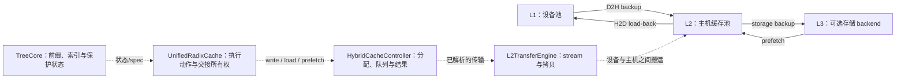
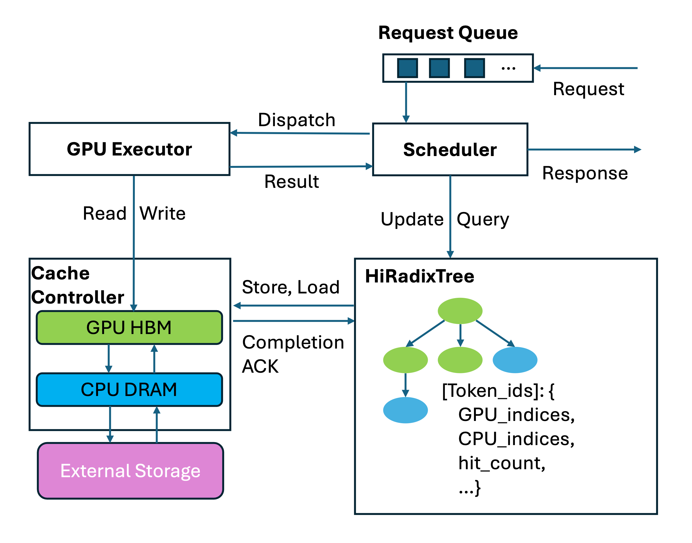
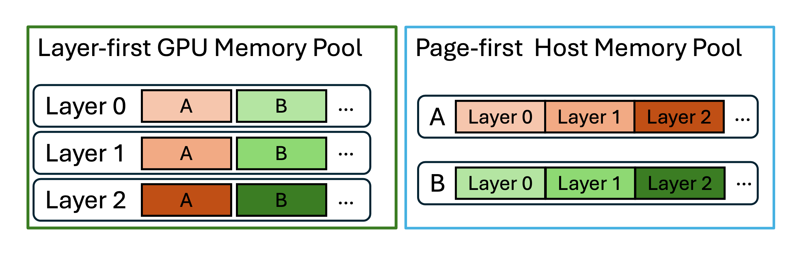
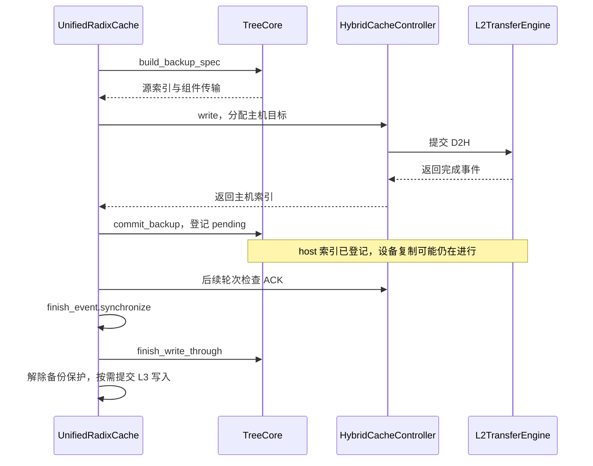
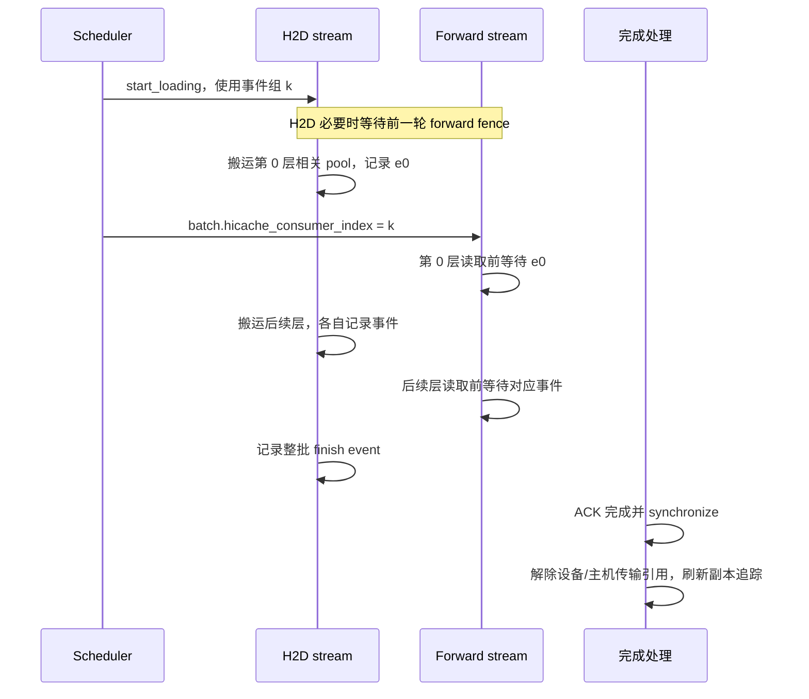
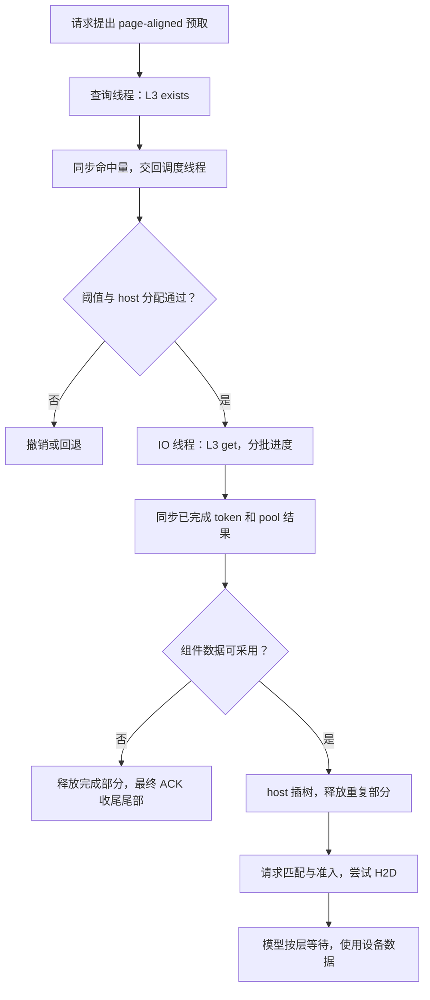
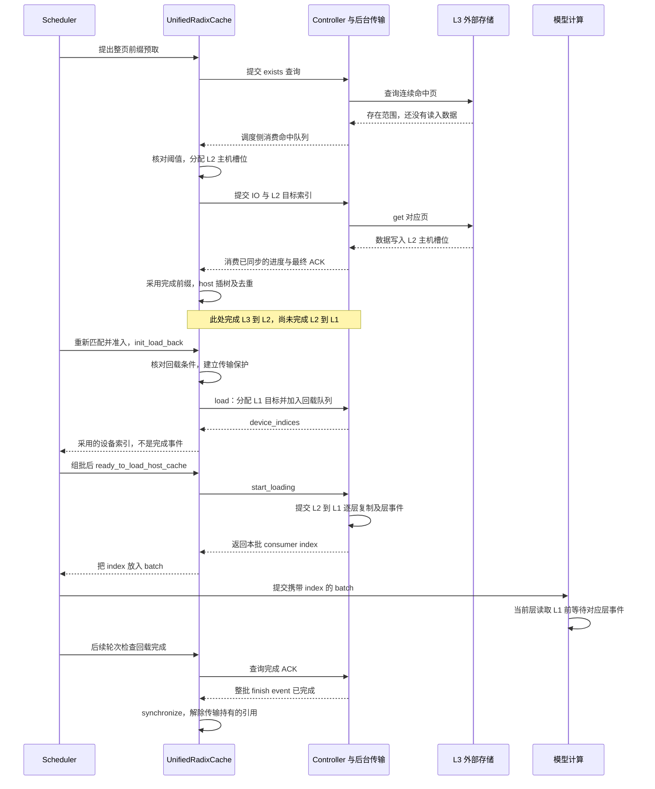

# HiCache 分层存储与回载

> **先建立架构心智模型：** [M05 · 缓存架构与资源所有权](<../architecture/05-缓存架构与资源所有权.md>)。先看职责、数据和生命周期，再回到本篇源码细节。

本文是**源码分析型学习资料**，承接 [04-04《UnifiedRadix 与混合状态组件》](04-UnifiedRadix与混合状态组件.md)。这次把视线从前缀树移到树后面的数据：一段 KV 离开设备以后放在哪里，下一条请求怎样把它取回来，谁负责等待与释放？

先记住一个区别：**命中说明找到了候选数据，回载为它准备设备位置，事件依赖决定何时能读取，完成处理决定何时解除传输保护。** 这四件事分布在不同函数中。

## 0. 阅读基线与范围

| 项目 | 内容 |
| --- | --- |
| 源码路径基准 | SGLang 仓库根目录 `.`；所有源码位置均为仓内相对路径 |
| 分支 | `codex/sglang-source-study-20260909`，基于官方 `main` |
| commit | `72d5c5bb73cadd7ffbf5114e5f81e29d36b6c61a` |
| 读取日期 | `2026-09-09` |
| 工作区状态 | 学习源码 worktree 干净；原源码工作区及 Wiki 既有资料保留 |
| 操作边界 | 只读源码和列明测试片段，编写与检查学习资料；没有安装、导入或执行 SGLang |
| 代表主线 | 单实例、非投机、Python UnifiedTreeCore、FULL 组件、HiCache 的 `cache` 模式；先 L1/L2，再加入可选 L3 |
| 独立变化 | 写策略、主机容量不足、混合组件、预取取消、`buffer_only` 与多 rank 同步的接口边界 |
| 不展开 | Rust TreeCore、所有模型/平台布局、PD 传输协议、各外部存储的数据面实现、在线 attach/detach 的完整故障状态机 |

本次没有运行缓存、文件存储、CUDA、RDMA 或模型实验。图和数字是**整理者归纳与教学推演**；函数条件是**固定基线源码事实**。没有性能、精度或生产并发安全的运行结论。

写作节奏参考既有[RadixAttention 与 HiCache 技术主线](<../../SGLang RadixAttention 与 HiCache KV Cache 技术主线学习文档.md>)；本篇机制以固定源码为准。当前默认缓存选择链最终落到 UnifiedRadixCache 的说明见 [04-02](02-RadixAttention与前缀匹配.md)，不能仅凭旧文章把 HiRadixCache 当作全部默认路径。

## 1. 先看数据住在哪里

**人话版：** 设备内存像手边的工作台，主机内存像旁边的资料架，外部存储像可以继续取用的仓库。把资料放进仓库，与把资料送到当前工作台，是方向相反的两次搬运。

| 术语 | 本篇含义 | 别混淆的概念 |
| --- | --- | --- |
| L1 / device | 当前模型执行使用的设备池 | 不是 CPU 的一级硬件缓存 |
| L2 / host | `cache` 模式下的主机缓存池 | 不是所有请求都必须经过的计算设备 |
| L3 / storage | 可选存储 backend 管理的数据 | 不一定是本机磁盘，也不保证某种持久化或网络协议 |
| backup / D2H | 从设备备份到主机 | 不代表已写入 L3 |
| storage backup | 从主机交给存储 backend 写入 | 不代表以后一定能成功读回 |
| prefetch | 本篇标准 HiCache 路径的 L3 → host 预取 | 不直接等于设备前缀可用 |
| load-back / H2D | 把 host 数据回载到设备 | 地址分配返回与复制完成分开 |
| host hit | 匹配结果中的主机可恢复部分 | 不是 DMA 完成事件 |
| ACK | 携带完成事件或进度结果的记录 | 要看 ACK 种类、字段和消费条件 |

**图意解读：** 实线是代表数据方向，虚线是职责关系。树节点保存池索引和状态；L2TransferEngine 接收已经解析好的池与索引，不拥有前缀淘汰策略。L3 线程同样不能绕过树的交接规则，把“读到了字节”直接当成请求可以使用。[组装][S1]、[传输引擎][S2]、[描述符][S3]

### 图解补充：索引控制与 KV 搬运分开看

[查看原尺寸](../../../images/sglang-source-study/12-hicache-control.png)。

**图意解读：** 先看上方 Scheduler 怎样询问前缀树，再看 Controller 连接 GPU、CPU 和存储的搬运路径。树记录“在哪里、能否复用”，池保存真正的数据。

**对应本篇源码：** 用原图认出数据层级，再按本篇 Mermaid 中的当前类名追到 controller 和传输引擎，分别核对控制权与拷贝完成。 [源码：python/sglang/srt/mem_cache/hybrid_cache/hybrid_cache_controller.py][S8]

**来源与边界：** [SGLang HiCache: Fast Hierarchical KV Caching with Your Favorite Storage Backends](https://www.lmsys.org/blog/2025-09-10-sglang-hicache/)，Zhiqiang Xie，2025-09-10。2025 年原图使用 HiRadixTree 等历史命名；当前 Unified、HybridCacheController 与 L2TransferEngine 的职责见正文。图中的 ACK 不能泛化成任意传输已安全退役的证明。 [来源档案 F12](../../../images/sglang-source-study/SOURCES.md#f12)。

## 2. 先确认配置选择，再解释机制

### 2.1 缓存类、主机模式、IO backend、存储 backend 分别选择

`python/sglang/srt/mem_cache/hybrid_cache/hybrid_pool_assembler.py::attach_hybrid_pool_to_unified_cache` 按实际 KV pool 和组件组选择 strategy，再安装 HostPoolGroup、HybridCacheController 等对象。[S1]

| 配置或对象 | 已读作用 | 本篇取值与边界 |
| --- | --- | --- |
| enable_hierarchical_cache | 是否启用分层缓存；字段声明默认 False | 本篇假定已启用 |
| hicache_host_memory_mode | host 是常驻缓存还是传输中转 | 主线为声明默认 `cache`；第 11 节单列 `buffer_only` |
| hicache_write_policy | 决定 D2H 备份触发方式 | 字段声明默认 `write_through`；不是控制器构造函数默认形参的同义词 |
| hicache_io_backend | 设备与主机之间的 IO 实现 | 字段声明默认 `kernel`；最终值还受平台/布局处理影响 |
| hicache_storage_backend | 是否连接 L3，以及选择哪个 backend | 字段声明默认 None；只用 L1/L2 并不要求 L3 |
| hicache_size / hicache_ratio | 主机池大小或相对规模 | size 优先级和最终派生应沿配置/池构造核对；容量规划放在 04-06 |
| PoolTransfer | 一次具体 pool 的源/目标索引、keys、覆盖节点 | 同一节点可能产生多个 pool 的传输 |

字段声明见 [memory 配置][S4]，初始化见 [Unified HiCache][S5]、[控制器][S6]。本表是源码选择说明，不是一套经过启动验证的部署参数。

### 2.2 两个不同方向的阈值

初始化把 load_back_threshold 设为 **10 个 Full KV token**。没有辅助组件传输时，H2D 的 Full 长度小于 `max(1, load_back_threshold)` 会退回；有组件传输时不能仅靠这个 Full 长度排除恢复。[S5][S7]

L3 的 prefetch_threshold 是另一项：extra config 解析器的默认值为 **256 个 token**，影响预取请求长度和查询命中量是否值得继续读取。[解析][S8]、[提交预取][S9]、[查询结果分配][S10] 不能把“L2 小段不回载”解释成“L3 没有命中”，也不能把教学中的小页长度直接当实际配置。

## 3. 对象和状态：谁拥有哪一段生命周期

| 对象或字段 | 保存什么 | 生命周期上的作用 |
| --- | --- | --- |
| 节点 component_data.value / host_value | 设备/主机的物理槽位索引 | 允许两层同时有记录；字段存在不单独证明复制完成 |
| write_through_pending_id | D2H 对应的 ACK 标识 | 完成后清除，并更新主机副本追踪；分裂时还要追踪覆盖片段 |
| load_back_pending_id | write-back 回载源节点的保护标识 | 防止回载尚未结束时回收相应 Full 主机副本 |
| ongoing_write_through | ACK 对应的锁节点、解除参数、待发布节点 | 连接 D2H 发起与完成处理 |
| ongoing_load_back | 设备保护和 host anchor 保护的解除参数 | H2D 全部完成后解除这次传输的引用 |
| CacheOperation | 一组 host/device 索引和 node IDs | 控制器可合并多个操作；不是模型的 ScheduleBatch |
| HiCacheAck | start/finish event、node IDs、传输计量 | 创建时可能尚未完成，要检查事件 |
| LayerDoneCounter | producer/consumer 代号及逐层事件 | 把某个执行批次与对应 H2D 批次关联 |
| PrefetchOperation / PrefetchAck | L3 查询、已完成 token 数、各 pool 结果、最终完成标志 | 逐次报告进度与收尾；不等同于 HiCacheAck |

源码锚点：[CacheOperation][S11]、[HiCacheAck][S12]、[PrefetchAck][S13]、[逐层计数器][S14]、[树上的备份提交][S15]、[回载提交][S16]。

这里的 lock_ref/host_lock_ref 是可回收性的保护引用；设备 event 是 stream 执行依赖。两者都需要，不能互相替代。

### 图解补充：同一份 KV 可以有不同排列顺序

[查看原尺寸](../../../images/sglang-source-study/13-hicache-layout.png)（手机查看宽图时可横屏或放大）。

**图意解读：** 用 A、B 两页追踪相同颜色：按层排列适合逐层计算，按页排列方便把一页的多层数据一起搬运。改变的是字节排列与访问方式，不是前缀身份。

**对应本篇源码：** 对照池组装及配置选择；相同逻辑页搬到另一个层级时，需要双方同意索引、排列与传输描述。 [源码：python/sglang/srt/mem_cache/hybrid_cache/hybrid_pool_assembler.py][S1]

**来源与边界：** [SGLang HiCache: Fast Hierarchical KV Caching with Your Favorite Storage Backends](https://www.lmsys.org/blog/2025-09-10-sglang-hicache/)，Zhiqiang Xie，2025-09-10。这是 HiCache 的代表布局对照；实际池类型、传输接口及特殊模型布局由当前配置决定，不是所有设备与主机池都采用图中的一种固定顺序。 [来源档案 F13](../../../images/sglang-source-study/SOURCES.md#f13)。

## 4. D2H：什么时候备份，什么时候才算完成

### 4.1 写策略不是三个不同的存储层

| 策略 | 本路径的触发依据 | 阅读时的限制 |
| --- | --- | --- |
| write_through | HiCache 初始化阈值为 1；插入相关 hit_count 检查满足条件时提出备份 | 仍受节点是否 evicted、chunked、已有备份等条件限制 |
| write_through_selective | 初始化阈值为 2 | hit_count 是源码中的触发计数，不宜直接口语化成“第二个用户请求” |
| write_back | hit_count 触发检查直接返回 False；淘汰路径可请求备份 | 有主机压力时存在丢弃可重算缓存的分支，不保证永不丢缓存 |

`python/sglang/srt/mem_cache/unified_cache/unified_tree_core.py::UnifiedTreeCore._inc_hit_count_and_check` 是判断入口。[S17] 初始化阈值见 [S5]。普通 write-through 会先组织尚未备份的祖先，再处理子节点，维护该模式的 host 路径关系。[祖先顺序][S18]

### 4.2 从 backup spec 到完成 ACK

沿 `UnifiedRadixCache._execute_and_commit_kv_backup` 读，可以看到以下顺序。[S19]

1. TreeCore 根据当前节点重建 spec，区分缺失的 Full 备份与辅助组件备份；已经存在的部分可能无需再传。
2. 缓存层检查主机容量，必要时 evict_host；HybridCacheController.write 分配 host 和辅助 pool 的目标槽位。
3. write 把 CacheOperation 入队并调用 start_writing；后者合并操作，交给 L2TransferEngine 提交 D2H，并加入带 finish_event 的 ACK。
4. 树提交 host 索引，缓存层登记 pending 和保护信息。**这个提交表示建立了传输目标与追踪关系。**
5. writing_check 在可消费的完成 ACK 上 synchronize，再调用完成处理：清 pending、更新副本追踪、解除相应设备保护；如果启用 L3，继续提交主机到存储的写任务。

对应入口：[构建 spec][S20]、[Hybrid write][S21]、[start_writing][S22]、[树提交][S15]、[pending][S23]、[writing_check][S24]、[完成交接][S25]。

**图意解读：** 返回事件不是等待事件。普通轮次先数队首连续完成的 ACK；专用 write_back=True 检查会等待待完成备份。树事件、锁与副本追踪都需要继续读到完成处理。[队首完成计数][S26]

如果等待期间节点被分裂，原 ACK 覆盖的数据也被拆成多个树片段。缓存层维护 publish_node_ids，完成后逐片段交接 L3，不能只看原节点剩下的后缀。[片段替换][S27] 这一点有专门测试片段，第 13 节列出。

### 4.3 write-back 淘汰中的主机压力

在 `_evict_components` 中，备份成功且 written>0 时先等待 writing_check(write_back=True)，再 demote；备份失败则尝试丢弃没有可用主机副本的子树。如果保护条件拒绝丢弃，节点继续留在设备。[S28]

因此，“打开 write_back 后内存够不够”要同时看设备候选、主机容量和保护引用。函数返回的 written 也不应直接当作整条祖先链的总搬运量；这条执行器按节点处理，可能在中途返回。

## 5. H2D：匹配之后还要经过回载准备

### 5.1 代表请求入口

调度准入部分先做预算与延迟协商；请求 needs_host_load_back 时，调用 init_load_back，之后把返回的新索引拼接到 req.prefix_indices，并重算剩余输入。[准入片段][S29]

`python/sglang/srt/mem_cache/unified_radix_cache.py::UnifiedRadixCache.init_load_back` 在 Full 已设备淘汰、host_hit_length>0，或辅助组件有 host hit 等条件下尝试 load_back。成功后收集新 Full device indices；失败时返回空新索引和原设备 anchor。[S30]

这意味着**回载落空有回退路径**：保持原来的设备前缀，后续按实际剩余输入安排计算。不能提前把所有 host hit 都计成已经跳过的 Prefill。

### 5.2 分配、保护与失败清理

`load_back` 先保护 host anchor 和设备路径，再让组件准备请求状态；`_load_back_transfers` 接着构建实际传输、检查长度/可选 quota、检查 Full 可用量并尝试淘汰，再调用控制器 load。[准备][S31]、[分配门槛][S7]

| 分支 | 已读处理 | 结果含义 |
| --- | --- | --- |
| 传输覆盖节点被其他回载 anchor 标记占用 | TreeCore 返回空 spec | 调用方退回，不争用该覆盖范围 |
| Full 太短且没有组件传输，或超过给定 quota+锁增量 | 解除本次临时保护，返回 False | 没有开始这一份 H2D |
| 淘汰后 Full 容量仍不足 | 解除临时保护，返回 False | 无新 Full 索引 |
| 辅助 pool 分配失败 | 控制器回收本次已分配的辅助槽位，并回收这次新 Full 分配 | 不把预先存在的槽位一并当新分配释放 |
| 请求临时分配了 Mamba slot，后续正常回载失败 | finalize_load_back 归还新 slot，并清请求字段 | 仅解释列明 False 分支的清理，不声称任意异常都完整回滚 |
| load 返回索引 | 提交树上的设备映射、登记 ongoing_load_back | H2D 入队成功，不是设备已读到有效内容 |

源码：[构建回载 spec][S32]、[Hybrid load][S33]、[辅助分配回滚][S34]、[Mamba prepare/finalize][S35][S36]、[树提交][S16]。

组件 prepare 在本函数的 try/finally 之前执行；辅助解析也只对列明的分配失败/缺少来源分支做回滚。因此，本次静态阅读不支持“所有异常都能安全清理全部资源”这样的泛化。

## 6. 设备地址已经返回，模型为什么不会抢先读取

### 6.1 从 load_queue 到对应批次

控制器 load 只把操作放进 load_queue。Scheduler 创建 Prefill 批次时调用 ready_to_load_host_cache，最终进入 start_loading，并把返回值写进 hicache_consumer_index。[S33]、[调度启动加载][S37]、[缓存入口][S38]

start_loading 的主要步骤是：[S39]

1. 没有待加载操作则返回 -1。
2. 选择下一组 producer 事件，要求该组上次 finish_event 已完成；合并本轮操作并清队列。
3. 记录启动事件；配置了 load_fence_stream 时，使 H2D stream 等待此前 forward stream 的工作。
4. 按层提交传输；每层相关 pool 的拷贝提交后，记录该层完成事件。
5. 加入整批 H2D 完成 ACK，返回 producer_id，供执行批次作为 consumer index 使用。

Scheduler 把 ModelRunner.forward_stream 接入 load_fence_stream。[S40] 这一层依赖用于处理 Overlap 下回收页可能仍受前一轮 forward 写入影响的情况；它与“新 forward 读取前等待 H2D”方向相反，两条依赖都要看。

### 6.2 逐层等待与整体收尾分开

TpModelWorker 在代表 forward_batch_generation 路径设置本批次 consumer。以 MHATokenToKVPool 为例，get_key_buffer/get_value_buffer 在返回 buffer 前调用 layer_transfer_counter.wait_until；最终是当前 stream 等待对应层的 event。[Worker][S41]、[K buffer][S42]、[V buffer][S43]、[层事件][S44]

**图意解读：** 图表示源码安排的依赖，不能用来声称实测获得了多少重叠收益。L2TransferEngine 按每个 pool 的 layer_mapper 解析层，不能把所有辅助状态都理解成与主 KV 完全相同的连续层数组。[S2]、[多 pool 解析][S45]

loading_check 在整批完成后解除 ongoing_load_back 中的设备与主机引用，再调用 finish_load_back。write-back 的源节点 pin 在这里清掉，host 副本可以进入后续回收追踪，**不意味着此处立即把所有 host 副本释放**。[完成处理][S46]、[树收尾][S47]

Mamba 还涉及请求私有 slot 与延迟 COW，完整交接见 [04-04](04-UnifiedRadix与混合状态组件.md)。这里的逐层 MHA 读取示例不能代替对所有 Attention backend 的覆盖证明。

## 7. L3 预取：存在、读取、接纳是三道门

### 7.1 为什么有一次“只查询存在”

prefetch_from_storage 先构建带请求 namespace 的 page-aligned key，检查长度、占用限额和重复 rid；`cache` 模式保护 host anchor，并为辅助组件准备主机资源。随后把 PrefetchOperation 放入查询队列。[S9]

HybridCacheController 的查询使用 token key、prior hash 和 page_size 构造 hash 序列，再调用 backend 的 batch_exists 或 batch_exists_v2。get_hash_str 将 prior hash 转成 digest 并交给 native hash helper；这里仅确认链式输入和调用关系，不重新证明 hash 实现或外部存储隔离。[查询][S48]、[hash 入口][S49]

查询线程把命中 token 数按所需进程组同步，再把结果送入 prefetch_hit_queue。**此时还没有因为查到存在就完成 L3 数据读取。**[S50]

### 7.2 查询结果交回调度线程，才决定实际分配

`_drain_storage_control_queues_impl` 消费命中结果：[S10]

| 情况 | `cache` 模式的已读行为 |
| --- | --- |
| 请求已经清理 | 处理查询反馈，不重新建立请求资源 |
| 命中量低于 prefetch_threshold | 撤销预取，并记录相应结果 |
| 命中足够且主机可分配 | 分配命中长度的 host 槽位 |
| 首次分配不足 | 尝试 evict_host 后再次分配 |
| 仍不足，但可用容量形成足够长的整页前缀 | 缩短到该长度；同步截短 hash 与目标范围 |
| 仍不能分配 | 撤销；不把查询命中写成已预取成功 |
| 分配成功 | 保存目标索引，交给 prefetch_buffer 的 IO 阶段 |

`cache` 模式的 prefetch_tokens_occupied 在提交时按**请求预取长度**记账，而实际 host 分配发生在查询命中后，长度可能更小。占用限流账本与物理 pool 可用量不能混成同一个指标。[S9][S10]、[限流][S51]

### 7.3 实际读取与混合组件结果

后台 IO 按存储 batch 读取 Full KV；KV-derived sidecar 参与同批读取，代码按返回的各池命中量取可用前缀。随后处理非 KV-derived 的辅助池。[Full 分批读取][S52]、[同批 sidecar][S53]、[辅助读取][S54]

这里的 storage batch 是一次 IO 单位，不是模型 forward batch。一次失败或终止后仍需产出预期数量的进度 ACK，以配合各 rank 的结果同步；不能仅凭某个本地线程“没有继续读”就认为整条控制链结束。[S52]

| 数据布局 | 已读接纳规则 | 不能做的推断 |
| --- | --- | --- |
| 只有 Full，或按 KV 页派生的 sidecar | 读取阶段依据共同连续完成前缀继续交接 | 查询命中页数不保证每页实际 get 成功 |
| 含 SWA/Mamba 等非 KV-derived pool | 主 KV 和相关尾部/窗口 pool 必须满足这份传输的完整要求，否则整份预取丢弃 | 不能从深处检查点任意切一个浅处状态 |
| 各 rank 结果不同 | 同步完成长度及各 pool 结果后再处理 | 一个 rank 成功不代表其他 rank 能采用同样前缀 |

接纳函数是 `_check_hybrid_prefetch_result`；KV-derived pool 已在前面的读取阶段并入 completed_tokens，非 KV-derived pool 在这里做完整性检查。[S55]、[同步][S56]

### 7.4 从 host 插树到真正用于请求

完成结果被采用时，`_handle_prefetch_result` 先 insert_host，执行插树动作，再提交组件传输。如果其他请求已经填入部分前缀，则释放重复的新主机索引；如果 host insert 被拒绝，释放这次结果。[S57]

成功插入主机树只完成 L3 → L2。请求后续还要重新走匹配与准入、完成 L2 → L1 回载准备；源码把存储命中统计保留到 admission 再结算，避免把 L3 查询或 L2 插树直接算成请求已获得收益。[统计交接][S58]

**图意解读：** 这是 `cache` 模式的职责图。分配、读取、插树和准入发生在不同交接点，前一项成功不自动保证后一项成功。第 11 节的 buffer_only 在 host 结果处采用另一条所有权路径。

### 7.5 从 L3 到当前模型层的完整回载时序

把前面的交接连起来，选择 **FULL-only、`cache` 模式，查询与读取成功，主机和设备分配均通过，没有取消** 的代表路径。图中的 C 合并了 controller、查询/IO 线程和 L2TransferEngine 的职责；它们不是同一个线程。S/U 是调度侧的调用与缓存管理，F 是模型计算的消费位置。

**图意解读：** 前半段的命中队列与 ACK 都由调度侧消费；后台反馈不会自行替请求完成准入。后半段在存在 forward fence 时先建立 H2D 流对先前 forward 的依赖，再提交复制；返回 consumer index 不表示所有层已经复制完。模型按层建立读取等待，整批完成后才在后续轮次解除回载的设备/主机引用；这不解除请求仍需持有的前缀锁，也不要求马上释放 L2 副本。[预取入口][S9]、[队列交接][S10]、[host 插树][S57]、[回载准备][S30]、[组批提交][S37]、[复制提交][S39]、[层事件][S44]、[完成收尾][S46]

这张图是对固定源码的顺序与依赖归纳，没有把箭头画成实测时间比例。失败、部分命中和取消仍按第 7.2—7.4 节及第 8 节的分支处理。

## 8. 预取停止：取消意图不能释放仍在读取的缓冲区

### 8.1 三种停止策略到底控制什么

| 策略 | `_can_terminate_prefetch` 的已读判断 | 含义 |
| --- | --- | --- |
| best_effort | 允许在进度检查时结束等待 | 不承诺每次都读满 |
| wait_complete | 不因该策略主动提前终止 | 后台最终完成仍会走结果交接 |
| timeout | 比较已用时间与线性预算，并协调 rank 决定 | 是预取等待策略，不是 HTTP 请求超时 |

本路径预算为 `base + hash 页数 × 每页时间`，每页时间由 `page_size / 1024 × per_ki_token` 派生。默认解析值 base=1 秒、per_ki_token=0.25 秒；以 4096 token 的当前查询范围为教学例，预算是 2 秒。不要把另一处同名配置结构的默认值或 max 字段套到本函数。[策略][S59]、[时间判断][S60]、[派生][S61]、[解析][S8]

### 8.2 两部分所有权各自收尾

`HiCacheController.terminate_prefetch` 只标记终止，返回当前已同步的 completed_tokens/hash 信息；它不等待全部后台 IO 停止。后续最终 PrefetchAck 的 completed_req=True 才表示后台这一操作走到了收尾消息。[S62]

请求取消路径 `release_aborted_request` 对当前已完成、已交接部分解除 anchor 保护并安排释放；尚在 IO 手里的尾部，以及尚未交接的辅助 pool，留给最终 ACK 路径收尾。[S63][S10]

| 时刻 | 谁仍可能使用 host 目标 | 安全解释 |
| --- | --- | --- |
| 尚未分配目标 | 查询操作可能仍在队列/线程里 | 撤销 pending，后续结果不能重建已取消请求 |
| 已分配、IO 尚未报告完成 | 后台读取任务 | 不能因为 rid 已移出 ongoing 就立刻复用全部目标 |
| 部分 completed_tokens 已由 ACK 同步 | 完成部分可按树接纳或取消路径交接 | 仅交接这个前缀，不把尾部也算进去 |
| completed_req 最终 ACK 被消费 | 后台操作收尾，调度端可安排剩余释放 | 入 release queue 与实际 pool.free 仍是两步 |

这种设计解释了为什么 abort 后容量可能不是立刻恢复。要同时追 completed_tokens、pool_transfers_done、最终 ACK 与 release queue；本次没有运行故障注入，不能从静态路径推导所有 backend 的终止时延。

## 9. 主机到 L3 的备份也有独立保护期

`write_backup_storage` 根据树上 host 值、hash 和组件传输构造任务，调用控制器 write_storage 后，用 operation ID 记录 host 锁。后台处理写入并把 operation 放入 ack_backup_queue；调度端消费时解除相应 host 保护。[S64]、[写队列][S65]、[后台线程][S75]、[页写][S66]、[完成消费][S10]

页写失败可以导致 completed_tokens 小于请求写入量，完成队列仍承载收尾。**L3 写 ACK 不应直接解读为所有对象都成功保存，也不证明数据经过某种外部系统的持久化保障。** 需要结合返回结果、实际 backend 契约及后续读取验证。[页写逻辑][S67]

Hybrid 控制器还按 pool 决定哪些 rank 写哪些状态，特别区分主 MLA KV 与分片的辅助状态。本篇只确认这个职责边界，不把主 KV 的复制布局外推到所有 sidecar。[S66]

## 10. 用 R1、R2、R3 做一次地址与数量账本

下面只做教学推演：页大小 P=4，FULL-only，主机模式 cache，假定相关预算足够；这不是默认可启动配置。R1 已留下 48 个 token 的相同前缀，其中前 16 个仍在设备，后 32 个仅在 host。R2 输入 50 个 token，其中前 48 个相同。

| 步骤 | R2 的已知状态 | 不能提前认定什么 |
| --- | --- | --- |
| 匹配 | 16 个 device 索引，另有 32 个可回载 host token | 不能把 prefix_indices 直接写成 48 个可无依赖读取的数据 |
| 回载门槛 | 32 ≥ 10，且假定其他检查通过 | 数量通过不等于分配必成功 |
| controller.load 返回 | 新分配 32 个 device 索引；请求可拼为 48 | load_queue 仍需要 start_loading |
| start_loading | 产生与本批次关联的事件组 | 还不能忽略逐层读取依赖 |
| 第 j 层 | 等待对应 H2D 层事件后使用缓存 | 该层可用不代表全部层 ACK 已消费 |
| 后续 Prefill | 按实际前缀计算剩余 2 个输入 token | 这 2 个输入量不是模型输出长度 |
| loading_check | 解除传输保护，host 副本进入后续回收管理 | host 没有立刻变为空，也不代表全部请求锁已解除 |

将 R2 的 host-only 部分改成 8 个 token，且没有辅助传输，默认 load_back_threshold=10 会让这次回载退回。假设总共有 24 个可匹配 token、输入仍为 26，则保留 16 个 device token 后，需要安排的未缓存输入为 10，而不是只剩 2。[S7][S30]

R3 单独演示 L3 取消：请求范围 1024 token，查询命中 768，实际分配也为 768，当前同步完成 512。若此时取消：

- cache 模式在提交时记下的预取占用是 1024；取消/收尾按对应生命周期扣除这笔账。
- 已同步完成的 512 与仍由 IO 持有的 256 分开交接；最终两段都不再被使用后，才可全部归还物理 host 池。
- 即使后台本地已经多读了一些，也不能超出已同步交接范围擅自提前释放。

三个数值等式是 `16+32=48`、`50−48=2`、`768−512=256`；它们帮助分清地址覆盖与所有权，不是性能测量。[S9][S10][S63]

## 11. 哪些路径必须另画一张图

| 变化 | 本次确认的差别 | 阅读边界 |
| --- | --- | --- |
| SWA / Mamba 混合状态 | 独立 host/device 资源、prepare/finalize、pool 完整性条件与 layer mapper | 复用第 04-04 篇的有效边界，不按 Full token 数机械等比解释 |
| buffer_only | host 作为操作中转；预取完成进入 staged hold，准入再消费；D2H 写经专用 pipeline | 不沿用 cache 模式的常驻 host 插树与占用口径 |
| buffer_only 参数 | 要求 storage backend；拒绝 write_back，拒绝 decode 实例 | 参数通过也不代表全部模型/池组合可运行 |
| buffer_only 组件 | Unified 初始化仅允许 FULL/SWA 组件集合，另做 stack validation | 本基线不能直接启用 Mamba buffer_only |
| external linker | init_load_back、ready_to_load_host_cache 和 check_hicache_events 有独立分支 | 不能套用标准 HybridCacheController 的全部队列细节 |
| 多 TP/PP/Attention rank | 完成数、查询量和 pool 结果需按对应进程组协调 | 本文给同步入口，不完成分布式正确性认证 |

依据：[buffer_only 参数限制][S68]、[初始化分派][S5]、[预取模式分支][S57]、[回载入口][S30]、[每轮事件处理][S69]、[结果计数同步][S70]。

`buffer_only` 的 Full/SWA 集合限制只是入口条件；本篇未完整展开 BufferModePipeline 的抢占、staged splice 和所有容量保证。因此它是对照路径，不应从本表生成一套未经验证的生产配置。

## 12. 小白排障地图与源码阅读路线

| 现象 | 先采集什么 | 回到哪里看 |
| --- | --- | --- |
| host 命中很多，Prefill 仍多 | device/host hit、实际新索引、阈值、预算、adder 返回 | [回载门槛][S7]、[请求拼接][S29] |
| 有 device 索引却读取异常 | producer/consumer index、池读取入口、层事件、forward fence | [start_loading][S39]、[Worker][S41]、[buffer getter][S42] |
| D2H 后 CPU store 事件迟迟不出现 | ACK 队首 finish_event、pending ID、节点分裂 | [完成计数][S26]、[片段发布][S25][S27] |
| write_back 仍掉缓存 | host available、备份返回、子树锁、丢弃指标 | [淘汰分支][S28] |
| L3 exists 有命中却没进入 IO | prefetch_threshold、取消状态、host 分配、模式 | [查询结果消费][S10] |
| L3 get 有部分结果但整个预取作废 | pool 类型、keys、每池结果、共同 completed_tokens | [组件完整性][S55] |
| 取消后 host 使用量未立即下降 | 已完成前缀、pool_transfers_done、最终 ACK、释放队列 | [取消][S63]、[收尾][S10] |
| host_loaded 或预取指标大于真正复用量 | 查询、读取、插树、准入采用分别计量 | [结果采用][S57]、[统计结算][S58] |
| 只开 HiCache 却查不到 L3 请求 | enable_storage、backend attach、模式 | [初始化][S5][S6] |
| 多 rank 回收卡住 | 相同队列消费顺序、ready count、pool 结果、rank/group | [同步入口][S70][S56]；完整并行诊断放到后续阶段 |

建议按 **init_hicache → 备份执行器 → controller.write/start_writing → writing_check → init_load_back → controller.load/start_loading → Worker/pool getter → loading_check → L3 查询/读取/结果消费** 的顺序复读。每到一个函数都问“它决定状态、分配地址、搬运字节，还是确认完成”。

## 13. 已读测试与本次验证边界

| 已读测试片段 | 测试代码试图约束什么 | 本次证据 |
| --- | --- | --- |
| TestUnifiedRadixCacheKVEvents.test_hicache_split_pending_write_through_publishes_fragments | D2H pending 期间分裂，完成时各片段发布和 L3 提交 | 只读，未执行 [S71] |
| UnifiedRadixCacheSuite.test_scheduler_hicache_load_back_rolls_back_mamba_on_load_failure | mock 控制器 load 返回 None 后，新请求 slot 归还 | 只读，未执行 [S72] |
| UnifiedRadixCacheSuite.test_release_aborted_request_l3_prefetch_io_in_progress | 阻塞 IO 时取消，不提前释放目标；后台收尾后释放 | 只读，未执行 [S73] |
| TestLoadBackDurationMetric | CUDA timing、无 timing 的计数回退及传统 HiRadixCache 的指标消费 | 文件只读；含 CUDA skip 条件，未执行，不能当 Unified 的完整测试 [S74] |

文档检查只验证本地链接、固定源码路径/符号/行号、标题与表格结构，以及上述教学算术。Mermaid 按源码流程做静态对照，未声称浏览器渲染验证。本次没有运行上述测试，也没有验证真实模型冷热输出、传输带宽、终止竞态、跨 rank 故障或外部存储耐久性。

## 14. 自测、参考答案与下一篇

### 14.1 自测

1. `host_value` 已存在、ACK 已入队，可以马上淘汰所有源设备槽位吗？
2. load 返回 32 个 device indices，为什么模型还需要 consumer index？
3. H2D 已逐层可读，与 loading_check 的工作有什么区别？
4. L3 查到 768 token，为什么物理 host 分配、已读长度、请求复用量可能不同？
5. 取消时删除 ongoing_prefetch，为什么不能马上 free 整段 host buffer？
6. FULL 的部分前缀可用，为什么 Mamba/SWA 的预取仍可能整体丢弃？
7. `cache` 改成 `buffer_only`，可以只改一行配置并沿用全部生命周期结论吗？

### 14.2 参考答案

1. 不能只凭字段或入队判断；要看 D2H 完成事件和对应保护条件。write-back 淘汰路径会等待成功备份后再 demote，失败另走受保护的回退。
2. 索引只是目标地址；consumer index 把本批次读取与正确的一组逐层加载事件关联。
3. 层事件负责“这一层读取前需要的依赖”；整批完成消费负责解除此次传输引用和更新副本追踪。
4. 查询存在后还要过阈值、容量与实际 get；插树可能遇到重复，准入又可能无法回载或采用全部范围。
5. terminate 只是意图，IO 仍可能写目标尾部；已完成前缀与后台持有部分必须分别交接，最终 ACK 再安排余下释放。
6. 非 KV-derived 的尾部/窗口状态有自己的边界；不能从一个深处检查点任意截出浅处状态，必须满足对应传输的完整性条件。
7. 不可以。它改变 host 所有权、staging 与准入消费关系，且有 storage、write policy、实例模式和组件限制。

下一篇为 [04-06《容量规划、碎片与显存回收》](06-容量规划碎片与显存回收.md)，继续把逻辑 token、物理页、组件状态与真实字节容量对应起来。

返回[系列目录](../README.md)、[源码入口索引](../appendices/02-源码入口与调用链索引.md)或[学习进度](../appendices/06-学习进度与版本变更记录.md)。

[S1]: https://github.com/sgl-project/sglang/blob/72d5c5bb73cadd7ffbf5114e5f81e29d36b6c61a/python/sglang/srt/mem_cache/hybrid_cache/hybrid_pool_assembler.py#L1812
[S2]: https://github.com/sgl-project/sglang/blob/72d5c5bb73cadd7ffbf5114e5f81e29d36b6c61a/python/sglang/srt/mem_cache/l2_transfer.py#L49
[S3]: https://github.com/sgl-project/sglang/blob/72d5c5bb73cadd7ffbf5114e5f81e29d36b6c61a/python/sglang/srt/mem_cache/hicache_storage.py#L98
[S4]: https://github.com/sgl-project/sglang/blob/72d5c5bb73cadd7ffbf5114e5f81e29d36b6c61a/python/sglang/srt/arg_groups/fields/memory.py#L96
[S5]: https://github.com/sgl-project/sglang/blob/72d5c5bb73cadd7ffbf5114e5f81e29d36b6c61a/python/sglang/srt/mem_cache/unified_radix_cache.py#L379
[S6]: https://github.com/sgl-project/sglang/blob/72d5c5bb73cadd7ffbf5114e5f81e29d36b6c61a/python/sglang/srt/managers/cache_controller.py#L284
[S7]: https://github.com/sgl-project/sglang/blob/72d5c5bb73cadd7ffbf5114e5f81e29d36b6c61a/python/sglang/srt/mem_cache/unified_radix_cache.py#L1509
[S8]: https://github.com/sgl-project/sglang/blob/72d5c5bb73cadd7ffbf5114e5f81e29d36b6c61a/python/sglang/srt/mem_cache/hybrid_cache/hybrid_cache_controller.py#L181
[S9]: https://github.com/sgl-project/sglang/blob/72d5c5bb73cadd7ffbf5114e5f81e29d36b6c61a/python/sglang/srt/mem_cache/unified_radix_cache.py#L1715
[S10]: https://github.com/sgl-project/sglang/blob/72d5c5bb73cadd7ffbf5114e5f81e29d36b6c61a/python/sglang/srt/mem_cache/unified_radix_cache.py#L2383
[S11]: https://github.com/sgl-project/sglang/blob/72d5c5bb73cadd7ffbf5114e5f81e29d36b6c61a/python/sglang/srt/managers/cache_controller.py#L100
[S12]: https://github.com/sgl-project/sglang/blob/72d5c5bb73cadd7ffbf5114e5f81e29d36b6c61a/python/sglang/srt/managers/cache_controller.py#L176
[S13]: https://github.com/sgl-project/sglang/blob/72d5c5bb73cadd7ffbf5114e5f81e29d36b6c61a/python/sglang/srt/managers/cache_controller.py#L190
[S14]: https://github.com/sgl-project/sglang/blob/72d5c5bb73cadd7ffbf5114e5f81e29d36b6c61a/python/sglang/srt/managers/cache_controller.py#L71
[S15]: https://github.com/sgl-project/sglang/blob/72d5c5bb73cadd7ffbf5114e5f81e29d36b6c61a/python/sglang/srt/mem_cache/unified_cache/unified_tree_core.py#L2134
[S16]: https://github.com/sgl-project/sglang/blob/72d5c5bb73cadd7ffbf5114e5f81e29d36b6c61a/python/sglang/srt/mem_cache/unified_cache/unified_tree_core.py#L2160
[S17]: https://github.com/sgl-project/sglang/blob/72d5c5bb73cadd7ffbf5114e5f81e29d36b6c61a/python/sglang/srt/mem_cache/unified_cache/unified_tree_core.py#L914
[S18]: https://github.com/sgl-project/sglang/blob/72d5c5bb73cadd7ffbf5114e5f81e29d36b6c61a/python/sglang/srt/mem_cache/unified_cache/unified_tree_core.py#L2094
[S19]: https://github.com/sgl-project/sglang/blob/72d5c5bb73cadd7ffbf5114e5f81e29d36b6c61a/python/sglang/srt/mem_cache/unified_radix_cache.py#L1346
[S20]: https://github.com/sgl-project/sglang/blob/72d5c5bb73cadd7ffbf5114e5f81e29d36b6c61a/python/sglang/srt/mem_cache/unified_cache/unified_tree_core.py#L1983
[S21]: https://github.com/sgl-project/sglang/blob/72d5c5bb73cadd7ffbf5114e5f81e29d36b6c61a/python/sglang/srt/mem_cache/hybrid_cache/hybrid_cache_controller.py#L309
[S22]: https://github.com/sgl-project/sglang/blob/72d5c5bb73cadd7ffbf5114e5f81e29d36b6c61a/python/sglang/srt/managers/cache_controller.py#L802
[S23]: https://github.com/sgl-project/sglang/blob/72d5c5bb73cadd7ffbf5114e5f81e29d36b6c61a/python/sglang/srt/mem_cache/unified_cache/unified_tree_core.py#L2219
[S24]: https://github.com/sgl-project/sglang/blob/72d5c5bb73cadd7ffbf5114e5f81e29d36b6c61a/python/sglang/srt/mem_cache/unified_radix_cache.py#L2798
[S25]: https://github.com/sgl-project/sglang/blob/72d5c5bb73cadd7ffbf5114e5f81e29d36b6c61a/python/sglang/srt/mem_cache/unified_radix_cache.py#L1455
[S26]: https://github.com/sgl-project/sglang/blob/72d5c5bb73cadd7ffbf5114e5f81e29d36b6c61a/python/sglang/srt/mem_cache/unified_radix_cache.py#L2733
[S27]: https://github.com/sgl-project/sglang/blob/72d5c5bb73cadd7ffbf5114e5f81e29d36b6c61a/python/sglang/srt/mem_cache/unified_radix_cache.py#L1429
[S28]: https://github.com/sgl-project/sglang/blob/72d5c5bb73cadd7ffbf5114e5f81e29d36b6c61a/python/sglang/srt/mem_cache/unified_radix_cache.py#L711
[S29]: https://github.com/sgl-project/sglang/blob/72d5c5bb73cadd7ffbf5114e5f81e29d36b6c61a/python/sglang/srt/managers/schedule_policy.py#L1376
[S30]: https://github.com/sgl-project/sglang/blob/72d5c5bb73cadd7ffbf5114e5f81e29d36b6c61a/python/sglang/srt/mem_cache/unified_radix_cache.py#L2910
[S31]: https://github.com/sgl-project/sglang/blob/72d5c5bb73cadd7ffbf5114e5f81e29d36b6c61a/python/sglang/srt/mem_cache/unified_radix_cache.py#L1472
[S32]: https://github.com/sgl-project/sglang/blob/72d5c5bb73cadd7ffbf5114e5f81e29d36b6c61a/python/sglang/srt/mem_cache/unified_cache/unified_tree_core.py#L2050
[S33]: https://github.com/sgl-project/sglang/blob/72d5c5bb73cadd7ffbf5114e5f81e29d36b6c61a/python/sglang/srt/mem_cache/hybrid_cache/hybrid_cache_controller.py#L500
[S34]: https://github.com/sgl-project/sglang/blob/72d5c5bb73cadd7ffbf5114e5f81e29d36b6c61a/python/sglang/srt/mem_cache/hybrid_cache/hybrid_cache_controller.py#L830
[S35]: https://github.com/sgl-project/sglang/blob/72d5c5bb73cadd7ffbf5114e5f81e29d36b6c61a/python/sglang/srt/mem_cache/unified_cache/components/mamba_component.py#L664
[S36]: https://github.com/sgl-project/sglang/blob/72d5c5bb73cadd7ffbf5114e5f81e29d36b6c61a/python/sglang/srt/mem_cache/unified_cache/components/mamba_component.py#L686
[S37]: https://github.com/sgl-project/sglang/blob/72d5c5bb73cadd7ffbf5114e5f81e29d36b6c61a/python/sglang/srt/managers/scheduler.py#L3966
[S38]: https://github.com/sgl-project/sglang/blob/72d5c5bb73cadd7ffbf5114e5f81e29d36b6c61a/python/sglang/srt/mem_cache/unified_radix_cache.py#L3016
[S39]: https://github.com/sgl-project/sglang/blob/72d5c5bb73cadd7ffbf5114e5f81e29d36b6c61a/python/sglang/srt/managers/cache_controller.py#L914
[S40]: https://github.com/sgl-project/sglang/blob/72d5c5bb73cadd7ffbf5114e5f81e29d36b6c61a/python/sglang/srt/managers/scheduler.py#L614
[S41]: https://github.com/sgl-project/sglang/blob/72d5c5bb73cadd7ffbf5114e5f81e29d36b6c61a/python/sglang/srt/managers/tp_worker.py#L593
[S42]: https://github.com/sgl-project/sglang/blob/72d5c5bb73cadd7ffbf5114e5f81e29d36b6c61a/python/sglang/srt/mem_cache/memory_pool.py#L2479
[S43]: https://github.com/sgl-project/sglang/blob/72d5c5bb73cadd7ffbf5114e5f81e29d36b6c61a/python/sglang/srt/mem_cache/memory_pool.py#L2503
[S44]: https://github.com/sgl-project/sglang/blob/72d5c5bb73cadd7ffbf5114e5f81e29d36b6c61a/python/sglang/srt/managers/cache_controller.py#L53
[S45]: https://github.com/sgl-project/sglang/blob/72d5c5bb73cadd7ffbf5114e5f81e29d36b6c61a/python/sglang/srt/mem_cache/hybrid_cache/hybrid_cache_controller.py#L385
[S46]: https://github.com/sgl-project/sglang/blob/72d5c5bb73cadd7ffbf5114e5f81e29d36b6c61a/python/sglang/srt/mem_cache/unified_radix_cache.py#L2855
[S47]: https://github.com/sgl-project/sglang/blob/72d5c5bb73cadd7ffbf5114e5f81e29d36b6c61a/python/sglang/srt/mem_cache/unified_cache/unified_tree_core.py#L2201
[S48]: https://github.com/sgl-project/sglang/blob/72d5c5bb73cadd7ffbf5114e5f81e29d36b6c61a/python/sglang/srt/mem_cache/hybrid_cache/hybrid_cache_controller.py#L578
[S49]: https://github.com/sgl-project/sglang/blob/72d5c5bb73cadd7ffbf5114e5f81e29d36b6c61a/python/sglang/srt/mem_cache/utils.py#L114
[S50]: https://github.com/sgl-project/sglang/blob/72d5c5bb73cadd7ffbf5114e5f81e29d36b6c61a/python/sglang/srt/managers/cache_controller.py#L1192
[S51]: https://github.com/sgl-project/sglang/blob/72d5c5bb73cadd7ffbf5114e5f81e29d36b6c61a/python/sglang/srt/managers/cache_controller.py#L1147
[S52]: https://github.com/sgl-project/sglang/blob/72d5c5bb73cadd7ffbf5114e5f81e29d36b6c61a/python/sglang/srt/managers/cache_controller.py#L1041
[S53]: https://github.com/sgl-project/sglang/blob/72d5c5bb73cadd7ffbf5114e5f81e29d36b6c61a/python/sglang/srt/managers/cache_controller.py#L1087
[S54]: https://github.com/sgl-project/sglang/blob/72d5c5bb73cadd7ffbf5114e5f81e29d36b6c61a/python/sglang/srt/mem_cache/hybrid_cache/hybrid_cache_controller.py#L640
[S55]: https://github.com/sgl-project/sglang/blob/72d5c5bb73cadd7ffbf5114e5f81e29d36b6c61a/python/sglang/srt/mem_cache/unified_radix_cache.py#L2039
[S56]: https://github.com/sgl-project/sglang/blob/72d5c5bb73cadd7ffbf5114e5f81e29d36b6c61a/python/sglang/srt/mem_cache/hybrid_cache/hybrid_cache_controller.py#L897
[S57]: https://github.com/sgl-project/sglang/blob/72d5c5bb73cadd7ffbf5114e5f81e29d36b6c61a/python/sglang/srt/mem_cache/unified_radix_cache.py#L1918
[S58]: https://github.com/sgl-project/sglang/blob/72d5c5bb73cadd7ffbf5114e5f81e29d36b6c61a/python/sglang/srt/mem_cache/unified_radix_cache.py#L2202
[S59]: https://github.com/sgl-project/sglang/blob/72d5c5bb73cadd7ffbf5114e5f81e29d36b6c61a/python/sglang/srt/mem_cache/unified_radix_cache.py#L1872
[S60]: https://github.com/sgl-project/sglang/blob/72d5c5bb73cadd7ffbf5114e5f81e29d36b6c61a/python/sglang/srt/mem_cache/unified_radix_cache.py#L1864
[S61]: https://github.com/sgl-project/sglang/blob/72d5c5bb73cadd7ffbf5114e5f81e29d36b6c61a/python/sglang/srt/mem_cache/unified_cache/storage_attachment.py#L210
[S62]: https://github.com/sgl-project/sglang/blob/72d5c5bb73cadd7ffbf5114e5f81e29d36b6c61a/python/sglang/srt/managers/cache_controller.py#L980
[S63]: https://github.com/sgl-project/sglang/blob/72d5c5bb73cadd7ffbf5114e5f81e29d36b6c61a/python/sglang/srt/mem_cache/unified_radix_cache.py#L2262
[S64]: https://github.com/sgl-project/sglang/blob/72d5c5bb73cadd7ffbf5114e5f81e29d36b6c61a/python/sglang/srt/mem_cache/unified_radix_cache.py#L1627
[S65]: https://github.com/sgl-project/sglang/blob/72d5c5bb73cadd7ffbf5114e5f81e29d36b6c61a/python/sglang/srt/mem_cache/hybrid_cache/hybrid_cache_controller.py#L560
[S66]: https://github.com/sgl-project/sglang/blob/72d5c5bb73cadd7ffbf5114e5f81e29d36b6c61a/python/sglang/srt/mem_cache/hybrid_cache/hybrid_cache_controller.py#L678
[S67]: https://github.com/sgl-project/sglang/blob/72d5c5bb73cadd7ffbf5114e5f81e29d36b6c61a/python/sglang/srt/managers/cache_controller.py#L1256
[S68]: https://github.com/sgl-project/sglang/blob/72d5c5bb73cadd7ffbf5114e5f81e29d36b6c61a/python/sglang/srt/arg_groups/hicache_hook.py#L180
[S69]: https://github.com/sgl-project/sglang/blob/72d5c5bb73cadd7ffbf5114e5f81e29d36b6c61a/python/sglang/srt/mem_cache/unified_radix_cache.py#L2957
[S70]: https://github.com/sgl-project/sglang/blob/72d5c5bb73cadd7ffbf5114e5f81e29d36b6c61a/python/sglang/srt/mem_cache/unified_radix_cache.py#L2741
[S71]: https://github.com/sgl-project/sglang/blob/72d5c5bb73cadd7ffbf5114e5f81e29d36b6c61a/test/registered/unit/mem_cache/test_unified_radix_cache_unittest.py#L1209
[S72]: https://github.com/sgl-project/sglang/blob/72d5c5bb73cadd7ffbf5114e5f81e29d36b6c61a/test/registered/unit/mem_cache/test_unified_radix_cache_unittest.py#L6247
[S73]: https://github.com/sgl-project/sglang/blob/72d5c5bb73cadd7ffbf5114e5f81e29d36b6c61a/test/registered/unit/mem_cache/test_unified_radix_cache_unittest.py#L3213
[S74]: https://github.com/sgl-project/sglang/blob/72d5c5bb73cadd7ffbf5114e5f81e29d36b6c61a/test/registered/unit/mem_cache/test_hicache_load_back_timing.py#L16
[S75]: https://github.com/sgl-project/sglang/blob/72d5c5bb73cadd7ffbf5114e5f81e29d36b6c61a/python/sglang/srt/mem_cache/hybrid_cache/hybrid_cache_controller.py#L739
