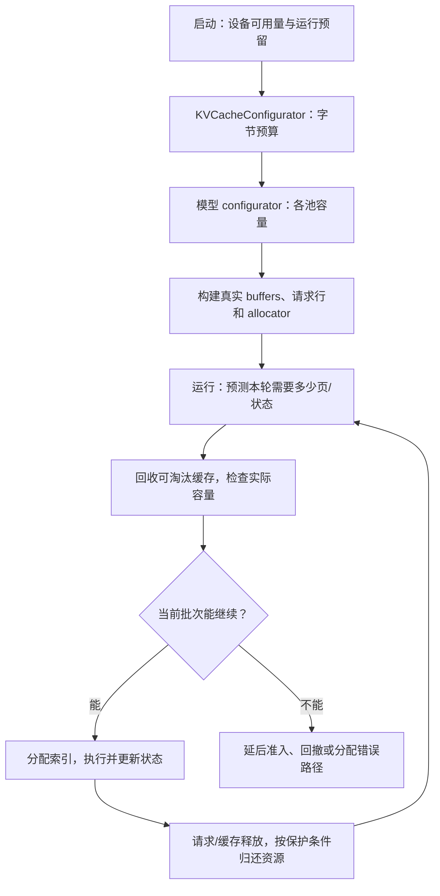
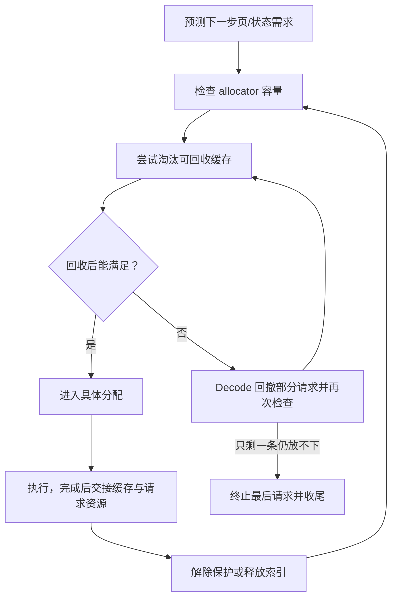
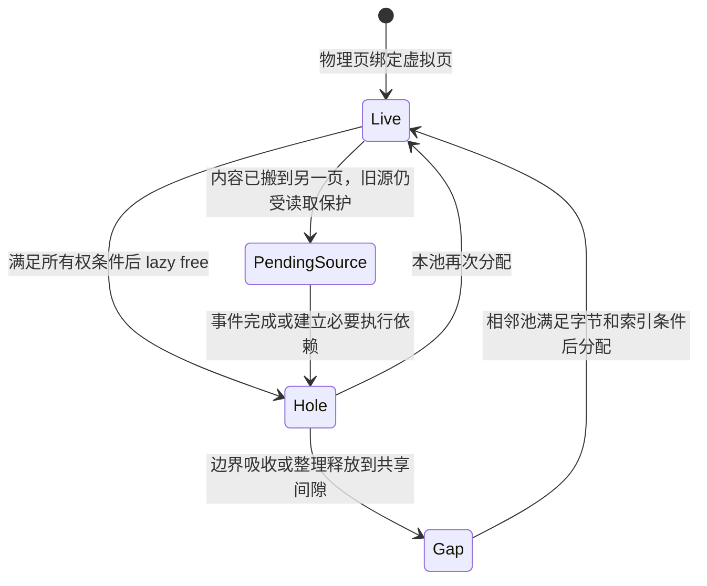

# 容量规划、碎片与显存回收

> **先建立架构心智模型：** [M05 · 缓存架构与资源所有权](<../architecture/05-缓存架构与资源所有权.md>)。先看职责、数据和生命周期，再回到本篇源码细节。

本文是**源码分析型学习资料**。先读 [04-01 请求视图与分配器](01-请求视图物理槽位与分配器.md)、[04-04 混合状态](04-UnifiedRadix与混合状态组件.md) 和 [04-05 HiCache](05-HiCache分层存储与回载.md)，再来看同一套状态如何记容量账。

核心问题是：启动时怎样决定能保存多少 KV，运行时一批请求实际需要几页，释放缓存后为什么有时还不能满足下一次分配？答案需要同时看**设备字节、池内槽位、请求需求、可回收状态和在途依赖**。

## 0. 阅读基线与范围

| 项目 | 内容 |
| --- | --- |
| 源码路径基准 | SGLang 仓库根目录 `.`；源码路径均为仓内相对路径 |
| 分支 | `codex/sglang-source-study-20260909`，基于官方 `main` |
| commit | `72d5c5bb73cadd7ffbf5114e5f81e29d36b6c61a` |
| 读取日期 | `2026-09-09` |
| 工作区状态 | 学习源码 worktree 干净；原源码工作区与 Wiki 既有资料保留 |
| 操作边界 | 只读预算、池构建、代表分配器、运行回收/统计及列明测试片段；只编写文档 |
| 基础主线 | 普通文本、未量化 MHA KV、单实例单 rank、非投机；先静态分页池 |
| 独立变化 | Full/SWA/Mamba 的容量单位；可选统一内存的两端分配与 lazy compaction；Overlap 的搬移保护 |
| 不展开 | 全部量化/稀疏模型公式、所有 graph/平台分支、三池 float 的完整搬移算法、PD 协议、投机算法正确性、真实 OOM 与性能实验 |

没有安装或导入 SGLang，没有执行 allocator、CUDA、模型或分布式测试。本文数字是**教学推演**，不是显存测量；固定源码支持的是列明分支和状态关系，不构成真实平台的容量或安全保证。

统一前缀树 **UnifiedRadixCache** 与可选字节池 **UnifiedKVPool** 是两个选择。本篇先沿普通池建立账本，第 7 节才打开 enable_unified_memory；不能因为前面用了 UnifiedRadixCache 就认定已经使用统一字节池。

## 1. 五本账，分别回答五个问题

**人话版：** 设备内存像整座仓库，KV 池像预先圈出的货区，allocator 的空闲页像货区里尚可用的货位，前缀缓存像暂时保留的货物。把货物移走通常只归还货位，整片货区仍归当前进程使用。

| 账本 | 单位 | 回答什么 | 典型入口 |
| --- | --- | --- | --- |
| 设备可用内存 | bytes / GiB | 创建池之前，设备现在还可分配多少？ | get_available_gpu_memory |
| 启动 KV 预算 | bytes | 扣除运行预留和特殊状态后，交给池多大预算？ | KVCacheConfigurator |
| 池内容量 | token/page/state slot | 这一类数据还可放多少？ | allocator.available_size 等 |
| 树与请求归属 | 索引、引用、有效长度 | 哪些数据仍需保留，哪些可淘汰？ | TreeCore、Req、组件锁 |
| 执行与搬移保护 | event、pending 页 | 逻辑上释放后，何时能安全搬移或覆盖？ | forward_done、pending reuse |

“剩余 1000”必须带单位和对象。1000 个 Full token、1000 个 SWA token、1000 个 Mamba slot，以及 1000 字节，不能直接相加。[预算入口][S1]、[普通容量接口][S2]、[统一子池][S3]



**图意解读：** 方框是职责阶段，不是新建进程。启动预算影响池大小，运行检查还受当前持有者与分配粒度影响。降低某次 batch 的需求与扩大池的启动预算是两种不同操作。

## 2. 启动：从剩余设备内存算出 KV 字节预算

### 2.1 先算已经占用的，再留运行空间

`python/sglang/srt/mem_cache/kv_cache_configurator.py::KVCacheConfigurator._profile_available_bytes` 先 gc.collect，再读取当前可用量。普通 CUDA 分支通过设备内存查询获得 free bytes；分布式查询还可取各 rank 最小值，最后除以 `1 << 30` 返回。[S1]、[设备查询][S4]

本篇用 GiB 表示 `2^30` 字节，即使部分源码日志写作 GB。普通路径可以整理为：

```text
运行预留 = pre_model_load_memory × (1 − mem_fraction_static)
剩余预算 = 当前可用内存 − 运行预留 − 多模态运行预留
存在 Mamba 时：再经过对应状态预算处理
KV 字节预算 = int(剩余预算 × 2^30)
```

这是该函数的**简化教学表达**。pre_model_load_memory 是传入的加载前内存基线，不应擅自替换成显卡标称总容量。当前 available 已反映当时仍驻留的权重等占用，也不应再把同一份权重重复减一次。

若 Mamba 与 post-capture sizing 组合启用，代码还对 slack 设活动内存下限；多模态有独立预留入口。因此上述简单式不能直接用于所有配置。[S1]

### 2.2 为什么不能把 static fraction 当成“KV 专用比例”

提高 mem_fraction_static 会降低这个公式中的运行 slack，可能使启动算出的 KV 池更大；它不凭空增加设备字节，也不证明后续 activation、采样、graph 等临时需求都有足够空间。

这个函数在 rest_memory≤0 时明确报错。报错发生在**给 KV 留不出预算**的阶段，与运行中“有预算、有池，但空闲页不够”不同。gc.collect 也不是回收活跃 KV 的算法：仍有引用的 buffers 不会因这一步就消失。[S1]

## 3. 从字节换成 token，再加约束

### 3.1 普通 MHA 的每 token 成本

DefaultPoolConfigurator 的代表未量化 MHA 分支使用：

```text
每 token 字节数 C
  = 本 rank 的 KV heads
  × (K head_dim + V head_dim)
  × 实际计入的层数
  × 每元素字节数

可配置 token 容量
  = floor(floor(预算字节 / C) / page_size) × page_size
```

源码：[成本计算][S5]、[按页取整][S6]。这里不能只数 query heads，也不能预设 K/V head_dim 总相等。多 rank、MLA、indexer、FP4/MXFP8 与 draft 有另外的成本项或布局，不能把 `2×heads×head_dim` 当作通用公式。

### 3.2 一次完整的教学换算

假定加载前基线 40 GiB、当前可用 20 GiB、static fraction=0.875；无多模态/Mamba 额外项。则 slack=5 GiB，交给普通 KV 计算的预算为 15 GiB。

再假定本 rank 有 4 个 KV heads，K/V head_dim 都为 128，32 层，元素 2 bytes：

| 项目 | 教学计算 | 结果 |
| --- | --- | --- |
| 每 token 成本 | 4×(128+128)×32×2 | 65,536 bytes，即 64 KiB |
| 15 GiB 对应 token | 15×2^30 / 65,536 | 245,760 |
| 页大小 P=128 | 245,760 / 128 | 1,920 页 |
| 用户 max_total_tokens=100,000 | floor(100,000/128)×128 | 99,968 token |

这些参数是人为教学值，没有对应模型或硬件实测。99,968 是约束后的 token 容量，不等于每个请求都可以独占这么长的上下文，也不等于整个进程只分配 `99,968×64 KiB`。

### 3.3 用户上限、PP 与请求行上限分别生效

config_from_budget 先按架构计算池容量，再应用用户 max_total_tokens 和可选 cap_tokens；PP 情况下还同步容量下限。上限大于 profiling 结果不会强行扩池；上限变小会重新按 token 推导各池并重新对齐。[预算派生][S7]、[外部约束][S8]

resolve_max_num_reqs 独立计算并发请求上限：用户设置按 attention DP worker 分配，默认走启发式估计，随后受 token 容量和 Mamba 状态容量等约束。[S9] 这不是“池容量除以单请求最大上下文”的服务保证，也不是同一时刻每条请求都预留完整上下文 KV。

`configure → _derive_pool_sizes → _init_pools` 最终建立真实对象并把 config 与 allocator 返回给运行端。[配置执行][S10] 请求行、K/V buffers 和 allocator 是分别初始化的；行数够不代表 KV 页数够。

### 3.4 预算公式与实际分配张量有边界

普通 MHA pool 有 dummy page、真实 layout、可选 scale/dequant buffers 等；请求映射表也占空间。源码的 get_kv_size_bytes 会汇总具体 buffers，不能拿理论 payload 成本替代实际对象大小。[MHA 建池][S11]、[buffer 分配][S12]、[字节汇总][S13]

若启用了 post-capture KV sizing，graph 捕获后还有一次读取实际 free memory、保留 activation/sampling 等空间、加回已 backing 的 KV 部分、重新计算并 finalize_backing/resize 的路径。它传入 cap_tokens，不能突破先前 token 上限；最终并发上限也可能缩小。[S14] 本篇只说明二次预算的存在和已读动作，完整 graph 内存行为放在后续执行/性能阶段。

## 4. 运行：新 token 数为什么不等于新页数

### 4.1 普通分页池可以利用已有尾页

PagedTokenToKVPoolAllocator 管理空闲页，公开地址仍是 token 粒度。alloc_extend 会衔接请求已有尾页，再取所需的新页；普通 decode 在跨页边界时才需要新增一页。[分页分配器][S15]

对本篇普通请求，P=4，已有 committed KV 长度分别为：

| 请求 | 当前长度 | 已占页容量 | 再算一个 token | 新页需求 |
| --- | ---: | ---: | --- | ---: |
| R1 | 7 | 8 | 使用尾页第 8 个位置 | 0 |
| R2 | 8 | 8 | 进入第 3 页 | 1 页，即 4 token 容量 |
| R3 | 3 | 4 | 使用第 4 个位置 | 0 |

三个新 token，只要求新增一页。下一轮长度变为 8、9、4 时，R1/R3 都越过边界，又会需要两页。这个账本假设没有共享尾页、投机、Beam 或其他额外预留。

ScheduleBatch.new_tokens_required_next_decode 的普通分支数 committed_len 对 page_size 取模为零的请求，再按页换成 token 需求。[S16] 这比“batch size 就是新增物理占用”更接近真实分配问题。

### 4.2 准备容量的上界与实际分配量不相同

allocation.py 的 paged extend helper 先用 `extend_num_tokens + 请求数×page_size` 作为淘汰准备的保守需求；paged decode helper 使用 `请求数×page_size`。实际 allocator 再结合当前长度与尾页决定消费哪些页。[Prefill 分配入口][S17]、[Decode 分配入口][S18]

因此，日志里用于准备容量的数、返回 out_cache_loc 的元素数、free_pages 实际减少的页数可能不同。检查失败时要沿调用顺序定位，不能只从一条“尝试分配 N tokens”日志反推全部页状态。

### 4.3 投机预留必须作为独立变化

allocation_sizing.py 区分 alloc page size、单次 decode 可能需要的长度、双缓冲 reserve 和请求映射行的额外空间。[S61][S62][S63] page_aligned_decode_alloc_lens 根据 allocated_len 与 committed_len+reserve 计算新的整页分配长度。[S19]

它被 EAGLE、UNO 等特定路径调用；普通非投机 alloc_for_decode 仍沿自己的单步分配路径，不能因为存在双倍预留 helper 就声称普通 Decode 永远实际写两个 token。[普通调用][S20]、[投机需求估计][S21]

教学例：P=4，allocated=12、committed=11、reserve=6，新分配长度为 20，增量 8。这里的 reserve 是假定值，不能把 8 个新槽位解释成已经接受 8 个输出 token。

## 5. 碎片与延迟释放的不同层次

| 现象 | 发生在哪 | 本篇怎样判断 |
| --- | --- | --- |
| 尾页内部空位 | 一个请求已占用的最后一页 | 有页容量但不一定可转给另一个请求；P 越大，单个尾页潜在空位越多 |
| 非连续空闲页 | 普通分页池的页号列表 | 页可以不连续；不能只因物理页号零散就判定该 allocator 无法分配 |
| 暂存的已释放页 | staged_pages 或 free group | 已经安排归还与实际合并到可分配集合需要看具体方法 |
| 统一池内部空洞 | 某个子池已占字节区间内部 | 本子池可复用，邻居未必立即能用；可能需要 compaction 后退边界 |
| 等事件的旧搬移源页 | pending reuse | 不是普通空闲页；仍受旧读取保护 |
| 底层张量分配器/驱动碎片 | 整个设备分配层 | 本次未做动态诊断，不能从 SGLang 页账本直接证明或排除 |

### 5.1 staged_pages 与 free group 不要混成“GPU 延迟回收”

普通 Paged allocator 的 available_size 包含 free_pages 和 num_staged_pages。need_sort 时，释放页进入 staged_pages；需要时 merge_and_sort_free 将它们合并并排序。它是页列表管理行为，不是读写完成 event。[S15]

free_group 则暂存一组 free 的输入，free_group_end 再统一调用释放。基础实现会 clone 这些输入，避免调用方之后修改 tensor view；一组内仍有不能重复释放同一页的契约。[基础 free group][S2]、[分页释放][S15]

### 5.2 allocator.free 通常不让设备监控中的占用立即下降

普通静态 pool 先创建 buffers，运行中的 free 主要归还页号。只要这些 buffers 仍然存活，设备层仍可显示它们占用的内存。这解释了“请求结束、池内空闲增加、设备占用不变”为什么可以同时出现。[S12][S15]

调用 empty cache 或 Python GC 与驱逐 SGLang 前缀不是同一件事。本篇没有给出运行清理命令；判断泄漏首先要把池内归属、实际张量和底层设备占用分别核对。

## 6. 缓存淘汰、回撤与真正归还是什么关系

`evict_from_tree_cache` 查看 allocator 容量，只请求回收短缺量；SWA allocator 分别计算 Full/SWA 短缺。树还需要根据组件锁、候选和驻留决定能否释放。[S22] 这些约束已在 [04-04](04-UnifiedRadix与混合状态组件.md) 展开。

BaseTokenToKVPoolAllocator.check_decode_capacity 先尝试淘汰可回收缓存，再检查容量；ScheduleBatch.check_decode_mem 把本轮需求交给 allocator，回撤循环反复使用同一检查。[S2][S23][S60]



**图意解读：** 图强调代表路径的职责，不保证回撤在任意配置下总能成功。回撤循环先保留最后一条，随后若检查仍失败，会终止这条请求并释放资源；不是强行让它继续执行。[S60] 启动最低容量、请求长度和实际需求仍需匹配，分配 helper 也有 RuntimeError 分支，不能把“有回撤机制”写成“永远不会 OOM”。

HiCache 会额外加入备份、回载与传输保护；主机有缓存不代表设备当前足够，write-back 下也有主机压力回退。它们见 [04-05](05-HiCache分层存储与回载.md)，不能把 host available 加到 device available 当作可立即执行的 KV 容量。

## 7. 混合模型：先分别计量，再谈共享预算

### 7.1 Full 与 SWA 是两笔 token 账

HybridSWAPoolConfigurator 独立计算 Full/SWA 的每 token 成本及层数。在普通混合比例路径中：Full tokens 等于 max_total，SWA tokens 从 Full tokens×ratio 推导，两边各自页对齐。纯 SWA 路径中 max_total 直接是 SWA 容量，不再乘这个比例。[S24]

例如 Full 每 token 成本 100 bytes、SWA 每 token 成本 40 bytes、ratio=0.5，忽略对齐/附加项时，一单位 Full 容量同时预算 `100+0.5×40=120 bytes`。ratio 是这个分支的 token 容量关系，不能直接读成“SWA 占一半字节”。

validate_swa_pool_size 会拒绝 SWA 容量不高于 `sliding_window_size + page_size` 的相关配置，避免连一条请求的准入底线都无法达到。[S25] 架构工厂还可能选 SWAChunkCapPoolConfigurator 或 DSV4PoolConfigurator；本篇不把比例公式套到它们全部分支。[S26]

### 7.2 Mamba 按状态槽位计量

`_handle_max_mamba_cache` 根据实际每状态成本、PP 层份额、显式上限或比例等决定状态容量，并扣除含 padding 的状态内存；投机中间状态和 ReplaySSM 又有独立项。[S27]

普通非投机、无 replay 的比例教学形式可写成：先划出状态预算，按单 slot 字节成本求 K，再考虑 `(K+1)` 个槽位的 padding 成本。并发上限还受 `_calculate_mamba_ratio` 的状态需求比例约束，它随缓存和 extra buffer/Overlap 配置变化。[S28][S9]

不能把 K 个状态 slot 叫 K 个 token，也不能认为每条请求永远只占一个状态。第 04-04 篇已经区分请求 active state、树检查点和临时交接。

### 7.3 可选统一池仍有启动保底与固定开销

UnifiedKVPool 分配一块 uint8 buffer，各 SubPoolSpec 定义每项字节成本和视图。源码要求至少两个子池、恰好一个向上和一个向下增长的 END，可有 float MIDDLE；另保留 dummy sink、view tail padding 与映射元数据。[S29]

config_from_budget 对 profiled unified_total_bytes 向下按 4096 bytes 对齐。token cap 触发重新推导时，不继续套原始 profile 字节量。Full+Mamba 工厂还把状态预算部分加回统一 buffer；Full+SWA 的字节来源又不同，所以 **unified_total_bytes 字段不在所有工厂里都等于最终 raw buffer 的总分配量**。[S7]、[Mamba 工厂][S30]、[SWA 工厂][S31]

工厂有 bs=1 feasibility floor：例如 Mamba 代表工厂检查 3 个状态 slot 与 sink，SWA 代表工厂检查窗口相关字节与 sink。它们是所列最低项的检查，不是完整模型、任意上下文和临时空间的充分保证。[S30][S31][S32]

## 8. 统一字节池：借出空间需要移动边界

### 8.1 一个 buffer，多种虚拟地址

普通静态池可以把 token 槽位直接用作相应物理行索引；统一池加入虚拟页到物理页 v2p 和反向 p2v。请求/树持有虚拟位置，搬移数据时更新映射，让逻辑身份与物理位置分开。[S3]


**图意解读：** 这是单 rank 两端池的教学寻址关系，未展开 DCP widened ID 与 kernel-facing stride。每个子池有自己的物理布局和映射；同一个虚拟号不保证 Full/SWA 物理页号相同。搬移后只改表而不复制内容当然不够；源码会先提交 move_kv_cache，再更新映射。[搬移与 rebind][S33]

### 8.2 三个不同的 available

MultiEndedAllocator 的子池可分配量同时受相邻 frontier 的空隙、每物理页字节数、索引空间和自身可复用 holes 约束。[S34]

| 视图 | 代表含义 | 不能混用的地方 |
| --- | --- | --- |
| 子池 available_size | 当前 gap 能增长的页与本池已有 holes | 不计尚未完成事件保护的 pending reuse |
| 子池 schedulable_available_size | 加入增长方向邻居可整理释放的 hole 字节后估算 | 不是尚未执行整理就已经拥有那些页 |
| Full/SWA composite available_size | 同时分配 Full 与 SWA 的联合容量 | 不能把两边独立看到的同一 gap 重复花两次 |
| conserve 视图 | 相对于指定静态容量标签的守恒账本 | 用于对应统计，不能直接当即时字节需求证明 |

邻居可借额度只计可处理的 holes；pending reuse 不算，disagg move gate 拒绝搬移时也不给这笔额度。真正不足时，alloc 会通过 `_relieve_for_alloc` 尝试整理相关邻居，再重新检查。[S35][S36]

Full+Mamba composite 的 available_size 对外使用子池的 schedulable 视图；所以看到同名方法必须先确定对象类型。[S37] Full+SWA composite 则区分“双方都用 holes、只有一方增长、双方都增长”三段计算联合容量，并受两边索引空间限制。[S38]

### 8.3 一个共享字节的教学例子

把 sink、元数据与 padding 已扣除，假定教学可用区 U=1024 bytes：Full 每页 128 bytes，Mamba 每 slot 256 bytes；忽略索引上限，且没有在途 event 或搬移 gate。

| 时刻 | Full | Mamba | 共享 gap | 结果 |
| --- | --- | --- | ---: | --- |
| 初始 | 占 6 页，共 768 bytes | 1 slot，256 bytes | 0 | 满 |
| 释放一页 Full | 5 页 live、1 页内部 hole | 仍为 1 slot | 0 | Full 可复用该 hole；不够再加一个 Mamba slot |
| 再释放一页 Full | 4 页 live、2 页 holes | 仍为 1 slot | 0 | 两洞共 256 bytes，但还在 Full frontier 内 |
| 整理 Full | 把存活页搬进内部洞，边界缩成 512 bytes | 仍为 1 slot | 256 | 现在可以让 Mamba 增长 |
| Mamba 新分配一槽 | 512 bytes | 512 bytes | 0 | 容量重新分配，raw buffer 未扩大 |

这个例子解释了两件事：整理不是释放更多活数据，而是把已有洞变成边界外空间；一块 gap 只能按本次各池的共同需求消费，不能给每个池各算一遍。

## 9. Compaction：搬得动，还要复用得安全

### 9.1 Eager 与 lazy 的工作位置不同

Eager free 在关联 forward stream 之后安排映射更新与存活页搬移，收缩 watermark。Lazy free 先解除映射，把释放的物理页放进本池 holes，live_page_count 相应下降；边界吸收与搬移推迟到 flush。[S39][S40]

这依赖调用方已经满足 free 的所有权契约，不能把 allocator 里的一条注释当成“任意在用地址都能调用 free”。上游请求、缓存锁和传输保护仍决定哪些虚拟页允许被释放。

当前统一池工厂的 lazy 默认由 `_should_enable_lazy_compaction` 决定，除非相关环境开关禁用。这里仅说明源码默认；eager、lazy 及分布式组合的支持范围需要分别核对。[S41]

### 9.2 Lazy flush 区分读风险与写风险

`_flush` 先处理可结束的 pending reuse，排序 holes，并吸收贴近边界的洞；需要搬移存活页时检查 forward 状态。[S42]

| 情况 | 非 urgent 代表路径 | urgent 代表路径 |
| --- | --- | --- |
| frontier 上已经是空洞 | 吸收洞并后退边界 | 同样处理 |
| 待搬源还在当前 forward 写集合 | 停止当前向内遍历 | 通过 forward_done 依赖等待后再搬 |
| 没有源写冲突，但旧 forward 可能仍读源 | 搬移并 rebind，旧源进入 pending reuse | 整理前按相应事件建立依赖，之后安排复用 |
| disagg move gate 拒绝 | 保留 holes，返回 | 也不能绕过 gate 强搬 |
| 只有一部分工作适合当前轮次 | 可能受移动次数上限和阻塞条件限制 | 目标是紧迫空间回收，仍需守住依赖和布局约束 |

`_commit_move_batch` 负责数据复制和 v2p/p2v 更新；如果旧读取事件未完成，把源页按事件放进 `_pending_reuse`。后续 drain 看到事件完成，或在 urgent 路径加入 stream wait_event，才把这些页转回可用 holes。[S43][S44]

**stream wait 不等于 CPU 已同步等完。** 它在同一执行顺序中保护后续使用；读代码时要区分主机上表格已经更新和设备命令何时真正执行。



**图意解读：** 图追踪一个物理位置的状态。进入 PendingSource 时，存活内容已在另一物理页建立新映射，此处的旧源仍需保留；不是请求内容被删除了。图是两端 lazy 机制归纳，省略 eager、float 中间池与无 pending 的直接释放分支。

### 9.3 事件从哪里来，整理何时被调用

Scheduler 的代表 Overlap forward 路径记录 forward_done，并把虚拟 out_cache_loc 交给 allocator，用于后续写集合判断。普通 idle/部分 Overlap 同步边界还会尝试 opportunistic flush。[事件发布][S45]、[机会整理][S46][S47]

这些调用包含条件和 best-effort 处理，不能从“有 hook”推导每轮都整理完成。opportunistic flush 返回移动数，也不直接等于归还给邻居的字节数。

## 10. 兼容约束：先看实际 guard，别只看开关帮助

| 条件 | 固定基线已读规则 | 本篇状态 |
| --- | --- | --- |
| enable_unified_memory | 字段声明默认 False | 可选路径，普通 Dense 主线不自动启用 |
| 统一池模型选择 | 工厂分别处理 Mamba、Full+SWA、Mamba+SWA 等；非支持模型显式失败 | 本篇只展开两端代表结构 |
| 统一池与 HiCache/LMCache | 配置 guard 明确拒绝组合 | 不能把第 04-05 篇直接叠加到本篇统一字节池 |
| 统一池与 two-batch-overlap | guard 拒绝 | 与普通 Overlap 不是同一开关 |
| 统一池与投机 | guard 仅接受 None 或 DSPARK，并对 DSPARK 的 top-k/backend 另加限制 | 本篇不执行投机兼容性验证 |
| 统一池与 PD | 参数层及模型工厂有 backend、PP、lazy、模型池类型等限制 | 存在限定路径，不能依据旧帮助字符串一概宣布全部允许或全部拒绝 |
| prefill graph 与统一池 | 有显式拒绝/关闭分支 | 不等同于所有 decode graph 都不可用 |
| DCP | 另有统一池 MLA/backend 等 guard | 本篇单 rank 公式不计 widened loc 空间 |

依据：[开关声明][S48]、[实际配置处理][S49]、[模型工厂][S50]。帮助文案与细化 guard 的粒度可能不同，做结论应保留实际判断条件。通过一处 guard 也不证明后面的池、模型和平台全部通过。

## 11. 看懂监控里的“已使用”和“可回收”

SchedulerPoolStatsObserver 的普通路径计算：

```text
full_num_used = max_total_num_tokens − (allocator available + tree evictable)
```

因此这里的 used 排除了可淘汰前缀，它不等同于物理设备已驻留的全部 KV。Mamba、SWA、int8 checkpoint 和 request ring 等还有不同统计分支，必须按真实对象读分母与可回收项。[普通统计][S51]、[混合统计][S52]

统一 allocator 的守恒检查关注 frontier、live、holes、pending 以及容量缓存是否一致。代表 lazy END 的关系是：

```text
watermark 覆盖的页数 = live_page_count + holes 页数 + pending reuse 页数
```

pending 的一条字典记录可以覆盖多页，不能用事件条数代替页数。不同子池的页字节大小也可能不同；先检查各自关系，再检查共享区间是否重叠。[S53]

| 现象 | 建议先记录的事实 | 对应源码 |
| --- | --- | --- |
| 启动留不出 KV | pre/current free、static fraction、额外状态与预留 | [预算][S1] |
| max_total 比估计小 | 实际 KV heads、层数、dtype、辅助成本、page、用户 cap、PP | [成本][S5]、[约束][S8] |
| 请求行还有，KV 却不够 | 行数、当前/下一轮页数、每组件容量 | [请求上限][S9]、[需求][S16] |
| free 后显存监控不降 | pool buffers 是否仍存活、空闲页是否增加 | [物理 buffers][S12]、[分页 free][S15] |
| evictable 很多却未准入 | 当前锁、组件类型、传输保护、实际短缺 | [淘汰][S22]；结合 04-04/04-05 |
| 统一池有洞但另一池增长失败 | hole 所属池、gap、entry_bytes、索引上限、move gate | [容量][S34][S35] |
| compaction 后旧源仍不能复用 | latest event、写集合、pending 页与 drain | [flush][S42]、[pending][S44] |
| used/available 看似不守恒 | 指标对象、conserve/schedulable 视图、state/token/page 单位 | [统计][S51][S52]、[守恒][S53] |

本文给的是定位顺序，不把任何一个单独指标认定为泄漏证明。下一篇再汇总整个 KV 生命周期的排障链。

## 12. 本次读了哪些测试

| 已读测试片段 | 代码试图约束什么 | 本次证据 |
| --- | --- | --- |
| TestDefaultConfigurator.test_memory_utilization / test_page_alignment / test_constraint_page_aligned | 教学 fixture 下预算、页对齐和 token cap | 只读，未执行 [S54] |
| TestSWAPoolFloor 的两条 hybrid 测试 | 低于请求底线时拒绝，高于底线时按页派生容量 | 只读，未执行 [S55] |
| TestLazyCompaction.test_lazy_take_physical_drains_holes_first | 重用本池 holes 不推进边界 | 只读，未执行 [S56] |
| TestLazyCompaction.test_lazy_flush_compacts_holes_into_gap | 整理后边界收缩，live 数不因搬移改变 | 只读，未执行 [S57] |
| TestLazyCompaction 的写集合阻塞与 read-race pending 测试 | 非 urgent 路径停止搬写入源，或保留仍被读的旧源 | 使用 fake event 的测试片段只读，未执行 [S58][S59] |

这些入口不构成本次 GPU/驱动、真实模型、fragmentation 压测、并行搬移或容量收益的运行证据。只做了文档结构、源码锚点、链接、静态图和教学算术检查；没有运行 Mermaid 渲染器。

## 13. 自测、参考答案与下一篇

### 13.1 自测

1. static fraction=0.9 能否直接理解为“90% 总显存都给 KV”？
2. R1/R2/R3 长度为 7/8/3，P=4，普通 Decode 各加一个 token，需要几页？
3. Paged allocator.free 后设备占用不降，能否单独证明泄漏？
4. Full 池里有 256 bytes 的 holes，Mamba 是否马上就有一个 256-byte slot？
5. v2p 已指向新位置，为什么旧源仍可能在 pending reuse 中？
6. 为什么 SWA tokens、Mamba slots 和 Full tokens 不能直接求和？
7. 普通监控 used 低，是否说明真实 K/V buffers 没有占显存？

### 13.2 参考答案

1. 不能。该比例参与运行 slack，已驻留权重与其他预留先影响当前 free；还要沿实际配置和二次预算核对。
2. 新增一页，只给 R2。下一轮长度 8/9/4 时则是 R1/R3 跨边界，需要两页。
3. 不能。静态 buffers 可以一直存活，free 归还的是池内页号；需要分别检查池账本与设备分配。
4. 不一定。洞可能仍在 Full frontier 内，需要整理到共享 gap，且索引与事件/gate 条件都允许。
5. 旧 forward 可能仍持有旧源的读取依赖。更新未来寻址不等于旧设备读取已经结束。
6. 三者的有效范围、每项字节成本和生命周期不同；先换算相同口径，并避免重复计算共享 gap。
7. 不能。该统计可以扣除 evictable 前缀，但其数据仍驻留在池内，张量也仍占设备内存。

下一篇为 [04-07《KV 缓存全生命周期与排障》](07-KV缓存全生命周期与排障.md)，把地址、命中、保护、传输和回收连成完整诊断路线。

返回[系列目录](../README.md)、[配置矩阵](../appendices/03-配置解析与功能兼容矩阵.md)或[学习进度](../appendices/06-学习进度与版本变更记录.md)。

[S1]: https://github.com/sgl-project/sglang/blob/72d5c5bb73cadd7ffbf5114e5f81e29d36b6c61a/python/sglang/srt/mem_cache/kv_cache_configurator.py#L2130
[S2]: https://github.com/sgl-project/sglang/blob/72d5c5bb73cadd7ffbf5114e5f81e29d36b6c61a/python/sglang/srt/mem_cache/allocator/base.py#L27
[S3]: https://github.com/sgl-project/sglang/blob/72d5c5bb73cadd7ffbf5114e5f81e29d36b6c61a/python/sglang/srt/mem_cache/allocator/unified_sub_pool.py#L209
[S4]: https://github.com/sgl-project/sglang/blob/72d5c5bb73cadd7ffbf5114e5f81e29d36b6c61a/python/sglang/srt/utils/common.py#L421
[S5]: https://github.com/sgl-project/sglang/blob/72d5c5bb73cadd7ffbf5114e5f81e29d36b6c61a/python/sglang/srt/model_executor/pool_configurator.py#L293
[S6]: https://github.com/sgl-project/sglang/blob/72d5c5bb73cadd7ffbf5114e5f81e29d36b6c61a/python/sglang/srt/model_executor/pool_configurator.py#L529
[S7]: https://github.com/sgl-project/sglang/blob/72d5c5bb73cadd7ffbf5114e5f81e29d36b6c61a/python/sglang/srt/mem_cache/kv_cache_configurator.py#L2318
[S8]: https://github.com/sgl-project/sglang/blob/72d5c5bb73cadd7ffbf5114e5f81e29d36b6c61a/python/sglang/srt/mem_cache/kv_cache_configurator.py#L2216
[S9]: https://github.com/sgl-project/sglang/blob/72d5c5bb73cadd7ffbf5114e5f81e29d36b6c61a/python/sglang/srt/mem_cache/kv_cache_configurator.py#L2245
[S10]: https://github.com/sgl-project/sglang/blob/72d5c5bb73cadd7ffbf5114e5f81e29d36b6c61a/python/sglang/srt/mem_cache/kv_cache_configurator.py#L311
[S11]: https://github.com/sgl-project/sglang/blob/72d5c5bb73cadd7ffbf5114e5f81e29d36b6c61a/python/sglang/srt/mem_cache/kv_cache_configurator.py#L1929
[S12]: https://github.com/sgl-project/sglang/blob/72d5c5bb73cadd7ffbf5114e5f81e29d36b6c61a/python/sglang/srt/mem_cache/memory_pool.py#L2247
[S13]: https://github.com/sgl-project/sglang/blob/72d5c5bb73cadd7ffbf5114e5f81e29d36b6c61a/python/sglang/srt/mem_cache/memory_pool.py#L2383
[S14]: https://github.com/sgl-project/sglang/blob/72d5c5bb73cadd7ffbf5114e5f81e29d36b6c61a/python/sglang/srt/model_executor/model_runner_components/kv_pool_runtime.py#L49
[S15]: https://github.com/sgl-project/sglang/blob/72d5c5bb73cadd7ffbf5114e5f81e29d36b6c61a/python/sglang/srt/mem_cache/allocator/paged.py#L116
[S16]: https://github.com/sgl-project/sglang/blob/72d5c5bb73cadd7ffbf5114e5f81e29d36b6c61a/python/sglang/srt/managers/schedule_batch.py#L3049
[S17]: https://github.com/sgl-project/sglang/blob/72d5c5bb73cadd7ffbf5114e5f81e29d36b6c61a/python/sglang/srt/mem_cache/allocation.py#L173
[S18]: https://github.com/sgl-project/sglang/blob/72d5c5bb73cadd7ffbf5114e5f81e29d36b6c61a/python/sglang/srt/mem_cache/allocation.py#L472
[S19]: https://github.com/sgl-project/sglang/blob/72d5c5bb73cadd7ffbf5114e5f81e29d36b6c61a/python/sglang/srt/mem_cache/allocation_sizing.py#L62
[S20]: https://github.com/sgl-project/sglang/blob/72d5c5bb73cadd7ffbf5114e5f81e29d36b6c61a/python/sglang/srt/mem_cache/allocation.py#L521
[S21]: https://github.com/sgl-project/sglang/blob/72d5c5bb73cadd7ffbf5114e5f81e29d36b6c61a/python/sglang/srt/managers/schedule_batch.py#L3067
[S22]: https://github.com/sgl-project/sglang/blob/72d5c5bb73cadd7ffbf5114e5f81e29d36b6c61a/python/sglang/srt/mem_cache/common.py#L152
[S23]: https://github.com/sgl-project/sglang/blob/72d5c5bb73cadd7ffbf5114e5f81e29d36b6c61a/python/sglang/srt/managers/schedule_batch.py#L3078
[S24]: https://github.com/sgl-project/sglang/blob/72d5c5bb73cadd7ffbf5114e5f81e29d36b6c61a/python/sglang/srt/model_executor/pool_configurator.py#L548
[S25]: https://github.com/sgl-project/sglang/blob/72d5c5bb73cadd7ffbf5114e5f81e29d36b6c61a/python/sglang/srt/model_executor/pool_configurator.py#L174
[S26]: https://github.com/sgl-project/sglang/blob/72d5c5bb73cadd7ffbf5114e5f81e29d36b6c61a/python/sglang/srt/model_executor/pool_configurator.py#L1297
[S27]: https://github.com/sgl-project/sglang/blob/72d5c5bb73cadd7ffbf5114e5f81e29d36b6c61a/python/sglang/srt/mem_cache/kv_cache_configurator.py#L2356
[S28]: https://github.com/sgl-project/sglang/blob/72d5c5bb73cadd7ffbf5114e5f81e29d36b6c61a/python/sglang/srt/mem_cache/kv_cache_configurator.py#L2185
[S29]: https://github.com/sgl-project/sglang/blob/72d5c5bb73cadd7ffbf5114e5f81e29d36b6c61a/python/sglang/srt/mem_cache/unified_memory_pool.py#L293
[S30]: https://github.com/sgl-project/sglang/blob/72d5c5bb73cadd7ffbf5114e5f81e29d36b6c61a/python/sglang/srt/mem_cache/unified_memory_pool.py#L1196
[S31]: https://github.com/sgl-project/sglang/blob/72d5c5bb73cadd7ffbf5114e5f81e29d36b6c61a/python/sglang/srt/mem_cache/unified_memory_pool.py#L1692
[S32]: https://github.com/sgl-project/sglang/blob/72d5c5bb73cadd7ffbf5114e5f81e29d36b6c61a/python/sglang/srt/mem_cache/unified_memory_pool.py#L1171
[S33]: https://github.com/sgl-project/sglang/blob/72d5c5bb73cadd7ffbf5114e5f81e29d36b6c61a/python/sglang/srt/mem_cache/allocator/unified_sub_pool.py#L1430
[S34]: https://github.com/sgl-project/sglang/blob/72d5c5bb73cadd7ffbf5114e5f81e29d36b6c61a/python/sglang/srt/mem_cache/allocator/unified_sub_pool.py#L626
[S35]: https://github.com/sgl-project/sglang/blob/72d5c5bb73cadd7ffbf5114e5f81e29d36b6c61a/python/sglang/srt/mem_cache/allocator/unified_sub_pool.py#L653
[S36]: https://github.com/sgl-project/sglang/blob/72d5c5bb73cadd7ffbf5114e5f81e29d36b6c61a/python/sglang/srt/mem_cache/allocator/unified_sub_pool.py#L194
[S37]: https://github.com/sgl-project/sglang/blob/72d5c5bb73cadd7ffbf5114e5f81e29d36b6c61a/python/sglang/srt/mem_cache/allocator/unified_mamba.py#L143
[S38]: https://github.com/sgl-project/sglang/blob/72d5c5bb73cadd7ffbf5114e5f81e29d36b6c61a/python/sglang/srt/mem_cache/allocator/unified_hybrid_swa.py#L178
[S39]: https://github.com/sgl-project/sglang/blob/72d5c5bb73cadd7ffbf5114e5f81e29d36b6c61a/python/sglang/srt/mem_cache/allocator/unified_sub_pool.py#L1246
[S40]: https://github.com/sgl-project/sglang/blob/72d5c5bb73cadd7ffbf5114e5f81e29d36b6c61a/python/sglang/srt/mem_cache/allocator/unified_sub_pool.py#L1317
[S41]: https://github.com/sgl-project/sglang/blob/72d5c5bb73cadd7ffbf5114e5f81e29d36b6c61a/python/sglang/srt/mem_cache/kv_cache_configurator.py#L134
[S42]: https://github.com/sgl-project/sglang/blob/72d5c5bb73cadd7ffbf5114e5f81e29d36b6c61a/python/sglang/srt/mem_cache/allocator/unified_sub_pool.py#L1710
[S43]: https://github.com/sgl-project/sglang/blob/72d5c5bb73cadd7ffbf5114e5f81e29d36b6c61a/python/sglang/srt/mem_cache/allocator/unified_sub_pool.py#L1875
[S44]: https://github.com/sgl-project/sglang/blob/72d5c5bb73cadd7ffbf5114e5f81e29d36b6c61a/python/sglang/srt/mem_cache/allocator/unified_sub_pool.py#L1581
[S45]: https://github.com/sgl-project/sglang/blob/72d5c5bb73cadd7ffbf5114e5f81e29d36b6c61a/python/sglang/srt/managers/scheduler.py#L4284
[S46]: https://github.com/sgl-project/sglang/blob/72d5c5bb73cadd7ffbf5114e5f81e29d36b6c61a/python/sglang/srt/managers/scheduler.py#L1963
[S47]: https://github.com/sgl-project/sglang/blob/72d5c5bb73cadd7ffbf5114e5f81e29d36b6c61a/python/sglang/srt/managers/scheduler.py#L4700
[S48]: https://github.com/sgl-project/sglang/blob/72d5c5bb73cadd7ffbf5114e5f81e29d36b6c61a/python/sglang/srt/arg_groups/fields/memory.py#L76
[S49]: https://github.com/sgl-project/sglang/blob/72d5c5bb73cadd7ffbf5114e5f81e29d36b6c61a/python/sglang/srt/arg_groups/kv_cache_hook.py#L199
[S50]: https://github.com/sgl-project/sglang/blob/72d5c5bb73cadd7ffbf5114e5f81e29d36b6c61a/python/sglang/srt/mem_cache/kv_cache_configurator.py#L435
[S51]: https://github.com/sgl-project/sglang/blob/72d5c5bb73cadd7ffbf5114e5f81e29d36b6c61a/python/sglang/srt/managers/scheduler_components/pool_stats_observer.py#L221
[S52]: https://github.com/sgl-project/sglang/blob/72d5c5bb73cadd7ffbf5114e5f81e29d36b6c61a/python/sglang/srt/managers/scheduler_components/pool_stats_observer.py#L147
[S53]: https://github.com/sgl-project/sglang/blob/72d5c5bb73cadd7ffbf5114e5f81e29d36b6c61a/python/sglang/srt/mem_cache/allocator/unified_sub_pool.py#L509
[S54]: https://github.com/sgl-project/sglang/blob/72d5c5bb73cadd7ffbf5114e5f81e29d36b6c61a/test/registered/unit/model_executor/test_pool_configurator.py#L218
[S55]: https://github.com/sgl-project/sglang/blob/72d5c5bb73cadd7ffbf5114e5f81e29d36b6c61a/test/registered/unit/model_executor/test_pool_configurator.py#L1012
[S56]: https://github.com/sgl-project/sglang/blob/72d5c5bb73cadd7ffbf5114e5f81e29d36b6c61a/test/registered/unit/mem_cache/test_multi_ended_allocator.py#L1786
[S57]: https://github.com/sgl-project/sglang/blob/72d5c5bb73cadd7ffbf5114e5f81e29d36b6c61a/test/registered/unit/mem_cache/test_multi_ended_allocator.py#L1822
[S58]: https://github.com/sgl-project/sglang/blob/72d5c5bb73cadd7ffbf5114e5f81e29d36b6c61a/test/registered/unit/mem_cache/test_multi_ended_allocator.py#L1922
[S59]: https://github.com/sgl-project/sglang/blob/72d5c5bb73cadd7ffbf5114e5f81e29d36b6c61a/test/registered/unit/mem_cache/test_multi_ended_allocator.py#L1964
[S60]: https://github.com/sgl-project/sglang/blob/72d5c5bb73cadd7ffbf5114e5f81e29d36b6c61a/python/sglang/srt/managers/schedule_batch.py#L3089
[S61]: https://github.com/sgl-project/sglang/blob/72d5c5bb73cadd7ffbf5114e5f81e29d36b6c61a/python/sglang/srt/mem_cache/allocation_sizing.py#L17
[S62]: https://github.com/sgl-project/sglang/blob/72d5c5bb73cadd7ffbf5114e5f81e29d36b6c61a/python/sglang/srt/mem_cache/allocation_sizing.py#L53
[S63]: https://github.com/sgl-project/sglang/blob/72d5c5bb73cadd7ffbf5114e5f81e29d36b6c61a/python/sglang/srt/mem_cache/allocation_sizing.py#L85
