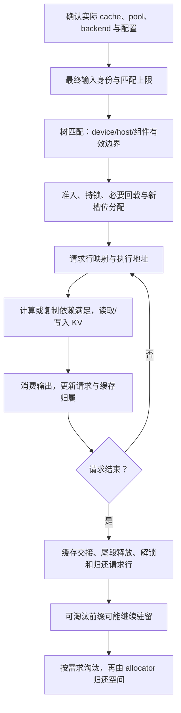
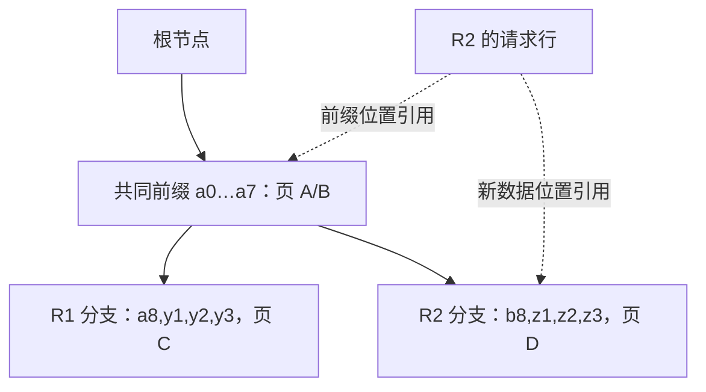
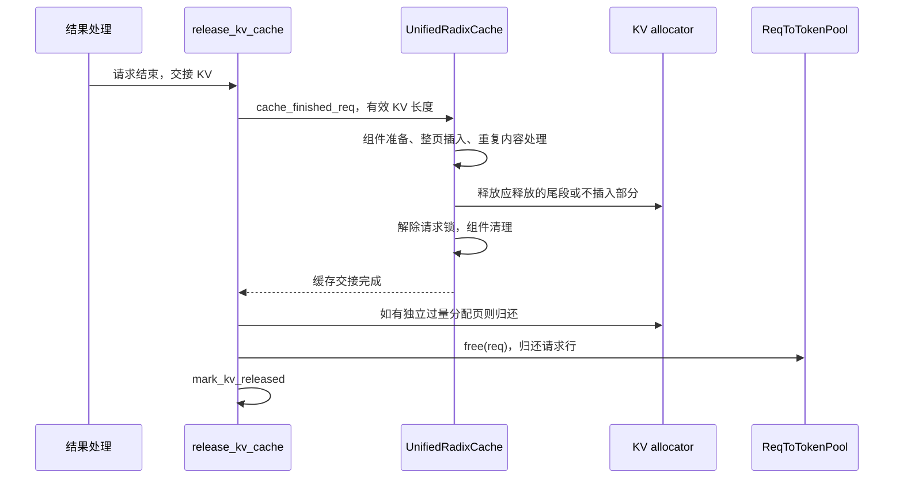

# KV 缓存全生命周期与排障

> **先建立架构心智模型：** [M05 · 缓存架构与资源所有权](<../architecture/05-缓存架构与资源所有权.md>)。先看职责、数据和生命周期，再回到本篇源码细节。

本文是**源码分析型学习资料**，也是阶段 04 的收束篇。前六篇分别讲地址、匹配、身份、混合状态、分层回载和容量；本篇把它们连接起来，回答一个实际问题：**一条请求使用的 KV，从哪里来，现在归谁管理，下一步在等什么，结束后去了哪里？**

建议先读 [04-01 地址与分配器](01-请求视图物理槽位与分配器.md)、[04-04 混合状态](04-UnifiedRadix与混合状态组件.md)和 [04-06 容量与回收](06-容量规划碎片与显存回收.md)。遇到缓存身份或回载问题，再分别回到 [04-03](03-命中条件与缓存隔离.md)和 [04-05](05-HiCache分层存储与回载.md)。

## 0. 阅读基线与范围

| 项目 | 内容 |
| --- | --- |
| 源码路径基准 | SGLang 仓库根目录 `.`；所有源码路径使用仓内相对路径 |
| 分支 | `codex/sglang-source-study-20260909`，基于官方 `main` |
| commit | `72d5c5bb73cadd7ffbf5114e5f81e29d36b6c61a` |
| 读取日期 | `2026-09-09` |
| 工作区状态 | 学习源码 worktree 干净；原源码工作区与 Wiki 既有资料保留 |
| 操作边界 | 只读缓存工厂、代表请求交接、统计与诊断入口，编写和静态检查文档 |
| 基础主线 | 普通文本 Dense、单实例单 rank、非投机、普通循环；UnifiedRadixCache 的 Python TreeCore + FULL 组件，静态分页池 |
| 教学条件 | 缓存开启、无会话/HiCache/统一字节池、无 chunk/mixed/Beam，预算允许接纳；普通未完成/结束插入未被跳过 |
| 独立变化 | Overlap、混合状态、分层传输、会话和统一内存只作为诊断分支；不把它们同时塞入基础例子 |
| 不展开 | 所有硬件/模型分支、PD 退役协议、真实精度和性能复现、完整 TreeCore sanity 算法、在线故障修复 |

本次没有安装、导入或运行 SGLang，没有发送请求、清缓存、打开调试开关或执行 CUDA/分布式测试。表中 R1/R2 和容量数字均为**教学推演**；测试文件仅阅读。文中的“检查通过”如无另述，只指文档及静态引用检查。

## 1. 先分清四种结论

**人话版：** 仓库账本上写着“有这批货”，不等于货已经在加工机器旁；机器旁有货，不等于这份货能被下一位客户覆盖。KV 排障同样需要分开匹配、恢复、执行依赖和回收条件。

| 结论 | 至少要看什么 | 单独不能推出什么 |
| --- | --- | --- |
| 索引匹配 | 最终 token/namespace、limit、树节点和返回长度 | 全部组件状态都能恢复；请求已经被接纳 |
| 状态可恢复 | 实际组件、device/host 边界、checkpoint/窗口与回载分配 | 复制已完成或当前计算流已经建立读取依赖 |
| 数据可用于本轮计算 | 实际读写地址、有效范围、执行顺序、相应 stream/event | 原副本可以立即释放；整个请求已经结束 |
| 资源可回收或复用 | 持有者、锁、在途传输/读取、有效释放段和 allocator 契约 | 设备监控中的占用会立即下降 |

这四项是诊断问题，不是源码里四个同名枚举。某次 device hit 可以直接满足一部分恢复需求，host hit 则还要经过回载；不要求每条请求都创建一次传输。



**图意解读：** 方框表示检查顺序和职责，不是额外线程。循环中的新一轮仍要检查容量；末端“可淘汰”是一种状态，淘汰不必紧随请求结束发生。

## 2. 排障第一步：确认实际运行的是哪条实现

### 2.1 工厂把已经建立的池与前缀管理接起来

`python/sglang/srt/mem_cache/kv_cache_builder.py::build_kv_cache` 从 worker 取得请求池和 KV allocator，计算混合状态标志、有效禁用/分块条件，构造 CacheInitParams，再把上下文交给 create_tree_cache。[S1] 因此它是**连接入口**，不能把它理解成所有 K/V 张量都在这里第一次分配。

create_tree_cache 先处理显式 radix_cache_backend；未注册的名字报错，否则走默认工厂。[S2] 默认选择链有 chunk、纯 SWA、外部缓存等先行分支，未命中特例时最终创建 UnifiedRadixCache。[S3] 不能因为仓里有 `radix_cache.py` 就认定实例使用传统 RadixCache。

统一工厂从 FULL 开始，按模型加 SWA/MAMBA 等组件，按条件连接 HiCache 或外部 linker。[S4] UnifiedRadixCache 又独立选择 TreeCore backend；它还内嵌 StreamingSession 协调器，普通非流式请求会短路返回基础路径。[S5]

### 2.2 一份最小的实现身份记录

| 记录项 | 为什么需要 |
| --- | --- |
| 源码 commit、最终配置、模型与权重版本 | 本地 key 不逐项编码整个进程的计算环境 |
| 工厂来源、实际 cache 类、外层 wrapper | 显式 backend、默认分支、会话包装可能改变调用接收者 |
| TreeCore backend 与组件集合 | Python/Rust 等实现及 Full/SWA/Mamba 有不同状态条件 |
| 请求池、allocator、物理 pool 类型 | 同名 available、free 或 slot 不保证使用同一计量单位 |
| page、rank、DCP、SWA/SSM 标志 | 逻辑 token、物理页和状态容量的口径依赖这些条件 |
| HiCache/linker、host mode、会话、投机、Overlap | 决定是否存在额外副本、持有者与异步依赖 |

create_tree_cache 的初始化日志包含 source、impl、hybrid_swa、hybrid_ssm、hicache_attached、streaming_wrapped。[S2] 它是定位起点；日志不包含上表所有字段，也不证明某次请求已经走过某个路径。

本篇后文明确选 **UnifiedRadixCache + Python TreeCore + FULL + 静态分页池**。这是代表阅读条件，不宣称所有部署都使用这个组合。

## 3. 把一条请求的账本拿齐

| 对象或字段 | 人话解释 | 归属与有效期 |
| --- | --- | --- |
| rid | 请求身份 | 不能当请求池行号或物理页号 |
| req_pool_idx | 请求在 req_to_token 表中的行 | 由请求池分配；归还后同一行可以给另一请求 |
| req_generation | 同一行第几次被分配 | alloc_rows 会递增；用于区分行号复用，不是所有异步路径的自动安全证明 |
| prefix_indices / last_node | 本轮采用的设备前缀地址 / 对应树节点 | 匹配、回载和插入重匹配都可能更新 |
| cache_protected_len | 请求行中由树持有的前缀边界 | 与本请求后续独占尾部区分；不是 GPU 完成事件 |
| kv_committed_len / kv_allocated_len | 已承诺处理的有效长度 / 已登记分配长度 | 只在持有 KV 的适当时点比较；普通路径也会在设备执行前更新它们 |
| out_cache_loc | 本轮新数据的写入位置 | 由分配结果形成；Attention 后端实际写入 K/V |
| component value / lock_ref | 树组件的状态索引 / 保护引用 | 树可以保留请求已结束的数据；共享保护按节点维护 |

字段契约见 [ReqKvInfo][S6]，行分配与代次见 [ReqToTokenPool.alloc_rows][S52]。普通 Prefill/Decode 的分配代码分别设置或增加 committed/allocated，所以 **committed 数字变化本身不证明设备已经写完**。[S11][S12]

地址关系可以沿下面的链读；每一步都需带上有效长度和对象类型：

```text
某请求的逻辑位置 j
  → req_pool_idx 对应的请求行
  → req_to_token[row, j] 保存的 KV 位置
  → 当前层对应的 K/V pool
  → Attention 读取元数据或 out_cache_loc 写入地址
```

普通静态池与统一字节池的最后寻址不同，后者还有 v2p 等映射，详见 [04-06](06-容量规划碎片与显存回收.md)。不要把这个静态链机械套到所有 Mamba state slot、SWA ring 或 DCP 布局。

## 4. R1/R2：从空树到共享，再到淘汰

### 4.1 教学条件与输入

假设静态 KV 池容量为 **24 token 槽位**，P=4，共 6 个可分配页；请求池有足够行。页用 A/B/C/D 表示，名称不代表真实 allocator 的取页顺序。

- R1 输入为 `a0…a8`，产生 `y1…y4`，以 4 个输出结束；没有提前 stop。
- R2 在 R1 完成后到达，输入为 `a0…a7,b8`，产生 `z1…z4` 后结束；第九个输入与 R1 不同。
- 模型、namespace、salt 等条件一致，预算允许接纳。页 A/B 保存共同的前八个输入；C、D 分别保存后续不同内容。

### 4.2 R1：分配、计算、插入和释放是四件事

1. **匹配与接纳。** Req.init_next_round_input 构造最终 key 和 limit，再调用 cache.match_prefix。本例空树返回零长 device prefix。普通上限最多为输入长度减一，还可能受 logprob 条件限制。[S7][S8][S9] PrefillAdder 在准入时检查预算、保护匹配节点，并设置真正的 extend 范围。[S10]
2. **准备地址。** 为 9 个输入分配页 A/B/C。登记的 committed/allocated 长度为 9，物理占用已按页达到 12。此时只是地址和执行计划就绪，不能说 K/V 数据已写完。[S11]
3. **执行并消费 Prefill 结果。** 代表 Triton Attention 在 save_kv_cache 路径把 K/V 写入本轮位置，并向计算传递缓存 buffers 与读取元数据。[S13] 得到 y1、请求未结束时，结果处理调用 maybe_cache_unfinished_req。[S15][S49]
4. **未完成缓存交接。** Unified 把可插入 key 向下按页对齐。本例插入 8-token 前缀，重新匹配、更新请求行中需采用的 canonical 地址，解旧锁并持新锁，cache_protected_len 变成 8。[S16] 页 C 仍服务于该请求尾部；插入树并未再分配一份 A/B。
5. **三轮 Decode。** 依次输入 y1、y2、y3，得到 y2、y3、y4。有效 KV 长度从 9 到 12，都使用页 C；最后输出 y4 没再进入下一轮模型，故它没有因此自动产生自己的 KV。[S12][S14]
6. **结束交接。** release_kv_cache 按有效 KV 长度调用 cache_finished_req。本例可保留 12-token 整页前缀，解除 R1 的锁，再归还请求行并标记释放。[S19][S20][S21][S22] 三页仍在前缀树中，所以 allocator 空闲没有立刻恢复到 24。

这里的 canonical 地址是“树里已经代表这段内容的那组地址”。插入重匹配可以让请求使用它，而不是继续持有重复副本。Unified 的插入通过分步 action 屏障把释放等动作交给 cache 执行；不是只更新 Python 树结构就结束。[S54]

### 4.3 R2：共享前缀不等于共享后续写入

R2 的最大匹配长度为 8，前八个 token 与 R1 一致。它采用 A/B，准入时保护共同前缀，只为新尾部分配页 D。R1 的后四个 KV 位置仍在 C，R2 后续计算写入 D；两个请求的不同后缀不能共用同一个可写位置。



**图意解读：** 图展示 R2 内容已形成后的教学树关系，省略节点 ID 与插入时的临时状态。R2 执行期间，A/B 受保护，D 的未入树部分由请求持有；R2 结束交接后，D 才作为该分支完整保留。虚线不是数据复制。

### 4.4 一张能逐行算平的容量账本

定义 F=allocator available，E=tree evictable，P=tree protected，S=session-held，U=活跃请求尚未由树持有的分配容量。F 用来表示空闲量，与前面的页名 A/B 区分。下面均以**token 槽位容量**计数，S=0；不是按物理字节或输出 token 数计数。[S27][S28][S29]

| 稳定观察时点 | F | E | P | S | U | 归属解释 |
| --- | ---: | ---: | ---: | ---: | ---: | --- |
| 初始 | 24 | 0 | 0 | 0 | 0 | 全空闲 |
| R1 Prefill 地址准备后 | 12 | 0 | 0 | 0 | 12 | 三页由请求占用；不据此断言设备完成 |
| R1 Prefill 结果与未完成插入后 | 12 | 0 | 8 | 0 | 4 | A/B 入树且持锁；C 为请求尾页 |
| R1 正常结束交接后 | 12 | 12 | 0 | 0 | 0 | A/B/C 都可淘汰；请求行已归还 |
| R2 接纳、分配并消费 Prefill 后 | 8 | 4 | 8 | 0 | 4 | A/B 被保护，C 可淘汰，D 为请求尾页 |
| R2 正常结束交接后 | 8 | 16 | 0 | 0 | 0 | 两分支共用 A/B，合计四页而非六页 |
| 假定后续淘汰选择 R1 的 C 页 | 12 | 12 | 0 | 0 | 0 | 释放一个候选叶子，A/B 与 D 继续保留 |

每行都有 `F+E+P+S+U=24`。最后一行假定策略选择 R1 分支，不宣称任意策略必选它；Full 的候选选择和实际 frees 分别在组件与 cache 协调层完成。[S24][S25][S26]

若两个请求同时持有同一前缀，lock_ref 可以大于 1，但 P 不应按请求数重复增加同一批页。FullComponent 在 lock_ref 从 0→1 时把对应容量从 E 移到 P，在 1→0 时移回；中间变化只调整引用数。[S17][S18]

## 5. “结束”之后，究竟归还了什么

### 5.1 普通结束的交接顺序



**图意解读：** 这是基础条件下的调用职责，省略会话接管和异步 offload。无尾段时不会为了满足图形而额外释放一页。结果处理的 Decode 完成分支还允许 worker 的释放准备 hook；offload 分支会走不同的延迟收尾路线。[S53]

release_kv_cache 使用 effective committed 长度，不用 `输入数+输出数` 猜 KV 长度。额外预留的释放从物理页对齐后的边界开始，避免与 cache_finished_req 的尾页释放重叠；非投机且未启用特殊截断时，代码要求登记的 committed/allocated 相等。[S19][S23]

归还请求行会令 req_pool_idx=None，mark_kv_released 清 allocated 和 SWA 回收游标。它**不把所有历史字段清零**，例如 committed 可能仍保留旧值。[S21][S22] 所以排障不能对已经不持有 KV 的 Req，无条件套用“committed≤allocated”并直接判定泄漏。

### 5.2 不同结束路径的资源去向

| 情况 | 检查的交接重点 | 延伸 |
| --- | --- | --- |
| 正常结束并允许缓存 | 整页保留、重复/尾部释放、解锁、归还行 | 本节 |
| 不插入或 cache disable | 请求独占部分如何释放，已有树保护如何解除 | [结束实现][S20] |
| 回撤与重新排队 | 源请求是否已释放、是否有 host backup、最后一条是否终止 | [03-06](../03-scheduling/06-回撤背压饥饿与调度排障.md) |
| 取消或前端断开 | 取消意图、正在运行的请求、结果收尾与在途资源分别定位 | [02-06](../02-request-lifecycle/06-完成取消与资源释放.md) |
| StreamingSession | KV 可能转交 slot，不能把请求结束当 slot 关闭 | [04-03](03-命中条件与缓存隔离.md) |
| HiCache/PD/统一池搬移 | 复制或旧读取仍可能保护地址，不能越过事件/协议直接 free | [04-05](05-HiCache分层存储与回载.md)、[04-06](06-容量规划碎片与显存回收.md)；PD 协议留阶段 07 |

本表是需要追踪的分支地图，不宣称本篇已验证所有终止场景。普通静态 pool 的 free 归还索引，K/V buffers 仍可驻留；设备占用不下降不能单独证明泄漏。

## 6. 从监控数字回到真实持有者

### 6.1 used 与“驻留”不是同一个账本

普通 SchedulerPoolStatsObserver 计算 `used=total−available−evictable`。[S27] 在第 4 节的账本中：

- R1 完成后 used=24−12−12=0，但 12 个槽位的前缀仍驻留。
- R2 执行期间 used=24−8−4=12，等于受保护前缀 8 加请求独占尾页 4。
- R2 完成后 used=0，树内仍有 16 个槽位的可淘汰缓存。

这些零值并不意味着 KV pool 的设备张量消失。混合池还要分别看 Full/SWA/Mamba，以及静态容量、schedulable/conserve 视图；详见 [04-06](06-容量规划碎片与显存回收.md)。

### 6.2 忙碌时的 U 怎样数，怎样避免重复

`_get_total_uncached_sizes` 汇总 last_batch、不同对象的 running_batch，以及停在两块之间的 chunked_req；再按 Req 对象身份去重，仅处理 holds_kv 的请求。[S29]

普通 Full 代表关系为：

```text
对每个持有 KV 的请求：
  分配容量 = ceil_align(kv_allocated_len, page_size)
  uncached = 分配容量 − cache_protected_len
对去重后的请求求和。
```

SWA 还要扣已经窗口回收的部分；Beam 有额外项。前缀共享部分已经在树的 P/E 中计数，不能再按每条请求算一次。会话统计也利用活跃行集合，避免同一份 KV 同时计入活跃请求和 session-held。[S30]

这里的 U 是**分配容量尚未被树持有的部分**，不等于“尚未计算的 token”。例如 R1 Prefill 完成后，尾页已有一个有效 token，但按页仍计 U=4。

## 7. 守恒检查何时执行，能证明多少

### 7.1 没有本轮 batch 不一定进入完整空闲检查

普通/Overlap 循环无 batch 时可以调用 on_idle；on_idle 先判断 is_fully_idle，若仍有等待、chunk、结果或其他在途工作，会发布负载后返回。[S31][S32][S44][S45]

完全空闲条件还会检查对应模式的 grammar、PD 队列、offload，以及 HiCache 的 ongoing write-through/load-back、storage prefetch/backup 等集合。`for_health_check` 使用不同条件，健康检查结果不能替代完整空闲判定。[S31]

在完整空闲路径，代码可尝试统一池机会整理，再做池、请求行、字节账本与树检查。HiSparse 或 Decode deferred release 条件下，部分池检查被跳过。[S32] 因此必须记录**调用发生了没有、门控是否满足、哪项实际执行**。

### 7.2 检查覆盖范围表

| 检查 | 实际覆盖的代表内容 | 重要边界 |
| --- | --- | --- |
| busy Full/SWA 守恒 | F+E+P+S+U 与 total 比较 | 需要 busy 开关和 last_batch；不在这里完成所有 Mamba 状态检查 [S33] |
| idle 池守恒 | 按 Full/SWA/Mamba 类型调用对应计数关系 | HiSparse/deferred release 可跳过；DCP 等有特殊处理 [S32][S36][S37][S38] |
| idle 请求行 | free rows + session-held rows 与请求池容量比较 | Decode 可含 pre_alloc_size；不是普通忙碌时直接套用 [S35] |
| 物理页检查 | 持有者长度、free list 重复页、owner 引用是否落在 Full free set | 遍历范围和 allocator 接口有限，详见下一节 [S34] |
| byte accounting | 交给 allocator 自己核对字节/槽位模型 | 基础静态 allocator 返回空列表，不等于执行了一次设备级字节扫描 [S50] |
| tree sanity | 环境开关及混合组件条件下转交 cache | 普通 FULL 不因此自动进入；Unified 有会话持 KV 时可跳过 [S39][S40] |

**特殊口径不可忽略：** `_check_full_pool` 在 DCP widened page 条件下有容差/跳过告警逻辑；`_check_swa_pool` 对 request ring 跳过 token 池守恒；int8 Mamba checkpoint 则把 active 与 checkpoint 两池分别检查。[S36][S37][S38] 某条等式没报错，不能被扩大为上述全部资源都已精确普查。

### 7.3 物理页检查比总量更细，但也不是完整正确性证明

`_check_kv_page_invariants` 先对已采集持有者检查 `0≤committed≤allocated≤row_width`，随后检查 free list 是否有重复页，以及 owner 页是否出现在 Full free set。[S34]

需要明确它的实际边界：

1. owner 来源是 **last_batch 与 cache.slots**。它不在这个方法里独立遍历全部 running_batch、chunked_req、树节点、传输队列；不要与上一节 U 的更广遍历混淆。
2. 没有有效 active owner 时提前返回，因此这条调用连后面的 free list 重复检查也不会执行。
3. 只检查有对应 free_pages 接口的 allocator 或 Full/SWA 子分配器；没有这些对象时返回。
4. 判断 owner 与 free 集合是否相交，不等于证明两个 owner 之间不存在非法写入别名。正确的共享前缀本来就允许多个请求引用同一组只读位置。
5. 索引关系与计数不验证 K/V 数值、RoPE/模型身份、真实 GPU 读写时序或网络 drain。

### 7.4 调试开关的默认与失败行为

| 配置项 | 固定基线声明/行为 | 阅读时应注意 |
| --- | --- | --- |
| SGLANG_ENABLE_STRICT_MEM_CHECK_DURING_BUSY | EnvInt(0)；代表循环按该值决定是否调用 busy check | 1 缓存近期账本、异常时打印；大于 1 每轮打印；最终守恒用 assert |
| SGLANG_ENABLE_STRICT_MEM_CHECK_DURING_IDLE | EnvBool(True) | 对调用 raise_error_or_warn 的路径决定报错或限频告警 |
| SGLANG_CHECK_KV_PAGE_INVARIANTS | EnvBool(False) | 代表调用位于 busy check 内；只开它不自动绕过外层 busy 门控 |
| SGLANG_ENABLE_TREE_CACHE_SANITY_CHECK | 默认由是否 CI 决定，显式值优先 | 还有 cache/模型条件；不是单靠开关就覆盖全部树 |

声明和 CI 默认见 [S41][S51]；调用与日志行为见 [S33][S34][S39][S42][S44][S45]。特别是页检查中的部分错误也读取 idle strict 开关，不能按函数名猜失败级别。

这里说明配置行为，没有修改运行环境。调试开关会改变执行和日志开销，本篇没有测量其代价。

## 8. 四类现象，沿哪条链排查

### 8.1 “显示命中，但首 token 并没有变快”

先明确命中的口径，再看请求最终采用了什么：

| 检查顺序 | 记录什么 | 为什么 |
| --- | --- | --- |
| 输入身份与上限 | 最终 IDs、extra/salt、limit、logprob 需求 | 可见文本相同不保证可复用；全长输入也可能保留计算尾部 [S7][S8] |
| 本次匹配 | device prefix、host hit、组件有效边界 | host/逻辑命中不等于设备已可读取 [S9] |
| 实际接纳 | AddReqResult、前后 prefix_indices、extend_range | 锁后预算、回载分配或延迟策略仍可能改变本轮执行 [S10] |
| 输入准备 | 实际 extend 长度、cached_tokens 与 already_computed | 分块已算部分不能重复当跨请求命中；回撤计数有专门门控 [S46] |
| 时间分段 | 排队、准备、必要回载、计算、输出/客户端各自时间 | 减少 Prefill 工作量不等于其余阶段都缩短 |

ScheduleBatch.prepare_for_extend 对 cached_tokens 使用 `pre_len−already_computed` 等记账，并对来源拆分设置首次计算门控。[S46] 不要把一次 match 返回值、一次累计 cached_tokens 和最终性能收益当作同一个量。

本次没有运行冷热缓存对照。将来比较需固定模型/权重、输入输出长度、到达方式、并行、缓存层级与测量口径，不能凭一个 hit rate 宣布优化成功。

### 8.2 “KV 不够，但监控看起来还有空闲”

先把问题分成三类：**启动字节预算不足、运行资源种类不足、归属/计数异常**。依次核对请求行、各池当前容量、本轮整页需求、可淘汰保护、回撤结果；统一池再加共享 gap、索引空间、holes 和事件。[04-06](06-容量规划碎片与显存回收.md)

将一个稳定时点写成 `total/F/E/P/S/U`，再与 busy/idle 的实际口径比较。请求行有余不保证 KV 足够，Full 可用不保证 SWA/Mamba 可用，host 空间也不能直接加到 device available。

若等式异常，先保留当时状态与门控，再检查是否遗漏 chunk/session/deferred 资源；不要先把差额命名为泄漏，也不要直接修改计数“对平”。

### 8.3 “共享之后输出异常，怀疑状态污染”

按**身份 → 地址 → 写入范围 → 执行依赖 → 回收代次**定位：

- 身份：最终输入、模型/adapter、salt、多模态特征与会话关系是否对应；见 [04-03](03-命中条件与缓存隔离.md)。
- 地址：prefix_indices、请求行有效段、out_cache_loc 与当前层 pool 是否对应；R2 的新尾部是否错误写入 R1 后缀或共同前缀。
- 状态：Full 的完整前缀、SWA 窗口、Mamba checkpoint/请求私有状态必须分别验证；见 [04-04](04-UnifiedRadix与混合状态组件.md)。
- 依赖：回载层事件、Overlap 的跨 stream 数据、统一池旧源保护是否满足；见 [04-05](05-HiCache分层存储与回载.md)与 [04-06](06-容量规划碎片与显存回收.md)。
- 退役：行号是否已换代、旧引用是否还存活，释放段是否重复；代次记录与页检查分别提供局部线索。[S52][S34]

**共同前缀的索引别名是预期行为，非法覆盖才是问题。** 守恒相等、没有 double-free 或输出偶尔正常，都不能替代受控的数值与时序验证。本次没有这类运行证据。

### 8.4 “请求不前进，看起来一直等回载”

把一条操作的阶段拆开：匹配 → 获得目标地址 → 提交复制 → 当前层可读 → 整批完成 → 解除传输保护。记录 host/device 长度、producer/consumer index、层 event、finish ACK 与 ongoing 集合，按 [04-05](05-HiCache分层存储与回载.md)逐段对照。

队列里有记录不等于底层 IO 正在前进；一层可读不等于整个操作已经释放引用。反过来，没有本轮 batch 也不等于完全空闲，is_fully_idle 会把多类在途状态计入。[S31]

`Scheduler.flush_cache` 需要完整空闲，成功时会重置树、请求池、allocator、部分辅助状态与指标；它是状态修改操作，不是只读健康检查。[S43] 本次没有调用它。学习排障时先记录证据，避免把“清完后暂时恢复”当成根因已经查明。

## 9. 一份可以复查的最小诊断记录

| 层次 | 建议记录的字段 | 结论边界 |
| --- | --- | --- |
| 实现 | commit、最终配置、cache/core/组件、pool/allocator、rank | 固定正在讨论的实现 |
| 请求 | rid、行号/代次、最终输入身份、阶段、是否 holds_kv | 不把旧 Req 字段当仍在持有的资源 |
| 地址 | prefix、保护长度、committed/allocated、有效行切片、out_cache_loc | 保留观察时点；地址存在不证明内容正确 |
| 所有权 | tree E/P、请求 U、session-held、各组件/传输锁 | 共享前缀去重，独占尾部分开 |
| 就绪 | forward/复制阶段、实际 stream/event、ACK 与读取入口 | CPU 状态、设备依赖和事件完成分别说明 |
| 容量 | total/F/E/P/S/U，页/slot/byte 单位与实际统计对象 | 不能用统一池某一视图套静态分母 |
| 检查 | 入口是否调用、门控/跳过原因、观察范围、错误处理 | “未执行”和“执行后未报错”明确分开 |
| 结果 | 真实输出、数值对照、各段时间、最终资源余额 | 本次均未采集运行结果 |

对于源码阅读，可先从以下命令定位入口；它们只搜索文件文本，不启动服务。源码路径仍以 SGLang 仓库根目录为起点：

```bash
rg -n 'def build_kv_cache|def create_tree_cache' \
  python/sglang/srt/mem_cache/kv_cache_builder.py \
  python/sglang/srt/mem_cache/registry.py
rg -n 'def cache_finished_req|def cache_unfinished_req|def sanity_check' \
  python/sglang/srt/mem_cache/unified_radix_cache.py
rg -n 'def self_check_during_busy|def _check_kv_page_invariants|def _check_all_pools' \
  python/sglang/srt/managers/scheduler_components/invariant_checker.py
```

源码命中只是入口；继续查看调用方、分支和被修改的字段，才能形成机制解释。

## 10. 本次测试阅读与验证边界

| 已读文件与范围 | 测试试图约束什么 | 本次状态 |
| --- | --- | --- |
| `test/registered/unit/managers/test_kv_page_invariants.py::TestKVPageInvariants`，5 条测试及其 fake fixture | 正常页布局；请求/slot committed 超出 allocated；owner 引用 free 页；free list 重复 | 只读，未执行 [S47] |
| `test/registered/unit/managers/scheduler_components/test_invariant_checker.py::TestCheckTreeCacheGate`，4 条测试及 fixture | 非 CI/CI 默认、显式关闭与显式开启的 tree sanity 门控 | 只读，未执行 [S48] |

两份文件注册了 CPU CI，使用构造状态或 mock 来检验相应规则。它们不是本次真实设备、模型精度、跨 stream 复用或网络退役的验证结果，也不覆盖第 7 节列出的所有盲区。

本次仅核对 Markdown 结构、源码符号与固定 commit 行号、导航链接、教学账本和 Mermaid 文字关系；未运行 Mermaid 渲染器。

## 11. 阶段验收、自测与下一篇

### 11.1 阶段 04 的交付物串起来读

| 需要能独立解释的产物 | 对应正文 |
| --- | --- |
| 请求行 → token/page → 每层物理状态 | [04-01](01-请求视图物理槽位与分配器.md) |
| R1/R2 压缩前缀树、匹配、分裂和去重 | [04-02](02-RadixAttention与前缀匹配.md)；本篇补默认 Unified 的整条交接 |
| 最终 key、输入身份与会话边界 | [04-03](03-命中条件与缓存隔离.md) |
| Full/SWA/Mamba 有效边界、复制与锁 | [04-04](04-UnifiedRadix与混合状态组件.md) |
| L1/L2/L3 回载时序、数据就绪与取消交接 | [04-05](05-HiCache分层存储与回载.md) |
| 字节预算、页需求、统一池与旧源复用 | [04-06](06-容量规划碎片与显存回收.md) |
| 全生命周期所有权账本与诊断顺序 | 本篇第 3—9 节 |

### 11.2 自测与参考答案

1. **R1 完成后 used=0，为什么仍有 12 个 KV 槽位驻留？** 普通 used 扣除了 evictable；树保留三页，但它们已无请求锁，可以被淘汰。
2. **R1 输入 9 个 token、输出 4 个，为什么最终普通 KV 长度是 12？** Prefill 处理 9 个输入，后三轮各处理一个先前输出；最后的第四个输出没有再进入模型。
3. **两个请求引用 A/B，P 是否需要计为 16？** 不需要。同一组页只计一次，lock_ref 记录有多少保护引用；0→1 和 1→0 才改变受保护容量归类。
4. **已释放请求的 committed 大于 allocated，是否必然异常？** 不能这样判断。先看 holds_kv；释放会清 allocated，但不必清所有历史字段。页检查也只采集仍持有 KV 的对象。
5. **只开启页检查开关就会每轮检查吗？** 不会。代表入口位于 busy check 内，还受外层开关、last_batch、active owner 和 allocator 接口等条件限制。
6. **池守恒和页检查都未报错，能否证明没有状态污染？** 不能。身份、数值、非法写入别名、执行依赖和未采集持有者都需要其他证据。
7. **host hit 很长，但请求没有执行，下一步查什么？** 查接纳门槛与实际回载分配，再查复制提交、层读取依赖和在途收尾；不能直接以 hit 证明已可执行。

下一篇进入阶段 05：[05-01《Worker 与 ModelRunner 执行边界》](../05-model-execution/01-Worker与ModelRunner执行边界.md)，继续追踪已准备的 batch 怎样成为真实模型输入。

返回[系列目录](../README.md)、[排障索引](../appendices/04-症状到源码的排障索引.md)或[学习进度](../appendices/06-学习进度与版本变更记录.md)。

[S1]: https://github.com/sgl-project/sglang/blob/72d5c5bb73cadd7ffbf5114e5f81e29d36b6c61a/python/sglang/srt/mem_cache/kv_cache_builder.py#L200
[S2]: https://github.com/sgl-project/sglang/blob/72d5c5bb73cadd7ffbf5114e5f81e29d36b6c61a/python/sglang/srt/mem_cache/registry.py#L228
[S3]: https://github.com/sgl-project/sglang/blob/72d5c5bb73cadd7ffbf5114e5f81e29d36b6c61a/python/sglang/srt/mem_cache/registry.py#L80
[S4]: https://github.com/sgl-project/sglang/blob/72d5c5bb73cadd7ffbf5114e5f81e29d36b6c61a/python/sglang/srt/mem_cache/registry.py#L149
[S5]: https://github.com/sgl-project/sglang/blob/72d5c5bb73cadd7ffbf5114e5f81e29d36b6c61a/python/sglang/srt/mem_cache/unified_radix_cache.py#L149
[S6]: https://github.com/sgl-project/sglang/blob/72d5c5bb73cadd7ffbf5114e5f81e29d36b6c61a/python/sglang/srt/managers/schedule_batch.py#L870
[S7]: https://github.com/sgl-project/sglang/blob/72d5c5bb73cadd7ffbf5114e5f81e29d36b6c61a/python/sglang/srt/managers/schedule_batch.py#L1440
[S8]: https://github.com/sgl-project/sglang/blob/72d5c5bb73cadd7ffbf5114e5f81e29d36b6c61a/python/sglang/srt/managers/schedule_batch.py#L1561
[S9]: https://github.com/sgl-project/sglang/blob/72d5c5bb73cadd7ffbf5114e5f81e29d36b6c61a/python/sglang/srt/mem_cache/unified_radix_cache.py#L521
[S10]: https://github.com/sgl-project/sglang/blob/72d5c5bb73cadd7ffbf5114e5f81e29d36b6c61a/python/sglang/srt/managers/schedule_policy.py#L1271
[S11]: https://github.com/sgl-project/sglang/blob/72d5c5bb73cadd7ffbf5114e5f81e29d36b6c61a/python/sglang/srt/mem_cache/allocation.py#L282
[S12]: https://github.com/sgl-project/sglang/blob/72d5c5bb73cadd7ffbf5114e5f81e29d36b6c61a/python/sglang/srt/mem_cache/allocation.py#L521
[S13]: https://github.com/sgl-project/sglang/blob/72d5c5bb73cadd7ffbf5114e5f81e29d36b6c61a/python/sglang/srt/layers/attention/triton_backend.py#L1519
[S14]: https://github.com/sgl-project/sglang/blob/72d5c5bb73cadd7ffbf5114e5f81e29d36b6c61a/python/sglang/srt/layers/attention/triton_backend.py#L2119
[S15]: https://github.com/sgl-project/sglang/blob/72d5c5bb73cadd7ffbf5114e5f81e29d36b6c61a/python/sglang/srt/managers/scheduler_components/batch_result_processor.py#L253
[S16]: https://github.com/sgl-project/sglang/blob/72d5c5bb73cadd7ffbf5114e5f81e29d36b6c61a/python/sglang/srt/mem_cache/unified_radix_cache.py#L941
[S17]: https://github.com/sgl-project/sglang/blob/72d5c5bb73cadd7ffbf5114e5f81e29d36b6c61a/python/sglang/srt/mem_cache/unified_cache/components/full_component.py#L263
[S18]: https://github.com/sgl-project/sglang/blob/72d5c5bb73cadd7ffbf5114e5f81e29d36b6c61a/python/sglang/srt/mem_cache/unified_cache/components/full_component.py#L307
[S19]: https://github.com/sgl-project/sglang/blob/72d5c5bb73cadd7ffbf5114e5f81e29d36b6c61a/python/sglang/srt/mem_cache/common.py#L238
[S20]: https://github.com/sgl-project/sglang/blob/72d5c5bb73cadd7ffbf5114e5f81e29d36b6c61a/python/sglang/srt/mem_cache/unified_radix_cache.py#L852
[S21]: https://github.com/sgl-project/sglang/blob/72d5c5bb73cadd7ffbf5114e5f81e29d36b6c61a/python/sglang/srt/mem_cache/memory_pool.py#L340
[S22]: https://github.com/sgl-project/sglang/blob/72d5c5bb73cadd7ffbf5114e5f81e29d36b6c61a/python/sglang/srt/managers/schedule_batch.py#L920
[S23]: https://github.com/sgl-project/sglang/blob/72d5c5bb73cadd7ffbf5114e5f81e29d36b6c61a/python/sglang/srt/mem_cache/common.py#L283
[S24]: https://github.com/sgl-project/sglang/blob/72d5c5bb73cadd7ffbf5114e5f81e29d36b6c61a/python/sglang/srt/mem_cache/unified_radix_cache.py#L611
[S25]: https://github.com/sgl-project/sglang/blob/72d5c5bb73cadd7ffbf5114e5f81e29d36b6c61a/python/sglang/srt/mem_cache/unified_cache/components/full_component.py#L204
[S26]: https://github.com/sgl-project/sglang/blob/72d5c5bb73cadd7ffbf5114e5f81e29d36b6c61a/python/sglang/srt/mem_cache/unified_radix_cache.py#L642
[S27]: https://github.com/sgl-project/sglang/blob/72d5c5bb73cadd7ffbf5114e5f81e29d36b6c61a/python/sglang/srt/managers/scheduler_components/pool_stats_observer.py#L221
[S28]: https://github.com/sgl-project/sglang/blob/72d5c5bb73cadd7ffbf5114e5f81e29d36b6c61a/python/sglang/srt/managers/scheduler_components/invariant_checker.py#L78
[S29]: https://github.com/sgl-project/sglang/blob/72d5c5bb73cadd7ffbf5114e5f81e29d36b6c61a/python/sglang/srt/managers/scheduler_components/invariant_checker.py#L258
[S30]: https://github.com/sgl-project/sglang/blob/72d5c5bb73cadd7ffbf5114e5f81e29d36b6c61a/python/sglang/srt/managers/scheduler_components/pool_stats_observer.py#L169
[S31]: https://github.com/sgl-project/sglang/blob/72d5c5bb73cadd7ffbf5114e5f81e29d36b6c61a/python/sglang/srt/managers/scheduler.py#L4762
[S32]: https://github.com/sgl-project/sglang/blob/72d5c5bb73cadd7ffbf5114e5f81e29d36b6c61a/python/sglang/srt/managers/scheduler.py#L4675
[S33]: https://github.com/sgl-project/sglang/blob/72d5c5bb73cadd7ffbf5114e5f81e29d36b6c61a/python/sglang/srt/managers/scheduler_components/invariant_checker.py#L313
[S34]: https://github.com/sgl-project/sglang/blob/72d5c5bb73cadd7ffbf5114e5f81e29d36b6c61a/python/sglang/srt/managers/scheduler_components/invariant_checker.py#L350
[S35]: https://github.com/sgl-project/sglang/blob/72d5c5bb73cadd7ffbf5114e5f81e29d36b6c61a/python/sglang/srt/managers/scheduler_components/invariant_checker.py#L439
[S36]: https://github.com/sgl-project/sglang/blob/72d5c5bb73cadd7ffbf5114e5f81e29d36b6c61a/python/sglang/srt/managers/scheduler_components/invariant_checker.py#L96
[S37]: https://github.com/sgl-project/sglang/blob/72d5c5bb73cadd7ffbf5114e5f81e29d36b6c61a/python/sglang/srt/managers/scheduler_components/invariant_checker.py#L154
[S38]: https://github.com/sgl-project/sglang/blob/72d5c5bb73cadd7ffbf5114e5f81e29d36b6c61a/python/sglang/srt/managers/scheduler_components/invariant_checker.py#L227
[S39]: https://github.com/sgl-project/sglang/blob/72d5c5bb73cadd7ffbf5114e5f81e29d36b6c61a/python/sglang/srt/managers/scheduler_components/invariant_checker.py#L494
[S40]: https://github.com/sgl-project/sglang/blob/72d5c5bb73cadd7ffbf5114e5f81e29d36b6c61a/python/sglang/srt/mem_cache/unified_radix_cache.py#L3186
[S41]: https://github.com/sgl-project/sglang/blob/72d5c5bb73cadd7ffbf5114e5f81e29d36b6c61a/python/sglang/srt/environ.py#L488
[S42]: https://github.com/sgl-project/sglang/blob/72d5c5bb73cadd7ffbf5114e5f81e29d36b6c61a/python/sglang/srt/utils/common.py#L4802
[S43]: https://github.com/sgl-project/sglang/blob/72d5c5bb73cadd7ffbf5114e5f81e29d36b6c61a/python/sglang/srt/managers/scheduler.py#L4935
[S44]: https://github.com/sgl-project/sglang/blob/72d5c5bb73cadd7ffbf5114e5f81e29d36b6c61a/python/sglang/srt/managers/scheduler.py#L1893
[S45]: https://github.com/sgl-project/sglang/blob/72d5c5bb73cadd7ffbf5114e5f81e29d36b6c61a/python/sglang/srt/managers/scheduler.py#L1928
[S46]: https://github.com/sgl-project/sglang/blob/72d5c5bb73cadd7ffbf5114e5f81e29d36b6c61a/python/sglang/srt/managers/schedule_batch.py#L2561
[S47]: https://github.com/sgl-project/sglang/blob/72d5c5bb73cadd7ffbf5114e5f81e29d36b6c61a/test/registered/unit/managers/test_kv_page_invariants.py#L58
[S48]: https://github.com/sgl-project/sglang/blob/72d5c5bb73cadd7ffbf5114e5f81e29d36b6c61a/test/registered/unit/managers/scheduler_components/test_invariant_checker.py#L20
[S49]: https://github.com/sgl-project/sglang/blob/72d5c5bb73cadd7ffbf5114e5f81e29d36b6c61a/python/sglang/srt/mem_cache/common.py#L145
[S50]: https://github.com/sgl-project/sglang/blob/72d5c5bb73cadd7ffbf5114e5f81e29d36b6c61a/python/sglang/srt/mem_cache/allocator/base.py#L72
[S51]: https://github.com/sgl-project/sglang/blob/72d5c5bb73cadd7ffbf5114e5f81e29d36b6c61a/python/sglang/srt/environ.py#L40
[S52]: https://github.com/sgl-project/sglang/blob/72d5c5bb73cadd7ffbf5114e5f81e29d36b6c61a/python/sglang/srt/mem_cache/memory_pool.py#L315
[S53]: https://github.com/sgl-project/sglang/blob/72d5c5bb73cadd7ffbf5114e5f81e29d36b6c61a/python/sglang/srt/managers/scheduler_components/batch_result_processor.py#L1126
[S54]: https://github.com/sgl-project/sglang/blob/72d5c5bb73cadd7ffbf5114e5f81e29d36b6c61a/python/sglang/srt/mem_cache/unified_radix_cache.py#L545
