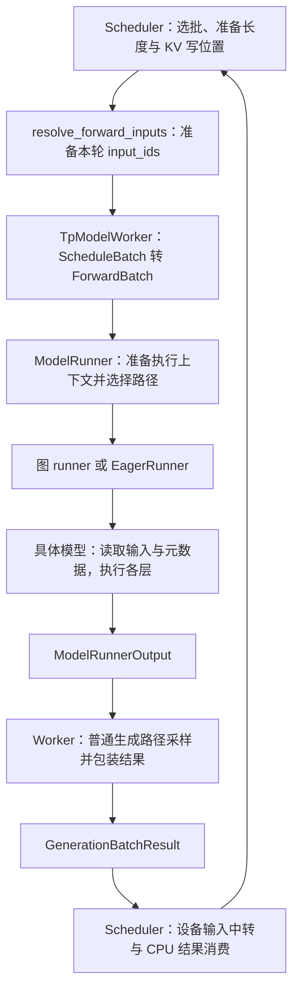
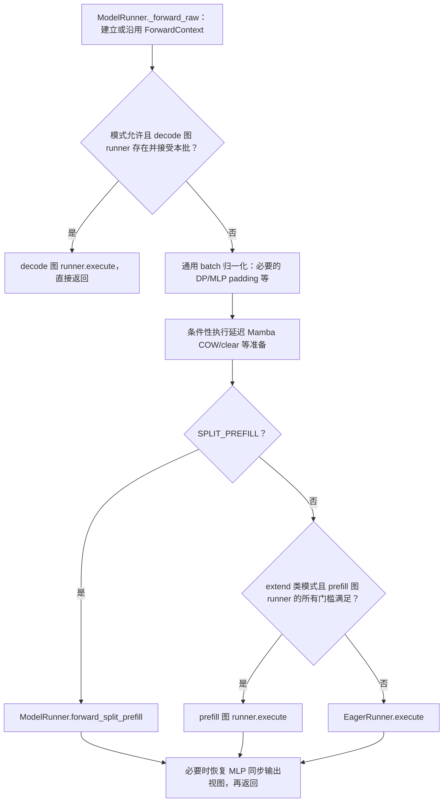
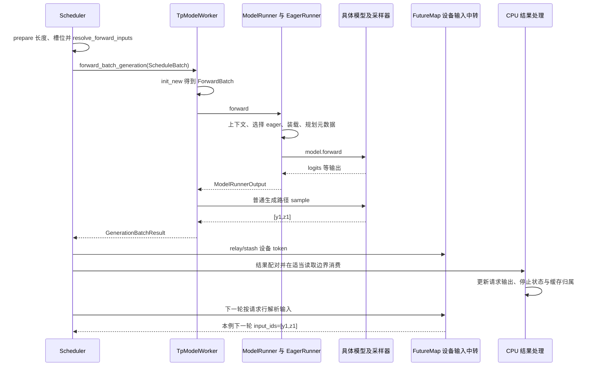

# Worker 与 ModelRunner 执行边界

本文是**源码分析型学习资料**。前面已经知道 Scheduler 怎样选出请求、准备长度并分配 KV 槽位；现在继续追问：**这份 batch 怎样变成模型本轮真正读取的输入，谁选择执行路径，返回后谁负责推进下一轮？**

建议先读 [02-03 对象分工](../02-request-lifecycle/03-Req与多种Batch对象的分工.md)、[03-01 普通循环](../03-scheduling/01-NormalEventLoop与调度主循环.md)和 [04-01 地址与分配器](../04-kv-cache/01-请求视图物理槽位与分配器.md)。本篇在这些对象之间补齐执行交接，不逐层解释模型网络。

## 0. 阅读基线与范围

| 项目 | 内容 |
| --- | --- |
| 源码路径基准 | SGLang 仓库根目录 `.`；所有源码位置使用仓内相对路径 |
| 分支 | `codex/sglang-source-study-20260909`，基于官方 `main` |
| commit | `72d5c5bb73cadd7ffbf5114e5f81e29d36b6c61a` |
| 读取日期 | `2026-09-09` |
| 工作区状态 | 学习源码 worktree 干净；原源码工作区和 Wiki 既有资料保留 |
| 操作边界 | 只读输入准备、worker/runner、代表 eager 路径、结果交接与元数据标记测试；编写和静态检查文档 |
| 基础主线 | 普通文本 Dense、单实例单 rank、非投机、普通循环、生成请求；先选择普通 eager 路径 |
| 教学条件 | 静态 KV 池；无 chunk/mixed、PP/CP/DCP、HiCache、LoRA、多模态、Beam、grammar；不请求 logprob 或 hidden states |
| 独立变化 | 图执行、Overlap、延迟采样、预规划、PP、分层缓存和混合状态只用于解释分支与边界 |
| 不展开 | Llama 层内部、各 Attention 后端算法、完整采样算法、图捕获实现、全部并行/投机/硬件组合 |

本次没有安装、导入或运行 SGLang，没有启动模型、执行 GPU 测试或测量性能。带固定源码链接的判断是**源码事实**；图、R1/R2 数字和职责比喻是**整理者归纳与教学推演**；本篇没有运行观察。基线对应关系见[系列目录](../README.md)。

## 1. 先把“决定做什么”和“怎样执行”接起来

**人话版：** Scheduler 像负责安排工单的人，决定本轮处理哪些请求；Worker 把工单转换成执行接口需要的材料，并在合适的输出端组织采样；ModelRunner 决定用哪条执行路径；具体模型才沿网络层完成计算。这个比喻帮助划分职责，不代表四个独立进程。

### 1.1 这一段主线是同一 Scheduler 进程里的对象调用

`python/sglang/srt/managers/scheduler.py::Scheduler.init_tp_model_worker` 创建 TpModelWorker；init_model_worker 的非投机分支将 model_worker 指向它。[S1][S50] Worker 的 `_init_model_runner` 再构造 ModelRunner，传入模型配置、设备/并行上下文和相关资源配置。[S2] 普通 run_batch 直接调用 `self.model_worker.forward_batch_generation(...)`。[S3]

因此，**Scheduler → TpModelWorker → ModelRunner 在本篇条件下是本地 Python 调用链**。`worker` 这个类名不意味着这一步又经由 ZMQ 发给一个新进程。HTTP/Tokenizer 到 Scheduler 的进程边界已经在 [02-02](../02-request-lifecycle/02-Tokenizer与进程间消息通路.md)展开；多 rank 进程和通信留给阶段 06。



**图意解读：** 方框是组件职责和交接物，不是线程/进程图。箭头主要表示调用和返回关系，也不表示每个箭头都发生一次数据复制。最后一个箭头表示仍有后续工作时进入调度流程；完成请求会走结果处理和资源交接。

### 1.2 各层拿到了什么权限

| 层次或对象 | 本轮负责什么 | 数据关系与生命周期 |
| --- | --- | --- |
| Scheduler / ScheduleBatch | 请求选择、调度长度、资源安排、结果配对与状态推进 | 请求集合与调度字段会随轮次筛选、合并或更新 |
| TpModelWorker | 转换 ForwardBatch、调用 runner、在适用路径采样、包装执行结果 | 持有 ModelRunner；一次调用可接受 ScheduleBatch，也可接受调用方准备的 ForwardBatch |
| ForwardBatch | 描述这一次模型执行需要的 token、位置、长度、写地址和模式信息 | 新建描述对象，包含借用字段与派生字段；不是整个请求的深拷贝 |
| ModelRunner | 管理模型执行入口、运行上下文与 runner 选择 | 使用已建立的模型/后端资源；forward 返回不自动完成 Req 的停止判断 |
| EagerRunner / 图 runner | 把本轮输入交给所选执行实现 | eager 也可以使用可复用输入缓冲区；不能从名称推断是否复制 |
| Attention backend | 根据最终执行 batch 规划当前 Attention 所需元数据 | 规划状态和 KV 本体不同；具体索引结构留到 05-03 |
| GenerationBatchResult | 把模型输出、token、可选回调/事件等交回 Scheduler | 内容随模式和处理阶段变化；返回时不保证 token 已采样或 CPU 可读 |

这些边界主要由 [run_batch][S3]、[Worker 生成入口][S4]、[ForwardBatch.init_new][S8]、[ModelRunner.forward][S12]和[结果类型][S31]共同给出。访问某个 pool 或 tensor，不等于获得请求准入、取消或资源退役的全部控制权。

### 1.3 术语先按使用目的记

| 术语 | 人话解释 | 本篇要区分的另一件事 |
| --- | --- | --- |
| B / batch_size | 本轮 batch 的请求行数 | T：本轮展平后实际处理的输入 token 数 |
| seq_lens | 各请求执行本轮输入时的序列长度 | extend_seq_lens：各请求本轮新增计算的 token 数 |
| positions | token 在所属序列中的逻辑位置 | out_cache_loc：本轮新 KV 的写位置 |
| H2D / D2H | 主机到设备 / 设备到主机的数据复制 | Python 字段赋值或对象引用传递 |
| pinned staging | 准备给后续设备复制的主机暂存数据 | 设备上最终 input_ids 已经可被读取 |
| forward metadata | Attention 本轮使用的索引、长度及相关计划信息 | 模型权重、KV 数据本体或 GPU 完成事件 |
| eager | 本轮选择普通执行 runner | “没有输入缓冲区”或“所有字段都新分配” |
| logits / next_token_ids | 候选 token 的分数 / 选出的 token ID | 最终文本和对客户端的输出提交 |

## 2. 输入准备有三个时点，不全在 init_new 里完成

### 2.1 Scheduler 已经准备了一部分设备字段

`python/sglang/srt/managers/schedule_batch.py::ScheduleBatch.prepare_for_extend` 先按各请求采用的 prefix 和本轮 extend 范围组织输入、长度与 KV 分配。[S5] 其中 seq_lens 等字段已有设备 tensor 和相应 CPU 镜像；输入 token 则可以保留在 pinned CPU staging 中：

```python
# 摘录：python/sglang/srt/managers/schedule_batch.py
self.input_ids = None
self.prefill_input_ids_cpu = pinned_input_ids
```

这里 input_ids 为 None 是一个有后续步骤的状态，不能在这个位置就断言“模型没有输入”。普通 Decode 准备会分配下一个写位置，并把 seq_lens、seq_lens_cpu、orig_seq_lens 增加 1；seq_lens_sum 设为 None，之后按需要回填。[S6]

### 2.2 run_batch 在执行入口解析真正的 token 输入

`python/sglang/srt/managers/overlap_utils.py::resolve_forward_inputs` 是实际交接入口。[S7] 虽然文件名带 overlap，**普通非 Overlap 的 run_batch 也调用它**。[S3]

| 条件 | resolve_forward_inputs 的工作 | 完成这一步后仍需注意什么 |
| --- | --- | --- |
| 有 prefill_input_ids_cpu | 将暂存输入复制到 batch.device；有 mixed decode 行时再拼接设备中转输入；消费并清除 staging 字段 | non_blocking 提交不等于主机已等待设备工作完成 |
| 无上述 staging，input_ids 为 None，且普通非投机 | 按 req_pool_indices 从 FutureMap 的 output_tokens_buf 取得上一轮 token | 请求行顺序必须与本轮其他逐行字段一致 |
| 投机路径 | 另有已准备的输入与可选 extras 解析条件 | 不把普通“每请求一个 token”规则套给验证 batch |

这里的 FutureMap 提供设备输入中转，普通 Decode 因而不必先把下一轮输入转成 CPU 列表再重建。它与 CPU 上 append 输出、判断停止、发给 Detokenizer 是两条用途不同的路径，详见 [03-05](../03-scheduling/05-Overlap中的CPU与GPU依赖.md)。

### 2.3 Worker 直接把 ScheduleBatch 转成 ForwardBatch

Worker 收到 batch 时先更新适用的 HiCache consumer，再调用 `ForwardBatch.init_new(batch, self.model_runner, ...)`。[S4] 当前普通主线不需要插入一个固定的 ModelWorkerBatch 中间层。若 batch 参数为 None，则要求已有 forward_batch，且不允许在这条调用方式同时指定 capture_hidden_mode override；这是真实接口断言，不能随意混用。

init_new 的内容按“来源”读，比按字段顺序读容易理解：[S8]

| 字段或动作 | 从哪里来 | 是否意味着重新复制全部数据 |
| --- | --- | --- |
| input_ids、req_pool_indices、seq_lens、out_cache_loc 等 | 从 ScheduleBatch 传入已有字段 | 初始构造主要借用引用 |
| batch_size、模式、返回需求等 | 从本轮请求集合和标志形成 | Python 标量或模式信息 |
| seq_lens_sum | 若 ScheduleBatch 中缺失，按 CPU 长度求和并回填 | 是 CPU 账本补齐，不是 GPU reduction 完成事件 |
| sampling_info / spec_info | 使用共享对象；按条件准备 grammar 等字段 | 不因包进新 dataclass 就变成独立副本 |
| extend_seq_lens / extend_prefix_lens | 普通 host-list 路径构造设备 tensor，同时保留 CPU 列表；gpu-only 路径使用已有设备字段 | 两种输入来源不能混为一谈 |
| positions / extend_start_loc | 按 decode、extend、spec/dLLM 等条件派生或采用已有值 | positions 可以由模式特例预先提供 |
| 写位置翻译 | kv_index_translator.rebind_write_loc 处理适用布局 | 翻译器可替换 ForwardBatch 中的写地址引用 |

**不要把 init_new 当纯函数。** 它的注释表达不修改调度 batch 的设计意图，但实际代码会回填 batch.seq_lens_sum，也会更新共享 sampling_info 的 grammar；可选 canary 路径还会写 rid 信息。[S8] 读调用边界时应以真实赋值为准，而不是因为返回新对象就推断输入完全不变。

写地址也有一个重要例外：`python/sglang/srt/mem_cache/kv_index_translator.py::KVIndexTranslator.rebind_write_loc` 在启用翻译时保存虚拟写位置，并将 ForwardBatch 的 out_cache_loc 改绑到翻译结果，避免直接原地改写借来的调度 tensor。[S9] 这层关系见 [04-06](../04-kv-cache/06-容量规划碎片与显存回收.md)，本篇静态池例子不启用它。

## 3. 用两条请求走完一次 Prefill 和下一次 Decode

### 3.1 先固定数字和假设

为突出“总长度”和“本轮输入数”的区别，本例独立设定：R1 输入长 7，已采用长度 4 的前缀；R2 输入长 3，无可复用前缀。两条请求本轮都把剩余 prompt 算完，尚未结束，随后各继续生成。token 用 a0、b0、y1 等符号表示，不是真实 tokenizer ID。

| 请求 | 请求池行号 | 输入总长度 | 本轮 prefix | 本轮 extend | 本轮实际 token |
| --- | ---: | ---: | ---: | ---: | --- |
| R1 | 7 | 7 | 4 | 3 | a4、a5、a6 |
| R2 | 2 | 3 | 0 | 3 | b0、b1、b2 |

行号 7、2 是教学假设，不表示 allocator 固定按此顺序分配。B=2，T=3+3=6，seq_lens_sum=7+3=10。**2、6、10 都合法，但回答的是不同问题。**

### 3.2 Prefill 交给模型的描述

| 字段 | 教学值 | 怎样得到或使用 |
| --- | --- | --- |
| forward_mode | EXTEND | 本轮处理新输入片段 |
| input_ids | [a4, a5, a6, b0, b1, b2] | 按请求顺序展平；长度 T=6 |
| req_pool_indices | [7, 2] | 每条请求对应一行；长度 B=2 |
| seq_lens / seq_lens_cpu | [7, 3] | 已包含 prefix 与本轮 extend 的总长度 |
| extend_prefix_lens | [4, 0] | 本轮输入前已采用的历史长度 |
| extend_seq_lens | [3, 3] | 各请求本轮输入数 |
| extend_start_loc | [0, 3] | 各请求在展平输入中的起始偏移 |
| positions | [4, 5, 6, 0, 1, 2] | 每段从自己的 prefix 长度开始编号 |
| out_cache_loc | [20, 21, 22, 32, 33, 34] | 为本轮新增 KV 选定的六个写位置 |
| seq_lens_sum | 10 | 总上下文长度之和，不能用作本轮输入 tensor 长度 |

位置计算的代表公式可以直接读 `python/sglang/srt/model_executor/forward_batch_info.py::compute_position_torch`：各请求分别生成从 prefix 到 prefix+extend 的位置区间，再拼接；extend_start_loc 则由前面请求的 extend 长度累加得到。[S10] 实际调用还会按设备走对应实现，本表是公式的静态推演，不是运行了 Torch 或 Triton 的结果。

写槽位是另一个坐标系。若 page_size=4，可把 R1 已有的四个前缀槽位假设为 [4,5,6,7]，新增尾页为 [20,21,22,23]；R2 尾页为 [32,33,34,35]。Prefill 本轮只写表中六个位置，23、35 留作尾页余量。逻辑位置 4 不意味着写入物理槽位 4，位置 0 也不意味着使用空闲表第 0 项。

### 3.3 下一次 Decode 输入的是刚采样出的 token

假设 Prefill 在后文的普通执行与采样路径生成 [y1,z1]，结果被正确中转和消费，两条请求都继续。下一次 Decode 的账本为：

| 字段或结果 | Prefill | 紧随的一轮 Decode |
| --- | --- | --- |
| B / T | 2 / 6 | 2 / 2 |
| 本轮 input_ids | [a4,a5,a6,b0,b1,b2] | [y1,z1] |
| seq_lens | [7,3] | [8,4] |
| seq_lens_sum | 10 | 12 |
| positions | [4,5,6,0,1,2] | [7,3] |
| out_cache_loc | [20,21,22,32,33,34] | [23,35] |
| 普通采样输出 | [y1,z1] | [y2,z2] |

Decode 准备先加长度，再由 ForwardBatch 的对应分支形成 positions；CUDA clamp_position 接口明确使用 `clamp(seq_lens - 1, min=0)` 的语义。[S6][S8][S11] 表里的 [7,3] 就是 [8,4] 各减 1。

本轮 Decode 为 y1、z1 写 KV，同时产出 y2、z2；不能把 y2、z2 也算成本轮已经写好的 KV。输出比已算入 KV 的 token 多一步这一关系，仍遵循 [02-04](../02-request-lifecycle/04-一次Prefill到多轮Decode.md)的逐轮账本。

### 图解补充：拼在一个 batch 里，仍是两个请求


[查看原尺寸](../../../images/sglang-source-study/04-ragged-batch.png)。

**图意解读：** 沿横轴看拼接后的 token，沿纵轴看本轮 query。两个绿色三角块分别属于两个请求；块外空白说明不允许互读。批内共享一次执行，不等于共享上下文。

**对应本篇源码：** 对照 R1/R2 的 `input_ids`、长度与起点；Worker/Runner 执行拼好的视图，不能因此把两份 Req 历史合成一份。 [源码：python/sglang/srt/model_executor/forward_batch_info.py][S8]

**来源与边界：** [Continuous batching from first principles](https://huggingface.co/blog/continuous_batching)，Rémi Ouazan Reboul、Arthur Zucker、Luc Georges / Hugging Face，2025-11-25。这是逻辑 Attention 掩码示意，不表示后端实际创建一张完整的大矩阵；请求隔离还要靠长度、起点和 KV 索引共同实现。 [来源档案 F04](../../../images/sglang-source-study/SOURCES.md#f04)。

## 4. ModelRunner 先建立执行环境，再选择路径

### 4.1 ForwardContext 提供的是本轮后端访问上下文

`python/sglang/srt/model_executor/model_runner.py::ModelRunner.forward` 是外层入口，包围计数、可选捕获/观测等处理，再进入 _forward_raw。[S12] 后者如果已有 ForwardContext 就沿用，否则发布包含当前 attn_backend 的上下文。[S13]

`python/sglang/srt/model_executor/forward_context.py::ForwardContext` 是保存 attn_backend 的 frozen dataclass；同文件 context manager 保存旧上下文并在 finally 中恢复。[S25][S26] 模型和层可以通过上下文取得当前后端及其关联资源，ForwardBatch 因而不必承载所有运行时对象引用。

这一实现使用模块级当前上下文，不是新建 GPU stream，也不是进程通信协议或任意多 Python 线程之间的隔离机制。其源码说明以 worker 的单 Python 线程执行假设为背景；不能把 frozen 误读为其中的 backend 或 KV 内容不可变。

### 4.2 真实分发顺序比“Prefill 或 Decode”多一层



**图意解读：** 图按 `_forward_raw` 的主分支整理。[S13] 它省略 HiSparse 等特例，不能据此判断所有组合可用。“decode 图 runner”是属性名称，其模式门槛并不只有普通 DECODE：CUDA 的 is_cuda_graph 还包括 TARGET_VERIFY、IDLE、DLLM_EXTEND；CPU 的模式判定单独处理。[S41] 最终还要经过 runner 自身 can_run_graph，而非看到 mode 名就判定已重放。

`_prepare_eager_forward_batch` 名字里有 eager，却位于 split-prefill、prefill 图与 eager 三条分支之前。它按全局 token 计数是否存在选择 MLP 同步准备或 Attention TP 输入归一化，并更新适用的真实 token 数等信息。[S14] 因此看到它被调用，不能据此断言“本轮走 eager”；在并行路径，之后做规划时应使用准备后的最终形状。

延迟 Mamba COW/clear 也位于这里的 extend 分发前，按 pool、target/draft 和 forward mode 等条件执行。[S15] 这说明部分状态复制被安排在真正 forward 的时点，不能用 init_new 已返回推断所有状态准备都完成；具体混合状态生命周期回看 [04-04](../04-kv-cache/04-UnifiedRadix与混合状态组件.md)。

### 4.3 选择 eager 后，还要完成输入装载和 Attention 规划

普通非 PDmux 的 eager decode/extend 路径会调用 `EagerRunner.load_batch`。[S17][S22][S23] 它默认通过 registry 填充本轮输入，返回以缓冲区切片为部分字段的新 ForwardBatch 视图。`build_eager_registry` 为 eager 建立覆盖 decode/extend 所需的槽位集合；本次 raw 与 padded 参数相同，不在此处额外补齐，但上游的并行准备可能已经改变形状。[S20]

| 步骤 | 可在源码看到的行为 | 对读者的含义 |
| --- | --- | --- |
| init_new | 借用部分 ScheduleBatch tensor，构造派生字段 | 先得到执行描述，并非全部深拷贝 |
| registry.fill_from | 对已注册且适用的槽位复制/填充，执行相关 hook | 这是另一层数据装载；不是所有 Python 字段都复制 |
| registry.extract_buffer | dataclasses.replace，把相关字段换成 buffer 切片，保留其他引用 | 模型看到的 ForwardBatch 可能已不是 init_new 返回的那个对象 |
| 可选字段为空 | 对普通复制槽位保留本轮 None，避免暴露上一轮剩余 buffer 内容 | 某槽位有内存不代表本轮输入含该字段 |
| NO_COPY 特例 | SGLANG_EAGER_INPUT_NO_COPY=True 时直接 dataclasses.replace | 仍是浅层新描述，不能当深拷贝或普遍默认行为 |

依据分别见 [fill_from][S18]、[extract_buffer][S19]、[load_batch][S17]。SGLANG_EAGER_INPUT_NO_COPY 的声明默认值为 False。[S46] Registry 与 ForwardBatch 的名字都不能替代引用/复制关系检查。

随后，普通新 batch 需要规划 Attention 元数据；模型若有 prepare_forward_batch hook，会先执行它，再调用 backend.init_forward_metadata，最后进入具体 model.forward(input_ids, positions, forward_batch, ...)。[S22][S23] 普通 extend 还有共享读取快照/发布相关调用，其并发意义见 [03-05](../03-scheduling/05-Overlap中的CPU与GPU依赖.md)。

extend 的 kwargs 还可能包含输入 embedding、替换向量或非生成任务标志，由 `_extend_forward_kwargs` 形成。[S16] 本例不用这些分支，模型的基础输入可先记为三个部分：**token ID、逻辑位置、本轮执行与地址描述**。

## 5. metadata ready 记录的是规划契约

### 5.1 它回答“还需要规划吗”，不回答“GPU 做完了吗”

`ForwardBatch.mark_forward_metadata_ready` 记录 ready、当时 B 和 input_ids 的 token 数，并保存 replan_equivalent。[S27] `needs_forward_metadata_init` 用这些值决定是否需要规划。[S28] 新建 ForwardBatch 默认未规划。

| ready | 允许等价重规划 replan_equivalent | 当前 B/T 与记录 | needs_forward_metadata_init 返回值 |
| --- | --- | --- | --- |
| False | 任意 | 任意 | True |
| True | False | 任意，包括形状已变 | False |
| True | True | 相同 | False |
| True | True | B 或 T 改变 | True |

第二行容易误读。源码为某些多步 wrapper 或特殊上下文的预规划保留“不自动重规划”契约，因为普通 forward 路径的规划可能覆盖调用方准备好的专用状态。[S27][S28] **它不是“形状改变也一定安全”的结论。** 标记的适用后端、调用上下文与防御性检查仍需匹配。

同样，形状相同也只说明上述判定未检测到 B/T 变化，不能证明全部索引内容、地址代次或外部后端状态正确。这里既没有调用 event.synchronize，也不是复制完成通知；GPU 就绪仍看实际执行流和事件依赖。

### 5.2 要把判定函数和实际调用点一起读

普通 eager decode 在需要时规划。[S22] eager extend 则还有额外条件：**CP 活跃或 TARGET_VERIFY 时，也会进入规划分支**，即使 needs_forward_metadata_init 返回 False。[S23] 不能把上表当成所有执行模式的最终唯一判定。

源码对 marker 的注释还明确指出：该标记用于 forward 外部的预规划契约，ModelRunner/图 runner 不应在自己完成常规规划后随手标记；新一轮 init_new 默认重新开始。[S27] 一次 forward 正常结束，并不意味着可以把上轮 ready 值跨任意 batch 复用。

旧 skip_attn_backend_init 参数也不能当作无效参数丢掉：None 不动作；显式 True 映射为 mark；False 不 mark，也没有实现“清掉已有 ready”；非 None 的旧接口使用进程级一次性弃用提醒。[S29]

### 5.3 本次只阅读了哪些测试

`test/registered/unit/model_executor/test_forward_metadata_plan_record.py` 注册为 CPU CI，使用小型 CPU ForwardBatch 检查 dataclass 标记逻辑。[S44][S45]

| 测试类 | 已阅读的断言范围 | 条数 | 本次执行 |
| --- | --- | ---: | --- |
| TestForwardMetadataPlanRecord | 新 batch、mark 时形状、未 opt-in 的形状变化、opt-in 后 B/T 变化、重新 mark | 5 | 未执行 |
| TestDeprecatedSkipKwargShim | None、True、False 的映射和警告、进程内只警告一次 | 4 | 未执行 |

这 9 条测试的存在不证明 model.forward、CUDA 图、所有后端、张量内容或并发复用已验证。本篇仅检查源码断言与上表解释一致，没有导入测试模块或运行 pytest。

## 6. 返回结果分两层，采样还可能晚于 forward

### 6.1 ModelRunnerOutput 与 GenerationBatchResult 不是同一用途

ModelRunner 的返回类型包含 logits_output、can_run_graph 和可选观测结果。[S30] Worker 再把它包装成 GenerationBatchResult，按调用模式决定是否采样。[S4][S31]

| 条件 | Worker 的行为 | 返回时 next_token_ids 的解释 |
| --- | --- | --- |
| 本篇普通生成、最后 PP rank、非 prefill-only | runner.forward 后调用 model_runner.sample | 得到普通采样 token tensor |
| is_verify=True | forward 后返回，跳过 Worker 此处采样 | 不能据 None 判定 forward 没执行 |
| 满足延迟采样条件 | 保存 delay_sample_func，先返回结果对象 | 回调执行后才写 next_token_ids，回调返回同一个结果对象 |
| prefill-only 普通分支 | 创建每条请求一个 dummy zero ID；按条件只计算 logprob | tensor 存在不证明产生了有意义的生成 token |
| 非最后 PP rank | 返回 pp_hidden_states_proxy_tensors | 本 rank 的产物供后续 stage 使用，不能按最终 token 解释 |

prefill-only 分支旁的注释写“on CPU”，但实际 zeros 使用 `device=forward_batch.input_ids.device`。[S4] 阅读时以实际参数为准，不把注释转述成保证。GenerationBatchResult.has_sampled_token_ids 只是检查 next_token_ids 是否为 torch.Tensor；它并不识别 dummy token 的业务含义。[S31]

本篇普通 Prefill 不要求输入 logprob，LogitsProcessor 的对应剪裁分支取每条输入片段最后一个 hidden state，索引为 cumsum(extend_seq_lens)-1，即例子的 [2,5]。[S48] 随后普通采样每请求取一个下一 token。[S4][S32] 因此六个输入 token 对应两个本轮生成 token，不能把 T=6 直接当输出 token 数。

`ModelRunner.sample` 处理采样前 logits 准备，再调用 sampler，并有可选观察与额外输入维护。[S32] 完整 penalty、grammar mask、temperature、top-k/top-p 和 logprob 主线留给 05-04；**ModelRunner.forward 自身的返回不能一概等同于采样已完成**。

### 6.2 延迟采样是带条件的接口路径

Worker 此处分支要求 enable_overlap 且非投机，再满足 grammar 存在，或 SGLANG_ENABLE_DELAY_SAMPLE 开启且非 prefill-only。[S4] 该环境变量声明默认 False，但 grammar 条件独立存在；不能把默认 False 理解成“绝无延迟采样”。[S47]

Scheduler.launch_batch_sample_if_needed 在相应时点执行回调，检查仍为同一结果对象，中转输出，安排 D2H，并清除回调及不再需要的 next_token_logits 引用。[S35] 需要追踪的是“谁持有结果、何时补齐 token、何时消费”，不能在看到第一次 return 时就释放所有相关输入和 logits。

## 7. 设备中转与 CPU 消费是两条交接

### 7.1 普通主线怎样继续跑下一轮



**图意解读：** 图描述本篇无 Overlap、无延迟采样的普通顺序。参与者是职责，不代表 CPU 结果处理另有线程，也不表示 GPU 在每个 Python 返回处同步。Overlap 会改变提交与结果消费的相对时机，需另看 stream/event 和结果队列。

`Scheduler._relay_forward_payload` 根据生成路径选择 payload，再写入 FutureMap。[S33] 普通非 Overlap 的 run_batch 在有 token tensor 时调用 relay，并清掉 batch.input_ids，供后续一轮解析新输入；还按需要处理辅助输出。[S3][S34] Worker/runner 提供执行结果，Req 的输出更新和停止、资源交接仍在 Scheduler 的结果处理层。[S38][S39]

### 7.2 Overlap 额外需要明确复制和读取的先后

| 观察到的状态 | 可以证明什么 | 还不能单独证明什么 |
| --- | --- | --- |
| ForwardBatch 构造完成 | 执行描述已形成，相关复制可能已提交 | GPU 已读完输入；所有混合状态准备已完成 |
| forward_metadata_ready=True | 调用方记录过预规划契约 | KV/元数据复制在所有流上完成 |
| ModelRunner.forward 返回 | 对应 Python 执行路径已返回产物 | token 一定采样完成，或 CPU 已可直接消费 |
| next_token_ids 是 tensor | 该字段已有 tensor 载荷 | 不是 dummy，或该 tensor 已转到 CPU |
| copy_done 已 record | 事件已登记在相应复制流工作之后 | CPU 已等待该事件完成 |
| 消费侧 synchronize 返回 | 消费侧等待的事件已经完成 | 全请求结束、其他流/传输均退役 |

Overlap 的 run_batch 安排 forward stream 与 schedule stream 的依赖，再依条件由 forward/copy stream 复制结果。[S3] `GenerationBatchResult.copy_to_cpu` 按实际返回需求复制 token、选定 logprob、hidden/辅助结果等，在末尾 record copy_done；不是每次都把全词表 logits 完整搬回 CPU。[S36]

CUDA 的 `_async_d2h` 显式分配 pinned 目的 tensor、提交非阻塞 copy，并为源 tensor record_stream，以保护复制期间的源存活。[S37] 结果处理中的 Prefill/Decode 分支在存在 copy_done 时 synchronize，再消费结果。[S38][S39] 普通路径不一定有这个事件，读取 token 的 tolist 等位置仍是分析主机读数边界的入口；没有事件字段不能直接推断读取无等待。

Overlap 的 `_forward_isolation` 还会临时替换 sampling_info；投机场景保存/恢复更多 ScheduleBatch 字段，普通场景没有把整份对象深拷贝成独立事务。[S40] 再结合 run_batch 的 keepalive 和复制依赖，才能理解哪些借用字段需要存活。完整的流/事件与下一批共享读取关系见 [03-05](../03-scheduling/05-Overlap中的CPU与GPU依赖.md)。

## 8. 在基础主线之外，先找分支入口

| 变化 | 已核查的分支或约束 | 当前能下的结论与未展开部分 |
| --- | --- | --- |
| Decode / Prefill 图执行 | 模式、runner 存在性、can_run_graph、Prefill 的额外 CP guard | 选择需要多个条件；捕获、buffer 更新和正确性留到 05-05 [S13] |
| SPLIT_PREFILL | Worker 保存分段 ForwardBatch，ModelRunner 按 layer 区间推进 split_index | 中途可没有最终 logits；不要每段都按完整生成处理 [S42][S43] |
| MIXED | EagerRunner 在非 NPU 且无 CP strategy 的条件下可将模式归一化为 EXTEND | 这是有条件的表示转换，不表示所有 mixed 负载结构相同 [S21] |
| IDLE | 有不同元数据准备条件，随后仍可调用 model.forward | 不能把 IDLE 无条件解释成没有执行/通信 [S24] |
| PP 非最后 rank | Worker 返回 proxy tensors | 跨 stage 生命周期和通信留到阶段 06 [S4] |
| Embedding / pooling | BaseTpWorker 使用 embedding forward 入口并返回相应输出 | 不能套用普通生成必采样的末端 [S49] |
| HiCache / 混合状态 | Worker consumer 与 Runner 延迟 COW/clear 等入口 | 地址、依赖与释放需连回阶段 04，不由字段存在自动证明 [S4][S15] |
| 投机 / dLLM / CP | Worker 特殊分发、已有 positions、额外元数据与规划条件 | 本篇仅确认边界入口，不宣称全部特例完成机制验证 [S4][S8][S23] |

## 9. 小白排障地图：从现象退回具体边界

| 现象 | 优先记录或检查 | 回到哪里 |
| --- | --- | --- |
| prepare_for_extend 后 input_ids 是 None | prefill_input_ids_cpu 是否存在；是否已到 resolve 调用点 | 输入暂存和解析 [S5][S7] |
| 以为 batch 是 2，却看到 6 个输入 token | B、T、seq_lens_sum、prefix/extend 列表和 flatten 顺序 | 本篇第 3 节及 init_new [S8] |
| Decode 使用了错误 token | req_pool_indices 行顺序、上一批 relay、是否已经清除/解析 input_ids | run_batch 与 payload relay [S3][S33] |
| KV 写到了意外地址 | 逻辑 positions、调度 out_cache_loc、是否有虚拟到物理改绑 | 翻译器 [S9]，并回看 04-01/04-06 |
| 看到 eager helper 却实际走了图 | 按 _forward_raw 顺序记录命中的真实分支和 runner | 分发 [S13][S14] |
| 模型拿到的 FB/tensor 不是最初对象 | init_new 借用关系、load_batch、registry 切片与 optional None | 装载与视图 [S17][S18][S19] |
| ready=True 仍然重新规划 | replan_equivalent、当前/记录 B/T、eager verify 或 CP 条件 | marker 判定与实际调用点 [S28][S23] |
| ready=True 且形状变了仍跳过 | 标记点是否允许等价重规划；后端/特殊上下文是否仍匹配 | 预规划契约 [S27][S28] |
| forward 返回却 next_token_ids=None | verify、延迟回调、非最后 PP rank、分段 Prefill | Worker 和 split 入口 [S4][S42] |
| next_token_ids 存在但不能当输出文本 | prefill-only dummy、设备位置、结果消费与停止状态 | 结果类型和处理 [S31][S38][S39] |
| CPU 等待明显或怀疑复制未结束 | 提交流、wait_stream、copy_done record/等待、tolist 与源引用 | run_batch、D2H 与消费者 [S3][S36][S37] |

以上是证据采集入口，不是已执行的在线诊断。若要确认性能、精度或并发安全，需要固定环境后另做实验，并使用[实验记录附录](../appendices/05-实验记录与证据模板.md)记录真实结果。

## 10. 回到源码的最短阅读顺序

| 次序 | 文件与符号 | 带着什么问题读 |
| --- | --- | --- |
| 1 | `python/sglang/srt/managers/scheduler.py::Scheduler.run_batch` [S3] | 本轮输入在哪里准备，结果怎样交接？ |
| 2 | `python/sglang/srt/managers/overlap_utils.py::resolve_forward_inputs` [S7] | Prefill 暂存与 Decode 设备输入从哪里来？ |
| 3 | `python/sglang/srt/managers/tp_worker.py::TpModelWorker.forward_batch_generation` [S4] | 谁转换 batch，谁决定采样/延期/代理输出？ |
| 4 | `python/sglang/srt/model_executor/forward_batch_info.py::ForwardBatch.init_new` [S8] | 哪些字段借用，哪些派生，哪些会回写或改绑？ |
| 5 | `python/sglang/srt/model_executor/model_runner.py::ModelRunner._forward_raw` [S13] | 执行环境和分支选择的真实顺序是什么？ |
| 6 | `python/sglang/srt/model_executor/runner/eager_runner.py::EagerRunner.load_batch` [S17] | 模型执行前又经过哪层输入 buffer？ |
| 7 | `python/sglang/srt/model_executor/runner/eager_runner.py::EagerRunner._execute_extend` [S23] | 装载、规划、共享读准备与 model.forward 怎样衔接？ |
| 8 | `python/sglang/srt/model_executor/forward_batch_info.py::ForwardBatch.needs_forward_metadata_init` [S28] | ready 标记怎样影响本轮规划，调用点还有什么附加条件？ |
| 9 | `python/sglang/srt/managers/utils.py::GenerationBatchResult.copy_to_cpu` [S36] | 哪些结果需要复制，消费者依据什么等待？ |

阅读时每过一个函数，在旁边写一句“它完成本轮的哪一步”，再写出进入/离开时 B、T、输入所在设备、模式、地址视图和结果字段。只把函数名连成线，不能检查真实数据是否对得上。

## 11. 自测、验收与下一篇

### 11.1 先不看答案口述

1. 本例 B=2、T=6、seq_lens_sum=10 为什么都正确？Decode 后分别是多少？
2. init_new 返回了新 ForwardBatch，能否说明 Scheduler 的 tensor 和 sampling_info 已全部隔离？
3. 调用了 _prepare_eager_forward_batch，能否断言实际走 eager？
4. 一个 batch 已 mark ready，B 从 2 变成 4，是否一定重新规划？TARGET_VERIFY 的 eager 路径又怎样？
5. Worker 返回 next_token_ids=None，至少有哪些正常解释？tensor 存在又能否证明完成普通采样？
6. 把本例 [y1,z1] 从本轮生成追到下一轮输入，再说明 CPU 输出消费与这条路径的区别。

### 11.2 对照答案

1. 2 是请求行数，6 是本轮未命中输入 token 数，10 是两条总上下文长度之和；下一轮为 2、2、12。新增输入位置是 [7,3]，物理写槽位是 [23,35]。
2. 不能。init_new 借用部分字段且会回填部分状态；eager load_batch 又可把部分字段换为 registry 切片，其余引用仍可能共享。需逐字段看来源和存活条件。
3. 不能。该 helper 位于 split-prefill、prefill 图和 eager 的共同准备段，真实选择看 _forward_raw 后续分支。
4. 不一定。ready=True 且 replan_equivalent=False 时判定仍跳过；允许等价重规划才按 B/T 变化判断。eager TARGET_VERIFY 还会走调用点的强制规划条件。
5. verify、延迟采样、非最后 PP rank、尚未形成 logits 的 split-prefill 都要区别检查；prefill-only 的 dummy tensor 也满足 has_sampled_token_ids 的类型判断。
6. 普通 Worker 采样后 Scheduler relay 到 FutureMap；下一轮按请求行 resolve 为 input_ids。CPU 结果处理负责输出历史、停止判断和交接，Overlap 时还需要相应 D2H 和事件等待；两个用途不能合并为同一标志。

### 11.3 本篇完成标准与实际验证

- 能从 ScheduleBatch 一直走到 model.forward，再返回下一轮输入和 CPU 消费，分开请求调度、执行、采样与生命周期职责。
- 能复算 R1/R2 的 prefix/extend、packed offsets、位置、B/T/总长度与尾页写地址。
- 能解释引用借用、registry 复制/视图、元数据规划和设备结果可读之间的区别。
- 已做源码位置/符号、固定 commit 引用、本地导航、表格与教学算术的静态核对；9 条 CPU CI 测试只阅读，未执行。
- Mermaid 仅与文字和源码分支做静态核对，没有运行渲染器；没有运行 SGLang、GPU/并行/图执行、精度或性能实验。

下一篇为 [05-02《以 Llama 为例读懂模型 Forward》](02-以Llama为例读懂模型Forward.md)，把本篇的 model.forward 方框展开到 embedding、Attention、MLP 和输出层。

[S1]: https://github.com/sgl-project/sglang/blob/72d5c5bb73cadd7ffbf5114e5f81e29d36b6c61a/python/sglang/srt/managers/scheduler.py#L1002
[S2]: https://github.com/sgl-project/sglang/blob/72d5c5bb73cadd7ffbf5114e5f81e29d36b6c61a/python/sglang/srt/managers/tp_worker.py#L480
[S3]: https://github.com/sgl-project/sglang/blob/72d5c5bb73cadd7ffbf5114e5f81e29d36b6c61a/python/sglang/srt/managers/scheduler.py#L4199
[S4]: https://github.com/sgl-project/sglang/blob/72d5c5bb73cadd7ffbf5114e5f81e29d36b6c61a/python/sglang/srt/managers/tp_worker.py#L593
[S5]: https://github.com/sgl-project/sglang/blob/72d5c5bb73cadd7ffbf5114e5f81e29d36b6c61a/python/sglang/srt/managers/schedule_batch.py#L2561
[S6]: https://github.com/sgl-project/sglang/blob/72d5c5bb73cadd7ffbf5114e5f81e29d36b6c61a/python/sglang/srt/managers/schedule_batch.py#L3345
[S7]: https://github.com/sgl-project/sglang/blob/72d5c5bb73cadd7ffbf5114e5f81e29d36b6c61a/python/sglang/srt/managers/overlap_utils.py#L87
[S8]: https://github.com/sgl-project/sglang/blob/72d5c5bb73cadd7ffbf5114e5f81e29d36b6c61a/python/sglang/srt/model_executor/forward_batch_info.py#L752
[S9]: https://github.com/sgl-project/sglang/blob/72d5c5bb73cadd7ffbf5114e5f81e29d36b6c61a/python/sglang/srt/mem_cache/kv_index_translator.py#L433
[S10]: https://github.com/sgl-project/sglang/blob/72d5c5bb73cadd7ffbf5114e5f81e29d36b6c61a/python/sglang/srt/model_executor/forward_batch_info.py#L1905
[S11]: https://github.com/sgl-project/sglang/blob/72d5c5bb73cadd7ffbf5114e5f81e29d36b6c61a/python/sglang/kernels/ops/attention/clamp_position.py#L27
[S12]: https://github.com/sgl-project/sglang/blob/72d5c5bb73cadd7ffbf5114e5f81e29d36b6c61a/python/sglang/srt/model_executor/model_runner.py#L1612
[S13]: https://github.com/sgl-project/sglang/blob/72d5c5bb73cadd7ffbf5114e5f81e29d36b6c61a/python/sglang/srt/model_executor/model_runner.py#L1756
[S14]: https://github.com/sgl-project/sglang/blob/72d5c5bb73cadd7ffbf5114e5f81e29d36b6c61a/python/sglang/srt/model_executor/model_runner.py#L1524
[S15]: https://github.com/sgl-project/sglang/blob/72d5c5bb73cadd7ffbf5114e5f81e29d36b6c61a/python/sglang/srt/model_executor/model_runner.py#L1708
[S16]: https://github.com/sgl-project/sglang/blob/72d5c5bb73cadd7ffbf5114e5f81e29d36b6c61a/python/sglang/srt/model_executor/model_runner.py#L1566
[S17]: https://github.com/sgl-project/sglang/blob/72d5c5bb73cadd7ffbf5114e5f81e29d36b6c61a/python/sglang/srt/model_executor/runner/eager_runner.py#L183
[S18]: https://github.com/sgl-project/sglang/blob/72d5c5bb73cadd7ffbf5114e5f81e29d36b6c61a/python/sglang/srt/model_executor/cuda_graph_buffer_registry.py#L381
[S19]: https://github.com/sgl-project/sglang/blob/72d5c5bb73cadd7ffbf5114e5f81e29d36b6c61a/python/sglang/srt/model_executor/cuda_graph_buffer_registry.py#L473
[S20]: https://github.com/sgl-project/sglang/blob/72d5c5bb73cadd7ffbf5114e5f81e29d36b6c61a/python/sglang/srt/model_executor/cuda_graph_buffer_registry.py#L1001
[S21]: https://github.com/sgl-project/sglang/blob/72d5c5bb73cadd7ffbf5114e5f81e29d36b6c61a/python/sglang/srt/model_executor/runner/eager_runner.py#L213
[S22]: https://github.com/sgl-project/sglang/blob/72d5c5bb73cadd7ffbf5114e5f81e29d36b6c61a/python/sglang/srt/model_executor/runner/eager_runner.py#L244
[S23]: https://github.com/sgl-project/sglang/blob/72d5c5bb73cadd7ffbf5114e5f81e29d36b6c61a/python/sglang/srt/model_executor/runner/eager_runner.py#L273
[S24]: https://github.com/sgl-project/sglang/blob/72d5c5bb73cadd7ffbf5114e5f81e29d36b6c61a/python/sglang/srt/model_executor/runner/eager_runner.py#L448
[S25]: https://github.com/sgl-project/sglang/blob/72d5c5bb73cadd7ffbf5114e5f81e29d36b6c61a/python/sglang/srt/model_executor/forward_context.py#L35
[S26]: https://github.com/sgl-project/sglang/blob/72d5c5bb73cadd7ffbf5114e5f81e29d36b6c61a/python/sglang/srt/model_executor/forward_context.py#L79
[S27]: https://github.com/sgl-project/sglang/blob/72d5c5bb73cadd7ffbf5114e5f81e29d36b6c61a/python/sglang/srt/model_executor/forward_batch_info.py#L650
[S28]: https://github.com/sgl-project/sglang/blob/72d5c5bb73cadd7ffbf5114e5f81e29d36b6c61a/python/sglang/srt/model_executor/forward_batch_info.py#L667
[S29]: https://github.com/sgl-project/sglang/blob/72d5c5bb73cadd7ffbf5114e5f81e29d36b6c61a/python/sglang/srt/model_executor/forward_batch_info.py#L688
[S30]: https://github.com/sgl-project/sglang/blob/72d5c5bb73cadd7ffbf5114e5f81e29d36b6c61a/python/sglang/srt/model_executor/model_runner.py#L274
[S31]: https://github.com/sgl-project/sglang/blob/72d5c5bb73cadd7ffbf5114e5f81e29d36b6c61a/python/sglang/srt/managers/utils.py#L45
[S32]: https://github.com/sgl-project/sglang/blob/72d5c5bb73cadd7ffbf5114e5f81e29d36b6c61a/python/sglang/srt/model_executor/model_runner.py#L1884
[S33]: https://github.com/sgl-project/sglang/blob/72d5c5bb73cadd7ffbf5114e5f81e29d36b6c61a/python/sglang/srt/managers/scheduler.py#L4457
[S34]: https://github.com/sgl-project/sglang/blob/72d5c5bb73cadd7ffbf5114e5f81e29d36b6c61a/python/sglang/srt/managers/scheduler.py#L4484
[S35]: https://github.com/sgl-project/sglang/blob/72d5c5bb73cadd7ffbf5114e5f81e29d36b6c61a/python/sglang/srt/managers/scheduler.py#L4510
[S36]: https://github.com/sgl-project/sglang/blob/72d5c5bb73cadd7ffbf5114e5f81e29d36b6c61a/python/sglang/srt/managers/utils.py#L130
[S37]: https://github.com/sgl-project/sglang/blob/72d5c5bb73cadd7ffbf5114e5f81e29d36b6c61a/python/sglang/srt/managers/utils.py#L31
[S38]: https://github.com/sgl-project/sglang/blob/72d5c5bb73cadd7ffbf5114e5f81e29d36b6c61a/python/sglang/srt/managers/scheduler_components/batch_result_processor.py#L253
[S39]: https://github.com/sgl-project/sglang/blob/72d5c5bb73cadd7ffbf5114e5f81e29d36b6c61a/python/sglang/srt/managers/scheduler_components/batch_result_processor.py#L889
[S40]: https://github.com/sgl-project/sglang/blob/72d5c5bb73cadd7ffbf5114e5f81e29d36b6c61a/python/sglang/srt/managers/scheduler.py#L4155
[S41]: https://github.com/sgl-project/sglang/blob/72d5c5bb73cadd7ffbf5114e5f81e29d36b6c61a/python/sglang/srt/model_executor/forward_batch_info.py#L106
[S42]: https://github.com/sgl-project/sglang/blob/72d5c5bb73cadd7ffbf5114e5f81e29d36b6c61a/python/sglang/srt/managers/tp_worker.py#L705
[S43]: https://github.com/sgl-project/sglang/blob/72d5c5bb73cadd7ffbf5114e5f81e29d36b6c61a/python/sglang/srt/model_executor/model_runner.py#L1590
[S44]: https://github.com/sgl-project/sglang/blob/72d5c5bb73cadd7ffbf5114e5f81e29d36b6c61a/test/registered/unit/model_executor/test_forward_metadata_plan_record.py#L39
[S45]: https://github.com/sgl-project/sglang/blob/72d5c5bb73cadd7ffbf5114e5f81e29d36b6c61a/test/registered/unit/model_executor/test_forward_metadata_plan_record.py#L82
[S46]: https://github.com/sgl-project/sglang/blob/72d5c5bb73cadd7ffbf5114e5f81e29d36b6c61a/python/sglang/srt/environ.py#L1349
[S47]: https://github.com/sgl-project/sglang/blob/72d5c5bb73cadd7ffbf5114e5f81e29d36b6c61a/python/sglang/srt/environ.py#L623
[S48]: https://github.com/sgl-project/sglang/blob/72d5c5bb73cadd7ffbf5114e5f81e29d36b6c61a/python/sglang/srt/layers/logits_processor.py#L532
[S49]: https://github.com/sgl-project/sglang/blob/72d5c5bb73cadd7ffbf5114e5f81e29d36b6c61a/python/sglang/srt/managers/tp_worker.py#L302
[S50]: https://github.com/sgl-project/sglang/blob/72d5c5bb73cadd7ffbf5114e5f81e29d36b6c61a/python/sglang/srt/managers/scheduler.py#L1094
