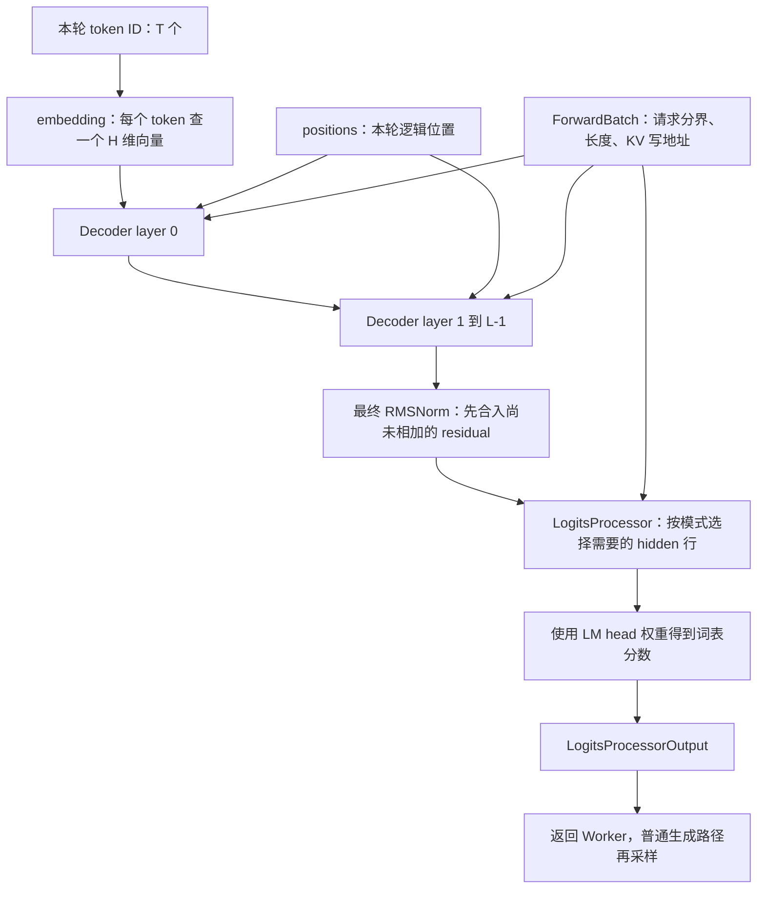
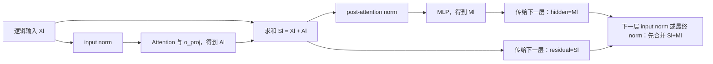
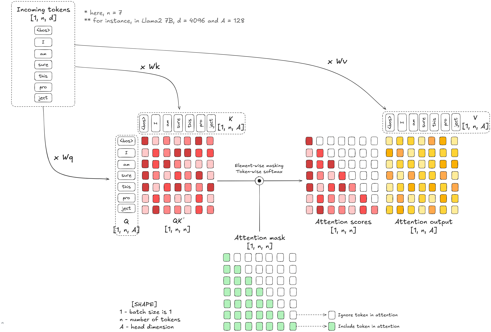
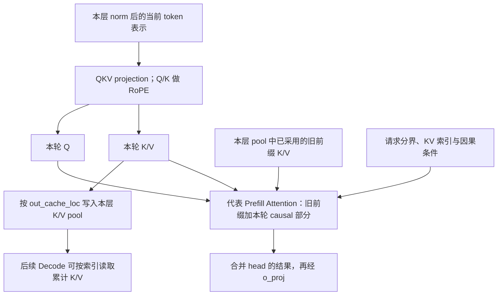

# 以 Llama 为例读懂模型 Forward

本文是**源码分析型学习资料**。上一篇走到了 `model.forward` 的门口，本篇把这个方框展开：**token ID 怎样变成向量，每层怎样读取历史、更新表示和写入 KV，最后怎样得到下一 token 的分数？**

建议先读 [05-01 Worker 与 ModelRunner](01-Worker与ModelRunner执行边界.md)、[00-03 Token 与模型输出](../00-foundations/03-从文本到Token再到模型输出.md)和 [04-01 请求地址与 KV 槽位](../04-kv-cache/01-请求视图物理槽位与分配器.md)。本篇只选一个代表 Dense 模型，不把全部模型和后端的特殊路径混在一起。

## 0. 阅读基线与范围

| 项目 | 内容 |
| --- | --- |
| 源码路径基准 | SGLang 仓库根目录 `.`；所有源码位置使用仓内相对路径 |
| 分支 | `codex/sglang-source-study-20260909`，基于官方 `main` |
| commit | `72d5c5bb73cadd7ffbf5114e5f81e29d36b6c61a` |
| 读取日期 | `2026-09-09` 至 `2026-09-10` |
| 工作区状态 | 学习源码 worktree 干净；原源码工作区和 Wiki 既有资料保留 |
| 操作边界 | 只读 Llama 主干、代表基础层、Triton KV 读写与输出处理；编写和静态检查文档 |
| 基础主线 | 原生 LlamaForCausalLM、普通文本生成、单实例单 rank、eager、非投机、无输入 logprob/hidden capture |
| 教学条件 | 无权重量化、无 LoRA/多模态、无 PP/CP/DCP/SP、无分层缓存；普通全 Attention 和静态 MHA KV 池；无 RoPE scaling，完整 head 参与旋转 |
| 后端阅读条件 | 选择 TritonAttnBackend 的普通 causal Prefill/Decode 作为 KV 读写代表；不宣称它是所有部署默认后端 |
| 不展开 | 完整 Attention 元数据规划、kernel 性能原理、图捕获、采样算法、权重加载全流程、模型精度复现和全部 Llama 家族 |

本次没有下载模型、导入或运行 SGLang，没有执行 CUDA 测试、模型推理或性能测量。固定源码链接支撑**源码事实**；形状、符号公式与图是**整理者归纳和教学推演**，不是数值等价或实测报告。源码及分支准备沿用[系列基线](../README.md)。

## 1. 先认出三个同名层次

**人话版：** 可以把一次推理理解成“查词向量 → 多层加工 → 查候选分数”。源码把它分成外壳、主干和重复层，先认清这三层，才不会在几个 forward 之间迷路。

### 1.1 本篇读的是哪一个实现

`python/sglang/srt/model_loader/utils.py::get_model_architecture` 从模型配置取 architectures，并结合 model_impl 等条件选择实际模型类。[S1] 模型 registry 从模块的 EntryClass 注册类名。[S2] `python/sglang/srt/models/llama.py` 暴露 LlamaForCausalLM 等入口，但**模型名字里出现 Llama 不足以证明实例用了本文件的主线**；实际可能有其他架构或 Transformers 路径。

本篇明确选择原生 LlamaForCausalLM。这里使用 Transformers 的 LlamaConfig 来取得配置，不等于 forward 正在调用 Transformers 自己的 Llama 模型实现。

| 层次 | 代表源码 | 负责的范围 |
| --- | --- | --- |
| 外壳 LlamaForCausalLM | `python/sglang/srt/models/llama.py::LlamaForCausalLM.forward` [S4] | 调用主干；在末端选择 logits 或 pooling 输出 |
| 主干 LlamaModel | `python/sglang/srt/models/llama.py::LlamaModel.forward` [S6] | embedding、逐层循环、最后一次 norm；PP 分支交接中间字段 |
| 重复层 LlamaDecoderLayer | `python/sglang/srt/models/llama.py::LlamaDecoderLayer.forward` [S8] | norm、Attention、残差交接、norm、MLP |
| Attention 子模块 | `python/sglang/srt/models/llama.py::LlamaAttention.forward` [S11] | QKV 投影、RoPE、Attention 接口、输出投影 |
| MLP 子模块 | `python/sglang/srt/models/llama.py::LlamaMLP.forward` [S13] | gate/up 合并投影、SiLU 门控相乘、down 投影 |

### 1.2 整体数据流



**图意解读：** 图表达组件和数据依赖，不是 GPU kernel 数量或进程数量。L 个层各有自己的参数与 KV 状态；T 个输入行不要求等长请求。最后的采样属于外部调用链，LlamaForCausalLM.forward 的普通返回是 logits 相关结果，不是字符串。[S4][S39]

## 2. 把形状符号固定下来

### 2.1 本篇只使用这一组教学维度

沿用 [05-01](01-Worker与ModelRunner执行边界.md) 的请求输入：R1 总长 7，prefix=4、extend=3；R2 总长 3，prefix=0、extend=3。输入展平为 [a4,a5,a6,b0,b1,b2]，位置为 [4,5,6,0,1,2]。新生成 token 后，下一轮 Decode 输入为 [y1,z1]，位置为 [7,3]。

为便于心算，另外给模型指定如下**形状示例**。这些小数字不是已下载模型的配置，也不是保证所有 GPU kernel 都接受的最小运行配置。

| 符号 | 含义 | 教学值 |
| --- | --- | ---: |
| B | 请求行数 | 2 |
| T | 本轮参与模型计算的输入 token 数 | Prefill 为 6，Decode 为 2 |
| H | hidden_size，每个 token 的表示宽度 | 16 |
| Nq | Query head 数 | 4 |
| Nkv | Key/Value head 数 | 2 |
| D | 每个 head 的宽度 | 4 |
| I | MLP intermediate_size | 32 |
| V | 有效词表大小 | 128 |
| L | Decoder layer 数 | 2 |

本例 H=Nq×D=16，Nq/Nkv=2。源码允许 config.head_dim 单独指定，不能把 H=Nq×D 不加条件地套给所有配置；LlamaAttention 实际用 head_dim、Query head 数和 KV head 数分别计算投影宽度。[S9]

### 2.2 形状中没有显式 B，也没有丢掉请求边界

本轮 input_ids 的形状是 [T]，embedding 后是 [T,H]；不是要求先补成 [B,最大长度,H]。R1 的三行在前，R2 的三行在后，ForwardBatch 和后端元数据保留各段起点、长度及 KV 索引。

因此第 0 行的 a4 属于 R1 的逻辑位置 4，第 3 行的 b0 属于 R2 的逻辑位置 0。**展平行号、请求内位置、KV 槽位是三个坐标系。** 后文所有形状只描述本篇无 padding/分片的普通输入；并行或图执行要额外记录最终形状。

### 2.3 一张总形状表

| 执行位置 | 一般形状 | Prefill 示例 | Decode 示例 |
| --- | --- | --- | --- |
| input_ids / positions | [T] / [T] | [6] / [6] | [2] / [2] |
| embedding、每次 norm 后 | [T,H] | [6,16] | [2,16] |
| 合并 QKV 投影 | [T,(Nq+2Nkv)D] | [6,32] | [2,32] |
| 分出的 Q | [T,NqD] | [6,16] | [2,16] |
| 分出的 K / V | 各 [T,NkvD] | 各 [6,8] | 各 [2,8] |
| Attention 按 head 的 Q 视图 | [T,Nq,D] | [6,4,4] | [2,4,4] |
| Attention 按 head 的 K / V 视图 | 各 [T,Nkv,D] | 各 [6,2,4] | 各 [2,2,4] |
| Attention 合并 head 的输出 | [T,NqD] | [6,16] | [2,16] |
| o_proj 后 | [T,H] | [6,16] | [2,16] |
| gate_up_proj 后 | [T,2I] | [6,64] | [2,64] |
| SiLU 与乘法后 | [T,I] | [6,32] | [2,32] |
| down_proj 后 | [T,H] | [6,16] | [2,16] |
| 选出的下一 token hidden | 本篇为 [B,H] | [2,16] | [2,16] |
| 返回的 next_token_logits | 本篇为 [B,V] | [2,128] | [2,128] |

表中投影与切分依据见 [LlamaAttention 构造/准备][S9][S10]、[LlamaMLP][S12][S13]、[RadixAttention][S27]、[logits 行选择][S35]。它是逻辑维度账本，不宣称每个视图都发生实际复制，也不意味着全词表分数已是概率。

## 3. Embedding：把 ID 变成可以计算的向量

**人话版：** token ID 像字典里的编号，模型先按编号取出一行向量。向量宽度是 H；ID 的大小不表示词义强弱，也不直接作为 Attention 的分数。

LlamaModel 在首 PP rank 创建 VocabParallelEmbedding；本篇单 rank 同时是首/末 rank，因此有 embedding 和最终 norm，层循环覆盖本例两个层。[S5] forward 中若没有 input_embeds，就调用 embed_tokens(input_ids)，然后令 residual=None。[S6]

`VocabParallelEmbedding.forward` 进入本地 shard 查表；单 rank 的 `_embed_local_shard` 使用 quant_method.embedding。[S15][S46] 本篇非量化代表方法最终是 `F.embedding(input_, layer.weight)`。[S16] 于是六个 ID 变成 [6,16]，每一行对应一个本轮新输入 token。

实际 embedding 权重第一维可能为补齐后的 Vpad，而非有效词表 V；构造器先进行词表 padding 和分片，再创建权重。[S14][S44] 本例只用有效 ID，形状表里最终 V=128 表示有效词表，不用它推断内部分配的全部行。

有缓存前缀时，本轮不再为 a0 至 a3 逐层重算主干；它们各层所需的 K/V 已由采用的前缀地址提供。这个前提是缓存匹配与接纳已经正确完成，不能只因为文本一样就跳过计算，详见 [04-03](../04-kv-cache/03-命中条件与缓存隔离.md)。

## 4. 每层的两条线：hidden_states 与 residual

### 4.1 RMSNorm 先按数学语义理解

`python/sglang/srt/layers/layernorm.py::RMSNorm.forward_native` 按最后一维计算平方均值，加 epsilon 后取倒数平方根，再乘归一化权重。[S17] 对某一 token 行 x，可把本篇默认语义写成：

```text
Norm(x) = weight × x / sqrt(mean(x²) + epsilon)
```

这一步保持行数与 H 不变，计算口径是每行的 hidden 维度；没有把 R1、R2 混在一起求同一个均值。源码还显式处理 dtype 与可选 residual：若提供 residual，先求和，返回“归一化后的结果”和“未归一化的求和结果”两份含义不同的值。[S17]

CUDA 常规带 residual 分支调用 fused_add_rmsnorm，再返回 x、residual；没有 residual 的分支调用 rmsnorm。[S18] 本篇用数学值解释含义，不把符号公式当作所有 dtype、舍入顺序和融合 kernel 逐位一致的证明。

### 4.2 一层末尾没有立即把 MLP 加回去

LlamaDecoderLayer 的关键次序如下；这是保留分支关系的教学伪代码，省略参数，不可直接运行：[S8]

```text
如果 residual 是 None：
    residual = hidden_states
    hidden_states = input_norm(hidden_states)
否则：
    hidden_states, residual = input_norm(hidden_states, residual)

hidden_states = attention(hidden_states)
hidden_states, residual = post_attention_norm(hidden_states, residual)
hidden_states = mlp(hidden_states)
返回 hidden_states, residual
```

MLP 输出没有在本层 return 前显式相加。它与 residual 作为两份字段传下去，在下一层 input_norm，或最后的 model.norm 中再合并。[S6][S8] 这就是只看 return hidden_states 容易误判“少了残差”的原因。

### 4.3 用值的名字记账，不靠变量名猜

定义 X0 为 embedding 结果；A0 为第 0 层 Attention 经 o_proj 后的输出；M0 为第 0 层 MLP 输出。X1 表示完成第 0 层两次残差后的逻辑表示。所有这些值形状均为 [T,H]。

| 观察位置 | hidden_states 的语义 | residual 的语义 |
| --- | --- | --- |
| embedding 后 | X0 | None |
| 第 0 层 input_norm 后 | N1_0(X0) | X0 |
| 第 0 层 Attention 后 | A0 | X0 |
| 第 0 层 post_attention_norm 后 | N2_0(S0)，其中 S0=X0+A0 | S0 |
| 第 0 层 MLP 后并返回 | M0 | S0 |
| 第 1 层 input_norm 后 | N1_1(X1)，其中 X1=S0+M0 | X1 |
| 第 1 层 Attention 后 | A1 | X1 |
| 第 1 层 post_attention_norm 后 | N2_1(S1)，其中 S1=X1+A1 | S1 |
| 第 1 层 MLP 后并返回 | M1 | S1 |
| 最终 model.norm 后 | Nfinal(X2)，其中 X2=S1+M1 | 求和结果不再作为此主线的输出传递 |

N1_0、N2_0 等是教学符号，表示不同层/位置的 norm；它们的权重不是同一个参数。这里的加号表示数值关系，不承诺一定新建 tensor；融合实现可能原地更新输入和 residual。[S17][S18]



**图意解读：** 图画的是一层的数学职责，源码把部分加法与 norm 融合。第一个 Xl 在第 0 层来自 embedding；后续层的 Xl 由上层返回的两份值先合并得到。两条线都必须交接，丢任意一条都会改变模型计算。

## 5. Attention：从当前表示得到 Q、K、V

### 5.1 合并 QKV 投影只是把三次输出打包

**人话版：** Q 可以理解为当前位置想查询什么，K 为历史位置提供匹配线索，V 携带被取回组合的信息。三者由同一份当前表示生成，但维度和用途不必相同。

`LlamaAttention.forward_prepare_native` 先调用 qkv_proj，再按 `[q_size, kv_size, kv_size]` 在最后一维切分，然后对 Q、K 应用 rotary_emb。[S10] 注意这里 native 指这条准备函数；其内部线性层和 RoPE 仍可能执行设备 kernel，不等于 CPU-only。

本例切分过程是：

```text
[6,16] --QKV projection--> [6,32]
                        ├─ Q: 前 16 列，形状 [6,16]
                        ├─ K: 接着 8 列，形状 [6,8]
                        └─ V: 最后 8 列，形状 [6,8]
```

QKVParallelLinear 继承 ColumnParallelLinear，按 Query/KV head 数计算各输出片段；实际 forward 由 quant_method.apply 执行并返回 output、可选 output_bias。[S19][S20] 所以 `qkv, _ = ...` 中的 `_` 是可选 bias 返回项，不是额外 KV cache。

在本篇无量化、无 bias、TP=1 的条件下，权重采用 [输出宽度,输入宽度]：Wqkv 为 [32,16]，数学上 [T,16] 乘 Wqkv 的转置得到 [T,32]。[S22] UnquantizedLinearMethod 可按设备选择具体 GEMM，普通回退为 F.linear；“非量化”不表示只能有一种 kernel。[S23]

### 5.2 RoPE 作用于 Q、K，positions 不当作 cache 地址

RoPE 使用位置对应的 cos/sin，对 Q、K 的 rotary 维度进行变换，并保留其余维度；代表 native 实现最后恢复输入形状。[S25] Llama 的这个调用没有对 V 做同样的旋转。[S10]

因此本例 RoPE 后 Q 仍为 [6,16]，K 仍为 [6,8]。它读取的位置是 [4,5,6,0,1,2]，不是 [0,1,2,3,4,5]，更不是物理槽位 [20,21,22,32,33,34]。错用位置可以在形状完全正常时改变结果。

源码中的 rotary_embedding 已是包：公开入口在 `python/sglang/srt/layers/rotary_embedding/__init__.py`，工厂在 `python/sglang/srt/layers/rotary_embedding/factory.py::get_rope`。[S26] 本篇无 scaling 条件选择基础 RotaryEmbedding；其他 RoPE 类型和 rope_parameters 需按配置另读，不从类名推广。

cos_sin_cache 是由位置频率生成的旋转表。[S43] 它与“缓存某请求、某层历史 K/V”的 KV pool 不是同一类 cache；名字里都有 cache 不表示相同的内容或释放条件。

### 5.3 Query head 数可以多于 KV head 数

本例有 4 个 Query head，只有 2 个 KV head。Triton extend 入口按 Q/K head 数得到 kv_group_num，kernel 用 `cur_head // kv_group_num` 选择 KV head。[S42][S47]

| Query head | 对应 KV head | 本例关系 |
| --- | ---: | --- |
| 0 | 0 | 两个 Query head 使用同组 K/V |
| 1 | 0 | Q 本身仍是独立投影结果 |
| 2 | 1 | 另一组 K/V |
| 3 | 1 | 不要求 K/V 在缓存中复制成 4 组 |

这是本篇 GQA 的代表映射。不能因为 Attention 输出宽度为 NqD，就用 Nq 代替 Nkv 计算普通 KV 存储宽度；也不能把 GQA 的 head 复用等同于多个请求的前缀共享。

### 图解补充：把 Attention 的三次关键变换连起来



[查看原尺寸](../../../images/sglang-source-study/14-attention-matrices.png)。

**图意解读：** 从左到右找 Q 与 K 的乘积、带因果限制的权重，再看权重如何与 V 组合。三角形表示当前位置不能读未来 token。

**对应本篇源码：** 把图中 Q/K/V 接回 `LlamaAttention`，再进入下一节的 KV 写入和后端读取；形状对上之后才讨论融合实现。 [源码：python/sglang/srt/models/llama.py][S10]

**来源与边界：** [Continuous batching from first principles](https://huggingface.co/blog/continuous_batching)，Rémi Ouazan Reboul、Arthur Zucker、Luc Georges / Hugging Face，2025-11-25。这是单头的逻辑计算图；Llama 的 GQA、RoPE 与实际后端实现需要正文补齐，不能据此认定融合后端会把整张注意力矩阵写入显存。 [来源档案 F14](../../../images/sglang-source-study/SOURCES.md#f14)。

## 6. KV 在哪一层写入，Attention 又读取哪里

### 6.1 RadixAttention 把模型接口接到执行后端

LlamaAttention 将 Q、K、V 交给 RadixAttention，再将 Attention 输出交给 o_proj。[S11] RadixAttention 在普通路径整理 K/V 的 head 视图，默认 save_kv_cache=True，并通过当前 ForwardContext 的后端调用 forward。[S27] AttentionBackend 再按 mode 选择 decode、extend 等入口。[S28]

**RadixAttention 不是在每层重新做前缀树匹配。** 前缀采用、请求行与新槽位已经在调度/缓存侧确定；本层消费地址和元数据来完成 Attention。树、allocator、后端和模型层的控制权不能合并成一个名字。

### 6.2 新 K/V 要写入当前层的池

代表 Triton 普通 extend 在适用条件下先调用 `_set_kv_buffer`；普通 decode 也先安排新 K/V 写入，再调用 Attention 计算。[S29][S30] 非 DCP 的 `_set_kv_buffer` 把当前 layer、写位置及新 K/V 交给物理 pool。[S31]

`MHATokenToKVPool.set_kv_buffer` 从 layer.layer_id 或明确 override 取得层号，再调用相应物理写入实现；普通布局的 `_store_kv_layer` 使用本层的 k_buffer/v_buffer。[S32][S33] 所以同一个槽位号 20 在第 0 层与第 1 层分别承载不同的 K/V，不能只记录槽位号而丢掉层维度。

本篇新写入的 K 已经过 RoPE，V 来自 QKV 切分；Q 不通过这条 set_kv_buffer 接口作为历史 KV 保存。[S10][S29][S31] 这条事实限定于本文普通 Llama 路径，不覆盖跨层共享、MLA 或特定融合写入模式。

### 6.3 Prefill 读取旧前缀与本轮新输入，仍保持因果边界

本例 R1 旧前缀槽位假设为 [4,5,6,7]，本轮新增写位置为 [20,21,22]；R2 无旧前缀，新增写位置为 [32,33,34]。这些地址与 [05-01](01-Worker与ModelRunner执行边界.md)一致。

| 请求的本轮 Query | 可使用的历史前缀 | 可使用的本轮新 K/V | 禁止混入的内容 |
| --- | --- | --- | --- |
| R1 a4，位置 4 | a0 至 a3 | a4 | a5/a6 的未来信息、R2 的所有 token |
| R1 a5，位置 5 | a0 至 a3 | a4、a5 | a6 的未来信息、R2 的所有 token |
| R1 a6，位置 6 | a0 至 a3 | a4、a5、a6 | R2 的所有 token |
| R2 b0，位置 0 | 无 | b0 | b1/b2 的未来信息、R1 的所有 token |
| R2 b1，位置 1 | 无 | b0、b1 | b2 的未来信息、R1 的所有 token |
| R2 b2，位置 2 | 无 | b0、b1、b2 | R1 的所有 token |

代表 Triton 普通非 deterministic extend 调用同时传入本轮 Q/K/V、本层 K/V buffer、qo_indptr、kv_indptr 和 kv_indices。[S29] kernel 的 prefix 部分按请求边界和缓存索引读取旧 K/V，extend 部分读取本轮 K/V 并应用 causal mask。[S42] 这里“先写缓存”不意味着 Prefill 的全部读都必须再从 pool 取一遍；新片段仍可直接使用当前 K/V tensor。



**图意解读：** 图突出代表 Prefill 的两类读取来源，以及 KV 写入的长期用途；没有画 kernel 内分块、softmax 合并或 CUDA 事件。代码里的“先写”表达提交/调用次序，不代表 Python 主机在此等待 GPU 全部完成。设备依赖回看 [05-01](01-Worker与ModelRunner执行边界.md)。

### 6.4 Decode 只增加本轮 token 的各层 KV

普通 Decode 为 y1、z1 计算当前层 Q/K/V，并分别写槽位 23、35；随后代表 Triton 路径传入该层 K/V buffer 与索引，读取每个请求当前可见的累计历史。[S30]

| 时点 | 本轮计算的 token | 每层新增 K 形状 | 每层新增 V 形状 | 新写槽位 |
| --- | --- | --- | --- | --- |
| 本例 Prefill | a4,a5,a6,b0,b1,b2 | [6,2,4] | [6,2,4] | [20,21,22,32,33,34] |
| 下一轮 Decode | y1,z1 | [2,2,4] | [2,2,4] | [23,35] |

这两行都对本例两个层分别成立。Prefill 每层写 6×2×4=48 个 K 元素和 48 个 V 元素，两层合计 192 个新 KV 元素；Decode 每层各写 16 个 K/V 元素，两层合计 64 个。这里统计的是本轮新写有效元素，既不含已命中前缀，也不等于 allocator 的分配容量。

模型层会写状态，但不自行决定请求结束后由树保留哪些页、哪些槽位可复用。K/V 的所有权、锁与最终释放仍需沿 [04-07](../04-kv-cache/07-KV缓存全生命周期与排障.md)回到结果处理和缓存交接；forward 返回不等于 KV 可以释放。

## 7. o_proj 与 MLP：回到 H 维并更新表示

### 7.1 o_proj 混合各 Query head 的结果

Attention 返回的合并 head 结果在本例为 [T,16]，o_proj 将 NqD 映射回 H。[S9][S11] 两者恰好都为 16，不代表这层是恒等操作：它仍有自己的投影权重。[S21][S22]

RowParallelLinear 中 row 描述并行切分方式，不是说它把“不同请求行”相加。本篇 TP=1，没有由该层触发的普通多卡规约；TP>1 的分片与通信条件留到阶段 06。[S21]

### 7.2 MLP 的中间宽度先变成 2I，再变成 I

LlamaMLP 构造 gate_up_proj 的两段输出宽度为 [I,I]，down_proj 从 I 投回 H，当前类只接受 hidden_act="silu"，其他值报错。[S12]

合并输出的前半部是 gate，后半部是 up。SiluAndMul 的代表 native 实现为 `F.silu(x[..., :d]) * x[..., d:]`，d 为末维的一半。[S24] 因而本例流程是：

```text
norm 后的输入 [6,16]
  → gate_up_proj: [6,64]
  → 分为 gate [6,32] 与 up [6,32]
  → SiLU(gate) × up: [6,32]，这里是逐元素相乘
  → down_proj: [6,16]
```

这条 MLP 路径按 token 行投影和激活，没有读取历史 KV；跨 token 的历史信息已经在 Attention 中进入表示。[S13] Gate/up 合并是参数/计算表示，不是两个专家，也不是把两个请求合在一起。源码外壳同时声明 Q/K/V 与 gate/up 的权重名堆叠映射，因此 checkpoint 中的 q_proj、gate_proj 名称不一定一一对应运行模块名。[S3]

### 7.3 用参数形状检查投影是否接得上

| 参数 | 本篇非量化、单 rank 的逻辑形状 | 教学值 |
| --- | --- | --- |
| Wqkv | [(Nq+2Nkv)D,H] | [32,16] |
| Wo | [H,NqD] | [16,16] |
| Wgate_up | [2I,H] | [64,16] |
| Wdown | [H,I] | [16,32] |
| 每个 RMSNorm weight | [H] | [16] |
| Embedding / 独立 LM head weight | [Vpad,H] | 有效部分为 [128,16]，内部可能有 padding |

权重以 [输出,输入] 存放的依据见 [UnquantizedLinearMethod.create_weights][S22]和[Embedding 权重创建][S44]；norm 的权重与 epsilon 来自 [RMSNorm 构造][S45]。量化、TP 和特殊 packed 权重可能改变物理表示，不能直接用这张表检查那些路径的 raw storage。

## 8. 最终 norm、LM head 与 logits

### 8.1 最后的 MLP 残差在这里合入

LlamaModel 循环完本 rank 的层后，最后 rank 调用 `self.norm(hidden_states, residual)`。[S6] 本例这时 hidden=M1，residual=S1，实际输入是二者的和 X2，输出仍为 [6,16]。如果只对 M1 做 norm，就把整条 residual 丢掉了。

非最后 PP rank 返回 hidden_states 与 residual 两个 proxy 字段；不能把它误当作已做最终 norm 的完整表示。[S6] 本篇不展开跨 rank 的发送与接收。

### 8.2 LM head 不需要每次给全部输入行算完整词表

LlamaForCausalLM 把 hidden_states 和 lm_head 交给 LogitsProcessor。[S4] 本篇普通 Prefill 不请求输入 logprob，`_get_pruned_states` 只选每条输入片段最后一行，索引为 cumsum(extend_seq_lens)-1。[S35]

| 步骤 | 本例 Prefill | 本例 Decode |
| --- | --- | --- |
| 主干输出 | [6,16] | [2,16] |
| 选行索引 | [2,5]，分别是 a6、b2 | 普通 Decode 保留两行 |
| 进入 LM head 的 hidden | [2,16] | [2,16] |
| 有效词表 logits | [2,128] | [2,128] |
| 返回含义 | 用 a6/b2 的完整历史表示预测 y1/z1 | 用 y1/z1 的完整历史表示预测 y2/z2 |

这不是只计算了 prompt 最后一个 token 的所有层。前六个新输入 token 已经过每层；**裁剪发生在最终 hidden 选择与输出投影这一段**。需要输入 logprob、hidden capture、投机或 dLLM 时，选行和输出契约会变化，留到后续章节。[S34][S35]

### 8.3 为什么直接调用 lm_head.forward 反而会报错

`ParallelLMHead.forward` 明确抛出 RuntimeError。[S38] 正常路径的 `_compute_lm_head` 读取 LM head 的量化方法或 weight 来计算 logits；本篇普通非量化权重分支可以理解为 hidden×weight.T。[S36] 所以调试时要追 LogitsProcessor 的实际调用，不应自行把它改写成 `lm_head(hidden_states)`。

LoRA wrapper 是该函数明确允许使用模块 forward 的另一条分支。[S36] “普通 ParallelLMHead 不直接调用”不能推广成所有包装后的 LM head 都禁止 forward。

tie_word_embeddings=True 时，Llama 外壳把 lm_head 指向 embed_tokens；否则创建独立 ParallelLMHead。[S3] 共享参数仍有两种不同操作：入口按 ID 查行，输出用 hidden 做投影；不能因为共用权重就把 embedding 查表当 logits 计算。

最后 `_copy_logits_to_buffer` 会裁掉超过有效 vocab_size 的列，按条件使用输出 buffer，否则转为 float。[S37] 因此别把中间 Vpad 宽度当成最终可采样词表。得到 logits 后，普通 Worker 再调用采样；没有在本篇的模型 forward 中直接生成文本。[S39]

## 9. 控制权、生命周期与容易混淆的变化

| 对象或变化 | 本篇已核查的职责 | 不可直接推出的结论 |
| --- | --- | --- |
| 模型权重 | 初始化后供每轮 forward 使用；投影和 norm 有自己的参数 | 模块存在不证明权重已正确加载或模型精度通过 |
| hidden_states / residual | 本轮逐层计算与残差交接；可有融合原地更新 | 字段名字相同不表示跨层值不变，函数返回不保证所有引用可立即回收 |
| 每层 K/V pool | 保留请求历史，供后续 token 读取 | 写完某层不代表请求完成或页面可释放 |
| RoPE cos/sin 表 | 按位置生成/查找旋转系数 | 不是前缀树中的请求 KV，也不是文本 token cache |
| Packed 输入 | 用分界元数据保持请求和 causal 范围 | 不是把多条请求连接成一条上下文 |
| TP 的 head 切分 | LlamaAttention 检查 Query head 数可被 TP 整除；KV head 按数量分片或复制 [S9] | 单 rank shape 表不能直接套到每张卡 |
| PP | 首 rank embedding，中间传 hidden/residual，末 rank final norm/输出 [S5][S6] | proxy 不是最终 hidden，更不是 KV 传输 |
| split-prefill | ForwardBatch 保存 hidden/residual，按层区间继续，到最后层才做 norm/logits [S40] | 每次调用不一定得到完整生成结果 |
| get_embedding | 外壳走 pooler 分支 [S4] | pooling 输出不按普通 next-token logits 解释 |
| NPU / 量化 / RoPE scaling | 有独立准备、融合与配置路径 [S7][S11][S18][S26] | 本篇只核查代表主线，未证明所有组合兼容 |

## 10. 小白排障地图

| 现象 | 优先检查 | 源码回看位置 |
| --- | --- | --- |
| 模型名是 Llama，断点却没到本文件 | architectures、model_impl、实际 resolved class、外部注册覆盖 | loader 与 registry [S1][S2] |
| 输入是两条请求，却看到六行 hidden | B/T、prefix/extend、packed offsets | 第 2 节及 [05-01](01-Worker与ModelRunner执行边界.md) |
| Q/K/V 不能等分成三块 | Nq、Nkv、head_dim、TP 与实际 split sizes | LlamaAttention / QKVParallelLinear [S9][S19] |
| 形状正常但有缓存时输出异常 | 每请求 positions、RoPE 配置、prefix 身份、每层写位置和有效读索引 | RoPE、Triton 与物理 pool [S25][S29][S32] |
| 多请求输出相互污染 | qo/kv 分界、请求行顺序、causal/custom mask、缓存 key 与地址 | 代表 kernel 入口和元数据 [S42]；完整规划留到 05-03 |
| 读到两次 norm，却找不到残差加法 | 同时跟踪 hidden_states 与 residual；查看 fused norm 语义 | 第 4 节、RMSNorm [S17][S18] |
| 同一槽位号跨层数据不同 | layer_id、start_layer、具体 K/V buffer | 这是应有的层区分，不能只用槽位号比较 [S32][S33] |
| gate_up 是 64 维，down 却要求 32 维 | SiluAndMul 是否把两半相乘，是否误将 gate/up 当独立 token | LlamaMLP 与激活 [S12][S24] |
| Prefill logits 只有两行 | 是否未请求输入 logprob；最后行索引是否为 [2,5] | LogitsProcessor [S34][S35] |
| 调用 LM head 报 RuntimeError | 是否绕开 LogitsProcessor；是否为 LoRA wrapper 特例 | LM head 和计算入口 [S38][S36] |
| 小误差或平台间差异 | dtype、norm 舍入顺序、RoPE 类型、量化、实际 GEMM/backend | 不能用形状通过代替数值验证 [S18][S23][S26] |

这里给出的是定位入口，没有执行故障复现或在线干预。涉及设备错误时还要检查异步报错位置与真正发起错误操作的位置是否一致，不能只凭最后一行 Python 栈定根因。

## 11. 源码阅读与验证路线

### 11.1 先用普通路径串线

| 次序 | 文件与符号 | 要回答的问题 |
| --- | --- | --- |
| 1 | `python/sglang/srt/models/llama.py::LlamaForCausalLM.forward` [S4] | 外壳接收什么，返回什么？ |
| 2 | `python/sglang/srt/models/llama.py::LlamaModel.forward` [S6] | 首末处理与层循环怎样分工？ |
| 3 | `python/sglang/srt/models/llama.py::LlamaDecoderLayer.forward` [S8] | hidden/residual 两份值何时相加？ |
| 4 | `python/sglang/srt/layers/layernorm.py::RMSNorm.forward_native` [S17] | norm 单值/双值接口分别表示什么？ |
| 5 | `python/sglang/srt/models/llama.py::LlamaAttention.forward_prepare_native` [S10] | QKV 切分和位置处理如何改变值而保持形状？ |
| 6 | `python/sglang/srt/layers/radix_attention.py::RadixAttention.forward` [S27] | 当前 layer 和 ForwardBatch 怎样传给后端？ |
| 7 | `python/sglang/srt/layers/attention/triton_backend.py::TritonAttnBackend.forward_extend` [S29] | 代表 Prefill 的新 KV 写入和两类读来源在哪里？ |
| 8 | `python/sglang/srt/models/llama.py::LlamaMLP.forward` [S13] | 2I 怎样变回 I，再回到 H？ |
| 9 | `python/sglang/srt/layers/logits_processor.py::LogitsProcessor.forward` [S34] | 何时选行、何时用 LM head，采样又在哪里？ |

每走一步，记下输入输出 shape、变量当前含义、是否改写/保留状态。公式用来检查维度和因果关系，实际 tensor 地址与 CUDA 完成需要额外证据。

### 11.2 本次阅读的测试边界

阅读了 `test/registered/kernels/ops/layernorm/test_fused_add_rmsnorm.py` 的参数化 test_fused_add_rmsnorm 及参考 helper。[S41] 文件注册 CUDA CI，用 BF16 输入/残差，按 cast_x_before_out_mul 选择 native HF 语义参考或 FlashInfer 对照，并分别断言归一化输出和更新后的 residual。

本次只阅读，**未执行**。它检查的是指定 fused norm kernel 的局部输出契约，不是 Llama 整网、所有 RMSNorm 分支或缓存命中的精度证明。一个参数化测试函数也不等于只有一个运行用例；实际参数集合受 CI 范围控制。FlashInfer 等外部实现的运行版本需要实验时另记，不能由 SGLang commit 自动替代。

## 12. 自测、验收与下一篇

### 12.1 不看答案先画出来

1. 本例为什么 QKV 宽度是 32，而不是 H×3=48？K/V 按 head 的形状各是多少？
2. 第 0 层返回 M0、S0 后，X1 在哪里形成？最后一层 MLP 输出又在哪里加回？
3. R1 的 a4 能否读取 a5 或 R2 的 b0？展平后是谁保留边界？
4. 本轮 Prefill 只计算六个新 token，为什么 R1 仍能使用七个位置的上下文？
5. 同一个 out_cache_loc=20 为什么需要带 layer_id 才能定位 K/V？Q 是否沿普通 set_kv_buffer 保存？
6. 六行最终 hidden 为什么只产出两行 next_token_logits？tie_word_embeddings 后查表和投影是否变成同一种操作？

### 12.2 对照答案

1. (Nq+2Nkv)D=(4+2×2)×4=32。K/V 每份展平为 [6,8]，按 head 看为 [6,2,4]；KV head 数少于 Query head 数。
2. X1=S0+M0 在第 1 层 input_norm 内形成；最后层的 M1+S1 在 model.norm 内形成。hidden/residual 两份都不能丢。
3. 都不能。本例普通 causal 路径只允许本请求的历史及当前位置；qo/kv 分界、KV 索引与 causal mask 保留边界，展平不会自动允许跨请求 Attention。
4. R1 本轮只生成 a4 至 a6 的新表示与 KV；已采用的 a0 至 a3 各层 K/V 供它读取。七个上下文位置不等于本轮重算七个 token。
5. 层号选择对应的 K/V buffer，槽位号选择该层的写位置。普通接口传入新 K/V，没有把 Q 当历史 KV 存入。
6. 本篇未请求输入 logprob，选 [2,5] 两行再做输出投影；其他新 token 仍经过主干各层。共享权重下入口按 ID 查行，输出按 hidden 乘权重转置，操作仍不同。

### 12.3 实际完成与证据限制

- 已将原生 Llama 的 embedding、两类 norm、QKV/RoPE、代表 Attention 读写、o_proj、门控 MLP 和 logits 返回连成完整普通主线。
- 已核对相对源码路径、符号、固定 commit 链接、本地导航，以及形状、head 分组、两层残差账本与新 KV 元素数的教学推演。
- CUDA fused norm 测试只阅读；没有执行该测试、加载权重或验证真实模型精度、性能与并发时序。
- Mermaid 图仅做结构和语义静态检查，没有运行渲染器；维度示例不是经过设备验证的启动配置。

下一篇为 [05-03《Attention 后端与执行元数据》](03-Attention后端与执行元数据.md)，继续展开本篇作为输入使用的请求分界、长度和 KV 索引怎样被 backend 规划出来。

[S1]: https://github.com/sgl-project/sglang/blob/72d5c5bb73cadd7ffbf5114e5f81e29d36b6c61a/python/sglang/srt/model_loader/utils.py#L198
[S2]: https://github.com/sgl-project/sglang/blob/72d5c5bb73cadd7ffbf5114e5f81e29d36b6c61a/python/sglang/srt/models/registry.py#L95
[S3]: https://github.com/sgl-project/sglang/blob/72d5c5bb73cadd7ffbf5114e5f81e29d36b6c61a/python/sglang/srt/models/llama.py#L517
[S4]: https://github.com/sgl-project/sglang/blob/72d5c5bb73cadd7ffbf5114e5f81e29d36b6c61a/python/sglang/srt/models/llama.py#L562
[S5]: https://github.com/sgl-project/sglang/blob/72d5c5bb73cadd7ffbf5114e5f81e29d36b6c61a/python/sglang/srt/models/llama.py#L372
[S6]: https://github.com/sgl-project/sglang/blob/72d5c5bb73cadd7ffbf5114e5f81e29d36b6c61a/python/sglang/srt/models/llama.py#L418
[S7]: https://github.com/sgl-project/sglang/blob/72d5c5bb73cadd7ffbf5114e5f81e29d36b6c61a/python/sglang/srt/models/llama.py#L283
[S8]: https://github.com/sgl-project/sglang/blob/72d5c5bb73cadd7ffbf5114e5f81e29d36b6c61a/python/sglang/srt/models/llama.py#L340
[S9]: https://github.com/sgl-project/sglang/blob/72d5c5bb73cadd7ffbf5114e5f81e29d36b6c61a/python/sglang/srt/models/llama.py#L138
[S10]: https://github.com/sgl-project/sglang/blob/72d5c5bb73cadd7ffbf5114e5f81e29d36b6c61a/python/sglang/srt/models/llama.py#L218
[S11]: https://github.com/sgl-project/sglang/blob/72d5c5bb73cadd7ffbf5114e5f81e29d36b6c61a/python/sglang/srt/models/llama.py#L239
[S12]: https://github.com/sgl-project/sglang/blob/72d5c5bb73cadd7ffbf5114e5f81e29d36b6c61a/python/sglang/srt/models/llama.py#L71
[S13]: https://github.com/sgl-project/sglang/blob/72d5c5bb73cadd7ffbf5114e5f81e29d36b6c61a/python/sglang/srt/models/llama.py#L110
[S14]: https://github.com/sgl-project/sglang/blob/72d5c5bb73cadd7ffbf5114e5f81e29d36b6c61a/python/sglang/srt/layers/vocab_parallel_embedding.py#L231
[S15]: https://github.com/sgl-project/sglang/blob/72d5c5bb73cadd7ffbf5114e5f81e29d36b6c61a/python/sglang/srt/layers/vocab_parallel_embedding.py#L578
[S16]: https://github.com/sgl-project/sglang/blob/72d5c5bb73cadd7ffbf5114e5f81e29d36b6c61a/python/sglang/srt/layers/quantization/unquant.py#L427
[S17]: https://github.com/sgl-project/sglang/blob/72d5c5bb73cadd7ffbf5114e5f81e29d36b6c61a/python/sglang/srt/layers/layernorm.py#L793
[S18]: https://github.com/sgl-project/sglang/blob/72d5c5bb73cadd7ffbf5114e5f81e29d36b6c61a/python/sglang/srt/layers/layernorm.py#L490
[S19]: https://github.com/sgl-project/sglang/blob/72d5c5bb73cadd7ffbf5114e5f81e29d36b6c61a/python/sglang/srt/layers/linear.py#L978
[S20]: https://github.com/sgl-project/sglang/blob/72d5c5bb73cadd7ffbf5114e5f81e29d36b6c61a/python/sglang/srt/layers/linear.py#L492
[S21]: https://github.com/sgl-project/sglang/blob/72d5c5bb73cadd7ffbf5114e5f81e29d36b6c61a/python/sglang/srt/layers/linear.py#L1612
[S22]: https://github.com/sgl-project/sglang/blob/72d5c5bb73cadd7ffbf5114e5f81e29d36b6c61a/python/sglang/srt/layers/quantization/unquant.py#L434
[S23]: https://github.com/sgl-project/sglang/blob/72d5c5bb73cadd7ffbf5114e5f81e29d36b6c61a/python/sglang/srt/layers/quantization/unquant.py#L460
[S24]: https://github.com/sgl-project/sglang/blob/72d5c5bb73cadd7ffbf5114e5f81e29d36b6c61a/python/sglang/srt/layers/activation.py#L141
[S25]: https://github.com/sgl-project/sglang/blob/72d5c5bb73cadd7ffbf5114e5f81e29d36b6c61a/python/sglang/srt/layers/rotary_embedding/base.py#L244
[S26]: https://github.com/sgl-project/sglang/blob/72d5c5bb73cadd7ffbf5114e5f81e29d36b6c61a/python/sglang/srt/layers/rotary_embedding/factory.py#L109
[S27]: https://github.com/sgl-project/sglang/blob/72d5c5bb73cadd7ffbf5114e5f81e29d36b6c61a/python/sglang/srt/layers/radix_attention.py#L157
[S28]: https://github.com/sgl-project/sglang/blob/72d5c5bb73cadd7ffbf5114e5f81e29d36b6c61a/python/sglang/srt/layers/attention/base_attn_backend.py#L249
[S29]: https://github.com/sgl-project/sglang/blob/72d5c5bb73cadd7ffbf5114e5f81e29d36b6c61a/python/sglang/srt/layers/attention/triton_backend.py#L1519
[S30]: https://github.com/sgl-project/sglang/blob/72d5c5bb73cadd7ffbf5114e5f81e29d36b6c61a/python/sglang/srt/layers/attention/triton_backend.py#L2119
[S31]: https://github.com/sgl-project/sglang/blob/72d5c5bb73cadd7ffbf5114e5f81e29d36b6c61a/python/sglang/srt/layers/attention/triton_backend.py#L1486
[S32]: https://github.com/sgl-project/sglang/blob/72d5c5bb73cadd7ffbf5114e5f81e29d36b6c61a/python/sglang/srt/mem_cache/memory_pool.py#L2518
[S33]: https://github.com/sgl-project/sglang/blob/72d5c5bb73cadd7ffbf5114e5f81e29d36b6c61a/python/sglang/srt/mem_cache/memory_pool.py#L2599
[S34]: https://github.com/sgl-project/sglang/blob/72d5c5bb73cadd7ffbf5114e5f81e29d36b6c61a/python/sglang/srt/layers/logits_processor.py#L428
[S35]: https://github.com/sgl-project/sglang/blob/72d5c5bb73cadd7ffbf5114e5f81e29d36b6c61a/python/sglang/srt/layers/logits_processor.py#L532
[S36]: https://github.com/sgl-project/sglang/blob/72d5c5bb73cadd7ffbf5114e5f81e29d36b6c61a/python/sglang/srt/layers/logits_processor.py#L857
[S37]: https://github.com/sgl-project/sglang/blob/72d5c5bb73cadd7ffbf5114e5f81e29d36b6c61a/python/sglang/srt/layers/logits_processor.py#L1041
[S38]: https://github.com/sgl-project/sglang/blob/72d5c5bb73cadd7ffbf5114e5f81e29d36b6c61a/python/sglang/srt/layers/vocab_parallel_embedding.py#L679
[S39]: https://github.com/sgl-project/sglang/blob/72d5c5bb73cadd7ffbf5114e5f81e29d36b6c61a/python/sglang/srt/managers/tp_worker.py#L593
[S40]: https://github.com/sgl-project/sglang/blob/72d5c5bb73cadd7ffbf5114e5f81e29d36b6c61a/python/sglang/srt/models/llama.py#L598
[S41]: https://github.com/sgl-project/sglang/blob/72d5c5bb73cadd7ffbf5114e5f81e29d36b6c61a/test/registered/kernels/ops/layernorm/test_fused_add_rmsnorm.py#L73
[S42]: https://github.com/sgl-project/sglang/blob/72d5c5bb73cadd7ffbf5114e5f81e29d36b6c61a/python/sglang/kernels/ops/attention/extend_attention.py#L327
[S43]: https://github.com/sgl-project/sglang/blob/72d5c5bb73cadd7ffbf5114e5f81e29d36b6c61a/python/sglang/srt/layers/rotary_embedding/base.py#L181
[S44]: https://github.com/sgl-project/sglang/blob/72d5c5bb73cadd7ffbf5114e5f81e29d36b6c61a/python/sglang/srt/layers/quantization/unquant.py#L396
[S45]: https://github.com/sgl-project/sglang/blob/72d5c5bb73cadd7ffbf5114e5f81e29d36b6c61a/python/sglang/srt/layers/layernorm.py#L440
[S46]: https://github.com/sgl-project/sglang/blob/72d5c5bb73cadd7ffbf5114e5f81e29d36b6c61a/python/sglang/srt/layers/vocab_parallel_embedding.py#L531
[S47]: https://github.com/sgl-project/sglang/blob/72d5c5bb73cadd7ffbf5114e5f81e29d36b6c61a/python/sglang/kernels/ops/attention/extend_attention.py#L848
