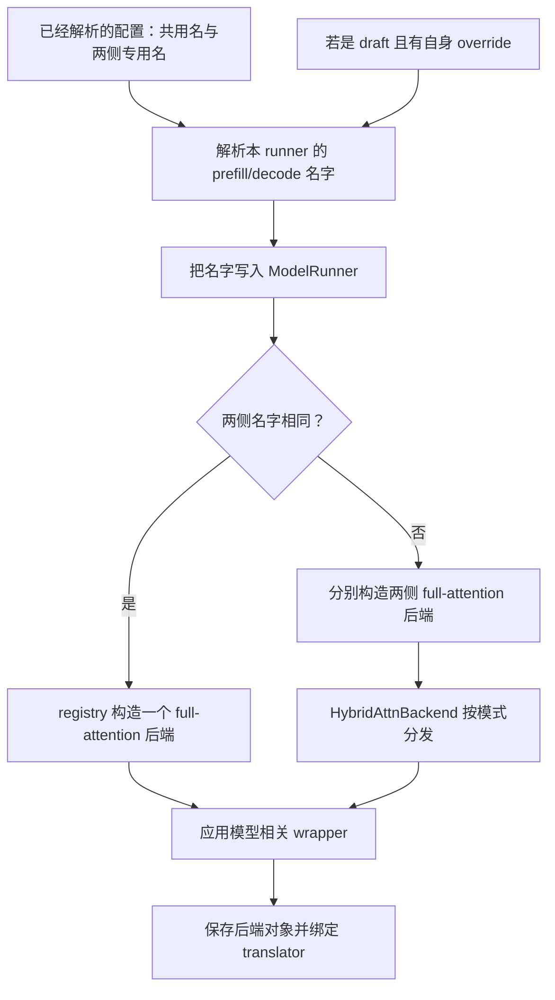
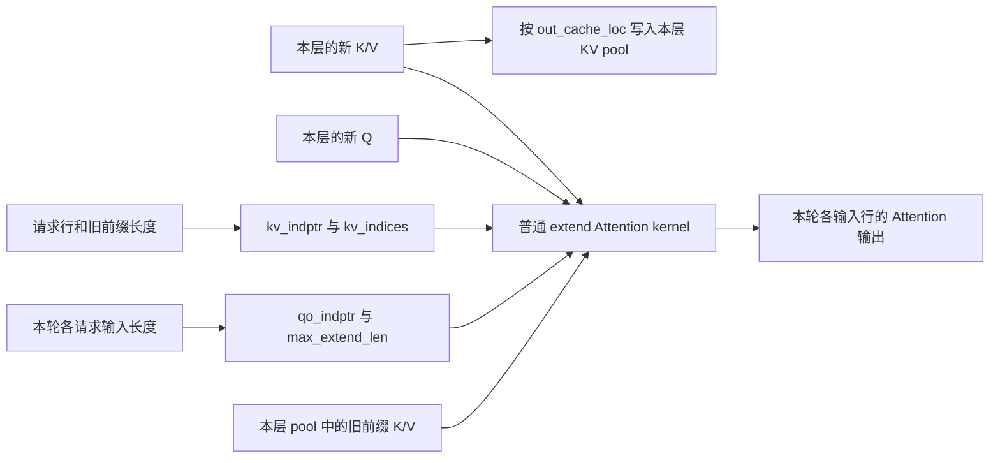
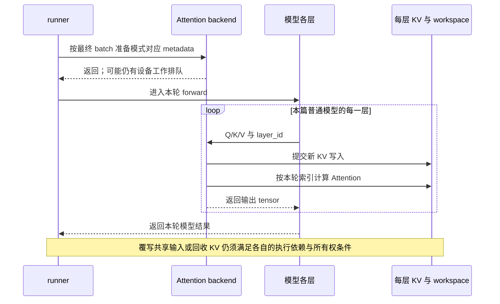

# Attention 后端与执行元数据

> **先建立架构心智模型：** [M06 · 模型执行与算子分层](<../architecture/06-模型执行与算子分层.md>)。先看职责、数据和生命周期，再回到本篇源码细节。

本文是**源码分析型学习资料**。上一篇把一层模型拆到了 Q/K/V 和 KV 读写，本篇补上算子执行前的那张“工作单”：**这批输入属于谁、每个请求有多长、历史存在哪里、应该交给哪个实现计算？**

建议先读 [05-01 Worker 与 ModelRunner](01-Worker与ModelRunner执行边界.md)、[05-02 Llama Forward](02-以Llama为例读懂模型Forward.md)和 [04-01 请求视图与物理槽位](../04-kv-cache/01-请求视图物理槽位与分配器.md)。本篇沿用两请求例子，只展开一个代表后端的普通主线，再指出其他路径改变了哪些条件。

## 0. 阅读基线与范围

| 项目 | 内容 |
| --- | --- |
| 源码路径基准 | SGLang 仓库根目录 `.`；所有源码位置使用仓内相对路径 |
| 分支 | `codex/sglang-source-study-20260909`，基于官方 `main` |
| commit | `72d5c5bb73cadd7ffbf5114e5f81e29d36b6c61a` |
| 读取日期 | `2026-09-10` |
| 工作区状态 | 学习源码 worktree 干净；原源码工作区与 Wiki 既有资料保留 |
| 操作边界 | 只读选择链、Attention 接口、Triton 元数据与代表消费路径；编写和静态检查文档 |
| 基础主线 | 普通文本、代表 Dense decoder、单实例单 rank、eager、无投机；TritonAttnBackend 的普通 causal extend/decode |
| 教学条件 | 静态 MHA KV 池、page size 为 4、无 KV 量化；无 SWA、MLA、DCP、PD、TBO、deterministic 或 Lean 特殊计算路径 |
| 对照范围 | split backend 装配、Unified 地址翻译接口、图外/图内元数据契约；不完整展开各后端实现 |
| 不展开 | Attention 算法的论文证明、所有硬件支持表、图捕获全流程、采样算法、真实模型精度和性能比较 |

选择 Triton 是为了走通一条源码路径，不表示所有部署默认使用它。注册表里存在一个名字，也不等于该实现与任意模型、硬件、池和功能组合都受支持。

固定源码链接支撑**源码事实**；例子的地址、图和账本是**整理者归纳与教学推演**。本次未安装或导入 SGLang，未执行测试、加载权重、运行 Attention 或测量性能；没有运行观察。完整源码准备信息见[系列基线](../README.md)。

## 1. 先把算法、接口和后端分开

**人话版：** “根据查询从历史中取出相关信息”是计算任务；“每层交进来 Q/K/V，交出去结果”是接口；“怎样整理地址、切分工作并调用 kernel”是后端实现。三者相关，但不是同一个对象。

| 层次或术语 | 人话解释 | 在本篇中的位置 |
| --- | --- | --- |
| Attention 计算 | 用 Q 查询 K，并据此组合 V | 本篇只追输入、输出和可见范围，不证明算法 |
| RadixAttention | 模型层调用 Attention 的入口对象 | 携带 layer_id、head 数、维度、缩放等信息，向当前 backend 交接 [S15] |
| AttentionBackend | 准备元数据与执行 Attention 的接口约定 | 不要求所有实现共享一个具体 ForwardMetadata 类型 [S16] |
| registry / factory | 名字到构造函数 / 构造真实对象的函数 | 字符串 `triton` 不是一个已初始化后端 [S7][S8] |
| forward metadata | 本轮计算需要的长度、分界、地址及工作空间 | 后端针对这一批输入准备，不是生成结果 [S19][S21] |
| packed / ragged | 多个长短不同的片段首尾相接存放 | 需要分界数组，不能只看总 token 数 |
| indptr / CSR | 一张分段偏移表 / 用偏移表描述变长行 | `indptr[i]:indptr[i+1]` 表示第 i 个请求的片段 |
| KV index / write loc | 读取历史的地址 / 本轮新增 K/V 的写入位置 | 范围和生命周期不同，不能相互替代 |
| workspace | 算子中间计算使用的临时区域 | 不等于持久 KV，也不等于词表 logits |

`RadixAttention` 这个名字还容易与前缀树混淆。本篇读的是**模型计算接口**；请求前缀匹配、树节点锁和淘汰属于 [04-02 前缀匹配](../04-kv-cache/02-RadixAttention与前缀匹配.md)及后续缓存章节。调用 Attention 接口本身不会证明发生了前缀缓存命中。

## 2. 一个配置名字怎样变成真实后端

### 2.1 先解析模式，再构造对象

`python/sglang/srt/arg_groups/model_override_base.py::attention_backends_of` 分别读取 prefill 和 decode 字段；某一侧未设置时，才回退到共用的 attention_backend。[S2] 这里的输入是配置对象，不要绕过 [01-04 配置解析](../01-getting-started/04-从参数声明到最终生效配置.md)直接把 CLI 原始值当作最终选择。

运行时 `attention_backends()` 从已发布的配置取这对名字。[S3] `resolve_attention_backend_strs` 还处理 draft runner 自己的 override：如果当前是 draft worker 且设置了 draft_attention_backend，就把它同时用于两种模式，不能读取另一个 runner 的配置来代替。[S4]

`ModelRunner.init_attention_backends` 把解析后的两侧字符串先写到 runner，再调用构造流程，最后保存真实对象并绑定/核对该 runner 的 KVIndexTranslator。[S1][S35] **已经有 runner 时，应检查它保存的名字和对象；修改一个全局字符串并不能证明既有对象已重建。**



**图意解读：** 方框表示初始化步骤和对象装配，不是新增进程。图只画普通构造路线；PDMux 的多份后端与 TBO 包装在独立分支创建，[S5] 不要由这张图推断它们只有一个状态对象。

### 2.2 registry 负责查找，工厂仍有条件

| 环节 | 已读行为 | 对阅读的含义 |
| --- | --- | --- |
| `register_attention_backend` | 将名字映射到函数 [S8] | 名字存在只说明能找到构造入口 |
| `_build_full_attention_backend_from_str` | 未注册名抛 ValueError；传递 workspace 选择后调用工厂 [S7] | 先查最终名字，再查构造报错 |
| `create_triton_backend` | 拒绝 is_encoder_decoder，随后构造 TritonAttnBackend [S9] | 不能把普通 decoder 例子推广为 cross-attention 支持 |
| `create_flashinfer_backend` | 根据 use_mla_backend 选择普通或 MLA 类 [S10] | 相同字符串也不保证落到相同类；本篇未展开外部 FlashInfer kernel |
| `attn_backend_wrapper` | 按特殊模型装配额外后端；普通无特殊模型分支返回 full backend [S11] | 模型条件还会改变最终外层对象 |

两侧不同的情况下，`_build_resolved_backend` **先构造两个 full-attention 子后端，再合成 HybridAttnBackend，最后应用一次模型 wrapper**。[S6] 如果每个子后端先各包一层，就可能重复构造混合模型的 linear/sparse 一侧状态；这正是这里明确处理的对象边界。

### 2.3 两种“Hybrid”不要混读

本篇的 HybridAttnBackend 按 **forward mode** 选 prefill 或 decode 子后端；模型 wrapper 可以按**层类型**选择 full、linear 或 sparse 等实现。[S6][S11] 前者不是把一层 Attention 同时执行两次，后者也不是 Prefill/Decode 分离部署。

| 输入模式 | HybridAttnBackend 的选择 |
| --- | --- |
| Decode / Idle | decode 子后端 |
| Target verify | speculative_attention_mode 为 decode 时选 decode，否则选 prefill |
| 其他模式 | prefill 子后端 |

以上来自 `_select_backend`。[S12] eager 元数据初始化和图内/图外初始化都按该选择向子后端转发。[S13] 因而不能用 prefill 的元数据给 decode 子后端“凑合用”；也不能看到 verify 就一律把它归为普通 Prefill。

## 3. 元数据是谁准备、谁消费、谁拥有

**人话版：** Scheduler 已经决定本轮做哪些请求，runner 把这些决定变成可执行输入，Attention backend 再把它整理成自己的“分段地址表”。backend 没有因此获得请求排序、前缀树淘汰或请求收尾的控制权。

在本篇普通 eager 路径中，EagerRunner 的 extend/decode 执行方法在需要时准备元数据，然后进入模型。[S39][S40] 它们包含已有规划、CP、verify 等条件，不能把“每次都重新分配”写成所有路径的定律。完整执行选择见 05-01。

模型每一层通过 `RadixAttention.forward` 向当前 backend 交接 Q/K/V、层对象和 ForwardBatch。[S15] 基类 `AttentionBackend.forward` 对 Idle 返回空形状输出，对 Decode 调 forward_decode，对其他普通模式调 forward_extend；NPU mixed 另有分支。[S14]

| 对象 | 持有者与用途 | 寿命和边界 |
| --- | --- | --- |
| runner 的 backend 对象 | runner 保存；装配后供模型执行使用 | 跨多个 batch 存在，不是一条请求一个 |
| ForwardBatch 字段 | 承载本轮请求行、长度、位置、写位置等输入 | 可能引用复用缓冲区；上一批的 Python 对象仍在不代表字段没被覆盖 |
| Triton ForwardMetadata | backend 保存当前普通执行使用的索引和 workspace [S19][S21] | eager 初始化创建新描述对象，但其中 indptr 可指向预分配切片 |
| 请求到 token 的表 | 请求池维护逻辑位置到 KV ID 的映射 | backend 读取；不负责决定请求何时退役 |
| KVIndexTranslator | runner 的池地址适配对象 [S35] | 把读表转为当前池/算子需要的地址域，不负责挑选请求 |
| 每层 KV pool | 保存历史 K/V；按 layer_id 取 buffer | 生命周期跨 forward，不随 metadata 替换自动释放 |
| attention workspace | backend 准备，kernel 写入/归并中间结果 | 是否可覆写取决于执行依赖，不能凭初始化函数返回判断 |

`ForwardMetadata` 是 Triton 后端自己的 dataclass。基类只约定 `forward_metadata` 可被访问，没有规定每个后端都必须有相同字段或相同布局。[S16][S19]

## 4. 请求、输入与 KV 的坐标

沿用 05-01/05-02 的两个请求：R1 已有 4 个前缀 token，本轮再处理 3 个；R2 没有前缀，本轮处理 3 个。请求池行分别为 7 和 2。地址是教学数字，静态池页长为 4；这里的 ID 是 token 槽位，不是模型词表里的 token ID。

| 坐标 | 本轮 Prefill 示例 | 回答的问题 |
| --- | --- | --- |
| batch 中的请求顺序 | `[R1,R2]` | 第几段属于谁？ |
| 请求池行 | `[7,2]` | 去请求表的哪一行查历史？ |
| packed 新输入行 | R1 占 `[0,3)`，R2 占 `[3,6)` | Q/K/V 中本轮片段从哪里开始？ |
| 请求内逻辑位置 positions | `[4,5,6,0,1,2]` | 当前 token 在各自序列的位置是多少？ |
| 新 KV 写入位置 | `[20,21,22,32,33,34]` | 各层这轮生成的 K/V 写到哪里？ |

positions 是模型执行输入，前篇已追到 RoPE；它不是 qo_indptr，也不是 KV 的物理地址。六个 packed 输入放在相邻行，不意味着 R2 能看到 R1 的内容。

这轮请求表的**有效部分**是：

| 请求 | 请求池行 | 按逻辑位置排列的 token 槽位 | 旧前缀 / 本轮新位置 |
| --- | ---: | --- | --- |
| R1 | 7 | `[4,5,6,7,20,21,22]` | 前 4 个 / 后 3 个 |
| R2 | 2 | `[32,33,34]` | 前 0 个 / 后 3 个 |

请求表可以有更大的分配容量，表中没有列出的尾部不属于这两个请求的有效历史。本篇不推演槽位分配过程；页尾续写与分配责任见 04-01。

## 5. 普通 Prefill：旧前缀和本轮 K/V 分两路

### 5.1 元数据账本

Triton 的普通 extend 分支用 extend_prefix_lens 建历史读索引，用 extend_seq_lens 建 Q/output 分段，取最长 extend 长度作为 max_extend_len。[S21][S22]

| 字段 | 本轮值 | 单位与作用 |
| --- | --- | --- |
| batch_size | `2` | 请求段数 B |
| req_pool_indices | `[7,2]` | 请求池行号 |
| extend_prefix_lens | `[4,0]` | 每个请求已有前缀 token 数 |
| extend_seq_lens | `[3,3]` | 每个请求本轮输入 token 数 |
| seq_lens | `[7,3]` | 本轮计入后各请求总长度 |
| qo_indptr | `[0,3,6]` | packed Q/output 的请求分界 |
| kv_indptr | `[0,4,4]` | **旧前缀**索引的请求分界 |
| kv_indices | `[4,5,6,7]` | 旧前缀 token 槽位流 |
| max_extend_len | `3` | 本轮最长新输入片段 |
| custom_mask / mask_indptr | `None / None` | 普通主线不传额外自定义 mask |
| out_cache_loc | `[20,21,22,32,33,34]` | 六份本轮新 K/V 的写目标 |

最容易算错的是 kv_indptr：这里不是 `[0,7,10]`。普通 paged extend 的历史读表只需要旧前缀；本轮三份和三份新 K/V 已作为当前 tensor 单独传给计算入口。[S21][S25]

R2 的区间是 `kv_indices[4:4]`，长度为零，这是“没有旧前缀”，不是缺失请求。它的新输入仍占 Q/K/V 的 `[3:6]`，可以正常在自己的新片段内做 causal Attention。

### 5.2 谁生成这张读表

`python/sglang/srt/layers/attention/triton_backend.py::TritonAttnBackend._fill_kv_indptr_and_indices` 先将长度做 cumsum 写入 indptr 的后 B 个位置，再调用 translator 填充输出。[S22] 初始 indptr 的第 0 项来自构造时的零值；每轮使用前 B+1 项的视图。[S20]

静态池主线中，`KVIndexTranslator.fill_packed_read_stream` 调用 `create_flashinfer_kv_indices_triton`，`ENTRY_PAGE_SIZE=1`。[S23][S24] 注意函数名含 flashinfer 不等于当前 backend 是 FlashInfer；这是被 Triton 后端复用的地址 gather kernel。

它的静态池行为可以用以下教学伪代码表示，省略并行和掩码细节：

```python
# 相对于源码的教学归纳；不是本次执行的 SGLang 代码。
# lens 在普通 Prefill 为 prefix 长度，在普通 Decode 为累计长度。
for b in range(B):
    row = req_pool_indices[b]
    for p in range(lens[b]):
        kv_indices[kv_indptr[b] + p] = req_to_token[row, p]
```

本例 row 7 取前四项 `[4,5,6,7]`，row 2 取零项。这一步只整理 ID，没有读取对应 K/V 数值，也没有计算 Attention。[S24]

### 5.3 写入与读取在一层里怎样相遇



**图意解读：** 这是普通 Prefill 的数据依赖图。相同的新 K/V 一路供当前片段计算，一路写入池，留给后续轮次。Triton forward_extend 在调用 Attention kernel 前提交 KV 写入；[S25][S27] 箭头不表示 CPU 同步等待，更不是跨 stream 完成证明。

对 R1 的三个 Query，教学上的可见逻辑位置分别为 `[0,4]`、`[0,5]`、`[0,6]`；对 R2 则是 `[0,0]`、`[0,1]`、`[0,2]`。旧前缀由读索引覆盖，新片段由 qo 分界与 causal 条件限制。[S25][S41]

`custom_mask=None` **不表示没有 causal 限制**。普通 decoder 路径中 causal 保持 True；跨注意力、encoder-only 和特定 bidirectional 条件才有另行判断。[S25] 本篇的 constructor 条件已排除 encoder-decoder，不能只看深层分支存在就宣称完整入口支持。

## 6. 下一轮 Decode：读表包含这轮刚写入的一格

### 6.1 从两条末尾输出继续一步

设每个请求把上一轮选出的一个 token 送入这轮模型；这不是重复处理全部 prompt。R1/R2 的逻辑位置为 7/3，新写入槽位为 23/35，总长度变为 8/4。

| 字段 | Decode 值 | 与上一节的区别 |
| --- | --- | --- |
| batch_size / 本轮输入数 | `2 / 2` | 普通 Decode 每请求一个新输入 |
| req_pool_indices | `[7,2]` | 本例请求次序未变 |
| positions | `[7,3]` | 各自的最新逻辑位置 |
| seq_lens | `[8,4]` | 包含当前输入后的累计长度 |
| kv_indptr | `[0,8,12]` | 按完整累计长度分段 |
| kv_indices | `[4,5,6,7,20,21,22,23,32,33,34,35]` | 两个请求的全部有效 KV 地址 |
| qo_indptr / max_extend_len | `None / None` | 此普通 Decode 路径不使用 extend 分段字段 |
| out_cache_loc | `[23,35]` | 只写本轮两个新 token |

同一个 `_fill_kv_indptr_and_indices` 在 Decode 被传入 seq_lens，而不是 extend_prefix_lens。[S21][S22] 读表包含 23 和 35 时，**只是地址已经在表里，不表示这两格的本层内容在 metadata 初始化时就准备好了**。

Triton forward_decode 在调用读池 Attention 之前保存当前 K/V，再把本层 key/value buffer、完整读表和 workspace 交给 kernel。[S26][S27] 所以正常依赖顺序是“确定位置 → 本层产生并写入 K/V → 本层 Attention 读取”，不是“有位置就随时可读”。

### 6.2 attn_logits 为什么不是词表 logits

普通 Decode 元数据还分配以下工作空间。[S21] 令 Nq 为本 rank Query head 数，S 为 max_kv_splits，Dv 为 V head 宽度：

| 字段 | 形状 | 用途 |
| --- | --- | --- |
| attn_logits | `[B,Nq,S,Dv]`，float32 | 分片 Attention 的中间向量结果 |
| attn_lse | `[B,Nq,S]`，float32 | 对应的归一化统计，用于合并分片 |
| num_kv_splits | `[B]`，int32 | 每个请求使用的 KV 分片数量 |

这不是 `[请求数,词表大小]`。代表 standard decode 入口把 attn_logits/attn_lse 先交给分片计算，再交给归并；MHA 与 grouped 路径都有这层组织。[S29][S30][S31] 归并 kernel 根据中间统计重新加权各片段向量，最终写出 Attention 输出。[S32] 它们在模型每层内使用，LM head 的词表 logits 在另一处生成。

num_kv_splits 也不是“本请求跨了多少 KV 页”。`get_num_kv_splits` 根据静态/确定性选项、长度、head 和设备核心信息选择分片；[S28] **不能仅凭本例的 `[8,4]` 编造两个实际分片数或性能结论**。本篇只给形状，不模拟硬件调优。

## 7. ID 的粒度、有效长度与排列不变式

### 7.1 token 地址流与 page table 不是同一种数组

本例 page size 为 4，但 Triton packed kv_indices 每个有效 token 仍占一项。Decode 有效长度为 12，不是 3。页长影响底层布局和寻址，不会自动让本接口变成“一页一个元素”。[S23][S24]

Unified 分支中 translator 还把虚拟地址转换为对应子池的 kernel-facing 地址，并处理 page multiplier；它直接生成 packed stream，而不要求调用者先建一个矩形再展平。[S23] 不能把静态池的“原样取 ID”直接推广到 Unified；完整地址域与回收依赖见 [04-06 容量与整理](../04-kv-cache/06-容量规划碎片与显存回收.md)。

已读 CPU 参考测试用以下关系比较页表和 packed token stream：[S38]

```text
packed[indptr[b] + p] = page_ids[b, p // page_size] * page_size + p % page_size
```

它说明两种**表示**如何在指定布局下对应，不说明所有后端都使用该页表，也不是本次 GPU kernel 验证。静态 gather 调用中的 ENTRY_PAGE_SIZE=1 描述源表条目粒度，不等于本例物理池 page size 被改成了 1。

### 7.2 分配容量不等于可读范围

Triton eager Decode 优先按 seq_lens_sum 分配索引；该 CPU 总数缺失时，源码允许按 `B * max_context_len` 分配上界。普通 extend 也有相应的 prefix CPU 长度缺失回退。[S21]

因此应同时记下 `kv_indices.numel()` 与 `kv_indptr[B]`。比如一个教学缓冲区容量为 20、本轮最后指针为 12，则只有前 12 项有效；后 8 项不能当作历史地址。这里的 20 只是说明容量边界，不是本例代码一定选择的默认容量。

同理，`needs_cpu_seq_lens=False` 是后端对调用者的接口信息，不是“此类永远不碰 CPU 标量”。本类 eager 代码仍会使用可用的 CPU prefix/extend 列表，缺少 extend 列表时还会将 GPU max 转成 Python int。[S20][S21]

### 7.3 用三个等式检查串请求问题

对本篇普通路径，应核对：

1. `len(indptr) == B + 1`，第 0 项为 0，差分等于本次传入的各请求读长度。
2. `indptr[B] <= kv_indices.numel()`，且每段 ID 与对应请求行、对应逻辑区间一致。
3. 普通 Prefill 的 `qo_indptr[B] == sum(extend_seq_lens) == 本轮 Q 行数`；不要要求它等于 prefix 索引数。

如果 Decode 请求改排为 `[R2,R1]`，完整有效流应变成 `[32,33,34,35,4,5,6,7,20,21,22,23]`，指针为 `[0,4,12]`。只有一起重排请求行、长度、Q/K/V、positions 和写位置等对应字段，才仍表示原来的两请求。仅调换请求名字或仅重建一个指针表都会破坏对应关系。

以上是教学不变式，不是声明源码在每个入口都逐项 assert。尤其 `fill_packed_read_stream` 的 bool 返回值表示是否已翻译；静态池的 False 不表示失败，DCP 延后翻译时的 False 也需要结合地址域解释。[S23]

## 8. 初始化返回、图中重放与安全复用是三件事

### 8.1 当前接口把元数据准备放在哪里

| 方法 | 基类契约 | 本篇代表实现的差别 |
| --- | --- | --- |
| init_forward_metadata | eager 默认依次调用 out_graph 与 in_graph [S16] | Triton 覆写为自己的普通 eager 主体 [S21] |
| init_forward_metadata_out_graph | 在 capture 区域外或 replay 前执行；可处理 host/dynamic 工作 [S17] | Triton 处理 capture/replay 的索引缓冲区和 metadata 视图 [S33] |
| init_forward_metadata_in_graph | 可录入图的静态形状 GPU 操作；默认无动作 [S18] | 不能因此假定所有后端都在这里重建全部元数据 |

out_graph 是“图录制区域之外”，不是“只能运行 CPU 代码”。in_graph 的接口说明要求避免 `.item()`、`.cpu()`、`.tolist()` 和动态形状分配；这类 host/dynamic 操作应放在图外。[S17][S18]

Triton 的 out_graph 路径在 capture 时创建 metadata 视图；普通 replay 分支复用该视图，刷新底层缓冲区。[S33] **Python 描述对象复用与本轮索引内容刷新可以同时成立。** 反过来，eager 新建 dataclass 也不表示其所有 tensor 都独立分配。

当前基类已移除旧的 `init_forward_metadata_capture_cuda_graph` / `init_forward_metadata_replay_cuda_graph` 接口约定。[S16] 阅读旧实现或接入树外 backend 时应先核对当前入口，不能只靠旧名字推断 hook 还会被调用。图的完整选择、捕获和重放将在 05-05 展开。

### 8.2 “工作单写好”不是“设备已经用完”



**图意解读：** 这是 host 调用与提交顺序的教学图，没有把返回箭头画成 CUDA 完成事件。一次 metadata 初始化通常供本篇多个层使用，但 K/V 数值属于各层不同 buffer；相同 ID 不表示各层共用同一份数值。

基类 `shared_read_ends` 对 Decode/verify 默认声明 IN_REPLAY，对其他模式默认 UNKNOWN；枚举还区分 PRE_REPLAY、POST_REPLAY 等边界。[S34] 这些是给执行层使用的**共享数据读取边界声明**，不是一个“可释放所有 KV”的开关。UNKNOWN 采用保守范围；不能自行将其缩成 metadata 函数返回时点。

请求取消、旧 batch 是否仍在设备上、缓存是否共享、allocator 何时可重用是别的生命周期条件；见 [03-05 CPU/GPU 依赖](../03-scheduling/05-Overlap中的CPU与GPU依赖.md)和 [04-07 KV 全生命周期](../04-kv-cache/07-KV缓存全生命周期与排障.md)。本篇不从静态调用顺序得出并发安全或 GPU 完成结论。

## 9. 哪些变化需要重新画元数据账本

| 条件 | 已读入口提示 | 本篇边界 |
| --- | --- | --- |
| prefill/decode 后端不同 | Hybrid 按模式选择，model wrapper 在组合后应用 [S6][S12] | 构造逻辑已读；两种真实后端组合未实测 |
| SWA | Triton metadata 有 window 索引、偏移及可能独立 workspace [S19][S21] | 不把全历史读长度直接当窗口读长度 |
| Unified pool | translator 根据池和地址域转换；runner 绑定同一 translator [S23][S35] | 不能按静态池 raw ID 解释所有字段 |
| DCP | init 与 KV 写入存在本地分片路径 [S21][S27] | 本篇无跨 rank 读取与合并证明 |
| Speculative verify/draft | 模式选择、spec_info 索引与 custom mask 有专门分支 [S12][S21] | 普通每请求一个 Decode token 的账本不适用 |
| PDMux / TBO | 构造多份后端或外层封装 [S5] | 不能沿用单个 current metadata 的全部所有权假设 |
| dense fp8、deterministic、MLA one-shot、Lean | forward 与 kernel 入口有独立条件 [S25][S26][S29] | 本篇不以普通 paged extend/standard decode 概括这些实现 |
| 图与分段编译 | metadata 初始化入口、buffer 视图和调用时点不同 [S16][S33] | 留待 05-05；未执行任何捕获或重放 |

## 10. 小白排障地图与源码阅读顺序

| 现象 | 先收集什么 | 优先回到哪里 |
| --- | --- | --- |
| 配了一个名字却进入另一个类 | runner 两侧 resolved name、draft 标志、真实对象和 wrapper 链 | 解析与构造 [S1][S4][S6] |
| 单请求正常，两请求串内容 | 请求顺序、请求行、indptr 差分、每段有效 ID、Q 与写位置对应关系 | 索引生成 [S22][S23][S24] |
| Prefill 无前缀正常，有前缀异常 | prefix/extend/total 三种长度、qo 分界、旧前缀地址与 causal 条件 | 普通 extend [S21][S25] |
| Decode 缺最新 token 的影响 | 位置是否入完整读表、本层新 KV 写入是否先于读取 | Decode 与 KV 写入 [S26][S27] |
| dump 出很长索引尾部或随机 ID | 分配容量、indptr[B]、有效请求数量，是否读取未填尾部 | 上界分配与 gather [S21][S24] |
| 页长改变后读错位置 | token stream/page table 粒度、ENTRY_PAGE_SIZE、translator 的池地址域 | translator 和参考断言 [S23][S24][S38] |
| Prefill/Decode 切换或图重放后异常 | 模式、被选中子后端、metadata 视图、buffer 更新时点 | Hybrid 路由与 out_graph [S12][S13][S33] |
| 中间 attn_logits 形状不似词表 | layer_id、Nq/Dv、分片数、实际 kernel 分支 | Decode 工作空间与归并 [S21][S29][S32] |

先建立“输入是谁”的证据，再讨论 kernel 数值；上述条目是定位顺序，不是每种现象都由索引错误造成。敏感请求内容可以用稳定请求标识和长度替代，核对的重点是对应关系。

| 阅读顺序 | SGLang 仓内源码锚点 | 读完应能回答 |
| --- | --- | --- |
| 1 | `python/sglang/srt/model_executor/model_runner.py::ModelRunner.init_attention_backends` [S1] | 名字什么时候确定，对象保存在哪里？ |
| 2 | `python/sglang/srt/model_executor/model_runner_components/attention_backend_setup.py::_build_resolved_backend` [S6] | 同名、异名和 wrapper 怎样装配？ |
| 3 | `python/sglang/srt/layers/attention/hybrid_attn_backend.py::HybridAttnBackend._select_backend` [S12] | 当前模式落在哪个子后端？ |
| 4 | `python/sglang/srt/layers/attention/triton_backend.py::TritonAttnBackend.init_forward_metadata` [S21] | Prefill/Decode 各用哪种长度？ |
| 5 | `python/sglang/srt/mem_cache/kv_index_translator.py::KVIndexTranslator.fill_packed_read_stream` [S23] | 地址是否翻译，输出粒度是什么？ |
| 6 | `python/sglang/kernels/ops/kvcache/kv_indices.py::create_flashinfer_kv_indices_triton` [S24] | batch 行怎样回到请求表？ |
| 7 | `python/sglang/srt/layers/attention/triton_backend.py::TritonAttnBackend.forward_extend` [S25] | 旧前缀、新 K/V 和输出怎样交接？ |
| 8 | `python/sglang/srt/layers/attention/triton_backend.py::TritonAttnBackend.forward_decode` [S26] | 新写入怎样进入完整历史读取？ |
| 9 | `python/sglang/srt/layers/attention/base_attn_backend.py::AttentionBackend.init_forward_metadata` [S16] | 当前接口怎样分 eager、图外和图内准备？ |

## 11. 已读测试与静态证据边界

| 固定测试入口 | 本篇实际阅读范围 | 能提供的线索与不能证明的内容 |
| --- | --- | --- |
| `test/registered/unit/model_executor/model_runner_components/test_attention_backend_setup.py` [S36][S37] | 两个顶层测试：split 只应用一次 wrapper；相同 resolved name 不回读过时 global name | fake backend 与 mock 构造断言；不是实际模型或 GPU 测试，本次未运行 |
| `test/registered/unit/mem_cache/test_kv_index_translator.py` [S38] | TestReadTableBuild 中 packed_stream_equals_the_rectangle_it_replaces 及其参考构造背景；page size 为 1/4 | 文件明确是 CPU pure-Torch reference；只核对已读断言，不把其他测试或 Triton kernel 记为通过 |

本篇只对所写数值、字段对应、源码路径、符号、固定 commit 行号及 Markdown 结构做静态核对。没有真实 forward、数值对照、并发地址复用、图捕获、显存测量或性能结果；存在测试入口不等于测试已经执行。

## 12. 自测、验收与下一篇

| 问题 | 参考答案 |
| --- | --- |
| 本例 Prefill 的 seq_lens 为 [7,3]，为什么 kv_indptr 不是 [0,7,10]？ | 普通 paged extend 只给旧前缀建历史读表，prefix 是 [4,0]；新 K/V 单独交入，所以是 [0,4,4] |
| R2 的 prefix 索引段为空，能否仍有三行输出？ | 可以；它有三行当前 Q/K/V，按自己的 qo 片段做 causal Attention |
| positions=[7,3] 能不能直接作为 Decode 写槽位？ | 不能；它是逻辑位置，本例写槽位为 [23,35]，需要请求映射与分配结果 |
| page size 为 4，Decode 有 12 个有效 token，packed 流应该有几项？ | 本接口为 12 项；不能将其当作每页一项的表 |
| 分配了 20 项索引而末指针为 12，多出的 8 项能参与 Attention 吗？ | 不能；它们在有效范围之外，可能从未填充 |
| prefill/decode 字符串相同，还需要回读共用原始名字吗？ | 不需要；构造使用 resolved pair，不能让过时 global 值覆盖它 |
| custom_mask=None 或 metadata 返回，分别能说明 causal 关闭或 GPU 完成吗？ | 都不能；causal 是独立条件，设备完成另由执行依赖证明 |
| metadata 引用被替换，是否意味着旧请求 KV 已释放？ | 不是；临时描述、设备读取和持久缓存有各自生命周期 |

**本篇验收：** 能画出从 resolved name 到 backend 对象的装配，手算两轮 qo/kv 分界与读写地址，解释地址已知和数值可读的差别，并把图重放、池翻译及特殊模型条件单独列出。

下一篇为 [05-04《Logits 采样与输出概率》](04-Logits采样与输出概率.md)，从模型输出分数继续追到 penalty、采样与 logprob。返回[系列目录](../README.md)。

[S1]: https://github.com/sgl-project/sglang/blob/72d5c5bb73cadd7ffbf5114e5f81e29d36b6c61a/python/sglang/srt/model_executor/model_runner.py#L1010
[S2]: https://github.com/sgl-project/sglang/blob/72d5c5bb73cadd7ffbf5114e5f81e29d36b6c61a/python/sglang/srt/arg_groups/model_override_base.py#L164
[S3]: https://github.com/sgl-project/sglang/blob/72d5c5bb73cadd7ffbf5114e5f81e29d36b6c61a/python/sglang/srt/runtime_context.py#L2039
[S4]: https://github.com/sgl-project/sglang/blob/72d5c5bb73cadd7ffbf5114e5f81e29d36b6c61a/python/sglang/srt/model_executor/model_runner_components/attention_backend_setup.py#L158
[S5]: https://github.com/sgl-project/sglang/blob/72d5c5bb73cadd7ffbf5114e5f81e29d36b6c61a/python/sglang/srt/model_executor/model_runner_components/attention_backend_setup.py#L69
[S6]: https://github.com/sgl-project/sglang/blob/72d5c5bb73cadd7ffbf5114e5f81e29d36b6c61a/python/sglang/srt/model_executor/model_runner_components/attention_backend_setup.py#L181
[S7]: https://github.com/sgl-project/sglang/blob/72d5c5bb73cadd7ffbf5114e5f81e29d36b6c61a/python/sglang/srt/model_executor/model_runner_components/attention_backend_setup.py#L251
[S8]: https://github.com/sgl-project/sglang/blob/72d5c5bb73cadd7ffbf5114e5f81e29d36b6c61a/python/sglang/srt/layers/attention/attention_registry.py#L43
[S9]: https://github.com/sgl-project/sglang/blob/72d5c5bb73cadd7ffbf5114e5f81e29d36b6c61a/python/sglang/srt/layers/attention/attention_registry.py#L193
[S10]: https://github.com/sgl-project/sglang/blob/72d5c5bb73cadd7ffbf5114e5f81e29d36b6c61a/python/sglang/srt/layers/attention/attention_registry.py#L52
[S11]: https://github.com/sgl-project/sglang/blob/72d5c5bb73cadd7ffbf5114e5f81e29d36b6c61a/python/sglang/srt/layers/attention/attention_registry.py#L353
[S12]: https://github.com/sgl-project/sglang/blob/72d5c5bb73cadd7ffbf5114e5f81e29d36b6c61a/python/sglang/srt/layers/attention/hybrid_attn_backend.py#L63
[S13]: https://github.com/sgl-project/sglang/blob/72d5c5bb73cadd7ffbf5114e5f81e29d36b6c61a/python/sglang/srt/layers/attention/hybrid_attn_backend.py#L106
[S14]: https://github.com/sgl-project/sglang/blob/72d5c5bb73cadd7ffbf5114e5f81e29d36b6c61a/python/sglang/srt/layers/attention/base_attn_backend.py#L249
[S15]: https://github.com/sgl-project/sglang/blob/72d5c5bb73cadd7ffbf5114e5f81e29d36b6c61a/python/sglang/srt/layers/radix_attention.py#L157
[S16]: https://github.com/sgl-project/sglang/blob/72d5c5bb73cadd7ffbf5114e5f81e29d36b6c61a/python/sglang/srt/layers/attention/base_attn_backend.py#L88
[S17]: https://github.com/sgl-project/sglang/blob/72d5c5bb73cadd7ffbf5114e5f81e29d36b6c61a/python/sglang/srt/layers/attention/base_attn_backend.py#L96
[S18]: https://github.com/sgl-project/sglang/blob/72d5c5bb73cadd7ffbf5114e5f81e29d36b6c61a/python/sglang/srt/layers/attention/base_attn_backend.py#L118
[S19]: https://github.com/sgl-project/sglang/blob/72d5c5bb73cadd7ffbf5114e5f81e29d36b6c61a/python/sglang/srt/layers/attention/triton_backend.py#L111
[S20]: https://github.com/sgl-project/sglang/blob/72d5c5bb73cadd7ffbf5114e5f81e29d36b6c61a/python/sglang/srt/layers/attention/triton_backend.py#L149
[S21]: https://github.com/sgl-project/sglang/blob/72d5c5bb73cadd7ffbf5114e5f81e29d36b6c61a/python/sglang/srt/layers/attention/triton_backend.py#L762
[S22]: https://github.com/sgl-project/sglang/blob/72d5c5bb73cadd7ffbf5114e5f81e29d36b6c61a/python/sglang/srt/layers/attention/triton_backend.py#L475
[S23]: https://github.com/sgl-project/sglang/blob/72d5c5bb73cadd7ffbf5114e5f81e29d36b6c61a/python/sglang/srt/mem_cache/kv_index_translator.py#L183
[S24]: https://github.com/sgl-project/sglang/blob/72d5c5bb73cadd7ffbf5114e5f81e29d36b6c61a/python/sglang/kernels/ops/kvcache/kv_indices.py#L9
[S25]: https://github.com/sgl-project/sglang/blob/72d5c5bb73cadd7ffbf5114e5f81e29d36b6c61a/python/sglang/srt/layers/attention/triton_backend.py#L1519
[S26]: https://github.com/sgl-project/sglang/blob/72d5c5bb73cadd7ffbf5114e5f81e29d36b6c61a/python/sglang/srt/layers/attention/triton_backend.py#L2119
[S27]: https://github.com/sgl-project/sglang/blob/72d5c5bb73cadd7ffbf5114e5f81e29d36b6c61a/python/sglang/srt/layers/attention/triton_backend.py#L1486
[S28]: https://github.com/sgl-project/sglang/blob/72d5c5bb73cadd7ffbf5114e5f81e29d36b6c61a/python/sglang/srt/layers/attention/triton_backend.py#L393
[S29]: https://github.com/sgl-project/sglang/blob/72d5c5bb73cadd7ffbf5114e5f81e29d36b6c61a/python/sglang/kernels/ops/attention/decode_attention.py#L1156
[S30]: https://github.com/sgl-project/sglang/blob/72d5c5bb73cadd7ffbf5114e5f81e29d36b6c61a/python/sglang/kernels/ops/attention/decode_attention.py#L1045
[S31]: https://github.com/sgl-project/sglang/blob/72d5c5bb73cadd7ffbf5114e5f81e29d36b6c61a/python/sglang/kernels/ops/attention/decode_attention.py#L1096
[S32]: https://github.com/sgl-project/sglang/blob/72d5c5bb73cadd7ffbf5114e5f81e29d36b6c61a/python/sglang/kernels/ops/attention/decode_attention.py#L904
[S33]: https://github.com/sgl-project/sglang/blob/72d5c5bb73cadd7ffbf5114e5f81e29d36b6c61a/python/sglang/srt/layers/attention/triton_backend.py#L653
[S34]: https://github.com/sgl-project/sglang/blob/72d5c5bb73cadd7ffbf5114e5f81e29d36b6c61a/python/sglang/srt/layers/attention/base_attn_backend.py#L154
[S35]: https://github.com/sgl-project/sglang/blob/72d5c5bb73cadd7ffbf5114e5f81e29d36b6c61a/python/sglang/srt/mem_cache/kv_index_translator.py#L413
[S36]: https://github.com/sgl-project/sglang/blob/72d5c5bb73cadd7ffbf5114e5f81e29d36b6c61a/test/registered/unit/model_executor/model_runner_components/test_attention_backend_setup.py#L26
[S37]: https://github.com/sgl-project/sglang/blob/72d5c5bb73cadd7ffbf5114e5f81e29d36b6c61a/test/registered/unit/model_executor/model_runner_components/test_attention_backend_setup.py#L84
[S38]: https://github.com/sgl-project/sglang/blob/72d5c5bb73cadd7ffbf5114e5f81e29d36b6c61a/test/registered/unit/mem_cache/test_kv_index_translator.py#L228
[S39]: https://github.com/sgl-project/sglang/blob/72d5c5bb73cadd7ffbf5114e5f81e29d36b6c61a/python/sglang/srt/model_executor/runner/eager_runner.py#L273
[S40]: https://github.com/sgl-project/sglang/blob/72d5c5bb73cadd7ffbf5114e5f81e29d36b6c61a/python/sglang/srt/model_executor/runner/eager_runner.py#L244
[S41]: https://github.com/sgl-project/sglang/blob/72d5c5bb73cadd7ffbf5114e5f81e29d36b6c61a/python/sglang/kernels/ops/attention/extend_attention.py#L848
