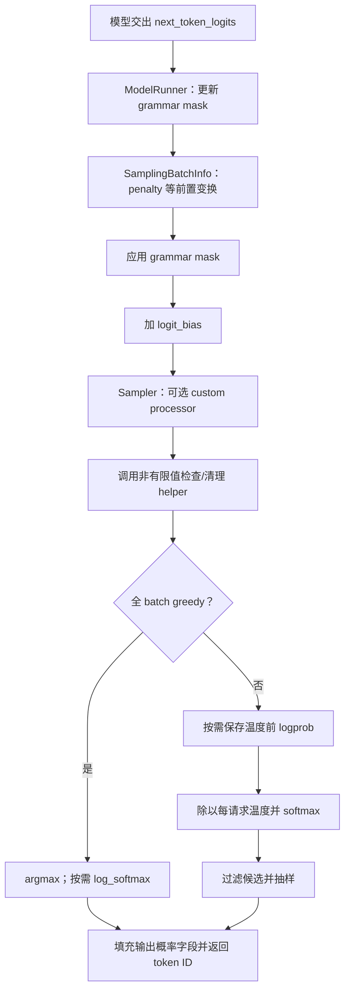
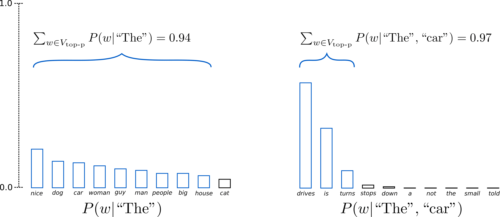
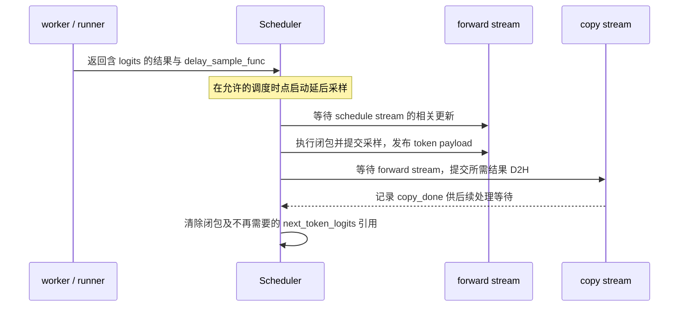

# Logits 采样与输出概率

> **先建立架构心智模型：** [M06 · 模型执行与算子分层](<../architecture/06-模型执行与算子分层.md>)。先看职责、数据和生命周期，再回到本篇源码细节。

本文是**源码分析型学习资料**。上一层模型已经算出了词表分数，但“分数最高”“随机选中”“接口返回的概率”还不是同一件事。本篇沿普通生成路径，回答：**分数怎样被修改，哪些 token 可以被选中，选完后返回的是哪一步的 logprob，哪些计算可以分块或延迟？**

建议先读 [05-02 Llama Forward](02-以Llama为例读懂模型Forward.md)、[02-04 一次 Prefill 到多轮 Decode](../02-request-lifecycle/04-一次Prefill到多轮Decode.md)和 [03-05 CPU/GPU 依赖](../03-scheduling/05-Overlap中的CPU与GPU依赖.md)。词表投影的矩阵计算见 05-02，本篇从它交出的分数继续往后走。

## 0. 阅读基线与范围

| 项目 | 内容 |
| --- | --- |
| 源码路径基准 | SGLang 仓库根目录 `.`；所有源码位置使用仓内相对路径 |
| 分支 | `codex/sglang-source-study-20260909`，基于官方 `main` |
| commit | `72d5c5bb73cadd7ffbf5114e5f81e29d36b6c61a` |
| 读取日期 | `2026-09-10` |
| 工作区状态 | 学习源码 worktree 干净；原源码工作区与 Wiki 既有资料保留 |
| 操作边界 | 只读 logits、采样、penalty、输入/输出 logprob 和结果交接；编写、检查学习文档 |
| 基础主线 | 普通文本、单实例单 rank、非投机、非 beam、非 RL on-policy；选择内置 Sampler 的 PyTorch 过滤路径作为代表 |
| 数值例子 | 四个候选的教学分数、无真实权重；无自定义 processor/grammar、无 observer，sampling_seed=None；未开启 original-logprob 分支 |
| 独立对照 | 单种 penalty、greedy、sampling mask、输入打分分块、Overlap 延迟采样与 scoring-only |
| 不展开 | 各硬件 kernel 的完整实现、随机算法证明、约束生成状态机、投机接受/拒绝、多 rank 精度与复现性验收 |

本次只做静态阅读和教学算术核对，没有安装、导入或运行 SGLang，没有启动服务、加载模型、执行测试或抽样。固定链接支撑**源码事实**；候选、数值、流程图和账本是**整理者归纳**，不是运行观察。源码准备沿用[系列基线](../README.md)，不重新跟随浮动 main。

## 1. 四个对象和三种概率

**人话版：** 模型先交一张候选分数表。采样前可以给某些候选加减分，再用温度调节分数差距，最后限制可选集合并选一个。想解释某个 logprob，必须先说它在哪一步计算。

| 对象或术语 | 人话解释 | 主要责任 |
| --- | --- | --- |
| LogitsProcessor | 把模型 hidden 行变成需要的词表分数 | 选择下一 token 的行；按需计算输入打分 [S1][S2] |
| SamplingBatchInfo | 与当前请求顺序一致的采样参数和状态 | 每请求温度、top-k/p、penalty、mask 等 [S6] |
| Sampler | 修改后的分数到 token ID 的选择过程 | greedy 或抽样，按需提取输出概率信息 [S21] |
| LogitsProcessorOutput | 跨上述步骤填充的结果容器 | 下一 token 分数、输入/输出 logprob、可选采样支持信息 [S3] |
| logits | 不要求归一化的候选分数 | 不是概率，不能相加后当成 1 |
| softmax / logprob | 将分数归一化 / 概率的自然对数 | 零概率的数学 logprob 为负无穷；实际返回还可能有数值处理 |
| support | 当前抽样权重大于零的候选集合 | 与“展示前几个概率”不同 |
| logit_bias / penalty | 指定候选加分 / 按输出历史调整分数 | 都在本篇采样温度之前应用 |

本篇用 `z` 表示**送到温度步骤前、已经完成前置处理的 logits**。普通 PyTorch 随机路径中：[S21][S23]

```text
温度前分布：        p0 = softmax(z)
温度后、截断前分布：p  = softmax(z / temperature)
实际抽样分布：      q  = 过滤后的权重 / 过滤后权重总和
```

通常 `p0`、`p`、`q` 不同。`SGLANG_RETURN_ORIGINAL_LOGPROB` 对应本路径的温度前分布；**original 不表示撤销 penalty、grammar、logit_bias 或自定义处理，回到模型刚交出的分数**。它的缓存位置在 Sampler 前置处理之后。[S7][S8][S11][S21]

## 2. 先明确每一行属于谁

### 2.1 Prefill 与 Decode 的采样行

普通不需要输入 logprob 的 Prefill，用 `cumsum(extend_seq_lens)-1` 选择各请求最后一个 hidden 行，再得到 `[B,V]` 的下一 token logits。[S2] 沿用前两篇的两请求、每请求本轮三行例子，模型主干处理六行，LM head 的普通采样行是 `[2,5]`。

普通 Decode 每请求输入一个 token，模型得到各自下一 token 的分数行；不是把六个 Prefill 输入行都各生成一个输出。[S1][S2] 输入打分开启时，会多保留一些 LM head 行，详见第 7 节。

| 量 | 普通两请求示例 | 不要混成什么 |
| --- | --- | --- |
| 模型本轮输入 T | Prefill 为 6，Decode 为 2 | 不是所有模式下的采样行数 |
| 采样行 B | 2 | 与请求次序对应，不是词表 ID |
| 词表列 V | 教学例子为 4 | 每列才对应一个候选 token |
| temperatures | `[B,1]` | 沿词表列广播，不是每 token 一个独立温度 |
| top_ks / top_ps / min_ps | 各为 `[B]` | 不同请求可以使用不同数值 |
| next_token_ids | 普通每请求一项 | 还未等价于文本增量或请求完成 |

SamplingBatchInfo 从 `batch.reqs` 的同一顺序创建这些参数 tensor。[S6] batch 筛选时参数、penalizer 和相关选项也必须按对应行筛选；`filter_batch` 提供这部分处理。[S50] 仅剩下的 logits 形状正确，不能证明温度或历史没有串到其他请求。

### 2.2 temperature=0 怎么实现

`SamplingParams.__post_init__` 将接近零且非负的 temperature 转为内部 `temperature=1.0, top_k=1`，避免后续直接除以零；`top_k=-1` 则转为表示全词表的 TOP_K_ALL。[S4] 之后 verify 检查温度有限且非负、top_p 在 `(0,1]`、min_p 在 `[0,1]`、内部 top_k 合法等。[S5]

SamplingBatchInfo 的 is_all_greedy 来自所有请求的 top_k 是否都不大于 1。[S6] **全 batch greedy** 可以直接 argmax；**greedy 与随机请求混合**时，整个 batch 走随机/过滤入口，greedy 行通过自身 top_k=1 限制候选。[S21][S23] 不要把一个请求的温度选项写成整个 batch 的执行模式。

## 3. 采样前处理：两个同名 preprocess 各做一段



**图意解读：** 方框表示调用顺序，不是独立进程。图显示本篇 standard 路径；未开启的处理阶段不改变分数。Ascend、RL 和确定性模式有额外分支，不把它们硬塞进这条主线。[S21]

`ModelRunner.sample` 先调用自己的 `_preprocess_logits`，更新 grammar_mask 并调用 SamplingBatchInfo.apply_logits_bias；随后调用 Sampler。[S7][S8] apply_logits_bias 的名字虽然是 bias，实际包含 **penalty → grammar → logit_bias**。[S9][S10]

Sampler 自己的 `_preprocess_logits` 再调用可选 custom processor 和 sanitize_nan_logits。[S11] 后者受环境选项控制，会检测 NaN；启用清理时将 NaN、正/负无穷替换为指定有限大值。[S12] **helper 被调用不证明发生了清理，也不证明模型计算正确**。不能把全非法候选或异常分数问题简单解释成随机性。

上述多处操作原地修改 tensor；standard Sampler 还对 logits 原地除温度，并用 softmax 结果覆盖原存储。[S21] 因而采样之后再去看 `logits_output.next_token_logits`，不能凭字段名把它当成模型刚输出的原始分数。调试或对照若需要多个时点，应分别留存相应快照，并记录额外存储成本。

## 4. penalty 记录的到底是什么

### 4.1 先逐种理解，不虚构组合顺序

本基线的三个常见 penalizer 初始化为空历史，并通过 cumulate_output_tokens 更新；频率使用 scatter_add，presence/repetition 使用 scatter 覆盖对应项。[S13][S14][S15]

| 机制 | 已读行为 | 单独启用的教学例子 |
| --- | --- | --- |
| frequency penalty f | 每出现一次输出 token 就累计 f，应用时从该列减去累计量 | A 已输出两次、f=0.5，就对 A 减 1 |
| presence penalty a | 输出出现后记录 a，重复出现不继续累加 | A 出现一次或两次、a=0.25，都只减 0.25 |
| repetition penalty r | 已输出列存 r；当前分数负则乘 r，否则除 r | r=2 时，2 变 1，-1 变 -2 [S16] |
| min_new_tokens | 输出计数未达到门槛时，对停止 token 施加负无穷处罚 | 达到门槛只是恢复选择机会，不强制立刻停止 [S17] |

设候选 `[A,B,C,D]` 的分数为 `[2,1,-1,0]`，已累计输出次数为 `[2,0,1,0]`。下面每行都**独立从原分数开始**，不是连续叠加实验：

| 单独启用的规则 | 结果 `[A,B,C,D]` |
| --- | --- |
| 无 penalty | `[2,1,-1,0]` |
| frequency=0.5 | `[1,1,-1.5,0]` |
| presence=0.25 | `[1.75,1,-1.25,0]` |
| repetition=2 | `[1,1,-2,0]` |

为什么不在这里列一个所有规则的固定组合公式？普通 orchestrator.apply 按其 penalizer 字典遍历，而构造入口接收的是类集合；不能把文档中的列举顺序当作稳定的执行优先级。[S18][S51] Overlap 的预累积路径则把 additive 与 scaling 分开，由 SamplingBatchInfo 先加再缩放。[S10][S20] **相加与按符号缩放未必可交换，不能由单项算术证明不同执行模式下全部组合等价。**

### 4.2 计数从哪里更新

普通 prepare_for_decode 在需要 penalty 时调用 `cumulate_penalty_output_tokens`。该 helper 取各 Req 最新 output ID；没有 output 时有 origin_input_ids 最后一项的回退。Overlap 下不直接把 batch.input_ids 的 future 占位值当作真实输出。[S19]

因此，这几个类的主线是累计生成输出，不是初始化时对整个 prompt 做一遍词频统计。请求取消、回撤或投机接受路径如何恢复历史，需要单独追踪，不能仅凭 penalty 类名推断。

min_new_tokens 的停止集合来自显式 stop_token_ids、请求 EOS 及 tokenizer 相关停止 ID。[S17] 它与“字符串 stop 已匹配”“max_new_tokens 已到”是不同处理边界；后者属于 [02-06 完成与释放](../02-request-lifecycle/06-完成取消与资源释放.md)。

## 5. 从分布到候选集合：走通 PyTorch 代表路径

### 5.1 softmax 之后先分简单/过滤两类

不需要 top-k、top-p、min-p 时，`_sample_from_probs` 调用 sampling_from_probs_torch；它又区分普通抽样、可选的 Gumbel 实现和带 seed 路径。[S22][S24] 本篇不执行这些随机操作，不给出“必然抽到某 token”的伪结果。

需要过滤时，本篇选择 `top_k_top_p_min_p_sampling_from_probs_torch`：[S23]

1. 按概率降序排序，保留“排序位置 → 原 token ID”的映射，同时计算累计和。
2. 将排序位置大于等于每行 top_k 的权重置零。
3. 按代码的 `(probs_sum - probs_sort) > top_p` 条件置零。对仍活跃的候选，这对应它之前的累计质量超过阈值；不是简单删除所有“累计和超过阈值”的候选。
4. 若启用 min_p，再删除小于“当前最高权重 × min_p”的候选。
5. 从剩余权重中选择排序位置，然后映射回词表 token ID。

本实现先计算累计和再改权重，不是在每次 top-k 后都重新 softmax。等号边界与并列分数也应按实际实现检查；不要把教学规则替换成另一份库的过滤代码。本篇数值例子避开分数并列和 top_p 等号边界。

采样用 top_k 与返回概率的 top_logprobs_nums 也不同：前者改变可选集合，后者只决定从所记录的 logprob 表展示多少列。[S23][S26]

### 5.2 两请求的完整数值账本

候选 ID 0—3 分别称为 A、B、C、D。设以下是已经完成采样前处理、即将送入温度步骤的分数：

| 请求 | 分数 z | temperature | top_k | top_p | min_p |
| --- | --- | ---: | ---: | ---: | ---: |
| R1 | `[ln(25),ln(9),ln(4),0]` | 2 | 3 | 0.6 | 0 |
| R2 | `[0,2,1,-1]` | 1 | 1 | 1 | 0 |

R1 是随机请求，R2 是 greedy 行，故此 batch 的 is_all_greedy=False。各行仍使用自己的阈值。

R1 除以温度 2 后，指数权重为 `[5,3,2,1]`，总和为 11。下面是实际过滤前后的教学推导：

| 候选 | 温度后概率 p | 自己之前的累计概率 | top-k 后 | top-p=0.6 后权重 |
| --- | --- | --- | --- | --- |
| A | `5/11` | `0` | 保留 | `5/11` |
| B | `3/11` | `5/11` | 保留 | `3/11` |
| C | `2/11` | `8/11` | 保留 | `0` |
| D | `1/11` | `10/11` | 删除 | `0` |

剩余质量为 `8/11`，所以实际抽样分布 q 为 `[5/8,3/8,0,0]`。**B 是使累计质量越过 0.6 的那个候选，仍被保留**；不能写成“所有跨过 top_p 的 token 都删掉”。

若只把 R1 的 min_p 改为 0.7，则阈值为 `(5/11)×0.7=3.5/11`，B 的 `3/11` 也被删除，最后只剩 A。min_p 是相对于最大候选的阈值，不是保留“累计概率至少为 min_p”的前缀。

R2 的温度后概率最高项是 B，top_k=1 后只留下 B。其普通未截断概率约为 0.643914，但截断后的实际选择概率为 1。这里有确定候选不等于原始 softmax 是 one-hot。

### 图解补充：候选数随概率集中程度改变



[查看原尺寸](../../../images/sglang-source-study/15-top-p.png)（手机查看宽图时可横屏或放大）。

**图意解读：** 两幅图都按概率排序，蓝色区域累计到阈值后停止扩展。分布越集中，达到同一阈值通常需要的候选越少；边界 token 会使累计值略超过阈值。

**对应本篇源码：** 沿本节 PyTorch 代表路径核对候选过滤、边界与归一化；随后再比较返回 logprob 使用的是哪张概率表。 [源码：python/sglang/srt/layers/sampler.py][S11]

**来源与边界：** [How to generate text: using different decoding methods for language generation with Transformers](https://huggingface.co/blog/how-to-generate)，Patrick von Platen / Hugging Face，2020-03-01；页面注明 2023-07 更新。这是 top-p 的概念示意，不是本系列实测分布。保留边界、重新归一化以及与 top-k 的组合顺序按正文对应后端核对。 [来源档案 F15](../../../images/sglang-source-study/SOURCES.md#f15)。

## 6. 返回的 logprob 究竟取哪张表

### 6.1 普通输出 logprob 与采样 logprob

在本篇 PyTorch 过滤实现中，sort 得到过滤权重的新 tensor，调用者保留的 probs 仍是温度后、截断前分布。[S21][S23] 默认输出 logprob 来自这张表；启用 original 分支时，改用温度前缓存的 log_softmax。

假设 R1 这次选中了 B，只用于演示读哪一列，**不是本次执行过抽样**：

| 记录口径 | B 的概率 | B 的 logprob，约值 | 对应含义 |
| --- | --- | --- | --- |
| 温度前 p0 | `9/39` | `-1.466337` | original 分支的时点；仍已经过前置处理 |
| 温度后、截断前 p | `3/11` | `-1.299283` | 本篇普通 next_token_logprobs 的口径 |
| 截断后 q | `3/8` | `-0.980829` | 实际候选集合上的采样概率 |

这些数字不同不是自动意味着错误，而是记录时点不同。也不能把 `exp(next_token_logprobs)` 一律当作实际动作分布里的概率。

Sampler.forward 中的全 greedy 分支按需对分数做 log_softmax，不会因为 argmax 选中 B 就把普通返回 logprob 写成 0。[S21] 只有单候选实际采样分布的 logprob 才是 `ln(1)=0`。

### 6.2 三类输出查询如何提取

`OutputLogprobProcessor.compute_logprobs` 从 Sampler 交入的 logprob 表提取结果，并将极小的负值 clamp 到该 dtype 的有限最小值以避免返回负无穷。[S25]

| 请求的结果 | 提取方式 | 结果形状/结构 |
| --- | --- | --- |
| 选中 token 的 logprob | 按 batch 行与 next_token_ids gather | 每请求一项 |
| top_logprobs | 先按全 batch 最大 k 做 topk，再按每请求自己的 k 切片 [S26] | 每请求长度可不同 |
| 指定 token_ids_logprobs | 按本请求给出的 ID 列表取相应列 [S27] | 依指定列表排列；不代表这些 ID 都可被抽到 |

`LogprobResult.write_output_to` 将这些字段写回同一个 LogitsProcessorOutput。[S28] top-logprob/指定 ID 的值可以暂留为设备 tensor；容器已经填字段，不等于已变成 CPU JSON。

可选 `return_sampling_mask` 走另一条记录路线：保存过滤后的正权重 support 和选中权重，计算 `log(selected_weight / support_mass)`，再写 next_token_sampling_mask_idx 与 next_token_sampling_logprobs。[S29] 对全 greedy batch，记录的支持集合只有选中 ID，采样 logprob 为 0。[S30]

本篇 R1 应得到 support `{A,B}`，假设选中 B，则采样 logprob 为约 -0.980829；R2 的 support 为 `{B}`，采样 logprob 为 0。该可选路径会做额外检查和 CPU 列表转换，[S29] 不能写成没有开销，也不能和普通 logprob 的延迟拷贝一概而论。

## 7. 输入 logprob：用前一行预测后一 token

### 7.1 输入打分不是又生成了一段文本

模型在看到位置 i 后产生下一位置的分数。要为已经给定的输入 token 计算条件概率，必须用前一行的 logits 去取该 token 的列。

这里另用一个包含 ID 10、20、30 的词表说明位置关系。输入 ID 为 `[10,20,30]` 时，输入打分所需目标 ID 依次为 `[20,30,0]`；最后的 0 是本段越界时的占位，不是发现输入里真的多了一个 token。[S36] 普通结果整理会对齐输入序列，在起点放 None，并去掉最后那项占位对应值。[S37] 本例起点为 0，因此得到 `[None, log P(20|10), log P(30|10,20)]`。

首项 None 表示该记录没有前一位置提供的条件分数，不是概率为零。缓存前缀、指定 logprob_start_len 与跨 Prefill chunk 的输入区间要按实际请求边界核对，不能把本例三个 ID 原样套到所有分段。

### 7.2 四套索引为什么需要同时存在

LogitsMetadata.from_forward_batch 根据当前模式和 return_logprob 判断是否需要 extend 输入打分，并计算各请求保留的打分长度。[S31] `_get_pruned_states` 随后准备：[S2]

| 名称 | 回答的问题 |
| --- | --- |
| pruned_states | 哪些 hidden 行需要进入 LM head？ |
| sample_indices | 保留下来的行里，哪些负责下一 token 的生成？ |
| input_logprob_indices | 保留下来的行里，哪些要计算输入打分？ |
| token_to_seq_idx | 每个保留行属于哪条请求，供分块结果拼接使用？ |

为了单独看清这个分支，使用一个新教学 batch：R1 本轮 extend_len=4、内部相对 start_len=0；R2 的 extend_len=2、start_len=2，表示 R2 本轮没有输入打分行，但仍要保留最后行用于生成。这里的 start_len 是已经换算后的内部值，不是直接抄 API 参数。

| 对象 | 值 |
| --- | --- |
| 原始 packed hidden 行 | R1 为 `[0,1,2,3]`，R2 为 `[4,5]` |
| 保留的原始行号 | `[0,1,2,3,5]` |
| sample_indices | `[3,4]` |
| input_logprob_indices | `[0,1,2,3]` |
| token_to_seq_idx | `[0,0,0,0,1]` |
| 每请求输入打分行数 | `[4,0]` |

R2 的“零输入打分行”不能让它从整个结果中消失；其 sample_indices 仍指向保留后的第 4 行。最后一行同时是否属于输入打分，要看各自请求范围，不要只按“每请求最后一行”删掉所有相关数据。

### 7.3 分块减少的是词表分数的瞬时规模

InputLogprobProcessor.forward 根据开关、保留行数和 chunk size 决定分块；DP attention 的指定路径强制单块，避免不同 rank 因行数不同产生不一致的 collective 次序。[S32][S33]

对上例五个保留行，教学 chunk_size=2：

| 分块 | 保留行区间 | 输入打分行 | 需要保存的生成 logits |
| --- | --- | --- | --- |
| C0 | `[0,2)` | `[0,1]`，属于 R1 | 无 |
| C1 | `[2,4)` | `[2,3]`，属于 R1 | R1 的行 3 |
| C2 | `[4,5)` | 空，R2 本轮不打输入分 | R2 的行 4 |

`_forward_by_chunk` 对每块调用 LM head 回调，先把命中的 sample 行复制到独立 sampled_logits，再处理输入打分行。[S34] 因此 C2 不能因为“没有输入 logprob”就跳过整块。请求拼接的结束行使用块内最后一项的归属，不能误取下一块第一行造成重复请求记录。

多块计算时源码要求每块拥有自己的 logits 输出，不写入可能被另一块复用的共享图 logits buffer；同时持续维护跨块的 top-logprob/指定 ID 拼接长度。[S34] 这项优化不是 [03-04 Chunked Prefill](../03-scheduling/04-ChunkedPrefill与长请求调度.md)：本节是在 hidden 已算出后分块做词表投影/概率提取，并未重新切模型层或重新做 Attention。

### 7.4 fast input logprob 省掉了什么

输入打分可以完整 log_softmax，也可在 fast 路径中保留原 logits，只计算每行 normalizer 和需要的列/top-k。[S32][S34] 其稳定形式为：[S35]

```text
row_max = 该行最大分数
row_log_sum = log(sum(exp(logit - row_max)))
某 token 的 logprob = (该 token 的 logit - row_max) - row_log_sum
```

这省去的是完整词表 log-softmax 结果的物化，不表示完全不算词表 logits。保留 row_max 与 row_log_sum 两项也有数值意义，避免很大的共同偏移吞掉归一化项。[S35]

当前构造逻辑在 deterministic 模式下不启用 fast input 路径，以保留指定 log_softmax 计算路线。[S32] 数学等价不等于浮点逐位相同；本次没有做 fast/reference 数值实验。普通输入打分也没有经过本篇生成 Sampler 的 penalty/temperature/截断流程，不能用任意变换后的输出 logprob 直接做相等断言。[S1][S34]

## 8. 哪些工作可以延后，什么时间才可读

### 8.1 模型 forward 返回时可以还没有采样

TpModelWorker.forward_batch_generation 在非投机 Overlap 且满足 grammar 或 delay-sample 条件时，把采样封装成 delay_sample_func，先返回 GenerationBatchResult。[S38] 这里闭包持有 logits_output 和 forward_batch；**已经拿到模型结果不表示 next_token_ids 已经选好**。



**图意解读：** 这是 `launch_batch_sample_if_needed` 和 copy_to_cpu 的 host 调用/依赖组织，[S39][S40] 不是实测 trace。copy_done 的记录不是“CPU 可以立即读”；实际结果处理仍需满足事件等待。完整 Overlap 结果生命周期见 03-05。

延迟的一个原因是约束状态与上一批输出处理有关；ModelRunner 在采样时更新 grammar mask，应用后清空该 GPU mask 引用。[S8] Scheduler 完成延迟采样和拷贝安排后，也清空闭包及大 logits 引用，避免它们被结果队列继续持有。[S39] Python 释放引用与设备最后一次访问之间的安全性还依赖拷贝 helper 和 stream 记录，不应从“赋值 None”单独推断 GPU 已经用完。

### 8.2 概率信息可以先留在设备上

输出 logprob 提取常以 no_copy_to_cpu=True 获取小结果，[S25][S26][S27] GenerationBatchResult.copy_to_cpu 再按需复制选中 ID、输入/输出 logprob 和相关返回字段并记录完成事件。[S40] 只需少数概率列时，不需要把整个 `[B,V]` 表当成 API 响应复制出去。

但可选 sampling mask 路径本身有 `.item()` 检查和 `.cpu().tolist()`；[S29] 它的开销与等待时点应独立记录，不能宣称所有采样附加信息都统一异步回传。

### 8.3 scoring-only 不应伪装成生成

prefill-only 请求可以不做下一 token 抽样。worker 创建占位 ID，并在需要时进入 ModelRunner.compute_logprobs_only。[S38][S41] 对应 OutputLogprobProcessor 处理的是 log_softmax、top-logprob/指定 ID 查询，不走普通温度与候选截断抽样。[S42]

该入口也有实际 gate：runner 先检查 token_ids_logprobs，worker 还要求 return_logprob 和可用 next_token_logits。[S38][S41] 不能只看到 helper 支持 top-logprobs 就声称每一种 scoring-only 参数组合都会调用它。占位 ID 不是用户真实获得的生成 token；multi-item scoring 等另有分支，本篇不展开。

## 9. 代表路径之外，哪些条件会改变结论

| 条件 | 已读行为 | 需要保留的边界 |
| --- | --- | --- |
| 自定义 sampler | create_sampler 优先查注册工厂并检查返回类型 [S43] | 配置名不是所有实现都共用本篇算法的保证 |
| FlashInfer 过滤 | 有 joint top-k/top-p 及 min-p 分支 [S22] | 本篇只读调用侧，不证明外部 kernel 的边界/tie 语义与 PyTorch 完全相同 |
| Ascend | 可以从 logits 进入特定采样分支 [S21] | 不套用本篇 softmax tensor 的原地别名结论 |
| deterministic / sampling_seed | SamplingBatchInfo 按确定性配置创建 seed；带 seed helper 组合 seed、位置和列索引 [S6][S44] | 只在请求写 seed 不等于全部执行链可复现；未验证不同设备或 batch 组合 |
| min_p 与 seed | 本篇 PyTorch helper 对同时使用给出 assert [S23] | 存在算法选项不表示所有组合可用 |
| RL on-policy | sampler 有 bf16 温度处理和 log_softmax 特定路径 [S21] | 不以普通概率数值与训练端逐位对齐 |
| TP token 同步 | 满足环境/grammar 条件时对 token ID 做 collective [S45] | 本篇单 rank；不证明多 rank token/logprob 全链一致 |
| return_sampling_mask | 额外保存支持集合与截断后采样 logprob [S29][S30] | 与 top_logprobs 不同，需考虑候选规模和额外拷贝 |
| penalty 多规则组合 | 非 Overlap 直接遍历与预累积路径不同 [S18][S20] | 单项公式不能证明所有组合顺序等价 |
| 输入 logprob fast / chunk | 改变中间物化、归一化与拼接路线 [S32][S33][S34] | 不等于模型 Prefill 分块，也不自动证明峰值显存或数值收益 |

## 10. 排障地图与阅读路线

| 现象 | 先核对的证据 | 主要入口 |
| --- | --- | --- |
| 温度为 0 却看到内部值为 1 | top_k 是否已归一化为 1、batch 是否混合模式 | SamplingParams / SamplingBatchInfo [S4][S6] |
| 返回概率与实际候选概率不一致 | 温度前后、截断前后、original 开关、是否请求 sampling mask | Sampler.forward [S21] |
| 关闭/开启 top_logprobs 后怀疑候选数变化 | top_ks 与 top_logprobs_nums 是否混淆 | 过滤与输出查询 [S23][S26] |
| 多请求 penalty 或温度错配 | 当前行顺序、参数、penalty 历史及 filter 索引 | SamplingBatchInfo [S6][S50] |
| repetition 让负分更低 | 当前分数符号和乘/除规则 | apply_scaling_penalties [S16] |
| 再次查看 logits 发现变成概率 | 是否已被原地除温度与 softmax 覆盖 | Sampler.forward [S21] |
| 输入 logprob 长度/位置错一格 | 输入目标 ID 的右移、占位、起点与最终对齐 | prepare_for_extend 与结果处理 [S36][S37] |
| 输入 logprob 分块后少请求或重复 | sample/input 两套索引、零打分行、块内最后行归属 | InputLogprobProcessor [S34] |
| 延迟采样时结果为空或内存留存 | 闭包是否执行、token 是否发布、D2H 事件与引用释放 | worker / Scheduler [S38][S39][S40] |
| 固定 seed 仍不符合预期 | seed 是否传入、逻辑位置、实际 sampler 路径、精度与设备 | SamplingBatchInfo / seed helper [S6][S44] |

建议按以下顺序阅读，每个函数都先回答“它在整条链路里改变了什么”：

| 顺序 | SGLang 仓内源码锚点 | 读完应能回答 |
| --- | --- | --- |
| 1 | `python/sglang/srt/layers/logits_processor.py::LogitsProcessor.forward` [S1] | 哪些分数交给采样，哪些交给输入打分？ |
| 2 | `python/sglang/srt/model_executor/model_runner.py::ModelRunner.sample` [S7] | 采样前处理与 Sampler 怎样衔接？ |
| 3 | `python/sglang/srt/sampling/sampling_batch_info.py::SamplingBatchInfo.apply_logits_bias` [S9] | penalty、grammar、bias 按什么层次处理？ |
| 4 | `python/sglang/srt/layers/sampler.py::Sampler.forward` [S21] | greedy、温度、原地写和 logprob 时点在哪里？ |
| 5 | `python/sglang/srt/layers/sampler.py::top_k_top_p_min_p_sampling_from_probs_torch` [S23] | 支持集合如何变化，如何映射回原 ID？ |
| 6 | `python/sglang/srt/layers/logprob_processor.py::OutputLogprobProcessor.compute_logprobs` [S25] | 哪张表的哪些列最终被返回？ |
| 7 | `python/sglang/srt/layers/logprob_processor.py::InputLogprobProcessor._forward_by_chunk` [S34] | 输入打分的内存与请求拼接怎样组织？ |
| 8 | `python/sglang/srt/managers/scheduler.py::Scheduler.launch_batch_sample_if_needed` [S39] | 延迟采样、结果拷贝与引用退役怎样衔接？ |

## 11. 已读测试与证据边界

| 固定测试文件 | 本篇实际阅读范围 | 限制 |
| --- | --- | --- |
| `test/registered/unit/sampling/test_sampling_batch_info.py` [S46] | TestApplyLogitsBias 的 8 条测试及最小 fixture：additive、bias、grammar、orchestrator、无变换与 observer 边界 | CPU/mock 测试，仅阅读；不覆盖全部 penalty 顺序组合或真实模型 |
| `test/registered/unit/layers/test_logprob_chunk_stitching.py` [S47] | 完整文件的两条 sweep 测试及 fixture；零输入打分请求、跨块结果与 sampled logits 对照 | CPU 随机张量和注入 logits 回调；本次未执行，不是端到端模型验收 |
| `test/registered/sampling/test_sampling_mask.py` [S48][S49] | TestSamplingMaskCapture 的 mixed hard-exclusion 和 PyTorch requested-row compaction 两条测试及 setup | 使用 CUDA tensor；仅阅读这两条，不把同文件服务测试或其他后端视为已验证 |

本篇的概率、penalty 和分块数组仅用 Python 标准库核对教学算术；没有导入 torch/SGLang，没有调用随机采样、运行测试或验证精度/性能。文档完成检查包括固定源码符号、链接、表格和 Mermaid 文本；不声称完成所有预览环境的图形渲染。

## 12. 自测、验收与下一篇

| 问题 | 参考答案 |
| --- | --- |
| R1 的温度后概率为 [5,3,2,1]/11，top_k=3、top_p=0.6 后保留谁？ | A、B；B 自己之前的累计质量 5/11 未超过 0.6 |
| 若 R1 选中 B，普通输出 logprob 与实际采样 logprob 各是多少？ | 本篇分支分别为 ln(3/11) 与 ln(3/8)；不是同一张分布 |
| original logprob 能否证明拿到未经 penalty 的模型分布？ | 不能；该缓存位于温度前，但在前置变换之后 |
| greedy 选中 B 后，普通 next_token_logprobs 一定是 0 吗？ | 不一定；普通字段可以记录 log_softmax，实际单候选采样 logprob 才是 0 |
| 输入 [10,20,30] 为什么用目标 [20,30,0]？ | 各行预测下一 token；最后 0 为越界占位，普通结果再对齐并去除 |
| 某块没有输入打分行，可以跳过 LM head 吗？ | 不一定；示例 C2 仍要保存 R2 的下一 token logits |
| 分块算 input logprob 是否等于 Chunked Prefill？ | 不是；这里 hidden 已得到，分块的是词表投影和概率提取 |
| forward 返回与采样返回、D2H 可读是否一个时点？ | 不是；延迟闭包与 stream/event 依赖分别控制这些边界 |

**本篇验收：** 能从 `[B,V]` 分数追到每请求 token ID，给每个 logprob 标注处理时点，手算候选过滤与概率重归一化，并解释输入打分分块、延迟采样和结果可读的边界。

下一篇为 [05-05《CUDA Graph、编译与执行模式》](05-CUDAGraph编译与执行模式.md)，继续分析执行模式选择、捕获/重放和共享缓冲区。返回[系列目录](../README.md)。

[S1]: https://github.com/sgl-project/sglang/blob/72d5c5bb73cadd7ffbf5114e5f81e29d36b6c61a/python/sglang/srt/layers/logits_processor.py#L428
[S2]: https://github.com/sgl-project/sglang/blob/72d5c5bb73cadd7ffbf5114e5f81e29d36b6c61a/python/sglang/srt/layers/logits_processor.py#L532
[S3]: https://github.com/sgl-project/sglang/blob/72d5c5bb73cadd7ffbf5114e5f81e29d36b6c61a/python/sglang/srt/layers/logits_processor.py#L178
[S4]: https://github.com/sgl-project/sglang/blob/72d5c5bb73cadd7ffbf5114e5f81e29d36b6c61a/python/sglang/srt/sampling/sampling_params.py#L163
[S5]: https://github.com/sgl-project/sglang/blob/72d5c5bb73cadd7ffbf5114e5f81e29d36b6c61a/python/sglang/srt/sampling/sampling_params.py#L223
[S6]: https://github.com/sgl-project/sglang/blob/72d5c5bb73cadd7ffbf5114e5f81e29d36b6c61a/python/sglang/srt/sampling/sampling_batch_info.py#L87
[S7]: https://github.com/sgl-project/sglang/blob/72d5c5bb73cadd7ffbf5114e5f81e29d36b6c61a/python/sglang/srt/model_executor/model_runner.py#L1884
[S8]: https://github.com/sgl-project/sglang/blob/72d5c5bb73cadd7ffbf5114e5f81e29d36b6c61a/python/sglang/srt/model_executor/model_runner.py#L1856
[S9]: https://github.com/sgl-project/sglang/blob/72d5c5bb73cadd7ffbf5114e5f81e29d36b6c61a/python/sglang/srt/sampling/sampling_batch_info.py#L295
[S10]: https://github.com/sgl-project/sglang/blob/72d5c5bb73cadd7ffbf5114e5f81e29d36b6c61a/python/sglang/srt/sampling/sampling_batch_info.py#L278
[S11]: https://github.com/sgl-project/sglang/blob/72d5c5bb73cadd7ffbf5114e5f81e29d36b6c61a/python/sglang/srt/layers/sampler.py#L114
[S12]: https://github.com/sgl-project/sglang/blob/72d5c5bb73cadd7ffbf5114e5f81e29d36b6c61a/python/sglang/srt/utils/async_probe.py#L66
[S13]: https://github.com/sgl-project/sglang/blob/72d5c5bb73cadd7ffbf5114e5f81e29d36b6c61a/python/sglang/srt/sampling/penaltylib/frequency_penalty.py#L6
[S14]: https://github.com/sgl-project/sglang/blob/72d5c5bb73cadd7ffbf5114e5f81e29d36b6c61a/python/sglang/srt/sampling/penaltylib/presence_penalty.py#L6
[S15]: https://github.com/sgl-project/sglang/blob/72d5c5bb73cadd7ffbf5114e5f81e29d36b6c61a/python/sglang/srt/sampling/penaltylib/repetition_penalty.py#L18
[S16]: https://github.com/sgl-project/sglang/blob/72d5c5bb73cadd7ffbf5114e5f81e29d36b6c61a/python/sglang/srt/sampling/penaltylib/repetition_penalty.py#L10
[S17]: https://github.com/sgl-project/sglang/blob/72d5c5bb73cadd7ffbf5114e5f81e29d36b6c61a/python/sglang/srt/sampling/penaltylib/min_new_tokens.py#L6
[S18]: https://github.com/sgl-project/sglang/blob/72d5c5bb73cadd7ffbf5114e5f81e29d36b6c61a/python/sglang/srt/sampling/penaltylib/orchestrator.py#L55
[S19]: https://github.com/sgl-project/sglang/blob/72d5c5bb73cadd7ffbf5114e5f81e29d36b6c61a/python/sglang/srt/managers/schedule_batch.py#L3324
[S20]: https://github.com/sgl-project/sglang/blob/72d5c5bb73cadd7ffbf5114e5f81e29d36b6c61a/python/sglang/srt/sampling/sampling_batch_info.py#L261
[S21]: https://github.com/sgl-project/sglang/blob/72d5c5bb73cadd7ffbf5114e5f81e29d36b6c61a/python/sglang/srt/layers/sampler.py#L123
[S22]: https://github.com/sgl-project/sglang/blob/72d5c5bb73cadd7ffbf5114e5f81e29d36b6c61a/python/sglang/srt/layers/sampler.py#L299
[S23]: https://github.com/sgl-project/sglang/blob/72d5c5bb73cadd7ffbf5114e5f81e29d36b6c61a/python/sglang/srt/layers/sampler.py#L717
[S24]: https://github.com/sgl-project/sglang/blob/72d5c5bb73cadd7ffbf5114e5f81e29d36b6c61a/python/sglang/srt/layers/sampler.py#L894
[S25]: https://github.com/sgl-project/sglang/blob/72d5c5bb73cadd7ffbf5114e5f81e29d36b6c61a/python/sglang/srt/layers/logprob_processor.py#L787
[S26]: https://github.com/sgl-project/sglang/blob/72d5c5bb73cadd7ffbf5114e5f81e29d36b6c61a/python/sglang/srt/layers/logprob_processor.py#L86
[S27]: https://github.com/sgl-project/sglang/blob/72d5c5bb73cadd7ffbf5114e5f81e29d36b6c61a/python/sglang/srt/layers/logprob_processor.py#L134
[S28]: https://github.com/sgl-project/sglang/blob/72d5c5bb73cadd7ffbf5114e5f81e29d36b6c61a/python/sglang/srt/layers/logprob_processor.py#L51
[S29]: https://github.com/sgl-project/sglang/blob/72d5c5bb73cadd7ffbf5114e5f81e29d36b6c61a/python/sglang/srt/layers/sampler.py#L479
[S30]: https://github.com/sgl-project/sglang/blob/72d5c5bb73cadd7ffbf5114e5f81e29d36b6c61a/python/sglang/srt/layers/sampler.py#L460
[S31]: https://github.com/sgl-project/sglang/blob/72d5c5bb73cadd7ffbf5114e5f81e29d36b6c61a/python/sglang/srt/layers/logits_processor.py#L284
[S32]: https://github.com/sgl-project/sglang/blob/72d5c5bb73cadd7ffbf5114e5f81e29d36b6c61a/python/sglang/srt/layers/logprob_processor.py#L445
[S33]: https://github.com/sgl-project/sglang/blob/72d5c5bb73cadd7ffbf5114e5f81e29d36b6c61a/python/sglang/srt/layers/logprob_processor.py#L460
[S34]: https://github.com/sgl-project/sglang/blob/72d5c5bb73cadd7ffbf5114e5f81e29d36b6c61a/python/sglang/srt/layers/logprob_processor.py#L493
[S35]: https://github.com/sgl-project/sglang/blob/72d5c5bb73cadd7ffbf5114e5f81e29d36b6c61a/python/sglang/srt/layers/logprob_processor.py#L66
[S36]: https://github.com/sgl-project/sglang/blob/72d5c5bb73cadd7ffbf5114e5f81e29d36b6c61a/python/sglang/srt/managers/schedule_batch.py#L2561
[S37]: https://github.com/sgl-project/sglang/blob/72d5c5bb73cadd7ffbf5114e5f81e29d36b6c61a/python/sglang/srt/managers/scheduler_components/logprob_result_processor.py#L26
[S38]: https://github.com/sgl-project/sglang/blob/72d5c5bb73cadd7ffbf5114e5f81e29d36b6c61a/python/sglang/srt/managers/tp_worker.py#L593
[S39]: https://github.com/sgl-project/sglang/blob/72d5c5bb73cadd7ffbf5114e5f81e29d36b6c61a/python/sglang/srt/managers/scheduler.py#L4510
[S40]: https://github.com/sgl-project/sglang/blob/72d5c5bb73cadd7ffbf5114e5f81e29d36b6c61a/python/sglang/srt/managers/utils.py#L130
[S41]: https://github.com/sgl-project/sglang/blob/72d5c5bb73cadd7ffbf5114e5f81e29d36b6c61a/python/sglang/srt/model_executor/model_runner.py#L1940
[S42]: https://github.com/sgl-project/sglang/blob/72d5c5bb73cadd7ffbf5114e5f81e29d36b6c61a/python/sglang/srt/layers/logprob_processor.py#L818
[S43]: https://github.com/sgl-project/sglang/blob/72d5c5bb73cadd7ffbf5114e5f81e29d36b6c61a/python/sglang/srt/layers/sampler.py#L695
[S44]: https://github.com/sgl-project/sglang/blob/72d5c5bb73cadd7ffbf5114e5f81e29d36b6c61a/python/sglang/srt/layers/sampler.py#L850
[S45]: https://github.com/sgl-project/sglang/blob/72d5c5bb73cadd7ffbf5114e5f81e29d36b6c61a/python/sglang/srt/layers/sampler.py#L647
[S46]: https://github.com/sgl-project/sglang/blob/72d5c5bb73cadd7ffbf5114e5f81e29d36b6c61a/test/registered/unit/sampling/test_sampling_batch_info.py#L149
[S47]: https://github.com/sgl-project/sglang/blob/72d5c5bb73cadd7ffbf5114e5f81e29d36b6c61a/test/registered/unit/layers/test_logprob_chunk_stitching.py#L96
[S48]: https://github.com/sgl-project/sglang/blob/72d5c5bb73cadd7ffbf5114e5f81e29d36b6c61a/test/registered/sampling/test_sampling_mask.py#L50
[S49]: https://github.com/sgl-project/sglang/blob/72d5c5bb73cadd7ffbf5114e5f81e29d36b6c61a/test/registered/sampling/test_sampling_mask.py#L228
[S50]: https://github.com/sgl-project/sglang/blob/72d5c5bb73cadd7ffbf5114e5f81e29d36b6c61a/python/sglang/srt/sampling/sampling_batch_info.py#L318
[S51]: https://github.com/sgl-project/sglang/blob/72d5c5bb73cadd7ffbf5114e5f81e29d36b6c61a/python/sglang/srt/sampling/penaltylib/orchestrator.py#L14
