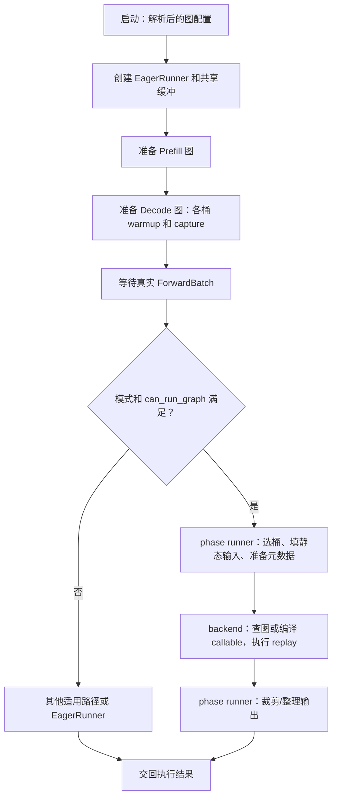
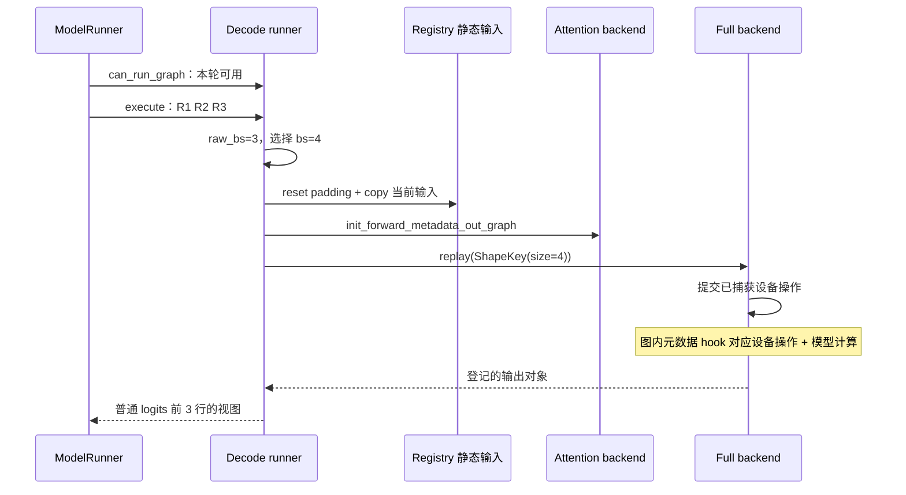

# CUDA Graph、编译与执行模式

本文是**源码分析型学习资料**。模型已经能完成一次 forward，本篇继续回答：**哪些准备工作必须每轮重做，哪些计算可以预先捕获并重放，输入规模变化时怎样选择图，输出何时可以读取或复用？**

建议先读 [05-01 执行边界](01-Worker与ModelRunner执行边界.md)、[05-03 Attention 元数据](03-Attention后端与执行元数据.md)和 [03-05 CPU/GPU 依赖](../03-scheduling/05-Overlap中的CPU与GPU依赖.md)。模型层内计算见 [05-02](02-以Llama为例读懂模型Forward.md)，采样与概率见 [05-04](04-Logits采样与输出概率.md)。

## 0. 阅读基线与范围

| 项目 | 内容 |
| --- | --- |
| 源码路径基准 | SGLang 仓库根目录 `.`；所有源码位置使用仓内相对路径 |
| 分支 | `codex/sglang-source-study-20260909`，基于官方 `main` |
| commit | `72d5c5bb73cadd7ffbf5114e5f81e29d36b6c61a` |
| 读取日期 | `2026-09-10` |
| 工作区状态 | 学习源码 worktree 干净；原源码工作区和 Wiki 既有资料保留 |
| 操作边界 | 只读 runner、graph backend、输入槽位、编译分段与指定测试；编写、检查文档 |
| 基础主线 | CUDA、普通文本 Dense 模型、单实例单 rank、普通 Decode、full backend、每请求一行；关闭投机、LoRA、TBO、PDMux 与 metadata glue graph |
| 教学配置 | 已解析的 Decode 捕获桶为 `[1,2,4,8]`，允许 padding，资源容量足够；这不是默认参数或实测配置 |
| 独立对照 | Prefill 的 token 桶和 eager tail、breakable、tc_piecewise、可选 torch.compile、共享读事件 |
| 不展开 | 编译器优化正确性、全部平台和模型兼容组合、图去重算法、复杂并行/投机拓扑和 GPU 性能验收 |

本次没有安装或导入 SGLang/PyTorch，没有捕获 CUDA Graph、执行模型或运行测试。固定源码链接支撑**源码事实**；图、桶选择和账本是**整理者归纳**。外部概念仅辅助解释，不能替代该 commit 的行为；本篇不重新跟随浮动 main。

## 1. 先分清三种“图”和两种工作

**人话版：** 可以把普通执行理解成“每轮重新发出计算指令”，把捕获理解成“提前记录一段可重复的设备工作”。新请求来了，仍然要准备输入，然后让记录好的设备工作读取新内容。记录的不是上一次回答，也不会省掉模型计算。

| 术语 | 人话解释 | 本篇对应对象 |
| --- | --- | --- |
| eager | 本轮直接调用正常执行路径 | EagerRunner；也可指分段之间直接运行的部分 |
| capture / replay | 记录设备操作 / 再次提交已记录的操作 | CUDAGraph 与 backend 的 capture_one/replay |
| warmup | 捕获前先运行，完成初始化等准备 | Full backend 对每个形状做两次 warmup [S16] |
| bucket | 预先支持的一个规模档位 | Decode 的请求数或 Prefill 的总 token 数 |
| static buffer | 图长期读取或写入的固定存储 | 内容每轮可以变，地址和布局受到约束 |
| ShapeKey | 某份捕获产物的查找键 | size 加 stream/variant/DSA 等维度 [S8] |
| FX graph | 编译流程中表示计算的图 | 供 SGLang 编译 backend 切分和处理 |
| CUDA Graph | 设备操作的捕获产物 | 一个 full 图或若干 piece/segment |
| break point | 有意留在图段之间的 eager 调用 | eager_on_graph 标记的函数 |
| graph pool | 捕获相关分配所用的内存池 | 共享池不等于可以任意并发重放 |

PyTorch 官方说明：CUDA Graph 每次重放使用相同的虚拟地址，捕获的 tensor 大小与布局也受固定形状约束；CPU 工作不会因 CUDA Graph 重放而重新执行。因此需要维护存储寿命，并把新数据写入捕获时使用的地址。[CUDA Graph 语义](https://docs.pytorch.org/docs/2.14/notes/cuda.html#cuda-graphs)

`torch.compile` 的 `fullgraph=True` 约束的是函数能否被追踪为一个编译图；它不等价于“最后只有一个 CUDA Graph”。本篇的 tc_piecewise 可以先得到 FX 图，再按指定算子切成多个设备图段。[torch.compile 参数](https://docs.pytorch.org/docs/2.14/generated/torch.compile.html)、[S37][S38]

外部来源为 PyTorch 官方 2.14 文档，读取于 2026-09-10，仅用于上述概念；**没有据此认定本次 SGLang 安装了 PyTorch 2.14**，本次也没有安装运行环境。

### 图解补充：重放一组工作，减少逐个启动的开销

[查看原尺寸](../../../images/sglang-source-study/16-cuda-launch.png)（手机查看宽图时可横屏或放大）。

**图意解读：** 上半部分 CPU 逐个启动 A—E，GPU 中间留下空隙；下半部分预先建立图后一次发起重放，仍执行 A—E。

**对应本篇源码：** 对照 Decode runner 的 capture/replay 职责；Graph 复用执行安排，真实输入仍须写进匹配的缓冲区。 [源码：python/sglang/srt/model_executor/runner/decode_cuda_graph_runner.py][S3]

**来源与边界：** [Accelerating PyTorch with CUDA Graphs](https://pytorch.org/blog/accelerating-pytorch-with-cuda-graphs/)，Vinh Nguyen、Michael Carilli 等 / PyTorch，2021-10-26；网页另标 2024-11-15 更新。这是 CUDA Graph 的概念图，不是算子融合图，也不是当前 SGLang 的速度测量；能否重放仍取决于形状、地址、数据依赖和所选 runner。 [来源档案 F16](../../../images/sglang-source-study/SOURCES.md#f16)。

## 2. 谁决定执行方式，谁保管图

### 2.1 启动与运行是两条时间线

启动时 `capture_cuda_graphs` 先创建 EagerRunner，再准备 Prefill 图，最后准备 Decode 图；EagerRunner 始终是正常执行和不能走图时的回退入口。这个次序也涉及共享缓冲区的建立。[S2] Decode disabled 的检查在创建 Decode 图 runner 前完成。[S4]

运行时 `ModelRunner._forward_raw` 根据 forward mode、runner 是否存在和 can_run_graph 等条件分流。普通 Decode 命中后直接走 Decode runner；没有命中，继续其他适用分支或 eager。完整 worker/runner 分发已在 05-01 展开。[S5]

**图意解读：** 方框表示组件职责和阶段，不是新进程。上半部分在初始化，下半部分对每个 batch 发生；没有表示 API 接收、tokenizer、采样和网络输出都被一张图捕获。

### 2.2 对象、所有者与生命周期

| 对象 | 主要控制者 | 创建/更新时点 | 使用或释放边界 |
| --- | --- | --- | --- |
| 解析后的 phase 配置 | 配置流水线与启动 helper | 启动解析，容量约束再次收敛 | 声明值不直接等于选中的 backend |
| Decode/Prefill runner | ModelRunner | 初始化时创建，按 phase 管理 | 负责桶、静态输入、元数据和输出形状 |
| backend | phase runner | runner 建立时选择 | 负责每种形状的捕获产物或 compiled callable |
| GraphSlot/registry | phase runner | 注册/分配时建立，每轮 fill | 存储可共享；registry 负责该槽的复制和补齐策略 |
| Full 的 graphs/outputs | FullCudaGraphBackend | capture_one 按 ShapeKey 登记 | replay 返回登记的输出；cleanup 清理引用 [S16][S17][S42] |
| Breakable 的 capture_inputs | BreakableCudaGraphBackend | capture_one 保存输入 owner | 维持相关 Python 对象寿命；cleanup 清理 [S30][S43] |
| 当前输出视图 | runner/调用方 | replay 后裁剪或装入结果对象 | 不自动拥有一份可永久保留的独立副本 |
| shared_read_done_event | runner 发布给上层 | backend 声明的读结束位置 | 用于共享输入读写依赖，不代表输出 D2H 完成 |

`FullCudaGraphBackend.cleanup` 中清理字典、输出 buffer 和 pool 引用，**不能据此推导任意在途 GPU 工作已经完成**。本篇只确认局部对象处理，不把这个方法当成一套独立的并发退役协议。[S42]

## 3. 配置怎么落到实际实现

### 3.1 phase 相同的字段，单位不同

配置结构提供 decode/prefill 两个 phase，backend 取值包括 full、breakable、tc_piecewise、disabled。结构声明中的 Decode 默认是 full，Prefill 默认根据平台选择；模型与平台规则仍可能改变最终配置。[S1]

| 配置/量 | Decode | Prefill |
| --- | --- | --- |
| `bs` / `max_bs` 的规模语义 | 请求 batch 桶 | 聚合 token 桶 |
| 普通每请求输入量 | 1；投机和 DLLM 有另外的宽度 | 每请求本轮 extend 长度可以不同 |
| full 的请求轴容量 | 捕获 bs 对应请求槽 | 另由 full_prefill_max_req 约束 |
| `tc_compiler` | 不能从字段存在推出 Decode tc_piecewise 已实现 | tc_piecewise 当前接受 eager/inductor |

Decode 的最终 capture_bs 还会受请求池容量、对齐宽度和 TBO 等约束，经过过滤、去重和排序；compile_bs 是其中满足 torch_compile_max_bs 等条件的子集。[S9] Prefill 启动 helper 会按请求容量与上下文长度的乘积约束 token 桶；full 的请求槽上限还会受请求池大小限制。[S53]

### 3.2 “配置被接受”与“实现被选择”分开核对

| 条件 | 已读源码行为 | 解释边界 |
| --- | --- | --- |
| CUDA Decode full | 构造 FullCudaGraphBackend | 普通主线 [S6] |
| CUDA Decode breakable | 构造 BreakableCudaGraphBackend | 不是 tc_piecewise 的别名 [S6] |
| CUDA Decode tc_piecewise | 警告尚未实现，回到 full | **不能只看输入配置名** [S6] |
| CUDA Decode disabled | 启动 helper 不创建对应图 runner | 不是让 resolver 返回一种“空图” [S4] |
| Prefill full | Full backend，并启用可适配的输出缓冲复用 | phase runner 控制 body/tail 边界 [S7][S28] |
| Prefill breakable | 分段捕获 backend | eager break 由显式标记决定 [S7][S31] |
| Prefill tc_piecewise | 编译驱动的分段路径 | can_run 还需外层 batch 条件 [S7][S26] |

NPU/XPU 等在选择链中有专门分支；本文 CUDA 对照表不能作为所有平台的兼容矩阵。启用 debug_cuda_graph 的 Decode 捕获路径还会断言 backend 必须为 breakable。[S6][S15]

## 4. 普通 Decode 的捕获：先把可重放工作固定下来

### 4.1 一个 size 不是任何情况下都等于 token 数

普通 Decode 的 captured_req_width 为 1，因此 `num_tokens = bs × 1`。[S3][S49] 投机验证和 DLLM 可以改变宽度；本篇例子不套用这些路径。

ShapeKey 除 size 外还包含 stream_idx、variant_label、dsa_variant。[S8] 普通例子使用 `ShapeKey(size=4)`；LoRA/无 LoRA、不同 stream 或 DSA 变体不能因为 size 同为 4 就认为是同一份捕获产物。

### 4.2 捕获调用链

| 顺序 | 行为 | 源码锚点 |
| --- | --- | --- |
| 1 | 准备捕获 stream/session，恢复 dummy 长度与索引条件 | `python/sglang/srt/model_executor/runner/decode_cuda_graph_runner.py::DecodeCudaGraphRunner.capture` [S11] |
| 2 | 从大桶到小桶遍历，并展开需要的变体 | `python/sglang/srt/model_executor/runner/decode_cuda_graph_runner.py::DecodeCudaGraphRunner._capture_one_stream` [S12] |
| 3 | 可选临时包装 model.forward 为编译 callable | `python/sglang/srt/compilation/torch_compile_decoration.py::patch_model` [S13] |
| 4 | 从 registry 的静态槽切出当前桶，建立 dummy ForwardBatch | `python/sglang/srt/model_executor/runner/decode_cuda_graph_runner.py::DecodeCudaGraphRunner.capture_prepare` [S14] |
| 5 | 图外元数据准备；建立包含图内元数据和模型 forward 的闭包 | `python/sglang/srt/model_executor/runner/decode_cuda_graph_runner.py::DecodeCudaGraphRunner.capture_one_shape` [S15] |
| 6 | 两次 warmup，再在 graph context 中调用闭包；存图和输出 | `python/sglang/srt/model_executor/runner_backend/full_cuda_graph_backend.py::FullCudaGraphBackend.capture_one` [S16] |

从大桶开始便于复用捕获池中的分配，但这里没有测量显存收益。warmup/capture 会真实调用模型 forward，不是只建立 Python 对象；capture 前重置索引的代码也说明不能把此前遗留的 live 地址直接当成 dummy 数据。[S11][S12]

**两个元数据 hook 要分开看：** `init_forward_metadata_out_graph` 在闭包外；`init_forward_metadata_in_graph` 在闭包中。Full backend 文档中的概括不能覆盖这一拆分。当前统一内存池的一些地址转换在图外完成，图读取准备好的物理位置；不同 Attention backend 的具体工作见 05-03。[S15]

### 4.3 Full 图也可以搭配 torch.compile

`patch_model` 在 enable_compile 时返回 `torch.compile(torch.no_grad()(model.forward), ...)`；默认 mode 字符串为 `max-autotune-no-cudagraphs`，允许环境配置改变，退出上下文时恢复相应状态。[S13] 外层仍由 Full backend 捕获 CUDA Graph。

因此要分别记录：**采用哪个捕获 backend**、**捕获的 callable 是否先经编译**。`compile_bs` 命中表示这条包装路径被选择，不是“改走 tc_piecewise”，也不证明编译后必然更快。[S9][S12][S13]

## 5. 三条真实请求怎样进入四行图

### 5.1 先过资格检查，再向上选桶

`DecodeCudaGraphRunner.can_run_graph` 不只检查规模：还检查 replace_embeds、捕获宽度、DP/MLP 同步许可、encoder 长度、TBO 或 ngram 等适用条件。[S18] 本篇已排除这些特例，剩下普通规模选择。

- 允许 padding 时，基础规模检查是 `bs <= max_bs`；之后 load_batch 向上选最近桶。
- 禁止 padding 时，按当前键检查 backend 是否有精确产物。
- `_pad_to_bucket` 使用 bisect_left；超过最大桶会断言，调用者必须先挡住。[S10][S18]

**整理者归纳：** 假设 R1、R2、R3 正在普通 Decode，当前 seq_lens 分别为 11、21、31，请求槽为 7、9、12；本轮 token ID 为 41、52、63，新 KV 写入位置为 101、205、309。数字只用于辨认归属，不是真实池分配结果。

| 量 | 本轮真实值 | 送入捕获图的形状/内容 |
| --- | --- | --- |
| raw_bs | 3 | 捕获 bs=4 |
| captured_req_width | 1 | raw_num_token=3，padded_num_tokens=4 |
| input_ids | `[41,52,63]` | 前三项更新；第四项按该槽策略保留，不统一承诺清零 |
| positions | `[10,20,30]` | `[10,20,30,0]` |
| req_pool_indices | `[7,9,12]` | `[7,9,12,0]` |
| seq_lens / seq_lens_cpu | `[11,21,31]` | `[11,21,31,s]`，s 为 Attention backend 指定的 sentinel |
| out_cache_loc | `[101,205,309]` | `[101,205,309,0]` |
| 普通下一 token logits | 3 个真实请求 | 图产出后取前 3 行交给后续逻辑 |

位置、请求索引和 cache loc 的补齐策略为 ZERO，长度为 FILL_SENTINEL；input_ids 使用默认 FOREACH_COPY，仅更新真实部分。[S21][S22] **第四行是图形状需要的 padding，不是第四个真实请求。** 槽 0 的使用属于 dummy 地址约定，不能推广成任何模型、任何池都可随意覆盖任意地址。

### 5.2 load_batch 的三件事

第一件是选择桶，保存 raw/padded 计数。第二件是 `buffer_registry.fill_from`：先按各槽策略重置尾部，再分组复制当前输入，最后执行 post_fill hook。[S19][S20]

第三件是建立 replay 用的 ForwardBatch 视图并重新准备元数据。普通主线调用图外元数据 hook；可选 metadata glue graph 只在额外条件满足时尝试，不能从名字推断所有 Python 准备步骤都在图内。[S19][S50]

这个元数据视图也不是“把所有字段全部换成 padded 版本”：长度、请求槽等取静态 buffer；out_cache_loc 等字段仍可来自本轮原始 batch。若原 batch 没有 seq_lens_cpu，视图继续传 None，避免把旧的 CPU 镜像伪装成本轮数据。[S50] 前表描述图输入槽位，不代表每个准备 hook 都收到同一份字段视图。

`needs_forward_metadata_init=False` 还有复用已准备计划的路径，主要更新最新 input_ids、positions 等。它依赖已有 bs/计数等状态，不能被当成“所有后续轮次都不用更新元数据”的通用开关。[S19]

**图意解读：** 箭头表示调用和数据交接，不表示每一步都同步等待 GPU 完成。图内 hook 是捕获时记录的设备工作，不是 replay 时重新调用同一个 Python 函数。

下一轮如果仍有三个请求，长度可变成 `[12,22,32]`，仍可使用四行图；变化的数据要复制到静态槽并更新相关元数据。**“图形状固定”不等于“请求历史长度永远固定”。** 如果只剩两个请求则选择二行桶；九个请求超过最大桶时走外层回退，而不是让八行图处理九个真实请求。[S18][S19]

## 6. 输出共享与完成事件：要检查两个方向

### 6.1 返回的是容器，还是独立存储

Full backend replay 提交对应 graph 后，直接返回 `_outputs[shape_key]`。Decode runner 对普通 LogitsProcessorOutput 新建容器，但其中 next_token_logits 和 hidden_states 取的是 `[:raw_num_token]` 视图。[S17][S23]

所以一条结果对象被 Python 变量保存下来，并不表示里面的 tensor 在下一轮重放后仍保存旧值。需要跨轮保留结果时，调用链必须有适用的复制/消费和 stream 依赖；本篇不在文档里给运行代码加 clone，也不假定所有输出都已经复制到 CPU。

Prefill Full backend 的 reuse_output_buffer 还有另一层复用：首次建立合适的 plain tensor buffer，后续输出在 dtype、device、尾部形状和容量匹配时复制到其切片。测试通过 data_ptr 比较检查大小两桶共享存储这一局部契约；并不证明任意输出结构都走同一分支。[S7][S16][S44][S52]

### 6.2 输入读完，不等于结果已经可供 CPU 读取

| 事件位置 | Decode runner 的处理 | 能说明什么 |
| --- | --- | --- |
| PRE_REPLAY | load_batch 后、backend.replay 前记录事件 | 依 backend 契约，此前完成共享输入的读取 |
| IN_REPLAY | 发布捕获图中的 metadata-prep-done 标记 | 由图内标记建立依赖，不能用一次普通 Python 返回替代 |
| POST_REPLAY | 提交 replay 后记录事件 | 事件按 stream 顺序位于相应工作之后 |
| copy_done 等结果事件 | 上层结果交接路径处理 | 见 03-05 和 05-04；不与 shared_read_done 混用 |

这些是 backend 声明与 runner 发布的协议位置。[S23][S24][S25] “record 了事件”不等于主机已经等待事件完成，更不等于 KV 可以释放、请求已经结束。

**固定源码中的明确缺口：** `_resolve_shared_read_ends` 遇到 `IN_REPLAY` 声明但没有图内 marker 时，实际降为 `PRE_REPLAY`；相邻 TODO 明说这比声明更早，POST_REPLAY 才是稳妥方向。[S24] 单元测试也记录了这一当前映射。[S46] 本次没有制造该条件、运行并发测试或修复源码，因此只记录分支事实与源码自述风险，不能把它写成已经证明安全的回退，也不能反推所有普通服务都会触发。

## 7. Prefill：两个轴、图主干和正常执行的尾部

**人话版：** Decode 例子中请求数和 token 行数碰巧相等，Prefill 不能这样算。三条请求各输入 2、3、1 个新 token，本轮 T=6、B=3；如果捕获 token 桶为 8，要补齐的是主干 token 轴，不能把它说成八条真实请求。

### 7.1 能否重放由外层完整判断

`can_replay_locally` 检查 full 请求槽上限、input_embeds/replace_embeds、不可捕获的 prefix 条件、target verify、hidden mode、logprob 尾部支持、token 上限以及 padding 浪费。[S26] 还有 DP group verdict、inactive rank 和 CP 等外层条件。[S27]

当前 padding 限制为 `padded_num_tokens <= 2 × num_tokens`。例如桶为 `[4,16]`，T=5 需要补到 16，因 16>10 被拒绝；T=8 补到 16，恰好两倍通过这一项。**通过这一项不等于通过其余所有条件。** 对应测试仅构造局部 runner 条件。[S26][S45]

Full 还固定 request-slot 轴；请求数超过 `_capture_req_slots` 时，即使 token 总量在最大桶以内也拒绝。对 full_prefill_max_req 与 token 桶必须分开记录。[S2][S26]

### 7.2 Prefill full 的 full 到哪里结束

`_uses_eager_prefill_tail` 对 full/breakable 返回真。`_execute_body_capture` 临时接管 layer_model.forward：模型外层正常运行时，内部主干切到捕获图，随后 LM head 与 logits_processor 正常执行；finally 恢复原方法。[S28]

Full 分支先把图主干输出裁到真实 token 数，再让 eager tail 使用原始请求元数据的私有视图；还要携带主干实际使用的序列分片判定。Breakable 的请求槽处理不同，使用其静态 ForwardBatch 路径。[S28][S51]

| 示例量 | 3 请求、extend 长度 `[2,3,1]` | 解释 |
| --- | --- | --- |
| B / T | 3 / 6 | 请求轴与 token 轴不同 |
| token 桶 | 8 | 8≤2×6，通过 padding 比例这一项 |
| Full 主干输出 | 桶形状计算后裁为 6 个真实 token 行 | 不把 padding 送成新请求 |
| 普通最后位置 logits | 每请求一行，共 3 行 | 本例不开输入 logprob；具体行选择见 05-04 |
| 请求容量 | 另检查 3≤固定 request slots | token 桶足够不能代替这一检查 |

Full 的 `_trim_logits_output` 使用 raw_bs 裁剪下一 token logits，而 hidden_states 使用 raw_num_tokens；其他路径的裁剪条件不同。[S29] 这个差异再次说明 **full 是当前捕获 callable 的边界描述，不是整个服务全在图里**。

## 8. 两种分段实现各自怎样工作

### 8.1 Breakable：显式断点，段间重新执行函数

`eager_on_graph` 在捕获期间结束当前 segment，默认执行断点函数得到初始输出，再开启下一段。若调用方提供 `capture_stub`，捕获时改用这个占位函数建立输出存储；重放闭包仍调用真实断点函数，把新结果复制进后续 segment 所读取的固定输出桥接存储。[S31] 因此，捕获成功不单独证明真实断点函数已在捕获阶段执行。

`BreakableCUDAGraph.replay` 按顺序执行 segment.replay，再执行对应 break function。[S32] 这里的“可中断”表示捕获边界可断开，**不表示可以在任意 kernel 中安全取消请求**。

**图意解读：** 这是一个简化段间例子，不保证每层恰好一段。断点函数可以执行设备计算；eager 不表示它只能在 CPU 上计算。桥接输出保存强引用，图段产生的部分输入可使用 weak-ref 视图；两种寿命策略不能混为一谈。[S31]

Backend 另外负责两次 warmup、输出结构的缓冲复用、图/输入 owner 登记与清理。memory saver 实际启用的特定组合会抛 NotImplementedError，不能从普通 Full 的支持推到 Breakable。[S30][S43][S54]

### 8.2 TcPiecewise：先追踪并切 FX 图，再按形状捕获子图

这条路径先在小形状激活相关 kernel，安装编译入口，再在 compile-warmup 上下文遍历所需形状；这些编译 warmup 本身不等于已经完成 CUDA Graph 捕获。[S33]

SGLang 编译 backend 按 split_ops 切图，保留原节点次序；切分算子对应的子模块与可编译子模块分开处理。PiecewiseCompileInterpreter 对后者建立相应 backend。[S37][S38][S39][S55]

| 每个具体 size 的状态 | `CUDAPiecewiseBackend.__call__` 的已读行为 |
| --- | --- |
| 首次调用/没有符号形状/未登记该 shape | 运行 general-shape callable |
| 需要编译且尚未编译 | 建立相应 runnable；编译和捕获分开处理 |
| compile-warmup 上下文 | 运行 runnable，不做设备图捕获 |
| 尚未做普通 warmup | 运行一次并累计 warmup 计数 |
| 尚无 cudagraph，有 capture stream | 捕获该子图，保存输出和图 |
| 尚无 cudagraph，没有 capture stream | 给出提示并调用 runnable，不在此处强行捕获 |
| 已有 cudagraph | 可选 debug 地址检查，再 replay 并返回登记输出 |

上表来自具体实现，不是 PyTorch 所有 backend 的通用状态机。[S40] `TcPiecewiseCudaGraphBackend.capture_one` 两次调用闭包，驱动内部 warmup/capture；其 can_run 返回 True 只是说明缓存由编译内部管理，**不能绕过 Prefill runner 的完整 batch 资格检查**。[S34][S35]

`tc_compiler="eager"` 使用 EagerAdapter，`inductor` 使用 InductorAdaptor。[S41] 前者仍在 tc_piecewise 框架中，也仍可捕获子图；不能看到 eager 字符串就认定它退回 EagerRunner。真正 replay 入口调用外层模型 forward，内部再派发到编译 trampoline。[S36]

无 capture stream 的回退尤其需要分层记录：这是**某个子图调用 runnable**，不一定意味着 ModelRunner 整轮都选择了 EagerRunner。对应测试的 callable 为 mock，且文件有 CUDA 环境 gate；本次只阅读。[S48]

### 8.3 并排比较

| 维度 | Full | Breakable | TcPiecewise |
| --- | --- | --- | --- |
| 产物组织 | 按 ShapeKey 存一张图 | 按键存段序列与 eager 闭包 | FX 子图内部按具体 size 管理 |
| 切分来源 | phase runner 提供的捕获闭包边界 | 显式 eager_on_graph 标记 | split_ops 与编译 backend |
| replay 中的 Python | 外层 load/dispatch/tail 仍存在 | 外层加 eager break 调用 | 外层加 compiled callable/子图分发 |
| torch.compile 关系 | Decode 可选先编译 callable | 本实现不依赖它完成分段 | 由编译流程组织分段 |
| Prefill logits 尾部 | eager tail | eager tail | 走自身编译包装及输出路径 |
| 本次性能结论 | 未测 | 未测 | 未测 |

上表描述本篇固定 CUDA 源码，不能据图段数量推断吞吐、延迟或数值精度。[S16][S28][S30][S33][S36]

## 9. 失败、回退与排障地图

| 现象 | 先记录什么 | 回到哪个边界 |
| --- | --- | --- |
| 配了 tc_piecewise，Decode 日志却是 full | phase、解析后配置、resolver 日志、实际类型 | Decode 当前存在显式 full 回退 [S6] |
| 某些 batch 没走图 | raw B/T、捕获宽度、桶、padding 开关、功能条件 | can_run_graph 与外层分流 [S5][S18][S26] |
| Prefill 小请求反而回退 | 最近大桶与真实 token 数 | 两倍 padding 上限，不是只查最大桶 [S26] |
| token 桶够大却拒绝 Full Prefill | 请求数与 full_prefill_max_req | 两个容量轴 [S26] |
| 初始化时 capture failed | 第一个 RuntimeError、形状、模型/后端、可用内存 | Decode 构造函数包装并抛出异常，不自动保证 eager 启动 [S3] |
| 上一轮输出内容变化 | 返回对象与 tensor 存储、下一次 replay、复制/消费时间 | 输出 alias 与生命周期 [S17][S23] |
| 切小 batch 后异常 | 尾部 input/位置/长度/槽位值与策略 | registry.reset_padding 和 fill_from [S20][S21][S22] |
| shared-read 依赖疑似过早 | backend 声明、图内 marker、实际发布位置 | 无 marker 的提前回退 TODO [S24] |
| tc_piecewise 运行期出现新图/提示 | guard 变化、size、capture stream、有无既有 graph | 子图回退与重编译，别直接归因于全局关闭图 [S40] |
| 开图后没有加速 | 完整配置、捕获开销、padding、图命中、CPU/tail 与 kernel 时间 | 需受控测量；图存在不等于吞吐必然提高 |

**异常边界：** 不满足 can_run 的正常回退、配置 resolver 改选 backend、运行期子图 fallback、捕获失败直接抛错，是四种不同情况。报障时至少说明发生在哪层，不把“用了 eager”当成一个充分诊断。

## 10. 源码阅读路线与静态证据

| 想回答的问题 | 仓内相对源码入口 |
| --- | --- |
| 配置结构与单位？ | `python/sglang/srt/model_executor/cuda_graph_config.py` [S1] |
| 初始化顺序和关闭条件？ | `python/sglang/srt/model_executor/model_runner_components/cuda_graph_setup.py::capture_cuda_graphs` [S2] |
| 谁选择本轮 runner？ | `python/sglang/srt/model_executor/model_runner.py::ModelRunner._forward_raw` [S5] |
| 桶和键怎么表示？ | `python/sglang/srt/model_executor/runner/shape_key.py::ShapeKey` [S8]；`python/sglang/srt/model_executor/runner/base_cuda_graph_runner.py::get_batch_sizes_to_capture` [S9] |
| 实际数据如何装载？ | `python/sglang/srt/model_executor/runner/decode_cuda_graph_runner.py::DecodeCudaGraphRunner.load_batch` [S19]；`python/sglang/srt/model_executor/cuda_graph_buffer_registry.py::CudaGraphBufferRegistry.fill_from` [S20] |
| 哪一刻发布读结束？ | `python/sglang/srt/model_executor/runner/decode_cuda_graph_runner.py::DecodeCudaGraphRunner.execute` [S23] |
| Prefill 捕获边界？ | `python/sglang/srt/model_executor/runner/prefill_cuda_graph_runner.py::PrefillCudaGraphRunner._execute_body_capture` [S28] |
| 断点怎样跨段传值？ | `python/sglang/srt/model_executor/runner_backend_utils/breakable_cuda_graph/breakable_cuda_graph.py::eager_on_graph` [S31] |
| FX 图怎样切开？ | `python/sglang/srt/compilation/backend.py::split_graph` [S37] |
| 子图 warmup/capture/replay 状态？ | `python/sglang/srt/compilation/cuda_piecewise_backend.py::CUDAPiecewiseBackend.__call__` [S40] |

本次阅读了以下 **8 条测试定义**，没有执行。一个参数化定义可包含多个样例，下面计数不是 pytest 的运行 case 数。

| 测试范围 | 静态核对的断言 | 证据限制 |
| --- | --- | --- |
| Full backend 两条指定测试：warmup 次数、Prefill 输出共享 | 三次 forward、两次 post hook、图/输出登记；大小桶 data_ptr 相同 [S44] | 图与 device context 被 mock；不是设备捕获或并发验收 |
| TestPrefillCudaGraphPadding 三条 | 5→16 拒绝、8→16 接受；snapshot 使用 padded token 数 [S45] | 构造局部 runner/metadata mock，不涵盖全部 Prefill 条件 |
| shared-read 文件两条定义 | IN 无 marker 的当前映射；发布图内标记或新事件 [S46][S47] | 确认现行为，不证明 TODO 所涉依赖安全 |
| piecewise runtime-recompile 一条 | 无 capture stream 时调用 fallback runnable [S48] | CUDA gate 下的 mock 逻辑测试；本次仍未运行 |

本篇已做的检查只有：仓内相对路径、固定 commit 和 AST 符号锚点、导航、表格/代码块、教学桶与字段账本、图文顺序。没有 GPU trace、地址复用压力测试、精度对照或性能数字。后续运行证据应按[实验记录与证据模板](../appendices/05-实验记录与证据模板.md)保存模型、依赖、硬件、输入分布、实际 backend 和完成事件。

## 11. 自测与下一篇

| 问题 | 参考答案 |
| --- | --- |
| `[1,2,4,8]` 桶、普通 Decode 三请求，是否生成四个回答？ | 否。用四行图，真实输出取前三行；padding 不是新请求 |
| 下轮三个 seq_lens 都加一，是否必须另捕获一个图？ | 本篇条件下无需仅因内容变化重捕获；仍要填输入、更新元数据并通过资格检查 |
| 禁止 padding，三请求是否还可用四行图？ | 不能按本篇向上选桶规则绕过精确产物检查 |
| `torch.compile(fullgraph=True)` 是否保证一个 CUDA Graph？ | 否。编译图和设备捕获图不同；SGLang 可再按 split_ops 切分 |
| Prefill 六 token、三请求，八 token 桶是否就是八请求？ | 否。T 和 B 分开；full 还单独检查固定请求槽容量 |
| 新建 LogitsProcessorOutput 是否解决旧输出被覆盖？ | 否。字段仍可为共享 tensor 的切片；需看复制/消费和依赖 |
| tc_piecewise backend.can_run=True 是否允许所有 Prefill？ | 否。外层还要检查请求容量、tokens、padding、模式和功能组合 |
| IN_REPLAY 无 marker 的测试存在，是否证明安全？ | 否。它确认提前降到 PRE_REPLAY 的当前行为；源码 TODO 与运行缺口仍在 |
| Breakable 可中断是否意味着任意时刻取消请求都安全？ | 否。它说明捕获可以分段；取消、KV 释放与设备在途工作有独立生命周期 |

读完应能独立写出一轮的 **phase → 最终 backend → raw/padded B/T → 输入槽位策略 → 元数据位置 → replay 产物 → 输出视图 → 完成依赖**，并区分配置改选、整轮回退、子图回退和捕获异常。

下一篇为 [05-06《Kernel 注册、选择与实现阅读》](06-Kernel注册选择与实现阅读.md)，从 Python 算子入口追到 registry、selector 和 JIT/AOT 实现。返回[系列目录](../README.md)。

[S1]: https://github.com/sgl-project/sglang/blob/72d5c5bb73cadd7ffbf5114e5f81e29d36b6c61a/python/sglang/srt/model_executor/cuda_graph_config.py#L144
[S2]: https://github.com/sgl-project/sglang/blob/72d5c5bb73cadd7ffbf5114e5f81e29d36b6c61a/python/sglang/srt/model_executor/model_runner_components/cuda_graph_setup.py#L229
[S3]: https://github.com/sgl-project/sglang/blob/72d5c5bb73cadd7ffbf5114e5f81e29d36b6c61a/python/sglang/srt/model_executor/runner/decode_cuda_graph_runner.py#L218
[S4]: https://github.com/sgl-project/sglang/blob/72d5c5bb73cadd7ffbf5114e5f81e29d36b6c61a/python/sglang/srt/model_executor/model_runner_components/cuda_graph_setup.py#L514
[S5]: https://github.com/sgl-project/sglang/blob/72d5c5bb73cadd7ffbf5114e5f81e29d36b6c61a/python/sglang/srt/model_executor/model_runner.py#L1756
[S6]: https://github.com/sgl-project/sglang/blob/72d5c5bb73cadd7ffbf5114e5f81e29d36b6c61a/python/sglang/srt/model_executor/runner_backend/utils.py#L55
[S7]: https://github.com/sgl-project/sglang/blob/72d5c5bb73cadd7ffbf5114e5f81e29d36b6c61a/python/sglang/srt/model_executor/runner_backend/utils.py#L107
[S8]: https://github.com/sgl-project/sglang/blob/72d5c5bb73cadd7ffbf5114e5f81e29d36b6c61a/python/sglang/srt/model_executor/runner/shape_key.py#L23
[S9]: https://github.com/sgl-project/sglang/blob/72d5c5bb73cadd7ffbf5114e5f81e29d36b6c61a/python/sglang/srt/model_executor/runner/base_cuda_graph_runner.py#L64
[S10]: https://github.com/sgl-project/sglang/blob/72d5c5bb73cadd7ffbf5114e5f81e29d36b6c61a/python/sglang/srt/model_executor/runner/base_cuda_graph_runner.py#L136
[S11]: https://github.com/sgl-project/sglang/blob/72d5c5bb73cadd7ffbf5114e5f81e29d36b6c61a/python/sglang/srt/model_executor/runner/decode_cuda_graph_runner.py#L1026
[S12]: https://github.com/sgl-project/sglang/blob/72d5c5bb73cadd7ffbf5114e5f81e29d36b6c61a/python/sglang/srt/model_executor/runner/decode_cuda_graph_runner.py#L1093
[S13]: https://github.com/sgl-project/sglang/blob/72d5c5bb73cadd7ffbf5114e5f81e29d36b6c61a/python/sglang/srt/compilation/torch_compile_decoration.py#L43
[S14]: https://github.com/sgl-project/sglang/blob/72d5c5bb73cadd7ffbf5114e5f81e29d36b6c61a/python/sglang/srt/model_executor/runner/decode_cuda_graph_runner.py#L866
[S15]: https://github.com/sgl-project/sglang/blob/72d5c5bb73cadd7ffbf5114e5f81e29d36b6c61a/python/sglang/srt/model_executor/runner/decode_cuda_graph_runner.py#L1152
[S16]: https://github.com/sgl-project/sglang/blob/72d5c5bb73cadd7ffbf5114e5f81e29d36b6c61a/python/sglang/srt/model_executor/runner_backend/full_cuda_graph_backend.py#L115
[S17]: https://github.com/sgl-project/sglang/blob/72d5c5bb73cadd7ffbf5114e5f81e29d36b6c61a/python/sglang/srt/model_executor/runner_backend/full_cuda_graph_backend.py#L201
[S18]: https://github.com/sgl-project/sglang/blob/72d5c5bb73cadd7ffbf5114e5f81e29d36b6c61a/python/sglang/srt/model_executor/runner/decode_cuda_graph_runner.py#L673
[S19]: https://github.com/sgl-project/sglang/blob/72d5c5bb73cadd7ffbf5114e5f81e29d36b6c61a/python/sglang/srt/model_executor/runner/decode_cuda_graph_runner.py#L1275
[S20]: https://github.com/sgl-project/sglang/blob/72d5c5bb73cadd7ffbf5114e5f81e29d36b6c61a/python/sglang/srt/model_executor/cuda_graph_buffer_registry.py#L381
[S21]: https://github.com/sgl-project/sglang/blob/72d5c5bb73cadd7ffbf5114e5f81e29d36b6c61a/python/sglang/srt/model_executor/cuda_graph_buffer_registry.py#L509
[S22]: https://github.com/sgl-project/sglang/blob/72d5c5bb73cadd7ffbf5114e5f81e29d36b6c61a/python/sglang/srt/model_executor/cuda_graph_buffer_registry.py#L229
[S23]: https://github.com/sgl-project/sglang/blob/72d5c5bb73cadd7ffbf5114e5f81e29d36b6c61a/python/sglang/srt/model_executor/runner/decode_cuda_graph_runner.py#L1448
[S24]: https://github.com/sgl-project/sglang/blob/72d5c5bb73cadd7ffbf5114e5f81e29d36b6c61a/python/sglang/srt/model_executor/runner/decode_cuda_graph_runner.py#L515
[S25]: https://github.com/sgl-project/sglang/blob/72d5c5bb73cadd7ffbf5114e5f81e29d36b6c61a/python/sglang/srt/model_executor/runner/decode_cuda_graph_runner.py#L525
[S26]: https://github.com/sgl-project/sglang/blob/72d5c5bb73cadd7ffbf5114e5f81e29d36b6c61a/python/sglang/srt/model_executor/runner/prefill_cuda_graph_runner.py#L1135
[S27]: https://github.com/sgl-project/sglang/blob/72d5c5bb73cadd7ffbf5114e5f81e29d36b6c61a/python/sglang/srt/model_executor/runner/prefill_cuda_graph_runner.py#L1200
[S28]: https://github.com/sgl-project/sglang/blob/72d5c5bb73cadd7ffbf5114e5f81e29d36b6c61a/python/sglang/srt/model_executor/runner/prefill_cuda_graph_runner.py#L1763
[S29]: https://github.com/sgl-project/sglang/blob/72d5c5bb73cadd7ffbf5114e5f81e29d36b6c61a/python/sglang/srt/model_executor/runner/prefill_cuda_graph_runner.py#L1850
[S30]: https://github.com/sgl-project/sglang/blob/72d5c5bb73cadd7ffbf5114e5f81e29d36b6c61a/python/sglang/srt/model_executor/runner_backend/breakable_cuda_graph_backend.py#L111
[S31]: https://github.com/sgl-project/sglang/blob/72d5c5bb73cadd7ffbf5114e5f81e29d36b6c61a/python/sglang/srt/model_executor/runner_backend_utils/breakable_cuda_graph/breakable_cuda_graph.py#L219
[S32]: https://github.com/sgl-project/sglang/blob/72d5c5bb73cadd7ffbf5114e5f81e29d36b6c61a/python/sglang/srt/model_executor/runner_backend_utils/breakable_cuda_graph/breakable_cuda_graph.py#L284
[S33]: https://github.com/sgl-project/sglang/blob/72d5c5bb73cadd7ffbf5114e5f81e29d36b6c61a/python/sglang/srt/model_executor/runner_backend/tc_piecewise_cuda_graph_backend.py#L154
[S34]: https://github.com/sgl-project/sglang/blob/72d5c5bb73cadd7ffbf5114e5f81e29d36b6c61a/python/sglang/srt/model_executor/runner_backend/tc_piecewise_cuda_graph_backend.py#L231
[S35]: https://github.com/sgl-project/sglang/blob/72d5c5bb73cadd7ffbf5114e5f81e29d36b6c61a/python/sglang/srt/model_executor/runner_backend/tc_piecewise_cuda_graph_backend.py#L247
[S36]: https://github.com/sgl-project/sglang/blob/72d5c5bb73cadd7ffbf5114e5f81e29d36b6c61a/python/sglang/srt/model_executor/runner_backend/tc_piecewise_cuda_graph_backend.py#L257
[S37]: https://github.com/sgl-project/sglang/blob/72d5c5bb73cadd7ffbf5114e5f81e29d36b6c61a/python/sglang/srt/compilation/backend.py#L224
[S38]: https://github.com/sgl-project/sglang/blob/72d5c5bb73cadd7ffbf5114e5f81e29d36b6c61a/python/sglang/srt/compilation/backend.py#L303
[S39]: https://github.com/sgl-project/sglang/blob/72d5c5bb73cadd7ffbf5114e5f81e29d36b6c61a/python/sglang/srt/compilation/compilation_config.py#L20
[S40]: https://github.com/sgl-project/sglang/blob/72d5c5bb73cadd7ffbf5114e5f81e29d36b6c61a/python/sglang/srt/compilation/cuda_piecewise_backend.py#L113
[S41]: https://github.com/sgl-project/sglang/blob/72d5c5bb73cadd7ffbf5114e5f81e29d36b6c61a/python/sglang/srt/compilation/backend.py#L34
[S42]: https://github.com/sgl-project/sglang/blob/72d5c5bb73cadd7ffbf5114e5f81e29d36b6c61a/python/sglang/srt/model_executor/runner_backend/full_cuda_graph_backend.py#L211
[S43]: https://github.com/sgl-project/sglang/blob/72d5c5bb73cadd7ffbf5114e5f81e29d36b6c61a/python/sglang/srt/model_executor/runner_backend/breakable_cuda_graph_backend.py#L261
[S44]: https://github.com/sgl-project/sglang/blob/72d5c5bb73cadd7ffbf5114e5f81e29d36b6c61a/test/registered/unit/model_executor/runner_backend/test_full_cuda_graph_backend.py#L91
[S45]: https://github.com/sgl-project/sglang/blob/72d5c5bb73cadd7ffbf5114e5f81e29d36b6c61a/test/registered/unit/model_executor/runner/test_prefill_cuda_graph_padding.py#L19
[S46]: https://github.com/sgl-project/sglang/blob/72d5c5bb73cadd7ffbf5114e5f81e29d36b6c61a/test/registered/unit/model_executor/runner/test_decode_cuda_graph_shared_read_fence.py#L46
[S47]: https://github.com/sgl-project/sglang/blob/72d5c5bb73cadd7ffbf5114e5f81e29d36b6c61a/test/registered/unit/model_executor/runner/test_decode_cuda_graph_shared_read_fence.py#L54
[S48]: https://github.com/sgl-project/sglang/blob/72d5c5bb73cadd7ffbf5114e5f81e29d36b6c61a/test/registered/cuda_graph/test_cuda_piecewise_backend.py#L20
[S49]: https://github.com/sgl-project/sglang/blob/72d5c5bb73cadd7ffbf5114e5f81e29d36b6c61a/python/sglang/srt/model_executor/model_runner.py#L813
[S50]: https://github.com/sgl-project/sglang/blob/72d5c5bb73cadd7ffbf5114e5f81e29d36b6c61a/python/sglang/srt/model_executor/runner/decode_cuda_graph_runner.py#L148
[S51]: https://github.com/sgl-project/sglang/blob/72d5c5bb73cadd7ffbf5114e5f81e29d36b6c61a/python/sglang/srt/model_executor/runner/prefill_cuda_graph_runner.py#L1527
[S52]: https://github.com/sgl-project/sglang/blob/72d5c5bb73cadd7ffbf5114e5f81e29d36b6c61a/python/sglang/srt/model_executor/runner_backend/full_cuda_graph_backend.py#L56
[S53]: https://github.com/sgl-project/sglang/blob/72d5c5bb73cadd7ffbf5114e5f81e29d36b6c61a/python/sglang/srt/model_executor/model_runner_components/cuda_graph_setup.py#L302
[S54]: https://github.com/sgl-project/sglang/blob/72d5c5bb73cadd7ffbf5114e5f81e29d36b6c61a/python/sglang/srt/model_executor/runner_backend/breakable_cuda_graph_backend.py#L64
[S55]: https://github.com/sgl-project/sglang/blob/72d5c5bb73cadd7ffbf5114e5f81e29d36b6c61a/python/sglang/srt/compilation/backend.py#L402
