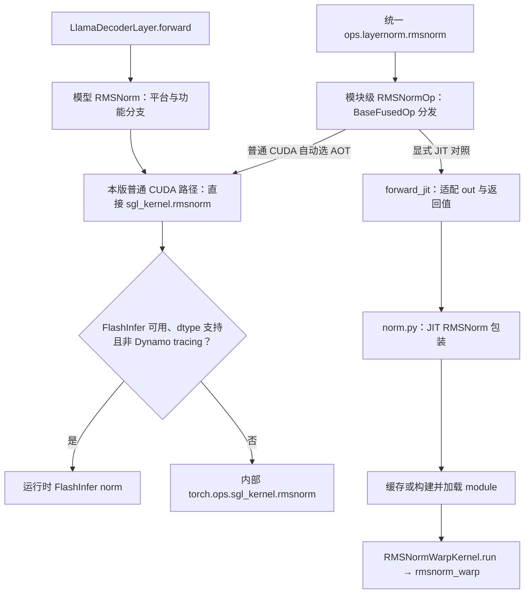
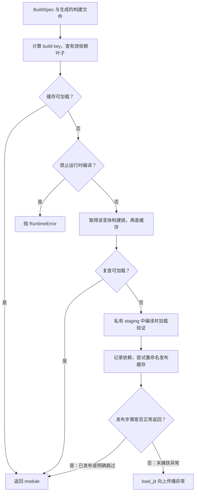

# Kernel 注册、选择与实现阅读

> **先建立架构心智模型：** [M06 · 模型执行与算子分层](<../architecture/06-模型执行与算子分层.md>)。先看职责、数据和生命周期，再回到本篇源码细节。

本文是**源码分析型学习资料**。前面已经把请求追到模型、Attention、采样和图执行。本篇用 RMSNorm 这个小算子，继续回答：**一个 Python 名称怎样对应到具体实现，谁选择后端，数据怎样进入 CUDA kernel，怎样证明调用路径和数值符合预期？**

建议先读 [05-02 Llama Forward](02-以Llama为例读懂模型Forward.md)和 [05-05 CUDA Graph 与编译](05-CUDAGraph编译与执行模式.md)。本篇不罗列全部算子，以一条可以核对到设备代码的链路收束阶段 05。

## 0. 阅读基线与范围

| 项目 | 内容 |
| --- | --- |
| 源码路径基准 | SGLang 仓库根目录 `.`；源码位置统一使用仓内相对路径 |
| 分支 | `codex/sglang-source-study-20260909`，基于官方 `main` |
| commit | `72d5c5bb73cadd7ffbf5114e5f81e29d36b6c61a` |
| 读取日期 | `2026-09-10` |
| 工作区状态 | 学习源码 worktree 干净；原源码工作区与 Wiki 既有资料保留 |
| 操作边界 | 只读模型调用点、kernel 接口、registry/selector、分发、JIT 构建与 CUDA 实现；编写和静态检查文档 |
| 模型入口 | 普通文本、非量化 Llama、CUDA 单 rank；普通 RMSNorm，无特殊 cast、variance override、batch invariant、强制 backend 或编译模式 |
| 具体实现例子 | 独立选择统一 RMSNormOp 的 JIT 后端，fp16、二维 `[M,64]`，无 residual；该选择不冒充 Llama 的默认调用路径 |
| 独立对照 | AOT wheel 边界、FlashInfer 二次分流、fused add 的原地修改、强制后端、外层 torch.compile、测试与 benchmark |
| 不展开 | 全部模型/算子、外部 FlashInfer 的完整设备实现、JIT 编译器内部、PDL 完整协议、多设备精度与性能验收 |

本次没有安装或导入 SGLang/PyTorch，没有加载 `.so`、编译 kernel、执行测试或启动模型。固定源码链接表示**源码事实**；数值、流程图和账本是**整理者归纳**，不是运行观察。基线沿用[系列说明](../README.md)。

## 1. 先认识五个不同层次

**人话版：** 模型说“把这一行做归一化”，并没有同时指定“必须调用哪份 CUDA 文件”。逻辑操作、公共接口、后端身份、加载产物和真正的设备函数，需要逐层核对。

| 层次 | RMSNorm 例子 | 回答的问题 |
| --- | --- | --- |
| 模型层 | `srt.layers.layernorm.RMSNorm` | 在模型计算哪一步执行，持有什么 weight/eps？ |
| 统一算子入口 | `sglang.kernels.ops.layernorm.rmsnorm` | 公共参数和返回/原地修改契约是什么？ |
| 后端方法 | `RMSNormOp.forward_aot/forward_jit/forward_native` | 选哪个实现来源，怎样适配它的接口？ |
| 绑定与产物 | `sgl_kernel` wheel 或 JIT module | 哪个 Python 模块/动态库提供可调用函数？ |
| 设备函数 | `rmsnorm_warp` 等 | 哪些线程读取哪些数，在哪里归约、写回？ |

`KernelBackend` 主要表示实现来源，如 torch、triton、jit、aot、flashinfer；CUDA/HIP 是设备维度。[S6][S15] “CUDA backend”在不同文件里可能指平台路径，也可能只是口语，阅读时要落到具体类或枚举。

| 术语 | 人话解释 | 容易混淆的边界 |
| --- | --- | --- |
| registry | 已登记实现的目录 | 登记不等于导入、编译或运行成功 |
| selector | 从目录解析一个 spec/callable | 与 BaseFusedOp 的优先级分发不同 |
| KernelSpec | op、backend、target、能力和格式说明 | target 是导入定位，不是设备调用证据 |
| CapabilityRequirement | 平台/架构的声明条件 | 不是安装探测，也不是每种 shape 的保证 |
| AOT / JIT | 预先构建的产物 / 按所需变体加载或构建 | AOT 来源的 Python 包仍可能再调用别的库 |
| FFI | Python 与编译模块之间的调用边界 | 不是一个独立模型层 |
| warp / CTA / grid | 一组线程 / 一个线程块 / 本次启动的线程块集合 | 与请求 batch、TP rank 不同 |
| stride | 相邻元素或行之间的存储步长 | shape 相同不表示布局相同 |
| in-place | 修改调用方交来的存储 | 返回 None 不等于没有输出数据 |

## 2. 先从真实模型调用点出发

### 2.1 本版 Llama 的普通 norm 路径仍直接使用 sgl_kernel

`LlamaDecoderLayer.forward` 在 residual 为 None 时先保存原 hidden 引用，再调用 input_layernorm；有 residual 时调用返回两个 tensor 的路径，Attention 后又做一次带 residual 的 norm。[S1] 本篇先走**首次无 residual、普通非量化**分支，尽管调用点传入 quant_linear，所选普通权重路径不满足 FP8 融合条件。[S3]

`RMSNorm` 层继承 BaseFusedOp，保存 weight、epsilon 和其他选项。普通 CUDA 条件下进入 `forward_cuda`；它先处理空输入、特殊方差、确定性、量化融合和 cast 等分支，普通末尾才调用 rmsnorm。[S2][S3]

**关键源码事实：** 这个文件当前在 CUDA/XPU/MUSA 条件下仍从 `sgl_kernel` 直接导入 rmsnorm 等函数。[S60] 因此不能把统一 kernel README 的推荐导入规范，画成所有运行时调用都已经迁移的事实。本篇不修改这个调用点。

### 2.2 两个入口在同一实现边界相遇



**图意解读：** 上方是模型现有调用点，左侧另一入口用于学习统一接口，两者不能拼成一条并不存在的串行调用链。本文深入右侧 JIT 的设备实现，AOT 则追到 wheel 与依赖边界。[S3][S5][S8][S9][S25]

本版统一 RMSNorm 函数调用模块级 `_RMSNORM` 实例；它**没有在每次调用时执行 get_kernel**。[S5] 因此“公共函数都会通过 selector”也不能当成这个算子的实际行为。

## 3. Registry 和 selector：先知道目录里登记了什么

### 3.1 KernelSpec 与注册的边界

`register_fused_op` 遍历实例 available_backends，为每个后端登记一个 KernelSpec；target 形如 `sglang.kernels.ops.layernorm:_RMSNORM.forward_jit`。[S11] available_backends 是结构性列表：检查方法是否实现，并包括基础 torch/torch_compile 路径，不逐个实际运行后端。[S16]

| 字段 | 示例 | 用途与限制 |
| --- | --- | --- |
| op | `layernorm.rmsnorm` | 逻辑算子的稳定查询名 |
| backend | `KernelBackend.JIT` | 实现来源，不是 GPU 型号 |
| target | 模块名加冒号，再到实例方法 | load 时逐级 getattr；不要求就是 CUDA 函数名 |
| capabilities | 本算子 JIT 声明 CUDA | 仅元数据判断，不会探测 nvcc 是否安装 |
| format_signature | dtype、in_place、说明 | 文档性描述，不会自动验证全部输入 |

同一个 `(op, backend)` 重复登记完全相同的 spec 是幂等操作；不同 spec 冲突会抛 ValueError，避免导入顺序偷偷改变实现。[S10] `KernelSpec.load` 才解析 `module:attr` 并导入/定位 callable；错误格式、缺包、缺属性有相应异常，不会在 registry 中自动补出一个替代实现。[S12]

这里“注册只记元数据”指 register 本身；**不能扩大为导入整个 `sglang.kernels` 从不导入 torch**，因为 BaseFusedOp 本身是 torch.nn.Module。[S4]

### 3.2 select_kernel 不是性能自动调优器

| 输入条件 | `select_kernel` 的实际处理 |
| --- | --- |
| op 未注册 | KeyError |
| 明确指定 backend 且已注册 | 直接返回该 spec，不在这里额外做平台检查 |
| 明确指定 backend 但未注册 | KeyError |
| 只有一个已注册 spec | 直接返回，不在这里额外做平台检查 |
| 多个 spec，未指定 backend | 用平台能力元数据过滤 |
| 过滤后只有一个 | 返回它 |
| 过滤后为零或多个 | ValueError；多个时要求调用者明确选择 |

以上来自函数分支本身。[S13] 它没有按延迟、priority 或最近 benchmark 给实现排序；显式和单项捷径还说明“成功拿到 spec”不能当作可运行证明。能力集合采用 OR；空集合表示无平台限制。[S15]

`get_kernel` 通过带缓存的 `_resolve` 完成 select + load，后续相同 op/backend 可复用 callable。[S14] 这个缓存与 JIT 的编译产物缓存是两件事；也不同于 RMSNormOp 实例里的分发缓存。

对统一 RMSNorm，CUDA 下仍可能同时有 AOT/JIT/torch 等多个候选。因此直接 `select_kernel("layernorm.rmsnorm")` 可以报歧义，而直接调用公共 rmsnorm 函数可以经 BaseFusedOp 自动选 AOT。这不矛盾，两者使用不同规则。[S6][S13][S50]

## 4. BaseFusedOp：真正调用时怎样选方法

### 4.1 分发顺序与缓存

普通未预先固定 `_forward_method` 的情况，按下列层次处理。[S18][S19]

| 优先层次 | 行为 | 不能推导的结论 |
| --- | --- | --- |
| 显式 `forward(..., backend=...)` | 直接调用指定后端方法 | 不自动做 eligibility 检查；未实现可报错 |
| 全局强制 backend | 尝试指定方法；仅对 NotImplementedError 做提示后恢复普通分发 | 不兜底任意 ImportError、RuntimeError 或数值错误 |
| 外部平台 override | 选择注册覆盖或平台方法，否则 native | 本文普通 CUDA 主线不进入这一层 |
| 声明的优化后端 | 按 priority，过滤 capabilities | 优先级是代码设定，不是本机实测排序 |
| 平台方法 | 如 forward_cuda | 平台方法内部仍可能再分流 |
| native | 普通参考实现 | 不表示模型所有上层约束都已验证 |

正常自动候选需同时有对应方法和 capabilities 声明；TORCH 最后回退，TORCH_COMPILE 必须显式列入 priority 才参与该候选序列。[S17] 若子类覆盖 backend_eligible，就在每次调用按输入重新判断；否则静态部分第一次解析后缓存在实例上。[S18][S20]

构造函数也可预设 `_forward_method`，例如模型 RMSNorm 的 aiter 或 force_native 选项；它们是已有实例状态，不能省略后再按一张通用优先级表倒推。[S2]

### 4.2 RMSNormOp 的普通 CUDA 决策

本算子的 priority 为 AOT、JIT、AITER、TORCH_NPU、TORCH；AOT/JIT 声明 CUDA，AITER 声明 HIP，TORCH_NPU 声明 NPU。[S6] 普通 CUDA、无强制项时，自动路径先取 AOT。

这一步**不尝试导入所有库，也不比较隐藏维度性能**。RMSNormOp 没有覆盖逐调用 shape gate；显式选 JIT 后，形状不支持会在下游检查处报错，不自动回到 AOT。[S6][S8][S30]

`auto_selected_backend()` 是按平台元数据做的查询，不包含实际动态 shape gate 的调用结果；trace 记录的是 BaseFusedOp 调用及其方法标签。[S47][S46] 若方法内部再进入 FlashInfer，单独看到 aot/cuda 标签仍不能证明最底层设备函数是哪一个。直接 load 到 bound backend 方法也会绕过 BaseFusedOp.forward 的那层 trace。

## 5. AOT 边界：名字相同，仍须继续追一层

### 5.1 sgl_kernel.rmsnorm 内部还有选择

统一 `RMSNormOp.forward_aot` 调用 `sgl_kernel.rmsnorm`；模型层的普通 CUDA 路径也直接调用它。[S9][S60] 本仓保留了这个包的 Python 和构建源码，位于 `python/sglang/kernels/aot/`。

当前 elementwise.rmsnorm 在 FlashInfer 导入成功、输入为 fp16/bf16 且不处于 Dynamo tracing 时调用 FlashInfer norm；否则调用内部 `_rmsnorm_internal`。[S25] 内部路径创建或使用 out，决定默认 enable_pdl，然后调用 `torch.ops.sgl_kernel.rmsnorm.default(out,input,weight,eps,enable_pdl)`。[S26]

因此 **AOT 是这里的适配入口身份，不保证所有下游工作都只来自本仓某个预编译 kernel**。Dynamo 分支存在也不证明实际普通模型编译会必然到达这里；外层 BaseFusedOp 的 compile 模式还可能先切到 native，见第 9 节。

### 5.2 三种版本证据分别记录

| 边界 | 本次能确认 | 本次不能确认 |
| --- | --- | --- |
| 主仓源码 | 固定 commit 中 Python 包、CMake 与绑定声明 | 当前机器安装的 wheel 就由该 commit 构建 |
| AOT 构建依赖 | CMake 固定 FlashInfer archive commit 与 SHA256，并把外部 csrc/norm.cu 加入构建 | 运行时 FlashInfer Python 包版本与该构建依赖相同 |
| 运行时已加载库 | 本次未导入任何 kernel 包 | 实际 sgl_kernel 文件、common_ops 动态库路径和哈希 |

`common_extension.cc` 把 torch.ops 的 rmsnorm 注册到 CUDA 实现，schema 标注 output 的修改语义。[S27] CMake 的 FlashInfer 归档固定为 `bc29697ba20b7e6bdb728ded98f04788e16ee021`，归档 SHA256 为 `931dfd118f4b6de8c7d98702153c7c03840139170af21a07607693bd9749744d`。[S28][S29] 这是**构建配方的证据**；本次没有下载该依赖或核验运行时 wheel。

本篇不把外部 AOT 设备实现写成已完整阅读，下面选择仓内 JIT 分支走到真实 CUDA 数值代码。

## 6. 同一个 RMSNorm，三个接口契约

### 6.1 先读参数次序，再尝试替换实现

| 接口 | 主要参数顺序 | 未给 out 时 | 返回 |
| --- | --- | --- | --- |
| 统一公共 rmsnorm | input, weight, eps, out, enable_pdl | 由选中后端按公共契约产生输出 | Tensor [S5] |
| RMSNormOp.forward_jit | 同上 | 先 empty_like(input)，再调用底层 | out Tensor [S8] |
| 底层 norm.py::rmsnorm | input, weight, out, eps | 把 input 本身当作 out | None；结果写入存储 [S30] |

**不要按位置直接替换第三个参数。** 在统一接口第三项是 eps，在底层 JIT 包装第三项是 out。统一 adapter 不只是转发名称，它还统一了分配、原地行为与返回值。

`enable_pdl` 参数在 RMSNormOp 的说明中由 AOT 路径处理；此 JIT adapter 没有把它传给底层，而由 JIT module 构造时的架构判断进入模板参数。[S6][S8][S33] 同名参数存在，不表示每个实现按同一方式消费它。

### 6.2 用一个可手算的 64 维输入检查语义

本篇普通 RMSNorm 对每行计算：

```text
v = sum(x[j] * x[j], j=0..D-1) / D
y[j] = x[j] / sqrt(v + eps) * weight[j]
```

原生参考把输入转为 fp32，沿最后一维求均方，乘 rsqrt 和 weight，最后转回输入 dtype。[S7] RMSNorm 使用均方根缩放；这里没有减均值。该公式也可对照 [PyTorch 官方 RMSNorm 定义](https://docs.pytorch.org/docs/2.14/generated/torch.nn.RMSNorm.html)。外部页面为 2.14，读取于 2026-09-10，只用于数学定义，不代表本机依赖版本。

**整理者归纳：** 令 M=3、D=64、eps=1e-6，weight 的 64 项全为 1；每行由一个二元模式重复 32 次形成。只说明逻辑数值，未模拟 fp16 舍入。

| 行对应 | 输入模式重复 32 次 | 平方和 / 均方 | 输出模式近似值 |
| --- | --- | --- | --- |
| R1 本轮 token | `[3,4]` | 800 / 12.5 | `[0.848528,1.131371]` |
| R2 本轮 token | `[0,2]` | 128 / 2 | `[0,1.414213]` |
| R3 本轮 token | `[-3,-4]` | 800 / 12.5 | `[-0.848528,-1.131371]` |

每一行独立归一化，不对三个请求合并求一个均方。普通 Decode 可让这三行分别对应三请求，但底层 kernel 只看到 M 行 tensor，不知道 R1 的文本或请求 ID。

### 6.3 Fused add 的输出在两个被修改的输入里

对统一 FusedAddRMSNormOp 的 native 参考：先在 fp32 中相加，再把和写回 residual；归一化和 weight 乘法的结果写回 input，函数返回 None。[S45]

例如一行 `input=[1,2]×32`、`residual=[2,2]×32`、weight 全 1：调用后 residual 为 `[3,4]×32`，input 为上表 R1 的归一化结果。这里 ×32 表示重复，不是逐项乘 32。

| 对象 | 调用前 | 调用后 |
| --- | --- | --- |
| input | 本轮待加的 hidden | 被归一化结果覆盖 |
| residual | 上一残差 | 被新和覆盖 |
| weight | 每维缩放系数 | 本路径读取、不修改 |
| Python 返回 | 尚未调用 | None；两个存储已经承担输出 |

对照测试必须为每个后端重新复制相同的原始 input/residual。把上一个后端已经修改的数据再交给下一个后端，比较的就不是同一输入。[S58] 精度容差还需要考虑累加、cast 与乘 weight 的具体次序，不靠公式相同宣称逐位一致。

## 7. 从 JIT 包装走到 CUDA 线程

### 7.1 隐藏维度决定变体，行数仍是运行时参数

底层 Python 先检查 hidden_size，再通过 `_jit_rmsnorm_module(hidden_size,dtype)` 构造模板参数，包括维度、PDL 架构判定和 dtype。[S30][S31][S33]

| hidden_size | Python 选择/检查结果 | 说明 |
| --- | --- | --- |
| 64、128、256 | RMSNormWarpKernel | 本篇深入的 warp 变体 |
| 512 | RMSNormHalfKernel | 单独选择的变体 |
| 1536、2304 | RMSNormKernel | 支持的 256 对齐形状，不满足相应 Half 条件 |
| 2048、8192、8704、16384 | RMSNormHalfKernel | 相关维度与 512 对齐条件成立 |
| 65、8448 | 不支持 | 8448 虽为 256 的倍数，但超过 8192 后要求 512 对齐 |

支持谓词和变体选择来自实际分支。[S31][S32] 错误提示文字的概括比谓词粗，判定应以代码条件为准。后续 C++ 模板还有 dtype/维度断言；通过 Python 的 hidden_size 检查不代表 dtype、设备、stride 都合法。

### 7.2 以 `[3,64]` fp16 的 WarpKernel 为例

`_jit_rmsnorm_module` 指定源码 `elementwise/rmsnorm.cuh`，导出名 rmsnorm 绑定到所选 C++ 模板类的 run；相对源码文件从 JIT 的 csrc 根解析。[S33][S36]

| C++ host 入口处理 | 本例对应 | 数据边界 |
| --- | --- | --- |
| 固定模板 kDim 和 DType | 64、fp16 | 同一模板要求相同 D/dtype |
| TensorMatcher 检查 input/output | `[N,D]`，末维 stride=1 | 行 stride 可以单独记录，不能只看 contiguous 标签 |
| 检查 weight | `[D]`、相同 DType/device 约束 | 不能随意传另一个 dtype 的权重 |
| 构造 RMSNormParams | 三个数据指针、行 stride、N、eps | 输入/权重读取，输出地址写入 |
| 计算启动规模 | 一块 kWarpThreads；blocks 受 N 与占用上限约束 | 不承诺任意 N 都是一行一块且只处理一次 |
| LaunchKernel | 从传入 device 解析 stream 并提交 | 该调用不是输出已同步回 CPU 的证明 |

上述来自 `RMSNormWarpKernel::run` 和 LaunchKernel。[S41][S44] 本版 kWarpThreads=32。[S61] 因为 kernel 中有 `i = blockIdx.x; i < num_tokens; i += gridDim.x`，一个块还可按步长继续处理其他行。[S42]

### 7.3 一个 warp 内如何得到一个归一化因子


**图意解读：** 方框为设备端步骤，不是六次 Python 调用。`rmsnorm_warp` 调用 `apply_norm_warp`，后者进入 `apply_norm_impl` 的非 CTA 分支：fp32 累加、warp 归约、求因子、乘权重并 cast 写回。[S42][S43] CTA 变体增加跨 warp 的共享内存和同步，本文不把 warp 的步骤数套给所有变体。

对 R1，64 维平方和是 800，归约后得到均方 12.5；这个因子只用于 R1 行。指针按 input_stride/output_stride 切到下一行，所以 **计算范围正确**和**存储布局正确**需要同时成立。

PDL wait/trigger 在设备函数周围出现。[S42] 本文仅标出位置，不把它简化为“所有工作都自动同步”或当成完整并发安全证明。

## 8. JIT 缓存：编译一次到底是在哪一层

### 8.1 三份缓存，三种身份

| 缓存 | 身份/键 | 缓存的东西 |
| --- | --- | --- |
| selector `_resolve` | op、显式 backend | 解析出的 callable [S14] |
| `cache_once` 装饰的 module helper | Python 调用参数，例中为 hidden_size、dtype | 当前进程的 module 对象 [S33][S35] |
| JIT 磁盘缓存 | BuildSpec、生成构建内容、源文件/环境及依赖身份 | 可复用的编译产物 [S34][S37][S38] |

本例 M=3 变成 M=7，不会仅因行数变化让 `_jit_rmsnorm_module` 的显式参数变成另一组；hidden_size 从 64 变 128 会变。这个结论只描述所选 helper 的参数，不能推广为所有 JIT kernel 都只按 D 缓存。

### 8.2 load_jit 的冷/热路径



**图意解读：** 图表示源码设计，不是本次发生过的构建。首次查缓存失败后，`SGLANG_CRASH_ON_JIT_COMPILE` 为真会直接报错；没有这个限制才进入锁和构建路径。[S34] 锁用于减少同变体重复编译，发布完整性的机制是 staging 加重命名，不能把二者混为一件事。[S39][S40] 构建路径用 finally 尝试清理 staging；清理不等于吞掉发布异常。

BuildSpec 包含源码、wrapper、编译/链接参数和 include 等；生成的 FFI wrapper 把 export_name 绑定到 kernel_name。[S36] build key 包含实际生成的构建文本、直接源码摘要和环境指纹；环境包括目标、host/device 编译器信息和相关包版本。[S37] 已构建叶子还要复核依赖摘要，再查找对应动态库。[S38]

**可用缓存**不只是“目录里有一个 `.so`”。缓存存在但加载失败时，loader 会进入重建处理；成功加载后才尝试发布。依赖清单未覆盖直接源码时，commit_build 明确返回 None，此时 load_jit 仍可返回已加载 module，但不会得到可复用的新缓存。[S34][S39]

**注释意图与异常路径需要分开：** commit_build 的注释写着 “Never raises”，实际函数却没有整体异常保护。写依赖文件等操作可能抛错；_publish 只把“同名目标目录已经存在”的重命名失败视为并发发布已获胜，目标目录不存在时会重新抛出 OSError。[S39][S40] load_jit 在 commit_build 之后才返回 module，finally 仅负责清理。因此，不能把“已成功加载”或该注释推导为“发布出错后调用者仍一定取得 module”。这是静态异常链复核，本次没有注入磁盘、权限或并发故障。

本次没有执行这一流程，没有生成缓存，也没有读取本机 GPU 能力。这些状态是源码路径，不是安装诊断结果。

## 9. torch.compile 与强制后端怎样影响阅读结论

全局强制选项第一次使用时从 `SGLANG_FORCE_FUSED_OP_BACKEND` 解析并缓存；程序接口也能更改它。[S21] 这是诊断入口，不能把 best-effort 解释成“无论如何每个 op 都会成功运行指定实现”：未实现时的 NotImplementedError 可回到普通路径，其他错误并不被这段代码普遍吞掉。[S19][S52]

外层模型编译时，BaseFusedOp 默认 `enter_torch_compile` 保存原分发并切到 compile-safe native；重复 enter/leave 保持幂等，leave 恢复原状态。[S22][S23] 这与显式选择 TORCH_COMPILE 后端又不同：后者懒创建 `torch.compile(self.forward_native)`。[S24]

| 方式 | 本篇要记录的事实 |
| --- | --- |
| 普通自动路径 | 模型层平台方法或算子 priority 的最终选择 |
| 显式 backend | 直接指定方法，不能依靠自动 gate 替自己检查 |
| 全局强制 | 覆盖普通分发；未实现的有限回退边界 |
| 外层 compile 模式 | 默认临时使用 native；某些算子可覆盖 compile hook |
| 单 op TORCH_COMPILE | 该参考实现的独立编译 callable |
| 已捕获 CUDA Graph replay | 图内设备工作重放；不保证每次重新执行 Python 分发/trace |

这也是为什么核查“选中了哪个 kernel”必须记录发生在 eager、编译 warmup、capture 还是 replay。仅看一次 Python trace，不足以证明每次设备执行采用何种变体；需要与加载产物和设备 trace 对应，上一节的缓存名也不能直接当作性能结果。

## 10. 正确性、调用路径和性能分开验收

### 10.1 测试入口各证明什么

本次读取下列 **16 条测试定义**；参数化定义不按所有展开 case 累计，均未执行。

| 测试文件与范围 | 已读断言 | 不能证明什么 |
| --- | --- | --- |
| `test/registered/kernels/ops/layernorm/test_kernels_namespace.py`：多后端歧义 1 条 | RMSNorm 未指定 backend 报歧义，显式 JIT target 正确 [S50] | JIT 是否可安装、编译或执行 |
| `test/registered/kernels/ops/layernorm/test_fused_op.py`：注册幂等、冲突 2 条 | 相同 spec 保留单项、不同 target 冲突 [S53] | kernel 数值和设备正确性 |
| `test/registered/kernels/test_fused_op_dispatch.py`：显式覆盖、强制回退、静态缓存、预设方法、动态 gate、compile 往返 6 条 | 用 toy/mock 观察分发与状态恢复 [S51][S52][S59] | 实际 RMSNorm 依赖或 GPU 行为 |
| `test/registered/kernels/ops/layernorm/test_rmsnorm.py`：数值、支持维度、变体 3 条 | CUDA/ROCm 参考选择、out/原地路径、支持集合与类名 [S54][S55][S56] | 所有 shape、所有 dtype 或设备完全等价 |
| `test/registered/kernels/ops/layernorm/test_fused_op_gpu_parity.py`：RMSNorm、fused add 2 条 | 过滤 eligible 后端，与 native 比；fused 同时比较两个被改写存储 [S57][S58] | 未运行后端也正确；普通模型默认实际调用该统一 op |
| `test/registered/kernels/ops/layernorm/test_fused_op.py`：显式覆盖 priority、未实现报错 2 条 | 指定 torch 可覆盖 toy 优先级；缺 AOT 抛异常 [S19] | 该 toy 名为 triton 的方法真是 Triton kernel |

其中 toy 的所谓 Triton 路径通过人为加常数区分分支，不是设备实现验收。GPU parity 当前跳过 torch/torch_compile 候选，并对 fp16 使用 1e-2、bf16 使用 2e-2 的 atol/rtol；JIT RMSNorm 数值测试使用 1e-2 的 atol/rtol。[S54][S57] **测试注释里的 bitwise reference 不等于断言逐位相同**，应读实际 assert_close 条件。

### 10.2 推荐的证据分层

| 层级 | 应收集的证据 | 本次状态 |
| --- | --- | --- |
| 调用与注册 | 真实调用点、spec/target、分发条件、加载版本 | 固定源码已核对；运行时加载未核验 |
| 单算子数值 | 固定输入、weight、eps、dtype、shape/stride、out alias、参考和容差 | 仅教学算术，未执行 kernel |
| 模型集成 | 同模型/权重和配置的 hidden/logits 对照、真实路径记录 | 未执行 |
| 生命周期 | 原地输入、跨轮复用、stream 等待、图捕获/重放的调用契约 | 静态说明，未做压力验证 |
| 单算子性能 | 冷/热缓存、warmup、实际变体、测量方式与统计分布 | 未执行 |
| 服务性能 | 模型、请求分布、并发、缓存、TTFT/ITL/吞吐 | 未执行；不能由微基准直接推出 |

### 10.3 benchmark 的名字和数值单位也要追

`bench_norm.py::benchmark_rmsnorm` 比较直接 JIT 包装与 FlashInfer，使用 bf16，四份独立的输入/权重，逐份以 out=input 调用；它没有经过模型 RMSNorm 的完整分支或 registry 自动选择。[S48]

`run_benchmark` 使用 `triton.testing.do_bench_cudagraph`，默认传入分位数 `[0.5,0.2,0.8]`，把毫秒乘 1000 后除以 scale；此处 scale=4。[S49] 不要把变量名 min/max 或注释直接当成绝对最小/最大值；实际统计口径依传入分位数解释。也不能把这种图内重复运行时间当成一次真实 HTTP 请求耗时。

四份数据用于降低重复同一份数据带来的缓存影响，是测试设计意图；本次没有测量它是否消除了缓存影响，更没有输出 JIT/AOT/FlashInfer 的速度排名。

## 11. 排障地图与源码阅读顺序

| 现象 | 先收集什么 | 回到哪里 |
| --- | --- | --- |
| registry 能找到 JIT，但执行报错 | target、实际 dtype/device/stride、缺包或编译错误 | spec.load、显式分发和 norm.py 检查 [S12][S19][S30] |
| selector 报歧义，公共函数却能跑 | 使用的是 selector 还是模块级 op | 无排序解析与 priority 分发 [S13][S18] |
| 强制后端仍出现平台路径 | 是否抛了 NotImplementedError、调用绕过哪层 | best-effort fallback 与直接 bound method [S19] |
| 改了环境变量但选择不变 | 首次解析、全局强制缓存、实例 method 缓存 | 不以再次读取配置文本冒充实际生效 [S18][S21] |
| 返回 None，看起来“没有结果” | 底层/公共签名，out/input/residual 内容 | 原地契约和 adapter [S8][S30][S45] |
| 8448 维看似对齐却不支持 | 范围与 512 对齐条件 | 支持谓词而非错误提示概括 [S31] |
| 相同 shape 的结果不对 | 行 stride、末维 stride、weight dtype、eps、alias | TensorMatcher 与数值次序 [S41][S43] |
| 启动一直编译或缓存不可用 | build key、源/依赖/工具链、加载错误、发布记录 | load_jit、find_prebuilt 与 commit_build [S34][S38][S39] |
| 动态库加载成功后，首次调用仍抛错 | 依赖文件写入、发布目标是否存在、原始 OSError | commit_build / _publish 异常可先于 return module 传播，见第 8.2 节 [S34][S39][S40] |
| AOT 标签与实际设备调用不一致 | wheel 路径、FlashInfer 是否可用、Dynamo 状态 | AOT Python 包的二次分流 [S25] |
| 微基准快，服务没有变快 | 调用频次、真实 shape、图状态、算子占比、请求分布 | 先确认模型真走该优化，再看端到端瓶颈 |

推荐按这个顺序返回源码，每读一层都记录上一层交来的数据和下一层接手的职责：

| 顺序 | 仓内相对路径与关键符号 |
| --- | --- |
| 1 模型调用点 | `python/sglang/srt/models/llama.py::LlamaDecoderLayer.forward` [S1] |
| 2 层与公共接口 | `python/sglang/srt/layers/layernorm.py::RMSNorm.forward_cuda` [S3]；`python/sglang/kernels/ops/layernorm/__init__.py::rmsnorm` [S5] |
| 3 登记与解析 | `python/sglang/kernels/registry.py::KernelRegistry.register` [S10]；`python/sglang/kernels/selector.py::select_kernel` [S13] |
| 4 执行分发 | `python/sglang/kernels/fused_op.py::BaseFusedOp.forward` [S19] |
| 5 JIT 适配 | `python/sglang/kernels/ops/layernorm/__init__.py::RMSNormOp.forward_jit` [S8]；`python/sglang/kernels/ops/layernorm/norm.py::rmsnorm` [S30] |
| 6 构建与加载 | `python/sglang/kernels/jit/utils/compile/loader.py::load_jit` [S34] |
| 7 host 与设备代码 | `python/sglang/kernels/jit/csrc/elementwise/rmsnorm.cuh` 的 RMSNormWarpKernel::run、rmsnorm_warp [S41][S42] |
| 8 归约数学 | `python/sglang/kernels/jit/include/sgl_kernel/impl/norm.cuh` 的 apply_norm_impl [S43] |
| 9 对照证据 | 指定测试与 benchmark；以实际断言、过滤条件和计时 helper 为准 |

## 12. 自测、阶段验收与下一篇

| 问题 | 参考答案 |
| --- | --- |
| AOT 表示 CUDA，JIT 表示另一类设备吗？ | 否。它们主要表示实现来源，设备能力单独声明 |
| 注册成功能证明库已经安装吗？ | 不能。注册是目录，load/编译/设备执行还有后续条件 |
| select_kernel 会自动挑最快实现吗？ | 不会。它做固定解析和有限平台过滤；多个可用候选要求显式指定 |
| 普通 Llama RMSNorm 是否每次经过统一 registry？ | 本版普通 CUDA 层直接导入 sgl_kernel；不要从规范反推实际调用链 |
| D=64、M 从 3 变 7，需要新的该 JIT helper 参数键吗？ | 不仅因 M 变化；helper 显式参数是 D/dtype，M 在 run 时传入 |
| 底层 JIT 第三个位置参数可以直接放 eps 吗？ | 不行。那里是 out；统一 adapter 的参数顺序不同 |
| fused add 返回 None，应该只检查没有异常吗？ | 不够。要比较被覆盖的 input 和 residual，两者都是结果 |
| 静态 priority 为 AOT，运行期 ImportError 会自动尝试 JIT 吗？ | 本路径没有这种通用异常回退；元数据 eligibility 与安装情况不同 |
| commit_build 注释写 Never raises，能保证发布异常不影响返回吗？ | 不能。明确跳过发布可以返回；未捕获的文件操作异常仍可能越过 return module 向上传播 |
| parity 注释写 bitwise，能报告逐位相同吗？ | 不能。要读实际断言；本次测试未执行，且已读数值断言使用容差 |
| 一次 kernel benchmark 是否证明服务吞吐增加？ | 不能。需确认真实调用路径和占比，再按服务负载测量 |

阶段 05 的六篇现在可以串成一条学习链：**worker/runner 接收 batch → Llama 层内计算 → Attention 元数据 → logits 与采样 → 图执行和缓冲区 → kernel 实现与验证**。前五篇的模型流程图、shape 表、后端选择和本篇算子链组成阶段产物；完成表示静态学习资料已成文，不表示 GPU 验收通过。

下一篇进入阶段 06：[06-01《Rank、进程组与通信基础》](../06-parallelism/01-Rank进程组与通信基础.md)。返回[系列目录](../README.md)与[学习进度](../appendices/06-学习进度与版本变更记录.md)。

[S1]: https://github.com/sgl-project/sglang/blob/72d5c5bb73cadd7ffbf5114e5f81e29d36b6c61a/python/sglang/srt/models/llama.py#L340
[S2]: https://github.com/sgl-project/sglang/blob/72d5c5bb73cadd7ffbf5114e5f81e29d36b6c61a/python/sglang/srt/layers/layernorm.py#L440
[S3]: https://github.com/sgl-project/sglang/blob/72d5c5bb73cadd7ffbf5114e5f81e29d36b6c61a/python/sglang/srt/layers/layernorm.py#L490
[S4]: https://github.com/sgl-project/sglang/blob/72d5c5bb73cadd7ffbf5114e5f81e29d36b6c61a/python/sglang/kernels/fused_op.py#L334
[S5]: https://github.com/sgl-project/sglang/blob/72d5c5bb73cadd7ffbf5114e5f81e29d36b6c61a/python/sglang/kernels/ops/layernorm/__init__.py#L452
[S6]: https://github.com/sgl-project/sglang/blob/72d5c5bb73cadd7ffbf5114e5f81e29d36b6c61a/python/sglang/kernels/ops/layernorm/__init__.py#L49
[S7]: https://github.com/sgl-project/sglang/blob/72d5c5bb73cadd7ffbf5114e5f81e29d36b6c61a/python/sglang/kernels/ops/layernorm/__init__.py#L75
[S8]: https://github.com/sgl-project/sglang/blob/72d5c5bb73cadd7ffbf5114e5f81e29d36b6c61a/python/sglang/kernels/ops/layernorm/__init__.py#L106
[S9]: https://github.com/sgl-project/sglang/blob/72d5c5bb73cadd7ffbf5114e5f81e29d36b6c61a/python/sglang/kernels/ops/layernorm/__init__.py#L94
[S10]: https://github.com/sgl-project/sglang/blob/72d5c5bb73cadd7ffbf5114e5f81e29d36b6c61a/python/sglang/kernels/registry.py#L23
[S11]: https://github.com/sgl-project/sglang/blob/72d5c5bb73cadd7ffbf5114e5f81e29d36b6c61a/python/sglang/kernels/fused_op.py#L665
[S12]: https://github.com/sgl-project/sglang/blob/72d5c5bb73cadd7ffbf5114e5f81e29d36b6c61a/python/sglang/kernels/spec.py#L250
[S13]: https://github.com/sgl-project/sglang/blob/72d5c5bb73cadd7ffbf5114e5f81e29d36b6c61a/python/sglang/kernels/selector.py#L38
[S14]: https://github.com/sgl-project/sglang/blob/72d5c5bb73cadd7ffbf5114e5f81e29d36b6c61a/python/sglang/kernels/selector.py#L92
[S15]: https://github.com/sgl-project/sglang/blob/72d5c5bb73cadd7ffbf5114e5f81e29d36b6c61a/python/sglang/kernels/spec.py#L175
[S16]: https://github.com/sgl-project/sglang/blob/72d5c5bb73cadd7ffbf5114e5f81e29d36b6c61a/python/sglang/kernels/fused_op.py#L464
[S17]: https://github.com/sgl-project/sglang/blob/72d5c5bb73cadd7ffbf5114e5f81e29d36b6c61a/python/sglang/kernels/fused_op.py#L487
[S18]: https://github.com/sgl-project/sglang/blob/72d5c5bb73cadd7ffbf5114e5f81e29d36b6c61a/python/sglang/kernels/fused_op.py#L538
[S19]: https://github.com/sgl-project/sglang/blob/72d5c5bb73cadd7ffbf5114e5f81e29d36b6c61a/python/sglang/kernels/fused_op.py#L630
[S20]: https://github.com/sgl-project/sglang/blob/72d5c5bb73cadd7ffbf5114e5f81e29d36b6c61a/python/sglang/kernels/fused_op.py#L569
[S21]: https://github.com/sgl-project/sglang/blob/72d5c5bb73cadd7ffbf5114e5f81e29d36b6c61a/python/sglang/kernels/fused_op.py#L222
[S22]: https://github.com/sgl-project/sglang/blob/72d5c5bb73cadd7ffbf5114e5f81e29d36b6c61a/python/sglang/kernels/fused_op.py#L594
[S23]: https://github.com/sgl-project/sglang/blob/72d5c5bb73cadd7ffbf5114e5f81e29d36b6c61a/python/sglang/kernels/fused_op.py#L616
[S24]: https://github.com/sgl-project/sglang/blob/72d5c5bb73cadd7ffbf5114e5f81e29d36b6c61a/python/sglang/kernels/fused_op.py#L422
[S25]: https://github.com/sgl-project/sglang/blob/72d5c5bb73cadd7ffbf5114e5f81e29d36b6c61a/python/sglang/kernels/aot/python/sgl_kernel/elementwise.py#L76
[S26]: https://github.com/sgl-project/sglang/blob/72d5c5bb73cadd7ffbf5114e5f81e29d36b6c61a/python/sglang/kernels/aot/python/sgl_kernel/elementwise.py#L16
[S27]: https://github.com/sgl-project/sglang/blob/72d5c5bb73cadd7ffbf5114e5f81e29d36b6c61a/python/sglang/kernels/aot/csrc/common_extension.cc#L64
[S28]: https://github.com/sgl-project/sglang/blob/72d5c5bb73cadd7ffbf5114e5f81e29d36b6c61a/python/sglang/kernels/aot/CMakeLists.txt#L74
[S29]: https://github.com/sgl-project/sglang/blob/72d5c5bb73cadd7ffbf5114e5f81e29d36b6c61a/python/sglang/kernels/aot/CMakeLists.txt#L307
[S30]: https://github.com/sgl-project/sglang/blob/72d5c5bb73cadd7ffbf5114e5f81e29d36b6c61a/python/sglang/kernels/ops/layernorm/norm.py#L129
[S31]: https://github.com/sgl-project/sglang/blob/72d5c5bb73cadd7ffbf5114e5f81e29d36b6c61a/python/sglang/kernels/ops/layernorm/norm.py#L39
[S32]: https://github.com/sgl-project/sglang/blob/72d5c5bb73cadd7ffbf5114e5f81e29d36b6c61a/python/sglang/kernels/ops/layernorm/norm.py#L46
[S33]: https://github.com/sgl-project/sglang/blob/72d5c5bb73cadd7ffbf5114e5f81e29d36b6c61a/python/sglang/kernels/ops/layernorm/norm.py#L58
[S34]: https://github.com/sgl-project/sglang/blob/72d5c5bb73cadd7ffbf5114e5f81e29d36b6c61a/python/sglang/kernels/jit/utils/compile/loader.py#L48
[S35]: https://github.com/sgl-project/sglang/blob/72d5c5bb73cadd7ffbf5114e5f81e29d36b6c61a/python/sglang/kernels/jit/utils/common.py#L27
[S36]: https://github.com/sgl-project/sglang/blob/72d5c5bb73cadd7ffbf5114e5f81e29d36b6c61a/python/sglang/kernels/jit/utils/compile/spec.py#L67
[S37]: https://github.com/sgl-project/sglang/blob/72d5c5bb73cadd7ffbf5114e5f81e29d36b6c61a/python/sglang/kernels/jit/utils/compile/cache.py#L259
[S38]: https://github.com/sgl-project/sglang/blob/72d5c5bb73cadd7ffbf5114e5f81e29d36b6c61a/python/sglang/kernels/jit/utils/compile/cache.py#L353
[S39]: https://github.com/sgl-project/sglang/blob/72d5c5bb73cadd7ffbf5114e5f81e29d36b6c61a/python/sglang/kernels/jit/utils/compile/cache.py#L410
[S40]: https://github.com/sgl-project/sglang/blob/72d5c5bb73cadd7ffbf5114e5f81e29d36b6c61a/python/sglang/kernels/jit/utils/compile/loader.py#L186
[S41]: https://github.com/sgl-project/sglang/blob/72d5c5bb73cadd7ffbf5114e5f81e29d36b6c61a/python/sglang/kernels/jit/csrc/elementwise/rmsnorm.cuh#L208
[S42]: https://github.com/sgl-project/sglang/blob/72d5c5bb73cadd7ffbf5114e5f81e29d36b6c61a/python/sglang/kernels/jit/csrc/elementwise/rmsnorm.cuh#L186
[S43]: https://github.com/sgl-project/sglang/blob/72d5c5bb73cadd7ffbf5114e5f81e29d36b6c61a/python/sglang/kernels/jit/include/sgl_kernel/impl/norm.cuh#L63
[S44]: https://github.com/sgl-project/sglang/blob/72d5c5bb73cadd7ffbf5114e5f81e29d36b6c61a/python/sglang/kernels/jit/include/sgl_kernel/utils.cuh#L265
[S45]: https://github.com/sgl-project/sglang/blob/72d5c5bb73cadd7ffbf5114e5f81e29d36b6c61a/python/sglang/kernels/ops/layernorm/__init__.py#L194
[S46]: https://github.com/sgl-project/sglang/blob/72d5c5bb73cadd7ffbf5114e5f81e29d36b6c61a/python/sglang/kernels/fused_op.py#L306
[S47]: https://github.com/sgl-project/sglang/blob/72d5c5bb73cadd7ffbf5114e5f81e29d36b6c61a/python/sglang/kernels/fused_op.py#L510
[S48]: https://github.com/sgl-project/sglang/blob/72d5c5bb73cadd7ffbf5114e5f81e29d36b6c61a/test/registered/kernels/benchmark/layernorm/bench_norm.py#L53
[S49]: https://github.com/sgl-project/sglang/blob/72d5c5bb73cadd7ffbf5114e5f81e29d36b6c61a/python/sglang/kernels/jit/benchmark/utils.py#L81
[S50]: https://github.com/sgl-project/sglang/blob/72d5c5bb73cadd7ffbf5114e5f81e29d36b6c61a/test/registered/kernels/ops/layernorm/test_kernels_namespace.py#L48
[S51]: https://github.com/sgl-project/sglang/blob/72d5c5bb73cadd7ffbf5114e5f81e29d36b6c61a/test/registered/kernels/test_fused_op_dispatch.py#L358
[S52]: https://github.com/sgl-project/sglang/blob/72d5c5bb73cadd7ffbf5114e5f81e29d36b6c61a/test/registered/kernels/test_fused_op_dispatch.py#L245
[S53]: https://github.com/sgl-project/sglang/blob/72d5c5bb73cadd7ffbf5114e5f81e29d36b6c61a/test/registered/kernels/ops/layernorm/test_fused_op.py#L164
[S54]: https://github.com/sgl-project/sglang/blob/72d5c5bb73cadd7ffbf5114e5f81e29d36b6c61a/test/registered/kernels/ops/layernorm/test_rmsnorm.py#L108
[S55]: https://github.com/sgl-project/sglang/blob/72d5c5bb73cadd7ffbf5114e5f81e29d36b6c61a/test/registered/kernels/ops/layernorm/test_rmsnorm.py#L129
[S56]: https://github.com/sgl-project/sglang/blob/72d5c5bb73cadd7ffbf5114e5f81e29d36b6c61a/test/registered/kernels/ops/layernorm/test_rmsnorm.py#L150
[S57]: https://github.com/sgl-project/sglang/blob/72d5c5bb73cadd7ffbf5114e5f81e29d36b6c61a/test/registered/kernels/ops/layernorm/test_fused_op_gpu_parity.py#L39
[S58]: https://github.com/sgl-project/sglang/blob/72d5c5bb73cadd7ffbf5114e5f81e29d36b6c61a/test/registered/kernels/ops/layernorm/test_fused_op_gpu_parity.py#L54
[S59]: https://github.com/sgl-project/sglang/blob/72d5c5bb73cadd7ffbf5114e5f81e29d36b6c61a/test/registered/kernels/test_fused_op_dispatch.py#L387
[S60]: https://github.com/sgl-project/sglang/blob/72d5c5bb73cadd7ffbf5114e5f81e29d36b6c61a/python/sglang/srt/layers/layernorm.py#L102
[S61]: https://github.com/sgl-project/sglang/blob/72d5c5bb73cadd7ffbf5114e5f81e29d36b6c61a/python/sglang/kernels/jit/include/sgl_kernel/utils.cuh#L136
