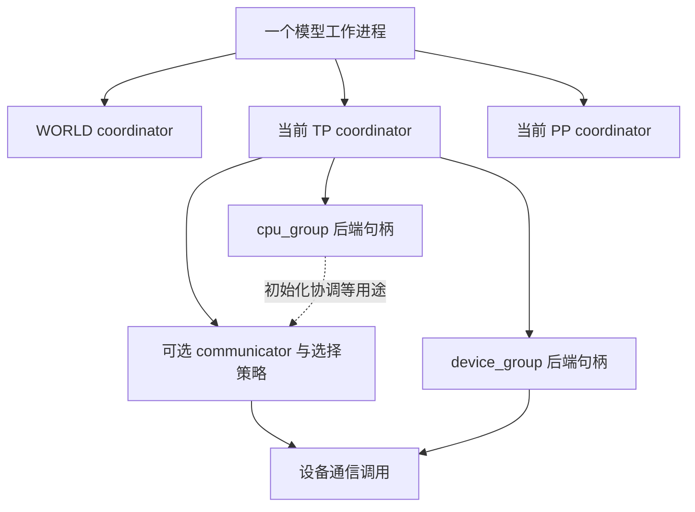
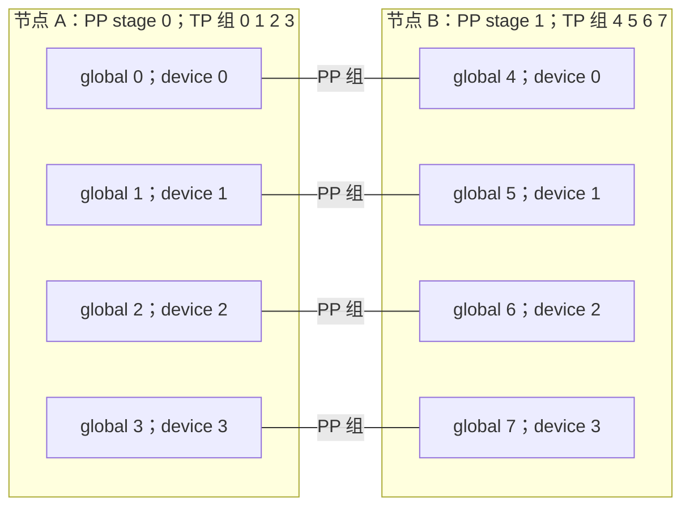
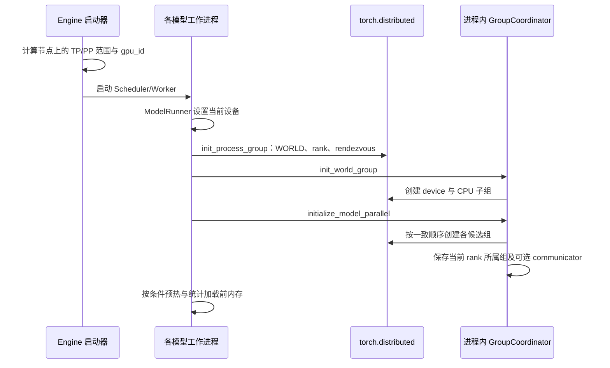
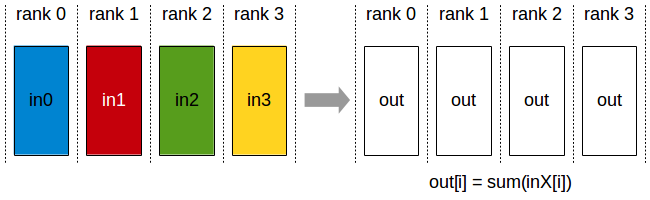

# Rank、进程组与通信基础

> **先建立架构心智模型：** [M07 · 并行部署与通信拓扑](<../architecture/07-并行部署与通信拓扑.md>)。先看职责、数据和生命周期，再回到本篇源码细节。

本文是 **06-01，源码分析型学习资料**。前面已经沿着一张卡上的请求、缓存和模型执行建立主线；从本篇开始，把视野扩展到多个协作进程。先解决最基础的问题：**这是谁的编号、跟谁通信、交换什么、结果何时能用？**

## 0. 阅读基线与范围

| 项目 | 内容 |
| --- | --- |
| 源码路径基准 | SGLang 仓库根目录 `.`；源码位置统一使用仓内相对路径 |
| 本地分支 | `codex/sglang-source-study-20260909`，基于官方 `main` |
| 固定 commit | `72d5c5bb73cadd7ffbf5114e5f81e29d36b6c61a` |
| 读取时间 | `2026-09-10` |
| 工作区状态 | 学习 worktree 干净；原源码工作区和 Wiki 其他未提交资料保留 |
| 操作边界 | 只读源码、编写文档、核对路径/符号/教学算术；未导入 SGLang 或 torch，未初始化通信组，未启动进程、模型或 GPU 测试 |
| 前置阅读 | [01-03 启动链](../01-getting-started/03-从CLI到服务进程启动.md)、[05-06 Kernel 调用与分发](../05-model-execution/06-Kernel注册选择与实现阅读.md)；阶段 05 的模型执行主线 |
| 主线 | 普通 target worker、固定成员、非 DP controller 的多进程启动；用两节点各 4 卡、TP=4/PP=2 建立坐标，再读 GroupCoordinator 通信接口 |
| 不在本篇展开 | 各种并行的逐层张量切分、PP microbatch 调度、弹性 EP/joiner、PD KV 传输、Ray 启动和各通信后端内部算法；分别由后续正文继续 |

**证据边界：** 文件与符号链接是固定源码事实；8 卡布局、小数组与流程图是据此整理的教学例子，不是实测部署。PyTorch 官方 [2.14 分布式文档](https://docs.pytorch.org/docs/2.14/distributed.html)于本日读取，仅用于补充外部 API 的组创建、rank 参数与异步语义，不代表本机安装了这个版本。

## 1. 先把编号想成通讯录，而不是卡的名字

### 1.1 人话版

假设八个人协作完成一道题。每个人有整个团队的编号，也有自己小组内的位置；所在房间的座位号又是另一个编号。小组决定“这一步哪些人一起交换答案”，并不重新创建八个人。

源码中的 rank 首先编号的是**参与该分布式作业的进程**。普通多 GPU 主线通常为一个模型工作进程安排一张设备，但 HTTP、TokenizerManager 等服务进程并不会因为也是进程，就自动占据这个 WORLD 中的 rank。[S1][S5]

| 名词 | 人话解释 | 本版源码中的对应与边界 |
| --- | --- | --- |
| WORLD / global rank | 这次分布式作业的成员全集 / 在全集中的编号 | `get_world_group()`；GroupCoordinator.rank 取无 group 参数的 `torch.distributed.get_rank()` [S6][S8] |
| world size | 某个组有几名成员 | `get_world_group().world_size` 是全集大小；`get_tp_group().world_size` 只是当前 TP 组大小 [S8][S9] |
| local rank / gpu_id | 启动器为本进程选择的本地设备编号 | bootstrap 将 gpu_id 传作 local_rank；它不是 TP/PP 组内位置 [S5] |
| rank_in_group | 自己在该组成员列表中的下标 | `ranks.index(self.rank)`；同一进程在不同组里可以不同 [S8] |
| node_rank | 启动时本节点的编号 | 用于推导本节点的 TP/PP rank 范围；不是 CUDA device index [S2] |
| TP rank / PP rank | 在张量并行组 / 流水并行组中的位置 | 相应 getter 返回该组 rank_in_group [S9][S10] |
| GroupCoordinator | 当前进程里管理某一通信组的 Python 对象 | 保存成员、通信组句柄、可用实现与路由策略；不是独立服务进程 [S8] |
| ProcessGroup | PyTorch 后端管理的通信组句柄 | 一个 coordinator 可同时持有 device_group 和 cpu_group [S8] |
| communicator | 执行某类通信的实现对象 | 例如 PyNcclCommunicator；有对象不等于本次一定使用它 [S8][S15] |
| collective / P2P | 组成员共同执行的操作 / 指定两端的发送接收 | collective 不是“只叫 rank 0 执行就够了”；P2P 仍需匹配对端与顺序 [S24][S54] |

“rank 0”单独出现时，信息不够。应说“WORLD rank 0”“TP 组内 rank 0”或“节点 0 的设备 0”。尤其 `GroupCoordinator.rank` 是 global rank，**不是** rank_in_group。[S8]

### 1.2 四层对象地图



**图意解读：** 除第一个框外，其余框是进程内对象或调用路径，不是新增进程。TP 与 PP 复用同一个进程的参与身份，但有不同成员集合。CPU group 可用于初始化 GPU communicator；不能由“初始化用了 CPU group”推断 tensor 数据也经 CPU 传输。[S8]

## 2. 用八张卡把所有编号填进一张表

### 2.1 固定教学条件与公式

采用两节点 A/B，每节点四个可见设备；`nnodes=2`、`tp_size=4`、`pp_size=2`、普通 `dp_size=1`，CP/EP 等保持本例的单组基础设置。`base_gpu_id=0`、`gpu_id_step=1`，先关闭“一进程只暴露一张卡”的重编号模式。本例只证明编号与分组推导，不证明任意模型在八张卡上都能运行。

非 joiner 的 bootstrap 计算：[S5]

```python
# python/sglang/srt/distributed/bootstrap.py::_init_parallel_groups
world_size = tp_size * pp_size
rank = tp_size * pp_rank + tp_rank
# init_distributed_environment(..., local_rank=gpu_id)
```

这是摘出普通分支后的关键公式；实际代码还含 rank_offset 和弹性分支，不能把本公式推广到所有启动方式。[S5]

`_calculate_rank_ranges` 在本例得出每节点一个 PP stage、每 stage 四个 TP rank：A 的 pp_rank=0，B 的 pp_rank=1；两节点的 tp_rank 均为 0..3。[S2] 启动器再计算 gpu_id、创建 Scheduler 子进程；ModelRunner 在分布式初始化之前设置当前设备。[S1][S4]

| 节点 | global rank | gpu_id / local_rank | TP 成员列表 | TP rank_in_group | PP 成员列表 | PP rank_in_group |
| --- | ---: | ---: | --- | ---: | --- | ---: |
| A | 0 | 0 | `[0,1,2,3]` | 0 | `[0,4]` | 0 |
| A | 1 | 1 | `[0,1,2,3]` | 1 | `[1,5]` | 0 |
| A | 2 | 2 | `[0,1,2,3]` | 2 | `[2,6]` | 0 |
| A | 3 | 3 | `[0,1,2,3]` | 3 | `[3,7]` | 0 |
| B | 4 | 0 | `[4,5,6,7]` | 0 | `[0,4]` | 1 |
| B | 5 | 1 | `[4,5,6,7]` | 1 | `[1,5]` | 1 |
| B | 6 | 2 | `[4,5,6,7]` | 2 | `[2,6]` | 1 |
| B | 7 | 3 | `[4,5,6,7]` | 3 | `[3,7]` | 1 |

TP 是连续的四个 rank；PP 按 TP 宽度跨步取 rank。这直接对应 `initialize_model_parallel` 中创建 TP/PP group_ranks 的两个循环。[S7]



**图意解读：** 横线表示成员关系，不规定实际通信使用哪张网卡、什么协议或哪个方向。每个 rank 同时属于一个 TP 组和一个 PP 组。总进程数是 8，不是把 TP/PP 成员数再相加。DP/EP/CP 后续会增加坐标与子组，不能直接把所有参数相乘来猜 WORLD。

### 2.2 从 global rank 6 看同名字段

在进程 6 内：WORLD 的 world_size=8、rank_in_group=6；TP 的 world_size=4、rank_in_group=2；PP 的 world_size=2、rank_in_group=1。三个对象的 rank 都是 6，local_rank 都是本例的 2。[S8]

对于 TP 组 `[4,5,6,7]`，`broadcast(x, src=0)` 的 src 是**组内 0**，最终 PyTorch 调用使用 `self.ranks[0]`，也就是 global 4。对于 PP 组 `[2,6]`，`send(x, dst=1)` 的目标是 global 6。不要把 global 6 直接填进这个两成员组的 dst 参数。[S18][S24]

方法注释有时把这里的 src/dst 写成 “local rank”。应以 `self.ranks[src/dst]` 和 rank_in_group 的实现为准：本接口说的是**组内编号**，不是机器本地 GPU 编号。相反，`first_rank/last_rank/next_rank/prev_rank` 返回的是成员列表中的 **global rank**；`next_rank` 的末尾取模还表示环形邻居，不代表最后 PP stage 必须把 hidden states 继续送回第一阶段。[S8][S25]

### 2.3 为什么日志里八个进程都可能出现 cuda:0

启用 `SGLANG_ONE_VISIBLE_DEVICE_PER_PROCESS` 后，启动器经 `maybe_reindex_device_id` 进入平台重编号上下文；CUDA 实现把当前要使用的设备选入子进程的 `CUDA_VISIBLE_DEVICES`，向调用者 yield 0。GroupCoordinator 的 CUDA device_id 也在该模式下使用 0。[S1][S3][S26][S8]

因此多个进程各自看到 `cuda:0`，可以代表各自可见空间中的不同实际 GPU。排查时应关联节点、PID、global rank、可见设备列表与实际设备标识；只比对字符串 `cuda:0` 无法判断是否抢用了同一张卡。这里记录的是源码映射机制，没有检查本机的物理卡。

## 3. 通信组从启动到可用：不是拿到 rank 就结束了

### 3.1 启动顺序



**图意解读：** “各模型工作进程”代表每个参与者都走初始化，不是 rank 0 替别人完成初始化。WORLD 默认 ProcessGroup 和 SGLang 的 WORLD coordinator 也不是同一个对象；后者由 `init_world_group` 包装并创建自己的句柄。[S4][S5][S6][S27]

入口是 `ModelRunner.init_torch_distributed → bootstrap.init_torch_distributed`。普通 target worker 进入 `_init_parallel_groups`；draft worker 复用已建组，不在这里再建同一套组。源码还特意排除 draft worker 的 WORLD 内存规约，因为 draft 可能只存在于部分 PP stage，缺席的其他 rank 不会参与那次 collective。[S28][S29]

### 3.2 Rendezvous 只解决先碰面

`_resolve_dist_init_method` 先取 `SGLANG_DISTRIBUTED_INIT_METHOD_OVERRIDE`，否则使用配置的 dist_init_addr，再否则组合 host 与 dist_port。[S30] `init_distributed_environment` 负责在尚未初始化时创建默认组；local_rank 未显式传入才使用 env 或 rank 的备用逻辑。[S6]

这可以理解成先让团队拿到同一份成员信息。地址可达、默认组已建成，仍不证明 TP/PP 子组、额外 communicator、首个设备 collective 或模型执行都已成功。源码的可选 `_prewarm_nccl` 只对 TP device_group 做一次 all-reduce 并同步，不能把这条日志解释成全部 PP/P2P/后端路径都验收完毕。[S31]

### 3.3 为什么不属于自己的组也要参与创建顺序

`GroupCoordinator.__init__` 遍历收到的所有 group_ranks，逐个调用 new_group；只有当本进程 global rank 在 ranks 中时，才把该组的句柄与成员表保存到自己身上。[S8] 普通非 Mooncake 分支为 device_group 使用指定后端，为 cpu_group 使用 Gloo；Mooncake 分支另有 `mooncake`/`mooncake-cpu`，所以“CPU group 永远是 Gloo”不成立。

这与 PyTorch [new_group 的调用约束](https://docs.pytorch.org/docs/2.14/distributed.html#torch.distributed.new_group)一致：本例默认创建方式要求 WORLD 内进程共同进入，且组创建顺序一致。**只让成员 rank 调 new_group** 的自作简化可能使各进程进入不同初始化序列。本文不覆盖 use_local_synchronization 等其他模式。

| 对象/状态 | 谁持有、何时产生 | 何时可以继续 | 生命周期边界 |
| --- | --- | --- | --- |
| rank 与 rendezvous 参数 | 启动器与 bootstrap | 参与者使用相同作业配置 | 编号本身不代表通信已经建立 |
| 默认 WORLD ProcessGroup | 每个工作进程中的 torch.distributed | init_process_group 返回后按后端语义继续 | 仍需创建 SGLang 各子组 |
| 当前 TP/PP coordinator | 每个成员进程 | 构造中找到自身成员组，CPU/device 句柄非空 | 不是每个请求都新建 |
| 可选 communicator | coordinator 按平台、开关和组大小构造 | 还需符合实际操作的 enabled/shape 等条件 | 同一组可按调用选择不同实现 |
| 一次通信输入、输出、Work | 执行路径与调用者 | 完成条件依具体 API、后端和 stream | buffer 的活期短于通信组，不能拿组存活替代 buffer 存活 |

## 4. 七种通信操作：先手算数据，再看实现

### 4.1 四成员小组的共同约定

下面把 TP 组 `[4,5,6,7]` 暂记为组内编号 j=0..3。数字都是教学数据，采用求和规约；各操作独立开始，不把上一行结果当成下一行输入。

| 操作 | 输入例子 | 执行后谁得到什么 | 关键区别与入口 |
| --- | --- | --- | --- |
| broadcast 广播 | 组内 0 有 `[7,8]`，其他成员提供接收存储 | 每个成员得到 `[7,8]` | 一个源的内容复制给全组，不求和 [S18] |
| all-reduce 全规约 | j 的输入为 `[j+1,10*(j+1)]` | 每个成员得到 `[10,100]` | 四份同位置数值求和；不是拼接 [S15] |
| all-gather 全收集 | 每成员输入同上 | 每个成员得到 `[1,10,2,20,3,30,4,40]` | 按成员顺序拼起来，不把数值相加 [S16] |
| gather 汇集 | 每成员输入同上，dst=0 | 只有 global 4 得到上述拼接，其他成员返回 None | 与 all-gather 的结果分布不同 [S17] |
| reduce-scatter 规约后分片 | j 输入 `[(j+1),2*(j+1),3*(j+1),4*(j+1)]` | 组内 j 分别得到 `[10]`、`[20]`、`[30]`、`[40]` | 先按位置求和，再各取一份 [S20] |
| all-to-all 全交换 | j 输入 `[10*j,10*j+1,10*j+2,10*j+3]` | 成员 k 得到 `[k,10+k,20+k,30+k]` | 每个发送者按目的地分块；不同接收者拿到不同内容 [S21][S22] |
| send/recv 点对点 | global 2 向 global 6 发送 `[7,8]` | 只有指定接收方填入这份 tensor | 这是 PP 组 `[2,6]` 的 dst=1/src=0；其他 TP 成员不会自动收到 [S24] |

求和规约并不隐含除以成员数。因此 `[10,100]` 不是 `[2.5,25]`。标准入口 `tensor_model_parallel_all_reduce` 没有 op 参数；本篇跟踪的普通 all-reduce 路径使用求和。其他求最大值等操作应检查另一个实际调用入口，不凭 all-reduce 这个大类名字猜。[S14][S15][S32]

### 4.2 维度决定拼到哪里

对于四成员组，每个 rank 的 tensor 若为 `[2,3]`：

- `all_gather(x, dim=0)` 结果是 `[8,3]`；`dim=1` 或 `-1` 是 `[2,12]`。
- `reduce_scatter_along_dim(x, dim=0)` 要求该维能被 4 整除，本例长度 2 不满足。若输入改成 `[8,3]`，沿 dim=0 则输出 `[2,3]`。
- `all_gather(x, output_tensor_list=...)` 是另一种调用形式：填调用者的列表，不能继续假定返回拼好的新 Tensor；本版一成员列表分支也明确返回 None。[S16][S20]

源码将 all-gather 输出先按第 0 维收集，再 reshape/movedim 整理到用户指定维度。reduce-scatter 沿指定维度先 movedim 到前面并 contiguous，再规约、分片，最后移回。这是在处理**数据布局**，与 rank 怎么编号是两回事。[S16][S20]

### 4.3 all-to-all 的分块别只看函数名

本篇的 `GroupCoordinator.all_to_all_single(output,input)` 接口不接收变长 split 列表。PyNccl 路径检查输入输出 numel 相同、numel 能被组大小整除，按 peer 循环调用 ncclSend/ncclRecv，并以 group start/end 组合调用。[S21][S22]

尤其注意：该 PyNccl 实现用 `numel/world_size` 算 chunk_size，却用 `narrow(0,...)` 切输入。**本篇使用一维连续 buffer** 来匹配这个路径；不能仅凭 numel 整除就宣称任意二维布局都合法。普通 PyTorch fallback 与 PyNccl 分支的具体布局契约应分别核对，后续 TP/CP 章节继续跟调用者怎样打包。[S22]

all-to-all 不等于“把全体输入复制给全体”。按上表，发送者 j 把第 k 块交给接收者 k；接收方按发送者 j 摆放。这个发送者/接收者二维账本也是以后理解 MoE dispatch 的基础，但 MoE 的真实打包、变长交换与 combine 另有实现，不能由本例直接替代。

### 图解补充：AllReduce：规约结果发回每个 rank



[查看原尺寸](../../../images/sglang-source-study/17-allreduce.png)（手机查看宽图时可横屏或放大）。

**图意解读：** 把各 rank 同位置的数据按操作合并，结果在每个 rank 上都有一份。图示以求和为例；不要把它理解成把不同分片依次拼接。

**对应本篇源码：** 回到集合通信封装，先确认调用组与规约操作，再判断哪一层在等待结果。 [源码：python/sglang/srt/distributed/communication_op.py][S14]

**来源与边界：** [NCCL User Guide — Collective Operations](https://docs.nvidia.com/deeplearning/nccl/user-guide/docs/usage/collectives.html)，NVIDIA，未标独立发布日期。NCCL 文档图只定义集合通信语义；SGLang 的一次调用也可能选择其他通信实现，调用返回是否代表设备完成仍需检查异步契约。 [来源档案 F17](../../../images/sglang-source-study/SOURCES.md#f17)。

### 图解补充：AllGather：收齐每个 rank 的分片


[查看原尺寸](../../../images/sglang-source-study/18-allgather.png)（手机查看宽图时可横屏或放大）。

**图意解读：** 从左边每个 rank 的一块数据出发，右边每个 rank 都获得按 rank 顺序组织的完整集合。分片内容被收集，不做求和。

**对应本篇源码：** 对照 GroupCoordinator 的收集操作，核对 rank 次序及张量维度，避免与求和规约混淆。 [源码：python/sglang/srt/distributed/parallel_state.py][S8]

**来源与边界：** [NCCL User Guide — Collective Operations](https://docs.nvidia.com/deeplearning/nccl/user-guide/docs/usage/collectives.html)，NVIDIA，未标独立发布日期。图省略张量维度与具体后端；实际拼接维度、rank 组和缓冲区大小由调用点决定。 [来源档案 F18](../../../images/sglang-source-study/SOURCES.md#f18)。

### 图解补充：AllToAll：按目标 rank 交换分片


[查看原尺寸](../../../images/sglang-source-study/19-alltoall.png)（手机查看宽图时可横屏或放大）。

**图意解读：** 用颜色跟踪目的地：每个发送方把不同分片交给对应接收方，接收方再收齐来自不同发送方的那一份。

**对应本篇源码：** 对照 GroupCoordinator 的交换接口；后续 EP 章节还会补上专家路由与 token 排列。 [源码：python/sglang/srt/distributed/parallel_state.py][S8]

**来源与边界：** [NCCL User Guide — Collective Operations](https://docs.nvidia.com/deeplearning/nccl/user-guide/docs/usage/collectives.html)，NVIDIA，未标独立发布日期。这张图不是专家路由表；MoE 还需要 token 到 expert 的选择、排列、重复和回收映射。集合通信的数学语义不能替代这些账本。 [来源档案 F19](../../../images/sglang-source-study/SOURCES.md#f19)。

## 5. 操作语义、后端选择与 CPU/GPU 数据分别跟踪

### 5.1 一层 wrapper 只决定使用哪个组

`python/sglang/srt/distributed/communication_op.py::tensor_model_parallel_all_reduce` 只是调用 `get_tp_group().all_reduce(input_)`。[S14] Attention/MoE 的同类 wrapper 可以选择不同的组。**先确定成员集合，再讨论实现**；误选了组，即使每条通信调用都成功，数值含义也可能已经不对。

`GroupCoordinator.all_reduce` 会处理单成员返回、CPU 路径、平台 communicator、compile、自定义 all-reduce、对称内存和普通 fallback 等选择。本例不把某个后端命名为“永远默认”。`device_group` 的 backend 名称与本次最终被选中的 communicator 也需要分别记录。[S15][S33][S49]

| 层次 | 回答的问题 | 不能据此推出什么 |
| --- | --- | --- |
| `get_tp_group()` | 这次参与者是谁？ | 不决定所有调用都用 NCCL |
| `all_reduce` | 要进行什么操作，选哪个实现分支？ | 返回值不一定与输入同一存储 |
| `_all_reduce_in_place` | 原地路线用哪个已启用实现或 ProcessGroup fallback？ | 不能概括另一个 out-of-place 分支 |
| PyNcclCommunicator.all_reduce | 在已绑定设备与 stream 上提交 ncclAllReduce | 不能证明 CPU 已看到最终结果 |
| 实际 trace/数值比较 | 本轮真正调用和产生了什么？ | 本次未采集，不写运行结论 |

调用者应使用返回值，例如 `result = group.all_reduce(partial)`。若忽略返回值，只等原 input 被改写，会在返回新 tensor 的路径失去结果。这个规则来自本版同时存在 in-place/out-of-place 路线，不是性能建议。[S15][S33]

### 5.2 一个 tensor dict 如何分成两条数据流

`_split_tensor_dict` 保留非 tensor 项；对 tensor 记录设备**类型**、dtype、size，再把 tensor 本体放入另一列表。设备索引没有发送给对端，因为接收者要使用自己当前设备上的存储。[S11]

| 数据 | 例子 | 本版 `broadcast_tensor_dict` / `send_tensor_dict` 的处理 |
| --- | --- | --- |
| 普通 Python 项 | 字符串、布尔标记、消息类型 | 随 metadata 进行序列化与传递 |
| TensorMetadata | cuda、bfloat16、`[8,H]` | 告诉接收方分配何种 tensor；不是 tensor 数值 |
| CPU tensor | CPU 上的索引数组 | 经 cpu_group 传输 |
| GPU tensor | hidden states | 经 device_group 传输 |
| 空 tensor | numel=0 | 保留形状信息，跳过 payload 通信 |

`broadcast_tensor_dict` 先广播元数据，再逐个发起 tensor 广播，并 wait 对应 handles；接收方先拿元数据、分配，再接 tensor。这里的方法参数虽然包括 group/metadata_group，但本版方法体覆盖成自身 device_group/cpu_group，不能用它们随意替换通信组。[S19]

不是所有“object”名字的方法都走相同路径：`broadcast_object` 通常走 cpu_group，且可选择消息队列广播；`broadcast_object_list` 这个独立方法在本版直接使用 device_group。实际判断要看具体函数体，不从名称推断。[S34][S35]

## 6. R1 的一次局部执行怎样落到这些接口

R1 仍是系列使用的 8 输入 token、3 输出 token 教学请求。现在让它处在上述 TP=4/PP=2 布局。**下面选两个接口片段串起理解，并不是声称每一层都按相同顺序调用这些接口。** PP batch 的调度次序、采样回传及每层真正的归约位置会在 06-02/06-04 继续展开。

### 6.1 层内得到部分结果，然后在正确组里合起来

`RowParallelLinear.forward` 会先得到本 rank 的 output_parallel，再根据 reduce_results、tp_size、skip_all_reduce、forward flags 等决定是否执行规约；DP Attention、量化通信和 SP 各有分支。[S36]

选普通 TP、非 SP、不跳过规约、不走量化通信的满足条件路径：

```text
RowParallelLinear.forward
  -> quant_method.apply：本 rank 的部分计算结果
  -> tensor_model_parallel_all_reduce
  -> 当前 TP GroupCoordinator.all_reduce
  -> 符合条件的实现 / fallback
  -> 返回 output，交给后续计算
```

对于 PP stage 1，参与这一步的是 global 4..7。global 0..3 不在这个 collective 里；它们属于另一 TP 组，处理自己阶段的层。并行层为什么要规约、哪些模型把规约移到其他融合位置，属于下一篇；不能把“发现一处 RowParallelLinear”写成“每个 Llama 层必在这里同步一次”。[S36]

### 6.2 阶段间传送：先描述，再送数据，再交给消费者

通用 `send_tensor_dict`/`recv_tensor_dict` 的无额外 all_gather_group 情况可以按以下账本读：[S12][S13]

| 时点 | 发送方 global 2 | 接收方 global 6 | 可用性/存活条件 |
| --- | --- | --- | --- |
| 0 | 当前 PP 组 `[2,6]`，默认 dst 为组内下一位 1 | 默认 src 为组内上一位 0 | 两端指向彼此的 global rank |
| 1 | 拆 metadata/tensors，发送对象长度与序列化对象 | 接收长度，分配字节数组，再接收对象 | 有了元数据才能知道 tensor 的 size/dtype |
| 2 | 对非空 tensor 按 CPU/GPU 选组发送 | 分配相应 tensor，irecv 后 wait | 不能把“元数据到了”当成 hidden states 已可读 |
| 3 | async_send=True 时返回 P2PWork 列表 | 组装接收字典并返回 | 发送侧 Work 与 payload 引用仍需由调用者保留 |
| 4 | 上层按需要等待并释放工作记录 | 在满足后端/stream 依赖后消费 tensor | 消息已接收不等于模型计算已完成 |

实际 PP 包装比这个教学简化多两项：`_pp_send_dict_to_next_stage` 添加 `__msg_type__`，并传入 attn_tp_group；接收器按类型放入 inbox 或交付期待的消息。[S37][S52] 当 tensor.numel 可被 all_gather_group.world_size 整除时，通用方法只沿各 PP 链发送一个切片，接收后在相应组 all-gather 重建原形状；不整除则发送完整 tensor。[S12][S13]

所以本例 R1 的 hidden states **不能不看调用参数就按“四条 PP 链各传完整副本”计算网络字节数**。传输切片、最终 tensor 布局、每 rank 的 KV 存储是三个对象层次。这里传的是字典中的 tensor，不能将它直接等同 PD 的 KV Cache 传输。

## 7. 完成、同步与清理：先说清楚在等谁

### 7.1 Python 返回、stream 依赖、设备完成

同步/异步的含义要带上后端。PyTorch [collective 同步说明](https://docs.pytorch.org/docs/2.14/distributed.html#synchronous-and-asynchronous-collective-operations)区分 CPU 完成与 CUDA stream 上的依赖：CUDA 调用返回并不统一表示 CPU 已等待全部设备工作完成；跨 stream 消费还要建立对应依赖。不能只凭“代码调用了 wait”就推断任意线程、任意 stream 都能立刻重用存储。

本版 PyNccl 直接使用 `_resolve_stream()` 的 stream 提交 NCCL 调用；GroupCoordinator 的普通 tensor send 方法注释写有 non-blocking，但 fallback 实际调用 `torch.distributed.send`。因此应报告**走的分支和返回/等待语义**，不能把整个 send 统一描述成 isend。[S24][S32]

| 观察到的动作 | 可以确认的源码行为 | 不能扩大为 |
| --- | --- | --- |
| 返回 Work | 异步调用提供待跟踪工作 | payload 已经无需保留 |
| `work.wait()` | 按该 backend/API 建立完成或使用依赖 | 全进程所有 GPU stream 都已同步 |
| `GroupCoordinator.barrier()` | 使用 cpu_group 作组内 barrier | 所有 GPU tensor、远端 KV 或模型计算都已完成 |
| `_pp_commit_comm_work` | 等待列表中各 Work，再清空列表 | 任意外部 buffer 的生命周期都由此自动正确 |
| `destroy_model_parallel` | 销毁所列模型组并清空相应全局引用 | 正在使用的业务 tensor 已被安全排空 |

### 7.2 P2PWork 为什么还保存 payload

`P2PWork` 只是含 work 和 payload 的数据类。异步 send_object 将长度 tensor、序列化 tensor 分别放进记录；send_tensor_dict 同样记录发送切片。这样上层保留记录时，也保留了发送 buffer 的 Python 引用。[S38][S39]

`SchedulerPPMixin._pp_commit_comm_work` 逐个 wait 再 clear 列表，是本版一个可追踪的使用点。[S40] **持有引用解决存活，完成依赖解决何时可改写；两者不能互相替代。** 这个局部机制没有证明 PP 的全部并发/取消路径安全，后续章节还要追实际调用次序。

### 7.3 通信组的收尾与请求的收尾分开

GroupCoordinator.destroy 销毁 device/cpu ProcessGroup、清理其持有的部分 communicator 与广播对象。`destroy_model_parallel` 对模型并行全局对象做清理，`destroy_distributed_environment` 清理 WORLD 和默认组，`cleanup_dist_env_and_memory` 组合这些步骤。[S41][S42][S50][S51]

这类操作属于引擎/分布式环境生命周期，不是 R1 输出一个 token 后就执行的动作。源码清理函数本身也不是“先排空所有请求”的完整证明：关闭顺序仍需调用者停止业务、处理在途工作。本轮没有执行退出、超时恢复或跨 rank 清理实验。

## 8. 配置与接口边界：哪些是本版硬条件

| 条件 | 源码行为/状态 | 初学者应怎样使用 |
| --- | --- | --- |
| 普通 model-parallel WORLD 大小 | 要求等于 TP×PP，否则 RuntimeError [S7] | 本例匹配；不能将普通 DP、DP Attention、EP 的名字一起盲乘 |
| 分布式已初始化 | 建模型组前 assert 已初始化；TP/PP 等全局对象要求尚未建立 [S7] | 不能任意重复初始化同一套组 |
| local_rank 缺省 | env:// 取 LOCAL_RANK，其他情形回退 rank [S6] | 多节点不能把单节点备用逻辑当作正确映射；本主线显式传 gpu_id |
| dist_timeout | 本入口非 None 时要求正整数，转换为秒级 timedelta [S6] | WORLD/device 子组与 CPU group 超时来源分开看；延长时间不修复错序 |
| CPU group 超时 | 普通 Gloo 分支使用构造参数 gloo_timeout，默认 120×60 秒 [S8] | 不假定所有组都使用同一个超时值 |
| src/dst | wrapper 使用组内位置，转换后传给 PyTorch；若干入口有上界检查 [S17][S18][S24] | 使用 `0 <= index < group.world_size`，不要依赖不完整的下界防御 |
| all-gather / reduce-scatter 维度 | 维度范围检查；后者目标维长度还须能被组大小整除 [S16][S20] | shape、dim、成员顺序要一起记录 |
| 一成员组 | 多个接口直接返回输入；all-to-all 复制到 output [S15][S16][S21] | 一卡通过不能证明多卡参与与同步正确 |
| 消息队列 object 广播 | 启用该 broadcaster 时只支持组内 src=0 [S34] | 不能把任意根节点广播套到这一分支 |
| DCP 平台注释 | docstring 写 HIP，但执行条件接受 HIP 或 CUDA，并有正数与 TP 整除校验 [S7] | 这里仅指出以代码为准；具体 DCP 模型/后端支持留到 06-06，不据此宣称全组合支持 |

这些是局部源码规则，不是“整套配置已在硬件上验证”的清单。各模型约束、平台能力、网络与显存条件仍需组合核对。

## 9. 先定位停在哪一层，再讨论通信故障

| 现象 | 先检查的证据 | 回到源码 | 为什么有帮助 |
| --- | --- | --- | --- |
| 初始化一直等 | 各节点实际启动数、WORLD/rank、rendezvous 地址、最早失败进程 | bootstrap、init_distributed_environment [S5][S6][S30] | 缺席的 rank 不会靠其他进程重试 自行补齐 |
| 错误设备或多进程都显示 cuda:0 | PID、节点、可见设备列表、重编号开关与 gpu_id | launcher、平台重编号 [S1][S26] | 区分编号空间与物理设备 |
| 一个子组创建后其他进程卡住 | 各 rank 的 new_group 顺序和成员列表 | GroupCoordinator.__init__ [S8] | 成员集合正确但调用顺序不同仍可能失配 |
| subgroup broadcast 收不到 | src 是 global、组内还是设备编号；该组 ranks | broadcast/gather 的转换 [S17][S18] | global 4 在 TP 组内可能叫 0 |
| all-reduce 输出错或未更新 | 实际分支、是否接住返回值、每 rank 的 shape/dtype/序号 | all_reduce 与 out-of-place 分支 [S15][S33] | 不把正确通信误判成输入应原地改变 |
| all-to-all 维度报错 | numel、leading dim、连续性、输入打包与实际实现 | PyNccl all_to_all_single [S22] | numel 整除不等于切片布局正确 |
| recv_tensor_dict 等 payload | 两端 metadata 与 tensor 顺序、空 tensor、切片条件 | send/recv_tensor_dict [S12][S13] | metadata 已到并不代表 payload 已到 |
| PP 收到其他种类消息 | __msg_type__、inbox、期望消息种类与对端序列 | PP typed receiver [S52] | 通信接收与业务消息交付是两个时点 |
| barrier 之后跨 stream 结果不稳定 | tensor 生产、通信、消费各用哪个 stream、依赖点在哪 | barrier/PyNccl/上层 wait [S23][S32][S40] | CPU barrier 不是 GPU 全局同步 |
| 一个 rank 先报错，其他 rank 后超时 | 保存全体 rank 的首错与时间顺序 | 对应调用点和组初始化 | 等待处可能只是缺席参与者造成的后果 |

建议使用一份统一账本：`节点/PID/global rank → group name/ranks/rank_in_group → 操作序号与类型 → shape/dtype/device/字节数 → src/dst 的编号空间 → 实际后端/stream → 提交与等待点 → 首个错误`。序号是排查记录字段，不宣称当前所有接口都会自动输出它。

## 10. 已阅读的测试入口与本次验证边界

### 10.1 仓内测试分别能证明哪一层

本篇静态阅读两份测试文件中的 **6 条 test 定义**。参数化用例数与定义数不同；下面全部**未执行**。[S43][S44][S45][S46][S47][S48][S53]

| 测试定义/入口 | 文件相对于 SGLang 根目录 | 测试代码设计覆盖 | 覆盖之外 |
| --- | --- | --- | --- |
| test_custom_allreduce_precedes_symmetric_memory_pynccl | `test/registered/unit/distributed/test_parallel_state.py` | Mock communicator 与输入，检查选择 custom 分支的优先关系 | 不检查真实 all-reduce 数值/设备通信 |
| test_parallel_group_construction_tp8_attn_cp2 | 同上 | 模拟后端，调用实际分组函数并截获完整 group_ranks | 不启动八个 GPU 进程，也不验证所有 rank 的运行行为 |
| test_parallel_group_construction_tp8_moe_ep4_cp2 | 同上 | 实际调用参数含 TP=8、EP=4、MoE DP=2，检查成员表 | 测试名字中的 cp2 不能直接当成实际传入了 Attention CP=2 |
| test_group_desc_propagated_via_real_new_group | 同上 | 设计为单 rank Gloo/HashStore，读取真实句柄的 tp/pp 描述 | 不验证 NCCL 网络、跨节点或 Mooncake |
| test_group_desc_none_normalized_to_anonymous | 同上 | 单 rank Gloo 读取 anonymous 的 device/cpu group_desc | 描述正确不等于 GPU collective 成功 |
| test_reduce_scatter_along_dim 与 worker_test | `test/registered/dcp/test_reduce_scatter_along_dim.py` | 设计为 torchrun 启动单节点 2/4/8 进程；枚举可整除维度及 fp16/bf16/fp32，和参考结果逐元素相等比较 | 不验证跨节点、全套 TP/PP 服务或真实负载性能 |

第一份测试的分组构造部分使用 mock；其 group_desc 用例则准备真实的单 rank Gloo。**不能把整份文件都笼统标成 mock 测试，也不能因为含真实 Gloo 用例就说它已验证八卡通信。** 第二份测试要求足够的 GPU，不满足就 skip；本轮没有调用 pytest 或 torchrun。

### 10.2 本篇实际完成的检查

已对照固定源码核对 8 行 rank 表、TP/PP 组推导、组内到全局参数转换、collective 小数组结果与维度算术；检查文件/符号/引用、Markdown 标题、表格和 Mermaid 结构。教学算术使用独立的标准库检查，不导入或执行被阅读源码。

没有验证 GPU 可见性、PyTorch/Gloo/NCCL 实际版本、跨节点网络、ProcessGroup 创建成功、collective 数值、异步竞态、性能或异常恢复。Mermaid 做静态结构与图文一致性核对，不写成已通过渲染截图验收。

## 11. 源码阅读路线与自测

### 11.1 按问题回到具体函数

| 要回答的问题 | 固定源码锚点 |
| --- | --- |
| 本节点启动哪些 TP/PP rank？ | `python/sglang/srt/entrypoints/engine.py::_calculate_rank_ranges` [S2] |
| 谁把 gpu_id 变成 local_rank，算出 WORLD rank？ | `python/sglang/srt/distributed/bootstrap.py::_init_parallel_groups` [S5] |
| 默认组和 SGLang WORLD 怎样创建？ | `python/sglang/srt/distributed/parallel_state.py::init_distributed_environment` [S6] |
| TP/PP 成员如何组成？ | `python/sglang/srt/distributed/parallel_state.py::initialize_model_parallel` [S7] |
| 当前进程保存哪个组？ | `python/sglang/srt/distributed/parallel_state.py::GroupCoordinator.__init__` [S8] |
| 层内如何发起普通规约？ | `python/sglang/srt/layers/linear.py::RowParallelLinear.forward` [S36] |
| 公共 TP 通信 wrapper 选择谁？ | `python/sglang/srt/distributed/communication_op.py::tensor_model_parallel_all_reduce` [S14] |
| payload 如何与元数据分开？ | `python/sglang/srt/distributed/parallel_state.py::_split_tensor_dict` [S11] |
| 接收怎样重建 tensor 字典？ | `python/sglang/srt/distributed/parallel_state.py::GroupCoordinator.recv_tensor_dict` [S13] |
| 谁等待异步 PP 发送并清掉记录？ | `python/sglang/srt/managers/scheduler_pp_mixin.py::SchedulerPPMixin._pp_commit_comm_work` [S40] |

### 11.2 自测与答案

1. **global 6 的 TP rank 和 PP rank 分别是多少？在 TP 组 broadcast(src=0) 谁发送？** 本例分别为 2 和 1，发送者是 global 4。
2. **四个人都给 `[1,2]`，all-reduce 与 all-gather 有什么不同？** 求和 all-reduce 每人得 `[4,8]`；all-gather 每人得 `[1,2,1,2,1,2,1,2]`。
3. **world_size=1 测试通过，为什么不能证明 src/dst 转换正确？** 多个接口会直接返回/复制，根本没有多成员通信。
4. **发送方的 cuda:2 为什么不一定成为接收方的 cuda:2？** metadata 只保留设备类型，接收方按自己的设备上下文分配；编号空间与进程可见性分别处理。
5. **async_send 的 payload 为什么要保留？保留后可以立即修改吗？** 保留引用避免过早失去存储所有权关系，但是否可改写仍受在途通信完成依赖约束。
6. **8 卡组表和单 rank Gloo 测试都正确，能证明八卡 R1 运行成功吗？** 不能；还缺真实进程/设备/通信、模型执行和返回结果证据。

### 11.3 本篇记住什么

rank 负责确定身份，group 负责确定参与者，collective/P2P 负责定义交换，backend/stream 决定如何执行与何时可用。先把这四层分开，下一篇讨论切 tensor 时就不会把“组成员正确”和“计算结果正确”混成一个判断。

上一篇：[05-06《Kernel 注册、选择与实现阅读》](../05-model-execution/06-Kernel注册选择与实现阅读.md)。下一篇：[06-02《Tensor Parallel 与层内通信》](02-TensorParallel与层内通信.md)。返回[系列目录](../README.md)与[学习进度](../appendices/06-学习进度与版本变更记录.md)。

[S1]: https://github.com/sgl-project/sglang/blob/72d5c5bb73cadd7ffbf5114e5f81e29d36b6c61a/python/sglang/srt/entrypoints/engine.py#L846
[S2]: https://github.com/sgl-project/sglang/blob/72d5c5bb73cadd7ffbf5114e5f81e29d36b6c61a/python/sglang/srt/entrypoints/engine.py#L1838
[S3]: https://github.com/sgl-project/sglang/blob/72d5c5bb73cadd7ffbf5114e5f81e29d36b6c61a/python/sglang/srt/utils/common.py#L1183
[S4]: https://github.com/sgl-project/sglang/blob/72d5c5bb73cadd7ffbf5114e5f81e29d36b6c61a/python/sglang/srt/model_executor/model_runner.py#L318
[S5]: https://github.com/sgl-project/sglang/blob/72d5c5bb73cadd7ffbf5114e5f81e29d36b6c61a/python/sglang/srt/distributed/bootstrap.py#L250
[S6]: https://github.com/sgl-project/sglang/blob/72d5c5bb73cadd7ffbf5114e5f81e29d36b6c61a/python/sglang/srt/distributed/parallel_state.py#L2206
[S7]: https://github.com/sgl-project/sglang/blob/72d5c5bb73cadd7ffbf5114e5f81e29d36b6c61a/python/sglang/srt/distributed/parallel_state.py#L2298
[S8]: https://github.com/sgl-project/sglang/blob/72d5c5bb73cadd7ffbf5114e5f81e29d36b6c61a/python/sglang/srt/distributed/parallel_state.py#L280
[S9]: https://github.com/sgl-project/sglang/blob/72d5c5bb73cadd7ffbf5114e5f81e29d36b6c61a/python/sglang/srt/distributed/parallel_state.py#L2859
[S10]: https://github.com/sgl-project/sglang/blob/72d5c5bb73cadd7ffbf5114e5f81e29d36b6c61a/python/sglang/srt/distributed/parallel_state.py#L2891
[S11]: https://github.com/sgl-project/sglang/blob/72d5c5bb73cadd7ffbf5114e5f81e29d36b6c61a/python/sglang/srt/distributed/parallel_state.py#L120
[S12]: https://github.com/sgl-project/sglang/blob/72d5c5bb73cadd7ffbf5114e5f81e29d36b6c61a/python/sglang/srt/distributed/parallel_state.py#L1699
[S13]: https://github.com/sgl-project/sglang/blob/72d5c5bb73cadd7ffbf5114e5f81e29d36b6c61a/python/sglang/srt/distributed/parallel_state.py#L1754
[S14]: https://github.com/sgl-project/sglang/blob/72d5c5bb73cadd7ffbf5114e5f81e29d36b6c61a/python/sglang/srt/distributed/communication_op.py#L21
[S15]: https://github.com/sgl-project/sglang/blob/72d5c5bb73cadd7ffbf5114e5f81e29d36b6c61a/python/sglang/srt/distributed/parallel_state.py#L650
[S16]: https://github.com/sgl-project/sglang/blob/72d5c5bb73cadd7ffbf5114e5f81e29d36b6c61a/python/sglang/srt/distributed/parallel_state.py#L1281
[S17]: https://github.com/sgl-project/sglang/blob/72d5c5bb73cadd7ffbf5114e5f81e29d36b6c61a/python/sglang/srt/distributed/parallel_state.py#L1426
[S18]: https://github.com/sgl-project/sglang/blob/72d5c5bb73cadd7ffbf5114e5f81e29d36b6c61a/python/sglang/srt/distributed/parallel_state.py#L1461
[S19]: https://github.com/sgl-project/sglang/blob/72d5c5bb73cadd7ffbf5114e5f81e29d36b6c61a/python/sglang/srt/distributed/parallel_state.py#L1617
[S20]: https://github.com/sgl-project/sglang/blob/72d5c5bb73cadd7ffbf5114e5f81e29d36b6c61a/python/sglang/srt/distributed/parallel_state.py#L1032
[S21]: https://github.com/sgl-project/sglang/blob/72d5c5bb73cadd7ffbf5114e5f81e29d36b6c61a/python/sglang/srt/distributed/parallel_state.py#L1156
[S22]: https://github.com/sgl-project/sglang/blob/72d5c5bb73cadd7ffbf5114e5f81e29d36b6c61a/python/sglang/srt/distributed/device_communicators/pynccl.py#L317
[S23]: https://github.com/sgl-project/sglang/blob/72d5c5bb73cadd7ffbf5114e5f81e29d36b6c61a/python/sglang/srt/distributed/parallel_state.py#L1814
[S24]: https://github.com/sgl-project/sglang/blob/72d5c5bb73cadd7ffbf5114e5f81e29d36b6c61a/python/sglang/srt/distributed/parallel_state.py#L1823
[S25]: https://github.com/sgl-project/sglang/blob/72d5c5bb73cadd7ffbf5114e5f81e29d36b6c61a/python/sglang/srt/distributed/parallel_state.py#L574
[S26]: https://github.com/sgl-project/sglang/blob/72d5c5bb73cadd7ffbf5114e5f81e29d36b6c61a/python/sglang/srt/platforms/cuda.py#L66
[S27]: https://github.com/sgl-project/sglang/blob/72d5c5bb73cadd7ffbf5114e5f81e29d36b6c61a/python/sglang/srt/distributed/parallel_state.py#L1876
[S28]: https://github.com/sgl-project/sglang/blob/72d5c5bb73cadd7ffbf5114e5f81e29d36b6c61a/python/sglang/srt/model_executor/model_runner.py#L1128
[S29]: https://github.com/sgl-project/sglang/blob/72d5c5bb73cadd7ffbf5114e5f81e29d36b6c61a/python/sglang/srt/distributed/bootstrap.py#L70
[S30]: https://github.com/sgl-project/sglang/blob/72d5c5bb73cadd7ffbf5114e5f81e29d36b6c61a/python/sglang/srt/distributed/bootstrap.py#L182
[S31]: https://github.com/sgl-project/sglang/blob/72d5c5bb73cadd7ffbf5114e5f81e29d36b6c61a/python/sglang/srt/distributed/bootstrap.py#L310
[S32]: https://github.com/sgl-project/sglang/blob/72d5c5bb73cadd7ffbf5114e5f81e29d36b6c61a/python/sglang/srt/distributed/device_communicators/pynccl.py#L143
[S33]: https://github.com/sgl-project/sglang/blob/72d5c5bb73cadd7ffbf5114e5f81e29d36b6c61a/python/sglang/srt/distributed/parallel_state.py#L973
[S34]: https://github.com/sgl-project/sglang/blob/72d5c5bb73cadd7ffbf5114e5f81e29d36b6c61a/python/sglang/srt/distributed/parallel_state.py#L1482
[S35]: https://github.com/sgl-project/sglang/blob/72d5c5bb73cadd7ffbf5114e5f81e29d36b6c61a/python/sglang/srt/distributed/parallel_state.py#L1506
[S36]: https://github.com/sgl-project/sglang/blob/72d5c5bb73cadd7ffbf5114e5f81e29d36b6c61a/python/sglang/srt/layers/linear.py#L1612
[S37]: https://github.com/sgl-project/sglang/blob/72d5c5bb73cadd7ffbf5114e5f81e29d36b6c61a/python/sglang/srt/managers/scheduler_pp_mixin.py#L796
[S38]: https://github.com/sgl-project/sglang/blob/72d5c5bb73cadd7ffbf5114e5f81e29d36b6c61a/python/sglang/srt/distributed/parallel_state.py#L115
[S39]: https://github.com/sgl-project/sglang/blob/72d5c5bb73cadd7ffbf5114e5f81e29d36b6c61a/python/sglang/srt/distributed/parallel_state.py#L1528
[S40]: https://github.com/sgl-project/sglang/blob/72d5c5bb73cadd7ffbf5114e5f81e29d36b6c61a/python/sglang/srt/managers/scheduler_pp_mixin.py#L703
[S41]: https://github.com/sgl-project/sglang/blob/72d5c5bb73cadd7ffbf5114e5f81e29d36b6c61a/python/sglang/srt/distributed/parallel_state.py#L1851
[S42]: https://github.com/sgl-project/sglang/blob/72d5c5bb73cadd7ffbf5114e5f81e29d36b6c61a/python/sglang/srt/distributed/parallel_state.py#L2994
[S43]: https://github.com/sgl-project/sglang/blob/72d5c5bb73cadd7ffbf5114e5f81e29d36b6c61a/test/registered/unit/distributed/test_parallel_state.py#L53
[S44]: https://github.com/sgl-project/sglang/blob/72d5c5bb73cadd7ffbf5114e5f81e29d36b6c61a/test/registered/unit/distributed/test_parallel_state.py#L92
[S45]: https://github.com/sgl-project/sglang/blob/72d5c5bb73cadd7ffbf5114e5f81e29d36b6c61a/test/registered/unit/distributed/test_parallel_state.py#L194
[S46]: https://github.com/sgl-project/sglang/blob/72d5c5bb73cadd7ffbf5114e5f81e29d36b6c61a/test/registered/unit/distributed/test_parallel_state.py#L353
[S47]: https://github.com/sgl-project/sglang/blob/72d5c5bb73cadd7ffbf5114e5f81e29d36b6c61a/test/registered/unit/distributed/test_parallel_state.py#L368
[S48]: https://github.com/sgl-project/sglang/blob/72d5c5bb73cadd7ffbf5114e5f81e29d36b6c61a/test/registered/dcp/test_reduce_scatter_along_dim.py#L105
[S49]: https://github.com/sgl-project/sglang/blob/72d5c5bb73cadd7ffbf5114e5f81e29d36b6c61a/python/sglang/srt/distributed/parallel_state.py#L1018
[S50]: https://github.com/sgl-project/sglang/blob/72d5c5bb73cadd7ffbf5114e5f81e29d36b6c61a/python/sglang/srt/distributed/parallel_state.py#L2929
[S51]: https://github.com/sgl-project/sglang/blob/72d5c5bb73cadd7ffbf5114e5f81e29d36b6c61a/python/sglang/srt/distributed/parallel_state.py#L2984
[S52]: https://github.com/sgl-project/sglang/blob/72d5c5bb73cadd7ffbf5114e5f81e29d36b6c61a/python/sglang/srt/managers/scheduler_pp_mixin.py#L819
[S53]: https://github.com/sgl-project/sglang/blob/72d5c5bb73cadd7ffbf5114e5f81e29d36b6c61a/test/registered/dcp/test_reduce_scatter_along_dim.py#L171
[S54]: https://github.com/sgl-project/sglang/blob/72d5c5bb73cadd7ffbf5114e5f81e29d36b6c61a/python/sglang/srt/distributed/parallel_state.py#L1835
