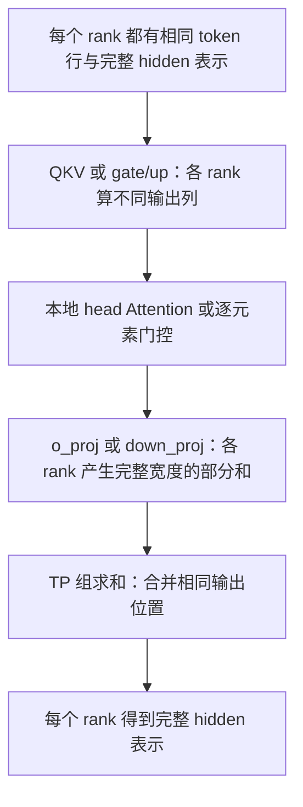
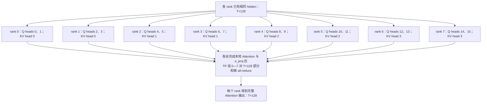
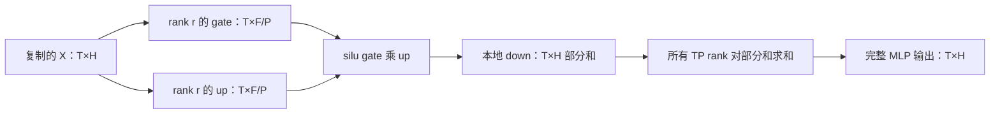
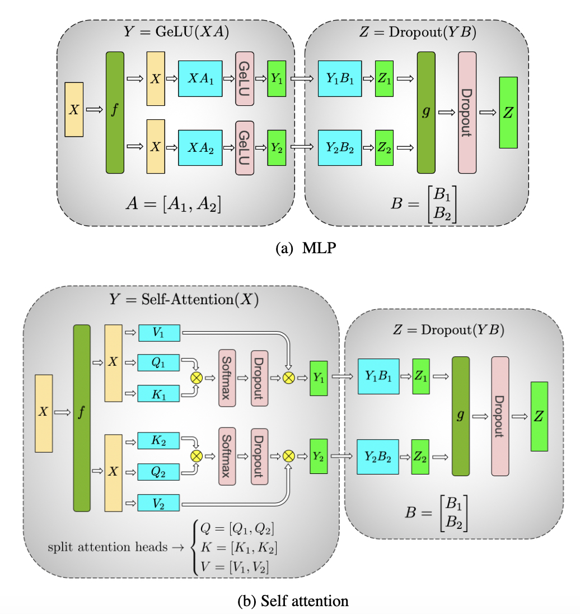
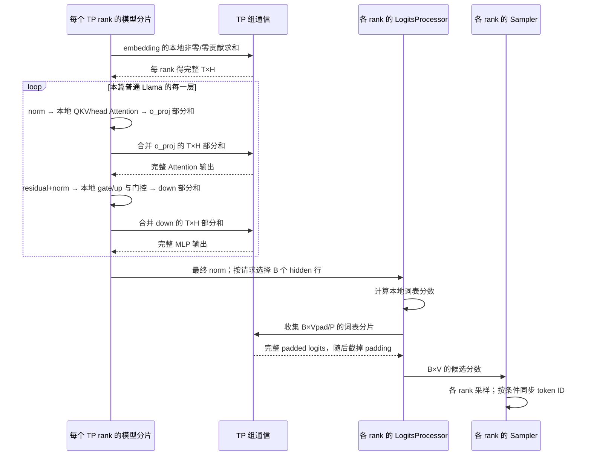

# Tensor Parallel 与层内通信

本文是 **06-02，源码分析型学习资料**。上一篇把进程编号和通信组讲清楚，本篇继续回答：**同一层由八张卡一起计算时，每张卡究竟保存哪部分权重、产生哪部分结果，为什么有时要拼接，有时却要求和？**

## 0. 阅读基线与范围

| 项目 | 内容 |
| --- | --- |
| 源码路径基准 | SGLang 仓库根目录 `.`；所有源码位置使用仓内相对路径 |
| 分支 | `codex/sglang-source-study-20260909`，基于官方 `main` |
| 固定 commit | `72d5c5bb73cadd7ffbf5114e5f81e29d36b6c61a` |
| 读取时间 | `2026-09-10` |
| 工作区状态 | 学习 worktree 干净；原源码工作区及 Wiki 其他未提交资料保留 |
| 操作边界 | 只读源码、编写文档和独立教学算术检查；未导入 SGLang/torch、加载权重、初始化通信或运行 GPU |
| 前置 | [06-01 Rank 与通信](01-Rank进程组与通信基础.md)、[05-02 Llama Forward](../05-model-execution/02-以Llama为例读懂模型Forward.md)、[05-04 Logits 与采样](../05-model-execution/04-Logits采样与输出概率.md) |
| 基础主线 | 原生 LlamaForCausalLM，普通文本、TP=8/PP=1、单实例、eager、无权重量化/LoRA/Overlap；普通 causal Attention，无 CP/DCP/DP Attention/SP |
| 本篇额外限定 | 不启用 LM-head all-to-all、DP LM head、融合/延后 MLP 规约、输入 logprob、grammar、投机或图捕获；普通 token ID 同步开关未设置 |
| 独立对照 | 两卡矩阵手算、KV head 复制、词表 padding、SP 和 LM-head 实现选择；对照不表示整套配置已在硬件上验证 |

固定源码链接支撑**源码事实**。小矩阵、形状表和图是**整理者推导**，用于理解，不是实际模型配置或数值验收。PyTorch 官方 [Linear 文档](https://docs.pytorch.org/docs/2.14/generated/torch.nn.Linear.html)于本日读取，只补充矩阵与权重布局的外部 API 定义；不代表安装环境的 PyTorch 版本。

## 1. 人话版：切任务的两种方法

把一张结果表分给多人做，可以有两种分工：

1. 每人算不同的结果列，最终把列**拼起来**。
2. 每人算每个结果的一部分贡献，最终把贡献**加起来**。

这正是理解 ColumnParallelLinear 和 RowParallelLinear 的起点。“得到一个 `[T,H]` tensor”并不足以判断它已是完整结果：它可能只是本 rank 的 `[T,H]` **部分和**，还没加上其他 rank 的贡献。[S8][S10][S11]

| 概念 | 本篇解释 | 必须区分 |
| --- | --- | --- |
| replicated | 每个 rank 持有相同语义的完整数据 | 不等于这些 rank 不需要交换后续结果 |
| sharded | 每个 rank 持有不同区间 | 需注明按 token、输入特征、输出特征、head 还是词表切 |
| partial sum | 形状完整，但只算了求和中的一部分 | 和“少了几列”不同；all-gather 不能代替 all-reduce |
| column parallel | 按数学权重的输出方向分工 | PyTorch 存储 weight 时常对应第 0 维 |
| row parallel | 按数学权重的输入方向分工 | 每 rank 输出仍可有完整 H 列，但数值未合并 |
| packed projection | 把 Q/K/V 或 gate/up 放入一个本地模块 | 每个逻辑子投影仍须单独确定分片与偏移 |
| KV head replica | 多个 TP rank 保存同一个 K/V head 的投影与状态 | 不是新增不同的 KV head，也不是跨卡共享同一地址 |
| gather logits | 收集不同词表区间的候选分数 | 与最终 token ID 的一致性同步分开 |

先记住一句读代码的方法：**对每个 tensor 同时标出 shape、包含哪些全局元素，以及是否还欠一次规约。**

## 2. Column 和 Row 为什么看起来跟 weight 的行列相反

### 2.1 先统一矩阵记号

令输入 `X:[T,I]`，数学权重 `A:[I,O]`，结果 `Y=X@A+b:[T,O]`。SGLang 的 ColumnParallelLinear 注释采用这个方向；普通未量化权重实际存储为 `W:[O,I]`，计算 `X@W.T+b`。[S8][S12][S13] 这也符合 PyTorch [Linear 的 weight 布局](https://docs.pytorch.org/docs/2.14/generated/torch.nn.Linear.html)。

因此“数学 A 的列切分”就是“存储 W 的行切分”。这里没有相互矛盾，只是转置前后观察方向不同。后文所有 weight shape 使用**源码存储方向 `[out,in]`**。

| 类型 | 每 rank 权重 | 本 rank 输入 | 本 rank 直接输出 | 如何得到完整输出 |
| --- | --- | --- | --- | --- |
| ColumnParallelLinear | `[O/P,I]` | 完整 `[T,I]` | 不同列 `[T,O/P]` | 如有需要，沿最后一维 all-gather |
| RowParallelLinear | `[O,I/P]` | 不同列 `[T,I/P]` | 部分和 `[T,O]` | 对应位置求和 all-reduce |

P 是 TP 组大小。Column 构造时将 output_size 除以 P，Row 将 input_size 除以 P；所用 `divide` 会先检查整除。[S8][S10][S59] 这两行是基础接口，后续会单独说明 QKV 复制与词表 padding。

### 2.2 用两张卡手算，不靠函数名猜

**列切分小例子。** 令 X=`[1,2,3,4]`，W 为四阶单位矩阵。rank 0 保存 W 的前两行，rank 1 保存后两行。两者分别得到 `[1,2]`、`[3,4]`，拼接才是完整 `[1,2,3,4]`。如果下一层正好需要各自的这两列，就可以继续保持分片，不必马上 all-gather。

**行切分小例子。** 保持 X，改用：

```text
W = [[1,1,1,1],
     [1,2,3,4]]

rank 0: X0=[1,2], W0=[[1,1],[1,2]] -> partial0=[3,5]
rank 1: X1=[3,4], W1=[[1,1],[3,4]] -> partial1=[7,25]
sum(partial0,partial1) = [10,30] = X @ W.T
```

两份 partial 都是两列，但任何一份单独都不是正确完整答案。若把它们 all-gather 成 `[3,5,7,25]`，shape 和语义都变了。

Row 的基础路径还只在 TP rank 0 的局部 GEMM 中加 bias，避免规约时被加 P 遍；`skip_bias_add=True` 则将 bias 单独返回给调用者处理。[S11] 若 bias=`[1,-1]`，本例是 rank 0 的 `[4,4]` 加 rank 1 的 `[7,25]`，得到 `[11,29]`。若两边都加一次 bias，就会误得 `[12,28]`。

Llama 本篇 MLP 的 gate/up/down 都无 bias；Attention 的 bias 由 config 决定。[S3][S5] 上述 bias 算例解释通用 Row 接口，不冒充本例 Llama 配置的实际行为。

### 2.3 输入已经切好，与层内部再切分

`RowParallelLinear.input_is_parallel=True` 时直接使用输入；False 时通过 split_tensor_along_last_dim 取本 rank 的部分并 contiguous。`ColumnParallelLinear.gather_output=False` 则把 output_parallel 直接交回。[S9][S11]

这两者能配对：上一层生产各自的列，下一层消费各自的列。中间的逐元素操作可继续按这些列独立做。**省掉中途收集不表示计算没有跨卡依赖**；Row 的部分结果仍需在正确位置合并。

## 3. 固定八卡教学拓扑与形状

### 3.1 这一篇只用一个 TP 组

八个模型 rank 属于同一个 TP 组 `[0,1,2,3,4,5,6,7]`，PP=1，每个 rank 都执行各层的本地分片。它们处理的是同一批 token，不是把 R1 的八个输入 token 各发给一张卡作为八个独立请求。

| 符号 | 含义 | 教学值 |
| --- | --- | ---: |
| P | TP 大小 | 8 |
| T | 本轮进入模型的 token 行数 | R1 首轮 Prefill 为 8；之后单请求 Decode 为 1 |
| B | 本次需要选下一 token 的请求数 | 1 |
| H | hidden_size | 128 |
| Nq / Nkv | 全局 query / KV head 数 | 16 / 4 |
| D | 每个 head 的维度 | 8 |
| F | MLP intermediate_size | 256 |
| V / Vpad | 真实词表 / padding 后词表 | 1000 / 1024 |

数值是为阅读设计的示例，满足这里讨论的整除关系；不保证某个 GPU kernel 支持这组小 head_dim，也没有下载相应模型。R1 仍以 8 个输入 token、3 个输出 token 为教学负载。



**图意解读：** 框表示阶段内数据状态，不是只有一个执行进程。八个 rank 在各自设备上进行相应计算，并共同参与图中的规约。主线中 T 没有被除以 8；切的是特征、head 或词表方向。

下面把同一条 Attention 主线展开到八个 rank，补上阶段目录要求的八卡通信图。图采用上表的 H/Nq/Nkv/D，省略 norm 与后续 MLP。



**图意解读：** 八个 rank 框各对应一个模型工作进程及其设备；X 表示已有的复制输入，C 表示八个成员共同执行的规约，都不是额外的中央进程。箭头展示数据依赖，不指定网卡连接或 collective 算法。相邻两个 rank 的 KV head 身份相同，但各自持有本地权重和 KV 存储；它们的 Q heads 不同。[S5][S18][S19] o_proj 之后合并的是相同 hidden 坐标的部分和，不是把八份 Q 或八份 KV 拼在一起。[S11]

### 3.2 每个 rank 的代表 shape 账本

| 位置 | 每 rank 权重 `[out,in]` | 每 rank 激活 shape | 语义与通信 |
| --- | --- | --- | --- |
| embedding | `[128,128]` | `[T,128]` | 本地词表命中行加非命中零行；普通路径 all-reduce |
| RMSNorm | `[128]` | `[T,128]` | 本篇完整 H 表示与 norm 权重在各 rank 复制 |
| QKV 合并投影 | `[32,128]` | `[T,32]` | Q=16、K=8、V=8 列；无输出 all-gather |
| 拆 Q/K/V | 同上 | Q `[T,16]`；K/V 各 `[T,8]` | Q 2 heads；K/V 各 1 head |
| 本地 Attention 输出 | 不另以本行计算权重 | `[T,16]` | 本地 2 个 query head 的结果 |
| o_proj | `[128,16]` | `[T,128]` 部分和 | 普通 Row 路径 all-reduce 后完整 |
| gate_up_proj | `[64,128]` | `[T,64]` | gate 与 up 各 32 列 |
| SiluAndMul | 无参数 | `[T,32]` | 对本 rank 对应 gate/up 元素计算 |
| down_proj | `[128,32]` | `[T,128]` 部分和 | 普通 Row 路径 all-reduce 后完整 |
| LM head | `[128,128]` | `[B,128]` 局部 logits | 沿词表收集到 `[B,1024]`，再截到 `[B,1000]` |

表由 Llama 的构造与 forward、基础 Linear/Embedding、LogitsProcessor 推出。[S1][S2][S3][S4][S5][S6][S7][S22][S31][S33] 这里的“完整”是数值意义；不同后端还可能采用新输出存储或共享 buffer，不能由 shape 推断是否可原地覆盖。

## 4. Attention：切 query head，必要时复制 KV head

### 4.1 本地 QKV 是分别切好后再合并

`LlamaAttention` 要求 Nq 能被 TP 整除；当 Nkv≥TP 时要求 Nkv 能被 TP 整除，当 Nkv<TP 时要求 TP 能被 Nkv 整除。每 rank 的 KV head 数为 `max(1,Nkv/TP)` 的整数结果。[S5]

`QKVParallelLinear` 显式计算 num_heads、num_kv_heads 与 num_kv_head_replicas，并保持 `gather_output=False`。[S18] 在本例：

```text
num_heads = 16 / 8 = 2
num_kv_heads = 1
num_kv_head_replicas = 8 / 4 = 2
本地 packed QKV = [Q 的 16 列 | K 的 8 列 | V 的 8 列]
```

`forward_prepare_native` 直接按 q_size、kv_size、kv_size split 本地输出，对 Q/K 做 RoPE，再交给 RadixAttention。[S6][S7] 不先收集全体 QKV 再分发。

### 4.2 从 weight_loader 看复制的是谁

本篇普通非量化、非预分片权重路径中，Q 的 loaded_weight 分片号使用 tp_rank；K/V 使用 `kv_tp_rank // num_kv_head_replicas`。普通 Llama 不单独覆盖 kv_tp_rank，因此本例就是 rank//2。[S18][S19]

| TP rank | 本地 Q 对应全局 heads | 本地 K/V 对应全局 head | 本地 Q/K/V 宽度 |
| ---: | --- | ---: | --- |
| 0 | 0、1 | 0 | 16 / 8 / 8 |
| 1 | 2、3 | 0 | 16 / 8 / 8 |
| 2 | 4、5 | 1 | 16 / 8 / 8 |
| 3 | 6、7 | 1 | 16 / 8 / 8 |
| 4 | 8、9 | 2 | 16 / 8 / 8 |
| 5 | 10、11 | 2 | 16 / 8 / 8 |
| 6 | 12、13 | 3 | 16 / 8 / 8 |
| 7 | 14、15 | 3 | 16 / 8 / 8 |

例如 rank 0 与 rank 1 的 Q heads 不同，K/V head 都来自全局 head 0。两边保存/计算自己的本地 K/V，不是 rank 1 每步去读取 rank 0 的显存地址。

一个容易漏掉的容量差别：全局原始 QKV 投影输出宽度是 `128+32+32=192`；但八个 rank 本地权重行数总计 `8×32=256`。多出来的是 K/V 复制。QKV 构造中的 output_size 按本地分片乘 TP 派生，也反映这个分配口径；不能用“checkpoint 总元素数除以 8”核对所有本地参数。[S18][S19]

### 4.3 KV Cache 并不总是随着 TP 线性缩小

RadixAttention 保存本 rank 的 query/KV head 数并据此整理 Q/K/V，后端再按本地 KV 池工作。[S51] 本篇不展开池地址管理，可回看 [05-03 Attention 元数据](../05-model-execution/03-Attention后端与执行元数据.md)。

只计算本例一层、首轮 8 个新 token 的 K/V 数值：每 rank 为 `2×8×1×8=128` 元素；BF16 下 256 字节。八个 rank 共 2048 字节，而四个唯一 KV heads 的逻辑值共 1024 字节。**这只是新增 K/V 数值的教学口径**，不含历史、页 padding、池预留、scale、workspace 或分配器开销。

当 TP 超过 Nkv 后，每 rank 至少仍有一个本例 KV head；继续加 TP 卡数会增加 replica 数。不能再把每卡 KV 大小机械写成总 KV/P，也不能把这里的 GQA 复制推广成所有 MLA/混合 Attention 的规律。

### 4.4 o_proj 合的是不同 heads 对同一 hidden 列的贡献

Attention 输出 `[T,Nq/P×D]` 已是不同 query heads 的分片。o_proj 的 weight 沿输入维切分，每张卡将自己负责的 head 输出乘进 `[T,H]` 部分和，随后普通 Row 路径求和。[S5][S7][S11]

它不是将 `[T,H/P]` 直接拼成 `[T,H]`。QKV 的列切分与 o_proj 的输入切分相接，正好避免了中途构造完整 head 输出。这里的 Attention head 数据流与通信次数限定于本篇普通路径，CP/DCP 会另改数据分布。

## 5. MLP：gate/up 成对分片，down 后再规约

### 5.1 合并模块不是把全局 gate/up 数组平均切八段

`LlamaMLP` 构造 `MergedColumnParallelLinear(H,[F,F])`；forward 接着调用 SiluAndMul，再进入 RowParallelLinear(F,H)。[S3][S4] MergedColumn 的每个 output_size 都分别要求能被 TP 整除。[S16]

本例 rank r 持有 gate 的全局输出 `[32r,32r+32)` 和 up 的同一区间，按本地 `[gate_r,up_r]` 拼成 64 列；元素级门控计算为 `silu(gate_r) * up_r`，仍为 32 列。

MergedColumn 的 weight_loader 用 logical shard_id 区分 gate/up，并分别计算本地目标偏移与 loaded_weight 的切片。[S17] 因此不能把全局 `[gate 全部 256 行, up 全部 256 行]` 直接粗切八等份：那样 rank 0 会只拿到 gate 的 64 行，根本没有与之配对的 up。



**图意解读：** 图展开一个 rank 的两条逻辑投影，实际 gate/up 可由一个合并 GEMM 产出。最后的求和覆盖整个 TP 组；图中没有隐藏的 gate/up 输出 all-gather。

### 5.2 为什么 residual 与 RMSNorm 不能提前吃部分和

普通 LlamaDecoderLayer 在 Attention 输出后做 residual+norm，再进入 MLP；MLP 输出交给下一层的 input_layernorm，或最后一层后的最终 norm。[S2][S60] 本篇普通路径在 o_proj/down_proj 内已经规约，因此 norm 读取的是完整贡献。

**教学反例：** 暂令 epsilon=0，部分和为 a=`[1,0]`、b=`[0,1]`。RMSNorm(a+b) 是 `[1,1]`，而 RMSNorm(a)+RMSNorm(b) 是 `[sqrt(2),sqrt(2)]`，两者不等。这个纯数学算例不使用实际模型的 eps，也没有运行 kernel；它说明不能随意把非线性变换移到规约之前。

源码确有融合与延后规约入口，但要由调用者和后续消费者共同履行契约。`reduce_results=False` 或 `should_skip_mlp_all_reduce()` 为 True 只是改变当前 Row 的行为，**不自动证明后面有人补齐了求和**。[S11][S43]

### 图解补充：列切分和行切分为什么成对出现



[查看原尺寸](../../../images/sglang-source-study/20-tensor-parallel.jpg)。

**图意解读：** 上图先把第一层输出分成两路，再让第二层各自产生部分和并在 g 处合并；下图把 Attention head 分到两路。读图时持续追踪每条路拿到的是完整输入还是部分输出。

**对应本篇源码：** 对照本篇 Column/Row 线性层与 gate/up、down 的分工，检查分片维度及求和发生在哪个边界。 [源码：python/sglang/srt/layers/linear.py][S10]

**来源与边界：** [MegatronLM: Training Billion+ Parameter Language Models Using GPU Model Parallelism](https://research.nvidia.com/labs/adlr/MegatronLM/)，NVIDIA ADLR，2019-08-13。这是 Megatron 的训练模型原图，含 GeLU、Dropout 及训练背景；当前 Llama 推理使用的激活、GQA、QKV 合并与通信分支以正文为准。图中矩阵写法也不等于 PyTorch weight 的存储轴。 [来源档案 F20](../../../images/sglang-source-study/SOURCES.md#f20)。

## 6. 权重怎样变成每张卡上的一片

### 6.1 模块参数和 checkpoint 不是同一个布局

未量化 create_weights 按本地 output_partition_sizes 与 input_size_per_partition 创建 `[out,in]` 参数，标注 input_dim=1、output_dim=0。[S12] ordinary Column loader 沿 output_dim narrow；Row 沿 input_dim narrow，然后检查 shape 并复制。[S14][S15]

| 权重类型 | checkpoint 的逻辑 shape | 本例每 rank shape | 读取切片的关键坐标 |
| --- | --- | --- | --- |
| Q 投影 | `[128,128]` | `[16,128]` | tp_rank×16 的输出行 |
| K/V 各投影 | 各 `[32,128]` | 各 `[8,128]` | `(tp_rank//2)×8` 的输出行 |
| o_proj | `[128,128]` | `[128,16]` | tp_rank×16 的输入列 |
| gate/up 各投影 | 各 `[256,128]` | 各 `[32,128]` | 每个逻辑投影内 tp_rank×32 的输出行 |
| down_proj | `[128,256]` | `[128,32]` | tp_rank×32 的输入列 |
| embedding / untied LM head | 各 `[1000,128]` | 各 `[128,128]` | 本地真实词表行加 padding 零行 |

Llama 权重加载入口会根据 `SGLANG_ENABLE_WEIGHT_LOADER_V2` 在 AutoWeightsLoader 与 legacy 分支间选择。[S20] 本篇对照 legacy 的名称映射：q_proj/k_proj/v_proj 映射到 qkv_proj，gate_proj/up_proj 映射到 gate_up_proj，并把逻辑 shard_id 交给参数 loader。[S21] 这说明“文件中分开的权重”怎样进入“运行时合并的本地模块”，不宣称每次部署必走 legacy。

### 6.2 这些边界不能省略

- **预分片权重：** loader 的 use_presharded_weights 分支会避免再次 narrow；不能把已经按 TP 切好的文件再切一次。[S14][S15][S19]
- **量化权重：** packed_dim、pack_factor、scale、v2 参数类等会改变物理存储与切片逻辑；本篇表只针对未量化路径，不用于验收量化 shard。[S17][S19]
- **词表 padding：** embedding loader 复制本地真实行后将剩余行填零，不能把 padding 行数量当作新增真实 token。[S26]
- **读取与常驻：** 本地 loader 的切片/复制说明参数落在哪里，不等于证明整个权重加载过程只读了文件的八分之一；磁盘读取、临时 tensor 和分发策略要继续追上层加载器。

## 7. 词表两端：embedding 求和，LM head 拼接

### 7.1 输入 token ID 在各 rank 相同，词表行在各 rank 不同

`VocabParallelEmbedding` 默认按词表维切分。先将原始词表按 padding_size 补齐，再分配每 rank 行范围；本例没有 added vocab，默认 padding_size=64，1000 补到 1024，每 rank 128 行。[S22][S23][S27]

rank r 的 padded 词表区间为 `[128r,128r+128)`。例如 token ID 999 由 rank 7 持有，对应本地行 103；rank 7 的全局 1000..1023 是 padding，不是真实 token。

`_embed_local_shard` 使非本 rank 词表范围的输入行输出为零；实现可以走融合 embedding kernel，或先映射安全索引、查表再 mask 成零。普通 forward 在 TP>1 且 input 未 scattered 时对这些 `[T,H]` 输出求和。[S24][S25]

以 token 999 为例：rank 7 贡献它的完整 H 维 embedding，其他七个 rank 贡献零；all-reduce 后每个 rank 都得到该向量。**词表分片不等于 embedding 的 H 维被分成八段。**

### 7.2 LM head 把同一个 hidden 向量打成不同词表区间的分数

未 tied 的 Llama 使用 ParallelLMHead 保存词表分片权重；tied 时 lm_head 引用 embedding 模块。[S29] ParallelLMHead.forward 本身会抛错；普通生成由 LogitsProcessor 使用其权重或 quant_method 计算，并非直接调用 `lm_head(hidden)`。[S28][S30][S34]

本篇不请求输入 logprob，因此 Prefill 先选 R1 最后一个 hidden 行，T=8 变为 B=1；Decode 的单行直接用于下一 token。[S32] 每 rank 用 `[1,128]` hidden 乘本地 `[128,128]` LM-head 权重，得到自己的 `[1,128]` 词表分数。随后沿词表维收集出 `[1,1024]`，截成真实 `[1,1000]`。[S31][S33][S35]

这次要 **all-gather**：rank 0 的列是候选 0..127，rank 1 的列是候选 128..255，列含义不同，不能按位置相加。与 embedding 的“同一 token 的完整向量只有一个非零贡献”不同。

### 7.3 padding 为零仍须从 logits 中截掉

假设真实 1000 个候选分数都为负，其中 ID 999 的 -1 最大，padding 行的分数为 0。若不截断，argmax 会选到第一个 padding ID 1000；截成真实词表后才选到 999。

所以“padding 权重已清零”不代表采样可忽略 padding。`_copy_logits_to_buffer` 在宽度超过 vocab_size 时先切掉尾部，再按缓冲区匹配条件复制或转成 float。[S35] 这里的逻辑词表宽度、传输的 padded 宽度、最终 logits dtype 是三项不同账目。

## 8. 收集 logits 和同步 token ID 是两件事

### 8.1 MultimemAllGatherer 不是只要存在就一定使用特殊 kernel

普通非 DP LM head 的 `_get_logits` 走 `_logits_gatherer`。该对象先按成员拓扑判断是否可保留 multimem 候选；首次合适的 eager 调用再尝试创建对称内存状态。输入须符合 BF16、二维、连续、行数、指针对齐与宽度条件；否则走 `tensor_model_parallel_all_gather(x,dim=-1)`。[S33][S36][S37][S62]

`create_state` 分配共享通信 buffer 并 rendezvous；构造失败或不具备 multicast 能力会使 wrapper 退回普通路径。处于 CUDA Graph capture 而状态尚未建立时，构建会延后，本篇不执行这条路径。[S37][S38]

一个生命周期细节：wrapper 调用 all_gather_inner 时传 `safe=False`，返回的是通信 buffer 的视图；下一次 collective 可覆盖这块存储。LogitsProcessor 后续的截断、复制/转 float 也属于消费者链的一部分。[S36][S39][S35] 不能在别处长期保存该视图，就当作永久独立的完整 logits。

这里静态说明 buffer 和路由的契约，不审计全部同步 kernel 或所有调用序列的并发安全。尤其 skip_entry_sync 的适用性依赖相邻调用间有相应跨 rank 同步，不能作为通用的“去掉 barrier”建议。[S62]

### 8.2 普通路径中各 TP rank 都会选 token

普通生成的实际链路是 `TpModelWorker.forward_batch_generation → ModelRunner.sample → Sampler.forward`。Worker 检查的是是否为最后 PP stage；本篇 PP=1 的八个 TP rank 都满足，并没有在这条普通路径中加“仅 TP rank 0 采样”的条件。[S64][S65]

Sampler 初始化 tp_sync_group 为 TP device_group；DP Attention 时另选 Attention TP 组。[S40] 普通 Sampler.forward 使用收齐的 logits，各 rank 分别执行 greedy 或随机采样，然后进入 `_sync_token_ids_across_tp`。[S41]

本篇没有 grammar，且没有设置 `SYNC_TOKEN_IDS_ACROSS_TP`：该变量经默认 false 的 bool helper 读取，因此同步 helper 不执行那次 collective。[S49][S63][S42] 不能把这条路径画成“只有 rank 0 采样，随后广播所有结果”。

满足开关或 grammar 条件时，源码使用 **MIN all-reduce** 同步 batch_next_token_ids。[S42] 这不是 logits 的求和规约，也不是选择最高 logit。例如两个 rank 已选 token 17 和 29，MIN 会统一成 17；它本身不判断哪一个更符合目标概率分布。

因此要分开验证：各 rank 的 logits 是否一致、采样输入与随机/确定性设置是否一致、最终 token 是否一致。启用 token 同步不能替代前两项数值检查。

### 8.3 为什么本篇不把 LM-head all-to-all 当作普通 TP 流程

当前源码还有 `_can_use_tp_lm_head_all_to_all`：除开关外，要求 LM head 确实按当前 TP 分片，并检查等长 eager/图补齐计数以及 `logits_rows=local_rows×TP` 等条件。[S47] 执行时把连续 logits 展平成一维进行 all-to-all，再按目的 DP 行块重组。[S48]

这是请求行分布与词表分布的组合路径，下一篇 DP Attention 会继续展开。本篇每 rank 持有同一个 R1 的普通 TP 主线采用词表 all-gather，不把这两种数据布局合并成同一张图。

## 9. R1 从 8 行 Prefill 到 1 行 Decode 的通信账本

### 9.1 一次普通模型执行的完整主线



**图意解读：** R/L/S 每个框都代表所有 TP rank 上对应的本地代码，G 是共同通信行为，不是 rank 0 的集中计算服务。本篇参数下每层有两处 Row 输出的求和，embedding 另有一次求和，LM head 另有词表收集。[S2][S7][S4][S11][S25][S33] 这是该普通分支的语义通信账本，不是 profiler 中 kernel 数，也不包含启动、调度元数据、附加打分或其他并行模式的通信。

### 9.2 相同 TP=8，Prefill 与 Decode 的消息大小不同

按 BF16 的 `[T,H]` 普通规约输入，仅计算每 rank 传给通信接口的 tensor 大小：

| 本例项目 | Prefill | 下一轮 Decode | 口径 |
| --- | ---: | ---: | --- |
| T | 8 | 1 | 同一 R1，每 rank 处理相同 token 行 |
| 一份 `[T,128]` 部分和 | 2048 字节 | 256 字节 | T×128×2；不是链路实际发送字节 |
| 每层两个 Row 输出的输入体积合计 | 4096 字节 | 512 字节 | 两次规约的逻辑输入体积相加 |
| 普通 next-token LM head 的 B | 1 | 1 | Prefill 只取最后一行，无输入 logprob |
| 每 rank padded logits `[1,128]` | 256 字节 | 256 字节 | 假定本步骤 BF16，未启 FP32 LM head |
| 最终 `[1,1000]` float logits | 4000 字节 | 4000 字节 | 截断后 float 表示，不等于传输前 dtype |

真实链路流量由 collective 算法、拓扑和实现决定，不能把表中体积直接当网络计数器值。表也不证明 TP=8 比 TP=1 快八倍：一部分激活仍完整复制，K/V 可能复制，小 batch 的计算与通信比例也会变化。性能结论要留待固定硬件与负载的实测。

### 9.3 何时可以释放本轮中间结果

权重 shard 通常跟模型实例存活；QKV、局部 MLP 激活和部分和服务于当前 forward；KV 状态跨 token 留存；logits 与通信临时 buffer 有自己的消费者和复用时点。不能因为 all-reduce 返回就推断整轮 forward、采样和 KV 都已结束。[S11][S39][S41]

各通信后端还可能原地写入或返回新 tensor，调用者应接住返回值并满足 stream 依赖；详见 [06-01 的完成边界](01-Rank进程组与通信基础.md)。本篇没有做跨 stream 复用实验。

## 10. 融合、SP 与跳过规约会怎样改变地图

| 条件 | 当前源码的局部行为 | 需要继续检查什么 |
| --- | --- | --- |
| Column gather_output=True | 收集本地输出列 [S9] | 下一层是否真的需要全列；勿对 QKV/merged packed 布局套用朴素重排 |
| Row reduce_results=False / skip_all_reduce | 可直接返回部分和 [S11] | 后续哪个消费者负责规约，norm/residual 是否在正确顺序 |
| ForwardFlags 发布 fuse_mlp_allreduce / mlp_reduce_scatter | should_skip_mlp_all_reduce 返回 True [S43] | 发布这些标志的具体模型与补偿路径；不是普通 Llama 自动启用的结论 |
| SP 激活 | Column 在 token 维 all-gather 后 GEMM；Row 在 token 维 reduce-scatter [S44][S45] | token padding、SP 进入退出、模式资格；本篇 TP 表的 T 不再直接沿用 |
| all-reduce 实现选择 | GroupCoordinator 依据平台、输入与执行模式选实现 [S50] | 函数名字相同不等于相同 kernel/存储别名/性能 |
| DP LM head / DP Attention | 可能更换 Attention TP 组、收集请求行与重分发 logits [S31][S47] | 06-03 的两种分片坐标 |
| tied embeddings | LM head 可与 embedding 引用同一模块/权重 [S29] | 实际 tp_size、词表 padding、量化支持与输出路径 |

SP 在这里指 LayerNorm 周围的 sequence parallelism，按 token 行改变复制状态；不能仅因都出现“context/sequence”字样就等同后续所有 CP/DCP 方案。

## 11. 从症状回到分片契约

| 现象 | 优先核对 | 源码入口 |
| --- | --- | --- |
| Column 名字与 weight 行切分对不上 | 数学 A 与存储 W=A.T 的方向 | UnquantizedLinearMethod.create_weights、Column 初始化 [S12][S8] |
| 模型能加载但某些 rank 输出不对 | checkpoint 名称、logical shard_id、加载偏移、预分片开关 | QKV/Merged/Row loader [S19][S17][S15] |
| QKV 总参数按 1/P 对不上 | KV head replica 数与真实 head 映射 | QKV 初始化和 loader [S18][S19] |
| MLP 的 shape 正确但数值完全错 | gate_r 与 up_r 是否对应相同全局区间 | MergedColumn loader [S17] |
| Row 输出每 rank 不同 | 它是 partial 还是完整结果；规约是否被跳过 | Row.forward 与 ForwardFlags [S11][S43] |
| bias 变成原来的 P 倍 | 是否每个局部贡献都加了相同 bias | Row.forward [S11] |
| 出现超出 vocab 的 token | 是否先截去 padding；候选 ID 是否是全局词表坐标 | logits 截断与 sampler [S35][S41] |
| 返回 token 各 rank 不同 | logits 差异、采样设置、grammar/同步开关 | Sampler.forward 与 token 同步 [S41][S42] |
| logits 偶尔被后一次覆盖 | 是否保存了 multimem 共享 buffer 视图 | all_gather_inner 与复制出口 [S39][S35] |
| TP 增大但每卡 KV 不再下降 | 是否 Nkv<TP 并产生 replica | LlamaAttention.__init__ [S5] |
| trace 没有预期的 NCCL gather | 是否走 multimem 或另一个合法后端分支 | MultimemAllGatherer 与 GroupCoordinator [S36][S50] |

排查账本建议至少包含：`TP 成员/本地 rank → 模型层/投影 → 全局与本地 weight shape → token/head/vocab 区间 → partial 标记 → 实际通信组/实现 → 返回存储与消费时点`。这些是应记录的证据字段，不表示现有日志会自动包含全部字段。

## 12. 源码测试阅读、静态验收与练习

### 12.1 两份测试文件，不能替代 TP 模型验证

本篇读取以下 **6 条 test 定义**，均未执行：[S53][S54][S55][S56][S57][S58]

| 测试 | 文件相对于 SGLang 根目录 | 实际测试体覆盖 | 边界 |
| --- | --- | --- | --- |
| test_vocab_parallel_embedding_no_added_vocab | `test/registered/kernels/ops/embeddings/test_vocab_parallel_embedding.py` | 单设备本地 shard 的合法/非本地 ID、dtype 和维度组合；与 mask+embedding 参考精确比较 | 不进行 TP all-reduce |
| test_vocab_parallel_embedding_added_vocab_with_padding | 同上 | added vocab 与本地 padding 索引映射 | 不验证完整模型 LoRA/词表分布 |
| test_vocab_parallel_embedding_strided_weight | 同上 | weight 行 stride 大于 hidden_dim 的本地读取 | 不代表任意非连续布局均支持 |
| test_vocab_parallel_embedding_empty_input | 同上 | 空输入输出契约 | 不能证明多 rank 空/非空组合正确 |
| test_use_triton_embedding_gate | 同上 | stub layer 的后端资格与排除条件 | 不构造分布式 embedding 层 |
| test_symm_mem_all_gather | `test/registered/kernels/ops/communication/test_symm_mem_all_gather.py` | BF16 多 rank gather 对比 NCCL 参考，safe/skip_entry_sync 参数，循环前 barrier，结果 clone 后 atol=rtol=0 | 只读到该测试体直接调用 gather；不把文件说明中“CUDA-graph modes”当作已读到 capture/replay 的证据 |

后一个文件的实际 main 调用 multigpu_pytest_main 并给出 num_gpus=(4,8)，还有 multicast 能力的 skip；文件开头的旧目录使用示例不作为当前可复制命令。单设备 embedding kernel 的零容差比较与纯复制 gather 的零容差比较，不能推广成 TP 矩阵规约必与 TP=1 逐位一致。

### 12.2 本次完成与仍缺的证据

本篇完成了两卡线性矩阵/偏置手算、八卡 Q/KV head 映射、QKV 复制容量、MLP 子分片、词表 padding/候选截断、Prefill/Decode shape 与字节账本的独立算术核对，以及源码锚点和文档结构检查。检查脚本只使用标准库，不导入或执行 SGLang 源码。

还没有：TP=1/TP=8 同权重同输入的 hidden/logits 对照、真实权重加载、设备数值与多进程一致性、跨 stream 复用、通信性能或服务吞吐测试。Mermaid 仅检查静态结构和图文关系，没有渲染截图验收。

若后续开展运行对照，应按顺序比较权重 shard、每层规约后的完整输出、全词表 logits，最后才比较 token。随机 token 相同或一句回答看起来合理，都不足以单独证明各层计算正确。

### 12.3 按数据状态回到源码

| 要追的边界 | 仓内相对源码位置 | 固定入口 |
| --- | --- | --- |
| 列分片何时收集 | `python/sglang/srt/layers/linear.py::ColumnParallelLinear.forward` | [Column][S9] |
| 部分和何时规约 | `python/sglang/srt/layers/linear.py::RowParallelLinear.forward` | [Row][S11] |
| KV replica 加载哪一份 | `python/sglang/srt/layers/linear.py::QKVParallelLinear.weight_loader` | [QKV loader][S19] |
| 本地 heads 怎样使用 | `python/sglang/srt/models/llama.py::LlamaAttention.forward` | [Attention][S7] |
| gate/up 怎样衔接 down | `python/sglang/srt/models/llama.py::LlamaMLP.forward` | [MLP][S4] |
| 本地词表向量怎样合并 | `python/sglang/srt/layers/vocab_parallel_embedding.py::VocabParallelEmbedding.forward` | [Embedding][S25] |
| 候选分数何时拼成全词表 | `python/sglang/srt/layers/logits_processor.py::LogitsProcessor._get_logits` | [Logits][S33] |
| 共享收集结果活多久 | `python/sglang/srt/distributed/device_communicators/triton_symm_mem_ag.py::all_gather_inner` | [Buffer][S39] |
| token 同步依据什么 | `python/sglang/srt/layers/sampler.py::Sampler._sync_token_ids_across_tp` | [Token sync][S42] |

### 12.4 自测与答案

1. **Row 的两个 rank 都返回 `[T,H]`，为什么还要 all-reduce？** 它们是相同输出坐标的不同贡献，不是重复算出的完整答案。
2. **本例 rank 5 使用哪些 heads？** Q heads 10、11；K/V 都对应全局 KV head 2。
3. **为什么 QKV 本地行数相加是 256，而原始全局宽度为 192？** 四个 K/V heads 在八个 rank 上各复制两份；Q 不复制。
4. **gate/up 全局拼在一起再切八段，和源码有什么差别？** 源码先分别选同一 rank 的 gate/up 区间再放入本地模块，保证元素配对。
5. **embedding 与 LM head 都切词表，为什么前者求和、后者拼接？** 前者每个 token 的 H 维向量只由拥有该词表行的 rank 贡献；后者每 rank 计算不同 token 候选的分数。
6. **MIN 同步 token ID 是否代表选出了全局最高分 token？** 不是，它只对已选 ID 求最小值；正确性还依赖此前 logits 与采样过程。
7. **Prefill 有 8 个 token，本篇每 rank 都计算 8 行吗？** 是，普通 TP 按特征/head 切；SP 等按 token 行改变布局的分支已单独列出。

### 12.5 本篇记住什么

TP 的核心不是“把所有 tensor 除以卡数”，而是让相邻算子的分片方向配合：列切分产生局部特征，行切分产生待规约贡献；Attention 要考虑 KV head 复制，词表两端又分别需要求和与收集。沿着全局元素身份和欠下的规约逐步追踪，才能解释一条请求在多卡上的真实计算含义。

上一篇：[06-01《Rank、进程组与通信基础》](01-Rank进程组与通信基础.md)。下一篇：[06-03《Data Parallel 与 DP Attention》](03-DataParallel与DPAttention.md)。返回[系列目录](../README.md)与[学习进度](../appendices/06-学习进度与版本变更记录.md)。

[S1]: https://github.com/sgl-project/sglang/blob/72d5c5bb73cadd7ffbf5114e5f81e29d36b6c61a/python/sglang/srt/models/llama.py#L283
[S2]: https://github.com/sgl-project/sglang/blob/72d5c5bb73cadd7ffbf5114e5f81e29d36b6c61a/python/sglang/srt/models/llama.py#L340
[S3]: https://github.com/sgl-project/sglang/blob/72d5c5bb73cadd7ffbf5114e5f81e29d36b6c61a/python/sglang/srt/models/llama.py#L71
[S4]: https://github.com/sgl-project/sglang/blob/72d5c5bb73cadd7ffbf5114e5f81e29d36b6c61a/python/sglang/srt/models/llama.py#L110
[S5]: https://github.com/sgl-project/sglang/blob/72d5c5bb73cadd7ffbf5114e5f81e29d36b6c61a/python/sglang/srt/models/llama.py#L138
[S6]: https://github.com/sgl-project/sglang/blob/72d5c5bb73cadd7ffbf5114e5f81e29d36b6c61a/python/sglang/srt/models/llama.py#L218
[S7]: https://github.com/sgl-project/sglang/blob/72d5c5bb73cadd7ffbf5114e5f81e29d36b6c61a/python/sglang/srt/models/llama.py#L239
[S8]: https://github.com/sgl-project/sglang/blob/72d5c5bb73cadd7ffbf5114e5f81e29d36b6c61a/python/sglang/srt/layers/linear.py#L334
[S9]: https://github.com/sgl-project/sglang/blob/72d5c5bb73cadd7ffbf5114e5f81e29d36b6c61a/python/sglang/srt/layers/linear.py#L492
[S10]: https://github.com/sgl-project/sglang/blob/72d5c5bb73cadd7ffbf5114e5f81e29d36b6c61a/python/sglang/srt/layers/linear.py#L1449
[S11]: https://github.com/sgl-project/sglang/blob/72d5c5bb73cadd7ffbf5114e5f81e29d36b6c61a/python/sglang/srt/layers/linear.py#L1612
[S12]: https://github.com/sgl-project/sglang/blob/72d5c5bb73cadd7ffbf5114e5f81e29d36b6c61a/python/sglang/srt/layers/quantization/unquant.py#L434
[S13]: https://github.com/sgl-project/sglang/blob/72d5c5bb73cadd7ffbf5114e5f81e29d36b6c61a/python/sglang/srt/layers/quantization/unquant.py#L460
[S14]: https://github.com/sgl-project/sglang/blob/72d5c5bb73cadd7ffbf5114e5f81e29d36b6c61a/python/sglang/srt/layers/linear.py#L410
[S15]: https://github.com/sgl-project/sglang/blob/72d5c5bb73cadd7ffbf5114e5f81e29d36b6c61a/python/sglang/srt/layers/linear.py#L1519
[S16]: https://github.com/sgl-project/sglang/blob/72d5c5bb73cadd7ffbf5114e5f81e29d36b6c61a/python/sglang/srt/layers/linear.py#L546
[S17]: https://github.com/sgl-project/sglang/blob/72d5c5bb73cadd7ffbf5114e5f81e29d36b6c61a/python/sglang/srt/layers/linear.py#L584
[S18]: https://github.com/sgl-project/sglang/blob/72d5c5bb73cadd7ffbf5114e5f81e29d36b6c61a/python/sglang/srt/layers/linear.py#L978
[S19]: https://github.com/sgl-project/sglang/blob/72d5c5bb73cadd7ffbf5114e5f81e29d36b6c61a/python/sglang/srt/layers/linear.py#L1201
[S20]: https://github.com/sgl-project/sglang/blob/72d5c5bb73cadd7ffbf5114e5f81e29d36b6c61a/python/sglang/srt/models/llama.py#L662
[S21]: https://github.com/sgl-project/sglang/blob/72d5c5bb73cadd7ffbf5114e5f81e29d36b6c61a/python/sglang/srt/models/llama.py#L669
[S22]: https://github.com/sgl-project/sglang/blob/72d5c5bb73cadd7ffbf5114e5f81e29d36b6c61a/python/sglang/srt/layers/vocab_parallel_embedding.py#L231
[S23]: https://github.com/sgl-project/sglang/blob/72d5c5bb73cadd7ffbf5114e5f81e29d36b6c61a/python/sglang/srt/layers/vocab_parallel_embedding.py#L351
[S24]: https://github.com/sgl-project/sglang/blob/72d5c5bb73cadd7ffbf5114e5f81e29d36b6c61a/python/sglang/srt/layers/vocab_parallel_embedding.py#L531
[S25]: https://github.com/sgl-project/sglang/blob/72d5c5bb73cadd7ffbf5114e5f81e29d36b6c61a/python/sglang/srt/layers/vocab_parallel_embedding.py#L578
[S26]: https://github.com/sgl-project/sglang/blob/72d5c5bb73cadd7ffbf5114e5f81e29d36b6c61a/python/sglang/srt/layers/vocab_parallel_embedding.py#L453
[S27]: https://github.com/sgl-project/sglang/blob/72d5c5bb73cadd7ffbf5114e5f81e29d36b6c61a/python/sglang/srt/layers/vocab_parallel_embedding.py#L57
[S28]: https://github.com/sgl-project/sglang/blob/72d5c5bb73cadd7ffbf5114e5f81e29d36b6c61a/python/sglang/srt/layers/vocab_parallel_embedding.py#L679
[S29]: https://github.com/sgl-project/sglang/blob/72d5c5bb73cadd7ffbf5114e5f81e29d36b6c61a/python/sglang/srt/models/llama.py#L517
[S30]: https://github.com/sgl-project/sglang/blob/72d5c5bb73cadd7ffbf5114e5f81e29d36b6c61a/python/sglang/srt/models/llama.py#L562
[S31]: https://github.com/sgl-project/sglang/blob/72d5c5bb73cadd7ffbf5114e5f81e29d36b6c61a/python/sglang/srt/layers/logits_processor.py#L376
[S32]: https://github.com/sgl-project/sglang/blob/72d5c5bb73cadd7ffbf5114e5f81e29d36b6c61a/python/sglang/srt/layers/logits_processor.py#L532
[S33]: https://github.com/sgl-project/sglang/blob/72d5c5bb73cadd7ffbf5114e5f81e29d36b6c61a/python/sglang/srt/layers/logits_processor.py#L769
[S34]: https://github.com/sgl-project/sglang/blob/72d5c5bb73cadd7ffbf5114e5f81e29d36b6c61a/python/sglang/srt/layers/logits_processor.py#L857
[S35]: https://github.com/sgl-project/sglang/blob/72d5c5bb73cadd7ffbf5114e5f81e29d36b6c61a/python/sglang/srt/layers/logits_processor.py#L1041
[S36]: https://github.com/sgl-project/sglang/blob/72d5c5bb73cadd7ffbf5114e5f81e29d36b6c61a/python/sglang/srt/distributed/device_communicators/triton_symm_mem_ag.py#L493
[S37]: https://github.com/sgl-project/sglang/blob/72d5c5bb73cadd7ffbf5114e5f81e29d36b6c61a/python/sglang/srt/distributed/device_communicators/triton_symm_mem_ag.py#L521
[S38]: https://github.com/sgl-project/sglang/blob/72d5c5bb73cadd7ffbf5114e5f81e29d36b6c61a/python/sglang/srt/distributed/device_communicators/triton_symm_mem_ag.py#L314
[S39]: https://github.com/sgl-project/sglang/blob/72d5c5bb73cadd7ffbf5114e5f81e29d36b6c61a/python/sglang/srt/distributed/device_communicators/triton_symm_mem_ag.py#L359
[S40]: https://github.com/sgl-project/sglang/blob/72d5c5bb73cadd7ffbf5114e5f81e29d36b6c61a/python/sglang/srt/layers/sampler.py#L97
[S41]: https://github.com/sgl-project/sglang/blob/72d5c5bb73cadd7ffbf5114e5f81e29d36b6c61a/python/sglang/srt/layers/sampler.py#L123
[S42]: https://github.com/sgl-project/sglang/blob/72d5c5bb73cadd7ffbf5114e5f81e29d36b6c61a/python/sglang/srt/layers/sampler.py#L647
[S43]: https://github.com/sgl-project/sglang/blob/72d5c5bb73cadd7ffbf5114e5f81e29d36b6c61a/python/sglang/srt/layers/moe/utils.py#L668
[S44]: https://github.com/sgl-project/sglang/blob/72d5c5bb73cadd7ffbf5114e5f81e29d36b6c61a/python/sglang/srt/layers/layernorm_sp.py#L198
[S45]: https://github.com/sgl-project/sglang/blob/72d5c5bb73cadd7ffbf5114e5f81e29d36b6c61a/python/sglang/srt/layers/layernorm_sp.py#L222
[S47]: https://github.com/sgl-project/sglang/blob/72d5c5bb73cadd7ffbf5114e5f81e29d36b6c61a/python/sglang/srt/layers/logits_processor.py#L977
[S48]: https://github.com/sgl-project/sglang/blob/72d5c5bb73cadd7ffbf5114e5f81e29d36b6c61a/python/sglang/srt/layers/logits_processor.py#L1016
[S49]: https://github.com/sgl-project/sglang/blob/72d5c5bb73cadd7ffbf5114e5f81e29d36b6c61a/python/sglang/srt/layers/sampler.py#L69
[S50]: https://github.com/sgl-project/sglang/blob/72d5c5bb73cadd7ffbf5114e5f81e29d36b6c61a/python/sglang/srt/distributed/parallel_state.py#L650
[S51]: https://github.com/sgl-project/sglang/blob/72d5c5bb73cadd7ffbf5114e5f81e29d36b6c61a/python/sglang/srt/layers/radix_attention.py#L103
[S53]: https://github.com/sgl-project/sglang/blob/72d5c5bb73cadd7ffbf5114e5f81e29d36b6c61a/test/registered/kernels/ops/embeddings/test_vocab_parallel_embedding.py#L45
[S54]: https://github.com/sgl-project/sglang/blob/72d5c5bb73cadd7ffbf5114e5f81e29d36b6c61a/test/registered/kernels/ops/embeddings/test_vocab_parallel_embedding.py#L63
[S55]: https://github.com/sgl-project/sglang/blob/72d5c5bb73cadd7ffbf5114e5f81e29d36b6c61a/test/registered/kernels/ops/embeddings/test_vocab_parallel_embedding.py#L78
[S56]: https://github.com/sgl-project/sglang/blob/72d5c5bb73cadd7ffbf5114e5f81e29d36b6c61a/test/registered/kernels/ops/embeddings/test_vocab_parallel_embedding.py#L95
[S57]: https://github.com/sgl-project/sglang/blob/72d5c5bb73cadd7ffbf5114e5f81e29d36b6c61a/test/registered/kernels/ops/embeddings/test_vocab_parallel_embedding.py#L121
[S58]: https://github.com/sgl-project/sglang/blob/72d5c5bb73cadd7ffbf5114e5f81e29d36b6c61a/test/registered/kernels/ops/communication/test_symm_mem_all_gather.py#L126
[S59]: https://github.com/sgl-project/sglang/blob/72d5c5bb73cadd7ffbf5114e5f81e29d36b6c61a/python/sglang/srt/distributed/utils.py#L60
[S60]: https://github.com/sgl-project/sglang/blob/72d5c5bb73cadd7ffbf5114e5f81e29d36b6c61a/python/sglang/srt/models/llama.py#L418
[S62]: https://github.com/sgl-project/sglang/blob/72d5c5bb73cadd7ffbf5114e5f81e29d36b6c61a/python/sglang/srt/distributed/device_communicators/triton_symm_mem_ag.py#L459
[S63]: https://github.com/sgl-project/sglang/blob/72d5c5bb73cadd7ffbf5114e5f81e29d36b6c61a/python/sglang/srt/utils/common.py#L1250
[S64]: https://github.com/sgl-project/sglang/blob/72d5c5bb73cadd7ffbf5114e5f81e29d36b6c61a/python/sglang/srt/managers/tp_worker.py#L593
[S65]: https://github.com/sgl-project/sglang/blob/72d5c5bb73cadd7ffbf5114e5f81e29d36b6c61a/python/sglang/srt/model_executor/model_runner.py#L1884
