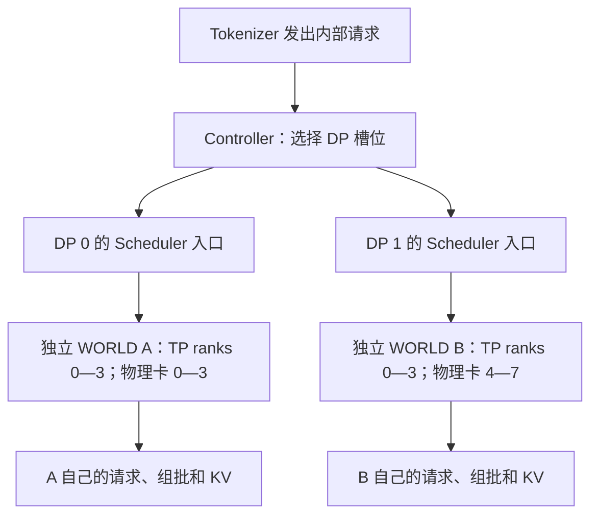
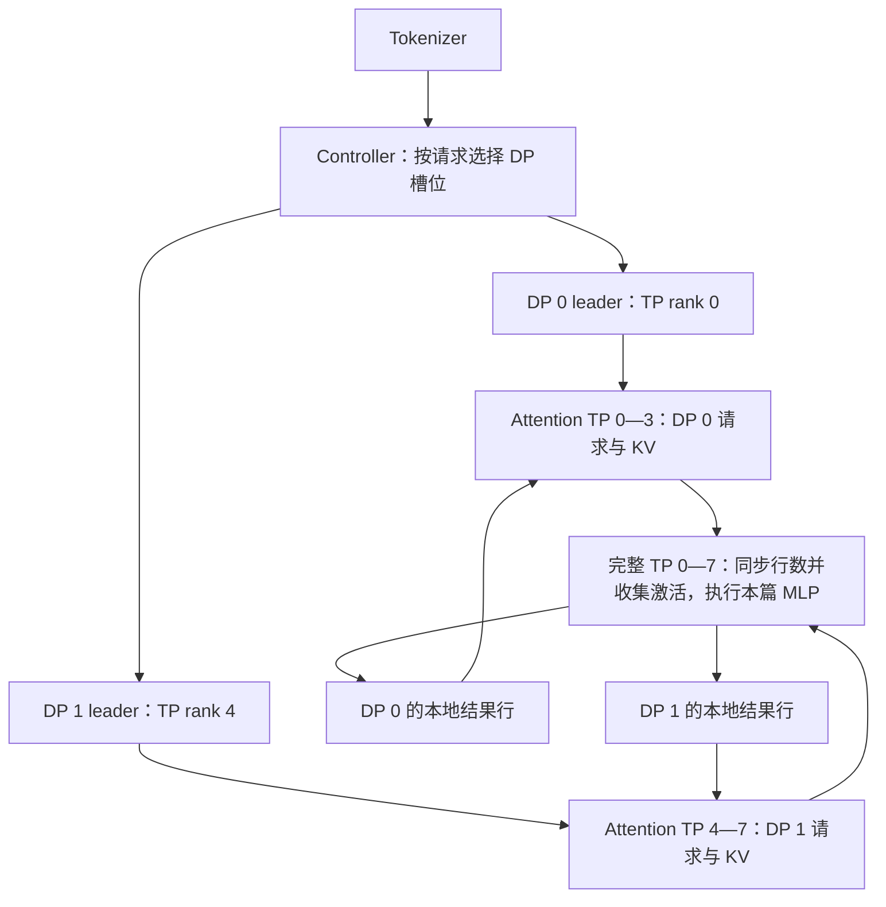
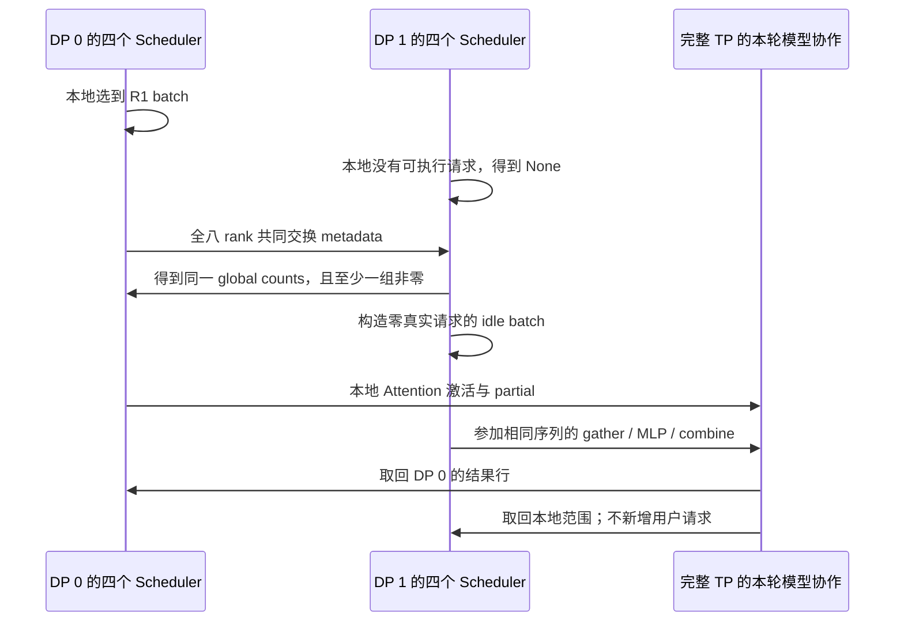

# Data Parallel 与 DP Attention

> **先建立架构心智模型：** [M07 · 并行部署与通信拓扑](<../architecture/07-并行部署与通信拓扑.md>)。先看职责、数据和生命周期，再回到本篇源码细节。

本文是 **06-03，源码分析型学习资料**。本篇回答：**请求被分给不同 DP 后，哪些工作可以各自推进，哪些步骤仍必须由多张卡共同完成？** 先分清三种部署/执行层次，再沿一条请求走到调度同步、模型层通信和输出归属。

## 0. 阅读基线与范围

| 项目 | 内容 |
| --- | --- |
| 源码路径基准 | SGLang 仓库根目录 `.`；源码位置全部使用仓内相对路径 |
| 分支 | `codex/sglang-source-study-20260909`，基于官方 `main` |
| 固定 commit | `72d5c5bb73cadd7ffbf5114e5f81e29d36b6c61a` |
| 读取时间 | `2026-09-10` |
| 工作区状态 | 学习 worktree 干净；原源码工作区及 Wiki 其他未提交资料保留 |
| 操作边界 | 只读源码、编写文档、独立教学算术与引用检查；未导入 SGLang/torch、初始化通信、加载模型或运行测试 |
| 前置 | [06-01 Rank 与通信](01-Rank进程组与通信基础.md)、[06-02 TP 层内通信](02-TensorParallel与层内通信.md)、[03-01 调度主循环](../03-scheduling/01-NormalEventLoop与调度主循环.md) |
| 请求与拓扑主线 | 普通文本、单节点八卡、PP=1、CP/DCP=1；固定成员、无 PD、无弹性扩缩容 |
| DP Attention 主线 | TP=8、DP=2、Attention TP=4；eager、关闭 Overlap/TBO/图捕获与投机，无 offload tags |
| 模型层代表 | `DeepseekV2DecoderLayer` 的普通 Dense MLP 层，`moe_dense_tp_size=None`，使用 LayerCommunicator；无 SP、Attention 输入分散、量化通信、融合/延后 MLP 规约 |
| 输出与对照边界 | 普通 TP LM head，不启用 DP LM head 或 TP LM-head all-to-all；MoE A2A、Gatherv、FP8 gather、混合 SSM、CP 与图仅列差异，不纳入手算主线 |

本篇使用 **DeepSeek 实现中的 Dense 层**说明 Attention/MLP 之间的分布转换，不把上一篇原生 Llama 的普通 TP 路径直接改名为 DP Attention。表中的小数字是整理者教学推导，不是可直接启动的完整模型配置或实测结果。各项源码规则允许某个局部选择，也不等于整套硬件组合已经验收。

## 1. 人话版：同一个“DP”可能在说三件事

可以把服务想成接单和计算两个层次：接单员先决定把哪份作业交给哪组人；每组人内部再决定今天一起算哪些内容。

| 层次 | 请求分给谁 | 计算怎样组织 | 本篇定位 |
| --- | --- | --- | --- |
| 多个独立服务实例 | 外部客户端/网关选择不同服务端点 | 各实例拥有自己的启动、队列与模型进程组 | 部署层概念；网关策略留待服务工程阶段 |
| 引擎内普通 DP | 一个 DataParallelController 分到多个 worker 入口 | 每个 DP 各启动一套 TP/PP 进程组 | 一套服务入口下的多副本调度 |
| DP Attention | Controller 分到不同 Attention DP 分片 | Attention 处理不同请求；本篇 MLP 跨全部 TP rank 处理收集后的 token 行 | 请求归属分开，部分模型计算仍耦合 |

固定基线的 multiprocessing 启动入口在 `dp_size>1` 或弹性 scale 模式下启动 Controller；Controller 再根据 `enable_dp_attention` 选择两种启动方式。[S1][S2] 所以 **“有 Controller”不能单独证明开启了 DP Attention**。

### 1.1 术语速查

| 术语 | 人话解释 | 不要混淆 |
| --- | --- | --- |
| DP worker / workers 列表 | Controller 保存的路由槽位及其发送 socket | 一个槽位可以对应多个 Scheduler rank，不是一张 GPU |
| Attention DP rank | 本请求归属的 Attention 分片编号 | 与完整 TP 组里的 `tp_rank` 不是同一坐标 |
| Attention TP rank | 同一 Attention 分片内的计算分工编号 | 不等于完整 TP rank |
| load budget | Controller 根据快照及刚派出的请求维护的估计账本 | 不是 GPU 的实时准入预算或可靠完成确认 |
| MLP sync metadata | 本轮 token 数、模式与图/TBO 资格等字段 | 不含请求正文、hidden states 或 KV 数据 |
| partial hidden | 每 rank 只算了部分加法贡献的激活 | 即使 H 维完整，也还不是完整值 |
| SUM_LEN / MAX_LEN | 不同 DP 的行数如何组成通信布局 | SUM_LEN 也可能已经按 Attention TP 补齐 |
| idle batch | 本地没有真实请求、但要参与协作的批次描述 | 不表示新增了用户请求，也不等于整个服务空闲 |

## 2. 八张卡，两种完全不同的组织方式

### 2.1 普通 DP：DP=2、TP=4、PP=1

`launch_dp_schedulers` 循环启动两套 TP 组，为它们准备不同的 NCCL 初始化端口和 Scheduler 输入入口；每组的 GPU 起点按 `tp_size * pp_size * gpu_id_step` 增加。[S3] 在单节点、GPU 起点 0、步长 1 的教学条件下：



**图意解读：** 两个 WORLD 的 rank 都可以从 0 开始；WORLD B 的 rank 0 在本例位于物理卡 4。它们可以共享服务侧的 Tokenizer/Detokenizer 通道，但这不把两套模型通信组变成一个八 rank 的 TP 组。普通 DP 的 R1 和 R2 不需要每层跨副本汇总 MLP 输入。[S3][S5]

### 2.2 DP Attention：TP=8、DP=2、PP=1

`launch_dp_attention_schedulers` 为 DP 槽位准备入口，再只调用一次 `launch_tensor_parallel_group`。其各 rank 共用同一 NCCL 初始化端口；DP 编号从 TP 编号推导。[S4][S5]

在本例 CP=1 时，源码公式为：[S6][S7]

```text
attn_dp_size = 2
attn_tp_size = tp_size / attn_dp_size / attn_cp_size = 8/2/1 = 4
attn_tp_rank = tp_rank % 4
attn_dp_rank = tp_rank // 4
```

| 完整 TP rank | 物理卡，本例 | Attention DP rank | Attention TP rank | 收到哪组工作请求 |
| ---: | ---: | ---: | ---: | --- |
| 0 | 0 | 0 | 0 | DP 0；本组入口 leader |
| 1 | 1 | 0 | 1 | DP 0 |
| 2 | 2 | 0 | 2 | DP 0 |
| 3 | 3 | 0 | 3 | DP 0 |
| 4 | 4 | 1 | 0 | DP 1；本组入口 leader |
| 5 | 5 | 1 | 1 | DP 1 |
| 6 | 6 | 1 | 2 | DP 1 |
| 7 | 7 | 1 | 3 | DP 1 |

进程组构造相应得到 Attention TP `[0,1,2,3]`、`[4,5,6,7]`，完整 TP 为 `[0,1,2,3,4,5,6,7]`。[S8]



**图意解读：** 方框按职责分层，并非另有一个中央 MLP 进程。中间的 MLP 由原来的八个 rank 共同执行，每个 rank 保存本地权重分片。循环箭头表示跨层重复切换数据布局；本篇 gather 的是本轮激活，不是把两组的完整请求队列和 KV 池合并。[S33][S34][S38]

同为八卡，普通 DP 的本例是 `DP×TP×PP=2×4×1`；DP Attention 的 DP 维包含在完整 TP 内，本例模型进程数是 `TP×PP=8×1`。不要看到 `TP=8,DP=2` 就自动算成十六张卡。[S3][S5]

## 3. Controller 决定路由，Scheduler 决定组批

### 3.1 一条 R1 怎样离开 Controller

生成/Embedding 的内部单请求进入 `dispatching_with_trace`；显式 batch 输入则先刷新一次负载，再逐条派发。这个 batch 包装并不承诺所有请求落到同一 DP。[S12][S17]

| 策略 | 当前基础选择规则 | 使用什么信息 | 边界 |
| --- | --- | --- | --- |
| ROUND_ROBIN | 在 active 槽位中轮转，跳过 `status=False` | 轮转计数与状态 | 不比较前缀命中、token 工作量 |
| TOTAL_REQUESTS | 选 `total_requests` 最小的首个槽位 | 快照 running+waiting，加已派发的估计增量 | 不是选最短预测延迟 |
| TOTAL_TOKENS | 先比 token 数，再比请求数 | `num_total_tokens` 与新请求 `len(input_ids)` | 没有在这里预测未来生成长度 |
| FOLLOW_BOOTSTRAP_ROOM | `bootstrap_room % len(workers)` | bootstrap room | 用于分离路径的对应关系；不作为本篇普通文本路由方法 |
| 显式 `routed_dp_rank` | 检查范围、active 槽位与 socket 后直接发送 | 外部已指定的 DP rank | 优先于上述策略；绕过对应轮转/预算增量 |

规则对应 `DPBudget.dispatch` 与各 scheduler 方法。[S10][S13][S14][S15][S16] `total_requests_scheduler` 和 `total_tokens_scheduler` 名字中的 scheduler 指 Controller 内的**路由函数**，不要与模型进程中的 `Scheduler.get_next_batch_to_run` 混为一谈。

本基线有一个需要保留的细节：普通 ROUND_ROBIN 检查 `status`，而两种 budget 策略直接按账本选槽位，并不以相同方式筛选 `status`；测试也记录了这项差异。[S10][S14][S16][S67] 本篇的主线限定固定成员、全部可用，不把该机制写成已经验证的故障切换方案。

### 3.2 TOTAL_TOKENS 的估计账本

普通非 PD 路径的快照从本地池统计取得 `num_used_tokens`，再加等待队列的 `req.seqlen` 得到 `num_total_tokens`。[S59] 因此它既不是本轮模型输入行数，也不是只统计未命中前缀的 Prefill 工作量。

Controller 用新 timestamp 的快照覆盖相应 DP 的账本；相同 timestamp 跳过。刷新最多每 20ms 一次；每派出一条请求立即增加估计请求数，TOTAL_TOKENS 再加输入 token 数。[S9][S10][S11] 时间戳判断是“相同则跳过”，不要把它描述成完整的乱序快照协议。

**教学例子，假设没有中途刷新：** 初始 token 账本 `[100,100]`、请求账本 `[2,1]`。

| 步骤 | 新请求输入长度 | 选中的 DP | 派发后的 tokens | 派发后的 requests |
| --- | ---: | ---: | --- | --- |
| 初始 | — | — | `[100,100]` | `[2,1]` |
| 派发 R1 | 8 | 1，token 平局时请求更少 | `[100,108]` | `[2,2]` |
| 派发 R2 | 6 | 0 | `[106,108]` | `[3,2]` |
| 派发 R3 | 3 | 0 | `[109,108]` | `[4,2]` |

这个例子独立解释负载策略；第 5 节的模型执行例子使用另一组已确定的请求归属。增量账本有助于避免一批新到请求都按同一旧快照决策，但它不是实时精确负载，也没有宣布请求已经进入模型或完成输出。

### 3.3 工作消息和控制消息走不同范围

Controller 的 typed dispatcher 把普通生成请求交给路由策略，Block/Profile 有专门的扇出路径，其余控制消息走 fallback。DP Attention 下，默认控制消息只送第一个 DP leader，由其在完整 TP 组广播；启用 local control broadcast 后，Controller 送各 DP leader，再各自在 Attention CP/TP 范围广播。[S2][S17][S18][S19]

工作请求则由本 DP 的 leader 从入口取出，沿本 Attention 组传播。本例 R1 送 DP 0 后，rank 0—3 得到这条工作消息，rank 4—7 不因此把 R1 插入自己的等待队列。[S19][S20]

**归属边界：** local control broadcast 改变控制消息传播范围，不取消模型层必要的跨 DP collective。一次控制消息派发也不是 KV 释放完成的证明；取消与释放仍需回到 [02-06](../02-request-lifecycle/06-完成取消与资源释放.md) 的状态与资源交接链。

## 4. 组批之后，为什么还要交换一次“小纸条”

### 4.1 谁拥有每种对象

| 对象/数据 | 拥有者与作用 | 生命周期与就绪边界 |
| --- | --- | --- |
| worker socket / DPBudget | Controller：接入分发与估计负载 | 随服务存在；估计更新不表示设备执行完成 |
| 等待队列、running batch、Req、KV 映射 | 每个 Attention 分片内协同的 Scheduler rank | 跨多个生成轮次；普通模型 forward 不负责结束整条请求 |
| MLPSyncBatchInfo | 本轮调度协作临时记录 | collective 完成后才能解释其他 DP 的计数/资格 |
| ScheduleBatch 的 global counts | Scheduler 对这一轮的描述 | 传入 Worker/ForwardBatch；不是新的全局请求队列 |
| ForwardBatch 与 DP buffer 长度 | Runner/ForwardBatch 准备本轮计算布局 | eager 准备时补齐，forward 后恢复输出相关真实范围 |
| gathered hidden / local hidden / residual | 各 rank 的模型层调用 | 当前边界的临时 tensor；谁产生、是否 partial、何时被消费要分别标明 |
| KV cache | 各 rank 的模型状态与缓存管理器 | 按请求/前缀/页的生命周期管理；本篇激活 gather 不转移 KV 所有权 |

`require_mlp_sync()` 在 DP Attention 下为真。普通调度先选 Prefill 或更新 Decode 的本地 batch，再经 DP adapter 同步；因此 Controller 没有替各分片选出一个共同的真实请求 batch。[S21][S22][S23]

### 4.2 八个字段与两种 token 数

`MLPSyncBatchInfo._get_local_tensor` 按顺序打包八个 int64：[S26]

| 字段位置 | 内容 | 本篇关心什么 |
| ---: | --- | --- |
| 0 | `num_tokens` | 本轮模型主体需要处理多少 token 行 |
| 1 | `num_tokens_for_logprob` | Logits/采样相关的行数；即使不返回 logprob 也需要采样行 |
| 2 | Decode 图资格 | 多分片 min 汇总；不是任意一份通过就能用 |
| 3 | `is_extend_in_batch` | 多分片 max 汇总，表示是否有 Extend |
| 4 | 本地 TBO 资格 | 本篇关闭；保留字段认识 |
| 5 | 本地 forward mode | 用于协调模式与接收节奏 |
| 6 | Prefill 图资格 | 多分片 min 汇总 |
| 7 | Prefill 图最大 prefix 长度 | 多分片 max 汇总 |

本地 None/IDLE/PREBUILT 的基础计数是 `[0,0]`；Decode 两种计数都是 batch size；Extend 主体计数是 `extend_num_tokens`，打分计数为 `sum(max(extend_len-logprob_start_len,1))`。不返回 logprob 时，源码断言打分计数等于请求数。[S24] 一条八 token 的完整 Prefill 因此可以是主体 8 行、采样 1 行。

固定成员基础路径中，**完整 TP 的全部 rank 参与 metadata all-gather**。本例接收 tensor 的形状是 `[DP=2,AttentionTP×CP=4,fields=8]`，然后拷到 CPU，选 `[:,0,:]` 作为每个 DP 的代表记录。[S25] 不能因为最终只取代表行，就说只有两个 leader 参与了 collective。

metadata 的通信组还取决于执行方式：本篇无 offload、关闭 Overlap，走 TP device group；有 offload，或普通 Overlap 且未开对应环境开关时，会走 TP CPU group。[S24] 因而日志里叫 MLP sync，也不能断定正在交换 GPU 激活。

### 4.3 没有本地请求，仍需生成 idle batch

在未强制跳过 metadata gather 的基础路径中，只要 `max(global_num_tokens)>0`，本地 None 就经 `get_idle_batch()` 转成包含零真实请求的 IDLE batch。这样该 rank 可以继续到模型协作边界；若所有分片都是零，None 不会被人为转换。[S24][S70]



**图意解读：** A/B 箭头用来表达双方共同参与 collective，不表示 A 向 B 发送一条请求，也不是一个单独的 MLP 服务。IDLE 描述的是本地业务工作为空；只要共享 MLP 还在运行，这些 rank 就不能按“本地没请求”直接退出本轮协作。

DP=1 时使用 `finalize_local()`，不用这次 all-gather，但仍补齐本地派生字段。强制 `SGLANG_SCHEDULER_SKIP_ALL_GATHER` 则有另一套 metadata/idle 分支；注释要求外部保证各 rank 所需条件一致，不能把它当成修复卡住的通用开关。[S27][S28][S29]

## 5. R1 Prefill 与 R2 Decode 的逐轮行数账本

**教学初始状态：** DP 0 收到 R1，输入 8 个 token，计划生成 3 个输出；DP 1 的 R2 已完成自己的 Prefill，并有首个输出，正在 Decode。R2 与 R1 即使有相同前缀，本篇也没有跨 DP 复制 KV 的步骤。两组使用各自已有状态。

本篇关闭图与投机，允许这一轮 DP 0 做 Extend、DP 1 做 Decode。全局 `is_extend_in_batch=True` 不强迫本地 eager Decode 改成 Extend；`maybe_convert_decode_to_extend` 会在没有 Prefill 图资格时直接保留原 batch。[S71]

### 5.1 先对齐，再选择 SUM_LEN 或 MAX_LEN

Runner 的 eager 准备调用 `ForwardBatch.prepare_mlp_sync_batch`；ForwardBatch 先从 Scheduler 拷贝原始计数，保留 original 字段，再按 Attention TP 宽度逐项向上对齐。[S30][S31][S73]

```text
本例 Attention TP 宽度 a=4
aligned_i = ceil(raw_i / a) * a

SUM_LEN: 保留各自 aligned_i，global_buffer_rows = sum(aligned)
MAX_LEN: 每个分片都取 max(aligned)，global_buffer_rows = DP * max(aligned)
```

基础模式选择为：有 Extend 且 DP>1 时选 SUM_LEN；否则若 `2*sum(aligned) >= DP*max(aligned)` 选 MAX_LEN，反之 SUM_LEN。特殊 A2A backend、混合 SSM idle、可用 Prefill 图等有覆盖规则，本表排除这些路径。[S31][S32]

| 轮次 | DP 0 / DP 1 的真实工作 | raw 主体行数 | 原始打分行数 | Attention TP 对齐后 | 选择与最终布局 | 全局 buffer 行数 |
| --- | --- | --- | --- | --- | --- | ---: |
| F0 | R1 Prefill / R2 Decode | `[8,1]` | `[1,1]` | `[8,4]` | SUM_LEN：`[8,4]` | 12 |
| F1 | R1 Decode / R2 Decode | `[1,1]` | `[1,1]` | `[4,4]` | MAX_LEN：`[4,4]` | 8 |
| F2 | R1 Decode / DP 1 IDLE | `[1,0]` | `[1,0]` | `[4,0]` | MAX_LEN：`[4,4]` | 8 |
| F3 | 两侧均无可执行请求 | `[0,0]` | `[0,0]` | 不进入本例模型准备 | 无人工 idle forward | 0，未分配本轮布局 |

为便于跟踪，假设 R2 在 F1 后结束，R1 在 F2 产生第三个输出后结束。停止与回收交接沿既有请求生命周期，不由此表的 padding 数量决定。

F0 的 12 行中有 9 行真实输入，剩余 3 行只是布局补齐。F2 的 MAX_LEN 判据为 `2×4 >= 2×4`，等号也走 MAX_LEN；因此没有真实请求的 DP 1 可以具有 4 行本地计算布局。**SUM_LEN 不等于完全没有 padding；MAX_LEN 不等于每组有同样多真实请求。**

### 5.2 全局行下标来自补齐后的前缀和

F0 中 DP 0 占全局 `[0,8)`，DP 1 占 `[8,12)`；DP 1 的真实行位于其局部起点，后面是补齐行。`get_dp_local_info` 依据本轮 global counts 的累加和计算 start/length，并缓存到 ForwardBatch。[S43]

F1/F2 的两个范围则为 `[0,4)`、`[4,8)`。这些区间是**当前通信布局**，不是 KV 物理槽号或整个请求的 token 位置。Logits 路径使用另一份打分行数，不能直接套用这些起点。

## 6. 从 Attention partial 到完整 TP 的 MLP 输入

### 6.1 先读实际调用者，再读 gather helper

`DeepseekV2DecoderLayer` 将 Attention 的 `reduce_results` 设为 False，再按层类型建立 LayerScatterModes 和 LayerCommunicator。Dense 普通路径的 Attention 为 `TP_ATTN_FULL`、MLP 为 `FULL`、中间 residual 为 `TP_ATTN_FULL`。[S33][S35][S36]

这里的 FULL/TP_ATTN_FULL 描述 token 行在哪个范围可见，**并不自动说明 hidden 已完成数值规约**。Attention 输出仍可以是各 Attention TP rank 的部分和。

主调用顺序是：`prepare_attn → self_attn → prepare_mlp → self.mlp → postprocess_layer`。[S34][S37] 本篇普通 Dense MLP 使用完整 TP 的 Column/Row 权重分片。[S47][S48]

### 6.2 本例先合并 partial 和一次 residual，再做 norm

Attention TP=4、未强制先做 norm 时，`_gather_hidden_states_and_residual` 采取如下顺序：[S38]

1. 只有本 Attention 组 `attn_tp_rank==0` 的 hidden 加上本地 residual。
2. 为所有 DP 的行分配全局 hidden buffer，调用 `dp_gather_partial`。
3. 从合并后的全局值中用本地复制取出本 DP 的 residual。
4. 对全局 hidden 做 post-attention LayerNorm，再交给 MLP。

**为什么 residual 只加一次？** 假设四 rank 对同一行某个坐标的 Attention partial 是 `1,2,3,4`，residual 是 `10`。正确合并为 `1+2+3+4+10=20`；四张卡都加 residual 会变成 `50`。此处先恢复正确的相加结果，再做 norm；不能分别 norm 四个 partial 再相加。

Attention TP=1 或调用者强制先 norm 时走不同次序：必要时先做 Attention TP all-reduce，再 residual+norm，随后以 replicated 输入 gather。[S38] 这就是为什么需要 `dp_gather_partial` 和 `dp_gather_replicate` 两种语义，而不只是两种名字。

### 6.3 SUM_LEN：零填充、按区间放入、完整 TP 求和

基础 `_dp_gather` 在 SUM_LEN 选择 `_dp_gather_via_all_reduce`。[S39][S40]

| 步骤 | partial 输入 | replicated 输入 |
| --- | --- | --- |
| 初始化 | 各 rank 的全局 buffer 清零 | 同左 |
| 放入本地贡献 | 所有 Attention TP rank 放入自己的 partial | 只有 Attention TP rank 0 放入完整值 |
| 放入位置 | 本 DP 的 global start/length | 同左 |
| collective | 完整 TP 对相同坐标求和 | 同左，非 leader 不重复贡献 |
| 结果 | 每 rank 获得所有 DP 的完整激活行 | 每 rank 获得所有 DP 的完整激活行 |

F0 中每 rank 的全局 hidden shape 是 `[12,H]`。DP 0 的 partial 只放在前 8 行，DP 1 的 partial 放在后 4 行；跨 DP 行区间不重叠，组内 partial 则在相同坐标求和。

这是一种**通过求和实现按区间收集**的方式。函数叫 gather，不表示底层必然是 all-gather；同样，完整 TP all-reduce 也不表示把 R1 和 R2 的值加到同一个 token 行。

### 6.4 MAX_LEN：先组内 reduce-scatter，再完整 TP all-gather

当 Attention TP=4，基础 MAX_LEN 路径把每组等长的本地行先按 Attention TP 分成四段，通过组内 reduce-scatter 合并 partial，并让每个 rank 持有其中一段，再用完整 TP all-gather 拼齐。[S41]

F1 中每 DP 的本地布局有 4 行，组内四 rank 每人得到 1 行；八 rank 再收集得到 `[8,H]`。replicated 输入会先将非 leader 的本地贡献清零，避免四份同值被相加；这个分支会改写其输入，不能假设所有 gather helper 都只读输入。

Attention TP=1 时没有上述组内 reduce-scatter，直接在完整 TP 上 all-gather。[S41] Gatherv/FP8 等替代路径另有门控，本篇没有启用；不能用此表预测所有 backend 的实际网络流量。

## 7. MLP 输出怎样回到各自的请求

### 7.1 SUM_LEN 和 MAX_LEN 的回程也不同

本篇 DeepSeek Dense MLP 是 gate/up Column → SiLU 合并 → down Row。Decoder 在 forward context 中发布 `mlp_reduce_scatter`，Row 的基础实现据此决定是否跳过本层 all-reduce。[S34][S47][S48][S49]

| 本篇布局 | MLP 输出时的数值状态 | LayerCommunicator 的回程 |
| --- | --- | --- |
| SUM_LEN | 普通 Row 已在完整 TP 合并，所有 rank 有完整全局结果 | `dp_scatter` 只从本 rank 已有全局 tensor 复制本 DP 区间 |
| MAX_LEN，调用者支持 reduce-scatter | MLP 跳过独立 all-reduce，仍是完整全局 shape 的 partial | `dp_reduce_scatter_tensor` 合并贡献并返回各 DP 所需行 |

选择需要同时看 `allow_reduce_scatter`、实际 layer scatter 模式及 padding 条件，不能只看 MAX_LEN 枚举。[S44][S45] 本例 TP=8、DP=2 的 reduce-scatter 回程先在完整 TP 分散，随后在 Attention TP 内 all-gather 恢复本 DP 的完整行块；TP=DP 时可直接完整 TP reduce-scatter。[S46]

**`dp_scatter` 不是此处的分布式 scatter 操作。** 它把目标清零，检查连续性/不允许存储 alias，再按 start/length 做本地 memcpy；跨 rank 合并必须在它之前已完成。[S42] 如果误把 partial 当成完整结果直接调用它，shape 可能看起来正常，但数值仍缺少其他 rank 的贡献。

### 7.2 Logits 有独立的行数账本

本篇未开启 DP LM head，LogitsProcessor 会为跨 DP 的打分行 gather hidden，执行 TP LM head/候选收集，再将 logits 的本 DP 行取回。[S50][S51][S52][S53]

LogitsMetadata 来自 ForwardBatch，但明确采用 SUM_LEN 和 `global_num_tokens_for_logprob`，单独计算本 DP 起点及 buffer 大小。[S51][S72] 因此 F0 的主体通信有 12 行，而不返回输入 logprob 时，LM head 收集的是 R1/R2 各一个采样位置，共 2 行；F2 则只有 DP 0 的一个真实采样位置。

开启 DP LM head 时，LogitsProcessor 改用 Attention TP 组收集词表候选，不再走本篇的跨 Attention DP hidden gather。[S50] 这属于另一种权重/输出布局选择；开启 DP Attention 本身不等于已经开启 DP LM head。

Sampler 在 DP Attention 下也把可选 token ID 同步组设为 Attention TP 组，而非完整 TP。[S54] 同一请求的组内副本要一致，不同 DP 的不同请求不需要选同一个 token。

### 7.3 Padding 收尾与持久状态是不同生命周期

eager forward 返回后，Runner 调用 `post_forward_mlp_sync_batch`：恢复原 batch size/可能变换的 mode，裁回 per-request 的 positions、seq_lens、req_pool_indices 等，Decode/IDLE 的输出也裁回真实 batch size。[S76][S74] F2 的 idle 分片不会因四行布局而得到四条业务回答。

这一步处理的是本轮执行描述及输出范围。请求的停止、缓存插树、锁与 KV 槽位释放仍属于 Scheduler/缓存管理器；不能由某次 gather、scatter 或 padding 裁剪的返回推断整条请求资源已经退役。全局 buffer wrapper 保存本轮长度/分配元信息，分配 helper 返回 tensor；它不是跨请求 KV 池，也不为调用者建立永久快照。[S60]

## 8. 启动规则和不能合并理解的开关

| 条件 | 固定基线规则 | 证据状态与边界 |
| --- | --- | --- |
| 普通 `dp_size==1` | 非 scale join 时解析阶段关闭 DP Attention 和 DP LM head | 源码覆盖规则；不能只读 CLI 输入值，[S56] |
| DP Attention | 检查 `tp_size % dp_size == 0` | 局部源码 assert，[S55] |
| Attention CP>1 | 另检查 TP 能被 CP、DP×CP 整除 | 局部约束；本篇没有推导 CP 路径，[S75] |
| chunked prefill / conservativeness | DP Attention handler 将 chunk size 除以 DP，并调整 conservativeness 为原值的 0.3 倍 | 解析期行为，不是本篇性能建议，[S55] |
| DP LM head | 要求 DP Attention | 局部 assert，[S57] |
| TP LM-head all-to-all | 要求 DP Attention、TP=DP、CP=1，且与 DP LM head 互斥 | 本篇 TP8/DP2 不适用，[S57] |
| `require_mlp_tp_gather()` 为真 | 也可用于某些 A2A 路径的同步布局 bookkeeping | 函数名不能证明执行了 literal MLP gather，[S58] |
| local control broadcast | 控制消息在各 Attention 组内广播 | 不消除完整 TP 的模型数据依赖，[S18][S19] |
| Prefill/Decode 图或混合 SSM idle | 可覆盖布局模式，并改变本地 batch 的表示 | 需要单独跟踪资格和恢复路径，[S31][S32][S74] |
| MoE A2A / DWDP / CP / SP / 弹性 | 会改变分布模式、通信所有者或组成员 | 需另读实现；不能由本文 Dense 主线声明组合支持，[S36][S39] |

例如原 chunk size 为 8192、DP=2，在此 handler 内变成 4096；后续实际准入还受其他预算和模型约束，不能把 4096 直接当成每轮一定执行的 token 数。

## 9. 小白排障地图

| 现象 | 先补哪份证据 | 从哪里读 | 不应直接下的结论 |
| --- | --- | --- | --- |
| 预期八卡却启动数不符 | 普通 DP/DP Attention、TP/PP/DP、GPU 起点和步长 | 两个 launch 方法，[S3][S4][S5] | DP 总是额外乘一个设备维度 |
| R1 总到同一个分片 | 显式 routed rank、策略、输入长度、快照 timestamp、估计增量 | 外部路由、DPBudget、refresh，[S9][S10][S11][S13] | 一定是 Scheduler 不公平 |
| batch API 的请求分散 | batch 包装、逐条路由结果 | `dispatch_batch_generate`，[S12] | 一个 API batch 必须成为一个 GPU batch |
| 某 DP 没请求却忙/等待 | 全部 DP 的本轮 counts、mode、collective 序列 | metadata 与 idle 分支，[S24][S25] | 本地 idle 就能跳过 MLP |
| hang 出现在 MLP sync | 实际 CPU/device group、所有 rank 是否到达、metadata 布局 | `prepare_mlp_sync_batch_raw`，[S24] | 一定是 MLP GEMM 或 NCCL kernel 卡住 |
| 激活放大或数值错 | partial/replicated、residual 注入次数、是否欠规约 | gather 与回程，[S38][S40][S41][S45] | shape 正确就表示收集正确 |
| 输出行数或请求身份错 | raw/aligned/final counts、logprob counts、局部 offset | ForwardBatch/LogitsMetadata，[S31][S43][S51][S74] | 主体 buffer 下标就是采样下标 |
| 轮转能避开不可用槽位，budget 策略却选中 | active/status 数组和账本策略 | Controller 与差异测试，[S14][S67] | 所有策略共享同样的健康筛选 |
| 控制请求只在部分 rank 可见 | control broadcast 生效值、发送槽位、work/control 分类 | Controller/Receiver，[S18][S19] | 修改模型 gather 就能修复控制传播 |
| 改 DP 后吞吐或延迟变差 | 到达分布、局部缓存、raw/padding 比例、同步等待、模型/硬件 | 上述各层分开测量 | DP 数增大必然提升性能 |

排障记录按“请求路由 → 本地选批 → metadata → 激活布局 → 回程/采样”分层，先找到最早出现差异的位置。观察一张卡的局部 queue 或一次 collective 返回，都不足以证明整个链路健康。

## 10. 回到源码的最短阅读路线

| 顺序 | 要确认的行为 | 相对于 SGLang 根目录的入口 |
| ---: | --- | --- |
| 1 | 服务何时启动 Controller | `python/sglang/srt/entrypoints/engine.py::Engine._launch_scheduler_processes` [S1] |
| 2 | 普通 DP 与 DP Attention 的进程区别 | `python/sglang/srt/managers/data_parallel_controller.py::DataParallelController.launch_dp_schedulers` [S3]、`DataParallelController.launch_dp_attention_schedulers` [S4] |
| 3 | rank 编号与 Attention 组 | `python/sglang/srt/layers/dp_attention.py::compute_dp_attention_world_info` [S6]、`python/sglang/srt/distributed/parallel_state.py::initialize_model_parallel` [S8] |
| 4 | 路由账本和工作/控制广播 | `python/sglang/srt/managers/data_parallel_controller.py::DPBudget.dispatch` [S10]、`python/sglang/srt/managers/scheduler_components/request_receiver.py::SchedulerRequestReceiver._broadcast_reqs_across_ranks` [S19] |
| 5 | 本地选批后的协作 | `python/sglang/srt/managers/scheduler.py::Scheduler.get_next_batch_to_run` [S22]、`python/sglang/srt/managers/scheduler_components/dp_attn.py::prepare_mlp_sync_batch_raw` [S24] |
| 6 | 真实行到补齐布局 | `python/sglang/srt/model_executor/forward_batch_info.py::ForwardBatch.prepare_mlp_sync_batch` [S31] |
| 7 | 模型层谁调用通信 | `python/sglang/srt/models/deepseek_v2.py::DeepseekV2DecoderLayer.forward` [S34]、`python/sglang/srt/layers/communicator.py::CommunicateWithAllReduceAndLayerNormFn._gather_hidden_states_and_residual` [S38] |
| 8 | partial/replicate 与回程 | `python/sglang/srt/layers/dp_attention.py::_dp_gather` [S39]、`python/sglang/srt/layers/communicator.py::CommunicateSummableTensorPairFn._scatter_hidden_states` [S45] |
| 9 | 打分行与真实输出恢复 | `python/sglang/srt/layers/logits_processor.py::LogitsMetadata.compute_dp_attention_metadata` [S51]、`python/sglang/srt/model_executor/forward_batch_info.py::ForwardBatch.post_forward_mlp_sync_batch` [S74] |

每次停下来记录四件事：调用者在哪个 rank、tensor 包含谁的行、当前是完整值还是 partial、下一次 collective 使用哪个组。

## 11. 自测与验证边界

### 11.1 不运行 GPU 也能回答的六个问题

1. 普通 DP=2/TP=4 与 DP Attention TP=8/DP=2，为何都是八卡却有不同 WORLD？
2. 本例完整 TP rank 6 的 Attention DP/TP 编号分别是什么？
3. TOTAL_TOKENS 初始 tokens=`[20,20]`、requests=`[3,1]`，两条输入分别为 4、2，先后去哪里？
4. raw=`[5,1]`、Attention TP=4、存在 Extend，最终 SUM_LEN buffer 是几行？DP 1 起点是多少？
5. replicated 输入为何不能由四个 Attention TP rank 都写入 SUM_LEN 全局 buffer？
6. 本地 raw=0 而对侧 raw>0，可以省略本轮 MLP 吗？`dp_scatter` 能替代遗漏的 all-reduce 吗？

**参考答案：** ① 普通 DP 启动两套独立四 rank WORLD；DP Attention 使用一个八 rank WORLD，并在其内分 Attention。② DP=1、Attention TP=2。③ 第一条到 DP 1，tokens 变 `[20,24]`；第二条到 DP 0，变 `[22,24]`。④ 对齐为 `[8,4]`，共 12 行，DP 1 从 8 开始。⑤ 同一值会被重复相加四次；replicated 应保留一次贡献，partial 则必须汇总全部贡献。⑥ 不能省略共享协作；本地复制不能补足跨 rank 的数值贡献。

### 11.2 本轮阅读过的测试入口

以下两份测试中，列明的 **9 条 test 定义**已静态阅读，**全部未运行**；其 mock/CPU 检查不能替代分布式或设备验证。

| 测试定义 | 断言/构造的范围 | 本次状态 |
| --- | --- | --- |
| `TestDPBudgetUpdateBudget.test_maps_num_total_tokens_not_num_used_tokens` | budget 使用 total token 字段 | 只读，[S61] |
| `TestDPBudgetDispatch.test_total_tokens_dispatch_applies_estimated_tokens` | 最小 token 槽位与输入长度估计增量 | 只读，[S62] |
| `TestDPBudgetDispatch.test_total_tokens_tie_breaks_on_total_requests` | token 相等时比较请求数 | 只读，[S63] |
| `TestRoundRobinScheduler.test_routed_dp_rank_bypasses_counter` | 直接路由不推进轮转计数 | 只读，[S64] |
| `TestRoundRobinScheduler.test_skips_inactive_workers` | 轮转过滤 status | 只读，[S65] |
| `TestTotalRequestsScheduler.test_routed_dp_rank_bypasses_budget` | 直接路由不修改预算增量 | 只读，[S66] |
| `TestStatusAwarenessInconsistency.test_total_requests_ignores_status` | 记录 budget 路由与轮转的状态筛选差异 | 只读，[S67] |
| `TestDPAttnSchedulerMetadata.test_skip_all_gather_policy` | DP1/环境开关的跳过策略 | 只读，[S68] |
| `TestDPAttnSchedulerMetadata.test_dp1_skip_preserves_local_tbo_metadata` | mock 下保留 DP1 本地 metadata，且不调用 gather/idle getter | 只读，[S69] |

第一份是 `test/registered/unit/managers/test_data_parallel_controller.py`，第二份是 `test/registered/unit/managers/scheduler_components/test_dp_attn.py`。没有读取或运行其文档字符串所提到的其他端到端测试作为本篇验收依据。

本轮完成的是 rank/路由增量/padding/区间/partial 手算、源码锚点与 Markdown 导航检查，以及三张 Mermaid 图的结构和图意静态核对。没有执行 Mermaid 渲染、控制器启动、CPU 单测、GPU collective、混合 Prefill/Decode、idle 分片数值、控制消息并发、故障切换或性能实验。

后续运行验证应至少记录完整有效配置、每个 rank 的请求归属与 raw/aligned/logprob 计数、metadata 及模型通信组/顺序、TP=1 参考激活/Logits 的误差，以及真实输出/资源收尾。没有这些证据时，只能说“源码存在这条路径”。

## 12. 下一篇

上一篇：[06-02《Tensor Parallel 与层内通信》](02-TensorParallel与层内通信.md)。下一篇：[06-04《Pipeline Parallel 与 Microbatch》](04-PipelineParallel与Microbatch.md)。返回[系列目录](../README.md)，或查阅[术语](../appendices/01-术语与对象速查.md)、[源码索引](../appendices/02-源码入口与调用链索引.md)、[配置矩阵](../appendices/03-配置解析与功能兼容矩阵.md)、[排障索引](../appendices/04-症状到源码的排障索引.md)、[证据模板](../appendices/05-实验记录与证据模板.md)与[进度记录](../appendices/06-学习进度与版本变更记录.md)。

[S1]: https://github.com/sgl-project/sglang/blob/72d5c5bb73cadd7ffbf5114e5f81e29d36b6c61a/python/sglang/srt/entrypoints/engine.py#L846
[S2]: https://github.com/sgl-project/sglang/blob/72d5c5bb73cadd7ffbf5114e5f81e29d36b6c61a/python/sglang/srt/managers/data_parallel_controller.py#L143
[S3]: https://github.com/sgl-project/sglang/blob/72d5c5bb73cadd7ffbf5114e5f81e29d36b6c61a/python/sglang/srt/managers/data_parallel_controller.py#L371
[S4]: https://github.com/sgl-project/sglang/blob/72d5c5bb73cadd7ffbf5114e5f81e29d36b6c61a/python/sglang/srt/managers/data_parallel_controller.py#L555
[S5]: https://github.com/sgl-project/sglang/blob/72d5c5bb73cadd7ffbf5114e5f81e29d36b6c61a/python/sglang/srt/managers/data_parallel_controller.py#L603
[S6]: https://github.com/sgl-project/sglang/blob/72d5c5bb73cadd7ffbf5114e5f81e29d36b6c61a/python/sglang/srt/layers/dp_attention.py#L347
[S7]: https://github.com/sgl-project/sglang/blob/72d5c5bb73cadd7ffbf5114e5f81e29d36b6c61a/python/sglang/srt/runtime_context.py#L134
[S8]: https://github.com/sgl-project/sglang/blob/72d5c5bb73cadd7ffbf5114e5f81e29d36b6c61a/python/sglang/srt/distributed/parallel_state.py#L2298
[S9]: https://github.com/sgl-project/sglang/blob/72d5c5bb73cadd7ffbf5114e5f81e29d36b6c61a/python/sglang/srt/managers/data_parallel_controller.py#L111
[S10]: https://github.com/sgl-project/sglang/blob/72d5c5bb73cadd7ffbf5114e5f81e29d36b6c61a/python/sglang/srt/managers/data_parallel_controller.py#L122
[S11]: https://github.com/sgl-project/sglang/blob/72d5c5bb73cadd7ffbf5114e5f81e29d36b6c61a/python/sglang/srt/managers/data_parallel_controller.py#L308
[S12]: https://github.com/sgl-project/sglang/blob/72d5c5bb73cadd7ffbf5114e5f81e29d36b6c61a/python/sglang/srt/managers/data_parallel_controller.py#L339
[S13]: https://github.com/sgl-project/sglang/blob/72d5c5bb73cadd7ffbf5114e5f81e29d36b6c61a/python/sglang/srt/managers/data_parallel_controller.py#L752
[S14]: https://github.com/sgl-project/sglang/blob/72d5c5bb73cadd7ffbf5114e5f81e29d36b6c61a/python/sglang/srt/managers/data_parallel_controller.py#L767
[S15]: https://github.com/sgl-project/sglang/blob/72d5c5bb73cadd7ffbf5114e5f81e29d36b6c61a/python/sglang/srt/managers/data_parallel_controller.py#L788
[S16]: https://github.com/sgl-project/sglang/blob/72d5c5bb73cadd7ffbf5114e5f81e29d36b6c61a/python/sglang/srt/managers/data_parallel_controller.py#L805
[S17]: https://github.com/sgl-project/sglang/blob/72d5c5bb73cadd7ffbf5114e5f81e29d36b6c61a/python/sglang/srt/managers/data_parallel_controller.py#L351
[S18]: https://github.com/sgl-project/sglang/blob/72d5c5bb73cadd7ffbf5114e5f81e29d36b6c61a/python/sglang/srt/managers/data_parallel_controller.py#L236
[S19]: https://github.com/sgl-project/sglang/blob/72d5c5bb73cadd7ffbf5114e5f81e29d36b6c61a/python/sglang/srt/managers/scheduler_components/request_receiver.py#L170
[S20]: https://github.com/sgl-project/sglang/blob/72d5c5bb73cadd7ffbf5114e5f81e29d36b6c61a/python/sglang/srt/managers/scheduler_components/request_receiver.py#L121
[S21]: https://github.com/sgl-project/sglang/blob/72d5c5bb73cadd7ffbf5114e5f81e29d36b6c61a/python/sglang/srt/utils/common.py#L3909
[S22]: https://github.com/sgl-project/sglang/blob/72d5c5bb73cadd7ffbf5114e5f81e29d36b6c61a/python/sglang/srt/managers/scheduler.py#L3499
[S23]: https://github.com/sgl-project/sglang/blob/72d5c5bb73cadd7ffbf5114e5f81e29d36b6c61a/python/sglang/srt/managers/scheduler_components/dp_attn.py#L536
[S24]: https://github.com/sgl-project/sglang/blob/72d5c5bb73cadd7ffbf5114e5f81e29d36b6c61a/python/sglang/srt/managers/scheduler_components/dp_attn.py#L356
[S25]: https://github.com/sgl-project/sglang/blob/72d5c5bb73cadd7ffbf5114e5f81e29d36b6c61a/python/sglang/srt/managers/scheduler_components/dp_attn.py#L152
[S26]: https://github.com/sgl-project/sglang/blob/72d5c5bb73cadd7ffbf5114e5f81e29d36b6c61a/python/sglang/srt/managers/scheduler_components/dp_attn.py#L110
[S27]: https://github.com/sgl-project/sglang/blob/72d5c5bb73cadd7ffbf5114e5f81e29d36b6c61a/python/sglang/srt/managers/scheduler_components/dp_attn.py#L142
[S28]: https://github.com/sgl-project/sglang/blob/72d5c5bb73cadd7ffbf5114e5f81e29d36b6c61a/python/sglang/srt/managers/scheduler_components/dp_attn.py#L253
[S29]: https://github.com/sgl-project/sglang/blob/72d5c5bb73cadd7ffbf5114e5f81e29d36b6c61a/python/sglang/srt/managers/scheduler_components/dp_attn.py#L225
[S30]: https://github.com/sgl-project/sglang/blob/72d5c5bb73cadd7ffbf5114e5f81e29d36b6c61a/python/sglang/srt/model_executor/forward_batch_info.py#L715
[S31]: https://github.com/sgl-project/sglang/blob/72d5c5bb73cadd7ffbf5114e5f81e29d36b6c61a/python/sglang/srt/model_executor/forward_batch_info.py#L1352
[S32]: https://github.com/sgl-project/sglang/blob/72d5c5bb73cadd7ffbf5114e5f81e29d36b6c61a/python/sglang/srt/layers/dp_attention.py#L101
[S33]: https://github.com/sgl-project/sglang/blob/72d5c5bb73cadd7ffbf5114e5f81e29d36b6c61a/python/sglang/srt/models/deepseek_v2.py#L2263
[S34]: https://github.com/sgl-project/sglang/blob/72d5c5bb73cadd7ffbf5114e5f81e29d36b6c61a/python/sglang/srt/models/deepseek_v2.py#L2421
[S35]: https://github.com/sgl-project/sglang/blob/72d5c5bb73cadd7ffbf5114e5f81e29d36b6c61a/python/sglang/srt/layers/communicator.py#L407
[S36]: https://github.com/sgl-project/sglang/blob/72d5c5bb73cadd7ffbf5114e5f81e29d36b6c61a/python/sglang/srt/layers/communicator.py#L424
[S37]: https://github.com/sgl-project/sglang/blob/72d5c5bb73cadd7ffbf5114e5f81e29d36b6c61a/python/sglang/srt/layers/communicator.py#L576
[S38]: https://github.com/sgl-project/sglang/blob/72d5c5bb73cadd7ffbf5114e5f81e29d36b6c61a/python/sglang/srt/layers/communicator.py#L1234
[S39]: https://github.com/sgl-project/sglang/blob/72d5c5bb73cadd7ffbf5114e5f81e29d36b6c61a/python/sglang/srt/layers/dp_attention.py#L823
[S40]: https://github.com/sgl-project/sglang/blob/72d5c5bb73cadd7ffbf5114e5f81e29d36b6c61a/python/sglang/srt/layers/dp_attention.py#L526
[S41]: https://github.com/sgl-project/sglang/blob/72d5c5bb73cadd7ffbf5114e5f81e29d36b6c61a/python/sglang/srt/layers/dp_attention.py#L568
[S42]: https://github.com/sgl-project/sglang/blob/72d5c5bb73cadd7ffbf5114e5f81e29d36b6c61a/python/sglang/srt/layers/dp_attention.py#L881
[S43]: https://github.com/sgl-project/sglang/blob/72d5c5bb73cadd7ffbf5114e5f81e29d36b6c61a/python/sglang/srt/layers/dp_attention.py#L454
[S44]: https://github.com/sgl-project/sglang/blob/72d5c5bb73cadd7ffbf5114e5f81e29d36b6c61a/python/sglang/srt/layers/communicator.py#L907
[S45]: https://github.com/sgl-project/sglang/blob/72d5c5bb73cadd7ffbf5114e5f81e29d36b6c61a/python/sglang/srt/layers/communicator.py#L1499
[S46]: https://github.com/sgl-project/sglang/blob/72d5c5bb73cadd7ffbf5114e5f81e29d36b6c61a/python/sglang/srt/layers/dp_attention.py#L901
[S47]: https://github.com/sgl-project/sglang/blob/72d5c5bb73cadd7ffbf5114e5f81e29d36b6c61a/python/sglang/srt/models/deepseek_v2.py#L250
[S48]: https://github.com/sgl-project/sglang/blob/72d5c5bb73cadd7ffbf5114e5f81e29d36b6c61a/python/sglang/srt/models/deepseek_v2.py#L302
[S49]: https://github.com/sgl-project/sglang/blob/72d5c5bb73cadd7ffbf5114e5f81e29d36b6c61a/python/sglang/srt/layers/linear.py#L1612
[S50]: https://github.com/sgl-project/sglang/blob/72d5c5bb73cadd7ffbf5114e5f81e29d36b6c61a/python/sglang/srt/layers/logits_processor.py#L376
[S51]: https://github.com/sgl-project/sglang/blob/72d5c5bb73cadd7ffbf5114e5f81e29d36b6c61a/python/sglang/srt/layers/logits_processor.py#L342
[S52]: https://github.com/sgl-project/sglang/blob/72d5c5bb73cadd7ffbf5114e5f81e29d36b6c61a/python/sglang/srt/layers/logits_processor.py#L921
[S53]: https://github.com/sgl-project/sglang/blob/72d5c5bb73cadd7ffbf5114e5f81e29d36b6c61a/python/sglang/srt/layers/logits_processor.py#L1025
[S54]: https://github.com/sgl-project/sglang/blob/72d5c5bb73cadd7ffbf5114e5f81e29d36b6c61a/python/sglang/srt/layers/sampler.py#L97
[S55]: https://github.com/sgl-project/sglang/blob/72d5c5bb73cadd7ffbf5114e5f81e29d36b6c61a/python/sglang/srt/arg_groups/parallel_hook.py#L151
[S56]: https://github.com/sgl-project/sglang/blob/72d5c5bb73cadd7ffbf5114e5f81e29d36b6c61a/python/sglang/srt/arg_groups/overrides.py#L1483
[S57]: https://github.com/sgl-project/sglang/blob/72d5c5bb73cadd7ffbf5114e5f81e29d36b6c61a/python/sglang/srt/arg_groups/overrides.py#L1513
[S58]: https://github.com/sgl-project/sglang/blob/72d5c5bb73cadd7ffbf5114e5f81e29d36b6c61a/python/sglang/srt/utils/common.py#L3823
[S59]: https://github.com/sgl-project/sglang/blob/72d5c5bb73cadd7ffbf5114e5f81e29d36b6c61a/python/sglang/srt/managers/scheduler_components/load_inquirer.py#L97
[S60]: https://github.com/sgl-project/sglang/blob/72d5c5bb73cadd7ffbf5114e5f81e29d36b6c61a/python/sglang/srt/layers/dp_attention.py#L149
[S61]: https://github.com/sgl-project/sglang/blob/72d5c5bb73cadd7ffbf5114e5f81e29d36b6c61a/test/registered/unit/managers/test_data_parallel_controller.py#L77
[S62]: https://github.com/sgl-project/sglang/blob/72d5c5bb73cadd7ffbf5114e5f81e29d36b6c61a/test/registered/unit/managers/test_data_parallel_controller.py#L135
[S63]: https://github.com/sgl-project/sglang/blob/72d5c5bb73cadd7ffbf5114e5f81e29d36b6c61a/test/registered/unit/managers/test_data_parallel_controller.py#L152
[S64]: https://github.com/sgl-project/sglang/blob/72d5c5bb73cadd7ffbf5114e5f81e29d36b6c61a/test/registered/unit/managers/test_data_parallel_controller.py#L197
[S65]: https://github.com/sgl-project/sglang/blob/72d5c5bb73cadd7ffbf5114e5f81e29d36b6c61a/test/registered/unit/managers/test_data_parallel_controller.py#L185
[S66]: https://github.com/sgl-project/sglang/blob/72d5c5bb73cadd7ffbf5114e5f81e29d36b6c61a/test/registered/unit/managers/test_data_parallel_controller.py#L252
[S67]: https://github.com/sgl-project/sglang/blob/72d5c5bb73cadd7ffbf5114e5f81e29d36b6c61a/test/registered/unit/managers/test_data_parallel_controller.py#L272
[S68]: https://github.com/sgl-project/sglang/blob/72d5c5bb73cadd7ffbf5114e5f81e29d36b6c61a/test/registered/unit/managers/scheduler_components/test_dp_attn.py#L19
[S69]: https://github.com/sgl-project/sglang/blob/72d5c5bb73cadd7ffbf5114e5f81e29d36b6c61a/test/registered/unit/managers/scheduler_components/test_dp_attn.py#L26
[S70]: https://github.com/sgl-project/sglang/blob/72d5c5bb73cadd7ffbf5114e5f81e29d36b6c61a/python/sglang/srt/managers/scheduler_components/dp_attn.py#L599
[S71]: https://github.com/sgl-project/sglang/blob/72d5c5bb73cadd7ffbf5114e5f81e29d36b6c61a/python/sglang/srt/managers/scheduler_components/dp_attn.py#L569
[S72]: https://github.com/sgl-project/sglang/blob/72d5c5bb73cadd7ffbf5114e5f81e29d36b6c61a/python/sglang/srt/layers/logits_processor.py#L284
[S73]: https://github.com/sgl-project/sglang/blob/72d5c5bb73cadd7ffbf5114e5f81e29d36b6c61a/python/sglang/srt/model_executor/model_runner.py#L1524
[S74]: https://github.com/sgl-project/sglang/blob/72d5c5bb73cadd7ffbf5114e5f81e29d36b6c61a/python/sglang/srt/model_executor/forward_batch_info.py#L1712
[S75]: https://github.com/sgl-project/sglang/blob/72d5c5bb73cadd7ffbf5114e5f81e29d36b6c61a/python/sglang/srt/arg_groups/parallel_hook.py#L30
[S76]: https://github.com/sgl-project/sglang/blob/72d5c5bb73cadd7ffbf5114e5f81e29d36b6c61a/python/sglang/srt/model_executor/model_runner.py#L1756
