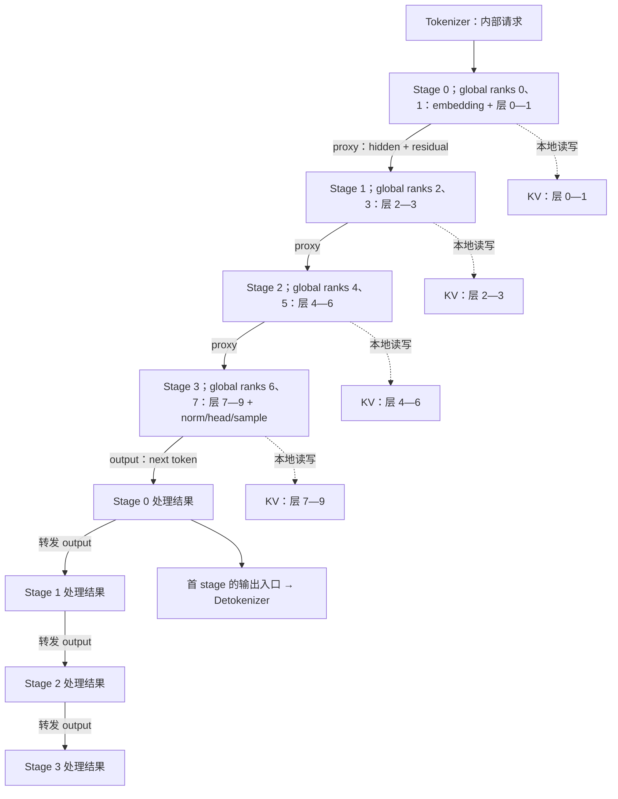
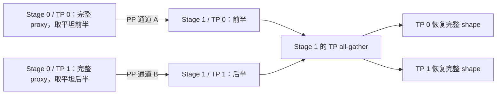
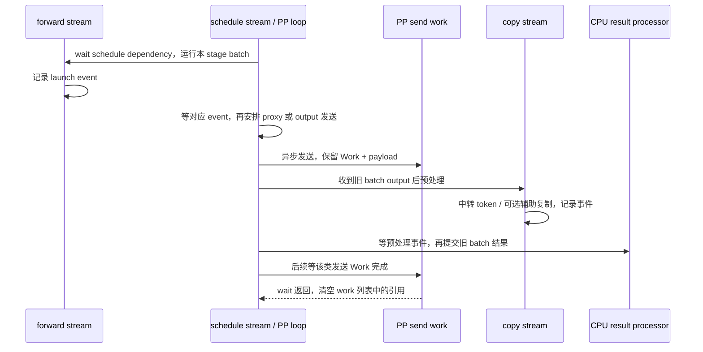

# Pipeline Parallel 与 Microbatch

本文是 **06-04，源码分析型学习资料**。本篇沿普通 PP 路径解释：**一条请求如何穿过多个模型 stage，最后一层产生的 token 又如何回到各 stage，驱动下一轮 Decode？** 阅读时把“模型算到哪里”“哪个 microbatch 槽位正在复用”“哪次传输已完成”分开记录。

## 0. 阅读基线与范围

| 项目 | 内容 |
| --- | --- |
| 源码路径基准 | SGLang 仓库根目录 `.`；源码位置全部使用仓内相对路径 |
| 分支 | `codex/sglang-source-study-20260909`，基于官方 `main` |
| 固定 commit | `72d5c5bb73cadd7ffbf5114e5f81e29d36b6c61a` |
| 读取时间 | `2026-09-10` |
| 工作区状态 | 学习 worktree 干净；原源码工作区及 Wiki 其他未提交资料保留 |
| 操作边界 | 只读源码、编写文档、独立教学算术与引用检查；未导入 SGLang/torch、启动进程组、加载模型或运行测试 |
| 前置 | [06-01 Rank 与通信](01-Rank进程组与通信基础.md)、[06-02 TP](02-TensorParallel与层内通信.md)、[05-02 Llama Forward](../05-model-execution/02-以Llama为例读懂模型Forward.md)、[03-01 调度主循环](../03-scheduling/01-NormalEventLoop与调度主循环.md) |
| 主线 | 原生 LlamaForCausalLM，`tie_word_embeddings=False`；普通文本生成，单节点八卡，TP=2、PP=4、DP/CP/DCP=1 |
| 执行限定 | CUDA eager；普通 PP event loop，`pp_async_batch_depth=0`；无图、编译、投机、DP Attention、SP、量化/LoRA、融合/延后 MLP 规约 |
| 请求限定 | R1 输入 8 个 token，生成 3 个输出；先不分块，无 mixed chunk、输入 logprob、hidden-state 返回、媒体与辅助输出 |
| 对照 | depth=1、层数不均分、纯中间 chunk 的输出省略、取消与空闲判断；不展开 PD/EPD/PDMux、NPU 投机、XPU 或 CP 的完整协议 |

图、槽位账本与小形状是**整理者推导**，不是运行 trace。八卡配置满足本篇列明的拓扑/层数条件，源码包含其普通启动与模型路径；本次没有进行八卡正确性或性能验证。已存在的 PP 测试配置与本篇教学配置分别记录，不能相互冒充。

## 1. 人话版：传的是中间结果，回来的是下一轮的输入

TP 是“同一层由多张卡合作算”；PP 是“前几层交给第一组卡，中间几层交给下一组卡”。一条请求依然必须按模型层顺序通过所有 stage。

如果只有 R1 一份作业，后面的 stage 得等前面的结果；R1 的下一个生成 token 又要等本轮最后一层与采样完成。放入多个互相独立的请求批次，才有机会让不同 stage 同时处理不同批次。

| 概念 | 本篇解释 | 不等同于 |
| --- | --- | --- |
| stage / PP rank | 一段模型层的执行位置 | 一张 GPU；一个 stage 内还可以有 TP |
| microbatch | 本次经过某 stage 的请求批次 | 必然是一条请求或固定数量 token |
| `mb_id` | Scheduler 循环使用的槽位下标 | 全局 request ID、永久 batch ID 或模型层编号 |
| `running_mbs[i]` | 槽位 i 的持续生成状态 | 当前立刻要执行的完整 batch |
| `mbs[i]` | 槽位 i 最近选出的待执行/待结果处理 batch | 已经完成并可无条件清理的空壳 |
| `last_mbs[i]` | 槽位 i 已处理结果后的上一批描述 | 同一时刻所有 stage 都已完成该批 |
| proxy tensor | 交给下一 stage 的中间激活包装 | KV cache、跨节点共享指针或独立代理进程 |
| output ring | 最末 stage 的生成结果绕回其他 stage | 把完整模型 logits 在每轮发给用户 |

普通、非分离模式下，`dispatch_event_loop` 在 PP>1 时选择 `event_loop_pp`。[S1] 解析阶段关闭普通 Overlap 调度，但 PP 仍使用 forward/copy stream、事件和异步发送；`init_overlap` 中这些公共设施也会为 PP 初始化。[S2][S59] 两种调度循环的“重叠”不能仅凭一个布尔值合并理解。

## 2. 先固定八卡拓扑与层分布

### 2.1 四个 stage，每个 stage 两个 TP rank

本例 `global_rank = pp_rank * 2 + tp_rank`，WORLD 有八个模型进程。TP 组按 stage 连续分组，PP 组保持相同 TP 编号跨 stage 连接。[S15]

| PP stage | TP 组的 global ranks | 本地 TP rank | 两条 PP 通道经过的成员 |
| ---: | --- | --- | --- |
| 0 | `[0,1]` | 0、1 | 通道 A 的 0；通道 B 的 1 |
| 1 | `[2,3]` | 0、1 | 通道 A 的 2；通道 B 的 3 |
| 2 | `[4,5]` | 0、1 | 通道 A 的 4；通道 B 的 5 |
| 3 | `[6,7]` | 0、1 | 通道 A 的 6；通道 B 的 7 |

两条 PP 组分别为 `[0,2,4,6]` 和 `[1,3,5,7]`。源码 helper 的 `dst/src` 使用组内编号，再用 `self.ranks[...]` 映射到 global rank，不能直接将 `dst=1` 理解为全局进程 1。[S42][S43]

### 2.2 十层教学模型：多出来的层分给末尾 stage

`get_pp_indices` 返回半开区间 `[start_layer,end_layer)`。默认尽量均分，余数层加到最后若干 stage。[S4]

| stage | 层数 | 全局层区间 | 真实层编号 | 本 stage 额外执行 |
| ---: | ---: | --- | --- | --- |
| 0 | 2 | `[0,2)` | 0、1 | input embedding |
| 1 | 2 | `[2,4)` | 2、3 | 接收前段激活 |
| 2 | 3 | `[4,7)` | 4、5、6 | 接收前段激活 |
| 3 | 3 | `[7,10)` | 7、8、9 | final norm、LM head、采样 |

注意是 `[2,2,3,3]`，不是把余数放到前两段。每个 stage 内的两张卡再按 TP 分担这些本地层。

`make_layers` 保留一个按全局层号索引的 ModuleList：非本段层放 PPMissingLayer，本段才构造真实 DecoderLayer；forward 只遍历 `[start,end)`。[S5][S6][S7] 所以 `len(model.layers)==10` 不代表每个 stage 都加载了十层真实权重。

自定义 `SGLANG_PP_LAYER_PARTITION="1,2,3,4"` 时得到 `[0,1)`、`[1,3)`、`[3,6)`、`[6,10)`。该 helper 检查能否解析整数、列表长度和层数总和；PP=1 则忽略这个进程级环境变量。[S4] 不把这几项检查扩大成所有自定义分区都已完整验收；本篇采用每段至少一层的普通分区。

### 2.3 计算放在哪里，与参数占用不是同一个表

LlamaModel 仅在首 stage 构造真实 embedding，仅在末 stage 构造真实 final norm；其余位置是 placeholder。LlamaForCausalLM 只在末 stage 调用 LogitsProcessor。[S6][S10]

但固定基线的 untied `LlamaForCausalLM.__init__` 会构造 ParallelLMHead，没有在这个构造处按首末 stage 分支；通用 `filter_pp_weights` 也仅按可解析的层号过滤，embedding/head 等无层号权重会放行。[S9][S11] 因此上表描述的是**实际计算职责**，不能据此推导所有非末 stage 的 LM-head 参数占用一定为零，更不能把总显存简单除以 PP。

## 3. 四条数据线：请求、激活、生成结果与 KV



**图意解读：** 同一 stage 的计算与结果处理方框属于同一套 Scheduler/Worker，不是额外进程。图中省略 TP 内部通信和请求控制消息的逐 stage 转发。proxy 链在末 stage 结束，output 绕回首 stage 后依次经过其他 stage；KV 保留在拥有相应层的本地池里。[S7][S17][S30]

| 数据线 | 内容 | 传播方式与所有者 | 生命周期 |
| --- | --- | --- | --- |
| 请求/控制消息 | 新输入及本轮控制对象；可能为空列表 | 首 stage 接收，各 stage leader 沿 CPU 消息路径转发，段内广播 | 用于各 rank 建立/更新各自 Scheduler 状态 |
| proxy | Llama 的 `hidden_states`、`residual`，以及传输类型元信息 | 各 PP 通道发送，下一 stage 重建 tensor | 当前前向跨边界的中间数据 |
| output | 基础路径为 `next_token_ids`；可选 logprob/辅助字段 | 末 stage 排队，绕环转发 | 用于结果提交及下一轮输入中转 |
| KV cache | 对应模型层的历史 K/V | 本 stage 的 Attention 与缓存管理器 | 跨多个前向，直到请求/前缀生命周期允许释放或复用 |

### 3.1 发给下一 stage 的是输入消息，不是 GPU 地址

`ingest_requests` 先接收、广播并处理输入，再返回收到的对象列表供 PP 转发。`event_loop_pp` 在非末 stage 每轮转发这个列表，即使没有新请求也会发送空列表。[S17][S18]

首 stage 的 leader 从服务入口取消息，后续 stage 的 leader 从上一 stage 接收，再在本 TP 组广播。[S19][S20][S21] 本例 leader 的 global rank 是 0、2、4、6。

各 stage 随后调用自己的 `get_next_batch_to_run`。源码不是让首 stage 把一个带 GPU 指针的 ScheduleBatch 整体广播给所有 stage；它依赖各 stage 的同序输入、调度与结果推进来保持批次对应。[S17][S22] 路由消息一致、批次行序一致、张量形状一致，是需要分别核对的条件。

### 3.2 为什么 Llama 传 hidden 和 residual 两份 tensor

LlamaDecoderLayer 使用 residual+norm 的组织方式：当前 MLP 输出仍放在 hidden_states，前面累积的残差保存在 residual；下一层入口的 norm 再处理两者。[S8] 中间 stage 因此返回两份 tensor，下一 stage 取出继续运行；末 stage 做 final norm。[S7]

**一个坐标的教学例子：** 边界处 hidden=3、residual=10。下一层的 residual 加法应看到 13，而不是只收到 3。不能在没有核对 norm 组织方式的情况下，只传一份 tensor、提前求和后仍按两份消费，或把 residual 当作可随时丢弃的临时变量。

PPProxyTensors 只是字典包装，构造时保存传入对象，字符串下标返回相应值；它不会自动做传输、复制、排队或释放。[S39] 真正的通信和依赖管理在 PP scheduler 与 GroupCoordinator。

## 4. 模型层切开以后，KV 怎样跟着分段

`resolve_layer_indices` 从模型得到本地层区间，并计算 `num_effective_layers=end-start`；普通 MHA 池构造使用该层数、start/end 和本地 Attention TP 的 KV head 数。[S12][S13] 传统 MHA 池访问全局层号时，用 `layer_id-start_layer` 得到本地 buffer 下标。[S14]

本例 stage 3 的全局层 7 对应本地 KV buffer 0；不是每个 stage 都要访问第一 stage 的层 0 KV。不同 stage 即使保存同一请求的历史 token，也是在保存**不同模型层产生的 K/V**。

| 时点，以 R1 为例 | 每个 stage 依次完成的本地工作 | 生成结果何时可见 |
| --- | --- | --- |
| Prefill，输入 8 行 | 对自己负责的层写入 R1 的 8 个输入位置 | 末 stage 采样 O1，再经 output ring 交给各 stage |
| 第一次 Decode，输入 O1 | 本地对应层增加第 9 个 KV 位置 | 末 stage 产生 O2，再回传 |
| 第二次 Decode，输入 O2 | 本地对应层增加第 10 个 KV 位置 | 末 stage 产生 O3，满足本例输出长度停止条件 |
| 结果收尾 | 各 stage 按自己的请求/缓存状态处理结束与资源交接 | 首 stage 的输出入口对外发送；不需要重复发送四份答案 |

这是各 stage 先后完成后的逻辑账本，不是说它们同一时刻拥有完整进度。O3 在本例结束前没有再作为模型输入，因此不要把“8 输入+3 输出”直接写成已经计算了 11 个 KV 位置。

普通 PP 的 proxy 只把继续算下一段所需的激活送过去，不搬运上述整个 KV 历史。PD 分离会引入另一套 KV 传输与就绪协议，留到阶段 07；不能把这里的激活 send/recv 当作 PD 的 KV-ready 或释放确认。

## 5. Microbatch 槽位怎样组织，而不是怎样硬切一个请求

### 5.1 三组数组与一条末 stage 队列

`init_pp_loop_state` 建立 `pp_loop_size = pp_size + pp_async_batch_depth`，并初始化以下状态。[S16]

| 字段 | 本篇 P=4、depth=0 | 更新时机与含义 |
| --- | --- | --- |
| `mbs` | 四个 None | 本槽位选批时写入新 batch，之后等待对应结果 |
| `running_mbs` | 四份空 running batch | 每次切到槽位，取出并更新持续生成状态 |
| `last_mbs` | 四个 None | 结果处理后记录该槽位上一批，供下一次调度合并/清理 |
| `mb_metadata` | 四个 None | launch 后记录本 stage 的 graph 资格；不是 request ID，[S58] |
| `last_rank_comm_queue` | 空 deque | 末 stage launch 后追加 `(event,output)`，到发送时按 FIFO 取出 |
| `pp_outputs` | None | 本轮收到的结果暂存，后续转发给下一 stage |
| 三类 `send_*_work` | 空列表 | 保存请求/proxy/output 的在途发送句柄与 payload 引用 |
| `_pp_tensor_dict_inbox` | 按消息类型分 deque | 收到另一类型时暂存，等该类型的接收者消费 |

槽位 0 可以先容纳 R1 的 Prefill，下一圈容纳其 Decode，再下一圈容纳更新后的 Decode。已结束/回撤请求会被原有 Scheduler 逻辑过滤，新请求也可能加入；不要将 `mb_id=0` 永久命名为 R1。[S17][S22]

### 5.2 每个槽位的请求上限不是 token 长度

未显式设置 `pp_max_micro_batch_size` 时，Scheduler 计算 `max(max_running_requests // pp_size,1)`。[S24] 准入时再比较 `pp_max_micro_batch_size-running_bs` 与共享请求池的可用行数。[S23]

例如 `max_running_requests=32,PP=4` 得到每槽位上限 8。depth=0 时有四个槽位；depth=1 时有五个槽位，但共享请求池和其他预算仍约束总量。不能因为 `5×8=40` 就认为服务一定能同时接纳四十条运行请求。

一个 microbatch 可以包含多条请求，每条 Prefill 又可占多行 token。`pp_max_micro_batch_size`、`chunked_prefill_size`、`pp_loop_size` 分别是请求数量上限、分块 token 预算、槽位数，三个维度不要互换。

## 6. 跟一轮 event_loop_pp：为什么处理的是“下一个槽位”的结果

### 6.1 两个索引公式

本地循环正在处理 `mb_id=m` 时：[S17]

```text
S = pp_size + pp_async_batch_depth
next_mb_id = (m + 1) % S
next_first_rank_mb_id = (m + pp_size) % S
```

`next_mb_id` 指本次尝试处理哪个槽位的旧结果；`next_first_rank_mb_id` 用于末 stage 选择本次发送对应哪个槽位的 output。它们不是“下一请求”的业务顺序。

| 本轮 m，depth=0/S=4 | 本轮 launch 槽位 | 接收并处理旧结果的槽位 | 末 stage 本次 output 对应槽位 |
| ---: | ---: | ---: | ---: |
| 0 | 0 | 1 | 0 |
| 1 | 1 | 2 | 1 |
| 2 | 2 | 3 | 2 |
| 3 | 3 | 0 | 3 |

第一圈尚未启动的槽位仍为 None，相应结果接收被跳过。这是流水建立过程的一部分，不是凭空已经有了槽位 1 的计算结果。

### 6.2 depth=0 的实际代码顺序

以下顺序来自普通 PP loop 的函数体，不能只照抄其开头的概括性注释：[S17][S48]

1. 将本槽位的 running/last 状态绑定到 Scheduler，接收并处理输入。
2. 非末 stage 先等上一份请求发送工作完成，再异步转发本轮输入列表。
3. 本地调用选批函数，保存 running 状态与当前 batch。
4. 若当前有 batch，非首 stage 接收其 proxy；首 stage 不需接收 proxy。
5. 等此前 proxy 发送工作完成；在 forward stream 上 launch 当前 batch。
6. 等此前 output 发送工作完成，发送/接收相应 output，并做结果预处理。
7. 若 `mbs[next_mb_id]` 非空，等预处理事件后处理该旧 batch 的结果，写入 `last_mbs[next_mb_id]`。
8. 非末 stage 等当前 launch event，再异步发送当前 proxy；把本轮收到的 output 留给后续转发。

这是“当前 batch 的 GPU 工作”与“另一槽位旧结果的 CPU 处理”可能交叠的位置。它不是让当前 R1 的采样依赖尚未返回就启动 R1 的下一 token。

### 6.3 只放 R1 到槽位 0，也能看见依赖环

假设没有新请求加入，R1 的 Prefill 落在槽位 0，其他槽位为空：

| 位置/时点 | 与 R1 有关的动作 | 必须等待什么 |
| --- | --- | --- |
| 各 stage 第一圈 m=0 | 按层顺序执行 R1 Prefill | 前一 stage 的 proxy；本地输入准备 |
| 末 stage 第一圈 m=0 | 产生 O1，追加末端队列后安排发送到 stage 0 | 该 forward 的 event |
| stage 0 第一圈 m=3 | `next_mb_id=0`，接收 O1 并处理 R1 结果 | 对应 output 接收与预处理 |
| stage 0 第二圈 m=0 | 选出 R1 Decode，输入来自已回传的 O1；转发前一轮 output | 槽位 0 的 Prefill 结果已处理 |
| stage 1、2、3 各自第一圈 m=3 | 依次收到并处理沿环传来的 O1 | 前一 stage 的 output 转发 |
| 后续各 stage 第二圈 m=0 | 依次执行 R1 Decode | 自己已提交 O1，且收到这次 Decode 的 proxy |

表中不同 stage 的“第一圈/第二圈”是各自本地循环计数，**不是同一堵墙钟时间**。stage 0 可以进入下一圈时，下游仍在结束自己的上一圈；这正是同一个槽位的 output 与后续 proxy 可能在通道上交错的原因。

R1 下一轮仍需完整经过四个 stage。多 microbatch 的作用是用其他请求填补空档；当只有一条请求时，增加槽位不会消除自回归的数据依赖。

### 6.4 多批次的理想流水图只说明机会，不是实测

下表假设四个独立 Prefill 批次 A/B/C/D、每 stage 各耗一个理想时间单位，并忽略所有请求接入、结果环和通信开销：

| 理想时隙 | Stage 0 | Stage 1 | Stage 2 | Stage 3 |
| ---: | --- | --- | --- | --- |
| 1 | A | — | — | — |
| 2 | B | A | — | — |
| 3 | C | B | A | — |
| 4 | D | C | B | A |
| 5 | — | D | C | B |
| 6 | — | — | D | C |
| 7 | — | — | — | D |

只有此理想模型下，K 批、P 段共需 K+P−1 个计算时隙，利用率为 `K/(K+P−1)`；本例为 `4/7`。真实源码还要处理 output 回环、prefill/decode 长度差、额外层、embedding/head、跨设备通信和 CPU 工作，不能由该比值计算服务吞吐。

## 7. Proxy 怎样传：先发描述，再发切片，再在目的 stage 收齐

### 7.1 带类型的 tensor dict

发送 helper 在字典中写入 `__msg_type__="proxy"` 或 `"output"`；GroupCoordinator 把非 tensor 值与 tensor 的设备类型/dtype/shape 放到 metadata，另收集 tensor payload。[S40][S44]

metadata 通过 CPU group 的 object 消息发送。GPU tensor 通过 device group，CPU tensor 通过 CPU group；空 tensor 有形状描述，但跳过零元素 payload。[S42][S43][S46]

不要因为容器类的名字或类型注解包含 `Tensor`，就假设所有字典值都在 GPU 上。`__msg_type__` 是普通元信息，下一 stage 的 tensor 由接收端按 metadata 分配，不是收到发送端内存地址。

### 7.2 本例 TP=2 时，PP 发送可以只发一半元素

PP helper 传入 Attention TP 组作为 `all_gather_group`。若某 tensor 的 `numel` 能被组大小整除，发送端先 reshape 成 `[TP,-1]`，各本地 TP rank 只发自己的平坦切片；接收端收到切片后在本 stage 的 TP 组 all-gather，再恢复原 shape。[S42][S43]



**图意解读：** 图针对本篇已经完成普通 TP 规约、段内具有相同语义的 proxy。发送分片是平坦元素切片，不是模型权重分片，也不能只看到 reshape 就把它解释成 KV head 分片。收齐动作在目的 stage 的 TP 组内发生。

假设 H=128、BF16 每元素 2 字节，Llama proxy 包含 hidden 和 residual 两份 `[T,H]`：

| 本轮 | 每份完整 tensor | 两份合计逻辑字节 | 每条 PP 通道发送两份切片的字节 | 两条通道合计 |
| --- | --- | ---: | ---: | ---: |
| R1 Prefill，T=8 | `[8,128]` | 4096 | 2048 | 4096 |
| R1 Decode，T=1 | `[1,128]` | 512 | 256 | 512 |

这里未计 metadata、协议开销或目的 TP all-gather 的流量，不是网卡计数。若 payload 是单请求的一个 next token ID，`numel=1` 不能被 TP=2 整除，则每条 PP 通道发送完整 ID；字节数取决于实际 dtype。[S42][S43]

### 7.3 接收“错误类型”不意味着错误 batch 已得到匹配

`_pp_recv_typed_dict` 先查对应 inbox；若直接接到另一类型，按类型暂存并继续等预期类型。proxy 接收与 output 接收分别指定类型。[S25][S41][S60]

例如正等待 output，却先收到 proxy：先放进 `inbox["proxy"]`；拿到 output 后，下一次 proxy 接收可直接消费已暂存项。这只解决**消息类别交错**。

标签本身不包含 request ID、`mb_id` 或 generation。类别相同的消息仍靠发送顺序、FIFO 和当前槽位关联；inbox 不是乱序恢复、重复消息去重或失联重传协议。本篇没有证明异常情况下可自动恢复。

## 8. Output 绕环回来后，谁更新状态、谁回答用户

### 8.1 最末 stage 才产生真实 next token

Worker 在末 stage 得到模型 logits 并调用 sample；非末 stage 返回 `GenerationBatchResult.pp_hidden_states_proxy_tensors`，不在本地重新采样。[S27][S28] `_pp_launch_batch` 为本 stage 保存 graph 资格和 event；末 stage 再把基础 next token 字典包装入 FIFO。[S26][S29]

在本篇没有 logprob/辅助输出的条件下，ring payload 不包含整个 `[B,vocab]` logits。开启 logprob、投机草稿或辅助观察时，准备函数会加其他字段；这些条件需要另读，不能将基础 payload 表泛化。[S29]

### 8.2 Output 的传播方向和次数

在一次完整回环中，末 stage 3 发给 stage 0，然后 0→1→2→3。每个 stage 都通过接收路径重建对应 batch 的结果；最末 stage 也不是“本地采样完就跳过统一结果处理”。[S30][S31][S32]

非末 stage 转发的是暂存在 `pp_outputs` 的上一轮接收结果，末 stage 从本地输出 FIFO 取队首；二者使用不同来源。当前 launch 的 proxy 和待转发 output 可能属于不同槽位，所以不能用“本轮刚收到哪个 tensor”来猜它属于当前 batch。

### 8.3 结果还要进入输入中转与 CPU 请求状态

`_pp_prep_batch_result` 将 next token 转成 int64 用于 `future_map.stash`，按本地 `req_pool_indices` 建立下一轮输入中转，然后清空 `batch.input_ids`，交给之后的输入解析重建。[S32] FutureMap 在非 Overlap 模式也存在，不是只给普通 Overlap 用的对象。[S59]

随后 PP loop 调用普通 `process_batch_result`。Prefill/Decode 处理器把 token 加到各自 Req 的输出历史、检查结束、处理缓存与流式输出。[S33][S34][S35]

每 stage 都有本地状态要推进，但实际对外发送只由首 stage 的入口 rank 持有 socket；其他 rank 的 SenderWrapper 包着 None，调用发送方法时直接返回。[S36][S37][S38] 因而同一个 R1 不会因为有四个 stage 就在正常路径向用户重复回四份答案。

## 9. 三种完成边界，必须分别看证据

### 9.1 从 launch 到发送引用退役



**图意解读：** 图表达依赖边，不规定所有设备完成的墙钟先后。发送完成处理与旧结果 CPU 提交可以属于不同 batch；清空某个发送列表只释放该列表持有的引用，其他队列/局部变量仍可能引用 tensor。[S17][S26][S31][S47]

| 证据/动作 | 可以说明什么 | 不能说明什么 |
| --- | --- | --- |
| launch event 与发送流的 `wait_event` | 发送依赖于当前前向的设备工作 | 所有 stage 都已算完，或用户已收到 token |
| `P2PWork(work,payload)` | 在途发送有对象引用保留 payload，包括切片及序列化 tensor | payload 已发送完或可任意覆盖 |
| `_pp_commit_comm_work` 的 `wait` 后 `clear` | 按通信 API 完成该组在途工作，并释放列表引用 | 当前请求的 KV 已经全部退役 |
| 接收 `irecv.wait` 与目的 TP gather | 当前接收/重建的通信步骤完成 | 已经完成 Scheduler 结果提交 |
| PP 预处理事件后进入结果处理 | 该预处理流上的先行操作已完成 | next token 早已全部复制为 CPU 列表 |
| finish/release 路径 | 本地请求状态按生命周期交接 | 所有 KV 字节立刻为空；前缀缓存仍可能保留页 |

`P2PWork` 同时保存 Work 和 payload，异步 tensor 与 object 发送都会构造它；PP loop 等待后才清空相应列表。[S45][S46][S47] 这是源码中的引用保留机制，本轮没有做并发覆写、allocator 快速复用或设备时序验证。

### 9.2 名叫 d2h_event，也要看实际复制了什么

`_pp_send_recv_and_preprocess_output_tensors` 在 copy stream 等待 schedule stream 后调用结果预处理并记录 `d2h_event`。[S31] 但基础 `_pp_prep_batch_result` 仍把原来的 next-token tensor 放进输出对象，只调用辅助输出的 CPU 复制；普通 Prefill 的 `.tolist()`、Decode 的归一化转 CPU 发生在结果处理器里。[S32][S34][S35]

因此“等了 d2h_event”不等于此处提前异步复制了所有生成 token 和所有 logprob。分析 CPU stall 时应分别定位 recv、预处理、事件等待和后续 `.tolist()`，不能只凭事件名字判断耗时来源。

## 10. depth、chunk、取消与空闲的边界

### 10.1 depth=1 改变的是调度窗口与发送位置

P=4、depth=1 时 S=5，loop 把 output 发送/接收/预处理放在本轮 launch **之前**；depth=0 则放在 launch **之后**。[S17]

| m，S=5 | `next_mb_id` | `next_first_rank_mb_id` | 末 stage 第一圈的直观动作 |
| ---: | ---: | ---: | --- |
| 0 | 1 | 4 | 槽位 4 尚为空，先不发送它；再 launch 槽位 0 |
| 1 | 2 | 0 | 发送已排队的槽位 0 结果，再 launch 槽位 1 |
| 2 | 3 | 1 | 发送槽位 1，再 launch 槽位 2 |
| 3 | 4 | 2 | 发送槽位 2，再 launch 槽位 3 |
| 4 | 0 | 3 | 发送槽位 3，再 launch 槽位 4 |

此表假设所述槽位均有 batch，并只描述第一圈末 stage 的操作。depth 不会为 R1 预测未来 token，也不增加模型层；更多缓冲可能改变流水充填、排队和显存占用，其收益必须测量。

### 10.2 纯中间 Prefill chunk 可以省略 output，但不是省掉模型

`_pp_can_skip_output_comm` 要求环境开关开启、普通 EXTEND、只有一条请求、不含最后 Prefill chunk、且不返回 logprob。[S49]

匹配时仍有前向和 proxy 推进，但接收路径本地生成标记为 `skipped_output_comm=True` 的零 token placeholder，`next_pp_outputs=None` 使非末 stage 不继续转发 output。[S50] Prefill 处理器用中间 chunk 计数消化结果；对应校验要求未结束/未回撤请求的 `inflight_middle_chunks>0`，确保零值不作为真实输出追加。[S34][S51]

所以“output 没有过网”可能是明确的局部优化条件，不能直接判成丢包。最后一块、混合多请求或返回 logprob 时不能套用这条省略路径。本篇 R1 主线不分块，不触发此对照。

### 10.3 取消必须找到所有 microbatch 中的请求

普通 PP 的 `collect_inflight_reqs` 检查 `running_mbs` 和 `mbs`，不是只检查当前绑定的 `running_batch`。常规在途取消设置 `req.to_finish=FINISH_ABORT`，继续复用结果处理的收尾链；等待队列、分块和 PD 则有独立分支。[S52][S53]

这说明为什么“当前槽位没有 R1”不代表 R1 已离开流水线。它也不构成跨 stage 取消安全的完整证明：本篇没有运行中途取消、控制消息/输出交错或快速 KV 重用实验。分块在途计数和 PD 传输取消需按其专用链路继续核对。

### 10.4 空闲检查要看槽位数组

`is_fully_idle` 除当前 running/last、等待队列等条件，还调用 `_pp_microbatches_drained`：全部 running_mbs 必须为空，全部 mbs 必须为 None 或空批次。[S54][S55]

PP loop 一圈没有执行新 batch 时会调用 `on_idle`，这与“所有组件的完整空闲证明”是不同层次。只看到 waiting queue 清空，不能马上推断已在途的 chunk 结果、通信或其他资源已不存在。相关 scripted 测试专门构造了“队列和当前绑定为空，但 mbs 仍有在途结果”的窗口。[S67][S69]

## 11. 配置限制与小白排障地图

### 11.1 只记录本版实际规则

| 配置/条件 | 固定基线行为 | 证据边界 |
| --- | --- | --- |
| PP>1 | 解析期关闭普通 Overlap；选择 PP loop | 静态分支，[S1][S2] |
| 非 NPU 的 PP>1 | 校验要求 disable_overlap_schedule，且 speculative_algorithm 为 None | 当前校验规则；模型里存在草稿字段不代表本平台可开启，[S3] |
| NPU 的 PP+投机 | 仅有特定 EAGLE、非多层、Prefill 节点条件 | 平台专用局部规则，不套入本篇 CUDA 路径，[S3] |
| TP×PP 与节点数 | 非 scale join 时要求 `(TP × PP) % nnodes == 0` | 还需核对设备和模型限制，[S3] |
| microbatch size | None 或正整数；None 时 Scheduler 自动计算 | 不是 token 预算，[S3][S24][S57] |
| `min_free_slots_delay` 与 PP | 校验拒绝 | 因每 microbatch 的准入上限可能使阈值无法达到，[S3] |
| 模型层数 | `make_layers` 检查层数不少于 PP；自定义分区另外校验列表和总和 | 不能据此证明负载均衡，[S4][S5] |
| Prefill breakable graph | 未显式锁定 backend 时，PP 默认关闭；显式选择可绕过这项默认策略 | 不是“PP 永远不能用图”；本篇使用 eager，[S56] |
| CUDA / XPU output 顺序 | 基础 CUDA 先 send 后 recv；XPU 根据 PP rank 奇偶调整顺序 | helper 的平台分支，不作为其他后端恢复保证，[S31] |

### 11.2 从现象反查对象与依赖

| 现象 | 先记录什么 | 源码入口 | 避免直接推断 |
| --- | --- | --- | --- |
| 层数或模型权重分布不符合预期 | 实际 start/end、custom partition、真实层/placeholder、head 参数 | get_pp_indices、make_layers、Llama 构造 | PP 均分所有模型内存 |
| 后续 stage 等不到请求 | stage/TP/global 编号、leader、空列表是否转发 | ingest_requests、PP pyobj 路径 | 一定是模型前向慢 |
| proxy shape 对，但结果错 | hidden/residual 配对、批次行序、partial 是否已合并 | Llama forward、send-allgather | shape 正确就说明 batch 对应正确 |
| 等待 output 时先收到 proxy | `__msg_type__`、inbox 长度、当前 mb/next_mb | typed recv | 类型暂存等于自动恢复批次乱序 |
| 首 token 回来后 Decode 卡住 | output 环经过哪些 stage、future_map、req_pool_indices、input_ids 重建 | output 预处理与 run_batch | 末 stage 采样完成就代表各 stage 可 Decode |
| CPU 出现长等待 | recv、Work wait、event sync、`.tolist()` 分别计时 | PP helpers 与结果处理器 | 名叫 d2h_event 就覆盖全部 CPU 拷贝 |
| depth 增大后显存/延迟变化 | S、每槽请求数、输出队列、在途 payload、共享池余量 | init_pp_loop_state、launch/发送、准入 | depth 倍数等于吞吐提升倍数 |
| chunk 结果是零或没有 output 消息 | skip 条件、last chunk 标记、inflight_middle_chunks | skip helper 与校验 | 零 placeholder 是模型生成的 token |
| 请求取消后仍有工作 | all running_mbs/mbs、to_finish、已发 payload | collect_inflight_reqs、abort | 当前队列没请求就能覆盖/回收全部内存 |
| 缓存操作提示不空闲 | 所有槽位、last/current、等待及外部队列 | is_fully_idle | 只看 running_batch 就足够 |

## 12. 源码阅读路线、自测与验收

### 12.1 回源码时，每一步只追一个问题

| 顺序 | 要确认什么 | 相对于 SGLang 根目录的入口 |
| ---: | --- | --- |
| 1 | 为什么选择 PP loop | `python/sglang/srt/managers/scheduler.py::dispatch_event_loop` [S1] |
| 2 | stage 拥有哪些真实层 | `python/sglang/srt/distributed/utils.py::get_pp_indices` [S4]、`python/sglang/srt/utils/common.py::make_layers` [S5] |
| 3 | 下一 stage 需要哪些中间值 | `python/sglang/srt/models/llama.py::LlamaModel.forward` [S7] |
| 4 | 当前/上一/待处理槽位如何转换 | `python/sglang/srt/managers/scheduler_pp_mixin.py::SchedulerPPMixin.event_loop_pp` [S17] |
| 5 | 实际 launch 返回 proxy 还是 token | `python/sglang/srt/managers/tp_worker.py::TpModelWorker.forward_batch_generation` [S28] |
| 6 | 如何准备、分型、发送与接收 | `python/sglang/srt/managers/scheduler_pp_mixin.py::SchedulerPPMixin._pp_send_dict_to_next_stage` [S40]、`SchedulerPPMixin._pp_recv_typed_dict` [S41] |
| 7 | PP 与 TP 怎样配合搬元素 | `python/sglang/srt/distributed/parallel_state.py::GroupCoordinator.send_tensor_dict` [S42]、`GroupCoordinator.recv_tensor_dict` [S43] |
| 8 | 输出何时回到下一轮输入 | `python/sglang/srt/managers/scheduler_pp_mixin.py::SchedulerPPMixin._pp_prep_batch_result` [S32] |
| 9 | 哪份引用/资源何时退役 | `python/sglang/srt/managers/scheduler_pp_mixin.py::SchedulerPPMixin._pp_commit_comm_work` [S47]、`python/sglang/srt/managers/scheduler.py::Scheduler.collect_inflight_reqs` [S52] |

### 12.2 六道不需要 GPU 的练习

1. 十层模型、PP=4 的默认区间是什么？全局层 7 的本地 KV 下标是什么？
2. TP=2、PP=4 时，global rank 5 属于哪个 stage、哪个 PP 组？
3. depth=1、m=3 时，本轮接收处理哪个槽位？末 stage 发送哪个槽位的旧结果？
4. BF16、T=8、H=128，两份 proxy 在本篇 send-allgather 路径中，每条 PP 通道发多少逻辑字节？
5. R1 生成第三个输出后停止，本例为何只有十个已前向计算的 KV 位置，而不是十一个？
6. `send_work.wait()` 返回、`d2h_event.synchronize()` 返回、请求 finish，分别证明的是同一件事吗？

**参考答案：** ① `[0,2)`、`[2,4)`、`[4,7)`、`[7,10)`；层 7 在 stage 3 的本地位置 0。② stage 2、TP rank 1，PP 组 `[1,3,5,7]`。③ S=5，接收处理槽位 4，末 stage 发送槽位 2。④ 每份完整 2048 字节，两份经 TP2 切片后每通道 2048 字节；未计目的 TP gather 与协议开销。⑤ 三次输出分别来自 Prefill、O1 Decode、O2 Decode；O3 没有再进入模型。⑥ 不同：发送工作、特定流上的预处理、请求业务/资源生命周期分别核对。

### 12.3 本轮只读的测试与未验证项

| 文件与已读定义 | 实际配置/断言范围 | 本次状态 |
| --- | --- | --- |
| `test/registered/pp/test_pp_single_node.py`：`TestPPAccuracy.test_gsm8k`、`test_logprob` | setUp 使用 TP2/PP2、chunk=256；评估与 logprob 长度断言，[S61][S62] | 未执行 |
| 同文件：`TestFixedBugs.test_chunked_prefill_with_small_bs` | TP2/PP2、max_running=2、batch/input/output 长度均 1 的 benchmark helper 调用，[S63] | 未执行；不把 helper 调用本身写成数值对照通过 |
| `test/registered/unit/managers/test_pp_cp_rank_offsets.py`：两条 TestPPCPRankOffsets 测试 | mock 下检查含 Attention CP/DP offset 的收/发 global rank，[S64][S65] | 未执行；不证明 CP/PP 设备正确性 |
| `test/registered/chunked_prefill/test_scripted_core_4gpu.py`：`test_pp_chunk_sweep` 及 helper | TP1/PP4/depth2，S=6；多种 chunk/并发数组合，断言请求完成，[S66][S68] | 未执行 |
| 同文件：`test_pp_flush_cache_during_inflight_chunk_results` 及 helper | 找到“局部队列清空但 mbs 有结果在途”的窗口，再发 flush、等请求完成，[S67][S69] | 未执行；没有独立证明所有缓存/传输时序安全 |

前三条 single-node 测试使用的默认模型常量在此 commit 为 `meta-llama/Llama-3.1-8B-Instruct`。[S70] 这是源码中的测试目标名，本轮未下载权重、核对外部模型版本或复现实验。

本篇列明 **三份文件中的 7 条 test 定义及两个 scripted helper**。只检查了固定源码锚点、八卡分组、层区间、槽位索引、字节/时隙/KV 教学算术、Markdown 链接与三张 Mermaid 图的结构和图意；未运行 Mermaid 渲染器。

没有运行 Controller/服务、CPU 单测、CUDA 通信、PP 数值对照、取消与缓冲区复用、跨节点、吞吐或延迟测试。后续运行验收应记录各 stage 的 request/slot/模式、层边界 hidden+residual 对照、消息类型与行身份、Work/event 依赖、环回 token 和本地缓存收尾，不能只检查最终文本能返回。

## 13. 下一篇

上一篇：[06-03《Data Parallel 与 DP Attention》](03-DataParallel与DPAttention.md)。下一篇：[06-05《MoE 专家并行与负载均衡》](05-MoE专家并行与负载均衡.md)。返回[系列目录](../README.md)，或查阅[术语](../appendices/01-术语与对象速查.md)、[源码索引](../appendices/02-源码入口与调用链索引.md)、[配置矩阵](../appendices/03-配置解析与功能兼容矩阵.md)、[排障索引](../appendices/04-症状到源码的排障索引.md)、[证据模板](../appendices/05-实验记录与证据模板.md)与[进度记录](../appendices/06-学习进度与版本变更记录.md)。

[S1]: https://github.com/sgl-project/sglang/blob/72d5c5bb73cadd7ffbf5114e5f81e29d36b6c61a/python/sglang/srt/managers/scheduler.py#L5646
[S2]: https://github.com/sgl-project/sglang/blob/72d5c5bb73cadd7ffbf5114e5f81e29d36b6c61a/python/sglang/srt/arg_groups/overrides.py#L1697
[S3]: https://github.com/sgl-project/sglang/blob/72d5c5bb73cadd7ffbf5114e5f81e29d36b6c61a/python/sglang/srt/arg_groups/validation_hook.py#L27
[S4]: https://github.com/sgl-project/sglang/blob/72d5c5bb73cadd7ffbf5114e5f81e29d36b6c61a/python/sglang/srt/distributed/utils.py#L95
[S5]: https://github.com/sgl-project/sglang/blob/72d5c5bb73cadd7ffbf5114e5f81e29d36b6c61a/python/sglang/srt/utils/common.py#L1445
[S6]: https://github.com/sgl-project/sglang/blob/72d5c5bb73cadd7ffbf5114e5f81e29d36b6c61a/python/sglang/srt/models/llama.py#L372
[S7]: https://github.com/sgl-project/sglang/blob/72d5c5bb73cadd7ffbf5114e5f81e29d36b6c61a/python/sglang/srt/models/llama.py#L418
[S8]: https://github.com/sgl-project/sglang/blob/72d5c5bb73cadd7ffbf5114e5f81e29d36b6c61a/python/sglang/srt/models/llama.py#L340
[S9]: https://github.com/sgl-project/sglang/blob/72d5c5bb73cadd7ffbf5114e5f81e29d36b6c61a/python/sglang/srt/models/llama.py#L517
[S10]: https://github.com/sgl-project/sglang/blob/72d5c5bb73cadd7ffbf5114e5f81e29d36b6c61a/python/sglang/srt/models/llama.py#L562
[S11]: https://github.com/sgl-project/sglang/blob/72d5c5bb73cadd7ffbf5114e5f81e29d36b6c61a/python/sglang/srt/model_loader/auto_loader.py#L156
[S12]: https://github.com/sgl-project/sglang/blob/72d5c5bb73cadd7ffbf5114e5f81e29d36b6c61a/python/sglang/srt/model_executor/model_runner_components/layer_setup.py#L138
[S13]: https://github.com/sgl-project/sglang/blob/72d5c5bb73cadd7ffbf5114e5f81e29d36b6c61a/python/sglang/srt/mem_cache/kv_cache_configurator.py#L1929
[S14]: https://github.com/sgl-project/sglang/blob/72d5c5bb73cadd7ffbf5114e5f81e29d36b6c61a/python/sglang/srt/mem_cache/memory_pool.py#L2463
[S15]: https://github.com/sgl-project/sglang/blob/72d5c5bb73cadd7ffbf5114e5f81e29d36b6c61a/python/sglang/srt/distributed/parallel_state.py#L2298
[S16]: https://github.com/sgl-project/sglang/blob/72d5c5bb73cadd7ffbf5114e5f81e29d36b6c61a/python/sglang/srt/managers/scheduler_pp_mixin.py#L551
[S17]: https://github.com/sgl-project/sglang/blob/72d5c5bb73cadd7ffbf5114e5f81e29d36b6c61a/python/sglang/srt/managers/scheduler_pp_mixin.py#L62
[S18]: https://github.com/sgl-project/sglang/blob/72d5c5bb73cadd7ffbf5114e5f81e29d36b6c61a/python/sglang/srt/managers/scheduler.py#L2050
[S19]: https://github.com/sgl-project/sglang/blob/72d5c5bb73cadd7ffbf5114e5f81e29d36b6c61a/python/sglang/srt/managers/scheduler_components/request_receiver.py#L121
[S20]: https://github.com/sgl-project/sglang/blob/72d5c5bb73cadd7ffbf5114e5f81e29d36b6c61a/python/sglang/srt/managers/scheduler_components/request_receiver.py#L170
[S21]: https://github.com/sgl-project/sglang/blob/72d5c5bb73cadd7ffbf5114e5f81e29d36b6c61a/python/sglang/srt/managers/scheduler_pp_mixin.py#L733
[S22]: https://github.com/sgl-project/sglang/blob/72d5c5bb73cadd7ffbf5114e5f81e29d36b6c61a/python/sglang/srt/managers/scheduler.py#L3499
[S23]: https://github.com/sgl-project/sglang/blob/72d5c5bb73cadd7ffbf5114e5f81e29d36b6c61a/python/sglang/srt/managers/scheduler.py#L3646
[S24]: https://github.com/sgl-project/sglang/blob/72d5c5bb73cadd7ffbf5114e5f81e29d36b6c61a/python/sglang/srt/managers/scheduler.py#L1094
[S25]: https://github.com/sgl-project/sglang/blob/72d5c5bb73cadd7ffbf5114e5f81e29d36b6c61a/python/sglang/srt/managers/scheduler_pp_mixin.py#L852
[S26]: https://github.com/sgl-project/sglang/blob/72d5c5bb73cadd7ffbf5114e5f81e29d36b6c61a/python/sglang/srt/managers/scheduler_pp_mixin.py#L1078
[S27]: https://github.com/sgl-project/sglang/blob/72d5c5bb73cadd7ffbf5114e5f81e29d36b6c61a/python/sglang/srt/managers/scheduler.py#L4199
[S28]: https://github.com/sgl-project/sglang/blob/72d5c5bb73cadd7ffbf5114e5f81e29d36b6c61a/python/sglang/srt/managers/tp_worker.py#L593
[S29]: https://github.com/sgl-project/sglang/blob/72d5c5bb73cadd7ffbf5114e5f81e29d36b6c61a/python/sglang/srt/managers/scheduler_pp_mixin.py#L767
[S30]: https://github.com/sgl-project/sglang/blob/72d5c5bb73cadd7ffbf5114e5f81e29d36b6c61a/python/sglang/srt/managers/scheduler_pp_mixin.py#L974
[S31]: https://github.com/sgl-project/sglang/blob/72d5c5bb73cadd7ffbf5114e5f81e29d36b6c61a/python/sglang/srt/managers/scheduler_pp_mixin.py#L1009
[S32]: https://github.com/sgl-project/sglang/blob/72d5c5bb73cadd7ffbf5114e5f81e29d36b6c61a/python/sglang/srt/managers/scheduler_pp_mixin.py#L894
[S33]: https://github.com/sgl-project/sglang/blob/72d5c5bb73cadd7ffbf5114e5f81e29d36b6c61a/python/sglang/srt/managers/scheduler_pp_mixin.py#L969
[S34]: https://github.com/sgl-project/sglang/blob/72d5c5bb73cadd7ffbf5114e5f81e29d36b6c61a/python/sglang/srt/managers/scheduler_components/batch_result_processor.py#L253
[S35]: https://github.com/sgl-project/sglang/blob/72d5c5bb73cadd7ffbf5114e5f81e29d36b6c61a/python/sglang/srt/managers/scheduler_components/batch_result_processor.py#L889
[S36]: https://github.com/sgl-project/sglang/blob/72d5c5bb73cadd7ffbf5114e5f81e29d36b6c61a/python/sglang/srt/managers/scheduler.py#L805
[S37]: https://github.com/sgl-project/sglang/blob/72d5c5bb73cadd7ffbf5114e5f81e29d36b6c61a/python/sglang/srt/managers/scheduler_components/ipc_channels.py#L25
[S38]: https://github.com/sgl-project/sglang/blob/72d5c5bb73cadd7ffbf5114e5f81e29d36b6c61a/python/sglang/srt/managers/scheduler_components/output_sender.py#L12
[S39]: https://github.com/sgl-project/sglang/blob/72d5c5bb73cadd7ffbf5114e5f81e29d36b6c61a/python/sglang/srt/model_executor/forward_batch_info.py#L1856
[S40]: https://github.com/sgl-project/sglang/blob/72d5c5bb73cadd7ffbf5114e5f81e29d36b6c61a/python/sglang/srt/managers/scheduler_pp_mixin.py#L796
[S41]: https://github.com/sgl-project/sglang/blob/72d5c5bb73cadd7ffbf5114e5f81e29d36b6c61a/python/sglang/srt/managers/scheduler_pp_mixin.py#L819
[S42]: https://github.com/sgl-project/sglang/blob/72d5c5bb73cadd7ffbf5114e5f81e29d36b6c61a/python/sglang/srt/distributed/parallel_state.py#L1699
[S43]: https://github.com/sgl-project/sglang/blob/72d5c5bb73cadd7ffbf5114e5f81e29d36b6c61a/python/sglang/srt/distributed/parallel_state.py#L1754
[S44]: https://github.com/sgl-project/sglang/blob/72d5c5bb73cadd7ffbf5114e5f81e29d36b6c61a/python/sglang/srt/distributed/parallel_state.py#L120
[S45]: https://github.com/sgl-project/sglang/blob/72d5c5bb73cadd7ffbf5114e5f81e29d36b6c61a/python/sglang/srt/distributed/parallel_state.py#L115
[S46]: https://github.com/sgl-project/sglang/blob/72d5c5bb73cadd7ffbf5114e5f81e29d36b6c61a/python/sglang/srt/distributed/parallel_state.py#L1528
[S47]: https://github.com/sgl-project/sglang/blob/72d5c5bb73cadd7ffbf5114e5f81e29d36b6c61a/python/sglang/srt/managers/scheduler_pp_mixin.py#L703
[S48]: https://github.com/sgl-project/sglang/blob/72d5c5bb73cadd7ffbf5114e5f81e29d36b6c61a/python/sglang/srt/managers/scheduler_pp_mixin.py#L708
[S49]: https://github.com/sgl-project/sglang/blob/72d5c5bb73cadd7ffbf5114e5f81e29d36b6c61a/python/sglang/srt/managers/scheduler_pp_mixin.py#L43
[S50]: https://github.com/sgl-project/sglang/blob/72d5c5bb73cadd7ffbf5114e5f81e29d36b6c61a/python/sglang/srt/managers/scheduler_pp_mixin.py#L871
[S51]: https://github.com/sgl-project/sglang/blob/72d5c5bb73cadd7ffbf5114e5f81e29d36b6c61a/python/sglang/srt/managers/scheduler_components/batch_result_processor.py#L548
[S52]: https://github.com/sgl-project/sglang/blob/72d5c5bb73cadd7ffbf5114e5f81e29d36b6c61a/python/sglang/srt/managers/scheduler.py#L5162
[S53]: https://github.com/sgl-project/sglang/blob/72d5c5bb73cadd7ffbf5114e5f81e29d36b6c61a/python/sglang/srt/managers/scheduler.py#L5171
[S54]: https://github.com/sgl-project/sglang/blob/72d5c5bb73cadd7ffbf5114e5f81e29d36b6c61a/python/sglang/srt/managers/scheduler.py#L4825
[S55]: https://github.com/sgl-project/sglang/blob/72d5c5bb73cadd7ffbf5114e5f81e29d36b6c61a/python/sglang/srt/managers/scheduler.py#L4762
[S56]: https://github.com/sgl-project/sglang/blob/72d5c5bb73cadd7ffbf5114e5f81e29d36b6c61a/python/sglang/srt/arg_groups/cuda_graph_hook.py#L106
[S57]: https://github.com/sgl-project/sglang/blob/72d5c5bb73cadd7ffbf5114e5f81e29d36b6c61a/python/sglang/srt/arg_groups/fields/parallel.py#L24
[S58]: https://github.com/sgl-project/sglang/blob/72d5c5bb73cadd7ffbf5114e5f81e29d36b6c61a/python/sglang/srt/managers/scheduler_pp_mixin.py#L56
[S59]: https://github.com/sgl-project/sglang/blob/72d5c5bb73cadd7ffbf5114e5f81e29d36b6c61a/python/sglang/srt/managers/scheduler.py#L1603
[S60]: https://github.com/sgl-project/sglang/blob/72d5c5bb73cadd7ffbf5114e5f81e29d36b6c61a/python/sglang/srt/managers/scheduler_pp_mixin.py#L863
[S61]: https://github.com/sgl-project/sglang/blob/72d5c5bb73cadd7ffbf5114e5f81e29d36b6c61a/test/registered/pp/test_pp_single_node.py#L60
[S62]: https://github.com/sgl-project/sglang/blob/72d5c5bb73cadd7ffbf5114e5f81e29d36b6c61a/test/registered/pp/test_pp_single_node.py#L81
[S63]: https://github.com/sgl-project/sglang/blob/72d5c5bb73cadd7ffbf5114e5f81e29d36b6c61a/test/registered/pp/test_pp_single_node.py#L193
[S64]: https://github.com/sgl-project/sglang/blob/72d5c5bb73cadd7ffbf5114e5f81e29d36b6c61a/test/registered/unit/managers/test_pp_cp_rank_offsets.py#L159
[S65]: https://github.com/sgl-project/sglang/blob/72d5c5bb73cadd7ffbf5114e5f81e29d36b6c61a/test/registered/unit/managers/test_pp_cp_rank_offsets.py#L177
[S66]: https://github.com/sgl-project/sglang/blob/72d5c5bb73cadd7ffbf5114e5f81e29d36b6c61a/test/registered/chunked_prefill/test_scripted_core_4gpu.py#L36
[S67]: https://github.com/sgl-project/sglang/blob/72d5c5bb73cadd7ffbf5114e5f81e29d36b6c61a/test/registered/chunked_prefill/test_scripted_core_4gpu.py#L59
[S68]: https://github.com/sgl-project/sglang/blob/72d5c5bb73cadd7ffbf5114e5f81e29d36b6c61a/test/registered/chunked_prefill/test_scripted_core_4gpu.py#L46
[S69]: https://github.com/sgl-project/sglang/blob/72d5c5bb73cadd7ffbf5114e5f81e29d36b6c61a/test/registered/chunked_prefill/test_scripted_core_4gpu.py#L64
[S70]: https://github.com/sgl-project/sglang/blob/72d5c5bb73cadd7ffbf5114e5f81e29d36b6c61a/python/sglang/test/test_utils.py#L52
