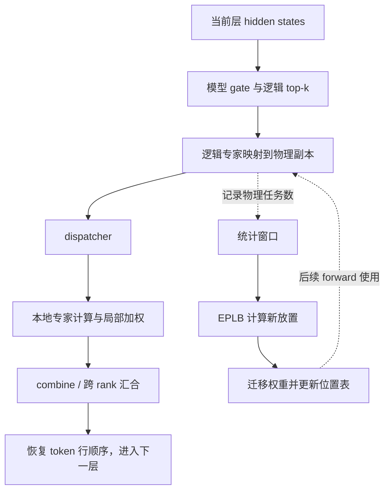
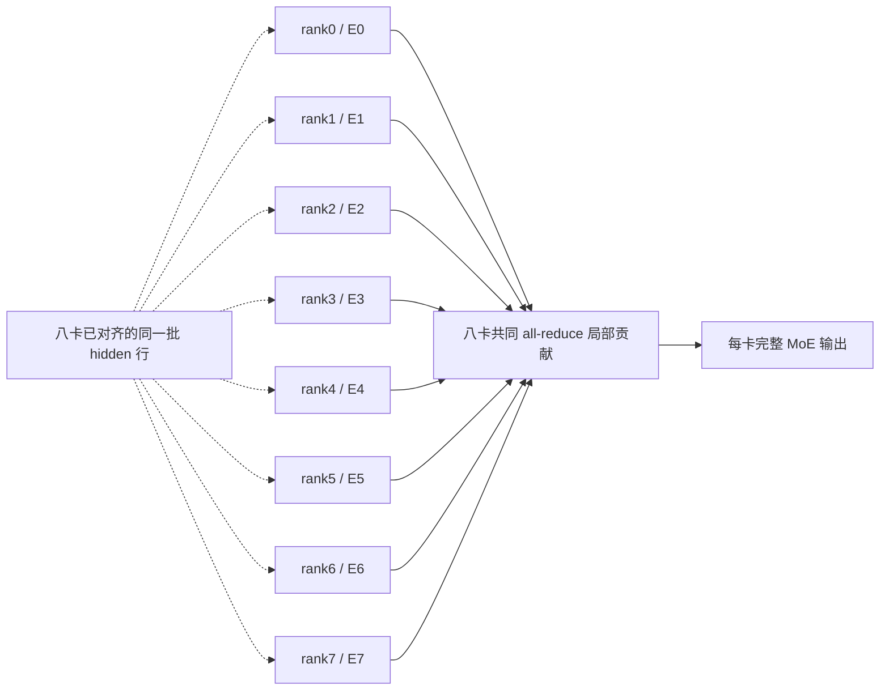
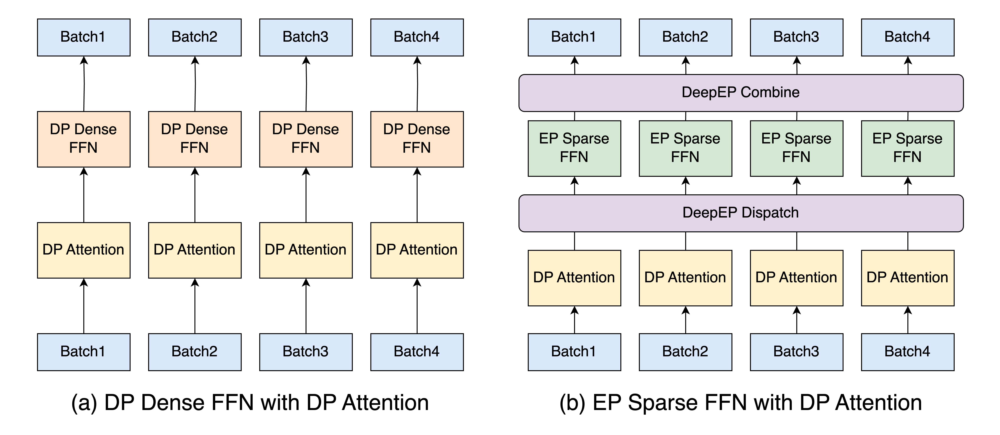
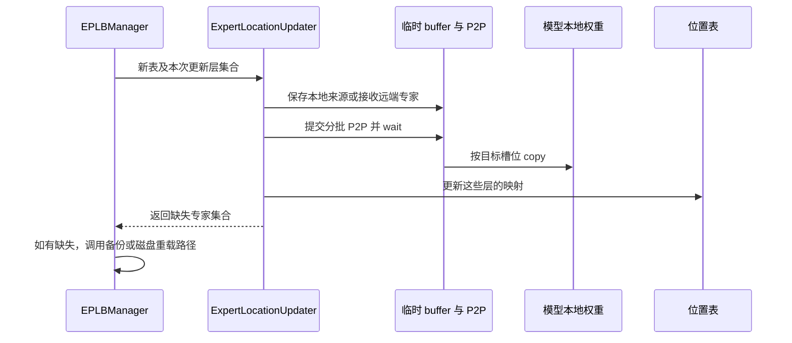
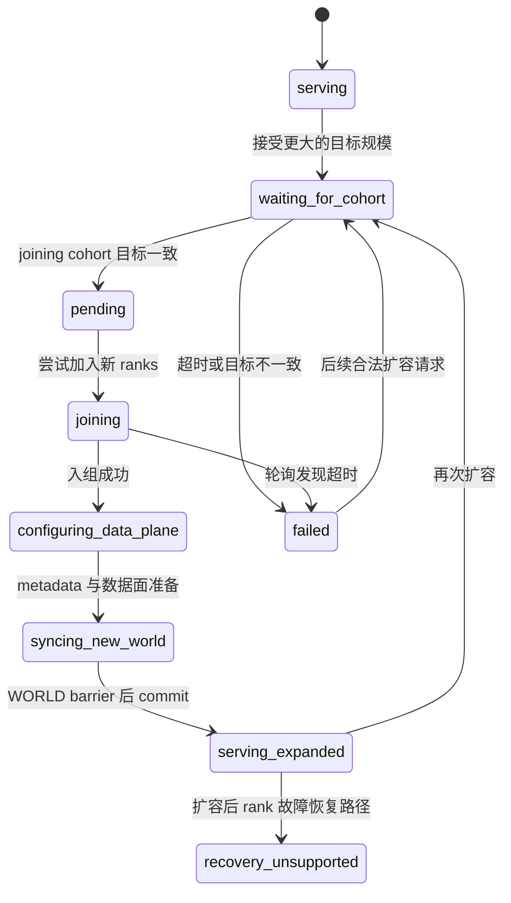

# MoE 专家并行与负载均衡

> **先建立架构心智模型：** [M07 · 并行部署与通信拓扑](<../architecture/07-并行部署与通信拓扑.md>)。先看职责、数据和生命周期，再回到本篇源码细节。

本文是 **06-05，源码分析型学习资料**。本篇回答：**一条请求经过 MoE 层时，谁决定用哪些专家，谁计算，谁搬数据，负载不均时又由谁改变专家的位置？** 先走通没有 All-to-All 的八卡 EP，再对照 DeepEP，最后接上 EPLB 和弹性 EP。

## 0. 阅读基线与范围

| 项目 | 内容 |
| --- | --- |
| 源码路径基准 | SGLang 仓库根目录 `.`；所有源码位置均为仓内相对路径 |
| 分支 | `codex/sglang-source-study-20260909`，基于官方 `main` |
| 固定 commit | `72d5c5bb73cadd7ffbf5114e5f81e29d36b6c61a` |
| 读取时间 | `2026-09-10` |
| 工作区状态 | 学习 worktree 干净；原源码工作区及 Wiki 其他未提交资料保留 |
| 操作边界 | 只读源码、编写文档、独立教学算术和引用检查；未导入 SGLang/torch、安装依赖、加载模型或运行测试 |
| 前置 | [06-01 Rank](01-Rank进程组与通信基础.md)、[06-02 TP](02-TensorParallel与层内通信.md)、[06-03 DP Attention](03-DataParallel与DPAttention.md)、[05-06 Kernel](../05-model-execution/06-Kernel注册选择与实现阅读.md) |
| 主线 A | `DeepseekV2MoE.forward_normal`；CUDA eager、BF16、Triton runner、`moe_a2a_backend=none`；TP=8、EP=8、MoE TP=1、DP/PP/CP/MoE DP=1 |
| 主线限定 | 非 Hash MoE、非 MTP；不启用 SP、DP Attention、模型级图/编译、Overlap、LoRA、量化、shared fusion、Waterfill、DWDP、融合/延后 MLP 规约；先令 shared experts 为 0 |
| 教学模型 | 只缩小一个 MoE 层：8 个逻辑 routed experts、top-k=2、hidden=128、专家 intermediate=256；尺度系数取 1；不是实际发布模型或可直接启动的完整配置 |
| 对照 B | DeepEP normal + DeepGEMM 的 Python 调用契约；独立使用 TP=EP=DP=8、DP Attention、Attention TP=1，其他并行宽度为 1；不把 A 的 Triton runner 原样搬过去 |
| 对照 C | EPLB 的副本映射、统计窗口、权重迁移；弹性 EP 的请求、入组、数据面准备和提交边界 |

R1 沿用输入 8 个 token、生成 3 个 token 的教学负载。路由表、数字、图都是**整理者推导**，没有运行 trace 或性能结果。本文的“源码事实”限定于固定版本；DeepEP、DeepGEMM、Mooncake/NIXL 等外部库的内部协议没有单独固定源码版本，本篇不宣称验证其通信正确性。

## 1. 人话版：先选专家，再决定去哪一份专家权重算

Dense MLP 像每份作业都交给同一个科室。MoE 有多个专家，模型为每个 token 选择少数几个，并将它们的计算结果加权合并。EP 把专家分布在多张卡上，避免每张卡都保存全部专家权重。

“有八个专家”和“有八张卡”不是同一件事。一张卡可以放多个专家；一个专家也可以有多份副本，甚至在另一种拓扑中由多张卡共同切分计算。本文 A 的 MoE TP=1，先让每份物理专家保存完整专家权重。[S1][S13][S19]

| 名称 | 人话解释 | 决定什么 / 不决定什么 |
| --- | --- | --- |
| model router / gate | 模型里给专家打分的线性映射 | 为 token 产生专家分数；不分配 HTTP 请求 |
| logical expert | 模型参数中的专家身份，如 E0 | 同一个逻辑专家的各副本应代表同一组权重 |
| physical expert | 某个 rank 上实际存放的一份专家权重 | 可是 E0 的第一份或第二份；不是新的语义专家 |
| top-k | 一个 token 选择的专家数 | 不是 batch size、请求数或采样 top-k |
| dispatch | 把当前 token 与专家任务安排到执行位置 | 有的实现发网络数据，有的只改本地索引 |
| expert runner | 执行专家的矩阵乘、激活和重排 | 不是请求 Scheduler |
| combine | 按原 token 行收回专家贡献 | 本地专家求和与跨 rank 汇合可能在不同层发生 |
| EPLB | Expert Parallel Load Balancing，调整专家放置与副本分配 | 根据历史任务数换位置；不训练 gate 或改 token 的逻辑专家身份 |
| elastic EP | 改变活跃/有效 rank 集合并协调运行状态 | 接受扩容请求不等于新 rank 已可服务 |

R1 是一条请求，但本层 Prefill 有 8 行 token、top-k=2，共有 **16 对 `(token, logical expert)` 任务**。R1 后续一个 Decode 步只有 1 行 token，对应 2 对专家任务。请求负载、输入 token 数、专家任务数必须分别计数。



**图意解读：** 方框是职责，不全是独立进程。快路径处理当前 forward，统计与 EPLB 影响后续 forward；没有“每来一个 token 就重新搬全部专家权重”的步骤。[S2][S14][S24][S36]

## 2. 八卡 EP：为什么 TP=8 不表示每个专家被切成八份

### 2.1 主线 A 的 rank 与专家表

本例 WORLD、普通 TP 与 EP 都包含 `[0,1,2,3,4,5,6,7]`；PP=1。MoE TP 宽度为 `8 / (8×1)=1`，各 MoE TP 组是单成员。Attention 仍按普通 TP 协作，进入本层普通 MoE 的 hidden 行在各 rank 上对应同一批 token。[S19] 前面文章的 DP8、PP4 拓扑是独立示例，不在这里继续相乘。

先关闭 EPLB、副本数取 0：

| global rank = EP rank | 物理槽位 | 逻辑专家 | 本层权重形状示意 |
| ---: | ---: | --- | --- |
| 0 | 0 | E0 | `w13[1,512,128]`、`w2[1,128,256]` |
| 1 | 1 | E1 | 同上，各自持有 E1 权重 |
| 2 | 2 | E2 | 同上 |
| 3 | 3 | E3 | 同上 |
| 4 | 4 | E4 | 同上 |
| 5 | 5 | E5 | 同上 |
| 6 | 6 | E6 | 同上 |
| 7 | 7 | E7 | 同上 |

这里 `w13` 合并 gate/up，`w2` 是 down；形状对应未量化普通权重的构造，不描述所有 backend 的打包内存顺序。[S69] `FusedMoE` 根据物理专家数计算本地数量，并要求 routed 物理专家数可被存储 EP 宽度整除、intermediate 可被 MoE TP 整除。[S13]



**图意解读：** 虚线表示这些 rank 已有相同输入视图，不是 StandardDispatcher 发八次网络消息。S 表示集体操作，不是第九个汇总进程；每个 rank 都参与。

### 2.2 副本占用的是什么

稍后启用 EPLB 并加 8 个 redundant experts：物理专家总数从 8 变为 16，每卡 2 份。逻辑专家仍为 8，top-k 仍为 2；不会因为有两份 E0 就让 token 同时多算一份 E0。[S13][S20]

加载 checkpoint 时，`FusedMoE.weight_loader` 从逻辑专家号找到该 rank 要保存的物理副本，再逐份装入。模型是否能提供专家位置配置和可迁移的逐层权重，也是 EPLB 路径的前提。[S21][S65][S67]

普通 EPLB 在已分配的物理槽位间重放置；增加 redundant 数量本身需要更多权重存储。不要将专家权重变小直接换算成整机总显存同倍率下降：Attention、KV、共享专家、通信和重排 buffer 都还有各自账本。

### 图解补充：请求分组与专家分组可以不同



[查看原尺寸](../../../images/sglang-source-study/21-ep-parallel.png)（手机查看宽图时可横屏或放大）。

**图意解读：** 左半图的 Dense FFN 与右半图的稀疏 FFN 分开看。右侧 Dispatch 将 token 送往专家，Combine 把专家结果带回对应请求。

**对应本篇源码：** 结合本篇 rank/expert 身份与后文 dispatch/combine 账本，分别跟踪请求来源、专家目的地以及返回行。 [源码：python/sglang/srt/layers/moe/token_dispatcher/deepep.py][S37]

**来源与边界：** [Deploying DeepSeek with PD Disaggregation and Large-Scale Expert Parallelism on 96 H100 GPUs](https://www.lmsys.org/blog/2025-05-05-large-scale-ep/)，SGLang Team，2025-05-05。这是 2025 年 DeepSeek 部署的并行设计，不能套成所有 Dense 模型的 DP Attention 路径，也不保证当前任何 TP/EP 配置都使用同一 DeepEP 模式。 [来源档案 F21](../../../images/sglang-source-study/SOURCES.md#f21)。

## 3. R1 到达一层 MoE：从模型分数到局部结果

### 3.1 gate、top-k、加权系数是三件事

`DeepseekV2MoE.forward` 根据 A2A 开关等选择路径。本篇 A 进入 `forward_normal`：gate 产生 `[T,E]` router logits，TopK 产生 `[T,k]` 的 ID 和权重，再调用 `self.experts`。[S1][S2][S3][S4]

本文重点是执行流，不将所有 MoE 模型的路由算法统一成 softmax。以仓内 `biased_grouped_topk_impl` 的可读表达为例：先对 logits 做 sigmoid，加 correction bias 得到**选择分数**；每组取最高两项求组分数，选若干组，再在允许组里选专家。最终混合权重从**未加 bias 的 scores**取出，随后按配置归一化和缩放。[S5] CUDA 包装有专用 kernel 分支；这段是阅读数学含义的锚点，不表示默认执行逐行 PyTorch 版本。

本例可设 2 组、每组 4 个专家、两组都保留，top-k=2；以下直接给定某次 gate 选择结果，不声称实际权重一定产生此结果。组号也是模型的逻辑分组，不是 EP rank 号。

| R1 输入行 | 选中逻辑专家 | 用于讲解的归一化权重 | EP 任务数 |
| ---: | --- | --- | ---: |
| 0 | E0、E1 | 0.75、0.25 | 2 |
| 1 | E0、E1 | 0.75、0.25 | 2 |
| 2 | E0、E1 | 0.75、0.25 | 2 |
| 3 | E0、E1 | 0.75、0.25 | 2 |
| 4 | E0、E2 | 0.75、0.25 | 2 |
| 5 | E0、E3 | 0.75、0.25 | 2 |
| 6 | E0、E4 | 0.75、0.25 | 2 |
| 7 | E0、E5 | 0.75、0.25 | 2 |

本层逻辑任务数是 `[8,4,1,1,1,1,0,0]`。E6、E7 这次未被选中，不代表对应 rank 可以退出整个 forward 或跳过公共通信。

### 3.2 没有 A2A 时，dispatch 先做的是索引转换

在 A 的 `StandardDispatcher.dispatch` 中，hidden states 普通分支直接透传。EP>1 时创建 `local_expert_mapping`，本卡的全局物理 ID 映射成本地 ID，其他物理 ID 映射成 `-1`；Triton 使用转换后的 ID。[S11]

| 观察位置 | 行 0 的 ID | 含义 |
| --- | --- | --- |
| gate/TopK | `[0,1]` | 选 E0、E1；无副本时物理号与逻辑号相同 |
| rank 0 dispatcher 后 | `[0,-1]` | 本地第 0 份专家负责 E0；另一任务不属于本卡 |
| rank 1 dispatcher 后 | `[-1,0]` | 本地第 0 份专家负责 E1 |
| rank 2—7 dispatcher 后 | `[-1,-1]` | 本卡对此行无专家贡献 |

`-1` 是这一段契约的无效任务标记，不能拿来访问最后一份专家权重。底层普通 Triton kernel 遇到过滤专家会清零它拥有的输出或跳过对应分支；具体行为还取决于融合开关，本篇关闭额外融合。[S18]

**关键点：** 此处没有把 R1 的 HTTP 对象发给某个专家进程，也没有逐 token 网络搬运。八个 rank 已拥有同一批 hidden 行，分别挑出自己负责的计算。

### 3.3 一份专家任务到底算什么

普通 gated MLP 可以理解为：`Expert(x)=Wdown(SiLU(Wgate(x))×Wup(x))`。实际 tensor 方向按源码存储约定处理，表达式用于说明依赖关系。

本篇调用链是：

```text
DeepseekV2MoE.forward_normal
  -> FusedMoE.forward_impl
     -> StandardDispatcher.dispatch
     -> UnquantizedFusedMoEMethod.forward_cuda
        -> Triton 的 fused_experts_none_to_triton
           -> fused_experts / _fused_moe_kernel_sequence
     -> StandardDispatcher.combine
  -> 普通 post-experts TP all-reduce
```

源码分别对应 [S3][S14][S15][S16][S17]。runner 会按专家组织任务，执行 gate/up、激活乘法、down，再恢复 token/top-k 对应关系。普通 `apply_router_weight_on_input=False` 时，down 阶段处理路由权重；本例 top-k=2、scale=1 的最终局部相加有直接 `torch.add` 分支。[S17] 不是所有 backend 都先构造完整 `[T,k,H]` 再用同一段求和代码。

对行 0：rank0 贡献 `0.75×E0(x0)`，rank1 贡献 `0.25×E1(x0)`，其余为零。`StandardDispatcher.combine` 的普通分支直接返回本地结果；**跨 rank 求和发生在外层 `forward_normal`**。[S12][S3] `FusedMoE` 自己也有可选 `reduce_results` 分支，但此代表构造保持默认 False，不能算两次规约。[S13][S14]

规约后各 rank 得到相同的完整 `[8,128]` MoE 输出，继续下一层。若启用延后 all-reduce、reduce-scatter 或某些融合路径，外层会跳过这次规约，由对应下游承担；本篇没有开启这些条件。[S46]

### 3.4 从本层走回 R1 的三次输出

| 轮次 | 进入 MoE 的有效行 | 本层专家任务数 | 后续动作 |
| --- | ---: | ---: | --- |
| Prefill | 8 | 16 | 各模型层结束后，输出投影与采样产生 O1 |
| 第一次 Decode | 1，输入 O1 | 2 | 产生 O2 |
| 第二次 Decode | 1，输入 O2 | 2 | 产生 O3，满足本例长度结束 |

这是每个 routed MoE 层的任务数，不是整个模型只调用一次 MoE。下一层、下一轮 gate 的专家选择可以不同；O3 没有再作为模型输入，因此本例没有为它增加第四次 forward。完整请求/KV 收尾见 [02-04](../02-request-lifecycle/04-一次Prefill到多轮Decode.md)。

专家权重与位置表常驻，当前 forward 的 top-k、排序索引和中间激活只服务本轮；部分 runner 会原地写回 hidden。它们均不等于随请求持续保存的 KV，也不拥有请求结束和 KV 释放的决定权。

## 4. 有副本时：为什么各 rank 必须选同一份 E0

### 4.1 三层 ID 不能混用

启用 EPLB 后，TopK 后处理先完成逻辑到物理映射，统计也在这个后处理阶段接入；StandardDispatcher 随后才转换为本地专家号。[S6][S7][S9][S11]

| ID | 例子 | 有效范围与拥有者 |
| --- | --- | --- |
| logical ID | E0 | 模型身份，由 gate 选择 |
| global physical ID | p8 | 位置表中的全局槽位，可保存 E0 副本 |
| local expert ID | local0 | rank4 权重 tensor 第一维的本地索引 |

`physical_to_logical_map` 按层记录每个槽位装的是谁；`logical_to_all_physical_map` 给出候选副本；`num_valid` 区分真实候选与补齐的 `-1`；static 路径还使用 rank 对应的选择表。[S66]

### 4.2 普通 EPLB 的 dynamic 不是“找此刻最空闲的卡”

无 A2A 时，`ExpertLocationDispatchInfo.rank_invariant=True`。dynamic 分支按 `row_index % num_valid` 从候选列表选择副本，保留输入 ID 的 dtype 与形状。[S7][S8]

如果同一行的 E0 在 rank0 选 p0、rank4 选 p8，两边都可能把自己那份 E0 算入局部和，最后规约重复计入 E0。反过来，各自都认为应由对方算，也可能漏掉。因此需要**相同 token 行、相同候选顺序、相同副本选择**，而不只是形状一致。

固定基线不仅修改选择公式：无 A2A 时，初始候选列表也不会按本 rank 的“最近专家”折叠。否则各 rank 看到的候选表不同，行号取模仍无法保证一致。[S10]

有 A2A 时，各源 rank 发送自己的 token，dynamic 使用随机整数取模选择候选；static 查该 rank 的映射表，候选可能偏向本卡/本节点。它们不是每个 token 都读取全网实时队列。`fake` 会随机改 router logits，是模拟路径；不能用它证明真实模型精度。[S9][S10]

### 4.3 16 个物理槽位的教学账本

trivial 初始映射把物理号对逻辑专家数取模，本例为 `[E0…E7,E0…E7]`。[S20] 相同 R1 路由，行号取模得到：

| rank | 初始两份物理专家保存的逻辑身份 | 此轮专家任务数 |
| ---: | --- | ---: |
| 0 | E0、E1 | 6 |
| 1 | E2、E3 | 1 |
| 2 | E4、E5 | 1 |
| 3 | E6、E7 | 0 |
| 4 | E0、E1 | 6 |
| 5 | E2、E3 | 1 |
| 6 | E4、E5 | 1 |
| 7 | E6、E7 | 0 |

例如 E0 出现在 8 行，偶数行用 p0、奇数行用 p8；E1 出现在前四行，分别用 p1/p9。副本已经分摊一部分热点，但卡间仍不均衡。

为了说明“副本数与放置都重要”，手工构造另一张表：rank0—1 各放 `[E0,E1]`，rank2—7 依次放 `[E0,E2]` 到 `[E0,E7]`。物理槽位仍是 16，逻辑身份仍是 8。E0 有 8 份、E1 有 2 份，按相同行号规则，此轮卡负载为 `[3,3,2,2,2,2,1,1]`。

**这张新表是教学手工方案，不是已经运行 EPLB 算法得到的解，也不主张最优。** 对单行 Decode，E0 只会选一份，8 份副本不会把一项专家任务拆成八份；多个 batch 的行号也会重新开始，不能保证长期请求总能均匀落到所有副本。

## 5. EPLB：先数任务，再搬权重，最后改变后续选择

### 5.1 统计口径要从 hook 读起

`stat` 的代表收集器在 TopK 逻辑到物理映射之后统计有效物理 ID，忽略 `-1`；不是读取 HTTP 请求数。`ModelRunner.forward` 用 recorder context 包住执行，退出后将本轮数据放入 accumulator，随后推进 EPLB manager。[S6][S25][S36]

`_StatAccumulator.dump` 将窗口里的物理计数按 `physical_to_logical_map` 聚合回逻辑计数，再做分布式 SUM。[S26] 无 A2A 主线各 rank 看到相同 token/物理选择，因此统计的全局 SUM 可能包含共同的 rank 倍数，**不能直接把 dump 数字当唯一用户 token 数**；统一倍数不改变本例均衡比例。

DeepEP normal 的 `stat` 选 TopK 计数；`stat_approx` 才沿接收专家计数收集，后者可能含对齐影响。`_SinglePassGatherer.init_new` 对 DeepEP 的显式 normal/low_latency 有分支，记录开启后遇到 auto 不能不经核对就声称等价兼容。[S63] 上层配置是否改写模式还应一起看。

### 5.2 “utilization” 不是 nvidia-smi 的 GPU 忙碌时间

源码 `compute_utilization_rate` 的口径是：

```text
balancedness = (各卡物理专家任务数的平均值 + 1e-5)
               / (各卡物理专家任务数的最大值 + 1e-5)
```

这是**任务数均衡度代理量**。[S27] 不含每项专家计算耗时、网络带宽、SM busy、稀疏 padding 成本等。全零输入也因 epsilon 接近 1，不能读成设备满载。

忽略 epsilon，上一节初始负载平均 2、最大 6，比例约 `1/3`；手工新方案最大 3，比例约 `2/3`。这证明教学计数更均匀，不证明吞吐翻倍。

### 5.3 触发时机与分层更新

声明的 rebalance 周期默认 1000 次推进、layers per chunk 默认 None、阈值默认 1.0；EPLB 默认关闭。[S68] 开启后，解析通常补上 `stat` 和缺省 dispatch 算法，recorder buffer 默认跟随周期。[S34][S35]

manager 检查周期不小于 recorder buffer，启动记录并创建生成器。`on_forward_pass_end` 对生成器调用一次 `next`；生成器先 yield N 次，然后进入 rebalance。[S22][S23] 因此新生成器第一次实际进入 rebalance 发生在第 N+1 次推进，不能把注释“每 N 轮”机械当作精确首触发编号。分层 chunk 的 yield 又会消耗额外推进。

| 状态 / 对象 | 谁控制 | 就绪与变化 |
| --- | --- | --- |
| 统计窗口 | recorder / accumulator | forward 结束追加；有限 buffer 循环覆盖 |
| 周期等待 | EPLBManager 生成器 | 逐次 yield，不按 HTTP 请求数计时 |
| 是否需要重排 | `rebalance` | disabled/部分扩容阶段直接返回；阈值可跳过 |
| 新放置候选 | `ExpertLocationMetadata.init_by_eplb` | 算法根据逻辑负载、槽位数、节点和组约束构造新表 |
| 权重迁移中 | ExpertLocationUpdater | 先准备临时副本与 P2P，再写回目标权重 |
| 位置表更新 | `ExpertLocationMetadata.update` | 只改本 chunk 的层；其他层保留旧表 |
| 后续 forward | 模型 TopK / dispatcher | 读已更新层的位置；不是当前层执行到一半随意换表 |

阈值判断是均衡比例 **大于**阈值才跳过；等于阈值不会因这一条件跳过。默认阈值 1.0 时统计端可不返回该平均量，manager 视 None 为需要继续。[S24][S26] 这些条件不等价于每次都一定发生实际权重搬运，候选也可能与原表相同。

### 5.4 算法和迁移各负责哪一步

`compute_algorithm(auto)` 根据专家组与节点整除关系选择 DeepSeek 或层级版本；它不是自动实测后选择最快算法。[S33] 代表 `replicate_experts` 反复给“负载/副本数”最大的逻辑专家增加副本；`balanced_packing` 在每卡固定槽位数限制下按负载装箱。层级版本还先处理组到节点的关系。[S31][S32][S65] 本篇解释这份实现，不声称证明所有负载下的全局最优。

迁移不能只换一张 ID 表。`ExpertLocationUpdater.update` 先处理权重，再更新 metadata；单层更新依次处理未变化、同卡复制、复用已接收副本、同节点和跨节点来源。[S28][S29]



**图意解读：** 临时 buffer 防止把仍作为来源的权重提前覆盖。P2P 按专家范围分批，等待每批 Work 后才写回目标。[S29] 普通 metadata 更新要求 EP size 不变，并以原 tensor 的选中层原地更新。[S30]

故障路径还可能返回缺失逻辑专家；wrapper 随后尝试按名称过滤从备份或磁盘恢复，没有过滤接口时走较宽的重载，并按需重建 LP solver。[S56] 所以“位置表更新函数返回”不能单独证明故障恢复完整成功。普通分层更新也不是整模型所有层同时切换的事务；本次没有验证异步执行、取消和故障交错下的全局安全。

## 6. 对照 B：DeepEP 把 token 发到专家所在 rank

### 6.1 先改变 token 所有权，再改变通信

独立对照配置使用 TP=EP=DP=8，启用 DP Attention，Attention TP=1；每个源 rank 处理自己的 token，EP 组仍覆盖八卡。R1 可由 rank0 接入，其他 rank 同一轮可有其他请求或参与空批同步；空输入路径会构造空 TopK 后继续调用专家路径，不因本地没 token 就退出需要集体参与的步骤。[S45]

`create_moe_dispatcher` 对 DeepEP 类 backend 构造相应 dispatcher；CUDA 的此路径用 TP device group，而解析会将 DeepEP 等所列 A2A backend 的 EP 调整为 TP 宽度。[S42][S43] 这不是再乘一套 EP 进程。

`forward_deepep` 这个名字也不能作为“当前一定使用 DeepEP 库”的证明：它是模型的 A2A 路径入口，真正 backend 还要追到 dispatcher 工厂。[S2][S42][S45]

### 6.2 normal 模式的四步握手

| 外层阶段 | 当前调用 | 保存的状态与数据 |
| --- | --- | --- |
| INITIAL | `dispatch_a` | TopK IDs 转 int64；准备输入/可能的量化和生产者事件 |
| AFTER_DISPATCH_A | `dispatch_b` | 计算 dispatch layout，发送并接收；保存本轮 handle；在当前流等待完成依赖 |
| AFTER_DISPATCH_B | 本地 MoE core，随后 `combine_a` | 按专家重排、计算并恢复接收行；准备输出发送依赖 |
| AFTER_COMBINE_A | `combine_b` | 用 dispatch handle 回传/汇合；建立完成依赖，清理 handle；外层回到 INITIAL |

外层 `_Stage` 用 assert 约束顺序，删去中间 Python 状态；normal 实现在 `combine_b` 里清 `handle` 和 `src2dst`。[S37][S38] 外层切回 INITIAL 的赋值先于内部 combine 返回，故单看枚举不是 GPU 完成证据。`event.current_stream_wait()` 建立流依赖，也不等于 CPU 全设备同步。

DeepEP buffer 是跨调用复用的通信设施；handle 描述本轮 dispatch/combine 配对。清 handle 不等于销毁整个通信 buffer，更不等于释放请求 KV。源码还说明 handle 当前放在实例成员而不是随 output 对象传递，不能自行让同一个实例无约束交错多个未 combine 的 dispatch。[S37][S38]

### 6.3 网络分发与本地重排不同

normal 先通过 `get_dispatch_layout` 取得每 rank、每专家等计数，再调用外部 `buffer.dispatch`，收到 hidden、专家 ID/权重和每专家接收数。[S37] 单个 token 的多个专家若在同一目的 rank，网络行与专家任务行不必一一对应；不要用 `T×k×H` 冒充实际网络字节。

DeepGEMM 适配器又通过 `ep_scatter` 将接收行整理成专家计算布局，保存 output index、原 shape 和 top-k；runner 做 grouped GEMM，`ep_gather` 按路由权重恢复接收行贡献，才交给 DeepEP combine 回到来源。[S39][S40][S41]

```text
源 token 行
 -> 跨 rank dispatch
 -> 目的 rank 接收行
 -> 本地按专家重排 / padding
 -> 专家 GEMM 与激活
 -> 本地按接收行加权恢复
 -> 跨 rank combine
 -> 源 token 行
```

R1 行0若选 E0/E1，rank0/1 各算相应贡献，最终回到 R1 的源行位置。专家任务仍有16对，但网络是否去重、padding 数量、dtype/scale、节点内与节点间通路属于 backend 契约；本篇没有从调用参数推断实测字节或 RDMA 安全。

### 6.4 不能直接照搬主线 A 的 runner

固定基线 `_DeepEPDispatcherImplNormal.combine_a` 在非 DeepGEMM、非 AITER、非 NPU 条件下抛 `NotImplementedError`，并注明普通 Triton runner 暂时禁用。[S37] 所以 A 的“BF16 + Triton + none”不能只改 A2A 字符串就宣称走通 normal。

本篇对照 B 追 DeepGEMM 适配器；其 core 按权重 dtype 和布局分 BF16/其他、contiguous/masked 路径。[S39] 权重是 BF16 不自动决定 dispatch dtype，通信输入还受量化配置和环境控制。真实实验需另固定外部依赖、GPU 和输入规模。

auto 模式按 batch 是否含 Extend 在 normal/low_latency 间选择，low_latency 有独立的接收 hook、packed count 与 masked 布局。[S38][S64] 显式 normal 的解析会关闭 CUDA graph；这些差异不能压成同一张固定 buffer 表。[S44]

## 7. 共享专家、EPLB 和请求负载怎样分开理解

共享专家是每个相关 token 都会经过的模型分支；routed experts 则由 gate 选择。`DeepseekV2MoE` 可将共享专家单独算，也可按 backend 融入专家槽位。[S1][S3][S45] 它不是“EPLB 给热点专家多放的副本”。

本篇先设共享专家为 0，以免把三种贡献混在一起。带独立共享分支时，要核对 shared 使用 TP 分片还是 TP1 复制，以及它在规约前还是后加回；复制的共享结果若在每个 rank 规约前重复加入，会多算。[S3] per-rank fused shared slots 又有专用 ID 映射和统计处理，TopK 后处理会为 EPLB 保留 routed 部分计数。[S6]

| 层次 | 负载对象 | 主要动作 | 不能代替 |
| --- | --- | --- | --- |
| 请求分发 / DP | 请求、输入长度和队列 | 选择实例或 Attention DP rank | 同一层专家热点分摊 |
| MoE router | 每层每 token 的分数 | 选择逻辑专家与权重 | 排队/拒绝 HTTP 请求 |
| 副本 dispatch | 当前已选专家任务 | 选择已有物理副本并执行/发送 | 改变可用副本总预算 |
| EPLB placement | 一段窗口的专家任务统计 | 重放置/复制专家权重 | 自动保证 TTFT、ITL 或吞吐提升 |
| elastic EP | rank 的健康、入组与有效规模 | 协调新参与者和运行状态 | 仅靠更均匀的专家表完成扩容 |

两张卡各有相同请求数，仍可能因 token 数不同、某层偏向 E0、共享专家耗时或通信不同而不均衡。诊断时按层和 forward 模式拆开，不能只看全局平均。

## 8. 弹性 EP：接受请求、加入通信与可服务是三个阶段

### 8.1 状态里有哪些不同数字

`ElasticEPState` 分开记录 `original_ep_size`、`effective_ep_size`、`pending_ep_size`，以及活跃 rank 的设备表、CPU 快照、上一轮快照和 `has_scaled`。[S47] 预留槽位不代表该 rank 已加入；`reset` 只把有效规模内的槽位置为活跃。

HTTP `scale_elastic_ep` 验证输入并转给 Tokenizer/Scheduler；Scheduler 要求目标大于当前有效规模、不超过 max，且没有前一次扩容/恢复仍在进行，成功后排入 pending 并暂停常规 rebalance。[S53][S55] 它返回“已发起”，不会在这个 handler 内创建所有远端进程并证明服务成功。



**图意解读：** `serving` 是教学概括，源码初始 phase 为 `idle`；其他节点对应本篇读取的 phase。图只表达已确认的控制路径，不承诺任意步骤异常都能原子回滚。[S47][S48][S51]

### 8.2 从 4 扩到 8，提交之前必须发生什么

这是与 A/B 分开的扩容例子。加入 cohort 的 offset 应为当前有效规模4，目标为8，新 ranks 是 `[4,5,6,7]`。`maybe_join_ep_ranks` 核对 cohort 目标、同步检查超时、尝试入组；成功后进入 `_finalize_scale_up`。[S51]

finalize 标记活跃槽位，扩展并广播专家 metadata，调用数据面 `on_scale`，重建 recorder，更新 DP Attention 的规模/rank 和运行上下文；然后进入新 WORLD barrier，最后 `commit_scale` 把 pending 写成 effective 并恢复后续 EPLB 节奏、通知前端镜像状态。[S52][S49]

因此检查顺序应是：**请求接受 → cohort 对齐 → 新成员入组 → 专家/通信/DP 元数据准备 → 新 WORLD 同步 → effective 提交 → 新 rank 实际推理验证**。本次没有完成最后的运行验证，HTTP 状态查询也只是 Tokenizer 镜像，不能代替每个 rank 的实际结果。

### 8.3 固定版本的组合约束

| 条件 | 源码规则 / 限制 | 证据 |
| --- | --- | --- |
| 普通 elastic EP | PP 必须为1；EPLB auto 在此改为 elasticity-aware 系列 | [S54] |
| 运行时扩容 | 控制集体通信 backend 要求 `elastic_ep_backend=mooncake`，MoE A2A 要求 `nixl` | [S54] |
| 扩容拓扑 | EP=TP=DP；启用 DP Attention 与 DP LM head；CP=MoE DP=1 | [S54] |
| 图执行 | Prefill 与 Decode 图都要关闭 | [S54] |
| 服务与调度 | 单 tokenizer worker、round_robin；不支持 Ray 或 elastic expert backup 组合 | [S54] |
| joiner | scale 模式要求 node-rank=1、offset>0、携带初始 EP size；目标不超过 max；单 rank joiner 另要求 moe_dense_tp_size=1 | [S54] |
| 扩容后的 rank 恢复 | `has_scaled` 后的恢复分支明确标记 `recovery_unsupported` 并报告错误 | [S51] |

两个 backend 参数负责不同层，不因都含通信就可以互换。启动时固定 rank 集合的故障恢复，与追加新 ranks 的扩容也不是同一条协议。

`fail_scale` 清 pending、保留 effective 并重置活跃表；runner 还做相应 EPLB 重设。[S50][S51] 这能说明这些字段的失败行为，不能推导为所有部分入组、设备故障和外部通信状态都可无损回滚。特别是扩容后的恢复限制，应在部署验收中保留。

## 9. 从现象回到源码

| 现象 | 先区分什么 | 检查入口 |
| --- | --- | --- |
| EP=8 却没有逐 token A2A | backend 是否为 none；hidden 是否已在所有 rank 上复制 | StandardDispatcher、forward_normal |
| EPLB 后输出错误但 shape 正常 | logical/physical/local ID，候选顺序，跨 rank 副本选择是否一致 | TopK 后处理、ExpertLocationDispatchInfo、位置表构造 |
| 某层少数卡很忙 | 每层有效 token/top-k 计数、shared 分支、padding、实际耗时 | recorder、runner、逐卡 trace |
| 加副本后 Decode 没变快 | 单行不能拆分一项专家任务；新副本是否实际被选中 | dynamic 行号规则、每轮候选与计数 |
| “GPU utilization” 高但吞吐低 | 指标究竟是任务均衡比还是设备忙碌率 | compute_utilization_rate、外部设备指标 |
| 配置写了每 N 轮，但触发点不同 | generator yield、chunk、disabled、阈值、reset | EPLBManager._entrypoint / rebalance |
| 重排后 ID 正确但权重错 | 来源是否提前被覆盖、临时 buffer、P2P wait、缺失权重恢复 | ExpertLocationUpdater 与 recovery wrapper |
| DeepEP combine 不支持 | 运行中的 runner、模式、平台和外部能力 | normal combine_a、dispatcher factory |
| dispatch 后下一批覆盖状态 | handle 归属、Stage 顺序、事件依赖、复用实例 | DeepEPDispatcher / normal impl |
| 扩容返回成功但新 rank 不工作 | pending/effective、cohort、数据面、WORLD barrier、镜像通知 | Scheduler、ModelRunner、ElasticEPState |
| 扩容后故障无法恢复 | 是否 has_scaled；是否进入明确拒绝分支 | maybe_join_ep_ranks |

这张表是排查路径，不是已复现的故障清单。请求取消/释放见 [02-06](../02-request-lifecycle/06-完成取消与资源释放.md)；本篇不将某个 token 的 combine 完成当作请求所有 KV 已可释放。

## 10. 源码阅读路线与验证边界

### 10.1 按职责读，不从网络 kernel 硬啃

| 顺序 | SGLang 仓内源码与符号 | 回答的问题 |
| ---: | --- | --- |
| 1 | `python/sglang/srt/models/deepseek_v2.py::DeepseekV2MoE.forward` | 当前到底选普通还是 A2A 路径？[S2] |
| 2 | `python/sglang/srt/layers/moe/topk.py::select_experts` | 逻辑分数、选择、物理映射、统计按什么顺序？[S4] |
| 3 | `python/sglang/srt/eplb/expert_location_dispatch.py::topk_ids_logical_to_physical` | 候选如何选，何时要求跨 rank 相同？[S9] |
| 4 | `python/sglang/srt/layers/moe/fused_moe_triton/layer.py::FusedMoE.forward_impl` | dispatch、core、combine 谁串起来？[S14] |
| 5 | `python/sglang/srt/layers/moe/token_dispatcher/standard.py::StandardDispatcher.dispatch` | 无 A2A 的 EP 为什么仍能只算本地专家？[S11] |
| 6 | `python/sglang/srt/layers/moe/token_dispatcher/deepep.py::DeepEPDispatcher` | 有 A2A 的配对状态在哪里？[S38] |
| 7 | `python/sglang/srt/eplb/expert_distribution.py::_StatAccumulator.dump` | 统计的是哪一层 ID，汇总口径是什么？[S26] |
| 8 | `python/sglang/srt/eplb/eplb_manager.py::EPLBManager.rebalance` | 什么时刻计算/安装新表？[S24] |
| 9 | `python/sglang/srt/eplb/expert_location_updater.py::update_expert_weights_single_layer` | 迁移如何避免覆盖来源？[S29] |
| 10 | `python/sglang/srt/model_executor/model_runner.py::ModelRunner.maybe_join_ep_ranks` | 扩容从等待到提交的完整条件是什么？[S51] |

### 10.2 已有测试入口与本次没有执行的部分

| 已静态阅读的测试入口 | 覆盖设计 | 本次状态 |
| --- | --- | --- |
| `test/registered/ep/test_eplb_no_a2a.py` 的 `TestEPLBNoA2A.test_gsm8k` | 两卡、48 个 redundant；初始放置/无 A2A 的精度回归，周期设置得很长 | 未运行；不引用注释中的历史分数作为本次结果 [S57] |
| 同文件 `TestEPLBNoA2ADPAttention` | 继承评估，加 DP Attention 和短 rebalance 周期，覆盖迁移后的路径 | 未运行；不是本篇八卡配置 [S58] |
| `test/registered/unit/eplb/test_dispatch_dtype_preservation.py` | static/dynamic 映射后 int32/int64、值与 shape | 只读代表回归方法，未导入 torch [S59] |
| `test/registered/unit/eplb/test_compute_logical_to_rank_dispatch_physical_map.py` | 有 A2A 时偏好本地候选；初始表与 rank 对应关系 | 只读代表方法及测试前置，不能代替 no-A2A 一致性验证 [S60] |
| `test/manual/ep/test_elastic_scale.py` 的基类测试 | 扩容前后请求、等待有效规模/phase、logprob 和评估 | 只读；不是自动通过的八卡证明 [S61] |
| 同文件 4→5→6 子类 | 两轮追加 rank 的调用顺序和后续请求 | 只读，未启动通信或远端进程 [S62] |

本篇实际做的是源码锚点复查、Markdown 引用检查，以及独立算术核对：8/16 物理槽位、R1 的16项任务、副本行号选择、三组负载账本、均衡比例和生成器推进。没有执行上表测试、模型数值对照、GPU 通信、取消/迁移并发、外部库内部协议、扩容故障回滚或性能实验。

真正运行时还需要记录模型/权重版本、逻辑/物理专家数、每层 map、所有并行组、dtype 与 backend、有效/填充 token、输入分布、通信/计算 trace 和原始结果。对比 EPLB 前后时，必须同时观察精度、迁移开销、稳定期负载和请求延迟，不能只截一张更均匀的热力图。

## 11. 练习与下一篇

1. R1 有 8 个输入 token、top-k=2、EP=8：是 1、8、16 还是 128 个专家任务？
   **答案：** 每个 routed MoE 层是16对任务。无 A2A 下八卡可都持有相同行/路由描述，但正确执行应每对任务只贡献一次；统计 SUM 的重复倍数另作解释。
2. StandardDispatcher 的 combine 返回后，本篇 A 的 MoE 输出已经跨卡完整了吗？
   **答案：** 还没有；普通分支返回局部结果，外层 forward_normal 的 all-reduce 才汇合各卡。特殊融合配置另读其替代位置。
3. 同一逻辑专家放了两个副本，为什么无 A2A 不让每个 rank 各选离自己最近的一个？
   **答案：** 所有 rank 对同一行算局部和，副本选择不一致可能重复或漏算。固定版本保留共同候选，并用行号规则选同一份。
4. `[6,1,1,0,6,1,1,0]` 的均衡比例是多少？能推导 GPU busy 吗？
   **答案：** 忽略 epsilon 为 `2/6=1/3`；不能推导设备忙碌时间或吞吐。
5. EPLB 换完位置表，是否已经证明缺失专家恢复成功？
   **答案：** 没有。迁移 wrapper 还要处理返回的缺失权重，且本次没有故障运行证据。
6. 4→8 的 HTTP 请求已接受，effective 仍是4，属于矛盾吗？
   **答案：** 不矛盾。目标可处于 pending；只有入组、数据面与新 WORLD 同步完成后才提交 effective=8。

上一篇：[06-04《Pipeline Parallel 与 Microbatch》](04-PipelineParallel与Microbatch.md)。下一篇：[06-06《Context Parallel 与并行组合》](06-ContextParallel与并行组合.md)。返回[系列目录](../README.md)，或查阅[术语](../appendices/01-术语与对象速查.md)、[源码索引](../appendices/02-源码入口与调用链索引.md)、[配置矩阵](../appendices/03-配置解析与功能兼容矩阵.md)、[排障索引](../appendices/04-症状到源码的排障索引.md)、[证据模板](../appendices/05-实验记录与证据模板.md)与[进度记录](../appendices/06-学习进度与版本变更记录.md)。

[S1]: https://github.com/sgl-project/sglang/blob/72d5c5bb73cadd7ffbf5114e5f81e29d36b6c61a/python/sglang/srt/models/deepseek_v2.py#L544
[S2]: https://github.com/sgl-project/sglang/blob/72d5c5bb73cadd7ffbf5114e5f81e29d36b6c61a/python/sglang/srt/models/deepseek_v2.py#L873
[S3]: https://github.com/sgl-project/sglang/blob/72d5c5bb73cadd7ffbf5114e5f81e29d36b6c61a/python/sglang/srt/models/deepseek_v2.py#L1039
[S4]: https://github.com/sgl-project/sglang/blob/72d5c5bb73cadd7ffbf5114e5f81e29d36b6c61a/python/sglang/srt/layers/moe/topk.py#L2309
[S5]: https://github.com/sgl-project/sglang/blob/72d5c5bb73cadd7ffbf5114e5f81e29d36b6c61a/python/sglang/srt/layers/moe/topk.py#L1460
[S6]: https://github.com/sgl-project/sglang/blob/72d5c5bb73cadd7ffbf5114e5f81e29d36b6c61a/python/sglang/srt/layers/moe/topk.py#L2119
[S7]: https://github.com/sgl-project/sglang/blob/72d5c5bb73cadd7ffbf5114e5f81e29d36b6c61a/python/sglang/srt/eplb/expert_location_dispatch.py#L25
[S8]: https://github.com/sgl-project/sglang/blob/72d5c5bb73cadd7ffbf5114e5f81e29d36b6c61a/python/sglang/srt/eplb/expert_location_dispatch.py#L114
[S9]: https://github.com/sgl-project/sglang/blob/72d5c5bb73cadd7ffbf5114e5f81e29d36b6c61a/python/sglang/srt/eplb/expert_location_dispatch.py#L83
[S10]: https://github.com/sgl-project/sglang/blob/72d5c5bb73cadd7ffbf5114e5f81e29d36b6c61a/python/sglang/srt/eplb/expert_location.py#L532
[S11]: https://github.com/sgl-project/sglang/blob/72d5c5bb73cadd7ffbf5114e5f81e29d36b6c61a/python/sglang/srt/layers/moe/token_dispatcher/standard.py#L134
[S12]: https://github.com/sgl-project/sglang/blob/72d5c5bb73cadd7ffbf5114e5f81e29d36b6c61a/python/sglang/srt/layers/moe/token_dispatcher/standard.py#L249
[S13]: https://github.com/sgl-project/sglang/blob/72d5c5bb73cadd7ffbf5114e5f81e29d36b6c61a/python/sglang/srt/layers/moe/fused_moe_triton/layer.py#L300
[S14]: https://github.com/sgl-project/sglang/blob/72d5c5bb73cadd7ffbf5114e5f81e29d36b6c61a/python/sglang/srt/layers/moe/fused_moe_triton/layer.py#L1522
[S15]: https://github.com/sgl-project/sglang/blob/72d5c5bb73cadd7ffbf5114e5f81e29d36b6c61a/python/sglang/srt/layers/quantization/unquant.py#L1027
[S16]: https://github.com/sgl-project/sglang/blob/72d5c5bb73cadd7ffbf5114e5f81e29d36b6c61a/python/sglang/srt/layers/moe/moe_runner/triton.py#L178
[S17]: https://github.com/sgl-project/sglang/blob/72d5c5bb73cadd7ffbf5114e5f81e29d36b6c61a/python/sglang/srt/layers/moe/moe_runner/triton_utils/fused_moe.py#L482
[S18]: https://github.com/sgl-project/sglang/blob/72d5c5bb73cadd7ffbf5114e5f81e29d36b6c61a/python/sglang/kernels/ops/moe/fused_moe_triton_kernels.py#L325
[S19]: https://github.com/sgl-project/sglang/blob/72d5c5bb73cadd7ffbf5114e5f81e29d36b6c61a/python/sglang/srt/distributed/parallel_state.py#L2298
[S20]: https://github.com/sgl-project/sglang/blob/72d5c5bb73cadd7ffbf5114e5f81e29d36b6c61a/python/sglang/srt/eplb/expert_location.py#L108
[S21]: https://github.com/sgl-project/sglang/blob/72d5c5bb73cadd7ffbf5114e5f81e29d36b6c61a/python/sglang/srt/layers/moe/fused_moe_triton/layer.py#L976
[S22]: https://github.com/sgl-project/sglang/blob/72d5c5bb73cadd7ffbf5114e5f81e29d36b6c61a/python/sglang/srt/eplb/eplb_manager.py#L30
[S23]: https://github.com/sgl-project/sglang/blob/72d5c5bb73cadd7ffbf5114e5f81e29d36b6c61a/python/sglang/srt/eplb/eplb_manager.py#L91
[S24]: https://github.com/sgl-project/sglang/blob/72d5c5bb73cadd7ffbf5114e5f81e29d36b6c61a/python/sglang/srt/eplb/eplb_manager.py#L98
[S25]: https://github.com/sgl-project/sglang/blob/72d5c5bb73cadd7ffbf5114e5f81e29d36b6c61a/python/sglang/srt/eplb/expert_distribution.py#L549
[S26]: https://github.com/sgl-project/sglang/blob/72d5c5bb73cadd7ffbf5114e5f81e29d36b6c61a/python/sglang/srt/eplb/expert_distribution.py#L910
[S27]: https://github.com/sgl-project/sglang/blob/72d5c5bb73cadd7ffbf5114e5f81e29d36b6c61a/python/sglang/srt/eplb/expert_distribution.py#L1076
[S28]: https://github.com/sgl-project/sglang/blob/72d5c5bb73cadd7ffbf5114e5f81e29d36b6c61a/python/sglang/srt/eplb/expert_location_updater.py#L42
[S29]: https://github.com/sgl-project/sglang/blob/72d5c5bb73cadd7ffbf5114e5f81e29d36b6c61a/python/sglang/srt/eplb/expert_location_updater.py#L185
[S30]: https://github.com/sgl-project/sglang/blob/72d5c5bb73cadd7ffbf5114e5f81e29d36b6c61a/python/sglang/srt/eplb/expert_location.py#L312
[S31]: https://github.com/sgl-project/sglang/blob/72d5c5bb73cadd7ffbf5114e5f81e29d36b6c61a/python/sglang/srt/eplb/eplb_algorithms/deepseek.py#L55
[S32]: https://github.com/sgl-project/sglang/blob/72d5c5bb73cadd7ffbf5114e5f81e29d36b6c61a/python/sglang/srt/eplb/eplb_algorithms/deepseek.py#L7
[S33]: https://github.com/sgl-project/sglang/blob/72d5c5bb73cadd7ffbf5114e5f81e29d36b6c61a/python/sglang/srt/eplb/eplb_algorithms/__init__.py#L75
[S34]: https://github.com/sgl-project/sglang/blob/72d5c5bb73cadd7ffbf5114e5f81e29d36b6c61a/python/sglang/srt/arg_groups/parallel_hook.py#L508
[S35]: https://github.com/sgl-project/sglang/blob/72d5c5bb73cadd7ffbf5114e5f81e29d36b6c61a/python/sglang/srt/arg_groups/parallel_hook.py#L552
[S36]: https://github.com/sgl-project/sglang/blob/72d5c5bb73cadd7ffbf5114e5f81e29d36b6c61a/python/sglang/srt/model_executor/model_runner.py#L1612
[S37]: https://github.com/sgl-project/sglang/blob/72d5c5bb73cadd7ffbf5114e5f81e29d36b6c61a/python/sglang/srt/layers/moe/token_dispatcher/deepep.py#L535
[S38]: https://github.com/sgl-project/sglang/blob/72d5c5bb73cadd7ffbf5114e5f81e29d36b6c61a/python/sglang/srt/layers/moe/token_dispatcher/deepep.py#L955
[S39]: https://github.com/sgl-project/sglang/blob/72d5c5bb73cadd7ffbf5114e5f81e29d36b6c61a/python/sglang/srt/layers/moe/moe_runner/deep_gemm.py#L324
[S40]: https://github.com/sgl-project/sglang/blob/72d5c5bb73cadd7ffbf5114e5f81e29d36b6c61a/python/sglang/srt/layers/moe/moe_runner/deep_gemm.py#L1333
[S41]: https://github.com/sgl-project/sglang/blob/72d5c5bb73cadd7ffbf5114e5f81e29d36b6c61a/python/sglang/srt/layers/moe/moe_runner/deep_gemm.py#L1435
[S42]: https://github.com/sgl-project/sglang/blob/72d5c5bb73cadd7ffbf5114e5f81e29d36b6c61a/python/sglang/srt/layers/moe/fused_moe_triton/layer.py#L160
[S43]: https://github.com/sgl-project/sglang/blob/72d5c5bb73cadd7ffbf5114e5f81e29d36b6c61a/python/sglang/srt/arg_groups/overrides.py#L1684
[S44]: https://github.com/sgl-project/sglang/blob/72d5c5bb73cadd7ffbf5114e5f81e29d36b6c61a/python/sglang/srt/arg_groups/moe_hook.py#L129
[S45]: https://github.com/sgl-project/sglang/blob/72d5c5bb73cadd7ffbf5114e5f81e29d36b6c61a/python/sglang/srt/models/deepseek_v2.py#L1236
[S46]: https://github.com/sgl-project/sglang/blob/72d5c5bb73cadd7ffbf5114e5f81e29d36b6c61a/python/sglang/srt/layers/moe/utils.py#L679
[S47]: https://github.com/sgl-project/sglang/blob/72d5c5bb73cadd7ffbf5114e5f81e29d36b6c61a/python/sglang/srt/elastic_ep/elastic_ep.py#L47
[S48]: https://github.com/sgl-project/sglang/blob/72d5c5bb73cadd7ffbf5114e5f81e29d36b6c61a/python/sglang/srt/elastic_ep/elastic_ep.py#L172
[S49]: https://github.com/sgl-project/sglang/blob/72d5c5bb73cadd7ffbf5114e5f81e29d36b6c61a/python/sglang/srt/elastic_ep/elastic_ep.py#L218
[S50]: https://github.com/sgl-project/sglang/blob/72d5c5bb73cadd7ffbf5114e5f81e29d36b6c61a/python/sglang/srt/elastic_ep/elastic_ep.py#L231
[S51]: https://github.com/sgl-project/sglang/blob/72d5c5bb73cadd7ffbf5114e5f81e29d36b6c61a/python/sglang/srt/model_executor/model_runner.py#L2131
[S52]: https://github.com/sgl-project/sglang/blob/72d5c5bb73cadd7ffbf5114e5f81e29d36b6c61a/python/sglang/srt/model_executor/model_runner.py#L2057
[S53]: https://github.com/sgl-project/sglang/blob/72d5c5bb73cadd7ffbf5114e5f81e29d36b6c61a/python/sglang/srt/managers/scheduler.py#L5439
[S54]: https://github.com/sgl-project/sglang/blob/72d5c5bb73cadd7ffbf5114e5f81e29d36b6c61a/python/sglang/srt/arg_groups/parallel_hook.py#L321
[S55]: https://github.com/sgl-project/sglang/blob/72d5c5bb73cadd7ffbf5114e5f81e29d36b6c61a/python/sglang/srt/entrypoints/elastic_ep.py#L17
[S56]: https://github.com/sgl-project/sglang/blob/72d5c5bb73cadd7ffbf5114e5f81e29d36b6c61a/python/sglang/srt/eplb/eplb_manager.py#L298
[S57]: https://github.com/sgl-project/sglang/blob/72d5c5bb73cadd7ffbf5114e5f81e29d36b6c61a/test/registered/ep/test_eplb_no_a2a.py#L77
[S58]: https://github.com/sgl-project/sglang/blob/72d5c5bb73cadd7ffbf5114e5f81e29d36b6c61a/test/registered/ep/test_eplb_no_a2a.py#L96
[S59]: https://github.com/sgl-project/sglang/blob/72d5c5bb73cadd7ffbf5114e5f81e29d36b6c61a/test/registered/unit/eplb/test_dispatch_dtype_preservation.py#L128
[S60]: https://github.com/sgl-project/sglang/blob/72d5c5bb73cadd7ffbf5114e5f81e29d36b6c61a/test/registered/unit/eplb/test_compute_logical_to_rank_dispatch_physical_map.py#L120
[S61]: https://github.com/sgl-project/sglang/blob/72d5c5bb73cadd7ffbf5114e5f81e29d36b6c61a/test/manual/ep/test_elastic_scale.py#L394
[S62]: https://github.com/sgl-project/sglang/blob/72d5c5bb73cadd7ffbf5114e5f81e29d36b6c61a/test/manual/ep/test_elastic_scale.py#L440
[S63]: https://github.com/sgl-project/sglang/blob/72d5c5bb73cadd7ffbf5114e5f81e29d36b6c61a/python/sglang/srt/eplb/expert_distribution.py#L324
[S64]: https://github.com/sgl-project/sglang/blob/72d5c5bb73cadd7ffbf5114e5f81e29d36b6c61a/python/sglang/srt/layers/moe/utils.py#L252
[S65]: https://github.com/sgl-project/sglang/blob/72d5c5bb73cadd7ffbf5114e5f81e29d36b6c61a/python/sglang/srt/eplb/expert_location.py#L177
[S66]: https://github.com/sgl-project/sglang/blob/72d5c5bb73cadd7ffbf5114e5f81e29d36b6c61a/python/sglang/srt/eplb/expert_location.py#L63
[S67]: https://github.com/sgl-project/sglang/blob/72d5c5bb73cadd7ffbf5114e5f81e29d36b6c61a/python/sglang/srt/eplb/expert_location.py#L754
[S68]: https://github.com/sgl-project/sglang/blob/72d5c5bb73cadd7ffbf5114e5f81e29d36b6c61a/python/sglang/srt/arg_groups/fields/exec_.py#L600
[S69]: https://github.com/sgl-project/sglang/blob/72d5c5bb73cadd7ffbf5114e5f81e29d36b6c61a/python/sglang/srt/layers/quantization/unquant.py#L648
