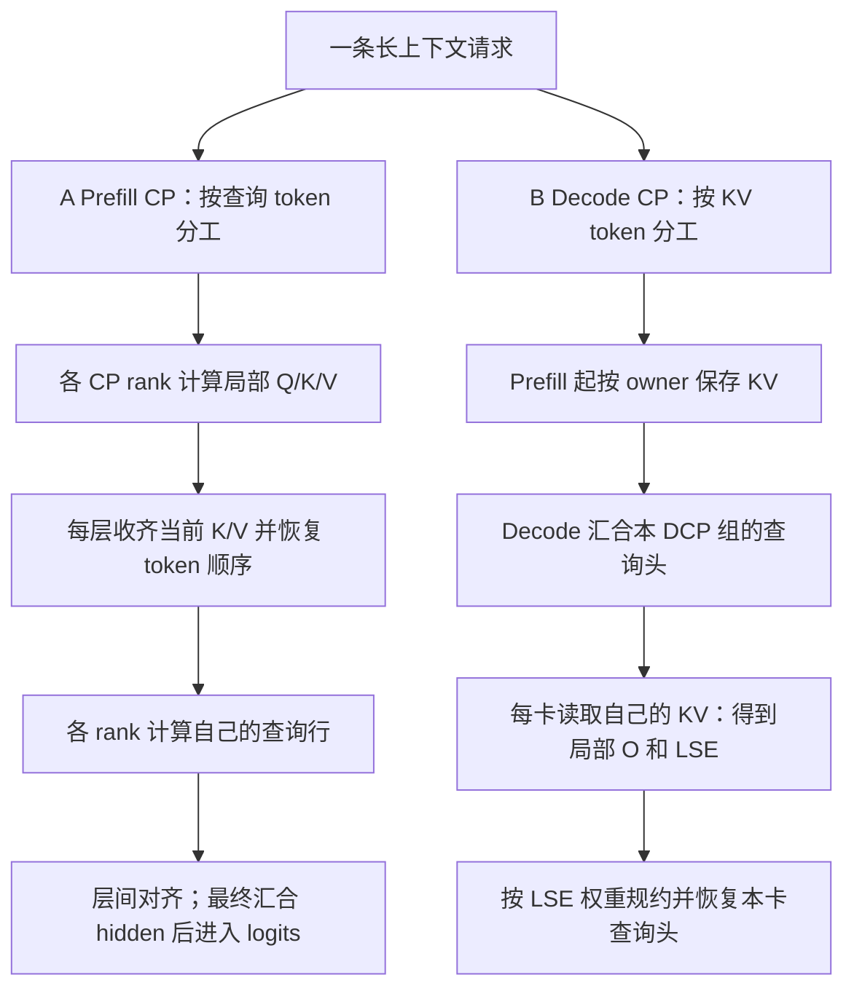
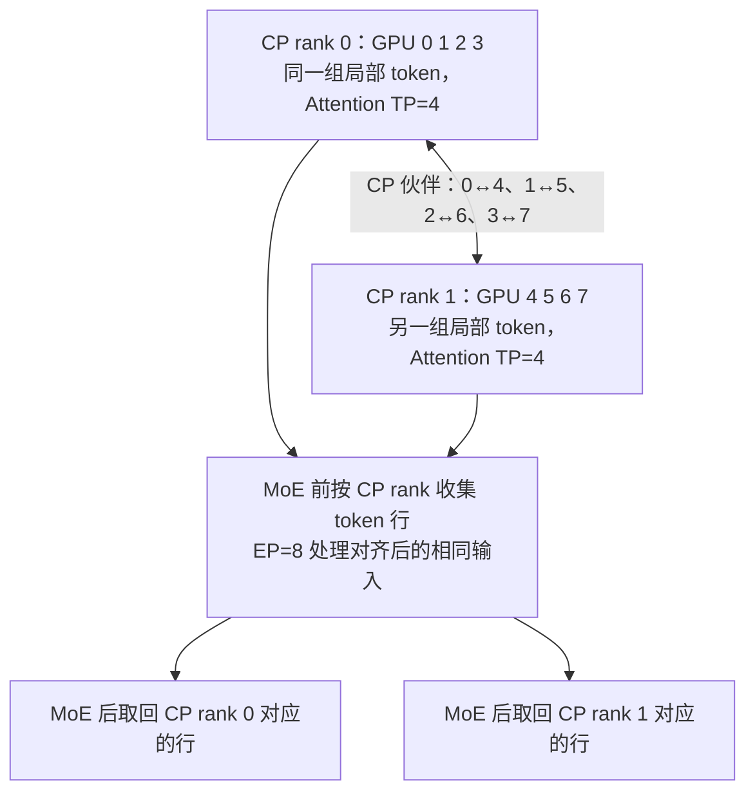
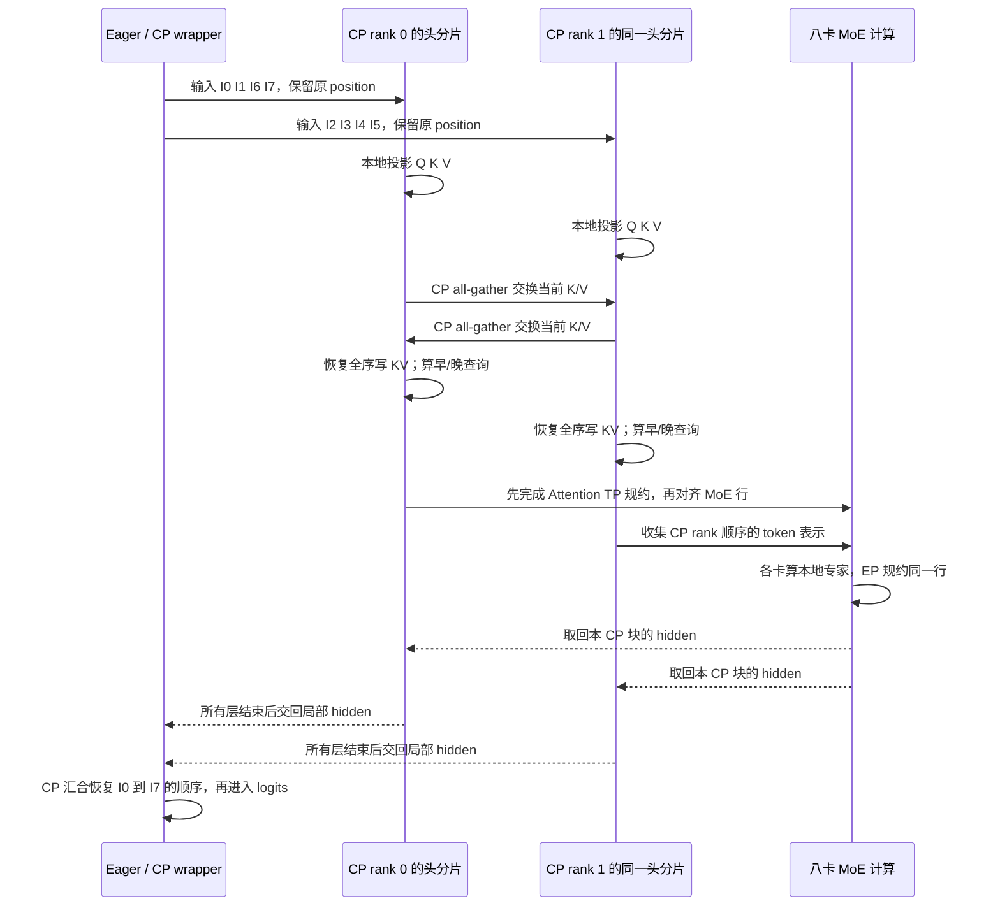
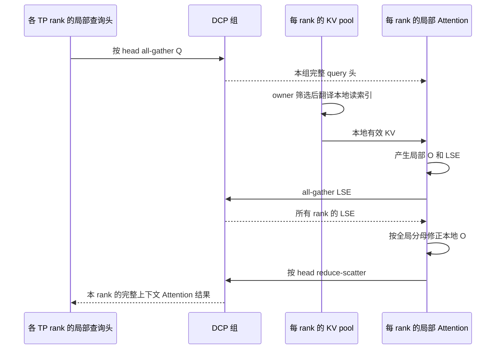

# Context Parallel 与并行组合

本文是 **06-06，源码分析型学习资料**。本篇回答：**上下文很长时，多张卡怎样分担同一条请求的 Attention？分出去的是查询 token、历史 KV，还是 Attention 结果？怎样与 TP、PP、DP、EP 对齐？** 先走通 Zigzag Prefill CP，再用独立的 Decode CP 对照，最后收拢整个阶段的八卡拓扑。

## 0. 阅读基线与范围

| 项目 | 内容 |
| --- | --- |
| 源码路径基准 | SGLang 仓库根目录 `.`；正文中的源码路径均为仓内相对路径 |
| 分支 | `codex/sglang-source-study-20260909`，基于官方 `main` |
| commit | `72d5c5bb73cadd7ffbf5114e5f81e29d36b6c61a` |
| 读取日期 | `2026-09-10` |
| 源码工作区 | 固定学习 worktree 干净；原 `muxi-main` 工作区及 26 个未跟踪文件保留 |
| 文档工作区 | 在已有 Wiki 本地资料之外，仅补充本系列正文、必要导航与附录 |
| 操作边界 | 只读源码、测试定义与配置；执行文档检查和独立教学算术；未导入 SGLang/torch、运行模型、kernel、通信或性能测试 |
| 前置 | [06-01 Rank](01-Rank进程组与通信基础.md)、[06-02 TP](02-TensorParallel与层内通信.md)、[06-03 DP](03-DataParallel与DPAttention.md)、[06-04 PP](04-PipelineParallel与Microbatch.md)、[06-05 EP](05-MoE专家并行与负载均衡.md)，以及 [04-01 槽位](../04-kv-cache/01-请求视图物理槽位与分配器.md) |

两条主线分别固定条件，不能将它们的开关合成一条已经验证的启动命令。

| 阅读主线 | 代表实现与教学配置 | 本篇跟到哪里 |
| --- | --- | --- |
| A：Prefill CP | `Qwen3MoeForCausalLM` / GQA、CUDA、FA3、Eager；`tp_size=8, attn_cp_size=2, moe_dp_size=1, ep_size=8`；开启 Prefill CP、策略 zigzag；DP Attention 关闭，DP/PP/DCP 为 1；不量化，普通无 A2A、Triton 专家路径，关闭额外通信融合 | 分片输入、分片 Q、收齐 K/V、局部 Attention、MoE 前后的 token 对齐、恢复最终顺序、回到 Decode |
| B：Decode CP | DeepSeek V3.1 对应的 MLA 实现、CUDA、FlashInfer MLA、Eager；`tp_size=8, dcp_size=8`，`ag_rs`，不复制 Q 投影；`flashinfer_mla_disable_ragged=True`；DP/PP/Prefill CP 为 1，不启用 Prefill CP | Prefill 建立分散 KV、局部读索引、Q 汇合、局部 Attention + LSE、按头恢复结果 |

A 的八卡拓扑是源码分组规则与模型接口的**教学推演**；仓内 GQA 测试有对应四卡 CP/EP 组合，不能称为本轮八卡实测。B 有 DeepSeek V3.1 八卡测试入口，但本轮同样未执行。主线不加入投机、PD、LoRA、EPLB、重叠流水、图捕获、SWA 或 DSA cache layer split；有些路径会在边界表中说明，并不在这里做全组合证明。[S48][S50]

下面把**源码事实**对应到固定锚点；rank 图、token 编号和简化公式是**整理者归纳**。本篇没有运行观察。

## 1. 人话版：分摊“问的问题”，与分摊“可查的资料”

Attention 可以先理解为：每个查询 Q 带着自己的问题，去上下文 K/V 中查资料，按相关性加权得到答案。

**Prefill 有很多问题一起算。** 输入 8 个 token，不是只算最后一个 token；每个位置都要产生下一层的表示。主线 A 把这些查询位置分给不同 CP rank，但为了回答本卡的问题，会收齐本层所需的新 K/V。分担查询计算并不自动意味着每卡只保留一半上下文缓存。[S17][S18]

**Decode 的新问题很少，历史资料可能很长。** 主线 B 让各 DCP rank 保存不同 token 的 KV。一次 Decode 中，各卡针对自己保存的资料计算局部答案，再带着归一化信息合并。局部答案的简单平均通常不等于完整 Attention。[S38][S42]

| 术语 | 人话解释 | 在本篇中的边界 |
| --- | --- | --- |
| CP / Prefill CP | 同一上下文的查询 token 在卡间分工 | 由策略、batch 模式和长度共同决定是否执行 |
| DCP / Decode CP | 按上下文 token 分散持有 KV，再合并局部 Attention | KV 布局从 Prefill 写入时就要一致，不能等 Decode 才临时打开 |
| Attention TP | 分担 Q/K/V 的头或投影维度 | 与切 token 的 CP 轴不同 |
| Zigzag | 每个 rank 同时拿一段靠前和一段靠后的 token | 对因果 Attention 的工作量做配对；不是网络环形通信的同义词 |
| Interleave | 按 token 行编号轮流分配，例如偶数/奇数行 | 在该策略实现中主要接 DSA，不能直接替换普通 GQA 的 zigzag |
| logical / physical rows | 真正的 token 行 / 补齐后的张量行 | padding 行参与形状对齐，不是新增请求 token |
| LSE | log-sum-exp，记录局部 softmax 分母的对数 | 合并局部 Attention 时需要，且必须知道对数底 |
| widened ID | 包含 DCP 所有者信息的加宽槽位编号 | `% N` 决定 owner，`// N` 去掉这一维；Unified pool 还可能继续翻译 |
| CP metadata / DCP metadata | 本轮分片布局 / DCP Prefill 临时索引和 buffer | 两种对象分开存放，不是同一个 CP 状态表 |

### 1.1 先把两种数据流画在不同分支



**图意：** 两条分支是独立教学配置，不是一次 forward 先后执行的步骤。P2 搬的是 K/V，P4 搬的是 token 表示；D2 搬的是 Q，D4 合并的是 Attention 输出与归一化信息。它们都发生在模型 forward 内，不承担 HTTP 请求分发或请求资源退役。[S25][S37][S38]

## 2. 八张卡怎样组成 Prefill CP

### 2.1 `tp_size` 不等于每一层真实使用的 TP 宽度

本例 WORLD 为 8，PP 为 1。在这组模型并行进程内，Attention 宽度按 `TP / effective Attention DP / CP` 推导，MoE TP 按 `TP / EP / MoE DP` 推导。因此 A 的 Attention TP 为 4，MoE TP 为 1；CP 和 EP 都利用这 8 个进程，不再额外相乘。[S3][S4]

| 分组/坐标 | A 的八卡成员或数值 | 分工 |
| --- | --- | --- |
| TP / WORLD | `[0,1,2,3,4,5,6,7]` | PP=1 下的一组模型进程 |
| Attention TP | `[0,1,2,3]`、`[4,5,6,7]` | 同一批 CP 局部 token 的不同头/投影片 |
| Attention CP | `[0,4]`、`[1,5]`、`[2,6]`、`[3,7]` | 相同 Attention TP 坐标，不同 token 片 |
| CP rank | GPU 0—3 为 0，GPU 4—7 为 1 | 选择本卡 token 块 |
| EP | `[0,1,2,3,4,5,6,7]` | 普通路径中，每卡负责不同物理专家 |
| MoE TP / MoE DP 配置 | `1 / 1` | 没有再切单个专家的 TP 维；不是两个独立请求副本 |
| MoE token 共享 | CP 大于 MoE DP 时，相关组复用 Attention CP 伙伴 | 在 MoE 前让同一 EP 组看到相同行顺序；不能只看 `moe_dp_size=1` 就断言完全没有此通信 |

Qwen3Moe 的 Attention 构造显式读取 `attn_tp_rank/size` 分配头与线性层，普通 MoE 使用自身的 EP/TP 规约。跨层改变分工时，`LayerCommunicator` 负责改 token 布局，不能把两种层的输入直接接起来。MoE CP helper 读取的是相关实际通信组的宽度，进一步说明它不等于配置字段 MoE DP 的数值。[S19][S20][S23][S58]



**图意：** 方框将四个进程合并展示，不代表四卡共享同一块 GPU 内存。MoE 的输入对齐服务于专家结果的正确规约；Attention 的 K/V 汇合是另一次通信，不能因为参与 rank 相同就把两者当成同一份 buffer。[S17][S22][S24]

### 2.2 开启策略，不等于本轮 batch 一定分片

策略初始化受 `enable_prefill_cp`、CP 宽度和 `cp_strategy` 控制。运行时还要经过 `is_cp_active` 与策略的 `can_apply`。Zigzag 要求 CP>1、总 token 至少为 `2×CP`，并在提供逐请求 extend 长度时要求**每条请求本轮 extend 长度**都至少为 `2×CP`。[S1][S5][S6]

例如 CP=2，单请求 extend 8 可以进入；一个 batch 的 extend 长度为 `[100,3]`，不能只看总长 103 就认为整批能进入 zigzag。历史已缓存前缀很长，也不能替代当前 extend 长度的门槛。

`ForwardMode.is_context_parallel_extend` 在此基线包含 EXTEND、MIXED，以及显式要求时的 DRAFT_EXTEND_V2；它不同于更宽的 `is_extend`。不要把 TARGET_VERIFY、SPLIT_PREFILL 等模式仅凭名字都划进这个分支。普通 Decode 不会按主线 A 重新分片。[S53]

## 3. R1 的 8 个输入 token 怎样分给两组卡

沿用系列 R1：输入 `I0…I7`，最终生成 `O1、O2、O3`，第三个输出触发停止。这里 token 是教学编号，不代表实际分词结果。主线 A 首轮没有缓存前缀命中、没有分块，位置为 0—7。

### 3.1 Zigzag 的早块与晚块

`build_metadata` 为每条序列划分 `2×CP` 个连续块；除不尽时，靠前的余数个块多一行。CP rank `r` 取第 `r` 块与第 `2×CP−1−r` 块。[S10][S11]

CP=2 时把 8 行划成 4 块：

| 块 | token / position | 所属 CP rank | 因果 Attention 可见 key 数的教学账本 |
| --- | --- | ---: | --- |
| B0 | I0、I1 / 0、1 | 0 的早块 | 1 + 2 |
| B1 | I2、I3 / 2、3 | 1 的早块 | 3 + 4 |
| B2 | I4、I5 / 4、5 | 1 的晚块 | 5 + 6 |
| B3 | I6、I7 / 6、7 | 0 的晚块 | 7 + 8 |

rank 0 的行顺序是 `[I0,I1,I6,I7]`，rank 1 是 `[I2,I3,I4,I5]`。对这个均匀小例子，两者的可见 Q-K 配对数都是 18；普通前后各切一半则是 10 与 26。这只解释早晚搭配的作用，不证明真实 kernel 耗时相等，也没有测出加速比。

位置张量也按同样的块选择，保留原来的 position 值；不能把 rank 0 的位置重编成 `[0,1,2,3]`。RoPE 等位置相关计算需要知道 I6 仍是第 6 个位置。[S12]

### 3.2 元数据中的长度不是只有一个

| 字段/对象 | 内容 | 用在哪一步 |
| --- | --- | --- |
| `split_list` / `zigzag_index` | 原始各块长度 / 本 rank 选择的块编号 | 切输入、hidden 和 position |
| `per_rank_logical_token` | 每卡实际 token 行数的保留值 | 去掉填充，恢复真实顺序 |
| `per_rank_actual_token` | 经过 padding 处理后，各 rank 的物理行数 | 本地张量和共享 buffer 的容量对齐 |
| `kv_len_prev` / `kv_len_next` | 本请求前缀长度加上早块/晚块结束处的长度 | 两段查询的因果 Attention 边界 |
| `cu_seqlens_q_*` / `actual_seq_q_*` | batch 内每条请求对应早/晚查询的累计边界与长度 | 让 Attention 区分不同请求 |
| `reverse_split_len` / `cp_reverse_index` | CP rank 顺序下的块长度 / 恢复原序所需的块次序 | all-gather 后还原请求与 token 顺序 |
| `forward_batch.attn_cp_metadata` | 本轮 CP 布局 | 不保存请求未来所有 Decode 步的永久历史 |

注意 `per_rank_actual_token` 的名称：调用 `pad_logical_token_to_physical` 后，它承载的是**物理行数**，原始值保存到 logical 字段。Zigzag 的对齐单位为 `2×CP`；先取各 rank 最大逻辑长度，再向此单位取整，并为所有 rank 使用相同物理长度。[S13][S14]

| 教学输入 | Zigzag 逻辑行数 | 对齐后的物理行数 | 如何理解 |
| --- | --- | --- | --- |
| CP=2，单请求 8 行 | `[4,4]` | `[4,4]` | R1 主例没有额外填充 |
| CP=2，单请求 13 行 | `[7,6]` | `[8,8]` | 13 个实际 token，容纳于 16 个物理行 |
| CP=4，单请求 8 行 | `[2,2,2,2]` | `[8,8,8,8]` | 小输入下对齐开销可能占主要部分；不是处理了 32 个请求 token |

多请求时，每卡先放所有请求的早块，再放所有请求的晚块；不能简单用单请求示意拼接猜测真实 row 顺序。长度、累计边界和恢复索引必须一起跟踪。[S11]

## 4. 从输入分片，走过 Attention 和 MoE，再回到输出

### 4.1 Eager 入口保留完整 batch 语义

`EagerRunner._execute_extend` 判断 CP 是否生效，并准备 metadata。`prepare_cp_forward` 按逻辑长度建立布局和物理 padding，需要时把全局 token buffer 大小改为各 rank 物理行数之和；写 cache 的位置列表则保持对应真实 token 的范围。[S7][S8]

随后 `_execute_extend_cp` 先取得完整 embedding，再通过 `cp_shard_model_inputs` 得到局部 embedding、position 和 input ID。它调用模型 body `model.model`，在最后阶段汇合 hidden 后，才调用外层 logits processor。[S9][S25]

这里不是把整个 `ForwardBatch` 改写成一份新的局部请求表。上下文管理器还负责恢复自己临时改动的 `input_ids_global` 与适用的投机 hidden 字段；本篇关闭投机，仍需要理解“传入局部参数”和“把共享 batch 全部改小”不是同一件事。

### 4.2 每层先收齐 K/V，再回答本 rank 的查询

在普通 GQA / FA3 主线中，各卡从自己的 hidden 算出局部 Q/K/V。`FlashAttentionBackend.forward_extend` 发现 CP active 后，调用 zigzag 策略的 `materialize_full_kv`：将 K/V 沿最后一维打包，跨 CP all-gather，恢复原 token 顺序，再把完整当前 K/V 写入对应槽位。[S16][S17]

因此对于 CP 伙伴 GPU 0 与 4，两卡有相同的 Attention TP 坐标；它们分别贡献不同 token 的 K/V，汇合后都持有这一头分片对应的完整当前 token K/V。对已有前缀，则通过缓存和 page table 读取。**这条 Prefill CP 路径没有把 KV 的 token 存储量自动除以 CP。**

`run_attention` 将查询拆成早块和晚块两次调用适配器。R1 的 rank 0 使用 key 长度 2 和 8；rank 1 使用 4 和 6。适配器仍传入因果 Attention 条件，早/晚块内部每个 query 的可见范围也要遵守因果关系，不是块内所有 query 都能看到块末尾全部 key。已有 prefix 长度会加到这些边界上。[S11][S18]



**图意：** 图中展示一层并概括所有层结束后的汇合；左右两个 CP 参与者各代表同一 Attention TP 坐标。MoE 方框包含完整 EP 组。时序表示数据依赖，不表示本轮测得的 stream overlap、网络消息条数或设备同步耗时。

### 4.3 为什么 MoE 前还要收集 token

假设 GPU 0 的第 0 行是 I0，GPU 4 的第 0 行却是 I2。如果两个 rank 的专家部分结果直接按第 0 行相加，就会把不同 token 的结果混在一起。无 A2A 的 EP 需要先对齐行身份。

该路径的 `LayerScatterModes._compute_mlp_mode` 选择相应的 MOE_FULL 布局。`_gather_hidden_states_and_residual_moe` 先走 Attention TP 规约/归一化，再在需要时跨 CP 收集 hidden；残差维持其相应局部布局。R1 的 MoE 输入按 CP rank 顺序收集为 `[I0,I1,I6,I7,I2,I3,I4,I5]`，各 EP rank 看到的是同一行排列。[S21][S22]

`Qwen3MoeSparseMoeBlock.forward_normal` 计算 gate/top-k 和本地专家结果，再按条件进行 EP、MoE TP 规约。本例 EP=8、MoE TP=1；各专家对同一 token 的贡献因此在同一行汇合。随后 `_scatter_hidden_states_moe` 按 CP 块取回各卡的 hidden，继续下一层；有 padding 时它使用 metadata 的物理行数，不能把代码注释中的“actual”直接当成 logical。[S23][S24]

这是**同一 EP 输入的对齐**，不是新增八份 HTTP 请求，也不是每层提前恢复最终 token 原序。真正供 logits 使用的全局原序在 CP wrapper 的最终 gather 恢复。[S15][S25]

### 4.4 最后一层以后，R1 仍只有一条生成序列

| R1 时刻 | 模型/CP 行为 | 请求与 KV 的关系 |
| --- | --- | --- |
| Prefill 输入 I0…I7 | 分片 query、每层 K/V 汇合；最后 hidden 恢复原序 | I0…I7 获得各层 KV；末位置用于产生 O1 |
| Decode 输入 O1 | `is_cp_active` 不进入 Prefill CP；保留既定模型分组 | 为 O1 写 KV，计算 O2；不是把单个 token 硬切成两半 |
| Decode 输入 O2 | 同上 | 为 O2 写 KV，产生 O3 |
| O3 触发停止 | 结果处理器完成请求收尾 | O3 不因“已输出”就必然经过下一轮 forward、拥有 KV |

在关闭专用 Decode 优化的本例中，CP 伙伴对 Decode 的查询行存在重复计算；不能把 Prefill 的行数分工直接沿用为 Decode 的加速或 KV 节省结论。停止、缓存保留与释放仍沿 [02-06](../02-request-lifecycle/06-完成取消与资源释放.md)、[04-07](../04-kv-cache/07-KV缓存全生命周期与排障.md) 的生命周期。CP gather 完成不是“请求结束”，也不是“缓存槽位已退役”。

## 5. Interleave 是另一种适配契约

Interleave 把拼接后的 token 行按 `row % CP` 分给 rank。它的准入按拼接后的 extend 总长度判断，不能照搬 zigzag 的逐请求 `2×CP` 门槛。涉及多请求的 DSA 长度构造还要带着前序请求累计偏移，不能对每条请求随意从 rank 0 重新分配。[S26]

例如 CP=2、两个请求长度 `[3,3]`，全局行 `[A0,A1,A2,B0,B1,B2]` 中，rank 0 拿 `[A0,A2,B1]`，rank 1 拿 `[A1,B0,B2]`。保持各自请求边界和原 position，才能还原。

这一固定实现的 `get_supported_attention_backend` 指向 DSA；`run_attention` 不是 zigzag 的两段 FA 调度实现，普通 dense `materialize_full_kv` 明确抛 `NotImplementedError`。其 MLA K/V 物化会先汇合并返回完整 latent/rope 表示给调用方。因而“只换 `--cp-strategy interleave`”不构成 GQA 的完整适配。[S26]

DeepSeek V3.2 的 Prefill CP 显式拒绝 zigzag，要求 interleave；MiMo V2/Flash 的规则又要求 zigzag，并检查纯文本条件。布局策略与模型/后端必须一起看。[S1]

## 6. Decode CP：从 Prefill 起就使用分散 KV

### 6.1 同样八卡，这次 DCP 组是 TP 内的连续子组

主线 B 的 `TP=8,DCP=8,CP=1,Attention DP=1,PP=1`。Attention TP 仍是 8，DCP 也是这 8 个进程的一个组；`derive_parallel_widths` 不把 Attention TP 再除以 DCP。模型在 DCP Decode 中汇合组内 query 头，让同一份本地 KV 服务这些头的局部 Attention。[S3][S4][S54]

若只改成 `TP=8,DCP=4`，分组构造得到 `[0,1,2,3]` 与 `[4,5,6,7]`。这与 Prefill CP=2 的交错伙伴 `[0,4]…` 不同。DCP rank 是组内 rank，不能用 global rank 直接替代 owner 公式中的 rank。[S3]

### 6.2 一个槽位编号同时携带所有者与本地位置

设 DCP 宽度为 N，进入 owner 判定的 widened ID 为 `v`。静态池的教学规则是：

```text
owner = v % N
本地槽位 = v // N
只有 owner 对应的 rank 写入该行
```

MLA 写 kernel 的确先检查 owner，并跳过保留的 skip 槽位，再将有效位置除以 N。普通 `MLATokenToKVPool._scatter_mla_rows` 选择 DCP aware 写路径；若 Unified pool 已在 translator 处解决 owner，pool 使用已解析位置，不能再除一次。[S32][S33]

**先判断归属，再翻译地址。** 若先把 `v` 除以 N 再判断 `% N`，所有者信息已经丢失。在 Unified pool 中，去掉 DCP 维度后还可能需要虚拟页到物理页的映射；`v//N` 不总是最终 GPU 地址。[S30]

`KVIndexTranslator.rebind_write_loc` 会在需要翻译时保存 `out_cache_loc_virtual`，将 fresh 结果重新绑定给 ForwardBatch，而不原地覆盖 ScheduleBatch 所用的虚拟位置。请求缓存管理看到的 ID 与 kernel 所需 ID 必须分别保持契约。[S34]

### 6.3 R1 的 KV owner 与长度账本

为了只观察 ownership，假设 R1 从一个新的、按 widened page 对齐的非零槽位基址 B 开始，B 能被 8 整除，首个 widened page 足以容纳这 10 个输入位置。这里 `v=B+p` 是教学假设；真实分配可以跨页、不连续，应读取请求位置表。

| 模型已处理的输入 | 长度 L | DCP rank 0—7 的有效 KV 行数 | 本轮新增 owner |
| --- | ---: | --- | --- |
| Prefill I0…I7 | 8 | `[1,1,1,1,1,1,1,1]` | I0→0，I1→1，…，I7→7 |
| Decode 输入 O1，位置 8 | 9 | `[2,1,1,1,1,1,1,1]` | rank 0 |
| Decode 输入 O2，位置 9 | 10 | `[2,2,1,1,1,1,1,1]` | rank 1 |
| O3 已输出且停止 | 仍为 10 个已 forward 的位置 | 仍按上行，随后按请求/缓存策略收尾 | 本例没有 O3 的下一轮写入 |

当请求从对齐的起点计数时，本地有效长度为 `L//N + (r < L%N)`。一般区间 `[start,start+L)` 要找第一个归本 rank 的位置，再按 N 步进；`get_dcp_lens` 的 `start` 参数正是处理这类偏移，不能对一个非对齐 chunk 只用 `L//N`。[S28]

有效 token 数与分配页数也不同。普通 paged allocator 分支把虚拟容量和页大小都乘 N，物理 KV pool 不因此直接扩大 N 倍。若物理容量为 1024 行、page size=64、N=8，则虚拟容量为 8192、widened page size=512，页数仍是 16。ragged 请求还会有页内未用行；这不表示服务器实际可服务 token 数必然正好提升八倍。[S31][S49]

### 6.4 Prefill 怎样在分散缓存上看到完整历史

DCP 不是仅作用于 `_execute_decode` 的开关。Eager Extend 会在代表模型提供接口时建立独立的 `attn_dcp_metadata`，里面包含 DCP 临时 KV buffer、索引、局部 prefix 索引与 prefix 总长度。[S8][S35][S55]

本例显式设置 `flashinfer_mla_disable_ragged=True`，让 FlashInfer 的模型分发进入 absorbed MLA 主线。若不限定该条件，普通 Prefill 会根据 prefix 长度、chunk 容量等转入 MHA one-shot / chunked KV；不能把“模型使用 MLA 缓存”理解为每种 Prefill 都调用 `forward_absorb_prepare`。仓内八卡测试仅提供相关覆盖入口，并非与这里每个教学参数完全相同。[S57]

MLA 的 prepare 分支遇到普通 Extend 时，收集各卡已有 prefix KV，再把本轮新产生的 `k_nope/k_pe` 填入临时完整 buffer。Prefill 可以据此读取所需完整上下文；长期 cache 写入仍按 DCP owner 保存。首次无前缀的 R1 主要使用当前 K/V；后续 chunk 或复用前缀才让历史 KV 汇合变得更明显。[S36][S37]

| 对象 | 所有者/存续范围 | 不应误认为 |
| --- | --- | --- |
| `attn_cp_metadata` | ForwardBatch 的 Prefill CP token 布局 | DCP 的持久缓存表 |
| `attn_dcp_metadata` | ForwardBatch 的 DCP Extend 辅助对象 | Prefill CP 的 zigzag 块表 |
| `dcp_kv_buffer` | 本轮用于完整上下文读取的临时数据 | 每个 rank 永久持有完整历史的证明 |
| 请求位置表、虚拟 ID | 请求/缓存管理路径 | 已完成 kernel 地址翻译的索引 |
| 本地 KV pool | 按 owner 存储，生命周期由请求/缓存策略维护 | 一次 LSE reduce-scatter 完成就能释放的临时结果 |

## 7. 一次 DCP Decode 怎样恢复完整 Attention

### 7.1 查询头汇合，本地 KV 索引收缩

主线 B 的每个 TP rank 原本只有本卡的部分 query 头。`all_gather_q_for_mla_decode` 将 rope 与非 rope Q 打包，以 head 为汇合维度，跨 DCP 组收齐；不是在 token 维度凭空扩大 batch size。[S39]

与此同时，FlashInfer MLA 的 Decode 索引更新先构建仍在虚拟空间的 packed read stream，再调用 `plan_dcp_decode_metadata`，得到本 rank 的局部长度、indptr 和有效索引。只有有效前缀随后经过 `translate_dcp_read_ids`；捕获复用 buffer 时还要原地回写这个有效区间，避免图继续读旧的虚拟 ID。[S29][S30][S41]

后端拿着这些索引读取**本地 KV**，输出组内 query 头的局部 Attention 结果与 LSE。FlashInfer MLA 的 `forward_decode` 在 Decode+DCP 条件下要求返回 LSE；模型的 DCP Attention 对象按组内汇合后的头数构造。[S40][S54]



**图意：** 每卡都对同一组 query 头计算，但每卡使用不同 KV token。最终规约的是同一 query/head 在各 KV 分片上的贡献，并把完整结果还给该 query head 的 TP 所有者。返回本地头数后，模型继续 MLA 的 V 侧变换与输出投影，而不是把局部归一化结果直接送给采样器。[S37][S38][S42]

### 7.2 为什么必须带着 LSE 合并

对某个 query/head，令 rank r 上的局部 softmax 分母为 `Z_r`，该卡已归一化输出为 `O_r`。完整输出应是：

```text
全局分母 Z = Σ Z_r
完整输出 O = Σ (Z_r / Z) × O_r
LSE_r = log(Z_r)
```

这是把局部加权和重新放回同一个全局分母的数学推导。假设只有两个分片有贡献：`Z0=2,O0=10`，`Z1=6,O1=2`，完整输出是 `(2×10+6×2)/8=4`；简单平均得到 6，直接相加得到 12，都不对。其他空分片贡献为零，不该凭空参与平均。

实现会先汇合 LSE，再以稳定形式求全局归一化权重。在主线 `ag_rs` 中，`cp_lse_ag_out_rs_mla` 使用 FP32 中间输出做修正，然后沿 head 维 reduce-scatter，最后转回原输出 dtype。模型调用侧再恢复 `[batch, local_heads, latent_dim]` 的布局。[S38][S42][S43]

**对数底必须匹配。** 此路径将 FlashInfer MLA 的 LSE 当作以 2 为底；`is_mla_dcp_lse_base_on_e` 对 `flashmla`、`cutedsl_mla` 返回真。修正 kernel 据此选择 exp/log 或 exp2/log2。不能只因 tensor 形状相同就互换这些 LSE。[S44]

### 7.3 其他合并路径不能只凭函数名类推

`dcp_comm_backend=a2a/fi_a2a` 会交换按目标头分组的输出与 LSE，再本地合并；这是另一种通信组织，目标归一化语义相同。Q 投影复制开关在相应路径用冗余投影避免 query all-gather，本篇的 `ag_rs` 主线没有启用它。[S27][S38][S45]

另外，名为 `cp_lse_ag_out_rs_mha` 的普通 MHA helper 在固定实现中实际使用 all-reduce 后切本地 head，而 MLA helper 调用 reduce-scatter。**不能把函数名中的 `rs` 当成所有后端都执行了同一 collective 的证据。** 本篇详细追踪的是 MLA helper。[S42][S56]

## 8. 并行组合：先算成员，再看布局，最后看适配

### 8.1 六种八卡例子分别理解

这些配置是不同示例，不是在同一进程中同时开启的六个维度；前三行的细节在本阶段前文。

| 八卡方案 | WORLD 与主要分组 | 主要分担什么 | 仍要补齐的条件 |
| --- | --- | --- | --- |
| TP=8 | 一个八卡 TP 组 | 层内头/矩阵维 | 头数、权重切片与通信适配 |
| PP=4、TP=2 | 四个两卡 TP 组，两条跨 stage 的 PP 组 | 不同模型层与 microbatch | 与 06-04 的 R1 示例一致；另查 stage 负载、proxy 与流水状态 |
| DP Attention=2、TP=8 | 八卡组内两个 Attention 数据分区 | 不同请求的 Attention | 全局/局部 token 对齐与 MoE 共享计算 |
| EP=8、TP=8 | 八卡专家组，MoE TP=1 | 不同专家任务 | 普通/A2A 路径、token 身份与副本一致性 |
| A：Prefill CP=2、TP=8、EP=8 | 两个四卡 Attention TP 组、四对 CP 伙伴 | 同一请求的不同查询行 | 每层 K/V、MoE 行对齐与最终原序恢复 |
| B：DCP=8、TP=8 | 一个八卡 DCP 组包含在 TP 内 | 同一上下文的 KV token | owner/地址翻译、局部长度和 LSE 合并 |

DP 的独立多副本部署与 DP Attention 的组内切分仍要分别解释，见 [06-03](03-DataParallel与DPAttention.md)。`TP×PP` 是本模型并行 WORLD 的构造检查，不是涵盖服务集群所有副本的万能总卡数公式。[S3]

### 8.2 固定基线的组合与拒绝条件

| 条件 | 源码行为/证据状态 | 结论边界 |
| --- | --- | --- |
| 开 Prefill CP 未选策略 | `handle_context_parallelism` 抛错 [S1] | CP 宽度与策略声明分开核对 |
| Attention CP>1 | 检查 TP 可被 CP 和 `dp_size×CP` 整除，拒绝 Aiter all-reduce fusion [S1] | 整除成立仅证明这一层参数检查 |
| MoE DP>1 | 检查 `TP % moe_dp_size == 0`、EP×MoE DP 不超 TP；EP>1 时要求乘积等于 TP [S1] | 仍需模型、runner 和 token 布局配套 |
| CP≠MoE DP | 此 hook 只允许 MoE DP=1 [S1] | 不能任意选 CP=4、MoE DP=2 |
| PP 与 CP | `pp_size==1` 的拒绝检查位于 **MoE DP>1 分支** [S1] | 不能据报错文字宣称所有 CP+PP 一律不支持；其他组合本篇未端到端验证 |
| Prefill CP 的平台 | 显式拒绝 HIP/NPU/MUSA 的旧支持路径 [S46] | 不能拿 DCP 的平台允许条件替代 Prefill CP 条件 |
| DCP 的平台和宽度 | 分组构造接受 HIP/CUDA，N≥1 且 TP 可被 N 整除 [S3] | 不证明任意模型/后端、PP/DP/CP 组合能运行 |
| DCP A2A | a2a/fi_a2a 要求 N>1；fi_a2a 还要求 CUDA 并在初始化探测硬件/fabric [S27] | 字符串可解析不证明 MNNVL 已可用 |
| DCP Q 投影复制 | 要求 N>1 且使用 a2a/fi_a2a [S27] | 不能与本篇 ag_rs 配置任意组合 |
| Zigzag 与 GQA | 有 FA 适配和四卡 Qwen3Moe 测试入口 [S16][S48] | A 的八卡配置仍只是静态推演 |
| Interleave 与 dense K/V | 此策略的 dense K/V 物化明确未实现 [S26] | 不可把 DSA 布局直接当作通用 GQA 开关 |
| Prefill CP 与 DCP 同时开 | 分别有字段、metadata 和分组 [S2][S3][S55] | 本篇未建立同时启用时模型、Q/K/V、组成员与写地址的完整一致性证明 |
| DSA layer split / CP Decode Attention TP / 图捕获 | 有专用字段与实现入口，属于额外优化 [S2] | 主线未启用；不能用本篇“Prefill K/V 汇合”覆盖这些缓存与权重特例 |

本篇把“源码拒绝”“代表分支可追踪”“有测试入口”“本次未实测”分别记录。配置未触发 assert，不等于接口、数值、资源和吞吐都已经验收。

### 8.3 阶段验收选定的 R1 组合

组合主线采用 [06-04 的原生 Llama、TP=2/PP=4](04-PipelineParallel与Microbatch.md)，沿普通 CUDA eager 路径追踪 R1。上表其他八卡方案继续作为独立示例；本阶段没有把 CP、DP、EP 再叠加到这条请求上。

| 验收项 | 具体正文证据 | 本次边界 |
| --- | --- | --- |
| 组合与切分 | 06-04 第 0—2 节：四个 stage、每 stage 两个 TP rank；十层按 2/2/3/3 分配 | 已核对分组公式、层分区与模型 PP 入口；不是仅凭卡数相乘判断支持 |
| R1 全流程 | 06-04 第 3—9 节：8 行 Prefill、两轮 Decode，proxy 前进、output 回环、下一轮输入中转及本地 KV 收尾 | 三次输出对应 10 个已 forward 的输入位置；各 stage 的本地循环时刻分开 |
| 配置限制 | 06-04 第 11.1 节：关闭普通 Overlap/投机，层数与 PP、节点整除和 microbatch 约束；图与额外并行关闭 | 这些限制与模型实现一起确定本篇普通路径，未宣称任意配置组合受支持 |
| 运行证据缺口 | 06-04 第 12.3 节：已有四卡 TP2/PP2 测试入口与八卡教学布局分别记录 | 本次未执行；八卡 hidden/residual/logits 对照、取消/复用、跨节点和性能仍未验证 |

这张表把“源码支持的普通组合”“具体请求的静态追踪”和“尚未取得的运行结果”放在同一处，供后续实验逐项补证。

## 9. 状态与排障地图

### 9.1 谁拥有布局，什么时候可以换用下一份

| 时刻 | 对象与控制者 | 后续使用条件 | 与资源退役的区别 |
| --- | --- | --- | --- |
| 构造 CP batch | Eager / strategy 建立本轮 metadata | 模式、每请求长度和 padding 对应当前输入 | metadata 存在不代表通信完成 |
| 分片模型输入 | CP context 提供局部参数 | token 与 position 必须来自同一布局 | 恢复临时字段不释放持久 KV |
| 一层 Prefill Attention | backend + strategy 写入/读取当前 K/V | 全序位置、头片、causal 边界必须一致 | 本层计算结束不等于请求完成 |
| MoE gather / scatter | LayerCommunicator 对齐并取回行 | 同一 EP 规约行必须对应同一 token | hidden 临时存储与请求缓存分开 |
| DCP decode metadata | 后端 planner + translator 生成局部索引 | owner 筛选、有效长度、地址空间匹配 | buffer 可复用需要遵守执行/图的消费时序 |
| DCP Attention 结果合并 | 模型 forward + DCP collective | O/LSE 的 head、batch、底数和成员一致 | LSE 汇合不等于 KV 可以被别的请求复用 |
| 请求结束或取消 | Scheduler / 结果与缓存管理 | 按请求结束、引用和在途计算的既有规则收尾 | 本篇未做取消并发或 GPU stream 退役实验 |

### 9.2 从现象回到最先检查的位置

| 现象 | 先记录什么 | 首查源码/对象 |
| --- | --- | --- |
| 开了 CP，某个 batch 没分片 | 实际策略、模式、逐请求 extend 长度 | `is_cp_active`、`can_apply` [S6][S26] |
| 短请求越多，CP padding 越明显 | 各卡 logical/physical 行、对齐单位 | `pad_logical_token_to_physical` [S13] |
| 输出位置错乱或多请求串位 | position 原值、zigzag 块、请求边界、逆排列 | `build_metadata`、`_all_gather_reorganized` [S11][S15] |
| Attention 对，进 MoE 后错 | 各 EP rank 同一行的 token 身份、gather 顺序 | communicator gather/scatter、普通 MoE 规约 [S22][S23][S24] |
| Prefill CP 没让 KV 显存减半 | 具体策略、pool、当前 K/V 物化和额外 layer split 开关 | `materialize_full_kv` [S17] |
| DCP 某些长度错，整齐长度正常 | N、rank、start、L、widened ID、有效本地长度 | `get_dcp_lens`、DCP planner [S28][S29] |
| DCP 写错卡或读到旧数据 | owner 判定前后的 ID、是否已解析、虚拟/物理页 | pool 写门与 translator [S30][S32][S34] |
| 所有 rank 都有 O，但结果与基线差异大 | 后端 LSE 底数、O/LSE 布局、空分片 | `forward_absorb_core`、修正 kernel [S38][S43][S44] |
| collective 等待 | 实际 group 成员、各 rank 模式和调用顺序、通信形状 | 分组、MoE CP gather、DCP 合并 [S3][S22][S42] |
| server_info 容量为正，想证明 DCP 生效 | 实际分组、owner KV 分布、选中路径与对照请求 | `test_dcp_activation_check` 只断言正数 [S52] |

排障记录中分别写**请求长度、真实 token 行、padding 行、KV 有效行、分配页数、临时 buffer**。把它们都叫“token 数”会同时破坏容量判断和性能归因。

## 10. 回到源码的阅读路线

路径起点始终是 SGLang 仓库根目录。下表给出主链上的入口和符号，链接固定到本篇 commit。

| 顺序 | 问题 | 仓内相对路径与符号 |
| --- | --- | --- |
| 1 | 配置怎样变成合法分组？ | `python/sglang/srt/arg_groups/parallel_hook.py::handle_context_parallelism` [S1]；`python/sglang/srt/distributed/parallel_state.py::initialize_model_parallel` [S3] |
| 2 | 为什么 CP 改了 Attention TP，DCP 没按同一公式改？ | `python/sglang/srt/runtime_context.py::derive_parallel_widths` [S4] |
| 3 | 这一批是否进入 CP？ | `python/sglang/srt/layers/cp/utils.py::is_cp_active` [S6]；`python/sglang/srt/model_executor/runner/eager_runner.py::EagerRunner._execute_extend` [S8] |
| 4 | 输入与块表如何对应？ | `python/sglang/srt/layers/cp/zigzag.py::ZigzagCPStrategy.build_metadata` [S11]；`python/sglang/srt/layers/cp/utils.py::cp_shard_model_inputs` [S9] |
| 5 | K/V 和查询怎样分开处理？ | `python/sglang/srt/layers/attention/flashattention_backend.py::FlashAttentionBackend.forward_extend` [S16]；`python/sglang/srt/layers/cp/zigzag.py::ZigzagCPStrategy.materialize_full_kv` [S17] |
| 6 | Attention 与 MoE 的行怎样对齐？ | `python/sglang/srt/models/qwen3_moe.py::Qwen3MoeDecoderLayer.forward` [S20]；`python/sglang/srt/layers/communicator.py::CommunicateWithAllReduceAndLayerNormFn._gather_hidden_states_and_residual_moe` [S22] |
| 7 | 最终怎样回到 logits？ | `python/sglang/srt/model_executor/runner/eager_runner.py::EagerRunner._execute_extend_cp` [S25] |
| 8 | DCP owner/地址/容量由谁处理？ | `python/sglang/srt/layers/dcp/layout.py::get_dcp_lens` [S28]；`python/sglang/srt/mem_cache/kv_index_translator.py::KVIndexTranslator.translate_dcp_read_ids` [S30]；`python/sglang/srt/mem_cache/kv_cache_configurator.py::KVCacheConfigurator._build_token_to_kv_pool_allocator` [S31] |
| 9 | DCP 从 Prefill 到 Decode 如何分发？ | `python/sglang/srt/models/deepseek_common/attention_forward_methods/forward_mla.py::DeepseekMLAForwardMixin.forward_absorb_prepare` [S37] 与 `DeepseekMLAForwardMixin.forward_absorb_core` [S38] |
| 10 | 局部 KV 怎样进入后端？ | `python/sglang/srt/layers/attention/flashinfer_mla_backend.py::FlashInferMLAIndicesUpdaterDecode.call_begin_forward` [S41] |
| 11 | O/LSE 怎样得到完整结果？ | `python/sglang/srt/layers/dcp/comm.py::cp_lse_ag_out_rs_mla` [S42]；`python/sglang/kernels/ops/attention/dcp_kernels.py::correct_attn_out` [S43] |

### 10.1 测试入口能证明什么

| 测试入口 | 静态读到的覆盖 | 本轮证据边界 |
| --- | --- | --- |
| `test/registered/cp/test_cp_strategy_unit.py` | Zigzag metadata、分片/恢复、padding、K/V 汇合与两段 Attention 调度；使用 fake group/mocks 的测试也在其中 [S47] | 测试定义存在，不表示 NCCL/GPU 路径已实测 |
| `test/registered/cp/test_gqa_prefill_cp.py` | Qwen3Moe 四卡 CP/EP 组合与 GSM8K 入口 [S48] | 不把四卡覆盖直接写成 A 的八卡成功记录 |
| `test/registered/dcp/test_dcp_layout_unit.py` | 不对齐区间 owner 计数、虚拟 allocator、物理 pool 不扩大、ragged 页数等 [S49] | 本轮未执行其中依赖 torch 的单测 |
| `test/registered/dcp/test_dsv31_dcp8_gsm8k.py` | DeepSeek V3.1 八卡 DCP=8 的精度/Decode 入口 [S50] | 未加载模型、启动服务或测精度 |
| 同文件 `test_logprob_parity` | 非 DCP 与 DCP 两次启动，对照文本、token 数和逐 token logprob 容差；CI 中跳过该手工对照 [S51] | 没有执行；方法体不包含“容量增长八倍”的断言 |
| 同文件 `test_dcp_activation_check` | 实际只检查 `max_total_num_tokens > 0` [S52] | 不能单独证明 DCP 已启用、KV owner 正确或容量提升 |

## 11. 练习、验收与下一篇

### 11.1 自测与参考答案

1. **TP=8、DP Attention=1、Prefill CP=2 时，Attention TP 多大？CP 伙伴有哪些？** 4；伙伴为 `[0,4]、[1,5]、[2,6]、[3,7]`。CP 没再增加进程。
2. **CP=2，13 个新 token，Zigzag 四块多长？** `[4,3,3,3]`；rank 0 取第一/末块共 7 行，rank 1 取中间两块共 6 行；物理行补为 `[8,8]`。
3. **为什么 `[100,3]` 的 batch 可能不走 zigzag？** CP=2 的逐请求 extend 门槛为 4，第二条不满足；总 token 足够不能替代此检查。
4. **A 中 GPU 0 与 4 的 K/V 都覆盖 R1 全部输入，是否说明没做 CP？** 不能。它们分担查询行，K/V 汇合恰是这条路径的实现；需要同时看 Q 行、头片和缓存范围。
5. **MoE 收集后不是 token 原序，为什么仍可正确计算？** 各专家 rank 的同一行对应同一 token，逐行专家计算和规约保持该次序；随后按块取回，最终 CP gather 再恢复原序。
6. **DCP=8 时 v=83 归谁，静态池本地行是多少？** rank 3，行 10；Unified pool 可能还需虚拟到物理翻译。先除后判断 owner 会丢失信息。
7. **DCP 两卡局部 O 都不同，能直接平均吗？** 不能；必须按各自局部分母占全局分母的比例加权，使用匹配底数的 LSE。
8. **配置可解析、有测试文件、server_info 容量为正，能否宣称 CP/DCP 组合验收通过？** 不能；还缺实际组成员、布局与数值对照、运行错误及资源/性能记录。

### 11.2 本篇的完成与未验证范围

已把 R1 从分片输入追到逐层 Attention/MoE、最终 logits 和后续 Decode；另追通 DCP 的 Prefill KV 布局、Decode 读索引及 O/LSE 合并。八卡分组、8/13 行分块、padding、DCP 8/9/10 行 owner 和加权结果仅做独立教学算术检查。

实际安装、torch 单测、模型精度、跨卡通信、图捕获、取消/失败并发、显存与速度测量均**未执行**。Mermaid 只做结构和图文一致性检查；不把图中顺序称为真实 trace。后续运行时按[证据模板](../appendices/05-实验记录与证据模板.md)记录硬件、模型版本、生效配置、真实/填充行数、owner 映射、LSE 底数及对照输出。

读完本篇，应能说清同一条请求在每组 rank 上的 token、head、expert 和 KV 身份，以及每次通信前后恢复了哪一层语义。阶段 06 的六篇正文由此连成完整的并行阅读主线。

上一篇：[06-05《MoE 专家并行与负载均衡》](05-MoE专家并行与负载均衡.md)。下一篇：[07-01《PD 分离职责与端到端请求地图》](../07-disaggregation/01-PD分离职责与端到端请求地图.md)。返回[系列目录](../README.md)，或查阅[术语](../appendices/01-术语与对象速查.md)、[源码索引](../appendices/02-源码入口与调用链索引.md)、[配置矩阵](../appendices/03-配置解析与功能兼容矩阵.md)、[排障索引](../appendices/04-症状到源码的排障索引.md)与[进度记录](../appendices/06-学习进度与版本变更记录.md)。

[S1]: https://github.com/sgl-project/sglang/blob/72d5c5bb73cadd7ffbf5114e5f81e29d36b6c61a/python/sglang/srt/arg_groups/parallel_hook.py#L30
[S2]: https://github.com/sgl-project/sglang/blob/72d5c5bb73cadd7ffbf5114e5f81e29d36b6c61a/python/sglang/srt/arg_groups/fields/parallel.py#L24
[S3]: https://github.com/sgl-project/sglang/blob/72d5c5bb73cadd7ffbf5114e5f81e29d36b6c61a/python/sglang/srt/distributed/parallel_state.py#L2298
[S4]: https://github.com/sgl-project/sglang/blob/72d5c5bb73cadd7ffbf5114e5f81e29d36b6c61a/python/sglang/srt/runtime_context.py#L147
[S5]: https://github.com/sgl-project/sglang/blob/72d5c5bb73cadd7ffbf5114e5f81e29d36b6c61a/python/sglang/srt/layers/cp/base.py#L238
[S6]: https://github.com/sgl-project/sglang/blob/72d5c5bb73cadd7ffbf5114e5f81e29d36b6c61a/python/sglang/srt/layers/cp/utils.py#L121
[S7]: https://github.com/sgl-project/sglang/blob/72d5c5bb73cadd7ffbf5114e5f81e29d36b6c61a/python/sglang/srt/layers/cp/utils.py#L148
[S8]: https://github.com/sgl-project/sglang/blob/72d5c5bb73cadd7ffbf5114e5f81e29d36b6c61a/python/sglang/srt/model_executor/runner/eager_runner.py#L273
[S9]: https://github.com/sgl-project/sglang/blob/72d5c5bb73cadd7ffbf5114e5f81e29d36b6c61a/python/sglang/srt/layers/cp/utils.py#L258
[S10]: https://github.com/sgl-project/sglang/blob/72d5c5bb73cadd7ffbf5114e5f81e29d36b6c61a/python/sglang/srt/layers/cp/zigzag.py#L60
[S11]: https://github.com/sgl-project/sglang/blob/72d5c5bb73cadd7ffbf5114e5f81e29d36b6c61a/python/sglang/srt/layers/cp/zigzag.py#L121
[S12]: https://github.com/sgl-project/sglang/blob/72d5c5bb73cadd7ffbf5114e5f81e29d36b6c61a/python/sglang/srt/layers/cp/zigzag.py#L308
[S13]: https://github.com/sgl-project/sglang/blob/72d5c5bb73cadd7ffbf5114e5f81e29d36b6c61a/python/sglang/srt/layers/cp/padding.py#L34
[S14]: https://github.com/sgl-project/sglang/blob/72d5c5bb73cadd7ffbf5114e5f81e29d36b6c61a/python/sglang/srt/layers/cp/padding.py#L46
[S15]: https://github.com/sgl-project/sglang/blob/72d5c5bb73cadd7ffbf5114e5f81e29d36b6c61a/python/sglang/srt/layers/cp/zigzag.py#L441
[S16]: https://github.com/sgl-project/sglang/blob/72d5c5bb73cadd7ffbf5114e5f81e29d36b6c61a/python/sglang/srt/layers/attention/flashattention_backend.py#L1224
[S17]: https://github.com/sgl-project/sglang/blob/72d5c5bb73cadd7ffbf5114e5f81e29d36b6c61a/python/sglang/srt/layers/cp/zigzag.py#L396
[S18]: https://github.com/sgl-project/sglang/blob/72d5c5bb73cadd7ffbf5114e5f81e29d36b6c61a/python/sglang/srt/layers/cp/zigzag.py#L343
[S19]: https://github.com/sgl-project/sglang/blob/72d5c5bb73cadd7ffbf5114e5f81e29d36b6c61a/python/sglang/srt/models/qwen3_moe.py#L430
[S20]: https://github.com/sgl-project/sglang/blob/72d5c5bb73cadd7ffbf5114e5f81e29d36b6c61a/python/sglang/srt/models/qwen3_moe.py#L795
[S21]: https://github.com/sgl-project/sglang/blob/72d5c5bb73cadd7ffbf5114e5f81e29d36b6c61a/python/sglang/srt/layers/communicator.py#L424
[S22]: https://github.com/sgl-project/sglang/blob/72d5c5bb73cadd7ffbf5114e5f81e29d36b6c61a/python/sglang/srt/layers/communicator.py#L1354
[S23]: https://github.com/sgl-project/sglang/blob/72d5c5bb73cadd7ffbf5114e5f81e29d36b6c61a/python/sglang/srt/models/qwen3_moe.py#L314
[S24]: https://github.com/sgl-project/sglang/blob/72d5c5bb73cadd7ffbf5114e5f81e29d36b6c61a/python/sglang/srt/layers/communicator.py#L1559
[S25]: https://github.com/sgl-project/sglang/blob/72d5c5bb73cadd7ffbf5114e5f81e29d36b6c61a/python/sglang/srt/model_executor/runner/eager_runner.py#L380
[S26]: https://github.com/sgl-project/sglang/blob/72d5c5bb73cadd7ffbf5114e5f81e29d36b6c61a/python/sglang/srt/layers/cp/interleave.py#L60
[S27]: https://github.com/sgl-project/sglang/blob/72d5c5bb73cadd7ffbf5114e5f81e29d36b6c61a/python/sglang/srt/arg_groups/parallel_hook.py#L117
[S28]: https://github.com/sgl-project/sglang/blob/72d5c5bb73cadd7ffbf5114e5f81e29d36b6c61a/python/sglang/srt/layers/dcp/layout.py#L23
[S29]: https://github.com/sgl-project/sglang/blob/72d5c5bb73cadd7ffbf5114e5f81e29d36b6c61a/python/sglang/srt/layers/dcp/planner.py#L137
[S30]: https://github.com/sgl-project/sglang/blob/72d5c5bb73cadd7ffbf5114e5f81e29d36b6c61a/python/sglang/srt/mem_cache/kv_index_translator.py#L513
[S31]: https://github.com/sgl-project/sglang/blob/72d5c5bb73cadd7ffbf5114e5f81e29d36b6c61a/python/sglang/srt/mem_cache/kv_cache_configurator.py#L1965
[S32]: https://github.com/sgl-project/sglang/blob/72d5c5bb73cadd7ffbf5114e5f81e29d36b6c61a/python/sglang/srt/mem_cache/memory_pool.py#L4442
[S33]: https://github.com/sgl-project/sglang/blob/72d5c5bb73cadd7ffbf5114e5f81e29d36b6c61a/python/sglang/kernels/ops/kvcache/mla_buffer.py#L14
[S34]: https://github.com/sgl-project/sglang/blob/72d5c5bb73cadd7ffbf5114e5f81e29d36b6c61a/python/sglang/srt/mem_cache/kv_index_translator.py#L433
[S35]: https://github.com/sgl-project/sglang/blob/72d5c5bb73cadd7ffbf5114e5f81e29d36b6c61a/python/sglang/srt/layers/dcp/planner.py#L33
[S36]: https://github.com/sgl-project/sglang/blob/72d5c5bb73cadd7ffbf5114e5f81e29d36b6c61a/python/sglang/srt/layers/dcp/comm.py#L268
[S37]: https://github.com/sgl-project/sglang/blob/72d5c5bb73cadd7ffbf5114e5f81e29d36b6c61a/python/sglang/srt/models/deepseek_common/attention_forward_methods/forward_mla.py#L286
[S38]: https://github.com/sgl-project/sglang/blob/72d5c5bb73cadd7ffbf5114e5f81e29d36b6c61a/python/sglang/srt/models/deepseek_common/attention_forward_methods/forward_mla.py#L673
[S39]: https://github.com/sgl-project/sglang/blob/72d5c5bb73cadd7ffbf5114e5f81e29d36b6c61a/python/sglang/srt/layers/dcp/comm.py#L251
[S40]: https://github.com/sgl-project/sglang/blob/72d5c5bb73cadd7ffbf5114e5f81e29d36b6c61a/python/sglang/srt/layers/attention/flashinfer_mla_backend.py#L766
[S41]: https://github.com/sgl-project/sglang/blob/72d5c5bb73cadd7ffbf5114e5f81e29d36b6c61a/python/sglang/srt/layers/attention/flashinfer_mla_backend.py#L876
[S42]: https://github.com/sgl-project/sglang/blob/72d5c5bb73cadd7ffbf5114e5f81e29d36b6c61a/python/sglang/srt/layers/dcp/comm.py#L113
[S43]: https://github.com/sgl-project/sglang/blob/72d5c5bb73cadd7ffbf5114e5f81e29d36b6c61a/python/sglang/kernels/ops/attention/dcp_kernels.py#L308
[S44]: https://github.com/sgl-project/sglang/blob/72d5c5bb73cadd7ffbf5114e5f81e29d36b6c61a/python/sglang/srt/models/deepseek_common/attention_forward_methods/forward_mla.py#L101
[S45]: https://github.com/sgl-project/sglang/blob/72d5c5bb73cadd7ffbf5114e5f81e29d36b6c61a/python/sglang/srt/layers/dcp/comm.py#L474
[S46]: https://github.com/sgl-project/sglang/blob/72d5c5bb73cadd7ffbf5114e5f81e29d36b6c61a/python/sglang/srt/arg_groups/parallel_hook.py#L585
[S47]: https://github.com/sgl-project/sglang/blob/72d5c5bb73cadd7ffbf5114e5f81e29d36b6c61a/test/registered/cp/test_cp_strategy_unit.py#L269
[S48]: https://github.com/sgl-project/sglang/blob/72d5c5bb73cadd7ffbf5114e5f81e29d36b6c61a/test/registered/cp/test_gqa_prefill_cp.py#L79
[S49]: https://github.com/sgl-project/sglang/blob/72d5c5bb73cadd7ffbf5114e5f81e29d36b6c61a/test/registered/dcp/test_dcp_layout_unit.py#L146
[S50]: https://github.com/sgl-project/sglang/blob/72d5c5bb73cadd7ffbf5114e5f81e29d36b6c61a/test/registered/dcp/test_dsv31_dcp8_gsm8k.py#L124
[S51]: https://github.com/sgl-project/sglang/blob/72d5c5bb73cadd7ffbf5114e5f81e29d36b6c61a/test/registered/dcp/test_dsv31_dcp8_gsm8k.py#L286
[S52]: https://github.com/sgl-project/sglang/blob/72d5c5bb73cadd7ffbf5114e5f81e29d36b6c61a/test/registered/dcp/test_dsv31_dcp8_gsm8k.py#L167
[S53]: https://github.com/sgl-project/sglang/blob/72d5c5bb73cadd7ffbf5114e5f81e29d36b6c61a/python/sglang/srt/model_executor/forward_batch_info.py#L145
[S54]: https://github.com/sgl-project/sglang/blob/72d5c5bb73cadd7ffbf5114e5f81e29d36b6c61a/python/sglang/srt/models/deepseek_v2.py#L1716
[S55]: https://github.com/sgl-project/sglang/blob/72d5c5bb73cadd7ffbf5114e5f81e29d36b6c61a/python/sglang/srt/layers/dcp/metadata.py#L31
[S56]: https://github.com/sgl-project/sglang/blob/72d5c5bb73cadd7ffbf5114e5f81e29d36b6c61a/python/sglang/srt/layers/dcp/comm.py#L84
[S57]: https://github.com/sgl-project/sglang/blob/72d5c5bb73cadd7ffbf5114e5f81e29d36b6c61a/python/sglang/srt/models/deepseek_common/attention_backend_handler.py#L108
[S58]: https://github.com/sgl-project/sglang/blob/72d5c5bb73cadd7ffbf5114e5f81e29d36b6c61a/python/sglang/srt/layers/dp_attention.py#L1049
