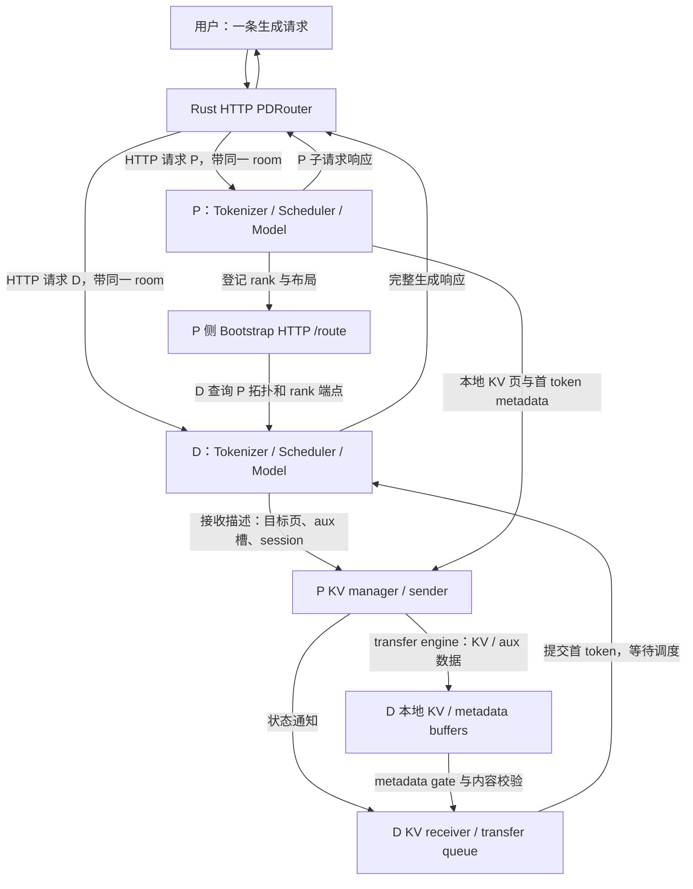
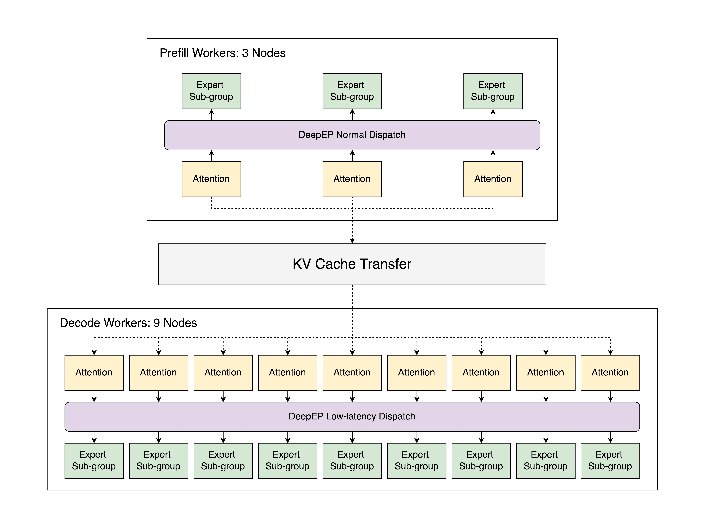
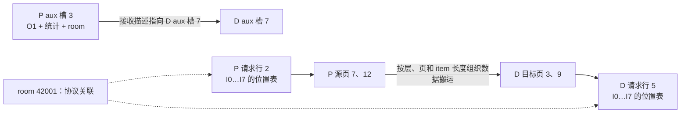
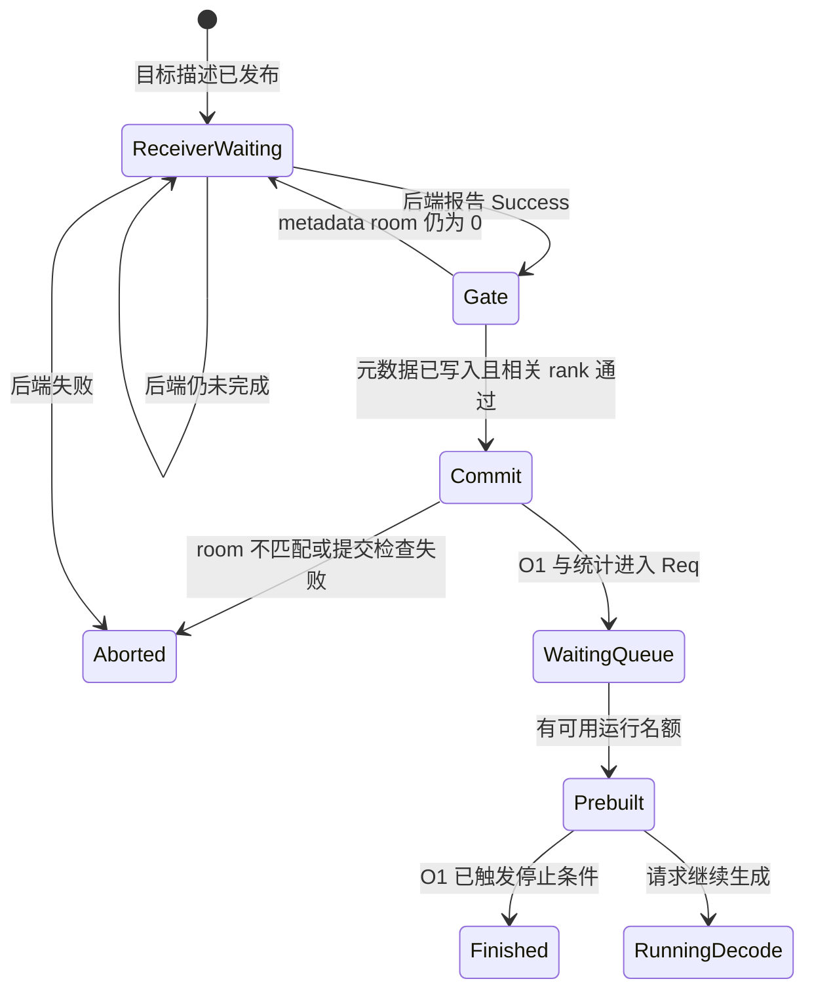
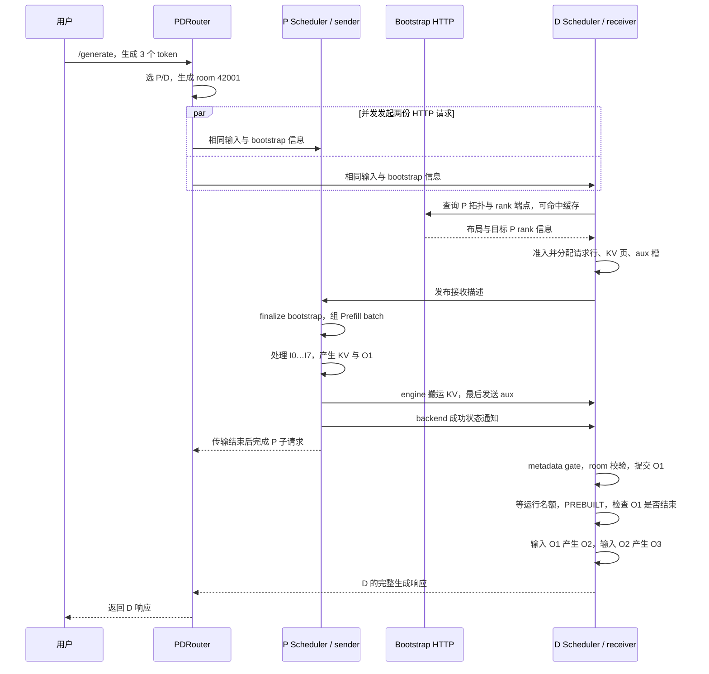

# PD 分离职责与端到端请求地图

本文是 **07-01，源码分析型学习资料**。本篇回答：**一条请求拆到 Prefill 和 Decode 两个实例后，谁选实例、谁分配接收空间、谁发送 KV、谁产生第一个 token，又由谁决定开始 Decode？** 先把普通成功路径走通，再标出等待、失败和资源交接的边界。后续五篇分别深入两侧队列、传输后端、异常退役与组合拓扑。

## 0. 阅读基线与范围

| 项目 | 内容 |
| --- | --- |
| 源码路径基准 | SGLang 仓库根目录 `.`；所有源码路径均为仓内相对路径 |
| 分支 | `codex/sglang-source-study-20260909`，基于官方 `main` |
| commit | `72d5c5bb73cadd7ffbf5114e5f81e29d36b6c61a` |
| 读取日期 | `2026-09-10` |
| 源码工作区 | 学习 worktree 干净；保留原 `muxi-main` 工作区和 26 个未跟踪文件 |
| 文档工作区 | 保留 Wiki 已有本地资料；只增加本系列正文、必要导航和附录 |
| 操作边界 | 只读 Python/Rust 源码与测试定义，执行文档和独立教学算术检查；未导入 SGLang/torch、启动网关或 P/D 服务、运行模型/通信测试 |
| 前置 | [02-02 请求消息通路](../02-request-lifecycle/02-Tokenizer与进程间消息通路.md)、[02-06 完成与释放](../02-request-lifecycle/06-完成取消与资源释放.md)、[04-01 槽位](../04-kv-cache/01-请求视图物理槽位与分配器.md)、[06-01 Rank](../06-parallelism/01-Rank进程组与通信基础.md) |

**本篇主线：** Rust HTTP `PDRouter` 的 `/generate`，普通非流式文本请求，`return_logprob=False`；一个 P 实例、一个 D 实例，两侧各 TP=1、PP=1，DP/EP/CP/DCP 不扩展。选可在单卡容纳的同一 Dense/GQA 自回归模型，模型与 tokenizer 版本、KV dtype、page size 对齐；源码阅读采用 Eager、非 Overlap、普通 Mooncake 直接传输。

本例首轮输入不命中缓存、不分块，`optimistic_prefill_attempts=0`，关闭 D 侧 Radix 复用、HiCache、offload、staging、投机、LoRA、多模态和动态权重更新。这里是为讲清调用链而固定的**教学条件**，没有生成或执行一条声称可在本机运行的部署命令。Mooncake 外部 transfer engine 的实际设备完成语义与运行结果，不由主仓静态阅读自动证明。

以下**源码事实**对应固定锚点；R1、时间线、页号与关系图属于**整理者归纳**。没有运行观察，也不引用历史内部协议替代这版官方实现。

## 1. 人话版：把“读完问题”与“持续回答”交给两组执行资源

Prefill 一次处理输入上下文的很多 token，产生各层 KV，并计算首个输出 token。Decode 随后反复处理最新输出，读取已有 KV，继续产生下一个 token。它们的输入规模、批处理方式和延迟关注点不同，详见 [00-04](../00-foundations/04-Prefill与Decode及KVCache入门.md)。

PD 分离让 P、D 分别拥有模型执行资源和调度队列。这样可以分别安排容量和负载，但必须增加一次交接：**D 要得到可用的上下文 KV，以及从哪里继续生成所需的输出信息。** 单看模型计算变快，不能推导整条请求一定变快；分配等待、传输、元数据检查和 D 排队都会影响结果。

可以把它理解为接力：P 读完题目并算出第一步，D 接到已有状态后继续。实际接力棒不是一个 Python `Req` 对象，而是 KV 数据、首 token 等交接信息，以及用来配对请求和找到目标内存的描述。

### 1.1 六个职责先放在不同位置

| 角色 | 负责什么 | 本篇中不由它决定什么 |
| --- | --- | --- |
| HTTP Gateway / `PDRouter` | 选 P/D worker，注入 bootstrap 信息，并发发起两份请求，组织最终响应 | 不分配 GPU KV 页，不决定 kernel 何时可以读目标页 |
| P 的 Tokenizer/HTTP 与 Scheduler | 建立本地请求，等待 bootstrap，组 Prefill batch，执行模型并发起传输 | 不直接占用 D 的本地 allocator |
| Bootstrap 服务 | 登记并查询 P 的 rank 端点、并行与缓存布局信息 | 不执行模型，也不承载整个 KV 字节流 |
| D 的预分配队列 | 获取 P 信息，分配本地请求行、目标 KV 和 metadata 槽，再告知发送方 | 分配了地址不代表地址里已经有有效 KV |
| KV manager / sender / receiver / transfer engine | 配对房间、保存接收描述、提交数据搬运、报告传输状态 | backend 的单个状态值不等于整个 D 请求已经可调度 |
| D 的传输队列与 Scheduler | 检查传输和元数据，提交首 token，完成 PREBUILT，再按容量合入 Decode | 不通过重新跑一遍普通 Prefill 来替代本次 KV 交接 |

网关选择和双发入口见 [S1][S2][S6]；P/D 入队分支见 [S10]；D 的放行与调度见 [S43][S49]。

### 1.2 总览图：HTTP 请求、控制信息与 KV 各走各的路径

**图意：** P、D 方框各包含多种进程/组件，不表示它们共用一个 Python 对象。Bootstrap 是 P 侧拓扑查询入口；D 通过它找到 rank 控制端点，随后向 rank 发送接收描述。图中 transfer engine 箭头概括数据搬运，不表示 KV 穿过网关。P 返回 HTTP 成功也不是 D Scheduler 的放行指令。[S14][S17][S19][S29]

### 图解补充：P/D 分工与 EP 组是两层拓扑

[查看原尺寸](../../../images/sglang-source-study/22-ep-architecture.png)。

**图意解读：** 先按 Prefill、Decode 两个大区域辨认工作，再看各区域内部的 DP Attention 和 EP；跨区域箭头是 KV 交接，不是普通层内专家通信。

**对应本篇源码：** 对照本篇 Gateway 选择 P/D 与两侧 Scheduler：先分清实例间 KV 交接，再识别实例内部的并行通信。 [源码：sgl-model-gateway/src/routers/http/pd_router.rs][S1]

**来源与边界：** [Deploying DeepSeek with PD Disaggregation and Large-Scale Expert Parallelism on 96 H100 GPUs](https://www.lmsys.org/blog/2025-05-05-large-scale-ep/)，SGLang Team，2025-05-05。原图对应 2025 年 96 张 H100 的特定部署（3 个 P 节点、9 个 D 节点）。它仅帮助区分两层拓扑，不是本篇教学配置或本次运行证据。 [来源档案 F22](../../../images/sglang-source-study/SOURCES.md#f22)。

## 2. 先拆开三种“metadata”和两种地址

### 2.1 术语与身份速查

| 名称 | 人话解释 | 关键边界 |
| --- | --- | --- |
| `rid` / R1 | 本地请求标识 / 本文逻辑请求编号 | 两个实例有各自的 Req 对象；本地对象身份不能用于跨实例配对 |
| `bootstrap_room` | 这次 P/D 交接的关联编号 | 不是 GPU 页号、网络连接 ID，也不是全局业务幂等保证 |
| `bootstrap_host/port` | P 的 bootstrap 查询地址 | 不是 D 的 GPU 地址，也不必等于 P 的生成 API 端口 |
| rank endpoint | bootstrap 返回的 `rank_ip/rank_port` | Mooncake 控制消息送到这个端点；不能与 HTTP `/route` 混为一谈 |
| Mooncake session | transfer engine / 远端内存登记所用身份 | 一条 session 可服务多个 room，不等于一个请求 |
| `req_pool_idx` | 某实例请求位置表的行号 | P 与 D 各自分配，不要求相同 |
| page indices | 本地 KV pool 中的页编号 | 发送源页与接收目标页可以完全不同 |
| `metadata_buffer_index` / aux index | 本侧交接输出 buffer 的槽号 | P 和 D 的槽号分别分配，由接收描述建立对应 |
| `DecodeRequest` | D 的传输阶段包装，含 Req、receiver、metadata 槽等 | 进入普通解码后使用内部 Req；不是另一条用户请求 |
| `PREBUILT` | 把已在 P 完成的 Prefill 结果接入 D 调度 | 构造本地衔接状态，不执行一次完整模型 Prefill |

`KVArgs` 中保存长期内存登记需要的指针、区域长度、每项长度和层映射；`DecodeRequest` 保存一次请求接收阶段的对象。两者的寿命和作用不同。[S35][S61]

### 2.2 三种信息不要统称为“KV metadata”

| 信息 | 典型内容 | 代表传递路径 | 谁消费 |
| --- | --- | --- | --- |
| 拓扑与缓存布局 | rank、TP/CP/PP/DP、page size、KV dtype、rank 端点 | P 向 Bootstrap HTTP `/route` 登记，D 查询 | D manager 做布局检查和 rank mapping |
| 内存登记与本请求接收描述 | pool 基址/长度、session；目标 page indices、D aux index、decode prefix length | receiver 登记内存参数，再发送 per-room ZMQ 描述 | P manager / sender 组织搬运 |
| 模型结果交接数据 | 首 token、cached-token 统计、按请求选择的 logprob 等、room 标记 | 最后一个 chunk 的 aux 数据；可走 engine，也有 TCP 分支 | D metadata gate 与 `_commit_transfer_to_req` |

第二行是“写到哪里”，第三行是“写过去后从哪里继续”。`MetadataBuffers.set_buf` 将 `req.output_ids[0]` 写入交接槽；它不是传送整个 `Req`，也不是重新传模型权重。[S18][S19][S27][S31]

“控制面”和“数据面”描述职责，不是简单按消息体大小划线。首 token 很小，但在这里属于需要实际送达并验证的交接输出；它可以经 aux 搬运。不能把所有叫 metadata 的东西都想成只在 HTTP JSON 里传递。

## 3. R1 进入网关：同一交接编号，两份并发请求

设用户向网关发起普通 `/generate`，希望生成 3 个 token。为便于沿用全系列的账本，假设输入被分为 `I0…I7`，期望逐步得到 `O1、O2、O3`；这是教学分词，不是实际 tokenizer 输出。

### 3.1 网关先选一对 worker

`route_generate` 提取 stream、logprob、batch size 和按策略需要的文本，进入 `execute_dual_dispatch`。`select_pd_pair` 从 Prefill、Decode worker 集合分别按各自策略选取 worker；模型过滤还受网关配置影响。本例只有一对已登记 worker，不扩展策略算法。[S1][S2]

每次路由尝试会把原请求序列化为 JSON，再注入所选 P 的 bootstrap host/port 和新 room。`generate_room_id` 将随机值的最高位清掉，结果位于 `0…2^63−1`；本例用非零编号 `42001` 示意。该随机编号用于协议关联，不能当成业务请求去重和重试幂等机制。[S3][S5][S9]

普通 worker 的 P、D 请求共享这些 bootstrap 信息。DP-aware 路径还会分别写各 worker 的数据并行 rank，并给 D 携带 P 的 rank；本例 DP=1，因此不展开这条支线。[S4]

### 3.2 P、D 请求是并发发送的

`execute_dual_dispatch_internal` 同时创建、轮询 P 与 D 的 HTTP 请求 future。源码使用 `tokio::select!` 等待 P 的结果，同时保存可能提前返回的 D 结果；不是先等 P 完成，再发送 D。[S6]

这样 D 可以在 P 计算前准备目标空间。主线关闭 optimistic prefill 后，P 正需要 D 发布的接收描述才能完成 bootstrap。如果设计成“P 完成后才启动 D”，就会与这条等待关系冲突。

两份请求进入各自 Tokenizer/Scheduler 时，bootstrap 字段沿 `TokenizedGenerateReqInput` 继续携带；Scheduler 按 disaggregation mode 将本地 Req 分别送入 P bootstrap queue 或 D prealloc queue。前端请求往返的基础机制沿用阶段 02，改变的是入队目的地。[S58][S10]

## 4. D 先准备“装 KV 的位置”，P 才知道往哪里发送

### 4.1 服务拓扑与请求握手是两个阶段

P manager 启动后向 Bootstrap 登记自身 rank 端点与布局；D manager 查询并缓存 P 的信息。代表检查包括 page size 与 KV dtype 是否相同；通过这些检查不能证明两侧模型权重版本、所有模型特例都自动一致，教学条件仍要求部署者明确对齐。[S14][S15]

`DecodePreallocQueue.add` 为本请求创建 receiver。若 P 信息已缓存，可快速确定 prefill DP rank；否则进入待解析路径。DP=1 时选择 0，但前提仍是已获得 P 信息。`CommonKVReceiver.init` 据映射获取 rank 端点，登记目标内存相关信息，并进入 `WaitingForInput`。[S36][S37][S16][S17]

函数名 `_connect_to_bootstrap_server` 容易误导：这里消费的是已经查到的 `rank_ip/rank_port`，用于连接 rank 控制端点；它不是再次把全部接收描述 POST 给 HTTP `/route`。Mooncake 的 `send_metadata` 会在该端点发送 room、session、目标页与 aux 槽等。[S19]

### 4.2 预分配包含准入预算、请求行和目标页

`pop_preallocated` 检查握手状态、请求槽、KV 容量和后续 Decode 的保留预算。本例 D 不启用 Radix 复用，prefix length 为 0；需要为输入上下文提供本地位置。容量不够时请求可继续留在预分配阶段，并不是先让 P 随便写一个地址。[S38]

`_pre_alloc` 分配本地请求行和 KV 位置，填入 D 的 `req_to_token`，设置用于后续衔接的长度和 extend 范围。之后分配 D 的 metadata 槽，将目标 KV 索引翻译为传输所需的物理页编号，再调用 receiver 的 `send_metadata`。[S39][S38]

**此处最需要防止误读：** `_pre_alloc` 已会设置 `req.kv.kv_committed_len=fill_len`。这是这条 D 侧衔接路径提前准备的长度元数据，不能仅凭字段名断言远端 KV 字节已经到达。当前仍处在 prealloc/transfer 阶段，真正进入可用请求集合要经过后面的传输与 metadata gate。[S39][S43]

`DecodeReqToTokenPool` 允许额外的预分配请求行；多几个行号只提供容纳传输中请求的空间。它不增加 GPU KV 的实际容量，也不取消 `max_running_requests` 和 KV 准入预算。[S50]

### 4.3 一个完整的源页—目标页示例

用 page size=4 的教学布局，只看 R1 的 8 个输入 token：

| 请求位置 | P 的源页 / 页内位置 | D 的目标页 / 页内位置 | 是否要求页号相同 |
| --- | --- | --- | --- |
| I0…I3 | 页 7，offset 0…3 | 页 3，offset 0…3 | 不要求 |
| I4…I7 | 页 12，offset 0…3 | 页 9，offset 0…3 | 不要求 |

P 的请求行可为 2、metadata 槽可为 3；D 的请求行可为 5、metadata 槽可为 7。双方通过 `room=42001` 和接收描述配对，而不是碰巧分到了相同的整数索引。

**图意：** 页号、请求行和 aux 槽都是示例，不是实测分配结果。每层都有相应的 K/V 存储位置；Unified pool 下，请求表中的虚拟 ID 在进入传输前需要翻译，不能直接把虚拟编号当成设备地址。`send_kv_chunk` 与 D 的预分配代码都调用传输索引翻译接口。[S26][S38]

## 5. P 完成 bootstrap，算出 KV 与 O1，再交给 sender

### 5.1 默认路径等待目标信息，乐观 Prefill 是另一条分支

P 的 `create_sender` 建立本请求 sender，设 `pending_bootstrap=True`。P manager 收齐需要的 D 接收描述后，将对应 room 状态推进到 `WaitingForInput`。`pop_bootstrapped` 轮询 sender 状态，执行 `finalize_bootstrap`，取得 D 已有 prefix 长度、分配 P metadata 槽、计算需要发送的页数并初始化 sender。[S20][S59][S22][S23]

本例 D prefix=0，因此 P 从 I0 开始发送全部上下文 KV。若启用 D 缓存复用，发送起点来自 D 发布的 prefix length；P 的“自己是否命中缓存”与 D 的“哪些前缀已经可用”不能混成一个命中值。

`optimistic_prefill_attempts` 的声明默认值是 0。非零时，源码允许在 Bootstrapping 阶段提前运行部分 Prefill，并在之后处理尚未完成的握手；这不改变 D 必须检查 KV 和交接状态的要求。本篇固定 0，避免把两条不同的等待路径画成一个时序。[S12][S22]

### 5.2 为什么 P 会把自己的 `max_new_tokens` 改成 1

`PrefillBootstrapQueue._process_req` 把 **P 本地 Req** 的 `sampling_params.max_new_tokens` 设为 1，让 Prefill 侧的内存估计符合职责。网关已经向 D 发出另一份请求，D 仍保留用户要求的生成长度；这不是把用户整条请求截成一个输出。[S21]

P Scheduler 将完成 bootstrap 的请求移入 waiting queue，正常准入并组 Prefill batch，执行模型。首轮输入 I0…I7 产生各层 KV，最后位置的 logits 经采样得到 O1。`process_batch_result_disagg_prefill` 将 O1 加入 P 的 `output_ids`，保留相应缓存引用，并把请求放入 inflight transfer queue。[S24][S25]

**O1 此时是输出，还不是已被模型再次处理的输入。** 因而普通 R1 传给 D 的是 I0…I7 的 KV，加上 O1 的 token ID 等交接数据；不是 I0…I7、O1 一共 9 个 token 的 KV。

### 5.3 sender 接口调用返回，不代表整个传输结束

最后一个 chunk 先通过 `MetadataBuffers.set_buf` 准备 O1 等交接数据。`send_kv_chunk` 取源位置、翻译传输索引、换算页号，然后调用 sender 的 `send`。Mooncake sender 将任务加入 manager 的 transfer queue；真正搬运由后台 transfer worker 执行。[S26][S27][S28]

普通同布局分支使用源页、目标页、各层指针和每项长度组织传输；`_transfer_data` 调用外部 engine 的 `batch_transfer_sync`。最后一个 chunk 还发送 aux 数据，并按返回结果更新状态、通知 D。[S29][S30][S31]

这里记录的是主仓**怎样使用后端接口的完成契约**。没有运行 transfer engine，也没有实测 RDMA/NVLink/TCP 的可见性、错误或带宽，不能把函数名中的 sync 当作本轮跨设备完成证明。

## 6. D 从收到 KV，到第一次真正 Decode

### 6.1 三道检查：后端状态、元数据到达、room 匹配

Mooncake D 控制线程收集所需 P rank 的成功通知，满足要求的响应数量后更新本地 room 状态。本例只有一个 P rank；多 rank 的数目与映射在后续拓扑篇展开。[S32]

`DecodeTransferQueue.pop_transferred` 还会调用 `_poll_with_metadata_gate`。gate 发现 backend 为 Success，但 metadata 槽里的 room 仍为 0，就把本地结果降回 Transferring；随后对相关 rank 的 poll 状态做 MIN 规约。由于 Failed=0、Success=4，失败和未完成状态能阻止其他 rank 抢先提交。[S40][S41][S60]

**gate 只检查“是否写入”，room 是否正确由 commit 再检查。** `_commit_transfer_to_req` 比较实际 room 与预期 room：0 是意外未就绪，非零但不相同则报上下文损坏并 abort；匹配才把 O1、缓存统计及按需 logprob 等提交到 D 的 Req。[S42]

**图意：** 这是教学状态图，混合展示 receiver 检查和 Scheduler 阶段，不是一个源码 enum。Prebuilt、WaitingQueue、Finished 不是 `KVPoll` 的值。失败后的在途写入和资源退役另有处理，图里的 Aborted 不表示所有 buffer 此刻已经可以复用。

### 6.2 成功接收还要等待 D 的调度名额

`process_decode_queue` 先推进 prealloc，把已发布目标的包装请求放到 transfer queue，再把成功转移且提交未失败的 Req 放进 D waiting queue。前面还有恢复、轮询频率等条件，本例没有 retraction/HiCache。[S44]

`get_new_prebuilt_batch` 按运行容量从 waiting queue 取请求，建立 PREBUILT batch。请求位置表已经指向接收好的上下文 KV，且 D 的 `output_ids` 中已有 O1。`prepare_for_prebuilt` 构造长度/采样元数据，**不会执行普通模型 forward**，也不把整个 prompt 再拷贝成一份待执行 GPU 输入。[S45][S46]

`process_prebuilt` 用 O1 初始化接下来 Decode 所用的输入交接。在普通非投机路径，O1 被写入 FutureMap 的 relay，后续 Decode 按既有输入解析机制读取。此处准备的是“下一步输入”，不再采样一次 O1。[S47]

### 6.3 首 token 也可能已经让请求结束

合入 running batch 前，`process_batch_result_prebuilt` 调用 `req.update_finish_state()` 并输出结果；已经结束的请求会释放相应 KV 引用，再从 batch 过滤。若用户只要求 1 个 token，或 O1 已命中 EOS/stop，本次请求可以在这里结束，不必强行再做一次 Decode。[S48][S49]

对于 R1，假设 O1、O2 都不停止，O3 触发长度停止：

| 阶段 | 实际输入给模型的 token | 已处理输入所需 KV | 已生成输出 | 此时所在侧 |
| --- | --- | --- | --- | --- |
| 首轮 Prefill | I0…I7 | I0…I7，共 8 个位置 | O1 | P |
| 传输与 PREBUILT | 无新的普通模型 forward | D 得到 I0…I7 的 KV | O1 已提交到 D Req | D |
| 第一次 Decode | O1 | I0…I7、O1，共 9 个位置 | O1、O2 | D |
| 第二次 Decode | O2 | I0…I7、O1、O2，共 10 个位置 | O1、O2、O3 | D |
| 停止收尾 | 本例不再输入 O3 | 按完成/缓存规则处理前述 KV | 三个输出完成 | D |

生成了 3 个 token，不等于 P/D 总共执行 3 次 Decode；本例是一次 Prefill 加两次 Decode。已分配容量、已写入 KV 与已输出 token 的计数必须分开。

## 7. 把完整时间线与 HTTP 返回接起来

### 7.1 非乐观、非分块 R1 的请求时序

**图意：** P/D HTTP 请求并发；P 与 D 在传输结束后的本地收尾也没有规定的全局先后顺序。图为阅读依赖而顺序排版，不能读成“P 的 HTTP 回复触发 D commit”。Bootstrap 拓扑登记通常早于这条请求，因此这里只画查询。图中成功状态沿后端契约生成，D 仍执行自己的检查。

### 7.2 为什么网关通常返回 D 的响应

P inflight queue 看到 sender Success 后，设置 P 本地结束状态，调用 `release_kv_cache` 释放/移交缓存引用，清 sender，再输出 P 子请求结果并释放 P metadata 槽。`release_kv_cache` 不意味着缓存池全部销毁；可保留的前缀仍按缓存策略处理。[S33][S34]

D commit 成功后清 receiver，离开 transfer queue 的 metadata 槽会被清 room 标记并归还；**D 的持久 KV 此时继续服务 Decode**。清 receiver 或归还 aux 槽，不能与释放 D 请求 KV 画成同一个动作。[S42][S43]

网关消费 P 的响应并检查 P 成功与否；本例未请求 logprob，`process_non_streaming_response` 直接返回 D 的响应体。客户端得到的 O1 已经由 D 的交接流程纳入输出，网关不再把 P 的 O1 文本手工拼到 D 文本前面。[S7][S8]

请求 logprob 时，网关有合并 P/D 相关字段的分支；streaming 又有独立响应生命周期。本篇只定位这些分支，不把普通非流式返回逻辑扩大为所有 API 模式。[S8]

## 8. P/D 队列与完成边界对照

### 8.1 按请求寿命读两侧队列

| 侧与阶段 | 持有对象 | 等待什么 | 成功后去向 |
| --- | --- | --- | --- |
| P bootstrap queue | Req、sender，可能尚无 P metadata 槽 | D 的接收描述与 bootstrap 终结条件 | P waiting queue |
| P waiting / Prefill batch | Req、本地源 KV、计算状态 | 本地准入与模型执行 | P inflight transfer queue |
| P inflight transfer | Req、sender、源 KV 引用、P aux 槽 | sender 的终结状态 | 完成 P 子请求与本地收尾 |
| D pending / prealloc queue | DecodeRequest、receiver | P 信息/握手、本地请求行和 KV 预算 | 发布目标后进 transfer queue |
| D transfer queue | DecodeRequest、目标 KV、D aux 槽 | 后端状态、metadata gate、room 校验 | 成功提交的 Req 进入 waiting queue |
| D waiting / PREBUILT | Req、已交接 O1、上下文 KV | 运行容量和首 token 停止检查 | 结束，或合入 running batch |
| D running | Req、输入 relay、持续增长的 KV | 一步步模型 Decode 与结果处理 | 用户请求完成/取消后的收尾 |

本篇的关键边界是：**选中 D → 给 D 发请求 → D 分配空间 → P 发起传输 → 后端报告完成 → D 提交交接 → D 可调度 → 用户请求结束**。这些是不同阶段，不应合成一句“KV ready 了”。

### 8.2 不能用某一种“成功”代替整条链路

| 观察 | 能直接说明什么 | 不能单独证明什么 |
| --- | --- | --- |
| 网关选到一对 worker | 路由层选出了服务目标 | D 有接收空间、P/D 布局一致 |
| Bootstrap `/route` 可查询 | 拓扑信息可获取 | 数据通路可用、KV 已搬运 |
| D 已有 req_pool_idx / 长度字段 | 本地预分配状态已建立 | 目标地址包含正确 KV |
| `send_metadata` 返回 | 已执行接收描述发送接口的相应分支 | GPU KV 已到达 |
| sender `send` 返回 | Mooncake 路径已提交传输任务 | 后台数据搬运完成 |
| backend Success | 后端状态机认为传输成功 | D 的 aux 已通过 gate、room 匹配、已进入 running |
| P HTTP 200 | P 子请求按服务逻辑完成 | D 已生成全部输出 |
| D 首 token 已提交 | handoff 已进入 D Req | 后续 Decode 必然执行；可能首 token 就结束 |

## 9. 参数、异常与排障的第一张地图

### 9.1 代表配置的实际约束

| 配置/条件 | 固定基线的行为 | 证据状态与限制 |
| --- | --- | --- |
| `disaggregation_mode` | `null/prefill/decode`；Scheduler 按模式选不同 event loop 和队列 | 声明与分发事实 [S12][S11] |
| transfer backend | 默认声明为 `mooncake` | 不代表本机已安装外部库或有可用 RDMA [S12] |
| `mooncake_tcp` | hook 用 `setdefault("MC_FORCE_TCP", "1")` 补默认值，归一化 backend 到 mooncake，并清除该解析路径的 IB 设备选择 | 已存在的环境值会保留；需核对实际环境，不能只凭 backend 名或日志认定 TCP 已生效 [S13] |
| bootstrap port | 默认声明 8998；本例使用 P 侧查询入口 | Rust server 存在端口别名分支，不能把本例 Python 服务部署图照搬 [S12][S13] |
| D Radix cache | 默认关闭；未启用时 hook 强制走 chunk cache 方向 | P/D 缓存复用不是同一个默认策略 [S13] |
| D extra slots | 未指定时按运行 batch/DP 条件补默认值；小 per-worker batch 可留额外请求行 | 请求行余量不等于 GPU KV 余量 [S13][S50] |
| optimistic prefill | 默认 0；非零允许跳过部分 bootstrap 等待先算 | 本篇不启用 [S12][S22] |
| P/D page size、KV dtype | D 获取 P 信息时有显式不一致检查 | 不替代模型/权重与完整布局适配证明 [S15] |
| fake transfer | P 拒绝配置 fake；D 的合成路径可以不真实搬 KV | fake 成功不能证明真实 PD 传输 [S13] |
| DCP、staging、HiCache、非对称 TP | 有各自限制和分支 | 留给后续专题；不由本篇单 rank 主线证明支持 |

### 9.2 从卡住的位置反查负责人

| 现象 | 首先收集的事实 | 回到哪里 |
| --- | --- | --- |
| 网关找不到 P/D | worker 类型、模型过滤配置、健康/策略选择结果 | `select_pd_pair` [S2] |
| P 一直 Bootstrapping | 同一 room 的 D 请求是否存在、D 预分配是否被预算阻塞、接收描述是否发布 | P bootstrap / D prealloc [S22][S38] |
| D 一直无法初始化 receiver | bootstrap host/port、P rank 登记、page size/dtype、DP rank | Common manager / receiver [S15][S16][S37] |
| P 算完却一直不返回 | sender 是否终结、transfer worker、最后一个 chunk 与 aux | P inflight / Mooncake worker [S33][S29] |
| D 后端 Success 但未进入 waiting | metadata 槽 room 是否仍为 0，相关 rank 的 poll 结果 | metadata gate [S40][S41] |
| D 报 context corruption | expected/actual room、D aux index、槽位复用记录 | `_commit_transfer_to_req` [S42] |
| D 已在 waiting，却没有 Decode | running 名额、PREBUILT 停止结果、是否有 retraction 先处理 | `get_new_prebuilt_batch` / 结果处理 [S45][S48] |
| 首 token 丢失或重复 | P output、aux output ID、D output_ids、PREBUILT relay、最终响应体 | `set_buf`→commit→process_prebuilt [S27][S42][S47] |
| P 失败后 D 长时间等待 | 网关子请求结果、D 连接关闭/取消是否到达、receiver timeout | 双发错误路径与 D failure 分支 [S6][S43] |

网关把两份 upstream 请求放在当前 handler 中，而不是 detached task；P 失败时有终止配对 D 请求的处理。这只是网关层的取消传播设计。连接关闭、D 请求 abort、P 停止写入、KV 可以复用是不同证据，不能从 HTTP 取消直接推断跨设备写入已经退役。[S6]

D transfer failure 分支会区分是否进入 deferred release；某些路径需要保留目标 KV 与 metadata，直到相应条件满足。本篇不审计所有 abort/ACK/timeout 组合，不给出“见到任意 ACK 即可释放”的结论。07-05 将专门追踪仍在途的对象、通知和释放条件。[S43]

## 10. 回到源码的最短阅读路线

| 顺序 | 要回答的问题 | 仓内相对路径与入口 |
| --- | --- | --- |
| 1 | 一条 HTTP 请求如何成为 P/D 两份？ | `sgl-model-gateway/src/routers/http/pd_router.rs`：`route_generate`、`execute_dual_dispatch_internal` [S1][S6] |
| 2 | P/D 分别进入哪条 Scheduler 主线？ | `python/sglang/srt/managers/scheduler.py::dispatch_event_loop` [S11]；`Scheduler._add_request_to_queue` [S10] |
| 3 | P 的 rank 端点与缓存布局从哪里来？ | `python/sglang/srt/disaggregation/common/conn.py::CommonKVManager.register_to_bootstrap` [S14]、`CommonKVManager.try_ensure_parallel_info` [S15] |
| 4 | 谁分配 D 目标页，怎么告诉 P？ | `python/sglang/srt/disaggregation/decode.py::DecodePreallocQueue.pop_preallocated` [S38]；`python/sglang/srt/disaggregation/mooncake/conn.py::MooncakeKVReceiver.send_metadata` [S19] |
| 5 | P 何时能开始，首 token 放哪里？ | `python/sglang/srt/disaggregation/prefill.py::PrefillBootstrapQueue.finalize_bootstrap` [S23]、`SchedulerDisaggregationPrefillMixin.process_batch_result_disagg_prefill` [S25] |
| 6 | 请求 KV 怎样变成搬运任务？ | `python/sglang/srt/disaggregation/prefill.py::SchedulerDisaggregationPrefillMixin.send_kv_chunk` [S26]；`python/sglang/srt/disaggregation/mooncake/conn.py::MooncakeKVSender.send` [S28] |
| 7 | D 为何还不能只信 backend Success？ | `python/sglang/srt/disaggregation/utils.py::_apply_metadata_gate` [S40]；`python/sglang/srt/disaggregation/decode.py::DecodeTransferQueue._commit_transfer_to_req` [S42] |
| 8 | D 如何从 O1 开始，而不是重新 Prefill？ | `python/sglang/srt/disaggregation/decode_schedule_batch_mixin.py::ScheduleBatchDisaggregationDecodeMixin.process_prebuilt` [S47]；`python/sglang/srt/disaggregation/decode.py::SchedulerDisaggregationDecodeMixin.get_next_disagg_decode_batch_to_run` [S49] |
| 9 | P 子请求与用户请求分别何时结束？ | `python/sglang/srt/disaggregation/prefill.py::SchedulerDisaggregationPrefillMixin.process_disagg_prefill_inflight_queue` [S33]；Rust `process_non_streaming_response` [S8] |

### 10.1 测试定义与覆盖边界

| 测试/辅助入口 | 本轮静态读到什么 | 不能据此宣称什么 |
| --- | --- | --- |
| `test/registered/disaggregation/test_disaggregation_basic.py`：`test_first_token_finish` | EOS、ignore_eos、指定 stop 等首 token 完成条件的请求与断言 [S51] | 本轮模型已验证这些分支 |
| 同文件 `test_logprob` | 检查 output logprob 数量与 completion tokens 对应，input logprob 非空 [S52] | 完整跨 backend 数值等价或传输正确性证明 |
| `python/sglang/test/server_fixtures/disaggregation_fixture.py`：`launch_lb` | 该基础 fixture 明确带 `--mini-lb`；Python `launch_router` 据此进入 MiniLoadBalancer [S53][S54] | 它不能直接充当本篇 Rust HTTP PDRouter 的端到端测试结果 |
| `sgl-model-gateway/src/routers/http/pd_router.rs` 内测试 | 普通 worker 请求字段保留、DP-aware rank 注入与端点准备断言 [S55][S56] | 这些请求准备测试没有真实传输 GPU KV |
| `test/registered/unit/disaggregation/test_decode_queue_cleanup.py` | mock poll/failure 下检查释放/清 receiver 与 metadata allocator 调用 [S57] | fake/mocks 不证明真实在途写入已经排空 |

以上均只读。测试文件存在、测试断言合理、本轮测试通过，是三种不同结论；本篇只有前两类的局部阅读证据。

## 11. 练习、验收与下一篇

### 11.1 自测与参考答案

1. **为什么网关要并发发 P、D 请求？** D 可以提前获取 P 信息并准备目标空间；本例 P 的非乐观路径需要等待这份接收描述。
2. **D 已有 `req_pool_idx`、`kv_committed_len=8`，是否可以直接 Decode？** 不可以。这些字段可在预分配时填写，还需传输状态、metadata gate、room 校验、PREBUILT 和调度准入。
3. **P 页 `[7,12]`、D 页 `[3,9]`，page size=4，可以交接同一条 8-token 上下文吗？** 可以；同一请求位置通过描述对应不同本地页号。源/目标地址分别从各自 pool 基址和页号计算。
4. **R1 的第一个输出是谁算的，用户从谁的响应得到？** P 算 O1，经 aux 提交给 D；本例网关返回 D 的完整响应，不再次拼接 P 的 O1。
5. **O1 命中 EOS 时还必须在 D 做一次模型 forward 吗？** 不必须；PREBUILT 结果处理先检查停止，结束的请求会被过滤。
6. **backend Success、metadata room=0 与非零错误 room 分别怎样处理？** 前者若 room=0，gate 降为 Transferring 继续等；非零错误 room 到 commit 时触发损坏检查并 abort。
7. **D 清掉 receiver 和 metadata 槽后，为什么还可以继续生成？** 这些是一次传输交接对象；成功收到的 KV 仍归 D 的请求/缓存生命周期持有。
8. **基础 PD 测试启动成功，能否直接说 Rust PDRouter 被端到端验证？** 不能；先核查启动 fixture，当前基础路径用了 MiniLoadBalancer，必须另找或执行 Rust 网关对应验证。

### 11.2 本篇验收与证据范围

已将 R1 串成“网关选对与并发双发 → D 预分配与接收描述 → P bootstrap/Prefill → KV/aux 搬运 → D gate/commit/PREBUILT → Decode → 响应与各自收尾”的链路。两侧队列表、源/目标页映射、首 token 与 8/9/10 个 KV 位置账本均按所选主线解释。

固定源码符号、导航、图表结构和教学算术已静态检查。没有运行 Rust 测试、Python/torch 单测、服务、模型、transfer engine、故障注入或性能实验；没有验证任意异构 TP、PP、DCP、staging 或缓存组合。Mermaid 表达阅读依赖，不代表真实 trace 或实测时间。

上一篇：[06-06《Context Parallel 与并行组合》](../06-parallelism/06-ContextParallel与并行组合.md)。下一篇：[07-02《Prefill 侧 Bootstrap 与传输状态》](02-Prefill侧Bootstrap与传输状态.md)。返回[系列目录](../README.md)，或查阅[术语](../appendices/01-术语与对象速查.md)、[源码索引](../appendices/02-源码入口与调用链索引.md)、[配置矩阵](../appendices/03-配置解析与功能兼容矩阵.md)、[排障索引](../appendices/04-症状到源码的排障索引.md)、[证据模板](../appendices/05-实验记录与证据模板.md)与[进度记录](../appendices/06-学习进度与版本变更记录.md)。

[S1]: https://github.com/sgl-project/sglang/blob/72d5c5bb73cadd7ffbf5114e5f81e29d36b6c61a/sgl-model-gateway/src/routers/http/pd_router.rs#L1562
[S2]: https://github.com/sgl-project/sglang/blob/72d5c5bb73cadd7ffbf5114e5f81e29d36b6c61a/sgl-model-gateway/src/routers/http/pd_router.rs#L972
[S3]: https://github.com/sgl-project/sglang/blob/72d5c5bb73cadd7ffbf5114e5f81e29d36b6c61a/sgl-model-gateway/src/routers/http/pd_router.rs#L238
[S4]: https://github.com/sgl-project/sglang/blob/72d5c5bb73cadd7ffbf5114e5f81e29d36b6c61a/sgl-model-gateway/src/routers/http/pd_router.rs#L349
[S5]: https://github.com/sgl-project/sglang/blob/72d5c5bb73cadd7ffbf5114e5f81e29d36b6c61a/sgl-model-gateway/src/routers/http/pd_router.rs#L365
[S6]: https://github.com/sgl-project/sglang/blob/72d5c5bb73cadd7ffbf5114e5f81e29d36b6c61a/sgl-model-gateway/src/routers/http/pd_router.rs#L646
[S7]: https://github.com/sgl-project/sglang/blob/72d5c5bb73cadd7ffbf5114e5f81e29d36b6c61a/sgl-model-gateway/src/routers/http/pd_router.rs#L1263
[S8]: https://github.com/sgl-project/sglang/blob/72d5c5bb73cadd7ffbf5114e5f81e29d36b6c61a/sgl-model-gateway/src/routers/http/pd_router.rs#L1217
[S9]: https://github.com/sgl-project/sglang/blob/72d5c5bb73cadd7ffbf5114e5f81e29d36b6c61a/sgl-model-gateway/src/routers/http/pd_types.rs#L60
[S10]: https://github.com/sgl-project/sglang/blob/72d5c5bb73cadd7ffbf5114e5f81e29d36b6c61a/python/sglang/srt/managers/scheduler.py#L3148
[S11]: https://github.com/sgl-project/sglang/blob/72d5c5bb73cadd7ffbf5114e5f81e29d36b6c61a/python/sglang/srt/managers/scheduler.py#L5646
[S12]: https://github.com/sgl-project/sglang/blob/72d5c5bb73cadd7ffbf5114e5f81e29d36b6c61a/python/sglang/srt/arg_groups/fields/disagg.py#L28
[S13]: https://github.com/sgl-project/sglang/blob/72d5c5bb73cadd7ffbf5114e5f81e29d36b6c61a/python/sglang/srt/arg_groups/pd_disaggregation_hook.py#L22
[S14]: https://github.com/sgl-project/sglang/blob/72d5c5bb73cadd7ffbf5114e5f81e29d36b6c61a/python/sglang/srt/disaggregation/common/conn.py#L791
[S15]: https://github.com/sgl-project/sglang/blob/72d5c5bb73cadd7ffbf5114e5f81e29d36b6c61a/python/sglang/srt/disaggregation/common/conn.py#L618
[S16]: https://github.com/sgl-project/sglang/blob/72d5c5bb73cadd7ffbf5114e5f81e29d36b6c61a/python/sglang/srt/disaggregation/common/conn.py#L1404
[S17]: https://github.com/sgl-project/sglang/blob/72d5c5bb73cadd7ffbf5114e5f81e29d36b6c61a/python/sglang/srt/disaggregation/common/conn.py#L1522
[S18]: https://github.com/sgl-project/sglang/blob/72d5c5bb73cadd7ffbf5114e5f81e29d36b6c61a/python/sglang/srt/disaggregation/mooncake/conn.py#L2566
[S19]: https://github.com/sgl-project/sglang/blob/72d5c5bb73cadd7ffbf5114e5f81e29d36b6c61a/python/sglang/srt/disaggregation/mooncake/conn.py#L2656
[S20]: https://github.com/sgl-project/sglang/blob/72d5c5bb73cadd7ffbf5114e5f81e29d36b6c61a/python/sglang/srt/disaggregation/prefill.py#L337
[S21]: https://github.com/sgl-project/sglang/blob/72d5c5bb73cadd7ffbf5114e5f81e29d36b6c61a/python/sglang/srt/disaggregation/prefill.py#L415
[S22]: https://github.com/sgl-project/sglang/blob/72d5c5bb73cadd7ffbf5114e5f81e29d36b6c61a/python/sglang/srt/disaggregation/prefill.py#L422
[S23]: https://github.com/sgl-project/sglang/blob/72d5c5bb73cadd7ffbf5114e5f81e29d36b6c61a/python/sglang/srt/disaggregation/prefill.py#L374
[S24]: https://github.com/sgl-project/sglang/blob/72d5c5bb73cadd7ffbf5114e5f81e29d36b6c61a/python/sglang/srt/disaggregation/prefill.py#L612
[S25]: https://github.com/sgl-project/sglang/blob/72d5c5bb73cadd7ffbf5114e5f81e29d36b6c61a/python/sglang/srt/disaggregation/prefill.py#L701
[S26]: https://github.com/sgl-project/sglang/blob/72d5c5bb73cadd7ffbf5114e5f81e29d36b6c61a/python/sglang/srt/disaggregation/prefill.py#L1234
[S27]: https://github.com/sgl-project/sglang/blob/72d5c5bb73cadd7ffbf5114e5f81e29d36b6c61a/python/sglang/srt/disaggregation/utils.py#L479
[S28]: https://github.com/sgl-project/sglang/blob/72d5c5bb73cadd7ffbf5114e5f81e29d36b6c61a/python/sglang/srt/disaggregation/mooncake/conn.py#L2478
[S29]: https://github.com/sgl-project/sglang/blob/72d5c5bb73cadd7ffbf5114e5f81e29d36b6c61a/python/sglang/srt/disaggregation/mooncake/conn.py#L1759
[S30]: https://github.com/sgl-project/sglang/blob/72d5c5bb73cadd7ffbf5114e5f81e29d36b6c61a/python/sglang/srt/disaggregation/mooncake/conn.py#L641
[S31]: https://github.com/sgl-project/sglang/blob/72d5c5bb73cadd7ffbf5114e5f81e29d36b6c61a/python/sglang/srt/disaggregation/mooncake/conn.py#L1217
[S32]: https://github.com/sgl-project/sglang/blob/72d5c5bb73cadd7ffbf5114e5f81e29d36b6c61a/python/sglang/srt/disaggregation/mooncake/conn.py#L2253
[S33]: https://github.com/sgl-project/sglang/blob/72d5c5bb73cadd7ffbf5114e5f81e29d36b6c61a/python/sglang/srt/disaggregation/prefill.py#L918
[S34]: https://github.com/sgl-project/sglang/blob/72d5c5bb73cadd7ffbf5114e5f81e29d36b6c61a/python/sglang/srt/disaggregation/prefill.py#L121
[S35]: https://github.com/sgl-project/sglang/blob/72d5c5bb73cadd7ffbf5114e5f81e29d36b6c61a/python/sglang/srt/disaggregation/decode.py#L309
[S36]: https://github.com/sgl-project/sglang/blob/72d5c5bb73cadd7ffbf5114e5f81e29d36b6c61a/python/sglang/srt/disaggregation/decode.py#L629
[S37]: https://github.com/sgl-project/sglang/blob/72d5c5bb73cadd7ffbf5114e5f81e29d36b6c61a/python/sglang/srt/disaggregation/decode.py#L684
[S38]: https://github.com/sgl-project/sglang/blob/72d5c5bb73cadd7ffbf5114e5f81e29d36b6c61a/python/sglang/srt/disaggregation/decode.py#L1083
[S39]: https://github.com/sgl-project/sglang/blob/72d5c5bb73cadd7ffbf5114e5f81e29d36b6c61a/python/sglang/srt/disaggregation/decode.py#L1772
[S40]: https://github.com/sgl-project/sglang/blob/72d5c5bb73cadd7ffbf5114e5f81e29d36b6c61a/python/sglang/srt/disaggregation/utils.py#L209
[S41]: https://github.com/sgl-project/sglang/blob/72d5c5bb73cadd7ffbf5114e5f81e29d36b6c61a/python/sglang/srt/disaggregation/utils.py#L234
[S42]: https://github.com/sgl-project/sglang/blob/72d5c5bb73cadd7ffbf5114e5f81e29d36b6c61a/python/sglang/srt/disaggregation/decode.py#L2092
[S43]: https://github.com/sgl-project/sglang/blob/72d5c5bb73cadd7ffbf5114e5f81e29d36b6c61a/python/sglang/srt/disaggregation/decode.py#L2292
[S44]: https://github.com/sgl-project/sglang/blob/72d5c5bb73cadd7ffbf5114e5f81e29d36b6c61a/python/sglang/srt/disaggregation/decode.py#L2716
[S45]: https://github.com/sgl-project/sglang/blob/72d5c5bb73cadd7ffbf5114e5f81e29d36b6c61a/python/sglang/srt/disaggregation/decode.py#L2640
[S46]: https://github.com/sgl-project/sglang/blob/72d5c5bb73cadd7ffbf5114e5f81e29d36b6c61a/python/sglang/srt/disaggregation/decode_schedule_batch_mixin.py#L22
[S47]: https://github.com/sgl-project/sglang/blob/72d5c5bb73cadd7ffbf5114e5f81e29d36b6c61a/python/sglang/srt/disaggregation/decode_schedule_batch_mixin.py#L112
[S48]: https://github.com/sgl-project/sglang/blob/72d5c5bb73cadd7ffbf5114e5f81e29d36b6c61a/python/sglang/srt/managers/scheduler_components/batch_result_processor.py#L112
[S49]: https://github.com/sgl-project/sglang/blob/72d5c5bb73cadd7ffbf5114e5f81e29d36b6c61a/python/sglang/srt/disaggregation/decode.py#L2608
[S50]: https://github.com/sgl-project/sglang/blob/72d5c5bb73cadd7ffbf5114e5f81e29d36b6c61a/python/sglang/srt/disaggregation/decode.py#L131
[S51]: https://github.com/sgl-project/sglang/blob/72d5c5bb73cadd7ffbf5114e5f81e29d36b6c61a/test/registered/disaggregation/test_disaggregation_basic.py#L136
[S52]: https://github.com/sgl-project/sglang/blob/72d5c5bb73cadd7ffbf5114e5f81e29d36b6c61a/test/registered/disaggregation/test_disaggregation_basic.py#L56
[S53]: https://github.com/sgl-project/sglang/blob/72d5c5bb73cadd7ffbf5114e5f81e29d36b6c61a/python/sglang/test/server_fixtures/disaggregation_fixture.py#L194
[S54]: https://github.com/sgl-project/sglang/blob/72d5c5bb73cadd7ffbf5114e5f81e29d36b6c61a/sgl-model-gateway/bindings/python/src/sglang_router/launch_router.py#L21
[S55]: https://github.com/sgl-project/sglang/blob/72d5c5bb73cadd7ffbf5114e5f81e29d36b6c61a/sgl-model-gateway/src/routers/http/pd_router.rs#L1897
[S56]: https://github.com/sgl-project/sglang/blob/72d5c5bb73cadd7ffbf5114e5f81e29d36b6c61a/sgl-model-gateway/src/routers/http/pd_router.rs#L1856
[S57]: https://github.com/sgl-project/sglang/blob/72d5c5bb73cadd7ffbf5114e5f81e29d36b6c61a/test/registered/unit/disaggregation/test_decode_queue_cleanup.py#L329
[S58]: https://github.com/sgl-project/sglang/blob/72d5c5bb73cadd7ffbf5114e5f81e29d36b6c61a/python/sglang/srt/managers/tokenizer_manager.py#L1356
[S59]: https://github.com/sgl-project/sglang/blob/72d5c5bb73cadd7ffbf5114e5f81e29d36b6c61a/python/sglang/srt/disaggregation/mooncake/conn.py#L2120
[S60]: https://github.com/sgl-project/sglang/blob/72d5c5bb73cadd7ffbf5114e5f81e29d36b6c61a/python/sglang/srt/disaggregation/base/conn.py#L100
[S61]: https://github.com/sgl-project/sglang/blob/72d5c5bb73cadd7ffbf5114e5f81e29d36b6c61a/python/sglang/srt/disaggregation/base/conn.py#L46
