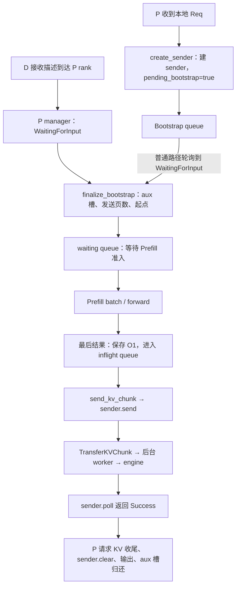
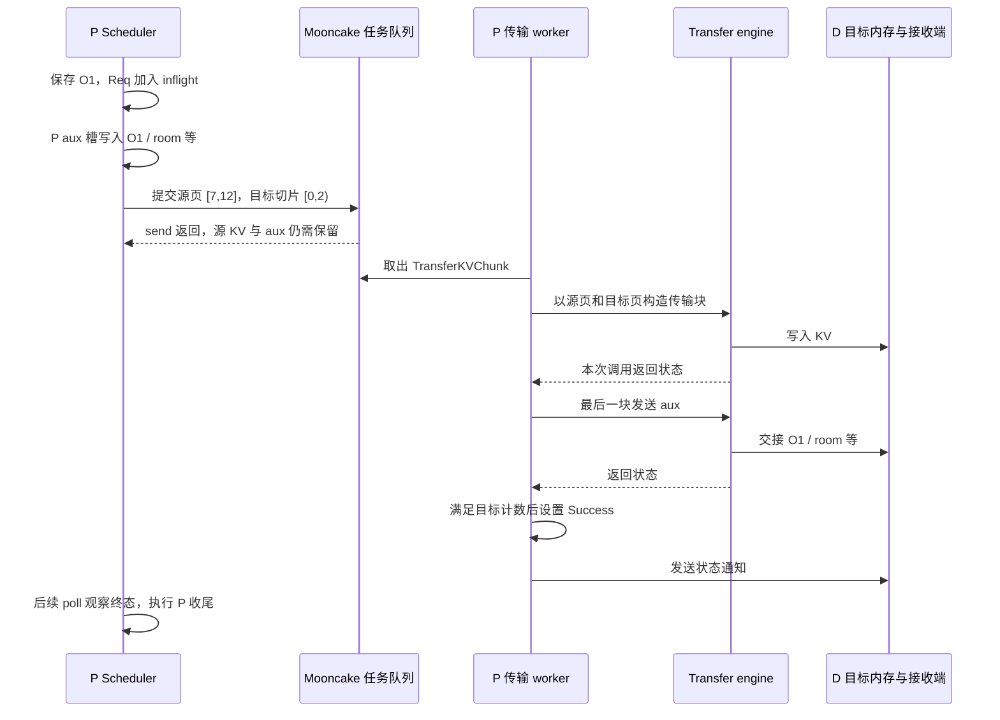
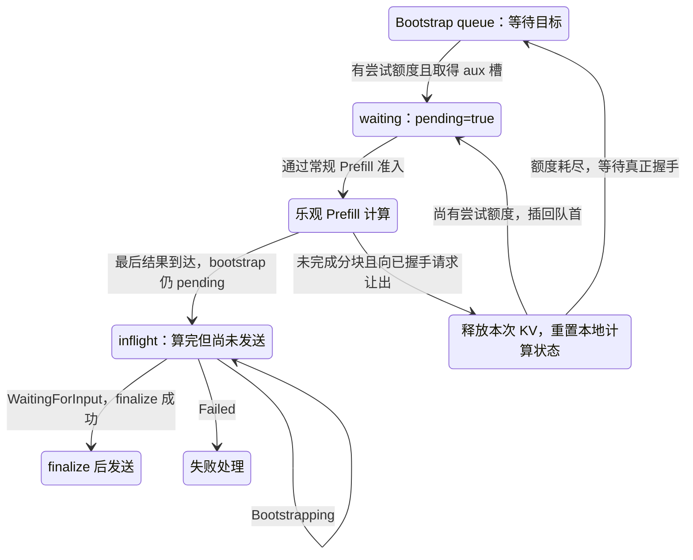

# Prefill 侧 Bootstrap 与传输状态

本文是 **07-02，源码分析型学习资料**。上一章建立了 P/D 端到端地图，本篇把镜头留在 P：**怎样知道 KV 要送到哪里，什么时候可以计算与发送，以及为什么计算结束后请求仍不能立即退场？** 阅读顺序是普通成功路径 → 分块发送 → 乐观 Prefill → 资源与异常边界。

## 0. 阅读基线与范围

| 项目 | 内容 |
| --- | --- |
| 源码路径基准 | SGLang 仓库根目录 `.`；所有源码位置使用仓内相对路径 |
| 分支 | `codex/sglang-source-study-20260909`，基于官方 `main` |
| commit | `72d5c5bb73cadd7ffbf5114e5f81e29d36b6c61a` |
| 读取日期 | `2026-09-10` |
| 源码工作区 | 学习 worktree 干净；保留原 `muxi-main` 及其 26 个未跟踪文件 |
| 文档工作区 | 保留 Wiki 原有资料；只补本系列正文、导航与滚动附录 |
| 操作边界 | 只读源码和测试定义，执行文档与独立教学算术检查；未导入 SGLang/torch、启动服务、加载模型或运行通信测试 |
| 前置 | [07-01 PD 地图](01-PD分离职责与端到端请求地图.md)、[03-04 分块调度](../03-scheduling/04-ChunkedPrefill与长请求调度.md)、[04-07 KV 生命周期](../04-kv-cache/07-KV缓存全生命周期与排障.md) |

**普通主线：** 一个 P、一个 D，两侧各 TP=1、PP=1；同一 Dense/GQA 自回归模型，模型、tokenizer、KV dtype 和 page size 对齐；普通 Mooncake 直接传输，Eager、非 Overlap、无投机。R1 输入 8 个 token，用户期望生成 3 个 token；P 本地只生成 O1，D 接续其余输出。页大小 4 只用于解释索引，不是推荐的部署参数。

首例不命中前缀、不分块，`optimistic_prefill_attempts=0`；不用 D Radix 复用、staging、HiCache/offload、统一内存池搬移、多模态、LoRA 或动态权重。后面的 R3 只增加分块；乐观例子再单独增加握手未完成时先计算。为隔离分块主线，教学条件显式关闭 `SGLANG_DISAGG_PREFILL_EARLY_SEND_CACHED_PREFIX`，第 8 节另讲该优化。**UnifiedRadix 缓存索引与 `--enable-unified-memory` 内存池机制是不同的开关与对象。**

以下固定锚点支持**源码事实**；页号、时间线与图是**整理者归纳**。外部 Mooncake engine 的设备完成语义没有因主仓源码固定而得到运行证明。跨 rank、不同 TP、staging、所有失败竞态及远端重启的完整审计分别留给 07-04—07-06，不沿用历史内部协议作证据。

## 1. 人话版：先知道交接地点，再准备货物，最后等搬运结束

可以把 P 看成先整理资料再交接的一方。但源码中的“准备好”至少有三层：

1. **交接地点准备好：** D 把目标页、aux 槽和连接身份告诉 P；P 的 sender 可以初始化。
2. **资料准备好：** Prefill 产生上下文 KV，最后一块产生首 token O1。
3. **搬运结束：** 后台传输路径报告完成，Scheduler 才结束 P 子请求并释放它持有的资源。

普通路径按这个顺序推进；乐观 Prefill 允许第 2 步先于第 1 步发生，仍不能省略第 1、3 步。**“可以计算”和“可以发送”是两个条件。**

### 1.1 四个队列/集合，不要看见 inflight 就以为是同一个对象

| 名称 | 保存什么、谁推进 | 进入/退出的含义 |
| --- | --- | --- |
| `PrefillBootstrapQueue.queue` | P Scheduler 保存的 Req 列表 | 入队后等握手；普通请求完成 sender 初始化后移入 waiting；乐观分支可以提前移出 |
| `waiting_queue` | 等待 Prefill 准入的 Req | 排队不代表已拿到本轮全部 KV 容量；下一步由常规 Prefill 准入/组批决定 |
| `disagg_prefill_inflight_queue` | 最后一块 Prefill 结果已处理的 Req | 可能在传输，也可能是乐观计算结束但还在等握手；完成/失败后移出 |
| `MooncakeKVManager.transfer_queues` | 后台消费的 `TransferKVChunk` 任务 | 一条请求可以产生多个任务；任务保存源页索引和目标切片，不复制出整份 KV 快照 |

另外，`disagg_prefill_pending_chunk_rids` 是**已提交非末块、尚未通过末块交接或退役清除的请求 ID 集合**，不是传输任务队列，也不是剩余字节计数。[S14][S18][S23][S24][S30][S45]



**图意：** 图中方框是职责或步骤，只有后台 worker 明确代表独立执行线程。D 接收描述由 P 的控制线程处理，Scheduler 在之后的轮询观察它。普通主循环每轮接收请求、处理 bootstrap、选 batch、运行/处理结果，再轮询 inflight；传输等待不靠 Scheduler 调用一个覆盖整个请求的阻塞发送函数。[S11][S15][S25]

## 2. 启动登记与逐请求握手是两件事

### 2.1 启动时登记的是长期存在的设施

`PrefillBootstrapQueue._init_kv_manager` 从本地 KV pool 取得 buffer 地址、长度、每项大小、页大小和层身份；另外取得 metadata buffers 的地址/条目长度，把这些放入 `KVArgs`。混合状态、draft KV 等有自己的附加分支，本例不展开。[S2]

公共 manager 建立 rank 的 ZMQ PULL 端点，并通过 HTTP `PUT /route` 向 Bootstrap 服务登记 rank、并行维度、page size、KV dtype 与 API port。Mooncake manager 随后取得 transfer engine，注册 KV/aux/state 内存区域，创建控制接收线程与传输队列/worker。注册内存区域会去掉相同 `(ptr, len)` 的重复项。[S3][S4][S5][S6]

| 登记内容 | 服务于哪个问题 | 生命周期 |
| --- | --- | --- |
| P rank 的 IP/port、拓扑、布局 | D 应联系哪个 rank，布局能否匹配 | 实例/rank 级 |
| 本地 KV/aux/state buffer 注册 | engine 能对哪些内存区域执行传输 | pool/engine 级；不是每来一条请求就新建整池 |
| D session 的 `decode_kv_args_table` 条目 | 某目标 session 的基地址、布局等是什么 | 连接/目标设施级 |
| `transfer_infos[room][session]` | 本次请求要写哪些目标页、哪个 aux 槽 | 请求/room 级 |

P 控制线程区分两类消息：第一项为字符串 `"None"` 的消息用于登记目标 session 的 KV 参数；带具体 room 的消息建立本次传输描述。两者不能互相替代。[S11]

### 2.2 请求到来时才创建 sender

Scheduler 的 P 分支把 Req 交给 bootstrap queue。`create_sender` 先检查输入长度不超过 P 的有效 KV token 容量；超过时生成 BAD_REQUEST 并输出错误。这个检查是**单请求静态上限**，不等于当前空闲容量足够，也不替代 PrefillAdder 的准入判断。[S1][S7][S8]

随后为该请求构造 sender，写入 `bootstrap_room`；公共 sender 记录发送游标，正常 rank 初始登记 Bootstrapping。P 把**本地** `sampling_params.max_new_tokens` 改为 1，以配合 Prefill 侧预算，并设置 `pending_bootstrap=True`。D 的用户生成上限不会因这个本地字段变化而变成 1。[S7][S9][S10]

**术语：** `pending_bootstrap` 的意思是“这份 Req 的 sender 尚未完成初始化”，不是“HTTP 请求还没到”，也不是“当前没有 GPU 工作”。乐观路径下它可以在 forward 之后仍为 True。

## 3. 从接收描述到可准入：这里有两道门

### 3.1 第一门：目标描述收齐

P 的控制线程把每个目标 session 的描述放入 `transfer_infos[room]`。数量满足 `required_dst_info_num` 时，保存 D 提供的前缀长度，并把 manager 的 room 状态更新到 `WaitingForInput`。本例只有一个目标，数量为 1。[S11]

这时 P 已知道“向哪里发送”，还没有由该状态值证明“数据已经生成”。同名的 D receiver 状态则可在连接 setup 完成后设置；**不要用 P sender 的 WaitingForInput 解释 D receiver 的同名状态**。D 的状态时间点见 [07-01](01-PD分离职责与端到端请求地图.md)。

### 3.2 第二门：本地 metadata 槽可用，sender 完成初始化

`pop_bootstrapped` 观察到 WaitingForInput 后调用 `finalize_bootstrap`。它按下面顺序工作：[S12][S13][S14]

1. 断言 `pending_bootstrap=True`：这不是可以对同一个已完成请求反复调用的幂等函数。
2. 通过 `ensure_metadata_buffer` 取得 P 的 aux 槽；已分配则复用，没有空槽则返回 False，继续等，不立即判为失败。
3. 取出 D 已有的前缀长度，写入 `start_send_idx` 和 `disagg_decode_prefix_len`。
4. 把待交接 token 数换成页数，调用 `sender.init(num_pages, metadata_buffer_index)`。
5. 最后设置 `pending_bootstrap=False`，请求才按普通路径移入 waiting。

保留最关键的关系，以下是按源码整理的**教学伪代码**：

```text
若没有 P aux 槽：留待下一次处理
start_send_idx = D 已有前缀长度
待传页数 = ceil((输入 token 数 - D 已有前缀长度) / page_size)
sender.init(待传页数, P aux index)
pending_bootstrap = false
```

`CommonKVSender.init` 的参数名叫 `num_kv_indices`，但本调用链传入的是**页数**。`curr_idx` 与 `index_slice` 随后也按页推进；只有 `Req.start_send_idx` 按 token 位置推进。索引单位来自调用者和转换函数，不能只凭变量名猜测。[S13][S21][S36][S37]

### 3.3 waiting 不是失去故障检查的空档

请求离开 bootstrap queue 后，还可能在 waiting 中等待容量。`get_next_disagg_prefill_batch_to_run` 先处理待取消分块、重置本轮 `batch_is_full`，再执行 `resolve_waiting_queue_bootstrap`，之后才处理分块续算并调用常规 `get_new_batch_prefill`。[S16]

waiting 复核会剔除 sender 已 Failed 的请求；对乐观进入 waiting、如今已经 WaitingForInput 的请求尝试 finalize。这样“离开 bootstrap queue”与“真正获得 forward 机会”之间仍有状态复核。[S17]

| 观察 | 普通路径的动作 | 不能据此声称 |
| --- | --- | --- |
| Bootstrapping | 仍在 bootstrap queue | D 无请求或网络一定故障；它也可能等本地预分配 |
| WaitingForInput，但 P aux 槽耗尽 | 留在 bootstrap queue | 一定可以立即 Prefill |
| finalize 成功 | 移入 waiting | 常规 token/请求行预算已经通过 |
| waiting 中 Failed | bootstrap failure 路径输出错误并清理 | 已被接纳的请求永远无需再核对对端 |

### 图解补充：接收位置先就绪，KV 字节后到达


[查看原尺寸](../../../images/sglang-source-study/23-pd-transfer.png)。

**图意解读：** 沿两条竖线从上往下看：D 预分配并告知目标，P 计算并发送 KV，D 收到之后才接续计算。握手和数据箭头是不同的交接。

**对应本篇源码：** 从 P 一侧阅读握手：收到接收信息与真正获准进入计算/发送并非同一步；继续按本节两道门核对。 [源码：python/sglang/srt/disaggregation/prefill.py][S8]

**来源与边界：** [Deploying DeepSeek with PD Disaggregation and Large-Scale Expert Parallelism on 96 H100 GPUs](https://www.lmsys.org/blog/2025-05-05-large-scale-ep/)，SGLang Team，2025-05-05。这是正常路径的简化时序；没有画出当前源码的队列门槛、跨 rank 检查、PREBUILT、取消和退役。收到一条通知不能单独证明可以释放或复用原地址。 [来源档案 F23](../../../images/sglang-source-study/SOURCES.md#f23)。

## 4. R1：Prefill 结束后，怎样发出最后一块

R1 的 8 个输入位置为 `[0,8)`，其中右端点不包含在范围内。设 P 请求行是 2，P aux 槽是 3；P 物理页 `[7,12]` 对应的 token 槽为 `[28,29,30,31,48,49,50,51]`。D 已给出目标页 `[3,9]` 和 D aux 槽 7。**这组号码只是教学例子，两侧页号、请求行和 aux 槽彼此不要求相等。**

### 4.1 最后结果保存 O1，不在这里继续 Decode

`process_batch_result_disagg_prefill` 在需要时等待 `copy_done`，把输出 token 转成 CPU 可处理的列表。对于已经没有中间 chunk 结果待处理的请求，先检查取消与测试钩子，再将 O1 追加到 `output_ids`，调用 `maybe_cache_unfinished_req`，加入 `disagg_prefill_inflight_queue`。sender 已初始化时才调用 `send_kv_chunk(last_chunk=True)`。[S18][S58]

P 此时生成的是**8 个输入 token 的 KV + O1 的 token ID**。O1 还没有作为下一轮输入执行 forward，因此不应把这次待传 KV 记成 9 个有效位置。P 给自己设的 max_new_tokens=1，也不等于此刻可以绕过传输直接释放 Req。

### 4.2 token 位置、物理页与目标切片怎样对齐

`send_kv_chunk` 取 `start_send_idx` 到本轮可用终点的请求位置范围；从 `req_to_token` 查出槽位；调用 allocator 的 `translate_kv_indices_for_transfer` 得到传输所需位置；再用 `kv_to_page_indices` 转成页号。如果选用具有虚拟映射的池，前面的转换不可省略。[S19][S37]

最后一块还先执行 `MetadataBuffers.set_buf(req)`，写入首 token、计数、room 等交接信息。混合模型需要的状态索引由各状态类型对应 helper 生成；本例没有这些额外状态。结果不是把整个 Python Req 序列化发送，而是发 KV 和必要的交接数据。[S19][S20]

| 层次 | R1 中的值 | 含义 |
| --- | --- | --- |
| 请求 token 范围 | `[0,8)` | 本次有效输入位置 |
| P 物理页 | `[7,12]` | 源 KV 所在页 |
| sender 页游标 | `curr_idx: 0 → 2` | 提交了两个页索引 |
| 目标描述切片 | `index_slice = [0,2)` | 从 D 的目标页列表取 `[3,9]` |
| aux 配对 | P 槽 3 → D 槽 7 | 首 token/room 等各条 aux buffer 使用两侧各自槽号 |
| Req token 游标 | `start_send_idx: 0 → 8` | 本次发送函数处理到了输入末端；不是字节完成回执 |

### 4.3 `sender.send()` 返回时，后台可能还没开始搬

公共 sender 用 `curr_idx + len(page_indices)` 形成目标切片，并用累计页数是否等于初始化的总页数判断 `is_last_chunk`。Mooncake sender 把源页、切片和最后一块的 aux/state 交给 manager；manager 按目标 session 选择传输队列，创建 `TransferKVChunk`。[S21][S22][S23][S24]

`TransferKVChunk` 保存的是**地址计算所需的索引与元数据**。它不是 GPU KV 内容的独立拷贝；原页仍是后续 engine 读取的源。因此 `start_send_idx=8`、`curr_idx=2` 和 Python `send` 返回，均不能单独证明可以复用这些页。



**图意：** 队列提交与传输调用位于不同线程。图只画本例直接 KV/aux 路径；不是在证明外部 engine 的设备完成语义。D 的状态通知、metadata gate、room 校验和 PREBUILT 仍是 D 侧的后续步骤，详见 07-01；P 的收尾不代替它们。[S25][S27][S28][S30]

## 5. 后台 worker 的完成条件与 P 收尾

### 5.1 一份任务怎样变成传输块

worker 取出任务后检查 room 是否仍存在、是否 Failed；再取本次目标描述和 session 的基地址/布局。普通相同 TP 的路径进入 `send_kvcache`，底层将同时连续的源/目标页配成块，按 buffer 的基地址和 item length 构造源地址、目标地址与字节长度，调用 `engine.batch_transfer_sync`。[S25][S26][S27]

传输组织可能按层并行提交 futures，也可能走批量块路径。成功路径在调用结果满足条件后继续；`_await_transfer_futures` 的错误分支是否等待其余任务，与 deferred release 开关有关，不能从成功路径推广为“失败后也必然没有在途写入”。这部分在 07-05 审计。[S61]

最后一块才发送 aux；有额外状态时先处理相应状态。记录的目标数量满足 `required_dst_info_num` 后，根据返回状态设置 Success/Failed，并通知 D。本例目标数量为 1。若选择 TCP aux 分支，则交接数据通过另一条控制消息路径发送，不能把本节时序不加条件地套进去。[S25][S28]

### 5.2 五个状态值不是严格必经的五站

| P sender 的状态 | 本篇应如何理解 | Scheduler 对应动作 |
| --- | --- | --- |
| `Bootstrapping=1` | 尚未取得完整目标描述，sender 可能未初始化 | 普通请求继续等；乐观请求可先计算或已算完暂存 |
| `WaitingForInput=2` | 目标描述已经具备 | bootstrap queue 尝试 finalize；inflight 中也可以暂留此状态 |
| `Transferring=3` | backend 返回的未完成传输状态 | 留在 inflight 等后续轮询 |
| `Success=4` | sender 报告本次发送结束 | 执行 P 成功收尾 |
| `Failed=0` | 当前轮询报告失败 | 进入对应阶段的失败处理 |

`process_disagg_prefill_inflight_queue` 明确同时接受 WaitingForInput 和 Transferring 作为未完成；源码中还保留“正确设置 Transferring”的 TODO。因此**不能要求日志一定先出现 3 才允许出现 4**，也不能因暂留 2 就断言后台没有传输。[S30][S56]

Mooncake sender 观察到 manager Success 时，还检查 `_staging_outstanding[room]`：若大于 0，先返回 Transferring；终态被缓存到 `conclude_state`。这个名字带 staging 的计数实际在 worker 取出任务后增加，不是在 `put` 时增加，不能当成 transfer queue 的总长度或所有未来任务数。[S25][S29]

本篇 TP/CP 都只有一个 rank。扩展到多 rank 时，P 的轮询 helper 会在相应 CPU group 做状态归约，不能用单个 rank 的 Success 当成整体成功；PP 还另有 RID 共识分支，留到 07-06。[S14][S30][S57]

### 5.3 成功收尾释放哪些东西

在普通成功路径，Scheduler 观察 Success 后依次：[S30][S31][S32][S33]

1. 非 abort 请求设置 `FINISH_LENGTH(length=0)`，表示 P 子请求收尾；它不会清掉已经保存的 O1，也不会把 D 的用户生成预算改成 0。
2. 调用 `release_kv_cache`，完成请求对 KV/请求行的所有权交接。
3. 调用 `sender.clear()`，清除相关 room 状态、目标描述等请求级记录。
4. 记录完成时间、组织 P 子请求输出。
5. 归还 P metadata 槽，把 `metadata_buffer_index` 置为 -1，从 inflight 移除 Req。

`release_kv_cache` 会进入具体缓存的结束处理，并处理请求行和多分配尾部。缓存可以保留可复用前缀，因此“释放请求的 KV 所有权”不等于“8 个输入位置立即全变成 allocator 的空闲页”。`sender.clear()` 也不会为每条请求注销整个 KV pool 的 engine 注册。

## 6. R3 分块：计算的边界与发送的边界不必相同

现在只增加分块：R3 输入 10 个 token，计算依次覆盖 `[0,4)`、`[4,8)`、`[8,10)`，page size 仍为 4，D 没有可复用前缀。假定 P 页是 `[7,12,15]`，D 页是 `[3,9,14]`；初始化总页数 `ceil(10/4)=3`。

### 6.1 普通与 Overlap 的中间块发送位置不同

本篇非 Overlap 主线在下一次选 batch 的 `process_prefill_chunk` 中检查 bootstrap 并发送已计算的非末块。Overlap 路径则把 `tmp_end_idx` 留下，在相应 `process_batch_result_disagg_prefill` 处理结果时发送，避免仅凭已排队 forward 就提交读取；最后一块仍在结果路径处理。[S18][S34]

`send_kv_chunk(last_chunk=False)` 将发送终点向下按 page size 对齐。不完整尾页留给下一次；最后一块不做这一向下截断，负责剩余范围和 aux。[S19]

| 已计算到的输入终点 | 本次调用 | 有效 token 范围 | 源页 → 目标页 | sender 页游标 | Req token 游标 |
| ---: | --- | --- | --- | --- | ---: |
| 4 | 非末块 | `[0,4)` | 7 → 3 | `0 → 1`，切片 `[0,1)` | 4 |
| 8 | 非末块 | `[4,8)` | 12 → 9 | `1 → 2`，切片 `[1,2)` | 8 |
| 10 | 末块 | `[8,10)` | 15 → 14 | `2 → 3`，切片 `[2,3)` | 10 |

最后一页只有 2 个有效输入位置，但普通按页搬运的 byte blocks 可以覆盖整页容量。`num_kv_tokens=2` 记录有效范围，不等于本路径必定只搬这两个 token 的字节。D 用请求长度决定有效位置；教学图不把尾页填充解释成新的生成 token。[S19][S23][S25][S26]

**再做一个边界检查：** 若某次非末块调用的可用终点是 6，起点为 4，则向下对齐得到 4，此次没有新页；普通 sender 的 `should_send_kv_chunk` 可跳过空非末块。最后一块即使页列表为空也允许发送，以保留 aux/结束交接的机会。这里是发送函数的输入推演，不是在声称所有调度器会产生长度为 6 的实际分块。[S19][S35]

### 6.2 为什么还需要 pending chunk 集合

非末块发送后，R3 可能还没进入最终结果的 inflight queue。调度末块时 `chunked_req` 又可能已经清空，而先前源页仍被传输任务引用。仅看“chunked_req 为空”或“inflight 为空”都覆盖不了这个窗口。[S45]

`send_kv_chunk` 非末块时加入 `disagg_prefill_pending_chunk_rids`，末块时移除；末块调用点已把请求交给 inflight 保护。显式退役或重新开始发送的路径也清除此集合。如果额外开启统一内存池搬移，P 的 move gate 要求 **inflight 与 pending chunk 集合同时为空**，以限制已暴露物理地址时的搬移。[S19][S30][S40][S45]

这是地址稳定性相关的调度边界，不是完整的异常 drain 证明，也不等于关闭了整个系统的模型计算。

## 7. 乐观 Prefill：先算、等待，或让出资源后重新排队

### 7.1 先计算仍然要先占一个 aux 槽

`optimistic_prefill_attempts` 的声明默认值是 0。设教学例子把它改为 3：当 sender 仍为 Bootstrapping，且 `prefill_attempt_count < 3`、请求不是已回撤状态时，bootstrap queue 可以先保留 metadata 槽，将计数加 1，移入 waiting，但仍保持 `pending_bootstrap=True`。[S12][S14][S49]

这个路径改变的是**等待位置和计算时机**。没有 D 目标描述时，`send_kv_chunk` 仍不能按普通已初始化路径发送。它也没有承诺每次乐观尝试都有空闲 KV 容量或一定提高 TTFT。

### 7.2 算完但握手没完成，可以停在 inflight

如果 R1 已完成 Prefill，保存 O1 并进入 inflight，但 `pending_bootstrap=True`，结果处理不发送最后一块。后续 `handle_pending_bootstrap` 有三种动作：[S18][S30][S39]

| sender 轮询结果 | 动作 | KV/metadata 怎么办 |
| --- | --- | --- |
| Bootstrapping | 返回未完成，继续停在 inflight | 已计算 KV 与保留的 metadata 槽继续持有 |
| WaitingForInput | finalize，随后发送最后一块 | 取得真实发送起点和页数，等待传输终态 |
| Failed | bootstrap failure，输出错误 | 按已持有资源执行清理 |

**不要误读为“只要计算完时没握手，就立刻释放并重算”。** 正常的整段计算结果可以等待；让出后重新排队是另一个控制分支。

### 7.3 分块时向已经握手的请求让出机会

当一个乐观长请求仍在分块、bootstrap 未完成，`process_prefill_chunk` 发现 waiting 中已有握手完成且未 abort 的请求，会清掉当前 `chunked_req`，让出续算机会。非 Overlap 立即执行 `optimistic_release_and_requeue`；Overlap 需要在结果处理路径确认被让出的块与后续在途块情况后再释放。[S34][S38][S18]



**图意：** 状态是教学上的请求位置，不是新的源码枚举。为避免重画普通路径，图省略了 waiting/分块过程中握手提前完成的边；实际源码可在这些位置 finalize。取消先于乐观回队处理，不能把 abort 当成又一次尝试。[S17][S18][S34]

### 7.4 重排队保留身份，重置计算账本

`optimistic_release_and_requeue` 先按未完成缓存处理当前结果，释放请求 KV，再 `reset_for_retract`；清空 `output_ids`、发送 token 游标、临时末端、前缀起点及相关临时状态，仍设置 pending。它不在这里重新创建 sender，也不释放已经保留的 P metadata 槽。[S40][S41]

| 调用回队函数前的尝试计数，最大为 3 | 回队动作 | 下一步 |
| ---: | --- | --- |
| 1 | 计数变 2，插入 waiting 队首 | 等常规准入，再检查握手 |
| 2 | 计数变 3，插入 waiting 队首 | 同上 |
| 3 | 进入 bootstrap queue，不再增加计数 | 等真实握手完成 |

这是沿具体回队函数推演的计数关系。一次尝试可以包含多个计算 chunk，所以“最大尝试 3”**不应解释成最多调用 GPU forward 三次**。回撤还会重置 prefix/部分 logprob 等本地状态；后续可能重新匹配缓存，不保证把之前每个 token 都重新计算一遍。[S40][S41]

该机制用于尚未完成 sender 初始化的乐观工作。不要把它当作“KV 已经向 D 发送一部分后可以随意回零重发”的通用协议。

## 8. 参数、可选优化与生命周期边界

### 8.1 本篇涉及的配置怎样读

| 配置/条件 | 固定源码里的行为 | 本篇状态 |
| --- | --- | --- |
| `optimistic_prefill_attempts` | 声明默认 0；影响提前出 bootstrap queue 与让出后的回队额度 | 主线取 0，扩展示例取 3；未实测 |
| `SGLANG_DISAGGREGATION_BOOTSTRAP_TIMEOUT` | 声明默认 300 秒；Mooncake sender 从创建时记录 `init_time`，在 Bootstrapping 轮询时检查 | 不等于“开始传输后再等 300 秒” |
| `SGLANG_DISAGGREGATION_QUEUE_SIZE` | 声明默认 4，决定 Mooncake 传输分队列数量 | 不是单请求最大 chunk 数 |
| `SGLANG_DISAGGREGATION_THREAD_POOL_SIZE` | 未设置时按 CPU 数推导；要求线程池配置值不小于队列数 | 不是任意机器恒定的线程数 |
| `SGLANG_DISAGG_PREFILL_EARLY_SEND_CACHED_PREFIX` | 声明默认 True；存在可用设备前缀且 sender 已初始化时提前发送 | 本篇主线显式关闭，下面只读其边界 |
| `SGLANG_TEST_FORCE_OPTIMISTIC_PREFILL_RETRY_PROB` | 默认 0；按 rid 哈希选择测试请求，且受尝试次数/回撤条件约束 | 测试注入，不作为生产重试策略 |
| staging / 多 rank / 不同 TP / 混合状态 | 增加网格、复制/切片、额外状态及完成条件 | 未纳入本篇普通传输证明 |

配置来源与生效点分别见 [S5][S48][S49][S55][S62]。这里没有提供或执行未经环境核对的部署命令。

### 8.2 提前发缓存前缀还需要检查具体 backend

`maybe_send_cached_prefix_chunk` 只选择设备驻留部分，排除 `host_hit_length`，检查页对齐及是否超过已发送游标。Overlap 时，它记录 forward stream 的 CUDA event，并写入 sender 的 `_early_send_wait_event`。[S46]

**本次静态核对发现的证据边界：** MoRI sender 明确取出该字段并作为 `wait_event` 交给任务；本篇读取的 Mooncake `send`、任务构造与 worker 路径没有同样接入该字段。因此不能仅凭公共 helper 的 event 注释，宣称所有 backend 已建立了相同的 early-send 依赖。本篇没有对该组合做运行复现或判定实际错误触发条件；后端比较在 07-04 继续，主线关闭这项优化以保持说明范围明确。[S22][S23][S25][S47]

### 8.3 请求退场不等于所有 buffer 一起销毁

| 对象/状态 | 谁持有 | 正常释放/结束条件 | 必须保留的限制 |
| --- | --- | --- | --- |
| P Req 与输出 O1 | Scheduler 队列、batch、结果路径 | P 子请求完成或按所在阶段处理失败 | O1 已存在不代表目标 KV 到达 |
| 请求行、KV 槽与前缀锁 | Req、allocator、具体 cache | 成功传输后 `release_kv_cache` 交接请求所有权 | cache 可继续保留页，不能把释放函数名当成全部空闲 |
| P metadata 槽 | metadata allocator 与 Req | 完成输出组织后归还；bootstrap failure 另有清理 | 乐观回队保留该槽；不能提前覆盖仍待发送的 aux |
| sender 与 room 描述 | Req、公共/后端 manager | 成功路径 clear 请求记录 | 不等于注销整个 buffer 或关闭 engine |
| `TransferKVChunk` | 后台队列/worker | worker 消费并处理该任务 | 索引存活不等于源 KV 内容被复制保护 |
| pending chunk 集合 | Scheduler | 末块交给 inflight，或显式退役/重试清除 | 不是字节完成计数 |
| pool 的注册区域 | manager/engine | 内存占用释放等专门路径注销 | 生命周期跨多条请求，不随每条 P HTTP 响应销毁 |

这张表给出正常路径和已读清理点的责任，不构成跨设备异常安全证明。尤其 `sender.clear`、取消通知返回和局部 Failed 都不能单独作为 DMA 已排空的证据。[S6][S24][S30][S31][S32][S33][S40][S44]

## 9. 从现象回到代码

| 现象 | 先区分什么 | 回查入口与条件 |
| --- | --- | --- |
| P 请求长时间停在 bootstrap | 目标描述尚未收齐，还是 P aux 槽不可用 | `start_prefill_thread`、`ensure_metadata_buffer`、`pop_bootstrapped` [S11][S12][S14] |
| 已离开 bootstrap，但一直没算 | 普通 waiting 准入与对端状态 | `resolve_waiting_queue_bootstrap`、`get_new_batch_prefill` 调用点 [S16][S17] |
| P 算完了，D 没收到 KV | 是否 `pending_bootstrap=True` 而停在 inflight | `handle_pending_bootstrap` [S30][S39] |
| token 游标到末尾但请求没返回 | 已提交与传输完成分开；核查 worker、aux、目标计数 | `add_transfer_request`、`transfer_worker`、`sender.poll` [S23][S25][S29] |
| 状态长期显示 WaitingForInput | 该 backend 是否一定设置 Transferring；任务是否在执行 | inflight 未完成分支和 worker，而非只读枚举名 [S25][S30] |
| 分块后统一内存整理持续不能进行 | inflight/pending chunk 是否仍有引用或未清除条目 | move gate 与退役清除路径 [S40][S44][S45] |
| 乐观长请求反复进入 waiting | 是否向已握手请求让出；计数与测试注入分别记录 | `process_prefill_chunk`、回队函数、`should_force_retry` [S34][S40][S62] |
| bootstrap timeout | 从 sender 创建时间算起；只在相应状态检查 | `_check_bootstrap_timeout` [S55]，不要直接推断网络传输速度慢 |
| 已取消的晚到结果还在处理 | 是否仍有 KV/Mamba/metadata 所有权，是否还有在途计算结果 | `_retire_aborted_prefill_result` 与中间块分支 [S18][S44] |
| 传输失败后资源是否安全复用 | 区分 P 本地清理与所有在途写入退役 | `handle_inflight_transfer_failure`、future 错误分支 [S43][S61]；完整审计留到 07-05 |

`handle_bootstrap_failure` 会按实际持有状态释放请求 KV、归还 metadata、清 pending 并输出错误；最后结果的 abort 处理先确认是否仍拥有资源，避免已退役请求的晚到结果重复释放。取消与失败清理位置不同，不能概括成一个统一的“失败时全部 clear”。[S42][S44]

## 10. 源码阅读顺序、练习与证据范围

### 10.1 用相对路径回到真实代码

| 顺序 | 问题 | 仓内路径与符号 |
| --- | --- | --- |
| 1 | 请求进哪条队列 | `python/sglang/srt/managers/scheduler.py::Scheduler._add_request_to_queue` [S1] |
| 2 | sender、aux 槽和握手各何时建立 | `python/sglang/srt/disaggregation/prefill.py::PrefillBootstrapQueue.create_sender`、`python/sglang/srt/disaggregation/prefill.py::PrefillBootstrapQueue.finalize_bootstrap` [S7][S13] |
| 3 | D 描述如何让 P 状态改变 | `python/sglang/srt/disaggregation/mooncake/conn.py::MooncakeKVManager.start_prefill_thread` [S11] |
| 4 | 循环、waiting 复核与结果交接 | `python/sglang/srt/disaggregation/prefill.py::SchedulerDisaggregationPrefillMixin.event_loop_normal_disagg_prefill`、`python/sglang/srt/disaggregation/prefill.py::SchedulerDisaggregationPrefillMixin.process_batch_result_disagg_prefill` [S15][S18] |
| 5 | token 范围转页、页游标和任务提交 | `python/sglang/srt/disaggregation/prefill.py::SchedulerDisaggregationPrefillMixin.send_kv_chunk`、`python/sglang/srt/disaggregation/common/conn.py::CommonKVSender._prepare_send_indices` [S19][S21] |
| 6 | 后台字节搬运与终态 | `python/sglang/srt/disaggregation/mooncake/conn.py::MooncakeKVManager.transfer_worker`、`python/sglang/srt/disaggregation/mooncake/conn.py::MooncakeKVSender.poll` [S25][S29] |
| 7 | P 结束与资源交接 | `python/sglang/srt/disaggregation/prefill.py::SchedulerDisaggregationPrefillMixin.process_disagg_prefill_inflight_queue` [S30] |
| 8 | 乐观分支什么时候等待/回队 | `python/sglang/srt/disaggregation/prefill.py::SchedulerDisaggregationPrefillMixin.process_prefill_chunk`、`python/sglang/srt/disaggregation/prefill.py::SchedulerDisaggregationPrefillMixin.optimistic_release_and_requeue` [S34][S40] |

### 10.2 练习与参考答案

1. **P 收到目标描述，但没有空 aux 槽，应进 waiting 吗？** 普通路径不进；finalize 返回 False，仍等本地槽位。目标描述就绪与本地准入条件分开。
2. **R3 最后只剩 2 个 token，sender 的游标增加多少？** 增加 1 页，最终 `curr_idx=3`；Req 的 token 游标从 8 到 10。有效 token 数与按页传输容量分开。
3. **乐观 R1 算完后仍 Bootstrapping，是否立即回队重算？** 不一定；正常完整结果停在 inflight，保留 KV/aux 等握手。分块让出和测试注入才会进入列明的回队路径。
4. **最大尝试 3，当前计数为 3，再让出后到哪里？** 回 bootstrap queue 等真实握手；这不是“总共只执行了三次 GPU kernel”的计数。
5. **P `send` 返回、`start_send_idx=10`、inflight 尚未 Success，可以按这两个字段覆盖源页吗？** 不可以；它们是提交侧进度，源页仍可能被后台读取，还要遵循传输终态与资源生命周期。
6. **公共 helper 记录 CUDA event，是否证明 Mooncake early-send 已等待该 event？** 不证明；必须追 backend 对 event 的接收和等待，本篇只确认了 MoRI 的显式传递点。

### 10.3 已读测试与没有做的验证

| 测试入口 | 本次静态确认的断言/设置 | 证据限制 |
| --- | --- | --- |
| `test/registered/disaggregation/test_disaggregation_optimistic_prefill.py` 的 setup 与 `TestOptimisticPrefill.test_logprob` | 配置尝试 3、chunk 128 和强制 retry 注入；检查 retry counter 增加、输出 logprob 长度及输入 logprob 完整度 | CUDA 双卡 fixture；这里只阅读，没有执行，也未测得优化收益 [S50][S51] |
| 同文件 `TestOptimisticPrefillFailure.test_survive_requests` | 发出一批并发请求并捕获 future 异常，等待内存检查 | 不能解读成每条请求都成功，更不是逐条输出正确性断言 [S52] |
| `test/registered/unit/disaggregation/test_prefill_abort_result_cleanup.py` | 模拟末块/中间块、已退役晚到结果、sender abort 异常及 grammar 拒绝；检查局部 release/send/输出调用 | mock 和 CPU tensor 不能证明真实 RDMA drain；这里只阅读列明测试 [S53][S54] |

本篇完成的是源码段落复核、固定 commit 的路径/符号锚点、Markdown 导航与结构检查，以及 R1/R3 页映射、分块边界和尝试计数的独立教学算术。Mermaid 与源码逐步静态对照，未运行渲染器。没有实际网关、P/D、GPU forward、外部 engine、网络故障、并发槽位复用或性能测试。

验收时应能画出 **Req → sender → TransferKVChunk → worker → engine** 的交接，并分别指出 KV、aux、room 状态和请求行什么时候仍被持有。下一篇 [07-03《Decode 侧预分配、接收与就绪》](03-Decode侧预分配接收与就绪.md)继续从 D 的目标分配走到模型可读条件。

返回[系列目录](../README.md)，或回看[07-01 PD 端到端地图](01-PD分离职责与端到端请求地图.md)。

[S1]: https://github.com/sgl-project/sglang/blob/72d5c5bb73cadd7ffbf5114e5f81e29d36b6c61a/python/sglang/srt/managers/scheduler.py#L3148
[S2]: https://github.com/sgl-project/sglang/blob/72d5c5bb73cadd7ffbf5114e5f81e29d36b6c61a/python/sglang/srt/disaggregation/prefill.py#L206
[S3]: https://github.com/sgl-project/sglang/blob/72d5c5bb73cadd7ffbf5114e5f81e29d36b6c61a/python/sglang/srt/disaggregation/common/conn.py#L147
[S4]: https://github.com/sgl-project/sglang/blob/72d5c5bb73cadd7ffbf5114e5f81e29d36b6c61a/python/sglang/srt/disaggregation/common/conn.py#L791
[S5]: https://github.com/sgl-project/sglang/blob/72d5c5bb73cadd7ffbf5114e5f81e29d36b6c61a/python/sglang/srt/disaggregation/mooncake/conn.py#L211
[S6]: https://github.com/sgl-project/sglang/blob/72d5c5bb73cadd7ffbf5114e5f81e29d36b6c61a/python/sglang/srt/disaggregation/mooncake/conn.py#L325
[S7]: https://github.com/sgl-project/sglang/blob/72d5c5bb73cadd7ffbf5114e5f81e29d36b6c61a/python/sglang/srt/disaggregation/prefill.py#L337
[S8]: https://github.com/sgl-project/sglang/blob/72d5c5bb73cadd7ffbf5114e5f81e29d36b6c61a/python/sglang/srt/disaggregation/prefill.py#L405
[S9]: https://github.com/sgl-project/sglang/blob/72d5c5bb73cadd7ffbf5114e5f81e29d36b6c61a/python/sglang/srt/disaggregation/prefill.py#L415
[S10]: https://github.com/sgl-project/sglang/blob/72d5c5bb73cadd7ffbf5114e5f81e29d36b6c61a/python/sglang/srt/disaggregation/common/conn.py#L1201
[S11]: https://github.com/sgl-project/sglang/blob/72d5c5bb73cadd7ffbf5114e5f81e29d36b6c61a/python/sglang/srt/disaggregation/mooncake/conn.py#L2120
[S12]: https://github.com/sgl-project/sglang/blob/72d5c5bb73cadd7ffbf5114e5f81e29d36b6c61a/python/sglang/srt/disaggregation/prefill.py#L364
[S13]: https://github.com/sgl-project/sglang/blob/72d5c5bb73cadd7ffbf5114e5f81e29d36b6c61a/python/sglang/srt/disaggregation/prefill.py#L374
[S14]: https://github.com/sgl-project/sglang/blob/72d5c5bb73cadd7ffbf5114e5f81e29d36b6c61a/python/sglang/srt/disaggregation/prefill.py#L422
[S15]: https://github.com/sgl-project/sglang/blob/72d5c5bb73cadd7ffbf5114e5f81e29d36b6c61a/python/sglang/srt/disaggregation/prefill.py#L612
[S16]: https://github.com/sgl-project/sglang/blob/72d5c5bb73cadd7ffbf5114e5f81e29d36b6c61a/python/sglang/srt/disaggregation/prefill.py#L586
[S17]: https://github.com/sgl-project/sglang/blob/72d5c5bb73cadd7ffbf5114e5f81e29d36b6c61a/python/sglang/srt/disaggregation/prefill.py#L544
[S18]: https://github.com/sgl-project/sglang/blob/72d5c5bb73cadd7ffbf5114e5f81e29d36b6c61a/python/sglang/srt/disaggregation/prefill.py#L701
[S19]: https://github.com/sgl-project/sglang/blob/72d5c5bb73cadd7ffbf5114e5f81e29d36b6c61a/python/sglang/srt/disaggregation/prefill.py#L1234
[S20]: https://github.com/sgl-project/sglang/blob/72d5c5bb73cadd7ffbf5114e5f81e29d36b6c61a/python/sglang/srt/disaggregation/utils.py#L479
[S21]: https://github.com/sgl-project/sglang/blob/72d5c5bb73cadd7ffbf5114e5f81e29d36b6c61a/python/sglang/srt/disaggregation/common/conn.py#L1299
[S22]: https://github.com/sgl-project/sglang/blob/72d5c5bb73cadd7ffbf5114e5f81e29d36b6c61a/python/sglang/srt/disaggregation/mooncake/conn.py#L2478
[S23]: https://github.com/sgl-project/sglang/blob/72d5c5bb73cadd7ffbf5114e5f81e29d36b6c61a/python/sglang/srt/disaggregation/mooncake/conn.py#L2328
[S24]: https://github.com/sgl-project/sglang/blob/72d5c5bb73cadd7ffbf5114e5f81e29d36b6c61a/python/sglang/srt/disaggregation/common/utils.py#L18
[S25]: https://github.com/sgl-project/sglang/blob/72d5c5bb73cadd7ffbf5114e5f81e29d36b6c61a/python/sglang/srt/disaggregation/mooncake/conn.py#L1759
[S26]: https://github.com/sgl-project/sglang/blob/72d5c5bb73cadd7ffbf5114e5f81e29d36b6c61a/python/sglang/srt/disaggregation/mooncake/conn.py#L650
[S27]: https://github.com/sgl-project/sglang/blob/72d5c5bb73cadd7ffbf5114e5f81e29d36b6c61a/python/sglang/srt/disaggregation/mooncake/conn.py#L641
[S28]: https://github.com/sgl-project/sglang/blob/72d5c5bb73cadd7ffbf5114e5f81e29d36b6c61a/python/sglang/srt/disaggregation/mooncake/conn.py#L1217
[S29]: https://github.com/sgl-project/sglang/blob/72d5c5bb73cadd7ffbf5114e5f81e29d36b6c61a/python/sglang/srt/disaggregation/mooncake/conn.py#L2512
[S30]: https://github.com/sgl-project/sglang/blob/72d5c5bb73cadd7ffbf5114e5f81e29d36b6c61a/python/sglang/srt/disaggregation/prefill.py#L918
[S31]: https://github.com/sgl-project/sglang/blob/72d5c5bb73cadd7ffbf5114e5f81e29d36b6c61a/python/sglang/srt/disaggregation/common/conn.py#L1360
[S32]: https://github.com/sgl-project/sglang/blob/72d5c5bb73cadd7ffbf5114e5f81e29d36b6c61a/python/sglang/srt/mem_cache/common.py#L238
[S33]: https://github.com/sgl-project/sglang/blob/72d5c5bb73cadd7ffbf5114e5f81e29d36b6c61a/python/sglang/srt/disaggregation/prefill.py#L121
[S34]: https://github.com/sgl-project/sglang/blob/72d5c5bb73cadd7ffbf5114e5f81e29d36b6c61a/python/sglang/srt/disaggregation/prefill.py#L1152
[S35]: https://github.com/sgl-project/sglang/blob/72d5c5bb73cadd7ffbf5114e5f81e29d36b6c61a/python/sglang/srt/disaggregation/common/conn.py#L1275
[S36]: https://github.com/sgl-project/sglang/blob/72d5c5bb73cadd7ffbf5114e5f81e29d36b6c61a/python/sglang/srt/mem_cache/common.py#L46
[S37]: https://github.com/sgl-project/sglang/blob/72d5c5bb73cadd7ffbf5114e5f81e29d36b6c61a/python/sglang/srt/mem_cache/common.py#L42
[S38]: https://github.com/sgl-project/sglang/blob/72d5c5bb73cadd7ffbf5114e5f81e29d36b6c61a/python/sglang/srt/disaggregation/prefill.py#L579
[S39]: https://github.com/sgl-project/sglang/blob/72d5c5bb73cadd7ffbf5114e5f81e29d36b6c61a/python/sglang/srt/disaggregation/prefill.py#L1121
[S40]: https://github.com/sgl-project/sglang/blob/72d5c5bb73cadd7ffbf5114e5f81e29d36b6c61a/python/sglang/srt/disaggregation/prefill.py#L1431
[S41]: https://github.com/sgl-project/sglang/blob/72d5c5bb73cadd7ffbf5114e5f81e29d36b6c61a/python/sglang/srt/managers/schedule_batch.py#L1815
[S42]: https://github.com/sgl-project/sglang/blob/72d5c5bb73cadd7ffbf5114e5f81e29d36b6c61a/python/sglang/srt/disaggregation/prefill.py#L1092
[S43]: https://github.com/sgl-project/sglang/blob/72d5c5bb73cadd7ffbf5114e5f81e29d36b6c61a/python/sglang/srt/disaggregation/prefill.py#L1025
[S44]: https://github.com/sgl-project/sglang/blob/72d5c5bb73cadd7ffbf5114e5f81e29d36b6c61a/python/sglang/srt/disaggregation/prefill.py#L1063
[S45]: https://github.com/sgl-project/sglang/blob/72d5c5bb73cadd7ffbf5114e5f81e29d36b6c61a/python/sglang/srt/disaggregation/utils.py#L144
[S46]: https://github.com/sgl-project/sglang/blob/72d5c5bb73cadd7ffbf5114e5f81e29d36b6c61a/python/sglang/srt/disaggregation/prefill.py#L1195
[S47]: https://github.com/sgl-project/sglang/blob/72d5c5bb73cadd7ffbf5114e5f81e29d36b6c61a/python/sglang/srt/disaggregation/mori/conn.py#L1643
[S48]: https://github.com/sgl-project/sglang/blob/72d5c5bb73cadd7ffbf5114e5f81e29d36b6c61a/python/sglang/srt/environ.py#L668
[S49]: https://github.com/sgl-project/sglang/blob/72d5c5bb73cadd7ffbf5114e5f81e29d36b6c61a/python/sglang/srt/arg_groups/fields/disagg.py#L28
[S50]: https://github.com/sgl-project/sglang/blob/72d5c5bb73cadd7ffbf5114e5f81e29d36b6c61a/test/registered/disaggregation/test_disaggregation_optimistic_prefill.py#L64
[S51]: https://github.com/sgl-project/sglang/blob/72d5c5bb73cadd7ffbf5114e5f81e29d36b6c61a/test/registered/disaggregation/test_disaggregation_optimistic_prefill.py#L110
[S52]: https://github.com/sgl-project/sglang/blob/72d5c5bb73cadd7ffbf5114e5f81e29d36b6c61a/test/registered/disaggregation/test_disaggregation_optimistic_prefill.py#L178
[S53]: https://github.com/sgl-project/sglang/blob/72d5c5bb73cadd7ffbf5114e5f81e29d36b6c61a/test/registered/unit/disaggregation/test_prefill_abort_result_cleanup.py#L143
[S54]: https://github.com/sgl-project/sglang/blob/72d5c5bb73cadd7ffbf5114e5f81e29d36b6c61a/test/registered/unit/disaggregation/test_prefill_abort_result_cleanup.py#L126
[S55]: https://github.com/sgl-project/sglang/blob/72d5c5bb73cadd7ffbf5114e5f81e29d36b6c61a/python/sglang/srt/disaggregation/common/conn.py#L1341
[S56]: https://github.com/sgl-project/sglang/blob/72d5c5bb73cadd7ffbf5114e5f81e29d36b6c61a/python/sglang/srt/disaggregation/base/conn.py#L100
[S57]: https://github.com/sgl-project/sglang/blob/72d5c5bb73cadd7ffbf5114e5f81e29d36b6c61a/python/sglang/srt/disaggregation/utils.py#L249
[S58]: https://github.com/sgl-project/sglang/blob/72d5c5bb73cadd7ffbf5114e5f81e29d36b6c61a/python/sglang/srt/mem_cache/common.py#L145
[S61]: https://github.com/sgl-project/sglang/blob/72d5c5bb73cadd7ffbf5114e5f81e29d36b6c61a/python/sglang/srt/disaggregation/mooncake/conn.py#L907
[S62]: https://github.com/sgl-project/sglang/blob/72d5c5bb73cadd7ffbf5114e5f81e29d36b6c61a/python/sglang/srt/disaggregation/prefill.py#L100
