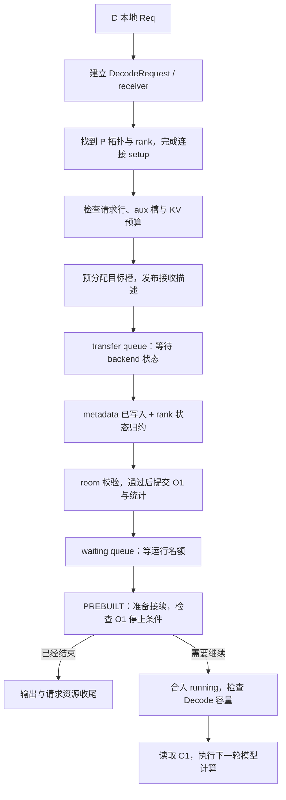
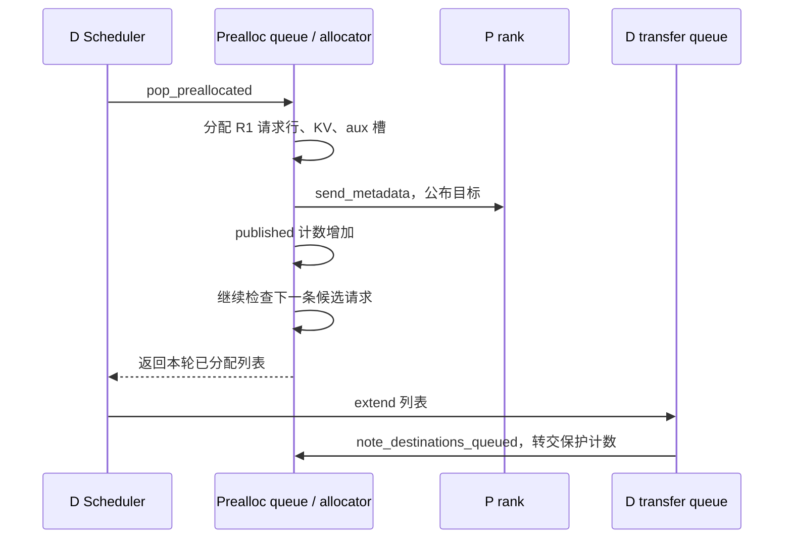
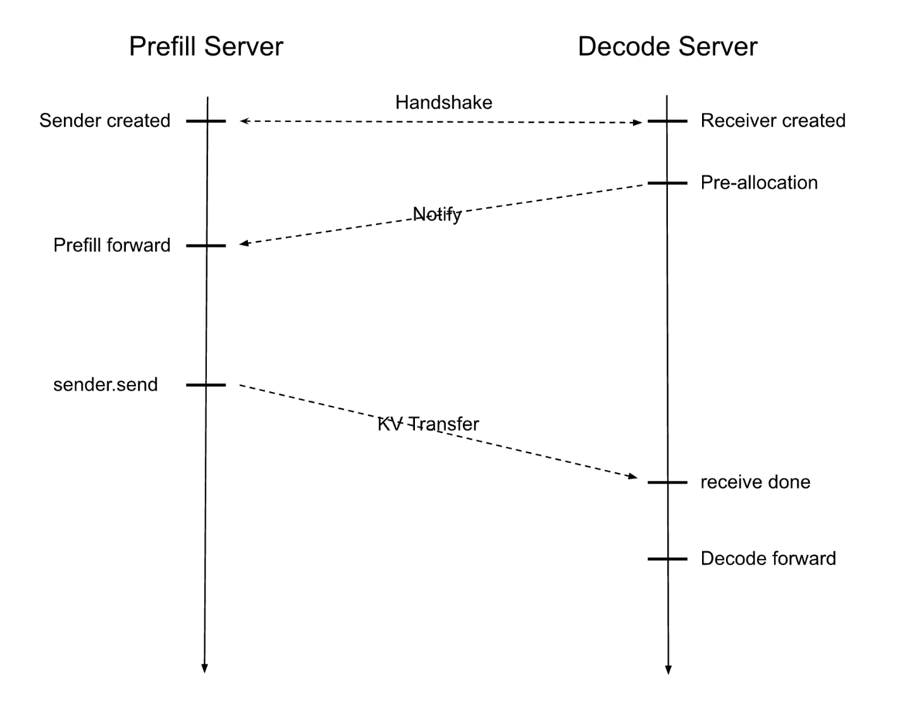
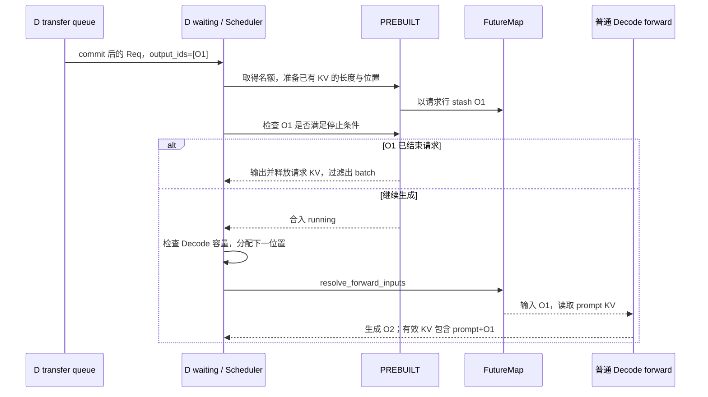
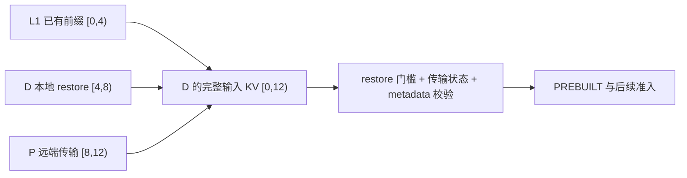

# Decode 侧预分配、接收与就绪

本文是 **07-03，源码分析型学习资料**。本篇回答：**D 怎样为 P 准备目标空间，怎样确认交接属于当前请求，又怎样把 P 生成的首 token 接进自己的 Decode 循环？** 核心是区分“登记了位置”“传输路径报告成功”“请求可以进入下一次模型计算”这三层状态。

## 0. 阅读基线与范围

| 项目 | 内容 |
| --- | --- |
| 源码路径基准 | SGLang 仓库根目录 `.`；全部源码位置使用仓内相对路径 |
| 分支 | `codex/sglang-source-study-20260909`，基于官方 `main` |
| commit | `72d5c5bb73cadd7ffbf5114e5f81e29d36b6c61a` |
| 读取日期 | `2026-09-10` |
| 源码工作区 | 学习 worktree 干净；保留原 `muxi-main` 及 26 个未跟踪文件 |
| 文档工作区 | 保留 Wiki 已有资料；只补当前正文、必要导航与滚动附录 |
| 操作边界 | 只读源码与测试定义，执行文档及独立教学算术检查；未导入 SGLang/torch、启动服务、运行模型或通信测试 |
| 前置 | [07-01 PD 地图](01-PD分离职责与端到端请求地图.md)、[07-02 P 侧握手与发送](02-Prefill侧Bootstrap与传输状态.md)、[04-01 请求行与物理槽](../04-kv-cache/01-请求视图物理槽位与分配器.md)、[02-04 Prefill/Decode 接续](../02-request-lifecycle/04-一次Prefill到多轮Decode.md) |

**普通主线：** 一个 P、一个 D，两侧 TP=1、PP=1，其他并行维度不扩展；同一 Dense/GQA 模型、tokenizer、KV dtype 和 page size。普通 Mooncake 直接传输，Eager、非 Overlap、无投机、无 grammar。R1 输入 8 个 token，用户最多生成 3 个 token；P 产生 O1，D 继续产生 O2、O3。

先关闭 D Radix 复用、HiCache、HiSparse、offload、staging、统一内存池搬移与动态权重更新，使用新请求的正常交接；后文分别增加缓存、Overlap 和异常边界。page size=4、页号和容量是**教学条件**，不是启动参数建议。默认 D 缓存选择与可选规则在第 8 节核对。

固定源码锚点支持**源码事实**；例子、图和预算推导属于**整理者归纳**。本篇说明源码采用的放行条件，不把它们当成已经实测的设备内存可见性、跨 rank 故障安全或性能结果。

## 1. 人话版：D 先准备接收地址，之后还要检查交接并安排计算

接到一条生成请求时，D 不能立刻计算 O2，因为它还没有 prompt 的 KV，也还不知道 P 算出的 O1。它要先为本次交接保留空间，把目标告诉 P，再等传输和元数据准备好。

即使 KV 已经到达，D 仍可能没有运行名额；即使拿到了运行名额，O1 也可能已经命中停止条件。**接收完成、加入运行 batch、执行下一次 forward，分别由不同步骤决定。**

### 1.1 六道检查先放在地图上



**图意：** 方框是步骤/组件，不是一框一个进程。P 把数据写进 D 的目标 pool，D Scheduler 通过 receiver 与交接 metadata 观察进展；KV 不需要先复制进 `DecodeRequest` 这个 Python 对象。普通 D 循环依次处理请求、接收队列、组批、forward 与结果。[S1][S14][S34][S36][S41]

## 2. 请求行、KV 页和交接槽：三份资源各记各的账

### 2.1 哪个对象放在哪个队列

| 对象/容器 | 保存什么 | 何时离开 |
| --- | --- | --- |
| `Req` | 逻辑输入、输出、停止状态、请求行与 KV 长度等 | 请求最终完成或按所在阶段失败退役 |
| `DecodeRequest` | Req、receiver、握手标志、D metadata 槽及可选 restore 信息 | 正常交接完成后，后续调度使用其中的 Req |
| `DecodePreallocQueue.queue` | 等握手或等目标预分配的 DecodeRequest | 目标发布后进入 transfer；失败时移除 |
| `pending_reqs` | P 信息/DP rank 尚待解析的 DecodeRequest 引用 | 解析完成或失败时移除；不是复制出另一条业务请求 |
| `DecodeTransferQueue.queue` | 目标已分配、等待传输/校验的 DecodeRequest | 正常 commit 后返回 Req；失败可能立即清理或转到延迟释放列表 |
| Scheduler `waiting_queue` | 已完成交接、等待 PREBUILT 准入的 Req | 有运行名额后进入接续处理 |

同一个 DecodeRequest 可以同时被 prealloc queue 和 `pending_reqs` 引用。失败清理按对象身份从两个列表移除，不能因为移除了一个列表的条目就认为另一份引用自动消失。[S2][S6][S7][S9][S14]

**容易混淆的字段：** P 用 `Req.metadata_buffer_index` 保存自己的 aux 槽；这里 D 的槽位保存在 **`DecodeRequest.metadata_buffer_index`**。两侧槽号不要求相等，都是各自 allocator 分配的本地编号。

### 2.2 extra slots 扩展的是请求行，不是物理 KV 容量

普通 `DecodeReqToTokenPool` 建立 `(size + pre_alloc_size + 1, max_context_len)` 的位置表；第 0 行用于 padding，可分配行从 1 开始。`alloc` 选空闲行、写入 `req_pool_idx` 并增加该行的 generation；复用已有请求行的路径有单独检查。[S3][S4]

用一组独立的教学容量：`size=4`、`pre_alloc_size=2`。位置表有 **7 行，其中 6 行可以分配给请求**。随后 PREBUILT 仍用 `min(req_to_token_pool.size, max_running_requests)` 限制运行 batch；假设 max_running_requests=4，就不会因为有 6 行位置表而同时运行 6 条请求。[S37]

metadata buffers 另由 Scheduler 建立，普通模型采用 `req_to_token_pool.size * 2` 的槽数；MiniMax sparse 有不同倍数。本例 size=4 时普通 metadata 池有 8 个槽。**额外请求行、metadata 槽与 KV token 容量并不是同一个数。**[S5]

| 资源 | 本例 | 多了这份资源是否就一定能接纳请求 |
| --- | ---: | --- |
| 可分配请求行 | 6 | 还需要 metadata 槽和 KV 预算 |
| 普通 metadata 槽 | 8 | 还需要请求行和 KV 预算 |
| 最大运行请求 | 4 | 限制同时接入 running 的数量，不直接表示目标预分配总量 |
| 物理 KV token 容量 | 独立由 KV pool 决定 | 不会被 extra slots 自动乘大 |

`schedulable_token_capacity` 对普通 DecodeReqToTokenPool 直接返回传入的物理容量。相关单测也只确认这层契约，不是在证明真实模型可承载多少请求。[S3][S57][S58]

## 3. 找到 P：D 的 WaitingForInput 仍早于目标发布

`DecodePreallocQueue.add` 对新请求先做输入容量上限检查，创建 receiver 和 DecodeRequest 并加入 queue，再尝试解析 P 的 DP rank。[S6][S7]

- 若已缓存 P 拓扑，且请求明确指定 P DP rank，使用指定值。
- P 的 DP size=1 时使用 rank 0；本篇走这条代表路径。
- 多 DP 还可按 room 映射或查询；找不到足够信息时，加入 `pending_reqs`，由后续批量解析推进。

以上选择来自 `_resolve_prefill_dp_rank` 和 `_resolve_pending_reqs`，不是 HTTP Gateway 的 worker 负载选择。[S8][S9]

### 3.1 拓扑信息必须与本地布局相容

`try_ensure_parallel_info` 在缓存未命中时向 P Bootstrap 的 `/route` 查询拓扑，并检查已提供的 page size、KV dtype；不匹配时抛出错误。它还推导 rank 映射与需要等待的 P 响应数量。相同 TP、CP=1、PP=1 的本例，一个 D rank 需要一个 P rank 的交接结果。[S11]

要注意注释和实际调用的区别：这个函数虽被描述成一次 non-blocking ensure，但冷路径实际调用 `requests.get(..., timeout=5)`。`_ensure_prefill_info` 做重试间隔与次数控制，不意味着每次 Scheduler 调用都立即返回，也不能把“最多 15 次尝试”换算成固定 15 秒期限。[S10][S11]

### 3.2 receiver setup 不等于 P 已知道目标页

receiver `init` 用已得到的拓扑建立 bootstrap/rank 连接，保存 `required_prefill_response_num` 等信息，并设置 **D receiver 的 WaitingForInput**。`_update_handshake_waiters` 观察到它后，设置 `decode_req.waiting_for_input=True`，允许进入目标预分配检查。[S12][S13]

P 侧同名状态则是在收到 D 的逐请求目标描述后出现，时间点更晚，见 [07-02](02-Prefill侧Bootstrap与传输状态.md)。因此不能从 D 的 `waiting_for_input=True` 推出“P 已收到本次页列表”，更不能推出“KV 已写入”。

## 4. 准入预算：给正在生成和未来接续留下空间

### 4.1 先区分上限检查、预算检查与真实分配

输入长度不超过全池容量，只说明单条请求没有越过静态上限。真正预分配时，`pop_preallocated` 还检查握手、空闲请求行、metadata 槽和 KV 预算。启用优先级时先排序；默认遍历中，未握手请求可以跳过，但遇到当前候选的资源不足会 `break`，并非总会继续寻找后面的短请求。[S6][S14]

源码中的保留预算，是为了让已接纳请求有机会继续生成，避免资源全被尚在传输、不能按普通 running 路径回撤的请求占住。它没有为用户的所有未来输出一次性分配完整物理 KV。

### 4.2 一个受条件限制的预算公式

以下只对应**普通 Dense、无 D Radix、无 HiCache/HiSparse/SWA、无 retracted 请求、last_batch 不是 PREBUILT**的代表路径。令：

| 记号 | 来源 | 单位 |
| --- | --- | --- |
| `F` | allocator 当前 available_size | token 容量 |
| `R` | num_reserved_decode_tokens | 每个活跃请求的预留 token 预算 |
| `N` | running + transfer + waiting + 本轮已接纳但尚未入 transfer 的额外请求数 | 请求数 |
| `T` | running 请求的输入长度 + 已知输出长度之和 | 源码用于估算可回撤空间的 token 数，不是逐页释放结果 |
| `H` | running 中最大的 `输入长度 + min(max_new_tokens, C) - T`；无 running 则取 0 | 给单条请求保留继续完成机会的预算项 |
| `C` | CLIP_MAX_NEW_TOKEN | 估算截断值；环境声明默认 4096，不是用户实际生成硬上限 |

这条简化路径先得到 `B = F - max(R*N, H)`。新请求输入长 `I`、最大输出 `O`，无已有输出与前缀时，检查：

```text
max(I + R, I + min(O, C) - T) <= B
```

这是对 `_allocatable_token_budgets`、`_active_req_count`、`_need_space_for_single_req` 及 `pop_preallocated` 的受限整理，不是所有缓存/并行配置共用的唯一公式。[S14][S15][S16][S17][S56]

### 4.3 用 R1 算一遍

仅为便于手算，令 `R=4`；源码声明默认是 512，本例没有更改或运行真实服务。设当前空闲 `F=40`；running 有一条输入 6、已输出 2、最大输出 10 的旧请求，所以 `T=8`、`H=6+10-8=8`；transfer 另有一条请求，waiting 为空，故 `N=2`。

| 步骤 | 算式/条件 | 结果 |
| --- | --- | --- |
| 计算可接纳预算 | `B = 40 - max(4*2, 8)` | 32 |
| R1 输入 8、最多输出 3 | `max(8+4, 8+3-8)` | 12，满足 `12 <= 32` |
| 实际分配 R1 prompt KV | page size=4，8 个位置占 2 页 | F 从 40 变成 32；没有同时再分配 4 个未来输出位置 |
| 为下一条候选重新算预算 | 本轮多接纳 R1，N=3；`32-max(12,8)` | 20 |
| 下一候选 R3 输入 24、最多输出 3 | `max(24+4,24+3-8)=28` | 超过 20，本轮停止继续预分配 |

若 R3 后面还有较短的 R2，这个 `break` 也会让 R2 留待后续轮次；不能把默认顺序理解成自动跳过所有大请求的装箱算法。R2 共享输入前缀也不自动改变本例，因为本例关闭 D Radix 复用。

**页对齐边界：** 无 D Radix 的候选估算先使用 fill length，真实 allocator 按自己的页规则分配；源码在每次分配后重新读取实际池状态，并把本轮已接纳请求纳入预留计数。不要把表中的 token 预算等式当作所有尾页碎片的精确物理模型，也不要据此声称准入后永不 OOM。真实分配失败处仍有断言。[S14][S19][S20]

## 5. 预分配：先写好位置表，KV 字节随后才到

### 5.1 `_pre_alloc` 提前设置了哪些字段

R1 初到 D 时 `output_ids=[]`。普通 `_pre_alloc_fill_len` 计算 `len(origin_input_ids) + max(len(output_ids)-1, 0)`，得到 8；它与 true-retraction rebootstrap 的计算分支不同。[S18]

`_pre_alloc` 取得请求行后，就设置 `req.kv.kv_committed_len=fill_len`；分配 helper 设置 `kv_allocated_len=fill_len`，选择普通或分页 allocator。得到位置后写入 `req_to_token`，建立输入/输出视图和 extend range。[S19][S20]

**这里最重要的证据边界：** 此时还没把目标描述发送给 P。`kv_committed_len=8` 是 D 接续路径提前登记的长度，不能单独证明 8 个位置的有效 KV 已经收到。`kv_allocated_len`、请求行存在、位置表已写入，也都不是网络完成证据。

设本次选到 D 请求行 5、目标页 `[3,9]`，则映射为：

| 请求输入位置 | D token 槽 | 物理页 |
| --- | --- | --- |
| 0、1、2、3 | 12、13、14、15 | 3 |
| 4、5、6、7 | 36、37、38、39 | 9 |

这只是“R1 的第几个位置将放在哪”，没有描绘填充这些槽的时间。行 5 是教学上的本次分配结果，不是假设 allocator 初始总从 5 开始。metadata buffers 的 room 标记初始化为零，之后成功/失败退场时还要按对应路径重置。[S67]

### 5.2 向 P 发布的是什么

`pop_preallocated` 取需要 P 填充的范围，在本例为 `[0,8)`；从请求表取槽，经 `translate_kv_indices_for_transfer` 转为传输位置，再转换成 int32 页列表。另分配 D metadata 槽，设本次槽号是 7。[S14]

Mooncake receiver 的 `send_metadata` 向每个目标 P rank 发送 room、D rank 端点、session、目标页、D aux index、额外 state 索引、目标计数和 decode prefix length。本例没有额外 state，prefix length=0。**P 的源页可能是 `[7,12]`，aux 槽可能是 3；通过接收描述映射到 D 的 `[3,9]` 与槽 7，不要求数字相同。**[S21]

这条消息告诉 P 往哪里写，没有把 D 的物理页分配权交给 P。P 不能因为知道一个地址，就替 D 决定该地址之后何时回收或改配给下一条请求。

### 5.3 地址已经公布，但还没进 transfer queue 的窗口

`send_metadata` 返回后，prealloc queue 增加 `_num_published_destinations`，将 DecodeRequest 放入本轮返回列表。`process_decode_queue` 随后调用 transfer queue 的 `extend`，再通过 `note_destinations_queued` 转交计数。[S14][S22][S24][S25][S36]



**图意：** prealloc 可以在同一轮发布 R1 之后继续分配别的请求。这段时间 transfer queue 还没覆盖 R1。如果额外启用统一内存池搬移，D 的 move gate 同时检查 transfer queue 与 `has_published_destinations`，以避免仅凭队列为空就移动已暴露的地址。它是已读的正常地址持有边界，不是所有异常写入退役的证明。[S23]

### 图解补充：接收位置先就绪，KV 字节后到达



[查看原尺寸](../../../images/sglang-source-study/23-pd-transfer.png)。

**图意解读：** 沿两条竖线从上往下看：D 预分配并告知目标，P 计算并发送 KV，D 收到之后才接续计算。握手和数据箭头是不同的交接。

**对应本篇源码：** 从 D 一侧看预分配与发布地址，接着按下一节检查 backend 完成、Req 提交与 PREBUILT 接续。 [源码：python/sglang/srt/disaggregation/decode.py][S18]

**来源与边界：** [Deploying DeepSeek with PD Disaggregation and Large-Scale Expert Parallelism on 96 H100 GPUs](https://www.lmsys.org/blog/2025-05-05-large-scale-ep/)，SGLang Team，2025-05-05。这是正常路径的简化时序；没有画出当前源码的队列门槛、跨 rank 检查、PREBUILT、取消和退役。收到一条通知不能单独证明可以释放或复用原地址。 [来源档案 F23](../../../images/sglang-source-study/SOURCES.md#f23)。

## 6. 从 backend Success 到 Req commit，还要过哪些检查

### 6.1 第一层：等待需要的 P 响应

普通 Mooncake D 控制线程收到 `(room, status, prefill_rank)`。对于 Success，它把发送者身份加入该 room 的集合；不同 P 身份数量达到 `required_prefill_response_num` 时，才把本地 manager 状态更新成 Success。同一个身份的重复通知不会因集合 `add` 而多计一次。[S26]

这是**传输后端的完成状态聚合**。它没有把 metadata 值拷进 Req，也没有检查 O1 是否已命中停止条件。

### 6.2 第二层：metadata gate 先于 rank 状态归约

普通 transfer queue 调用 `_poll_with_metadata_gate`，读取 receiver 状态；`_apply_metadata_gate` 对非 fake 请求检查对应 metadata 槽的 room。如果 backend 是 Success，但 room 仍为 0，就把本地 poll 结果降为 Transferring。之后 `_all_reduce_polls` 对 CPU uint8 状态做 MIN 归约。[S28][S29][S30][S31]

| 本地 receiver 返回 | metadata 槽的 room | gate 后的本地结果 | 后续动作 |
| --- | ---: | --- | --- |
| WaitingForInput / Transferring | 任意 | 保持原状态 | 继续留在 transfer queue |
| Success=4 | 0 | Transferring=3 | 先等 metadata 写入 |
| Success=4 | 正确 room，例如 42001 | Success=4 | 仍要经过归约与 commit 校验 |
| Success=4 | 非零但错误 room，例如 42002 | Success=4 | gate 不负责匹配，commit 会处理错误 |
| Failed=0 | 任意 | Failed=0 | 失败路径，不进入普通成功提交 |

本篇只有一个 D rank。为解释归约，可以单独推演两个 rank：`MIN(4,3)=3`，一侧 metadata 未就绪会阻止按 Success 提交；`MIN(4,0)=0` 会传播失败。这里的 group 在 Scheduler 装配时传入 attention TP CPU group。**归约的是状态数值，不是对所有 rank 的整份 metadata 做内容一致性比较。**[S5][S29]

### 6.3 第三层：clone metadata，核对 room，再接入 O1

`_commit_transfer_to_req` 从 metadata 槽取得各字段的 clone，读实际 room，并与 Req 预期 room 比较：[S32][S33]

1. 仍为 0：视为 gate 之后意外未就绪，abort，不接纳 O1。
2. 非零但不同：报告 metadata corruption，abort，不接纳 O1。
3. 匹配：普通路径追加 P 传来的 O1，更新对应 reasoning token 计数、cached-token 统计，以及按请求选择的 logprob/采样信息。

`get_buf` 的 clone 表明后续值不依赖继续借用同一 aux 行；**它不是 KV pool 的复制**。commit 成功后清理 receiver 的请求状态，将 wrapper 中的 receiver 置为 None，记录进入 waiting 的时间。[S32][S33][S35]

`pop_transferred` 把成功 Req 返回给 Scheduler，并在移除 wrapper 时将 metadata 的 room 标记置回 0、归还 D metadata 槽。这样下一位槽所有者起初看到的是“尚未写入”，而不是上条请求留下的非零 room。请求 KV 此时还要供 Decode 使用，不随 metadata 槽归还而释放。[S34]

### 6.4 R1 接收状态账本

| 时点 | Req 已知输出 | 已登记 KV 长度 | D metadata 槽 7 | 可否直接做下一次模型计算 |
| --- | --- | ---: | --- | --- |
| 预分配完成 | 空 | 8 | room=0 | 不可以，还未接收 |
| backend Success，aux 未就绪 | 空 | 8 | room=0 | 不可以，gate 暂留 |
| metadata 匹配并 commit | O1 | 8 | 已复制交接字段，随后 reset/free | 还要等运行名额与 PREBUILT 检查 |
| PREBUILT 接续通过 | O1 | 8 | 该槽已可供其他交接使用 | 还要满足本轮 Decode 准入/分配与执行依赖 |
| 第一轮 D forward 完成 | O1、O2 | 覆盖 prompt+O1 的 9 个有效位置 | 无需再占用本次交接槽 | 按普通 Decode 流程继续 |

表中“已登记长度”不代替前两行的真实接收完成判断；最后一行说的是完成该轮计算后的有效 KV 范围。

## 7. PREBUILT：接上首 token，先判断是否还需要生成

### 7.1 收到 KV 之后，waiting 还可能继续等待

`process_decode_queue` 将接收成功的 Req 加入 waiting。`get_new_prebuilt_batch` 先处理 grammar 就绪请求，按配置处理优先级，再计算运行名额：`min(req_to_token_pool.size, max_running_requests) - 当前 running 大小`。[S36][S37]

因此在 size=4、max_running_requests=4 的教学容量里，running 已有 4 条时，新接收请求只能等；running 有 3 条时本轮最多接入 1 条。位置表的额外行让它能预先接收，不赋予越过运行名额的权利。

### 7.2 PREBUILT 准备长度/索引，不重跑 prompt

选中的 Req 执行 `init_next_round_input` 后，输入视图可以包含 prompt+O1；随后 extend range 被限制到此前登记的 committed length，避免把尚未 forward 的 O1 当成已存在 KV 的位置。`prepare_for_prebuilt` 构建请求行、seq_lens、out_cache_loc 与 sampling metadata，并设置 `ForwardMode.PREBUILT`。[S37][S38]

R1 此时有 8 个 prompt token 和 1 个已知输出：

| 字段/视图 | R1 的值 | 意义 |
| --- | --- | --- |
| Req 的完整 token 历史 | prompt 8 + O1 | 已知 token 身份的数量为 9 |
| PREBUILT `seq_len` | `8 + max(1-1,0) = 8` | 对应已有 KV 的有效输入长度 |
| PREBUILT `input_ids` | None | 不构造另一份等待 Prefill forward 的 prompt 张量 |
| `out_cache_loc` | 已接收范围的槽位描述 | 这是准备元数据，不能凭字段名认为此刻正在写新 KV |
| 下一步输入 | O1 | 将通过 relay 交给第一轮普通 Decode |

PREBUILT 的“构造已完成 Prefill”是接续抽象，与 fake transfer backend 不同；本例 KV 来自真实 P 路径的设计契约，没有用随机 KV 或 synthetic token 替代它。

### 7.3 首 token 通过 relay 进入下一次 forward

普通非投机 `process_prebuilt` 取 `req.output_ids[-1]`，按缓存接口处理未完成请求，然后将 O1 包装进 `RelayPayload(bonus_tokens=...)`，按请求行索引写入 FutureMap。后续 `resolve_forward_inputs` 再按请求行取出这个值，作为 Decode 输入。[S39][S43][S44]

因此这里不是重新采样 O1，也不是把全部 prompt 再输给模型生成另一个首 token。FutureMap 是本地输入交接设施，不是远端 KV 的接收 buffer。

### 7.4 O1 就结束的请求，不应强行再 Decode 一次

在合入 running 之前，`get_next_disagg_decode_batch_to_run` 调用 `process_batch_result_prebuilt`。后者执行 `req.update_finish_state()`，已经结束的请求释放 KV，并组织输出；随后过滤完成请求，仅将剩余请求合入 running。[S40][S41][S46]

停止条件包括长度上限、EOS/stop、预先登记的 abort 等。若 max_new_tokens=1，或者 O1 已命中有效停止条件，R1 可以在这里结束；不必先用 O1 跑一次模型、生成 O2 再发现多算了。



**图意：** stash 在停止检查之前发生，但是否执行下一次模型计算由过滤和 Decode 准入决定。普通 `update_running_batch` 还会检查显存、执行必要回撤，最终调用 `prepare_for_decode`。它为下一 token 分配位置并推进序列长度；输入 O1 的物化发生在 forward 入口。[S41][S42][S43][S45]

R1 生成 3 个输出的有效 KV 账本仍是 **8 → 9 → 10**：P 产生 O1 时覆盖 prompt 8；D 输入 O1 产生 O2 后覆盖 9；D 输入 O2 产生 O3 后覆盖 10。O3 是新产生的 token，普通结束路径不要求再为 O3 做一次 forward。

## 8. 每加一个功能，都要增加对应的就绪与所有权条件

### 8.1 D Radix 与 HiCache：前缀承诺不等于全部已经在设备

D 默认不打开 Radix 复用，参数规则会强制走 chunk cache；显式启用 `disaggregation_decode_enable_radix_cache` 才改变选择，并对 HiSparse、fake、投机等组合做拒绝或限制。本篇只读这些规则，未验证组合性能。[S47][S48]

启用 D Radix 后，prealloc 先匹配并锁住前缀，重新计算锁定后的可用预算。这里区分：

- `prefix_len`：L1 设备上已有的前缀。
- `total_prefix_len` / `decode_prefix_len`：向 P 承诺由 D 自己负责的前缀，可能包含 L2/L3 本地回载部分。
- 需要 P 提供的区间：从 total prefix 到输入末端。

例如输入 12、L1 前缀 4、总承诺前缀 8，则 `[0,4)` 复用已有设备数据，`[4,8)` 由 D 本地 restore 补齐，P 负责 `[8,12)`。这只是来源分区图，不宣称一次 `_pre_alloc` 已把三段都填好。[S14][S19][S53]



**图意：** 箭头表示各输入区间的来源，不表示必须串行执行。`HiCacheRestoreGatedKVReceiver` 在 backend Success 但 restore 仍 PENDING 时返回 Transferring；transfer queue 另处理 restore FAILED/PENDING，并在提交时把回载位置接回请求表。远端 suffix 完成不能代替本地 prefix 恢复完成。[S31][S34][S54][S55]

缓存统计也不等于接收 token 数。commit 用 P 报告值初始化 `cached_tokens`/`already_computed`；PREBUILT 增量使用 `max(0, pre_len-already_computed)` 避免重复记账。例：P 已报 6、D 的 pre_len 为 4，增量是 0；P 已报 2、D 为 4，增量是 2。这是计数逻辑推演，不是本次实际缓存命中结果。[S32][S38]

### 8.2 Overlap：复用请求行之前还要看本地执行流

本篇主线非 Overlap。启用 Overlap 时，`get_new_prebuilt_batch` 在 prepare 与 `process_prebuilt` 之间执行 `schedule_stream.wait_stream(forward_stream)`，源码说明这是为了在可能复用请求行之前等待之前的冗余 forward。相关 mock 单测检查 `prepare → wait → process` 的调用顺序。[S37][S64]

这个条件说明本地计算的在途引用也属于接续边界；mock 顺序断言不是实际 CUDA stream 依赖和并发槽位复用的运行证明。

### 8.3 staging、回撤与重新 bootstrap

staging 会换用 `_poll_with_staging`，增加暂存、scatter 与对应事件检查；HiSparse 的传输目标可能是 host pool，不能套用本篇普通设备目标的说明。[S14][S34]

回撤请求先于新请求恢复：`process_decode_queue` 每轮先处理延迟释放和 retracted queue；如果仍有待恢复请求，就返回，不继续本轮新预分配。true-retraction rebootstrap 还改变 fill length 与边界 token 的提交逻辑：某个已输出 token 可能作为边界重放，不能再次计入 logprob/reasoning。这些路径在本篇只标出入口，不把新请求的“追加全新 O1”套到它们。[S18][S32][S36]

## 9. 失败、超时与资源退役要按所处阶段判断

### 9.1 超时并不覆盖所有等待状态

| 等待位置 | 已读机制 | 不能作出的推断 |
| --- | --- | --- |
| 拓扑/DP 解析 | 缓存、HTTP 请求、间隔重试、部分查询预取 | 不能只凭 non-blocking 注释判断调用无阻塞 |
| 等目标预分配 | 每次调用先轮询 receiver，再检查资源 | 空闲 KV 不足也要能观察握手失败 |
| 接收描述已成功发送，receiver 为 WaitingForInput | Mooncake 在 send_metadata 结束时设置 init_time；poll 在该状态检查等待超时 | 不是从请求到达开始覆盖所有队列等待的统一计时器 |
| receiver 已缓存 Success，但 metadata gate 仍降为 Transferring | gate 只检查 room=0，receiver 可继续返回缓存的 Success | 不能假定原来的等待超时还在这条 gate 等待路径不断重新检查 |

等待超时字段声明默认 300 秒。这里最后一行是由 receiver `poll` 与 gate 分开实现得出的**静态边界**，不是实际复现了挂住；本次没有确认外部设备/aux 路径是否会触发持久不就绪。[S10][S11][S21][S27][S28][S49][S68]

### 9.2 错误如何离开队列

| 所在阶段/错误 | 当前已读清理动作 | 仍需分开的边界 |
| --- | --- | --- |
| prealloc 队列中的 handshake Failed/abort | 输出错误，clear receiver，移除 queue 与共享 pending 引用 | 不把尚未分配的普通请求当成已持有完整 KV |
| transfer 阶段失败、未进入延迟释放分支 | 释放预分配 KV 且不插入 cache，clear receiver，reset/free metadata | 本地释放调用不自动证明所有远端写入已停止 |
| Success 后 room 校验失败 | 不接纳 O1，输出错误，按失败资源路径清理 | gate 的非零检查不代表身份匹配 |
| PREBUILT 首 token 已结束/abort | 按普通请求结束逻辑释放 KV、输出、过滤 | metadata/receiver 已在此前交接完成时退场 |
| Decode 发起 abort 且满足延迟释放条件 | wrapper、KV 与 metadata 转入 `_deferred_releases` | 移出 transfer queue 不等于已经释放资源 |

前四类入口分别见 [S13][S14][S32][S34][S40]。receiver `abort` 设置失败并尝试通知 P；通知是控制动作，不应单独充当设备 drain 证据。[S50]

### 9.3 延迟释放还存在超时回收分支

transfer queue 只有在自身开启 deferred release、manager 也支持，并且 receiver 已标记 `abort_notified` 时，才进入对应的延迟分支。它保存 wrapper、metadata index、deadline 和需等待的 P 数量；后续 `resolve_deferred_releases` 检查确认状态或 deadline。[S34][S51][S52]

源码在未收齐确认但 deadline 已到时会记录警告并释放。因此不能将“开启 deferred release”概括为“任何失败都一定等到全部写入排空”。本篇只确认分支和持有对象；确认消息究竟证明了哪些在途操作、哪些后端/异常符合条件，留到 07-05 继续审计。

### 9.4 从现象回到函数

| 现象 | 先记录的关键状态 | 回查入口 |
| --- | --- | --- |
| D prealloc 一直有请求 | pending 拓扑、waiting_for_input、请求行/aux 空槽、F/R/N/H 与候选顺序 | `pop_preallocated`、预算 helper [S14][S15] |
| 元数据说 committed=8，但没有开始 Decode | 当前队列位置、receiver 状态、metadata room、PREBUILT 名额 | `_pre_alloc`、gate、PREBUILT [S19][S28][S37] |
| 短请求排在长请求后面停住 | 默认/优先级顺序、哪个候选因资源不足 break | `pop_preallocated` [S14] |
| backend 已 Success，Req 未进入 waiting | room 是否为 0、相关 rank 的 gate 结果、可选 restore 状态 | `_poll_with_metadata_gate`、`pop_transferred` [S31][S34] |
| metadata corruption | 实际/预期 room、metadata index、前一所有者退役与复用时间 | `_commit_transfer_to_req`、reset/free [S32][S34] |
| 收到 O1 后多生成一 token 或首 token 丢失 | O1 commit、relay 行号、停止检查与过滤顺序 | PREBUILT 两阶段及结果处理 [S38][S39][S40][S41] |
| extra slots 增加但吞吐/并发没变 | 运行名额、物理 KV 与 metadata 是否仍限制 | pool 与 PREBUILT 准入 [S3][S5][S37] |
| transfer queue 空了仍有资源占用 | waiting/running、cache 持有、deferred 列表 | 成功交接与延迟释放 [S34][S36][S52] |

## 10. 源码阅读路线、练习与证据范围

### 10.1 建议按这些入口回源码

| 顺序 | 问题 | 仓内路径与符号 |
| --- | --- | --- |
| 1 | 两种请求对象怎样入队 | `python/sglang/srt/disaggregation/decode.py::DecodePreallocQueue.add`、`python/sglang/srt/disaggregation/decode.py::DecodeRequest` [S6][S2] |
| 2 | 接收设施何时准备好 | `python/sglang/srt/disaggregation/common/conn.py::CommonKVReceiver.init`、`python/sglang/srt/disaggregation/decode.py::DecodePreallocQueue._update_handshake_waiters` [S12][S13] |
| 3 | 预算与实际分配怎样分工 | `python/sglang/srt/disaggregation/decode.py::DecodePreallocQueue._allocatable_token_budgets`、`python/sglang/srt/disaggregation/decode.py::DecodePreallocQueue._pre_alloc` [S15][S19] |
| 4 | 目标怎样公布给 P | `python/sglang/srt/disaggregation/mooncake/conn.py::MooncakeKVReceiver.send_metadata` [S21] |
| 5 | 成功状态如何变成可提交结果 | `python/sglang/srt/disaggregation/utils.py::_apply_metadata_gate`、`python/sglang/srt/disaggregation/decode.py::DecodeTransferQueue._commit_transfer_to_req` [S28][S32] |
| 6 | wrapper 怎样退场、Req 怎样继续 | `python/sglang/srt/disaggregation/decode.py::DecodeTransferQueue.pop_transferred`、`python/sglang/srt/disaggregation/decode.py::SchedulerDisaggregationDecodeMixin.process_decode_queue` [S34][S36] |
| 7 | 已有 KV 怎样接上本地计算 | `python/sglang/srt/disaggregation/decode_schedule_batch_mixin.py::ScheduleBatchDisaggregationDecodeMixin.prepare_for_prebuilt`、`python/sglang/srt/disaggregation/decode_schedule_batch_mixin.py::ScheduleBatchDisaggregationDecodeMixin.process_prebuilt` [S38][S39] |
| 8 | 首 token 停止与后续准入 | `python/sglang/srt/managers/scheduler_components/batch_result_processor.py::SchedulerBatchResultProcessor.process_batch_result_prebuilt`、`python/sglang/srt/disaggregation/decode.py::SchedulerDisaggregationDecodeMixin.get_next_disagg_decode_batch_to_run` [S40][S41] |

### 10.2 练习与参考答案

1. **位置表 size=4、extra=2，可以同时运行 6 条请求吗？** 不直接可以。它有 6 个可分配行，但 PREBUILT 还按 size/max_running_requests 限制 running；另外受物理 KV 与 aux 槽限制。
2. **R1 预分配后 committed=8、output_ids 为空，能否跳过 transfer queue？** 不能。长度与地址先登记，字节、metadata、身份和接续条件还没完成。
3. **预算例中 R1 分配后，为什么 B 从 32 变成 20，而不是 24？** 空闲物理容量减 8 变 32，同时活跃预留从 8 增至 12，所以新 B=20；预留不是额外实际分配了 4 个输出位置。
4. **backend Success，room=0 和 room=42002 各怎么处理，预期 room=42001？** 0 在 gate 暂留；非零错误值可过 gate，但 commit 拒绝接纳并 abort。
5. **metadata 槽释放后，R1 还要用已接收 KV，是否矛盾？** 不矛盾。交接字段已经复制/提交到 Req，KV 是另一份长期数据；receiver 和 aux 生命周期先结束。
6. **PREBUILT 的 Req 已知 9 个 token，为什么 seq_len 是 8？** 第 9 个是尚未作为模型输入处理的 O1；首轮 D forward 消费 O1 后才形成它的 KV。
7. **R1 的 O1 就是有效 EOS，D 至少还要计算一次吗？** 不需要。PREBUILT 的停止检查会结束、释放并过滤请求。
8. **D 已有 L1=4、承诺前缀=8，输入=12，远端传完后是否够了？** 还要确认 D 负责的 `[4,8)` restore 完成及其他交接条件，不能只看 P 的后缀。

### 10.3 本次阅读的测试和证明边界

| 测试入口 | 本次读取的检查 | 不能证明 |
| --- | --- | --- |
| `test/registered/unit/disaggregation/test_decode_req_to_token_pool.py` | 普通池返回物理容量，noop aux 操作不改变位置表 | extra slots 自动增加物理 KV 或真实服务容量 [S57][S58] |
| `test/registered/unit/disaggregation/test_decode_queue_cleanup.py` | prealloc 失败清 receiver、双列表按身份移除、transfer 失败的局部清理门控 | 真实 RDMA 写入全部停止；这里 poll/释放多处被 mock [S60][S61][S62] |
| `test/registered/unit/disaggregation/test_disaggregation_wire.py` 的 PREBUILT 用例 | 不读取完整 prompt、input_ids 为 None、out_cache_loc 保持预期位置 | 真实 P/D 交接和模型结果正确 [S59] |
| `test/registered/unit/managers/test_priority_scheduling_disaggregation.py` 的 PREBUILT 用例 | 优先级先于选入 batch；Overlap 的 prepare/wait/process 调用顺序 | GPU 事件实际生效或并发复用安全 [S63][S64] |
| `test/registered/disaggregation/test_disaggregation_basic.py` 的首 token 停止用例 | EOS/stop 时 completion_tokens=1，ignore_eos 时大于 1 | 本次已经运行该 CUDA fixture；该 fixture 使用 MiniLoadBalancer，也不替代 Rust Gateway 端到端证明 [S65][S66] |

本篇已静态核对以上列明代码、固定 commit 的路径/符号/行号、文档导航和结构，并独立演算请求行数量、准入预算、源目标页、gate 状态、首 token 与 8/9/10 KV 位置、缓存增量。Mermaid 按步骤对照源码，未运行渲染器。

没有运行 CPU/torch 单测、模型、服务、GPU 通信、故障注入、设备内存可见性、槽位复用压力或性能实验。阅读测试定义不等于测试通过；本篇也没有证明所有可选组合。

验收时应能从“R1 还没收到 KV”追到“D 输入 O1 产生 O2”，并分别说明地址、数据、交接槽与执行名额由谁管理。下一篇 [07-04《KV 传输接口与后端实现地图》](04-KV传输接口与后端实现地图.md)将对照公共抽象与 Mooncake、NIXL、MoRI 的实际接入。

返回[系列目录](../README.md)，或回看[07-02 Prefill 侧](02-Prefill侧Bootstrap与传输状态.md)。

[S1]: https://github.com/sgl-project/sglang/blob/72d5c5bb73cadd7ffbf5114e5f81e29d36b6c61a/python/sglang/srt/managers/scheduler.py#L3148
[S2]: https://github.com/sgl-project/sglang/blob/72d5c5bb73cadd7ffbf5114e5f81e29d36b6c61a/python/sglang/srt/disaggregation/decode.py#L309
[S3]: https://github.com/sgl-project/sglang/blob/72d5c5bb73cadd7ffbf5114e5f81e29d36b6c61a/python/sglang/srt/disaggregation/decode.py#L131
[S4]: https://github.com/sgl-project/sglang/blob/72d5c5bb73cadd7ffbf5114e5f81e29d36b6c61a/python/sglang/srt/disaggregation/decode.py#L198
[S5]: https://github.com/sgl-project/sglang/blob/72d5c5bb73cadd7ffbf5114e5f81e29d36b6c61a/python/sglang/srt/managers/scheduler.py#L1436
[S6]: https://github.com/sgl-project/sglang/blob/72d5c5bb73cadd7ffbf5114e5f81e29d36b6c61a/python/sglang/srt/disaggregation/decode.py#L629
[S7]: https://github.com/sgl-project/sglang/blob/72d5c5bb73cadd7ffbf5114e5f81e29d36b6c61a/python/sglang/srt/disaggregation/decode.py#L704
[S8]: https://github.com/sgl-project/sglang/blob/72d5c5bb73cadd7ffbf5114e5f81e29d36b6c61a/python/sglang/srt/disaggregation/decode.py#L684
[S9]: https://github.com/sgl-project/sglang/blob/72d5c5bb73cadd7ffbf5114e5f81e29d36b6c61a/python/sglang/srt/disaggregation/decode.py#L1017
[S10]: https://github.com/sgl-project/sglang/blob/72d5c5bb73cadd7ffbf5114e5f81e29d36b6c61a/python/sglang/srt/disaggregation/decode.py#L931
[S11]: https://github.com/sgl-project/sglang/blob/72d5c5bb73cadd7ffbf5114e5f81e29d36b6c61a/python/sglang/srt/disaggregation/common/conn.py#L618
[S12]: https://github.com/sgl-project/sglang/blob/72d5c5bb73cadd7ffbf5114e5f81e29d36b6c61a/python/sglang/srt/disaggregation/common/conn.py#L1404
[S13]: https://github.com/sgl-project/sglang/blob/72d5c5bb73cadd7ffbf5114e5f81e29d36b6c61a/python/sglang/srt/disaggregation/decode.py#L874
[S14]: https://github.com/sgl-project/sglang/blob/72d5c5bb73cadd7ffbf5114e5f81e29d36b6c61a/python/sglang/srt/disaggregation/decode.py#L1083
[S15]: https://github.com/sgl-project/sglang/blob/72d5c5bb73cadd7ffbf5114e5f81e29d36b6c61a/python/sglang/srt/disaggregation/decode.py#L1631
[S16]: https://github.com/sgl-project/sglang/blob/72d5c5bb73cadd7ffbf5114e5f81e29d36b6c61a/python/sglang/srt/disaggregation/decode.py#L1593
[S17]: https://github.com/sgl-project/sglang/blob/72d5c5bb73cadd7ffbf5114e5f81e29d36b6c61a/python/sglang/srt/disaggregation/decode.py#L1575
[S18]: https://github.com/sgl-project/sglang/blob/72d5c5bb73cadd7ffbf5114e5f81e29d36b6c61a/python/sglang/srt/disaggregation/decode.py#L752
[S19]: https://github.com/sgl-project/sglang/blob/72d5c5bb73cadd7ffbf5114e5f81e29d36b6c61a/python/sglang/srt/disaggregation/decode.py#L1772
[S20]: https://github.com/sgl-project/sglang/blob/72d5c5bb73cadd7ffbf5114e5f81e29d36b6c61a/python/sglang/srt/disaggregation/decode.py#L1953
[S21]: https://github.com/sgl-project/sglang/blob/72d5c5bb73cadd7ffbf5114e5f81e29d36b6c61a/python/sglang/srt/disaggregation/mooncake/conn.py#L2656
[S22]: https://github.com/sgl-project/sglang/blob/72d5c5bb73cadd7ffbf5114e5f81e29d36b6c61a/python/sglang/srt/disaggregation/decode.py#L2085
[S23]: https://github.com/sgl-project/sglang/blob/72d5c5bb73cadd7ffbf5114e5f81e29d36b6c61a/python/sglang/srt/disaggregation/utils.py#L144
[S24]: https://github.com/sgl-project/sglang/blob/72d5c5bb73cadd7ffbf5114e5f81e29d36b6c61a/python/sglang/srt/disaggregation/decode.py#L1558
[S25]: https://github.com/sgl-project/sglang/blob/72d5c5bb73cadd7ffbf5114e5f81e29d36b6c61a/python/sglang/srt/disaggregation/decode.py#L1563
[S26]: https://github.com/sgl-project/sglang/blob/72d5c5bb73cadd7ffbf5114e5f81e29d36b6c61a/python/sglang/srt/disaggregation/mooncake/conn.py#L2253
[S27]: https://github.com/sgl-project/sglang/blob/72d5c5bb73cadd7ffbf5114e5f81e29d36b6c61a/python/sglang/srt/disaggregation/mooncake/conn.py#L2719
[S28]: https://github.com/sgl-project/sglang/blob/72d5c5bb73cadd7ffbf5114e5f81e29d36b6c61a/python/sglang/srt/disaggregation/utils.py#L209
[S29]: https://github.com/sgl-project/sglang/blob/72d5c5bb73cadd7ffbf5114e5f81e29d36b6c61a/python/sglang/srt/disaggregation/utils.py#L227
[S30]: https://github.com/sgl-project/sglang/blob/72d5c5bb73cadd7ffbf5114e5f81e29d36b6c61a/python/sglang/srt/disaggregation/utils.py#L234
[S31]: https://github.com/sgl-project/sglang/blob/72d5c5bb73cadd7ffbf5114e5f81e29d36b6c61a/python/sglang/srt/disaggregation/decode.py#L2260
[S32]: https://github.com/sgl-project/sglang/blob/72d5c5bb73cadd7ffbf5114e5f81e29d36b6c61a/python/sglang/srt/disaggregation/decode.py#L2092
[S33]: https://github.com/sgl-project/sglang/blob/72d5c5bb73cadd7ffbf5114e5f81e29d36b6c61a/python/sglang/srt/disaggregation/utils.py#L450
[S34]: https://github.com/sgl-project/sglang/blob/72d5c5bb73cadd7ffbf5114e5f81e29d36b6c61a/python/sglang/srt/disaggregation/decode.py#L2292
[S35]: https://github.com/sgl-project/sglang/blob/72d5c5bb73cadd7ffbf5114e5f81e29d36b6c61a/python/sglang/srt/disaggregation/common/conn.py#L1642
[S36]: https://github.com/sgl-project/sglang/blob/72d5c5bb73cadd7ffbf5114e5f81e29d36b6c61a/python/sglang/srt/disaggregation/decode.py#L2716
[S37]: https://github.com/sgl-project/sglang/blob/72d5c5bb73cadd7ffbf5114e5f81e29d36b6c61a/python/sglang/srt/disaggregation/decode.py#L2640
[S38]: https://github.com/sgl-project/sglang/blob/72d5c5bb73cadd7ffbf5114e5f81e29d36b6c61a/python/sglang/srt/disaggregation/decode_schedule_batch_mixin.py#L22
[S39]: https://github.com/sgl-project/sglang/blob/72d5c5bb73cadd7ffbf5114e5f81e29d36b6c61a/python/sglang/srt/disaggregation/decode_schedule_batch_mixin.py#L112
[S40]: https://github.com/sgl-project/sglang/blob/72d5c5bb73cadd7ffbf5114e5f81e29d36b6c61a/python/sglang/srt/managers/scheduler_components/batch_result_processor.py#L112
[S41]: https://github.com/sgl-project/sglang/blob/72d5c5bb73cadd7ffbf5114e5f81e29d36b6c61a/python/sglang/srt/disaggregation/decode.py#L2608
[S42]: https://github.com/sgl-project/sglang/blob/72d5c5bb73cadd7ffbf5114e5f81e29d36b6c61a/python/sglang/srt/managers/schedule_batch.py#L3345
[S43]: https://github.com/sgl-project/sglang/blob/72d5c5bb73cadd7ffbf5114e5f81e29d36b6c61a/python/sglang/srt/managers/overlap_utils.py#L87
[S44]: https://github.com/sgl-project/sglang/blob/72d5c5bb73cadd7ffbf5114e5f81e29d36b6c61a/python/sglang/srt/managers/overlap_utils.py#L596
[S45]: https://github.com/sgl-project/sglang/blob/72d5c5bb73cadd7ffbf5114e5f81e29d36b6c61a/python/sglang/srt/managers/scheduler.py#L4055
[S46]: https://github.com/sgl-project/sglang/blob/72d5c5bb73cadd7ffbf5114e5f81e29d36b6c61a/python/sglang/srt/managers/schedule_batch.py#L1773
[S47]: https://github.com/sgl-project/sglang/blob/72d5c5bb73cadd7ffbf5114e5f81e29d36b6c61a/python/sglang/srt/arg_groups/fields/disagg.py#L28
[S48]: https://github.com/sgl-project/sglang/blob/72d5c5bb73cadd7ffbf5114e5f81e29d36b6c61a/python/sglang/srt/arg_groups/pd_disaggregation_hook.py#L22
[S49]: https://github.com/sgl-project/sglang/blob/72d5c5bb73cadd7ffbf5114e5f81e29d36b6c61a/python/sglang/srt/disaggregation/common/conn.py#L1616
[S50]: https://github.com/sgl-project/sglang/blob/72d5c5bb73cadd7ffbf5114e5f81e29d36b6c61a/python/sglang/srt/disaggregation/common/conn.py#L1647
[S51]: https://github.com/sgl-project/sglang/blob/72d5c5bb73cadd7ffbf5114e5f81e29d36b6c61a/python/sglang/srt/disaggregation/decode.py#L2429
[S52]: https://github.com/sgl-project/sglang/blob/72d5c5bb73cadd7ffbf5114e5f81e29d36b6c61a/python/sglang/srt/disaggregation/decode.py#L2453
[S53]: https://github.com/sgl-project/sglang/blob/72d5c5bb73cadd7ffbf5114e5f81e29d36b6c61a/python/sglang/srt/disaggregation/decode_hicache_mixin.py#L24
[S54]: https://github.com/sgl-project/sglang/blob/72d5c5bb73cadd7ffbf5114e5f81e29d36b6c61a/python/sglang/srt/disaggregation/decode_hicache_mixin.py#L167
[S55]: https://github.com/sgl-project/sglang/blob/72d5c5bb73cadd7ffbf5114e5f81e29d36b6c61a/python/sglang/srt/disaggregation/decode_hicache_mixin.py#L301
[S56]: https://github.com/sgl-project/sglang/blob/72d5c5bb73cadd7ffbf5114e5f81e29d36b6c61a/python/sglang/srt/environ.py#L576
[S57]: https://github.com/sgl-project/sglang/blob/72d5c5bb73cadd7ffbf5114e5f81e29d36b6c61a/test/registered/unit/disaggregation/test_decode_req_to_token_pool.py#L27
[S58]: https://github.com/sgl-project/sglang/blob/72d5c5bb73cadd7ffbf5114e5f81e29d36b6c61a/test/registered/unit/disaggregation/test_decode_req_to_token_pool.py#L33
[S59]: https://github.com/sgl-project/sglang/blob/72d5c5bb73cadd7ffbf5114e5f81e29d36b6c61a/test/registered/unit/disaggregation/test_disaggregation_wire.py#L109
[S60]: https://github.com/sgl-project/sglang/blob/72d5c5bb73cadd7ffbf5114e5f81e29d36b6c61a/test/registered/unit/disaggregation/test_decode_queue_cleanup.py#L102
[S61]: https://github.com/sgl-project/sglang/blob/72d5c5bb73cadd7ffbf5114e5f81e29d36b6c61a/test/registered/unit/disaggregation/test_decode_queue_cleanup.py#L151
[S62]: https://github.com/sgl-project/sglang/blob/72d5c5bb73cadd7ffbf5114e5f81e29d36b6c61a/test/registered/unit/disaggregation/test_decode_queue_cleanup.py#L329
[S63]: https://github.com/sgl-project/sglang/blob/72d5c5bb73cadd7ffbf5114e5f81e29d36b6c61a/test/registered/unit/managers/test_priority_scheduling_disaggregation.py#L478
[S64]: https://github.com/sgl-project/sglang/blob/72d5c5bb73cadd7ffbf5114e5f81e29d36b6c61a/test/registered/unit/managers/test_priority_scheduling_disaggregation.py#L513
[S65]: https://github.com/sgl-project/sglang/blob/72d5c5bb73cadd7ffbf5114e5f81e29d36b6c61a/test/registered/disaggregation/test_disaggregation_basic.py#L136
[S66]: https://github.com/sgl-project/sglang/blob/72d5c5bb73cadd7ffbf5114e5f81e29d36b6c61a/python/sglang/test/server_fixtures/disaggregation_fixture.py#L194
[S67]: https://github.com/sgl-project/sglang/blob/72d5c5bb73cadd7ffbf5114e5f81e29d36b6c61a/python/sglang/srt/disaggregation/utils.py#L327
[S68]: https://github.com/sgl-project/sglang/blob/72d5c5bb73cadd7ffbf5114e5f81e29d36b6c61a/python/sglang/srt/environ.py#L673
